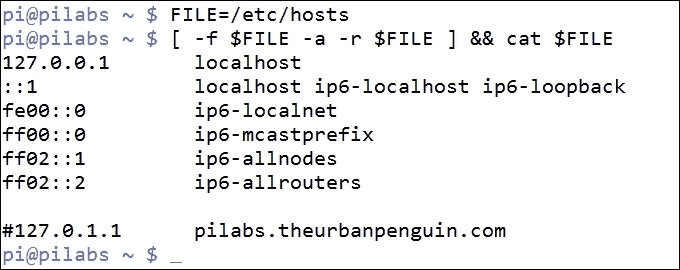
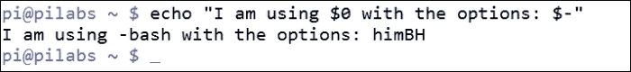
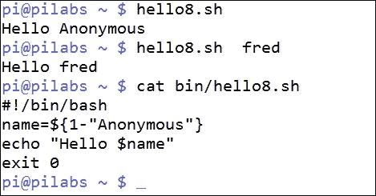
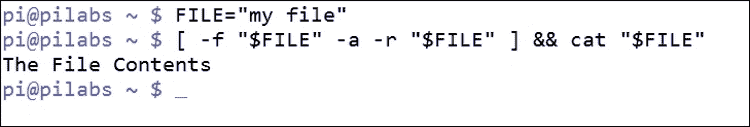
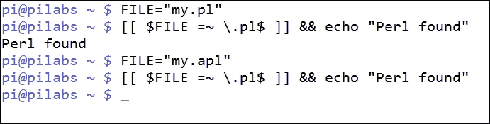
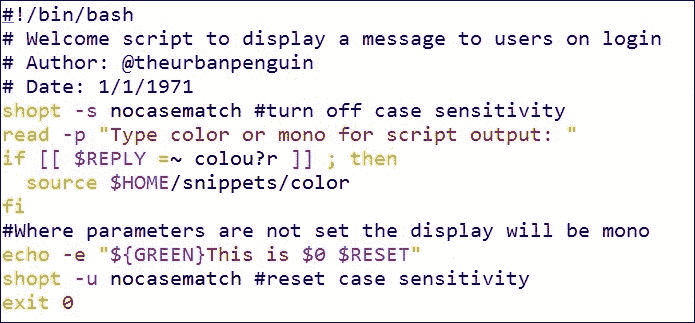
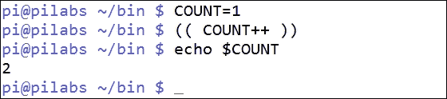
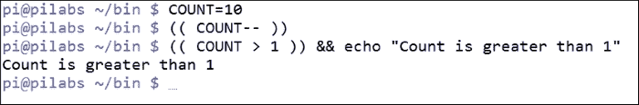

# 第五章：替代语法

在脚本编程的旅程中，我们已经看到我们可以使用`test`命令来确定条件状态。我们进一步发现，我们还可以使用单方括号。在这里，我们将回顾`test`命令，并更详细地查看单方括号。在更多了解方括号之后，我们将进入更高级的变量或参数管理；因此，提供默认值并理解引用问题。

最后，我们将看到在像 bash、korn 和 zsh 这样的高级 shell 中，我们可以使用双括号！利用双圆括号和双方括号可以简化整体语法，并允许使用数学符号的标准化。

在本章中，我们将涵盖以下主题：

+   测试条件

+   提供参数默认值

+   当有疑问时-引用！

+   使用`[[`进行高级测试

+   使用`((`进行高级测试

# 回顾测试

到目前为止，我们已经使用内置的`test`命令来驱动我们的条件语句。使用`test`的其他选项，我们可以查看返回的值来确定文件系统中文件的状态。运行没有任何选项的测试将返回一个错误的输出：

```
$ test

```

## 测试文件

通常，我们可以使用`test`来检查围绕文件的条件。例如，要测试文件是否存在，我们可以使用`-e`选项。以下命令将测试`/etc/hosts`文件的存在：

```
test -e /etc/hosts

```

我们可以再次运行此测试，但这次要检查文件不仅存在，而且是一个常规文件，而不是具有某些特殊目的。特定的文件类型可以是目录、管道、链接等。常规文件的选项是`-f`。

```
$ test -f /etc/hosts

```

## 添加逻辑

如果我们需要在脚本内部打开一个文件，我们将测试该文件既是常规文件，又具有读取权限。为了使用`test`实现这一点，我们还可以包括`-a`选项来将多个条件连接在一起。在以下示例代码中，我们将使用`-r`条件来检查文件是否可读：

```
$ test -f /etc/hosts -a -r /etc/hosts

```

同样，支持使用`-o`来`OR`表达式中的两个条件。

## 以前未见过的方括号

作为`test`命令的替代，我们可以使用单方括号来实现相同的条件测试。重复之前的条件测试并省略命令本身。我们将在以下代码中重写这一点：

```
 $ [ -f /etc/hosts -a -r /etc/hosts ]

```

许多时候，即使作为经验丰富的管理员，我们也习惯于语言元素，并接受它们。我觉得许多 Linux 管理员会惊讶地发现``既是一个 shell 内置命令，又是一个独立的文件。使用`type`命令，我们可以验证这一点：

```
$ type -a [

```

我们可以在以下截图中看到此命令的输出，确认其存在：

![以前未见过的方括号

我们可以看到，在我使用的 Raspbian 发行版中，有内置的`[`命令和`/usr/bin/[`命令。正如我们所见，这两个命令都模仿了`test`命令，但需要一个闭括号。

现在我们对在 bash 和早期的 Bourne shell 中找到的`[`命令有了更多了解，我们现在可以继续添加一些命令行列表语法。除了命令行列表，我们还可以在以下代码示例中看到所需的功能正在工作：

```
$ FILE=/etc/hosts
$ [ -f $FILE -a -r $FILE ] && cat $FILE

```

设置了参数`FILE`变量后，我们可以测试它既是常规文件，又可被用户读取，然后再尝试列出文件内容。这样，脚本就变得更加健壮，而无需复杂的脚本逻辑。我们可以在以下截图中看到代码的使用：



这种缩写方式非常常见，很容易识别。如果缩写不增加可读性，我们应该谨慎使用。我们在编写脚本时的目标应该是编写清晰易懂的代码，避免不必要的快捷方式。

# 提供参数默认值

在 bash 参数中，有命名空间在内存中允许我们访问存储的值。参数有两种类型：

+   变量

+   特殊参数

特殊参数是只读的，并且由 shell 预设。变量由我们自己以及 bash 维护。一般来说，在谈论语法时，bash 会用参数的家族名称来指代变量。

## 变量

变量是一种参数类型。这些可以由系统或我们自己设置。例如，`$USER`是一个由系统设置但可以被我们编写的变量参数。因此，它不是特殊参数的只读要求。

## 特殊参数

特殊参数是第二种参数类型，由 shell 本身管理，并且呈现为只读。我们之前在参数中遇到过这些，比如`$0`，但让我们再看看另一个`$-`。我们可以扩展这些参数以了解它们的用途，使用`echo`命令：

```
$ echo "My shell is $0 and the shell options are: $-"

```

从我添加的注释文本中，我们可以理解`$-`选项代表配置的 shell 选项。这些可以使用`set -o`命令显示，但也可以使用`$-`在程序中读取。

我们可以在以下截图中看到这一点：



这里设置的选项如下：

+   `h`: 这是 hashall，允许使用`PATH`参数找到程序

+   `i`: 这显示这是一个交互式 shell

+   `m`: 这是 monitor 的缩写，允许使用`bg`和`fg`命令将命令放入后台或从后台调出

+   `B`: 这允许大括号扩展或`mkdirdir{1,2}`，我们创建`dir1`和`dir2`

+   `H`: 这允许历史扩展或运行命令，比如`!501`来重复历史中的命令

## 设置默认值

使用`test`命令或括号，我们可以为变量提供默认值，包括命令行参数。拿我们之前使用过的`hello4.sh`脚本来说，如果`name`参数是零字节，我们可以修改它并设置它：

```
#!/bin/bash
name=$1
[ -z $name ] && name="Anonymous"
echo "Hello $name"
exit 0
```

这段代码是功能性的，但我们可以选择如何编写默认值。我们也可以直接为参数分配默认值。考虑以下代码，直接进行默认赋值：

```
name=${1-"Anonymous"}
```

在 bash 中，这被称为**参数替换**，可以用以下伪代码表示：

```
${parameter-default}
```

无论何处，如果一个变量（参数）没有被声明并且具有空值，将使用默认值。如果参数已经被显式声明为空值，我们将使用`:-`语法，如下例所示：

```
parameter=
${parameter:-default}
```

通过现在编辑脚本，我们可以创建`hello8.sh`来利用 bash 参数替换提供默认值：

```
#!/bin/bash
#Use parameter substitution to provide default value
name=${1-"Anonymous"}
echo "Hello $name"
exit 0
```

这个脚本及其输出，无论是否提供了值，都显示在以下的截图中：



`hello8.sh`脚本提供了我们需要的功能，逻辑直接内置到参数赋值中。现在逻辑和赋值是脚本中的一行代码，这是保持脚本简单和可读性的重要一步。

# 当怀疑时 - 引用！

既然已经确定变量是一种参数，我们应该始终记住这一点，特别是在阅读手册和 HOWTO 时。文档经常提到参数，并在这样做时包括变量，以及 bash 特殊参数，如`$1`等。为此，我们将看看为什么在命令行或脚本中使用参数时最好引用这些参数。现在学习这一点可以在以后节省我们很多痛苦和心痛，特别是当我们开始研究循环时。

首先，我们应该用于读取变量值的正确术语是**参数扩展**。对你和我来说，这是读取一个变量，但对 bash 来说这太简单了。正确的命名，比如参数扩展，减少了任何对其含义的歧义，但同时增加了复杂性。在下面的例子中，代码的第一行将`fred`的值分配给`name`参数。代码的第二行使用参数扩展来打印存储在内存中的值。`$`符号用于允许参数的扩展：

```
$ name=fred
$ echo "The value is: $name"

```

在这个例子中，我们使用了双引号来允许`echo`打印单个字符串，因为我们使用了空格。如果不使用引号，echo 可能会将其视为多个参数。空格是大多数 shell（包括 bash）中的默认字段分隔符。通常，当我们没有考虑使用引号时，我们看不到直接的空格。考虑我们之前使用的命令行代码的以下摘录：

```
$ FILE=/etc/hosts
$ [ -f $FILE -a -r $FILE ] && cat $FILE

```

尽管这样可以工作，我们可能有点幸运，特别是如果我们正在从我们自己没有创建的文件列表中填充`FILE`参数。一个文件可能在其名称中包含空格是很有可能的。现在让我们使用不同的文件重新播放这段代码。考虑以下命令：

```
$ FILE="my file"
$ [ -f $FILE -a -r $FILE ] && cat $FILE

```

尽管在结构上代码没有改变，但现在失败了。这是因为我们向``命令提供了太多的参数。即使我们使用`test`命令，失败的结果也是一样的。

尽管我们已经正确引用了文件名分配给参数`FILE`，但在参数扩展时我们`没有`保护空格。我们可以看到代码失败，如下面的截图所示：

![当你犹豫时-引用！

我们可以看到，这对我们的脚本来说还没有准备好。唉，我们曾经认为坚固的东西现在已经支离破碎，就像泰坦尼克号一样，我们的代码已经沉没了。

然而，一个简单的解决方案是恢复引用参数扩展，除非特别不需要。通过对代码进行简单的编辑，我们可以使这艘船不会沉没：

```
$ FILE="my file"
$ [ -f "$FILE" -a -r "$FILE" ] && cat "$FILE"

```

现在我们可以自豪地站在白星航运公司的码头上，因为我们看到泰坦尼克号 II 在以下代码示例中被推出，这在下面的截图中被捕捉到：



这些微小的引号可以产生真正令人惊讶，有时甚至有点难以置信的影响。当扩展变量时，我们绝不能忽视引号。为了确保我们强调这一点，我们可以在另一个更简单的例子中突出这种现象。让我们考虑现在只想删除文件的情况。在第一个例子中，我们不使用引号：

```
$ rm $FILE

```

这段代码将导致失败，因为参数扩展将导致以下感知命令：

```
$ rm my file

```

这段代码将失败，因为它无法找到`my`文件或`file`文件。更糟糕的是，可能我们会意外地删除错误的文件，如果其中任何一个名称被错误地解析。

而引用参数扩展将拯救一切，就像我们在第二个例子中看到的那样：

```
$ rm "$FILE"

```

这被正确地扩展为我们在以下代码示例中说明的期望命令：

```
$ rm "my file"

```

我确实希望这些例子能够说明在扩展参数时需要小心，并且你意识到了其中的陷阱。

# 使用[[进行高级测试

使用双括号`[[条件]]`允许我们进行更高级的条件测试，但与 Bourne Shell 不兼容。双括号首次作为 korn shell 中的定义关键字引入，并且也可用于 bash 和 zsh。与单括号不同，这不是一个命令而是一个关键字。使用 type 命令可以确认这一点：

```
$ type [[

```

## 空格

`[[`不是一个命令在空格方面是重要的。作为关键字，`[[`在 bash 扩展它们之前解析其参数。因此，单个参数将始终表示为单个参数。即使违反最佳实践，`[[`可以减轻参数值中空格相关的一些问题。重新考虑我们之前测试的条件，当使用`[[`时，我们可以省略引号，如下例所示：

```
$ echo "The File Contents">"my file"
$ FILE="my file"
$ [[ -f $FILE && -r $FILE ]] && cat "$FILE"

```

当使用`cat`时，我们仍然需要引用参数，如您所见，我们可以在双括号中使用引号，但它们变得可选。请注意，我们还可以使用更传统的`&&`和`||`来分别表示`-a`和`-o`。

## 其他高级功能

一些额外功能可以包括在双括号中。即使在使用它们时失去了可移植性，也有一些很好的功能可以克服这一损失。请记住，如果我们只使用 bash，那么我们可以使用双括号，但不能在 Bourne Shell 中运行我们的脚本。我们在下面的部分中获得的高级功能包括模式匹配和正则表达式。

### 模式匹配

使用双括号，我们不仅可以匹配字符串，还可以使用模式匹配。例如，我们可能需要专门处理以`.pl`结尾的 Perl 脚本文件。我们可以在条件中轻松实现这一点，包括模式作为匹配，如下例所示：

```
$ [[ $FILE = *.pl ]] &&cp"$FILE" scripts/

```

### 正则表达式

我们不仅可以使用`=~`运算符进行简单的模式匹配，还可以匹配正则表达式。我们可以使用正则表达式重写上一个示例：

```
$ [[ $FILE =~ \.pl$ ]] &&cp "$FILE" scripts/

```

### 提示

由于单个点或句号在正则表达式中具有特殊含义，因此我们需要用`\`进行转义。

以下截图显示了正则表达式匹配与名为`my.pl`和`my.apl`的文件一起工作。匹配正确显示了以`.pl`结尾的文件：



### 正则表达式脚本

不能忽视正则表达式的威力。使用正则表达式进行条件测试的另一个简单演示是公开颜色的美式和英式拼写：color 和 colour。我们可以提示用户是否要为脚本选择彩色或单色输出，同时考虑两种拼写。在脚本中执行此操作的行如下：

```
if [[ $REPLY =~ colou?r ]] ; then

```

正则表达式通过使 u 可选来满足 color 的两种拼写：u?。此外，我们可以通过设置 shell 选项来禁用大小写敏感性，从而允许*COLOR*和 color 的匹配：

```
shopt -s nocasematch

```

此选项可以在脚本末尾使用以下命令再次禁用：

```
shopt -s nocasematch

```

当我们使用我们命名的变量参数`$GREEN`和`$RESET`时，我们会影响输出的颜色。只有在我们引用颜色定义文件时，绿色才会显示。当我们选择单色显示时，选择单色将确保变量参数为空且无效。

完整的脚本显示在以下截图中：



# 使用(( ))进行算术运算

在使用 bash 和其他高级 shell 时，我们可以使用`(( ))`符号来简化脚本中的数学运算。

## 简单的数学

在 bash 中，双括号结构允许进行算术展开。在最简单的格式中，我们可以轻松进行整数运算。这成为了`let`内置的替代品。以下示例展示了使用`let`命令和双括号来实现相同的结果：

```
$ a=(( 2 + 3 ))
$ let a=2+3

```

在这两种情况下，`a`参数都被填充为`2 + 3`的和。

## 参数操作

也许，在脚本编写中对我们更有用的是使用双括号的 C 风格参数操作。我们经常可以使用这个来在循环中递增计数器，并限制循环迭代的次数。考虑以下代码：

```
$ COUNT=1
$ (( COUNT++ ))
echo $COUNT

```

在这个例子中，我们首先将`COUNT`设置为`1`，然后使用`++`运算符对其进行递增。当在最后一行中输出时，参数将具有值`2`。我们可以在以下截图中看到结果：



我们可以通过以下语法来以长格式实现相同的结果：

```
$ COUNT=1
$ (( COUNT=COUNT+1 ))
echo $COUNT

```

当然，这允许对`COUNT`参数进行任何增量，而不仅仅是单个单位的增加。同样地，我们可以使用`--`运算符进行倒数，如下例所示：

```
$ COUNT=10
$ (( COUNT-- ))
echo $COUNT

```

我们从`10`开始，然后在双括号中将值减少`1`。

### 提示

请注意，我们不使用`$`来扩展括号内的参数。它们用于参数操作，因此我们不需要显式地扩展参数。

## 标准算术测试

另一个我们可以从这些双括号中获得的优势是在测试中。我们可以简单地使用`>`而不是使用`-gt`来表示大于。我们可以在以下代码中演示这一点：

```
$(( COUNT > 1 )) && echo "Count is greater than 1"

```

以下截图为您演示了这一点：



正是这种标准化，无论是在 C 风格的操作还是测试中，使双括号对我们如此有用。这种用法既适用于命令行，也适用于脚本。当我们研究循环结构时，我们将广泛使用这个特性。

# 总结

在本章中，我真诚地希望我们为您介绍了许多新颖有趣的选择。这是一个范围广泛的领域，我们从回顾测试的使用开始，发现`[`是一个命令而不是语法结构。它作为一个命令的主要影响在于空格，我们还讨论了引用变量的必要性。

即使我们通常称变量为变量。我们也看到它们的正确名称，特别是在文档中是参数。读取变量是参数展开。理解参数展开可以帮助我们理解关键字`[[`的用法。双方括号不是命令，也不展开参数。这意味着即使变量包含空格，我们也不需要引用变量。此外，我们可以使用双方括号进行高级测试，如模式匹配或正则表达式。

最后，我们看了双括号符号的算术展开和参数操作。它最大的特点是可以轻松地递增和递减计数器。

在下一章中，我们将进入 bash 中的循环结构，并利用本章中学到的一些新技能。
