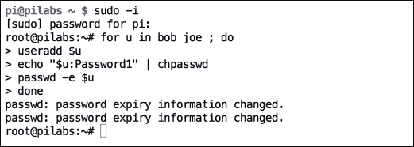
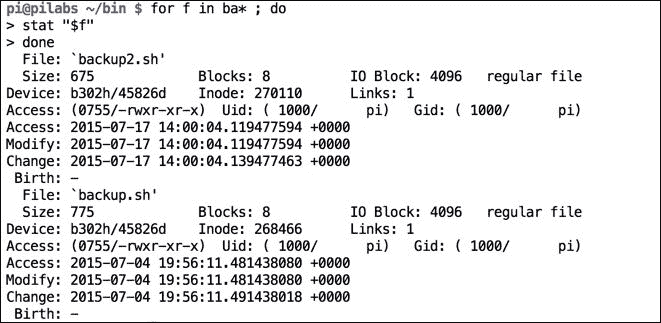
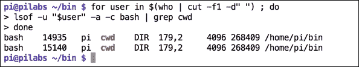
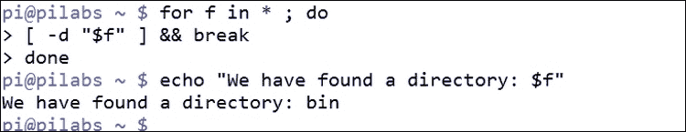
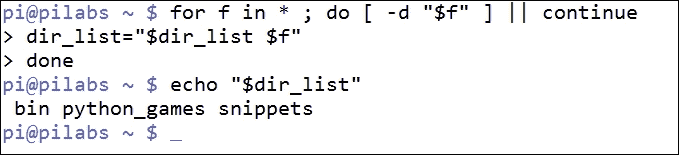
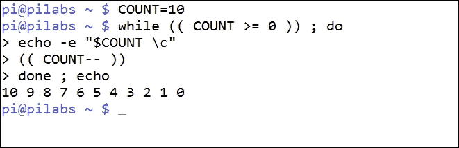
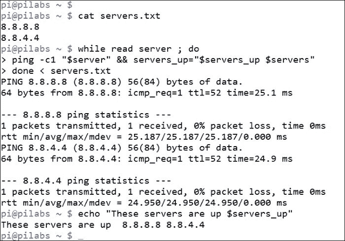
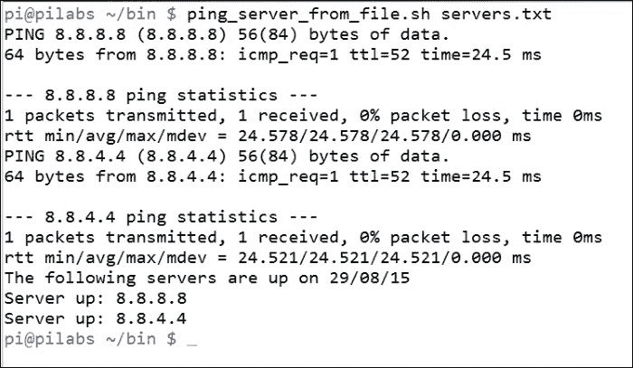
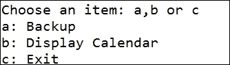
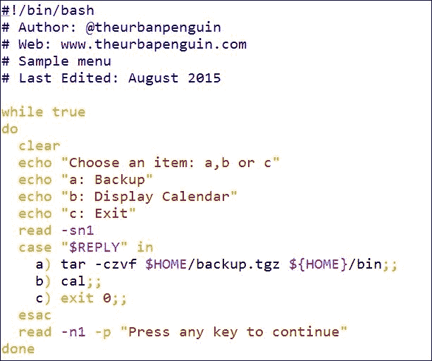

# 第六章：使用循环迭代

记住，脚本是给懒人用的。我们是世界上有更重要事情要做的人，而不是重复一项任务 100 次或更多次；循环是我们的朋友。

循环结构是脚本的生命线。这些循环是可以可靠和一致地重复多次执行相同任务的工作引擎。想象一下，有 10 万行文本在 CSV 文件中，必须检查是否有错误条目。一旦开发完成，脚本可以轻松而准确地完成这项任务，但在人类的情况下，可靠性和准确性将很快失败。

所以让我们看看如何通过在本章中涵盖以下主题来节省时间和理智：

+   for 循环

+   循环控制

+   while 和 until

+   从文件中读取

+   操作菜单

# for 循环

我们所有的循环控制都可以很简单，我们将从`for`循环开始。`for`是 bash 中的关键字，在工作中类似于`if`。我们可以使用命令类型来验证这一点，如下例所示：

```
$ type for
for is a shell keyword

```

作为保留的 shell 关键字，我们可以在脚本中和直接在命令行中使用`for`循环。这样，我们可以在脚本内外利用循环，优化命令行的使用。一个简单的`for`循环如下例所示：

```
# for u in bob joe ; do
useradd $u
echo '$u:Password1' | chpasswd
passwd -e $u
done
```

在`for`循环中，我们从右侧的列表中读取以填充左侧的变量参数，这种情况下我们将从包含`bob`和`joe`的列表中读取，并插入到参数变量`u`中。列表中的每个项目都会逐个插入到变量中。这样，只要列表中有要处理的项目，循环就会执行，直到列表耗尽。

实际上，对我们来说，执行此循环意味着我们将：

+   创建用户`bob`

+   为`bob`设置密码

+   让用户`bob`的密码过期，这样在第一次登录时就需要重置

然后我们循环回去，重复为用户`joe`执行相同的过程。

我们可以在以下截图中查看前面的示例；在通过`sudo -i`获得 root 访问权限后，我们继续运行循环并创建用户：



在`for`循环中读取的列表可以动态或静态生成，如最后一个例子所示。要创建动态列表，我们可以使用各种通配技术来填充列表。例如，要处理目录中的所有文件，我们可以使用`*`，如下例所示：

```
for f in * ; do
stat "$f"
done
```

### 注意

当生成列表时，比如使用文件通配符，我们应该引用变量参数的扩展。如果没有引号，可能会包含一个空格，导致命令失败。这就是我们在`stat`命令中看到的情况。

在以下示例中，我们隔离以`ba*`开头的文件名。然后我们使用`stat`命令打印 inode 元数据。代码和输出如下截图所示：



这个列表也可以从另一个命令的输出或一系列命令的输出中生成。例如，如果我们需要打印所有已登录用户的当前工作目录，我们可以尝试类似以下的操作：

```
$ for user in $(who | cut -f1 -d"") ; do
lsof -u $user -a -c bash | grep cwd
done

```

在前面的例子中，我们可以看到参数名称的选择取决于您；我们不限于单个字符，我们可以在此示例中使用`$user`name。使用小写我们不会覆盖系统变量`$USER`。以下截图演示了循环和随后的输出：



`lsof`命令将列出打开的文件，我们可以依次搜索每个用户打开的文件，并使用`bash`命令作为当前工作目录。

使用我们迄今为止创建的脚本，我们可以创建一个名为`hello9.sh`的新脚本。如果我们将`$HOME/bin/hello2.sh`脚本复制到新脚本中，我们可以编辑它以使用`for`循环：

```
#!/bin/bash
echo "You are using $(basename $0)"
for n in $*
do
    echo "Hello $n"
done
exit 0
```

该循环用于遍历提供的每个命令行参数并分别向每个用户打招呼。当我们执行脚本时，我们可以看到我们现在可以为每个用户显示 hello 消息。这在下面的截图中显示：


尽管我们在这里看到的仍然相对琐碎，但我们现在应该意识到脚本和循环可以做些什么。此脚本的参数可以是我们已经使用过的用户名或其他任何内容。如果我们坚持使用用户名，那么创建用户帐户并设置密码将非常容易，就像我们之前看到的那样。

# 控制循环

进入循环后，我们可能需要提前退出循环，或者可能需要排除某些项目不进行处理。如果我们只想在列表中处理目录，而不是任何类型的文件，那么为了实现这一点，我们有循环控制关键字，如`break`和`continue`。

`break`关键字用于退出循环，不再处理条目，而`continue`关键字用于停止处理当前条目并恢复处理下一个条目。

假设我们只想处理目录，我们可以在循环中实现一个测试，并确定文件类型：

```
$ for f in * ; do
[ -d "$f" ] || continue
chmod 3777 "$f"
done

```

在循环中，我们想要设置包括 SGID 和粘性位的权限，但仅适用于目录。`*`搜索将返回所有文件，循环内的第一条语句将确保我们只处理目录。如果测试是针对当前循环进行的，目标未通过测试并不是一个目录；`continue`关键字将检索下一个循环列表项。如果测试返回 true 并且我们正在处理一个目录，那么我们将处理后续语句并执行`chmod`命令。

如果我们需要运行循环直到找到一个目录，然后退出循环，我们可以调整代码，以便可以遍历每个文件。如果文件是一个目录，那么我们使用`break`关键字退出循环：

```
$ for f in * ; do
[ -d "$f" ] &&break
done
echo "We have found a directory $f"

```

在下面的截图中，我们可以看到我刚刚编写的代码在运行中的情况：



通过使用以下代码，我们可以打印列表中找到的每个目录：

```
for f in * ; do
[ -d "$f" ] || continue
dir_name="$dir_name $f"
done
echo "$dir_name"

```

我们可以通过仅在循环中处理目录项目来实现结果。我们可以使用`if`测试仅处理常规文件。在这个例子中，我们将目录名附加到`dir_name`变量。一旦退出循环，我们打印完整的目录列表。我们可以在下面的截图中看到这一点：



使用这些示例和您自己的想法，您现在应该能够看到如何使用`continue`和`break`关键字控制循环。

## While 循环和 until 循环

使用`for`循环时，我们遍历列表，无论是我们创建的列表还是动态生成的列表。使用`while`或`until`循环时，我们根据条件变为真或假来循环。

`while`循环在条件为真时循环，相反`until`循环在条件为假时循环。以下命令将从 10 倒数到零。循环的每次迭代都打印变量，然后将值减 1：

```
$ COUNT=10
$ while (( COUNT >= 0 )) ; do
echo -e "$COUNT \c"
(( COUNT-- ))
done ; echo

```

我们可以在下面的截图中看到这个命令的输出；从而确认倒计时到零：



### 注意

在这里使用的`\c`转义序列允许抑制`echo`通常使用的换行符。这样，我们可以保持单行输出的倒计时。我想您会同意这是一个不错的效果。

使用`until`循环可以获得此循环的功能；只需要快速重新考虑逻辑，因为我们希望循环直到条件变为真。通常，关于使用哪种循环是个人选择，以及逻辑对您来说哪种循环效果最好。以下示例显示了使用`until`循环编写的循环：

```
$ COUNT=10
$ until (( COUNT < 0 )) ; do
echo -e "$COUNT \c"
(( COUNT-- ))
done ; echo

```

# 从文件中读取输入

现在，看起来这些循环可以做的不仅仅是倒数。我们可能希望从文本文件中读取数据并处理每一行。我们在本书中早些时候看到的 shell 内置`read`命令可以用于逐行读取文件。这样，我们可以使用循环处理文件的每一行。

为了演示其中一些功能，我们将使用一个包含服务器地址的文件。这些可以是主机名或 IP 地址。在下面的示例中，我们将使用 Google DNS 服务器的 IP 地址。以下命令显示了`servers.txt`文件的内容：

```
$cat servers.txt
8.8.8.8
8.8.4.4

```

使用`while`循环的条件中使用`read`命令，我们可以循环读取文件中的行。我们在`done`关键字后直接指定输入文件。对于从文件中读取的每一行，我们可以使用`ping`命令测试服务器是否正常运行，如果服务器响应，我们将其添加到可用服务器列表中。循环结束后，将打印此列表。在下面的示例中，我们可以看到我们开始添加书中涵盖的脚本元素：

```
$ while read server ; do
ping -c1 $server && servers_up="$servers_up $server"
done < servers.txt
echo "The following servers are up: $servers_up"

```

我们可以在以下截图中验证操作：



使用这种循环，我们可以开始构建非常实用的脚本，以处理从命令行或脚本中提供的信息。很容易用`$1`代表传递到脚本中的位置参数来替换我们读取的文件名。让我们返回到`ping_server.sh`脚本，并调整它以接受输入参数。我们可以将脚本复制到新的`$HOME/bin/ping_server_from_file.sh`文件中。在脚本中，我们首先测试输入参数是否为文件。然后，我们创建一个包含日期的标题的输出文件。当我们进入循环时，我们将可用服务器追加到此文件，并在脚本结束时列出文件：

```
#!/bin/bash
# Author: @theurbanpenguin
# Web: www.theurbapenguin.com
# Script to ping servers from file
# Last Edited: August 2015
if [ ! -f"$1 ] ; then
  echo "The input to $0 should be a filename"
  exit 1
fi
echo "The following servers are up on $(date +%x)"> server.out
done
while read server
do
  ping -c1 "$server"&& echo "Server up: $server">> server.out
done
cat server.out
```

现在我们可以以以下方式执行脚本：

```
$ ping_server_from_file.sh servers.txt

```

脚本执行的输出应该类似于以下截图：



# 创建操作员菜单

我们可以为需要从 shell 获取有限功能并且不想学习命令行使用细节的 Linux 操作员提供菜单。我们可以使用他们的登录脚本为他们启动菜单。此菜单将提供要选择的命令选项列表。菜单将循环，直到用户选择退出菜单。我们可以创建一个新的`$HOME/bin/menu.sh`脚本，菜单循环的基础如下：

```
while true
do
……
done
```

我们在这里创建的循环是无限的。`true`命令将始终返回 true 并持续循环；但是，我们可以提供循环控制机制，以允许用户离开菜单。要开始构建菜单的结构，我们需要在循环中输出一些文本，询问用户选择的命令。每次加载菜单之前，我们将清除屏幕，并在所需命令执行后出现额外的读取提示。

这允许用户在清除屏幕并重新加载菜单之前读取命令的输出。此时脚本将如下所示：

```
#!/bin/bash
# Author: @theurbanpenguin
# Web: www.theurbapenguin.com
# Sample menu
# Last Edited: August 2015

while true
do
  clear
  echo "Choose an item: a,b or c"
  echo "a: Backup"
  echo "b: Display Calendar"
  echo "c: Exit"
  read -sn1
  read -n1 -p "Press any key to continue"
done
```

如果在此阶段执行脚本，将没有机制可以离开脚本。我们还没有添加任何代码到菜单选择；但是，您可以使用*Ctrl* + *c*键测试功能并退出。

此时，菜单应该类似于以下截图中显示的输出：



为了构建菜单选择背后的代码，我们将实现一个`case`语句。这将被添加在两个`read`命令之间，如下所示：

```
read -sn1
 case "$REPLY" in
 a) tar -czvf $HOME/backup.tgz ${HOME}/bin;;
 b) cal;;
 c) exit 0;;
 esac
 read -n1 -p "Press any key to continue"

```

我们可以看到我们已经添加到`case`语句中的三个选项，`a`，`b`和`c`：

+   选项 a：这将运行`tar`命令来备份脚本

+   选项 b：这将运行`cal`命令来显示当前月份

+   选项 c：这将退出脚本

为了确保用户在退出其登录脚本时注销，我们将运行：

```
exec menu.sh

```

`exec`命令用于确保在`menu.sh`文件完成后保留 shell。这样，用户永远不需要体验 Linux shell。完整的脚本显示在以下截图中：



# 摘要

在本章中，我们已经开始取得进展。我们已经能够将许多我们以前使用的元素结合成连贯和功能性的脚本。尽管本章的重点是循环，但我们已经使用了命令行列表，`if`语句，`case`语句和算术计算。

我们在本章开头描述循环为我们脚本的工作马，并且我们已经能够用`for`，`while`和`until`循环来证明这一点。`for`循环用于遍历列表的元素。列表可以是静态的或动态的，重点是动态列表，我们展示了如何通过文件通配符或命令扩展简单地创建这些列表。

`while`和`until`循环受条件控制。`while`循环在提供的条件为真时循环。`until`循环将在提供的条件返回真或返回假时循环。`continue`和`break`关键字是特定于循环的，以及`exit`，我们可以控制循环流程。

在下一章中，我们将学习使用函数将脚本模块化。
