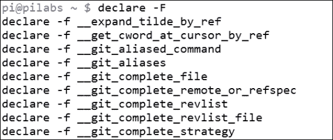
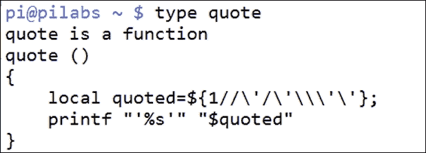
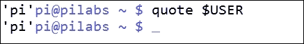
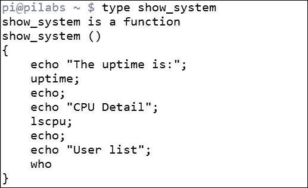
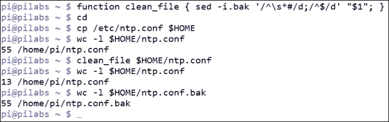
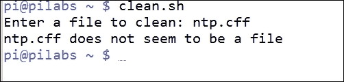
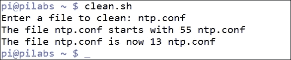
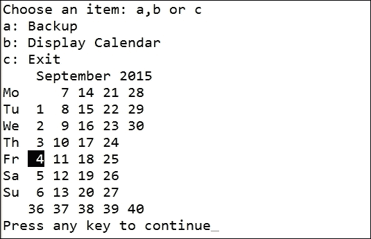

# 第七章。使用函数创建构建块

在本章中，我们将深入了解函数的奇妙世界。我们可以将这些视为创建强大和适应性脚本的模块化构建块。通过创建函数，我们将代码添加到一个单独的构建块中，与脚本的其余部分隔离开来。专注于改进单个函数要比尝试改进整个脚本容易得多。没有函数，很难专注于问题区域，代码经常重复，这意味着需要在许多位置进行更新。函数被命名为代码块或脚本中的脚本，并且它们可以克服与更复杂代码相关的许多问题。

随着我们在本章中的学习，我们将涵盖以下主题：

+   函数

+   向函数传递参数

+   返回值

+   使用函数的菜单

# 介绍函数

函数是作为**命名元素**存在于内存中的代码块。这些元素可以在 shell 环境中创建，也可以在脚本执行中创建。当在命令行上发出命令时，首先检查别名，然后检查匹配的函数名称。要显示驻留在您的 shell 环境中的函数，可以使用以下代码：

```
$ declare -F

```

输出将根据您使用的发行版和创建的函数数量而变化。在我的 Raspbian OS 上，部分输出显示在以下截图中：



使用`-f`选项，您可以显示函数及其相关定义。但是，如果我们只想看到单个函数定义，我们可以使用`type`命令：

```
$ type quote

```

前面的代码示例将显示`quote`函数的代码块，如果它存在于您的 shell 中。我们可以在以下截图中看到此命令的输出：



在 bash 中，`quote`函数会在提供的输入参数周围插入单引号。例如，我们可以展开`USER`变量并将值显示为字符串文字；这在以下截图中显示。截图捕获了命令和输出：



大多数代码都可以用伪代码表示，显示一个示例布局。函数也不例外，创建函数的代码列在以下示例中：

```
function <function-name> {
<code to execute>
}
```

该函数创建时没有`do`和`done`块，就像我们在之前的循环中使用的那样。大括号的目的是定义代码块的边界。

以下是一个简单的函数，用于显示聚合系统信息的代码。这可以在命令行中创建，并将驻留在您的 shell 中。这将不会保留登录信息，并且在关闭 shell 或取消函数设置时将丢失。要使函数持久存在，我们需要将其添加到用户帐户的登录脚本中。示例代码如下：

```
$ function show_system {
echo "The uptime is:"
uptime
echo
echo "CPU Detail"
lscpu
echo
echo "User list"
who
}

```

我们可以使用`type`命令打印函数的详细信息，类似于之前的示例；这在以下截图中显示：



要执行函数，我们只需输入`show_system`，我们将看到静态文本和来自`uptime`、`lscpu`和`who`三个命令的输出。当然，这是一个非常简单的函数，但我们可以通过允许在运行时传递参数来开始添加更多功能。

# 向函数传递参数

在本章的前面，我们将函数称为脚本中的脚本，我们仍将保持这种类比。类似于脚本可以有输入参数，我们可以创建接受参数的函数，使它们的操作不那么静态。在我们开始编写脚本之前，我们可以看一下命令行中一个有用的函数。

### 提示

我最讨厌过度注释的配置文件，尤其是存在文档详细说明可用选项的情况。

GNU Linux 命令`sed`可以轻松地编辑文件并删除注释行和空行。我们在这里引入了流编辑器`sed`，但我们将在下一章节中更详细地讨论它。

进行原地编辑的`sed`命令行将是：

```
$ sed -i.bak '/^\s*#/d;/^$/d' <filename>

```

我们可以通过逐个元素地分解命令行来进行取证。让我们深入研究一下：

+   `sed -i.bak`：这会编辑文件并创建一个带有扩展名`.bak`的备份。原始文件将以`<filename>.bak`的形式可访问。

+   `/^`：以...开头的行，也就是行的第一个字符。

+   `\s*`：这意味着任意数量的空白，包括没有空格或制表符。

+   `#/`：后跟注释。整体上`/^\s*#/`表示我们正在寻找以注释或空格和注释开头的行。

+   `d`：删除匹配行的操作。

+   `; /^$/d`：分号用于分隔表达式，第二个表达式与第一个类似，但这次我们准备删除空行或以行结束标记`$`开头的行。

将此移入函数中，我们只需要考虑一个好名字。我喜欢在函数名中加入动词；这有助于确保唯一性并确定函数的目的。我们将创建`clean_file`函数如下：

```
$ function clean_file {
 sed -i.bak '/^\s*#/d;/^$/d' "$1"
}

```

与脚本中一样，我们使用位置参数来接受命令行参数。我们可以在函数中用`$1`替换之前使用的硬编码文件名。我们将引用这个变量以防止文件名中有空格。为了测试`clean_file`函数，我们将复制一个系统文件并使用副本进行操作。这样，我们可以确保不会对任何系统文件造成伤害。我们向所有读者保证，在编写本书的过程中没有损坏任何系统文件。以下是我们需要遵循的详细步骤，以对新函数进行测试：

1.  按照描述创建`clean_file`函数。

1.  使用`cd`命令而不带参数切换到你的主目录。

1.  将时间配置文件复制到你的主目录：`cp /etc/ntp.conf $HOME`。

1.  使用以下命令计算文件中的行数：`wc -l $HOME/ntp.conf`。

1.  现在，使用以下命令删除注释和空行：`clean_file $HOME/ntp.conf`。

1.  现在，使用`wc -l $HOME/ntp.conf`重新计算行数。

1.  从我们创建的原始备份中：`wc -l $HOME/ntp.conf.bak`。

命令序列如下截图所示：



我们可以使用执行函数时提供的参数将函数的注意力引向所需的文件。如果我们需要保留此函数，那么我们应该将其添加到登录脚本中。但是，如果我们想要在 shell 脚本中测试这个函数，我们可以创建以下文件来做这个练习，并练习我们学到的其他一些元素。我们需要注意，函数应该始终在脚本的开头创建，因为它们需要在被调用时存储在内存中。只需想象你的函数需要在你扣动扳机之前被解锁和加载。

我们将创建一个新的 shell 脚本`$HOME/bin/clean.sh`，并且像往常一样，需要设置执行权限。脚本的代码如下：

```
#!/bin/bash
# Script will prompt for filename
# then remove commented and blank lines

function is_file {
    if [ ! -f "$1" ] ; then
        echo "$1 does not seem to be a file"
        exit 2
    fi
}

function clean_file {
    is_file "$1"
    BEFORE=$(wc -l "$1")
    echo "The file $1 starts with $BEFORE"
    sed -i.bak '/^\s*#/d;/^$/d' "$1"
    AFTER=$(wc -l "$1")
    echo "The file $1 is now $AFTER"
}

read -p "Enter a file to clean: "
clean_file "$REPLY"
exit 1
```

我们在脚本中提供了两个函数。第一个`is_file`只是测试以确保我们输入的文件名是一个普通文件。然后我们声明`clean_file`函数并添加了一些额外的功能，显示操作前后文件的行数。我们还可以看到函数可以被嵌套，并且我们用`clean_file`调用`is_file`函数。

没有函数定义，我们在文件末尾只有三行代码，可以在之前的代码块中看到，并保存为`$HOME/bin/clean.sh`。我们首先提示输入文件名，然后运行`clean_file`函数，该函数又调用`is_file`函数。这里主要是主要代码的简单性。复杂性在函数中，因为每个函数都可以作为一个独立的单元进行处理。

我们现在可以测试脚本的操作，首先使用一个错误的文件名，如下面的截图所示：



现在我们已经看到了对一个不正确的文件的操作，我们可以再试一次，使用一个实际的文件！我们可以使用之前操作过的同一个系统文件。我们需要首先将文件恢复到它们的原始状态：

```
$ cd $HOME
$ rm $HOME/ntp.conf
$ mv ntp.conf.bak ntp.conf

```

文件现在准备好了，我们可以在`$HOME`目录中执行脚本，如下面的截图所示：



# 从函数返回值

每当我们在函数内打印在屏幕上的语句时，我们可以看到它们的结果。然而，很多时候我们希望函数在脚本中填充一个变量而不显示任何内容。在这种情况下，我们在函数中使用`return`。当我们从用户那里获得输入时，这一点尤为重要。我们可能更喜欢将输入转换为已知的情况，以使条件测试更容易。将代码嵌入函数中允许它在脚本中被多次使用。下面的代码显示了我们如何通过创建`to_lower`函数来实现这一点：

```
function to_lower ()
{
    input="$1"
    output=$(tr [A-Z] [a-z] <<<"$input")
return $output
}
```

通过逐步分析代码，我们可以开始理解这个函数的操作：

+   `input="$1"`：这更多是为了方便，我们将第一个输入参数分配给一个命名变量输入。

+   `output=$(tr [A-Z] [a-z] <<< "$input")`：这是函数的主要引擎，其中发生从大写到小写的转换。使用 here string 操作符`<<<`允许我们扩展变量以读取到`tr`程序的内容。这是一种输入重定向形式。

+   `return$output`：这是我们创建返回值的方法。

这个函数的一个用途将在一个读取用户输入并简化测试以查看他们是否选择了`Q`或`q`的脚本中。这可以在以下代码片段中看到：

```
function to_lower ()
{
    input="$1"
    output=$(tr [A-Z] [a-z] <<< "$input")
return $output
}

while true
do
  read -p "Enter c to continue or q to exit: "
  $REPLY=$(to_lower "$REPLY")
  if [ $REPLY = "q" ] ; then
    break
  fi

done
echo "Finished"
```

# 在菜单中使用函数

在上一章，第六章，*使用循环迭代*，我们创建了`menu.sh`文件。菜单是使用函数的很好的目标，因为`case`语句非常简单地维护单行条目，而复杂性仍然可以存储在每个函数中。我们应该考虑为每个菜单项创建一个函数。如果我们将之前的`$HOME/bin/menu.sh`复制到`$HOME/bin/menu2.sh`，我们可以改进功能。新菜单应该如下代码所示：

```
#!/bin/bash
# Author: @theurbanpenguin
# Web: www.theurbapenguin.com
# Sample menu with functions
# Last Edited: Sept 2015

function to_lower {
    input="$1"
    output=$(tr [A-Z] [a-z] <<< "$input")
return $output
}

function do_backup {
    tar -czvf $HOME/backup.tgz ${HOME}/bin
}

function show_cal {
    if [ -x /usr/bin/ncal ] ; then
      command="/usr/bin/ncal -w"
    else
      command="/usr/bin/cal"
    fi
    $command
}

while true
do
  clear
  echo "Choose an item: a, b or c"
  echo "a: Backup"
  echo "b: Display Calendar"
  echo "c: Exit"
  read -sn1
  REPLY=$(to_lower "$REPLY")
  case "$REPLY" in
    a) do_backup;;
    b) show_cal;;
    c) exit 0;;
  esac
  read -n1 -p "Press any key to continue"
done
```

正如我们所看到的，我们仍然保持`case`语句的简单性；然而，我们可以通过函数来增加脚本的复杂性。例如，当选择日历的选项 b 时，我们现在检查`ncal`命令是否可用。如果可用，我们使用`ncal`并使用`-w`选项来打印周数。我们可以在下面的截图中看到这一点，我们选择显示日历并安装`ncal`。



我们也不必担心大写锁定键，因为`to_lower`函数将我们的选择转换为小写。随着时间的推移，很容易向函数中添加额外的元素，因为我们知道只会影响到单个函数。

# 总结

我们在脚本编写方面仍在飞速进步。我希望这些想法能留在你心中，并且你会发现代码示例很有用。函数对于脚本的易维护性和最终功能非常重要。脚本越容易维护，你就越有可能随着时间的推移添加改进。我们可以在命令行或脚本中定义函数，但在使用之前，它们需要被包含在脚本中。

函数本身在脚本运行时加载到内存中，但只要脚本被分叉而不是被源化，它们将在脚本完成后从内存中释放。在本章中，我们已经稍微涉及了`sed`，在下一章中我们将更多地学习如何使用流编辑器（`sed`）。`sed`命令非常强大，我们可以在脚本中充分利用它。
