# 第八章：介绍 sed

在上一章中，我们看到我们可以利用`sed`在脚本中编辑文件。`sed`命令是**流编辑器**，逐行打开文件以搜索或编辑文件内容。从历史上看，这追溯到 Unix，那时系统可能没有足够的 RAM 来打开非常大的文件。使用`sed`绝对是必不可少的。即使在今天，我们仍然会使用`sed`来对包含数百或数千条记录的文件进行更改和显示数据。这比人类尝试做同样的事情更简单、更容易、更可靠。最重要的是，正如我们所见，我们可以在脚本中使用`sed`自动编辑文件，无需人工干预。

我们将首先查看`grep`并搜索文件中的文本。`grep`命令中的`re`是**正则表达式**的缩写。在我们查看`sed`之前，这介绍了 POSIX 兼容正则表达式的强大功能。即使在本章中我们不涉及脚本编写，我们也将介绍一些非常重要的工具，可以在脚本中使用。在下一章中，我们将看到`sed`在脚本中的实际应用。

目前，我们已经排队了足够的内容，我们将在本章中涵盖以下主题：

+   使用`grep`显示文本

+   使用正则表达式

+   理解`sed`的基础知识

# 使用 grep 显示文本

欢迎回来，欢迎来到在命令行中使用正则表达式的强大之处。我们将通过查看`grep`命令来开始这个旅程。这将使我们能够掌握一些简单的搜索文本的概念，然后再转向更复杂的正则表达式和使用`sed`编辑文件。

**全局正则表达式打印**（**grep**），或者我们更常用的称为`grep`命令，是一个用于全局搜索（跨文件中的所有行）并将结果打印到`STDOUT`的命令行工具。搜索字符串是一个正则表达式。

`grep`命令是如此常见的工具，它有许多简单的示例和许多我们每天都可以使用它的场合。在接下来的部分中，我们将包含一些简单而有用的示例，并进行解释。

## 在接口上显示接收到的数据

在这个示例中，我们将仅打印`eth0`接口接收到的数据。

### 注意

这是我在本课程中使用的树莓派的主要网络连接接口。如果您不确定您的接口名称，可以使用`ifconfig -a`命令显示所有接口，并在您的系统上选择正确的接口名称。如果找不到`ifconfig`，请尝试输入完整路径`/sbin/ifconfig`。

仅使用`ifconfig eth0`命令，就可以将大量数据打印到屏幕上。为了仅显示接收到的数据包，我们可以隔离包含`RX packets`（`RX`表示接收）的行。这就是`grep`发挥作用的地方：

```
$ ifconfig eth0 | grep "RX packets"

```

使用管道或竖线，我们可以将`ifconfig`命令的输出发送到`grep`命令的输入。在这种情况下，`grep`正在搜索一个非常简单的正则表达式，即"RX packet"。搜索字符串是区分大小写的，因此我们需要正确地获取这个或者使用`grep`的`-i`选项以不区分大小写地运行搜索，如下例所示：

```
$ ifconfig eth0 | grep -i "rx packets"

```

### 注意

在搜索配置文件选项时，不区分大小写的搜索特别有用，因为配置文件通常是混合大小写的。

我们可以在以下截图中看到初始命令的结果，确认我们已经能够隔离出单行输出，如下所示：

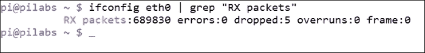

## 显示用户帐户数据

在 Linux 中，本地用户帐户数据库是`/etc/passwd`文件，所有用户帐户都可以读取。如果我们想要搜索包含我们自己数据的行，我们可以在搜索中使用我们自己的登录名，或者使用参数扩展和`$USER`变量。我们可以在以下命令示例中看到这一点：

```
$ grep "$USER" /etc/passwd

```

在这个例子中，`grep`的输入来自`/etc/passwd`文件，并且我们搜索`$USER`变量的值。同样，在这种情况下，它是一个简单的文本，但仍然是正则表达式，只是没有任何操作符。

为了完整起见，我们在下面的屏幕截图中包含了输出：

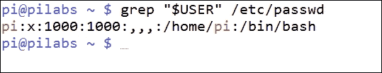

我们可以使用这种类型的查询作为脚本中的条件来扩展一下。我们可以使用这个来检查用户帐户是否存在，然后再尝试创建一个新帐户。为了尽可能简化脚本，并确保不需要管理员权限，创建帐户将仅显示提示和条件测试，如下面的命令行示例所示：

```
$ bash
$ read -p "Enter a user name: "
$ if (grep "$REPLY" /etc/passwd > /dev/null) ; then
>  echo "The user $REPLY exists"
>  exit 1
>fi

```

`grep`搜索现在使用由`read`填充的`$REPLY`变量。如果我输入名称`pi`，将显示一条消息，然后退出，因为我的用户帐户也叫`pi`。没有必要显示`grep`的结果，我们只是在寻找一个返回代码，要么是`true`要么是`false`。为了确保如果用户在文件中，我们不会看到任何不必要的输出，我们将`grep`的输出重定向到特殊设备文件`/dev/null`。

如果要从命令行运行此命令，应首先启动一个新的 bash shell。您只需键入`bash`即可。这样，当`exit`命令运行时，它不会将您注销，而是关闭新打开的 shell。我们可以看到这种情况发生以及在以下图形中指定现有用户时的结果：

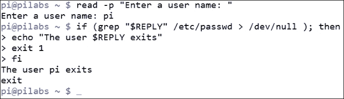

## 列出系统中的 CPU 数量

另一个非常有用的功能是`grep`可以计算匹配的行数并且不显示它们。我们可以使用这个来计算系统上的 CPU 或 CPU 核心的数量。每个核心或 CPU 在`/proc/cpuinfo`文件中都有一个名称。然后我们搜索文本`name`并计算输出；使用的`-c`选项如下例所示：

```
$ grep -c name /proc/cpuinfo

```

我正在使用 Raspberry Pi 2，它有四个核心，如下面的输出所示：

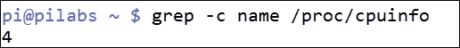

如果我们在具有单个核心的 Raspberry Pi Model B 上使用相同的代码，我们将看到以下输出：

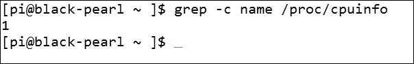

我们可以再次在脚本中使用这个来验证在运行 CPU 密集任务之前是否有足够的核心可用。要从命令行测试这一点，我们可以在只有单个核心的 Raspberry Pi 上执行以下代码：

```
$ bash
$ CPU_CORES=$(grep -c name /proc/cpuinfo)
$ if (( CPU_CORES < 4 )) ; then
> echo "A minimum of 4 cores are required"
> exit 1
> fi

```

我们只在开始时运行 bash，以确保我们不会因为退出命令而退出系统。如果这是在脚本中，这将是不需要的，因为我们将退出脚本而不是我们的 shell 会话。

通过在 Model B 上运行此命令，我们可以看到脚本的结果，还可以看到我们没有所需数量的核心：

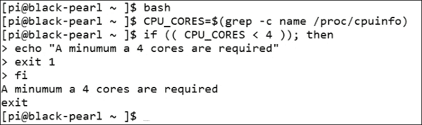

如果您需要在多个脚本中运行此检查，则可以在共享脚本中创建一个函数，并在需要进行检查的脚本中引用包含共享函数的脚本：

```
function check_cores {
 [ -z $1 ] && REQ_CORES=2
CPU_CORES=$(grep -c name /proc/cpuinfo)
if (( CPU_CORES < REQ_CORES  )) ; then
echo "A minimum of $REQ_CORES cores are required"
exit 1
fi
}
```

如果向函数传递了参数，则将其用作所需的核心数；否则，我们将默认值设置为`2`。如果我们在 Model B Raspberry Pi 的 shell 中定义这个作为函数，并使用`type`命令显示详细信息，我们应该会看到如下所示的情况：

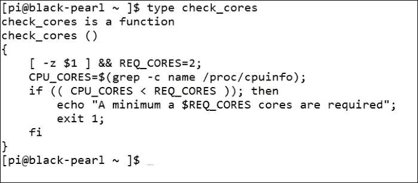

如果我们在单核系统上运行，并且指定了只有单核的要求，我们会看到当我们满足要求时没有输出。如果我们没有指定要求，那么默认为`2`个核心，我们将无法满足要求并退出 shell。

我们可以看到在使用参数`1`运行函数时的输出，然后在没有参数的情况下运行的输出，如下面的屏幕截图所示：


我们可以看到即使是`grep`的基础知识在脚本中也可以非常有用，以及我们可以利用所学知识开始创建可用的模块以添加到我们的脚本中。

## 解析 CSV 文件

我们现在将看一下创建一个解析或格式化 CSV 文件的脚本。文件的格式化将添加新行、制表符和颜色到输出中，以使其更可读。然后我们可以使用`grep`来显示 CSV 文件中的单个项目。这里的实际应用是基于 CSV 文件的目录系统。

### CSV 文件

CSV 文件或逗号分隔值列表将来自我们当前目录中的名为 tools 的文件。这是我们销售产品的目录。文件内容显示如下输出：

```
drill,99,5
hammer,10,50
brush,5,100
lamp,25,30
screwdriver,5,23
table-saw,1099,3
```

这只是一个简单的演示，所以我们不希望有太多数据，但目录中的每个项目都包括以下内容：

+   名称

+   价格

+   库存单位

我们可以看到我们有一把钻头，售价为 99 美元，我们有五个单位库存。如果我们使用`cat`列出文件，它并不友好；但是我们可以编写一个脚本以更吸引人的方式显示数据。我们可以创建一个名为`$HOME/bin/parsecsv.sh`的新脚本：

```
#!/bin/bash
OLDIFS="$IFS"
IFS=","
while read product price quantity
do
echo -e "\0331;33m$product \
        ========================\033[0m\n\
Price : \t $price \n\
Quantity : \t $quantity \n"

done <"$1"
IFS=$OLDIFS
```

让我们逐步进行这个文件，并查看相关的步骤：

| 元素 | 含义 |
| --- | --- |
| `OLDIFS="$IFS"` | `IFS`变量存储文件分隔符，通常是空格。我们可以存储旧的`IFS`，以便在脚本结束时恢复它。确保一旦脚本完成，无论脚本如何运行，都能返回相同的环境。 |
| 我们将分隔符设置为逗号，以匹配 CSV 文件的需要。 |
| `while read product price quantity` | 我们进入一个`while`循环以填充我们需要的三个变量：产品、价格和数量。`while`循环将逐行读取输入文件，并填充每个变量。 |
| `echo …` | `echo`命令以蓝色显示产品名称，并在其下方显示双下划线。其他变量将打印在新行上并进行制表。 |
| `done <"$1"` | 这是我们读取输入文件的地方，我们将其作为脚本的参数传递。 |

该脚本显示在以下截图中：

![CSV 文件我们可以使用以下命令在当前目录中执行工具目录文件的脚本：```$ parsecsv.sh tools```为了查看这将如何显示，我们可以查看以下截图的部分输出：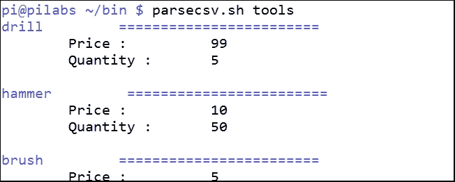

我们现在开始意识到我们在命令行上有很大的能力以更可读的方式格式化文件，而纯文本文件不需要是单调的。

### 隔离目录条目

如果我们需要搜索一个条目，那么我们需要不止一行。该条目占据了三行。因此，如果我们搜索锤子，我们需要转到锤子行和其后的两行。我们可以使用`grep`的`-A`选项来做到这一点。我们需要显示匹配的行和之后的两行。这将由以下代码表示：

```
$ parsecsv.sh tool | grep -A2 hammer

```

这在以下截图中显示：

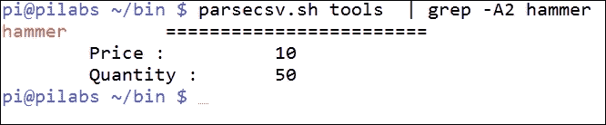

# 使用正则表达式

到目前为止，我们一直将**正则表达式**（**RE**）用于简单的文本，但当然还有很多东西可以从中学到。尽管人们经常认为正则表达式看起来像是在蝙蝠侠打斗中可能看到的漫画书亵渎语，但它们确实有强大的含义。

## 使用替代拼写

首先，让我们看一下拼写上的一些异常。单词"color"可能会根据我们使用的是英式英语还是美式英语而拼写为"colour"或"color"。这可能会导致搜索"color"这个词时出现问题，因为它可能以两种方式拼写。实施以下命令将仅返回包含单词"color"的第一行，而不是第二行：

```
$ echo -e "color\ncolour" | grep color

```

如果我们需要返回两种拼写，那么我们可以使用一个`RE`运算符。我们将使用`?`运算符。您应该知道，在`RE`中，`?`运算符与 shell 中的不同。在`RE`中，`?`运算符表示前一个字符是可选的。当运行带有额外运算符的`RE`时，我们可能需要运行`grep -E`或`egrep`以获得增强的 RE 引擎：

```
$ echo -e "color\ncolour" | grep -E 'colou?r'

```

我们可以通过快速查看以下截图来看到这一点：

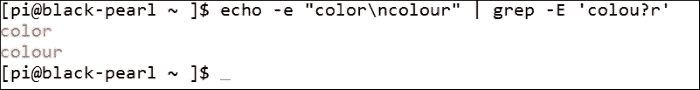

## 有多少单词有四个连续的元音字母？

这位女士们先生们，这就是为什么 RE 如此重要，值得坚持。我们还可以想一些有趣的游戏或填字游戏求解器。我们对 RE 玩得越开心，使用起来就越容易。许多 Linux 系统包括一个位于`/usr/share/dict/words`的字典文件，如果您的系统上存在这个文件，我们将使用它。

你能想到有四个连续元音字母的单词有多少？不确定的话，那就让我们用`grep`和 RE 来搜索文件：

```
$ grep -E '[aeiou]{5}' /usr/share/dict/words

```

首先，您可以看到我们使用了方括号。这与 shell 中的含义相同，并且`OR`分组字符，作为列表。结果搜索是字母`a`或`e`或`i`或`o`或`u`。在括号末尾添加大括号启用了乘法器。在大括号中只有数字`4`表示我们正在寻找四个连续的元音字母。

我们可以在以下截图中看到这一点：

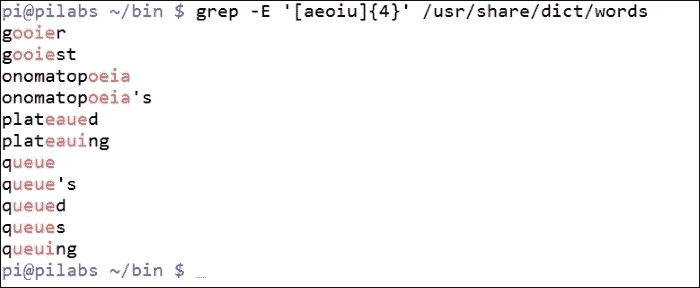

这有多酷？现在我们永远不会有未完成的填字游戏了，也没有借口在 Scrabble 上输了。

## RE 锚点

当使用`clean_file`函数删除注释行和空行时，我们已经使用了 RE 锚点。`^`或插入符号代表行的开头，`$`代表行的结尾。如果我们想列出从字典文件开始的以`ante`开头的单词，我们将编写以下查询：

```
$ grep '^ante' /usr/share/dict/words

```

结果应该显示 anteater，antelope，antenna 等。如果我们想查询以`cord`结尾的单词，我们将使用：

```
$ grep 'cord$' /usr/share/dict/words

```

这将打印少量内容，并在我的系统上列出单词 accord，concord，cord，discord 和 record。

因此，即使这只是介绍了正则表达式的一小部分，我们也应该欣赏到我们可以从仅知道这么一点点中获得的东西。

# 理解 sed 的基础知识

在建立了一点基础之后，我们现在可以开始查看`sed`的一些操作。这些命令将在大多数 Linux 系统中提供，并且是核心命令。

我们将直接深入一些简单的例子：

```
$ sed 'p' /etc/passwd

```

`p`运算符将打印匹配的模式。在这种情况下，我们没有指定模式，所以我们将匹配所有内容。在不抑制`STDOUT`的情况下打印匹配的行将重复行。这个操作的结果是将`passwd`文件中的所有行都打印两次。要抑制`STDOUT`，我们使用`-n`选项：

```
$ sed -n 'p' /etc/passwd

```

太棒了！我们刚刚重新发明了`cat`命令。现在我们可以专门处理一系列行：

```
$ sed -n '1,3 p ' /etc/passwd

```

现在我们已经重新发明了`head`命令，但我们也可以在 RE 中指定范围来重新创建`grep`命令：

```
$ sed -n '/^root/ p' /etc/passwd

```

我们可以在以下截图中看到这一点：

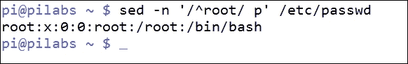

## 替换命令

我们已经看到了用于打印模式空间的`p`命令。现在我们将看一下替换命令或`s`。通过这个命令，我们可以用另一个字符串替换一个字符串。同样，默认情况下，我们将输出发送到`STDOUT`，并且不编辑文件。

要替换用户`pi`的默认 shell，我们可以使用以下命令：

```
sed -n ' /^pi/ s/bash/sh/p ' /etc/passwd

```

我们继续使用`p`命令来打印匹配的模式，并使用`-n`选项来抑制`STDOUT`。我们搜索以`pi`开头的行。这代表用户名。然后我们使用`s`命令来替换这些匹配的行中的文本。这需要两个参数，第一个是要搜索的文本，第二个代表用于替换原始文本的文本。在这种情况下，我们搜索`bash`并将其替换为`sh`。这很简单，确实有效，但从长远来看可能不太可靠。我们可以在下面的截图中看到输出：

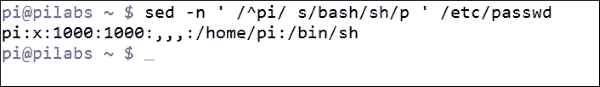

我们必须强调，目前我们并没有编辑文件，只是将其显示在屏幕上。原始的`passwd`文件保持不变，我们可以以标准用户身份运行这个命令。我在前面的例子中提到，搜索可能不太可靠，因为我们要搜索的字符串是`bash`。这个字符串非常短，也许它可以在匹配的行中的其他地方被包含。可能某人的姓氏是"Tabash"，其中包含字符串`bash`。我们可以扩展搜索以查找`/bin/bash`并将其替换为`/bin/sh`。然而，这引入了另一个问题，即默认分隔符是斜杠，所以我们必须转义我们在搜索和替换字符串中使用的每个斜杠，即：

```
sed -n ' /^pi/ s/\/bin\/bash/\/usr\/bin\/sh/p ' /etc/passwd

```

这是一个选择，但不是一个整洁的选择。更好的解决方案是知道我们使用的第一个分隔符定义了分隔符。换句话说，您可以使用任何字符作为分隔符。在这种情况下，使用`@`符号可能是一个好主意，因为它既不出现在搜索字符串中，也不出现在替换字符串中：

```
sed -n ' /^pi/ s@/bin/bash@/usr/bin/sh@p ' /etc/passwd

```

现在我们有了一个更可靠的搜索和可读的命令行，这总是一件好事。我们只替换每行的第一个出现的`/bin/bash`为`/bin/sh`。如果我们需要替换不止第一个出现，我们在最后加上`g`命令以进行全局替换：

```
sed -n ' /^pi/ s@bash@sh@pg ' /etc/passwd

```

在我们的情况下，这并不是必需的，但了解这一点是很好的。

## 编辑文件

如果我们想要编辑文件，我们可以使用`-i`选项。我们需要有权限来处理文件，但我们可以复制文件以便处理，这样就不会损害任何系统文件或需要额外的访问权限。

我们可以将`passwd`文件复制到本地：

```
$ cp /etc/passwd "$HOME"
$ cd

```

我们用`cd`命令结束，以确保我们在家目录和本地`passwd`文件中工作。

`-i`选项用于进行原地更新。在编辑文件时，我们将不需要`-n`选项或`p`命令。因此，命令就像下面的例子一样简单：

```
$ sed -i ' /^pi/ s@/bin/bash@/bin/sh/ ' $HOME/passwd

```

命令不会有任何输出，但文件现在将反映出更改。下面的截图显示了命令的使用：


在进行更改之前，我们应该备份文件，直接在`-i`选项后附加一个字符串，不加任何空格。这在下面的例子中显示：

```
$ sed -i.bak ' /^pi/ s@/bin/bash@/bin/sh/ ' $HOME/passwd

```

如果我们想要查看这个，我们可以反转搜索和替换字符串：

```
$ sed -i.bak ' /^pi/ s@/bin/sh@/bin/bash/ ' $HOME/passwd

```

这将使本地的`passwd`文件与之前一样，并且我们将有一个`passwd.bak`，其中包含之前的一系列更改。这样如果需要，我们就有了一个回滚选项，可以确保安全。

# 总结

这是另一个你牢牢掌握的伟大章节，我希望这对你真的很有用。虽然我们想集中使用`sed`，但我们从`grep`的强大之处开始，无论是在脚本内部还是外部。这使我们在查看`sed`的可能性之前先了解了正则表达式。虽然我们只是初步接触了`sed`，但我们将在下一章中开始扩展这一点，我们将扩展我们所学到的知识。这将以从当前配置中提取注释数据开始，取消注释并将其写入模板的形式进行。然后我们可以使用模板来创建新的虚拟主机。所有这些操作的工作马是`sed`和`sed`脚本。
