# 第九章：自动化 Apache 虚拟主机

现在我们已经了解了一些流编辑器`sed`，我们可以将这些知识付诸实践。在第八章中，*介绍 sed*，我们已经习惯了`sed`的一些功能；然而，这只是编辑器中所包含的一小部分功能。在本章中，我们将更多地使用`sed`，并且在使用我们的 bash 脚本时，暴露自己于工具的一些实际用途。

在这个过程中，我们将使用`sed`来帮助我们自动创建基于名称的 Apache 虚拟主机。Apache 主机是我们演示的`sed`的实际用户，但更重要的是，我们将使用`sed`来搜索主配置中的选定行。然后我们将取消注释这些行并将它们保存为模板。创建了模板后，我们将从中创建新的配置。我们在 Apache 中演示的概念可以应用于许多不同的情况。

我们将发现，在我们的 shell 脚本中使用`sed`将允许我们轻松地从主配置中提取模板数据，并根据虚拟主机的需要进行调整。通过这种方式，我们将能够扩展对`sed`和 shell 脚本的知识。在本章中，我们将涵盖以下主题：

+   Apache HTTPD 虚拟主机

+   提取模板信息

+   自动创建主机

+   在主机创建过程中提示

# 基于名称的 Apache 虚拟主机

为了演示，我们将使用从 CentOS 6.6 主机中获取的 Apache 2.2 HTTPD 服务器的`httpd.conf`文件。坦率地说，我们对配置文件更感兴趣，因为 Red Hat 或 CentOS 提供它，而不是我们将进行的实际配置更改。我们的目的是学习如何从系统提供的文件中提取数据并创建模板。我们可以将此应用于 Apache 配置文件或任何其他文本数据文件。这是方法论，我们不关注实际结果。

为了对我们要做的事情有一些了解，我们必须首先查看随 Enterprise Linux 6 一起提供的`/etc/httpd/conf/httpd.conf`文件，即 CentOS、Red Hat Enterprise Linux 或 Scientific Linux。以下截图显示了我们感兴趣的文件的虚拟主机部分。

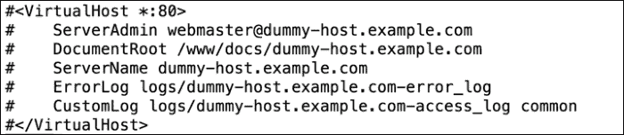

看着这些行，我们可以看到它们被注释了，这都是一个单一的`httpd.conf`的一部分。在创建虚拟主机时，我们通常更喜欢为每个潜在的虚拟主机单独配置。我们需要能够从主文件中提取这些数据，并同时取消注释。然后我们可以将这些取消注释的数据保存为模板。

使用这个模板，我们将创建新的配置文件，代表我们需要在一个 Apache 实例上运行的不同命名的`hosts`。这使我们能够在单个服务器上托管`sales.example.com`和`marketing.example.com`。销售和营销将拥有各自独立的配置和网站。此外，使用我们创建的模板也很容易添加我们需要的其他站点。主要的 Web 服务器的任务是读取传入的 HTTP 头请求，并根据使用的域名将其定向到正确的站点。

我们的第一个任务是提取在开放和关闭`VirtualHost`标签之间的数据，取消注释并保存到模板中。这只需要做一次，不会成为创建虚拟主机的主要脚本的一部分。

## 创建虚拟主机模板

由于我们不打算测试我们创建的虚拟主机，我们将复制`httpd.conf`文件并在本地家目录中使用。在开发脚本时，这是一个很好的做法，以免影响工作配置。我正在使用的`httpd.conf`文件应该能够从发布者引用的其他脚本资源中下载。或者，您可以从安装了 Apache 的企业 Linux 6 主机上复制它。确保将`httpd.conf`文件复制到您的家目录，并且您正在家目录中工作。

## 第一步

创建模板的第一步是隔离我们需要的行。在我们的情况下，这将是在之前的屏幕截图中看到的示例虚拟主机定义中包括的行。这包括`VirtualHost`的开放和关闭标签以及中间的所有内容。我们可以使用行号来实现这一点；但是，这可能不太可靠，因为我们需要假设文件中的内容没有发生变化，行号才能保持一致。为了完整起见，我们将在转向更可靠的机制之前展示这一点。

首先，我们将回顾一下如何使用`sed`打印整个文件。这很重要，因为在下一步中，我们将过滤显示并仅显示我们想要的行：

```
$ sed -n ' p ' httpd.conf

```

使用`-n`选项来抑制标准输出，引号内的`sed`命令是`p`，用于显示模式匹配。由于我们在这里没有过滤任何内容，匹配的模式就是整个文件。如果我们要使用行号进行过滤，可以使用`sed`轻松添加行号，如下命令所示：

```
$ sed = httpd.conf

```

从以下屏幕截图中，我们可以看到在这个系统中，我们需要处理的行是从`1003`到`1009`；但是，我再次强调，这些数字可能会因文件而异：

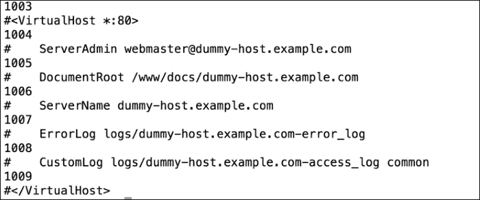

## 隔离行

要显示这些带有标签的行，我们可以在`sed`中添加一个数字范围。通过将这些数字添加到`sed`中，可以轻松实现这一点，如下命令所示：

```
$ sed -n '1003,1009 p ' httpd.conf

```

通过指定行范围，我们已经成功地隔离了我们需要的行，现在显示的只有虚拟主机定义的行。我们可以在以下屏幕截图中看到这一点，其中显示了命令和输出：

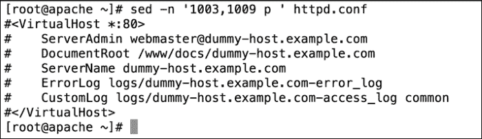

在硬编码行号时面临的问题是我们失去了灵活性。这些行号与这个文件相关，可能只与这个文件相关。我们将始终需要检查与我们正在处理的文件相关的文件中的正确行号。如果行不方便地位于文件的末尾，我们将不得不向后滚动以尝试找到正确的行号。为了克服这些问题，我们可以实现对开放和关闭标签的直接搜索，而不是使用行号。

```
$ sed -n '/^#<VirtualHost/,/^#<\/VirtualHost/p' httpd.conf

```

我们不再使用起始号码和结束号码，而是更可靠的起始正则表达式和结束正则表达式。开头的正则表达式寻找以`#<VirtualHost`开头的行。结束的正则表达式正在寻找关闭标签。但是，我们需要用转义字符保护`/VirtualHost`。通过查看结束的正则表达式，我们看到它转换为以`#\/VirtualHost`开头的行，带有转义的斜杠。

### 注意

如果您还记得第八章中的内容，*介绍 sed*，我们可以使用插入符(`^`)指定以指定字符开头的行。

通过查看以下屏幕截图，我们现在可以更可靠地隔离所需的行，而无需知道行号。这在编辑过的文件中更可取，这些文件的行号会有所不同：

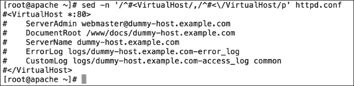

## sed 脚本文件

隔离行只是第一步！我们仍然需要取消注释这些行，然后将结果保存为模板。虽然我们可以将其写成一个单独的`sed`命令字符串，但我们已经看到它会非常冗长，难以阅读和编辑。幸运的是，`sed`命令确实有从输入文件（通常称为脚本）读取命令的选项。我们使用`-f`选项与`sed`一起指定要读取的文件作为我们的控制。有关`sed`的所有选项的更多详细信息，请参阅主页。

我们已经看到我们可以正确地从文件中隔离出正确的行。因此，脚本的第一行配置了我们要处理的行。我们使用大括号`{}`来定义所选行后面的代码块。代码块是我们想要在给定选择上运行的一个或多个命令。

在我们的情况下，第一个命令将是删除注释，第二个命令将是将模式空间写入新文件。`sed`脚本应该如下例所示：

```
/^#<VirtualHost/,/^#<\/VirtualHost/ {
s/^#//
wtemplate.txt
}
```

我们可以将此文件保存为`$HOME/vh.sed`。

在第一行，我们选择要处理的行，就像我们之前看到的那样，然后用左大括号打开代码块。在第 2 行，我们使用替换命令`s`。这将查找以注释或`#`开头的行。我们用空字符串替换注释。中间和结束的斜杠之间没有字符或空格。用英语来说，我们是在取消注释该行，但对于代码来说，这是用空字符串替换`#`。代码的最后一行使用`write`命令`w`将其保存到`template.txt`。为了帮助您看到这一点，我们已经包含了`vh.sed`文件的以下截图：

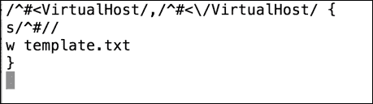

现在我们可以看到我们所有的努力都得到了成果，只要确保我们在执行以下命令的`httpd.conf`和`vh.sed`文件所在的同一目录中：

```
$ sed -nf vh.sed httpd.conf

```

我们现在已经在我们的工作目录中创建了`template.txt`文件。这是从`httpd.conf`文件中隔离出的取消注释文本。简单来说，我们从数千行文本中提取了七行正确的文本，删除了注释，并将结果保存为新文件。`template.txt`文件显示在以下截图中：

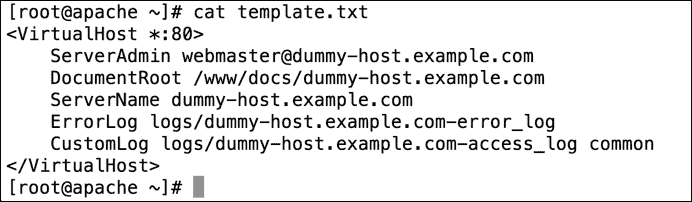

现在，我们有一个模板文件，可以开始使用它来创建虚拟主机定义。即使我们一直在看 Apache，取消注释文本或删除所选行的第一个字符的相同想法也可以适用于许多情况，因此将其视为`sed`可以做什么的一个想法。

# 自动创建虚拟主机

创建了模板之后，我们现在可以使用它来创建虚拟主机配置。简单来说，我们需要将`dummy-host.example.com` URL 替换为`sales.example.com`或`marketing.example.com` URL。当然，我们还需要创建`DocumentRoot`目录，这是网页所在的目录，并添加一些基本内容。当我们使用脚本运行整个过程时，不会遗漏任何内容，每次编辑都将准确无误。脚本的基本内容如下：

```
#!/bin/bash
WEBDIR=/www/docs
CONFDIR=/etc/httpd/conf.d
TEMPLATE=$HOME/template.txt
[ -d $CONFDIR ] || mkdir -p $CONFDIR
sed s/dummy-host.example.com/$1/ $TEMPLATE > $CONFDIR/$1.conf
mkdir -p $WEBDIR/$1
echo "New site for $1" > $WEBDIR/$1/index.html
```

如果我们忽略第一行的 shebang，我们现在应该知道了。我们可以从脚本的第 2 行开始解释：

| 行 | 意思 |
| --- | --- |
| `WEBDIR=/www/docs/` | 我们初始化`WEDIR`变量，将其存储在将容纳不同网站的目录的路径中。 |
| `CONFDIR=/etc/httpd/conf.d` | 我们初始化`CONFDIR`变量，用于存储新创建的虚拟主机配置文件。 |
| `TEMPLATE=$HOME/template.txt` | 我们初始化将用于模板的变量。这应该指向您的模板路径。 |
| `[ -d $CONFDIR ] &#124;&#124; mkdir -p "$CONFDIR"` | 在一个工作的 EL6 主机上，这个目录将存在并包含在主配置中。如果我们将其作为纯测试运行，那么我们可以创建一个目录来证明我们可以在目标目录中创建正确的配置。 |
| `sed s/dummy-host.example.com/$1/ $TEMPLATE >$CONFDIR/$1.conf` | `sed`命令作为脚本中运行搜索和替换操作的引擎。使用`sed`中的替换命令，我们搜索虚拟文本并用传递给脚本的参数替换它。 |
| `mkdir -p $WEBDIR/$1` | 在这里，我们创建正确的子目录来存放新虚拟主机的网站。 |
| `echo "New site for $1" > $WEBDIR/$1/index.html` | 在最后一步中，我们为网站创建一个基本的临时页面。 |

我们可以将此脚本创建为`$HOME/bin/vhost.sh`。如下截图所示。不要忘记添加执行权限：

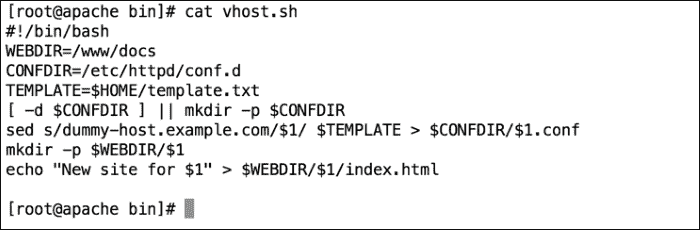

要创建销售虚拟主机和网页，我们可以按照以下示例运行脚本。我们将直接以 root 用户身份运行脚本。或者，您也可以选择在脚本中使用`sudo`命令：

```
# vhost.sh sales.example.com

```

现在我们可以看到，使用精心制作的脚本可以轻松创建虚拟主机。虚拟主机的配置文件将在`/etc/httpd/conf.d/`目录中创建，并命名为`sales.example.com.conf`。该文件将类似于以下截图：

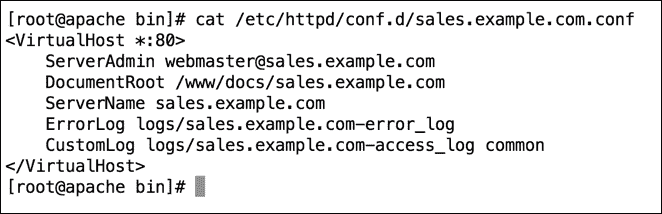

网站内容必须已经创建在`/www/docs/sales.example.com`目录中。这将是一个简单的临时页面，证明我们可以从脚本中做到这一点。使用以下命令，我们可以列出用于存放每个站点的内容或基本目录：

```
$ ls -R /www/docs

```

`-R`选项允许递归列出。我们纯粹使用`/www/docs`目录，因为这是我们提取的原始虚拟主机定义中设置的。如果在实际环境中工作，您可能更喜欢使用`/var/www`或类似的内容，而不是在文件系统根目录创建新目录。编辑我们创建的模板将是一件简单的事情，也可以在模板创建时使用`sed`完成。

## 在站点创建过程中提示数据

现在我们可以使用脚本来创建虚拟主机和内容，但除了虚拟主机名称之外，我们还没有允许任何定制。当然，这很重要。毕竟，正是这个虚拟主机名称在配置本身以及设置网站目录和配置文件名中使用。

我们可以允许在虚拟主机创建过程中指定附加选项。我们将使用`sed`根据需要插入数据。`sed`命令`i`用于在选择之前插入数据，`a`用于在选择之后追加数据。

在我们的示例中，我们将添加主机限制，只允许本地网络访问网站。我们更感兴趣的是将数据插入文件中，而不是我们在特定 HTTP 配置文件中所做的事情。在脚本中，我们将添加`read`提示，并在配置中插入`Directory`块。

为了尝试解释我们要做的事情，当执行脚本时，我们应该看到类似于以下内容。您可以从我们为营销站点创建的文本中看到这一点，并添加对谁可以访问站点的限制：

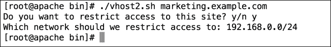

正如您所看到的，我们可以提出两个问题，但如果需要，可以添加更多问题以支持定制；其想法是，额外的定制应该像脚本创建一样准确可靠。您还可以选择用示例答案详细说明问题，以便用户知道网络地址应该如何格式化。

为了帮助脚本创建，我们将原始的`vhost.sh`复制到`vhost2.sh`。我们可以整理脚本中的一些项目，以便更容易扩展，然后添加额外的提示。新脚本将类似于以下代码：

```
#!/bin/bash
WEBDIR=/www/docs/$1
CONFDIR=/etc/httpd/conf.d
CONFFILE=$CONFDIR/$1.conf
TEMPLATE=$HOME/template.txt
[ -d $CONFDIR ] || mkdir -p $CONFDIR 
sed s/dummy-host.example.com/$1/ $TEMPLATE > $CONFFILE
mkdir -p $WEBDIR
echo "New site for $1" > $WEBDIR/index.html
read -p "Do you want to restrict access to this site? y/n "
[ $REPLY = 'n' ] && exit 0
read -p "Which network should we restrict access to: " NETWORK
sed -i "/<\/VirtualHost>/i <Directory $WEBDIR >\
  \n  Order allow,deny\
  \n  Allow from 127.0.0.1\
  \n  Allow from $NETWORK\
\n</Directory>" $CONFFILE
```

### 注意

请注意，我们在脚本中没有运行太多检查。这是为了让我们专注于添加的元素而不是一个健壮的脚本。在您自己的环境中，一旦脚本按您希望的方式工作，您可能需要实施更多的检查以确保脚本的可靠性。

正如您所看到的，我们有更多的行。`WEBDIR`变量已经调整为包含目录的完整路径，类似地，我们添加了一个新变量`CONFFILE`，以便我们可以直接引用文件。如果对第一个提示的答案是`n`，并且用户不需要额外的定制，脚本将退出。如果他们对“否”回答任何其他答案，脚本将继续并提示网络授予访问权限。然后我们可以使用`sed`来编辑现有配置并插入新的目录块。这将默认拒绝访问，但允许`localhost`和`NETWORK`变量。我们在代码中将`localhost`称为`127.0.0.1`。

为了简化代码以便更好地理解，伪代码将如下例所示：

```
$ sed -i "/SearchText/i NewText <filename>

```

其中`SearchText`代表我们要在其前插入文本的文件中的行。此外，`NewText`代表将在`SearchText`之前添加的新行或多行。直接跟在`SearchText`后面的`i`命令表示我们正在插入文本。使用`a`命令进行追加意味着我们添加的文本将在`SearchText`之后添加。

我们可以看到`marketing.example.com`的结果配置文件，因为我们已经创建了它，并在以下截图中添加了额外的**Directory**块：

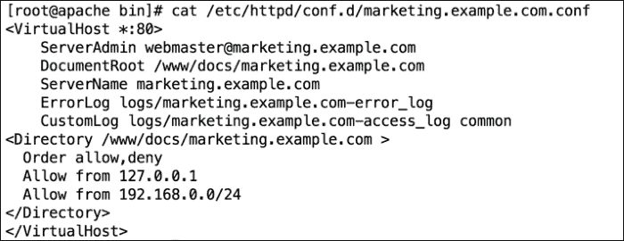

我们可以看到我们已经在关闭的`VirtualHost`标签上方添加了新块。在脚本中，这是我们使用的`SearchText`。我们添加的**Directory**块替换了伪代码中的`NewText`。当我们看它时，它看起来更复杂，因为我们使用`\n`嵌入了新行，并使用行继续字符`\`格式化文件以便更容易阅读。再次强调，一旦脚本创建完成，这种编辑是容易和准确的。

为了完整起见，我们在以下截图中包括了脚本`vhost2.sh`的截图：

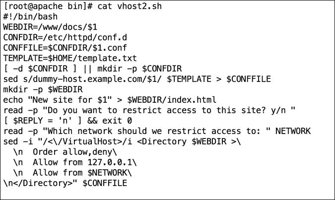

# 总结

在本章中，我们已经看到了如何将`sed`扩展到一些非常酷的脚本中，这些脚本使我们能够从文件中提取数据，取消注释选定的行并编写新的配置。我们还看到了如何使用`sed`与脚本，将新行插入现有文件中。我认为`sed`很快就会成为您的朋友，我们已经创建了一些强大的脚本来支持学习体验。

你可能已经知道这一点，但`sed`有一个大哥`awk`。在下一章中，我们将看到如何使用`awk`从文件中提取数据。
