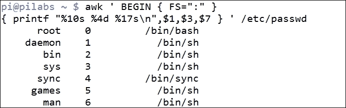

# 第十章 awk 基础知识

流编辑器并不孤单，它还有一个大哥 awk。在本章中，我们将介绍 awk 的基础知识，并看到 awk 编程语言的强大之处。我们将了解为什么我们需要和喜爱 awk，以及在开始在接下来的两章中实际使用 awk 之前，我们如何利用一些基本功能。在这个过程中，我们将涵盖以下主题：

+   从文件中过滤内容

+   格式化输出

+   显示`/etc/passwd`中的非系统用户

+   使用`awk`控制文件

# awk 背后的历史

`awk`命令是 Unix 和 Linux 命令套件中的主要组成部分。Unix 命令`awk`最早是在 20 世纪 70 年代由贝尔实验室开发的，它的名字取自主要作者的姓氏：Alfred Aho，Peter Weinberger 和 Brian Kernighan。`awk`命令允许访问 awk 编程语言，该语言旨在处理文本流中的数据。

为了演示`awk`提供的编程语言，我们应该创建一个`hello world`程序。我们知道这对于所有语言来说都是强制性的：

```
$ awk 'BEGIN { print "Hello World!" }'

```

我们不仅可以看到这段代码将打印无处不在的 hello 消息，还可以使用`BEGIN`块生成头信息。稍后，我们将看到我们可以通过`END`代码块创建摘要信息，从而允许主代码块。

我们可以在以下截图中看到这个基本命令的输出：


# 显示和过滤文件中的内容

当然，我们都希望能够打印比**Hello World**更多的内容。`awk`命令可以用来过滤文件中的内容，如果需要的话，还可以处理非常大的文件。我们应该先打印完整的文件，然后再进行过滤。这样，我们就可以感受到命令的语法。稍后，我们将看到如何将此控制信息添加到`awk`文件中，以便简化命令行。使用以下命令，我们将打印`/etc/passwd`文件中的所有行：

```
$ awk ' { print } ' /etc/passwd

```

这相当于使用`print`语句的`$0`变量：

```
$ awk ' { print $0 }' /etc/passwd

```

`$0`变量指的是完整的行。如果`print`命令没有提供参数，我们假设要打印整行。如果我们只想打印`/etc/passwd`文件中的第一个字段，我们可以使用`$1`变量。但是，我们需要指定在该文件中使用的字段分隔符是冒号。`awk`的默认分隔符是空格或任意数量的空格或制表符和换行符。有两种方法可以指定输入分隔符；这些方法在以下示例中显示。

第一个示例很容易且简单易用。`-F`选项特别适用，特别是在我们不需要任何额外的头信息时：

```
$ awk -F":" '{ print $1 }' /etc/passwd

```

我们也可以在`BEGIN`块中执行此操作；当我们想要使用`BEGIN`块显示头信息时，这是很有用的：

```
$ awk ' BEGIN { FS=":" } { print $1 } ' /etc/passwd

```

我们可以在前面的示例中清楚地看到这一点，我们将其命名为`BEGIN`块，其中的所有代码都被大括号括起来。主块没有名称，并且被大括号括起来。

在看到`BEGIN`块和主代码块之后，我们现在将看一下`END`代码块。这通常用于显示摘要数据。例如，如果我们想要打印`passwd`文件中的总行数，我们可以利用`END`块。具有`BEGIN`和`END`块的代码只处理一次，而主块则对每一行进行处理。以下示例将添加到我们迄今为止编写的代码中，以包括总行数：

```
$ awk ' BEGIN { FS=":" } { print $1 } END { print NR } ' /etc/passwd

```

`awk`内部变量`NR`维护了处理的行数。如果需要，我们可以为此添加一些附加文本。这可以用于注释摘要数据。我们还可以利用 awk 语言中使用的单引号；它们允许我们将代码跨多行展开。一旦我们打开了单引号，我们就可以在命令行中添加新行，直到我们关闭引号。这在下一个示例中得到了展示，我们扩展了摘要信息：

```
$ awk ' BEGIN { FS=":" }
> { print $1 }
> END { print "Total:",NR } ' /etc/passwd

```

如果我们不想在这里结束我们的 awk 体验，我们可以轻松地显示每行的运行行数以及最终总数。这在下面的例子中得到了展示：

```
$ awk ' BEGIN { FS=":" }
> { print NR,$1 }
> END { print "Total:",NR } ' /etc/passwd

```

以下截图捕获了这个命令和部分输出：


在第一个使用`BEGIN`的示例中，我们看到没有理由不能单独使用`END`代码块而不使用主代码块。如果我们需要模拟`wc -l`命令，我们可以使用以下`awk`语句：

```
$ awk ' END { print NR }' /etc/passwd

```

输出将是文件的行数。以下截图显示了`awk`命令和`wc`命令用于计算`/etc/passwd`文件中的行数：


值得注意的是，我们可以看到输出确实符合 28 行，我们的代码也起作用了。

我们还可以练习的另一个功能是仅处理选定的行。例如，如果我们只想打印前五行，我们将使用以下语句：

```
$ awk ' NR < 6 ' /etc/passwd

```

如果我们想打印第`8`到`12`行，我们可以使用以下代码：

```
$ awk ' NR==8,NR==12 ' /etc/passwd

```

我们还可以使用正则表达式来匹配行中的文本。看看下面的例子，我们查看以单词 bash 结尾的行：

```
$ awk ' /bash$/ ' /etc/passwd

```

示例和输出如下截图所示：


# 格式化输出

到目前为止，我们一直忠于`print`命令，因为我们对输出的要求有限。如果我们想要打印出用户名、UID 和默认 shell，我们需要开始对输出进行一些格式化。在这种情况下，我们可以将输出组织成形状良好的列。没有格式化的话，我们使用的命令会类似于以下示例，其中我们使用逗号来分隔要打印的字段：

```
$ awk ' BEGIN { FS=":" } { print $1,$3,$7 } ' /etc/passwd

```

我们在这里使用`BEGIN`块，因为我们可以利用它稍后打印列标题。

为了更好地理解问题，我们可以看一下下面的截图，它说明了不均匀的列宽：


我们输出中的问题是列不对齐，因为用户名的长度不一致。为了改进这一点，我们可以使用`printf`函数，其中我们可以指定列宽。`awk`语句的语法将类似于以下示例：

```
$ awk ' BEGIN { FS=":" }
> { printf "%10s %4d %17s\n",$1,$3,$7 } ' /etc/passwd

```

`printf`格式化包含在双引号内。我们还需要用`\n`包括换行符。`printf`函数不会自动添加新行，而`print`函数会。我们打印三个字段；第一个接受字符串值，并设置为`10`个字符宽。中间字段最多接受 4 个数字，最后是默认 shell 字段，我们允许最多`17`个字符串字符。

以下截图显示了如何改进输出：



我们可以通过添加标题信息进一步增强这一点。尽管在这个阶段代码开始看起来凌乱，但我们稍后将看到如何使用 awk 控制文件解决这个问题。下面的例子显示了标题信息被添加到`Begin`块中。分号用于分隔`BEGIN`块中的两个语句：

```
$ awk 'BEGIN {FS=":" ; printf "%10s %4s %17s\n",""Name","UID","Shell"}
> { printf "%10s %4d %17s\n",$1,$3,$7 } ' /etc/passwd

```

在下面的截图中，我们可以看到这如何进一步改进了输出：


在上一章中，我们看到如何在 shell 中使用颜色来增强输出。我们也可以通过在 awk 中添加自己的函数来使用颜色。在下面的代码示例中，您将看到 awk 允许我们定义自己的函数来促进更复杂的操作并隔离代码。我们现在将修改以前的代码以在标题中包含绿色输出：

```
$ awk 'function green(s) {
> printf "\0331;32m" s "\033[0m\n"
> }
> BEGIN {FS=":" ; green("   Name:  UID:    Shell:"}
> { printf "%10s %4d %17s\n",$1,$3,$7 } ' /etc/passwd

```

在`awk`中创建函数允许我们在需要的地方添加颜色，这种情况下是绿色文本。很容易创建函数来定义其他颜色。代码和输出包含在以下截图中：

![格式化输出

# 进一步过滤以显示 UID 用户

我们已经能够逐步建立我们的 awk 技能，我们学到的东西都很有用。我们可以将这些小步骤添加起来，开始创建一些更有用的东西。也许，我们想要只打印标准用户；这些通常是高于 500 或 1000 的用户，具体取决于您的特定发行版。

在我为本书使用的 Raspbian 发行版中，标准用户的 UID 从 1000 开始。UID 是第三个字段。这实际上只是简单地使用第三个字段的值作为范围运算符。我们可以在以下示例中看到这一点：

```
$ awk -F":" '$3 > 999 ' /etc/passwd

```

我们可以使用以下命令显示 UID 为 101 的用户：

```
$ awk -F":" '$3 < 101 ' /etc/passwd

```

这只是让您了解 awk 的一些可能性。事实上，我们可以整天玩我们的算术比较运算符。

我们还看到，有些示例中，`awk`语句变得有点长。这就是我们可以实现`awk`控制文件的地方。在我们陷入语法混乱之前，让我们立即看看这些。

# Awk 控制文件

就像`sed`一样，我们可以通过创建和包含控制文件来简化命令行。这也使得以后编辑命令更容易实现。控制文件包含我们希望`awk`执行的所有语句。我们在使用`sed`、`awk`和 shell 脚本时必须考虑的主要问题是模块化；创建可重用的元素，以隔离和重用代码。这样可以节省我们的时间和工作，并且我们有更多时间用于我们喜欢的任务。

要查看`awk`控制文件的示例，我们应该重新访问`passwd`文件的格式。创建以下文件将封装`awk`语句：

```
function green(s) {
    printf "\033[1;32m" s "\033[0m\n"
}
BEGIN {
    FS=":"
    green("   Name:   UID:       Shell:")
}
{
    printf "%10s %4d %17s\n",$1,$3,$7
}
```

我们可以将此文件保存为`passwd.awk`。

能够将所有的`awk`语句都包含在一个文件中非常方便，执行变得干净整洁：

```
$ awk -f passwd.awk /etc/passwd

```

这肯定鼓励更复杂的`awk`语句，并允许您为代码扩展更多功能。

# 总结

我希望您对可以使用 awk 工具有更好和更清晰的理解。这是一个数据处理工具，逐行运行文本文件并处理您添加的代码。如果已添加，主要块将针对符合行条件的每一行运行。而`BEGIN`和`END`块代码只执行一次。

在接下来的两章中，我们将继续使用 awk，并举一些 awk 在现实生活中的实际示例。
