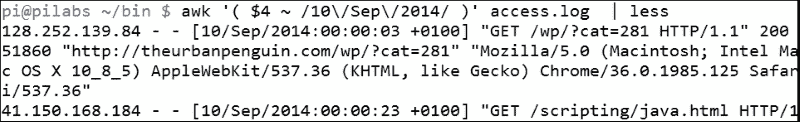

# 第十一章。使用 Awk 总结日志

awk 真正擅长的任务之一是从日志文件中过滤数据。这些日志文件可能有很多行，可能有 250,000 行或更多。我曾处理过超过一百万行的数据。Awk 可以快速有效地处理这些行。例如，我们将使用包含 30,000 行的 Web 服务器访问日志文件，以展示 awk 代码的有效性和良好编写。在本章中，我们将涵盖以下主题：

+   HTTPD 日志文件格式

+   显示来自 Web 服务器日志的数据

+   总结 HTTP 访问代码

+   显示排名最高的客户端 IP 地址

+   列出浏览器数据

+   处理电子邮件日志

# HTTPD 日志文件格式

在处理任何文件时，第一项任务是熟悉文件模式。简单来说，我们需要知道每个字段代表什么，以及用于分隔字段的内容。我们将使用 Apache HTTPD Web 服务器的访问日志文件。日志文件的位置可以从`httpd.conf`文件中控制。基于 Debian 的系统上，默认的日志文件位置是`/var/log/apache2/access.log`；其他系统可能使用`apache2`目录代替`httpd`。

为了演示文件的布局，我在 Ubuntu 15.10 系统上安装了一个全新的 Apache2 实例。安装完 Web 服务器后，我们从本地主机的 Firefox 浏览器进行了一次访问。

使用`tail`命令可以显示日志文件的内容。尽管公平地说，使用`cat`也可以，因为它只有几行：

```
# tail /var/log/apache2/access.log

```

命令的输出和文件的内容如下截图所示：


命令的输出会有一些换行，但我们可以感受到日志的布局。我们还可以看到，尽管我们认为只访问了一个网页，但实际上我们访问了两个项目：`index.html`和`ubuntu-logo.png`。我们还未能访问`favicon.ico`文件。我们可以看到该文件是以空格分隔的。每个字段的含义在以下表格中列出：

| 字段 | 目的 |
| --- | --- |
| 1 | 客户端 IP 地址。 |
| 2 | RFC 1413 和`identd`客户端定义的客户端身份。除非启用`IdentityCheck`，否则不会读取此内容。如果未读取，该值将带有连字符。 |
| 3 | 如果启用了用户身份验证，则为用户身份验证的用户 ID。如果未启用身份验证，则该值将为连字符。 |
| 4 | 请求的日期和时间格式为`day/month/year:hour:minute:second offset`。 |
| 5 | 实际请求和方法。 |
| 6 | 返回状态代码，如 200 或 404。 |
| 7 | 文件大小（以字节为单位）。 |

即使这些字段是由 Apache 定义的，我们也必须小心。时间、日期和时区是一个字段，并且在方括号内定义；然而，在该数据和时区之间的字段内有额外的空格。为了确保在需要时打印完整的时间字段，我们需要同时打印`$4`和`$5`。这在以下命令示例中显示：

```
# awk ' { print $4,$5 } ' /var/log/apache2/access.log

```

我们可以在以下截图中查看命令和其产生的输出：


# 显示来自 Web 日志的数据

我们已经预览了如何使用 awk 查看 Apache Web 服务器的日志文件；但是，现在我们将转向我们的演示文件，其中包含更丰富和更多样化的内容。

## 按日期选择条目

看到我们如何显示日期后，也许我们应该看看如何仅打印一天的条目。为此，我们可以在`awk`中使用匹配运算符。如果您愿意，这由波浪线表示。由于我们只需要日期元素，因此我们不需要同时使用日期和时区字段。以下命令显示了如何打印 2014 年 9 月 10 日的条目：

```
$ awk ' ( $4 ~ /10\/Sep\/2014/ ) ' access.log

```

为了完整起见，以下是该命令和部分输出的截图：



圆括号或括号包含我们正在寻找的行范围，我们已经省略了主块，这确保我们打印出范围内的完整匹配行。没有什么能阻止我们进一步过滤匹配行中要打印的字段。例如，如果我们只想打印正在用于访问 Web 服务器的客户端 IP 地址，我们可以打印字段`1`。这在以下命令示例中显示。

```
 $ awk ' ( $4 ~ /10\/Sep\/2014/ ) { print $1 } ' access.log

```

如果我们想要能够打印给定日期的总访问次数，我们可以将条目通过管道传递到`wc`命令。这在以下示例中演示：

```
$ awk ' ( $4 ~ /10\/Sep\/2014/ ) { print $1 } ' access.log | wc -l

```

然而，如果我们想要使用`awk`来为我们做这个，这将比启动一个新进程更有效，并且我们可以计算条目。如果我们使用内置变量`NR`，我们可以打印文件中的整行而不仅仅是范围内的行。最好在主块中递增我们自己的变量，而不是为每行匹配范围。`END`块可以被实现以打印我们使用的`count`变量。以下命令行充当示例：

```
$ awk ' ( $4 ~ /10\/Sep\/2014/ ) { print $1; COUNT++ }  END { print COUNT }' access.log

```


从`wc`和内部计数器的计数输出将使我们从演示文件中得到`16205`的结果。如果我们想要计数而不做其他操作，我们应该在主块中使用变量增量。

```
$ awk ' ( $4 ~ /10\/Sep\/2014/ ) { COUNT++ }  END { print COUNT }' access.log

```

我们可以在以下输出中看到这一点：


## 总结 404 错误

请求页面的状态代码显示在日志的字段`9`中。`404`状态将表示服务器上找不到页面的错误，我相信我们都在某个阶段在我们的浏览器中看到过这个。这可能表明您网站上的链接配置错误，或者只是由浏览器搜索要在选项卡式浏览器中显示的图标图像而产生的。您还可以通过寻找标准页面的请求来识别对您网站的潜在威胁，这些页面可能会提供对 PHP 驱动站点的其他信息的访问，例如 WordPress。

首先，我们可以仅打印请求的状态：

```
$ awk '{ print $9 } ' access.log

```

现在我们可以稍微扩展代码，也可以扩展自己，只打印`404`错误：

```
$ awk ' ( $9 ~ /404/ ) { print $9 } ' access.log

```

这在以下代码中显示：


我们可以进一步扩展，通过打印状态代码和正在访问的页面来打印。这将需要我们打印字段`9`和字段`7`。简而言之，这将如下所示：

```
$ awk ' ( $9 ~ /404/ ) { print $9, $7 } ' access.log

```

这些失败的访问页面中许多将是重复的。为了总结这些记录，我们可以使用`sort`和`uniq`命令的命令管道来实现这一点：

```
$ awk ' ( $9 ~ /404/ ) { print $9, $7 } ' access.log | sort | uniq

```

要使用`uniq`命令，数据必须经过预排序；因此，我们使用`sort`命令来准备数据。

## 总结 HTTP 访问代码

现在是时候离开纯命令行并开始使用 awk 控制文件了。与以往一样，当所需结果集的复杂性增加时，我们看到`awk`代码的复杂性也在增加。我们将在当前目录中创建一个`status.awk`文件。该文件应该类似于以下文件：

```
{ record[$9]++ }
END {
for (r in record)
print r, " has occurred ", record[r], " times." }
```

首先，我们将简化主代码块，这非常简单和稀疏。这是一种简单的方法来计算每个状态代码的唯一发生次数。我们不使用简单的变量，而是将其输入到数组中。这种情况下的数组称为记录。数组是一个多值变量，数组中的槽称为键。因此，我们将在数组中存储一组变量。例如，我们期望看到`record[200]`和`record[404]`的条目。我们用它们的发生次数填充每个键。每次我们找到`404`代码时，我们增加存储在相关键中的计数：

```
{ record[$9]++ }
```

在`END`块中，我们使用`for`循环创建摘要信息，以打印数组中的每个键和值：

```
END {
for (r in record)
print r, " has occurred ", record[r], " times." }
```

要运行这个，相关的命令行将类似于以下内容：

```
$ awk -f status.awk access.log

```

要查看命令和输出，我们已经包含了以下截图：


我们可以进一步关注`404`错误。当然，你可以选择任何状态代码。从结果中我们可以看到有`4382`个`404`状态代码。为了总结这些`404`代码，我们将`status.awk`复制到一个名为`404.awk`的新文件中。我们可以编辑`404.awk`，添加一个`if`语句，只处理`404`代码。文件应该类似于以下代码：

```
{ if ( $9 == "404" )
    record[$9,$7]++ }
END {
for (r in record)
print r, " has occurred ", record[r], " times." }
```

如果我们用以下命令执行代码：

```
$ awk -f 404.awk access.log

```

输出将类似于以下截图：


# 显示最高排名的 IP 地址

现在你应该意识到`awk`的一些功能，以及语言结构本身的强大之处。我们能够从这个 3 万行的文件中产生的数据是非常强大且容易提取的。我们只需要用`$1`替换之前使用过的字段。这个字段代表客户端 IP 地址。如果我们使用以下代码，我们将能够打印每个 IP 地址以及它被用来访问网页服务器的次数：

```
{ ip[$1]++ }
END {
for (i in ip)
print i, " has accessed the server ", ip[i], " times." }
```

我们希望能够扩展这个功能，只显示 IP 地址中排名最高的，即访问网站最频繁的地址。工作主要在`END`块中进行，将利用与当前最高排名地址的比较。可以创建以下文件并保存为`ip.awk`：

```
{ ip[$1]++ }
END {
for (i in ip)
    if ( max < ip[i] ) {
        max = ip[i]
        maxnumber = i }

print i, " has accessed ", ip[i], " times." }
```

我们可以在以下截图中看到命令的输出。客户端 IP 地址的部分已被隐藏，因为它来自我的公共网页服务器：


代码的功能来自`END`块内部。进入`END`块时，我们进入一个`for`循环。我们遍历`ip`数组中的每个条目。我们使用条件`if`语句来查看我们正在遍历的当前值是否高于当前最大值。如果是，这将成为新的最高条目。当`循环`结束时，我们打印具有最高条目的 IP 地址。

# 显示浏览器数据

用于访问网站的浏览器包含在字段`12`的日志文件中。显示用于访问您网站的浏览器列表可能会很有趣。以下代码将帮助您显示报告的浏览器的访问列表：

```
{ browser[$12]++ }
END {
    for ( b in browser )
        print b, " has accessed ", browser[b], " times."
    }
```

你可以看到我们如何可以创建`awk`的小插件，并调整字段和数组名称以适应你自己的喜好。输出如下截图所示：


有趣的是，我们看到 Mozilla 4 和 5 占据了大部分请求客户端。我们看到 Mozilla 4 在这里列出了**1713**次。这里的 Mozilla/5.0 条目格式不正确，多了一个双引号。它稍后出现了 27K 次。

# 处理电子邮件日志

我们已经使用了来自 Apache HTTP Web 服务器的日志。事实是我们可以将相同的理念和方法应用到任何日志文件上。我们将查看 Postfix 邮件日志。邮件日志保存了来自 SMTP 服务器的所有活动，然后我们可以看到谁向谁发送了电子邮件。日志文件通常位于`/var/log/mail.log`。我将在我的 Ubuntu 15.10 服务器上访问这个文件，该服务器具有本地电子邮件传递功能。这意味着 STMP 服务器只监听`127.0.0.1`的本地接口。

日志格式将根据消息类型的不同而略有变化。例如，`$7`将包含出站消息的`from`日志，而入站消息将包含`to`。

如果我们想列出所有发送到 SMTP 服务器的入站消息，我们可以使用以下命令：

```
# awk '  ( $7 ~ /^to/ ) ' /var/log/mail.log

```

由于字符串`to`非常短，我们可以通过确保字段以`^`开头来为其添加标识。命令和输出如下截图所示：


将扩展`to`或`from`搜索以包括用户名称将会很容易。我们可以看到交付或接收邮件的格式。使用与 Apache 日志相同的模板，我们可以轻松显示最高的收件人或发件人。

# 总结

现在我们在文本处理中有了一些重要的武器，我们可以开始理解`awk`有多么强大。使用真实数据在评估我们搜索的性能和准确性方面特别有用。在新安装的 Ubuntu 15.10 Apache Web 服务器上开始使用简单的 Apache 条目后，我们很快就迁移到了来自实时 Web 服务器的更大的样本数据。有 30,000 行，这个文件给了我们一些真实的数据来处理，我们很快就能够生成可信的报告。我们结束了返回 Ubuntu 15.10 服务器来分析 Postfix SMTP 日志。我们可以看到我们可以非常轻松地将之前使用过的技术拖放到新的日志文件中。

接下来，我们继续使用`awk`，看看如何报告 lastlog 数据和平面 XML 文件。
