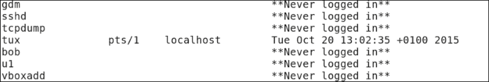
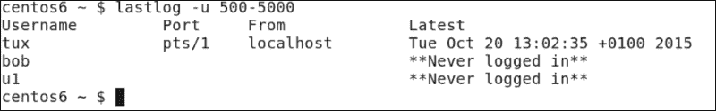
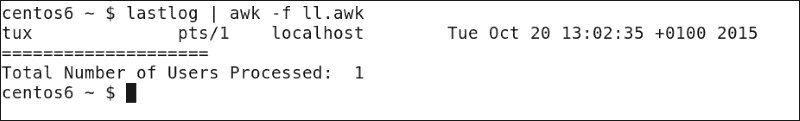
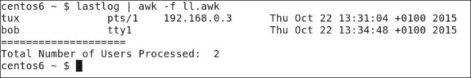
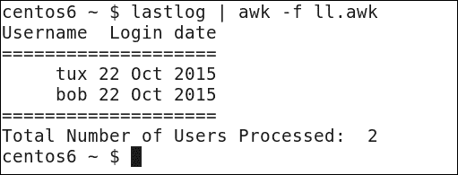
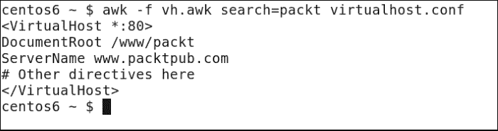
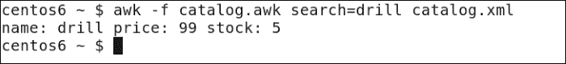

# 第十二章。使用 Awk 改进 lastlog

我们已经在第十一章中看到了如何从纯文本文件中挖掘大量数据并创建复杂报告。同样，我们可以使用标准命令行工具的输出来创建广泛的报告，比如`lastlog`工具。`lastlog`本身可以报告所有用户的最后登录时间。然而，我们可能希望过滤`lastlog`的输出。也许您需要排除从未用于登录系统的用户帐户。也可能不相关报告`root`，因为该帐户可能主要用于`sudo`，而不用于记录标准登录。

在本章中，我们将同时使用`lastlog`和 XML 数据格式化。由于这是我们调查 awk 的最后一章，我们将配置记录分隔符。我们已经看到了 awk 中字段分隔符的使用，但我们可以将默认记录分隔符从换行符更改为更符合我们需求的内容。具体来说，在本章中我们将涵盖：

+   使用 awk 范围来排除数据

+   基于行中字段数量的条件

+   操作 awk 记录分隔符以报告 XML 数据

# 使用 awk 范围来排除数据

到目前为止，在本书中，我们主要关注包括`sed`或`awk`的范围内的数据。使用这两个工具，我们可以否定范围，以便排除指定的行。这符合我们一直使用`lastlog`输出的需求。这将打印出所有用户的登录数据，包括从未登录的帐户。这些从未登录的帐户可能是服务帐户或尚未登录系统的新用户。

## lastlog 命令

如果我们查看`lastlog`的输出，当它没有任何选项时，我们可以开始理解问题。从命令行，我们以标准用户身份执行命令。没有必要以 root 帐户运行它。命令如下示例所示：

```
$ lastlog

```

部分输出如下截图所示：



即使从这有限的输出中，我们可以看到由于从未登录的帐户创建的虚拟噪音而产生的混乱输出。使用`lastlog`选项可能在一定程度上缓解这一问题，但可能并不能完全解决问题。为了证明这一点，我们可以向`lastlog`添加一个选项，只包括通常由标准帐户使用的用户帐户。这可能因系统而异，但在我使用的样本 CentOS 6 主机上，第一个用户将是 UID 500。

如果我们使用`lastlog -u 500-5000`命令，我们将只打印 UID 在此范围内的用户的数据。在简单的演示系统中，我们只有三个用户帐户的输出是可以接受的。然而，我们可以理解到我们可能仍然有一些混乱，因为这些帐户尚未被使用。如下截图所示：



除了从**从未登录**帐户打印出的多余数据之外，我们可能只对**用户名**和**最新**字段感兴趣。这是支持使用 awk 作为数据过滤器的另一个原因。通过这种方式，我们可以提供水平和垂直数据过滤，行和列。

## 使用 awk 进行水平过滤行

为了使用 awk 提供这种过滤，我们将把数据从`lastlog`直接传输到`awk`。我们将首先使用一个简单的控制文件来提供水平过滤或减少我们看到的行。首先，命令管道将如下命令示例一样简单：

```
$ lastlog | awk -f lastlog.awk

```

当然，复杂性是从命令行中抽象出来的，并隐藏在我们使用的控制文件中。最初，控制文件保持简单，读起来如下：

```
!(/Never logged in/ || /^Username/ || /^root/) {
  print $0;
}
```

范围设置与我们之前看到的一样，并在主代码块之前。在括号前使用感叹号可以否定或颠倒所选范围。双竖线作为逻辑`OR`。我们不包括包含`Never logged in`的行，也不包括以`Username`开头的行。这将移除`lastlog`打印的标题行。最后，我们排除 root 账户的显示。这初始化了我们要处理的行，主代码块将打印这些行。

## 匹配行的计数

我们可能还想计算过滤返回的行数。例如，使用内部的`NR`变量将显示所有行而不仅仅是匹配的行；为了能够报告已登录用户的数量，我们必须使用我们自己的变量。以下代码将在我们命名为`cnt`的变量中维护计数。我们使用 C 风格的`++`来增加主代码块的每次迭代。我们可以使用`END`代码块来显示这个变量的最终值：

```
!(/Never logged in/ || /^Username/ || /^root/) {
  cnt++
  print $0;
}
END {
  print "========================"
  print "Total Number of Users Processed: ", cnt
}
```

我们可以从以下代码和输出中看到这在我的系统上是如何显示的：



从显示输出中，我们现在可以看到我们只显示已登录的用户，这种情况下只有一个用户。然而，我们可能还决定要进一步抽象数据，并且只显示匹配行中的某些字段。这应该是一个简单的任务，但它很复杂，因为字段的数量将取决于登录的方式。

# 基于字段数量的条件

如果用户直接登录到服务器的物理控制台，而不是通过远程或图形伪终端登录，那么`lastlog`输出将不会显示主机字段。为了证明这一点，我直接登录到我的 CentOS 主机的`tty1`控制台，并避免了图形界面。之前 awk 控制文件的输出显示我们现在有用户**tux**和**bob**；然而**bob**缺少主机字段，因为他连接到控制台。



虽然这本身不是问题，但如果我们想要过滤字段，两行的字段编号将有所不同，因为某些行中省略了字段。对于`lastlog`，大多数连接将有`9`个字段，而直接连接到服务器控制台的连接只有`8`个字段。应用程序的要求是打印用户名和日期，但不打印最后登录的时间。我们还将在`BEGIN`块中打印我们自己的标题。为了确保我们使用正确的位置，我们需要使用`NF`内部变量来计算每行的字段数。

对于有`8`个字段的行，我们想要打印字段`1`、`4`、`5`和`8`；对于有额外主机信息的较长行，我们将使用字段`1`、`5`、`6`和`9`。我们还将使用`printf`来正确对齐列数据。控制文件应该被编辑，如下例所示：

```
BEGIN {
printf "%8s %11s\n","Username","Login date"
print "===================="
}
!(/Never logged in/ || /^Username/ || /^root/) {
cnt++
if ( NF == 8 )
    printf "%8s %2s %3s %4s\n", $1,$5,$4,$8

else
    printf "%8s %2s %3s %4s\n", $1,$6,$5,$9
}
END {
print "===================="
print "Total Number of Users Processed: ", cnt
}
```

我们可以在以下截图中看到命令和它产生的输出。我们可以看到如何基于我们想要关注的信息创建更合适的显示：



如果我们看一下输出，我选择在月份之前显示日期，这样我们就不按数字顺序显示字段。当然，这是个人选择，可以根据你认为数据应该如何显示进行自定义。

我们可以使用`lastlog`控制文件中所见原则的输出来过滤任何命令的输出，并且你应该练习使用你想要过滤数据的命令。

# 操纵 awk 记录分隔符以报告 XML 数据

到目前为止，虽然我们一直在使用 awk，但我们只限于处理单独的行，每一行代表一个新记录。虽然这通常是我们想要的，当我们处理带有标记数据的情况时，比如 XML，其中一个单独的记录可能跨越多行。在这种情况下，我们可能需要设置`RS`或`record`分隔符内部变量。

## Apache 虚拟主机

在第九章中，*自动化 Apache 虚拟主机*，我们使用了**Apache 虚拟主机**。这使用了定义每个虚拟主机的开始和结束的标记数据。即使我们更喜欢将每个虚拟主机存储在自己的文件中，它们也可以合并到单个文件中。考虑以下文件，它存储了可能的虚拟主机定义，可以存储为`virtualhost.conf`文件，如下所示：

```
<VirtualHost *:80>
DocumentRoot /www/example
ServerName www.example.org
# Other directives here
</VirtualHost>

<VirtualHost *:80>
DocumentRoot /www/theurbanpenguin
ServerName www.theurbanpenguin.com
# Other directives here
</VirtualHost>

<VirtualHost *:80>
DocumentRoot /www/packt
ServerName www.packtpub.com
# Other directives here
</VirtualHost>
```

我们在单个文件中有三个虚拟主机。每个记录由一个空行分隔，这意味着我们有两个逻辑上分隔每个条目的新行字符。我们通过设置`RS`变量来告诉 awk 这一点：`RS="\n\n"`。有了这个设置，我们就可以打印所需的虚拟主机记录。这将在控制文件的`BEGIN`代码块中设置。

我们还需要动态搜索命令行以获取所需的主机配置。我们将这构建到控制文件中。控制文件应该类似于以下代码：

```
BEGIN { RS="\n\n" ; }
$0 ~ search { print }
```

`BEGIN`块设置变量，然后我们进入范围。范围设置为记录(`$0`)匹配(`~`)`search`变量。我们必须在执行`awk`时设置变量。以下命令演示了命令行执行，控制文件和配置文件位于我们的工作目录中：

```
$ awk -f vh.awk search=packt virtualhost.conf

```

通过查看以下屏幕截图中生成的命令和输出，我们可以更清楚地看到这一点：



## XML 目录

我们可以进一步扩展到 XML 文件，其中我们可能不想显示完整的记录，而只是某些字段。如果我们考虑以下产品`目录`：

```
<product>
<name>drill</name>
<price>99</price>
<stock>5</stock>
</product>

<product>
<name>hammer</name>
<price>10</price>
<stock>50</stock>
</product>

<product>
<name>screwdriver</name>
<price>5</price>
<stock>51</stock>
</product>

<product>
<name>table saw</name>
<price>1099.99</price>
<stock>5</stock>
</product>
```

逻辑上，每个记录都与之前的空行分隔。每个字段都更详细，我们需要使用分隔符`FS="[><]"`。我们将开头或结尾的尖括号定义为字段分隔符。

为了帮助分析这一点，我们可以打印单个记录如下：

```
<product><name>top</name><price>9</price><stock>5</stock></product>
```

每个尖括号都是一个字段分隔符，这意味着我们将有一些空字段。我们可以将这行重写为 CSV 文件：

```
,product,,name,top,/name,,price,9,/price,,stock,5,/stock,,/product,
```

我们只需用逗号替换每个尖括号，这样我们更容易阅读。我们可以看到字段`5`的内容是`top`值。

当然，我们不会编辑 XML 文件，我们会保留它的 XML 格式。这里的转换只是为了突出字段分隔符的读取方式。

我们用于从 XML 文件中提取数据的控制文件在以下代码示例中说明：

```
BEGIN { FS="[><]"; RS="\n\n" ; OFS=""; }
$0 ~ search { print $4 ": " $5, $8 ": " $9, $12 ": " $13 }
```

在`BEGIN`代码块中，我们设置了`FS`和`RS`变量，正如我们讨论过的。我们还将`OFS`或**输出字段分隔符**设置为一个空格。这样，当我们打印字段时，我们用空格分隔值，而不是保留尖括号。这个范围使用了与我们之前查看虚拟主机时使用的相同匹配。

如果我们需要在`目录`中搜索产品`drill`，我们可以使用以下示例中列出的命令：

```
$ awk -f catalog.awk search=drill catalog.xml

```

以下屏幕截图详细显示了输出：



我们现在已经能够从一个相当混乱的 XML 文件中创建可读的报告。awk 的强大再次得到了突出，并且对我们来说，这是本书中的最后一次。到目前为止，我希望你也能开始经常使用它。

# 总结

我们已经有了三个章节，在这些章节中我们使用了 awk。从第十章开始，*Awk 基础*，我们变得更加熟悉。在第十一章中，*使用 Awk 总结日志*以及这一章，我们开始构建我们定制的应用程序。

具体来说，在这一章中，我们看到了如何从标准命令的输出中创建报告，比如`lastlog`。我们看到我们可以否定范围，并且另外利用`OR`语句。然后我们构建了一个允许我们查询 XML 数据的应用程序。

在接下来的两章中，我们将远离 shell 脚本，转而使用 perl 和 Python 编写脚本，这样我们可以比较脚本语言并做出适当的选择。
