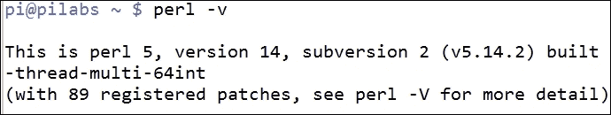
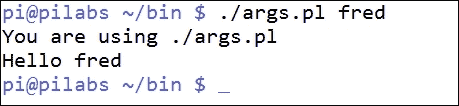
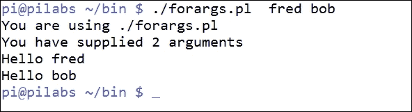
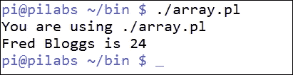
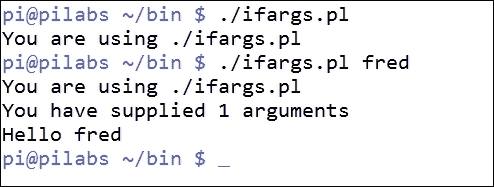

# 第十三章：使用 Perl 作为 Bash 脚本的替代方案

使用 bash 进行脚本编写可以帮助您自动化任务，并且通过掌握 bash 脚本编写，您可以取得很大成就。然而，您的旅程不应该以 bash 结束。虽然我们已经看到了在 bash 脚本中可用的功能，但我们受到可以运行的命令和它们的选项的限制。Bash 脚本允许我们访问命令；而如果我们使用 Perl 脚本，我们就可以访问系统的编程接口或 API。通过这种方式，我们通常可以用更少的资源实现更多的功能。

在本章中，我们将介绍 Perl 脚本和一些其他基本脚本，我们可以用来学习 Perl；我们将涵盖以下主题：

+   什么是 Perl？

+   Hello World

+   Perl 中的数组

+   Perl 中的条件测试

+   函数

# 什么是 Perl？

Perl 是一种脚本语言，由 Larry Wall 在 1980 年代开发，用于扩展`sed`和`awk`的功能。它是**Practical Extraction and Reporting Language**的首字母缩写，但已经远远超出了最初的目的，今天它可以在 Unix、Linux、OS X 和 Windows 操作系统上使用。

尽管它是一种脚本语言，但它不是 shell 脚本；因此没有 Perl shell。这意味着代码必须通过 Perl 脚本执行，而不是直接从命令行执行。唯一的例外是`perl`命令的`-e`选项，它可以允许您执行一个`perl`语句。例如，我们可以使用以下命令行来打印无处不在的`Hello World`：

```
$ perl -e ' print("Hello World\n");'

```

您会发现 Perl 默认安装在大多数 Linux 和 Unix 系统上，因为许多程序将在它们的代码中使用 Perl。要检查您系统上安装的 Perl 版本，可以使用`perl`命令，如下所示：

```
$ perl -v

```

这个命令的输出显示在我树莓派上的以下截图中：



### 注意

在本章中，大写的 Perl 将指的是语言，小写的`perl`将指的是命令。

如果我们创建一个 Perl 脚本，就像 bash 一样，它将是一种解释性语言，第一行将是 shebang，以便系统知道要使用哪个命令来读取脚本。`/usr/bin/perl`命令通常用于定位`perl`。要验证这一点，可以使用：

```
$ which perl

```

与 bash 不同，当`perl`命令读取脚本时，它将在运行时优化脚本；这将使我们能够在脚本末尾定义函数，而不是在使用之前。当我们在本章中详细查看 Perl 脚本时，我们将看到这一点。

# Hello World

要创建一个简单的 Perl 脚本，我们可以使用所选的文本编辑器。对于短脚本，`vi`或`vim`效果很好，如果要在 GUI 中工作，`gedit`也可以。对于较大的项目，IDE 可能会有所帮助。通常，IDE 将允许您轻松地在整个脚本中更改对象名称并提供对象名称的扩展。在本章中，我们将继续使用`vi`。

我们将创建一个`$HOME/bin/hello.pl`文件来产生我们想要的输出：

```
#!/usr/bin/perl
print("Hello World\n");
```

文件仍然需要在我们的`PATH`变量中的目录中；因此，我们创建`$HOME/bin`。如果它不在`PATH`变量中，那么我们将需要指定文件的完整路径或相对路径，就像 bash 一样。

文件需要设置执行权限。我们可以使用以下命令来实现：

```
$ chmod u+x $HOME/bin/hello.pl

```

我们可以使用以下命令运行脚本：

```
$ hello.pl

```

我们可以看到我们添加的代码与我们之前运行的`perl -e`命令相同。唯一的区别是 shebang。这也与 bash 非常相似。我们现在使用 print 函数而不是使用`echo`命令。Bash 脚本运行一系列命令，而 Perl 脚本运行函数。print 函数不会自动添加新行，因此我们使用`\n`字符自己添加。我们还可以看到 Perl 使用分号来终止一行代码。shebang 不是一行代码，而 print 行以分号终止。

如果我们使用的是 Perl 5.10 或更高版本，在 Pi 上我们已经看到它是 5.14，我们还可以使用一个名为`say`的函数。类似于`print`命令，它用于显示输出，但它还包括换行符。我们必须启用此功能，由`use`关键字管理。以下任一脚本都将使用`say`函数打印`Hello World`：

```
#!/usr/bin/perl
use v5.10;
say("Hello World");

#!/usr/bin/perl
use 5.10.0;
say("Hello World");
```

`say`函数还简化了文件和列表的打印。

# Perl 数组

在 Perl 中我们可以利用的一点是数组。这些数组是从列表创建的变量；简单地说，它们基本上是多值变量。如果我们要使用容器类比来描述一个变量，它将是一个杯子或一个值的占位符。数组将类比为一个板条箱。我们可以用一个单一的名称描述板条箱，但是我们必须包括额外的命名元素来访问板条箱内的每个槽。一个板条箱可以容纳多个项目，就像一个数组一样。

我们看到通过使用 bash 脚本，我们可以在脚本中传递命令行参数。参数使用它们自己的变量名，`$1`，`$2`等。这也与程序的名称有一定的冲突，因为它是`$0`。即使它们看起来可能相似，但`$0`和`$1`之间没有逻辑关系。`$0`变量是脚本的名称，`$1`是第一个参数。当我们在 Perl 中看到这一点时，我们可以开始看到一些主要的区别。

## 程序名称？

在 Perl 中，程序名称仍然可以使用`$0`变量访问。我们可以在以下脚本中看到这一点：

```
#!/usr/bin/perl
print("You are using $0\n");
print("Hello World\n");
```

现在，即使我们认为`$0`使用起来相当简单，因为我们之前在 bash 中访问过它，但如果我们以全新的眼光来看待它，它并不那么明显。Perl 有一个名为`English`的模块，其中定义了许多其他在 Perl 中使用的变量的更友好的名称。如果我们看一下以下脚本，我们可以看到它的用法：

```
#!/usr/bin/perl
use English;
print("You are using $PROGRAM_NAME\n");
print("Hello World\n");
```

`use English`;这一行将导入重新定义`$0`的模块，以便可以将其引用为`$PROGRAM_NAME`。尽管这需要更多的输入，但它也作为一个更好的名称来记录其目的。

## 参数数组

不再使用`$1`，`$2`等参数；Perl 现在使用存储在单个数组变量中的参数列表。数组名称是`@ARGV`，我们可以通过索引号或槽号访问由此提供的每个参数。计算机从`0`开始计数，所以第一个参数将是`$ARGV[0]`，第二个将是`$ARGV[1]`，依此类推。

### 注意

使用`@`符号命名索引数组。数组的每个元素仍然是单个或标量变量，就像在 bash 中一样，它们使用`$`符号读取。

当我们查看以下脚本`$HOME/bin/args.pl`时，我们可以看到如何通过接受参数使 Hello 脚本更具可移植性：

```
#!/usr/bin/perl
use English;
print("You are using $PROGRAM_NAME\n");
print("Hello $ARGV[0]\n");
```

我们可以通过运行脚本来看到这一点，如下面的屏幕截图所示：



## 计算数组中的元素

我们可以看到命令行参数存储在`@ARGV`数组中。我们可以使用以下代码计算参数的数量，或者实际上是任何数组中的元素：

```
scalar @<array-name>;
```

因此，我们将使用以下代码来计算提供的参数，而不是使用`$#`：

```
scalar @ARGV;
```

如果我们将这个添加到我们的脚本中，它将会被看到，如下面的代码块所示：

```
#!/usr/bin/perl
use English;
print("You are using $PROGRAM_NAME\n");
print("You have supplied: " . scalar @ARGV . " arguments\n");
print("Hello $ARGV[0]\n");
```

### 注意

我们还可以从前面的代码块中注意到，我们可以使用句点字符将命令的输出与测试连接起来。

## 循环遍历数组

在 bash 中，我们有一个简单的机制，使用`$*`来引用提供给脚本的参数列表。在 Perl 中，这与必须循环遍历列表略有不同。然而，`foreach`关键字是为此而建立的：

```
#!/usr/bin/perl
use English;
print("You are using $PROGRAM_NAME\n");
print("You have supplied " . scalar @ARGV . " arguments\n");
foreach $arg (@ARGV) {
 print("Hello $arg\n");
}
```

我们可以看到，代码是在循环内定义的，并使用大括号括起来。如果您还记得，bash 并没有专门的`foreach`关键字，而是使用`do`和`done`来限制代码。

如果我们在`$HOME/bin/forargs.pl`文件中实现此代码，我们可以执行类似以下屏幕截图的代码：



## 创建数组

到目前为止，我们一直依赖于`@ARGV`系统数组，这已被证明是学习如何访问数组的好方法。现在我们需要看看如何创建我们自己设计的数组。

数组是可以存储混合数据类型的值的列表；因此，我们可以有一个既存储字符串又存储数字的数组是毫无问题的。提供给数组的项目的顺序将设置它们的索引位置。换句话说，列表中的第一项将是数组中的第一个索引或索引`0`。考虑以下代码：`$HOME/bin/array.pl`：

```
#!/usr/bin/perl
use English;
print("You are using $PROGRAM_NAME\n");
@user = ("Fred","Bloggs",24);
print("$user[0] $user[1] is @user[2]\n");
```

我们应该注意的第一件事是，当我们设置任何类型的变量时，包括数组时，我们将使用变量类型的指示符。我们在这里看到，使用`@user = …`，将使用先前提到的`@`符号来表示变量是一个数组变量。如果我们设置一个类似于我们在 bash 中使用的标量变量，我们将设置`$user`。在 bash 中，设置变量时不使用指示符，并且我们不能在赋值运算符`=`周围有空格。Perl 将允许空格，并通过额外的空格提高可读性。

接下来，我们应该注意到列表包含字符串和整数。这是完全可以接受的，数组可以容纳不同的数据类型。数组的单个名称是有意义的，因为我们现在可以将相关数据存储到一个对象中。

在提供的代码中需要注意的最后一点是，我们可以轻松地使用 Perl 将字符串值与整数值连接起来。无需提供任何形式的数据转换。在单个字符串中，我们打印用户的名字、姓氏和年龄。

在脚本执行时，我们应该收到一个输出，如下面的屏幕截图所示：



# Perl 中的条件语句

与 Perl 语言的其余部分类似，我们将与 bash 脚本编写有相似之处，也有一些完全实现条件的新方法。这通常对我们有利，因此使代码更易读。

## 替换命令行列表

首先，我们没有命令行列表逻辑，我们在 bash 中使用的逻辑，也不使用`&&`和`||`。在 Perl 中，单个语句的条件逻辑是以以下方式编写的，而不是这些看起来相当奇怪的符号：

```
exit(2) if scalar @ARGV < 1;
print("Hello $ARGV[0]\n") unless scalar @ARGV == 0;
```

在第一个例子中，如果我们提供的命令行参数少于一个，我们将以错误代码`2`退出。这在 bash 中的等效操作将是：

```
[ $# -lt 1 ] && exit 2
```

在第二个例子中，只有在我们提供了参数时，我们才会打印`hello`语句。这将在 bash 中编写，如下例所示：

```
[ $# -eq 0 ] || echo "Hello $1"
```

就个人而言，我喜欢 Perl；至少它使用单词的方式，这样我们即使以前没有遇到过这些符号，也可以理解发生了什么。

## If 和 unless

在 Perl 中，我们已经在之前的例子中看到，我们可以使用`unless`来使用负逻辑。我们既有传统的`if`关键字，现在又有了`unless`。我们可以在我们已经看到的短代码中使用这些，也可以在完整的代码块中使用。

我们可以编辑现有的 `args.pl` 来创建一个新文件：`$HOME/bin/ifargs.pl`。文件应该类似于以下代码：

```
#!/usr/bin/perl
use English;
print("You are using $PROGRAM_NAME\n");
my $count = scalar @ARGV;
if ($count > 0) {
  print("You have supplied $count arguments\n");
  print("Hello $ARGV[0]\n");
}
```

现在代码有了一个额外的参数，我们已经声明并设置了这一行 `my $count = scalar @ARGV;`。我们使用这个值作为 `if` 语句的条件。在大括号中限定的代码块只有在条件为真时才会执行。

我们演示了在下面的截图中使用和不使用参数运行此程序：



我们可以使用 `unless` 来编写类似的代码：

```
print("You are using $PROGRAM_NAME\n");
my $count = scalar @ARGV;
unless ($count == 0) {
  print("You have supplied $count arguments\n");
  print("Hello $ARGV[0]\n");

}
```

括号中的代码现在只有在条件为假时才运行。在这种情况下，如果我们没有提供参数，代码将不运行。

# 在 Perl 中使用函数

与所有语言一样，将代码封装在函数中可以使代码更易读，并最终导致更易管理的代码，代码行数也更少。与 bash 不同，Perl 中的函数可以在代码中引用后定义，我们通常选择在脚本末尾定义函数。

## 提示用户输入

我们已经看到了在 Perl 中使用命令行参数；现在，让我们来看看如何提示用户输入。这成为了一种封装执行代码和存储提示的好方法。首先，我们将看一个简单的脚本，提示用户名，然后我们将修改它以包含函数。我们将创建 `$HOME/bin/prompt.pl` 文件来读取，如下面的代码示例所示：

```
#!/usr/bin/perl
my $name;
print("Enter your name: ");
chomp( $name = <STDIN> );
print("Hello $name\n");
```

在第 2 行，我们使用 `my` 声明了变量。关键字 `my` 定义了具有局部作用域的变量。换句话说，它仅在创建它的代码块中可用。由于这是在脚本的主体中创建的，变量对整个脚本都是可用的。这一行声明了变量，但我们此时没有设置值。Perl 不强制您声明变量，但这是一个好主意和一个很好的实践。事实上，我们可以告诉 Perl 使用 `use strict;` 行来强制执行这一点。我们可以实现这一点，如下面的代码块所示：

```
#!/usr/bin/perl
use strict;
my $name;
print("Enter your name: ");
chomp( $name = <STDIN> );
print("Hello $name\n");
```

有了这个，我们被迫声明变量，如果没有声明，代码将失败。这背后的想法是通过在代码后期识别拼写错误的变量来帮助故障排除。尝试删除以 `my` 开头的行并重新执行代码；它将失败。同样，我们可以使用 `use warnings;` 行，如果我们只使用了一次变量，它会警告我们。

我们提示用户输入用户名，这里不使用换行符。我们希望提示与用户输入数据的行在同一行上。`chomp` 函数很棒，不是吗？这个函数将删除或截断我们提交的输入中的换行符。我们需要使用 *Enter* 键提交数据，`chomp` 会为我们删除换行符。

## 创建函数

目前我们只提示用户输入用户名，所以我们只需要一个提示，但我们也可以很容易地要求名字和姓氏。我们可以创建一个函数，而不是每次都写提示的代码。这些是使用关键字 `sub` 定义的，如下面的代码所示：

```
#!/usr/bin/perl
use strict;
my $name = prompt_user("Enter a name: ");
print("Hello $name\n");

sub prompt_user () {
   my $n;
   print($_[0]);
   chomp( $n = <STDIN> );
   return($n);
}
```

`prompt_user` 函数接受一个参数，这个参数将成为显示提示的消息。对于参数的引用，我们使用系统数组 `@_` 和索引 `0`。这写作 `$_[0]`。如果我们记得，数组是多值的，数组中的每个条目都是一个标量变量。在函数内部，我们使用函数返回将用户设置的值发送回调用代码。我们可以看到主代码块现在更简单了，因为提示的代码被抽象成了一个函数。当我们看到这个时，可能会觉得这需要很多工作，但是当我们为名字和姓氏添加提示时，现在就简单多了。

使用函数是一个好习惯，希望下面的代码能帮助你看到这一点：

```
#!/usr/bin/perl
use strict;
my $fname = prompt_user("Enter a first name: ");
my $lname = prompt_user("Enter a last name: ");

print("Hello $fname $lname\n");

sub prompt_user () {
   my $n;
   print($_[0]);
   chomp( $n = <STDIN> );
   return($n);
}
```

# 总结

这就结束了我们的风风火火的旅程和对 Perl 的介绍。我们已经看到了它与 bash 的相似之处，以及新的特性和区别。从中可以得出的主要观点是，一旦你精通一种语言，学习其他编程语言就会变得更容易。

为了保持学习新语言的兴致，我们接下来将在下一章快速了解 Python。
