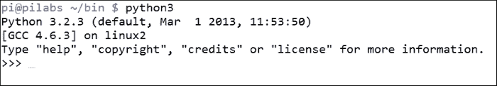
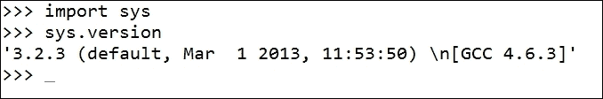
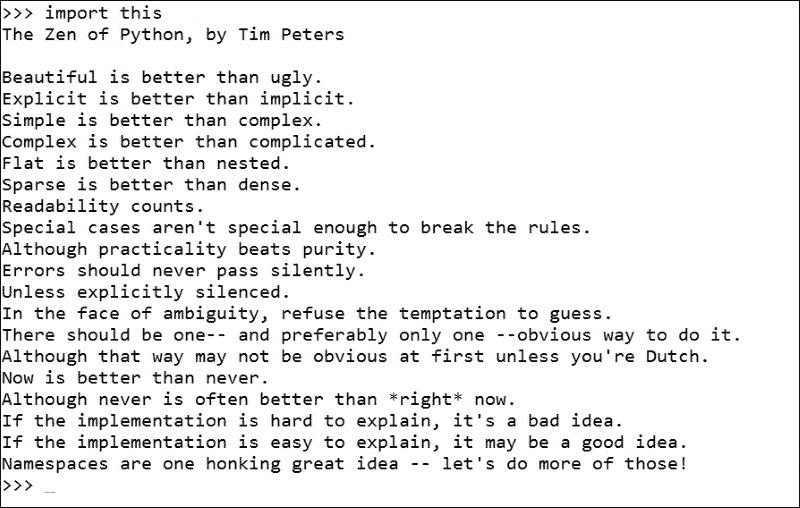
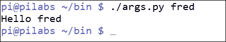
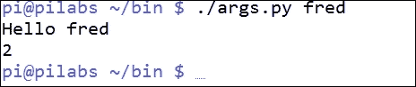
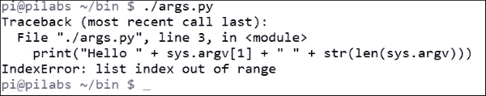
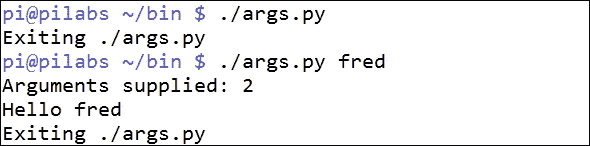
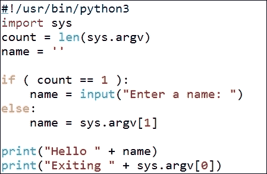
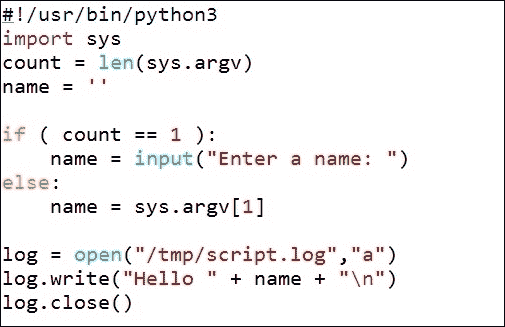

# 第十四章：使用 Python 作为 Bash 脚本替代品

Python 是另一种脚本语言，也是我们迄今为止看过的最新的脚本语言。与 bash 和 Perl 类似，Python 是一种解释性语言，并使用 shebang。尽管它没有 shell 界面，但我们可以访问一个名为 REPL 的控制台，在那里我们可以输入 Python 代码与系统进行交互。在本章中，我们将涵盖以下主题：

+   什么是 Python？

+   以 Python 方式说 Hello

+   Pythonic 参数

+   重要的空白

+   读取用户输入

+   使用 Python 写入文件

# 什么是 Python？

Python 是一种面向对象的解释性语言，旨在易于使用并有助于快速应用程序开发。这是通过在语言中使用简化的语义来实现的。

Python 诞生于 20 世纪 80 年代末，即 1989 年 12 月底，由荷兰开发者 Guido van Rossum 创建。该语言的设计大部分目的在于清晰和简单，而*Python 之禅*的主要规则之一是：

> *"应该有一种，最好只有一种明显的方法来做到这一点。"*

通常系统会安装 Python 2 和 Python 3，但是所有更新的发行版都在转向 Python 3。我们将使用 Python 3，因为它是树莓派上安装的最新版本。

尽管没有 shell，我们可以使用 REPL 与 Python 进行交互：读取、评估、打印和循环。我们可以通过在命令行中输入`python3`来访问这个。您应该看到类似以下屏幕截图的内容：



我们可以看到我们被呈现出**>>>**提示，这被称为 REPL 控制台。我们应该强调这是一种脚本语言，就像 bash 和 Perl 一样，我们通常会通过创建的文本文件来执行代码。这些文本文件通常希望其名称具有`.py`后缀。

在使用 REPL 时，我们可以通过导入模块来独立打印版本。在 Perl 中，我们将使用关键字，在 bash 中我们将使用命令源，在 Python 中我们使用`import`：

```
>>>import sys

```

加载模块后，我们现在可以通过打印版本来研究 Python 的面向对象的特性：

```
>>> sys.version

```

我们将导航到我们命名空间中的 sys 对象，并从该对象调用 version 方法。

将这两个命令组合在一起，我们应该能够看到以下输出：



要结束关于描述 Python 的这一部分，我们应该看一下**Python 之禅**。从 REPL，我们可以输入`import this`，如下面的屏幕截图所示：



这远不仅仅是 Python 之禅；它实际上构成了所有编程语言的一个很好的规则，也是开发人员的指南。

最后，要关闭 REPL，我们将在 Linux 中使用*Ctrl* + *d*，在 Windows 中使用*Ctrl* + *z*。

# 以 Python 方式说 Hello World

我们在 Python 中编写的代码应该清晰而简洁，稀疏比密集更好。我们需要在第一行上使用 shebang，然后使用`print`语句。`print`函数包括换行符，我们不需要在行尾使用分号。我们可以在以下示例中看到编辑后的`$HOME/bin/hello.py`版本：

```
#!/usr/bin/python3
print("Hello World")
```

我们仍然需要添加执行权限，但是我们可以像之前一样使用`chmod`来运行代码。这在以下命令中显示，但我们现在应该对此有点习惯了：

```
$ chmod u+x $HOME/bin/hello.py

```

最后，我们现在可以执行代码来看到我们的问候语。

再次，至少了解一种语言会使适应其他语言变得更容易，而且这并没有太多新功能。

# Pythonic 参数

到目前为止，我们应该知道我们希望能够向 Python 传递命令行参数，我们可以使用`argv`数组来实现这一点，类似于 Perl。但是，与 bash 更像，使用 Python 时，我们将程序名称与其他参数组合到数组中。Python 还使用小写而不是大写的对象名称。

+   `argv`数组是`sys`对象的一部分

+   `sys.argv[0]`是脚本名称

+   `sys.argv[1]`是提供给脚本的第一个参数

+   `sys.argv[2]`是第二个提供的参数，依此类推

+   参数计数始终至少为 1，因此，在检查提供的参数时请记住这一点

## 提供参数

如果我们创建`$HOME/bin/args.py`文件，我们可以看到它的运行情况。文件应该创建如下并且可执行：

```
#!/usr/bin/python3
import sys
print("Hello " + sys.argv[1])
```

如果我们使用提供的参数运行脚本，我们应该能够看到类似以下截图的内容：



我们的代码仍然非常清晰简单；但是，我们可能已经注意到我们不能将`print`语句中的带引号的文本与参数组合在一起。我们使用`+`符号将两个字符串连接在一起。由于没有特定的符号来表示变量或任何其他类型的对象，它们不能出现在引号内作为静态文本。

## 计算参数

如前所述，脚本名称是数组中索引为`0`的第一个参数。因此，如果我们尝试计算参数，那么计数应该始终至少为 1。换句话说，如果我们没有提供参数，参数计数将为 1。要计算数组中的项目数，我们可以使用`len()`函数。如果我们编辑脚本以包含一个新行，我们将看到它的工作情况，如下所示：

```
#!/usr/bin/python3
import sys
print("Hello " + sys.argv[1])
print( len(sys.argv) )
```

执行代码，我们可以看到我们提供了两个参数。脚本名称，然后是字符串`fred`：



如果我们尝试使用单个`print`语句来打印输出和参数的数量，我们会发现 Python 不喜欢混合数据类型。长度值是整数，这不能在没有转换的情况下与字符串混合。以下代码将失败：

```
#!/usr/bin/python3
import sys
print("Hello " + sys.argv[1] + " " + len(sys.argv))
```

但是，这并不是一项艰巨的任务，只需要明确的转换。来自 Python 之禅：

> *“明确胜于隐晦。”*

修改后，代码将正常工作，如下所示：

```
#!/usr/bin/python3
import sys
print("Hello " + sys.argv[1] + " " + str(len(sys.argv)))
```

如果我们尝试运行脚本并省略提供参数，那么当我们引用索引`1`时，数组中将会有一个空值。这将导致错误，如下截图所示：



当然，我们需要处理这个问题以防止错误，现在我们可以进入重要的空白部分。

# 重要的空白

Python 与大多数其他语言之间的一个主要区别是额外的空白可能意味着某些东西。代码的缩进级别定义了它所属的代码块。到目前为止，我们还没有将创建的代码缩进到行的开头之后。这意味着所有的代码都在相同的缩进级别，并且属于相同的代码块。我们使用缩进而不是使用大括号或`do`和`done`关键字来定义代码块。如果我们使用四个空格进行缩进，那么我们必须坚持使用这四个空格。当我们返回到先前的缩进级别时，我们返回到先前的代码块。

这似乎很复杂，但实际上非常简单，可以保持代码的清晰和简洁。如果我们编辑`arg.py`文件以防止不受欢迎的错误，如果没有提供参数，我们可以看到它的运行情况：

```
#!/usr/bin/python3
import sys
count = len(sys.argv)
if ( count > 1 ):
    print("Arguments supplied: " + str(count))
    print("Hello " + sys.argv[1])
print("Exiting " + sys.argv[0])
```

`if`语句检查参数计数是否大于`1`。现在，为了方便起见，我们将参数计数存储为自己的变量，称为`count`。代码块以冒号开始，然后所有缩进到四个空格的后续代码都是将在条件返回为真时执行的代码的一部分。

当我们返回到先前的缩进级别时，我们返回到主代码块并执行代码，无论条件的状态如何。

我们可以在以下截图中看到这一点，我们可以执行带有参数和不带参数的脚本：



# 读取用户输入

如果我们希望欢迎消息无论是否提供脚本参数都能以我们的名字来欢迎我们，我们可以在脚本运行时添加提示来捕获数据。Python 使这变得简单且易于实现。我们可以从以下截图中显示的编辑文件中看到如何实现这一点：



我们在脚本中使用了一个新变量，最初在主块中设置为空字符串。在这里设置它，以便该变量对整个脚本和所有代码块都可用。

在 Python 3 中可以使用`input`函数，或者在 Python 2 中可以使用`raw_input`来获取用户输入。我们将输入存储在`name`变量中。如果我们提供了参数，我们将在`else`块中的代码中获取它，并将`name`变量设置为第一个提供的参数。这将在主块中的`print`语句中使用。

## 使用 Python 写入文件

为了给本章增加一些变化，我们现在将看看如何将这些数据打印到文件中。再次使用 Python，这是一个相当简单和容易上手的方法。我们将首先复制我们现有的`args.py`。我们将其复制到`$HOME/bin/file.py`。新的`file.py`应该类似于以下截图，并且设置执行权限：



您会注意到我们刚刚修改了最后几行，而不是打印，我们现在打开了一个文件。我们还看到了 Python 的面向对象生活更多的一面，它动态地将`write()`和`close()`方法分配给了 log 对象，因为它被视为文件的一个实例。当我们打开文件时，我们是为了追加目的而打开它，这意味着如果已经有内容，我们不会覆盖现有内容。如果文件不存在，我们将创建一个新文件。如果我们使用`w`，我们将打开文件进行写入，这可能会导致覆盖，所以要小心。

你可以看到这是一个简单的任务，这就是为什么 Python 被用在许多应用程序中并且在学校广泛教授的原因。

# 总结

这就结束了我们对 Python 的介绍，这确实是一个简短的旅程。我们再次强调你将在许多语言中看到的相似之处，以及学习任何编程语言的重要性。你在一种语言中学到的东西将有助于你在大多数其他语言中的学习。

我们从 Python 之禅中学到的东西将帮助我们设计和开发出优秀的代码。我们可以使用以下 Python 代码打印 Python 之禅：

```
>>>import this

```

我们可以在 REPL 提示符上输入代码。保持代码整洁和间隔良好将有助于代码的可读性，最终这将有助于代码的维护。

我们还看到 Python 喜欢你在代码中明确表达，并且不会隐式转换数据类型。

我们也到了书的结尾，但希望这是你脚本编写生涯的开端。祝你好运，谢谢阅读。
