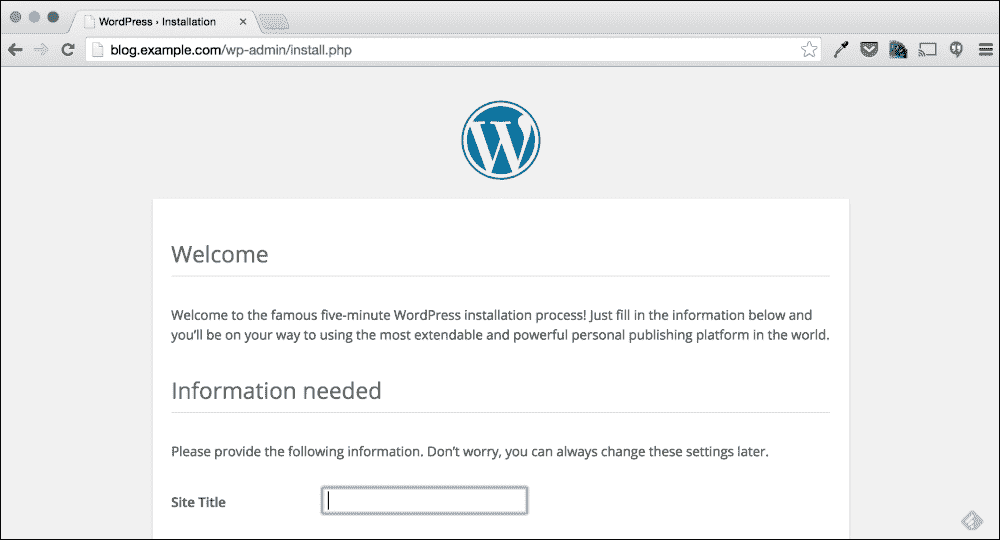
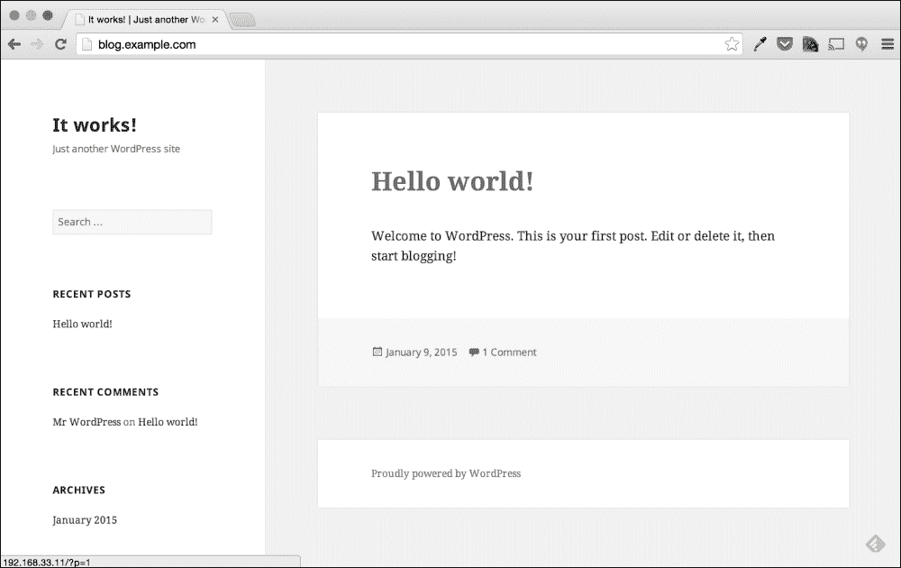

# 第三章。故障排除 Web 应用程序

在本书的第一章和第二章中，我们介绍了故障排除过程、信息的常见位置和有用的故障排除命令。在本章中，我们将通过一个示例问题来运行，以演示多种故障排除和补救步骤。特别是，我们将看一下解决基于 Web 的应用程序问题所需的步骤。

在本章中，我将逐步介绍故障排除过程的每一步，并解释每一步背后的原因。虽然本章涵盖的问题可能不是一个非常常见的问题，但重要的是看待解决问题的过程和使用的工具。本章中使用的过程和工具可以应用于大多数 Web 应用程序问题。

# 一个小小的背景故事

在本书的每一章中，您都会找到一个示例问题，涵盖了常见的故障排除主题。虽然本书的重点是展示解决这些类型问题所需的命令和概念，但展示解决问题的过程也是很重要的。为了做到这一点，我们将探讨这些问题，就好像我们是最近加入新公司的新系统管理员一样。

每个问题都会以稍微不同的方式呈现，但每个问题都将以报告问题的方式开始。

# 报告的问题

在新公司开始新角色时，我们被指派接听公司**网络运营中心**（**NOC**）的电话。在这个角色中，我们将专注于解决公司环境中的问题，并且期望能够非常快速地解决问题。对于我们的第一个问题，我们接到了一个电话；在电话的另一端是一个有问题的业务用户。*突然间，我们的博客显示的是一个安装页面，而不是我们的帖子！*

既然我们已经有了一个报告的问题，让我们开始逐步进行故障排除过程。

# 数据收集

如果我们回顾一下第一章，*故障排除最佳实践*，故障排除过程的第一步是理解问题陈述。在本节中，我们将探讨问题是如何报告的，并尝试收集任何数据，以找到问题的根本原因。

在这个示例中，我们是通过电话通知的问题。这实际上是幸运的，因为我们有一个最终用户在电话那头，可以向他/她提问以获取更多信息。

在要求报告问题的人提供更多信息之前，让我们先看看已经得到的回答。*突然间，我们的博客显示的是一个安装页面，而不是我们的帖子！*

一开始，你可能觉得这个问题陈述模糊不清；这是因为它确实模糊不清。然而，在这个简单的句子中仍然包含了相当多有用的信息。如果我们分析一下报告的问题，我们就可以更好地理解问题。

+   “我们的博客显示的是一个安装页面”

+   “突然间”

+   “不是我们的帖子！”

从这三个部分中，我们可以假设以下内容：

+   博客显示了一个意外的页面

+   这个博客以前显示过帖子

+   在某个时候，这种情况发生了变化，而且似乎是最近发生的

虽然以上内容对于确定是否存在问题以及问题的相关性是一个不错的开始，但它还不足以让我们得出假设。

## 提问

为了制定假设，我们需要更多信息。获取这些信息的一种方法是询问报告问题的人。为了获取更多信息，我们将向业务用户提出以下问题：

1.  你上次看到博客工作是什么时候？

昨晚。

1.  博客的地址是什么？

`http://blog.example.com`

1.  你有收到其他错误吗？

没有。

虽然以上问题还不足以确定问题，但它们给了我们一个开始寻找问题的起点。

## 复制问题

如前所述，在第一章中，*故障排除最佳实践*中找到信息的最佳方法之一是复制问题。在这种情况下，似乎我们可以通过简单地访问提供的地址来复制问题。



在前面的屏幕截图中，我们可以看到博客的表现与用户描述的一样。当我们访问提供的 URL 时，我们看到了一个默认的 WordPress 安装界面。

这是否给我们提供了关于问题原因的任何线索？不，实际上并没有，除非我们之前见过这个问题。虽然这可能不告诉我们问题的原因，但它确实确认了用户报告的问题是可以重现的。这一步还告诉了我们正在排查的软件的名称：WordPress。

WordPress 是最流行的开源博客平台之一。在本章中，我们假设我们没有管理 WordPress 的经验，需要通过在线来源找到我们需要的关于这个 Web 应用程序的任何信息。

## 了解环境

由于我们是新的系统管理员，在这一点上，我们对这个环境知之甚少，这意味着我们对这个博客是如何部署的知之甚少。事实上，我们甚至不知道它是从哪个服务器运行的。

### 这个博客托管在哪里？

然而，我们知道的一件事是，我们公司管理的所有服务器的 IP 都在 192.168.0.0/16 子网内。为了确定这是否是我们可以解决的问题，我们首先需要确定博客是否在我们公司管理的服务器上。如果这个博客不是在我们公司管理的服务器上，我们的故障排除选项可能会受到限制。

确定博客托管位置的一种方法是简单地查找`blog.example.com`地址的 IP 地址。

#### 使用 nslookup 查找 IP

有许多方法可以查找 DNS 名称的 IP 地址；我们将讨论的命令是`nslookup`命令。要使用这个命令，只需执行`nslookup`，然后是要查找的 DNS 名称：例如，对于这个例子，是`blog.example.com`。

```
$ nslookup blog.example.com
Server:    192.0.2.1
Address:  192.0.2.1#53

Non-authoritative answer:
Name:  blog.example.com
Address: 192.168.33.11

```

在前面的输出中，对于那些不熟悉`nslookup`的人来说，结果可能有点令人困惑。

```
Non-authoritative answer:
Name:  blog.example.com
Address: 192.168.33.11

```

我们知道前面的信息是`nslookup`查询的结果。这个块表示`blog.example.com`域的地址是`192.168.33.11`。`nslookup`的输出的第一个块只是告诉我们使用了哪个 DNS 服务器来查找这些信息。

```
Server:    192.0.2.1
Address:  192.0.2.1#53

```

从这个块中我们可以看到使用的 DNS 服务器是`192.0.2.1`。

#### ping、dig 或其他工具呢？

有许多命令可以用来查找这个域的 IP 地址。我们可以使用`dig`、`host`，甚至`ping`。我们选择`nslookup`命令的原因是，它大多数情况下都包含在大多数操作系统中。因此，无论您需要从 Windows、Mac 还是 Linux 桌面查找 IP 地址，您都可以使用`nslookup`命令。

然而，`nslookup`命令的一个注意事项是，它专门使用 DNS 来查找地址。它不尊重`/etc/hosts`中的值或`/etc/nsswitch.conf`中指定的任何其他名称服务。这是我们将在后面的章节中更多探讨的内容；现在，我们将假设`192.168.33.11`的 IP 地址是正确的。

### 好的，它在我们的环境中；现在怎么办？

由于我们正在使用 Linux 服务器，管理该服务器的最常见方式是通过**Secure Shell**（**SSH**）。SSH 是一种安全的网络服务，允许用户远程访问服务器的 shell。对于本书，我们将假设您已经熟悉通过 SSH 登录服务器。无论您使用 SSH 命令行客户端还是像 PuTTY 这样的桌面客户端，我们假设您能够使用 SSH 登录服务器。

在这种情况下，我们使用的是一个具有自己 shell 环境的笔记本电脑。要登录到我们的服务器，我们只需从终端窗口执行`ssh`命令。

```
$ ssh vagrant@blog.example.com
vagrant@blog.example.com's password:

```

登录后，我们执行的第一个信息收集命令是`w`命令。

```
$ w
 18:32:17 up 2 days, 12:05,  1 user,  load average: 0.11, 0.08, 0.07
USER     TTY        LOGIN@   IDLE   JCPU   PCPU WHAT
vagrant  pts/1     00:53    2.00s  0.00s  0.08s sshd: vagrant [priv]

```

在第二章中，*故障排除命令和有用信息的来源*，我们介绍了`w`命令，并提到它是第一个执行的命令。我们可以在`w`命令的输出中看到相当多有用的信息。

从这个输出中，我们可以确定以下内容：

+   当前只有 1 个用户登录（这是我们的登录会话）

+   问题的服务器已经运行了 2 天

+   负载平均值很低，这表明正常

总的来说，乍一看，服务器似乎表现正常。问题是昨晚开始的，这表明问题并不是在 2 天前的重启之后开始的。负载平均值低，因此在这一点上可以安全地假设问题与系统负载无关。

### 安装并运行了哪些服务？

由于我们以前从未登录过这台服务器，并且对这个环境完全不熟悉，我们应该首先找出这台服务器上运行着哪些服务。

由于我们从安装页面得知博客是 WordPress 博客，我们可以搜索 Google 关于它所需服务的信息。我们可以通过使用搜索词“WordPress 安装要求”来做到这一点。

这个搜索字符串返回了以下 URL 作为第一个结果：[`wordpress.org/about/requirements/`](https://wordpress.org/about/requirements/)。这个页面包含了 WordPress 的安装要求，并列出了以下内容：

+   PHP 5.2.4

+   MySQL 5.0 或更高版本

+   要么是 Apache 要么是 Nginx Web 服务器

从我们可以访问安装页面这一事实，我们可以假设已安装并且部分工作的是一个 Web 服务器和 PHP。然而，最好的做法是验证而不是假设。

#### 验证 Web 服务器

由于 WordPress 推荐使用**Apache**或**Nginx** Web 服务器，我们首先需要确定安装了哪一个，更重要的是，确定这个 WordPress 应用程序正在使用哪一个。

以下是几种识别已安装和正在运行的 Web 服务器的方法：

+   我们可以使用`rpm`来查看已安装的软件包。

+   我们可以使用`ps`来查看正在运行的进程

+   我们可以简单地通过浏览器访问一个不存在的页面，看看错误页面显示的是哪个 Web 服务器在运行

+   我们还可以进入`/var/logs`并查看周围存在或不存在的日志文件

所有这些方法都是有效的，并且都有自己的好处。在这个例子中，我们将使用一个*第五*种方法（之前没有提到过），它将回答关于这个服务器上 Web 服务器配置的两个问题。

这种方法的第一步将是确定哪个进程在端口 80 上监听。

```
$ su -
# netstat -nap | grep 80
tcp6       0      0 :::80                   :::* LISTEN      952/httpd
unix  3      [ ]         STREAM     CONNECTED     17280  1521/master

```

如第二章中所讨论的，*故障排除命令和有用信息的来源*，`netstat`命令可以用来确定使用`-na`标志的端口。如果我们简单地添加`-p`（端口）标志到`netstat`，我们还可以看到每个端口上监听的进程。

### 提示

为了确定每个端口上监听的进程，必须以**超级用户**级别权限执行`netstat`命令。因此，我们使用`su`命令在执行`netstat`之前切换到**root**用户。

在本书中，任何以`$`开头的命令都是作为非特权用户运行的，而以`#`开头的命令是作为 root 用户执行的。

端口 80 是 HTTP 请求的默认端口；因此，如果我们回顾一下复制问题的步骤，我们可以看到使用的地址是`http://blog.example.com`。由于这是一个 HTTP 地址，没有指定不同的端口，这意味着提供 WordPress 安装页面的服务正在监听 80 端口。

从`netstat`命令的输出中，我们可以看到进程 952 正在监听 80 端口。`netstat`输出还显示进程 952 正在运行`httpd`二进制文件。在 RHEL 系统上，这个`httpd`二进制文件往往是 Apache。

我们可以使用`ps`命令和第二章, *故障排除命令和有用信息来源*中讨论的`–elf`标志来验证这一点。我们还将使用`grep`命令搜索`ps`命令的输出，搜索字符串"952"：

```
$ ps -elf | grep 952
4 S root       952     1  0  80   0 - 115050 poll_s Jan11 ? 00:00:07 /usr/sbin/httpd -DFOREGROUND
5 S apache    5329   952  0  80   0 - 115050 inet_c 08:54 ? 00:00:00 /usr/sbin/httpd -DFOREGROUND
5 S apache    5330   952  0  80   0 - 115050 inet_c 08:54 ? 00:00:00 /usr/sbin/httpd -DFOREGROUND
5 S apache    5331   952  0  80   0 - 115050 inet_c 08:54 ? 00:00:00 /usr/sbin/httpd -DFOREGROUND
5 S apache    5332   952  0  80   0 - 115050 inet_c 08:54 ? 00:00:00 /usr/sbin/httpd -DFOREGROUND
5 S apache    5333   952  0  80   0 - 119196 inet_c 08:54 ? 00:00:00 /usr/sbin/httpd -DFOREGROUND

```

通过上面的输出，我们可以看到进程 952 及其子进程是在**apache**用户下运行的。这证实了所使用的软件很可能是 Apache，但为了更加谨慎，我们可以使用`httpd`二进制文件和`–version`标志来打印 Web 服务器软件的版本。

```
$ httpd -version
Server version: Apache/2.4.6
Server built:   Jul 23 2014 14:48:00

```

`httpd`二进制文件的输出显示，它实际上是 Apache Web 服务器，符合 WordPress 的要求。

到目前为止，我们已经发现了关于此服务器使用的 Web 服务器的以下事实：

+   Web 服务器是 Apache

+   Apache 进程正在运行

+   Apache 版本是 2.4.6

+   Apache 进程正在监听 80 端口

也可以通过其他方法识别相同的信息，比如使用`rpm`。这种方法的好处是，如果服务器安装了两个 Web 服务器服务，我们就知道这些服务中的哪一个正在监听 80 端口。这也告诉我们哪个服务提供了 WordPress 安装页面。

#### 验证数据库服务

常见的 WordPress 实现是在一个服务器上同时运行 Apache、PHP 和 MySQL 服务。然而，有时 MySQL 服务会从另一个服务器或多个服务器上运行。为了更好地了解环境，我们应该检查这个环境是在本地运行 MySQL 还是从另一个服务器运行。

为了检查这一点，我们将再次使用`ps`命令；不过这一次，我们将使用`grep`来搜索与字符串"mysql"匹配的进程：

```
$ ps -elf | grep mysql
4 S mysql     2045     1  0  80   0 - 28836 wait   Jan12 ? 00:00:00 /bin/sh /usr/bin/mysqld_safe --basedir=/usr
0 S mysql     2203  2045  0  80   0 - 226860 poll_s Jan12 ? 00:00:42 /usr/libexec/mysqld --basedir=/usr --datadir=/var/lib/mysql --plugin-dir=/usr/lib64/mysql/plugin --log- error=/var/log/mariadb/mariadb.log --pid- file=/var/run/mariadb/mariadb.pid -- socket=/var/lib/mysql/mysql.sock

```

从前面的输出中可以看出，实际上有一个 MySQL 进程正在运行。还需要注意的是，`ps`输出显示`mysqld`进程正在使用以下选项：`–log-error=/var/log/mariadb/mariadb.log`。

这一点很重要，有两个原因：第一，这是`mysqld`进程的日志文件的位置，第二，这个日志文件是**MariaDB**的，与 MySQL 不同。

我们可以通过使用`rpm`和`egrep`命令来确认是否安装了 MySQL 或 MariaDB。

```
$ rpm -qa | egrep "(maria|mysql)"
php-mysql-5.4.16-23.el7_0.3.x86_64
mariadb-5.5.40-2.el7_0.x86_64
mariadb-server-5.5.40-2.el7_0.x86_64
mariadb-libs-5.5.40-2.el7_0.x86_64

```

`egrep`命令类似于`grep`；但是，它接受正则表达式形式的搜索字符串。在上面的命令中，我们使用`egrep`来搜索字符串"`mariadb`"或字符串"`mysql`"。从前面的输出中，我们可以看到这台服务器实际上安装了 MariaDB，但没有安装 MySQL。

有了这些信息，我们可以假设正在运行的`mysqld`进程实际上是一个 MariaDB 二进制文件。我们可以使用`rpm`命令和`–q`（查询）以及`–l`（列出所有文件）标志来验证这一点。

```
$ rpm -ql mariadb-server | grep "libexec/mysqld"
/usr/libexec/mysqld

```

我们可以从`rpm`命令的输出中看到，运行的`/usr/libexec/mysqld`二进制文件是作为**mariadb-server**软件包的一部分部署的。这表明运行的数据库进程实际上是 MariaDB，并且是通过 mariadb-server 软件包安装的。

到目前为止，我们已经发现了关于此服务器上运行的数据库服务的以下事实：

+   数据库服务实际上是 MariaDB

+   MariaDB 正在运行

+   此服务的日志文件位于`/var/log/mariadb/`

虽然 MariaDB 是 MySQL 的可替代品，但 WordPress 的要求中并未将其列为首选数据库服务。重要的是要注意这种差异，因为它可能确定报告的问题的根本原因。

#### 验证 PHP

由于我们知道 WordPress 需要 PHP，我们还应该检查它是否已安装。我们可以再次使用`rpm`命令验证这一点。

```
$ rpm -qa | grep php
php-mbstring-5.4.16-23.el7_0.3.x86_64
php-mysql-5.4.16-23.el7_0.3.x86_64
php-enchant-5.4.16-23.el7_0.3.x86_64
php-process-5.4.16-23.el7_0.3.x86_64
php-xml-5.4.16-23.el7_0.3.x86_64
php-simplepie-1.3.1-4.el7.noarch
php-5.4.16-23.el7_0.3.x86_64
php-gd-5.4.16-23.el7_0.3.x86_64
php-common-5.4.16-23.el7_0.3.x86_64
php-pdo-5.4.16-23.el7_0.3.x86_64
php-PHPMailer-5.2.9-1.el7.noarch
php-cli-5.4.16-23.el7_0.3.x86_64
php-IDNA_Convert-0.8.0-2.el7.noarch
php-getid3-1.9.8-2.el7.noarch

```

PHP 本身并不是设计为像 Apache 或 MySQL 那样作为服务运行，而是作为 Web 服务器模块。但是，可以使用诸如`php-fpm`之类的服务作为应用程序服务器。这允许 PHP 作为服务运行，并由上游 Web 服务器调用。

要检查此服务器是否运行`php-fpm`或任何其他用于前端 PHP 的服务，我们可以再次使用`ps`和`grep`命令。

```
$ ps -elf | grep php
0 S root      6342  5676  0  80   0 - 28160 pipe_w 17:53 pts/0    00:00:00 grep --color=auto php

```

通过使用`ps`命令，我们没有看到任何特定的 PHP 服务；然而，当访问博客时，我们能够看到安装页面。这表明 PHP 配置为直接通过 Apache 运行。我们可以通过再次执行带有`-M`（模块）标志的`httpd`二进制文件来验证这一点。

```
$ httpd -M | grep php
 php5_module (shared)

```

`-M`标志将告诉`httpd`二进制文件列出所有加载的模块。在此列表中包括`php5_module`，这意味着 Apache 的此安装能够通过`php5_module`运行 PHP 应用程序。

##### 已安装并正在运行的服务摘要

在这一点上，我们已经从我们的数据收集中确定了以下内容：

+   已安装并运行了 Apache 的 WordPress 要求

+   MariaDB 似乎满足了 WordPress 对 MySQL 的要求，已安装并运行

+   已安装并似乎正在运行 WordPress 的 PHP 要求

+   看起来 WordPress 部署在单服务器设置中，而不是多服务器设置中

我们暂时可以假设这些事实意味着问题不是由缺少 WordPress 要求引起的。

通过收集所有这些数据点，我们不仅了解了我们正在解决故障的环境，还排除了这个问题的几种可能原因。

## 寻找错误消息

现在已经确定了已安装和配置的服务，我们知道从哪里开始查找错误或有用的消息。在数据收集的下一阶段，我们将浏览这些服务的各种日志文件，以尝试识别可能指示此问题原因的任何错误。

### Apache 日志

由于 Apache 在进行 Web 请求时调用 PHP，最有可能包含与 PHP 相关错误的日志文件是 Apache 错误日志。RHEL 的`httpd`软件包的默认日志位置是`/var/log/httpd/`。但是，我们还不知道运行的`httpd`服务是否是 RHEL 打包版本。

#### 查找 Apache 日志的位置

由于我们不知道 Apache 日志的位置，我们需要找到它们。查找日志文件的一种方法是简单地在`/var/log`中查找与所讨论服务的名称匹配的任何文件或文件夹。然而，这种解决方案对于我们的例子来说太简单了。

要找到`httpd`日志文件的位置，我们将使用第二章中讨论的一种方法，*故障排除命令和有用信息来源*，并搜索服务的配置文件。`/etc`文件夹是系统配置文件的默认文件夹。它也是服务配置的标准位置。因此，可以相当安全地假设`/etc/`文件夹将包含`httpd`服务的配置文件或文件夹。

```
# cd /etc/httpd/
# ls -la
total 20
drwxr-xr-x.  5 root root   86 Jan  7 23:29 .
drwxr-xr-x. 79 root root 8192 Jan 13 16:10 ..
drwxr-xr-x.  2 root root   35 Jan  7 23:29 conf
drwxr-xr-x.  2 root root 4096 Jan  7 23:29 conf.d
drwxr-xr-x.  2 root root 4096 Jan  7 23:29 conf.modules.d
lrwxrwxrwx.  1 root root   19 Jan  7 23:29 logs -> ../../var/log/httpd
lrwxrwxrwx.  1 root root   29 Jan  7 23:29 modules -> ../../usr/lib64/httpd/modules
lrwxrwxrwx.  1 root root   10 Jan  7 23:29 run -> /run/httpd

```

在前面的命令中，我们可以看到我们可以切换到包含多个配置文件的`/etc/httpd`文件夹。由于我们不知道哪个配置文件包含日志配置，我们可能需要花费相当长的时间阅读每个配置文件。

为了加快这个过程，我们可以使用`grep`命令来搜索所有文件中的字符串“`log`”。由于`/etc/httpd/`文件夹包含子文件夹，我们可以简单地添加`-r`（递归）标志，使`grep`命令搜索这些子文件夹中包含的文件。

```
# grep -r "log" /etc/httpd/*
./conf/httpd.conf:# with "/", the value of ServerRoot is prepended -- so 'log/access_log'
./conf/httpd.conf:# server as '/www/log/access_log', whereas '/log/access_log' will be
./conf/httpd.conf:# interpreted as '/log/access_log'.
./conf/httpd.conf:# container, that host's errors will be logged there and not here.
./conf/httpd.conf:ErrorLog "logs/error_log"
./conf/httpd.conf:# LogLevel: Control the number of messages logged to the error_log.
./conf/httpd.conf:<IfModule log_config_module>
./conf/httpd.conf:    <IfModule logio_module>
./conf/httpd.conf:    # define per-<VirtualHost> access log files, transactions will be
./conf/httpd.conf:    # logged therein and *not* in this file.
./conf/httpd.conf:    #CustomLog "logs/access_log" common
./conf/httpd.conf:    # If you prefer a log file with access, agent, and referer information
./conf/httpd.conf:    CustomLog "logs/access_log" combined
./conf.modules.d/00-base.conf:LoadModule log_config_module modules/mod_log_config.so
./conf.modules.d/00-base.conf:LoadModule logio_module modules/mod_logio.so
./conf.modules.d/00-base.conf:#LoadModule log_debug_module modules/mod_log_debug.so

```

### 提示

```
While there is quite a bit of output from the preceding grep command, if we review the returned data, we can see that there are actually two log files defined for the httpd service: logs/access_log and logs/error_log.
```

```
./conf/httpd.conf:ErrorLog "logs/error_log"
./conf/httpd.conf:    CustomLog "logs/access_log" combined

```

定义的日志使用相对路径`logs/`；这个路径是相对于运行文件夹的`httpd`服务。在这种情况下，这意味着日志文件夹实际上是`/etc/httpd/logs`；然而，这并不总是这种情况。要验证是否是这种情况，我们可以简单地在`/etc/httpd`文件夹中使用`ls`命令进行文件夹列表。

```
# ls -la /etc/httpd | grep logs
lrwxrwxrwx.  1 root root   19 Jan  7 23:29 logs -> ../../var/log/httpd

```

从`ls`命令中，我们可以看到`/etc/httpd/logs`存在；然而，这不是一个文件夹，而是一个符号链接到`/var/log/httpd/`。这意味着这两个日志文件，即`access_log`和`error_log`，实际上位于`/var/log/httpd/`文件夹内。

#### 审查日志

现在我们知道日志文件的位置，我们可以搜索这些日志文件以获取任何有用的信息。为此，我们将使用`tail`命令。

`tail`命令是一个有用的命令，可以用来读取文件的最后部分。默认情况下，当`tail`没有任何标志地执行时，该命令将打印指定文件的最后 10 行。

对于我们的故障排除，我们不仅想看到最后 10 行数据，还想观察文件是否有任何新的数据被追加。为此，我们可以使用`-f`（跟踪）标志，告诉`tail`跟踪指定的文件。

```
# tail -f logs/access_log logs/error_log
==> logs/access_log <==
192.168.33.1 - - [12/Jan/2015:04:39:08 +0000] "GET /wp-includes/js/wp-util.min.js?ver=4.1 HTTP/1.1" 200 981 "http://blog.example.com/wp-admin/install.php" "Mozilla/5.0 (Macintosh; Intel Mac OS X 10_10_1) AppleWebKit/537.36 (KHTML, like Gecko) Chrome/39.0.2171.95 Safari/537.36"
"http://blog.example.com/wp-admin/install.php" "Mozilla/5.0 (Macintosh; Intel Mac OS X 10_10_1) AppleWebKit/537.36 (KHTML, like Gecko) Chrome/39.0.2171.95 Safari/537.36"
192.168.33.1 - - [12/Jan/2015:04:39:08 +0000] "GET /wp-admin/js/password-strength-meter.min.js?ver=4.1 HTTP/1.1" 200 737 "http://blog.example.com/wp-admin/install.php" "Mozilla/5.0 (Macintosh; Intel Mac OS X 10_10_1) AppleWebKit/537.36 (KHTML, like Gecko) Chrome/39.0.2171.95 Safari/537.36"
::1 - - [13/Jan/2015:16:08:33 +0000] "GET / HTTP/1.1" 302 - "-" "curl/7.29.0"
192.168.33.11 - - [13/Jan/2015:16:10:19 +0000] "GET / HTTP/1.1" 302 - "-" "curl/7.29.0"

==> logs/error_log <==
[Sun Jan 11 06:01:03.679890 2015] [auth_digest:notice] [pid 952] AH01757: generating secret for digest authentication ...
[Sun Jan 11 06:01:03.680719 2015] [lbmethod_heartbeat:notice] [pid 952] AH02282: No slotmem from mod_heartmonitor
[Sun Jan 11 06:01:03.705469 2015] [mpm_prefork:notice] [pid 952] AH00163: Apache/2.4.6 (CentOS) PHP/5.4.16 configured -- resuming normal operations
[Sun Jan 11 06:01:03.705486 2015] [core:notice] [pid 952] AH00094: Command line: '/usr/sbin/httpd -D FOREGROUND'

```

### 提示

RHEL 7 实现的`tail`命令实际上可以同时跟踪多个文件。要做到这一点，只需在执行命令时指定您希望读取或跟踪的所有文件。上面是使用`tail`同时读取两个文件的示例。

虽然最后 10 行没有立即由 PHP 错误引起的错误，但这并不一定意味着这些文件不会显示我们需要的错误。由于这是一个基于 Web 的应用程序，我们可能需要加载应用程序以触发任何错误。

我们可以简单地打开我们的浏览器，再次导航到`http://blog.example.com`。然而，对于这个例子，我们将利用一个非常有用的故障排除命令：`curl`。

##### 使用 curl 调用我们的 Web 应用程序

`curl`命令可以用作客户端来访问许多不同类型的协议，从 FTP 到 SMTP。这个命令在故障排除 Web 应用程序时特别有用，因为它可以用作 HTTP 客户端。

在故障排除 Web 应用程序时，您可以使用`curl`命令向指定的 URL 发出`HTTP`，`GET`或`POST`请求，当以`-v`（详细）标志的详细模式放置时，可以产生相当多的有趣信息。

```
$ curl -v http://blog.example.com
* About to connect() to blog.example.com port 80 (#0)
*   Trying 192.168.33.11...
* Connected to blog.example.com (192.168.33.11) port 80 (#0)
> GET / HTTP/1.1
> User-Agent: curl/7.29.0
> Host: blog.example.com
> Accept: */*
>
< HTTP/1.1 302 Found
< Date: Tue, 13 Jan 2015 21:10:51 GMT
< Server: Apache/2.4.6 PHP/5.4.16
< X-Powered-By: PHP/5.4.16
< Expires: Wed, 11 Jan 1984 05:00:00 GMT
< Cache-Control: no-cache, must-revalidate, max-age=0
< Pragma: no-cache
< Location: http://blog.example.com/wp-admin/install.php
< Content-Length: 0
< Content-Type: text/html; charset=UTF-8
<
* Connection #0 to host blog.example.com left intact

```

前面的输出显示了我想要强调的四个关键信息。

```
* Connected to blog.example.com (192.168.33.11) port 80 (#0)

```

前一行显示了当我们访问名为`blog.example.com`的页面时，我们实际上去了`192.168.33.11`服务器。虽然我们已经确定`blog.example.com`解析为`192.168.33.11`，但这行确认了这个命令的输出产生了来自预期系统的数据。

```
< HTTP/1.1 302 Found

```

第二个关键信息显示了 Web 服务器提供的 HTTP 状态代码。

在这种情况下，Web 服务器以`302`状态代码回复，用于指示临时重定向。当浏览器请求页面并且 Web 服务器以 302 状态代码回复时，浏览器知道将最终用户重定向到另一个页面。

```
< Location: http://blog.example.com/wp-admin/install.php

```

下一个页面由**Location** HTTP 标头确定。这个标头由 Web 服务器分配，以及 302 的 HTTP 状态代码将导致任何浏览器将最终用户重定向到`/wp-admin/install.php`页面。

这解释了为什么当我们导航到`blog.example.com`时会看到一个安装页面，因为 Web 服务器只是以 302 重定向简单地响应。

```
< X-Powered-By: PHP/5.4.16

```

第四个关键信息是 HTTP 头**X-Powered-By**；这是 PHP 添加的 HTTP 头。当请求的页面被 PHP 处理时，PHP 会添加这个头，这意味着我们的 curl 请求实际上是由 PHP 处理的。

更重要的是，我们可以看到 PHP 的版本（5.4.16）符合 WordPress 规定的最低要求。

##### 请求非 PHP 页面

当请求一个非 PHP 页面时，我们可以看到 Web 服务器的回复中没有添加**X-Powered-By**头。我们可以通过请求一个无效的 URL 来验证这一点。

```
# curl -v http://192.168.33.11/sdfas
* About to connect() to 192.168.33.11 port 80 (#0)
*   Trying 192.168.33.11...
* Connected to 192.168.33.11 (192.168.33.11) port 80 (#0)
> GET /sdfas HTTP/1.1
> User-Agent: curl/7.29.0
> Host: 192.168.33.11
> Accept: */*
>
< HTTP/1.1 404 Not Found
< Date: Tue, 13 Jan 2015 21:18:57 GMT
< Server: Apache/2.4.6 PHP/5.4.16
< Content-Length: 203
< Content-Type: text/html; charset=iso-8859-1

```

当我们请求一个非 PHP 页面时，我们可以看到得到的输出中没有 X-Powered-By 头。这表明 Web 服务器没有将此页面处理为 PHP。

X-Powered-By 头的存在告诉我们，当我们请求`blog.example.com`页面时，它是由 PHP 处理的。这也意味着 302 的 HTTP 状态码是 WordPress 提供的响应。这一信息很重要，因为它意味着 PHP 很可能在没有任何问题的情况下处理页面，至少目前来看，排除了 PHP 作为报告问题的可能根本原因。

我们可以通过查看从上述 Web 请求生成的任何日志条目来进一步验证这一点。

##### 审查生成的日志条目

当使用`curl`进行上述请求时，我们应该已经导致新的日志消息被追加到两个`httpd`日志中。由于我们使用`tail`命令持续跟踪日志文件，我们可以返回到我们的终端并查看新的消息。

```
==> logs/access_log <==
192.168.33.11 - - [13/Jan/2015:23:22:17 +0000] "GET / HTTP/1.1" 302 - "-" "curl/7.29.0"

```

在我们对博客 URL 的 HTTP 请求之后，两个日志中唯一的条目是前面的一个。然而，这只是一个信息日志消息，而不是一个可以解释问题的错误。然而，信息日志消息也是一个关键的数据点。如果 PHP 代码或处理出现问题，类似以下的错误消息将会生成。

```
[Tue Jan 13 23:24:31.339293 2015] [:error] [pid 5333] [client 192.168.33.11:52102] PHP Parse error:  syntax error, unexpected 'endif' (T_ENDIF) in /var/www/html/wp-includes/functions.php on line 2574

```

PHP 错误的缺失实际上证实了 PHP 正在按预期工作。这与`curl`的结果结合起来，让我们有信心地假设 PHP 不是根本原因。

#### 我们从 httpd 日志中学到了什么

虽然`httpd`服务日志可能没有显示出可以解释为什么出现这个问题的错误，但它们已经帮助我们排除了一个可能的原因。在故障排除过程中，你经常会发现自己在找到问题的确切原因之前排除了许多可能的原因。前面提到的故障排除步骤就是这样，因此排除了可能的原因。

## 验证数据库

早些时候在检查哪些服务正在运行时，我们发现 MariaDB 服务正在运行。然而，我们没有验证我们是否可以访问该服务，或者 WordPress 应用程序是否可以访问这个数据库服务。

为了验证我们是否可以访问 MariaDB 服务，我们可以简单地使用`mysql`命令。

```
# mysql
Welcome to the MariaDB monitor.  Commands end with ; or \g.
Your MariaDB connection id is 28
Server version: 5.5.40-MariaDB MariaDB Server

Copyright (c) 2000, 2014, Oracle, Monty Program Ab and others.

Type 'help;' or '\h' for help. Type '\c' to clear the current input statement.

MariaDB [(none)]>

```

`mysql`命令实际上是一个 MariaDB 客户端命令。当以**root**用户的身份从命令行运行（如上所示）时，默认情况下，`mysql`命令将作为 MariaDB 的 root 用户登录到 MariaDB 服务。虽然这是默认行为，但是可以配置 MariaDB 服务禁止直接的根登录。

上述结果暗示了 MariaDB 允许直接的根登录，这表明 MariaDB 服务本身正在运行并接受连接。它们没有透露的是 WordPress 应用程序是否能够访问数据库。

为了确定这一点，我们需要使用与应用程序相同的用户名和密码登录到 MariaDB 服务。

### 验证 WordPress 数据库

为了使用与 WordPress 相同的凭据连接到 MariaDB 服务，我们需要获取这些凭据。我们可以向报告问题的人请求这些详细信息，但作为业务用户，他们很可能不知道。即使他们每天都在使用 WordPress，通常数据库用户名和密码是由一个人配置并且只在安装过程中使用。

这意味着我们必须自己找到这些信息。一种方法是查看 WordPress 的配置，因为每个连接到数据库的 Web 应用程序都必须从某个地方获取登录凭据，而最常见的方法是将它们存储在配置文件中。

这种方法的一个有趣挑战是，本章假设我们对 WordPress 知之甚少。找到 WordPress 存储其数据库凭据的位置将会有些棘手；特别是因为我们也不知道 WordPress 应用程序安装在哪里。

#### 查找 WordPress 的安装路径

我们知道的是，WordPress 是一个由`httpd`服务提供的 Web 应用程序。这意味着`httpd`服务将在其配置文件的某个地方定义安装路径。

`httpd`的默认配置是从默认文件夹中为单个域提供服务。默认文件夹可能会因发行版而有所不同，但一般来说，对于 RHEL 系统，它位于`/var/www/html`下。

可以配置`httpd`来为多个域提供服务；这是通过**虚拟主机**配置完成的。此时，我们不知道这个系统是配置为托管多个域还是单个域。

##### 检查默认配置

在默认的单域配置中，指向服务器 IP 的任何和所有域都将提供相同的`.html`或`.php`文件。通过虚拟主机，您可以配置 Apache 根据请求所涉及的域来提供特定的`.html`或`.php`文件。

我们可以通过执行简单的`grep`命令来确定`httpd`服务是配置为虚拟主机还是单域。

```
# grep -r "DocumentRoot" /etc/httpd/
/etc/httpd/conf/httpd.conf:# DocumentRoot: The folder out of which you will serve your
/etc/httpd/conf/httpd.conf:DocumentRoot "/var/www/html"
/etc/httpd/conf/httpd.conf:    # access content that does not live under the DocumentRoot.

```

由于`/etc/httpd`文件夹有多个子文件夹，我们再次使用了`-r`（递归）标志来进行`grep`。该命令在整个`/etc/httpd`文件夹结构中搜索**DocumentRoot**字符串。

DocumentRoot 是 Apache 配置项，指定包含指定域的`.html`或`.php`文件的本地文件夹。对于配置为多个域的系统，`DocumentRoot`设置将出现多次，而对于单域配置，只会出现一次。

从上面的输出中，我们可以看到在这台服务器上，`DocumentRoot`只定义了一次，并设置为`/var/www/html`。由于这是 RHEL 系统的默认设置，可以相当安全地假设`httpd`服务配置为单域配置。

为了验证这是否是 WordPress 的安装文件夹，我们可以简单地执行`ls`命令来列出此路径中的文件和文件夹。

```
# ls -la /var/www/html/
total 156
drwxr-xr-x.  5 root root  4096 Jan  9 22:54 .
drwxr-xr-x.  4 root root    31 Jan  7 23:29 ..
-rw-r--r--.  1 root root   418 Jan  9 21:48 index.php
-rw-r--r--.  1 root root  4951 Jan  9 21:48 wp-activate.php
drwxr-xr-x.  9 root root  4096 Jan  9 21:48 wp-admin
-rw-r--r--.  1 root root   271 Jan  9 21:48 wp-blog-header.php
-rw-r--r--.  1 root root  5008 Jan  9 21:48 wp-comments-post.php
-rw-r--r--.  1 root root  3159 Jan  9 22:01 wp-config.php
-rw-r--r--.  1 root root  2726 Jan  9 21:48 wp-config-sample.php
drwxr-xr-x.  6 root root    77 Jan  9 21:48 wp-content
-rw-r--r--.  1 root root  2956 Jan  9 21:48 wp-cron.php
drwxr-xr-x. 10 root root  4096 Jan 13 23:25 wp-includes
-rw-r--r--.  1 root root  2380 Jan  9 21:48 wp-links-opml.php
-rw-r--r--.  1 root root  2714 Jan  9 21:48 wp-load.php
-rw-r--r--.  1 root root 33435 Jan  9 21:48 wp-login.php
-rw-r--r--.  1 root root  8252 Jan  9 21:48 wp-mail.php
-rw-r--r--.  1 root root 11115 Jan  9 21:48 wp-settings.php
-rw-r--r--.  1 root root 25152 Jan  9 21:48 wp-signup.php
-rw-r--r--.  1 root root  4035 Jan  9 21:48 wp-trackback.php
-rw-r--r--.  1 root root  3032 Jan  9 21:48 xmlrpc.php

```

从`ls`命令的输出中，我们可以看到 WordPress 实际上是安装在`/var/www/html/`中的。我们可以根据大量的`.php`文件以及这些文件的"`wp-`"命名方案来得出这个结论。然而，下一步将对此进行确认。

#### 查找数据库凭据

现在我们已经确定了安装文件夹，我们只需要在 WordPress 应用程序的配置文件中找到数据库凭据。不幸的是，我们对 WordPress 并不是很熟悉，也不知道这些文件中哪些包含数据库凭据。

那么，我们要如何找到它们呢？当然是通过谷歌搜索。

正如我们在第一章中所介绍的，*故障排除最佳实践*，Google 可以成为系统管理员的好朋友。由于 WordPress 是一个常见的开源应用程序，很可能会有在线帮助文档，涵盖了如何配置或至少恢复数据库密码的内容。

要开始，我们只需通过 Google 搜索*WordPress 数据库配置*。在搜索 Google 时，我们发现其中一个最初的结果链接到 WordPress 论坛，一个用户询问在 WordPress 中如何找到数据库详细信息。

第一个答案是查看`wp-config.php`文件。

### 提示

虽然对于流行的开源项目来说，通过谷歌搜索这种类型的信息很容易，但对于闭源应用程序来说也同样有效，因为很多时候即使闭源应用程序也有在线文档，并被谷歌索引。

要获取数据库详细信息，我们可以使用`less`命令读取`wp-config.php`文件。`less`命令是一个简单的命令，允许用户通过命令行读取文件。对于大文件来说，这特别有用，因为它会缓冲输出，而不是像`cat`命令一样简单地将所有内容倒出到屏幕上。

```
# less /var/www/html/wp-config.php

// ** MySQL settings - You can get this information from your web host ** //
/** The name of the database for WordPress */
define('DB_NAME', 'wordpress');

/** MySQL database username */
define('DB_USER', 'wordpress');

/** MySQL database password */
define('DB_PASSWORD', 'password');

/** MySQL hostname */
define('DB_HOST', 'localhost');

```

通过阅读配置文件，我们可以清楚地看到数据库凭据，这些凭据方便地位于文件的顶部。以下是我们可以从该文件中提取的详细信息列表：

+   WordPress 正在尝试使用的数据库的`NAME`（`wordpress`）

```
define('DB_NAME', 'wordpress');
```

+   WordPress 正在尝试连接的`HOST`（`localhost`）

```
define('DB_HOST', 'localhost');
```

+   WordPress 正在尝试进行身份验证的`USER`（`wordpress`）数据库

```
define('DB_USER', 'wordpress');
```

+   `PASSWORD`（`password`）它用于身份验证

```
define('DB_PASSWORD', 'password');
```

有了上述详细信息，我们可以以与 WordPress 应用程序相同的方式连接到 MariaDB 服务。这将是我们故障排除过程中的关键步骤。

##### 以 WordPress 用户身份连接

现在我们有了数据库凭据，我们可以使用`mysql`命令再次测试连接性。要使用特定的用户名和密码连接到 MariaDB，我们需要使用`mysql`命令的`-u`（用户）和`-p`（密码）标志。

```
# mysql –uwordpress -p
Enter password: Welcome to the MariaDB monitor.  Commands end with ; or \g.
Your MariaDB connection id is 30
Server version: 5.5.40-MariaDB MariaDB Server
MariaDB [(none)]>

```

在上述命令中，我们可以看到我们在`-u`标志后添加了用户名，但没有在`-p`后包含密码。由于我们没有包含密码，`mysql`客户端在我们按回车键后简单地要求输入密码。虽然可以在`-p`后包含密码，但从安全的角度来看，这被认为是一种不好的做法。最好让`mysql`客户端要求输入密码，以减少密码被查看命令历史的人泄露的机会。

从`mysql`客户端连接，我们可以看到通过使用与 WordPress 相同的凭据，我们能够登录到 MariaDB 服务。这很重要，因为无法连接到数据库服务将影响 WordPress 应用程序，并可能是报告的问题的可能原因。

##### 验证数据库结构

由于我们可以使用 WordPress 凭据连接到 MariaDB 服务，接下来我们应该验证数据库结构是否存在且完整。

### 提示

在本节中，我们将从 MariaDB 命令行界面执行**结构化查询语言**（**SQL**）语句。这些语句不是 shell 命令，而是 SQL 查询。

SQL 是与 MySQL、MariaDB、Postgres 和 Oracle 等关系数据库交互的标准语言。虽然 SQL 不一定是每个管理员都需要了解的语言，但我建议任何支持大量数据库的系统管理员至少应该了解 SQL 的基础知识。

如果您支持的环境没有专门的数据库管理员来管理数据库和数据库服务，这一点尤其重要。

要验证的第一项是数据库本身是否已创建并可访问。我们可以通过使用`show databases`查询来做到这一点。

```
MariaDB [(none)]> show databases;
+--------------------+
| Database           |
+--------------------+
| information_schema |
| test               |
| wordpress          |
+--------------------+
3 rows in set (0.00 sec)

```

我们可以看到 WordPress 数据库实际上在这个输出中列出，这意味着它是存在的。为了验证 WordPress 数据库是可访问的，我们将使用`use` SQL 语句。

```
MariaDB [(none)]> use wordpress;
Database changed

```

通过`Database changed`的结果，似乎我们已经确认了数据库本身是创建并且可访问的。那么，这个数据库中的表呢？我们可以通过使用`show tables`查询来验证数据库表是否已经创建。

```
MariaDB [wordpress]> show tables;
+-----------------------+
| Tables_in_wordpress   |
+-----------------------+
| wp_commentmeta        |
| wp_comments           |
| wp_links              |
| wp_options            |
| wp_postmeta           |
| wp_posts              |
| wp_term_relationships |
| wp_term_taxonomy      |
| wp_terms              |
| wp_usermeta           |
| wp_users              |
+-----------------------+
11 rows in set (0.00 sec)

```

从结果来看，似乎存在相当多的表。

由于我们对 WordPress 还很陌生，有可能我们会缺少一个表，甚至不知道。由于 WordPress 在网上有很多文档，我们很可能会通过搜索*WordPress 数据库表列表*来找到一个表列表，这返回了 WordPress 文档页面上非常有用的数据库描述：([`codex.wordpress.org/Database_Description`](https://codex.wordpress.org/Database_Description))

通过比较`show tables`查询的输出和数据库描述页面，我们发现没有缺少表。

由于我们知道哪些表是存在的，我们应该检查这些表是否可访问；我们可以通过运行`select`查询来做到这一点。

```
MariaDB [wordpress]> select count(*) from wp_users;
ERROR 1017 (HY000): Can't find file: './wordpress/wp_users.frm' (errno: 13)

```

终于，我们找到了一个错误！

然而，我们发现的错误非常有趣，因为它不是您通常从 SQL 查询中看到的错误。事实上，这个错误似乎表明存在一个包含表数据的文件的问题。

#### 从数据库验证中我们学到了什么

在这一点上，经过验证数据库之后，我们学到了以下内容：

+   MariaDB 可以被 root 用户和 WordPress 应用程序访问

+   正在访问的数据库是由 WordPress 用户创建并可访问的

+   在查询数据库表中的一个时，会显示一个错误

有了这些信息，我们可以通过建立一个假设来进入故障排除过程的下一步。

# 建立假设

在故障排除过程的这个阶段，我们将收集到的所有信息，并用它来建立一个关于为什么出现问题以及如何解决问题的想法。

首先，让我们首先回顾一下我们从数据收集步骤中学到的东西。

+   一个已经建立的博客网站目前显示的是一个设计为仅在博客软件的初始安装期间显示的页面

+   这个博客使用开源软件 WordPress

+   WordPress 是用 PHP 编写的，并且利用了 Apache 和 MariaDB 服务

+   Apache 和 PHP 都正常工作，没有显示错误

+   WordPress 安装在`/var/www/html`目录下

+   MariaDB 服务正在运行并接受连接

+   WordPress 应用程序能够连接到数据库服务

+   当从数据库表中读取数据时，我们收到一个错误，表明包含数据库数据的文件存在问题

我们可以从所有这些数据点中得出的假设是：

在某个时候，MariaDB 的数据文件，特别是 WordPress 数据库，对 MariaDB 服务是不可访问的。当 WordPress 连接到数据库时，它似乎无法查询表；因此，它认为应用程序尚未安装。由于 WordPress 认为应用程序尚未安装，它呈现了一个安装页面。

我们可以根据以下关键信息点来制定这个假设：

1.  我们看到的唯一错误是来自 MariaDB 的错误。

1.  这个错误不是典型的 SQL 错误，消息本身表明存在访问数据库文件的问题。

1.  在 Apache 日志中没有 PHP 错误。

1.  关于 WordPress 环境的其他一切似乎都是正确的。

现在我们已经形成了一个假设，我们需要通过尝试解决问题来验证这一点。这将引导我们到故障排除过程的第三阶段：*试错*。

# 解决问题

在这个阶段，我们将尝试解决这个问题。为了做到这一点，让我们看看这些数据文件是什么，它们用于什么。

## 理解数据库数据文件

除了仅内存数据库之外，大多数数据库都有一种用于在文件系统上存储数据的文件；这通常被称为持久存储。MariaDB 和 MySQL 也不例外。

根据使用的数据库存储引擎，可能会有一个大文件或多个具有不同文件扩展名的文件。无论文件类型或文件存储在何处/如何存储，最终，如果这些文件无法访问，数据库将出现问题。

## 查找 MariaDB 数据文件

由于我们对这个环境还很陌生，我们目前不知道 MariaDB 数据文件存储在哪里。确定这些文件的位置将是纠正问题的第一步。识别数据文件夹的一种方法是查看数据库服务的配置文件。

由于`/etc`文件夹是大多数（但不是所有）配置文件的所在地，这是我们应该首先查找的地方。

```
# ls -la /etc/ | grep -i maria

```

为了确定正确的配置文件，我们可以使用`ls`命令列出`/etc`文件夹，并使用`grep`命令在结果中搜索包含`maria`字符串的内容。上述的`grep`命令使用了`-i`（不区分大小写）标志，这会导致`grep`搜索大写和小写字符串。如果文件夹或文件具有混合大小写名称，这可能会有所帮助。

由于我们的命令没有输出，所以在名称中没有包含`maria`的文件夹或文件。这意味着 MariaDB 服务的配置要么命名为我们不期望的名称，要么不在`/etc/`文件夹中。

由于 MariaDB 应该是 MySQL 的一个可替换的解决方案，我们还应该检查是否有一个名为`mysql`的文件夹或文件。

```
# ls -la /etc/ | grep –i mysql

```

看起来也没有与这个名称匹配的文件夹或文件。

我们可以使用`ls`命令来花费几个小时来寻找 MariaDB 的配置文件。幸运的是，有一种更快的方法来找到配置文件。

由于 MariaDB 是通过 RPM 软件包安装的，我们可以使用`rpm`命令列出软件包部署的所有文件和文件夹。早些时候在检查 MariaDB 的安装方式时，`rpm`命令显示了多个 MariaDB 软件包。我们感兴趣的软件包是`mariadb-server`软件包。该软件包安装了 MariaDB 服务以及默认配置文件。

早些时候，我们使用了`rpm`的`-q`和`-l`标志列出了该软件包部署的所有文件。如果我们只想限制查询到配置文件，我们可以使用`-q`和`-c`标志。

```
$ rpm -qc mariadb-server /etc/logrotate.d/mariadb
/etc/my.cnf.d/server.cnf
/var/log/mariadb/mariadb.log

```

从上面可以看出，`mariadb-server`软件包部署了三个配置文件。`mariadb.log`和`logrotate.d`文件不太可能包含我们正在寻找的信息，因为它们与日志记录过程有关。

这留下了`/etc/my.cnf.d/server.cnf`文件。我们可以使用`cat`命令读取这个文件。

```
# cat /etc/my.cnf.d/server.cnf
#
# These groups are read by the MariaDB server.
# Use it for options that only the server (but not clients) should see
#
# See the examples of server my.cnf files in /usr/share/mysql/
#

# this is read by the standalone daemon and embedded servers
[server]

# this is only for the mysqld standalone daemon
[mysqld]

# this is only for embedded server
[embedded]

# This group is only read by MariaDB-5.5 servers.
# If you use the same .cnf file for MariaDB of different versions,
# use this group for options that older servers don't understand
[mysqld-5.5]

# These two groups are only read by MariaDB servers, not by MySQL.
# If you use the same .cnf file for MySQL and MariaDB,
# you can put MariaDB-only options here
[mariadb]

[mariadb-5.5]

```

不幸的是，这个文件也不包含我们希望的数据文件夹的详细信息。然而，这个文件确实给了我们一个线索，告诉我们接下来应该去哪里找。

`server.conf`文件的父文件夹是`/etc/my.cnf.d`文件夹。文件夹名称末尾的`.d`很重要，因为这种命名约定在 Linux 中有特殊用途。`.d`（点 D）文件夹类型旨在允许用户简单地为服务添加一个文件或多个文件，以进行自定义配置。当服务启动时，该文件夹中的所有文件都会被读取，并应用配置。

这允许用户配置服务而无需编辑默认配置文件；他们可以通过在`.d`文件夹中创建一个新文件来简单地添加他们想要添加的配置。

重要的是要注意，这是一种配置方案，并非每个服务都支持这种方案。然而，似乎 MariaDB 服务确实支持这种方案。

然而，有趣的是，这个`.d`文件夹的名称。通常，`.d`配置文件夹的命名约定是服务名称或文件夹用途后跟`.d`。您可以在`/etc/cron.d`或`/etc/http/conf.d`文件夹中看到这一点。MariaDB 的`.d`文件夹的名称表明主配置文件可能被命名为`my.cnf`。

如果我们检查这样的文件是否存在，我们会发现确实存在。

```
# ls -la /etc/ | grep my.cnf
-rw-r--r--.  1 root root      570 Nov 17 12:28 my.cnf
drwxr-xr-x.  2 root root       64 Jan  9 18:20 my.cnf.d

```

这个文件似乎是主 MariaDB 配置文件，希望其中包含数据文件夹配置。要找出，我们可以使用`cat`命令读取这个文件。

```
# cat /etc/my.cnf
[mysqld]
datadir=/var/lib/mysql
socket=/var/lib/mysql/mysql.sock
# Disabling symbolic-links is recommended to prevent assorted security risks
symbolic-links=0
# Settings user and group are ignored when systemd is used.
# If you need to run mysqld under a different user or group,
# customize your systemd unit file for mariadb according to the
# instructions in http://fedoraproject.org/wiki/Systemd

[mysqld_safe]
log-error=/var/log/mariadb/mariadb.log
pid-file=/var/run/mariadb/mariadb.pid

#
# include all files from the config folder
#
!includedir /etc/my.cnf.d

```

正如预期的那样，这个文件实际上包含了数据文件夹的配置。

```
datadir=/var/lib/mysql

```

有了这些信息，我们现在可以对 WordPress 数据库的数据文件的当前状态进行故障排除。

## 解决数据文件问题

如果我们切换到`/var/lib/mysql`文件夹并使用`ls`命令列出文件夹内容，我们会看到相当多的数据库数据文件/文件夹。

```
# cd /var/lib/mysql/
# ls -la
total 28712
drwxr-xr-x.  6 mysql mysql     4096 Jan 15 00:20 .
drwxr-xr-x. 29 root  root      4096 Jan 15 05:40 ..
-rw-rw----.  1 mysql mysql    16384 Jan 15 00:20 aria_log.00000001
-rw-rw----.  1 mysql mysql       52 Jan 15 00:20 aria_log_control
-rw-rw----.  1 mysql mysql 18874368 Jan 15 00:20 ibdata1
-rw-rw----.  1 mysql mysql  5242880 Jan 15 00:20 ib_logfile0
-rw-rw----.  1 mysql mysql  5242880 Jan  9 21:39 ib_logfile1
drwx------.  2 mysql mysql     4096 Jan  9 21:39 mysql
srwxrwxrwx.  1 mysql mysql        0 Jan 15 00:20 mysql.sock
drwx------.  2 mysql mysql     4096 Jan  9 21:39 performance_schema
drwx------.  2 mysql mysql        6 Jan  9 21:39 test
drwx------.  2 mysql mysql     4096 Jan  9 22:55 wordpress

```

看起来，这台服务器上创建的每个数据库都存在于`/var/lib/mysql/`下的一个文件夹中。从`ls`输出中还可以看出，这些文件夹处于正常状态。由于问题出在 WordPress 数据库上，我们将专注于这个数据库，切换到`wordpress`文件夹。

```
# cd wordpress/
# ls -la
total 156
drwx------. 2 mysql mysql  4096 Jan  9 22:55 .
drwxr-xr-x. 6 mysql mysql  4096 Jan 15 00:20 ..
-rw-rw----. 1 mysql mysql    65 Jan  9 21:45 db.opt
----------. 1 root  root   8688 Jan  9 22:55 wp_commentmeta.frm
----------. 1 root  root  13380 Jan  9 22:55 wp_comments.frm
----------. 1 root  root  13176 Jan  9 22:55 wp_links.frm
----------. 1 root  root   8698 Jan  9 22:55 wp_options.frm
----------. 1 root  root   8682 Jan  9 22:55 wp_postmeta.frm
----------. 1 root  root  13684 Jan  9 22:55 wp_posts.frm
----------. 1 root  root   8666 Jan  9 22:55 wp_term_relationships.frm
----------. 1 root  root   8668 Jan  9 22:55 wp_terms.frm
----------. 1 root  root   8768 Jan  9 22:55 wp_term_taxonomy.frm
----------. 1 root  root   8684 Jan  9 22:55 wp_usermeta.frm
----------. 1 root  root   8968 Jan  9 22:55 wp_users.frm

```

在执行`ls`命令后，我们可以看到这个文件夹中的文件有些不寻常。

突出的问题只是所有的`.frm`文件都具有`000`的文件模式。这意味着所有者、组或其他 Linux 用户都无法读取或写入这些文件。这包括 MariaDB 运行的用户。

如果我们回顾一下从 MariaDB 收到的错误，我们会发现错误似乎支持这样的假设，即无效的权限实际上导致了问题。要纠正这个错误，我们只需要将权限重置为正确的值。

由于我们对 MariaDB 还很陌生，目前我们不知道这些值应该是什么。

幸运的是，有一种简单的方法可以弄清楚权限应该是什么：只需查看另一个数据库的文件权限。

如果我们回顾一下`/var/lib/mysql`文件夹的列表输出，我们会发现有几个文件夹。其中至少一个其他文件夹也应该是数据库的数据文件夹。要确定我们的`.frm`文件应该具有什么权限，我们只需要找到其他`.frm`文件。

```
# find /var/lib/mysql -name "*.frm" -ls
134481927   12 -rw-rw----   1 mysql    mysql        9582 Jan  9 21:39 /var/lib/mysql/mysql/db.frm
134481930   12 -rw-rw----   1 mysql    mysql        9510 Jan  9 21:39 /var/lib/mysql/mysql/host.frm
134481933   12 -rw-rw----   1 mysql    mysql       10630 Jan  9 21:39 /var/lib/mysql/mysql/user.frm
134481936   12 -rw-rw----   1 mysql    mysql        8665 Jan  9 21:39 /var/lib/mysql/mysql/func.frm
134481939   12 -rw-rw----   1 mysql    mysql        8586 Jan  9 21:39 /var/lib/mysql/mysql/plugin.frm
134481942   12 -rw-rw----   1 mysql    mysql        8838 Jan  9 21:39 /var/lib/mysql/mysql/servers.frm
134481945   12 -rw-rw----   1 mysql    mysql        8955 Jan  9 21:39 /var/lib/mysql/mysql/tables_priv.frm
134481948   12 -rw-rw----   1 mysql    mysql        8820 Jan  9 21:39 /var/lib/mysql/mysql/columns_priv.frm
134481951   12 -rw-rw----   1 mysql    mysql        8770 Jan  9 21:39 /var/lib/mysql/mysql/help_topic.frm
134309941   12 -rw-rw----   1 mysql    mysql        8700 Jan  9 21:39 /var/lib/mysql/mysql/help_category.frm

```

`find`命令是一个非常有用的故障排除命令，可以在许多不同的情况下使用。在我们的示例中，我们使用`find`命令通过`–name`标志搜索`/var/lib/mysql`文件夹中以“`.frm`”结尾的任何文件。`–ls`（文件夹列表）标志告诉`find`命令以长列表格式打印它找到的任何文件，这将显示每个文件的权限，而无需运行第二个命令。

从`find`命令的输出中，我们可以看到`.frm`文件的权限设置为`-rw-rw----`；这个的数字表示是`660`。这些权限似乎适用于我们的数据库表，并允许所有者和组读写这些文件。

为了重置 WordPress 数据文件的权限，我们将使用`chmod`命令。

```
# chmod -v 660 /var/lib/mysql/wordpress/*.frm
mode of '/var/lib/mysql/wordpress/wp_commentmeta.frm' changed from 0000 (---------) to 0660 (rw-rw----)
mode of '/var/lib/mysql/wordpress/wp_comments.frm' changed from 0000 (---------) to 0660 (rw-rw----)
mode of '/var/lib/mysql/wordpress/wp_links.frm' changed from 0000 (---------) to 0660 (rw-rw----)
mode of '/var/lib/mysql/wordpress/wp_options.frm' changed from 0000 (---------) to 0660 (rw-rw----)
mode of '/var/lib/mysql/wordpress/wp_postmeta.frm' changed from 0000 (---------) to 0660 (rw-rw----)
mode of '/var/lib/mysql/wordpress/wp_posts.frm' changed from 0000 (---------) to 0660 (rw-rw----)
mode of '/var/lib/mysql/wordpress/wp_term_relationships.frm' changed from 0000 (---------) to 0660 (rw-rw----)
mode of '/var/lib/mysql/wordpress/wp_terms.frm' changed from 0000 (---------) to 0660 (rw-rw----)
mode of '/var/lib/mysql/wordpress/wp_term_taxonomy.frm' changed from 0000 (---------) to 0660 (rw-rw----)
mode of '/var/lib/mysql/wordpress/wp_usermeta.frm' changed from 0000 (---------) to 0660 (rw-rw----)
mode of '/var/lib/mysql/wordpress/wp_users.frm' changed from 0000 (---------) to 0660 (rw-rw----)

```

在前面的命令中，使用了`–v`（详细）标志与`chmod`，以便我们可以看到每个文件的权限在命令执行时的变化。

### 验证

现在权限已经设置好，我们可以再次使用 SQL`select`查询进行验证。

```
MariaDB [wordpress]> select count(*) from wp_users;
ERROR 1017 (HY000): Can't find file: './wordpress/wp_users.frm' (errno: 13)

```

从上面的查询中，我们可以看到 MariaDB 访问这些文件仍然存在错误。这意味着我们可能没有纠正所有数据文件的问题。

```
# ls -la
total 156
drwx------. 2 mysql mysql  4096 Jan  9 22:55 .
drwxr-xr-x. 6 mysql mysql  4096 Jan 15 00:20 ..
-rw-rw----. 1 mysql mysql    65 Jan  9 21:45 db.opt
-rw-rw----. 1 root  root   8688 Jan  9 22:55 wp_commentmeta.frm
-rw-rw----. 1 root  root  13380 Jan  9 22:55 wp_comments.frm
-rw-rw----. 1 root  root  13176 Jan  9 22:55 wp_links.frm
-rw-rw----. 1 root  root   8698 Jan  9 22:55 wp_options.frm
-rw-rw----. 1 root  root   8682 Jan  9 22:55 wp_postmeta.frm
-rw-rw----. 1 root  root  13684 Jan  9 22:55 wp_posts.frm
-rw-rw----. 1 root  root   8666 Jan  9 22:55 wp_term_relationships.frm
-rw-rw----. 1 root  root   8668 Jan  9 22:55 wp_terms.frm
-rw-rw----. 1 root  root   8768 Jan  9 22:55 wp_term_taxonomy.frm
-rw-rw----. 1 root  root   8684 Jan  9 22:55 wp_usermeta.frm
-rw-rw----. 1 root  root   8968 Jan  9 22:55 wp_users.frm

```

通过查看`ls`命令的输出，我们可以看到与示例`.frm`文件的另一个不同之处。

```
134481927   12 -rw-rw----   1 mysql    mysql        9582 Jan  9 21:39 /var/lib/mysql/mysql/db.frm

```

`wordpress`文件夹中文件的所有者和组权限设置为`root`，而其他`.frm`文件的所有者和组为`mysql`用户。

`660`的权限意味着只有文件的所有者和组成员可以访问它。对于我们的 WordPress 文件，这意味着只有 root 用户和 root 组的任何成员可以访问这些文件。

由于 MariaDB 以`mysql`用户运行，MariaDB 服务仍然无法访问这些文件。我们可以使用`chown`命令重置所有权和组成员。

```
# chown -v mysql.mysql ./*.frm
changed ownership of './wp_commentmeta.frm' from root:root to mysql:mysql
changed ownership of './wp_comments.frm' from root:root to mysql:mysql
changed ownership of './wp_links.frm' from root:root to mysql:mysql
changed ownership of './wp_options.frm' from root:root to mysql:mysql
changed ownership of './wp_postmeta.frm' from root:root to mysql:mysql
changed ownership of './wp_posts.frm' from root:root to mysql:mysql
changed ownership of './wp_term_relationships.frm' from root:root to mysql:mysql
changed ownership of './wp_terms.frm' from root:root to mysql:mysql
changed ownership of './wp_term_taxonomy.frm' from root:root to mysql:mysql
changed ownership of './wp_usermeta.frm' from root:root to mysql:mysql
changed ownership of './wp_users.frm' from root:root to mysql:mysql

```

现在文件的所有权和组成员是`mysql`，我们可以重新运行我们的查询，看看问题是否已解决。

```
MariaDB [wordpress]> select count(*) from wp_users;
count(*)
1

```

最终，我们通过查询 WordPress 数据库表解决了错误。

## 最终验证

由于我们已解决了数据库错误，并且在故障排除过程中没有发现其他错误，下一个验证步骤是查看博客是否仍然显示安装屏幕。



通过从浏览器访问`http://blog.example.com`，我们现在可以看到我们不再收到安装页面，而是博客的首页。此时，问题似乎已经解决了。

一般来说，当处理由某人报告的问题时，最佳做法是让最初报告问题的人验证一切是否已恢复到预期状态。我见过许多情况，其中一个事件是由多个问题引起的，虽然更明显的问题很快得到解决，但其他问题往往被忽视。让用户验证我们已经解决了整个问题将有助于确保一切都已真正解决。

对于这种情况，当我们询问报告问题的业务用户是否问题已解决时，他/她回答说*一切看起来都修复了。谢谢！*

# 摘要

在本章中，我们通过使用在现实世界中可能经常发生的问题来走过了故障排除过程。我们详细介绍了故障排除过程的步骤 1、2 和 3，以收集数据、建立假设和解决问题；这些步骤在第一章*故障排除最佳实践*中有详细介绍。我们还使用了在第二章*故障排除命令和有用信息来源*中学到的几个命令和日志文件，以及一些新的命令。

虽然学习本章中使用的命令对于任何与 Web 应用程序一起工作的系统管理员来说都很重要，但更重要的是看我们遵循的过程。我们开始处理问题时对环境或应用程序没有先验知识，但通过一些基本的数据收集和反复试验，我们可以解决问题。

在下一章中，我们将使用相同的故障排除过程和类似的工具来解决性能问题。
