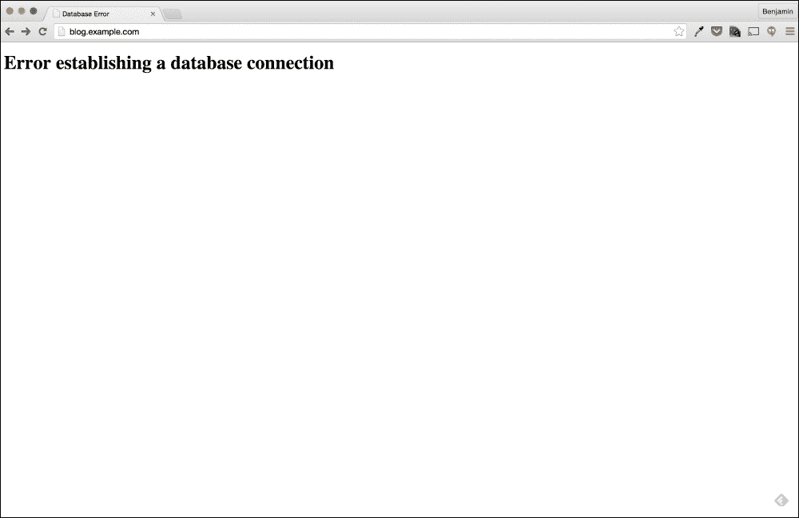

# 第五章：网络故障排除

在第三章中，*故障排除 Web 应用程序*，我们深入研究了故障排除 Web 应用程序；虽然我们解决了一个复杂的应用程序错误，但我们完全跳过了 Web 应用程序的网络方面。在本章中，我们将调查一个报告的问题，这将引导我们了解 DNS、路由，当然还有 RHEL 系统的网络配置等概念。

对于任何 Linux 系统管理员来说，网络是一项必不可少的技能。引用一位过去的讲师的话：

> 没有网络的服务器对每个人都是无用的。

作为系统管理员，您管理的每台服务器或台式机都将有某种网络连接。无论这种网络连接是在隔离的公司网络内还是直接连接到互联网，都涉及到网络。

由于网络是一个如此关键的主题，本章将涵盖网络和网络连接的许多方面；然而，它不会涵盖防火墙。防火墙故障排除和配置实际上将在第六章中进行，*诊断和纠正防火墙问题*。

# 数据库连接问题

在第三章中，*故障排除 Web 应用程序*，我们正在解决公司博客的问题。在本章中，我们将再次解决这个博客；然而，今天的问题有点不同。

到达当天后，我们接到一位开发人员的电话，他说：“WordPress 博客返回了一个无法连接到数据库的错误”。

# 数据收集

根据我们一直遵循的故障排除过程，下一步是尽可能收集关于问题的数据。信息的最佳来源之一是报告问题的人；对于这种情况，我们将问两个基本问题：

+   我如何复制问题并查看错误？

+   最近 WordPress 应用有什么变化吗？

当被问及时，开发人员表示我们只需在网页浏览器中访问博客就可以看到错误。在第二个问题上，开发人员告诉我们，数据库服务最近从 Web 服务器移动到了一个新的专用数据库服务器。他还提到这个移动是在几天前发生的，并且应用程序一直到今天都在工作。

由于数据库服务是几天前移动的，而且应用程序直到今天早上都在工作，所以这个改变不太可能引起问题。然而，我们不应该排除这种可能性。

## 复制问题

正如前几章讨论的，关键的数据收集任务是复制问题。我们这样做不仅是为了验证报告的问题是否确实存在，还为了找出可能没有被报告的任何其他错误。

由于开发人员表示我们可以直接访问博客来复制这个问题，我们将在网页浏览器中进行操作。



似乎我们可以很容易地复制这个问题。根据这个错误，似乎应用程序只是在说它在建立数据库连接时出现了问题。虽然这本身并不意味着问题与网络有关，但也可能是。问题也可能只是数据库服务本身的问题。

为了确定问题是网络问题还是数据库服务问题，我们首先需要找出应用程序配置为连接到哪个服务器。

## 查找数据库服务器

与上一章类似，我们将通过查看应用程序配置文件来确定应用程序使用的服务器。根据我们在第三章中的先前故障排除，*故障排除 Web 应用程序*，我们知道 WordPress 应用程序托管在`blog.example.com`上。首先，我们将登录到博客的 Web 服务器并查看 WordPress 配置文件。

```
$ ssh blog.example.com -l vagrant
vagrant@blog.example.com's password:
Last login: Sat Feb 28 18:49:40 2015 from 10.0.2.2
[blog]$

```

### 提示

由于我们将针对多个系统执行命令，因此本章的示例将在命令行提示中包含主机名，如`blog`或`db`。

我们在第三章中学到，WordPress 数据库配置存储在`/var/www/html/wp-config.php`文件中。为了快速搜索该文件以获取数据库信息，我们可以使用`grep`命令搜索字符串`DB`，因为在我们先前的事件中，该字符串出现在数据库配置中。

```
[blog]$ grep DB wp-config.php
define('DB_NAME', 'wordpress');
define('DB_USER', 'wordpress');
define('DB_PASSWORD', 'password');
define('DB_HOST', 'db.example.com');
define('DB_CHARSET', 'utf8');
define('DB_COLLATE', '');

```

通过上述内容，我们可以看到该应用程序当前配置为连接到`db.example.com`。简单的第一步故障排除是尝试手动连接到数据库。手动测试数据库连接的简单方法是使用`telnet`命令。

## 测试连接

`telnet`命令是一个非常有用的网络和网络服务故障排除工具，因为它旨在简单地建立到指定主机和端口的基于 TCP 的网络连接。在我们的例子中，我们将尝试连接到主机`db.example.com`的端口`3306`。

端口`3306`是 MySQL 和 MariaDB 的默认端口；在上一章中，我们已经确定了这个 Web 应用程序需要这两个数据库服务中的一个。由于在`wp-config.php`文件的配置中没有看到特定的端口，我们将假设数据库服务正在运行在这个默认端口上。

### 从 blog.example.com 进行 Telnet

首先，我们将从博客服务器本身执行`telnet`命令。从应用程序运行的同一服务器进行测试非常重要，因为这样可以在应用程序接收到错误的相同网络条件下进行测试。

为了使用 telnet 连接到我们的数据库服务器，我们将执行`telnet`命令，后面跟着我们希望连接到的主机名（`db.example.com`）和端口（`3306`）。

```
[blog]$ telnet db.example.com 3306
Trying 192.168.33.12...
telnet: connect to address 192.168.33.12: No route to host

```

Telnet 连接似乎失败了。有趣的是提供的错误；**无法连接到主机**错误似乎清楚地指示了潜在的网络问题。

### 从我们的笔记本电脑进行 Telnet

由于从博客服务器的连接尝试失败，并指示存在与网络相关的问题，我们可以尝试从我们的笔记本电脑进行相同的连接，以确定问题是在博客服务器端还是`db`服务器端。

为了从我们的笔记本电脑测试这种连接，我们可以再次使用`telnet`命令。尽管我们的笔记本电脑不一定运行 Linux 操作系统，但我们仍然可以使用这个命令。原因是`telnet`命令是一个跨平台实用程序；在本章中，我们将利用几个跨平台命令。虽然这样的命令可能不多，但一般来说，有几个命令适用于大多数操作系统，包括那些传统上没有广泛命令行功能的系统。

虽然一些操作系统已经从默认安装中删除了`telnet`客户端，但该软件仍然可以安装。在我们的例子中，笔记本电脑正在运行 OS X，该系统目前部署了`telnet`客户端。

```
[laptop]$ telnet db.example.com 3306
Trying 10.0.0.50...
Connected to 10.0.0.50.
Escape character is '^]'.
Connection closed by foreign host.

```

看起来我们的笔记本也无法连接到数据库服务；然而，这次错误不同。这次似乎表明连接尝试被远程服务关闭。我们也没有看到来自远程服务的消息，这表明连接从未完全建立。

使用`telnet`命令建立端口可用性的一个注意事项是，`telnet`命令将显示连接为**已连接**；然而，此时连接可能并没有真正建立。在使用 telnet 时的一般规则是，在收到来自远程服务的消息之前，不要假设连接成功。在我们的例子中，我们没有收到来自远程服务的消息。

## Ping

由于博客服务器和我们的笔记本都无法从“db”服务器进行 telnet 连接，我们应该检查问题是否仅限于数据库服务或整个服务器的连接。测试服务器之间的连接的一个工具是`ping`命令，就像`telnet`命令一样是一个跨平台实用程序。

要使用`ping`命令测试与主机的连接性，我们只需执行命令，然后跟随我们希望`ping`的主机。

```
[blog]$ ping db.example.com
PING db.example.com (192.168.33.12) 56(84) bytes of data.
From blog.example.com (192.168.33.11) icmp_seq=1 Destination Host Unreachable
From blog.example.com (192.168.33.11) icmp_seq=2 Destination Host Unreachable
From blog.example.com (192.168.33.11) icmp_seq=3 Destination Host Unreachable
From blog.example.com (192.168.33.11) icmp_seq=4 Destination Host Unreachable
^C
--- db.example.com ping statistics ---
6 packets transmitted, 0 received, +4 errors, 100% packet loss, time 5008ms

```

`ping`命令的错误似乎与`telnet`命令的错误非常相似。为了更好地理解这个错误，让我们首先更好地了解`ping`命令的工作原理。

首先，在执行任何其他操作之前，`ping`命令将尝试解析提供的主机名。这意味着在执行任何其他操作之前，我们的 ping 执行尝试识别`db.example.com`的 IP 地址。

```
PING db.example.com (192.168.33.12) 56(84) bytes of data.

```

从结果中，我们可以看到`ping`命令将此主机解析为`192.168.33.12`。一旦 ping 有了 IP 地址，它将向该 IP 发送一个`ICMP`回显请求网络数据包。在这种情况下，这意味着它正在向`192.168.33.12`发送一个`ICMP`回显请求。

ICMP 是一种用作控制系统的网络协议。当远程主机，比如`192.168.33.12`接收到`ICMP`回显请求网络数据包时，它应该发送一个`ICMP`回显回复网络数据包回到请求的主机。这种活动允许两个主机通过进行简单的网络版本的“乒乓球”来验证网络连接。

```
From blog.example.com (192.168.33.11) icmp_seq=1 Destination Host Unreachable

```

如果我们的`ICMP`回显请求数据包从`192.168.33.12`服务器没有传输过来，我们的`ping`命令就不会有任何输出。然而，我们收到了一个错误；这意味着另一端的系统是开启的，但两个主机之间的连接存在问题，阻止了完全的双向交流。

围绕这个问题出现的一个问题是，这个错误是否适用于博客服务器的所有网络连接，还是仅限于`blog`和`db`服务器之间的通信。我们可以通过向另一个通用地址执行`ping`请求来测试这一点。由于我们的系统连接到互联网，我们可以简单地使用一个常见的互联网域名。

```
# ping google.com
PING google.com (216.58.216.46) 56(84) bytes of data.
64 bytes from lax02s22-in-f14.1e100.net (216.58.216.46): icmp_seq=1 ttl=63 time=23.5 ms
64 bytes from lax02s22-in-f14.1e100.net (216.58.216.46): icmp_seq=2 ttl=63 time=102 ms
64 bytes from lax02s22-in-f14.1e100.net (216.58.216.46): icmp_seq=3 ttl=63 time=26.9 ms
64 bytes from lax02s22-in-f14.1e100.net (216.58.216.46): icmp_seq=4 ttl=63 time=25.6 ms
64 bytes from lax02s22-in-f14.1e100.net (216.58.216.46): icmp_seq=5 ttl=63 time=25.6 ms
^C
--- google.com ping statistics ---
5 packets transmitted, 5 received, 0% packet loss, time 4106ms
rtt min/avg/max/mdev = 23.598/40.799/102.156/30.697 ms

```

前面的例子是一个工作的`ping`请求和回复的例子。在这里，我们不仅可以看到[Google.com](http://Google.com)解析为的 IP，还可以看到返回的`ping`请求。这意味着，当我们的博客服务器发送一个“ICMP 回显请求”时，远程服务器`216.58.216.46`会发送一个“ICMP 回显回复”。

## 故障排除 DNS

除了网络连接之外，`ping`和`telnet`命令告诉我们的另一件有趣的事情是`db.example.com`主机名的 IP 地址。然而，当我们从我们的笔记本执行这些操作时，结果似乎与从博客服务器执行这些操作时不同。

从博客服务器，我们的`telnet`尝试连接到`192.168.33.12`，与我们的`ping`命令相同的地址。

```
[blog]$ telnet db.example.com 3306
Trying 192.168.33.12...
However, from the laptop, our telnet tried to connect to 10.0.0.50, a completely different IP address.
[laptop]$ telnet db.example.com 3306
Trying 10.0.0.50...

```

原因很简单；看起来我们的笔记本得到了与我们的博客服务器不同的 DNS 结果。然而，如果是这种情况，这可能意味着我们的问题可能只是与 DNS 问题有关。

### 使用 dig 检查 DNS

DNS 是现代网络的重要组成部分。我们当前的问题就是它重要性的一个完美例子。在 WordPress 配置文件中，我们的数据库服务器设置为`db.example.com`。这意味着在应用服务器建立数据库连接之前，必须首先查找 IP 地址。

在许多情况下，可以相当安全地假设`ping`识别的 IP 地址很可能是 DNS 呈现的 IP 地址。然而，并非总是如此，正如我们可能很快发现的那样。

`dig`命令是一个非常有用的 DNS 故障排除命令；它非常灵活，可以用来执行许多不同类型的 DNS 请求。要验证`db.example.com`的 DNS，我们只需执行`dig`命令，然后跟上我们要查询的主机名：`db.example.com`。

```
[blog]$ dig db.example.com

; <<>> DiG 9.9.4-RedHat-9.9.4-14.el7_0.1 <<>> db.example.com
;; global options: +cmd
;; Got answer:
;; ->>HEADER<<- opcode: QUERY, status: NOERROR, id: 15857
;; flags: qr rd ra; QUERY: 1, ANSWER: 1, AUTHORITY: 0, ADDITIONAL: 1

;; OPT PSEUDOSECTION:
; EDNS: version: 0, flags:; udp: 4096
;; QUESTION SECTION:
;db.example.com.      IN  A

;; ANSWER SECTION:
db.example.com.    15  IN  A  10.0.0.50

;; Query time: 39 msec
;; SERVER: 10.0.2.3#53(10.0.2.3)
;; WHEN: Sun Mar 01 20:51:22 UTC 2015
;; MSG SIZE  rcvd: 59

```

如果我们查看`dig`返回的数据，我们可以看到 DNS 名称`db.example.com`解析为`192.168.33.12`，而不是`10.0.0.50`。我们可以在`dig`命令的输出的`ANSWER SECTION`中看到这一点。

```
;; ANSWER SECTION:
db.example.com.    15  IN  A  10.0.0.50

```

`dig`的一个非常有用的选项是指定要查询的服务器。在之前执行的`dig`中，我们可以看到服务器`10.0.2.3`是提供`10.0.0.50`地址的服务器。

```
;; Query time: 39 msec
;; SERVER: 10.0.2.3#53(10.0.2.3)

```

由于我们对这个 DNS 服务器不熟悉，我们可以通过查询谷歌的公共 DNS 服务器来进一步验证返回的结果。我们可以通过在 DNS 服务器 IP 或主机名后面添加`@`来实现这一点。在下面的例子中，我们请求`8.8.8.8`，这是谷歌公共 DNS 基础设施的一部分。

```
[blog]$ dig @8.8.8.8 db.example.com

; <<>> DiG 9.9.4-RedHat-9.9.4-14.el7_0.1 <<>> @8.8.8.8 example.com
; (1 server found)
;; global options: +cmd
;; Got answer:
;; ->>HEADER<<- opcode: QUERY, status: NOERROR, id: 42743
;; flags: qr rd ra ad; QUERY: 1, ANSWER: 1, AUTHORITY: 0, ADDITIONAL: 1

;; OPT PSEUDOSECTION:
; EDNS: version: 0, flags:; udp: 512
;; QUESTION SECTION:
;db.example.com.      IN  A

;; ANSWER SECTION:
db.example.com.    18639  IN  A  10.0.0.50

;; Query time: 39 msec
;; SERVER: 8.8.8.8#53(8.8.8.8)
;; WHEN: Sun Mar 01 22:14:53 UTC 2015
;; MSG SIZE  rcvd: 56
It seems that Google's public DNS has the same results as 10.0.2.3.

```

### 使用 nslookup 查找 DNS

另一个用于故障排除 DNS 的好工具是`nslookup`。`nslookup`命令已经存在了相当长的时间。实际上，它是另一个跨平台命令，几乎存在于所有主要操作系统上。

要使用`nslookup`进行简单的 DNS 查找，我们只需运行命令，然后跟上要查询的 DNS 名称，类似于`dig`。

```
[blog]$ nslookup db.example.com
Server:    10.0.2.3
Address:  10.0.2.3#53

Non-authoritative answer:
Name:  db.example.com
Address: 10.0.0.50

```

`dig`命令可以用于查询特定的 DNS 服务器。这可以通过两种方法来实现。第一种方法是在命令的末尾添加服务器地址。

```
[blog]$ nslookup db.example.com 8.8.8.8
Server:    8.8.8.8
Address:  8.8.8.8#53

Non-authoritative answer:
Name:  db.example.com
Address: 10.0.0.50

```

第二种方法是在交互模式下使用`nslookup`。要进入交互模式，只需执行`nslookup`而不使用其他选项。

```
# nslookup
>

```

进入交互模式后，通过输入`server <dns 服务器>`来指定要使用的服务器。

```
# nslookup
> server 8.8.8.8
Default server: 8.8.8.8
Address: 8.8.8.8#53
>

```

最后，要查找 DNS 名称，我们只需输入要查询的域。

```
# nslookup
> server 8.8.8.8
Default server: 8.8.8.8
Address: 8.8.8.8#53
> db.example.com
Server:    8.8.8.8
Address:  8.8.8.8#53

Non-authoritative answer:
Name:  db.example.com
Address: 10.0.0.50
>
To leave the interactive mode, simply type exit.
> exit

```

那么为什么使用`nslookup`而不是`dig`呢？虽然`dig`命令非常有用，但它不是一个跨平台命令，通常只存在于 Unix 和 Linux 系统上。另一方面，`nslookup`命令是跨平台的，可以在大多数环境中找到，而`dig`命令可能不可用。作为系统管理员，熟悉许多命令是很重要的，能够使用任何可用的命令来执行任务是非常有用的。

### `dig`和`nslookup`告诉了我们什么？

现在我们已经使用`dig`和`nslookup`来查询 DNS 名称`db.example.com`，让我们回顾一下我们找到了什么。

+   域`db.example.com`实际上解析为`10.0.0.50`

+   `ping`命令返回了域`db.example.com`的`192.168.33.12`地址。

`ping`命令返回一个地址，而 DNS 返回另一个地址，这是怎么回事？一个可能的原因是`/etc/hosts`文件中的配置。这是我们可以用简单的`grep`命令快速验证的事情。

```
[blog]$ grep example.com /etc/hosts
192.168.33.11 blog.example.com
192.168.33.12 db.example.com

```

#### 关于`/etc/hosts`的一点说明

在创建诸如**Bind**这样的 DNS 服务器之前，本地的`hosts`文件被用来管理域名到 IP 的映射。这个文件包含了系统需要连接的每个域地址的列表。然而，随着网络从几个主机发展到成千上万甚至数百万个主机，这种方法随着时间的推移变得复杂起来。

在 Linux 和大多数 Unix 发行版中，`hosts`文件位于`/etc/hosts`。默认情况下，`/etc/hosts`文件中的任何条目都将覆盖 DNS 请求。这意味着，默认情况下，如果`/etc/hosts`文件中存在域到 IP 的映射，系统将使用该映射，而不会从另一个 DNS 系统中获取相同的域。

这是 Linux 的默认行为；但是，我们可以通过阅读`/etc/nsswitch.conf`文件来检查该服务器是否使用此默认配置。

```
[blog]$ grep hosts /etc/nsswitch.conf
hosts:      files dns

```

`nsswitch.conf`文件是一个允许管理员配置要使用哪些后端系统来查找用户、组、网络组、主机名和服务等项目的配置。例如，如果我们想要配置系统使用`ldap`来查找用户组，我们可以通过更改`/etc/nsswitch.conf`文件中的值来实现。

```
[blog]$ grep group /etc/nsswitch.conf
group:      files sss

```

根据前面`grep`命令的输出，博客系统配置为首先使用本地组文件，然后使用 SSSD 服务来查找用户组。要将`ldap`添加到此配置中，只需按所需顺序（即“ldap 文件 sss”）将其添加到列表中。

对于由`hosts`配置指定的 DNS，似乎我们的服务器配置为首先基于文件查找主机，然后再查找 DNS。这意味着我们的系统会在通过 DNS 查找域之前优先使用`/etc/hosts`文件。

### DNS 总结

现在我们已经确认了 DNS 和`/etc/hosts`文件，我们知道有人配置了此应用服务器，使其认为`db.example.com`解析为`192.168.33.12`。这是一个错误还是一种在不使用 DNS 的情况下连接到数据库服务器的方式？

此时，现在还为时过早，但我们知道主机`192.168.33.12`没有向我们的博客服务器发送“ICMP 回显应答”来响应我们的“ICMP 回显请求”。

## 从另一个位置进行 ping

在处理网络问题时，最好尝试从多个位置或服务器进行连接。这对于数据收集类型的故障排除者可能似乎是显而易见的，但是受过教育的猜测型故障排除者可能会忽视这一极其有用的步骤。

在我们的示例中，我们将从笔记本电脑运行一个测试`ping`到`192.168.33.12`。

```
[laptop]$ ping 192.168.33.12
PING 192.168.33.12 (192.168.33.12): 56 data bytes
64 bytes from 192.168.33.12: icmp_seq=0 ttl=64 time=0.573 ms
64 bytes from 192.168.33.12: icmp_seq=1 ttl=64 time=0.425 ms
64 bytes from 192.168.33.12: icmp_seq=2 ttl=64 time=0.461 ms
^C
--- 192.168.33.12 ping statistics ---
3 packets transmitted, 3 packets received, 0.0% packet loss
round-trip min/avg/max/stddev = 0.425/0.486/0.573/0.063 ms

```

从`ping`请求的结果来看，我们的笔记本电脑似乎能够无问题地连接到`192.168.33.12`。

这告诉我们什么？实际上告诉我们很多！它告诉我们所讨论的服务器正在运行；它还确认了存在连接问题，特别是在`blog.example.com`和`db.example.com`之间。如果问题是由于`db.example.com`服务器宕机或配置错误引起的，我们的笔记本电脑也会受到影响。

然而事实并非如此。实际上恰恰相反；似乎我们的笔记本电脑与服务器之间的连接正常工作。

## 使用 cURL 测试端口连接

早些时候，当使用`telnet`从我们的笔记本电脑测试 MariaDB 端口时，`telnet`命令正在测试服务器`10.0.0.50`。然而，根据`/etc/hosts`配置，似乎期望的数据库服务器是`192.168.33.12`。

为了验证数据库服务实际上是否正常运行，我们应该使用`192.168.33.12`地址执行相同的`telnet`测试。但是，这一次我们将使用`curl`而不是`telnet`来执行此测试。

我见过许多环境（尤其是最近）禁止安装`telnet`客户端或默认情况下不执行安装。对于这样的环境，有一些可以测试端口连接的工具是很重要的。如果 telnet 不可用，可以使用`curl`命令作为替代。

在第三章中，“故障排除 Web 应用程序”，我们使用`curl`命令请求网页。实际上，`curl`命令可以与许多不同的协议一起使用；我们在这种情况下感兴趣的协议是 Telnet 协议。

以下是使用`curl`从我们的笔记本连接到`db.example.com`服务器的端口`3306`的示例。

```
[laptop]$  curl -v telnet://192.168.33.12:3306
* Rebuilt URL to: telnet://192.168.33.12:3306/
* Hostname was NOT found in DNS cache
*   Trying 192.168.33.12...
* Connected to 192.168.33.12 (192.168.33.12) port 3306 (#0)
* RCVD IAC 106
^C

```

从示例中，似乎不仅笔记本能够连接到端口`3306`的服务器，而且`curl`命令还收到了来自`RCVD IAC 106`服务的消息。

在进行 Telnet 测试时，使用`curl`时，需要使用`-v`（详细）标志将 curl 置于详细模式。没有详细标志，`curl`将简单地隐藏连接细节，而连接细节正是我们要寻找的。

在前面的例子中，我们可以看到从我们的笔记本成功连接；为了进行比较，我们可以使用相同的命令从博客服务器测试连接。

```
[blog]$ curl -v telnet://192.168.33.12:3306
* About to connect() to 192.168.33.12 port 3306 (#0)
*   Trying 192.168.33.12...
* No route to host
* Failed connect to 192.168.33.12:3306; No route to host
* Closing connection 0
curl: (7) Failed connect to 192.168.33.12:3306; No route to host

```

连接尝试失败，正如预期的那样。

从上面使用`curl`的测试中，我们可以确定数据库服务器正在监听并接受端口`3306`上的连接；但是，博客服务器无法连接到数据库服务器。我们不知道的是问题是在博客服务器端还是在数据库服务器端。要确定连接的哪一端存在问题，我们需要查看网络连接的详细信息。为此，我们将使用两个命令，第一个是`netstat`，第二个是`tcpdump`。

## 使用 netstat 显示当前网络连接

`netstat`命令是一个非常全面的工具，可以用于排除网络问题的许多方面。在这种情况下，我们将使用两个基本标志来打印现有的网络连接。

```
[blog]# netstat -na
Active Internet connections (servers and established)
Proto Recv-Q Send-Q Local Address           Foreign Address State 
tcp        0      0 127.0.0.1:25            0.0.0.0:* LISTEN 
tcp        0      0 0.0.0.0:52903           0.0.0.0:* LISTEN 
tcp        0      0 0.0.0.0:3306            0.0.0.0:* LISTEN 
tcp        0      0 0.0.0.0:111             0.0.0.0:* LISTEN 
tcp        0      0 0.0.0.0:22              0.0.0.0:* LISTEN 
tcp        0      0 10.0.2.16:22            10.0.2.2:50322 ESTABLISHED
tcp        0      0 192.168.33.11:22        192.168.33.1:53359 ESTABLISHED
tcp6       0      0 ::1:25                  :::* LISTEN 
tcp6       0      0 :::57504                :::* LISTEN 
tcp6       0      0 :::111                  :::* LISTEN 
tcp6       0      0 :::80                   :::* LISTEN 
tcp6       0      0 :::22                   :::* LISTEN 
udp        0      0 0.0.0.0:5353            0.0.0.0:*
udp        0      0 0.0.0.0:68              0.0.0.0:*
udp        0      0 0.0.0.0:111             0.0.0.0:*
udp        0      0 0.0.0.0:52594           0.0.0.0:*
udp        0      0 127.0.0.1:904           0.0.0.0:*
udp        0      0 0.0.0.0:49853           0.0.0.0:*
udp        0      0 0.0.0.0:53449           0.0.0.0:*
udp        0      0 0.0.0.0:719             0.0.0.0:*
udp6       0      0 :::54762                :::*
udp6       0      0 :::58674                :::*
udp6       0      0 :::111                  :::*
udp6       0      0 :::719                  :::*
raw6       0      0 :::58                   :::*

```

在前面的例子中，我们使用了`-n`（无 dns）标志执行了`netstat`命令，告诉`netstat`不要查找 IP 的 DNS 主机名或将端口号转换为服务名称，以及`-a`（全部）标志，告诉`netstat`打印监听和非监听套接字。

这些标志的效果类似于`netstat`，显示所有应用程序绑定的所有网络连接和端口。

示例`netstat`命令显示了相当多的信息。为了更好地理解这些信息，让我们更仔细地检查一下输出。

```
Proto Recv-Q Send-Q Local Address         Foreign Address      State
tcp       0     0 127.0.0.1:25            0.0.0.0:*            LISTEN

```

```
The second column Recv-Q is a count of bytes received but not copied by the application by using this socket. This is basically the number of bytes waiting between the kernel receiving the data from the network and the application accepting it.
shows the local host address as 127.0.0.1 and the port as 25.
```

第五列是**Foreign Address**或远程地址。此列列出了远程服务器的 IP 和端口。由于我们之前使用的示例类型，这被列为 IP`0.0.0.0`和端口`*`，这是一个通配符，表示任何内容。

第六列，我们的最后一列，是**状态**套接字。对于 TCP 连接，状态将告诉我们 TCP 连接的当前状态。对于我们之前的例子，状态列为`LISTEN`；这告诉我们列出的套接字用于接受 TCP 连接。

如果我们将所有列放在一起，这一行告诉我们，我们的服务器正在通过 IP`127.0.0.1`监听端口`25`上的新连接，并且这是基于 TCP 的连接。

### 使用 netstat 来监视新连接

现在我们对`netstat`的输出有了更多的了解，我们可以使用它来查找应用程序服务器到数据库服务器的新连接。要使用`netstat`监视新连接，我们将使用`netstat`经常被忽视的一个功能。

与`vmstat`命令类似，可以将`netstat`置于连续模式中，每隔几秒打印相同的输出。要做到这一点，只需在命令的末尾放置间隔。

在下一个例子中，我们将使用相同的`netstat`标志，间隔为`5`秒；但是，我们还将将输出导向到`grep`并使用`grep`来过滤端口`3306`。

```
[blog]# netstat -na 5 | grep 3306
tcp        0      1 192.168.33.11:59492     192.168.33.12:3306 SYN_SENT 
tcp        0      1 192.168.33.11:59493     192.168.33.12:3306 SYN_SENT 
tcp        0      1 192.168.33.11:59494     192.168.33.12:3306 SYN_SENT

```

除了运行`netstat`命令，我们还可以在浏览器中导航到`blog.example.com`地址。我们可以这样做，以强制 Web 应用程序尝试连接到数据库。

一般来说，Web 应用程序对数据库有两种类型的连接，一种是持久连接，它们始终保持与数据库的连接，另一种是非持久连接，只有在需要时才建立。由于我们不知道这个 WordPress 安装使用哪种类型，因此在这种类型的故障排除中，假设它们是非持久的更安全。这意味着，为了触发数据库连接，必须有流量到 WordPress 应用程序。

从`netstat`的输出中，我们可以看到对数据库的连接尝试，而且不仅仅是任何数据库，而是`192.168.33.12`上的数据库服务。这些信息证实，当 Web 应用程序尝试建立连接时，它使用的是`hosts`文件中的 IP，而不是来自 DNS。直到这一点，我们怀疑这是基于`telnet`和`ping`，但没有证据表明应用程序的连接。

然而，有趣的事实是`netstat`输出显示 TCP 连接处于`SYN_SENT`状态。这个`SYN_SENT`状态是在首次建立网络连接时使用的状态。`netstat`命令可以打印许多不同的连接状态；每个状态告诉我们连接所处的过程中的位置。这些信息对于识别网络连接问题的根本原因至关重要。

### `netstat`状态的详细说明

在深入研究之前，我们应该快速查看一下不同的`netstat`状态及其含义。以下是`netstat`使用的所有状态的完整列表：

+   `ESTABLISHED`：连接已建立，可用于数据传输

+   `SYN_SENT`：TCP 套接字正在尝试与远程主机建立连接

+   `SYN_RECV`：已从远程主机接收到 TCP 连接请求

+   `FIN_WAIT1`：TCP 连接正在关闭

+   `FIN_WAIT2`：TCP 连接正在等待远程主机关闭连接

+   `TIME_WAIT`：套接字在关闭后等待任何未完成的网络数据包

+   `CLOSE`：套接字不再被使用

+   `CLOSE_WAIT`：远程端已关闭其连接，本地套接字正在关闭

+   `LAST_ACK`：远程端已启动关闭连接，本地系统正在等待最终确认

+   `LISTEN`：套接字正在用于监听传入连接

+   `CLOSING`：本地和远程套接字都已关闭，但并非所有数据都已发送

+   `UNKNOWN`：用于处于未知状态的套接字

从上面的列表中，我们可以确定应用程序到数据库的连接从未变为`ESTABLISHED`。这意味着应用程序服务器在`SYN_SENT`状态下开始连接，但从未转换到下一个状态。

## 使用 tcpdump 捕获网络流量

为了更好地理解网络流量，我们将使用第二个命令来查看网络流量的详细信息——`tcpdump`。在这里，`netstat`命令用于打印套接字的状态；`tcpdump`命令用于创建网络流量的“转储”或“跟踪”。这些转储允许用户查看捕获的网络流量的所有方面。

通过`tcpdump`，可以查看完整的 TCP 数据包细节，从数据包头部到实际传输的数据。`tcpdump`不仅可以捕获这些数据，还可以将捕获的数据写入文件。数据写入文件后，可以保存或移动，并且稍后可以使用`tcpdump`命令或其他网络数据包分析工具（例如`wireshark`）进行读取。

以下是运行`tcpdump`捕获网络流量的简单示例。

```
[blog]# tcpdump -nvvv
tcpdump: listening on enp0s3, link-type EN10MB (Ethernet), capture size 65535 bytes
16:18:04.125881 IP (tos 0x10, ttl 64, id 20361, offset 0, flags [DF], proto TCP (6), length 156)
 10.0.2.16.ssh > 10.0.2.2.52618: Flags [P.], cksum 0x189f (incorrect -> 0x62a4), seq 3643405490:3643405606, ack 245510335, win 26280, length 116
16:18:04.126203 IP (tos 0x0, ttl 64, id 9942, offset 0, flags [none], proto TCP (6), length 40)
 10.0.2.2.52618 > 10.0.2.16.ssh: Flags [.], cksum 0xbc71 (correct), seq 1, ack 116, win 65535, length 0
16:18:05.128497 IP (tos 0x10, ttl 64, id 20362, offset 0, flags [DF], proto TCP (6), length 332)
 10.0.2.16.ssh > 10.0.2.2.52618: Flags [P.], cksum 0x194f (incorrect -> 0xecc9), seq 116:408, ack 1, win 26280, length 292
16:18:05.128784 IP (tos 0x0, ttl 64, id 9943, offset 0, flags [none], proto TCP (6), length 40)
 10.0.2.2.52618 > 10.0.2.16.ssh: Flags [.], cksum 0xbb4d (correct), seq 1, ack 408, win 65535, length 0
16:18:06.129934 IP (tos 0x10, ttl 64, id 20363, offset 0, flags [DF], proto TCP (6), length 156)
 10.0.2.16.ssh > 10.0.2.2.52618: Flags [P.], cksum 0x189f (incorrect -> 0x41d5), seq 408:524, ack 1, win 26280, length 116
16:18:06.130441 IP (tos 0x0, ttl 64, id 9944, offset 0, flags [none], proto TCP (6), length 40)
 10.0.2.2.52618 > 10.0.2.16.ssh: Flags [.], cksum 0xbad9 (correct), seq 1, ack 524, win 65535, length 0
16:18:07.131131 IP (tos 0x10, ttl 64, id 20364, offset 0, flags [DF], proto TCP (6), length 140)

```

在前面的示例中，我为`tcpdump`命令提供了几个标志。第一个标志`–n`（无 dns）告诉`tcpdump`不要查找它找到的任何 IP 的主机名。其余的标志`–vvv`（详细）告诉`tcpdump`非常“非常”详细。`tcpdump`命令有三个详细级别；每个添加到命令行的`–v`都会增加使用的详细级别。在前面的示例中，`tcpdump`处于最详细的模式。

前面的示例是运行`tcpdump`的最简单方式之一；然而，它并没有捕获我们需要的流量。

### 查看服务器的网络接口

当在具有多个网络接口的系统上执行`tcpdump`时，除非定义了接口，否则该命令将选择最低编号的接口进行连接。在前面的示例中，选择的接口是`enp0s3`；然而，这可能不是用于数据库连接的接口。

在使用`tcpdump`来调查我们的网络连接问题之前，我们首先需要确定用于此连接的网络接口；为了做到这一点，我们将使用`ip`命令。

```
[blog]# ip link show
1: lo: <LOOPBACK,UP,LOWER_UP> mtu 65536 qdisc noqueue state UNKNOWN mode DEFAULT
 link/loopback 00:00:00:00:00:00 brd 00:00:00:00:00:00
2: enp0s3: <BROADCAST,MULTICAST,UP,LOWER_UP> mtu 1500 qdisc pfifo_fast state UP mode DEFAULT qlen 1000
 link/ether 08:00:27:20:5d:4b brd ff:ff:ff:ff:ff:ff
3: enp0s8: <BROADCAST,MULTICAST,UP,LOWER_UP> mtu 1500 qdisc pfifo_fast state UP mode DEFAULT qlen 1000
 link/ether 08:00:27:7f:fd:54 brd ff:ff:ff:ff:ff:ff

```

在高层次上，`ip`命令允许用户打印、修改和添加网络配置。在上面的示例中，我们告诉`ip`命令通过使用`show links`参数来“显示”所有可用的“链接”。显示的链接实际上是为该服务器定义的网络接口。

#### 什么是网络接口？

在谈论物理服务器时，网络接口通常是物理以太网端口的表示。如果我们假设前面示例中使用的机器是一台物理机器，我们可以假设`enp0s3`和`enp0s8`链接是物理设备。然而，实际上，上述机器是一台虚拟机。这意味着这些设备逻辑上连接到这台虚拟机；但是，这台机器的内核并不知道，甚至不需要知道这种区别。

例如，在这本书中，大多数接口（除了“`lo`”或回环接口）都直接与物理（或虚拟物理）网络设备相关。然而，也有可能创建虚拟接口，这允许您创建多个接口，这些接口链接回单个物理接口。一般来说，这些接口以“`:`”或“`.`”作为原始设备名称的分隔符。如果我们要为`enp0s8`创建一个虚拟接口，它看起来会像`enp0s8:1`。

#### 查看设备配置

从`ip`命令的输出中，我们可以看到有三个定义的网络接口。在了解哪个接口用于我们的数据库连接之前，我们首先需要更好地了解这些接口。

```
1: lo: <LOOPBACK,UP,LOWER_UP> mtu 65536 qdisc noqueue state UNKNOWN mode DEFAULT

```

`lo`或回环接口是列表中的第一个。在 Linux 或 Unix 上工作了足够长时间的人都会对回环接口非常熟悉。回环接口旨在为系统的用户提供一个本地网络地址，只能用于连接回本地系统。

这个特殊的接口允许位于同一台服务器上的应用程序通过 TCP/IP 进行交互，而无需将其连接外部网络。它还允许这些应用程序在没有网络数据包离开本地服务器的情况下进行交互，从而使其成为非常快速的网络连接。

传统上，回环接口 IP 的已知地址是`127.0.0.1`。然而，就像本书中的其他内容一样，我们将在假设其为真之前先验证这些信息。我们可以使用`ip`命令来显示回环接口的定义地址来做到这一点。

```
[blog]# ip addr show lo
1: lo: <LOOPBACK,UP,LOWER_UP> mtu 65536 qdisc noqueue state UNKNOWN
 link/loopback 00:00:00:00:00:00 brd 00:00:00:00:00:00
 inet 127.0.0.1/8 scope host lo
 valid_lft forever preferred_lft forever
 inet6 ::1/128 scope host
 valid_lft forever preferred_lft forever

```

在显示可用接口的前面示例中，使用了“`link show`”选项；为了显示 IP 地址，可以使用“`addr show`”选项。`ip`命令打印项目的语法在整个过程中都遵循这个相同的方案。

前面的例子还指定了我们感兴趣的设备的名称；这限制了输出到指定的设备。如果我们在前面的命令中省略设备名称，它将简单地打印出所有设备的 IP 地址。

那么，上面的内容告诉我们关于 lo 接口的什么呢？其中一件事是，`lo`接口正在监听 IPv4 地址`127.0.0.1`；我们可以在下一行看到这一点。

```
 inet 127.0.0.1/8 scope host lo

```

这意味着，如果我们想通过环回接口连接到这个主机，我们可以通过定位`127.0.0.1`来实现。然而，`ip`命令还显示了在这个接口上定义的第二个 IP。

```
 inet6 ::1/128 scope host

```

这告诉我们`::1`的 IPv6 地址也绑定到了 lo 接口。这个地址用于相同的目的作为`127.0.0.1`，但它是为`IPv6`通信设计的。

通过`ip`命令提供的上述信息，我们可以看到`lo`或环回接口被按预期定义。

在这台服务器上定义的第二个接口是`enp0s3`；这个设备，不像 lo，要么是一个物理设备，要么是一个虚拟化的物理接口。之前执行的`ip` link show 命令已经告诉我们关于这个接口的很多信息。

```
2: enp0s3: <BROADCAST,MULTICAST,UP,LOWER_UP> mtu 1500 qdisc pfifo_fast state UP mode DEFAULT qlen 1000
 link/ether 08:00:27:20:5d:4b brd ff:ff:ff:ff:ff:ff

```

```
The device is in an **up** state: `state UP`The MTU size is **1500**: `mtu 1500`The MAC address is **08:00:27:20:5d:4b**: `link/ether 08:00:27:20:5d:4b`
```

从这些信息中，我们知道接口已经启动并且可以被利用。我们还知道 MTU 大小设置为默认的 1500，并且可以轻松地识别 MAC 地址。虽然 MTU 大小和 MAC 地址可能与这个问题无关，但在其他情况下它们可能非常有用。

然而，对于我们当前的任务，即确定用于数据库连接的接口，我们需要确定绑定到这个接口的 IP 是哪些。

```
[blog]# ip addr show enp0s3
2: enp0s3: <BROADCAST,MULTICAST,UP,LOWER_UP> mtu 1500 qdisc pfifo_fast state UP qlen 1000
 link/ether 08:00:27:20:5d:4b brd ff:ff:ff:ff:ff:ff
 inet 10.0.2.15/24 brd 10.0.2.255 scope global dynamic enp0s3
 valid_lft 49655sec preferred_lft 49655sec
 inet6 fe80::a00:27ff:fe20:5d4b/64 scope link
 valid_lft forever preferred_lft forever

```

从前面的输出中，我们可以看到`enp0s3`接口正在监听 IPv4 IP `10.0.2.15`（`inet 10.0.2.15/24`）以及 IPv6 IP `f380::a00:27ff:fe20:5d4b`（`inet6 fe80::a00:27ff:fe20:5d4b/64`）。这是否告诉我们连接到`192.168.33.12`是通过这个接口？不，但也不意味着不是。

这告诉我们`enp0s3`接口被用于连接到`10.0.2.15/24`网络。这个网络可能能够路由到`192.168.33.12`的地址；在做出这个决定之前，我们应该首先审查下一个接口的配置。

这个系统上的第三个接口是`enp0s8`；它也是一个物理或虚拟网络设备，从`ip` link show 命令提供的信息中，我们可以看到它与`enp0s3`有类似的配置。

```
3: enp0s8: <BROADCAST,MULTICAST,UP,LOWER_UP> mtu 1500 qdisc pfifo_fast state UP mode DEFAULT qlen 1000
 link/ether 08:00:27:7f:fd:54 brd ff:ff:ff:ff:ff:ff

```

从这个输出中，我们可以看到`enp0s8`接口也处于`UP`状态，并且具有默认的 MTU 大小为 1500。我们还可以确定这个接口的 MAC 地址，这在这个时候并不是特别需要；然而，以后可能会变得有用。

然而，如果我们看一下在这台服务器上定义的 IP，与`enp0s3`设备相比，有一个显著的不同。

```
[blog]# ip addr show enp0s8
3: enp0s8: <BROADCAST,MULTICAST,UP,LOWER_UP> mtu 1500 qdisc pfifo_fast state UP qlen 1000
 link/ether 08:00:27:7f:fd:54 brd ff:ff:ff:ff:ff:ff
 inet 192.168.33.11/24 brd 192.168.33.255 scope global enp0s8
 valid_lft forever preferred_lft forever
 inet6 fe80::a00:27ff:fe7f:fd54/64 scope link
 valid_lft forever preferred_lft forever

```

我们可以看到`enp0s8`接口正在监听 IPv4 地址`192.168.33.11`（`inet 192.168.33.11/24`）和 IPv6 地址`fe80::a00:27ff:fe7f:fd54`（`inet6 fe80::a00:27ff:fe7f:fd54/64`）。

这是否意味着`enp0s8`接口被用于连接到`192.168.33.12`？实际上，可能是的。

`enp0s8`定义的子网是`192.168.33.11/24`，这意味着这个接口连接到一个跨越`192.168.33.0`到`192.168.33.255`的 IP 范围的设备网络。由于数据库服务器的`IP 192.168.33.12`在这个范围内，很可能是通过`enp0s8`接口进行与这个地址的通信。

在这一点上，我们可以“怀疑”`enp0s8`接口被用于与数据库服务器进行通信。虽然这个接口可能被配置为与包含`192.168.33.12`的子网进行通信，但完全有可能通过使用定义的路由强制通过另一个接口进行通信。

为了检查是否定义了路由并强制通过另一个接口进行通信，我们将再次使用`ip`命令。然而，对于这个任务，我们将使用`ip`命令的“`route get`”选项。

```
[blog]# ip route get 192.168.33.12
192.168.33.12 dev enp0s8  src 192.168.33.11
 cache

```

当使用“`route get`”参数执行时，`ip`命令将特别输出用于路由到指定 IP 的接口。

从前面的输出中，我们可以看到`blog.example.com`服务器实际上是使用`enp0s8`接口路由到 192.168.33.12 地址，即`db.example.com`的 IP。

到目前为止，我们不仅使用`ip`命令确定了这台服务器上存在哪些网络接口，还使用它确定了网络数据包到达目标主机所需的接口。

`ip`命令是一个非常有用的工具，最近被计划用来替代诸如`ifconfig`和`route`之类的旧命令。如果你通常熟悉使用`ifconfig`等命令，但对`ip`命令不太熟悉，那么建议你回顾一下上面介绍的用法，因为最终`ifconfig`命令将被弃用。

### 指定 tcpdump 的接口

现在我们已经确定了与`db.example.com`通信所使用的接口，我们可以通过使用`tcpdump`开始我们的网络跟踪。如前所述，我们将使用`-nvvv`标志将`tcpdump`置于非常“非常”详细的模式，而不进行主机名解析。然而，这一次，我们将指定`tcpdump`从`enp0s8`接口捕获网络流量；我们可以使用`-i`（接口）标志来实现这一点。我们还将使用`-w`（写入）标志将捕获的数据写入文件。

```
[blog]# tcpdump -nvvv -i enp0s8 -w /var/tmp/chapter5.pcap
tcpdump: listening on enp0s8, link-type EN10MB (Ethernet), capture size 65535 bytes
48 packets captured

```

当我们首次执行`tcpdump`命令时，屏幕上输出了相当多的内容。当要求将其输出保存到文件时，`tcpdump`不会将捕获的数据输出到屏幕上，而是会持续显示捕获的数据包的计数器。

一旦我们让`tcpdump`将捕获的数据保存到文件中，我们需要复制问题以尝试生成数据库流量。我们将通过与`netstat`命令相同的方法来实现这一点：简单地在 Web 浏览器中导航到`blog.example.com`。

当我们导航到 WordPress 网站时，我们应该看到`捕获的数据包`计数器在增加；这表明`tcpdump`已经看到了流量并进行了捕获。一旦计数器达到一个合理的数字，我们就可以停止`tcpdump`的捕获。要做到这一点，只需在命令行上按下*Ctrl* + *C*；一旦停止，我们应该看到类似以下的消息：

```
^C48 packets captured
48 packets received by filter
0 packets dropped by kernel

```

### 读取捕获的数据

现在我们已经将捕获的`网络跟踪`保存到文件中，我们可以使用这个文件来调查数据库流量。将这些数据保存在文件中的好处是我们可以多次读取这些数据，并通过过滤器来减少输出。此外，当对实时网络流进行`tcpdump`时，我们可能只能捕获一次流量，再也捕获不到了。

为了读取保存的数据，我们可以使用`-r`（读取）标志后跟要读取的文件名来运行`tcpdump`。

我们可以通过使用以下命令打印我们捕获的所有`48`个数据包的数据包头信息来开始。

```
[blog]# tcpdump -nvvv -r /var/tmp/chapter5.pcap

```

然而，这个命令的输出可能会让人感到不知所措；为了找到问题的核心，我们需要缩小`tcpdump`的输出范围。为此，我们将使用 tcpdump 的过滤器功能来对捕获的数据进行过滤。特别是，我们将使用`host`过滤器将输出过滤到特定的 IP 地址。

```
[blog]# tcpdump -nvvv -r /var/tmp/chapter5.pcap host 192.168.33.12
reading from file /var/tmp/chapter5.pcap, link-type EN10MB (Ethernet)
03:33:05.569739 IP (tos 0x0, ttl 64, id 26591, offset 0, flags [DF], proto TCP (6), length 60)
 192.168.33.11.37785 > 192.168.33.12.mysql: Flags [S], cksum 0xc396 (incorrect -> 0x3543), seq 3937874058, win 14600, options [mss 1460,sackOK,TS val 53696341 ecr 0,nop,wscale 6], length 0
03:33:06.573145 IP (tos 0x0, ttl 64, id 26592, offset 0, flags [DF], proto TCP (6), length 60)
 192.168.33.11.37785 > 192.168.33.12.mysql: Flags [S], cksum 0xc396 (incorrect -> 0x3157), seq 3937874058, win 14600, options [mss 1460,sackOK,TS val 53697345 ecr 0,nop,wscale 6], length 0
03:33:08.580122 IP (tos 0x0, ttl 64, id 26593, offset 0, flags [DF], proto TCP (6), length 60)
 192.168.33.11.37785 > 192.168.33.12.mysql: Flags [S], cksum 0xc396 (incorrect -> 0x2980), seq 3937874058, win 14600, options [mss 1460,sackOK,TS val 53699352 ecr 0,nop,wscale 6], length 0

```

通过在`tcpdump`命令的末尾添加`host 192.168.33.12`，输出被过滤为只与主机 192.168.33.12 相关的流量。这是通过`host`过滤器实现的。`tcpdump`命令有许多可用的过滤器；然而，在本章中，我们主要将利用主机过滤器。我强烈建议经常解决网络问题的人熟悉`tcpdump`过滤器。

在运行`tcpdump`（与上面类似）时，重要的是要知道每一行都是通过指定接口发送或接收的一个数据包。下面的例子是一个完整的`tcpdump`行，本质上是通过`enp0s8`接口传递的一个数据包。

```
03:33:05.569739 IP (tos 0x0, ttl 64, id 26591, offset 0, flags [DF], proto TCP (6), length 60)
 192.168.33.11.37785 > 192.168.33.12.mysql: Flags [S], cksum 0xc396 (incorrect -> 0x3543), seq 3937874058, win 14600, options [mss 1460,sackOK,TS val 53696341 ecr 0,nop,wscale 6], length 0

```

如果我们看一下前面的行，我们可以看到这个数据包是从`192.168.33.11`发送到`192.168.33.12`的。我们可以从以下部分看到这一点：

```
192.168.33.11.37785 > 192.168.33.12.mysql: Flags [S]

```

```
192.168.33.11 to 192.168.33.12. We can identify this by the first and the second IPs in this snippet. Since 192.168.33.11 is the first IP, it is the source of the packet, and the second IP (192.168.33.12) is then the destination.
```

```
192.168.33.11.37785 > 192.168.33.12.mysql

```

```
192.168.33.11 was from the local port 37785 to a remote port of 3306. We can infer this as the fifth dot in the source address is 37785 and "mysql" is in the target address. The reason that tcpdump has printed "mysql" is that by default it will map common service ports to their common name. In this case, it mapped port 3306 to mysql and simply printed mysql. This can be turned off on the command line by using two –n flags (i.e. -nn) to the tcpdump command.
tcpdump output will have a section for flags. When the flags set on a packet are only S, this means that the packet is the initial SYN packet.
```

这个数据包是一个`SYN`数据包实际上告诉了我们关于这个数据包的很多信息。

### 关于 TCP 的快速入门

**传输控制协议**（**TCP**）是互联网通信中最常用的协议之一。它是我们每天依赖的许多服务的选择协议。从用于加载网页的 HTTP 协议到所有 Linux 系统管理员最喜欢的`SSH`，这些协议都是在 TCP 协议之上实现的。

虽然 TCP 被广泛使用，但它也是一个相当高级的话题，每个系统管理员都应该至少有基本的了解。在本节中，我们将快速介绍一些 TCP 基础知识；这绝不是一个详尽的指南，但足以理解我们问题的根源。

要理解我们的问题，我们必须首先了解 TCP 连接是如何建立的。在 TCP 通信中，通常有两个重要的参与方，即客户端和服务器。客户端是连接的发起者，并将发送一个`SYN`数据包作为建立 TCP 连接的第一步。

当服务器接收到一个`SYN`数据包并愿意接受连接时，它会向客户端发送一个**同步确认**（**SYN-ACK**）数据包。这是为了让服务器确认它已经收到了原始的`SYN`数据包。

当客户端接收到这个`SYN-ACK`数据包时，它会回复服务器一个`ACK`，有时也称为`SYN-ACK-ACK`。这个数据包的想法是让客户端确认它已经收到了服务器的确认。

这个过程被称为*三次握手*，是 TCP 的基础。这种方法的好处是，每个系统都确认它接收到的数据包，因此不会有关于客户端和服务器是否能够来回通信的问题。一旦进行了三次握手，连接就会转移到已建立的状态。在这种状态下可以使用其他类型的数据包，比如**推送**（**PSH**）数据包，用于在客户端和服务器之间传输信息。

#### TCP 数据包的类型

说到其他类型的数据包，重要的是要知道确定一个数据包是`SYN`数据包还是`ACK`数据包的组件只是在数据包头中设置一个标志。

在我们捕获的数据的第一个数据包上，只有`SYN`标志被设置；这就是为什么我们会看到输出如`Flags [S]`的原因。这是第一个数据包被发送并且该数据包只有`SYN`标志被设置的一个例子。

一个`SYN-ACK`数据包是一个`SYN`和`ACK`标志被设置的数据包。这通常在`tcpdump`中看到的是`[S.]`。

以下是在使用`tcpdump`进行故障排除活动中常见的数据包标志的表格。这绝不是一个完整的列表，但它确实给出了常见数据包类型的一个大致概念。

+   `SYN- [S]`：这是一个同步数据包，从客户端发送到服务器的第一个数据包。

+   `SYN-ACK- [S.]`：这是一个同步确认数据包；这些数据包标志用于指示服务器接收到客户端的`SYN`请求。

+   `ACK- [.]`：确认数据包被服务器和客户端用来确认接收到的数据包。在初始的`SYN`数据包发送后，所有后续的数据包都应该设置确认标志。

+   `PSH- [P]`: 这是一个推送数据包。它旨在将缓冲的网络数据推送到接收方。这是实际传输数据的数据包类型。

+   `PSH-ACK- [P.]`: 推送确认数据包用于确认先前的数据包并向接收方发送数据。

+   `FIN- [F]`: `FIN`或完成数据包用于告诉服务器没有更多数据，可以关闭已建立的连接。

+   `FIN-ACK- [F.]`: 完成确认数据包用于确认先前的完成数据包已被接收。

+   `RST- [R]`: 重置数据包用于源系统希望重置连接时使用。一般来说，这是由于错误或目标端口实际上不处于监听状态。

+   `RST-ACK -[R.]`: 重置确认数据包用于确认先前的重置数据包已被接收。

现在我们已经探讨了不同类型的数据包，让我们把它们联系起来，快速回顾一下之前捕获的数据。

```
[blog]# tcpdump -nvvv -r /var/tmp/chapter5.pcap host 192.168.33.12
reading from file /var/tmp/chapter5.pcap, link-type EN10MB (Ethernet)
03:33:05.569739 IP (tos 0x0, ttl 64, id 26591, offset 0, flags [DF], proto TCP (6), length 60)
 192.168.33.11.37785 > 192.168.33.12.mysql: Flags [S], cksum 0xc396 (incorrect -> 0x3543), seq 3937874058, win 14600, options [mss 1460,sackOK,TS val 53696341 ecr 0,nop,wscale 6], length 0
03:33:06.573145 IP (tos 0x0, ttl 64, id 26592, offset 0, flags [DF], proto TCP (6), length 60)
 192.168.33.11.37785 > 192.168.33.12.mysql: Flags [S], cksum 0xc396 (incorrect -> 0x3157), seq 3937874058, win 14600, options [mss 1460,sackOK,TS val 53697345 ecr 0,nop,wscale 6], length 0
03:33:08.580122 IP (tos 0x0, ttl 64, id 26593, offset 0, flags [DF], proto TCP (6), length 60)
 192.168.33.11.37785 > 192.168.33.12.mysql: Flags [S], cksum 0xc396 (incorrect -> 0x2980), seq 3937874058, win 14600, options [mss 1460,sackOK,TS val 53699352 ecr 0,nop,wscale 6], length 0
If we look at just the IP addresses and the flags from the captured data, from each line, it becomes very clear what the issue is.
192.168.33.11.37785 > 192.168.33.12.mysql: Flags [S],
192.168.33.11.37785 > 192.168.33.12.mysql: Flags [S],
192.168.33.11.37785 > 192.168.33.12.mysql: Flags [S],

```

如果我们分解这三个数据包，我们可以看到它们都来自源端口`37785`，目标端口为 3306。我们还可以看到这些数据包是`SYN`数据包。这意味着我们的系统发送了 3 个`SYN`数据包，但从目标端口，即`192.168.33.12`，没有收到`SYN-ACK`。

这告诉我们关于与主机`192.168.33.12`的网络连接的什么？它告诉我们要么远程服务器`192.168.33.12`从未收到我们的数据包，要么它收到了并且我们从未能收到`SYN-ACK`回复。如果问题是由于数据库服务器不接受我们的数据包，我们将期望看到一个`RST`或`重置`数据包。

## 审查收集的数据

此时，现在是时候盘点我们收集的信息和我们目前所知的信息了。

我们已经确定的第一条关键信息是博客服务器（`blog.example.com`）无法连接到数据库服务器（`db.example.com`）。我们已经确定的第二条关键信息是 DNS 名称`db.example.com`解析为`10.0.0.50`。但是，在`blog.example.com`服务器上还有一个`/etc/hosts`文件条目覆盖了 DNS。由于 hosts 文件，当 Web 应用程序尝试连接到`db.example.com`时，它实际上连接到了`192.168.33.12`。

我们还确定了主机`192.168.33.11`（`blog.example.com`）在访问 WordPress 应用程序时向`192.168.33.12`发送初始的`SYN`数据包。然而，服务器`192.168.33.12`要么没有接收到这些数据包，要么没有回复这些数据包。

在我们的调查过程中，我们审查了博客服务器的网络配置，并确定它似乎已正确设置。我们可以通过简单使用 ping 命令向每个网络接口的子网内的 IP 发送 ICMP 回显来对此进行额外验证。

```
[blog]# ip addr show enp0s3
2: enp0s3: <BROADCAST,MULTICAST,UP,LOWER_UP> mtu 1500 qdisc pfifo_fast state UP qlen 1000
 link/ether 08:00:27:20:5d:4b brd ff:ff:ff:ff:ff:ff
 inet 10.0.2.16/24 brd 10.0.2.255 scope global dynamic enp0s3
 valid_lft 62208sec preferred_lft 62208sec
 inet6 fe80::a00:27ff:fe20:5d4b/64 scope link
 valid_lft forever preferred_lft forever

```

对于`enp0s3`接口，我们可以看到绑定的 IP 地址是`10.0.2.16`，子网掩码为`/24`或`255.255.255.0`。通过这种设置，我们应该能够与该子网内的其他 IP 进行通信。以下是使用 ping 命令测试与`10.0.2.2`的连通性的输出。

```
[blog]# ping 10.0.2.2
PING 10.0.2.2 (10.0.2.2) 56(84) bytes of data.
64 bytes from 10.0.2.2: icmp_seq=1 ttl=63 time=0.250 ms
64 bytes from 10.0.2.2: icmp_seq=2 ttl=63 time=0.196 ms
64 bytes from 10.0.2.2: icmp_seq=3 ttl=63 time=0.197 ms
^C
--- 10.0.2.2 ping statistics ---
3 packets transmitted, 3 received, 0% packet loss, time 2001ms
rtt min/avg/max/mdev = 0.196/0.214/0.250/0.027 ms

```

这表明`enp0s3`接口至少可以连接到其子网内的其他 IP。对于`enp0s8`，我们可以使用另一个 IP 执行相同的测试。

```
[blog]# ip addr show enp0s8
3: enp0s8: <BROADCAST,MULTICAST,UP,LOWER_UP> mtu 1500 qdisc pfifo_fast state UP qlen 1000
 link/ether 08:00:27:7f:fd:54 brd ff:ff:ff:ff:ff:ff
 inet 192.168.33.11/24 brd 192.168.33.255 scope global enp0s8
 valid_lft forever preferred_lft forever
 inet6 fe80::a00:27ff:fe7f:fd54/64 scope link
 valid_lft forever preferred_lft forever

```

从上述命令中，我们可以看到`enp0s8`的 IP 为`192.168.33.11`，子网掩码为`/24`或`255.255.255.0`。如果我们可以使用 ping 命令与`192.168.33.11/24`子网内的任何其他 IP 进行通信，那么我们可以验证该接口也已正确配置。

```
# ping 192.168.33.1
PING 192.168.33.1 (192.168.33.1) 56(84) bytes of data.
64 bytes from 192.168.33.1: icmp_seq=1 ttl=64 time=0.287 ms
64 bytes from 192.168.33.1: icmp_seq=2 ttl=64 time=0.249 ms
64 bytes from 192.168.33.1: icmp_seq=3 ttl=64 time=0.260 ms
64 bytes from 192.168.33.1: icmp_seq=4 ttl=64 time=0.192 ms
^C
--- 192.168.33.1 ping statistics ---
4 packets transmitted, 4 received, 0% packet loss, time 3028ms
rtt min/avg/max/mdev = 0.192/0.247/0.287/0.034 ms

```

从结果中，我们可以看到对 IP`192.168.33.1`的连接正常工作。因此，这意味着，至少在基本方面，`enp0s8`接口已正确配置。

有了所有这些信息，我们可以假设`blog.example.com`服务器已正确配置，并且可以连接到其配置的网络。从这一点开始，如果我们想要更多关于我们问题的信息，我们需要从`db.example.com`（`192.168.33.12`）服务器获取。

## 看看对方的情况

虽然可能并非总是可能的，但在处理网络问题时，最好从对话的两端进行故障排除。在我们之前的例子中，我们有两个构成我们网络对话的系统，即客户端和服务器。到目前为止，我们已经从客户端的角度看了一切；在本节中，我们将从服务器的角度来看这次对话的另一面。

### 识别网络配置

在前一节中，我们在查看博客服务器的网络配置之前经历了几个步骤。在数据库服务器的情况下，我们已经知道问题与网络有关，特别是 IP 为`192.168.33.12`。既然我们已经知道问题与哪个 IP 相关，我们应该做的第一件事是确定这个 IP 绑定到哪个接口。

我们将再次使用`ip`命令和`addr show`选项来执行此操作。

```
[db]# ip addr show
1: lo: <LOOPBACK,UP,LOWER_UP> mtu 65536 qdisc noqueue state UNKNOWN
 link/loopback 00:00:00:00:00:00 brd 00:00:00:00:00:00
 inet 127.0.0.1/8 scope host lo
 valid_lft forever preferred_lft forever
 inet6 ::1/128 scope host
 valid_lft forever preferred_lft forever
2: enp0s3: <BROADCAST,MULTICAST,UP,LOWER_UP> mtu 1500 qdisc pfifo_fast state UP qlen 1000
 link/ether 08:00:27:20:5d:4b brd ff:ff:ff:ff:ff:ff
 inet 10.0.2.16/24 brd 10.0.2.255 scope global dynamic enp0s3
 valid_lft 86304sec preferred_lft 86304sec
 inet6 fe80::a00:27ff:fe20:5d4b/64 scope link
 valid_lft forever preferred_lft forever
3: enp0s8: <BROADCAST,MULTICAST,UP,LOWER_UP> mtu 1500 qdisc pfifo_fast state UP qlen 1000
 link/ether 08:00:27:c9:d3:65 brd ff:ff:ff:ff:ff:ff
 inet 192.168.33.12/24 brd 192.168.33.255 scope global enp0s8
 valid_lft forever preferred_lft forever
 inet6 fe80::a00:27ff:fec9:d365/64 scope link
 valid_lft forever preferred_lft forever

```

在之前的例子中，我们使用`addr show`选项来显示与单个接口关联的 IP。然而，这次通过省略接口名称，`ip`命令显示了所有 IP 以及这些 IP 绑定到的接口。这是一种快速简单的方法，可以显示与这台服务器关联的 IP 地址和接口。

从前面的命令中，我们可以看到数据库服务器与应用服务器的配置类似，都有三个接口。在深入之前，让我们更好地了解服务器的接口，并看看我们可以从中识别出什么信息。

```
1: lo: <LOOPBACK,UP,LOWER_UP> mtu 65536 qdisc noqueue state UNKNOWN
 link/loopback 00:00:00:00:00:00 brd 00:00:00:00:00:00
 inet 127.0.0.1/8 scope host lo
 valid_lft forever preferred_lft forever
 inet6 ::1/128 scope host
 valid_lft forever preferred_lft forever

```

这台服务器上的第一个接口是环回接口`lo`。如前所述，这个接口对于每台服务器来说都是通用的，只用于本地网络流量。这个接口不太可能与我们的问题有关。

```
2: enp0s3: <BROADCAST,MULTICAST,UP,LOWER_UP> mtu 1500 qdisc pfifo_fast state UP qlen 1000
 link/ether 08:00:27:20:5d:4b brd ff:ff:ff:ff:ff:ff
 inet 10.0.2.16/24 brd 10.0.2.255 scope global dynamic enp0s3
 valid_lft 86304sec preferred_lft 86304sec
 inet6 fe80::a00:27ff:fe20:5d4b/64 scope link
 valid_lft forever preferred_lft forever

```

对于第二个接口`enp0s3`，数据库服务器的配置与博客服务器非常相似。在 Web 应用服务器上，我们也有一个名为`enp0s3`的接口，这个接口也在`10.0.2.0/24`网络上。

由于博客和数据库服务器之间的连接似乎是针对 IP`192.168.33.12`，因此`enp0s3`不是一个需要关注的接口，因为`enp0s3`接口的 IP 是`10.0.2.16`。

```
3: enp0s8: <BROADCAST,MULTICAST,UP,LOWER_UP> mtu 1500 qdisc pfifo_fast state UP qlen 1000
 link/ether 08:00:27:c9:d3:65 brd ff:ff:ff:ff:ff:ff
 inet 192.168.33.12/24 brd 192.168.33.255 scope global enp0s8
 valid_lft forever preferred_lft forever
 inet6 fe80::a00:27ff:fec9:d365/64 scope link
 valid_lft forever preferred_lft forever

```

另一方面，第三个网络设备`enp0s8`确实绑定了 IP`192.168.33.12`。`enp0s8`设备的设置也与博客服务器上的`enp0s8`设备类似，因为这两个设备似乎都在`192.168.33.0/24`网络上。

通过之前的故障排除，我们知道我们的 Web 应用程序所针对的 IP 是 IP 192.168.33.12。通过`ip`命令，我们已经确认 192.168.33.12 通过`enp0s8`接口绑定到了这台服务器上。

### 从 db.example.com 测试连接

现在我们知道数据库服务器有预期的网络配置，我们需要确定这台服务器是否正确连接到`192.168.33.0/24`网络。最简单的方法是执行一个我们之前在博客服务器上执行过的任务；使用`ping`连接到该子网上的另一个 IP。

```
[db]# ping 192.168.33.1
PING 192.168.33.1 (192.168.33.1) 56(84) bytes of data.
64 bytes from 192.168.33.1: icmp_seq=1 ttl=64 time=0.438 ms
64 bytes from 192.168.33.1: icmp_seq=2 ttl=64 time=0.208 ms
64 bytes from 192.168.33.1: icmp_seq=3 ttl=64 time=0.209 ms
^C
--- 192.168.33.1 ping statistics ---
3 packets transmitted, 3 received, 0% packet loss, time 2001ms
rtt min/avg/max/mdev = 0.208/0.285/0.438/0.108 ms

```

通过上面的输出，我们可以看到数据库服务器能够联系到`192.168.33.0/24`子网上的另一个 IP。在故障排除时，我们曾试图从博客服务器连接到数据库服务器，但测试失败了。一个有趣的测试是验证当数据库服务器发起连接到博客服务器时，连接是否也失败。

```
[db]# ping 192.168.33.11
PING 192.168.33.11 (192.168.33.11) 56(84) bytes of data.
From 10.0.2.16 icmp_seq=1 Destination Host Unreachable
From 10.0.2.16 icmp_seq=2 Destination Host Unreachable
From 10.0.2.16 icmp_seq=3 Destination Host Unreachable
From 10.0.2.16 icmp_seq=4 Destination Host Unreachable
^C
--- 192.168.33.11 ping statistics ---
6 packets transmitted, 0 received, +4 errors, 100% packet loss, time 5005ms

```

从数据库服务器运行`ping`命令到博客服务器的 IP（192.168.33.11），我们可以看到 ping 已经回复**目标主机不可达**。这与我们从博客服务器尝试连接时看到的错误相同。

如前所述，除了网络连接问题之外，ping 失败的原因还有很多；为了确保存在连接问题，我们还应该使用`telnet`测试连接。我们知道博客服务器正在接受到 Web 服务器的连接，因此简单地 telnet 到 Web 服务器的端口应该明确告诉我们从数据库服务器到 Web 服务器是否存在任何连接。

运行`telnet`时，我们需要指定要连接的端口。我们知道 Web 服务器正在运行，当我们导航到`http://blog.example.com`时，我们会得到一个网页。基于这些信息，我们可以确定使用默认的 HTTP 端口并且正在监听。有了这些信息，我们还知道我们可以简单地使用 telnet 连接到端口`80`，这是`HTTP`通信的默认端口。

```
[db]# telnet 192.168.33.11 80
-bash: telnet: command not found

```

但是，在这台服务器上，未安装`telnet`。这没关系，因为我们可以像在之前的示例中那样使用`curl`命令。

```
[db]# curl telnet://192.168.33.11:80 -v
* About to connect() to 192.168.33.11 port 80 (#0)
*   Trying 192.168.33.11...
* No route to host
* Failed connect to 192.168.33.11:80; No route to host
* Closing connection 0
curl: (7) Failed connect to 192.168.33.11:80; No route to host

```

从`curl`命令的输出中，我们可以看到无论是博客服务器还是数据库服务器发起连接，通信问题都存在。

### 使用 netstat 查找连接

在之前的部分中，当从博客服务器进行故障排除时，我们使用`netstat`查看了到数据库服务器的开放 TCP 连接。现在我们已经登录到数据库服务器，我们可以使用相同的命令从数据库服务器的角度查看连接的状态。为此，我们将使用指定的间隔运行`netstat`；这会导致`netstat`每 5 秒打印一次网络连接统计，类似于`vmstat`或`top`命令。

在`netstat`命令运行时，我们只需刷新浏览器，使 WordPress 应用程序再次尝试数据库连接。

```
[db]# netstat -na 5 | grep 192.168.33.11

```

在我喜欢称为“连续模式”的情况下运行`netstat`命令，并使用`grep`过滤博客服务器的 IP（192.168.33.11），我们无法看到任何 TCP 连接或连接尝试。

在许多情况下，这似乎表明数据库服务器从未收到来自博客服务器的 TCP 数据包。我们可以通过使用`tcpdump`命令在`enp0s8`接口上捕获所有网络流量来确认是否是这种情况。

### 使用 tcpdump 跟踪网络连接

早些时候学习`tcpdump`时，我们了解到它默认使用编号最低的接口。这意味着，为了捕获连接尝试，我们必须使用`-i`（接口）标志来跟踪正确的接口`enp0s8`。除了告诉`tcpdump`监视`enp0s8`接口外，我们还将让`tcpdump`将其输出写入文件。我们这样做是为了尽可能多地捕获数据，并稍后使用`tcpdump`命令多次分析数据。

```
[db]# tcpdump -i enp0s8 -w /var/tmp/db-capture.pcap
tcpdump: listening on enp0s8, link-type EN10MB (Ethernet), capture size 65535 bytes

```

现在`tcpdump`正在运行，我们只需要再次刷新浏览器。

```
^C110 packets captured
110 packets received by filter
0 packets dropped by kernel

```

在刷新浏览器并看到`捕获的数据包`计数器增加后，我们可以通过在键盘上按*Ctrl* + *C*来停止`tcpdump`。

一旦`tcpdump`停止，我们可以使用`-r`（读取）标志读取捕获的数据；但是，这将打印`tcpdump`捕获的所有数据包。在某些环境中，这可能是相当多的数据。因此，为了将输出修剪为仅有用的数据，我们将使用`port`过滤器告诉`tcpdump`仅输出从端口 3306 发起或针对端口 3306 的捕获流量，默认的 MySQL 端口。

我们可以通过在`tcpdump`命令的末尾添加`port 3306`来实现这一点。

```
[db]# tcpdump -nnvvv -r /var/tmp/db-capture.pcap port 3306
reading from file /var/tmp/db-capture.pcap, link-type EN10MB (Ethernet)
03:11:03.697543 IP (tos 0x10, ttl 64, id 43196, offset 0, flags [DF], proto TCP (6), length 64)
 192.168.33.1.59510 > 192.168.33.12.3306: Flags [S], cksum 0xc125 (correct), seq 2335155468, win 65535, options [mss 1460,nop,wscale 5,nop,nop,TS val 1314733695 ecr 0,sackOK,eol], length 0
03:11:03.697576 IP (tos 0x0, ttl 64, id 0, offset 0, flags [DF], proto TCP (6), length 60)
 192.168.33.12.3306 > 192.168.33.1.59510: Flags [S.], cksum 0xc38c (incorrect -> 0x5d87), seq 2658328059, ack 2335155469, win 14480, options [mss 1460,sackOK,TS val 1884022 ecr 1314733695,nop,wscale 6], length 0
03:11:03.697712 IP (tos 0x10, ttl 64, id 61120, offset 0, flags [DF], proto TCP (6), length 52)
 192.168.33.1.59510 > 192.168.33.12.3306: Flags [.], cksum 0xb4cd (correct), seq 1, ack 1, win 4117, options [nop,nop,TS val 1314733695 ecr 1884022], length 0
03:11:03.712018 IP (tos 0x8, ttl 64, id 25226, offset 0, flags [DF], proto TCP (6), length 127)

```

然而，在使用上述过滤器的同时，似乎这个数据库服务器不仅仅被 WordPress 应用程序使用。从`tcpdump`输出中，我们可以看到端口`3306`上的流量不仅仅是博客服务器。

为了进一步清理此输出，我们可以向`tcpdump`命令添加主机过滤器，以仅过滤出我们感兴趣的流量：来自主机`192.168.33.11`的流量。

```
[db]# tcpdump -nnvvv -r /var/tmp/db-capture.pcap port 3306 and host 192.168.33.11
reading from file /var/tmp/db-capture.pcap, link-type EN10MB (Ethernet)
04:04:09.167121 IP (tos 0x0, ttl 64, id 60173, offset 0, flags [DF], proto TCP (6), length 60)
 192.168.33.11.51149 > 192.168.33.12.3306: Flags [S], cksum 0x4111 (correct), seq 558685560, win 14600, options [mss 1460,sackOK,TS val 9320053 ecr 0,nop,wscale 6], length 0
04:04:10.171104 IP (tos 0x0, ttl 64, id 60174, offset 0, flags [DF], proto TCP (6), length 60)
 192.168.33.11.51149 > 192.168.33.12.3306: Flags [S], cksum 0x3d26 (correct), seq 558685560, win 14600, options [mss 1460,sackOK,TS val 9321056 ecr 0,nop,wscale 6], length 0
04:04:12.175107 IP (tos 0x0, ttl 64, id 60175, offset 0, flags [DF], proto TCP (6), length 60)
 192.168.33.11.51149 > 192.168.33.12.3306: Flags [S], cksum 0x3552 (correct), seq 558685560, win 14600, options [mss 1460,sackOK,TS val 9323060 ecr 0,nop,wscale 6], length 0
04:04:16.187731 IP (tos 0x0, ttl 64, id 60176, offset 0, flags [DF], proto TCP (6), length 60)
 192.168.33.11.51149 > 192.168.33.12.3306: Flags [S], cksum 0x25a5 (correct), seq 558685560, win 14600, options [mss 1460,sackOK,TS val 9327073 ecr 0,nop,wscale 6], length 0

```

在这里，我们使用`and`运算符告诉`tcpdump`只打印到/从端口`3306`和到/从主机`192.168.33.11`的流量。

`tcpdump`命令有许多可能的过滤器和运算符；然而，在所有这些中，我建议熟悉基于端口和主机的过滤，因为这些将足够满足大多数情况。

如果我们分解前面捕获的网络跟踪，我们可以看到一些有趣的信息；为了更容易发现，让我们将输出修剪到只显示正在使用的 IP 和标志。

```
04:04:09.167121 IP
 192.168.33.11.51149 > 192.168.33.12.3306: Flags [S],
04:04:10.171104 IP
 192.168.33.11.51149 > 192.168.33.12.3306: Flags [S],
04:04:12.175107 IP
 192.168.33.11.51149 > 192.168.33.12.3306: Flags [S],
04:04:16.187731 IP
 192.168.33.11.51149 > 192.168.33.12.3306: Flags [S],

```

从这些信息中，我们可以看到从`blog.example.com`（`192.168.33.11`）发送的`SYN`数据包，并到达`db.example.com`（`192.168.33.12`）。然而，我们看不到返回的`SYN-ACKS`。

这告诉我们，我们至少已经找到了网络问题的源头；服务器`db.example.com`没有正确地回复从博客服务器收到的数据包。

现在的问题是：什么会导致这种问题？导致此类问题的原因有很多；但是，一般来说，这样的问题是由网络配置设置中的错误配置引起的。根据我们收集的信息，我们可以假设数据库服务器只是配置错误。

然而，有几种方法可以通过错误配置导致这种类型的问题。为了确定可能的错误配置，我们可以使用`tcpdump`命令在此服务器上捕获所有网络流量。

在以前的`tcpdump`示例中，我们总是指定单个要监视的接口。在大多数情况下，这对于问题是适当的，因为它减少了`tcpdump`捕获的数据量。在非常活跃的服务器上，`tcpdump`数据的几分钟可能非常庞大，因此最好将数据减少到只有必需的部分。

然而，在某些情况下，例如这种问题，告诉`tcpdump`捕获所有接口的网络流量是有用的。为此，我们只需指定`any`作为要监视的接口。

```
[db]# tcpdump -i any -w /var/tmp/alltraffic.pcap
tcpdump: listening on any, link-type LINUX_SLL (Linux cooked), capture size 65535 bytes

```

现在我们有`tcpdump`捕获并保存所有接口上的所有流量，我们需要再次刷新浏览器，以强制 WordPress 应用程序尝试数据库连接。

```
^C440 packets captured
443 packets received by filter
0 packets dropped by kernel

```

经过几次尝试，我们可以再次按*Ctrl* + *C*停止`tcpdump`。将捕获的网络数据保存到文件后，我们可以开始调查这些连接尝试的情况。

由于`tcpdump`捕获了大量数据包，我们将再次使用“主机”过滤器将结果限制为与`192.168.33.11`之间的网络流量。

```
[db]# tcpdump -nnvvv -r /var/tmp/alltraffic.pcap host 192.168.33.11
reading from file /var/tmp/alltraffic.pcap, link-type LINUX_SLL (Linux cooked)
15:37:51.616621 IP (tos 0x0, ttl 64, id 8389, offset 0, flags [DF], proto TCP (6), length 60)
 192.168.33.11.47339 > 192.168.33.12.3306: Flags [S], cksum 0x34dd (correct), seq 4225047048, win 14600, options [mss 1460,sackOK,TS val 3357389 ecr 0,nop,wscale 6], length 0
15:37:51.616665 IP (tos 0x0, ttl 64, id 0, offset 0, flags [DF], proto TCP (6), length 60)
 192.168.33.12.3306 > 192.168.33.11.47339: Flags [S.], cksum 0xc396 (incorrect -> 0x3609), seq 1637731271, ack 4225047049, win 14480, options [mss 1460,sackOK,TS val 3330467 ecr 3357389,nop,wscale 6], length 0
15:37:51.616891 IP (tos 0x0, ttl 255, id 2947, offset 0, flags [none], proto TCP (6), length 40)
 192.168.33.11.47339 > 192.168.33.12.3306: Flags [R], cksum 0x10c4 (correct), seq 4225047049, win 0, length 0
15:37:52.619386 IP (tos 0x0, ttl 64, id 8390, offset 0, flags [DF], proto TCP (6), length 60)
 192.168.33.11.47339 > 192.168.33.12.3306: Flags [S], cksum 0x30f2 (correct), seq 4225047048, win 14600, options [mss 1460,sackOK,TS val 3358392 ecr 0,nop,wscale 6], length 0
15:37:52.619428 IP (tos 0x0, ttl 64, id 0, offset 0, flags [DF], proto TCP (6), length 60)
 192.168.33.12.3306 > 192.168.33.11.47339: Flags [S.], cksum 0xc396 (incorrect -> 0x1987), seq 1653399428, ack 4225047049, win 14480, options [mss 1460,sackOK,TS val 3331470 ecr 3358392,nop,wscale 6], length 0
15:37:52.619600 IP (tos 0x0, ttl 255, id 2948, offset 0, flags [none], proto TCP (6), length 40)
 192.168.33.11.47339 > 192.168.33.12.3306: Flags [R], cksum 0x10c4 (correct), seq 4225047049, win 0, length 0

```

通过捕获的数据，似乎我们已经找到了预期的`SYN-ACK`。为了更清晰地展示这一点，让我们将输出修剪到仅包括正在使用的 IP 和标志。

```
15:37:51.616621 IP
 192.168.33.11.47339 > 192.168.33.12.3306: Flags [S],
15:37:51.616665 IP
 192.168.33.12.3306 > 192.168.33.11.47339: Flags [S.],
15:37:51.616891 IP
 192.168.33.11.47339 > 192.168.33.12.3306: Flags [R],
15:37:52.619386 IP
 192.168.33.11.47339 > 192.168.33.12.3306: Flags [S],
15:37:52.619428 IP
 192.168.33.12.3306 > 192.168.33.11.47339: Flags [S.],
15:37:52.619600 IP
 192.168.33.11.47339 > 192.168.33.12.3306: Flags [R],

```

通过更清晰的图片，我们可以看到一系列有趣的网络数据包正在传输。

```
15:37:51.616621 IP
 192.168.33.11.47339 > 192.168.33.12.3306: Flags [S],

```

第一个数据包是从`192.168.33.11`到`192.168.33.12`的端口`3306`的`SYN`数据包。这与我们之前使用`tcpdump`执行捕获的数据包类型相同。

```
15:37:51.616665 IP
 192.168.33.12.3306 > 192.168.33.11.47339: Flags [S.],

```

然而，我们以前没有看到第二个数据包。在第二个数据包中，我们看到它是一个`SYN-ACK`（由`Flags [S.]`标识）。`SYN-ACK`是从端口`3306`的`192.168.33.12`发送到端口`47339`的`192.168.33.11`（发送原始`SYN`数据包的端口）。

乍一看，这似乎是一个正常的`SYN`和`SYN-ACK`握手。

```
15:37:51.616891 IP
 192.168.33.11.47339 > 192.168.33.12.3306: Flags [R],

```

然而，第三个数据包很有趣，因为它清楚地表明了一个问题。第三个数据包是一个`RESET`数据包（由`Flags [R]`标识），从博客服务器`192.168.33.11`发送。关于这个有趣的事情是，当在博客服务器上执行`tcpdump`时，我们从未捕获到`RESET`数据包。如果我们在博客服务器上再次执行`tcpdump`，我们可以再次看到这个。

```
[blog]# tcpdump -i any port 3306
tcpdump: verbose output suppressed, use -v or -vv for full protocol decode
listening on any, link-type LINUX_SLL (Linux cooked), capture size 65535 bytes
15:24:25.646731 IP blog.example.com.47336 > db.example.com.mysql: Flags [S], seq 3286710391, win 14600, options [mss 1460,sackOK,TS val 2551514 ecr 0,nop,wscale 6], length 0
15:24:26.648706 IP blog.example.com.47336 > db.example.com.mysql: Flags [S], seq 3286710391, win 14600, options [mss 1460,sackOK,TS val 2552516 ecr 0,nop,wscale 6], length 0
15:24:28.652763 IP blog.example.com.47336 > db.example.com.mysql: Flags [S], seq 3286710391, win 14600, options [mss 1460,sackOK,TS val 2554520 ecr 0,nop,wscale 6], length 0
15:24:32.660123 IP blog.example.com.47336 > db.example.com.mysql: Flags [S], seq 3286710391, win 14600, options [mss 1460,sackOK,TS val 2558528 ecr 0,nop,wscale 6], length 0
15:24:40.676112 IP blog.example.com.47336 > db.example.com.mysql: Flags [S], seq 3286710391, win 14600, options [mss 1460,sackOK,TS val 2566544 ecr 0,nop,wscale 6], length 0
15:24:56.724102 IP blog.example.com.47336 > db.example.com.mysql: Flags [S], seq 3286710391, win 14600, options [mss 1460,sackOK,TS val 2582592 ecr 0,nop,wscale 6], length 0

```

从前面的`tcpdump`输出中，我们从未看到博客服务器上的`SYN-ACK`或`RESET`数据包。这意味着`RESET`要么是由另一个系统发送的，要么是在`tcpdump`捕获之前被博客服务器的内核拒绝了`SYN-ACK`数据包。

当`tcpdump`命令捕获网络流量时，它是在内核处理这些网络流量之后进行的。这意味着如果由于任何原因内核拒绝了数据包，它将不会通过`tcpdump`命令看到。因此，博客服务器的内核在`tcpdump`能够捕获它们之前可能会拒绝来自数据库服务器的返回数据包。

通过在数据库上执行`tcpdump`，我们还发现了另一个有趣的点，即如果我们查看在`enp0s8`上执行的`tcpdump`，我们看不到`SYN-ACK`数据包。然而，如果我们告诉`tcpdump`查看我们使用的所有接口，`tcpdump`也会显示`SYN-ACK`数据包来自`192.168.33.12`。这表明`SYN-ACK`是从另一个接口发送的。

为了确认这一点，我们可以再次运行`tcpdump`，限制捕获经过`enp0s8`接口的数据包。

```
[db]# tcpdump -nnvvv -i enp0s8 port 3306 and host 192.168.33.11
04:04:09.167121 IP (tos 0x0, ttl 64, id 60173, offset 0, flags [DF], proto TCP (6), length 60)
 192.168.33.11.51149 > 192.168.33.12.3306: Flags [S], cksum 0x4111 (correct), seq 558685560, win 14600, options [mss 1460,sackOK,TS val 9320053 ecr 0,nop,wscale 6], length 0
04:04:10.171104 IP (tos 0x0, ttl 64, id 60174, offset 0, flags [DF], proto TCP (6), length 60)
 192.168.33.11.51149 > 192.168.33.12.3306: Flags [S], cksum 0x3d26 (correct), seq 558685560, win 14600, options [mss 1460,sackOK,TS val 9321056 ecr 0,nop,wscale 6], length 0

```

通过这次对`tcpdump`的执行，我们只能再次看到来自博客服务器的`SYN`数据包。然而，如果我们对所有接口运行相同的`tcpdump`，我们不仅应该看到`SYN`数据包，还应该看到`SYN-ACK`数据包。

```
[db]# tcpdump -nnvvv -i any port 3306 and host 192.168.33.11
15:37:51.616621 IP (tos 0x0, ttl 64, id 8389, offset 0, flags [DF], proto TCP (6), length 60)
 192.168.33.11.47339 > 192.168.33.12.3306: Flags [S], cksum 0x34dd (correct), seq 4225047048, win 14600, options [mss 1460,sackOK,TS val 3357389 ecr 0,nop,wscale 6], length 0
15:37:51.616665 IP (tos 0x0, ttl 64, id 0, offset 0, flags [DF], proto TCP (6), length 60)
 192.168.33.12.3306 > 192.168.33.11.47339: Flags [S.], cksum 0xc396 (incorrect -> 0x3609), seq 1637731271, ack 4225047049, win 14480, options [mss 1460,sackOK,TS val 3330467 ecr 3357389,nop,wscale 6], length 0

```

返回到`192.168.33.11`的`SYN-ACK`数据包源自`192.168.33.12`。早些时候，我们确定了这个 IP 绑定到网络设备`enp0s8`。然而，当我们使用`tcpdump`查看所有发送的数据包时，`SYN-ACK`并没有被捕获从`enp0s8`出去。这意味着`SYN-ACK`数据包是从另一个接口发送的。

## 路由

`SYN`数据包如何到达一个接口，而`SYN-ACK`却从另一个接口返回呢？一个可能的答案是这是由于数据库服务器路由定义的错误配置。

支持网络的每个操作系统都维护着一个称为**路由表**的东西。这个路由表是一组定义的网络路由，数据包应该经过的路由。为了给这个概念提供一些背景，让我们以`enp0s3`和`enp0s8`两个接口为例。

```
# ip addr show enp0s8
3: enp0s8: <BROADCAST,MULTICAST,UP,LOWER_UP> mtu 1500 qdisc pfifo_fast state UP qlen 1000
 link/ether 08:00:27:c9:d3:65 brd ff:ff:ff:ff:ff:ff
 inet 192.168.33.12/24 brd 192.168.33.255 scope global enp0s8
 valid_lft forever preferred_lft forever
 inet6 fe80::a00:27ff:fec9:d365/64 scope link
 valid_lft forever preferred_lft forever
# ip addr show enp0s3
2: enp0s3: <BROADCAST,MULTICAST,UP,LOWER_UP> mtu 1500 qdisc pfifo_fast state UP qlen 1000
 link/ether 08:00:27:20:5d:4b brd ff:ff:ff:ff:ff:ff
 inet 10.0.2.16/24 brd 10.0.2.255 scope global dynamic enp0s3
 valid_lft 65115sec preferred_lft 65115sec
 inet6 fe80::a00:27ff:fe20:5d4b/64 scope link
 valid_lft forever preferred_lft forever

```

如果我们查看这两个接口，我们知道`enp0s8`接口连接到`192.168.33.0/24`（`inet 192.168.33.12/24`）网络，而`enp0s3`接口连接到`10.0.2.0/24`（`inet 10.0.2.16/24`）网络。

如果我们要连接到 IP 10.0.2.19，数据包不应该从`enp0s8`接口出去，因为这些数据包的最佳路由应该是通过`enp0s3`接口路由。这是最佳路由的原因是`enp0s3`接口已经是`10.0.2.0/24`网络的一部分，其中包含 IP`10.0.2.19`。

`enp0s8`接口是不同网络（`192.168.33.0/24`）的一部分，因此是不太理想的路由。事实上，`enp0s8`接口甚至可能无法路由到`10.0.2.0/24`网络。

即使`enp0s8`可能是一个不太理想的路由，内核在没有路由表中对应条目的情况下是不知道这一点的。为了更深入地了解我们的问题，我们需要查看数据库服务器上的路由表。

### 查看路由表

在 Linux 中，有几种方法可以查看当前的路由表；在本节中，我将介绍两种方法。第一种方法将利用`netstat`命令。

要使用`netstat`命令查看路由表，只需使用`-r`（route）或`--route`标志运行它。在下面的例子中，我们还将使用`-n`标志防止`netstat`执行 DNS 查找。

```
[db]# netstat -rn
Kernel IP routing table
Destination     Gateway         Genmask         Flags   MSS Window irtt Iface
0.0.0.0         10.0.2.2        0.0.0.0         UG        0 0 0 enp0s3
10.0.2.0        0.0.0.0         255.255.255.0   U         0 0 0 enp0s3
169.254.0.0     0.0.0.0         255.255.0.0     U         0 0 0 enp0s8
192.168.33.0    0.0.0.0         255.255.255.0   U         0 0 0 enp0s8
192.168.33.11   10.0.2.1        255.255.255.255 UGH       0 0 0 enp0s3

```

虽然`netstat`可能不是打印路由表的最佳 Linux 命令，但在这个例子中使用它有一个非常特殊的原因。正如我在本章和本书中早些时候提到的，`netstat`命令是一个几乎存在于每台现代服务器、路由器或台式机上的通用工具。通过了解如何使用`netstat`查看路由表，您可以在安装了`netstat`的任何操作系统上执行基本的网络故障排除。

一般来说，可以肯定地说`netstat`命令是可用的，并且可以为您提供系统网络状态和配置的基本细节。

与其他实用程序（如`ip`命令）相比，`netstat`的格式可能有点晦涩。然而，前面的路由表向我们展示了相当多的信息。为了更好地理解，让我们逐条分解输出的路由。

```
Destination     Gateway         Genmask         Flags   MSS Window irtt Iface
0.0.0.0         10.0.2.2        0.0.0.0         UG        0 0 0 enp0s3

```

正如你所看到的，`netstat`命令的输出有多列，确切地说有八列。第一列是`Destination`列。这用于定义路由范围内的目标地址。在前面的例子中，目的地是`0.0.0.0`，这实际上是一个通配值，意味着任何东西都应该通过这个表项进行路由。

第二列是`Gateway`。网关地址是利用这条路由的网络数据包应该发送到的下一跳。在这个例子中，下一跳或网关地址设置为`10.0.2.2`；这意味着通过这个表项进行路由的任何数据包将被发送到`10.0.2.2`，然后应该将数据包路由到下一个系统，直到它们到达目的地。

第三列是`Genmask`，本质上是一种陈述路由的“`一般性`”的方式。另一种思考这一列的方式是作为`netmask`；在前面的例子中，“`genmask`”设置为`0.0.0.0`，这是一个开放范围。这意味着任何地方的数据包都应该通过这个路由表项进行路由。

第四列是`Flag`列，用于提供有关这条路由的具体信息。例子中的`U`值表示此路由使用的接口处于上行状态。`G`值用于显示路由使用了网关地址。在前面的例子中，我们可以看到我们的路由使用了网关地址；然而，并非这个系统的所有路由都是这样。

第五、第六和第七列在 Linux 服务器上并不经常使用。`MSS`列用于显示为这条路由指定的**最大分段大小**。值为 0 意味着此值设置为默认值且未更改。

`Window`列是 TCP 窗口大小，表示单个突发接受的最大数据量。同样，当值设置为 0 时，将使用默认大小。

第七列是`irtt`，用于指定这条路由的**初始往返时间**。内核将通过设置初始往返时间重新发送从未得到响应的数据包；您可以增加或减少内核认为数据包丢失之后的时间。与前两列一样，值为 0 意味着使用这条路由的数据包将使用默认值。

第八和最后一列是`IFace`列，是利用这条路由的数据包应该使用的网络接口。在前面的例子中，这是`enp0s3`接口。

#### 默认路由

我们例子中的第一条路由实际上是我们系统的一个非常特殊的路由。

```
Destination     Gateway         Genmask         Flags   MSS Window irtt Iface
0.0.0.0         10.0.2.2        0.0.0.0         UG        0 0 0 enp0s3

```

如果我们查看这条路由的详细信息和每列的定义，我们可以确定这条路由是服务器的默认路由。默认路由是一种特殊路由，在没有其他路由取代它时“默认”使用。简而言之，如果我们有要发送到诸如`172.0.0.10`的地址的数据包，这些数据包将通过默认路由发送。

这是因为我们的数据库服务器路由表中没有其他指定 IP`172.0.0.10`的路由。因此，系统只需通过默认路由发送数据包到这个 IP，这是一个万能路由。

我们可以通过目的地址为`0.0.0.0`来确定第一条路由是服务器的默认路由，这基本上意味着任何东西。第二个指示是`Genmask`为`0.0.0.0`，这与目的地一起意味着任何 IPv4 地址。

默认路由通常使用网关地址，因此网关为`destination`和`genmask`设置通配符是明确表明上述路由是默认路由的迹象。

非默认路由通常看起来像这样：

```
10.0.2.0        0.0.0.0         255.255.255.0   U         0 0 0 enp0s3

```

上述路由的目的地是 10.0.2.0，`genmask`为 255.255.255.0；这基本上意味着 10.0.2.0/24 网络中的任何内容都会匹配这条路由。

由于这条路由的范围是`10.0.2.0/24`，很可能是由`enp0s3`接口配置添加的。我们可以根据`enp0s3`接口配置来确定这一点，因为它连接到`10.0.2.0/24`网络，这是这条路由的目标。默认情况下，Linux 会根据网络接口的配置自动添加路由。

```
10.0.2.0        0.0.0.0         255.255.255.0   U         0 0 0 enp0s3

```

这条路由是内核确保`10.0.2.0/24`网络的通信通过`enp0s3`接口进行的一种方式，因为这条路由将取代默认路由。在网络路由中，将始终使用最具体的路由。由于默认路由是通配符，而这条路由是特定于`10.0.2.0/24`网络的，因此这条路由将用于网络中的任何内容。

### 利用 IP 显示路由表

审查路由表的另一个工具是`ip`命令。从本章中使用的情况可以看出，`ip`命令是一个非常全面的实用工具，几乎可以用于现代 Linux 系统上的任何网络相关事务。

`ip`命令的一个用途是添加、删除或显示网络路由配置。要显示当前的路由表，只需执行带有`route show`选项的`ip`命令。

```
[db]# ip route show
default via 10.0.2.2 dev enp0s3  proto static  metric 1024
10.0.2.0/24 dev enp0s3  proto kernel  scope link  src 10.0.2.16
169.254.0.0/16 dev enp0s8  scope link  metric 1003
192.168.33.0/24 dev enp0s8  proto kernel  scope link  src 192.168.33.12
192.168.33.11 via 10.0.2.1 dev enp0s3  proto static  metric 1

```

虽然学习使用`netstat`命令对于非 Linux 操作系统很重要，但`ip`命令是任何 Linux 网络故障排除或配置的基本工具。

使用`ip`命令来排除故障路由时，我们甚至可能会发现它比`netstat`命令更容易。一个例子是查找默认路由。当`ip`命令显示默认路由时，它使用单词"default"作为目的地，而不是 0.0.0.0，这种方法对于新系统管理员来说更容易理解。

阅读其他路由也更容易。例如，之前在`netstat`中查看路由时，我们的示例路由如下：

```
10.0.2.0        0.0.0.0         255.255.255.0   U         0 0 0 enp0s3

```

使用`ip`命令，相同的路由以以下格式显示：

```
10.0.2.0/24 dev enp0s3  proto kernel  scope link  src 10.0.2.16

```

在我看来，`ip` route show 的格式比`netstat -rn`命令的格式简单得多。

### 寻找路由错误配置

现在我们知道如何查看服务器上的路由表，我们可以使用`ip`命令查找可能导致数据库连接问题的任何路由。

```
[db]# ip route show
default via 10.0.2.2 dev enp0s3  proto static  metric 1024
10.0.2.0/24 dev enp0s3  proto kernel  scope link  src 10.0.2.16
169.254.0.0/16 dev enp0s8  scope link  metric 1003
192.168.33.0/24 dev enp0s8  proto kernel  scope link  src 192.168.33.12
192.168.33.11 via 10.0.2.1 dev enp0s3  proto static  metric 1

```

在这里，我们可以看到系统上定义了五条路由。让我们分解这些路由，以更好地理解它们。

```
default via 10.0.2.2 dev enp0s3  proto static  metric 1024
10.0.2.0/24 dev enp0s3  proto kernel  scope link  src 10.0.2.16

```

我们已经介绍了前两条路由，不会再次复习。

```
169.254.0.0/16 dev enp0s8  scope link  metric 1003

```

第三条路由定义了所有来自`169.254.0.0/16`（`169.254.0.0`到`169.254.255.255`）的流量通过`enp0s8`设备发送。这是一个非常广泛的路由，但很可能不会影响我们到 IP`192.168.33.11`的路由。

```
192.168.33.0/24 dev enp0s8  proto kernel  scope link  src 192.168.33.12
192.168.33.11 via 10.0.2.1 dev enp0s3  proto static  metric 1

```

然而，第四和第五条路由将改变网络数据包到 192.168.33.11 的路由方式。

```
192.168.33.0/24 dev enp0s8  proto kernel  scope link  src 192.168.33.12

```

第四条路由定义了所有流量到`192.168.33.0/24`（`192.168.33.0`到`192.168.33.255`）网络都从`enp0s8`接口路由，并且源自`192.168.33.12`。这条路由似乎也是由`enp0s8`接口的配置自动添加的；这与`enp0s3`添加的早期路由类似。

由于`enp0s8`设备被定义为`192.168.33.0/24`网络的一部分，将该网络的流量路由到这个接口是合理的。

```
192.168.33.11 via 10.0.2.1 dev enp0s3  proto static  metric 1

```

然而，第五条路由定义了所有流量到特定 IP`192.168.33.11`（博客服务器的 IP）都通过`enp0s3`设备发送到`10.0.2.1`的网关。这很有趣，因为第五条路由和第四条路由有非常冲突的配置，因为它们都定义了对`192.168.33.0/24`网络中的 IP 该怎么做。

#### 更具体的路由获胜

正如前面提到的，路由网络数据包的“黄金法则”是更具体的路由总是获胜。如果我们查看路由配置，我们有一个路由，它表示`192.168.33.0/24`子网中的所有流量应该从`enp0s8`设备出去。还有第二条路由，它明确表示`192.168.33.11`应该通过`enp0s3`设备出去。IP`192.168.33.11`适用于这两条规则，但系统应该通过哪条路由发送数据包呢？

答案总是更具体的路由。

由于第二条路由明确定义了所有流量到`192.168.33.11`都从`enp0s3`接口出去，内核将通过`enp0s3`接口路由所有返回的数据包。这种情况不受`192.168.33.0/24`或甚至默认路由的影响。

我们可以通过使用带有`route get`选项的`ip`命令来看到所有这些情况。

```
[db]# ip route get 192.168.33.11
192.168.33.11 via 10.0.2.1 dev enp0s3  src 10.0.2.16
 cache

```

带有`route get`选项的`ip`命令将获取提供的 IP 并输出数据包将经过的路由。

当我们使用这个命令与`192.168.33.11`一起使用时，我们可以看到`ip`明确显示数据包将通过`enp0s3`设备。如果我们使用相同的命令与其他 IP 一起使用，我们可以看到默认路由和`192.168.33.0/24`路由是如何使用的。

```
[db]# ip route get 192.168.33.15
192.168.33.15 dev enp0s8  src 192.168.33.12
 cache
[db]# ip route get 4.4.4.4
4.4.4.4 via 10.0.2.2 dev enp0s3  src 10.0.2.16
 cache
[db]# ip route get 192.168.33.200
192.168.33.200 dev enp0s8  src 192.168.33.12
 cache
[db]# ip route get 169.254.3.5
169.254.3.5 dev enp0s8  src 192.168.33.12
 cache

```

我们可以看到，当提供一个特定路由定义的子网内的 IP 地址时，将采用这个特定路由。然而，当 IP 没有被特定路由定义时，将采用默认路由。

# 假设

现在我们了解了到`192.168.33.11`的数据包是如何路由的，我们应该调整我们之前的假设，以反映`192.168.33.11`到`enp0s3`的路由是不正确的，并且导致了我们的问题。

基本上，正在发生的事情（我们通过`tcpdump`看到了这一点）是，当数据库服务器（`192.168.33.12`）从博客服务器（`192.168.33.11`）接收到网络数据包时，它是通过`enp0s8`设备到达的。然而，当数据库服务器发送回复数据包（`SYN-ACK`）到 Web 应用服务器时，数据包是通过`enp0s3`接口发送出去的。

由于`enp0s3`设备连接到`10.0.2.0/24`网络，似乎数据包被`10.0.2.0/24`网络上的另一个系统或设备拒绝（`RESET`）。很可能，这是由于这是异步路由的一个典型例子。

异步路由是指数据包到达一个接口，但在另一个接口上回复。在大多数网络配置中，默认情况下是被拒绝的，但在某些情况下可以被启用；然而，这些情况并不是非常常见。

在我们的情况下，由于`enp0s8`接口是`192.168.33.0/24`子网的一部分，启用异步路由是没有意义的。我们的数据包到`192.168.33.11`应该简单地通过`enp0s8`接口路由。

# 反复试验

现在我们已经确定了数据收集的问题，并建立了我们的假设可能的原因，我们可以开始下一个故障排除步骤：使用试错法来纠正问题。

## 删除无效路由

为了纠正我们的问题，我们需要删除针对`192.168.33.11`的无效路由。为此，我们将再次使用`ip`命令，这次使用`route del`选项。

```
[db]# ip route del 192.168.33.11
[db]# ip route show
default via 10.0.2.2 dev enp0s3  proto static  metric 1024
10.0.2.0/24 dev enp0s3  proto kernel  scope link  src 10.0.2.16
169.254.0.0/16 dev enp0s8  scope link  metric 1003
192.168.33.0/24 dev enp0s8  proto kernel  scope link  src 192.168.33.12

```

在前面的例子中，我们使用了`ip`命令和`route del`选项来删除针对单个 IP 的路由。我们可以使用相同的命令和选项来删除针对子网定义的路由。以下示例将删除`169.254.0.0/16`网络的路由：

```
[db]# ip route del 169.254.0.0/16
[db]# ip route show
default via 10.0.2.2 dev enp0s3  proto static  metric 1024
10.0.2.0/24 dev enp0s3  proto kernel  scope link  src 10.0.2.16
192.168.33.0/24 dev enp0s8  proto kernel  scope link  src 192.168.33.12

```

从`ip route show`的执行中，我们可以看到`192.168.33.11`不再存在冲突的路由。问题是：这个修复了我们的问题吗？唯一确定的方法是测试它，为此我们可以简单地刷新加载了博客错误页面的浏览器。


看来我们成功地纠正了问题。如果我们现在执行`tcpdump`，我们可以验证博客和数据库服务器能够通信。

```
[db]# tcpdump -nnvvv -i enp0s8 port 3306
tcpdump: listening on enp0s8, link-type EN10MB (Ethernet), capture size 65535 bytes
16:14:05.958507 IP (tos 0x0, ttl 64, id 7605, offset 0, flags [DF], proto TCP (6), length 60)
 192.168.33.11.47350 > 192.168.33.12.3306: Flags [S], cksum 0xa9a7 (correct), seq 4211276877, win 14600, options [mss 1460,sackOK,TS val 46129656 ecr 0,nop,wscale 6], length 0
16:14:05.958603 IP (tos 0x0, ttl 64, id 0, offset 0, flags [DF], proto TCP (6), length 60)
 192.168.33.12.3306 > 192.168.33.11.47350: Flags [S.], cksum 0xc396 (incorrect -> 0x786b), seq 2378639726, ack 4211276878, win 14480, options [mss 1460,sackOK,TS val 46102446 ecr 46129656,nop,wscale 6], length 0
16:14:05.959103 IP (tos 0x0, ttl 64, id 7606, offset 0, flags [DF], proto TCP (6), length 52)
 192.168.33.11.47350 > 192.168.33.12.3306: Flags [.], cksum 0xdee0 (correct), seq 1, ack 1, win 229, options [nop,nop,TS val 46129657 ecr 46102446], length 0
16:14:05.959336 IP (tos 0x8, ttl 64, id 24256, offset 0, flags [DF], proto TCP (6), length 138)
 192.168.33.12.3306 > 192.168.33.11.47350: Flags [P.], cksum 0xc3e4 (incorrect -> 0x99c9), seq 1:87, ack 1, win 227, options [nop,nop,TS val 46102447 ecr 46129657], length 86
16:14:05.959663 IP (tos 0x0, ttl 64, id 7607, offset 0, flags [DF], proto TCP (6), length 52)

```

前面的输出是我们从一个健康的连接中期望看到的。

在这里，我们看到四个数据包，第一个是来自`blog.example.com`（`192.168.33.11`）的`SYN`（`Flags [S]`），接着是来自`db.example.com`（`192.168.33.12`）的`SYN-ACK`（`Flags [S.]`），以及来自`blog.example.com`（`192.168.33.12`）的`ACK`（或`SYN-ACK-ACK`）（`Flags [.]`）。这三个数据包是完成的 TCP 三次握手。第四个数据包是一个`PUSH`（`Flags [P.]`）数据包，这是实际的数据传输。所有这些都是良好工作的网络连接的迹象。

## 配置文件

现在我们已经从路由表中删除了无效的路由，我们可以看到博客正在工作；这意味着我们已经完成了，对吗？不，至少还没有。

当我们使用`ip`命令删除路由时，我们从活动路由表中删除了路由，但没有从整个系统中删除路由。如果我们重新启动网络，或者简单地重新启动服务器，这个无效的路由将重新出现。

```
[db]# service network restart
Restarting network (via systemctl):                        [  OK  ]
[db]# ip route show
default via 10.0.2.2 dev enp0s3  proto static  metric 1024
10.0.2.0/24 dev enp0s3  proto kernel  scope link  src 10.0.2.16
169.254.0.0/16 dev enp0s8  scope link  metric 1003
192.168.33.0/24 dev enp0s8  proto kernel  scope link  src 192.168.33.12
192.168.33.11 via 10.0.2.1 dev enp0s3  proto static  metric 1

```

这是因为当系统启动时，它会根据一组文件中的配置来配置网络。`ip`命令用于操作实时网络配置，而不是这些网络配置文件。因此，使用`ip`命令进行的任何更改都不是永久性的，而只是暂时的，直到系统下一次读取和应用网络配置为止。

为了完全从网络配置中删除这个路由，我们需要修改网络配置文件。

```
[db]# cd /etc/sysconfig/network-scripts/

```

在基于 Red Hat 企业 Linux 的系统上，网络配置文件大多存储在`/etc/sysconfig/network-scripts`文件夹中。首先，我们可以切换到这个文件夹并执行`ls -la`来识别当前的网络配置文件。

```
[db]# ls -la
total 228
drwxr-xr-x. 2 root root  4096 Mar 14 14:37 .
drwxr-xr-x. 6 root root  4096 Mar 14 23:42 ..
-rw-r--r--. 1 root root   195 Jul 22  2014 ifcfg-enp0s3
-rw-r--r--. 1 root root   217 Mar 14 14:37 ifcfg-enp0s8
-rw-r--r--. 1 root root   254 Apr  2  2014 ifcfg-lo
lrwxrwxrwx. 1 root root    24 Jul 22  2014 ifdown -> ../../../usr/sbin/ifdown
-rwxr-xr-x. 1 root root   627 Apr  2  2014 ifdown-bnep
-rwxr-xr-x. 1 root root  5553 Apr  2  2014 ifdown-eth
-rwxr-xr-x. 1 root root   781 Apr  2  2014 ifdown-ippp
-rwxr-xr-x. 1 root root  4141 Apr  2  2014 ifdown-ipv6
lrwxrwxrwx. 1 root root    11 Jul 22  2014 ifdown-isdn -> ifdown-ippp
-rwxr-xr-x. 1 root root  1642 Apr  2  2014 ifdown-post
-rwxr-xr-x. 1 root root  1068 Apr  2  2014 ifdown-ppp
-rwxr-xr-x. 1 root root   837 Apr  2  2014 ifdown-routes
-rwxr-xr-x. 1 root root  1444 Apr  2  2014 ifdown-sit
-rwxr-xr-x. 1 root root  1468 Jun  9  2014 ifdown-Team
-rwxr-xr-x. 1 root root  1532 Jun  9  2014 ifdown-TeamPort
-rwxr-xr-x. 1 root root  1462 Apr  2  2014 ifdown-tunnel
lrwxrwxrwx. 1 root root    22 Jul 22  2014 ifup -> ../../../usr/sbin/ifup
-rwxr-xr-x. 1 root root 12449 Apr  2  2014 ifup-aliases
-rwxr-xr-x. 1 root root   859 Apr  2  2014 ifup-bnep
-rwxr-xr-x. 1 root root 10223 Apr  2  2014 ifup-eth
-rwxr-xr-x. 1 root root 12039 Apr  2  2014 ifup-ippp
-rwxr-xr-x. 1 root root 10430 Apr  2  2014 ifup-ipv6
lrwxrwxrwx. 1 root root     9 Jul 22  2014 ifup-isdn -> ifup-ippp
-rwxr-xr-x. 1 root root   642 Apr  2  2014 ifup-plip
-rwxr-xr-x. 1 root root  1043 Apr  2  2014 ifup-plusb
-rwxr-xr-x. 1 root root  2609 Apr  2  2014 ifup-post
-rwxr-xr-x. 1 root root  4154 Apr  2  2014 ifup-ppp
-rwxr-xr-x. 1 root root  1925 Apr  2  2014 ifup-routes
-rwxr-xr-x. 1 root root  3263 Apr  2  2014 ifup-sit
-rwxr-xr-x. 1 root root  1628 Oct 31  2013 ifup-Team
-rwxr-xr-x. 1 root root  1856 Jun  9  2014 ifup-TeamPort
-rwxr-xr-x. 1 root root  2607 Apr  2  2014 ifup-tunnel
-rwxr-xr-x. 1 root root  1621 Apr  2  2014 ifup-wireless
-rwxr-xr-x. 1 root root  4623 Apr  2  2014 init.ipv6-global
-rw-r--r--. 1 root root 14238 Apr  2  2014 network-functions
-rw-r--r--. 1 root root 26134 Apr  2  2014 network-functions-ipv6
-rw-r--r--. 1 root root    30 Mar 13 02:20 route-enp0s3

```

从目录列表中，我们可以看到几个配置文件。然而，一般来说，我们主要只对以`ifcfg-`开头的文件和以`route-`开头的文件感兴趣。

以`ifcfg-`开头的文件用于定义网络接口；这些文件的命名约定是“ifcfg-<设备名称>”；例如，要查看`enp0s8`的配置，我们可以读取`ifcfg-enp0s8`文件。

```
[db]# cat ifcfg-enp0s8
NM_CONTROLLED=no
BOOTPROTO=none
ONBOOT=yes
IPADDR=192.168.33.12
NETMASK=255.255.255.0
DEVICE=enp0s8
PEERDNS=no

```

我们可以看到，这个配置文件定义了用于这个接口的 IP 地址和`Netmask`。

"`route-`"文件用于定义系统的路由配置。这个文件的约定与接口文件的约定相似，即"`route-<设备名称>`"。在文件夹列表中，只有一个路由文件`route-enp0s3`。这是定义不正确路由的最可能位置。

```
[db]# cat route-enp0s3
192.168.33.11/32 via 10.0.2.1

```

一般来说，除非定义了静态路由（静态定义的路由），否则"`route-*`"文件是不存在的。我们可以看到这里只定义了一个路由在这个文件中，这意味着路由表中定义的所有其他路由都是根据接口配置动态配置的。

在上面的例子中，`route-enp0s3`文件中定义的路由没有指定接口。因此，接口将根据文件名来定义；如果相同的条目出现在`route-enp0s8`文件中，网络服务将尝试在`enp0s8`接口上定义路由。

为了确保这个路由不再出现在路由表中，我们需要从这个文件中删除它；或者，在这种情况下，因为它是唯一的路由，我们应该完全删除这个文件。

```
[db]# rm route-enp0s3
rm: remove regular file 'route-enp0s3'? y

```

决定删除文件和路由取决于所支持的环境；如果您不确定这是否是正确的操作，应该询问能告诉您事先是否正确的人。在这个例子中，我们将假设可以删除这个网络配置文件。

重新启动网络服务后，我们应该看到路由消失。

```
[db]# service network restart
Restarting network (via systemctl):                        [  OK  ]
[db]# ip route show
default via 10.0.2.2 dev enp0s3  proto static  metric 1024
10.0.2.0/24 dev enp0s3  proto kernel  scope link  src 10.0.2.16
169.254.0.0/16 dev enp0s8  scope link  metric 1003
192.168.33.0/24 dev enp0s8  proto kernel  scope link  src 192.168.33.12

```

现在路由已经消失，网络配置已经重新加载，我们可以安全地说我们已经解决了问题。我们可以通过再次加载网页来验证这一点，以确保博客正常工作。


# 总结

如果我们回顾一下本章，我们对在 Linux 上解决网络连接问题学到了很多。我们学会了如何使用`netstat`和`tcpdump`工具来查看传入和传出的连接。我们了解了 TCP 的三次握手以及`/etc/hosts`文件如何取代 DNS 设置。

在本章中，我们涵盖了许多命令，虽然我们对每个命令及其功能都有一个相当好的概述，但有一些命令我们只是浅尝辄止。

诸如`tcpdump`之类的命令就是一个很好的例子。在本章中，我们使用了`tcpdump`相当多，但这个工具的功能远不止我们在本章中使用的那些。在本书中涵盖的所有命令中，我个人认为`tcpdump`是一个值得花时间学习的工具，因为它是一个非常有用和强大的工具。我用它解决了许多问题，有时这些问题不是特定于网络，而是特定于应用程序的。

在下一章中，我们将继续保持这种网络动力，解决防火墙问题。我们可能会看到一些在本章中使用的相同命令在下一章中再次出现，但这没关系；这只是显示了理解网络和故障排除工具的重要性。
