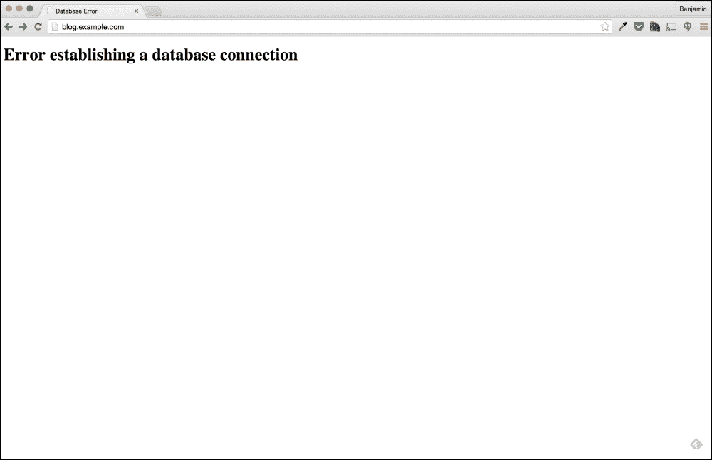
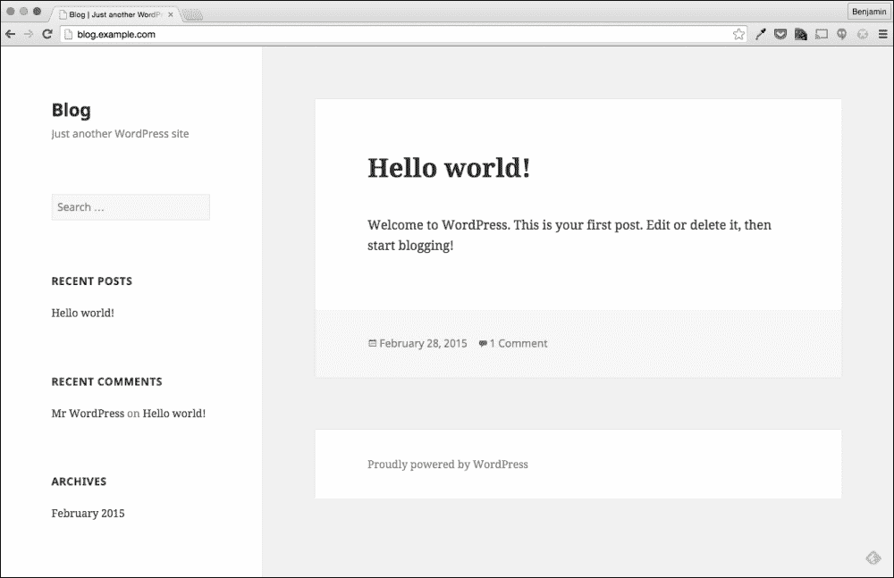

# 第六章：诊断和纠正防火墙问题

在上一章中，我们发现了如何使用`telnet`、`ping`、`curl`、`netstat`、`tcpdump`和`ip`等命令来解决与网络相关的问题。您还了解了**TCP 协议**的工作原理，以及如何使用**DNS**将域名转换为 IP。

在本章中，我们将再次解决与网络相关的问题；然而，这一次我们将了解 Linux 的软件防火墙`iptables`的工作原理以及如何解决防火墙引起的网络问题。

# 诊断防火墙

第五章*网络故障排除*是关于网络和如何排除网络配置错误的。在本章中，我们将把这个讨论扩展到防火墙。在解决防火墙问题时，我们可能会使用与第五章*网络故障排除*相同的一些命令，并重复很多相同的过程。这是因为每当你使用防火墙来保护系统时，你都会阻止某些类型的网络流量，防火墙的配置错误可能会影响系统的任何网络流量。

我们将像其他章节一样，从解决报告的问题开始这一章。

# 似曾相识

在第五章*网络故障排除*中，我们的故障排除是在一位开发人员打来电话报告公司的博客报告了数据库连接错误后开始的。经过故障排除，我们发现这个错误是由于数据库服务器上的静态路由配置错误造成的。然而，今天（几天后），我们再次接到同一开发人员报告相同的问题。

当开发人员访问`http://blog.example.com`时，他收到一个错误，指出存在数据库连接问题。*又来了！*

由于数据收集的第一步是复制问题，我们应该做的第一件事是在我们自己的浏览器上打开公司的博客。



事实上，似乎同样的错误再次出现了；现在要找出原因。

# 从历史问题中解决问题

**数据收集器**的第一反应可能是简单地按照第五章*网络故障排除*中的相同故障排除步骤进行。然而，**适配器**和**受过教育的猜测**故障排除者知道几天前的问题是由于静态路由，他们会首先登录到数据库服务器并检查是否存在相同的静态路由。

也许有人只是错误地重新添加了它，或者路由没有完全从系统的配置文件中删除：

```
[db]# ip route show
default via 10.0.2.2 dev enp0s3  proto static  metric 1024
10.0.2.0/24 dev enp0s3  proto kernel  scope link  src 10.0.2.15
169.254.0.0/16 dev enp0s8  scope link  metric 1003
192.168.33.0/24 dev enp0s8  proto kernel  scope link  src 192.168.33.12

```

然而，不幸的是，我们的运气并不那么好；从`ip`命令的结果中，我们可以看到来自第五章*网络故障排除*的静态路由不存在。

由于路由不存在，我们需要重新从第一步开始，检查博客服务器是否能够连接到数据库服务器。

# 基本故障排除

我们应该进行的第一个测试是从博客服务器到数据库服务器的简单 ping。这将很快回答这两台服务器是否能够进行通信：

```
[blog]$ ping db.example.com
PING db.example.com (192.168.33.12) 56(84) bytes of data.
64 bytes from db.example.com (192.168.33.12): icmp_seq=1 ttl=64 time=0.420 ms
64 bytes from db.example.com (192.168.33.12): icmp_seq=2 ttl=64 time=0.564 ms
64 bytes from db.example.com (192.168.33.12): icmp_seq=3 ttl=64 time=0.562 ms
64 bytes from db.example.com (192.168.33.12): icmp_seq=4 ttl=64 time=0.479 ms
^C
--- db.example.com ping statistics ---
4 packets transmitted, 4 received, 0% packet loss, time 3006ms
rtt min/avg/max/mdev = 0.420/0.506/0.564/0.062 ms

```

从`ping`命令的结果中，我们可以看到博客服务器可以与数据库服务器通信，或者说，博客服务器向数据库服务器发送了**ICMP 回显请求**并收到了**ICMP 回显回复**。我们可以测试的下一个连接是到端口`3306`，即 MySQL 端口的连接。

我们将使用`telnet`命令测试这种连接：

```
[blog]$ telnet db.example.com 3306
Trying 192.168.33.12...
telnet: connect to address 192.168.33.12: No route to host

```

然而，`telnet`失败了。这表明博客服务器与数据库服务器上的数据库服务实际上存在问题。

## 验证 MariaDB 服务

现在我们已经确定了博客服务器无法与数据库服务器通信，我们需要确定原因。在假设问题严格是与网络相关之前，我们应该首先验证数据库服务是否正在运行。为了做到这一点，我们只需登录到数据库服务器并检查正在运行的数据库进程。

我们可以使用多种方法来验证数据库进程是否在运行。在下面的例子中，我们将再次使用`ps`命令：

```
[db]$ ps -elf | grep maria
0 S mysql     1529  1123  0  80   0 - 226863 poll_s 12:21 ? 00:00:04 /usr/libexec/mysqld --basedir=/usr --datadir=/var/lib/mysql --plugin-dir=/usr/lib64/mysql/plugin --log-error=/var/log/mariadb/mariadb.log --pid-file=/var/run/mariadb/mariadb.pid --socket=/var/lib/mysql/mysql.sock

```

通过`ps`命令，我们能够看到正在运行的**MariaDB**进程。在前面的例子中，我们使用了`ps -elf`命令来显示所有进程，然后使用`grep`命令来过滤输出以找到 MariaDB 服务。

从结果来看，数据库服务实际上是在运行的；但这并不能确定这个进程是否在端口`3306`上接受连接。为了验证这一点，我们可以使用`netstat`命令来识别服务器上正在监听的端口：

```
[db]$ netstat -na | grep LISTEN
tcp      0     0 127.0.0.1:25          0.0.0.0:*             LISTEN
tcp      0     0 0.0.0.0:46788         0.0.0.0:*             LISTEN
tcp      0     0 0.0.0.0:3306          0.0.0.0:*             LISTEN
tcp      0     0 0.0.0.0:111           0.0.0.0:*             LISTEN
tcp      0     0 0.0.0.0:22            0.0.0.0:*             LISTEN
tcp6     0     0 ::1:25                     :::*             LISTEN
tcp6     0     0 :::111                     :::*             LISTEN
tcp6     0     0 :::22                      :::*             LISTEN
tcp6     0     0 :::49464                   :::*             LISTEN

```

从`netstat`命令中，我们可以看到系统上有很多端口是打开的，端口`3306`就是其中之一。

由于我们知道博客服务器无法与端口`3306`建立连接，我们可以再次从多个地方测试连接。第一个地方是数据库服务器本身，第二个地方是我们的笔记本电脑，就像我们在第五章 *网络故障排除*中所做的那样。

由于数据库服务器没有安装`telnet`客户端，我们可以使用`curl`命令来执行这个测试：

```
[blog]$ curl -v telnet://localhost:3306
* About to connect() to localhost port 3306 (#0)
*   Trying 127.0.0.1...
* Connected to localhost (127.0.0.1) port 3306 (#0)
R
* RCVD IAC EC

```

### 提示

在本书中，我会反复强调知道执行任务的多种方法是很重要的。`telnet`是一个非常简单的例子，但这个概念适用于系统管理员执行的每一个任务。

既然我们已经确定了数据库服务器可以从本地服务器访问，我们现在可以从我们的笔记本电脑上测试：

```
[laptop]$ telnet 192.168.33.12 3306
Trying 192.168.33.12...
telnet: connect to address 192.168.33.12: Connection refused
telnet: Unable to connect to remote host

```

从我们的笔记本电脑上看，连接到数据库服务是不可用的，但如果我们测试另一个端口，比如`22`会发生什么呢？

```
[laptop]$ telnet 192.168.33.12 22
Trying 192.168.33.12...
Connected to 192.168.33.12.
Escape character is '^]'.
SSH-2.0-OpenSSH_6.4
^]
telnet>

```

这是一个有趣的结果；从笔记本电脑上，我们能够连接到端口`22`，但无法连接到端口`3306`。既然端口`22`在笔记本电脑上是可用的，那么在博客服务器上呢？

```
[blog]$ telnet db.example.com 22
Trying 192.168.33.12...
Connected to db.example.com.
Escape character is '^]'.
SSH-2.0-OpenSSH_6.4
^]

```

这些结果非常有趣。在上一章中，当我们的连接问题是由于错误配置的静态路由时，博客服务器和数据库服务器之间的所有通信都中断了。

然而，在这个问题的情况下，博客服务器无法连接到端口`3306`，但它可以在端口`22`上与数据库服务器通信。使这个问题更有趣的是，在数据库服务器上本地，端口`3306`是可用的并且接受连接。

这些关键信息是指示我们的问题可能实际上是由于防火墙引起的第一个迹象。现在可能还为时过早使用数据收集器，但是一个适配器或有经验的猜测故障排除者可能已经在这一点上形成了一个假设，即这个问题是由于防火墙引起的。

## 使用 tcpdump 进行故障排除

在第五章 *网络故障排除*中，我们广泛使用了`tcpdump`来识别我们的问题；我们能否用`tcpdump`来判断问题是防火墙问题？也许可以，我们肯定可以使用`tcpdump`来更好地查看问题。

首先，我们将从博客服务器捕获到端口`22`的连接（我们知道这个连接是有效的）。`tcpdump`将在数据库服务器上过滤端口`22`运行；我们还将使用`-i`（接口）标志和`any`选项，使`tcpdump`捕获所有网络接口上的流量：

```
[db]# tcpdump -nnnvvv -i any port 22
tcpdump: listening on any, link-type LINUX_SLL (Linux cooked), capture size 65535 bytes

```

一旦`tcpdump`运行起来，我们可以从博客服务器发起到端口`22`的连接，看看一个完整的健康连接是什么样子的：

```
03:03:15.670771 IP (tos 0x10, ttl 64, id 17278, offset 0, flags [DF], proto TCP (6), length 60)
 192.168.33.11.34133 > 192.168.33.12.22: Flags [S], cksum 0x977b (correct), seq 2193487479, win 14600, options [mss 1460,sackOK,TS val 7058697 ecr 0,nop,wscale 6], length 0
03:03:15.670847 IP (tos 0x0, ttl 64, id 0, offset 0, flags [DF], proto TCP (6), length 60)
 192.168.33.12.22 > 192.168.33.11.34133: Flags [S.], cksum 0xc396 (correct), seq 3659372781, ack 2193487480, win 14480, options [mss 1460,sackOK,TS val 7018839 ecr 7058697,nop,wscale 6], length 0
03:03:15.671295 IP (tos 0x10, ttl 64, id 17279, offset 0, flags [DF], proto TCP (6), length 52)
 192.168.33.11.34133 > 192.168.33.12.22: Flags [.], cksum 0x718b (correct), seq 1, ack 1, win 229, options [nop,nop,TS val 7058697 ecr 7018839], length 0

```

从捕获的数据中，我们可以看到一个标准的健康连接。我们可以看到连接来自 IP`192.168.33.11`，即博客服务器的 IP。我们还可以看到连接通过端口`22`到达了 IP`192.168.33.12`。我们可以从以下行中看到所有这些信息：

```
192.168.33.11.34133 > 192.168.33.12.22: Flags [S], cksum 0x977b (correct), seq 2193487479, win 14600, options [mss 1460,sackOK,TS val 7058697 ecr 0,nop,wscale 6], length 0

```

从第二个捕获的数据包中，我们可以看到数据库服务器对博客服务器的**SYN-ACK**回复：

```
 192.168.33.12.22 > 192.168.33.11.34133: Flags [S.], cksum 0x0b15 (correct), seq 3659372781, ack 2193487480, win 14480, options [mss 1460,sackOK,TS val 7018839 ecr 7058697,nop,wscale 6], length 0

```

我们可以看到`SYN-ACK`回复来自`192.168.33.12` IP 地址到`192.168.33.11` IP 地址。到目前为止，TCP 连接似乎正常，第三个捕获的数据包肯定证实了这一点：

```
 192.168.33.11.34133 > 192.168.33.12.22: Flags [.], cksum 0x718b (correct), seq 1, ack 1, win 229, options [nop,nop,TS val 7058697 ecr 7018839], length 0

```

第三个数据包是来自博客服务器的**SYN-ACK-ACK**。这意味着不仅博客服务器的`SYN`数据包到达并得到`SYN-ACK`的回复，数据库服务器的`SYN-ACK`数据包也被博客服务器接收，并得到了`SYN-ACK-ACK`的回复。这是端口`22`的完整三次握手。

现在，让我们来看看到端口`3306`的连接。为此，我们将使用相同的`tcpdump`命令，这次将端口更改为`3306`：

```
[db]# tcpdump -nnnvvv -i any port 3306
tcpdump: listening on any, link-type LINUX_SLL (Linux cooked), capture size 65535 bytes

```

在`tcpdump`运行时，我们可以从博客服务器使用`telnet`建立连接：

```
[blog]$ telnet db.example.com 3306
Trying 192.168.33.12...
telnet: connect to address 192.168.33.12: No route to host

```

如预期的那样，`telnet`命令未能连接；让我们看看`tcpdump`在此期间是否捕获了任何数据包：

```
06:04:25.488396 IP (tos 0x10, ttl 64, id 44350, offset 0, flags [DF], proto TCP (6), length 60)
 192.168.33.11.55002 > 192.168.33.12.3306: Flags [S], cksum 0x7699 (correct), seq 3266396266, win 14600, options [mss 1460,sackOK,TS val 12774740 ecr 0,nop,wscale 6], length 0

```

事实上，看起来`tcpdump`确实捕获了一个数据包，但只有一个。

捕获的数据包是从`192.168.33.11`（博客服务器）发送到`192.168.33.12`（数据库服务器）的`SYN`数据包。这表明来自博客服务器的数据包到达了数据库服务器；但我们看不到回复数据包。

正如您在上一章中学到的，当我们对`tcpdump`应用过滤器时，我们经常会错过一些东西。在这种情况下，我们正在过滤`tcpdump`以查找从端口`3306`发送或接收的流量。由于我们知道问题的服务器是博客服务器，我们可以通过使用`tcpdump`的主机过滤器来更改我们的过滤器，以捕获来自博客服务器 IP`192.168.33.11`的所有流量。我们可以通过使用`tcpdump`的主机过滤器来实现这一点：

```
[db]# tcpdump -nnnvvv -i any host 192.168.33.11
tcpdump: listening on any, link-type LINUX_SLL (Linux cooked), capture size 65535 bytes

```

再次运行`tcpdump`，我们可以再次从博客服务器使用`telnet`发起连接：

```
[blog]$ telnet db.example.com 3306
Trying 192.168.33.12...
telnet: connect to address 192.168.33.12: No route to host

```

同样，预期地，telnet 连接失败了；然而，这次我们可以从`tcpdump`中看到更多信息：

```
06:16:49.729134 IP (tos 0x10, ttl 64, id 23760, offset 0, flags [DF], proto TCP (6), length 60)
 192.168.33.11.55003 > 192.168.33.12.3306: Flags [S], cksum 0x9be6 (correct), seq 1849431125, win 14600, options [mss 1460,sackOK,TS val 13518981 ecr 0,nop,wscale 6], length 0
06:16:49.729199 IP (tos 0xd0, ttl 64, id 40207, offset 0, flags [none], proto ICMP (1), length 88)
 192.168.33.12 > 192.168.33.11: ICMP host 192.168.33.12 unreachable - admin prohibited, length 68

```

这一次我们实际上可以看到相当多有用的信息，直接表明我们的问题是由于系统防火墙引起的。

看起来`tcpdump`能够捕获两个数据包。让我们分析一下它能够捕获到的内容，以更好地理解发生了什么：

```
06:16:49.729134 IP (tos 0x10, ttl 64, id 23760, offset 0, flags [DF], proto TCP (6), length 60)
 192.168.33.11.55003 > 192.168.33.12.3306: Flags [S], cksum 0x9be6 (correct), seq 1849431125, win 14600, options [mss 1460,sackOK,TS val 13518981 ecr 0,nop,wscale 6], length 0

```

第一个数据包与我们之前看到的一样，是从博客服务器到数据库服务器端口`3306`的简单`SYN`请求。然而，第二个数据包非常有趣：

```
06:16:49.729199 IP (tos 0xd0, ttl 64, id 40207, offset 0, flags [none], proto ICMP (1), length 88)
 192.168.33.12 > 192.168.33.11: ICMP host 192.168.33.12 unreachable - admin prohibited, length 68

```

第二个数据包甚至不是基于 TCP 的数据包，而是一个**ICMP**数据包。在第五章*网络故障排除*中，我们讨论了 ICMP 回显请求和回复数据包，以及它们如何被`ping`命令用于识别主机是否可用。然而，ICMP 用于的不仅仅是`ping`命令。

## 理解 ICMP

ICMP 协议被用作跨网络发送消息的控制协议。回显请求和回显回复消息只是这种协议的一个例子。这种协议也经常用于通知其他系统的错误。

在这种情况下，数据库服务器正在向博客服务器发送一个 ICMP 数据包，通知它 IP 主机`192.168.33.12`无法访问：

```
proto ICMP (1), length 88)
 192.168.33.12 > 192.168.33.11: ICMP host 192.168.33.12 unreachable - admin prohibited, length 68

```

数据库服务器不仅说它是不可达的，还告诉博客服务器不可达的原因是因为连接被管理上禁止了。这种回复是防火墙是连接问题的来源的明显迹象，因为通常管理上禁止是防火墙会使用的消息类型。

### 理解连接被拒绝

当尝试连接到不可用的服务或未被监听的端口时，Linux 内核会发送一个回复。然而，这个回复是一个 TCP 重置，告诉远程系统重置连接。

通过在运行`tcpdump`时连接到无效端口，我们可以看到这一点。在博客服务器上，如果我们运行`tcpdump`，端口`5000`目前没有被使用。使用`port`过滤器，我们将看到所有到该端口的流量：

```
[blog]# tcpdump -vvvnnn -i any port 5000
tcpdump: listening on any, link-type LINUX_SLL (Linux cooked), capture size 65535 bytes

```

通过在端口 5000 上捕获所有流量，我们现在可以使用 telnet 尝试连接：

```
[laptop]$ telnet 192.168.33.11 5000
Trying 192.168.33.11...
telnet: connect to address 192.168.33.11: Connection refused
telnet: Unable to connect to remote host

```

实际上我们已经看到了一些不同的东西。之前，当我们在数据库服务器上对端口`3306`执行`telnet`时，`telnet`命令打印了不同的消息。

```
telnet: connect to address 192.168.33.12: No route to host

```

这是因为之前进行 telnet 连接时，服务器收到了 ICMP 目的地不可达数据包。

然而，这次发送了不同的回复。我们可以在`tcpdump`捕获的数据包中看到这个回复：

```
06:57:42.954091 IP (tos 0x10, ttl 64, id 47368, offset 0, flags [DF], proto TCP (6), length 64)
 192.168.33.1.53198 > 192.168.33.11.5000: Flags [S], cksum 0xca34 (correct), seq 1134882056, win 65535, options [mss 1460,nop,wscale 5,nop,nop,TS val 511014642 ecr 0,sackOK,eol], length 0
06:57:42.954121 IP (tos 0x10, ttl 64, id 0, offset 0, flags [DF], proto TCP (6), length 40)
 192.168.33.11.5000 > 192.168.33.1.53198: Flags [R.], cksum 0xd86e (correct), seq 0, ack 1134882057, win 0, length 0

```

这次，发送回来的数据包是一个 TCP 重置：

```
192.168.33.11.5000 > 192.168.33.1.53198: Flags [R.],

```

重置数据包通常是由于简单的连接错误导致的问题，因为这是客户端尝试连接不再可用的端口时的标准 TCP 响应。

重置数据包也可以由拒绝连接的应用程序发送。然而，ICMP 目的地不可达通常是防火墙拒绝数据包时会收到的回复；也就是说，如果防火墙服务配置为回复的话。

# 迄今为止你学到的内容的快速总结

到目前为止，我们已经确定博客服务器能够通过端口`22`与数据库服务器建立连接。与我们之前的情况不同，这个连接实际上能够执行完整的三次握手。然而，博客服务器无法通过端口`3306`与数据库服务器执行三次握手。

当博客服务器尝试通过端口 3306 与数据库服务器建立连接时，数据库服务器会发送一个 ICMP 目的地不可达的数据包回到博客服务器。这个数据包实际上是告诉博客服务器，对数据库的连接尝试被拒绝了。然而，数据库服务是启动的，并且在端口 3306 上监听（通过`netstat`验证）。除了端口被监听外，如果我们从数据库服务器本身`telnet`到端口 3306，连接是建立的。

考虑到所有这些数据点，可能是数据库服务器启用了防火墙服务并阻止了对端口 3306 的连接。

# 使用 iptables 管理 Linux 防火墙

在管理 Linux 中的防火墙服务时，有许多选项，最流行的是`iptables`和`ufw`。对于 Ubuntu 发行版，`ufw`是默认的防火墙管理工具；然而，总体而言，`iptables`是跨多个 Linux 发行版中最流行的。然而，这两者本身只是**Netfilter**的用户界面。

Netfilter 是 Linux 内核中的一个框架，允许数据包过滤以及网络和端口转换。诸如`iptables`命令之类的工具只是与`netfilter`框架交互，以应用这些规则。

在本书中，我们将集中在使用`iptables`命令和服务来管理我们的防火墙规则。它不仅是最流行的防火墙工具，而且在基于 Red Hat 的操作系统中已经是默认的防火墙服务很长一段时间了。即使在 Red Hat Enterprise Linux 7 中出现了更新的`firewalld`服务，这只是一个管理`iptables`的服务。

## 验证 iptables 是否在运行

由于我们怀疑问题是由系统防火墙配置引起的，我们应该首先检查防火墙是否正在运行以及定义了什么规则。由于`iptables`作为一个服务运行，第一步就是简单地检查该服务的状态：

```
[db]# ps -elf | grep iptables
0 R root      4189  3220  0  80   0 - 28160 -      16:31 pts/0 00:00:00 grep --color=auto iptables

```

以前，当我们去检查一个服务是否在运行时，我们通常会使用`ps`命令。这对于 MariaDB 或 Apache 等服务非常有效；然而，`iptables`是不同的。因为`iptables`只是一个与`netfilter`交互的命令，`iptables`服务不像大多数其他服务那样是一个守护进程。事实上，当你启动`iptables`服务时，你只是应用了保存的`netfilter`规则，当你停止服务时，你只是刷新了这些规则。我们将在本章稍后探讨这个概念，但现在我们只是检查`iptables`服务是否在运行：

```
[db]# service iptables status
Redirecting to /bin/systemctl status  iptables.service
iptables.service - IPv4 firewall with iptables
 Loaded: loaded (/usr/lib/systemd/system/iptables.service; enabled)
 Active: active (exited) since Wed 2015-04-01 16:36:16 UTC; 4min 56s ago
 Process: 4202 ExecStop=/usr/libexec/iptables/iptables.init stop (code=exited, status=0/SUCCESS)
 Process: 4332 ExecStart=/usr/libexec/iptables/iptables.init start (code=exited, status=0/SUCCESS)
 Main PID: 4332 (code=exited, status=0/SUCCESS)

Apr 01 16:36:16 db.example.com systemd[1]: Starting IPv4 firewall with iptables...
Apr 01 16:36:16 db.example.com iptables.init[4332]: iptables: Applying firewall rules: [  OK  ]
Apr 01 16:36:16 db.example.com systemd[1]: Started IPv4 firewall with iptables.

```

随着 Red Hat Enterprise Linux 7 的发布，Red Hat 已经迁移到了`systemd`，它取代了标准的`init`系统。随着这一迁移，服务命令不再是管理服务的首选命令。这个功能已经将`systemd`的控制命令移动到了`systemctl`命令。

对于 RHEL 7，至少`service`命令仍然可以执行；然而，这个命令只是`systemctl`的一个包装器。以下是使用`systemctl`命令检查`iptables`服务状态的命令。在本书中，我们将使用`systemctl`命令而不是传统的 service 命令：

```
[db]# systemctl status iptables.service
iptables.service - IPv4 firewall with iptables
 Loaded: loaded (/usr/lib/systemd/system/iptables.service; enabled)
 Active: active (exited) since Wed 2015-04-01 16:36:16 UTC; 26min ago
 Process: 4202 ExecStop=/usr/libexec/iptables/iptables.init stop (code=exited, status=0/SUCCESS)
 Process: 4332 ExecStart=/usr/libexec/iptables/iptables.init start (code=exited, status=0/SUCCESS)
 Main PID: 4332 (code=exited, status=0/SUCCESS)

Apr 01 16:36:16 db.example.com systemd[1]: Starting IPv4 firewall with iptables...
Apr 01 16:36:16 db.example.com iptables.init[4332]: iptables: Applying firewall rules: [  OK  ]
Apr 01 16:36:16 db.example.com systemd[1]: Started IPv4 firewall with iptables.

```

从前面的`systemctl`输出中，我们可以看到当前`iptables`服务是活动的。我们可以从`systemctl`输出的第三行来识别这一点：

```
 Active: active (exited) since Wed 2015-04-01 16:36:16 UTC; 26min ago

```

当`iptables`服务没有运行时，情况看起来会有很大不同：

```
[db]# systemctl status iptables.service
iptables.service - IPv4 firewall with iptables
 Loaded: loaded (/usr/lib/systemd/system/iptables.service; enabled)
 Active: inactive (dead) since Thu 2015-04-02 02:55:26 UTC; 1s ago
 Process: 4489 ExecStop=/usr/libexec/iptables/iptables.init stop (code=exited, status=0/SUCCESS)
 Process: 4332 ExecStart=/usr/libexec/iptables/iptables.init start (code=exited, status=0/SUCCESS)
 Main PID: 4332 (code=exited, status=0/SUCCESS)

Apr 01 16:36:16 db.example.com systemd[1]: Starting IPv4 firewall with iptables...
Apr 01 16:36:16 db.example.com iptables.init[4332]: iptables: Applying firewall rules: [  OK  ]
Apr 01 16:36:16 db.example.com systemd[1]: Started IPv4 firewall with iptables.
Apr 02 02:55:26 db.example.com systemd[1]: Stopping IPv4 firewall with iptables...
Apr 02 02:55:26 db.example.com iptables.init[4489]: iptables: Setting chains to policy ACCEPT: nat filter [  OK  ]
Apr 02 02:55:26 db.example.com iptables.init[4489]: iptables: Flushing firewall rules: [  OK  ]
Apr 02 02:55:26 db.example.com iptables.init[4489]: iptables: Unloading modules: [  OK  ]
Apr 02 02:55:26 db.example.com systemd[1]: Stopped IPv4 firewall with iptables.

```

从上面的例子中，`systemctl`显示`iptables`服务处于非活动状态：

```
 Active: inactive (dead) since Thu 2015-04-02 02:55:26 UTC; 1s ago

```

`systemctl`的一个好处是，在使用状态选项运行时，输出包括来自服务的日志消息：

```
Apr 02 02:55:26 db.example.com systemd[1]: Stopping IPv4 firewall with iptables...
Apr 02 02:55:26 db.example.com iptables.init[4489]: iptables: Setting chains to policy ACCEPT: nat filter [  OK  ]
Apr 02 02:55:26 db.example.com iptables.init[4489]: iptables: Flushing firewall rules: [  OK  ]
Apr 02 02:55:26 db.example.com iptables.init[4489]: iptables: Unloading modules: [  OK  ]
Apr 02 02:55:26 db.example.com systemd[1]: Stopped IPv4 firewall with iptables.

```

从上面的代码中，我们可以看到`iptables`服务停止过程中使用的所有状态消息。

## 显示正在执行的 iptables 规则

现在我们知道`iptables`服务是*活动*和运行的，我们还应该查看已定义和正在执行的`iptables`规则。为此，我们将使用`iptables`命令和`-L`（列表）和`-n`（数字）标志：

```
[db]# iptables -L -n
Chain INPUT (policy ACCEPT)
target     prot opt source               destination
ACCEPT     all  --  0.0.0.0/0            0.0.0.0/0            state RELATED,ESTABLISHED
ACCEPT     icmp --  0.0.0.0/0            0.0.0.0/0
ACCEPT     all  --  0.0.0.0/0            0.0.0.0/0
ACCEPT     tcp  --  0.0.0.0/0            0.0.0.0/0            state NEW tcp dpt:22
REJECT     all  --  0.0.0.0/0            0.0.0.0/0            reject- with icmp-host-prohibited
ACCEPT     tcp  --  192.168.0.0/16       0.0.0.0/0            state NEW tcp dpt:3306

Chain FORWARD (policy ACCEPT)
target     prot opt source               destination
REJECT     all  --  0.0.0.0/0            0.0.0.0/0            reject- with icmp-host-prohibited

Chain OUTPUT (policy ACCEPT)
target     prot opt source               destination

```

在执行`iptables`时，标志`-L`和`-n`不会合并。与大多数其他命令不同，`iptables`有一个特定的格式，需要一些标志与其他标志分开。在这种情况下，`-L`标志与其他选项分开。我们可以给`-n`添加`-v`（详细）选项，但不能添加`-L`。以下是使用详细选项执行的示例：

```
[db]# iptables -L -nv

```

从`iptables -L -n`的输出中，似乎在这台服务器上有相当多的`iptables`规则。让我们分解这些规则，以便更好地理解它们。

## 理解 iptables 规则

在我们进入单个规则之前，我们应该首先了解一下`iptables`和防火墙的一些一般规则。

### 顺序很重要

要知道的第一个重要规则是顺序很重要。如果我们查看`iptables -L -n`返回的数据，我们可以看到有多个规则，这些规则的顺序决定了如何解释这些规则。

我喜欢把`iptables`想象成一个清单；当接收到一个数据包时，`iptables`会从上到下检查清单。当它找到一个符合条件的规则时，就会应用该规则。

这是人们在使用`iptables`时经常犯的一个最常见的错误，即在从上到下的顺序之外放置规则。

### 默认策略

通常情况下，`iptables`有两种用法，即除非明确阻止，否则允许所有流量，或者除非明确允许，否则阻止所有流量。这些方法被称为**默认允许**和**默认拒绝**策略。

根据 Linux 防火墙的期望用途，可以使用任一策略。然而，通常情况下，默认拒绝策略被认为是更安全的方法，因为这个策略要求为所讨论的服务器的每种访问类型添加一条规则。

### 分解 iptables 规则

由于`iptables`从上到下处理规则，为了更好地理解现有的规则，我们将从下到上查看`iptables`规则：

```
Chain FORWARD (policy ACCEPT)
target     prot opt source               destination
REJECT     all  --  0.0.0.0/0            0.0.0.0/0            reject- with icmp-host-prohibited

```

我们看到的第一条规则是`FORWARD`链的所有协议从任何源到任何目的地进行`REJECT`。这是否意味着`iptables`将阻止所有东西？是的，但只针对正在转发的数据包。

`iptables`命令将网络流量类型分类为表和链。表包括正在执行的高级操作，如过滤、网络地址转换或更改数据包。

在每个表中，还有几个“链”。链用于定义要应用规则的流量类型。在`FORWARD`链的情况下，这匹配正在转发的流量，通常用于路由。

应用规则的下一个链是`INPUT`链：

```
Chain INPUT (policy ACCEPT)
target     prot opt source               destination
ACCEPT     all  --  0.0.0.0/0            0.0.0.0/0            state RELATED,ESTABLISHED
ACCEPT     icmp --  0.0.0.0/0            0.0.0.0/0
ACCEPT     all  --  0.0.0.0/0            0.0.0.0/0
ACCEPT     tcp  --  0.0.0.0/0            0.0.0.0/0            state NEW tcp dpt:22
REJECT     all  --  0.0.0.0/0            0.0.0.0/0            reject- with icmp-host-prohibited
ACCEPT     tcp  --  192.168.0.0/16       0.0.0.0/0            state NEW tcp dpt:3306

```

这个链适用于进入本地系统的流量；基本上，这些规则只适用于到达系统的流量：

```
ACCEPT     tcp  --  192.168.0.0/16       0.0.0.0/0            state NEW tcp dpt:3306

```

如果我们查看链中的最后一条规则，我们可以看到它明确定义了系统应该接受源 IP 在`192.168.0.0/16`网络中，目标 IP 为 0.0.0.0/0 的 TCP 流量，就像`netstat`一样是一个通配符。这条规则的最后部分定义了这条规则仅适用于目标端口为`3306`的新连接。

简单来说，这条规则将允许 192.168.0.0/16 网络中的任何 IP 访问数据库服务器的任何本地 IP 的 3306 端口。

特别是这条规则应该允许来自我们博客服务器（192.168.33.11）的流量，但是上面的规则呢？

```
REJECT     all  --  0.0.0.0/0            0.0.0.0/0            reject- with icmp-host-prohibited

```

前面的规则明确规定系统应该从源 IP 为`0.0.0.0/0`到目标 IP 为`0.0.0.0/0`的所有协议进行`REJECT`，并回复一个 ICMP 数据包，说明主机被禁止。根据我们之前的网络故障排除，我们知道`0.0.0.0/0`网络是所有网络的通配符。

这意味着这条规则将拒绝所有流量到系统，有效地使我们的系统使用“默认拒绝”策略。然而，这并不是定义“默认拒绝”策略的常见方法。

如果我们查看这个链规则集的顶部，我们会看到以下内容：

```
Chain INPUT (policy ACCEPT)

```

这本质上是说`INPUT`链本身具有`ACCEPT`策略，这意味着链本身使用“默认允许”策略。但是，这个链中有一条规则将拒绝所有流量。

这意味着，虽然链的策略在技术上不是默认拒绝，但这条规则实际上实现了相同的效果。除非在此规则之前明确允许流量，否则流量将被拒绝，有效地使链成为“默认拒绝”策略。

在这一点上，我们有一个有趣的问题；`INPUT`链中的最后一条规则明确允许从 192.168.0.0/16 源网络到 3306 端口（`MariaDB`端口）的流量。然而，上面的规则拒绝了从任何地方到任何地方的所有流量。如果我们花一点时间记住`iptables`是基于顺序的，那么我们很容易看出这可能是一个问题。

问题可能只是允许端口 3306 的规则是在阻止所有流量的规则之后定义的；基本上，数据库流量被默认拒绝规则阻止。

然而，在我们根据这些信息采取行动之前，我们应该继续查看`iptables`规则，因为可能还有另一条规则定义了对抗这两条底部规则的规则：

```
ACCEPT     tcp  --  0.0.0.0/0            0.0.0.0/0            state NEW tcp dpt:22

```

`INPUT`链中倒数第三条规则确实解释了为什么 SSH 流量按预期工作。该规则明确说明，当连接是针对端口`22`的新连接时，系统应该从任何来源到任何目的地接受所有 TCP 协议流量。

这条规则基本上定义了所有新的 TCP 连接到端口`22`都是允许的。由于它在默认拒绝规则之前，这意味着在任何情况下都不会被该规则阻止端口`22`的新连接。

如果我们查看`INPUT`链中倒数第四条规则，我们会看到一条非常有趣的规则：

```
ACCEPT     all  --  0.0.0.0/0            0.0.0.0/0

```

这条规则似乎告诉系统应该从任何 IP（`0.0.0.0/0`）接受所有协议到任何 IP（`0.0.0.0/0`）。如果我们查看这条规则并应用顺序很重要的逻辑；那么这条规则应该允许我们的数据库流量。

不幸的是，`iptables`输出有时可能会误导，因为这条规则没有显示规则的一个关键部分；接口：

```
[db]# iptables -L -nv
Chain INPUT (policy ACCEPT 0 packets, 0 bytes)
 pkts bytes target     prot opt in     out     source destination
 36  2016 ACCEPT     all  --  *      *       0.0.0.0/0 0.0.0.0/0            state RELATED,ESTABLISHED
 0     0 ACCEPT     icmp --  *      *       0.0.0.0/0 0.0.0.0/0
 0     0 ACCEPT     all  --  lo     *       0.0.0.0/0 0.0.0.0/0
 0     0 ACCEPT     tcp  --  *      *       0.0.0.0/0 0.0.0.0/0            state NEW tcp dpt:22
 394 52363 REJECT     all  --  *      *       0.0.0.0/0 0.0.0.0/0            reject-with icmp-host-prohibited
 0     0 ACCEPT     tcp  --  *      *       192.168.0.0/16 0.0.0.0/0            state NEW tcp dpt:3306

```

如果我们在`iptables`命令中添加`-v`（详细）标志，我们可以看到更多信息。特别是，我们可以看到一个名为“in”的新列，它代表接口：

```
 0     0 ACCEPT     all  --  lo     *       0.0.0.0/0 0.0.0.0/0

```

如果我们再仔细看一下这条规则，我们会发现接口列显示该规则仅适用于`loopback`接口上的流量。由于我们的数据库流量是在`enp0s8`接口上的，数据库流量不符合这条规则：

```
 0     0 ACCEPT     icmp --  *      *       0.0.0.0/0 0.0.0.0/0

```

倒数第五条规则非常相似，只是它专门允许从任何 IP 到任何 IP 的所有 ICMP 流量。这解释了为什么我们的**ping**请求有效，因为这条规则将允许 ICMP 回显请求和回显回复通过防火墙。

然而，倒数第六条规则与其他规则有很大不同：

```
 36  2016 ACCEPT     all  --  *      *       0.0.0.0/0 0.0.0.0/0            state RELATED,ESTABLISHED

```

这条规则确实说明系统应该从任何 IP（0.0.0.0/0）接受所有协议到任何 IP（0.0.0.0/0）；但是该规则仅限于`RELATED`和`ESTABLISHED`数据包。

在审查端口`22`的`iptables`规则时，我们可以看到该规则仅限于`NEW`连接。这基本上意味着用于启动到端口`22`的新连接的数据包，如`SYN`和`SYN-ACK-ACK`是允许的。

当规则说明`ESTABLISHED`状态被允许时，`iptables`将允许属于已建立的 TCP 连接的数据包：

这意味着新的 SSH 连接是由端口`22`的规则允许的。

```
 0     0 ACCEPT     tcp  --  *      *       0.0.0.0/0 0.0.0.0/0            state NEW tcp dpt:22

```

然后，一旦 TCP 连接建立，它将被以下规则允许：

```
 36  2016 ACCEPT     all  --  *      *       0.0.0.0/0 0.0.0.0/0            state RELATED,ESTABLISHED

```

### 整合规则

现在我们已经查看了所有的`iptables`规则，我们可以对为什么我们的数据库流量无法工作做出合理的猜测。

在`iptables`规则集中，我们可以看到拒绝所有流量的规则在允许端口**3306**上的数据库连接之前被定义：

```
 394 52363 REJECT     all  --  *      *       0.0.0.0/0 0.0.0.0/0            reject-with icmp-host-prohibited
 0     0 ACCEPT     tcp  --  *      *       192.168.0.0/16 0.0.0.0/0            state NEW tcp dpt:3306

```

由于系统无法启动新连接，它们无法建立连接，这将被以下规则允许：

```
 36  2016 ACCEPT     all  --  *      *       0.0.0.0/0 0.0.0.0/0            state RELATED,ESTABLISHED

```

我们可以通过查看定义的规则来确定所有这些，但这也需要对`iptables`有相当了解。

还有另一种相对较简单的方法来确定哪些规则正在阻止或允许流量。

### 查看 iptables 计数器

通过`iptables`的详细输出，我们不仅可以看到规则适用的接口，还可以看到两列非常有用。这两列是**pkts**和**bytes**：

```
[db]# iptables -L -nv
Chain INPUT (policy ACCEPT 0 packets, 0 bytes)
 pkts bytes target     prot opt in     out     source destination
 41  2360 ACCEPT     all  --  *      *       0.0.0.0/0 0.0.0.0/0            state RELATED,ESTABLISHED

```

`pkts`列是`iptables`详细输出中的第一列，该列包含规则应用的数据包数。如果我们看前面的规则，我们可以看到这条规则已经应用于`41`个数据包。`bytes`列是第二列，用于表示规则应用的字节数。对于我们前面的例子，该规则已经应用了 2,360 字节。

我们可以使用`iptables`中的数据包和字节计数器来识别应用于我们的数据库流量的规则。为此，我们只需要通过刷新浏览器并运行`iptables –L –nv`来触发数据库活动，以识别哪些规则的计数器增加了。我们甚至可以通过使用`iptables`命令后跟`–Z`（清零）标志来清除当前值，使这更加容易：

```
[db]# iptables –Z

```

如果我们重新执行`iptables`的详细列表，我们可以看到计数器对于除了`ESTABLISHED`和`RELATED`规则（每个连接都会匹配的规则，包括我们的 SSH 会话）之外的所有内容都是`0`：

```
[db]# iptables -L -nv
Chain INPUT (policy ACCEPT 0 packets, 0 bytes)
 pkts bytes target     prot opt in     out     source destination
 7   388 ACCEPT     all  --  *      *       0.0.0.0/0 0.0.0.0/0            state RELATED,ESTABLISHED
 0     0 ACCEPT     icmp --  *      *       0.0.0.0/0 0.0.0.0/0
 0     0 ACCEPT     all  --  lo     *       0.0.0.0/0 0.0.0.0/0
 0     0 ACCEPT     tcp  --  *      *       0.0.0.0/0 0.0.0.0/0            state NEW tcp dpt:22
 0     0 REJECT     all  --  *      *       0.0.0.0/0 0.0.0.0/0            reject-with icmp-host-prohibited
 0     0 ACCEPT     tcp  --  *      *       192.168.0.0/16 0.0.0.0/0            state NEW tcp dpt:3306

```

清除这些值后，我们现在可以刷新我们的网络浏览器并启动一些数据库流量：

```
[db]# iptables -L -nv
Chain INPUT (policy ACCEPT 0 packets, 0 bytes)
 pkts bytes target     prot opt in     out     source destination
 53  3056 ACCEPT     all  --  *      *       0.0.0.0/0 0.0.0.0/0            state RELATED,ESTABLISHED
 0     0 ACCEPT     icmp --  *      *       0.0.0.0/0 0.0.0.0/0
 0     0 ACCEPT     all  --  lo     *       0.0.0.0/0 0.0.0.0/0
 0     0 ACCEPT     tcp  --  *      *       0.0.0.0/0 0.0.0.0/0            state NEW tcp dpt:22
 45  4467 REJECT     all  --  *      *       0.0.0.0/0 0.0.0.0/0            reject-with icmp-host-prohibited
 0     0 ACCEPT     tcp  --  *      *       192.168.0.0/16 0.0.0.0/0            state NEW tcp dpt:3306

```

如果我们再次以详细模式运行`iptables –L`，我们可以看到，事实上，正如我们所怀疑的，数据包被默认的拒绝规则拒绝了。我们可以通过这个事实看到，自从我们使用`–Z`标志将计数器清零以来，这条规则已经拒绝了`45`个数据包。

使用`-Z`标志和计数器是一种非常有用的方法；然而，在某些情况下可能不起作用。在繁忙的系统和规则众多的系统上，仅仅使用计数器来显示匹配的规则可能会很困难。因此，重要的是要建立对`iptables`的经验，了解其复杂性。

### 纠正 iptables 规则排序

更改`iptables`可能有点棘手，不是因为它难以使用（尽管命令语法有点复杂），而是因为修改`iptables`规则有两个步骤。如果忘记了其中一步（这经常发生），问题可能会意外地持续存在。

#### iptables 规则的应用方式

当`iptables`服务启动时，启动脚本不会像系统上的其他服务那样启动守护进程。`iptables`服务所做的就是简单地应用保存规则文件（`/etc/sysconfig/iptables`）中定义的规则。

然后这些规则被加载到内存中，它们成为活动规则。这意味着，如果我们只是重新排列内存中的规则，而不修改保存的文件，下次服务器重新启动时，我们的更改将会丢失。

另一方面，如果我们只修改了保存的文件，但没有重新排列内存中的`iptables`规则，我们的更改将不会生效，直到下一次重新启动`iptables`服务。

我经常看到这两种情况发生，有人简单地忘记了其中一步。这种情况会给他们正在处理的问题带来更多的复杂性。

#### 修改 iptables 规则

对于这种情况，我们将选择一种既执行又易于记忆的简单方法。我们首先编辑`/etc/sysconfig/iptables`文件，其中包含所有定义的`iptables`规则。然后重新启动`iptables`服务，这将导致当前规则被清除，并应用`/etc/sysconfig/iptables`文件中的新规则。

要编辑`iptables`文件，我们可以简单地使用`vi`：

```
[db]# vi /etc/sysconfig/iptables
# Generated by iptables-save v1.4.21 on Mon Mar 30 02:27:35 2015
*nat
:PREROUTING ACCEPT [10:994]
:INPUT ACCEPT [0:0]
:OUTPUT ACCEPT [0:0]
:POSTROUTING ACCEPT [0:0]
COMMIT
# Completed on Mon Mar 30 02:27:35 2015
# Generated by iptables-save v1.4.21 on Mon Mar 30 02:27:35 2015
*filter
:INPUT ACCEPT [0:0]
:FORWARD ACCEPT [0:0]
:OUTPUT ACCEPT [140:11432]
-A INPUT -m state --state RELATED,ESTABLISHED -j ACCEPT
-A INPUT -p icmp -j ACCEPT
-A INPUT -i lo -j ACCEPT
-A INPUT -p tcp -m state --state NEW -m tcp --dport 22 -j ACCEPT
-A INPUT -j REJECT --reject-with icmp-host-prohibited
-A INPUT -p tcp -m state --state NEW -m tcp --src 192.168.0.0/16 -- dport 3306 -j ACCEPT
-A FORWARD -j REJECT --reject-with icmp-host-prohibited
COMMIT
# Completed on Mon Mar 30 02:27:35 2015

```

这个文件的内容与`iptables -L`的输出有些不同。前面的规则实际上只是可以附加到`iptables`命令的选项。例如，如果我们想要添加一个允许流量到端口 22 的规则，我们可以简单地复制并粘贴前面的规则，加上`-dport 22`，并在前面加上`iptables`命令。以下是这个命令的示例：

```
iptables -A INPUT -p tcp -m state --state NEW -m tcp --dport 22 -j ACCEPT

```

当`iptables`服务脚本添加`iptables`规则时，它们也只是简单地将这些规则附加到`iptables`命令上。

从`iptables`文件的内容中，我们可以看到需要重新排序的两个规则：

```
-A INPUT -j REJECT --reject-with icmp-host-prohibited
-A INPUT -p tcp -m state --state NEW -m tcp --src 192.168.0.0/16 -- dport 3306 -j ACCEPT

```

为了解决我们的问题，我们只需将这两个规则更改为以下内容：

```
-A INPUT -p tcp -m state --state NEW -m tcp --src 192.168.0.0/16 -- dport 3306 -j ACCEPT
-A INPUT -j REJECT --reject-with icmp-host-prohibited

```

更改完成后，我们可以通过按*Esc*然后在 vi 中输入`:wq`来**保存**并**退出**文件。

#### 测试我们的更改

现在文件已保存，我们应该可以简单地重新启动`iptables`服务，规则将生效。唯一的问题是，如果我们没有正确编辑`iptables`文件会怎么样？

我们当前的`iptables`配置有一个规则，阻止除了上面允许的连接之外的所有流量。如果我们不小心将该规则放在允许端口 22 之前会怎么样？这意味着当我们重新启动`iptables`服务时，我们将无法建立 SSH 连接，而且由于这是我们管理此服务器的唯一方法，这个简单的错误可能会产生严重后果。

在对`iptables`进行更改时，应始终谨慎。即使只是重新启动`iptables`服务，最好还是查看`/etc/sysconfig/iptables`中保存的规则，以确保没有意外的更改会将用户和您自己锁定在管理系统之外。

为了避免这种情况，我们可以使用`screen`命令。`screen`命令用于打开伪终端，即使我们的 SSH 会话断开，它也会继续运行。即使断开是由于防火墙更改引起的。

要启动`screen`，我们只需执行命令`screen`：

```
[db]# screen

```

一旦我们进入`screen`会话，我们将做的不仅仅是重新启动`iptables`。我们实际上将编写一个`bash`一行命令，重新启动`iptables`，将输出打印到屏幕上，以确保我们的会话仍然有效，等待两分钟，然后最终停止`iptables`服务：

```
[db]# systemctl restart iptables; echo "still here?"; sleep 120; systemctl stop iptables

```

当我们运行此命令时，我们将看到两种情况中的一种，要么我们的 SSH 会话将关闭，这很可能意味着我们的`iptables`规则中有错误，要么我们将在屏幕上看到一条消息，上面写着**还在这里吗？**。

如果我们看到**还在这里吗？**的消息，这意味着我们的`iptables`规则没有锁定我们的 SSH 会话：

```
[db]# systemctl restart iptables.service; echo "still here?"; sleep 120; systemctl stop iptables.service
still here?

```

由于命令已完成且我们的 SSH 会话未终止，我们现在可以简单地重新启动`iptables`，而不用担心被锁定在外面。

### 提示

在规则生效后建立新的 SSH 会话总是一个好主意，而不是结束之前的 SSH 会话。这可以验证您是否可以发起新的 SSH 会话，如果不起作用，您仍然可以使用旧的 SSH 会话来解决问题。

当我们这次重新启动`iptables`时，我们的新规则将生效：

```
# systemctl restart iptables.service
# iptables -L -nv
Chain INPUT (policy ACCEPT 0 packets, 0 bytes)
 pkts bytes target     prot opt in     out     source destination
 15   852 ACCEPT     all  --  *      *       0.0.0.0/0 0.0.0.0/0            state RELATED,ESTABLISHED
 0     0 ACCEPT     icmp --  *      *       0.0.0.0/0 0.0.0.0/0
 0     0 ACCEPT     all  --  lo     *       0.0.0.0/0 0.0.0.0/0
 0     0 ACCEPT     tcp  --  *      *       0.0.0.0/0 0.0.0.0/0            state NEW tcp dpt:22
 0     0 ACCEPT     tcp  --  *      *       192.168.0.0/16 0.0.0.0/0            state NEW tcp dpt:3306
 0     0 REJECT     all  --  *      *       0.0.0.0/0 0.0.0.0/0            reject-with icmp-host-prohibited

```

现在，我们可以看到接受端口`3306`流量的规则在默认拒绝规则之前。如果我们刷新浏览器，我们还可以验证`iptables`的更改是否纠正了问题。



看起来是这样的！

如果我们再次查看详细模式下的`iptables`列表，我们还可以看到我们的规则匹配得有多好：

```
# iptables -L -nv
Chain INPUT (policy ACCEPT 0 packets, 0 bytes)
 pkts bytes target     prot opt in     out     source destination
 119 19352 ACCEPT     all  --  *      *       0.0.0.0/0 0.0.0.0/0            state RELATED,ESTABLISHED
 0     0 ACCEPT     icmp --  *      *       0.0.0.0/0 0.0.0.0/0
 0     0 ACCEPT     all  --  lo     *       0.0.0.0/0 0.0.0.0/0
 0     0 ACCEPT     tcp  --  *      *       0.0.0.0/0 0.0.0.0/0            state NEW tcp dpt:22
 2   120 ACCEPT     tcp  --  *      *       192.168.0.0/16 0.0.0.0/0            state NEW tcp dpt:3306
 39  4254 REJECT     all  --  *      *       0.0.0.0/0 0.0.0.0/0            reject-with icmp-host-prohibited

```

从`iptables`的统计数据中，我们可以看到有两个数据包匹配了我们的规则。这与网站的正常运行一起，意味着我们对规则进行的微小更改对`iptables`允许或拒绝的内容产生了巨大影响。

# 总结

在本章中，我们遇到了一个看似简单的网络问题，即我们的博客应用程序连接到其数据库。在数据收集阶段，我们使用了诸如`netstat`和`tcpdump`之类的命令来检查网络数据包，并很快发现博客服务器收到了一个 ICMP 数据包，表明数据库服务器拒绝了博客服务器的 TCP 数据包。

从那时起，我们怀疑问题是防火墙问题，经过使用`iptables`命令调查后，我们注意到防火墙规则是无序的。

之后，我们能够使用“试错”阶段来解决问题。这个特定的问题是一个非常常见的问题，我个人在许多不同的环境中都见过。这主要是由于对`iptables`的工作原理以及如何正确定义规则的知识不足。虽然本章只涵盖了`iptables`中一种类型的配置错误，但本章中使用的一般故障排除方法可以应用于大多数情况。

在第七章中，《文件系统错误和恢复》，我们将开始探讨文件系统错误以及如何从中恢复 - 这是一个棘手的话题，一个错误的命令可能意味着数据丢失，这是任何系统管理员都不想看到的。
