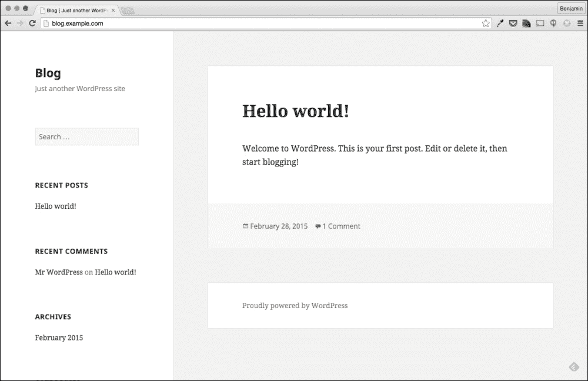

# 第十二章：意外重启的根本原因分析

在本章中，我们将对您在之前章节中学到的故障排除方法和技能进行测试。我们将对最困难的真实场景之一进行根本原因分析：意外重启。

正如我们在第一章中讨论的，*故障排除最佳实践*，根本原因分析比简单的故障排除和解决问题要复杂一些。在企业环境中，您会发现每个导致重大影响的问题都需要进行根本原因分析（RCA）。这是因为企业环境通常有关于应该如何处理事件的成熟流程。

一般来说，当发生重大事件时，受到影响的组织希望避免再次发生。即使在技术环境之外的许多行业中也可以看到这一点。

正如我们在第一章中讨论的，*故障排除最佳实践*，一个有用的根本原因分析具有以下特征：

+   问题的报告方式

+   问题的实际根本原因

+   事件和采取的行动的时间线

+   任何关键数据点

+   防止事件再次发生的行动计划

对于今天的问题，我们将使用一个事件来构建一个样本根本原因分析文档。为此，我们将使用您在之前章节中学到的信息收集和故障排除步骤。在做所有这些的同时，您还将学会处理意外重启，这是确定根本原因的最糟糕的事件之一。

意外重启困难的原因在于系统重启时通常会丢失您需要识别问题根本原因的信息。正如我们在之前的章节中所看到的，我们在问题发生期间收集的数据越多，我们就越有可能确定问题的原因。

在重启期间丢失的信息往往是确定根本原因和未确定根本原因之间的区别。

# 深夜警报

随着我们在章节中的进展和为最近的雇主解决了许多问题，我们也在获得他们对我们能力的信任。最近，我们甚至被放在了**值班**轮换中，这意味着如果在工作时间之后出现问题，我们的手机将通过短信收到警报。

当然，值班的第一个晚上我们收到了一个警报；这个警报不是一个好消息。

*警报：blog.example.com 不再响应 ICMP Ping*

当我们被加入到值班轮换中时，我们的团队负责人告诉我们，任何在工作时间之后发生的重大事件都必须进行根本原因分析。这样做的原因是为了让我们组中的其他人学习和了解我们是如何解决问题以及如何防止再次发生的。

正如我们之前讨论的，有用的根本原因分析的关键组成部分之一是列出事情发生的时间。我们时间线中的一个重大事件是我们收到警报的时间；根据我们的短信消息，我们可以看到我们在 2015 年 7 月 5 日 01:52 收到了警报，或者说；7 月 5 日凌晨 1:52（欢迎来到值班！）。

# 确定问题

从警报中，我们可以看到我们的监控系统无法对我们公司的博客服务器执行`ICMP` ping。我们应该做的第一件事是确定我们是否可以`ping`服务器：

```
$ ping blog.example.com
PING blog.example.com (192.168.33.11): 56 data bytes
64 bytes from 192.168.33.11: icmp_seq=0 ttl=64 time=0.832 ms
64 bytes from 192.168.33.11: icmp_seq=1 ttl=64 time=0.382 ms
64 bytes from 192.168.33.11: icmp_seq=2 ttl=64 time=0.240 ms
64 bytes from 192.168.33.11: icmp_seq=3 ttl=64 time=0.234 ms
^C
--- blog.example.com ping statistics ---
4 packets transmitted, 4 packets received, 0.0% packet loss
round-trip min/avg/max/stddev = 0.234/0.422/0.832/0.244 ms

```

看起来我们能够 ping 通相关服务器，所以也许这是一个虚警？以防万一，让我们尝试登录系统：

```
$ ssh 192.168.33.11 -l vagrant
vagrant@192.168.33.11's password: 
$

```

看起来我们能够登录，系统正在运行；让我们开始四处看看，检查是否能够确定任何问题。

正如在之前的章节中介绍的，我们总是运行的第一个命令是`w`：

```
$ w
01:59:46 up 9 min,  1 user,  load average: 0.00, 0.01, 0.02
USER     TTY        LOGIN@   IDLE   JCPU   PCPU WHAT
vagrant  pts/0     01:59    2.00s  0.03s  0.01s w

```

在这种情况下，这个小习惯实际上效果很好。通过`w`命令的输出，我们可以看到这台服务器只运行了`9`分钟。看来我们的监控系统无法 ping 通我们的服务器，因为它正在重新启动。

### 提示

我们应该注意到我们能够确定服务器在登录后重新启动；这将是我们时间表中的一个关键事件。

## 有人重新启动了这台服务器吗？

虽然我们刚刚确定了警报的根本原因，但这并不是问题的根本原因。我们需要确定服务器为什么重新启动。服务器不经常（至少不应该）自行重新启动；有时可能只是有人在未告知其他人的情况下对该服务器进行维护。我们可以使用`last`命令查看最近是否有人登录到该服务器：

```
$ last
vagrant  pts/0        192.168.33.1     Sun Jul  5 01:59   still logged in 
joe  pts/1        192.168.33.1     Sat Jun  6 18:49 - 21:37  (02:48) 
bob  pts/0        10.0.2.2         Sat Jun  6 18:16 - 21:37  (03:21) 
billy  pts/0        10.0.2.2         Sat Jun  6 17:09 - 18:14  (01:05) 
doug  pts/0        10.0.2.2         Sat Jun  6 15:26 - 17:08  (01:42) 

```

`last`命令的输出从顶部开始显示最新的登录。这些数据来自`/var/log/wtmp`，用于存储登录详细信息。在`last`命令的输出末尾，我们看到以下行：

```
wtmp begins Mon Jun 21 23:39:24 2014

```

这告诉我们`wtmp`日志文件的历史记录；这是一个非常有用的信息。如果我们想查看特定数量的登录，我们可以简单地添加“-n”标志，后面跟上我们希望看到的登录数量。

这通常是非常有用的；但是，由于我们不知道最近在这台机器上有多少次登录，我们将使用默认设置。

从我们收到的输出中，我们可以看到最近没有人登录到这台服务器。除非有人亲自按下电源按钮或拔掉系统，否则我们可以假设没有人重新启动服务器。

### 提示

这是我们时间表中应该使用的另一个事实/事件。

## 日志告诉我们什么？

由于没有人重新启动这台服务器，我们的下一个假设是这台服务器是由软件或硬件问题重新启动的。我们下一个合乎逻辑的步骤是查看系统日志文件，以确定发生了什么事情：

```
01:59:46 up 9 min,  1 user,  load average: 0.00, 0.01, 0.02

```

```
less command to read /var/log/messages:
```

```
Jul  5 01:48:01 localhost auditd[560]: Audit daemon is low on disk space for logging
Jul  5 01:48:01 localhost auditd[560]: Audit daemon is suspending logging due to low disk space.
Jul  5 01:50:02 localhost watchdog[608]: loadavg 25 9 3 is higher than the given threshold 24 18 12!
Jul  5 01:50:02 localhost watchdog[608]: shutting down the system because of error -3
Jul  5 01:50:12 localhost rsyslogd: [origin software="rsyslogd" swVersion="7.4.7" x-pid="593" x-info="http://www.rsyslog.com"] exiting on signal 15.
Jul  5 01:50:32 localhost systemd: Time has been changed
Jul  5 01:50:32 localhost NetworkManager[594]: <info> dhclient started with pid 722
Jul  5 01:50:32 localhost NetworkManager[594]: <info> Activation (enp0s3) Stage 3 of 5 (IP Configure Start) complete.
Jul  5 01:50:32 localhost vboxadd-service: Starting VirtualBox Guest Addition service [  OK  ]
Jul  5 01:50:32 localhost systemd: Started LSB: VirtualBox Additions service.
Jul  5 01:50:32 localhost dhclient[722]: Internet Systems Consortium DHCP Client 4.2.5
Jul  5 01:50:32 localhost dhclient[722]: Copyright 2004-2013 Internet Systems Consortium.
Jul  5 01:50:32 localhost dhclient[722]: All rights reserved.
Jul  5 01:50:32 localhost dhclient[722]: For info, please visit https://www.isc.org/software/dhcp/
Jul  5 01:50:32 localhost dhclient[722]: 
Jul  5 01:50:32 localhost NetworkManager: Internet Systems Consortium DHCP Client 4.2.5
Jul  5 01:50:32 localhost NetworkManager: Copyright 2004-2013 Internet Systems Consortium.
Jul  5 01:50:32 localhost NetworkManager: All rights reserved.
Jul  5 01:50:32 localhost NetworkManager: For info, please visit https://www.isc.org/software/dhcp/
Jul  5 01:50:32 localhost NetworkManager[594]: <info> (enp0s3): DHCPv4 state changed nbi -> preinit
Jul  5 01:50:32 localhost dhclient[722]: Listening on LPF/enp0s3/08:00:27:20:5d:4b
Jul  5 01:50:32 localhost dhclient[722]: Sending on   LPF/enp0s3/08:00:27:20:5d:4b
Jul  5 01:50:32 localhost dhclient[722]: Sending on   Socket/fallback
Jul  5 01:50:32 localhost dhclient[722]: DHCPREQUEST on enp0s3 to 255.255.255.255 port 67 (xid=0x3ae55b57)

```

由于这里有相当多的信息，让我们稍微分解一下我们看到的内容。

第一个任务是找到一个清楚写在启动时的日志消息。通过识别写在启动时的日志消息，我们将能够确定在重新启动之前和之后写入了哪些日志。我们还将能够确定我们的根本原因文档的启动时间：

```
Jul  5 01:50:12 localhost rsyslogd: [origin software="rsyslogd" swVersion="7.4.7" x-pid="593" x-info="http://www.rsyslog.com"] exiting on signal 15.
Jul  5 01:50:32 localhost systemd: Time has been changed
Jul  5 01:50:32 localhost NetworkManager[594]: <info> dhclient started with pid 722
Jul  5 01:50:32 localhost NetworkManager[594]: <info> Activation (enp0s3) Stage 3 of 5 (IP Configure Start) complete.

```

看起来有希望的第一个日志条目是`NetworkManager`在`01:50:32`的消息。这条消息说明`NetworkManager`服务已启动`dhclient`。

`dhclient`进程用于发出 DHCP 请求并根据回复配置网络设置。这个过程通常只在网络被重新配置或在启动时调用：

```
Jul  5 01:50:12 localhost rsyslogd: [origin software="rsyslogd" swVersion="7.4.7" x-pid="593" x-info="http://www.rsyslog.com"] exiting on signal 15.

```

如果我们查看前一行，我们可以看到在 01:50:12，`rsyslogd`进程正在“退出信号 15”。这意味着在关机期间发送了终止信号给`rsyslogd`进程，这是一个非常标准的过程。

我们可以确定在 01:50:12 服务器正在关机过程中，在 01:50:32 服务器正在启动过程中。这意味着我们应该查看 01:50:12 之前的所有内容，以确定系统为什么重新启动。

### 提示

关机时间和启动时间也将需要用于我们的根本原因时间表。

从之前捕获的日志中，我们可以看到在 01:50 之前有两个进程写入了`/var/log/messages`；`auditd`和看门狗进程。

```
Jul  5 01:48:01 localhost auditd[560]: Audit daemon is low on disk space for logging
Jul  5 01:48:01 localhost auditd[560]: Audit daemon is suspending logging due to low disk space.

```

让我们首先看一下`auditd`进程。我们可以在第一行看到“磁盘空间不足”的消息。我们的系统是否因为磁盘空间不足而遇到问题？这是可能的，我们现在可以检查一下：

```
# df -h
Filesystem               Size  Used Avail Use% Mounted on
/dev/mapper/centos-root   39G   39G   32M 100% /
devtmpfs                 491M     0  491M   0% /dev
tmpfs                    498M     0  498M   0% /dev/shm
tmpfs                    498M  6.5M  491M   2% /run
tmpfs                    498M     0  498M   0% /sys/fs/cgroup
/dev/sda1                497M  104M  394M  21% /boot

```

看起来文件系统已经满了，但这本身通常不会导致重新启动。考虑到第二个`auditd`消息显示**守护程序正在暂停记录**；这也不像是重新启动过程。让我们继续查看，看看我们还能识别出什么：

```
Jul  5 01:50:02 localhost watchdog[608]: loadavg 25 9 3 is higher than the given threshold 24 18 12!
Jul  5 01:50:02 localhost watchdog[608]: shutting down the system because of error -3

```

`看门狗`进程的接下来两条消息很有趣。第一条消息指出服务器的`loadavg`高于指定的阈值。第二条消息非常有趣，因为它明确指出了“关闭系统”。

`看门狗`进程可能重新启动了这台服务器吗？也许是的，但首要问题是，`看门狗`进程是什么？

## 了解新的进程和服务

在查看`messages`日志时发现一个从未使用或见过的进程并不罕见：

```
# ps -eo cmd | sort | uniq | wc -l
115

```

即使在我们的基本示例系统上，进程列表中有 115 个独特的命令。特别是当你加入一个新版本，比如写作时的 Red Hat Enterprise Linux 7（较新的版本）。每个新版本都带来新的功能，甚至可能意味着默认运行新的进程。要跟上这一切是非常困难的。

就我们的例子而言，`看门狗`就是这种情况之一。在这一点上，除了从名称中推断出它是观察事物之外，我们不知道这个进程的作用。那么我们如何了解更多关于它的信息呢？好吧，我们要么谷歌一下，要么查看`man`：

```
$ man watchdog
NAME
 watchdog - a software watchdog daemon

SYNOPSIS
 watchdog [-F|--foreground] [-f|--force] [-c filename|--config-file filename] [-v|--verbose] [-s|--sync] [-b|--softboot] [-q|--no-action]

DESCRIPTION
 The  Linux  kernel  can  reset  the system if serious problems are detected.  This can be implemented via special watchdog hardware, or via a slightly less reliable software-only watchdog inside the kernel. Either way, there needs to be a daemon that tells the kernel the system is working fine. If the daemon stops doing that, the system is reset.

 watchdog is such a daemon. It opens /dev/watchdog, and keeps writing to it often enough to keep the kernel from resetting, at least once per minute. Each write delays the reboot time another minute. After a minute  of  inactivity the watchdog hardware will cause the reset. In the case of the software watchdog the ability to reboot will depend on the state of the machines and interrupts.

 The watchdog daemon can be stopped without causing a reboot if the device /dev/watchdog is closed correctly, unless your kernel is compiled with the CONFIG_WATCHDOG_NOWAYOUT option enabled.

```

根据`man`页面，我们已经确定`看门狗`服务实际上用于确定服务器是否健康。如果`看门狗`无法做到这一点，它可能会重新启动服务器：

```
Jul  5 01:50:02 localhost watchdog[608]: shutting down the system because of error -3

```

从这条日志消息中看来，`看门狗`软件是导致重新启动的原因。是不是因为文件系统已满，`看门狗`才重新启动了系统？

如果我们继续阅读`man`页面，我们将看到另一条有用的信息，如下所示：

```
TESTS
 The watchdog daemon does several tests to check the system status:

 ·  Is the process table full?

 ·  Is there enough free memory?

 ·  Are some files accessible?

 ·  Have some files changed within a given interval?

 ·  Is the average work load too high?

```

在这个列表的最后一个“测试”中，它指出`看门狗`守护程序可以检查平均工作负载是否过高：

```
Jul  5 01:50:02 localhost watchdog[608]: loadavg 25 9 3 is higher than the given threshold 24 18 12!

```

根据`man`页面和前面的日志消息，似乎`看门狗`并不是因为文件系统而重新启动服务器，而是因为服务器的负载平均值。

### 提示

在继续之前，让我们注意到在 01:50:02，`看门狗`进程启动了重新启动。

# 是什么导致了高负载平均值？

虽然我们已经确定了重新启动服务器的原因，但我们仍然没有找到问题的根本原因。我们仍然需要弄清楚是什么导致了高负载平均值。不幸的是，这被归类为重新启动期间丢失的信息。

如果系统仍然经历着高负载平均值，我们可以简单地使用`top`或`ps`来找出哪些进程正在使用最多的 CPU 时间。然而，一旦系统重新启动，任何导致高负载平均值的进程都将被重新启动。

除非这些进程再次导致高负载平均值，否则我们无法确定来源。

```
$ w
 02:13:07 up  23 min,  1 user,  load average: 0.00, 0.01, 0.05
USER     TTY        LOGIN@   IDLE   JCPU   PCPU WHAT
vagrant  pts/0     01:59    3.00s  0.26s  0.10s sshd: vagrant [priv]

```

然而，我们能够确定负载平均值开始增加的时间和增加到多高。随着我们进一步调查，这些信息可能会有用，因为我们可以用它来确定问题开始出现的时间。

要查看负载平均值的历史视图，我们可以使用`sar`命令：

```
$ sar

```

幸运的是，看起来`sar`命令的收集间隔设置为每`2`分钟。默认值为 10 分钟，这意味着我们通常会看到每 10 分钟的一行：

```
01:42:01 AM    all    0.01    0.00    0.06     0.00     0.00    99.92
01:44:01 AM    all    0.01    0.00    0.06     0.00     0.00    99.93
01:46:01 AM    all    0.01    0.00    0.06     0.00     0.00    99.93
01:48:01 AM    all   33.49    0.00    2.14     0.00     0.00    64.37
01:50:05 AM    all   87.80    0.00   12.19     0.00     0.00     0.01
Average:       all    3.31    0.00    0.45     0.00     0.00    96.24

01:50:23 AM       LINUX RESTART

01:52:01 AM   CPU   %user   %nice   %system   %iowait   %steal  %idle
01:54:01 AM   all   0.01    0.00     0.06     0.00       0.00   99.93
01:56:01 AM   all   0.01    0.00     0.05     0.00       0.00   99.94
01:58:01 AM   all   0.01    0.00     0.05     0.00       0.00   99.94
02:00:01 AM   all   0.03    0.00     0.10     0.00       0.00   99.87

```

从输出中可以看出，在`01:46`，这个系统几乎没有 CPU 使用率。然而，从`01:48`开始，用户空间的 CPU 利用率达到了`33`％。

此外，似乎在`01:50`，`sar`能够捕获到 CPU 利用率达到`99.99`％，其中用户使用了`87.8`％，系统使用了`12.19`％。

### 提示

以上都是我们在根本原因总结中可以使用的好事实。

有了这个，我们现在知道我们的问题是在`01:44`和`01:46`之间开始的，我们可以从 CPU 使用情况中看出。

让我们使用`-q`标志来查看负载平均值，看看负载平均值是否与 CPU 利用率匹配：

```
# sar -q
Again, we can narrow events down even further:
01:42:01 AM        0      145     0.00      0.01      0.02         0
01:44:01 AM        0      145     0.00      0.01      0.02         0
01:46:01 AM        0      144     0.00      0.01      0.02         0
01:48:01 AM       14      164     4.43      1.12      0.39         0
01:50:05 AM       37      189    25.19      9.14      3.35         0
Average:           1      147     0.85      0.30      0.13         0

01:50:23 AM       LINUX RESTART

01:52:01 AM   runq-sz  plist-sz  ldavg-1   ldavg-5  ldavg-15  blocked
01:54:01 AM         0       143     0.01      0.04      0.02        0
01:56:01 AM         1       138     0.00      0.02      0.02        0
01:58:01 AM         0       138     0.00      0.01      0.02        0
02:00:01 AM         0       141     0.00      0.01      0.02        0

```

通过**负载平均**的测量，我们可以看到即使在`01:46`时 CPU 利用率很高，一切都很平静。然而，在接下来的`01:48`运行中，我们可以看到**运行队列**为 14，1 分钟负载平均值为 4。

## 运行队列和负载平均值是什么？

由于我们正在查看运行队列和负载平均值，让我们花一点时间来理解这些值的含义。

在一个非常基本的概念中，运行队列值显示了处于等待执行状态的进程数量。

更多细节，请考虑一下 CPU 及其工作原理。单个 CPU 一次只能执行一个任务。如今大多数服务器都有多个核心，有时每台服务器还有多个处理器。在 Linux 上，每个核心和线程（对于超线程 CPU）都被视为单个 CPU。

每个 CPU 都能一次执行一个任务。如果我们有两个 CPU 服务器，我们的服务器可以同时执行两个任务。

假设我们的双 CPU 系统需要同时执行四个任务。系统可以执行其中两个任务，但另外两个任务必须等到前两个任务完成后才能执行。当出现这种情况时，等待的进程将被放入“运行队列”。当系统中有进程在运行队列中时，它们将被优先处理，并在 CPU 可用时执行。

在我们的`sar`捕获中，我们可以看到 01:48 时运行队列值为 14；这意味着在那一刻，有 14 个任务在运行队列中等待 CPU。

### 负载平均值

负载平均值与运行队列有些不同，但并不完全相同。负载平均值是在一定时间内的平均运行队列值。在我们前面的例子中，我们可以看到`ldavg-1`（这一列是最近一分钟的平均运行队列长度）。

运行队列值和 1 分钟负载平均值可能会有所不同，因为由`sar`报告的运行队列值是在执行时的值，而 1 分钟负载平均值是 60 秒内的运行队列平均值。

```
01:46:01 AM        0      144      0.00      0.01      0.02         0
01:48:01 AM       14      164      4.43      1.12      0.39         0
01:50:05 AM       37      189     25.19      9.14      3.35         0

```

高运行队列的单次捕获未必意味着存在问题，特别是如果 1 分钟负载平均值不高的话。然而，在我们的例子中，我们可以看到在`01:48`时，我们的运行队列中有 14 个任务在队列中，在`01:50`时，我们的运行队列中有 37 个任务在队列中。

另外，我们可以看到在`01:50`时，我们的 1 分钟负载平均值为 25。

根据与 CPU 利用率的重叠，似乎大约在 01:46 - 01:48 左右，发生了导致 CPU 利用率高的事件。除了这种高利用率外，还有许多需要执行但无法执行的任务。

### 提示

我们应该花一点时间记录下我们在`sar`中看到的时间和值，因为这些将是根本原因总结所必需的细节。

# 调查文件系统是否已满

早些时候，我们注意到文件系统已经满了。不幸的是，我们安装的`sysstat`版本没有捕获磁盘空间使用情况。一个有用的事情是确定文件系统填满的时间与我们的运行队列开始增加的时间相比：

```
Jul  5 01:48:01 localhost auditd[560]: Audit daemon is low on disk space for logging
Jul  5 01:48:01 localhost auditd[560]: Audit daemon is suspending logging due to low disk space.

```

从我们之前看到的日志消息中，我们可以看到`auditd`进程在`01:48`识别出低磁盘空间。这与我们看到运行队列急剧增加的时间非常接近。

这正建立在一个假设的基础上，即问题的根本原因是文件系统填满，导致一个进程要么启动了许多 CPU 密集型任务，要么阻塞了 CPU 以执行其他任务。

虽然这是一个合理的理论，但我们必须证明它是真实的。我们可以更接近证明这一点的方法之一是确定在这个系统上利用了大部分磁盘空间的是什么：

```
# du -k / | sort -nk 1 | tail -25
64708  /var/cache/yum/x86_64/7/epel
67584  /var/cache/yum/x86_64/7/base
68668  /usr/lib/firmware
75888  /usr/lib/modules/3.10.0-123.el7.x86_64/kernel/drivers
80172  /boot
95384  /usr/share/locale
103548  /usr/lib/locale
105900  /usr/lib/modules/3.10.0-123.el7.x86_64/kernel
116080  /usr/lib/modules
116080  /usr/lib/modules/3.10.0-123.el7.x86_64
148276  /usr/bin
162980  /usr/lib64
183640  /var/cache/yum
183640  /var/cache/yum/x86_64
183640  /var/cache/yum/x86_64/7
184396  /var/cache
285240  /usr/share
317628  /var
328524  /usr/lib
1040924  /usr
2512948  /opt/myapp/logs
34218392  /opt/myapp/queue
36731428  /opt/myapp
36755164  /opt
38222996  /

```

前面的一行代码是一个非常有用的方法，用于识别哪些目录或文件使用了最多的空间。

## du 命令

前面的一行命令使用了`sort`命令，你在第十一章中学到了有关`sort`命令的知识，*从常见故障中恢复*，对`du`的输出进行排序。`du`命令是一个非常有用的命令，可以估算给定目录使用的空间量。

例如，如果我们想知道`/var/tmp`目录使用了多少空间，我们可以很容易地通过以下`du`命令来确定：

```
# du -h /var/tmp
0  /var/tmp/systemd-private-Wu4ixe/tmp
0  /var/tmp/systemd-private-Wu4ixe
0  /var/tmp/systemd-private-pAN90Q/tmp
0  /var/tmp/systemd-private-pAN90Q
160K  /var/tmp

```

`du`的一个有用属性是，默认情况下，它不仅会列出`/var/tmp`，还会列出其中的目录。我们可以看到有几个目录里面什么都没有，但`/var/tmp/`目录包含了 160 kb 的数据。

```
# du -h /var/tmp/
0  /var/tmp/systemd-private-Wu4ixe/tmp
0  /var/tmp/systemd-private-Wu4ixe
0  /var/tmp/systemd-private-pAN90Q/tmp
0  /var/tmp/systemd-private-pAN90Q
4.0K  /var/tmp/somedir
164K  /var/tmp/

```

### 注意

重要的是要知道`/var/tmp`的大小是`/var/tmp`中的内容的大小，其中包括其他子目录。

为了说明前面的观点，我创建了一个名为`somedir`的目录，并在其中放了一个 4 kb 的文件。我们可以从随后的`du`命令中看到，`/var/tmp`目录现在显示已使用 164 kb。

`du`命令有很多标志，可以让我们改变它输出磁盘使用情况的方式。在前面的例子中，由于`-h`标志的存在，这些值以人类可读的格式打印出来。在一行命令中，由于`-k`标志的存在，这些值以千字节表示：

```
2512948  /opt/myapp/logs
34218392  /opt/myapp/queue
36731428  /opt/myapp
36755164  /opt
38222996  /

```

如果我们回到一行命令，我们可以从输出中看到，在`/`中使用的 38 GB 中，有 34 GB 在`/opt/myapp/queue`目录中。这个目录对我们来说非常熟悉，因为我们在之前的章节中曾解决过这个目录的问题。

根据我们以往的经验，我们知道这个目录用于排队接收自定义应用程序接收的消息。

考虑到这个目录的大小，有可能在重新启动之前，自定义应用程序在这台服务器上运行，并填满了文件系统。

我们已经知道这个目录占用了系统上大部分的空间。确定这个目录中最后一个文件的创建时间将会很有用，因为这将给我们一个大致的应用上次运行的时间范围：

```
# ls -l
total 368572
drwxrwxr-x. 2 vagrant vagrant        40 Jun 10 17:03 bin
drwxrwxr-x. 2 vagrant vagrant        23 Jun 10 16:55 conf
drwxrwxr-x. 2 vagrant vagrant        49 Jun 10 16:40 logs
drwxr-xr-x. 2 root    root    272932864 Jul  5 01:50 queue
-rwxr-xr-x. 1 vagrant vagrant       116 Jun 10 16:56 start.sh

```

我们实际上可以通过在`/opt/myapp`目录中执行`ls`来做到这一点。从前面的输出中，我们可以看到`queue/`目录上次修改是在 7 月 5 日 01:50。这与我们的问题非常吻合，至少证明了在重新启动之前自定义应用程序是在运行的。

### 提示

这个目录上次更新的时间戳以及这个应用程序运行的事实都是我们在总结中要记录的项目。

根据前面的信息，我们可以在这一点上安全地说，在事故发生时，自定义应用程序正在运行，并且已经创建了足够的文件来填满文件系统。

我们还可以说，在文件系统达到 100％利用率时，服务器的负载平均值突然飙升。

根据这些事实，我们可以提出一个假设；我们目前的工作理论是，一旦应用程序填满了文件系统，它就不再能创建文件。这可能导致相同的应用程序阻塞 CPU 时间或产生许多 CPU 任务，从而导致负载平均值升高。

## 为什么队列目录没有被处理？

由于我们知道自定义应用程序是文件系统问题的根源，我们还需要回答为什么。

在之前的章节中，你学到了这个应用程序的队列目录是由作为`vagrant`用户运行的`cronjob`处理的。让我们通过查看`/var/log/cron`日志文件来看一下上次运行该 cron 作业的时间：

```
Jun  6 15:28:01 localhost CROND[3115]: (vagrant) CMD (/opt/myapp/bin/processor --debug --config /opt/myapp/conf/config.yml > /dev/null)

```

根据`/var/log/cron`目录的记录，作业上次运行的时间是`6 月 6 日`。这个时间线大致与这个进程被移动到另一个系统的时间相吻合，之后服务器就没有内存了。

处理器作业是否停止了但应用程序没有停止？可能是，我们知道应用程序正在运行，但让我们检查一下`processor`作业。

我们可以使用`crontab`命令检查处理器作业是否已被删除：

```
# crontab -l -u vagrant
#*/4 * * * * /opt/myapp/bin/processor --debug --config /opt/myapp/conf/config.yml > /dev/null

```

`-l`（列出）标志将导致`crontab`命令打印或列出为执行它的用户定义的 cronjobs。当添加`-u`（用户）标志时，它允许我们指定要列出 cronjobs 的用户，在这种情况下是`vagrant`用户。

从列表中看来，`processor`作业并没有被删除，而是被禁用了。我们可以看到它已被禁用，因为该行以`#`开头，这用于在`crontab`文件中指定注释。

这基本上将工作变成了一条注释，而不是一个计划任务。这意味着`crond`进程不会执行这项工作。

## 您所学到的内容的检查点

在这一点上，让我们对我们能够确定和收集的内容进行一次检查点。

登录系统后，我们能够确定服务器已经重新启动。我们能够在`/var/log/messages`中看到`watchdog`进程负责重新启动服务器：

```
Jul  5 01:50:02 localhost watchdog[608]: loadavg 25 9 3 is higher than the given threshold 24 18 12!

```

根据`/var/log/messages`中的日志消息，看门狗进程因负载过高而重新启动了服务器。从`sar`中，我们可以看到负载平均值在几分钟内从 0 上升到 25。

在进行调查时，我们还能够确定服务器的`/`（根）文件系统已满。不仅满了，而且有趣的是，在系统重新启动前几分钟它大约使用了 100％。

文件系统处于这种状态的原因是因为`/opt/myapp`中的自定义应用程序仍在运行并在`/opt/myapp/queue`中创建文件。然而，清除此队列的作业未运行，因为它已在 vagrant 用户的`crontab`中被注释掉。

基于此，我们可以说我们问题的根本原因很可能是由于文件系统填满，这是由于应用程序正在运行但未处理消息造成的。

### 有时你不能证明一切

在这一点上，我们已经确定了导致负载平均值升高的几乎所有原因。由于我们没有在事件发生时运行的进程的快照，我们无法确定是自定义应用程序。根据我们能够收集到的信息，我们也无法确定是因为文件系统填满而触发的。

我们可以通过在另一个系统中复制此场景来测试这个理论，但这不一定是在周末凌晨 2:00 要做的事情。通常，将问题复制到这个程度通常是作为后续活动来执行的。

在这一点上，根据我们找到的数据，我们可以相当肯定地确定根本原因。在许多情况下，这是你能得到的最接近的，因为你可能没有时间收集数据，或者根本没有数据来确定根本原因。

# 防止再次发生

由于我们对发生的原因有了相当自信的假设，现在我们可以继续进行我们根本原因分析的最后一步；防止问题再次发生。

正如我们在本章开头讨论的那样，所有有用的根本原因分析报告都包括一个行动计划。有时，这个行动计划是在问题发生时立即执行的。有时，这个计划是作为长期解决方案稍后执行的。

对于我们的问题，我们将采取即时行动和长期行动。

## 即时行动

我们需要采取的第一个即时行动是确保系统的主要功能健康。在这种情况下，服务器的主要功能是为公司的博客提供服务。



通过在浏览器中访问博客地址很容易检查。从前面的截图中我们可以看到博客正在正常工作。为了确保，我们也可以验证 Apache 服务是否正在运行：

```
# systemctl status httpd
httpd.service - The Apache HTTP Server
 Loaded: loaded (/usr/lib/systemd/system/httpd.service; enabled)
 Active: active (running) since Sun 2015-07-05 01:50:36 UTC; 3 days ago
 Main PID: 1015 (httpd)
 Status: "Total requests: 0; Current requests/sec: 0; Current traffic:   0 B/sec"
 CGroup: /system.slice/httpd.service
 ├─1015 /usr/sbin/httpd -DFOREGROUND
 ├─2315 /usr/sbin/httpd -DFOREGROUND
 ├─2316 /usr/sbin/httpd -DFOREGROUND
 ├─2318 /usr/sbin/httpd -DFOREGROUND
 ├─2319 /usr/sbin/httpd -DFOREGROUND
 ├─2321 /usr/sbin/httpd -DFOREGROUND
 └─5687 /usr/sbin/httpd -DFOREGROUND

Jul 05 01:50:36 blog.example.com systemd[1]: Started The Apache HTTP Server.

```

从这个情况来看，我们的 Web 服务器自重启以来一直在线，这很好，因为这意味着博客自重启以来一直在工作。

### 提示

有时，根据系统的重要性，甚至在调查问题之前，首先验证系统是否正常运行可能是很重要的。与任何事情一样，这实际上取决于环境，因为关于哪个先来的硬性规定并不是绝对的。

现在我们知道博客正在正常工作，我们需要解决磁盘已满的问题。

```
# ls -la /opt/myapp/queue/ | wc -l
495151

```

与之前的章节一样，似乎`queue`目录中有很多等待处理的消息。为了正确清除这些消息，我们需要手动运行`processor`命令，但还需要进行一些额外的步骤：

```
# sysctl -w fs.file-max=500000
fs.file-max = 500000

```

我们必须采取的第一步是增加系统一次可以打开的文件数量。我们根据过去使用 processor 应用程序和大量消息的经验得知这一点。

```
# su - vagrant
$ ulimit -n 500000
$ ulimit -a
core file size          (blocks, -c) 0
data seg size           (kbytes, -d) unlimited
scheduling priority             (-e) 0
file size               (blocks, -f) unlimited
pending signals                 (-i) 7855
max locked memory       (kbytes, -l) 64
max memory size         (kbytes, -m) unlimited
open files                      (-n) 500000
pipe size            (512 bytes, -p) 8
POSIX message queues     (bytes, -q) 819200
real-time priority              (-r) 0
stack size              (kbytes, -s) 8192
cpu time               (seconds, -t) unlimited
max user processes              (-u) 4096
virtual memory          (kbytes, -v) unlimited
file locks                      (-x) unlimited

```

第二步是增加对`vagrant`用户施加的用户限制；具体来说，是增加打开文件数量的限制。这一步需要在我们执行`processor`命令的同一个 shell 会话中执行。完成这一步后，我们可以手动执行`processor`命令来处理排队的消息：

```
$ /opt/myapp/bin/processor --debug --config /opt/myapp/conf/config.yml
Initializing with configuration file /opt/myapp/conf/config.yml
- - - - - - - - - - - - - - - - - - - - - - - - - -
Starting message processing job
Added 495151 to queue
Processing 495151 messages
Processed 495151 messages

```

现在消息已经被处理，我们可以使用`df`命令重新检查文件系统利用率：

```
# df -h
Filesystem               Size  Used Avail Use% Mounted on
/dev/mapper/centos-root   39G  3.8G   35G  10% /
devtmpfs                 491M     0  491M   0% /dev
tmpfs                    498M     0  498M   0% /dev/shm
tmpfs                    498M   13M  485M   3% /run
tmpfs                    498M     0  498M   0% /sys/fs/cgroup
/dev/sda1                497M  104M  394M  21% /boot

```

正如我们所看到的，`/`文件系统的利用率已降至`10%`。

为了确保我们不会再次填满这个文件系统，我们验证自定义应用程序当前是否已停止：

```
# ps -elf | grep myapp
0 R root      6535  2537  0  80   0 - 28160 -      15:09 pts/0    00:00:00 grep --color=auto myapp

```

由于我们看不到以应用程序命名的任何进程在运行，我们可以确信该应用程序当前未运行。

## 长期行动

这带我们来到我们的**长期行动**。长期行动是我们将在根本原因总结中推荐的行动，但此刻不会采取的行动。

建议的第一个长期行动是永久删除该系统中的自定义应用程序。由于我们知道该应用程序已迁移到另一个系统，因此在这台服务器上不再需要。但是，删除该应用程序不是我们应该在凌晨 2 点或在验证它是否真的不再需要之前就进行的事情。

第二个长期行动是调查添加监控解决方案，可以定期对运行中的进程和这些进程的 CPU/状态进行快照。如果在这次根本原因分析调查中有这些信息，我们将能够毫无疑问地证明哪个进程导致了高负载。由于这些信息不可用，我们只能做出合理的猜测。

再次强调，这不是我们想在深夜电话中处理的任务，而是标准工作日的事情。

# 根本原因分析示例

现在我们已经获得了所有需要的信息，让我们创建一个根本原因分析报告。实际上，这份报告可以是任何格式，但我发现以下内容比较有效。

## 问题总结

2015 年 7 月 5 日凌晨 1:50 左右，服务器`blog.example.com`意外重启。由于服务器负载平均值过高，`watchdog`进程启动了重启过程。

经过调查，高负载平均值似乎是由一个自定义的电子邮件应用程序引起的，尽管它已经迁移到另一台服务器，但仍处于运行状态。

根据可用数据，似乎应用程序占用了根文件系统的 100%。

虽然我无法获得重启前的进程状态，但似乎高负载平均值也可能是由于同一应用程序无法写入磁盘而引起的。

## 问题详情

事件报告的时间为 2015 年 7 月 5 日`01:52`

事件的时间线将是：

+   在`01:52`收到了一条短信警报，说明`blog.example.com`通过 ICMP ping 不可访问。

+   执行的第一步故障排除是对服务器进行 ping：

+   ping 显示服务器在线

+   在`01:59`登录服务器并确定服务器已重新启动。

+   搜索`/var/log/messages`文件，并确定`watchdog`进程在`01:50:12`重新启动了服务器：

+   `watchdog`在`01:50:02`开始了重新启动过程

+   在调查过程中，我们发现在事件发生时没有用户登录

+   服务器在`01:50:32`开始了引导过程

+   在调查过程中，发现服务器在`01:48:01`已经没有可用的磁盘空间。

+   该系统的负载平均值在大约相同的时间开始增加，达到`01:50:05`时为 25。

+   我们确定`/opt/myapp/queue`目录在`01:50`最后修改，并包含大约 34GB 的数据，导致 100%的磁盘利用率：

+   这表明自定义电子邮件应用程序一直在服务器重新启动之前运行

+   我们发现自 6 月 6 日以来`processor`作业没有运行，这意味着消息没有被处理。

## 根本原因

由于自定义应用程序在未通过 cron 执行`processor`作业的情况下运行，文件系统达到 100%利用率。收集的数据表明这导致了高负载平均值，触发了`watchdog`进程重新启动服务器。

## 行动计划

我们应该采取以下步骤：

+   验证 Apache 正在运行并且`Blog`是可访问的

+   验证系统重新启动后自定义应用程序未在运行

+   在 02:15 手动执行了处理器作业，解决了磁盘空间问题

### 需要采取进一步行动

+   从服务器中删除自定义应用程序，以防止应用程序意外启动

+   调查添加进程列表监视，以捕获在类似问题期间利用 CPU 时间的进程：

+   将有助于解决类似情况

正如您在前面的报告中所看到的，我们有一个高层次的时间线，显示了我们能够确定的内容，我们如何确定的，以及我们采取的解决问题的行动。这是一个良好的根本原因分析的所有关键组成部分。

# 总结

在本章中，我们介绍了如何应对一个非常困难的问题：意外的重新启动。我们使用了本书中看到的工具和方法来确定根本原因并创建根本原因报告。

我们在整本书中大量使用日志文件；在本章中，我们能够使用这些日志文件来识别重新启动服务器的进程。我们还确定了`watchdog`决定重新启动服务器的原因，这是由于高负载平均值。

我们能够使用`sar`、`df`、`du`和`ls`等工具来确定高负载平均值的时间和原因。这些工具都是您在整本书中学到的命令。

通过本章，我们涵盖了本书中早期涵盖的许多示例。您学会了如何解决 Web 应用程序、性能问题、自定义应用程序和硬件问题。我们使用了真实世界的示例和解决方案。

尽管本书涵盖了相当多的主题，但本书的目标是向您展示如何解决红帽企业 Linux 系统的故障排除问题。示例可能很常见，也可能有些罕见，但这些示例中使用的命令是在故障排除过程中日常使用的命令。所涵盖的主题都提供了与 Linux 相关的核心能力，并将为您提供解决本书未直接涵盖的问题所需的知识。
