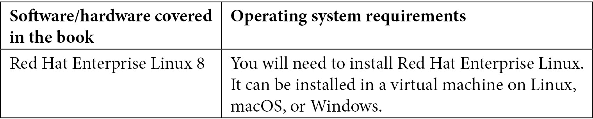

# 前言

Linux 无处不在，从个人设备到最大的超级计算机，从大学的计算机实验室到华尔街或国际空间站，甚至火星！**Red Hat Enterprise Linux**（简称**RHEL**）是企业环境中使用最广泛的 Linux 发行版，了解如何使用它是任何技术人员的关键技能。无论您是完全投身于管理基础设施，还是作为开发人员对您想要部署的平台更感兴趣，学习 Linux - 更准确地说是 RHEL - 将帮助您更加有效，甚至可能提升您的职业生涯。

在这本书中，我们从非常实用的角度涵盖了基本的 RHEL 管理技能，提供了我们从“战场”经验中学到的例子和技巧。您可以从头到尾地跟随，每一步都可以练习，同时了解事物是如何构建的以及它们为什么会表现出这样的行为。

希望您喜欢这本书，能充分利用它，并在阅读后拥有扎实的 RHEL 管理技能基础。这就是我们写这本书的目的。

享受阅读...和练习！

# 这本书适合谁

任何希望在 Linux 上构建和工作 IT 基础设施的人都将从这本书中受益，作为不同有用任务、技巧和最佳实践的参考。它将帮助任何寻求通过 Red Hat 认证系统管理员（RHCSA）考试的人，尽管它不能替代官方培训，在整个过程中将进行实验室和特别设计的测试。本书的范围调整到 RHCSA，通过来自实际经验的建议和许多实际示例进行扩展。

# 这本书涵盖了什么

*第一章*，*安装 RHEL8*，介绍了从获取软件和订阅到安装系统本身的 RHEL 安装过程。

*第二章*，*RHEL8 高级安装选项*，介绍了安装程序的高级用例，包括在云中部署实例和自动化安装。

*第三章*，*基本命令和简单的 Shell 脚本*，解释了在系统管理过程中将使用的日常命令，以及如何通过 shell 脚本自动化它们。

*第四章*，*常规操作工具*，展示了我们系统中可用的简单工具，可用于日常操作，例如启动或启用系统服务，或通过日志查看系统中正在进行的操作。

*第五章*，*使用用户、组和权限保护系统*，介绍了如何在任何 Linux 系统中管理用户、组和权限，其中包括一些关于 Red Hat Enterprise Linux 的具体内容。

*第六章*，*启用网络连接*，介绍了连接系统到网络的步骤以及可能的配置方式。

*第七章*，*添加、打补丁和管理软件*，回顾了在我们的系统中添加、删除和更新的步骤，包括升级和回滚的示例。

*第八章*，*远程管理系统*，介绍了如何远程连接到您的系统以提高效率。其中包括使用`ssh`连接创建密钥和使用终端复用器（`tmux`）。

*第九章*，*使用 firewalld 保护网络连接*，指导您了解 RHEL 中的网络防火墙配置以及如何正确管理它，包括管理区域、服务和端口。

*第十章*, *使用 SELinux 使系统更加安全*，介绍了 SELinux 的使用和基本故障排除。

*第十一章*, *使用 OpenSCAP 进行系统安全配置文件*，解释了如何使用 OpenSCAP 运行安全配置文件，并检查 RHEL 是否符合典型的规定。

*第十二章*, *管理本地存储和文件系统*，涵盖了文件系统的创建、挂载点和一般存储管理。

*第十三章*, *使用 LVM 进行灵活的存储管理*，解释了 LVM 如何通过添加磁盘和扩展逻辑卷来实现更灵活的存储管理。

*第十四章*, *使用 Stratis 和 VDO 进行高级存储管理*，介绍了 VDO 以及如何在我们的系统中使用它来去重存储，以及使用 Stratis 更轻松地管理存储。

*第十五章*, *理解引导过程*，解释了系统引导的过程以及使其重要的细节。

*第十六章*, *使用 tuned 进行内核调优和管理性能配置文件*，解释了内核调优的工作原理以及如何使用 tuned 进行预定义配置文件的使用。

*第十七章*, *使用 Podman、Buildah 和 Skopeo 管理容器*，介绍了容器和用于管理和构建容器的工具。

*第十八章*, *练习题–1*，让您测试您所学到的知识。

*第十九章*, *练习题–2*，提供更复杂的测试以检验您所学到的知识。

# 充分利用本书

所有软件要求将在各章中指出。请注意，本书假定您可以访问物理或虚拟机，或者可以访问互联网以创建云账户，以执行本书将引导您完成的操作。



**如果您使用本书的数字版本，我们建议您自己输入代码或从书的 GitHub 存储库中访问代码（链接在下一节中提供）。这样做将帮助您避免与复制和粘贴代码相关的任何潜在错误。**

# 下载示例代码文件

您可以从 GitHub 上 https://github.com/PacktPublishing/Red-Hat-Enterprise-Linux-8-Administration 下载本书的示例代码文件。如果代码有更新，将在 GitHub 存储库中进行更新。

我们还提供了来自我们丰富书籍和视频目录的其他代码包，可在 https://github.com/PacktPublishing/ 上找到。快去看看吧！

# 下载彩色图片

我们还提供了一个 PDF 文件，其中包含本书中使用的屏幕截图和图表的彩色图片。您可以在这里下载：[`static.packt-cdn.com/downloads/9781800569829_ColorImages.pdf`](https://static.packt-cdn.com/downloads/9781800569829_ColorImages.pdf)。

# 使用的约定

本书中使用了许多文本约定。

`文本中的代码`：表示文本中的代码词、数据库表名、文件夹名、文件名、文件扩展名、路径名、虚拟 URL、用户输入和 Twitter 用户名。例如："将下载的`RHEL8.iso`磁盘映像文件挂载为系统中的另一个磁盘。"

代码块设置如下：

```
#!/bin/bash
echo "Hello world"
```

当我们希望引起您对代码块的特定部分的注意时，相关行或项将以粗体显示：

```
[default]
branch = main
repo = myrepo
username = bender
protocol = https
```

任何命令行输入或输出都以以下形式书写：

```
$ mkdir scripts
$ cd scripts
```

**粗体**：表示新术语、重要词汇或屏幕上看到的词语。例如，菜单或对话框中的词语以**粗体**显示。例如："从**管理**面板中选择**系统信息**"。

提示或重要说明

看起来像这样。

# 联系我们

我们始终欢迎读者的反馈意见。

请发送电子邮件至`customercare@packtpub.com`，并在主题中提及书名。

**勘误**：尽管我们已经尽最大努力确保内容的准确性，但错误是难免的。如果您在本书中发现了错误，我们将不胜感激地接受您的报告。请访问[www.packtpub.com/support/errata](http://www.packtpub.com/support/errata)并填写表格。

**盗版**：如果您在互联网上发现我们作品的任何非法副本，请向我们提供位置地址或网站名称，我们将不胜感激。请通过 copyright@packt.com 与我们联系，并提供材料链接。

**如果您有兴趣成为作者**：如果您在某个专业领域有专长，并且有兴趣撰写或为书籍做出贡献，请访问[authors.packtpub.com](http://authors.packtpub.com)。

# 分享您的想法

阅读完《Red Hat Enterprise Linux 8 Administration》后，我们很想听听您的想法！请点击这里直接访问亚马逊的书评页面，分享您的反馈意见。

您的评论对我们和技术社区都很重要，将帮助我们确保提供卓越的内容质量。
