# 第一章：*第一章*：安装 RHEL8

开始使用**Red Hat Enterprise Linux**或**RHEL**的第一步是让它运行起来。无论是在您自己的笔记本电脑上作为主系统，还是在虚拟机或物理服务器上，都需要安装它以便熟悉您想要学习使用的系统。强烈建议您在阅读本书时获取一个物理或虚拟机来使用该系统。

在本章中，您将部署自己的 RHEL8 系统，以便能够跟随本书中提到的所有示例，并了解更多关于 Linux 的知识。

本章将涵盖的主题如下：

+   获取 RHEL 软件和订阅

+   安装 RHEL8

# 技术要求

开始的最佳方式是拥有一个**RHEL8**虚拟机来进行工作。您可以在主计算机上作为虚拟机进行操作，也可以使用物理计算机。在本章的后续部分，我们将审查这两种选择，您将能够运行自己的 RHEL8 系统。

提示

虚拟机是模拟完整计算机的一种方式。要能够在自己的笔记本电脑上创建这个模拟计算机，如果您使用的是 macOS 或 Windows，您需要安装虚拟化软件，例如 Virtual Box。如果您已经在运行 Linux，则已经准备好进行虚拟化，您只需要添加`virt-manager`软件包。

# 获取 RHEL 软件和订阅

要能够部署 RHEL，您需要一个**红帽订阅**来获取要使用的镜像，以及访问软件和更新的存储库。您可以免费从红帽的开发者门户网站获取**开发者订阅**，使用以下链接：[developers.redhat.com](http://developers.redhat.com)。然后需要按照以下步骤进行操作：

1.  在[developers.redhat.com](http://developers.redhat.com)上登录或创建帐户。

1.  转到[developers.redhat.com](http://developers.redhat.com)页面，然后点击**登录**按钮：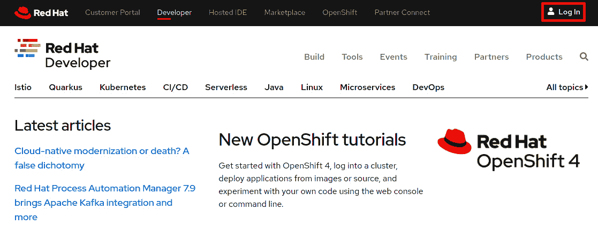

图 1.1 - developers.redhat.com 首页，指示点击登录的位置

1.  一旦进入登录页面，使用您的帐户，如果没有帐户，可以通过点击右上角的**注册**或直接在注册框中点击**立即创建**按钮来创建帐户，如下所示：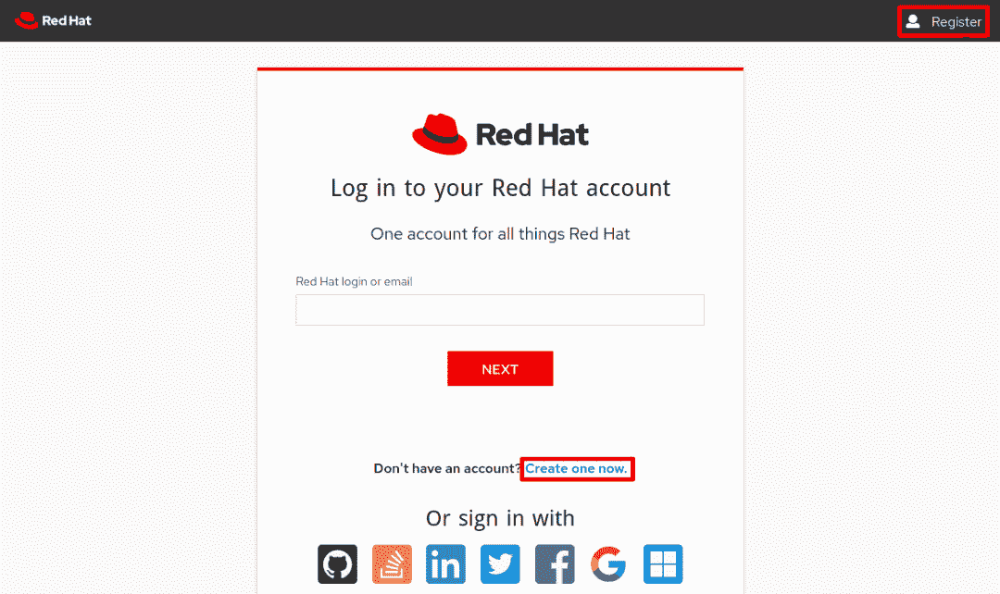

图 1.2 - 红帽登录页面（所有红帽资源通用）

您可以选择在几个服务中使用您的凭据（换句话说，*Google*，*GitHub*或*Twitter*）。

1.  登录后，转到**Linux**部分

您可以在内容之前的导航栏中找到**Linux**部分：

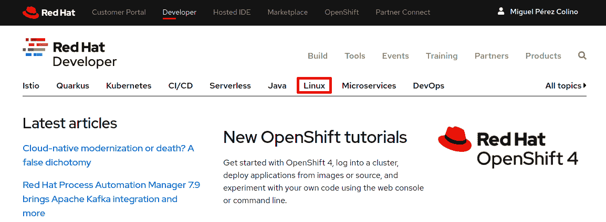

图 1.3 - 在 developers.redhat.com 访问 Linux 页面

点击**下载 RHEL**，它将显示为下一页上的一个漂亮的按钮：

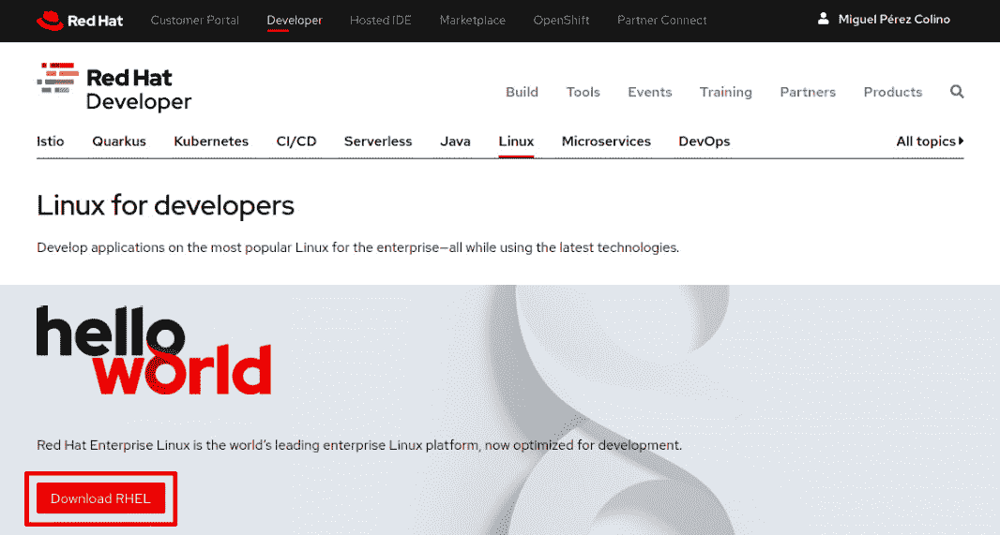

图 1.4 - 在 developers.redhat.com 访问 RHEL 下载页面

然后选择**x86_64（9 GB）**架构的 ISO 镜像（这是 Intel 和 AMD 计算机上使用的架构）：

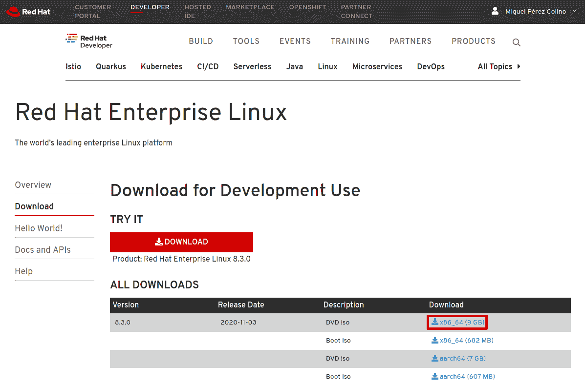

图 1.5 - 选择 x86_64 的 RHEL8 ISO 下载

1.  获取**RHEL8 ISO**镜像的方法如下：

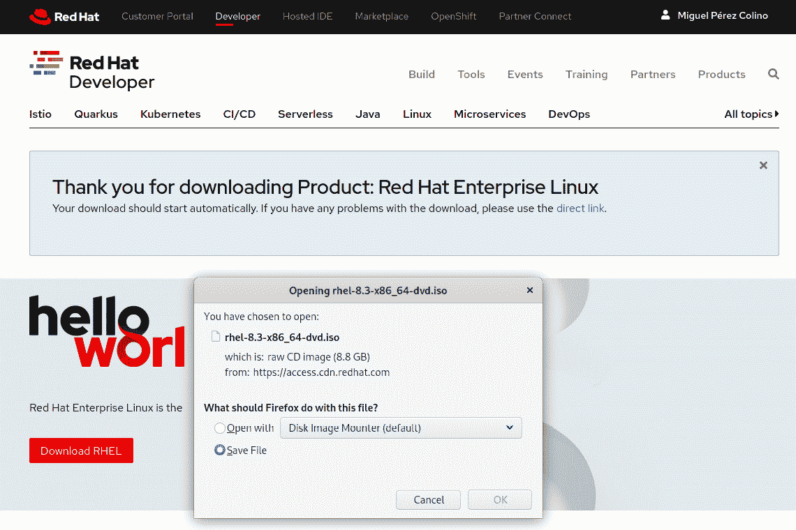

图 1.6 - 下载 x86_64 的 RHEL8 对话框

ISO 镜像是一个文件，其中包含完整 DVD 的内容的精确副本（即使我们没有使用 DVD）。稍后将使用此文件来安装我们的机器，无论是将其转储到 USB 驱动器进行*Bare Metal*安装，解压缩以进行网络安装，还是附加到虚拟机安装（或在服务器中使用带外功能，如 IPMI、iLO 或 iDRAC）。

提示

验证 ISO 镜像，并确保我们获取的镜像没有损坏或被篡改，可以使用一种称为“校验和”的机制。校验和是一种审查文件并提供一组字母和数字的方法，可用于验证文件是否与原始文件完全相同。Red Hat 在客户门户的下载部分提供了用于此目的的`sha256`校验和列表（[`access.redhat.com/`](https://access.redhat.com/)）。有关该过程的文章在这里：[`access.redhat.com/solutions/8367`](https://access.redhat.com/solutions/8367)。

我们有软件，即 ISO 镜像，可以在任何计算机上安装 RHEL8。这些是全球生产机器中使用的相同位，您可以使用您的开发者订阅进行学习。现在是时候在下一节中尝试它们了。

# 安装 RHEL8

在本章的这一部分，我们将按照典型的安装过程在一台机器上安装 RHEL。我们将遵循默认步骤，审查每个步骤的可用选项。

## 物理服务器安装准备

在开始安装之前，物理服务器需要进行一些初始设置。常见步骤包括配置*内部阵列*中的磁盘，将其连接到网络，为预期的*接口聚合*（组合，绑定）准备交换机，准备访问外部*磁盘阵列*（换句话说，*光纤通道阵列*），设置带外功能，并保护**BIOS**配置。

我们不会详细介绍这些准备工作，除了启动顺序。服务器将需要从外部设备（如*USB 闪存驱动器*或*光盘*）启动（开始加载系统）。

要从带有 Linux 或 macOS 的计算机创建可引导的 USB 闪存驱动器，只需使用`dd`应用程序进行“磁盘转储”即可。执行以下步骤：

1.  在系统中找到您的 USB 设备，通常在 Linux 中为`/dev/sdb`，在 macOS 中为`/dev/disk2`（在 macOS 中，此命令需要特殊权限，请以`sudo dmesg | grep removable`运行）：

```
sdb disk, referred to as sdb1, is mounted. We will need to *unmount* all the partitions mounted. In this example, this is straightforward as there is only one. To do so, we can run the following command:

```

$ sudo umount /dev/sdb1

```

 Dump the image! (Warning, this will erase the selected disk!):

```

$ sudo dd if=rhel-8.3-x86_64-dvd.iso of=/dev/sdb bs=512k

```

TipAlternative methods are available for creating a boot device. Alternative graphical tools are available for creating a boot device that can help select both the image and the target device. In Fedora Linux (the community distribution where RHEL was based on, and a workstation for many engineers and developers), the **Fedora Media Writer** tool can be used. For other environments, the **UNetbootin** tool could also serve to create your boot media.
```

现在，有了 USB 闪存驱动器，我们可以在任何物理机器上安装，从小型笔记本电脑到大型服务器。下一部分涉及使物理机器从**USB 闪存驱动器**启动。执行该操作的机制将取决于所使用的服务器。但是，在启动过程中提供选择启动设备的选项已经变得很常见。以下是如何在笔记本电脑上选择临时启动设备的示例：

1.  中断正常启动。在这种情况下，启动过程显示我可以通过按*Enter*来做到：

图 1.7 - 中断正常启动的 BIOS 消息示例

1.  选择临时启动设备，这种情况下通过按*F12*键：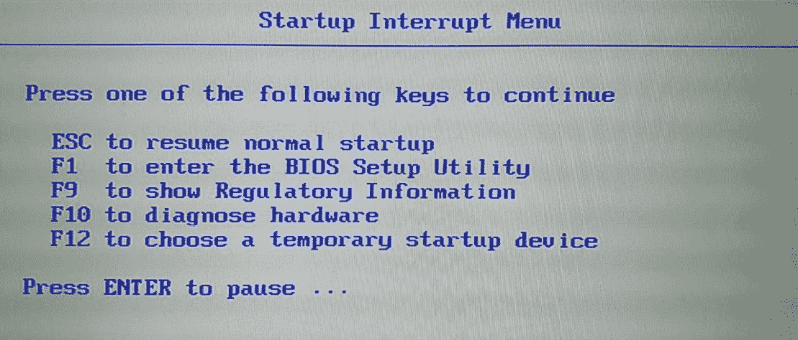

图 1.8 - 中断启动的 BIOS 菜单示例

1.  选择要从中启动的设备。我们希望从我们的 USB 闪存驱动器启动，在这种情况下是**USB HDD：ChipsBnk Flash Disk**：

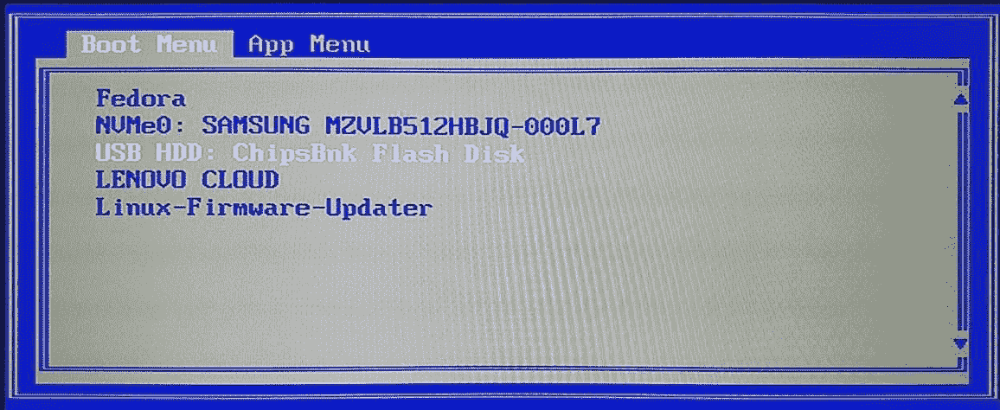

图 1.9 - 选择 USB HDD 启动设备的 BIOS 菜单示例

让系统从 USB 驱动器启动安装程序。

一旦我们知道如何准备带有 RHEL 安装程序的 USB 驱动器，以及如何使物理机从中引导，我们就可以跳到本章的*运行 RHEL 安装*部分并进行安装。如果我们有一个迷你服务器（换句话说，Intel NUC）、一台旧计算机或一台笔记本电脑，可以用作跟随本书的机器，这将非常有用。

接下来，我们将看看如何在您的安装中准备虚拟机，以防您考虑使用当前的主要笔记本电脑（或工作站）跟随本书，但仍希望保留一个单独的机器进行工作。

## 虚拟服务器安装准备

`virt-manager`将添加运行所需的所有底层组件（这些组件包括**KVM**、**Libvirt**、**Qemu**和**virsh**等）。其他推荐用于 Windows 或 macOS 系统的免费虚拟化软件包括**Oracle VirtualBox**和**VMware Workstation Player**。

本节中的示例将使用`virt-manager`执行，但可以轻松适用于任何其他虚拟化软件，无论是在笔记本电脑还是在最大的部署中。

上面已经描述了准备步骤，并需要获取`rhel-8.3-x86_64-dvd.iso`。一旦下载并且如果可能的话，检查其完整性（如在*获取 RHEL 软件和订阅*部分的最后提示中提到的），让我们准备部署一个虚拟机：

1.  启动您的虚拟化软件，这里是`virt-manager`：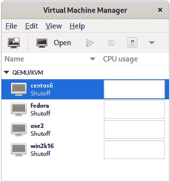

图 1.10 - 虚拟管理器主菜单

1.  通过转到**文件**，然后单击**新建虚拟机**来创建一个新的虚拟机。选择**本地安装媒体（ISO 镜像或 CDROM）**：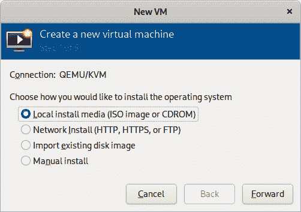

图 1.11 - 虚拟管理器 - 新 VM 菜单

1.  选择*ISO 镜像*。这样，虚拟机将配置为具有**虚拟 DVD/CDROM 驱动器**，并已准备好从中引导。这是惯例行为。但是，当使用不同的虚拟化软件时，您可能希望执行检查：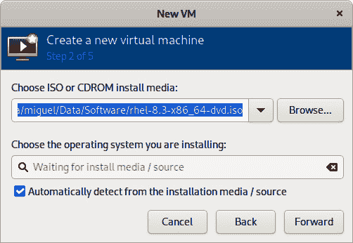

图 1.12 - 选择 ISO 镜像作为安装介质的虚拟管理器菜单

1.  为我们正在创建的虚拟机分配内存和 CPU（注意：虚拟机通常称为**VM**）。对于**Red Hat Enterprise Linux 8**（也称为**RHEL8**），最低内存为 1.5 GB，建议每个逻辑 CPU 为 1.5 GB。我们将使用最低设置（1.5 GB 内存，1 个 CPU 核心）：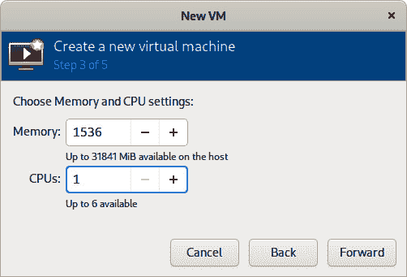

图 1.13 - 选择内存和 CPU 的虚拟管理器菜单

现在是为虚拟机分配至少一个磁盘的时候了。在这种情况下，我们将分配一个具有最小磁盘空间 10 GB 的单个磁盘，但在以后的章节中，我们将能够分配更多的磁盘来测试其他功能：

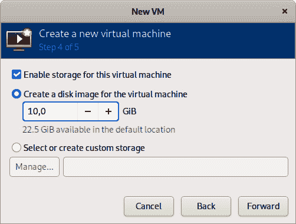

图 1.14 - 创建新磁盘并将其添加到虚拟机的虚拟管理器菜单

1.  我们的虚拟机已经具备了开始所需的一切：引导设备、内存、CPU 和磁盘空间。在最后一步中，添加了网络接口，所以现在我们甚至有了网络。让我们回顾一下数据并启动它：

图 1.15 - 选择虚拟机名称和网络的虚拟管理器菜单

](img/B16799_01_015.jpg)

图 1.15 - 选择虚拟机名称和网络的虚拟管理器菜单

经过这些步骤后，我们将拥有一个完全功能的虚拟机。现在是时候通过在其上安装 RHEL 操作系统来完成这个过程了。在下一节中查看如何执行此操作。

## 运行 RHEL 安装

一旦我们为安装准备好了虚拟或物理服务器，就该进行安装了。如果我们到达以下屏幕，就说明之前的所有步骤都已正确执行：

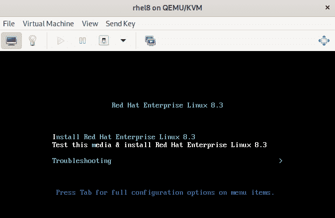

图 1.16 – RHEL8 安装的初始启动屏幕，选择安装

我们提供了三个选项（*以白色选择*）：

+   **安装 Red Hat Enterprise Linux 8.3**：此选项将启动并运行安装程序。

+   **测试此媒体并安装 Red Hat Enterprise Linux 8.3**：此选项将检查正在使用的镜像，以确保其没有损坏，并且安装可以确保进行。建议首次使用刚下载的 ISO 镜像或刚创建的媒体（例如 USB 闪存驱动器或 DVD）时使用此选项（在虚拟机中，运行检查大约需要 1 分钟）。

+   **故障排除**：此选项将帮助您在安装出现问题、运行系统出现问题或硬件出现问题时审查其他选项。让我们快速查看此菜单上可用的选项：

– **以基本图形模式安装 Red Hat Enterprise Linux 8.3**：此选项适用于具有旧图形卡和/或不受支持的图形卡的系统。如果识别出可视化问题，它可以帮助完成系统安装。

– **救援 Red Hat Enterprise Linux 系统**：当我们的系统存在启动问题或者我们想要访问它以审查它时（换句话说，审查可能受损的系统），可以使用此选项。它将启动一个基本的内存系统来执行这些任务。

– **运行内存测试**：可以检查系统内存以防止问题，例如全新服务器的情况，我们希望确保其内存正常运行，或者系统出现问题和紧急情况可能表明与内存有关的问题。

– **从本地驱动器引导**：如果您从安装媒体引导，但已经安装了系统。

– **返回主菜单**：返回上一个菜单。

重要提示

RHEL 引导菜单将显示几个选项。所选项将显示为白色，其中一个单独的字母以不同的颜色显示，例如“i”表示安装，“m”表示测试媒体。这些是快捷方式。按下带有该字母的键将直接带我们到此菜单项。

让我们继续进行**测试此媒体并安装 Red Hat Enterprise Linux 8.3**，以便安装程序审查我们正在使用的 ISO 镜像：

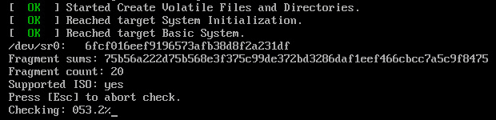

图 1.17 – RHEL8 ISO 镜像自检

完成后，将到达第一个安装屏幕。安装程序称为**Anaconda**（一个笑话，因为它是用一种叫做**Python**的语言编写的，并且遵循逐步方法）。在安装过程中，我们将选择的选项需要引起注意，因为我们将在本书的*使用 Anaconda 自动部署*部分中对它们进行审查。

### 本地化

安装的第一步是选择安装语言。对于此安装，我们将选择**英语**，然后选择**英语（美国）**：

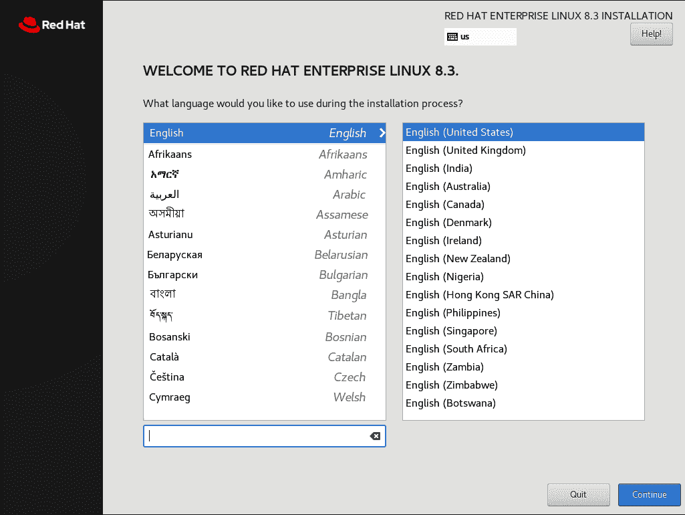

图 1.18 – RHEL8 安装菜单 – 语言

如果您无法轻松找到您的语言，您可以在列表下的框中输入它进行搜索。选择语言后，我们可以单击**继续**按钮继续。这将带我们到**安装摘要**屏幕：

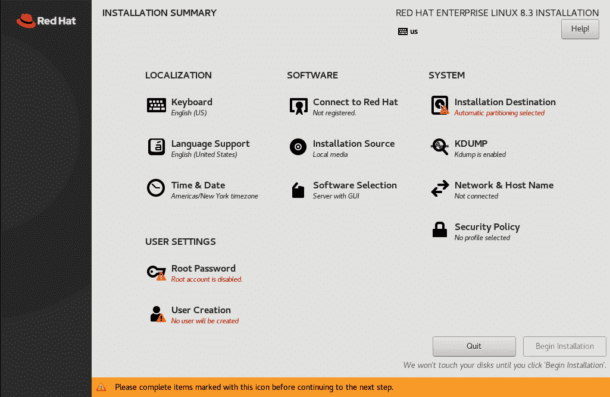

图 1.19 – RHEL8 安装菜单 – 主页

在**安装摘要**屏幕上，显示了所有必需的配置部分，其中许多部分（没有警告标志和红色文字）已经预先配置为默认值。

让我们回顾一下**本地化**设置。首先是**键盘**：


图 1.20 – RHEL8 安装 – 键盘选择图标

我们可以查看键盘设置，这不仅有助于更改键盘，还可以在需要时添加额外的布局以在它们之间切换：

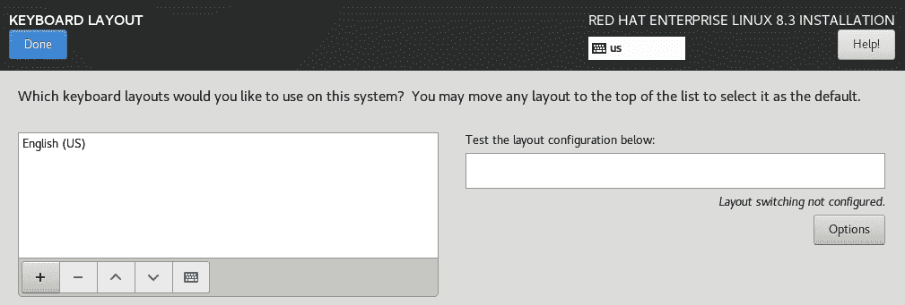

图 1.21 – RHEL8 安装 – 键盘选择对话框

这可以通过点击`spa`直到出现，然后选择它，然后点击**添加**来完成：

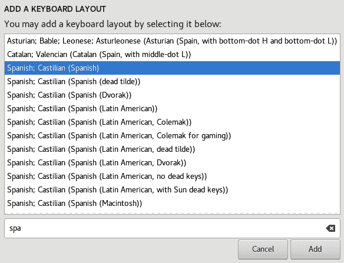

图 1.22 – RHEL8 安装 – 键盘选择列表

要将其设置为默认选项，需要点击下方的**^**按钮。在本例中，我们将保留它作为次要选项，以便安装支持软件。完成后，点击**完成**：

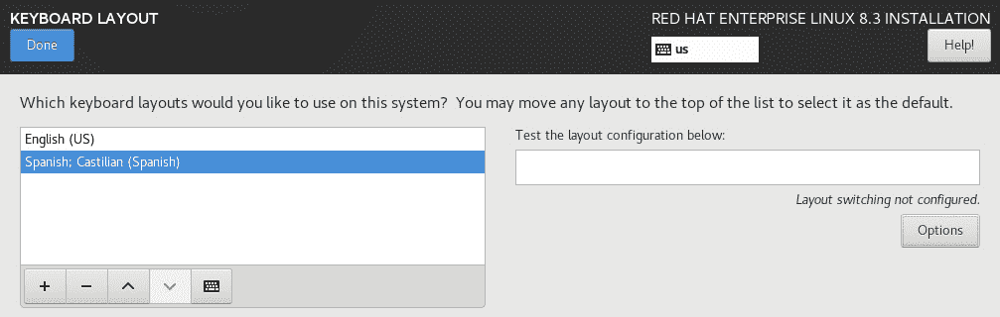

图 1.23 – RHEL8 安装 – 带有不同键盘的键盘选择对话框

现在，我们将继续进行**语言支持**：

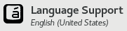

图 1.24 – RHEL8 安装 – 语言选择图标

在这里，我们还可以添加我们的本地语言。在本例中，我将使用**Español**，然后**Español (España)**。这将再次包括安装支持所添加语言所需的软件：

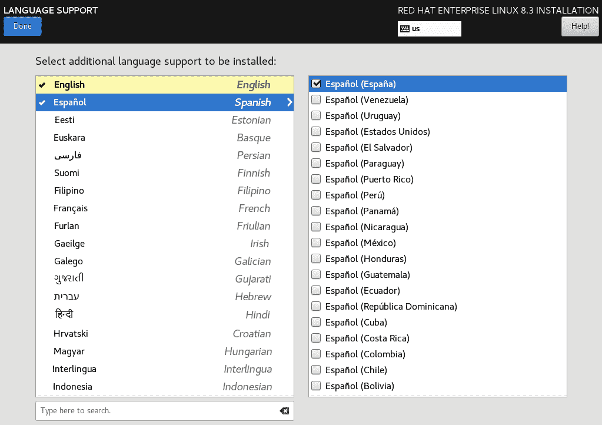

图 1.25 – RHEL8 安装 – 带有不同语言的语言选择对话框

我们将继续配置两种语言，尽管您可能希望选择您自己的本地化语言。

现在，我们将继续进行**时间和日期**的设置，如下所示：


图 1.26 – RHEL8 安装 – 时间和日期选择图标

默认配置设置为美国纽约市。您在这里有两种可能性：

+   使用您的本地时区。当您希望所有日志都在该时区注册时，建议使用此选项（换句话说，因为您只在一个时区工作，或者因为每个时区都有本地团队）。在本例中，我们选择了**西班牙，马德里，欧洲**时区：

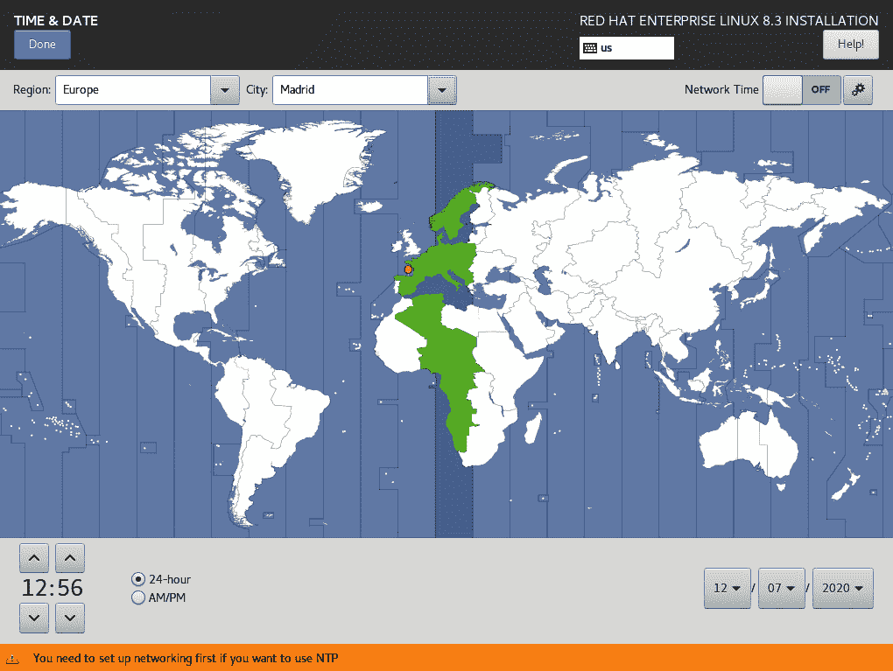

图 1.27 – RHEL8 安装 – 时间和日期选择对话框 – 选择马德里

+   使用**协调世界时**（也称为**UTC**）以使全球各地的服务器具有相同的时区。可以在**区域：** | **Etc**下选择，然后选择**城市：** | **协调世界时**：

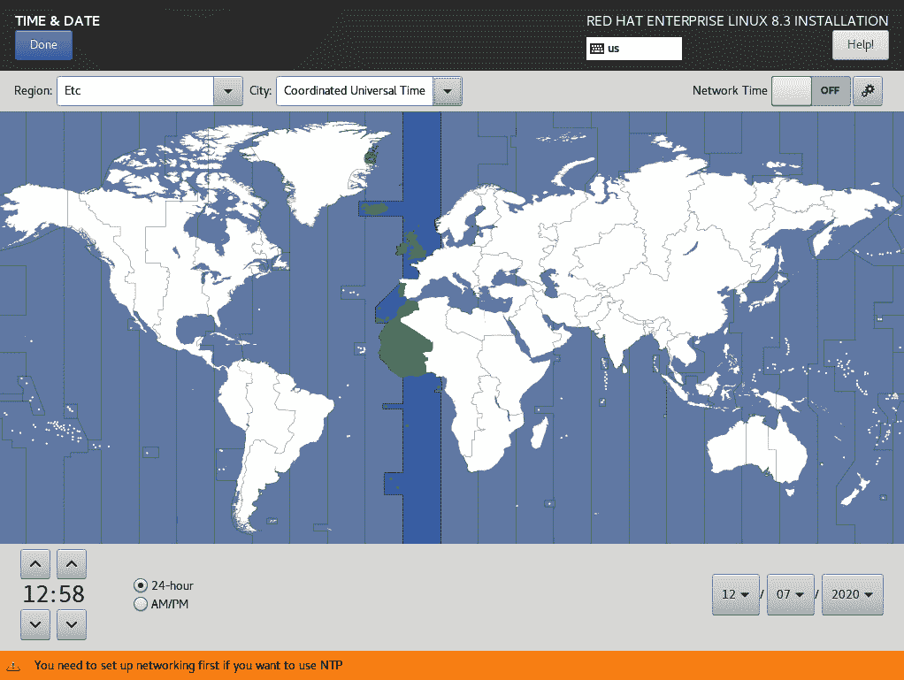

图 1.28 – RHEL8 安装 – 时间和日期选择对话框 – 选择 UTC

我们将继续使用西班牙，马德里，欧洲的本地化时间，尽管您可能希望选择您的本地化时区。

提示

如屏幕所示，有一个选项可以选择**网络时间**，以使机器的时钟与其他机器同步。只有在配置网络后才能选择此选项。

### 软件

完成**本地化**配置（或几乎完成；我们可能稍后再回来配置网络时间）后，我们将继续进行**软件**部分，或者更确切地说，是其中的**连接到红帽**：

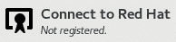

图 1.29 – RHEL8 安装 – 连接到红帽选择图标

在这一部分，我们可以使用我们自己的 Red Hat 帐户，就像我们之前在[developers.redhat.com](http://developers.redhat.com)下创建的那样，以访问系统的最新更新。要配置它，我们需要先配置网络。

出于本部署的目的，我们现在不会配置这一部分。我们将在本书的*第七章*中，*添加、打补丁和管理软件*，中了解如何管理订阅和获取更新。

重要提示

使用 Red Hat Satellite 进行系统管理：对于拥有超过 100 台服务器的大型部署，Red Hat 提供了“Red Hat Satellite”，具有高级软件管理功能（例如版本化内容视图、使用 OpenSCAP 进行集中安全扫描以及简化的 RHEL 补丁和更新）。可以使用激活密钥连接到 Red Hat Satellite，从而简化系统管理。

现在让我们转到**安装源**，如下所示：

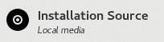

图 1.30 – RHEL8 安装 – 安装源图标

这可以用于使用远程源进行安装。当使用仅包含安装程序的引导 ISO 映像时，这非常有用。在这种情况下，由于我们使用的是完整的 ISO 映像，它已经包含了完成安装所需的所有软件（也称为*软件包*）。

下一步是**软件选择**，如下截图所示：

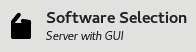

图 1.31 – RHEL8 安装 – 软件选择图标

在这一步中，我们可以选择要在系统上安装的预定义软件包集，以便系统可以执行不同的任务。虽然在这个阶段这样做可能非常方便，但我们将采用更加手动的方法，并选择**最小安装**配置文件，以便稍后向系统添加软件。

这种方法还有一个优点，即通过仅安装系统中所需的最小软件包来减少**攻击面**：

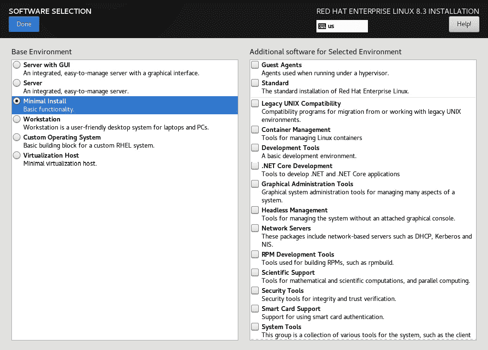

图 1.32 – RHEL8 安装 – 软件选择菜单；选择最小安装

### 系统

一旦选择了软件包集，让我们继续进行**系统**配置部分。我们将从安装目标开始，选择要用于安装和配置的磁盘：

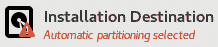

图 1.33 – RHEL8 安装 – 安装目标图标，带有警告标志，因为此步骤尚未完成

这个任务非常重要，因为它不仅会定义系统在磁盘上的部署方式，还会定义磁盘的分布方式和使用的工具。即使在这个部分，我们不会使用高级选项。我们将花一些时间来审查主要选项。

这是默认的**设备选择**屏幕，只发现了一个本地标准磁盘，没有**专用和网络磁盘**选项，并准备运行**自动**分区。可以在以下截图中看到：

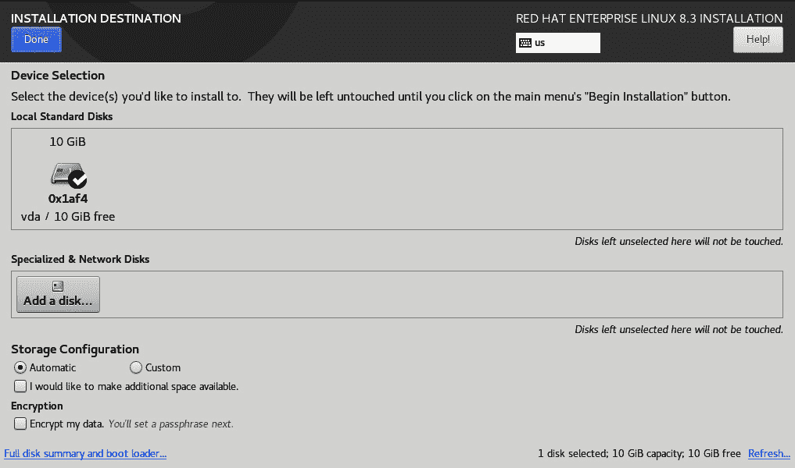

图 1.34 – RHEL8 安装 – 安装目标菜单，选择自动分区

在这一部分点击**完成**将完成继续安装所需的最小数据集。

让我们来回顾一下各个部分。

**本地标准磁盘**是安装程序要使用的一组磁盘。可能情况是我们有几个磁盘，而我们只想使用特定的磁盘：

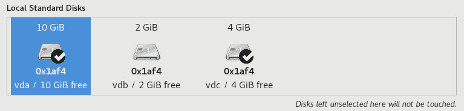

图 1.35 – RHEL8 安装 – 安装目标菜单，选择了几个本地磁盘

这是一个有三个可用磁盘并且只使用第一个和第三个的例子。

在我们的情况下，我们只有一个磁盘，它已经被选择了：

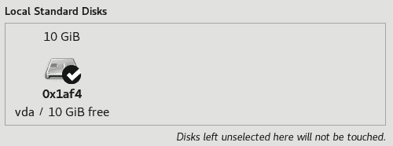

图 1.36 – RHEL8 安装 – 安装目标菜单，选择了一个本地磁盘

通过选择**加密我的数据**，可以轻松使用全盘加密，这在笔记本安装或在低信任环境中安装时是非常推荐的：

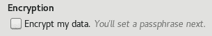

图 1.37 – RHEL8 安装 – 安装目标菜单，未选择数据加密选项

在这个例子中，我们将不加密我们的驱动器。

**自动**安装选项将自动分配磁盘空间：

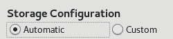

图 1.38 – RHEL8 安装 – 安装目标菜单；存储配置（自动）

它将通过创建以下资源来实现：

+   `/boot`: 用于分配系统核心（`kernel`）和在引导过程中帮助的文件的空间（例如初始引导镜像`initrd`）。

+   `/boot/efi`: 用于支持 EFI 启动过程的空间。

+   `/"`: 根文件系统。这是系统所在的主要存储空间。其他磁盘/分区将被分配到文件夹中（这样做时，它们将被称为`挂载点`）。

+   `/home`: 用户存储个人文件的空间。

让我们选择这个选项，然后点击**完成**。

提示

系统分区和引导过程：如果您仍然不完全理解有关系统分区和引导过程的一些扩展概念，不要担心。有一章节专门介绍了文件系统、分区以及如何管理磁盘空间，名为*管理本地存储和文件系统*。要了解引导过程，有一章节名为*理解引导过程*，它逐步审查了完整的系统启动顺序。

下一步涉及审查**Kdump**或**内核转储**。这是一种允许系统在发生关键事件并崩溃时保存状态的机制（它会转储内存，因此得名）：

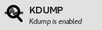

图 1.39 – RHEL8 安装 – Kdump 配置图标

为了工作，它将为自己保留一些内存，等待在系统崩溃时进行操作。默认配置对需求进行了良好的计算：

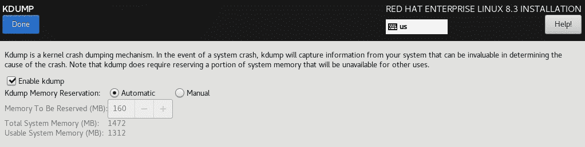

图 1.40 – RHEL8 安装 – Kdump 配置菜单

点击**完成**将带我们进入下一步**网络和主机名**，如下所示：

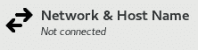

图 1.41 – RHEL8 安装 – 网络和主机名配置图标

本节将帮助系统连接到网络。在虚拟机的情况下，对外部网络的访问将由**虚拟化软件**处理。默认配置通常使用**网络地址转换**（**NAT**）和**动态主机配置协议**（**DHCP**），这将为虚拟机提供网络配置和对外部网络的访问。

一旦进入配置页面，我们可以看到有多少网络接口分配给我们的机器。在这种情况下，只有一个，如下所示：

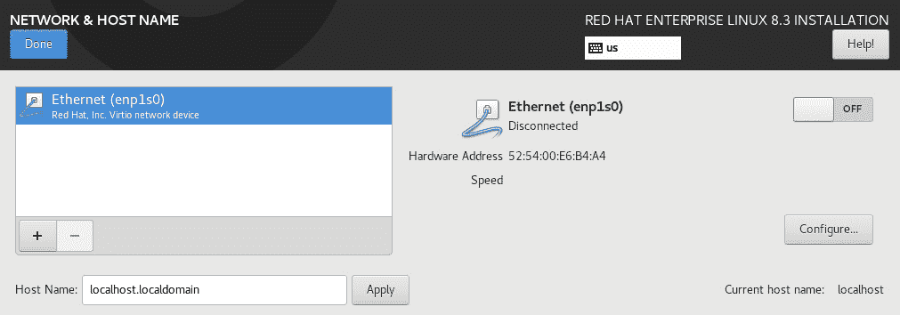

图 1.42 – RHEL8 安装 – 网络和主机名配置菜单

首先，我们可以通过点击右侧的**开/关**切换来启用接口。关闭它的话，看起来是这样的：


图 1.43 - RHEL8 安装 - 网络和主机名配置切换（关）

并且要打开它的话，应该是这样的：


图 1.44 - RHEL8 安装 - 网络和主机名配置切换（开）

我们将看到接口现在有配置（**IP 地址**，**默认路由**和**DNS**）：

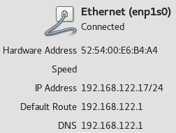

图 1.45 - RHEL8 安装 - 网络和主机名配置信息详情

为了使这个改变永久化，我们将点击屏幕右下角的**配置**按钮来编辑接口配置：

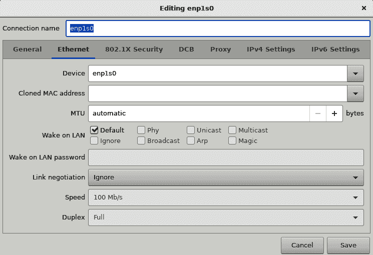

图 1.46 - RHEL8 安装 - 网络和主机名配置；接口配置；以太网选项卡

单击**常规**选项卡将呈现主要选项。我们将选择**优先自动连接**，并将值保留为**0**，就像这样：

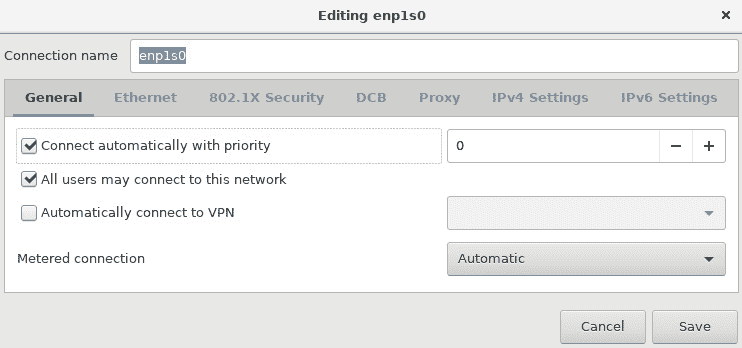

图 1.47 - RHEL8 安装 - 网络和主机名配置；接口配置；常规选项卡

点击**保存**将使更改永久化，并且默认启用这个网络接口。

现在是给我们的虚拟服务器取一个名字的时候了。我们将去到`rhel8.example.com`，然后点击**应用**：

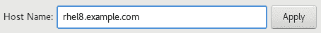

图 1.48 - RHEL8 安装 - 网络和主机名配置；主机名详情

提示

域名`example.com`是用于演示目的，并且可以放心在任何场合使用，知道它不会与其他系统或域名发生冲突或引起任何麻烦。

网络页面将会是这样的：

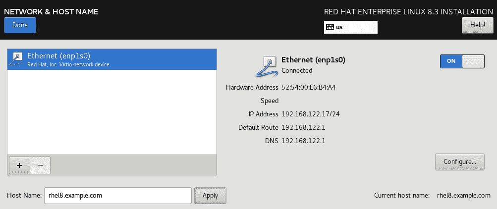

图 1.49 - RHEL8 安装 - 网络和主机名配置菜单；配置完成

单击**完成**将带我们返回到主安装程序页面，系统连接到网络并准备好一旦安装完成就连接。

名为*启用网络连接*的章节将更详细地描述在 RHEL 系统中配置网络的可用选项。

重要提示

现在系统已连接到网络，我们可以回到**时间和日期**并启用网络时间（这是安装程序自动完成的），以及转到**连接到 Red Hat**来订阅系统到 Red Hat 的**内容分发网络**（或**CDN**）。系统订阅到 CDN 的详细说明将在*第七章*中详细解释，*添加、打补丁和管理软件*。

现在是时候通过转到**安全策略**来审查最终系统选项，安全配置文件了：

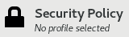

图 1.50 - RHEL8 安装 - 安全策略配置图标

在其中，我们将看到一个可以在我们系统中默认启用的安全配置文件列表：

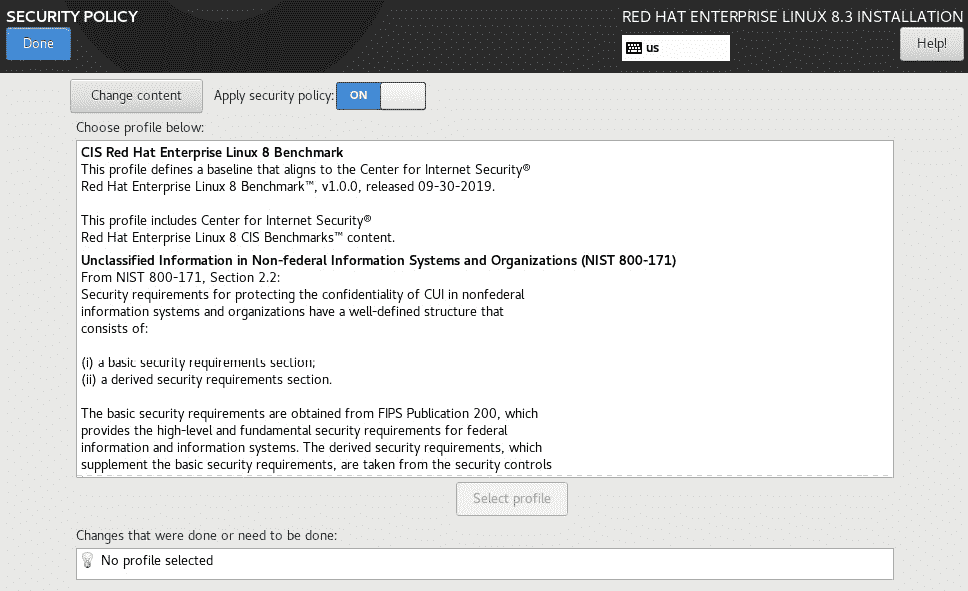

图 1.51 - RHEL8 安装 - 安全策略配置菜单

安全配置有一些要求在这个安装中我们没有涵盖（比如有单独的`/var`或`/tmp`分区）。我们可以点击**应用安全策略**来关闭它，然后点击**完成**：


图 1.52 – RHEL8 安装 – 安全策略配置切换（关闭）

有关此主题的更多信息将在*第十一章**，使用 OpenSCAP 进行系统安全配置*中进行讨论。

### 用户设置

Unix 或 Linux 系统中的主管理员用户称为`root`。

我们可以通过点击**根密码**部分来启用根用户，尽管这并非必需，在安全受限的环境中，建议您不要这样做。我们将在本章中这样做，以便学习如何做以及解释所涵盖的情况：

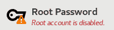

图 1.53 – RHEL8 安装 – 根密码配置图标（因为尚未设置而显示警告）

点击**根密码**后，我们将看到一个对话框来输入密码：

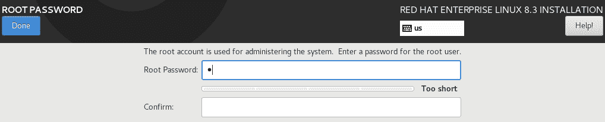

图 1.54 – RHEL8 安装 – 根密码配置菜单

建议密码具有以下内容：

+   超过 10 个字符（最少 6 个）

+   小写和大写

+   数字

+   特殊字符（如$、@、%和&）

如果密码不符合要求，它会警告我们，并强制我们点击**完成**两次以使用弱密码。

现在是时候通过点击**用户创建**来为系统创建用户了：

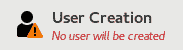

图 1.55 – RHEL8 安装 – 用户创建配置图标（因为尚未完成而显示警告）

这将带我们进入一个输入用户数据的部分：

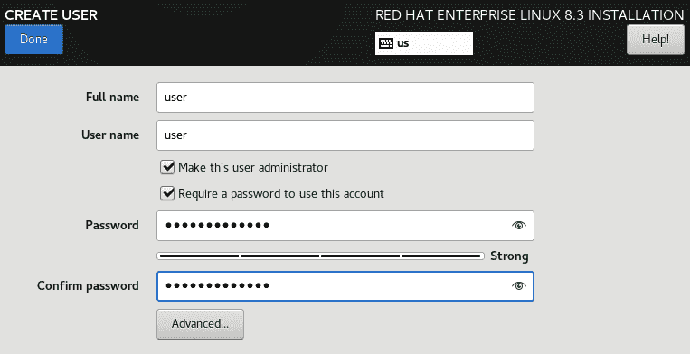

图 1.56 – RHEL8 安装 – 用户创建配置菜单

在此处将适用与前一部分相同的密码规则。

点击`root`密码）。

提示

作为良好的实践，不要为根帐户和用户帐户使用相同的密码。

*第五章**，使用用户、组和权限保护系统*包括如何使用和管理`sudo`工具为用户分配管理权限的部分。

点击**完成**返回到主安装程序屏幕。安装程序已准备好继续安装。主页面将如下所示：

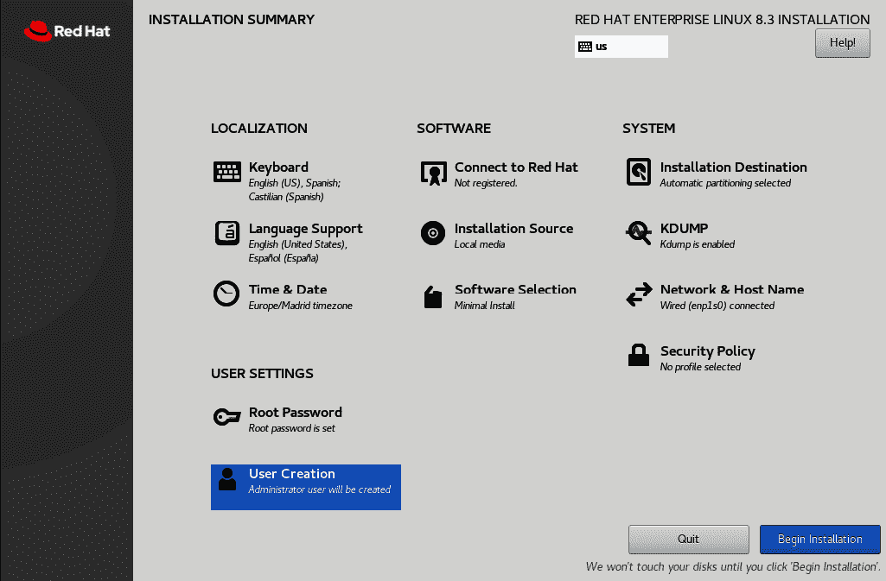

图 1.57 – RHEL8 安装 – 完成后的主菜单

点击**开始安装**将启动安装过程：

重要提示

如果省略了开始安装所需的任何步骤，**开始安装**按钮将变灰，因此无法点击。

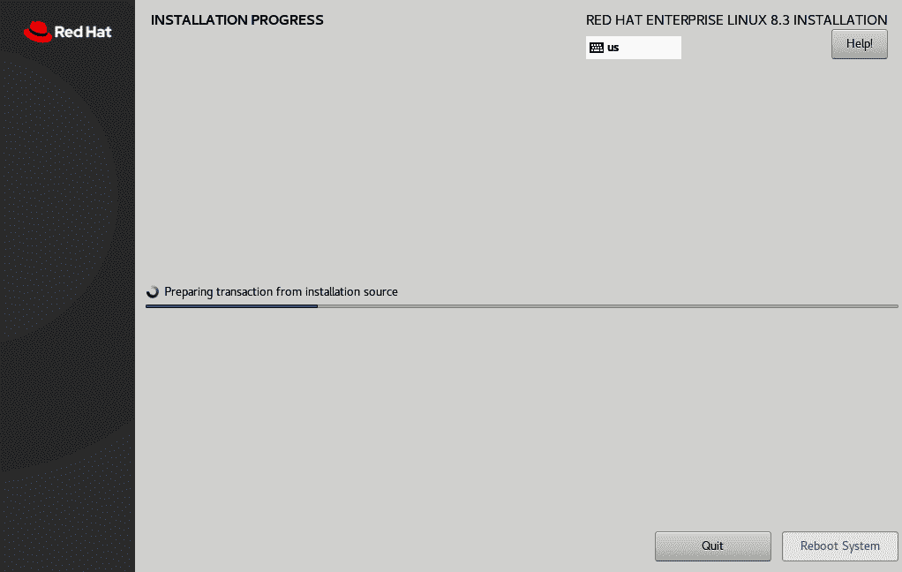

图 1.58 – RHEL8 安装 – 安装进行中

安装完成后，我们可以点击**重新启动系统**，它将准备好使用：

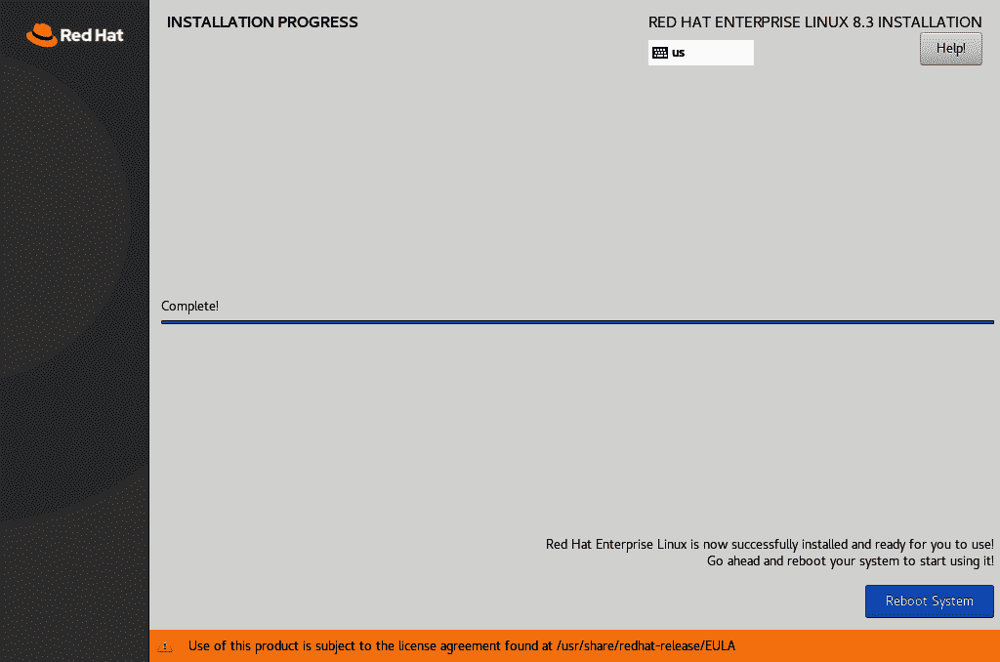

图 1.59 – RHEL8 安装 – 安装完成

重要的是要记住从虚拟机中卸载 ISO 镜像（或从服务器中移除 USB 存储设备），并检查系统中的引导顺序是否正确配置。

您的第一个 Red Hat Enterprise Linux 8 系统现在已准备就绪！恭喜。

正如您所看到的，很容易在虚拟机或物理机中安装 RHEL，并准备好用于运行任何我们想要运行的服务。在云中，该过程非常不同，因为机器是从镜像实例化来运行的。在下一章中，我们将回顾如何在云中的虚拟机实例中运行 RHEL。

# 总结

*Red Hat 认证系统管理员*考试完全是基于实际经验的实践。为了做好准备，最好的方法就是尽可能多地练习，这也是本书开始提供*Red Hat Enterprise Linux 8*（RHEL8）访问权限并提供如何部署自己的虚拟机的替代方案的原因。

安装涵盖了不同的场景。这些是最常见的情况，包括使用物理机器、虚拟机或云实例。在本章中，我们专注于使用虚拟机或物理机。

在使用物理硬件时，我们将专注于许多人喜欢重复使用旧硬件，购买二手或廉价的迷你服务器，甚至将自己的笔记本电脑用作 Linux 体验的主要安装设备这一事实。

在虚拟机的情况下，我们考虑的是那些希望将所有工作都保留在同一台笔记本电脑上，但又不想干扰他们当前的操作系统（甚至可能不是 Linux）的人。这也可以与前一个选项很好地配合，即在自己的迷你服务器上使用虚拟机。

在本章之后，您将准备好继续阅读本书的其余部分，至少有一个 Red Hat Enterprise Linux 8 实例可供使用和练习。

在下一章中，我们将回顾一些高级选项，例如使用云来部署 RHEL 实例，自动化安装和最佳实践。

让我们开始吧！
