# 第二章：*第二章*：RHEL8 高级安装选项

在上一章中，我们学习了如何在物理或虚拟机上安装**Red Hat Enterprise Linux**，或**RHEL**，以便在阅读本书时使用。在本章中，我们将回顾如何在云中使用 RHEL *实例*以及在这样做时出现的主要差异。

您还将学习不仅如何部署系统，而且如何做出最佳选择，并能够以*自动化方式*执行部署。

为了完成安装，已包括了一个关于*最佳实践*的部分，以便您可以从第一天开始避免长期问题。

这些是本章将涵盖的主题：

+   使用 Anaconda 自动化 RHEL 部署

+   在云上部署 RHEL

+   安装最佳实践

# 技术要求

在本章中，我们将回顾使用**Anaconda**进行自动化安装过程。为此，您需要使用我们在上一章中创建的*RHEL8 部署*。

我们还将创建云实例，为此您需要在所选云环境中创建一个帐户。我们将使用**Google Cloud Platform**。

# 使用 Anaconda 自动化 RHEL 部署

完成了在本地部署 RHEL 的第一步后，您可以以 root 用户登录到机器上，并列出`root`用户在其文件夹中拥有的文件：

```
[root@rhel8 ~]# ls /root/
anaconda-ks.cfg
```

您会找到`anaconda-ks.cfg`文件。这是一个重要的文件，称为`kickstart`，它包含了在安装过程中安装程序**Anaconda**的响应。让我们来看看这个文件的内容。

重要提示

在云映像中，没有`anaconda-ks.cfg`文件。

此文件可以被重用以安装其他系统，使用与我们用于此安装的相同选项。让我们回顾一下我们在上一次安装中添加的选项。

以`#`开头的行是注释，对安装过程没有影响。

指定正在使用的版本的注释如下：

```
#version=RHEL8
```

然后进行了一种类型的安装。它可以是`图形`或`文本`（对于无头系统，通常使用第二种）：

```
# Use graphical install
graphical
```

安装应用程序包或任何其他软件包的软件源由`repo`条目指定。由于我们使用的是 ISO 镜像，它被访问（在 Linux 术语中被挂载）就像是一个*CDROM*：

```
repo --name="AppStream" --baseurl=file:///run/install/sources/mount-0000-cdrom/AppStream
```

部分由`％`符号指定。在这种情况下，我们将输入`packages`部分，其中包含要安装的软件包列表，并使用`％end`特殊标记来关闭它们。有两个选择：由以`@^`符号开头的定义的软件包组（在这种情况下是`minimal-environment`）和不需要任何前缀的软件包的名称（在这种情况下是`kexec-tools`软件包，负责安装我们之前解释的`kdump`功能）：

```
%packages
@^minimal-environment
kexec-tools
%end
```

我们继续点击没有部分的选项。在这种情况下，我们有键盘布局和系统语言支持。正如你所看到的，我们添加了*英语美国键盘*（标记为`us`）和*西班牙*，*西班牙*（标记为`es`）：

```
# Keyboard layouts
keyboard --xlayouts='us','es'
```

对于系统语言，我们还添加了英语美国（`en_US`）和西班牙，西班牙（`es_ES`）。操作系统中有几种管理、存储和表示文本的方式。如今最常见的是`UTF-8`，它使我们能够在一个单一标准下拥有许多字符集。这就是为什么系统语言后面有`.UTF-8`：

```
# System language
lang en_US.UTF-8 --addsupport=es_ES.UTF-8
```

提示

**Unicode（或通用编码字符集）转换格式 - 8 位**，简称 UTF-8，是一种字符编码，它扩展了以前的能力，以支持中文、西里尔文或阿拉伯文（以及许多其他语言）在同一文本中（比如代表网页或控制台的文本）。UTF-8 于 1993 年推出，被全球网页的 95.9%使用。以前的字符集只支持美国英语或拉丁字符，比如 1963 年发布的**美国信息交换标准代码**，或**ASCII**。要了解更多有关字符编码及其演变的信息，请查看 UTF-8 和 ASCII 的维基百科页面。

现在，是时候配置网络接口了。在这种情况下，我们只有一个名为`enp1s0`的网络接口。配置使用 IPv4 和`rhel8.example.com`：

```
# Network information
network  --bootproto=dhcp --device=enp1s0 --ipv6=auto --activate
network  --hostname=rhel8.example.com
```

现在，我们需要定义安装介质。在这种情况下，我们使用了一个模拟的 CDROM/DVD，使用我们下载的 ISO 镜像文件：

```
# Use CDROM installation media
cdrom
```

`firstboot`选项默认启用。在本例中，由于安装不包括*图形界面*，它不会运行，但将被添加到`kickstart`文件中。我们可以安全地删除它，如下所示：

```
# Run the Setup Agent on first boot
firstboot --enable
```

现在，让我们配置磁盘。首先，为了安全起见，我们将指示安装程序忽略除目标磁盘（在本例中为`vda`）之外的所有磁盘：

```
ignoredisk --only-use=vda
```

重要提示

磁盘的名称将根据您运行的平台而变化。通常，它将是`vda`、`xda`或`sda`。在本例中，我们展示了由安装程序 Anaconda 定义的`vda`磁盘，就像我们在上一章中使用的那样。

现在，我们必须安装引导加载程序以启用系统引导。我们将在`vda`上这样做，并指示它使用`crashkernel`选项，该选项启用`kdump`机制（在系统崩溃时转储内存）：

```
# System bootloader configuration
bootloader --append="crashkernel=auto" --location=mbr --boot-drive=vda
```

现在，我们必须对磁盘进行分区。在这种情况下，这将是完全自动化的：

```
autopart
```

系统要使用的空间必须声明。我们将在此示例中清除整个磁盘：

```
# Partition clearing information
clearpart --none --initlabel
```

让我们将时区设置为欧洲马德里：

```
# System timezone
timezone Europe/Madrid --isUtc
```

现在，我们将设置 root 密码并创建一个用户（请注意，加密密码已经被删除以确保安全）：

```
# Root password
rootpw --iscrypted $xxxxxxxxxxxxxxxxxxxxxxxxxxxxxxxxxxxxxxxxxxxxxxxxxxxxxxxxxxxxxxxxxxxxxxxxxxxxxxxxxxxxxxxxxxxxxxxxxxxxxxxxx
user --groups=wheel --name=user --password=$xxxxxxxxxxxxxxxxxxxxxxxxxxxxxx xxxxxxxxxxxxxxxxxxxxxxxxxxxxxxxxxxxxxxxxxxxxxxxxxxxxxxxxxxxxxxxxxxxxxxxxxxx --iscrypted --gecos="user"
```

提示

上一章生成的 Anaconda 文件包含加密密码哈希的示例。如果我们想要更改它，可以通过运行`python -c 'import crypt,getpass;pw=getpass.getpass();print(crypt.crypt(pw) if (pw==getpass.getpass("Confirm: ")) else exit())'`命令生成新的加密密码哈希，并将其包含在此处。

现在，我们需要一个特殊的部分，可以在其中配置`kdump`，以便我们可以自动保留内存：

```
%addon com_redhat_kdump --enable --reserve-mb='auto' 
%end
```

我们还需要一个特殊的部分，指定将用于安装的密码策略：

```
%anaconda
pwpolicy root --minlen=6 --minquality=1 --notstrict --nochanges --notempty
pwpolicy user --minlen=6 --minquality=1 --notstrict --nochanges --emptyok
pwpolicy luks --minlen=6 --minquality=1 --notstrict --nochanges --notempty
%end
```

有了这个，我们的`kickstart`文件以重新安装系统就完成了。

要使用它，我们需要将 kickstart 选项传递给安装程序。为此，我们编辑内核参数。让我们看看如何做到这一点。

我们首先按*Tab*，在启动时，选择**安装 Red Hat Enterprise Linux 8.3**。以**vmlinuz**开头的引导行将出现在屏幕底部：

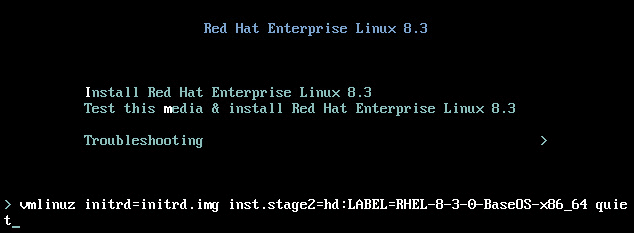

图 2.1 - RHEL8 安装程序 - 编辑引导行

让我们删除`quiet`选项，并添加一个让安装程序知道 kickstart 位置的选项：

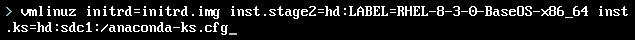

图 2.2 - RHEL8 安装程序 - 将 kickstart 选项添加到引导行

我们添加的选项如下：

```
inst.ks=hd:sdc1:/anaconda-ks.cfg
```

我们可以看看它的三个部分：

+   `hd`：kickstart 将在磁盘上，比如第二个 USB 驱动器上。

+   `sdc1`：托管文件的设备。

+   `/anaconda-ks.cfg`：设备中 kickstart 文件的路径。

有了这个，我们可以重现我们所做的完整安装。

提示

*Red Hat Enterprise Linux 8 自定义 Anaconda*指南提供了详细的选项，如果您希望创建自己的*Anaconda Kickstart*文件或进一步自定义此文件，可以在此处访问：[`access.redhat.com/documentation/en-us/red_hat_enterprise_linux/8/html-single/customizing_anaconda/index`](https://access.redhat.com/documentation/en-us/red_hat_enterprise_linux/8/html-single/customizing_anaconda/index)。

正如您所见，创建 kickstart 文件并自动部署 Red Hat Enterprise Linux 非常容易。

现在，让我们来看看另一种使 RHEL 8 实例可用的方法：在云中。

# 在云上部署 RHEL

**在云上部署 Red Hat Enterprise Linux**与我们之前进行的部署有一些不同。让我们看看这些区别是什么：

+   我们不会使用 ISO 镜像或 Anaconda 来执行部署，而是使用预先配置的镜像，通常由云提供商准备和提供：

- 该镜像可以稍后进行自定义和调整以满足我们的需求。

+   我们将无法在安装时选择系统的配置细节（例如选择时区），但之后可以选择。

+   将会有一个自动化机制来更改设置，例如添加用户及其凭据以访问系统或配置网络：

- 云提供商通常使用`cloud-init`来实现此目的的最常见和最知名的机制。

- 一些由云提供商提供的镜像包括`cloud-init`软件。

- 通常使用由用户在云提供商生成的 SSH 密钥通过`ssh`协议远程访问系统（请查看*第八章*，*远程管理系统*，以获取有关如何访问系统的更多详细信息）。

重要提示

在创建 RHEL 镜像方面，可以为云或虚拟化创建我们自己的镜像。为此，我们可以使用 Red Hat Enterprise Linux 镜像构建器（[`developers.redhat.com/blog/2019/05/08/red-hat-enterprise-linux-8-image-builder-building-custom-system-images/`](https://developers.redhat.com/blog/2019/05/08/red-hat-enterprise-linux-8-image-builder-building-custom-system-images/)）。但是，它不是 RHCSA 的一部分，因此本书不会涵盖它。相反，我们将遵循采用默认镜像并对其进行自定义的方法。

云提供商提出了一个初始的免费试用优惠，您可以免费尝试他们的服务。这是开始使用 RHEL 和云服务的好方法。

在本书中，我们将以 Google Cloud 为例，因此不会涵盖其他云。我们将提供一个简要示例，说明如何在此云环境中创建和修改 Red Hat Enterprise Linux 8 实例。为此，我们将使用**Google Cloud**（截至 2020 年 12 月，它提供了一个初始信用，可以持续整本书所需的时间）。

要遵循本章，您需要完成以下步骤：

1.  如果您没有 Google 帐户，您将需要创建一个（如果您使用 Gmail 和/或 Android 手机，您可能已经有一个）。

1.  在[`accounts.google.com`](https://accounts.google.com)登录您的 Google 帐户（或检查您是否已登录）。您将需要注册免费试用，此时您将需要提供信用卡号码。

1.  转到[`cloud.google.com/free`](https://cloud.google.com/free)并领取您的免费信用额度。

1.  转到[`console.cloud.google.com`](https://console.cloud.google.com)的云控制台。

1.  转到**项目**菜单，在顶部菜单栏中显示为**无组织**，以显示新帐户的项目：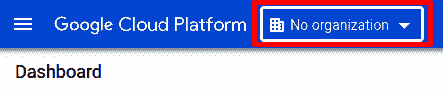

图 2.3 – RHEL8 在 Google Cloud 中–组织菜单访问

1.  点击**新项目**：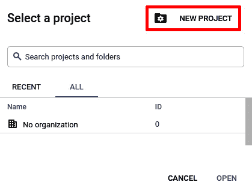

图 2.4 - Google 云中的 RHEL8 - 组织菜单

1.  将其命名为`RHEL8`，然后单击**创建**：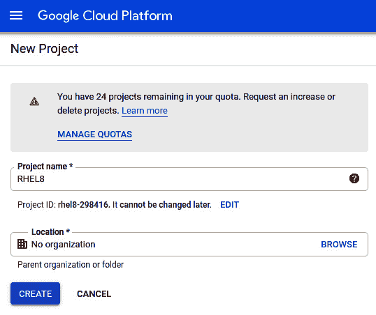

图 2.5 - Google 云中的 RHEL8 - 组织菜单; 创建新项目

重要提示

根据您的 Google 帐户配置方式，您可能需要在此步骤之后启用计费。

1.  转到左上角菜单（也称为**汉堡菜单**，旁边有三条水平线），单击**计算引擎**，然后单击**VM 实例**：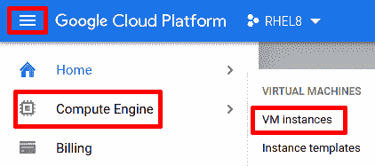

图 2.6 - Google 云中的 RHEL8 - 访问 VM 实例菜单

1.  一旦**计算引擎**准备就绪（可能需要几分钟），点击**创建**：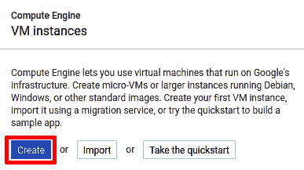

图 2.7 - Google 云中的 RHEL8 - 创建新的 VM 实例

1.  我们将实例命名为`rhel8-instance`：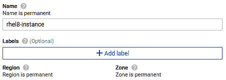

图 2.8 - Google 云中的 RHEL8 - 创建新的 VM 实例; 名称

1.  选择最方便的区域（或保留已提供的区域）：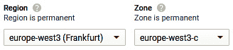

图 2.9 - Google 云中的 RHEL8 - 创建新的 VM 实例，区域和区域

1.  将机器系列和类型设置为**通用**|**e2-medium**：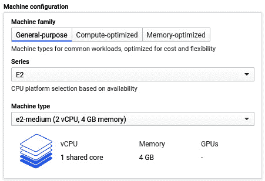

图 2.10 - Google 云中的 RHEL8 - 创建新的 VM 实例，类型和大小

1.  点击**更改**旁边的引导磁盘：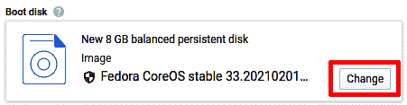

图 2.11 - Google 云中的 RHEL8 - 更改引导磁盘

1.  将**操作系统**更改为**Red Hat 企业 Linux**，**版本**更改为**Red Hat 企业 Linux 8**。然后，点击**选择**：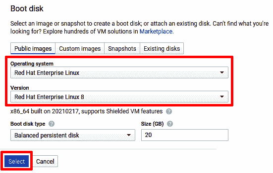

图 2.12 - Google 云中的 RHEL8 - 创建新的 VM 实例，图像选择和磁盘大小

1.  点击**创建**，等待实例创建完成：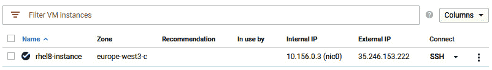

图 2.13 - Google 云中的 RHEL8 - VM 实例列表

1.  稍后，我们将学习如何通过`SSH`连接。现在，点击**连接**下的`SSH`旁边的三角形，并选择**在浏览器窗口中打开**，如下所示：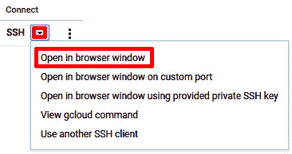

图 2.14 - Google 云中的 RHEL8 - VM 实例，访问控制台

1.  有了这个，您的新鲜的 RHEL8 实例将被部署，如下截图所示：

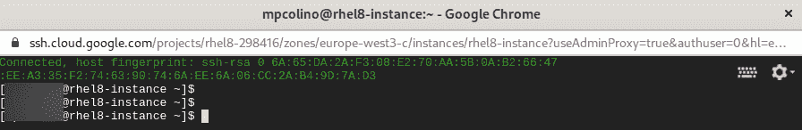

图 2.15 - Google 云中的 RHEL8 - VM 实例，控制台

在云中设置需要一些时间，配置您的帐户，并找到`SSH`密钥（将在*第八章*，*远程管理系统*中显示），但一旦全部设置好，就很容易启动一个新实例。

要成为管理员，您只需要运行以下命令：

```
[miguel@rhel8-instance ~]$ sudo -i
[root@rhel8-instance ~]#
```

现在，您可以使用`timedatectl`检查时间配置并更改：

```
[root@rhel8-instance ~]# timedatectl 
               Local time: Sat 2020-12-12 17:13:29 UTC
           Universal time: Sat 2020-12-12 17:13:29 UTC
                 RTC time: Sat 2020-12-12 17:13:29
                Time zone: UTC (UTC, +0000)
System clock synchronized: yes
              NTP service: active
          RTC in local TZ: no
[root@rhel8-instance ~]# timedatectl set-timezone Europe/Madrid
[root@rhel8-instance ~]# timedatectl 
               Local time: Sat 2020-12-12 18:20:32 CET
           Universal time: Sat 2020-12-12 17:20:32 UTC
                 RTC time: Sat 2020-12-12 17:20:32
                Time zone: Europe/Madrid (CET, +0100)
System clock synchronized: yes
              NTP service: active
          RTC in local TZ: no
```

您还可以使用`localectl`更改语言配置：

```
[root@rhel8-instance ~]# localectl 
   System Locale: LANG=en_US.UTF-8
       VC Keymap: us
      X11 Layout: n/a
```

要更改`locale`或语言支持，您需要首先安装其*语言包*，如下所示：

```
[root@rhel8-instance ~]# yum install glibc-langpack-es –y
... [output omitted] ...
[root@rhel8-instance ~]# localectl set-locale es_ES.utf8
[root@rhel8-instance ~]# localectl 
   System Locale: LANG=es_ES.utf8
       VC Keymap: us
      X11 Layout: n/a
```

现在，您已经配置了一台机器，可以在本书中使用。这些区域设置不需要继续，只是为了创建具有与上一章相同配置的机器。

现在我们知道如何使用 Anaconda 自动重新部署 VM，并在云中获取实例，让我们继续并查看在执行安装时需要考虑的一些最佳实践。

# 安装最佳实践

**Red Hat Enterprise Linux 安装**有许多选项可供选择，您应该根据特定的用例进行定制。然而，一些常见的建议适用。让我们看看最常见的类型。

第一种类型是**蓝图**：

+   标准化核心安装并为其创建一个蓝图：

- 这个蓝图应该足够小，可以作为所有其他蓝图和部署的基础。

+   在需要时为常见情况构建一组蓝图：

- 尽量使用自动化平台来构建扩展案例（即，Ansible）。

- 尽量使案例模块化（即，应用服务器；数据库蓝图可以合并成一个单一的机器）。

- 了解您必须应用于模板蓝图的要求，并适应您将使用的环境。

第二种类型是**软件**：

+   安装的软件越少，攻击面就越小。尽量保持服务器上所需的最小软件包集（即，尽量不要向服务器添加图形用户界面）。

+   在可能的情况下，标准化安装的工具，以便在紧急情况下能够迅速反应。

+   打包第三方应用程序，以便进行健康的生命周期管理（无论是使用 RPM 还是容器）。

+   建立一个补丁安装计划。

第三种类型是**网络**：

+   在虚拟机中，尽量不要过多使用网络接口。

+   在物理机器上，尽可能使用接口组合/绑定。使用 VLAN 对网络进行分段。

第四种类型是**存储**：

+   对于服务器，使用`/boot`或`/boot/efi`）。

+   如果您认为需要缩减文件系统，请使用*ext4*；否则，选择默认的*xfs*。

+   谨慎地对磁盘进行分区：

- 保持默认的引导分区及其默认大小。如果更改它，请扩大它（在升级过程中可能需要空间）。

- 默认的交换分区是最安全的选择，除非第三方软件有特定要求。

- 对于长期存在的系统，至少要有单独的分区用于`/`（根）`/var`，`/usr`，`/tmp`和`/home`，甚至考虑为`/var/log`和`/opt`单独设置一个（对于临时云实例或短期存在的系统，不适用）。

第五种类型是**安全**：

+   不要禁用*SELinux*。它在最新版本中得到了很大改进，很可能不会干扰您的系统（如果需要，将其设置为宽容模式，而不是完全禁用它）。

+   不要禁用防火墙。使用服务部署自动化端口开放。

+   尽可能将日志重定向到一个中央位置。

+   标准化安全工具和配置，以检查系统完整性和审计（即*AIDE*，*logwatch*和*auditd*）。

+   审查软件安装（*RPM*）*GPG*密钥，以及 ISO 映像，以确保完整性。

+   尽量避免使用密码（特别是您的 root 帐户），并在需要时使用强密码。

+   使用*OpenSCAP*审查您的系统以检查安全性（如果需要，从安全团队的帮助下创建自己的硬件 SCAP 配置文件）。

最后，我们将看看**杂项**类型：

+   保持系统时间同步。

+   审查*logrotate*策略，以避免由于日志而导致“磁盘已满”的错误。

遵循这些最佳实践将帮助您避免问题，并使安装基础更易管理。有了这些，您就知道如何以有条理、可重复的方式在系统上部署 Red Hat Enterprise Linux，同时以快速和有弹性的方式为其他团队提供服务。

# 总结

在上一章中，我们提到了如何准备一台机器，可以在整本书中使用。与此相对的是使用云实例，通过这种方式，我们可以从公共云中消费虚拟机实例，这可能简化我们的消费，并为我们提供足够的免费信用来准备 *RHCSA*。此外，一旦自我训练过程完成，这些机器仍然可以用来提供你自己的公共服务（比如部署博客）。

在作为专业人士使用 Linux 时，理解标准化环境的需求以及这样做的影响也很重要。从一开始就采用一套良好的实践方法（自动化安装、跟踪已安装的软件、减少攻击面等）是关键。

完成了这一章，现在你可以继续阅读本书的其余部分了，因为你现在已经有了一个可用于工作和练习的红帽企业 Linux 8 实例。在下一章中，我们将回顾系统的基础知识，让自己感到舒适，并增强使用系统的信心。
