# 第三章：*第三章*：基本命令和简单的 shell 脚本

一旦您的第一个**Red Hat Enterprise Linux (RHEL)**系统运行起来，您就想开始使用它，练习并熟悉它。在本章中，我们将回顾登录系统、浏览系统和了解其管理基础知识的基础知识。

本章描述的一套命令和实践将在管理系统时经常使用，因此重要的是要仔细学习它们。

本章将涵盖以下主题：

+   以用户身份登录和管理多用户环境

+   使用 su 命令切换用户

+   使用命令行、环境变量和浏览文件系统

+   理解命令行中的 I/O 重定向

+   使用 grep 和 sed 过滤输出

+   清单、创建、复制和移动文件和目录、链接和硬链接

+   使用 tar 和 gzip

+   创建基本的 shell 脚本

+   使用系统文档资源

# 以用户身份登录和管理多用户环境

**登录**是用户在系统中识别自己的过程，通常是通过提供**用户名**和**密码**来完成的，这两个信息通常被称为*凭据*。

系统可以以多种方式访问。我们在这里讨论的初始情况是，当用户安装物理机器（如笔记本电脑）或通过虚拟化软件界面访问时，用户如何访问系统。在这种情况下，我们通过*控制台*访问系统。

在安装过程中，用户被创建并分配了密码，并且没有安装图形界面。在这种情况下，我们将通过其*文本控制台*访问系统。我们要做的第一件事是使用它登录系统。一旦启动机器并完成引导过程，我们将默认进入多用户文本模式环境，其中我们被要求提供我们的**登录**：

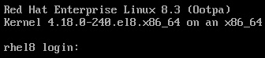

图 3.1 - 登录过程，用户名请求

闪烁的光标将告诉我们，我们已经准备好输入我们的用户名，这里是`user`，然后按*Enter*。会出现一个要求输入密码的行：

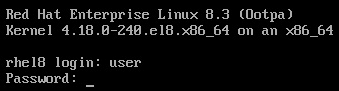

图 3.2 - 登录过程，密码请求

现在我们可以输入用户的密码来完成登录，并通过键盘上的*Enter*键开始一个会话。请注意，在输入密码时屏幕上不会显示任何字符，以避免窃听。这将是正在运行的会话：

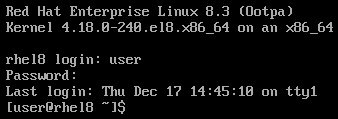

图 3.3 - 登录过程，登录完成，会话运行

现在我们已经完全以名为`user`的用户的*凭据*完全登录到系统。这将决定我们在系统中可以做什么，我们可以访问哪些文件，甚至我们分配了多少磁盘空间。

控制台可以有多个会话。为了实现这一点，我们有不同的终端可以登录。默认终端可以通过同时按下*Ctrl + Alt + F1*键来到达。在我们的情况下，什么也不会发生，因为我们已经在那个终端上了。我们可以通过按*Ctrl + Alt + F2*来到第二个终端，按*Ctrl + Alt + F3*来到第三个终端，以此类推，直到剩下的终端（默认情况下分配了六个）。这样，我们可以在不同的终端中运行不同的命令。

## 使用 root 账户

普通用户无法对系统进行更改，比如创建新用户或向整个系统添加新软件。为此，我们需要一个具有管理权限的用户，而默认用户就是`root`。这个用户始终存在于系统中，其标识符为`0`。

在之前的安装中，我们已经配置了 root 密码，使得可以通过控制台访问该账户。要在系统中使用它，我们只需要在显示的终端之一中输入`root`，然后按下*Enter*，然后提供其`root`：

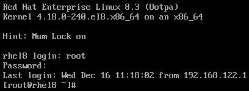

图 3.4 - 登录过程，以 root 用户完成登录

## 使用和理解命令提示符

一旦我们登录并等待输入和运行命令的命令行出现，就称为**命令提示符**。

在其默认配置中，它将在括号之间显示*用户名*和*主机名*，以便让我们知道我们正在使用哪个用户。接下来，我们看到路径，这里是`~`，它是`/home/user`的快捷方式，对于`user`用户，以及`/root`对于`root`用户）

最后一个部分，也可能是最重要的部分，是提示符前面的符号：

+   `$`符号用于没有管理权限的常规用户。

+   `#`符号用于 root 或一旦用户获得管理权限。

重要提示

当使用带有`#`符号的提示符时要小心，因为您将以管理员身份运行，系统很可能不会阻止您损坏它。

一旦我们在系统中标识了自己，我们就已经登录并有了一个运行的会话。现在是时候学习如何在下一节中从一个用户切换到另一个用户了。

# 使用 su 命令切换用户

由于我们已经进入了一个**多用户系统**，因此可以合理地认为我们将能够在用户之间切换。即使可以通过为每个用户打开会话来轻松完成此操作，但有时我们希望在同一个会话中以其他用户的身份行事。

为此，我们可以使用`su`工具。该工具的名称通常被称为**替代用户**。

让我们利用上次以`root`登录的会话，并将自己转换为`user`用户。

在这之前，我们可以通过运行`whoami`命令来询问我当前登录的用户是谁：

```
[root@rhel8 ~]# whoami
root
```

现在我们可以从`root`切换到`user`：

```
[root@rhel8 ~]# su user
[user@rhel8 root]$ whoami 
user
```

现在我们有了一个`user`用户的会话。我们可以使用`exit`命令结束此会话：

```
[user@rhel8 root]$ exit
exit
[root@rhel8 ~]# whoami
root
```

正如您可能已经看到的，当我们以`root`登录时，我们可以像任何用户一样行事，而无需知道其密码。但是我们如何冒充`root`呢？我们可以通过运行`su`命令并指定`root`用户来做到这一点。在这种情况下，将要求输入 root 用户的密码：

```
[user@rhel8 ~]$ su root
Password: 
[root@rhel8 user]# whoami
root
```

由于`root`是 ID 为`0`且最重要的用户，因此在运行`su`而不指定要转换的用户时，它将默认转换为`root`：

```
[user@rhel8 ~]$ su
Password: 
[root@rhel8 user]# whoami
root
```

每个用户都可以在自己的环境中定义多个选项，例如他们喜欢的编辑器。如果我们想完全冒充其他用户并采用他们的偏好（或在`su`命令后加上`-`：

```
[user@rhel8 ~]$ su -
Password: 
Last login: mar dic 22 04:57:29 CET 2020 on pts/0
[root@rhel8 ~]#
```

此外，我们可以从`root`切换到`user`：

```
[root@rhel8 ~]# su - user
Last login: Tue Dec 22 04:53:02 CET 2020 from 192.168.122.1 on pts/0
[user@rhel8 ~]$
```

正如您所观察到的，它的行为就像进行了新的登录，但在同一个会话中。现在，让我们继续管理系统中不同用户的权限，如下一节所述。

# 理解用户、组和基本权限

多用户环境的定义在于能够同时处理多个用户。但是为了能够管理系统资源，有两种能力可以帮助完成任务：

+   **组**：可以聚合用户并以块为它们提供权限。

每个用户都有一个*主要组*。

默认情况下，为每个用户创建一个组，并将其分配为与用户名相同的主要组。

+   `ugo`）。

整个系统都有一组默认分配给每个文件和目录的权限。在更改它们时要小心。

UNIX 中有一个原则，Linux 继承了它，那就是：*一切皆为文件*。即使可能有一些特例，这个原则在几乎任何情况下都是正确的。这意味着磁盘在系统中表示为文件（换句话说，就像安装中提到的`/dev/sdb`），进程可以表示为文件（在`/proc`下），系统中的许多其他组件都表示为文件。

这意味着，在分配文件权限时，我们也可以分配给许多其他组件和功能的权限，因为在 Linux 中，一切都表示为文件。

提示

**POSIX**代表**可移植操作系统接口**，是由 IEEE 计算机学会指定的一系列标准：[`en.wikipedia.org/wiki/POSIX`](https://en.wikipedia.org/wiki/POSIX)。

## 用户

用户是为人们以及在系统中运行的程序提供安全限制的一种方式。有三种类型的用户：

+   **普通用户**：分配给个人执行其工作的用户。他们受到了限制。

+   **超级用户**：也称为''root''。这是系统中的主管理帐户，对其拥有完全访问权限。

+   **系统用户**：这些是通常分配给运行进程或''守护进程''的用户帐户，以限制它们在系统中的范围。系统用户不打算登录到系统。

用户有一个称为**UID（用户 ID）**的数字，系统用它来内部识别每个用户。

我们之前使用`whoami`命令来显示我们正在使用的用户，但是为了获取更多信息，我们将使用`id`命令：

```
[user@rhel8 ~]$ id
uid=1000(user) gid=1000(user) groups=1000(user),10(wheel) context=unconfined_u:unconfined_r:unconfined_t:s0-s0:c0.c1023
```

我们还可以查看系统中其他用户帐户的相关信息，甚至获取`root`的信息：

```
[user@rhel8 ~]$ id root
uid=0(root) gid=0(root) groups=0(root)
```

现在，让我们通过运行`id`来查看我们收到的有关`user`的信息：

+   `uid=1000(user)`：用户 ID 是系统中用户的数字标识符。在这种情况下，它是`1000`。在 RHEL 中，1000 及以上的标识符用于普通用户，而 999 及以下的标识符保留给系统用户。

+   `gid=1000(user)`：组 ID 是分配给用户的主要组的数字标识符。

+   `groups=1000(user),10(wheel)`：这些是用户所属的组，在这种情况下，''user''使用`sudo`工具（稍后将解释）。

+   `context=unconfined_u:unconfined_r:unconfined_t:s0-s0:c0.c1023`：这是用户的 SELinux 上下文。它将使用**SELinux**在系统中定义多个限制（在*第十章*中将深入解释，*使用 SELinux 保护系统*）。

与 ID 相关的数据存储在系统中的`/etc/passwd`文件中。请注意，该文件非常敏感，最好使用与之相关的工具进行管理。如果我们想要编辑它，我们将使用`vipw`，这是一个工具，将确保（除其他事项外）只有一个管理员在任何时候编辑文件。`/etc/passwd`文件包含每个用户的信息。这是`user`的行：

```
user:x:1000:1000:user:/home/user:/bin/bash
```

每个字段在每行中由冒号`:`分隔。让我们来看看它们的含义：

+   `user`：分配给用户的用户名。

+   `x`：加密密码的字段。在这种情况下，它显示为`x`，因为它已经移动到`/etc/shadow`，普通用户无法直接访问，以使系统更安全。

+   `1000`（第一个）：*UID*值。

+   `1000`（第二个）：*GID*值。

+   `user`：帐户的描述。

+   `/home/user`：分配给用户的主目录。这将是用户将要工作的默认目录（或者如果你愿意的话，文件夹），以及他们的偏好设置将被存储的地方。

+   `/bin/bash`：用户的命令解释器。Bash 是 RHEL 中的默认解释器。其他替代品，如`tcsh`，`zsh`或`fish`可在 RHEL 中安装。

## 组

`/srv/finance`目录。当财务团队有新员工时，为了让他们能够访问该文件夹，我们只需要将分配给这个人的用户添加到`finance`组中（如果有人离开团队，我们只需要从`finance`组中删除他们的帐户）。

组有一个称为**GID**的数字，系统用它来在内部识别它们。

组的数据存储在系统中的`/etc/group`文件中。为了以确保一致性并避免损坏的方式编辑此文件，我们必须使用`vigr`工具。文件中每行包含一个组，不同字段用冒号`:`分隔。让我们看一下`wheel`组的行：

```
wheel:x:10:user
```

让我们回顾一下每个字段的含义：

+   `wheel`：这是组的名称。在这种情况下，这个组是特殊的，因为它被配置为默认情况下用作为普通用户提供管理员特权的组。

+   `x`：这是组密码字段。它目前已经过时，应始终包含`x`。它保留用于兼容性目的。

+   `10`：这是组本身的 GID 值。

+   `user`：这是属于该组的用户列表（用逗号分隔，如`user1`，`user2`和`user3`）。

组的类型如下：

+   **主要组**：这是用户新创建的文件分配的组。

+   **私有组**：这是一个特定的组，与用户同名，为每个用户创建。添加新用户帐户时，将自动为其创建一个私有组。很常见的是''主要组''和''私有组''是一样的。

+   `wheel`组用于为用户启用管理员特权，或者`cdrom`组用于在系统中提供对 CD 和 DVD 设备的访问。

## 文件权限

要查看`root`。我们将使用`ls`命令列出文件，并查看与它们关联的权限。我们将在*第五章*中学习如何更改权限，*使用用户、组和权限保护系统*。

一旦以`root`身份登录系统，我们可以运行`ls`命令：

```
[root@rhel8 ~]# ls
anaconda-ks.cfg
```

这显示了*root 用户主目录*中存在的文件，用`~`表示。在这种情况下，它显示了在上一章中我们审查过的*Anaconda*创建的*kickstart*文件。

我们可以通过在`ls`后附加`-l`选项来获取列表的长版本：

```
[root@rhel8 ~]# ls -l
total 4
-rw-------. 1 root root 1393 Dec  7 16:45 anaconda-ks.cfg
```

我们在输出中看到以下内容：

+   `total 4`：这是文件在磁盘上占用的总空间，以千字节为单位（请注意，我们使用的是 4K 块，因此每个小于该大小的文件将占用至少 4K）。

+   `-rw-------.`：这些是分配给文件的权限。

权限的结构可以在以下图表中看到：

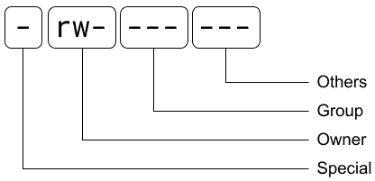

图 3.5 - Linux 权限结构

第一个字符是文件可能具有的*特殊权限*。如果它是一个常规文件，并且没有特殊权限（就像在这种情况下），它将显示为`-`：

+   目录将显示为`d`。请考虑在 Linux 中，一切都是文件，目录是具有特殊权限的文件。

+   链接，通常是符号链接，将显示为`l`。这些行为类似于从不同目录的文件的快捷方式。

+   特殊权限以不同的用户或组身份运行文件，称为`s`。

+   一个特殊权限，使所有者只能删除或重命名文件，称为`t`。

接下来的三个字符`rw-`是*所有者*的权限：

+   第一个字符`r`是分配的读权限。

+   第二个字符`w`是分配的写权限。

+   第三个字符`x`，不存在并显示为`-`，是可执行权限。请注意，对于目录的可执行权限意味着能够进入它们。

接下来的三个字符`---`是*组*权限，与所有者权限的工作方式相同。在这种情况下，没有授予组访问权限。

最后三个字符`---`是*其他人*的权限，这意味着用户和/或组不会显示为分配给文件的权限：

+   `1`: 这表示对该文件的**链接**（硬链接）的数量。这是为了防止我们删除另一个文件夹中使用的文件等目的。

+   `root`: 这表示文件的（第一次）所有者。

+   `root`: 这表示文件分配给的（第二次）组。

+   `1393`: 这表示以字节为单位的大小。

+   `Dec 7 16:45`: 这表示文件上次修改的日期和时间。

+   `anaconda-ks.cfg`: 这表示文件名。

当我们列出一个目录（在其他系统中称为*文件夹*）时，输出将显示目录本身的内容。我们可以使用`-d` `option`列出目录本身的信息。现在让我们来看看`/etc`，这个存储系统范围配置的目录：

```
[root@rhel8 ~]# ls -l -d /etc
drwxr-xr-x. 81 root root 8192 Dec 23 17:03 /etc
```

正如你所看到的，很容易获取有关系统中文件和目录的信息。现在让我们在下一节中学习更多关于命令行以及如何在文件系统中导航，以便轻松地在系统中移动。

# 使用命令行、环境变量和浏览文件系统

正如我们之前所看到的，一旦我们登录系统，我们就可以访问命令行。熟练地浏览命令行和文件系统对于在环境中感到舒适并充分利用它至关重要。

## 命令行和环境变量

命令行由一个程序提供，也称为*解释器*或**shell**。它的行为取决于我们使用的 shell，但在本节中，我们将介绍 Linux 中最常用的 shell，也是 RHEL 默认提供的 shell：**bash**。

知道你正在使用哪个 shell 的一个简单技巧是运行以下命令：

```
[root@rhel8 ~]# echo $SHELL
/bin/bash
```

`echo`命令将在屏幕上显示我们给它的内容。有些内容需要*替换*或*解释*，比如环境变量。需要替换的内容以`$`符号开头。在这种情况下，我们告诉系统`echo`变量`SHELL`的内容。让我们用它来处理其他变量：

```
[root@rhel8 ~]# echo $USER
root
[root@rhel8 ~]# echo $HOME
/root
```

这些是可以为每个用户自定义的**环境变量**。现在让我们为另一个用户检查这些：

```
[root@rhel8 ~]# su - user
Last login: Wed Dec 23 17:03:32 CET 2020 from 192.168.122.1 on pts/0
[user@rhel8 ~]$ echo $USER
user
[user@rhel8 ~]$  echo $HOME
/home/user
```

正如你所看到的，你可以随时引用`$USER`，它将被当前用户替换，或者引用`$HOME`，它将被替换为用户专用的目录，也称为**主目录**。

这些是一些最常见和重要的*环境变量*：

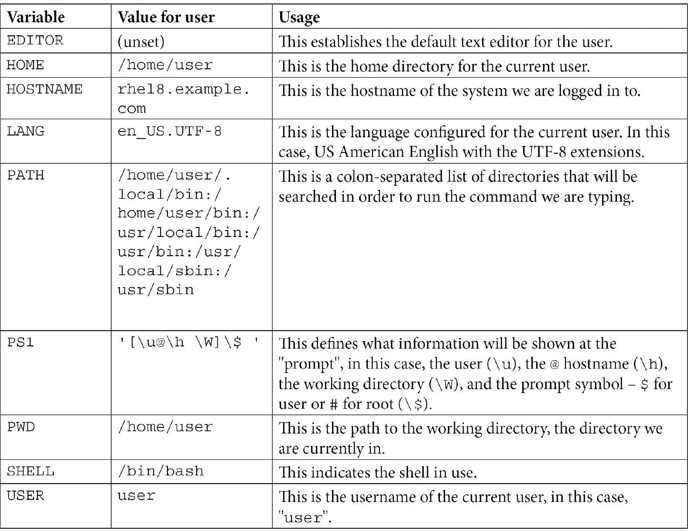

`~/.bashrc`文件应该被编辑以更改当前用户的这些值。

## 浏览文件系统

现在是时候将我们自己移动到`/`了。系统的其余内容将悬挂在那个文件夹下，任何其他磁盘或设备都将被分配一个目录以供访问。

重要说明

根目录和 root 用户的主目录是两回事。root 用户默认分配了主目录`/root`，而根目录是系统中所有目录的母目录，用`/`表示。

我们可以通过运行`pwd`命令来查看我们所在的目录：

```
[user@rhel8 ~]$ pwd
/home/user
```

我们可以使用`cd`命令来更改目录：

```
[user@rhel8 ~]$ cd /var/tmp
[user@rhel8 tmp]$ pwd
/var/tmp
```

正如你已经知道的，有一个`~`。我们可以使用这个快捷方式去到它：

```
[user@rhel8 tmp]$ cd ~
[user@rhel8 ~]$ pwd
/home/user
```

一些目录的快捷方式包括以下内容：

+   **"~":** 这是当前用户的主目录。

+   **".":** 这是当前目录。

+   **"..":** 这是父目录。

+   **"-":** 这是先前使用的目录。

有关在 Linux 和 RHEL 中管理文件和目录的更多详细信息，请参阅*列出、创建、复制和移动文件和目录、链接和硬链接*部分。

## Bash 自动补全

快捷方式是到达常用目录或当前工作目录的相对引用的更快方式。但是，bash 包括一些快速到达其他目录的功能，这称为**自动补全**。它依赖于*Tab*键（键盘最左边具有两个相对箭头的键，在*Caps Lock*上方）。

当到达一个文件夹或文件时，我们可以按*Tab*键来完成它的名称。例如，如果我们想进入`/boot/grub2`文件夹，我们输入以下内容：

```
[user@rhel8 ~]$ cd /bo 
```

然后，当我们按下*Tab*键时，它会自动补全为`/boot/`，甚至添加最终的`/`，因为它是一个目录：

```
[user@rhel8 ~]$ cd /boot/
```

现在我们输入我们想要进入的目录`grub2`的第一个字母，即`g`：

```
[user@rhel8 ~]$ cd /boot/g
```

然后，当我们按下*Tab*键时，它会自动补全为`/boot/grub2/`：

```
[root@rhel8 ~]# cd /boot/grub2/
```

现在我们可以按*Enter*键并进入那里。

如果我们按下*Tab + Tab*（在完成期间按两次*Tab*），这将显示可用目标的列表，例如：

```
[root@rhel8 ~]# cd /r
root/ run/  
```

它也可以用于完成命令。我们可以输入一个字母，例如`h`，按下*Tab + Tab*，这将显示所有以`h`开头的命令：

```
[root@rhel8 ~]# h
halt         hardlink     hash         h dparm       head         help         hexdump      history      hostid       hostname     hostnamectl  hwclock      
```

这种能力可以通过安装`bash-completion`软件包来扩展，以帮助完成我们命令的其他部分：

```
[root@rhel8 ~]# yum install bash-completion –y
```

### 以前的命令

有一种方法可以恢复最后运行的命令，这被称为**历史记录**，以防您想要再次运行它们。只需按下*向上箭头*键（带有向上箭头的键）即可，以及以前的命令将出现在屏幕上。

如果您的历史记录中有太多命令，您可以通过运行`history`命令快速搜索它们：

```
[user@rhel8 ~]$ history 
   1  su root
   2  su
   3  su -
   4  id
   5  id root
   6  grep user /etc/passwd
   7  echo $USER
   8   echo $HOME
   9  declare
   10  echo $SHELL
   11  echo EDITOR
   12  echo $EDITOR
   13  grep wheel /etc/gro
   14  grep wheel /etc/group
   15  cat /etc/group
   16  grep nobody /etc/group /etc/passwd
```

您可以使用`!`命令再次运行任何这些命令。只需使用命令的编号运行`!`，它将再次运行：

```
[user@rhel8 ~]$ !5
id root
uid=0(root) gid=0(root) groups=0(root)
```

提示

命令`!!`将再次运行最后一个命令，无论编号如何。

现在是时候享受您的超快命令行了。让我们在下一节中更多地了解 Linux 中目录的结构，以便知道去哪里查找东西。

## 文件系统层次结构

Linux 有一个由*Linux 基金会*维护的标准，定义了**文件系统层次结构**，几乎在每个 Linux 发行版中都使用，包括*RHEL*。这个标准被称为**FHS**，或**文件系统层次结构标准**。让我们在这里回顾一下标准中最重要的文件夹和系统本身：

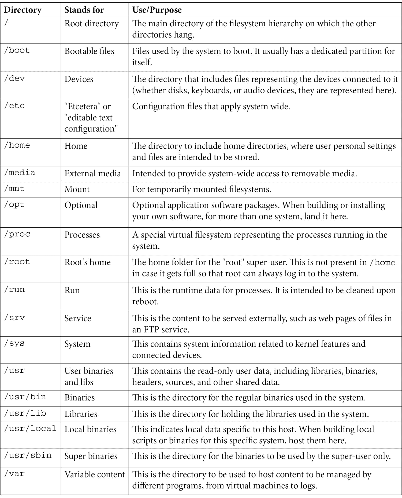

提示

RHEL 的早期版本用于将`/bin`用于基本二进制文件和`/usr/bin`用于非基本二进制文件。现在，两者的内容都驻留在`/usr/bin`中。他们还使用`/var/lock`和`/var/run`来运行`/run`中的内容。此外，他们过去用于将`/lib`用于基本库和`/usr/lib`用于非基本库，这些都合并到一个目录`/usr/lib`中。最后但并非最不重要的是，`/sbin`是基本超级用户二进制文件的目录，`/usr/sbin`是合并到`/usr/sbin`下的非基本二进制文件的目录。

在分区时，我们可能会问自己，磁盘空间去哪了？

这些是 RHEL 8''最小''安装的分配值和建议：

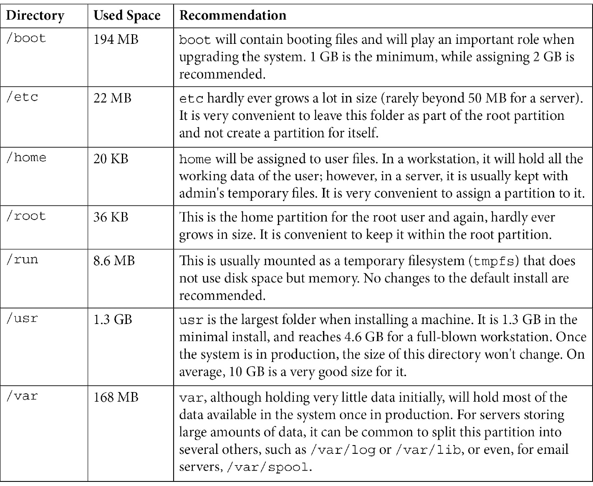

熟悉系统中的主要目录是很重要的，以便充分利用它们。建议浏览不同的系统目录，并查看其中的内容，以便熟悉结构。在下一节中，我们将学习如何在命令行上执行重定向，以了解更多关于命令和文件交互的内容。

# 了解命令行中的 I/O 重定向

我们已经运行了几个命令来确定系统的信息，例如使用`ls`列出文件，并且我们从运行的命令中得到了一些信息，**输出**，包括文件名和文件大小。该信息或*输出*可能很有用，我们希望能够正确地处理、存储和管理它。

在谈论命令*输出*和**输入**时，有三个需要理解的来源或目标：

+   **STDOUT**：也称为**标准输出**，这是命令将其常规消息放置以提供有关其正在执行的操作的信息的地方。在终端上，在交互式 shell（就像我们迄今为止使用的那样），此输出将显示在屏幕上。这将是我们管理的主要输出。

+   **STDERR**：也称为**标准错误**，这是命令将其错误消息放置在其中以进行处理的地方。在我们的交互式 shell 中，除非我们明确重定向它，否则此输出也将显示在屏幕上，同时显示标准输出。

+   **STDIN**：也称为**标准输入**，这是命令获取要处理的数据的地方。

我们将在下一段中提到这些，以更好地理解它们。

命令输入和输出的使用方式需要以下运算符：

+   `|`：**管道**运算符用于获取一个命令的输出并将其作为下一个命令的输入。它将数据从一个命令传输到另一个命令。

+   `>`：**重定向**运算符用于将命令的输出放入文件中。如果文件存在，它将被覆盖。

+   `<`：**反向重定向**可以应用于使用文件作为命令的输入。使用它不会删除用作输入的文件。

+   `>>`：**重定向并添加**运算符用于将命令的输出附加到文件中。如果文件不存在，它将使用提供给它的输出创建文件。

+   `2>`：**重定向 STDERR**运算符将仅重定向发送到错误消息处理程序的输出。（注意，为了使其工作，''2''和''>''之间不应包含空格！）

+   `1>`：**重定向 STDOUT**运算符将仅重定向发送到标准输出而不是错误消息处理程序的输出。

+   `>&2`：**重定向到 STDERR**运算符将输出重定向到标准错误处理程序。

+   `>&1`：**重定向到 STDOUT**运算符将输出重定向到标准输出处理程序。

为了更好地理解这些，我们将在本节和下一节中进行一些示例。

让我们列出文件并将其放入文件中。首先，我们使用`-m`选项列出`/var`中的文件，用逗号分隔条目：

```
[root@rhel8 ~]# ls -m /var/
adm, cache, crash, db, empty, ftp, games, gopher, kerberos, lib, local, lock, log, mail, nis, opt, preserve, run, spool, tmp, yp
```

现在，我们再次运行命令，将输出重定向到`/root/var-files.txt`文件中：

```
[root@rhel8 ~]# ls –m /var/ > /root/var-files.txt
[root@rhel8 ~]#
```

正如我们所看到的，屏幕上没有显示任何输出，但是我们将能够在当前工作目录中找到新文件，即`/root`中的新创建的文件：

```
[root@rhel8 ~]# ls /root
anaconda-ks.cfg  var-files.txt
```

要在屏幕上查看文件的内容，我们使用`cat`命令，用于连接几个文件的输出，但通常用于此目的：

```
[root@rhel8 ~]# ls –m /var/ > /root/var-files.txt
[root@rhel8 ~]#
[root@rhel8 ~]# cat var-files.txt 
adm, cache, crash, db, empty, ftp, games, gopher, kerberos, lib, local, lock,
log, mail, nis, opt, preserve, run, spool, tmp, yp
```

我们还可以将`/var/lib`的内容添加到此文件中。首先，我们可以列出它：

```
[root@rhel8 ~]# ls -m /var/lib/
alternatives, authselect, chrony, dbus, dhclient, dnf, games, initramfs, logrotate, misc, NetworkManager, os-prober, plymouth, polkit-1, portables, private, rhsm, rpm, rpm-state, rsyslog, selinux, sss, systemd, tpm, tuned, unbound
```

现在，要将这些内容附加到`/root/var-files.txt`文件中，我们使用`>>`运算符：

```
[root@rhel8 ~]# ls -m /var/lib/ >> var-files.txt 
[root@rhel8 ~]# cat var-files.txt 
adm, cache, crash, db, empty, ftp, games, gopher, kerberos, lib, local, lock, log, mail, nis, opt, preserve, run, spool, tmp, yp
alternatives, authselect, chrony, dbus, dhclient, dnf, games, initramfs, logrotate, misc, NetworkManager, os-prober, plymouth, polkit-1, portables, private, rhsm, rpm, rpm-state, rsyslog, selinux, sss, systemd, tpm, tuned, unbound 
```

`/root/var-files.txt`文件现在包含了`/var`和`/var/lib`的逗号分隔列表。

现在我们可以尝试列出一个不存在的目录以查看错误消息的打印：

```
[root@rhel8 ~]# ls -m /non
ls: cannot access '/non': No such file or directory
```

我们看到的输出是一个错误，并且系统对其进行了不同的处理，而不是常规消息。我们可以尝试将输出重定向到文件：

```
[root@rhel8 ~]# ls -m /non > non-listing.txt
ls: cannot access '/non': No such file or directory
[root@rhel8 ~]# cat non-listing.txt 
[root@rhel8 ~]#
```

我们看到，使用标准重定向，使用命令提供错误消息，将在屏幕上显示错误消息，并创建一个空文件。这是因为文件包含了通过`STDOUT`显示的常规信息消息的输出。我们仍然可以通过使用`2>`捕获错误的输出，重定向`STDERR`：

```
[root@rhel8 ~]# ls /non 2> /root/error.txt
[root@rhel8 ~]# cat /root/error.txt 
ls: cannot access '/non': No such file or directory
```

现在我们可以独立重定向标准输出和错误输出。

现在我们想要计算`/var`中文件和目录的数量。为此，我们将使用`wc`命令，该命令代表*单词计数*，并使用`-w`选项仅计算单词数。为此，我们将使用`|`表示的*管道*将`ls`的输出重定向到它：

```
[root@rhel8 ~]# ls -m /var/ | wc -w
21
```

我们还可以使用它来计算`/etc`中的条目：

```
 [root@rhel8 ~]# ls -m /etc/ | wc -w
174
```

管道`|`非常适合重用一个命令的输出，并将其发送到另一个命令以处理该输出。现在我们更了解如何使用更常见的运算符来重定向输入和输出。有几种处理输出的方法，我们将在下一节中看到更多示例。

# 使用 grep 和 sed 过滤输出

`grep`命令在系统管理中被广泛使用（并且常常被输入错误）。它有助于在一行中找到模式，无论是在文件中还是通过**标准输入**（**STDIN**）。

让我们对`/usr`中的文件进行递归搜索，并将其放在`/root/usr-files.txt`中：

```
[root@rhel8 ~]# find /usr/ > /root/usr-files.txt
[root@rhel8 ~]# ls -lh usr-files.txt 
-rw-r--r--. 1 root root 1,9M dic 26 12:38 usr-files.txt
```

如您所见，这是一个大小为 1.9 MB 的文件，很难浏览。系统中有一个名为`gzip`的实用程序，我们想知道`/usr`中的哪些文件包含`gzip`模式。为此，我们运行以下命令：

```
[root@rhel8 ~]# grep gzip usr-files.txt 
/usr/bin/gzip
/usr/lib64/python3.6/__pycache__/gzip.cpython-36.opt-2.pyc
/usr/lib64/python3.6/__pycache__/gzip.cpython-36.opt-1.pyc
/usr/lib64/python3.6/__pycache__/gzip.cpython-36.pyc
/usr/lib64/python3.6/gzip.py
/usr/share/licenses/gzip
/usr/share/licenses/gzip/COPYING
/usr/share/licenses/gzip/fdl-1.3.txt
/usr/share/doc/gzip
/usr/share/doc/gzip/AUTHORS
/usr/share/doc/gzip/ChangeLog
/usr/share/doc/gzip/NEWS
/usr/share/doc/gzip/README
/usr/share/doc/gzip/THANKS
/usr/share/doc/gzip/TODO
/usr/share/man/man1/gzip.1.gz
/usr/share/info/gzip.info.gz
/usr/share/mime/application/gzip.xml
```

如您所见，我们已经通过创建一个包含所有内容的文件并使用`grep`搜索到了`/usr`目录下的所有包含`gzip`的文件。我们可以在不创建文件的情况下做同样的事情吗？当然可以，通过使用*管道*。我们可以将`find`的输出重定向到`grep`并获得相同的输出：

```
[root@rhel8 ~]# find /usr/ | grep gzip
/usr/bin/gzip
/usr/lib64/python3.6/__pycache__/gzip.cpython-36.opt-2.pyc
/usr/lib64/python3.6/__pycache__/gzip.cpython-36.opt-1.pyc
/usr/lib64/python3.6/__pycache__/gzip.cpython-36.pyc
/usr/lib64/python3.6/gzip.py
/usr/share/licenses/gzip
/usr/share/licenses/gzip/COPYING
/usr/share/licenses/gzip/fdl-1.3.txt
/usr/share/doc/gzip
/usr/share/doc/gzip/AUTHORS
/usr/share/doc/gzip/ChangeLog
/usr/share/doc/gzip/NEWS
/usr/share/doc/gzip/README
/usr/share/doc/gzip/THANKS
/usr/share/doc/gzip/TODO
/usr/share/man/man1/gzip.1.gz
/usr/share/info/gzip.info.gz
/usr/share/mime/application/gzip.xml
```

在这个命令中，`find`的标准输出被发送到`grep`进行处理。我们甚至可以使用`-l`选项计算文件的实例数，但这次使用`wc`来计算行数：

```
[root@rhel8 ~]# find /usr/ | grep gzip | wc -l
18
```

我们现在已经连接了两个管道，一个用于过滤输出，另一个用于计数。当在系统中搜索和查找信息时，我们经常会发现自己这样做。

`grep`的一些非常常见的选项如下：

+   `-i`：用于**忽略大小写**。这将匹配无论是大写还是小写或二者的组合的模式。

+   `-v`：用于**反转匹配**。这将显示所有不匹配搜索模式的条目。

+   -r：用于**递归**。我们可以告诉 grep 在目录中的所有文件中搜索模式，同时浏览所有文件（如果我们有权限）。

还有一种方法可以过滤输出中的列。假设我们有一个文件列表在我们的主目录中，并且我们想看到它的大小。我们运行以下命令：

```
[root@rhel8 ~]# ls -l
total 1888
-rw-------. 1 root root    1393 dic  7 16:45 anaconda-ks.cfg
-rw-r--r--. 1 root root      52 dic 26 12:17 error.txt
-rw-r--r--. 1 root root       0 dic 26 12:08 non-listing.txt
-rw-r--r--. 1 root root 1917837 dic 26 12:40 usr-files.txt
-rw-r--r--. 1 root root     360 dic 26 12:12 var-files.txt
```

假设我们只想要包含其名称中有`files`的内容的大小，即第五列。我们可以使用`awk`来实现：

```
[root@rhel8 ~]# ls -l | grep files | awk '{ print $5}' 
1917837
360
```

`awk`工具将帮助我们根据正确的列进行过滤。它非常有用，可以在长输出中找到进程中的标识符或获取特定的数据列表。

提示

请考虑`awk`在处理输出方面非常强大，我们将使用其最小功能。

我们可以用`-F`替换分隔符，并获取系统中可用用户的列表：

```
[root@rhel8 ~]# awk -F: '{ print $1}' /etc/passwd
root
bin
daemon
adm
lp
sync
shutdown
halt
mail
operator
games
ftp
nobody
dbus
systemd-coredump
systemd-resolve
tss
polkitd
unbound
sssd
chrony
sshd
rngd
user
```

`awk`和`grep`工具是 Linux 系统管理员生活中非常常见的处理工具，重要的是要充分理解它们，以便管理系统提供的输出。我们已经应用了基本知识来过滤按行和列接收的输出。现在让我们继续学习如何管理系统中的文件，以便更好地处理我们刚刚生成的存储输出。

# 列出、创建、复制和移动文件和目录、链接和硬链接

重要的是要知道如何从命令行管理文件和目录（也称为文件夹）。这将作为管理和复制重要数据（如配置文件或数据文件）的基础。

## 目录

让我们首先创建一个目录来保存一些工作文件。我们可以通过运行`mkdir`来实现，缩写为**make directory**：

```
[user@rhel8 ~]$ mkdir mydir
[user@rhel8 ~]$ ls -l
total 0
drwxrwxr-x. 2 user user 6 Dec 23 19:53 mydir
```

可以使用`rmdir`命令删除文件夹，缩写为**remove directory**：

```
[user@rhel8 ~]$ ls -l
total 0
drwxrwxr-x. 2 user user 6 Dec 23 19:53 mydir
[user@rhel8 ~]$ mkdir deleteme
[user@rhel8 ~]$ ls -l
total 0
drwxrwxr-x. 2 user user 6 Dec 23 20:15 deleteme
drwxrwxr-x. 2 user user 6 Dec 23 19:53 mydir
[user@rhel8 ~]$ rmdir deleteme
[user@rhel8 ~]$ ls -l
total 0
drwxrwxr-x. 2 user user 6 Dec 23 19:53 mydir
```

但是，`rmdir`只会删除空目录：

```
[user@rhel8 ~]$ ls /etc/ > ~/mydir/etc-files.txt
[user@rhel8 ~]$ rmdir mydir
rmdir: failed to remove 'mydir': Directory not empty
```

我们如何使用删除（`rm`）命令删除目录及其包含的所有其他文件和目录？首先，让我们创建并删除一个单个文件`var-files.txt`：

```
[user@rhel8 ~]$ ls /var/ > ~/var-files.txt
[user@rhel8 ~]$ ls -l var-files.txt 
-rw-rw-r--. 1 user user 109 Dec 26 15:31 var-files.txt
[user@rhel8 ~]$ rm var-files.txt 
[user@rhel8 ~]$ ls -l var-files.txt 
ls: cannot access 'var-files.txt': No such file or directory
```

删除完整的目录分支，包括其中的内容，我们可以使用`-r`选项，简称**递归**：

```
[user@rhel8 ~]$ rm -r mydir/
[user@rhel8 ~]$ ls -l
total 0
```

重要提示

在删除时使用递归模式时要非常小心，因为它既没有恢复命令，也没有垃圾箱来保存在命令行中已删除的文件。

让我们来看看复习表：

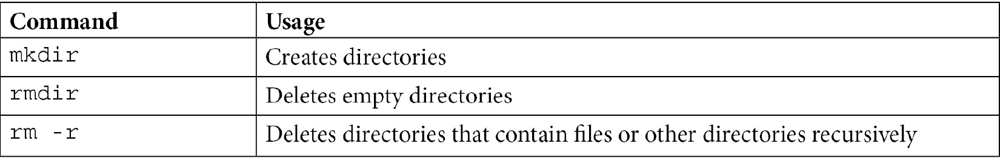

现在我们知道如何在 Linux 系统中创建和删除目录，让我们开始复制和移动内容。

## 复制和移动

现在，让我们复制一些文件来玩，使用`cp`（例如将`awk`示例复制到我们的主目录中：

```
[user@rhel8 ~]$ mkdir myawk
[user@rhel8 ~]$ cp /usr/share/awk/* myawk/
[user@rhel8 ~]$ ls myawk/ | wc -l
26
```

要同时复制多个文件，我们使用了`*`符号。这样可以通过逐个指定文件的方式，只需输入`*`即可。我们还可以输入初始字符，然后加上`*`，所以让我们尝试使用通配符复制一些更多的文件，首先：

```
[user@rhel8 ~]$ mkdir mysystemd
[user@rhel8 ~]$ cp /usr/share/doc/systemd/* mysystemd/
[user@rhel8 ~]$ cd mysystemd/
[user@rhel8 mysystemd]$ ls
20-yama-ptrace.conf  CODING_STYLE  DISTRO_PORTING  ENVIRONMENT.md  GVARIANT-SERIALIZATION  HACKING  NEWS  README  TRANSIENT-SETTINGS.md  TRANSLATORS  UIDS-GIDS.md
```

您会看到运行`ls TR*`只显示以`TR`开头的文件：

```
[user@rhel8 mysystemd]$ ls TR*
TRANSIENT-SETTINGS.md  TRANSLATORS
```

它将以相同的方式处理文件结尾：

```
[user@rhel8 mysystemd]$ ls *.md
ENVIRONMENT.md  TRANSIENT-SETTINGS.md  UIDS-GIDS.md
```

如您所见，它只显示以`.md`结尾的文件。

我们可以使用`-r`选项复制完整的文件和目录分支，用于`cp`：

```
[user@rhel8 mysystemd]$ cd ~
[user@rhel8 ~]$ mkdir myauthselect
[user@rhel8 ~]$ cp -r /usr/share/authselect/* myauthselect
[user@rhel8 ~]$ ls myauthselect/
default  vendor
```

递归选项对于复制完整分支非常有用。我们也可以使用`mv`命令轻松移动目录或文件。让我们将所有新目录放在一个新创建的名为`docs`的目录中：

```
[user@rhel8 ~]$ mv my* docs/ 
[user@rhel8 ~]$ ls docs/
myauthselect  myawk  mysystemd
```

您可以看到，使用`mv`时，您无需使用递归选项来管理文件和目录的完整分支。它也可以用于重命名文件和/或目录：

```
[user@rhel8 ~]$ cd docs/mysystemd/
[user@rhel8 mysystemd]$ ls
20-yama-ptrace.conf  CODING_STYLE  DISTRO_PORTING  ENVIRONMENT.md  GVARIANT-SERIALIZATION  HACKING  NEWS  README  TRANSIENT-SETTINGS.md  TRANSLATORS  UIDS-GIDS.md
[user@rhel8 mysystemd]$ ls -l NEWS
-rw-r--r--. 1 user user 451192 Dec 26 15:59 NEWS
[user@rhel8 mysystemd]$ mv NEWS mynews
[user@rhel8 mysystemd]$ ls -l NEWS
ls: cannot access 'NEWS': No such file or directory
[user@rhel8 mysystemd]$ ls -l mynews 
-rw-r--r--. 1 user user 451192 Dec 26 15:59 mynews
```

有一个专门用于创建空文件的命令，即`touch`：

```
[user@rhel8 ~]$ ls -l  docs/
total 4
drwxrwxr-x. 4 user user   35 Dec 26 16:08 myauthselect
drwxrwxr-x. 2 user user 4096 Dec 26 15:51 myawk
drwxrwxr-x. 2 user user  238 Dec 26 16:21 mysystemd
[user@rhel8 ~]$ touch docs/mytouch
[user@rhel8 ~]$ ls -l  docs/
total 4
drwxrwxr-x. 4 user user   35 Dec 26 16:08 myauthselect
drwxrwxr-x. 2 user user 4096 Dec 26 15:51 myawk
drwxrwxr-x. 2 user user  238 Dec 26 16:21 mysystemd
-rw-rw-r--. 1 user user    0 Dec 26 16:27 mytouch
```

当应用于现有文件或文件夹时，它将更新其访问时间为当前时间：

```
[user@rhel8 ~]$ touch docs/mysystemd
[user@rhel8 ~]$ ls -l  docs/
total 4
drwxrwxr-x. 4 user user   35 Dec 26 16:08 myauthselect
drwxrwxr-x. 2 user user 4096 Dec 26 15:51 myawk
drwxrwxr-x. 2 user user  238 Dec 26 16:28 mysystemd
-rw-rw-r--. 1 user user    0 Dec 26 16:27 mytouch
```

让我们检查一下复习表：

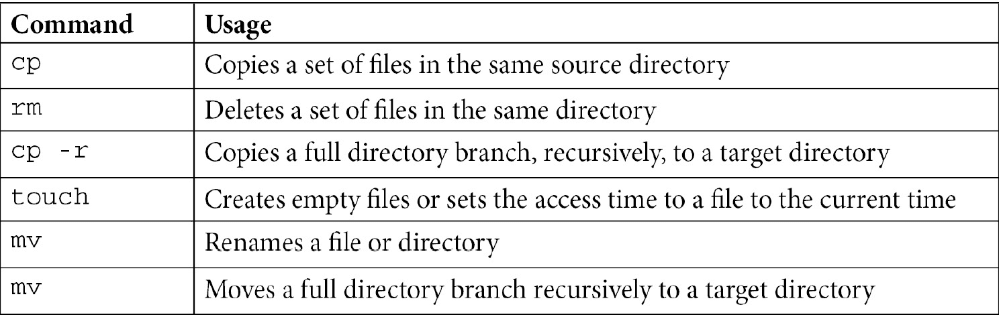

现在我们知道如何复制、删除、重命名和移动文件和目录，甚至是完整的目录分支。现在让我们来看看另一种处理它们的方式——链接。

## 符号链接和硬链接

我们可以使用**链接**在两个位置拥有相同的文件。有两种类型的链接：

+   **硬链接**：文件系统中将有两个（或更多）指向相同文件的条目。内容将一次写入磁盘。对于同一文件，不能在两个不同的文件系统中创建硬链接。目录不能创建硬链接。

+   **符号链接**：创建指向系统中任何位置的文件或目录的符号链接。

两者都是使用`ln`，表示*链接*，实用程序创建的。

现在让我们创建硬链接：

```
[user@rhel8 ~]$ cd docs/      
[user@rhel8 docs]$ ln mysystemd/README MYREADME
[user@rhel8 docs]$ ls -l
total 20
drwxrwxr-x. 4 user user    35 Dec 26 16:08 myauthselect
drwxrwxr-x. 2 user user  4096 Dec 26 15:51 myawk
-rw-r--r--. 2 user user 13826 Dec 26 15:59 MYREADME
drwxrwxr-x. 2 user user   238 Dec 26 16:28 mysystemd
-rw-rw-r--. 1 user user     0 Dec 26 16:27 mytouch
[user@rhel8 docs]$ ln MYREADME MYREADME2
[user@rhel8 docs]$ ls -l
total 36
drwxrwxr-x. 4 user user    35 Dec 26 16:08 myauthselect
drwxrwxr-x. 2 user user  4096 Dec 26 15:51 myawk
-rw-r--r--. 3 user user 13831 Dec 26 16:32 MYREADME
-rw-r--r--. 3 user user 13831 Dec 26 16:32 MYREADME2
drwxrwxr-x. 2 user user   238 Dec 26 16:28 mysystemd
-rw-rw-r--. 1 user user     0 Dec 26 16:27 mytouch
drwxrwxr-x. 2 user user     6 Dec 26 16:35 test
```

检查文件的引用数量增加（在上一个示例中加粗显示）。

现在让我们创建一个指向目录的符号链接，使用`ln -s`（*s 代表符号*）：

```
[user@rhel8 docs]$ ln -s mysystemd mysystemdlink
[user@rhel8 docs]$ ls -l
total 36
drwxrwxr-x. 4 user user    35 Dec 26 16:08 myauthselect
drwxrwxr-x. 2 user user  4096 Dec 26 15:51 myawk
-rw-r--r--. 3 user user 13831 Dec 26 16:32 MYREADME
-rw-r--r--. 3 user user 13831 Dec 26 16:32 MYREADME2
drwxrwxr-x. 2 user user   238 Dec 26 16:28 mysystemd
lrwxrwxrwx. 1 user user     9 Dec 26 16:40 mysystemdlink -> mysystemd
-rw-rw-r--. 1 user user     0 Dec 26 16:27 mytouch
drwxrwxr-x. 2 user user     6 Dec 26 16:35 test
```

检查符号链接创建时如何被视为不同类型，因为它以`l`开头，表示*链接*（在上一个示例中加粗显示），而不是以`d`开头，表示*目录*（在上一个示例中也加粗显示）。

提示

如果不确定使用硬链接还是符号链接，使用符号链接作为默认选择。

让我们检查一下复习表：

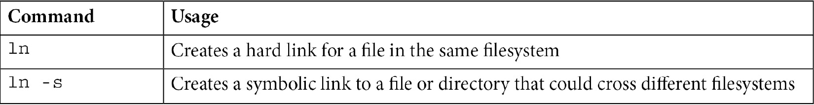

如您所见，创建链接和符号链接非常简单，并且可以帮助从不同位置访问相同的文件或目录。在下一节中，我们将介绍如何打包和压缩一组文件和目录。

# 使用 tar 和 gzip

有时，我们希望将完整的目录（包括文件）打包成一个文件，以便进行备份，或者只是为了更轻松地共享它。可以帮助将文件聚合成一个的命令是`tar`。

首先，我们需要安装`tar`：

```
[root@rhel8 ~]# yum install tar -y
```

我们可以尝试创建一个`root`的`/etc`目录分支的备份：

```
[root@rhel8 ~]# tar -cf etc-backup.tar /etc
tar: Removing leading '/' from member names
[root@rhel8 ~]# ls -lh etc-backup.tar 
-rw-r--r--. 1 root root 21M dic 27 16:08 etc-backup.tar
```

让我们检查所使用的选项：

+   `-c`：代表创建。TAR 可以将文件放在一起，也可以解压缩它们。

+   `-f`：代表文件。我们指定下一个参数将使用文件。

我们可以尝试解压缩它：

```
[root@rhel8 ~]# mkdir tmp
[root@rhel8 ~]# cd tmp/
[root@rhel8 tmp]# tar -xf ../etc-backup.tar 
[root@rhel8 tmp]# ls
etc
```

让我们检查一下所使用的新选项：

+   `-x`：用于提取。它解压缩一个 TAR 文件。

请注意，我们创建了一个名为`tmp`的目录来工作，并且我们使用`..`快捷方式指向了`tmp`的父目录（它指的是当前工作目录的父目录）。

让我们使用`gzip`来压缩一个文件。我们可以复制`/etc/services`并对其进行压缩：

```
[root@rhel8 etc]# cd ..
[root@rhel8 tmp]# cp /etc/services .
[root@rhel8 tmp]# ls -lh services 
-rw-r--r--. 1 root root 677K dic 27 16:16 services
[root@rhel8 tmp]# gzip services 
[root@rhel8 tmp]# ls -lh services.gz 
-rw-r--r--. 1 root root 140K dic 27 16:16 services.gz
```

请注意，使用`gzip`时，这将压缩指定的文件，并向其添加`.gz`扩展名，原始文件将不会被保留。还要注意，新创建的文件大小是原始文件的五分之一。

要恢复它，我们可以运行`gunzip`：

```
-rw-r--r--. 1 root root 140K dic 27 16:16 services.gz
[root@rhel8 tmp]# gunzip services.gz 
[root@rhel8 tmp]# ls -lh services 
-rw-r--r--. 1 root root 677K dic 27 16:16 services
```

现在我们可以将两者结合起来，打包并压缩它们：

```
[root@rhel8 ~]# tar cf etc-backup.tar /etc/
tar: Removing leading '/' from member names
[root@rhel8 ~]# ls -lh etc-backup.tar 
-rw-r--r--. 1 root root 21M dic 27 16:20 etc-backup.tar
[root@rhel8 ~]# gzip etc-backup.tar 
[root@rhel8 ~]# ls etc-backup.tar.gz 
etc-backup.tar.gz
[root@rhel8 ~]# ls -lh etc-backup.tar.gz 
-rw-r--r--. 1 root root 4,9M dic 27 16:20 etc-backup.tar.gz
```

这样，我们可以分两步进行打包和压缩。

`tar`命令足够智能，能够在单个步骤中执行打包和压缩：

```
[root@rhel8 ~]# rm -f etc-backup.tar.gz 
[root@rhel8 ~]# tar -czf etc-backup.tar.gz /etc/
tar: Removing leading '/' from member names
[root@rhel8 ~]# ls -lh etc-backup.tar.gz 
-rw-r--r--. 1 root root 4,9M dic 27 16:22 etc-backup.tar.gz
```

让我们检查一下新选项：

+   `-z`：这将使用`gzip`压缩新创建的 tar 文件。它也适用于解压缩。

我们可能希望在解压缩时审查相同的选项：

```
[root@rhel8 ~]# cd tmp/
[root@rhel8 tmp]# rm -rf etc
[root@rhel8 tmp]# tar -xzf ../etc-backup.tar.gz 
[root@rhel8 tmp]# ls
etc
```

正如您所看到的，使用`tar`和`gzip`非常容易打包和压缩文件。还有其他可用的压缩方法，如`bzip2`或`xz`，具有更高的压缩比，您可能也想尝试。现在，让我们继续将我们学到的所有命令组合成一种强大的自动化方式——通过创建 shell 脚本。

# 创建基本的 shell 脚本

作为系统管理员，或者 sysadmin，有时您想要多次运行一系列命令。您可以通过每次运行每个命令来手动执行此操作；但是，有一种更有效的方法可以这样做，即创建一个**s****hell 脚本**。

shell 脚本只不过是一个包含要运行的命令列表的文本文件，并引用将解释它的 shell。

在本书中，我们不会涵盖如何使用**文本编辑器**；但是，我们将提供三种在 Linux 中使用的文本编辑器的建议，这可能会有所帮助：

+   **Nano**：这可能是最适合初学者使用的最简单的文本编辑器。精简，简单，直接，您可能希望开始安装并尝试使用它。

+   **Vi**或**Vim**：Vi 是 RHEL 中默认的文本编辑器，甚至在最小安装中也包括在内，并且在许多 Linux 发行版中都有。即使您不会每天使用它，熟悉它的基础知识也是很好的，因为它几乎会出现在您将使用的任何 Linux 系统中。**Vim**代表**vi-improved**。

+   **Emacs**：这可能是有史以来最先进和复杂的文本编辑器。它可以做任何事情，甚至包括阅读电子邮件或通过**Emacs Doctor**进行一些心理分析。

我们可以通过编辑一个名为`hello.sh`的新文件并将以下行作为其内容来创建我们的第一个 shell 脚本：

```
echo ''hello world!''
```

然后我们可以使用`bash`**命令解释器**运行它，使用以下命令：

```
[root@rhel8 ~]# bash hello.sh 
hello world!
```

有一种不需要输入`bash`的方法。我们可以添加一个引用解释器的初始行，因此`hello.sh`的文件内容如下：

```
#!/bin/bash
echo ''hello world!''
```

现在我们正在更改权限以使其可执行：

```
[root@rhel8 ~]# ls -l hello.sh 
-rw-r--r--. 1 root root 32 dic 27 18:20 hello.sh
[root@rhel8 ~]# chmod +x hello.sh 
[root@rhel8 ~]# ls -l hello.sh 
-rwxr-xr-x. 1 root root 32 dic 27 18:20 hello.sh
```

然后我们就像这样运行它：

```
[root@rhel8 ~]# ./hello.sh 
hello world!
```

我们已经创建了我们的第一个 shell 脚本。恭喜！

提示

为了在任何工作目录中运行命令，命令必须在路径中，如`$PATH`变量所述。如果我们的命令（或 shell 脚本）不在路径中指定的目录之一中，我们将指定运行目录，在这种情况下，使用`.`当前目录的快捷方式和`/`分隔符。

让我们在其中使用一些变量。我们可以通过简单地放置变量的名称和我们想要的值来定义一个变量。让我们尝试用一个变量替换单词`world`。要使用它，我们在变量的名称前面加上`$`符号，它将被使用。脚本将如下所示：

```
#!/bin/bash
PLACE=''world''
echo ''hello $PLACE!''
```

我们可以运行脚本，获得与之前相同的输出：

```
[root@rhel8 ~]# ./hello.sh 
hello world!
```

为了更清晰，当使用变量的值时，我们将把它的名称放在大括号之间，`{`''和''`}`，并将其视为一种良好的做法。

先前的脚本将如下所示：

```
#!/bin/bash
PLACE=''world''
echo ''hello ${PLACE}!''
```

现在我们知道如何创建一个基本脚本，但是我们可能想通过使用一些编程能力来更深入地控制它，从循环开始。让我们开始吧！

## for 循环

如果我们想对一系列位置运行相同的命令怎么办？这就是`for`**循环**的用途。它可以帮助迭代一组元素，例如列表或计数器。

`for`循环语法如下：

+   `for`：指定迭代

+   `do`：指定操作

+   `done`：结束循环

我们可以定义一个以空格分隔的列表来尝试并用我们的第一个`for`循环来迭代它：

```
#!/bin/bash
PLACES_LIST=''Madrid Boston Singapore World''
for PLACE in ${PLACES_LIST}; do
echo ''hello ${PLACE}!''
done
```

让我们运行它。输出将如下所示：

```
[root@rhel8 ~]# ./hello.sh
hello Madrid!
hello Boston!
hello Singapore!
hello World!
```

使用`for`循环时，可以非常有趣，当`$(`和`)`。

提示

反引号，`'`，也可以用于运行命令并将其输出作为列表，但为了清晰起见，我们将坚持使用先前的表达式。

一个可以使用的外部命令的例子可以是`ls`。让我们创建`txtfiles.sh`脚本，内容如下：

```
#!/bin/bash
for TXTFILE in $(ls *.txt); do
  echo ''TXT file ${TXTFILE} found! ''
done
```

使其可执行并运行：

```
[root@rhel8 ~]# chmod +x txtfiles.sh 
[root@rhel8 ~]# ./txtfiles.sh 
TXT file error.txt found!
TXT file non-listing.txt found!
TXT file usr-files.txt found!
TXT file var-files.txt found!
```

您看，我们现在可以迭代一组文件，包括，例如，更改它们的名称，查找和替换其中的内容，或者仅对一组文件进行特定的备份。

我们已经看到了使用`for`循环迭代列表的几种方法，当涉及自动化任务时，这可能非常有用。现在，让我们继续学习脚本中的另一个编程能力——条件语句。

## 条件语句

有时，我们可能希望对列表中的一个元素执行不同的操作，或者对此使用`if`条件。

`if`条件语法是`if`：指定条件。

条件通常在括号之间指定，`[`和`]`。

+   `then`：指定操作

+   `fi`：结束循环

让我们将之前的`hello.sh`脚本改成用西班牙语说`hello to Madrid`，就像这样：

```
#!/bin/bash
PLACES_LIST=''Madrid Boston Singapore World''
for PLACE in ${PLACES_LIST}; do
    if [ ${PLACE} = ''Madrid'' ]; then
        echo ''¡Hola ${PLACE}!''
    fi
done
```

然后，运行它：

```
[root@rhel8 ~]# ./hello.sh 
¡Hola Madrid!
```

我们有一个问题；它只说`hello to Madrid`。如果我们想对不符合条件的项目运行先前的代码会发生什么？这时我们使用`else`来扩展条件。语法如下：

+   `else`：当条件*不*匹配时，这被用作`then`元素。

现在我们有了一个使用`else`的条件语句的示例：

```
#!/bin/bash
PLACES_LIST=''Madrid Boston Singapore World''
for PLACE in ${PLACES_LIST}; do
    if [ ${PLACE} = ''Madrid'' ]; then
        echo ''¡Hola ${PLACE}!''
    else
        echo ''hello ${PLACE}!''
    fi
done
```

现在我们可以运行它：

```
[root@rhel8 ~]# ./hello.sh 
¡Hola Madrid!
hello Boston!
hello Singapore!
hello World!
```

如您所见，在脚本中使用条件语句很简单，并且可以在运行命令的条件下提供很多控制。现在我们需要控制当某些情况可能无法正确运行时。这就是退出代码（或错误代码）的用途。让我们开始吧！

## 退出代码

当运行程序时，它会提供一个`$?`。

让我们通过运行`ls hello.sh`来看一下：

```
[root@rhel8 ~]# ls hello.sh 
hello.sh
[root@rhel8 ~]# echo $?
0
```

当程序正常运行时，*退出代码*为零，`0`。

当我们尝试列出一个不存在的文件（或运行任何其他命令不正确或出现问题）时会发生什么？让我们尝试列出一个`nonexistent`文件：

```
[root@rhel8 ~]# ls nonexistentfile.txt
ls: cannot access 'nonexistentfile.txt': No such file or directory
[root@rhel8 ~]# echo $?
2
```

您看，*退出代码*不等于零。我们将查看文档并检查与之关联的数字，以了解问题的性质。

在脚本中运行命令时，检查退出代码并相应地采取行动。现在让我们回顾一下在下一节中找到有关命令的更多信息的地方，比如退出代码或其他选项。

# 使用系统文档资源

系统包括资源，可在使用系统时帮助您并指导您提高系统管理员技能。这被称为**系统文档**。让我们检查默认情况下在您的 RHEL 安装中可用的三种不同资源：man 页面、info 页面和其他文档。

## Man 页面

获取文档的最常用资源是`man`。

系统中安装的几乎所有实用程序都有 man 页面来帮助您使用它（换句话说，指定工具的所有选项以及它们的作用）。您可以运行`man tar`并检查输出：

```
[root@rhel8 ~]# man tar
TAR(1)                                    GNU TAR Manual                                   TAR(1)

NAME
       tar - an archiving utility

SYNOPSIS
   Traditional usage
       tar {A|c|d|r|t|u|x}[GnSkUWOmpsMBiajJzZhPlRvwo] [ARG...]

   UNIX-style usage
       tar -A [OPTIONS] ARCHIVE ARCHIVE

       tar -c [-f ARCHIVE] [OPTIONS] [FILE...]

       tar -d [-f ARCHIVE] [OPTIONS] [FILE...]
```

您可以在其中查看（使用*箭头*键、空格键和/或*Page Up*和*Page Down*进行导航），并通过按字母`q`（表示*退出*）退出。

`man`页面中有相关主题的章节。使用`apropos`命令很容易搜索这些内容。让我们以`tar`为例看看：

```
[root@rhel8 ~]# apropos tar
dbus-run-session (1) - start a process as a new D-Bus session
dnf-needs-restarting (8) - DNF needs_restarting Plugin
dracut-pre-udev.service (8) - runs the dracut hooks before udevd is started
gpgtar (1)           - Encrypt or sign files into an archive
gtar (1)             - an archiving utility
open (1)             - start a program on a new virtual terminal (VT).
openvt (1)           - start a program on a new virtual terminal (VT).
scsi_start (8)       - start one or more SCSI disks
setarch (8)          - change reported architecture in new program environment and set personalit...
sg_reset (8)         - sends SCSI device, target, bus or host reset; or checks reset state
sg_rtpg (8)          - send SCSI REPORT TARGET PORT GROUPS command
sg_start (8)         - send SCSI START STOP UNIT command: start, stop, load or eject medium
sg_stpg (8)          - send SCSI SET TARGET PORT GROUPS command
systemd-notify (1)   - Notify service manager about start-up completion and other daemon status c...
systemd-rc-local-generator (8) - Compatibility generator for starting /etc/rc.local and /usr/sbin...
systemd.target (5)   - Target unit configuration
tar (1)              - an archiving utility
tar (5)              - format of tape archive files
unicode_start (1)    - put keyboard and console in unicode mode
```

正如你所看到的，它不仅匹配`tar`还匹配`start`。这并不完美，但它可以提供与 tar 相关的有用信息，比如`gpgtar`。

手册页面有一个章节。正如你在前面的例子中看到的，对于`tar`，有两个章节的手册页面，一个是命令行实用程序（第一部分），另一个是存档格式（第五部分）：

```
tar (1)              - an archiving utility
tar (5)              - format of tape archive files
```

我们可以通过运行以下命令访问第五部分的页面以了解格式：

```
[root@rhel8 ~]# man 5 tar
```

现在我们可以看到`tar 格式`页面：

```
TAR(5)                               BSD File Formats Manual                               TAR(5)

NAME
     tar — format of tape archive files

DESCRIPTION
     The tar archive format collects any number of files, directories, and other file system objects (symbolic links, device nodes, etc.) into a single stream of bytes.  The format was ...
```

您可以看到手册页面是了解更多关于典型命令的绝佳资源。这也是**Red Hat 认证系统管理员**考试的绝佳资源。建议是查看本章中先前显示的所有命令的 man 页面，以及即将到来的章节。考虑 man 页面是系统中的主要信息资源。现在让我们回顾其他可用的信息资源。

## 信息页面

**Info 页面**通常比 man 页面更具描述性，而且更具交互性。它们更有助于开始一个主题。

我们可以尝试通过运行以下命令获取`ls`命令的`info`：

```
[root@rhel8 ~]# info ls
```

我们可以看到它的信息页面：

```
Next: dir invocation,  Up: Directory listing

10.1 'ls': List directory contents
==================================

The 'ls' program lists information about files (of any type, including
directories).  Options and file arguments can be intermixed arbitrarily,
```

信息页面可以*重定向到其他主题，以下划线显示*，可以将光标放在上面并按*Enter*进行跟踪。

与 man 页面一样，按`q`退出。

请花一些时间查看本章涵盖的主要主题的信息页面（在许多情况下，信息页面将不可用，但那些可用的可能非常有价值）。

如果我们找不到一个主题的 man 或 info 页面怎么办？让我们在下一节中讨论这个问题。

## 其他文档资源

对于其他文档资源，您可以转到`/usr/share/doc`目录。在那里，您会找到随系统安装的工具附带的其他文档。

让我们看看我们有多少项：

```
[root@rhel8 doc]# cd /usr/share/doc/
[root@rhel8 doc]# ls | wc -l
219
```

您可以看到在`/usr/share/doc`目录下有 219 个可用目录。

作为一个很好的例子，让我们进入`bash`目录：

```
[root@rhel8 doc]# cd bash/
```

然后，让我们使用`less`来查看`INTRO`文件（记住，使用`q`退出）：

```
[root@rhel8 bash]# ls 
bash.html  bashref.html  FAQ  INTRO  RBASH  README
[root@rhel8 bash]# less INTRO
                       BASH - The Bourne-Again Shell

Bash is the shell, or command language interpreter, that will appear in the GNU operating system.  Bash is an sh-compatible shell that
incorporates useful features from the Korn shell (ksh) and C shell
(csh).  It is intended to conform to the IEEE POSIX P1003.2/ISO 9945.2 Shell and Tools standard.  It offers functional improvements
```

这是一个更好地理解 bash 的好读物。现在您有很多文档资源，您将能够在日常任务中以及在**RHCSA**考试中使用。

# 摘要

在本章中，我们学习了如何使用用户和`root`登录系统，了解权限和安全性的基础知识。我们现在也更熟悉使用命令行自动完成、浏览目录和文件、打包和解包它们、重定向命令输出和解析它，甚至使用 shell 脚本自动化进程。更重要的是，我们有一种方法可以在任何 RHEL 系统中获取我们正在做的（或想要做的）信息，这些信息包含在包含的文档中。这些技能是即将到来的章节的基础。如果您感到困惑，或者您的进展不如您所想的那么快，请不要犹豫重新阅读本章。

现在是时候扩展您的知识，涵盖即将到来的章节中更高级的主题。在接下来的章节中，您将开始习惯*常规操作工具*，您将回顾在管理系统时所采取的最常见操作。享受吧！
