# 第四章：*第四章*：常规操作工具

在本书的这一部分，我们已经安装了一个系统，并且已经涵盖了一些可以创建来自动化任务的脚本，所以我们已经到了可以专注于系统本身的地步。

拥有一个正确配置的系统不仅需要安装，还需要了解如何在特定时间运行任务，保持所有服务适当运行，并配置时间同步、服务管理、引导目标（运行级别）和计划任务，所有这些内容我们将在本章中介绍。

在本章中，您将学习如何检查服务的状态，如何启动、停止和排除故障，以及如何为服务器或整个网络保持系统时钟同步。

将涵盖的主题列表如下：

+   使用 systemd 管理系统服务

+   使用 cron 和 systemd 进行任务调度

+   学习使用 chrony 和 ntp 进行时间同步

+   检查空闲资源 - 内存和磁盘（free 和 df）

+   查找日志，使用 journald 和阅读日志文件，包括日志保存和轮换

# 技术要求

您可以使用我们在本书开头创建的虚拟机来完成本章。此外，为了测试*NTP 服务器*，可能需要创建第二个虚拟机，该虚拟机将连接到第一个虚拟机作为客户端，遵循我们用于第一个虚拟机的相同过程。此外，所需的软件包将在文本中指示。

# 使用 systemd 管理系统服务

在本节中，您将学习如何使用**systemd**管理**系统服务**，运行时目标，以及有关**systemd**的服务状态。您还将学习如何管理系统引导目标和应该在系统引导时启动的服务。

`systemd`（您可以在[`www.freedesktop.org/wiki/Software/systemd/`](https://www.freedesktop.org/wiki/Software/systemd/)了解一些）被定义为用于管理系统的系统守护程序。它作为对传统启动和启动方式的重新设计而出现，它看待与传统方式相关的限制。

当我们考虑系统启动时，我们有初始**内核**和**ramdisk**的加载和执行，但在此之后，服务和脚本接管，使文件系统可用。这有助于准备提供我们系统所需功能的服务，例如以下内容：

+   硬件检测

+   附加文件系统激活

+   网络初始化（有线，无线等）

+   网络服务（时间同步，远程登录，打印机，网络文件系统等）

+   用户空间设置

然而，大多数在`systemd`出现之前存在的工具都是按顺序进行操作，导致整个启动过程（从启动到用户登录）变得冗长并且容易受到延迟的影响。

传统上，这也意味着我们必须等待所需的服务完全可用，然后才能启动依赖于它的下一个服务，增加了总启动时间。

一些尝试的方法，比如使用*monit*或其他允许我们定义依赖关系、监视进程甚至从故障中恢复的工具，但总的来说，这是重用现有工具来执行其他功能，试图赢得关于启动最快的系统的竞赛。

重要提示

`systemd`重新设计了这个过程，专注于简单性：启动更少的进程并进行更多的并行执行。这个想法本身听起来很简单，但需要重新设计过去被视为理所当然的很多东西，以便专注于改进操作系统性能的新方法的需求。

这种重新设计带来了许多好处，但也伴随着代价：它彻底改变了系统以前的启动方式，因此在不同供应商中对`systemd`的采用引起了很多争议，甚至社区也做出了一些努力提供不带 systemd 的变种。

合理地启动服务，只启动必需的服务，是提高效率的好方法，例如，当系统断开连接时，没有蓝牙硬件或没有人在打印时，就没有必要启动蓝牙、打印机或网络服务。减少等待启动的服务，系统启动不会因为等待而延迟，而是专注于真正需要关注的服务。

除此之外，并行执行允许我们让每个服务花费所需的时间准备好，但不会让其他服务等待，因此一般来说，并行运行服务初始化允许我们最大限度地利用 CPU、磁盘等，而每个服务的等待时间被其他活动的服务使用。

`systemd`还会在实际守护程序启动之前预先创建监听套接字，因此对其他服务有依赖关系的服务可以启动并处于等待状态，直到其依赖项启动。这样做是为了不让它们丢失任何发送给它们的消息，因此当服务最终启动时，它将执行所有待处理的操作。

让我们多了解一些关于*systemd*，因为它将需要用于我们将在本章中描述的几个操作。 

*Systemd*具有单位的概念，它们只是配置文件。这些单位可以根据其文件扩展名进行分类为不同类型：

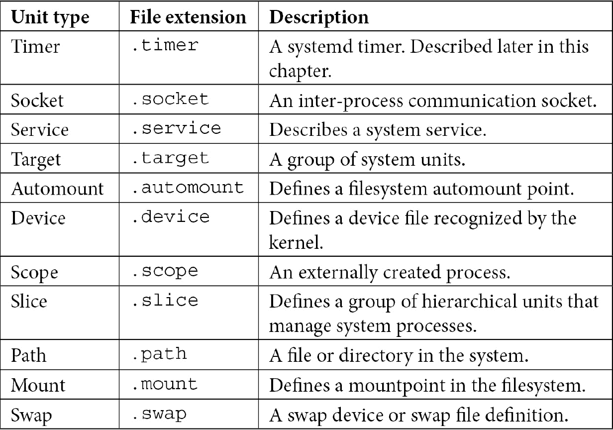

提示

不要被不同的`systemd`单位类型所压倒。一般来说，最常见的是**Service**、**Timer**、**Socket**和**Target**。

当然，这些单位文件应该被找到在一些特定的文件夹中：

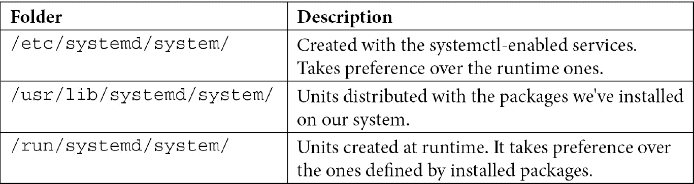

正如我们之前提到的关于套接字，当系统访问该路径时，路径、总线等单位文件被激活，允许在另一个服务需要它们时启动服务。这为降低系统启动时间增加了更多的优化。

通过这样，我们已经了解了*systemd*单位类型。现在，让我们专注于单位文件的文件结构。

## *systemd*单位文件结构

让我们通过一个例子来动手实践：一个系统已经部署并启用了`sshd`，我们需要在网络初始化后运行它，这样可以提供连接。

正如我们之前提到的，`systemd`使用单位文件，我们可以检查前面提到的文件夹，或者使用`systemctl list-unit-files`列出它们。记住，每个文件都是一个定义*systemd*应该做什么的配置文件；例如，`/usr/lib/systemd/system/chronyd.service`：

![图 4.1 - chronyd.service 的内容]

](img/B16799_04_001.jpg)

图 4.1 - chronyd.service 的内容

这个文件不仅定义了要启动的传统程序和 PID 文件，还定义了依赖关系、冲突和软依赖关系，这为`systemd`提供了足够的信息来决定正确的方法。

如果你熟悉"*inifiles*"，这个文件使用了那种方法，即使用方括号`[`和`]`表示部分，然后在每个部分的设置中使用`key=value`的配对。

部分名称是区分大小写的，因此如果不使用正确的命名约定，它们将无法被正确解释。

部分指令的命名如下：

+   [单位]

+   [安装]

每种类型都有额外的条目：

+   [服务]

+   [套接字]

+   [挂载]

+   [自动挂载]

+   [交换]

+   [路径]

+   [定时器]

+   [切片]

正如你所看到的，我们为每种类型都有特定的部分。如果我们执行`man systemd.unit`，它将为你提供示例，以及你正在使用的*systemd*版本的所有支持的值：

![图 4.2 - systemd.unit 的 man 页面]

](img/B16799_04_002.jpg)

图 4.2 - systemd.unit 的 man 页面

通过这样，我们已经审查了单位文件的文件结构。现在，让我们使用*systemctl*来实际管理服务的状态。

## 管理服务在启动时启动和停止

服务可以启用或禁用；也就是说，服务将或不会在系统启动时被激活。

如果您熟悉 RHEL 中以前可用的工具，通常会使用`chkconfig`根据其默认的`rc.d/`设置来定义服务的状态。

可以通过以下命令启用`sshd`等服务：

```
#systemctl enable sshd
```

也可以通过以下命令禁用：

```
#systemctl disable sshd
```

这将创建或删除`/etc/systemd/system/multi-user.target.wants/sshd.service`。注意路径中的`multi-user.target`，它相当于我们用来配置其他方法（如**initscripts**）的运行级别。

提示

尽管传统的`chkconfig sshd on/off`或`service start/stop/status/restart sshd`的用法是有效的，但最好习惯于本章中描述的`systemctl`方法。

前面的命令在启动时启用或禁用服务，但要执行即时操作，我们需要发出不同的命令。

要启动`sshd`服务，请使用以下命令：

```
#systemctl start sshd
```

要停止它，请使用以下命令：

```
#systemctl stop sshd
```

当然，我们也可以检查服务的状态。以下是通过`systemctl status sshd`查看`systemd`的示例：

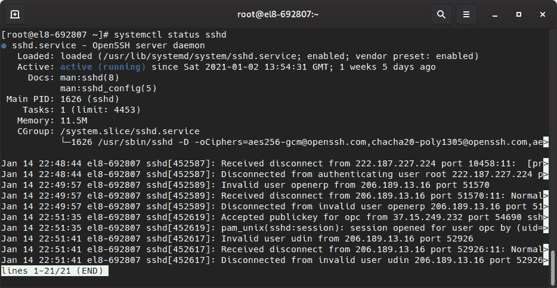

图 4.3 - sshd 守护程序的状态

此状态信息提供了有关定义服务的单元文件、其在启动时的默认状态、它是否正在运行、其 PID、其资源消耗的其他详细信息，以及服务的一些最近的日志条目，这在调试简单的服务启动故障时非常有用。

检查`systemctl list-unit-files`的输出是很重要的，因为它报告了系统中定义的单元文件，以及每个单元文件的当前状态和供应商预设。

现在我们已经介绍了如何启动/停止和检查服务的状态，让我们来管理实际的系统引导状态本身。

## 管理引导目标

我们在启动时定义的默认状态在谈论**运行级别**时很重要。

运行级别根据使用定义了一组预定义的服务；也就是说，它们定义了在使用特定功能时将启动或停止哪些服务。

例如，有一些运行级别用于定义以下内容：

+   **停止模式**

+   **单用户模式**

+   **多用户模式**

+   **网络化多用户**

+   **图形**

+   **重新启动**

这些运行级别允许在运行级别更改时启动/停止一组预定义的服务。当然，级别以前是基于彼此的，并且非常简单：

+   停止所有服务，然后停止或关闭系统。

+   单用户模式为一个用户启动一个 shell。

+   多用户模式在虚拟终端上启用常规登录守护程序。

+   网络化就像多用户，但网络已启动。

+   图形就像网络化，但通过显示管理器（`gdm`或其他）进行图形登录。

+   重新启动就像停止，但在处理服务结束时，它会发出重新启动而不是停止。

这些运行级别（以及系统启动时的默认运行级别）以前是在`/etc/inittab`中定义的，但文件占位符提醒我们以下内容：

```
# inittab is no longer used.
#
# ADDING CONFIGURATION HERE WILL HAVE NO EFFECT ON YOUR SYSTEM.
#
# Ctrl-Alt-Delete is handled by /usr/lib/systemd/system/ctrl-alt-del.target
#
# systemd uses 'targets' instead of runlevels. By default, there are two main targets:
#
# multi-user.target: analogous to runlevel 3
# graphical.target: analogous to runlevel 5
#
# To view current default target, run:
# systemctl get-default
#
# To set a default target, run:
# systemctl set-default TARGET.target
```

因此，通过对`systemd`进行此更改，现在可以检查可用的引导目标并定义它们的新方法。

我们可以通过列出此文件夹来找到可用的系统目标：

```
#ls -l /usr/lib/systemd/system/*.target
```

或者更正确地说，我们可以使用`systemctl`，如下所示：

```
#systemctl list-unit-files *.target
```

当您在系统上检查输出时，您会发现 0 到 6 的运行级别的一些兼容别名，这些别名与传统的运行级别提供兼容性。

例如，对于常规服务器使用，当您在没有图形模式下运行时，默认目标将是`multi-user.target`，当您使用图形模式时将是`graphical.target`。

我们可以按照`/etc/inittab`中的占位符的指示，通过执行以下命令来定义要使用的新运行级别：

```
#sysemctl set-default TARGET.target
```

我们可以使用以下命令验证活动状态：

```
#systemctl get-default
```

这就引出了下一个问题：*目标定义是什么样的*？让我们来看一下以下截图中的输出：

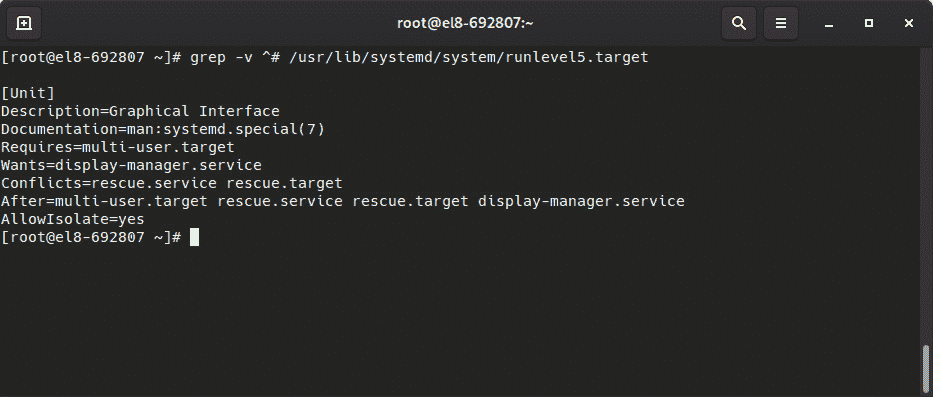

图 4.4 - 从其目标单元定义的运行级别 5 的内容

如您所见，它被设置为另一个目标（**multi-user.target**）的依赖项，并且对其他服务（如**display-manager.service**）有一些要求，还有其他冲突，只有在其他目标完成时才能达到该目标。

通过这种方式，`systemd`可以选择适当的服务启动顺序和达到配置的引导目标的依赖关系。

有了这些，我们已经了解了服务的状态，以及如何在启动时启动、停止和启用它，但是还有其他任务我们应该以周期性的方式在系统中执行。让我们进一步探讨这个话题。

# 使用 cron 和 systemd 进行任务调度

您将在本节中学习的技能将涉及为业务服务和维护安排周期性任务。

对于常规的系统使用，有一些需要定期执行的任务，范围从临时文件夹清理、更新缓存的刷新率，到与库存系统进行检查等等。

设置它们的传统方式是通过`cronie`软件包。

Cronie 实现了一个与传统的*vixie cron*兼容的守护程序，允许我们定义用户和系统 crontab。

Crontab 定义了必须执行的任务的几个参数。让我们看看它是如何工作的。

## 系统范围的 crontab

系统范围的 crontab 可以在`/etc/crontab`中定义，也可以在`/etc/cron.d`中的单独文件中定义。还存在其他附加文件夹，如`/etc/cron.hourly`、`/etc/cron.daily`、`/etc/cron.weekly`和`/etc/cron.monthly`。

在*每小时*、*每天*、*每周*或*每月*的文件夹中，您可以找到脚本或符号链接。当满足自上次执行以来的时间段（一小时、一天、一周、一个月）时，将执行该脚本。

相比之下，在`/etc/crontab`或`/etc/cron.d`以及用户 crontab 中，使用标准的作业定义。

通过指定与执行周期相关的参数、将执行作业的用户（除了用户 crontab 外）和要执行的命令来定义作业：

```
# Run the hourly jobs
SHELL=/bin/bash
PATH=/sbin:/bin:/usr/sbin:/usr/bin
MAILTO=root
01 * * * * root run-parts /etc/cron.hourly
```

通过查看标准的`/etc/crontab`文件，我们可以检查每个字段的含义：

```
# Example of job definition:
# .---------------- minute (0 - 59)
# |  .------------- hour (0 - 23)
# |  |  .---------- day of month (1 - 31)
# |  |  |  .------- month (1 - 12) OR jan,feb,mar,apr ...
# |  |  |  |  .---- day of week (0 - 6) (Sunday=0 or 7) OR sun,mon,tue,wed,thu,fri,sat
# |  |  |  |  |
# *  *  *  *  * user-name  command to be executed
```

基于此，如果我们检查初始示例`01 * * * * root run-parts /etc/cron.hourly`，我们可以推断如下：

+   每分钟运行`01`。

+   每小时运行。

+   每天运行。

+   每月运行。

+   每周的每一天运行。

+   以`root`身份运行。

+   执行`run-parts /etc/cron.hourly`命令。

简而言之，这意味着作业将以`root`用户身份在每小时的第一分钟运行。

有时，可能会看到一个指示，比如**/number*，这意味着作业将在该数字的倍数上执行。例如，**/3*将在第一列上每 3 分钟运行一次，在第二列上每 3 小时运行一次，依此类推。

我们可以通过 cron 执行从命令行执行的任何命令，并且默认情况下，输出将通过邮件发送给运行作业的用户。通常的做法是在 crontab 文件中定义将接收电子邮件的用户的`MAILTO`变量，或者将它们重定向到适当的日志文件以获取标准输出和标准错误（`stdout`和`stderr`）。

## 用户 crontab

与系统范围的**crontab**一样，用户可以定义自己的 crontab，以便用户执行任务。例如，这对于为人类用户或服务的系统帐户运行周期性脚本非常有用。

用户 crontab 的语法与系统范围的语法相同。但是，用户名的列不在那里，因为它总是作为定义 crontab 本身的用户执行。

用户可以通过`crontab -l`检查其 crontab：

```
[root@el8-692807 ~]# crontab -l
no crontab for root
```

可以通过编辑`crontab -e`来创建一个新的，这将打开一个文本编辑器，以便创建一个新的条目。

让我们通过创建一个条目来举例说明，就像这样：

```
*/2 * * * * date >> datecron
```

当我们退出编辑器时，它会回复以下内容：

```
crontab: installing new crontab
```

这将在`/var/spool/cron/`文件夹中创建一个文件，文件名为创建它的用户。它是一个文本文件，因此您可以直接检查其内容。

一段时间后（至少 2 分钟），我们将在我们的`$HOME`文件夹中有一个包含每次执行内容的文件（因为我们使用*追加*重定向；即`>>`）：

```
[root@el8-692807 ~]# cat datecron 
Mon Jan 11 21:02:01 GMT 2021
Mon Jan 11 21:04:01 GMT 2021
```

现在我们已经了解了传统的 crontab，让我们了解一下 systemd 的做事方式；也就是使用定时器。

## Systemd 定时器

除了常规的**Cron 守护程序**，cron 风格的 systemd 功能是使用**定时器**。定时器允许我们通过一个单元文件定义将要执行的作业。

我们可以使用以下代码检查系统中已经可用的定时器：

```
>systemctl list-unit-files *.timer
...
timers.target                          static
dnf-makecache.timer                    enabled
fstrim.timer                           disabled
systemd-tmpfiles-clean.timer           static
...
```

例如，我们来看一下`fstrim.timer`，它用于 SSD 驱动器在`/usr/lib/systemd/system/fstrim.timer`执行修剪：

```
[Unit]
Description=Discard unused blocks once a week
Documentation=man:fstrim
..
[Timer]
OnCalendar=weekly
AccuracySec=1h
Persistent=true
…
[Install]
WantedBy=timers.target
```

上述定时器设置了每周执行`fstrim.service`：

```
[Unit]
Description=Discard unused blocks

[Service]
Type=oneshot
ExecStart=/usr/sbin/fstrim -av
```

正如`fstrim -av`命令所示，我们只执行一次。

服务定时器与服务本身一样，作为单元文件的一个优点是，它可以通过`/etc/cron.d/`文件与常规的*cron*守护程序一起部署和更新，这由*systemd*处理。

现在我们对如何安排任务有了更多了解，但要获得完整的图片，安排总是需要适当的时间，所以下面我们将介绍这一点。

# 学习使用 chrony 和 NTP 进行时间同步

在本节中，您将了解**时间同步**的重要性以及如何配置服务。

对于连接的系统，保持与时间相关的真相是很重要的（考虑银行账户、收款转账、出款支付等，这些都必须被正确地时间戳和排序）。此外，考虑用户连接之间的日志跟踪、发生的问题等；它们都需要同步，以便我们可以在涉及到的所有不同系统之间进行诊断和调试。

您可能会认为在系统配置时定义的系统时钟应该是正常的，但仅仅设置系统时钟是不够的，因为时钟往往会漂移；内部电池可能导致时钟漂移或甚至重置，甚至强烈的 CPU 活动也会影响它。为了保持时钟的准确性，它们需要定期与修正漂移并尝试预测未来漂移的参考时钟同步。

系统时钟可以与*GPS*设备同步，例如，或者更容易地与其他连接到更精确时钟的系统同步（其他 GPS 设备、原子钟等）。**网络时间协议**（**NTP**）是一种互联网协议，通过 UDP 用于维护客户端和服务器之间的通信。

提示

NTP 通过层级来组织服务器。层级 0 设备是 GPS 设备或原子钟，直接向服务器发送信号，层级 1 服务器（主服务器）连接到层级 0 设备，层级 2 服务器连接到层级 1 服务器，依此类推...这种层级结构允许我们减少对更高层级服务器的使用，同时为我们的系统保持可靠的时间来源。

客户端连接到服务器，并比较接收到的时间以减少网络延迟的影响。

让我们看看 NTP 客户端是如何工作的。

## NTP 客户端

在 RHEL8 中，*chrony*在启用时充当服务器和客户端（通过`chronyc`命令），并且具有一些功能，使其适用于当前的硬件和用户需求，例如波动的网络（笔记本电脑挂起/恢复或不稳定的连接）。

一个有趣的特性是*chrony*在初始同步后不会**step**时钟，这意味着时间不会*跳跃*。相反，系统时钟会以更快或更慢的速度运行，以便在一段时间后，它将与其使用的参考时钟同步。这使得时间从操作系统和应用程序的角度来看是连续的：秒针比起钟表来说要快或慢，直到它们与参考时钟匹配。

Chrony 通过`/etc/chrony.conf`进行配置，并充当客户端，因此它连接到服务器以检查它们是否有资格成为时间源。传统的**server**指令和**pool**之间的主要区别在于后者可以接收多个条目，而前者只使用一个。可以有多个服务器和池，因为实际上，一旦删除了重复项，服务器将被添加到可能的源列表中。

对于*pool*或*server*指令，有几个可用的选项（在`man chrony.conf`中有描述），例如`iburst`，它可以加快检查速度，以便它们可以快速过渡到同步状态。

可以使用`chronyc sources`来检查实际的时间源：

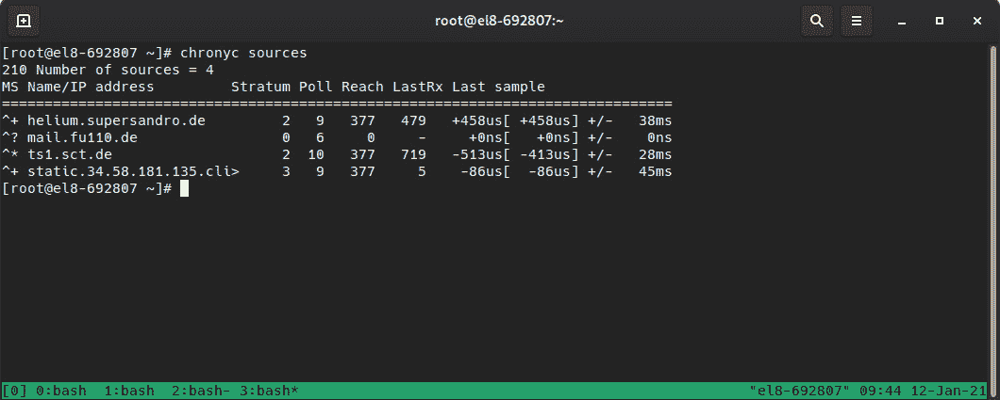

图 4.5 – chronyc sources 输出

正如我们所看到的，我们可以根据第一列（**M**）知道每个服务器的状态是什么：

+   **^**：这是一个服务器

+   **=**：这是一个对等体

在第二列（S）中，我们可以看到每个条目的不同状态：

+   *****：这是我们当前的同步服务器。

+   **+**：这是另一个可接受的时间源。

+   **?**：用于指示已失去网络连接的源。

+   **x**：此服务器被认为是虚假的滴答器（与其他来源相比，其时间被认为是不一致的）。

+   **~**：具有高变异性的源（它也会在守护程序启动期间出现）。

因此，我们可以看到我们的系统连接到一个正在考虑`ts1.sct.de`作为参考的服务器，这是一个 stratum 2 服务器。

可以通过`chronyc tracking`命令检查更详细的信息：

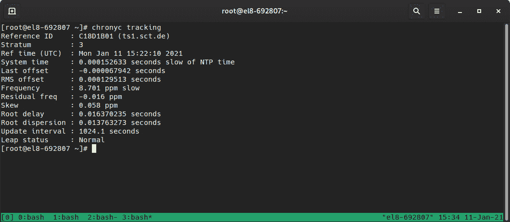

图 4.6 – Chronyc 跟踪输出

这提供了关于我们的时钟和参考时钟的更详细信息。前面截图中的每个字段具有以下含义：

+   **字段**：描述。

+   **参考 ID**：系统已同步的服务器的 ID 和名称/IP。

+   **Stratum**：我们的 stratum 级别。在此示例中，我们的同步服务器是一个 stratum 3 时钟。

+   **参考时间**：上次处理参考的时间。

+   **系统时间**：在正常模式下运行时（没有时间跳跃），这指的是系统与参考时钟的偏离。

+   **最后偏移**：最后一次时钟更新的估计偏移。如果是正数，这表示我们的本地时间超前于我们的来源。

+   **RMS 偏移**：偏移值的长期平均值。

+   **频率**：如果*chronyd*不修复它，系统时钟的错误率，以百万分之一表示。

+   **剩余频率**：反映当前参考时钟测量之间的任何差异。

+   **偏差**：频率的估计误差。

+   **根延迟**：到 stratum -1 同步服务器的总网络延迟。

+   **根分散**：通过连接到我们同步的 stratum -1 服务器的所有计算机累积的总分散。

+   **更新间隔**：最后两次时钟更新之间的间隔。

+   `/usr/share/doc/program/`），等等。例如，关于此处列出的每个字段的更详细信息可以通过`man chronyc`命令找到。

要配置客户端的其他选项，除了安装时提供的选项或通过 kickstart 文件提供的选项，我们可以编辑`/etc/chrony.cnf`文件。

让我们学习如何将我们的系统转换为我们网络的 NTP 服务器。

## NTP 服务器

正如我们之前介绍的，*chrony*也可以配置为您的网络的服务器。在这种模式下，我们的系统将向其他主机提供准确的时钟信息，而不消耗来自更高层级服务器的外部带宽或资源。

这个配置也是通过`/etc/chrony.conf`文件进行的，我们将在这里添加一个新的指令；即`allow`：

```
# Allow NTP client access from all hosts
allow all
```

此更改使*chrony*能够监听所有主机请求。或者，我们可以定义一个子网或主机来监听，例如`allow 1.1.1.1`。可以使用多个指令来定义不同的子网。另外，您可以使用*deny*指令来阻止特定主机或子网访问我们的 NTP 服务器。

服务时间从我们的服务器已经与之同步的基础开始，以及一个外部 NTP 服务器，但让我们考虑一个没有连接性的环境。在这种情况下，我们的服务器将不连接到外部来源，也不会提供时间。

*chrony*允许我们为我们的服务器定义一个虚假的层级。这是通过配置文件中的`local`指令完成的。这允许守护程序获得更高的本地层级，以便它可以向其他主机提供时间；例如：

```
local stratum 3 orphan
```

通过这个指令，我们将本地层级设置为 3，并使用**orphan**选项，这将启用一个特殊模式，在这个模式下，所有具有相同本地层级的服务器都会被忽略，除非没有其他来源可供选择，且其参考 ID 小于本地 ID。这意味着我们可以在我们的断开网络中设置几个 NTP 服务器，但只有一个会成为参考。

现在我们已经涵盖了时间同步，我们将深入资源监视。稍后，我们将研究日志记录。所有这些都与我们系统的时间参考有关。

# 检查空闲资源 - 内存和磁盘（free 和 df）

在这一部分，您将检查系统**资源**的可用性，例如**内存**和**磁盘**。

保持系统平稳运行意味着使用监视，以便我们可以检查服务是否正在运行，以及系统是否为它们提供了资源来执行它们的任务。

有一些简单的命令可以用来监视最基本的用例：

+   磁盘

+   CPU

+   内存

+   网络

这包括几种监视方式，例如一次性监视、连续监视，或者甚至在一段时间内进行诊断性能更好。

## 内存

内存可以通过`free`命令进行监视。它提供了有关可用和正在使用多少*RAM*和*SWAP*的详细信息，这也表明了多少内存被共享、缓冲或缓存使用。

Linux 倾向于使用所有可用的内存；任何未使用的 RAM 都会被指向缓存或缓冲区，以及未被使用的内存页面。如果可用，这些将被交换到磁盘上：

```
# free
              total        used        free      shared  buff/cache   available
Mem:         823112      484884       44012        2976      294216      318856
Swap:       8388604      185856     8202748
```

例如，在上面的输出中，我们可以看到系统总共有 823 MB 的 RAM，并且它正在使用一些交换空间和一些内存用于缓冲。这个系统没有大量交换，因为它几乎处于空闲状态（我们将在本章后面检查负载平均值），所以我们不应该担心它。

当 RAM 使用量很高且没有更多的交换空间可用时，内核会包括一种保护机制，称为**OOM-Killer**。它根据执行时间、资源使用情况等确定系统中应终止哪些进程以恢复系统，使其正常运行。然而，这是有代价的，因为内核知道可能已经失控的进程。然而，杀手可能会杀死数据库和 Web 服务器，并使系统处于不稳定状态。对于生产服务器，有时候典型的做法是，不是让 OOM-Killer 开始以不受控制的方式杀死进程，而是调整一些关键进程的值，使它们不被杀死，或者导致系统崩溃。

系统崩溃用于收集可以稍后通过包含导致崩溃的原因以及可以进行诊断的内存转储的调试信息。

我们将在*第十六章*中回到这个话题，*使用 tuned 进行内核调优和管理性能配置文件*。让我们继续检查正在使用的磁盘空间。

## 磁盘空间

可以通过`df`检查磁盘空间，它为每个文件系统提供数据输出。这表示文件系统及其大小、可用空间、利用率百分比和挂载点。

让我们在我们的示例系统中检查一下：

```
> df
Filesystem                    1K-blocks     Used Available Use% Mounted on
devtmpfs                         368596        0    368596   0% /dev
tmpfs                            411556        0    411556   0% /dev/shm
tmpfs                            411556    41724    369832  11% /run
tmpfs                            411556        0    411556   0% /sys/fs/cgroup
/dev/mapper/rhel-root          40935908 11026516  29909392  27% 
/dev/sda2                       1038336   517356    520980  50% /boot
/dev/sda1                        102182     7012     95170   7% /boot/efi
tmpfs                             82308        0     82308   0% /run/user/1000
```

通过使用这个工具，可以轻松关注利用率较高且剩余空间较少的文件系统，以防止问题发生。

重要提示

如果文件正在被写入，比如由一个进程记录其输出，那么删除文件只会将文件从文件系统中取消链接，但由于进程仍然保持文件句柄打开，直到进程停止，空间才会被回收。在必须尽快释放磁盘空间的紧急情况下，最好通过重定向清空文件，比如`echo "" > filename`。这样可以在进程仍在运行时立即恢复磁盘空间。使用`rm`命令会要求进程被完成。

接下来我们将检查 CPU 使用率。

## CPU

在监视 CPU 方面，我们可以利用多种工具，比如`ps`：

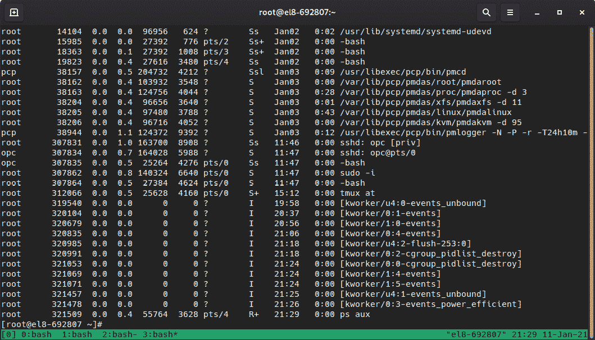

图 4.7 - ps aux 命令的输出（系统中的每个进程）

`ps`命令是检查正在运行的进程以及资源消耗情况的事实标准。

对于任何其他命令，我们都可以写很多关于可以使用的所有不同命令参数的内容（所以，再次，查看 man 页面以获取详细信息），但通常来说，尽量了解它们的基本用法或对你更有用的用法。其他情况，请查看手册。例如，`ps aux`提供了足够的信息供正常使用（系统中的每个进程）。

`top`工具，如下面的截图所示，会定期刷新屏幕，并可以对运行中的进程进行排序，比如 CPU 使用率、内存使用率等。此外，`top`还显示了关于内存使用情况、负载平均、运行中的进程等的五行摘要：

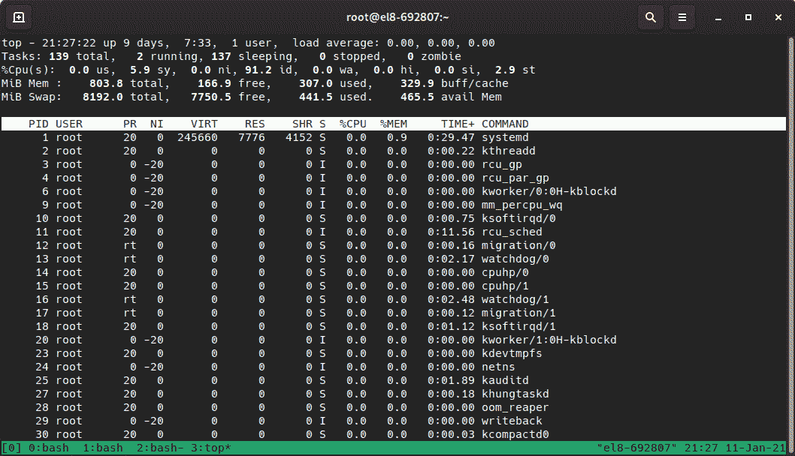

图 4.8 - 在我们的测试系统上执行 top 命令

CPU 使用率并不是唯一可能使系统变得缓慢的因素。现在，让我们稍微了解一下负载平均指标。

## 负载平均

负载平均通常以三个数字的形式提供，比如`负载平均：0.81，1.00，1.17`，分别是 1、5 和 15 分钟的平均值。这表示系统有多忙；数值越高，响应越差。每个时间段比较的值给我们一个概念，即系统负载是增加的（1 或 5 分钟内的值较高，15 分钟内的值较低），还是正在减少（15 分钟内的值较高，5 和 1 分钟内的值较低），因此这成为了一个快速找出是否发生了什么或者正在发生的方法。如果系统通常具有较高的负载平均值（超过 1.00），那么深入挖掘可能的原因（对其功率需求过高，可用资源不多等）是一个好主意。

现在我们已经介绍了基础知识，让我们继续看一些额外的检查，我们可以对系统资源的使用进行。

## 其他监控工具

例如，对于`ifconfig`，可以匹配接收到的传输包、接收到的包、错误等的值。

当目标是执行更完整的监控时，我们应该确保`/var/log/sa/`。

每天记录和存储的历史数据（`##`）可以在`/var/log/sa/sa##`和`/var/log/sa/sar##`中查询，以便我们可以与其他天进行比较。通过以更高的频率运行数据收集器（由*systemd*定时器执行），我们可以在调查问题时增加特定时期的细粒度。

然而，*sar*文件的外观显示了大量的数据：

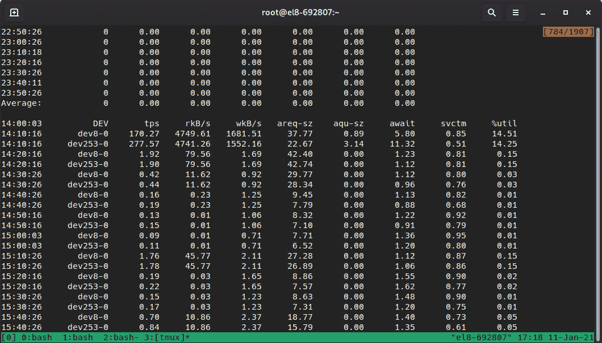

图 4.9 - 示例系统上/var/log/sar02 的内容

在这里，我们可以看到 8-0 设备每秒有 170.27 次事务和 14.51%的利用率。在这种情况下，设备的名称使用主/次的值，我们可以在`/dev/`文件夹中检查。我们可以通过运行`ls -l /dev/*|grep 8`来查看，如下面的截图所示：

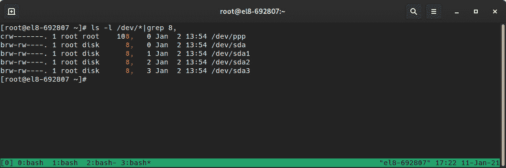

图 4.10 - 用于定位与主 8 和次 0 对应的设备的/dev/目录列表

在这里，我们可以看到这对应于`/dev/sda`上的完整硬盘统计信息。

提示

通过**sar**处理数据是了解系统运行情况的好方法，但由于*sysstat*软件包在 Linux 中已经存在很长时间，因此有一些工具，如[`github.com/mbaldessari/sarstats`](https://github.com/mbaldessari/sarstats)，可以帮助我们处理记录的数据并以 PDF 文件的形式呈现图形化。

在下图中，我们可以看到不同驱动器的系统服务时间，以及系统崩溃时的标签。这有助于我们识别该点的系统活动：

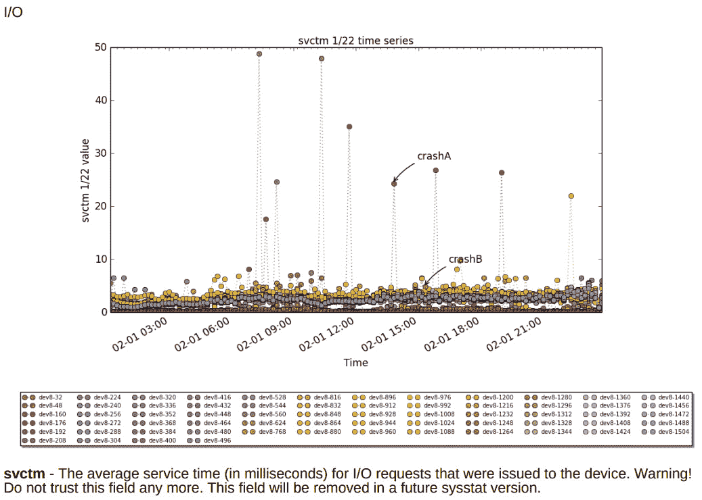

图 4.11 - 他们示例 PDF 中的磁盘服务时间的 Sarstats 图形，网址为[`acksyn.org/software/sarstats/sar01.pdf`](https://acksyn.org/software/sarstats/sar01.pdf )

现代监控系统资源的工具已经发展，**Performance Co-Pilot**（**pcp**和可选的**pcp-gui**软件包）可以设置更强大的选项。只需记住，pcp 要求我们还在系统上启动数据收集器。

RHEL8 还包括**cockpit**，在进行服务器安装时默认安装。该软件包提供了一组工具，可以通过扩展其功能的插件将其作为其他产品的一部分。

cockpit 提供的 Web 服务可以在主机 IP 的 9090 端口上访问，因此您应该访问`https://localhost:9090`以获取登录屏幕，以便我们可以使用系统凭据登录。

重要提示

如果未安装或不可用 cockpit，请确保执行`dnf install cockpit`来安装该软件包，并使用`systemctl enable --now cockpit.socket`启动服务。如果您远程访问服务器，而不是使用`localhost`，请在允许防火墙连接之后使用服务器主机名或 IP 地址进行连接`firewall-cmd --add-service=cockpit`，如果之前未这样做。

登录后，我们将看到一个显示相关系统信息和链接到其他部分的仪表板，如下面的截图所示：

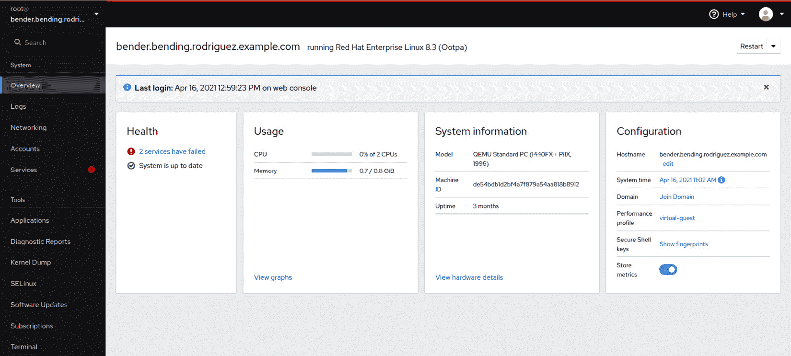

图 4.12 - 登录系统仪表板后的 Cockpit 屏幕

正如您所看到的，*cockpit*包括几个选项卡，可用于查看系统状态，甚至执行一些管理任务，如**SELinux**、软件更新、订阅等。

例如，我们可以查看性能图表，如下面的截图所示：

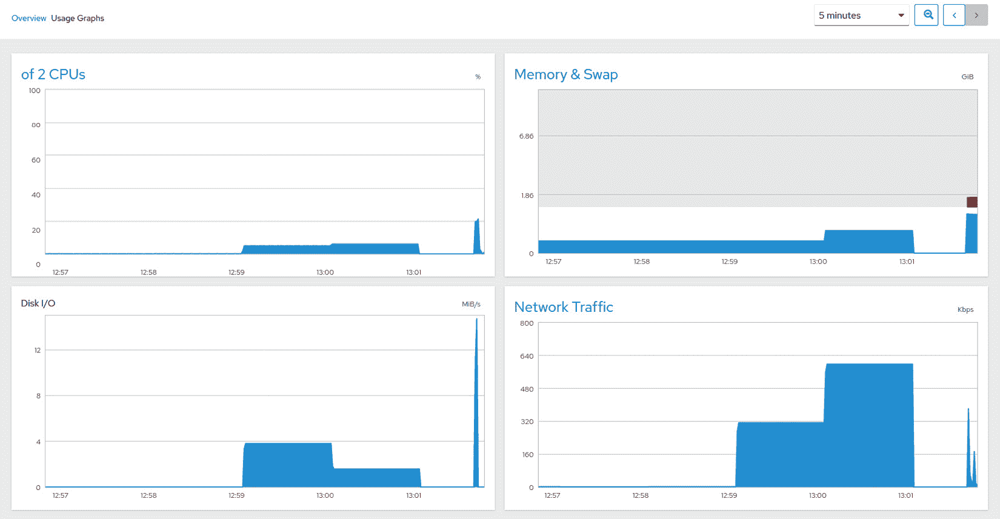

图 4.13 - 仪表板中的 Cockpit 图表

Cockpit 允许我们从图形界面检查服务状态、软件包升级状态以及其他配置设置，还可以远程连接到其他系统。这些可以从左侧的侧边菜单中选择。

有更适合大规模部署监控和管理的工具，比如*Ansible*和*Satellite*，因此熟悉我们用于故障排除和简单脚本构建的工具非常重要。这使我们能够结合到目前为止学到的知识，快速生成需要我们注意的事项的提示。

通过这样，我们已经介绍了一些检查资源使用情况的基础知识。现在，让我们看看如何查找有关正在运行的服务和我们可以审查的错误的信息。

# 查找日志，使用 journald 和阅读日志文件，包括日志保存和轮换

在本节中，您将学习如何通过日志审查系统的状态。

在本章的前面部分，我们学习了如何通过*systemd*管理系统服务，检查它们的状态和检查它们的日志。传统上，不同的守护程序和系统组件用于在`/var/log/`文件夹下创建文件，这些文件基于守护程序或服务的名称。如果服务用于创建多个日志，则会在服务的文件夹内创建这些日志（例如**httpd**或**samba**）。

系统日志守护程序`rsyslogd`有一个新的*systemd*伙伴，名为`systemd-journald.service`，它也存储日志，但它不是使用传统的纯文本格式，而是使用二进制格式，可以通过`journalctl`命令查询。

熟悉阅读日志文件非常重要，因为这是故障排除的基础，因此让我们学习一下一般日志记录以及如何使用它。

日志包含生成它的服务的状态信息。它们可能具有一些常见的格式，并且通常可以配置，但它们倾向于使用一些常见的元素，例如以下内容：

+   时间戳

+   生成条目的模块

+   消息

以下是一个例子：

```
Jan 03 22:36:47 el8-692807 sshd[50197]: Invalid user admin from 49.232.135.77 port 47694
```

在这种情况下，我们可以看到有人尝试以`admin`用户从 IP 地址`49.232.135.77`登录到我们的系统。

我们可以将该事件与其他日志相关联，例如通过`journalctl -u systemd-logind`查看登录子系统的日志。在这个例子中，我们找不到`admin`用户的任何登录（这是预期的，因为在这个系统中未定义`admin`用户）。

此外，我们还可以看到主机名`el8-692807`，生成它的服务`sshd`，`50197`和该服务记录的消息。

除了*journalctl*，我们还可以查看其他日志，以便在希望检查系统健康状况时使用。让我们以`/var/log/messages`为例：

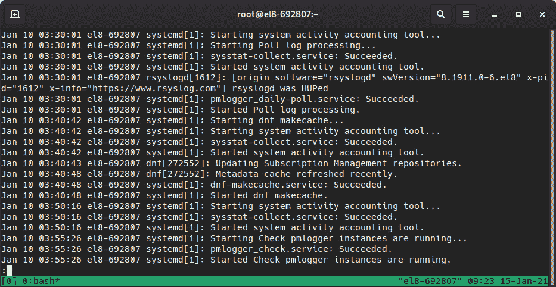

图 4.14 - /var/log/messages 摘录

在这个例子中，我们可以看到系统在遵循类似初始行的输出时运行了一些命令。例如，在前面的例子中，我们可以看到`sysstat`每 10 分钟执行一次，以及`dnf`缓存已更新。

让我们看一下标准系统安装中可用的重要日志列表（请注意，文件名是相对于`/var/log`文件夹的）：

+   `boot.log`：存储系统在启动过程中发出的消息。它可能包含用于提供带颜色的输出的转义代码。

+   `audit/audit.log`：包含由内核审计子系统生成的存储消息。

+   `secure`：包含安全相关的消息，比如`sshd`登录尝试失败。

+   `dnf.log`：由 DNF 软件包管理器生成的日志，例如缓存刷新。

+   `firewalld`：由*firewalld*守护程序生成的输出。

+   `lastlog`：这是一个包含有关最近登录系统的用户信息的二进制文件（可通过`last`命令查询）。

+   `messages`：默认的日志记录设施。这意味着任何不是特定日志的内容都会在这里。通常，这是开始检查系统发生了什么的最佳位置。

+   `maillog`：邮件子系统的日志。启用后，它会尝试传递消息。接收到的任何消息都将存储在这里。通常，配置服务器的出站邮件，以便可以传递系统警报或脚本输出。

+   `btmp`：系统访问失败的二进制日志。

+   `wtmp`：系统访问的二进制日志。

+   `sa/sar*`：*sysstat*实用程序的文本日志（二进制文件，命名为*sa*，加上日期编号，通过夜间的*cron*作业转换）。

根据已安装的服务、使用的安装方法等，可能存在其他日志文件。熟悉可用的日志非常重要，当然，要审查它们的内容，以了解消息的格式、每天创建多少个日志以及它们产生了什么样的信息。

利用已记录的信息，我们将获得有关如何配置每个单独的守护进程的提示。这使我们能够调整日志级别，从仅显示错误到更详细地调试问题。这意味着我们可以配置所需的日志旋转，以避免因为日志占用了所有空间而导致系统稳定性受到风险。

## 日志旋转

在正常的系统操作期间，有许多守护进程在使用，并且系统本身会生成用于故障排除和系统检查的日志。

一些服务可能允许我们根据日期定义要写入的日志文件，但通常的标准是将日志记录到`/var/log`目录中类似守护进程名称的文件中；例如，`/var/log/cron`。写入同一文件将导致文件不断增长，直到存储日志的驱动器被填满，这在一段时间后（有时在公司定义的政策下）可能不再有意义。

简化日志旋转过程的`cron`条目。它是通过`/etc/logrotate.conf`配置的，并且每天执行一次，如下所示：

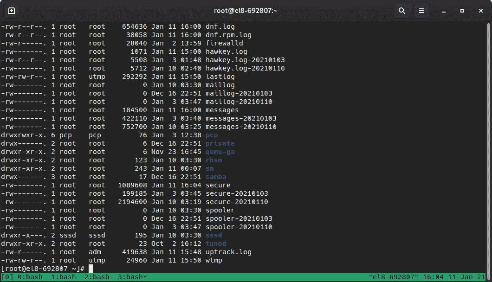

图 4.15 - 日志和旋转日志的示例清单（使用日期扩展）

如果我们检查配置文件的内容，我们会发现它包括一些文件定义，可以直接在那里或通过`/etc/logrotate.d/`文件夹中的附加文件中定义，这样每个程序都可以在安装、删除或更新软件包时满足自己的要求，而不会影响其他程序。

为什么这很重要？因为，如果您还记得本章早些时候的一些建议（关于磁盘空间），如果`logrotate`只是删除文件并创建新文件，实际的磁盘空间将不会被释放，并且写入日志的守护进程将继续写入它正在写入的文件（通过文件句柄）。为了克服这一点，每个定义文件可以定义一个后旋转命令。这会向日志旋转过程发出信号，以便它可以关闭，然后重新打开用于记录的文件。一些程序可能需要像`kill -SIGHUP PID`这样的信号，或者在执行时需要特殊参数，比如`chronyc cyclelogs`。

有了这些定义，`logrotate`将能够为每个服务应用配置，并同时保持服务在一个健全的状态下运行。

配置还可以包括特殊指令，例如以下内容：

+   `missingok`

+   `nocreate`

+   `nopytruncate`

+   `notifempty`

您可以在`logrotate.conf`中找到更多关于它们（以及其他内容）的信息（是的，一些软件包还包括配置文件的 man 页面，因此尝试检查`man logrotate.conf`以获取完整的详细信息！）。

主文件中剩下的一般配置允许我们定义一些常见的指令，比如要保留多少天的日志，是否要在旋转日志文件的文件扩展名中使用日期，是否要在旋转日志上使用压缩，我们希望多频繁地执行旋转等等。

让我们看一些例子。

以下示例将在“每日”基础上旋转，保留`30`个旋转日志，对它们进行“压缩”，并在其尾部文件名中使用“日期”作为扩展名。

```
rotate 30
daily
compress
dateext
```

在这个例子中，它将在“每周”基础上保留`4`个旋转日志（因此是 4 周），并对日志进行“压缩”，但对每个旋转日志使用序列号（这意味着每次旋转发生时，以前旋转的日志的序列号也会增加）：

```
rotate 4
weekly
compress
```

这种方法的一个优点（不使用`dateext`）是日志命名约定是可预测的，因为我们有`daemon.log`作为当前日志，`daemon.1.log`作为以前的日志，依此类推。这使得编写日志解析和处理脚本变得更容易。

# 总结

在本章中，我们了解了`systemd`以及它如何以优化的方式负责引导所需的系统服务。我们还学习了如何检查服务的状态，如何启用、禁用、启动和停止它们，以及如何使系统引导到我们引导系统的不同目标中。

时间同步被介绍为一个必不可少的功能，它确保我们的服务正常运行。它还允许我们确定系统时钟的状态，以及如何作为网络的时钟服务器。

我们还使用系统工具来监视资源使用情况，学习如何检查系统创建的日志以了解不同工具的功能状态，以及如何确保日志被正确维护，以便在不再相关时丢弃旧条目。

在下一章中，我们将深入探讨使用不同用户、组和权限来保护系统。
