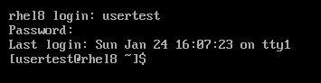
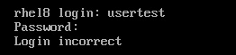
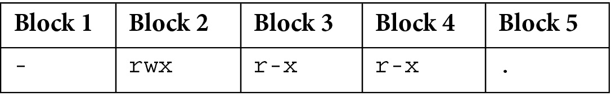
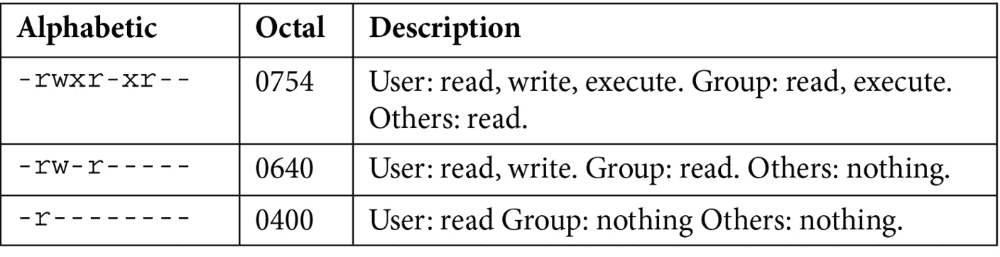

# 第五章：*第五章*：使用用户、用户组和权限保护系统

安全性是管理系统的关键部分，了解安全概念以便为任何系统管理员提供正确的资源访问权限是必要的。

在本章中，我们将回顾`sudo`中的安全基础知识，作为为系统中不同用户分配管理员权限的一种方式（甚至禁用 root 帐户）。我们还将深入研究文件权限以及如何改变它们，使用扩展功能来使命令以不同的用户或组运行，或者简化目录中的组协作。

我们将涵盖以下主题：

+   创建、修改和删除本地用户账户和用户组

+   管理用户组和审查分配

+   调整密码策略

+   为管理任务配置 sudo 访问权限

+   检查、审查和修改文件权限

+   使用特殊权限

让我们开始学习权限和安全性，包括用户账户和用户组。

# 创建、修改和删除本地用户账户和用户组

当准备系统供用户访问时，系统管理员必须做的第一项任务之一是为访问系统的人创建新的用户帐户。在本节中，我们将回顾如何创建和删除本地帐户，以及如何将它们分配给用户组。

第一步是在系统中创建一个新用户帐户。这是通过使用`useradd`命令完成的。让我们通过运行以下命令将`user01`添加到系统中：

```
[root@rhel8 ~]# useradd user01
[root@rhel8 ~]# grep user01 /etc/passwd
user01:x:1001:1001::/home/user01:/bin/bash
[root@rhel8 ~]# id user01
uid=1001(user01) gid=1001(user01) groups=1001(user01)
```

有了这个，用户就创建好了。

重要提示

为了能够添加用户，我们需要管理员权限。在当前配置中，我们通过以`root`身份运行命令来实现这一点。

帐户是使用系统中配置的默认选项创建的，例如以下选项：

+   `su` as `root`. We will see how to add a password to the user next.

+   `user01`，UID 为`1001`。

+   `1001`。

+   **描述**：在创建用户时未添加描述。此字段为空白。

+   `home`目录创建在`/home/$USER`中，在本例中为`/home/user01`。这将是用户的默认和主目录，也是存储他们个人偏好和文件的地方。初始内容从`/etc/skel`复制而来。

+   `bash`。

提示

创建新用户时应用的默认选项在`/etc/default/useradd`文件中定义。

用户创建后，我们可以通过以`root`身份运行`passwd`命令，后跟要更改的用户名，来添加（或更改）密码：

```
[root@rhel8 ~]# passwd user01
Changing password for user user01.
New password: redhat
BAD PASSWORD: The password is shorter than 8 characters
Retype new password: redhat
passwd: all authentication tokens updated successfully
```

现在用户有了新分配的密码。请注意两件事：

+   用户`root`可以更改任何用户的密码，而无需知道先前的密码（完全重置密码）。当用户度假回来后不记得密码时，这是很有用的。

+   在示例中，我们显示了分配的密码`redhat`，但屏幕上没有显示。密码太简单，不符合默认的复杂性标准，但是作为`root`，我们仍然可以分配它。

让我们使用之前学过的`id`命令来检查新用户：

```
[root@rhel8 ~]# id user01
uid=1001(user01) gid=1001(user01) groups=1001(user01)
```

在本节中采取的步骤之后，我们现在在系统中有了用户，并且可以使用。我们可以用`useradd`自定义用户创建的主要选项如下：

+   `-u`或`--uid`：为用户分配特定的 UID。

+   `-g`或`--gid`：为用户分配一个主组。可以通过编号（GID）或名称指定。该组需要先创建。

+   `-G`或`--groups`：通过提供逗号分隔的列表使用户成为其他组的一部分。

+   `-c`或`--comment`：为用户提供描述，如果要使用空格，则在引号之间指定。

+   `-d`或`--home-dir`：为用户定义主目录。

+   `-s`或`--shell`：为用户分配自定义 shell。

+   `-p`或`--password`：提供密码给用户的一种方法。密码应该已经加密才能使用这种方法。建议*不*使用此选项，因为有捕获加密密码的方法。请改用`passwd`。

+   `-r`或`--system`：创建系统账户而不是用户账户。

如果我们需要更改用户的任何属性，例如描述，我们可以使用`usermod`工具。让我们将描述修改为`user01`：

```
[root@rhel8 ~]# usermod -c "User 01" user01
[root@rhel8 ~]# grep user01 /etc/passwd
user01:x:1001:1001:User 01:/home/user01:/bin/bash
```

`usermod`命令使用与`useradd`相同的选项。现在定制您当前的用户将会很容易。

让我们以创建`user02`为例，演示如何使用选项：

```
[root@rhel8 ~]# useradd --uid 1002 --groups wheel \
--comment "User 02" --home-dir /home/user02 \
--shell /bin/bash user02
[root@rhel8 ~]# grep user02 /etc/passwd
user02:x:1002:1002:User 02:/home/user02:/bin/bash
[root@rhel8 ~]# id user02
uid=1002(user02) gid=1002(user02) groups=1002(user02),10(wheel)
```

提示

当命令行太长时，可以添加字符`\`，然后按*Enter*并在新行上继续命令。

现在我们知道如何创建用户，但我们可能也需要创建一个组并将我们的用户添加到其中。让我们使用`groupadd`命令创建`finance`组：

```
[root@rhel8 ~]# groupadd finance
[root@rhel8 ~]# grep finance /etc/group
finance:x:1003:
```

我们可以将`user01`和`user02`用户添加到`finance`组：

```
[root@rhel8 ~]# usermod -aG finance user01
[root@rhel8 ~]# usermod -aG finance user02
[root@rhel8 ~]# grep finance /etc/group
finance:x:1003:user01,user02
```

重要提示

我们使用`-aG`选项将用户添加到组中，而不是修改用户所属的组。

一旦我们知道如何创建用户和组，让我们看看如何使用`userdel`命令删除它们：

```
[root@rhel8 ~]# userdel user01
[root@rhel8 ~]# grep user01 /etc/passwd
[root@rhel8 ~]# id user01
id: 'user01': no such user
[root@rhel8 ~]# grep user02 /etc/passwd
user02:x:1002:1002:User 02:/home/user02:/bin/bash
[root@rhel8 ~]# id user02
uid=1002(user02) gid=1002(user02) groups=1002(user02),10(wheel),1003(finance)
[root@rhel8 ~]# ls /home/
user  user01  user02
[root@rhel8 ~]# rm -rf /home/user01/
```

如您所见，我们需要手动删除`home`目录。这种删除用户的方式很好，如果我们想保留其数据以备将来使用。

要完全删除用户，我们应用选项`-r`。让我们尝试使用`user02`：

```
[root@rhel8 ~]# userdel -r user02
[root@rhel8 ~]# ls /home/
user  user01
[root@rhel8 ~]# grep user02 /etc/passwd
[root@rhel8 ~]# id user02
id: 'user02': no such user
```

现在让我们使用`groupdel`命令删除`finance`组：

```
[root@rhel8 ~]# groupdel finance
[root@rhel8 ~]# grep finance /etc/group
```

正如我们所见，简单易行地在 RHEL 中创建用户和组并进行简单分配。在下一节中，让我们更深入地了解如何管理组和对其进行分配。

# 管理组和审查分配

我们已经看到如何使用`groupadd`创建组，并使用`groupdel`删除组。让我们看看如何使用`groupmod`修改已创建的组。

让我们创建一个要操作的组。我们将通过运行以下命令创建拼写错误的`acounting`组：

```
[root@rhel8 ~]# groupadd -g 1099 acounting
[root@rhel8 ~]# tail -n1 /etc/group
acounting:x:1099: 
```

您看到我们在名称上犯了一个错误，没有拼写成`accounting`。我们甚至可能已经向其中添加了一些用户账户，我们需要修改它。我们可以使用`groupmod`并运行以下命令来这样做：

```
[root@rhel8 ~]# groupmod -n accounting acounting
[root@rhel8 ~]# tail -n1 /etc/group
accounting:x:1099:
```

现在我们已经看到了如何修改组名。我们可以使用`-g`选项修改不仅名称，还有 GID：

```
[root@rhel8 ~]# groupmod -g 1111 accounting
[root@rhel8 ~]# tail -n1 /etc/group
accounting:x:1111:
```

我们可以通过运行`groups`命令来查看分配给用户的组：

```
[root@rhel8 ~]# groups user
user : user wheel
```

有了这个，我们已经准备好在 Linux 系统中管理组和用户。让我们继续讨论密码策略。

# 调整密码策略

如*第三章*中提到的，*基本命令和简单的 Shell 脚本*，用户存储在`/etc/passwd`文件中，而加密密码存储在`/etc/shadow`文件中。

提示

哈希算法是这样做的，它从提供的数据（即文件或单词）生成一串精确的字符，或哈希。它以一种方式进行，以便它总是从相同的原始数据生成相同的哈希，但是几乎不可能从哈希中重新创建原始数据。这就是为什么它们用于存储密码或验证下载文件的完整性。

让我们通过以`root`身份运行`grep`用户对`/etc/shadow`进行查找来看一个例子：

```
user:$6$tOT/cvZ4PWRcl8XX$0v3.ADE/ibzlUGbDLer0ZYaMPNRJ5gK17LeKnoMfKK9 .nFz8grN3IafmHvoHPuh3XrU81nJu0.is5znztB64Y/:18650:0:99999:7:3:19113:
```

与密码文件一样，`/etc/shadow`中存储的数据每行有一个条目，字段由冒号(`:`)分隔。

+   `user`：账户名称。它应该与`/etc/passwd`中的名称相同。

+   `$6$tOT/cvZ4PWRcl8XX$0v3.ADE/ibzlUGbDLer0ZYaMPNRJ5gK17LeKnoMfKK 9.nFz8grN3IafmHvoHPuh3XrU81nJu0.is5znztB64Y/`：密码哈希。它包含三个由`$`分隔的部分：

- `$6`：用于加密文件的算法。在这种情况下，值`6`表示 SHA-512。数字`1`是用于旧的、现在不安全的 MD5 算法。

- `$tOT/cvZ4PWRcl8XX`：密码`$0v3.ADE/ibzlUGbDLer0ZYaMPNRJ5gK17LeKnoMfKK9.nFz8grN3IafmHvoHPuh3XrU81nJu0.is5znztB64Y/`：加密密码哈希。使用盐和 SHA-512 算法，创建此令牌。当用户验证时，该过程再次运行，如果生成相同的哈希，则验证密码并授予访问权限。

+   `18650`：密码上次更改的时间和日期。格式是自 1970-01-01 00:00 UTC 以来的天数（这个日期也被称为**纪元**）。

+   `0`：用户可以再次更改密码之前的最少天数。

+   `99999`：用户必须再次更改密码之前的最大天数。如果为空，密码不会过期。

+   `7`：用户将被警告密码即将过期的天数。

+   `3`：用户即使密码过期仍然可以登录的天数。

+   `19113`：密码应该过期的日期。如果为空，它不会在特定日期过期。

+   `<empty>`：最后一个冒号留下来方便我们轻松添加新字段。

提示

要将`date`字段转换为可读日期，可以运行以下命令：`date -d '1970-01-01 UTC + 18650 days'`。

我们如何更改密码的过期日期？用于此操作的工具是`chage`，用于`/etc/shadow`：

+   `-d`或`--lastday`：密码上次更改的时间和日期。格式为`YYYY-MM-DD`。

+   `-m`或`--mindays`：用户可以再次更改密码之前的最少天数。

+   `-W`或`--warndays`：用户将被警告密码即将过期的天数。

+   `-I`或`--inactive`：密码过期后，账户被锁定之前必须经过的天数。

+   `-E`或`--expiredate`：用户账户将被锁定的日期。日期应以`YYYY-MM-DD`格式表示。

让我们试一下。首先，我们创建`usertest`账户：

```
[root@rhel8 ~]# adduser usertest
[root@rhel8 ~]# grep usertest /etc/shadow
usertest:!!:18651:0:99999:7:::
```

重要提示

在 RHEL 8 中，`adduser`和`useradd`工具是相同的工具。随时以您感觉最舒适的方式输入。

您会注意到在前面的示例中，从两个感叹号`!!`中，粗体显示密码未设置，并且我们正在使用默认值。让我们更改密码并检查差异。使用您喜欢的任何密码：

```
[root@rhel8 ~]# passwd usertest
Changing password for user usertest.
New password: 
Retype new password: 
passwd: all authentication tokens updated successfully.
[root@rhel8 ~]# grep usertest /etc/shadow
usertest:$6$4PEVPj7M4GD8CH.4$VqiYY.IXetwZA/g54bFP1ZJwQ/yc6bnaFauHGA1 1eFzsGh/uFbJwxZCQTFHIASuamBz.27gb4ZpywwOA840eI.:18651:0:99999:7:::
```

密码哈希已创建，并且上次更改的日期与当前日期相同。让我们建立一些选项：

```
[root@rhel8 ~]# chage --mindays 0 --warndays 7 --inactive 3 --expiredate 2030-01-01 usertest
[root@rhel8 ~]# grep usertest /etc/shadow
usertest:$6$4PEVPj7M4GD8CH.4$VqiYY.IXetwZA/g54bFP1ZJwQ/yc6bnaFauHGA1 1eFzsGh/uFbJwxZCQTFHIASuamBz.27gb4ZpywwOA 840eI.:18651:0:99999:7:3:21915:
[root@rhel8 ~]# date -d '1970-01-01 UTC + 21915 days'
mar ene  1 01:00:00 CET 2030
```

请注意`/etc/shadow`文件中与`chage`指定的值对应的更改。我们可以使用`chage`的`-l`选项检查更改：

```
[root@rhel8 ~]# chage -l usertest
Last password change                  : ene 24, 2021
Password expires                      : never
Password inactive                     : never
Account expires                       : ene 01, 2030
Minimum number of days between password change   : 0
Maximum number of days between password change   : 99999
Number of days of warning before password expires: 7
```

要更改默认值，我们应该编辑`/etc/login.defs`。让我们检查最常见更改的部分：

```
# Password aging controls:
#
#    PASS_MAX_DAYS    Maximum number of days a password may be used.
#    PASS_MIN_DAYS    Minimum number of days allowed between password changes.
#    PASS_MIN_LEN    Minimum acceptable password length.
#    PASS_WARN_AGE    Number of days warning given before a password expires.
#
PASS_MAX_DAYS    99999
PASS_MIN_DAYS    0
PASS_MIN_LEN     5
PASS_WARN_AGE    7
```

请花几分钟时间查看`/etc/login.defs`中的选项。

现在，我们可能会遇到一个用户已经离开公司的情况。我们如何锁定账户，使用户无法访问系统？`usermod`命令有`-L`选项，用于**锁定**账户。让我们试一下。首先，让我们登录系统：



图 5.1 - 用户账户 usertest 登录系统

现在让我们锁定账户：

```
[root@rhel8 ~]# usermod -L usertest
[root@rhel8 ~]# grep usertest /etc/shadow
usertest:!$6$4PEVPj7M4GD8CH.4$VqiYY.IXetwZA/g54bFP1ZJwQ/yc6bnaFauHGA 11eFzsGh/uFbJwxZCQTFHIASuamBz.27gb4ZpywwOA840eI.:18651:0:99999:7:3:21915:
```

请注意，在密码哈希之前添加了`!`字符。这是用于锁定的机制。让我们再次尝试登录：



图 5.2 - 用户账户 usertest 无法登录系统

可以使用`-U`选项解锁账户：

```
[root@rhel8 ~]# usermod -U usertest
[root@rhel8 ~]# grep usertest /etc/shadow
usertest:$6$4PEVPj7M4GD8CH.4$VqiYY.IXetwZA/g54bFP1ZJwQ/yc6bnaFauHGA1 1eFzsGh/uFbJwxZCQTFHIASuamBz.27gb4ZpywwOA840eI.:18651:0:99999:7:3:21915:
```

现在您可以看到`!`字符已被移除。随时尝试再次登录。

重要提示

要完全阻止访问账户，而不仅仅是使用密码登录（还有其他机制），我们应该将到期日期设置为`1`。

另一个常见的用例是当您希望用户访问系统时，比如拥有一个网络共享目录（即通过 NFS 或 CIFS，如*第十二章*中所解释的，*管理本地存储和文件系统*），但您不希望他们能够在系统中运行命令。为此，我们可以使用一个非常特殊的 shell，即`nologin` shell。让我们使用`usermod`将该 shell 分配给`usertest`用户账户：

```
[root@rhel8 ~]# usermod -s /sbin/nologin usertest
[root@rhel8 ~]# grep usertest /etc/passwd
usertest:x:1001:1001::/home/usertest:/sbin/nologin
[root@rhel8 ~]# su - usertest
Last login: sun jan 24 16:18:07 CET 2021 on pts/0
This account is currently not available.
[root@rhel8 ~]# usermod -s /bin/bash usertest
[root@rhel8 ~]# su - usertest
Last login: sun jan 24 16:18:15 CET 2021 on pts/0
[usertest@rhel8 ~]$
```

请注意，这次我们正在审查`/etc/passwd`中的更改，因为这是修改所应用的地方。

如您所见，很容易为任何用户设置密码过期的值，锁定它们，或限制对系统的访问。让我们继续进行更多的管理任务以及如何委派管理员访问权限。

# 为管理任务配置 sudo 访问权限

在 RHEL 中，有一种方法可以将管理访问权限委派给用户，这是通过一个名为**sudo**的工具来实现的，它代表**Super User Do**。

它不仅允许您授予用户或组完整的管理员特权，还可以对某些用户可以执行的特权命令进行非常精细的控制。

让我们首先了解默认配置以及如何更改它。

## 理解 sudo 配置

该工具的主要配置文件位于`/etc/sudoers`中，并包括默认配置的这一部分：

```
root ALL=(ALL)  ALL
%wheel    ALL=(ALL)  ALL 
## Read drop-in files from /etc/sudoers.d (the # here does not mean a comment)
#includedir /etc/sudoers.d
```

让我们逐行分析这些行，以了解它们的作用。

第一行使`root`用户可以使用`sudo`运行任何命令：

```
root ALL=(ALL)  ALL
```

第二行使`wheel`组中的用户可以使用`sudo`运行任何命令。我们稍后将解释语法的细节：

```
%wheel    ALL=(ALL)  ALL
```

重要提示

除非有重要原因，否则请不要禁用`wheel`组指令。其他程序期望它可用，并且禁用它可能会导致一些问题。

第三行和所有以`#`开头的行都被视为注释，它们仅用于添加描述性内容，对最终配置没有影响：

```
 ## Read drop-in files from /etc/sudoers.d (the # here does not mean a comment)
```

第四行是对前一规则的唯一例外。此行使目录`/etc/sudoers.d`成为配置文件的来源。我们可以在该文件夹中放置一个文件，`sudo`将使用它：

```
#includedir /etc/sudoers.d
```

最后一条规则的例外是以`~`结尾或包含`.`（点）字符的文件。

正如您所见，默认配置使`root`和`wheel`组的成员能够使用`sudo`作为管理员运行任何命令。

最简单的方法是将用户添加到`wheel`组，以授予该用户完整的管理员特权。修改`usertest`账户使其成为管理员账户的示例如下：

```
[root@rhel8 ~]# usermod -aG wheel usertest
[root@rhel8 ~]# groups usertest
usertest : usertest wheel
```

重要提示

对于云实例，账户 root 没有分配有效密码。为了能够管理所述的云实例，在某些云中，如`wheel`组。在 AWS 的情况下，默认用户账户是`ec2-user`。在其他云中，还创建了一个自定义用户，并将其添加到`wheel`组中。

与其他敏感文件一样，为了编辑`/etc/sudoers`文件，有一个工具不仅可以确保两个管理员不同时编辑它，还可以确保语法正确。在这种情况下，编辑它的工具是`visudo`。

## 使用 sudo 运行管理员命令

在这些示例中，我们将使用`user`账户。您可能还记得，在*第一章*中，*安装 RHEL8*，我们启用了请求账户成为管理员的复选框。在幕后，该账户被添加到`wheel`组中，因此我们可以开始使用`sudo`来运行管理员命令。

让我们使用`user`账户登录并尝试运行一个管理命令，比如`adduser`：

```
[root@rhel8 ~]# su - user
Last login: dom ene 24 19:40:31 CET 2021 on pts/0
[user@rhel8 ~]$ adduser john
adduser: Permission denied.
adduser: cannot lock /etc/passwd; try again later.
```

正如您所见，我们收到了`Permission denied`的错误消息。要能够使用`sudo`运行它，我们只需要将其添加到命令行的开头：

```
[user@rhel8 ~]$ sudo adduser john
We trust you have received the usual lecture from the local System
Administrator. It usually boils down to these three things:

    #1) Respect the privacy of others.
    #2) Think before you type.
    #3) With great power comes great responsibility.
[sudo] password for user:
[user@rhel8 ~]$ id john
uid=1002(john) gid=1002(john) groups=1002(john)
```

在这种情况下，我们看到第一次成功运行`sudo`时显示了一个警告消息。然后我们被要求输入*我们自己的密码* - 不是管理员密码，因为可能根本就没有管理员密码，而是我们为运行`sudo`的用户设置的密码。一旦密码正确输入，命令就会运行并在系统日志中注册：

```
jan 24 19:44:26 rhel8.example.com sudo[2879]: user : TTY=pts/0 ; PWD=/home/user ; USER=root ; COMMAND=/sbin/adduser john
```

重要提示

一旦成功运行了`sudo`，它将记住验证 15 分钟（作为默认行为）。这样做是为了在一个会话中运行多个管理命令时，你不必一遍又一遍地输入密码。要将其增加到 30 分钟，我们可以使用`visudo`添加以下行：`Defaults:USER timestamp_timeout=30`。

有时候你想要一个交互式会话，这样就不需要一遍又一遍地输入`sudo`。为此，`-i`选项非常有用。让我们试一下：

```
[user@rhel8 ~]$ sudo -i
[sudo] password for user: 
[root@rhel8 ~]#
```

现在让我们开始定制`sudoers`文件中`sudo`的配置。

## 配置 sudoers

在前一节中，我们已经看到了默认的`/etc/sudoers`文件的详细信息。让我们看几个例子，如何进行更细粒度的配置。

让我们首先让`sudo`在`sudoers`文件中运行管理员命令时不需要为`wheel`组中的用户请求密码。我们可以运行`visudo`，并使以`%wheel`开头的行如下所示：

```
%wheel        ALL=(ALL)       NOPASSWD: ALL
```

保存它。注意配置文件中有一行被注释掉的配置。现在让我们试一下：

```
[user@rhel8 ~]$ sudo adduser ellen
[user@rhel8 ~]$ id ellen
uid=1003(ellen) gid=1003(ellen) groups=1003(ellen)
```

现在我们可以使用你喜欢的编辑器创建一个文件，使新用户账户`ellen`能够运行管理员命令。让我们创建`/etc/sudoers.d/ellen`文件，并添加以下内容：

```
ellen ALL=(ALL)  ALL
```

通过这个，我们正在使用`/etc/sudoers.d`目录来扩展`sudo`配置。

尽管它不是 RHCSA 考试的一部分，我们将在这里回顾`sudoers`的详细配置。正如你所看到的，有三个字段，用空格或制表符分隔，来定义配置文件中的策略。让我们来回顾一下：

+   第一个字段是指定受策略影响的对象：

- 我们可以通过简单地在第一个字段中放入用户名来添加用户。

- 我们可以通过在第一个字段中使用`％`字符来添加组。

+   第二个字段是策略适用的位置：

- 到目前为止，我们使用了`ALL=(ALL)`来指定一切。

- 在这个字段的第一部分，我们可以定义要运行的计算机组，比如`SERVERS=10.0.0.0/255.255.255.0`。

- 在第二部分，我们可以指定命令，比如`NETWORK=/usr/sbin/ip`。

- 括号中是可以用来运行命令的用户账户。

+   第三个字段是指定哪些命令将使用密码，哪些不会。

语法如下：

```
user  hosts = (run-as) commands
```

让我们看一个例子：

```
Runas_AliasDB = oracle
Host_Alias SERVERS=10.0.0.0/255.255.255.0
Cmnd_Alias NETWORK=/ust/sbin/ip
pete  SERVERS=NETWORK 
julia SERVERS=(DB)ALL
```

我们已经看到了如何在 RHEL 中为用户提供管理访问权限，甚至如何以非常细粒度的方式进行。现在让我们继续看看如何处理文件权限的部分。

# 检查、回顾和修改文件权限

到目前为止，我们已经学会了如何创建用户和组，甚至为它们提供管理能力。现在是时候看看权限是如何在文件和目录级别工作的了。

正如你记得的，在*第三章*，*基本命令和简单 Shell 脚本*中，我们已经看到了如何查看应用于文件的权限。现在让我们回顾一下并深入了解。

让我们使用`-l`选项列出一些示例文件的权限信息。记得以`root`用户身份运行（或使用`sudo`）：

```
[root@rhel8 ~]# ls -l /usr/bin/bash
-rwxr-xr-x. 1 root root 1150704 jun 23  2020 /usr/bin/bash
[root@rhel8 ~]# ls -l /etc/passwd
-rw-r--r--. 1 root root 1324 ene 24 21:35 /etc/passwd
[root@rhel8 ~]# ls -l /etc/shadow
----------. 1 root root 1008 ene 24 21:35 /etc/shadow
[root@rhel8 ~]# ls -ld /tmp
drwxrwxrwt. 8 root root 172 ene 25 17:35 /tmp
```

记住，在 Linux 中，*一切都是文件*。

现在让我们使用`/usr/bin/bash`的权限来回顾一下权限包括的五个不同信息块：

```
-rwxr-xr-x.
```

这些块如下：



让我们再次回顾一下，因为它们非常重要。

块 1 是文件可能具有的特殊权限。如果它是一个常规文件并且没有特殊权限（就像在这种情况下一样），它将显示为`-`：

+   目录将显示为`d`。

+   链接，通常是符号链接，将显示为`l`。

+   特殊权限以不同的用户或组运行文件，称为`s`。

+   一个特殊权限，以便所有者只能删除或重命名文件，称为`t`。

块 2 是文件所有者的*用户*的权限，由三个字符组成：

+   第一个，`r`，是分配的读权限。

+   第二个，`w`，是分配的写权限。

+   第三个，`x`，是可执行权限。（请注意，目录的可执行权限意味着能够进入它们。）

块 3 是*组*的权限。它由相同的三个字符组成，用于读、写和执行（`rwx`）。在这种情况下，缺少写权限。

块 4 是*其他*的权限。它也由相同的三个字符组成，用于读、写和执行（`rwx`），就像之前一样。和之前的块一样，缺少写权限。

块 5 表示文件应用了**SELinux**上下文。有关此主题的更多信息，请参见*第十章*，*使用 SELinux 使系统更加安全*。

要更改文件的权限，我们将使用`chmod`命令。

首先，让我们创建一个文件：

```
[root@rhel8 ~]# touch file.txt
[root@rhel8 ~]# ls -l file.txt 
-rw-r--r--. 1 root root 0 ene 27 18:30 file.txt
```

正如您所看到的，文件是以您的用户名作为所有者，您的主要组作为组，并且具有一组默认权限创建的。新创建的文件权限的默认值由`umask`定义，在 RHEL 中，新创建的文件权限的默认值如下：

+   **用户**：读和写

+   **组**：读

+   **其他人**：读

要使用`chmod`更改权限，我们使用三个字符指定更改：

+   第一个，确定更改影响的对象：

- `u`：用户

- `g`：组

- `o`：其他

+   第二个是添加或删除权限：

- `+`：添加

- `-`：删除

+   第三个，确定要更改的权限：

- `r`：读

- `w`：写

- `x`：执行

因此，要向组添加写权限，我们可以运行以下命令：

```
[root@rhel8 ~]# chmod g+w file.txt 
[root@rhel8 ~]# ls -l file.txt 
-rw-rw-r--. 1 root root 0 ene 27 18:30 file.txt
```

要删除其他人的读权限，我们运行以下命令：

```
[root@rhel8 ~]# chmod o-r file.txt 
[root@rhel8 ~]# ls -l file.txt 
-rw-rw----. 1 root root 0 ene 27 18:30 file.txt
```

权限以四个八进制数字存储。这意味着特殊权限以 0 到 7 的数字存储，与用户、组和其他权限的存储方式相同，每个权限都有 0 到 7 的数字。

一些示例如下所示：



它是如何工作的？我们为每个权限分配一个数字（2 的幂）：

+   **无**：0

+   **执行**：2⁰ = 1

+   **写**：2¹ = 2

+   **读**：2² = 4

我们添加它们：

```
rwx = 4 + 2 + 1 = 7
rw- = 4 + 2 = 6 
r-x = 4 + 1 = 5
r-- = 4
--- = 0
```

这就是我们可以使用数字分配权限的方式。现在让我们试一试：

```
[root@rhel8 ~]# chmod 0755 file.txt 
[root@rhel8 ~]# ls -l file.txt 
-rwxr-xr-x. 1 root root 0 ene 27 18:30 file.txt
[root@rhel8 ~]# chmod 0640 file.txt 
[root@rhel8 ~]# ls -l file.txt 
-rw-r-----. 1 root root 0 ene 27 18:30 file.txt
[root@rhel8 ~]# chmod 0600 file.txt 
[root@rhel8 ~]# ls -l file.txt 
-rw-------. 1 root root 0 ene 27 18:30 file.txt
```

正如我们之前所说，权限的默认配置是由`umask`设置的。我们可以很容易地看到这个值：

```
[root@rhel8 ~]# umask 
0022
```

所有新创建的文件都删除了`执行`权限（`1`）。

使用这个`umask`，`0022`，这是 RHEL 中默认提供的，我们将删除`组`和`其他`的`写`权限（`2`）。

即使不建议更改`umask`，我们可以尝试一下来了解它是如何工作的。让我们从使用最宽松的`umask`，`0000`开始，看看如何将所有`读`和`写`权限分配给新创建的文件：

```
[root@rhel8 ~]# umask 0000
[root@rhel8 ~]# touch file2.txt
[root@rhel8 ~]# ls -l file2.txt 
-rw-rw-rw-. 1 root root 0 ene 27 18:33 file2.txt
```

现在让我们使用更严格的`umask`来限制`组`和`其他`的权限：

```
[root@rhel8 ~]# umask 0066
[root@rhel8 ~]# touch file3.txt
[root@rhel8 ~]# ls -l file3.txt 
-rw-------. 1 root root 0 ene 27 18:33 file3.txt
```

如果我们尝试更高的数字，它将无法工作并返回错误：

```
[root@rhel8 ~]# umask 0088
-bash: umask: 0088: octal number out of range
```

您可以看到`0066`和`0077`的效果是一样的：

```
[root@rhel8 ~]# umask 0077
[root@rhel8 ~]# touch file4.txt
[root@rhel8 ~]# ls -l file4.txt 
-rw-------. 1 root root 0 ene 27 18:35 file4.txt
```

让我们在我们的会话中重新建立`umask`，以默认值继续练习：

```
[root@rhel8 ~]# umask 0022
```

现在，我们可能需要为特定用户或组创建一个目录，或更改文件的所有者。为了能够更改文件或目录的所有权，使用`chown`或`chgrp`工具。让我们看看它是如何工作的。让我们移动到`/var/tmp`并为`finance`和`accounting`创建文件夹：

```
[root@rhel8 ~]# cd /var/tmp/
[root@rhel8 tmp]# mkdir finance
[root@rhel8 tmp]# mkdir accounting
[root@rhel8 tmp]# ls -l
total 0
drwxr-xr-x. 2 root root 6 ene 27 19:35 accounting
drwxr-xr-x. 2 root root 6 ene 27 19:35 finance
```

现在让我们创建`finance`和`accounting`的组：

```
[root@rhel8 tmp]# groupadd finance
[root@rhel8 tmp]# groupadd accounting
groupadd: group 'accounting' already exists
```

在这个例子中，`accounting`组已经创建。让我们使用`chgrp`为每个目录更改组：

```
[root@rhel8 tmp]# chgrp accounting accounting/
[root@rhel8 tmp]# chgrp finance finance/
[root@rhel8 tmp]# ls -l
total 0
drwxr-xr-x. 2 root accounting 6 ene 27 19:35 accounting
drwxr-xr-x. 2 root finance    6 ene 27 19:35 finance
```

现在我们为`sonia`和`matilde`创建用户，并将它们分别分配给`finance`和`accounting`：

```
[root@rhel8 tmp]# adduser sonia
[root@rhel8 tmp]# adduser matilde
[root@rhel8 tmp]# usermod -aG finance sonia
[root@rhel8 tmp]# usermod -aG accounting matilde
[root@rhel8 tmp]# groups sonia
sonia : sonia finance
[root@rhel8 tmp]# groups matilde
matilde : matilde accounting
```

现在我们可以为每个用户在其组文件夹下创建一个个人文件夹：

```
[root@rhel8 tmp]# cd finance/
[root@rhel8 finance]# mkdir personal_sonia
[root@rhel8 finance]# chown sonia personal_sonia
[root@rhel8 finance]# ls -l
total 0
drwxr-xr-x. 2 sonia root 6 ene 27 19:44 personal_sonia
[root@rhel8 finance]# chgrp sonia personal_sonia/
[root@rhel8 finance]# ls -l
total 0
drwxr-xr-x. 2 sonia sonia 6 ene 27 19:44 personal_sonia
```

有一种方法可以使用`:`分隔符指定用户和组给`chown`。让我们用`matilde`试试：

```
[root@rhel8 tmp]# cd ../accounting
[root@rhel8 accounting]# mkdir personal_matilde
[root@rhel8 accounting]# chown matilde:matilde \
personal_matilde
[root@rhel8 accounting]# ls -l
total 0
drwxr-xr-x. 2 matilde matilde 6 ene 27 19:46 personal_matilde
```

如果我们想要更改整个分支的权限，我们可以使用`chown`命令的`-R`选项进行递归。让我们复制一个分支并更改其权限：

```
[root@rhel8 accounting]# cp -rv /usr/share/doc/audit personal_matilde/
'/usr/share/doc/audit' -> 'personal_matilde/audit'
'/usr/share/doc/audit/ChangeLog' -> 'personal_matilde/audit/ChangeLog'
'/usr/share/doc/audit/README' -> 'personal_matilde/audit/README'
'/usr/share/doc/audit/auditd.cron' -> 'personal_matilde/audit/auditd.cron'
[root@rhel8 accounting]# chown -R matilde:matilde \
personal_matilde/audit
[root@rhel8 accounting]# ls -l personal_matilde/audit/
total 20
-rw-r--r--. 1 matilde matilde  271 ene 28 04:56 auditd.cron
-rw-r--r--. 1 matilde matilde 8006 ene 28 04:56 ChangeLog
-rw-r--r--. 1 matilde matilde 4953 ene 28 04:56 README
```

通过这些，我们对 RHEL 中的权限、它们的默认行为以及如何使用它们有了很好的理解。

让我们继续讨论一些关于权限的更高级的话题。

# 使用特殊权限

正如我们在前一节中看到的，有一些特殊权限可以应用到文件和目录。让我们从回顾 Set-UID（或**suid**）和 Set-GUID（或**sgid**）开始。

## 理解和应用 Set-UID

让我们回顾一下 Set-UID 如何应用到文件和目录：

+   **应用到文件的 Set-UID 权限**：当应用到可执行文件时，该文件将以文件所有者运行，应用权限。

+   **应用到目录的 Set-UID 权限**：没有效果。

让我们检查一个具有 Set-UID 的文件：

```
[root@rhel8 ~]# ls -l /usr/bin/passwd 
-rwsr-xr-x. 1 root root 33544 dic 13  2019 /usr/bin/passwd
```

`passwd`命令需要`root`权限才能更改`/etc/shadow`文件中的哈希值。

要应用这些权限，我们可以使用`chmod`命令，应用`u+s`权限：

```
[root@rhel8 ~]# touch testsuid
[root@rhel8 ~]# ls -l testsuid 
-rw-r--r--. 1 root root 0 ene 28 05:16 testsuid
[root@rhel8 ~]# chmod u+s testsuid 
[root@rhel8 ~]# ls -l testsuid 
-rwsr--r--. 1 root root 0 ene 28 05:16 testsuid
```

提示

在将`root`分配给文件时，给文件分配`suid`时要非常小心。如果您将文件的写权限留下，任何用户都可以更改内容并以`root`身份执行任何操作。

## 理解和应用 Set-GID

让我们回顾一下 Set-GID 如何应用到文件和目录：

+   **应用到文件的 Set-GID 权限**：当应用到可执行文件时，该文件将以文件的组权限运行。

+   **应用到目录的 Set-GID 权限**：在该目录中创建的新文件将具有该目录的组应用到它们。

让我们检查一个具有 Set-GID 的文件：

```
[root@rhel8 ~]# ls -l /usr/bin/write
-rwxr-sr-x. 1 root tty 21232 jun 26  2020 /usr/bin/write
```

我们可以尝试使用`chmod`命令将权限应用到文件，使用`g+s`：

```
[root@rhel8 ~]# touch testgid
[root@rhel8 ~]# chmod g+s testgid 
[root@rhel8 ~]# ls -l testgid 
-rw-r-sr--. 1 root root 0 ene 28 05:23 testgid
```

现在让我们尝试一下目录。让我们回到我们之前的例子：

```
[root@rhel8 ~]# cd /var/tmp/
[root@rhel8 tmp]# ls
accounting  finance
[root@rhel8 tmp]# chmod g+s accounting finance
[root@rhel8 tmp]# ls -l
total 0
drwxr-sr-x. 3 root accounting 30 ene 27 19:46 accounting
drwxr-sr-x. 3 root finance    28 ene 27 19:44 finance
[root@rhel8 tmp]# touch finance/testfinance
[root@rhel8 tmp]# ls -l finance/testfinance 
-rw-r--r--. 1 root finance 0 ene 28 05:27 finance/testfinance
[root@rhel8 tmp]# touch accounting/testaccounting
[root@rhel8 tmp]# ls -l accounting/testaccounting 
-rw-r--r--. 1 root accounting 0 ene 28 05:27 accounting/testaccounting
```

您可以看到，在将 Set-GID 应用到文件夹后，它们显示了组的`s`权限（加粗显示）。此外，在这些目录中创建新文件时，分配给它们的组与父目录的组相同（也加粗显示）。这样我们就确保了组权限被正确分配。

## 使用粘着位

最后要使用的权限是**粘着位**。它只对目录产生影响，它的作用很简单：当用户在具有粘着位的目录中创建文件时，只有该用户才能编辑或删除该文件。

让我们来看一个例子：

```
[root@rhel8 ~]# ls -ld /tmp
drwxrwxrwt. 8 root root 172 ene 28 04:31 /tmp
```

我们可以将这些应用到前面的例子中，也可以使用`chmod`来使用`o+t`：

```
[root@rhel8 ~]# cd /var/tmp/
[root@rhel8 tmp]# ls -l
total 0
drwxr-sr-x. 3 root accounting 52 ene 28 05:27 accounting
drwxr-sr-x. 3 root finance    47 ene 28 05:27 finance
[root@rhel8 tmp]# chmod o+t accounting finance
[root@rhel8 tmp]# ls -l
total 0
drwxr-sr-t. 3 root accounting 52 ene 28 05:27 accounting
drwxr-sr-t. 3 root finance    47 ene 28 05:27 finance
```

让我们试一试。我们将用户`sonia`添加到`accounting`组。我们将为`/var/tmp/accounting`目录的组授予写权限。然后，我们将使用用户`matilde`创建一个文件，并尝试使用用户`sonia`删除它。让我们开始：

```
[root@rhel8 ~] # usermod -aG accounting sonia
[root@rhel8 ~]# cd /var/tmp/
[root@rhel8 tmp]# chmod g+w accounting
[root@rhel8 tmp]# ls -l
total 0
drwxrwsr-t. 3 root accounting 52 ene 28 05:27 accounting
drwxr-sr-t. 3 root finance    47 ene 28 05:27 finance
[root@rhel8 tmp]# su - matilde
Last login: jue ene 28 05:41:09 CET 2021 on pts/0
[matilde@rhel8 ~]$ cd /var/tmp/accounting/
[matilde@rhel8 accounting]$ touch teststickybit
[matilde@rhel8 accounting]$ exit
logout
[root@rhel8 tmp]# su - sonia
[sonia@rhel8 ~]$ cd /var/tmp/accounting/
[sonia@rhel8 accounting]$ ls -l teststickybit 
-rw-rw-r--. 1 matilde accounting 0 Jan 28 05:43 teststickybit
[sonia@rhel8 accounting]$ rm -f teststickybit 
rm: cannot remove 'teststickybit': Operation not permitted
```

提示

特殊权限的数字值为：`suid` = `4`；`sgid` = `2`；`粘着位` = `1`。

通过这些，我们已经完成了如何管理 RHEL 中的权限。

# 总结

在本章中，我们已经回顾了 RHEL 中使用传统权限实现的权限管理系统。我们已经学会了如何创建用户帐户和组，以及如何确保密码被正确管理。我们还学会了系统中密码是如何存储的，甚至学会了如何阻止用户访问 shell。我们创建了文件和文件夹，为它们分配了权限，并确保用户可以遵守一套规则进行协作。

这些是在 RHEL 中管理访问权限的基础知识，当管理系统时，这将非常有用，以避免安全问题。由于这是一个非常重要的话题，我们建议仔细阅读本章内容，阅读所示命令的`man`页面，并努力对该主题有一个真正的理解，这将避免将来出现任何不舒服的情况。

现在，您已经准备好开始为用户提供服务并管理他们的访问权限了，这将是我们下一章要涵盖的内容。请记住要在这里学到的知识进行充分的练习和测试。
