# 第六章：启用网络连接

当我们在第一章安装系统时，我们启用了网络接口。然而，网络配置是，或者可以是，更多的。

连接到网络的服务器可能需要额外的接口来配置其他网络；例如，用于访问备份服务器，从其他服务器执行内部服务，甚至访问存储，该存储不是直接通过存储阵列网络（SAN）呈现为本地驱动器，而是作为例如**Internet Small Computer System Interface** (**iSCSI**) 驱动器。

此外，服务器可能使用冗余网络功能，以确保在卡片、交换机等出现故障时，服务器仍然可以被访问并正常运行。

在本章中，我们将学习如何使用不同方法为我们的 RHEL 机器定义网络配置，并进行一些基本的网络故障排除。

这些知识将是关键的，因为服务器通常用于向其他系统提供服务，我们需要网络来实现这一目的。

在本章中，我们将涵盖以下主题：

+   探索 RHEL 中的网络配置

+   配置文件和 NetworkManager

+   使用 IPv4 和 IPv6 配置网络接口

+   配置主机名和主机名解析（DNS）

+   防火墙配置概述

+   测试连通性

让我们开始网络实践吧！

# 技术要求

您可以继续使用我们在本书开头创建的虚拟机*第一章*，*安装 RHEL8*。此外，为了测试网络通信，创建第二个虚拟机或重用我们在前几章中创建的虚拟机以测试**Network Time Protocol** (**NTP**) 配置可能会很有用，因为我们将使用它来检查连通性。文本中将指示所需的任何附加软件包。本章所需的任何附加文件可以从[`github.com/PacktPublishing/Red-Hat-Enterprise-Linux-8-Administration`](https://github.com/PacktPublishing/Red-Hat-Enterprise-Linux-8-Administration)下载。

# 探索 RHEL 中的网络配置

网络由不同的设备组成，它们被互联起来，以便信息和资源可以在它们之间共享；例如，互联网访问、打印机、文件等。

网络自计算机诞生以来就一直存在。最初，最常见的是非 IP-based 网络，通常用于在本地网络中共享数据，但随着互联网服务的扩展和对应用程序或远程服务的需求，IP 网络得到了扩展，并引入了内部网的概念，其中使用**Transmission Control Protocol/Internet Protocol** (**TCP**/**IP**)作为传输，应用程序开始更像互联网服务（甚至基于互联网服务）。

基于 IP 的网络迁移还使其他协议（如**Network Basic Input/Output System** (**NetBIOS**)）适应了它，以便它们可以在其上运行（它曾经在**NetBIOS Extended User Interface** (**NetBEUI**)上运行，即使其他网络如**InfiniBand**或**Remote Direct Memory Access** (**RDMA**)仍在使用，但它们不像 TCP/IP 那样常见）。

当然，TCP/IP 是建立在其他协议之上的。您可以在[`www.redhat.com/sysadmin/osi-model-bean-dip`](https://www.redhat.com/sysadmin/osi-model-bean-dip)检查 OSI 层定义。然而，仍涉及一些概念。当我们熟悉 TCP/IP 和网络时，我们将涵盖这些内容。

在我们进入实际细节之前，我们需要澄清一些我们从现在开始将使用的常见 TCP/IP 和网络关键词：

+   **IP 地址**：这是用于与网络上其他设备交互的地址。

+   `255.255.255.0`或`/24`。

+   网关：这是设备的 IP 地址，当目标设备在我们的网络掩码之外时，它将获取我们所有的流量，以便我们无法直接到达它。

+   DNS：这是服务器或服务器的 IP 地址，用于将域名转换为 IP 地址，以便主机可以连接到它们。

+   MAC 地址：这是物理接口地址。它对于每张卡是唯一的，并帮助在网络中识别卡，以便将适当的流量发送到它。

+   网络接口卡（NIC）：这张卡允许我们的设备连接到网络。它可能是无线的、有线的等等。

+   扩展服务集识别（ESSID）：这是无线网络的名称。

+   虚拟专用网络（VPN）：这是在客户端和服务器之间创建的虚拟网络。一旦建立，它允许您直接连接到服务，就好像它们是本地的，即使客户端和服务器在不同的地方。例如，VPN 网络用于允许远程工作者使用他们的私人互联网连接连接到公司网络。

+   虚拟局域网（VLAN）：这允许我们在实际布线之上定义虚拟网络。然后，我们可以使用特定的头字段来使它们被网络设备正确理解和处理。

+   IPv6：这是 IPv4 的替代协议，而 IPv4 仍然是今天网络中主要的协议。

在接下来的部分中，当我们解释在 Red Hat Enterprise Linux（RHEL）系统中如何设置和定义网络时，我们将使用其中一些术语。

一般来说，当系统连接时，网络上的设备之间建立了一些关系。有时，一些主机是服务提供者，通常被称为服务器，而消费者被称为客户端。当网络中的系统扮演角色时，这些网络被称为点对点（P2P）网络。

在接下来的部分，我们将熟悉配置文件和在系统中配置网络的不同方法。

# 了解配置文件和 NetworkManager

现在我们已经了解了一些网络的关键词和概念，是时候看看我们可以在哪里使用它们来使我们的系统联网了。

传统上，网络接口是通过系统中的文本文件进行配置的，在`/etc/sysconfig/network-scripts/`文件夹下。这些脚本是通过`network-scripts`包提供的实用程序处理的，该包负责使用定义的配置使网络堆栈正常运行。

重要提示

尽管`network-scripts`包是可用的并且可以安装，但它被认为是已弃用的，这意味着该包是提供和可用的，但在未来的操作系统的主要版本中可能会消失，因此它们只会被提供以便过渡到更新的方法。

NetworkManager 是一个实用程序，于 2004 年创建，旨在使桌面用户的网络配置和使用更加简单。在那时，所有的配置都是通过文本文件完成的，而且更多或更少是静态的。一旦系统连接到网络，信息几乎没有变化。随着无线网络的采用，需要更多的灵活性来自动化和简化连接到不同网络、不同配置文件、VPN 等。

NetworkManager 是为了填补这些空白而创建的，旨在成为许多发行版中使用的组件，但从一个新的角度来看，例如，它在启动时查询硬件抽象层（HAL）以了解可用的网络设备及其更改。

想象一台笔记本电脑系统；它可以连接到有线电缆，当您将其移动到另一个位置或小隔间时断开连接，可以连接到无线网络等等。所有这些事件都会传递给 NetworkManager，它会重新配置网络接口、路由、与无线网络进行身份验证，并使用户的生活比传统方式更加轻松。

提示

可以使用几个命令查询连接到系统的硬件，具体取决于硬件的连接方式；例如，通过诸如`lsusb`、`lspci`或`lshw`（分别通过安装`usbutils`、`pciutils`和`lshw`软件包提供）等实用程序。

在下面的屏幕截图中，我们可以看到与 NetworkManager 相关的可用软件包，通过`dnf search network manager`命令获取：

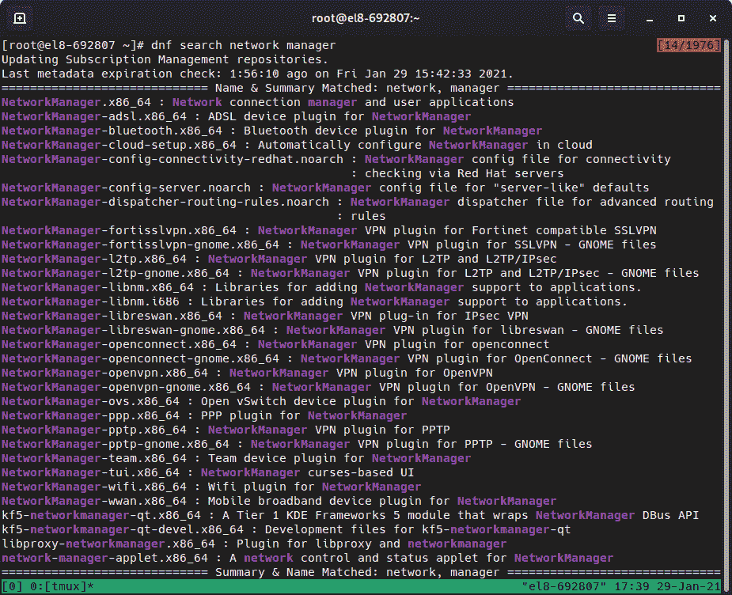

图 6.1-在 Red Hat Enterprise Linux 8 系统中可用于安装的 NetworkManagermanager 相关软件包

`NetworkManagermanager`配置在`/etc/NetworkManager`文件夹中的文件中，特别是`NetworkManager.conf`和该文件夹中可用的文件：

+   `conf.d`

+   `dispatcher.d`

+   `dnsmasq-shared.d`

+   `dnsmasq.d`

+   `system-connections`

不记得 dispatcher 是什么？记得使用`man networkmanager`获取详细信息！

NetworkManager 的 man 页面解释了这些脚本是根据网络事件按字母顺序执行的，并将接收两个参数：事件的设备名称和操作。

您可以执行以下几种操作：

+   `pre-up`：接口已连接到网络，但尚未激活。必须在连接被通知为已激活之前执行脚本。

+   `up`：接口已激活。

+   `pre-down`：接口正在停用，但尚未从网络断开连接。在强制断开连接的情况下（丢失无线连接或丢失载波），这不会被执行。

+   `down`：接口已停用。

+   `vpn-up`/`vpn-down`/`vpn-pre-up`/`vpn-pre-down`：类似于前面的接口，但用于 VPN 连接。

+   `hostname`：主机名已更改。

+   `dhcp4-change`/`dhcp6-change`：DHCP 租约已更改（已续订、已重新绑定等）。

+   `connectivity-change`：连接转换，如无连接，系统上线等。

现在我们已经了解了一些关于 NetworkManager 及其工作和设计的知识，让我们学习如何配置网络接口。

# 使用 IPv4 和 IPv6 配置网络接口

有几种配置网络接口和几种网络配置的方法。这将帮助我们确定我们需要做什么以及所需的参数和设置。

让我们看一些例子：

+   服务器可能有两个或更多的**网络接口卡**（**NIC**）以实现冗余，但一次只有一个处于活动状态。

+   服务器可能使用干线网络，并要求我们在其上定义 VLAN 以访问或提供网络中的不同服务。

+   两个或更多个 NIC 可能会组合在一起，通过组队提供增加的输出和冗余。

也可以通过几种方式进行配置：

+   `nmtui`：用于配置网络的基于文本的界面

+   `nmcli`：NetworkManager 的命令行界面

+   `nm-connection-editor`：可用于图形环境的图形工具

+   通过文本配置文件

重要提示

在编辑网络配置之前，请确保可以以其他方式访问正在配置的系统。对于服务器，可以通过远程管理卡或物理控制台访问。配置错误可能导致系统无法访问。

在我们继续之前，让我们了解一些关于 IPv4 和 IPv6 的知识

## IPv4 和 IPv6...这是什么意思？

IPv4 是在 1983 年创建的，使用 32 位地址空间，提供 2³²个唯一地址（`4,294,967,296`），但在这些可能的地址中，有大块保留用于特殊用途。IPv6 在 2017 年被批准为互联网标准，是我写作时的最新版本，它使用 128 位地址空间，即 2¹²⁸（3.4 x 10³⁸个地址）。

长话短说，当时 IPv4 地址数量似乎很大，但今天，手机、平板电脑、计算机、笔记本电脑、服务器、灯泡、智能插座和所有其他**物联网**（**IoT**）设备都需要 IP 地址，公共 IP 地址的数量已经用尽，这意味着无法再分配更多。这导致一些**互联网服务提供商**（**ISP**）使用诸如**运营商级网络地址转换**（**CGNAT**）之类的技术，类似于私人网络所做的，这使得来自多个设备的所有流量看起来都来自同一个 IP，并且设备在两个网络上进行交互（路由器），以便对原始请求者的出站和入站数据包进行正确路由。

那为什么没有 IPv6 呢？主要问题是 IPv4 和 IPv6 不兼容，即使 IPv6 在 1998 年是一个草案，也并非所有网络设备都兼容它，可能尚未经过测试。请查看[`www.ripe.net/support/training/videos/ipv6/transition-mechanisms`](https://www.ripe.net/support/training/videos/ipv6/transition-mechanisms)获取更多详细信息。

在下一节中，我们将学习如何使用名为`nmtui`的 NetworkManager 的基于文本的用户界面来配置网络接口。

## 使用 nmtui 配置接口

`nmtui`提供了一个基于文本的配置界面。这是在终端上运行`nmtui`时会看到的初始屏幕：

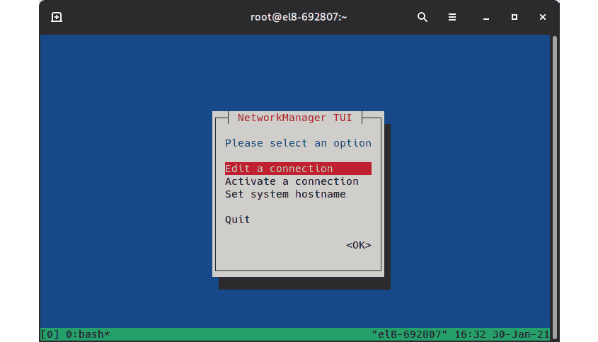

图 6.2 - nmtui 欢迎屏幕显示可以执行的操作菜单

让我们探索接口的可用选项。在这种情况下，让我们选择**编辑连接**。在出现的屏幕上，向下移动并编辑我们系统中的**有线连接**选项，以进入以下屏幕：

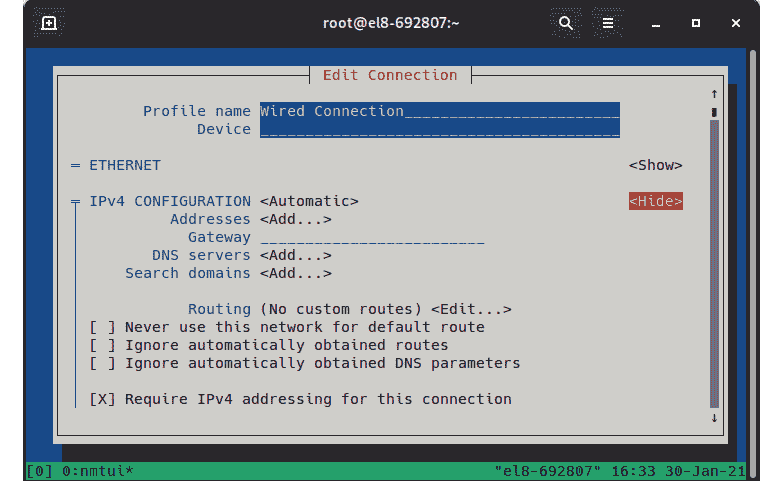

图 6.3 - 编辑连接页面，IPv4 选项已展开

很难为每个步骤展示截图，因为文本界面的优势之一是我们可以将许多选项压缩成一个简单的屏幕。然而，前面的截图使我们能够轻松理解每个所需参数：

+   IP 地址

+   子网掩码

+   网关

+   搜索域

+   路由

如您所见，有复选框可用于忽略路由或在连接设置为“自动”时获取的 DNS 参数。此外，还有其他接口选项：“禁用”，“链路本地”，“手动”和“共享”。

让我们讨论“自动”选项，这意味着接口将被设置为自动配置。这是配置的最常见设置之一。不过，这并不意味着一切都是自动完成的。让我们深入了解一下。

在一个网络（企业、私人等）中，通常会有一个专门的服务或服务器执行**动态主机路由协议**（**DHCP**）。DHCP 是在 TCP/IP 之上运行的协议，允许您动态配置主机，使用之前由网络管理员或某个设备及其默认设置进行的配置。

DHCP 允许您自动配置（从客户端）网络配置的许多方面，如 IP、子网掩码、网关、DNS、搜索域、时间服务器等。接收到的配置将被分配一个在一段时间内有效的租约。之后，系统会尝试更新它，或者如果系统被关闭或断开连接，租约将被释放。

通常，DHCP 配置被认为与动态 IP 绑定在一起，但请记住，DHCP 服务器可以使用两种不同的方法：可以重复使用不同系统连接的 IP 池，也可以将 MAC 地址固定映射到静态 IP。

例如，让我们考虑一个`192.168.1.0/24`子网。

我们可以将 ISP 路由器定义为 IP`192.168.1.1`，因为子网（`/24`）的原因，这意味着 IPv4 地址的最后一部分可以从 0 到 255 范围。

利用该 IP 范围，我们可以设置主机从最后 100 个 IP 中的动态配置和动态 IP 中获取，将前面的 IP 留给固定设备（即使它们动态获取配置），如打印机、存储设备等。

正如我们之前提到的，我们可以为服务器创建预留，但通常对于总是使用相同地址的设备，配置静态地址也是常见做法。这样，如果 DHCP 服务器不可用，服务器仍然可以从其他服务或配置了静态地址的其他服务器/设备中访问。

提示

只是为了熟悉这个概念，IP 地址在 IPv4 中以点分隔四组数字表示，例如`192.168.2.12`，而在 IPv6 中，数字以`:`分隔；例如`2001:db8:0:1::c000:207`。

## 使用 nm-connection-editor 配置接口

如果我们的系统已安装了图形环境，而我们的测试系统没有安装图形环境，我们可以使用图形配置工具。如果没有安装，请在图形会话内的 shell 控制台中执行`dnf install nm-connection-editor`。

提示

要安装图形界面，您可以运行`dnf groupinstall "Server with GUI" -y`命令，或者在安装过程中选择它。

在下面的屏幕截图中，我们可以看到通过执行`nm-connection-editor`打开的窗口。它类似于本章前面显示的`nmtui`的文本界面：

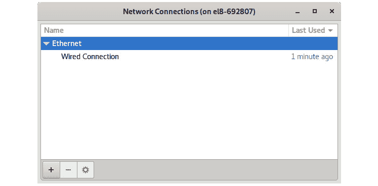

图 6.4 - nm-connection-editor 的初始屏幕

在这里，我们可以看到**+**、**-**和*齿轮*按钮，分别用于添加/删除或配置突出显示的连接。

让我们点击**有线连接**选项，然后点击**齿轮**图标打开详细信息：

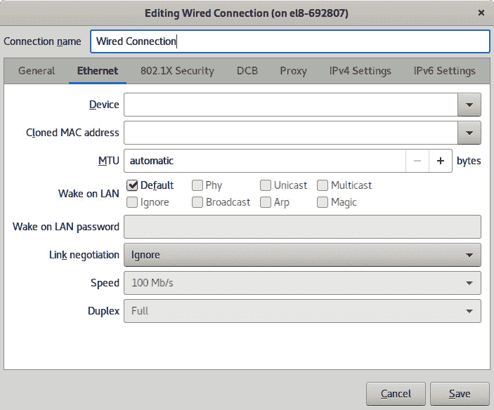

图 6.5 - 编辑网络连接的对话框

在对话框中，我们可以看到简单命令行配置工具中的字段，以及每个选项组的额外字段和不同的选项卡。

要记住的重要字段是**在**通用**选项卡中用于**自动连接优先**的字段。这使我们的系统在有连接可用时自动启用该网卡。

通过检查不同的选项卡，您会发现有很多选择，比如标记连接为计量。这意味着，例如，如果通过手机进行连接，如果网络使用没有受到控制，可能会有额外的费用。

当我们创建额外的网络时，我们可以根据系统中安装的软件包定义物理或虚拟设备（如果您还记得我们在搜索 NetworkManager 时看到的软件包列表，我们有不同 VPN、Wi-Fi 等软件包），如下面的屏幕截图所示：

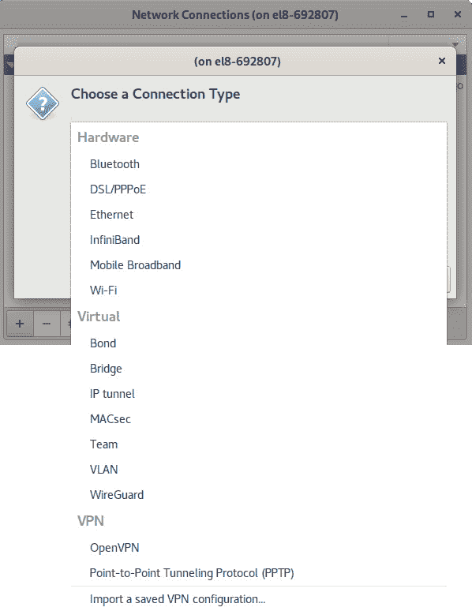

图 6.6 – 带有 Wi-Fi、OpenVPN、PPTP、蓝牙等插件的 nm-connection-editor 已安装

对于服务器环境，最常见的网络类型是**绑定**、**桥接**和**团队**（**以太网**的一部分），而对于桌面电脑，最常见的网络类型是**以太网**、**Wi-Fi**和**宽带**。

每种类型的连接都有一些要求。例如，对于绑定、桥接和团队，我们需要多个可以组合的网络接口。

现在，让我们继续在下一节中审查`nmcli`的用法。

## 使用 nmcli 配置接口

`nmcli`是 NetworkManager 的命令行界面。它不仅允许我们检查，还允许我们配置系统中的网络接口，即使使用它可能需要比`nmtui`需要更多的记忆技巧，但它赋予用户和管理员脚本能力来自动设置系统的网络。

提示

大多数命令允许我们使用自动补全；也就是说，按下*Tab*键将在命令行上使用自动补全列表来建议语法。例如，在命令行上输入`nmcli dev`并按下*Tab*将自动补全命令为`nmcli device`。在这种情况下，这可能并不像`nmcli`接受两个参数都有效那样重要，但对于其他命令来说，正确拼写是必须的才能使代码正常工作。

让我们从使用`nmcli dev`检查系统中可用的连接开始，然后使用`nmcli con show`查看其详细信息：

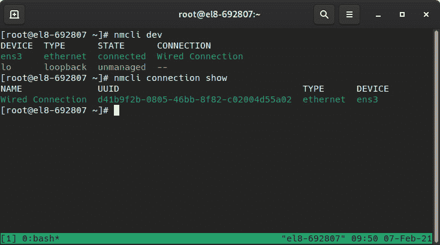

图 6.7 – nmcli dev 和 nmcli con show

例如，当控制网络连接时，例如使用`nmcli con up "Wired Connection"`或使用`nmcli con down ens3`禁用它时，我们应该记住我们关于 NetworkManager 的解释：如果连接在系统中可用，NetworkManager 可能会在断开连接后立即重新激活它，因为连接和所需的设备在我们的系统中是可用的。

现在，让我们创建一个新接口来说明通过 IPv4 添加新连接的过程：

```
nmcli con add con-name eth0 type ethernet \
 ifname eth0 ipv4.address 192.168.1.2/24 \
 ipv4.gateway 192.168.1.254
```

我们也可以使用 IPv6：

```
nmcli con add con-name eth0 type ethernet \
 ifname eth0 ipv6.address 2001:db8:0:1::c000:207/64 \
 ipv6.gateway 2001:db8:0:1::1 ipv4.address \
 192.0.1.3/24 ipv4.gateway 192.0.1.1
```

执行了上述命令后，我们可以使用`nmcli connection show eth0`检查已定义的网络连接，并验证是否应用了正确的设置（或者当然也可以通过`nmtui`、`nm-connection-editor`或在磁盘上创建的文本文件来验证，因为信息是共享和存储在系统中的）。

当我们审查`nmcli connection show interface`的输出时，输出包含一些用点分隔的键，例如以下内容：

+   ipv4.address

+   ipv4.gateway

+   ipv6.address

+   ipv6.gateway

+   connection.id

我们可以使用这些键通过`nmcli con mod $key $value`来定义新的值，如下例所示：

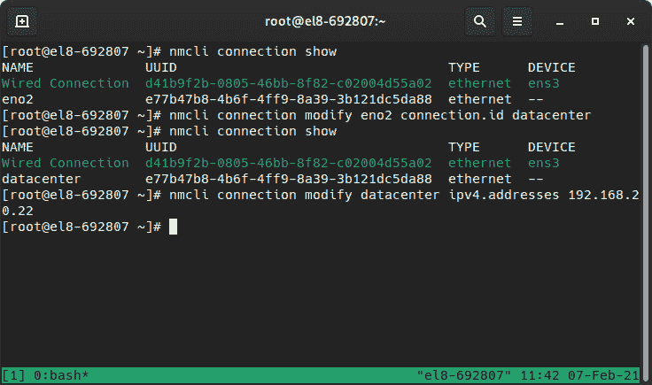

图 6.8 – 修改网络连接名称和 IP 地址的示例

当然，在进行了上述测试后，我们也可以使用`nmcli con del datacenter`来删除连接以避免系统中的问题。

以下命令可用于使用`nmcli`工具修改连接：

+   `nmcli con show`: 显示连接的状态。

+   `nmcli con show NAME`: 显示名为`NAME`的连接的详细信息。

+   `nmcli dev status`: 显示系统中设备的状态。请注意，这意味着**设备**，而不是可能正在使用这些设备的连接。

+   `nmcli con add con-NAME`: 添加新连接。

+   `nmci con mod NAME`: 修改连接。

+   `nmcli con up NAME`: 启动连接。

+   `nmcli con down NAME`: 断开连接（仍然可以通过 NetworkManager 重新启用）。

+   `nmcli con del NAME`: 从系统中删除连接定义。

提示

查看`man nmcli-examples`以找到包含在系统文档中的更多示例。

## 使用文本文件配置接口

在前面的小节中，我们探讨了如何使用不同的方法配置网络，但最终，所有这些配置最终都会被写入磁盘作为接口定义文件（这也提供了与先前提到的`network-scripts`的向后兼容性）。

与其从头开始创建接口定义，不如看看当我们用以下命令创建接口时`nmcli`做了什么：

```
nmcli con add con-name eth0 type ethernet ifname eth0 ipv6.address 2001:db8:0:1::c000:207/64 ipv6.gateway 2001:db8:0:1::1 ipv4.address 192.0.1.3/24 ipv4.gateway 192.0.1.1
```

上述命令将生成`/etc/sysconfig/network-scripts/ifcfg-eth0`文件，我们可以在下面的截图中看到：

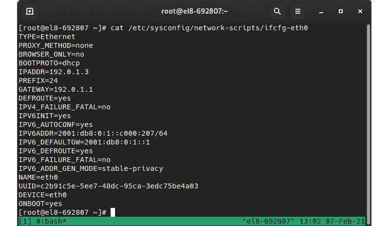

图 6.9-/etc/sysconfig/network-scripts/ifcfg-eth0 连接定义的内容

正如我们所看到的，默认情况下，我们指定了一个以`Ethernet`（`TYPE`）类型的网络接口，使用`eth0`设备，以及提供的 IPv4 和 IPv6 地址和网关。键的名称与使用`nmcli`定义的键不同，原因是我们具有向后兼容性。

请注意，在上面的例子中，`ONBOOT`字段已经设置为`yes`，这意味着当系统启动时，接口将自动启用。如果我们使用`nmcli`，我们可以通过`connection.autoconnect`配置键来检查状态，这也将默认情况下使连接在启动时自动启用。

我们可以直接编辑这些文件，但是为了让 NetworkManager 意识到将要引入的更改，必须执行`nmcli con reload`。这将同步对各个文件所做的更改。

例如，我们可以更正上述文件中的一个设置，因为对于静态定义的 IP，通常会定义`BOOTPROTO=none`。使用你喜欢的方法修改`/etc/sysconfig/network-scripts/ifcfg-eth0`文件（`vim`，`nano`，`sed`或其他）。要获取其他细节，我们可以使用`nmcli`进行检查，并且也可以更改 IP 地址。

请注意，在下面的截图中，更改在发出`reload`命令之前不会出现在`nmcli`中：

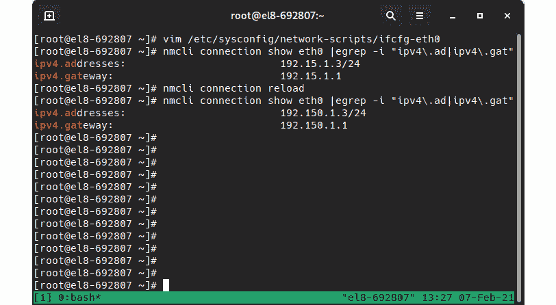

图 6.10-编辑接口定义的过程在重新加载连接之前不会显示在 nmcli 上

当然，我们也可以从头开始创建网络定义，直到 NetworkManager 的到来和传播，这种方法在脚本编写中被使用，包括通过 kickstart 文件进行的 Anaconda 自动安装。

让我们用 IPv4 中的命令创建一个简单的网络定义，如下面截图中所示：

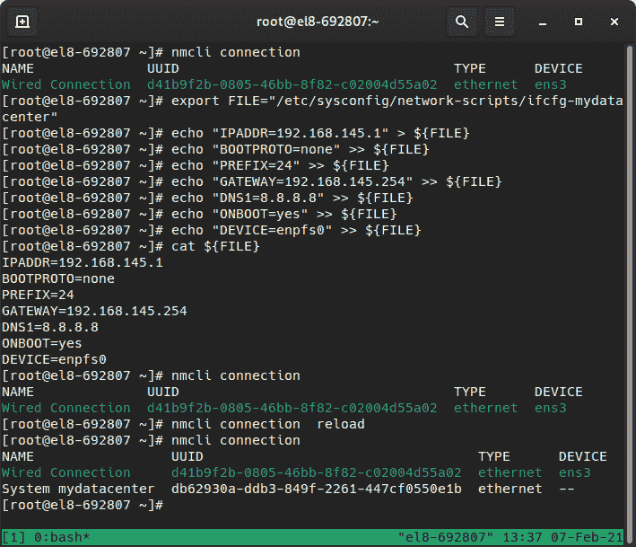

图 6.11-使用配置文件创建连接（可以作为脚本的一部分）

在这里，你不仅可以看到连接的创建，还可以看到之前的状态，接口定义，系统的 NetworkManager 视图，以及重新加载的配置文件的比较。请注意，设备列为空，因为我们为该连接定义了一个在我们系统中不存在的接口。

重要提示

网络接口定义可能会变成一场噩梦，因为接口名称本身受到几条规则的约束，比如接口在总线上的位置，以前是否曾见过等。一般来说，一旦系统检测到网络卡，就会编写一个自定义规则，将接口的 MAC 地址与自定义命名约定进行匹配。这样做是为了在重新启动或新软件更新改变我们必须枚举卡的方式时不会发生变化。您可以通过查看官方 RHEL8 手册了解更多信息[`access.redhat.com/documentation/en-us/red_hat_enterprise_linux/8/html/configuring_and_managing_networking/consistent-network-interface-device-naming_configuring-and_managing-networking`](https://access.redhat.com/documentation/en-us/red_hat_enterprise_linux/8/html/configuring_and_managing_networking/consistent-network-interface-device-naming_configuring-and_managing-networking)。

现在我们已经回顾了在我们的系统中配置网络的不同方法，让我们了解一下命名解析。

# 配置主机名和主机名解析（DNS）

记住 IP 地址，无论是 IPv4 还是 IPv6 地址，都可能变成一场噩梦。为了简化事情，对主机名和 DNS 采用了更加人性化的方法，我们可以将这些更容易记住的名称转换为系统用于连接的 IP 地址。

主机名是我们分配给主机以便它们被识别的名称，但当它们与 DNS 服务器一起使用时，我们必须有其他主机能够将它们解析为可以连接的 IP 地址。

我们可以使用`hostname`命令查看或临时修改当前主机名，如下面的屏幕截图所示：

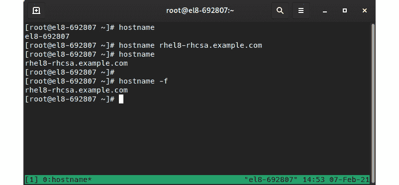

图 6.12 - 查询和更改主机的主机名

请记住，这种更改只是暂时的；只要我们重新启动服务器，它就会使用配置的更改。

要定义一个新的配置主机名，我们将使用`hostnamectl set-hostname`命令，如下面的屏幕截图所示：

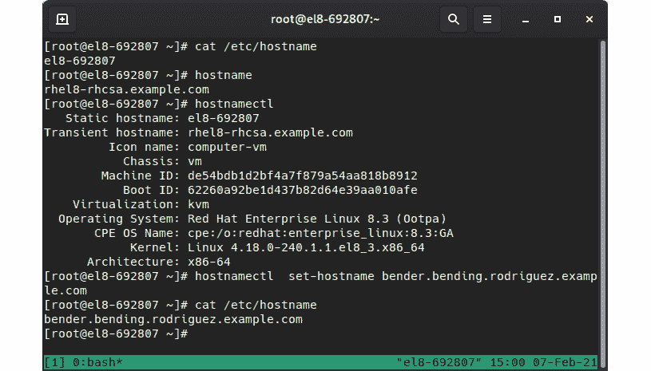

图 6.13 - 检查先前配置的主机名和通过 hostnamectl 定义新主机名

请注意在上面的示例中，我们有`临时主机名`与`静态主机名`，这指的是使用`hostname`而不是`hostnamectl`定义的名称的临时状态。

在名称解析方面，我们可以采取几种方法。当然，一种方法是使用 DNS 服务器，我们将在本节稍后解释，但还有其他方法。

一般来说，系统有几个解析器，并且这些解析器在`/etc/nsswitch.conf`配置文件中定义。这些解析器不仅用于网络命名，还用于解析用户，例如，企业`nsswitch.conf`指示我们的系统使用以下条目进行主机解析：`hosts: files dns myhostname`。

这意味着我们将我们的`/etc/`目录中的文件作为我们的第一个来源。在主机名的情况下，这指的是`/etc/hosts`文件。如果在该文件中定义了条目，将使用指定的值；如果没有，则`/etc/resolv.conf`文件将确定如何进行解析。这些文件，特别是`resolv.conf`，在系统部署和连接激活时进行配置。NetworkManager 负责更新通过 DHCP 获得的值（如果使用了自动配置），或者如果执行了手动配置，则使用指定的 DNS 服务器。

在下面的屏幕截图中，我们可以看到在我们的`/etc/hosts`文件中定义的条目，如何因为名称不存在而无法 ping 主机，以及在手动向`/etc/hosts`文件添加条目后，我们的系统能够到达它：

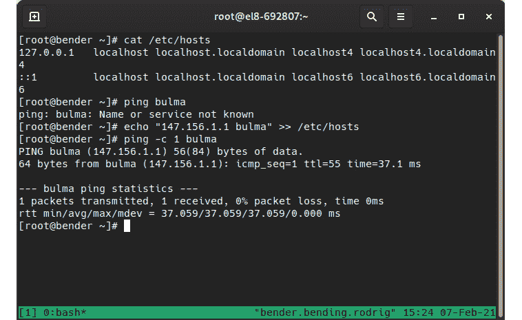

图 6.14 - 向我们的本地系统添加静态主机条目

正如我们之前提到的，DNS 解析是通过`/etc/resolv.conf`中的配置完成的，默认情况下包含`search`参数和`nameserver`参数。如果我们查看`resolv.conf`的 man 页面，我们可以获得常见参数的描述：

+   `nameserver`：包含要使用的名称服务器的 IP。目前，`resolv`库在系统中每次最多使用三个条目（每个占一行）进行解析。每次解析都是按顺序进行的，因此如果一个服务器失败，它将超时，尝试下一个，依此类推。

+   `domain`：本地域名。它允许我们使用相对于我们主机的本地域的短名称。如果未列出，它将基于我们系统的主机名进行计算（第一个`.`之后的所有内容）。

+   `search`：默认情况下，这包含本地域名，它是我们可以尝试使用以解析提供的短名称的域名列表。它限制为 6 个域和 256 个字符。域和搜索是互斥的，因为文件中的最后一个将被使用。

提示

DNS 解析通过向特殊服务器（DNS）请求域的相关数据来实现。这是以分层方式进行的，顶层通用服务器被称为**根服务器**。DNS 服务器不仅包含将主机名转换为 IP 的注册表或条目，还包括有关发送电子邮件时要使用的邮件服务器、安全验证详细信息、反向条目等信息。此外，DNS 服务器还可以通过为某些域返回无效 IP 来阻止对服务的访问，或者通过使用比 ISP 提供的更快的 DNS 服务器来加快互联网导航速度。当域名注册时，在根表中为该域创建一个新条目，指向 DNS 服务器。这将负责该域的解析，并且稍后，这些条目将在互联网上进行填充和缓存，以加快解析速度。

如果我们想修改连接定义的 DNS 服务器，记得使用`nmcli con mod NAME ipv4.dns IP`（或 IPv6 等效），并在之前使用`+`符号，如`+ipv4.dns`，以将新条目添加到 DNS 服务器列表中。对`resolv.conf`的任何手动更改可能会被覆盖。

现在我们已经了解了 DNS 的工作原理以及我们的系统如何使用它，让我们看看如何保护系统网络访问。

# 防火墙配置概述

当系统连接到网络时，许多正在运行的服务可以从其他系统访问。这是连接系统的目标。然而，我们也希望保持系统安全，远离未经授权的使用。

**防火墙**是一种软件层，位于网络卡和服务之间，允许我们对允许或不允许的内容进行微调。

我们无法完全阻止所有传入连接到我们的系统，因为经常传入连接是我们的系统发出的请求的响应。

连接是通过名为`iptables`、`ip6tables`、`ebtables`和`arptables`的内核框架来阻止的。

重要说明

正如我们之前在网络配置方面解释的那样，防火墙中的错误配置可能会将您锁在系统外，因此在设置一些限制性规则时一定要非常小心，以便在远程访问系统时可以重新登录系统。

`firewalld`软件包应该包含在基本安装中。一旦安装，它将提供`firewall-cmd`命令与服务进行交互。

firewalld 使用区域的概念，允许我们为每个区域预定义一组规则。这些也可以分配给网络连接。例如，对于可能在连接之间漫游的笔记本电脑，当您使用家庭或公司连接时，可能更相关，而当您使用来自咖啡厅的 Wi-Fi 时，它们将默认为更安全的设置。

firewalld 还使用预定义的服务，以便防火墙知道应该基于已启用的服务和区域来启用哪些端口和协议。

让我们看看可用的区域以及有关家庭区域的更多详细信息：

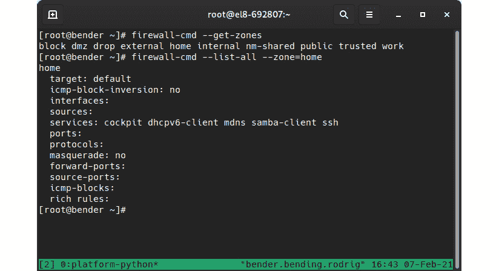

图 6.15 - 可用区域和家庭区域的配置

如我们所见，已定义了几个区域：

+   `public`：这是新添加接口的默认区域。它允许我们使用 cockpit SSH 和 DHCP 客户端，并拒绝与传出流量无关的所有传入流量。

+   `block`：拒绝所有传入流量，除非与传出流量相关。

+   `dmz`：拒绝所有传入流量，除非与传出或 SSH 连接相关。

+   `drop`：丢弃所有与传出流量无关的传入数据包（甚至不是 ping）。

+   `external`：阻止所有传入流量，除了与传出流量相关的流量。它还允许 SSH，并将流量伪装为来自此接口的流量。

+   `home`：除了 public，还允许`smb`和`mdns`。

+   `internal`：基于家庭区域。

+   `trusted`：允许所有传入流量。

+   `work`：阻止所有传入流量，除了与传出或 SSH/cockpit/DHCP 流量相关的流量。

接下来，我们将学习如何在配置防火墙时使用这些区域。

## 配置防火墙

正如本节介绍中所示，防火墙可以通过`firewall-cmd`命令进行配置（以及在*第四章*中早些时候在本书中描述的 cockpit web 界面）。最常用的命令选项如下：

+   `firewall-cmd --get-zones`：列出可用的区域。

+   `firewall-cmd --get-active-zones`：列出已分配的活动区域和接口。

+   `firewall-cmd --list-all`：转储当前配置。

+   `firewall-cmd --add-service`：将服务添加到当前区域。

+   `firewall-cmd --add-port`：将端口/协议添加到当前区域。

+   `firewall-cmd --remove-service`：从当前区域中移除服务。

+   `firewall-cmd --remove-port`：从当前区域中移除端口/协议。

重要提示

请注意，在上述命令之后，您需要提到端口号和服务名称以添加或删除服务/端口。

+   `firewall-cmd --reload`：从保存的数据重新加载配置，从而丢弃运行时配置。

+   `firewall-cmd –get-default-zone`：获取默认区域。

+   `firewall-cmd --set-default-zone`：定义要使用的默认区域。

例如，当我们在系统中安装 HTTP 服务器（用于提供网页）时，必须启用 TCP 端口`80`。

让我们在示例系统中尝试安装、运行和打开 HTTP 端口：

```
dnf –y install httpd
systemctl enable httpd
systemctl start httpd
firewall-cmd –add-service=http
curl localhost
```

最后一个命令将向本地`http`服务器发出请求以获取结果。如果您可以访问其他系统，可以尝试连接到我们一直在使用的服务器的 IP，以查看系统提供的默认网页。

在下面的屏幕截图中，我们可以看到`curl localhost`命令的输出：

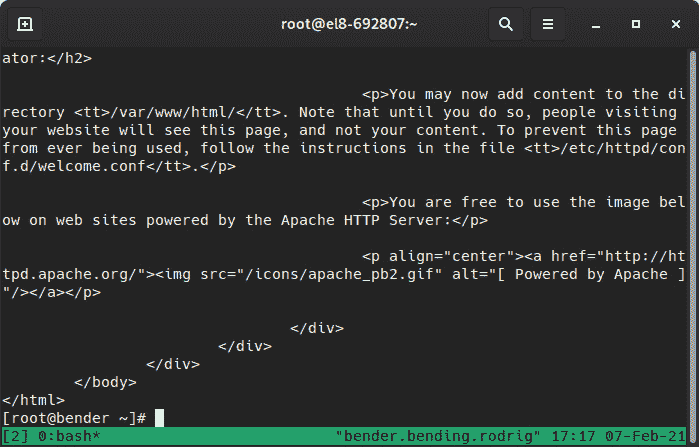

图 6.16 - 请求由我们的系统托管的网页的 curl 输出

到目前为止，我们已经审查了如何配置一些基本的防火墙规则，所以我们准备检查网络的连通性。

# 测试网络连通性

在前面的章节中，我们正在与网络接口、地址和防火墙规则进行交互，这些规则定义、限制或允许连接到我们的系统。在本节中，我们将回顾一些基本工具，用于验证网络连接是否存在。

请注意，以下命令假定防火墙未设置为严格模式，并且我们可以使用**Internet 控制消息协议**（**ICMP**）来访问托管服务的服务器。在安全网络中，服务可能正在运行，但不会回答 ping - 它可能只会回答服务查询本身。

我们可以在这里使用几个命令，因此请考虑以下建议来诊断问题：

+   检查本地接口的 IP 地址、子网掩码和网关。

+   使用`ping`命令和网关的 IP 地址验证正确的网络配置。

+   使用`ping`命令对`/etc/resolv.conf`中的 DNS 服务器进行 ping，以查看是否可达。或者，使用`host`或`dig`命令查询 DNS 服务器。

+   如果据说有外部网络连接，请尝试访问外部 DNS 服务器，如`8.8.8.8`或`1.1.1.1`，或使用`curl`或`wget`请求一些已知服务的网页；例如，`curl nasa.gov`。

这应该让您对问题可能出在哪有一个大概的想法，根据您在测试中达到的距离。请记住，还有其他工具，比如`tracepath`，它将显示 TCP 数据包在到达目的地之前经过的跳数。每个命令的 man 页面将为您提供有关其用法的提示和示例。

在下面的屏幕截图中，您可以看到针对一个 Web 服务器的`tracepath`的输出：

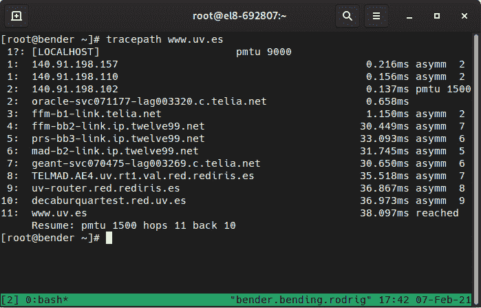

图 6.17 - 对西班牙瓦伦西亚大学网站的 tracepath 命令的输出

正如我们所看到的，跨越不同服务器执行了 11 个步骤，直到我们的数据包到达目的地主机。这使我们了解了数据包如何穿越互联网到达目标系统。

# 总结

在本章中，我们学习了使用不同方法配置网络接口，可以通过手动交互或通过允许我们脚本或自动配置的方法。

还介绍了一些用于帮助我们找到一些基本错误的网络问题的故障排除方法。

正如我们在本章的介绍中提到的，网络是我们的系统到达其他服务并向其他系统提供服务的基础。我们还介绍了更复杂的网络设置的概念，超出了 RHCSA 级别的范围，但至少熟悉我们职业生涯中将要使用的关键词是有趣的。

在下一章中，我们将涵盖一些与安全相关的重要主题，例如在我们的系统中添加、打补丁和管理软件。
