# 第七章：添加、打补丁和管理软件

维护系统的软件，关闭安全问题，应用修复程序并保持系统最新是系统管理中的重要任务。在本章中，我们将回顾**Red Hat 订阅管理系统**的工作原理，如何确保软件包经过验证，以及保持系统更新的其他软件管理任务。

深入了解一些细节，在本章中，我们将介绍订阅系统的工作原理以及如何使用开发者订阅进行自我培训或安装个人服务器。我们还将检查如何管理软件来源，也称为仓库，您的系统将使用它们。这包括学习软件包管理中签名的作用，以确保安装的软件是 Red Hat 提供的软件。我们还将学习添加和删除软件包和软件包组，使用模块化的不同软件版本，以及审查和回滚更改等关键任务。

为了简化扩展您的知识，使您能够准备自己的实验室，我们将看到如何在您的系统中拥有所有**Red Hat 企业 Linux（RHEL）**仓库的完整本地副本。

最后但同样重要的是，我们需要了解**Red Hat 软件包管理器**（**RPM**），现在更名为 RPM 软件包管理器，通过学习软件包管理内部工作的基础知识。

总之，在本章中，我们将涵盖以下主题：

+   RHEL 订阅注册和管理

+   使用 Yum/DNF 管理仓库和签名

+   使用 Yum/DNF 进行软件安装、更新和回滚

+   使用 createrepo 和 reposync 创建和同步仓库

+   理解 RPM 内部

现在，让我们开始管理我们系统中的软件。

# RHEL 订阅注册和管理

RHEL 是一个完全的**开源操作系统**，这意味着用于构建它的所有源代码都可以访问、修改、重新分发和学习。另一方面，预构建的二进制文件是作为服务交付的，并通过订阅可访问。正如在*第一章*中所见，*安装 RHEL8*，我们可以为自己的个人使用获得开发者订阅。该订阅提供对 ISO 映像的访问，还提供了 RHEL 8 的更新、签名软件包。这些软件包与全球许多公司在生产中使用的完全相同。

让我们看看如何在我们自己的系统中使用该订阅。

首先，让我们来看看**Red Hat 客户门户**[`access.redhat.com`](https://access.redhat.com)，然后点击**登录**：

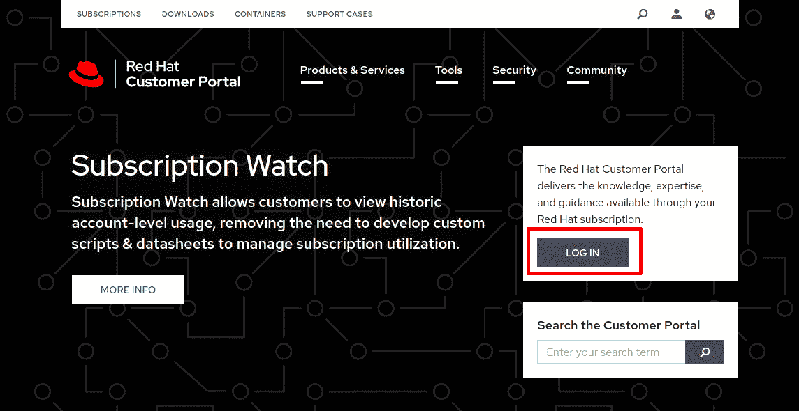

图 7.1–登录到 Red Hat 客户门户

一旦我们点击`student`作为示例：

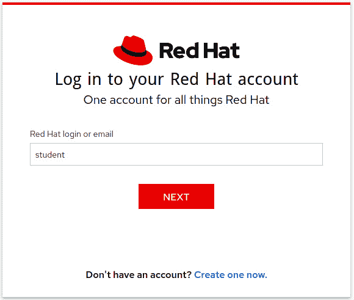

图 7.2–在 Red Hat 单一登录中输入我们的用户名

现在是时候输入我们的密码进行验证了：

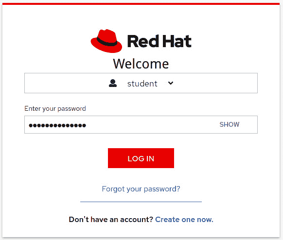

图 7.3–在 Red Hat 单一登录中输入我们的密码

登录后，我们将通过点击顶部栏中的**订阅**链接转到**Red Hat 订阅页面**：

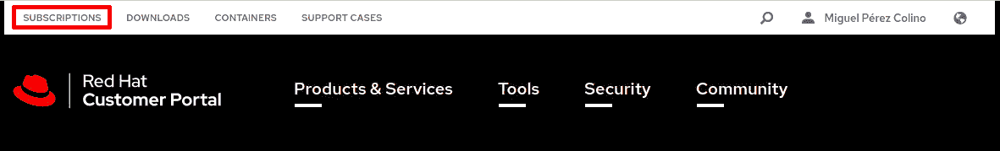

图 7.4–在 Red Hat 客户门户中访问订阅页面

对于已订阅一个物理机的用户，订阅页面将如下所示：

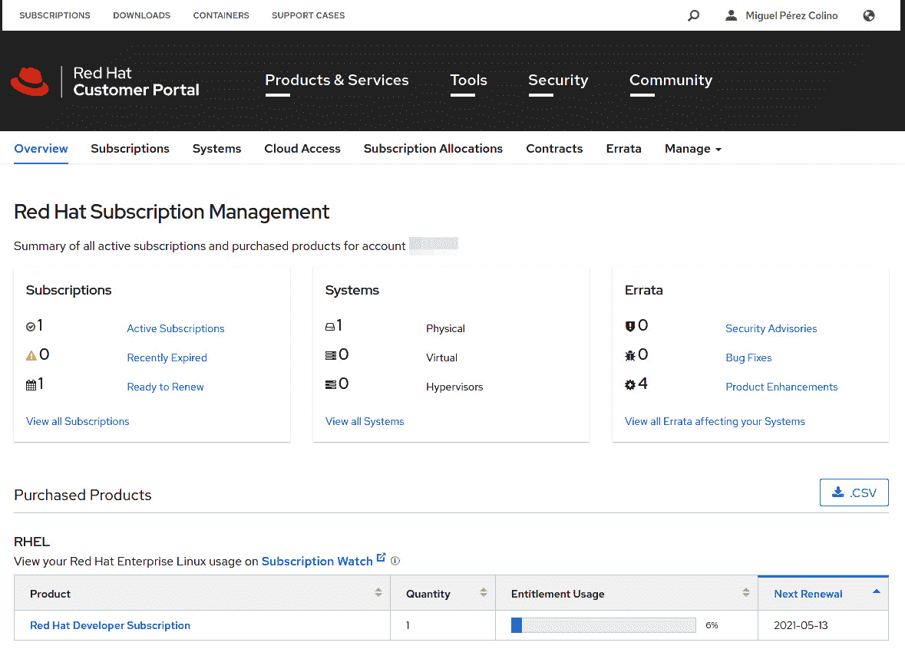

图 7.5–Red Hat 客户门户中的订阅页面示例

提示

开发者订阅于 2021 年 1 月更新，支持最多 16 个系统。您可以使用您的帐户为一个以上的单个系统模拟类似生产的部署。

现在让我们注册我们的新系统：

```
[root@rhel8 ~]# subscription-manager register
Registering to: subscription.rhsm.redhat.com:443/subscription
Username: student
Password: 
The system has been registered with ID: d9673662-754f-49f3-828c-86fd9f5b4e93
The registered system name is: rhel8.example.com
```

有了这个，我们的系统将被注册到红帽**内容交付网络**（**CDN**），但仍然没有分配订阅。

让我们转到订阅页面并刷新以查看新系统。我们将点击**查看所有系统**以继续：

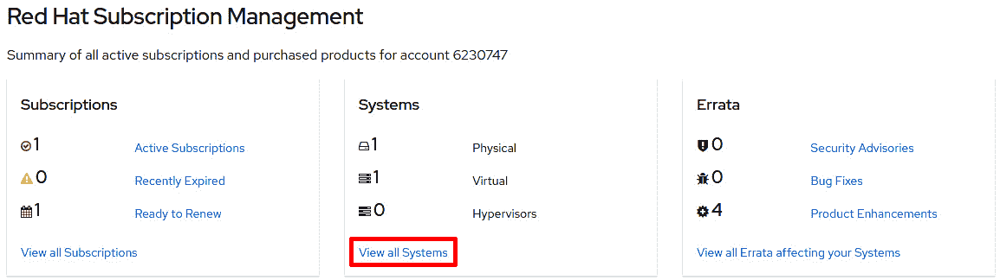

图 7.6 - 具有新订阅系统的订阅页面

我们可以在页面上看到我们的新系统`rhel8.example.com`，旁边有一个红色的方块，表示它没有附加的订阅。让我们点击系统名称以查看详细信息：

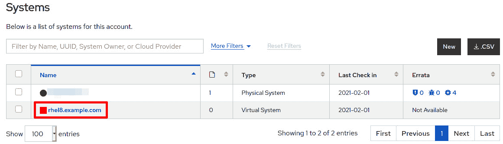

图 7.7 - 具有新订阅系统的订阅页面

一旦进入特定系统页面，我们就可以看到系统的所有详细信息。我们点击**订阅**以查看已附加的订阅：

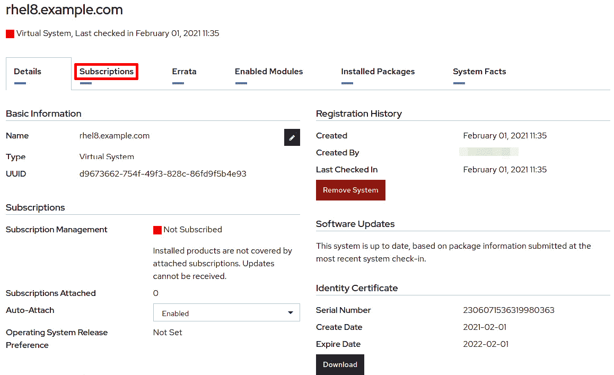

图 7.8 - 具有新订阅系统详细信息的订阅页面

我们可以在页面上看到，这个系统没有附加的订阅：

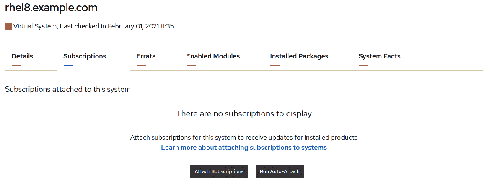

图 7.9 - 具有新订阅系统的订阅页面，没有附加的订阅

让我们使用`subscription-manager attach`为我们的系统附加一个订阅：

```
[root@rhel8 ~]# subscription-manager attach --auto
Installed Product Current Status:
Product Name: Red Hat Enterprise Linux for x86_64
Status:       Subscribed
```

命令的结果显示，系统现在已注册，并为`Red Hat Enterprise Linux for x86_64`附加了一个订阅。让我们刷新系统页面以确保订阅附加正常运行：

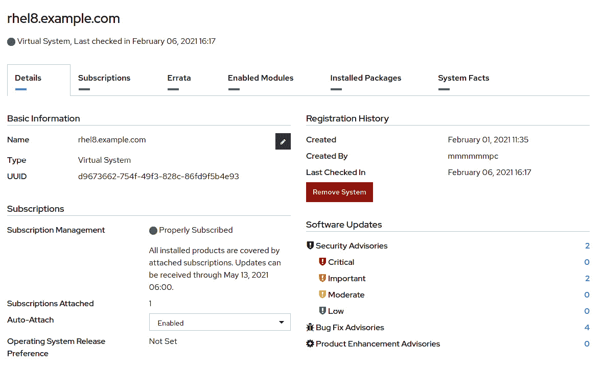

图 7.10 - 具有新订阅系统的订阅页面，附有一个订阅

有了这个，我们可以确定系统已正确注册并订阅了红帽 CDN，并且已准备好访问来自它的所有软件、补丁和更新。

此外，在系统中，我们可以看到一个包含有关软件**存储库**或**repos**信息的新文件已经创建：

```
[root@rhel8 ~]# ls -l /etc/yum.repos.d/redhat.repo 
-rw-r--r--. 1 root root 94154 feb  6 15:17 /etc/yum.repos.d/redhat.repo
```

现在我们知道如何管理可用的订阅并将它们分配给正在运行的系统，以便它可以访问由红帽构建的软件二进制文件。让我们在下一节中了解如何使用提供的存储库。

# 使用 YUM/DNF 管理存储库和签名

像许多其他 Linux 发行版一样，RHEL 有一个基于存储库提供软件的机制。这些存储库包含软件包的列表（可以是最终用户应用程序，如 Firefox，或者用于它们的组件，如 GTK3），软件包之间的依赖关系列表以及其他有用的元数据。

一旦我们完成订阅系统，我们可以使用`yum`或`dnf`查看系统中可用的存储库：

```
[root@rhel8 ~]# yum repolist
Updating Subscription Management repositories.
repo id                              repo name
rhel-8-for-x86_64-appstream-rpms     Red Hat Enterprise Linux 8 for x86_64 - AppStream (RPMs)
rhel-8-for-x86_64-baseos-rpms        Red Hat Enterprise Linux 8 for x86_64 - BaseOS (RPMs)
[root@rhel8 ~]# dnf repolist
Updating Subscription Management repositories.
repo id                              repo name
rhel-8-for-x86_64-appstream-rpms     Red Hat Enterprise Linux 8 for x86_64 - AppStream (RPMs)
rhel-8-for-x86_64-baseos-rpms        Red Hat Enterprise Linux 8 for x86_64 - BaseOS (RPMs)
```

正如您所看到的，`yum`和`dnf`的输出完全相同。事实上，`dnf`是`yum`的演变，在 RHEL8 中，`yum`命令只是`dnf`的符号链接：

```
[root@rhel8 ~]# which yum 
/usr/bin/yum
[root@rhel8 ~]# ll /usr/bin/yum
lrwxrwxrwx. 1 root root 5 jul 29  2020 /usr/bin/yum -> dnf-3
[root@rhel8 ~]# which dnf
/usr/bin/dnf
[root@rhel8 ~]# ll /usr/bin/dnf
lrwxrwxrwx. 1 root root 5 jul 29  2020 /usr/bin/dnf -> dnf-3
```

它们在 RHEL8 中可以互换使用。从现在开始，我们将只使用`dnf`，但请记住，如果您更喜欢`yum`，请随意使用。

提示

**YUM**曾经是**Yellowdog Updater Modified**的首字母缩写，这是一个最初是为 Mac 开发的 Linux 发行版项目。**DNF**代表**Dandified YUM**。

现在让我们来看一下在订阅附加期间创建的存储库定义`/etc/yum.repos.d/redhat.repo`。我们可以编辑文件并转到`BaseOS`存储库的条目，如上面显示的`rhel-8-for-x86_64-baseos-rpms`：

```
[rhel-8-for-x86_64-baseos-rpms]
name = Red Hat Enterprise Linux 8 for x86_64 - BaseOS (RPMs)
baseurl = https://cdn.redhat.com/content/dist/rhel8/$releasever/x86_64/baseos/os
enabled = 1
gpgcheck = 1
gpgkey = file:///etc/pki/rpm-gpg/RPM-GPG-KEY-redhat-release
sslverify = 1
sslcacert = /etc/rhsm/ca/redhat-uep.pem
sslclientkey = /etc/pki/entitlement/7881187918683323950-key.pem
sslclientcert = /etc/pki/entitlement/7881187918683323950.pem
metadata_expire = 86400
enabled_metadata = 1
```

正如您所看到的，文件中的每个部分都以方括号之间的部分名称开头 - 在前面的情况下，`[rhel-8-for-x86_64-baseos-rpms]`。现在让我们检查此部分下的所有条目：

+   **name**：存储库的长描述性名称。这是我们在前面的示例中列出存储库时显示的名称。

+   `$releasever` 变量将在访问之前被替换。其他方法包括 NFS、HTTP 和 FTP。

+   `1`，它将被启用，设置为 `0` 时将被禁用。

+   `1` 将启用，并且系统中使用 `dnf` / `yum` 安装的所有软件包将使用它们的 `gpg` 签名钥匙进行验证。

+   `gpg`，下载的软件包。

+   `1`，设置为 `0` 时将被禁用。

+   **sslcacert**：用作证书颁发机构的证书，用于验证客户端证书。

+   **sslclient key**：用于激活客户端证书的客户端密钥。

+   **sslclientcert**：机器用来在 CDN 上标识自己的客户端证书。

+   **metadata_expire**：在检索到的元数据被视为过期之后的秒数。默认值如下所示，为 24 小时。

+   `dnf`）以使用在此存储库中下载的元数据。

拥有运行存储库所需的最小选项是：`name`、`baseurl` 和 `gpgckeck`，并将最后一个设置为 `0`。

重要提示

虽然可以通过编辑文件更改存储库的配置，但修改 Red Hat 提供的存储库的最佳方法是使用本章中将显示的命令。这是因为当刷新数据时，`redhat.repo` 文件将被订阅管理器覆盖。

通过运行 `dnf repolist`，我们获得了系统中 `enabled` 的存储库列表。如果我们想要查看所有存储库，包括已启用和已禁用的存储库，该怎么办？可以通过运行 `dnf` `repolist --all` 来实现。

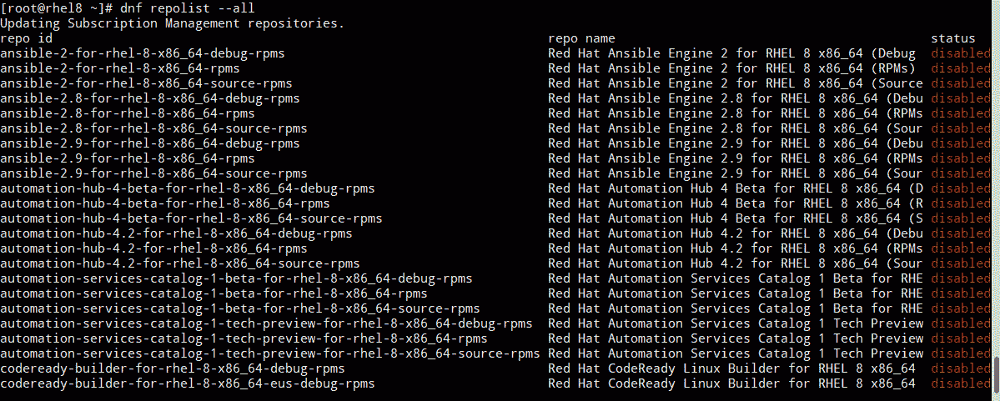

图 7.11 – dnf repolist –all 的部分输出

列表非常广泛。它包括了许多生产案例中使用的二进制库，从 SAP 到使用 Satellite 管理系统。我们可以使用 `grep` 过滤它来搜索 `supplementary`：

```
[root@rhel8 ~]# dnf repolist --all | grep supplementary
rhel-8-for-x86_64-supplementary-debug-rpms               disabled
rhel-8-for-x86_64-supplementary-eus-debug-rpms           disabled
rhel-8-for-x86_64-supplementary-eus-rpms                 disabled
rhel-8-for-x86_64-supplementary-eus-source-rpms          disabled
rhel-8-for-x86_64-supplementary-rpms                     disabled
rhel-8-for-x86_64-supplementary-source-rpms              disabled
```

这里有四种不同类型的通道：

+   `rhel-8-for-x86_64-supplementary-rpms`，其中包含准备安装在系统中的软件包，也称为 `rpms`。这些适用于标准维护期间。

+   `rhel-8-for-x86_64-supplementary-eus-rpms`，其中名称中包含 `eus`。这些提供了带有后端支持的软件包，以便能够保持相同的次要版本更长时间。除非第三方供应商要求，否则不要使用它们。

+   `rhel-8-for-x86_64-supplementary-source-rpms`，其中名称中包含 `source`。它们提供了用于构建 *常规* 和 *扩展更新支持* 通道中交付的软件包的源代码。

+   `rhel-8-for-x86_64-supplementary-debug-rpms`，其中名称中包含 `debug`。这些包括在构建软件包时生成的调试信息，对于深度故障排除非常有用。

我们可以使用 `dnf` 的 `config-manager` 选项启用 `rhel-8-for-x86_64-supplementary-rpms`，运行以下命令：

```
[root@rhel8 ~]# dnf config-manager --enable rhel-8-for-x86_64-supplementary-rpms
Updating Subscription Management repositories.
[root@rhel8 ~]# dnf repolist
Updating Subscription Management repositories.
repo id                                               repo name
rhel-8-for-x86_64-appstream-rpms                      Red Hat Enterprise Linux 8 for x86_64 - AppStream (RPMs)
rhel-8-for-x86_64-baseos-rpms                         Red Hat Enterprise Linux 8 for x86_64 - BaseOS (RPMs)
rhel-8-for-x86_64-supplementary-rpms                  Red Hat Enterprise Linux 8 for x86_64 - Supplementary (RPMs)
```

存储库现在已启用。您可能希望尝试启用和禁用其他存储库以进行练习。

现在让我们尝试添加一个我们只知道其 URL 的存储库，例如 `dnf config-manager`：

```
[root@rhel8 ~]# dnf config-manager --add-repo="http://mirror.uv.es/mirror/fedora-epel/8/Everything/x86_64/"
Updating Subscription Management repositories.
Adding repo from: http://mirror.uv.es/mirror/fedora-epel/8/Everything/x86_64/
[root@rhel8 ~]# dnf repolist
Updating Subscription Management repositories.
repo id                                              repo name
mirror.uv.es_mirror_fedora-epel_8_Everything_x86_64_ created by dnf config-manager from http://mirror.uv.es/mirror/fedora-epel/8/Everything/x86_64/
rhel-8-for-x86_64-appstream-rpms                     Red Hat Enterprise Linux 8 for x86_64 - AppStream (RPMs)
rhel-8-for-x86_64-baseos-rpms                        Red Hat Enterprise Linux 8 for x86_64 - BaseOS (RPMs)
rhel-8-for-x86_64-supplementary-rpms                 Red Hat Enterprise Linux 8 for x86_64 - Supplementary (RPMs)
```

我们可以检查新创建的文件 – `/etc/yum.repos.d/mirror.uv.es_mirror_fedora-epel_8_Everything_x86_64_.repo`：

```
[mirror.uv.es_mirror_fedora-epel_8_Everything_x86_64_]
name=created by dnf config-manager from http://mirror.uv.es/mirror/fedora-epel/8/Everything/x86_64/
baseurl=http://mirror.uv.es/mirror/fedora-epel/8/Everything/x86_64/
enabled=1
```

您可能已经意识到这个存储库中缺少一个选项，但是，让我们继续。我可以搜索 EPEL 中可用的软件包，例如 `screen`：

```
[root@rhel8 ~]# dnf info screen
Updating Subscription Management repositories.
created by dnf config-manager from http://mirror.uv.es/mirror/fedor  18 MB/s | 8.9 MB     00:00    
Last metadata expiration check: 0:00:02 ago on sáb 13 feb 2021 15:34:56 CET.
Available Packages
Name         : screen
Version      : 4.6.2
Release      : 10.el8
Architecture : x86_64
Size         : 582 k
Source       : screen-4.6.2-10.el8.src.rpm
Repository   : mirror.uv.es_mirror_fedora-epel_8_Everything_x86_64_
Summary      : A screen manager that supports multiple logins on one terminal
URL          : http://www.gnu.org/software/screen
License      : GPLv3+
Description  : The screen utility allows you to have multiple logins on just one
             : terminal. Screen is useful for users who telnet into a machine or are
             : connected via a dumb terminal, but want to use more than just one
             : login.
             : 
             : Install the screen package if you need a screen manager that can
             : support multiple logins on one terminal.
```

找到了软件包，现在让我们尝试安装它：

```
[root@rhel8 ~]# dnf install screen
[omitted]
Install  1 Package

Total download size: 582 k
Installed size: 971 k
Is this ok [y/N]: y
Downloading Packages:
screen-4.6.2-10.el8.x86_64.rpm                                      2.8 MB/s | 582 kB     00:00    
----------------------------------------------------------------------------------------------------
Total                                                               2.8 MB/s | 582 kB     00:00     
warning: /var/cache/dnf/mirror.uv.es_mirror_fedora-epel_8_Everything_x86_64_-ee39120d2e2a3152/packages/screen-4.6.2-10.el8.x86_64.rpm: Header V3 RSA/SHA256 Signature, key ID 2f86d6a1: NOKEY
Public key for screen-4.6.2-10.el8.x86_64.rpm is not installed
The downloaded packages were saved in cache until the next successful transaction.
You can remove cached packages by executing 'yum clean packages'.
Error: GPG check FAILED
```

正如我们所看到的，尝试从此源安装时出现了错误，因为它要求配置 `gpgcheck` 和 `gpgkey` 条目以确保具有适当的安全性（因为 `gpg` 确保交付的内容与创建的内容相同）。

我们可以从同一个镜像获取`gpgkey`，URL 为[`mirror.uv.es/mirror/fedora-epel/RPM-GPG-KEY-EPEL-8`](http://mirror.uv.es/mirror/fedora-epel/RPM-GPG-KEY-EPEL-8)，并将其放在`dnf`将搜索的位置`/etc/pki/rpm-gpg/`：

```
[root@rhel8 ~]# curl -s http://mirror.uv.es/mirror/fedora-epel/RPM-GPG-KEY-EPEL-8 > /etc/pki/rpm-gpg/RPM-GPG-KEY-EPEL-8
[root@rhel8 ~]# head –n 1 /etc/pki/rpm-gpg/RPM-GPG-KEY-EPEL-8
-----BEGIN PGP PUBLIC KEY BLOCK-----
```

现在让我们修改文件`/etc/yum.repos.d/mirror.uv.es_mirror_fedora-epel_8_Everything_x86_64_.repo`，使其如下所示：

```
[mirror.uv.es_mirror_fedora-epel_8_Everything_x86_64_]
name=created by dnf config-manager from http://mirror.uv.es/mirror/fedora-epel/8/Everything/x86_64/
baseurl=http://mirror.uv.es/mirror/fedora-epel/8/Everything/x86_64/
enabled=1
gpgcheck=1
gpgkey=file:///etc/pki/rpm-gpg/RPM-GPG-KEY-EPEL-8
```

您可以看到我们在文件中添加了`gpgcheck`和`gpgkey`条目。让我们再次尝试安装`screen`包：

```
[root@rhel8 ~]# dnf install screen
[omitted]
Install  1 Package

Total size: 582 k
Installed size: 971 k
Is this ok [y/N]: y
Downloading Packages:
[SKIPPED] screen-4.6.2-10.el8.x86_64.rpm: Already downloaded                                       
warning: /var/cache/dnf/mirror.uv.es_mirror_fedora-epel_8_Everything_x86_64_-ee39120d2e2a3152/packages/screen-4.6.2-10.el8.x86_64.rpm: Header V3 RSA/SHA256 Signature, key ID 2f86d6a1: NOKEY
created by dnf config-manager from http://mirror.uv.es/mirror/fedor 1.6 MB/s | 1.6 kB     00:00    
Importing GPG key 0x2F86D6A1:
Userid     : "Fedora EPEL (8) <epel@fedoraproject.org>"
Fingerprint: 94E2 79EB 8D8F 25B2 1810 ADF1 21EA 45AB 2F86 D6A1
From       : /etc/pki/rpm-gpg/RPM-GPG-KEY-EPEL-8
Is this ok [y/N]: y
Key imported successfully
Running transaction check
Transaction check succeeded.
Running transaction test
Transaction test succeeded.
Running transaction
  Preparing        :                               1/1 
  Running scriptlet: screen 4.6.2-10.el8.x86_64    1/1 
  Installing       : screen-4.6.2-10.el8.x86_64    1/1 
  Running scriptlet: screen-4.6.2-10.el8.x86_64    1/1 
  Verifying        : screen-4.6.2-10.el8.x86_64    1/1 
Installed products updated.

Installed:
  screen-4.6.2-10.el8.x86_64 

Complete!
```

您会注意到有一步要求您确认`gpg`密钥指纹是否正确：`94E2 79EB 8D8F 25B2 1810 ADF1 21EA 45AB 2F86 D6A1`。为此，您可以转到 Fedora 安全页面进行检查，因为 Fedora 项目正在管理 EPEL。该页面的 URL 是[`getfedora.org/security/`](https://getfedora.org/security/)：

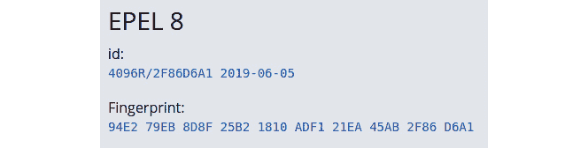

图 7.12 – Fedora 安全页面的部分截图，带有 EPEL8 gpg 指纹

正如您所看到的，是正确的。我们刚刚验证了我们使用的签名与项目管理它的公告的指纹相同，现在从该仓库下载的所有包都将使用它进行验证，以避免包篡改（即在您收到包之前有人更改内容）。

让我们回顾一下我们使用的命令，`dnf`提供了管理仓库的命令：

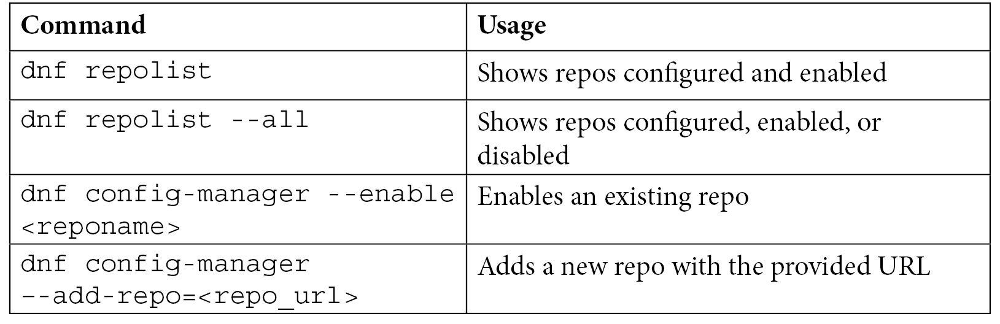

现在我们知道如何在 RHEL 中安全地管理仓库，让我们开始向系统添加更多的包，更新它们，并在需要时撤消安装。

# 使用 YUM/DNF 进行软件安装、更新和回滚

在前一节中，我们看到了如何安装一个包。在这个过程中，我们看到了一个确认请求，以确保我们确定要在系统中包含新软件。现在让我们使用`dnf install`安装软件，但使用`-y`选项来回答命令将发出的所有问题都是“是”：

```
[root@rhel8 ~]# dnf install zip –y
[omitted]
Installed:
unzip-6.0-43.el8.x86_64 zip-3.0-23.el8.x86_64                          

Complete!
```

正如您所看到的，`zip`包已经安装，还有一个名为`unzip`的依赖包，而不需要询问问题。我们还注意到`dnf`找到了依赖包，解决了**依赖关系**，并安装了所有运行一个包所需的内容。这样，系统就保持在一个一致的状态，使其更加可靠和可预测。

我们可以使用`dnf check-update`命令来查看哪些包准备更新：

```
[root@rhel8 ~]# dnf check-update
Updating Subscription Management repositories.
Last metadata expiration check: 0:20:00 ago on sáb 13 feb 2021 16:04:58 CET.

kernel.x86_64           4.18.0-240.10.1.el8_3            rhel-8-for-x86_64-baseos-rpms   
kernel-core.x86_64      4.18.0-240.10.1.el8_3           rhel-8-for-x86_64-baseos-rpms
kernel-modules.x86_64   4.18.0-240.10.1.el8_3       rhel-8-for-x86_64-baseos-rpms   
kernel-tools.x86_64      4.18.0-240.10.1.el8_3     rhel-8-for-x86_64-baseos-rpms   
kernel-tools-libs.x86_64 4.18.0-240.10.1.el8_3     rhel-8-for-x86_64-baseos-rpms   
python3-perf.x86_64      4.18.0-240.10.1.el8_3         rhel-8-for-x86_64-baseos-rpms   
qemu-guest-agent.x86_64  15:4.2.0-34.module+el8.3.0+8829+e7a0a3ea.1          rhel-8-for-x86_64-appstream-rpms
selinux-policy.noarch    3.14.3-54.el8_3.2         rhel-8-for-x86_64-baseos-rpms   
selinux-policy-targeted.noarch   3.14.3-54.el8_3.2 rhel-8-for-x86_64-baseos-rpms
sudo.x86_64              1.8.29-6.el8_3.1                 rhel-8-for-x86_64-baseos-rpms   
tzdata.noarch           2021a-1.el8                      rhel-8-for-x86_64-baseos-rpms
```

更新包并应用修复和安全补丁的最简单方法是使用`dnf update`：

```
[root@rhel8 ~]# dnf update tzdata –y
[omitted]
Upgraded:
  tzdata-2021a-1.el8.noarch                     
Complete!
```

要更新所有内容，只需运行`dnf update`而不指定包：

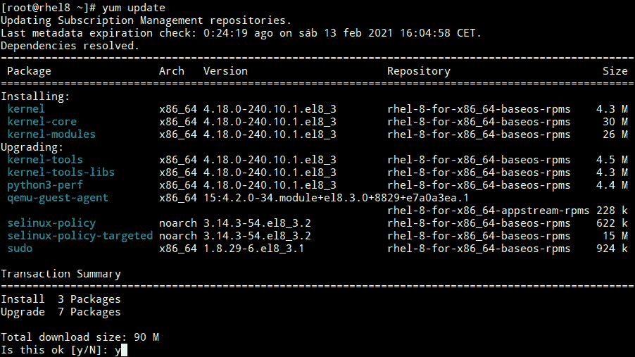

图 7.13 – RHEL 使用 dnf/yum 进行部分更新的截图

在系统中运行`dnf update`的结果如下：

```
Upgraded:
  kernel-tools-4.18.0-240.10.1.el8_3.x86_64    
  kernel-tools-libs-4.18.0-240.10.1.el8_3.x86_64  
  python3-perf-4.18.0-240.10.1.el8_3.x86_64                
  qemu-guest-agent 15:4.2.0-34.module+el8.3.0+8829+e7a0a3ea.1.x86_64
  selinux-policy-3.14.3-54.el8_3.2.noarch  
  selinux-policy-targeted-3.14.3-54.el8_3.2.noarch 
  sudo-1.8.29-6.el8_3.1.x86_64                            

Installed:
  kernel-4.18.0-240.10.1.el8_3.x86_64  
  kernel-core-4.18.0-240.10.1.el8_3.x86_64       
  kernel-modules-4.18.0-240.10.1.el8_3.x86_64       

Complete!
```

这些是系统中升级的包的示例。您的系统，根据您上次升级的时间和新发布的包，可能会有不同的输出。

重要提示

`kernel`是系统中最重要的部分。它使硬件访问和操作系统的所有基本功能都得以实现。这就是为什么，而不是升级它，会安装一个新版本。系统会保留前两个版本，以防系统无法启动，可以轻松选择其中一个来运行。

我们可以使用`dnf search`命令搜索可用的包：

```
[root@rhel8 ~]# dnf search wget
Updating Subscription Management repositories.
Last metadata expiration check: 0:05:02 ago on sáb 13 feb 2021 16:34:00 CET.
=================== Name Exactly Matched: wget ===================
wget.x86_64 : A utility for retrieving files using the HTTP or FTP protocols
```

我们可以使用`dnf info`来获取有关包的详细信息，无论是已安装还是未安装的：

```
[root@rhel8 ~]# dnf info wget
Updating Subscription Management repositories.
Last metadata expiration check: 0:06:45 ago on sáb 13 feb 2021 16:34:00 CET.
Available Packages
Name         : wget
Version      : 1.19.5
Release      : 10.el8
Architecture : x86_64
Size         : 734 k
Source       : wget-1.19.5-10.el8.src.rpm
Repository   : rhel-8-for-x86_64-appstream-rpms
Summary      : A utility for retrieving files using the HTTP or FTP protocols
URL          : http://www.gnu.org/software/wget/
License      : GPLv3+
Description  : GNU Wget is a file retrieval utility which can use either the HTTP or
             : FTP protocols. Wget features include the ability to work in the
             : background while you are logged out, recursive retrieval of
             : directories, file name wildcard matching, remote file timestamp
             : storage and comparison, use of Rest with FTP servers and Range with
             : HTTP servers to retrieve files over slow or unstable connections,
             : support for Proxy servers, and configurability.
```

我们还可以使用`dnf remove`来删除已安装的包：

```
[root@rhel8 ~]# dnf remove screen –y
[omitted]
Removed:  screen-4.6.2-10.el8.x86_64                  
Complete!
```

有时您想安装一些一起执行特定任务的包，这就是`dnf grouplist`的作用：

```
[root@rhel8 ~]# dnf grouplist | grep Tools
   Additional Virtualization Tools
   RPM Development Tools
   Security Tools
   Development Tools
   System Tools
   Graphical Administration Tools
```

您可以不使用`| grep Tools`来查看完整的列表。

让我们使用`dnf groupinstall`来安装`System Tools`组：

```
[root@rhel8 ~]# dnf groupinstall "System Tools"
Updating Subscription Management repositories.
Last metadata expiration check: 0:16:03 ago on sáb 13 feb 2021 16:34:00 CET.
Dependencies resolved.
```

上述命令的整个输出显示在以下截图中：

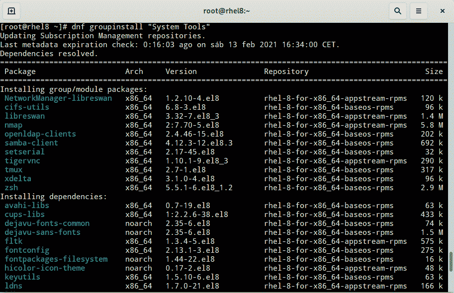

图 7.14 - RHEL 安装组 dnf/yum 的部分截图

一旦预安装完成，我们可以看到我们将安装 78 个软件包：

```
Install  78 Packages

Total download size: 44 M
Installed size: 141 M
Is this ok [y/N]:y
```

回复`y`将执行安装（请注意，`-y`选项在这里也有效，假设对所有问题都回答是）。

我们可以使用`dnf history`来检查所有安装交易的历史记录：

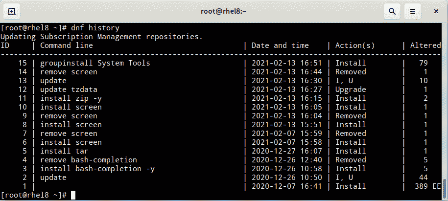

图 7.15 - RHEL dnf/yum 历史记录的部分截图

从每个交易中获取特定信息很容易，只需指定交易编号为`dnf history`：

```
[root@rhel8 ~]# dnf history info 12
Updating Subscription Management repositories.
Transaction ID : 12
Begin time     : sáb 13 feb 2021 16:27:06 CET
Begin rpmdb    : 393:cec089e1c176497af3eb97582311fcd7cb7adb02
End time       : sáb 13 feb 2021 16:27:06 CET (0 seconds)
End rpmdb      : 393:6cf80ca6746149100bb1a49d76ebbf7407804e56
User           : root <root>
Return-Code    : Success
Releasever     : 8
Command Line   : update tzdata
Comment        : 
Packages Altered:
    Upgrade  tzdata-2021a-1.el8.noarch @rhel-8-for-x86_64-baseos-rpms
    Upgraded tzdata-2020d-1.el8.noarch @@System
```

更有趣的是，我们可以回滚到以`dnf history rollback`标记的以前的某个点。为了加快速度，*安装*`lsof`软件包，然后*回滚*到以前的编号：

```
[root@rhel8 ~]# dnf history rollback 15
[omitted]
Removed:  lsof-4.93.2-1.el8.x86_64                                                                          
Complete!
```

我们也可以使用`yum history undo`来撤消单个交易。让我们看看这个交易：

```
[root@rhel8 ~]# dnf history undo 10 –y
[omitted]
Removed:
   screen-4.6.2-10.el8.x86_64 
Complete!
```

让我们回顾使用`dnf`进行的最重要的交易：

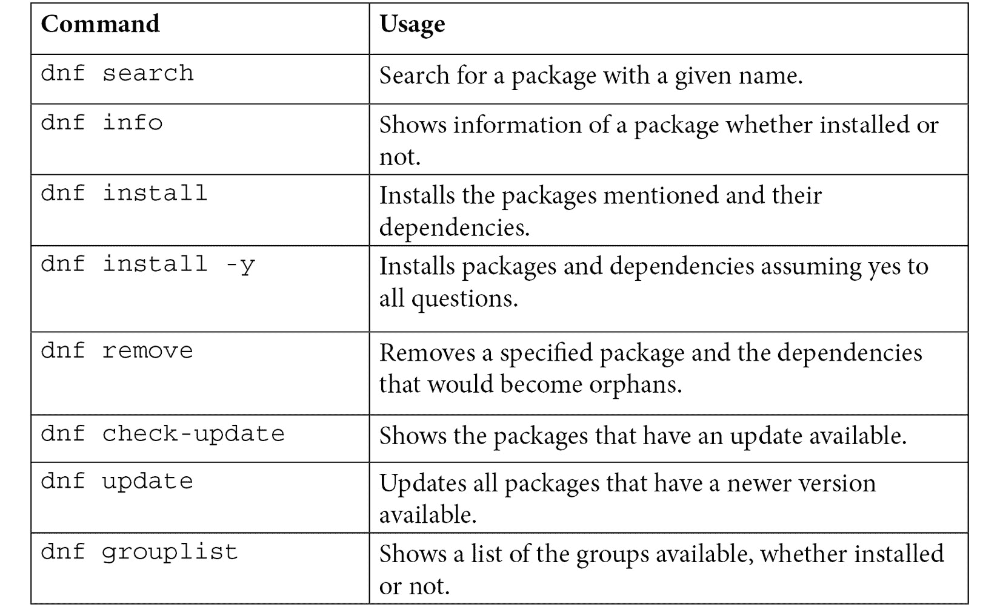

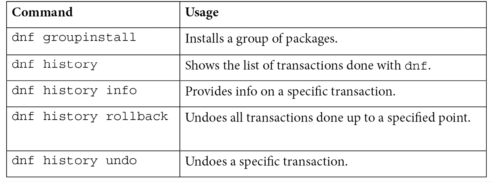

在 RHEL 8 中有一个在以前版本中不可用的新功能，即`dnf`，因此无需安装额外的软件：

```
[root@rhel8 repos]# dnf module list postgresql
Updating Subscription Management repositories.
Last metadata expiration check: 0:00:30 ago on dom 14 feb 2021 19:25:32 CET.
Red Hat Enterprise Linux 8 for x86_64 - AppStream (RPMs)
Name              Stream        Profiles                Summary
postgresql        9.6           client, server [d]        PostgreSQL server and client module      
postgresql        10 [d]        client, server [d]        PostgreSQL server and client module      
postgresql        12            client, server [d]        PostgreSQL server and client module      

Hint: [d]efault, [e]nabled, [x]disabled, [i]nstalled
```

提示

使用`dnf module list`命令，不指定任何软件包，将显示完整的模块列表。试试看！

正如您所看到的，我们在 RHEL8 中有三个不同版本的 PostgreSQL 数据库可用，分别是 9.6、10 和 12。它们都没有启用，默认版本是 10。

使用`dnf module`启用 PostgreSQL 的版本 12：

```
[root@rhel8 ~]# dnf module enable postgresql:12
[omitted]
Enabling module streams: postgresql                 12
[omitted]
Is this ok [y/N]: y
Complete!
[root@rhel8 ~]# dnf module list postgresql
```

上述命令的输出可以在以下截图中看到：

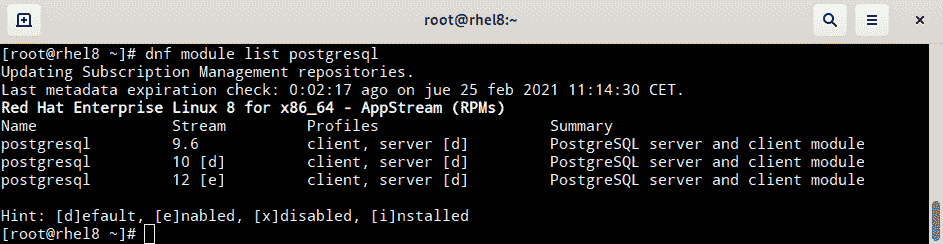

图 7.16 - PostgreSQL 模块列表的截图

从现在开始，Yum 将在此系统中安装、更新和维护 PostgreSQL 的版本 12。让我们安装它：

```
[root@rhel8 ~]# dnf install postgresql -y
[omitted] 
Installed:
  libpq-12.5-1.el8_3.x86_64          
  postgresql-12.5-1.module+el8.3.0+9042+664538f4.x86_64
Complete!
```

在前面的例子中，安装了版本 12。

我们可以删除 PostgreSQL 软件包并重置模块状态以返回到初始状态：

```
[root@rhel8 ~]# dnf remove postgresql -y
[omitted]
Removing:
postgresql  x86_64  12.5-1.module+el8.3.0+9042+664538f4  @rhel-8-for-x86_64-appstream-rpms  5.4 M
Removing unused dependencies:
libpq       x86_64  12.5-1.el8_3                         @rhel-8-for-x86_64-appstream-rpms  719 k
[omitted]
Complete!
[root@rhel8 ~]# dnf module reset postgresql
Updating Subscription Management repositories.
Last metadata expiration check: 1:23:08 ago on dom 14 feb 2021 19:25:32 CET.
Dependencies resolved.
=========================================================Package                 Architecture          Version                 Repository              Size
=========================================================Resetting modules:
postgresql                                                                                       
Transaction Summary
=========================================================Is this ok [y/N]: y
Complete!
[root@rhel8 ~]# dnf module list postgresql
Updating Subscription Management repositories.
Last metadata expiration check: 1:23:21 ago on dom 14 feb 2021 19:25:32 CET.
Red Hat Enterprise Linux 8 for x86_64 - AppStream (RPMs)
Name              Stream        Profiles                Summary
postgresql        9.6           client, server [d]        PostgreSQL server and client module      
postgresql        10 [d]        client, server [d]        PostgreSQL server and client module      
postgresql        12            client, server [d]        PostgreSQL server and client module      

Hint: [d]efault, [e]nabled, [x]disabled, [i]nstalled
```

让我们回顾一下本节中显示的模块化命令：

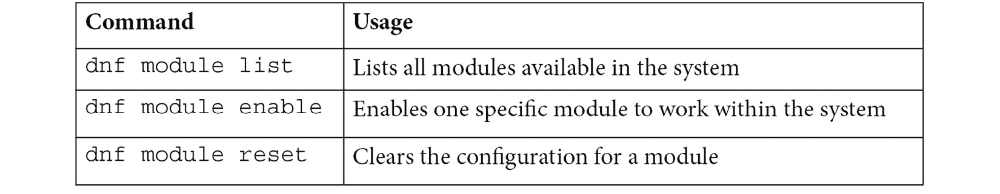

提示

要了解有关模块化的更多信息，请运行`man dnf.modularity`查看系统的手册页。

现在我们已经学会了如何在 RHEL 中处理软件交易，让我们继续学习如何创建和处理本地存储库。

# 使用 createrepo 和 reposync 创建和同步存储库

通常我们会收到一个 RPM 文件并将其保存在我们可以在自己的机器上使用的存储库中（有时还会与具有 Web 服务器或 NFS 共享的其他机器共享）。当我们开始构建自己的 RPM 时，通常会分发它们，为了这样做，我们需要创建一个存储库。为此，我们可以使用**createrepo**工具。

首先让我们在`/var/tmp`中为存储库创建一个文件夹：

```
[root@rhel8 ~]# cd /var/tmp/
[root@rhel8 tmp]# mkdir repos
[root@rhel8 tmp]# cd repos/
```

然后让我们为`slack`创建一个文件夹，这是一个与您的团队进行通信的常用工具，并下载 RPM 软件包：

```
[root@rhel8 repos]# mkdir slack
[root@rhel8 repos]# cd slack/
[root@rhel8 repos]# curl -s -O https://downloads.slack-edge.com/linux_releases/slack-4.12.2-0.1.fc21.x86_64.rpm 
[root@rhel8 slack]# ls -l
total 62652
-rw-r--r--. 1 root 64152596 feb 14 18:12 slack-4.12.2-0.1.fc21.x86_64.rpm
```

现在我们有一个带有 RPM 文件的存储库。我们可以有一个带有任意数量 RPM 的存储库，但我们将继续只使用这个单个软件包。

让我们安装`createrepo`工具：

```
[root@rhel8 slack]# dnf install -y createrepo
[omitted]
Installed:
  createrepo_c-0.15.11-2.el8.x86_64 createrepo_c-libs-0.15.11-2.el8.x86_64 drpm-0.4.1-3.el8.x86_64
Complete!
```

现在我们可以简单地运行它，在当前文件夹中使用以下命令创建一个存储库：

```
[root@rhel8 slack]# createrepo .
Directory walk started
Directory walk done - 1 packages
Temporary output repo path: ./.repodata/
Preparing sqlite DBs
Pool started (with 5 workers)
Pool finished
[root@rhel8 slack]# ls -l
total 62656
drwxr-xr-x. 2 root     4096 feb 14 18:19 repodata
-rw-r--r--. 1 root 64152596 feb 14 18:12 slack-4.12.2-0.1.fc21.x86_64.rpm
```

我们看到`repodata`文件夹已经被创建。在其中，我们可以找到定义存储库内容的`repomd.xml`文件，还有最近创建的索引文件：

```
[root@rhel8 slack]# ls repodata/
13b6b81deb95354164189de7fe5148b4dbdb247fb910973cc94c120d36c0fd27-filelists.xml.gz
18fb83942e8cb5633fd0653a4c8ac3db0f93ea73581f91d90be93256061043f0-other.sqlite.bz2
aa72116fa9b47caaee313ece2c16676dce26ffcc78c69dc74ebe4fc59aea2c78-filelists.sqlite.bz2
d5e2ff4b465544a423bfa28a4bc3d054f316302feab8604d64f73538809b1cf0-primary.xml.gz
e92cd0e07c758c1028054cfeb964c4e159004be61ae5217927c27d27ea2c7966-primary.sqlite.bz2
f68973de8a710a9a078faf49e90747baaf496c5a43865cd5dc5757512a0664a8-other.xml.gz
repomd.xml
```

现在我们可以将存储库添加到系统中。我们可以在没有`gpg`签名的情况下进行，将`gpgcheck`变量设置为`0`，但为了更好的安全性，让我们使用`gpg`签名。通过在`slack`页面搜索，我们找到签名并将其下载到`/etc/pki/rpm-gpg`目录：

```
[root@rhel8 slack]# curl https://slack.com/gpg/slack_pubkey_2019.gpg -o /etc/pki/rpm-gpg/RPM-GPG-KEY-SLACK
```

然后通过创建文件`/etc/yum.repos.d/local-slack.repo`并添加以下内容将存储库添加到系统中：

```
[local-slack-repo]
name=Local Slack Repository
baseurl=file:///var/tmp/repos/slack
enabled=1
gpgcheck=1
gpgkey=file:///etc/pki/rpm-gpg/RPM-GPG-KEY-SLACK
```

现在我们可以尝试安装`slack`。要完全运行，需要安装*带有 GUI 的服务器*软件包组，但是为了完成本练习，我们可以继续安装。我们可以通过运行`dnf -y install slack`来实现这一点-请注意`gpg`密钥如何自动导入并验证和安装软件包：

```
root@rhel8 slack]# dnf -y install slack
[omitted]
warning: /var/tmp/repos/slack/slack-4.12.2-0.1.fc21.x86_64.rpm: Header V4 RSA/SHA1 Signature, key ID 8e6c9578: NOKEY
Local Slack Repository                                              1.6 MB/s | 1.6 kB     00:00    
Importing GPG key 0x8E6C9578:
Userid     : "Slack Packages (Signing Key) <packages@slack-corp.com>"
Fingerprint: 93D5 D2A6 2895 1B43 83D8 A4CE F184 6207 8E6C 9578
From       : /etc/pki/rpm-gpg/RPM-GPG-KEY-SLACK
Key imported successfully
Running transaction check
Transaction check succeeded.
Running transaction test
Transaction test succeeded.
[omitted]
  slack-4.12.2-0.1.fc21.x86_64                      
Complete!
```

一旦出现 Slack 的新版本，我们可以将其下载到同一文件夹，并通过再次运行`createrepo`来重新生成仓库索引。这样，所有使用该仓库的系统在运行`yum update`时都会更新`slack`。这是保持所有系统标准化和版本一致的好方法。有关管理 RPM 仓库的高级功能，请查看 Red Hat Satellite。

有时我们希望在我们的系统中有仓库的本地副本。为此，我们可以使用**reposync**工具。

首先，我们安装`reposync`，它包含在`yum-utils`软件包中：

```
[root@rhel8 ~]# dnf install yum-utils -y
[omitted]
Installed:
  yum-utils-4.0.17-5.el8.noarch                                   
Complete!
```

提示

如果尝试安装`dnf-utils`软件包，将安装相同的软件包。

现在是时候禁用 Red Hat 提供的除`rhel-8-for-x86_64-baseos-rpms`之外的所有仓库了，可以使用以下命令完成：

```
[root@rhel8 ~]# subscription-manager repos --disable="*" --enable="rhel-8-for-x86_64-baseos-rpms"
```

检查变化的时间到了：

```
[root@rhel8 ~]# dnf repolist
Updating Subscription Management repositories.
repo id                                              repo name
local-slack-repo                                     Local Slack Repository
mirror.uv.es_mirror_fedora-epel_8_Everything_x86_64_ created by dnf config-manager from http://mirror.uv.es/mirror/fedora-epel/8/Everything/x86_64/
rhel-8-for-x86_64-baseos-rpms                        Red Hat Enterprise Linux 8 for x86_64 - BaseOS (RPMs)
```

我们也可以禁用其他仓库，但这次我们将以不同的方式进行，将它们重命名为不以`.repo`结尾的名称：

```
[root@rhel8 ~]# mv /etc/yum.repos.d/local-slack.repo  /etc/yum.repos.d/local-slack.repo_disabled
[root@rhel8 ~]# mv /etc/yum.repos.d/mirror.uv.es_mirror_fedora-epel_8_Everything_x86_64_.repo  /etc/yum.repos.d/mirror.uv.es_mirror_fedora-epel_8_Everything_x86_64_.repo_disabled
[root@rhel8 ~]# yum repolist
Updating Subscription Management repositories.
repo id                               repo name
rhel-8-for-x86_64-baseos-rpms         Red Hat Enterprise Linux 8 for x86_64 - BaseOS (RPMs)
```

现在我们可以使用一些选项运行`reposync`：

```
[root@rhel8 ~]# cd /var/tmp/repos
[root@rhel8 repos]# reposync --newest-only --download-metadata --destdir /var/tmp/repos
Updating Subscription Management repositories.
[omitted]
(1725/1726): selinux-policy-3.14.3-54.el8_3.2.noarch.rpm           2.3 MB/s | 622 kB     00:00    
(1726/1726): selinux-policy-devel-3.14.3-54.el8_3.2.noarch.rpm     4.1 MB/s | 1.5 MB     00:00    
[root@rhel8 repos]# ls
rhel-8-for-x86_64-baseos-rpms  slack
[root@rhel8 repos]# ls rhel-8-for-x86_64-baseos-rpms/
Packages  repodata
[root@rhel8 repos]# ls rhel-8-for-x86_64-baseos-rpms/repodata/
14d4e7f9bbf5901efa7c54db513a2ac68cb0b6650ae23a2e0bff15dc03565f25-other.sqlite.bz2
26727acbd819c59d4da7c8aeaddb027adbfb7ddb4861d31922465b4c0922f969-updateinfo.xml.gz
46f0b974d2456ad4f66dec3afff1490648f567ee9aa4fe695494ec2cfc9a88f6-primary.sqlite.bz2
580de0089dbaa82ca8963963da9cb74abf7a5c997842492210e2c10e1deac832-primary.xml.gz
5954c1ef-00bc-457b-9586-e51789358b97
a7504888345e2440fa62e21a85f690c64a5f5b9ffd84d8e525a077c955644abe-filelists.xml.gz
acad9f7dfbc7681c2532f2fd1ff56e0f4e58eb0e2be72cc1d4a4ec8613008699-comps.xml
d2e90d6a0f138e6d8ea190cf995902c821309a03606c7acc28857e186489974a-filelists.sqlite.bz2
e0a7c4b677c633b859dba5eac132de68e138223e4ad696c72a97c454f2fe70bd-other.xml.gz
repomd.xml
```

这将下载已启用通道的最新软件包。让我们来看看选项：

+   `--newest-only`：Red Hat 仓库保留自首次发布以来的所有软件包版本。这将仅下载最新版本。

+   `--download-metadata`：为了确保我们下载一个完全功能的仓库，并且不需要在其上运行`createrepo`，我们可以使用这个选项，它将检索源仓库中的所有元数据。

+   `--destdir /var/tmp/repos`：设置下载文件的目标目录。它还将为每个配置的仓库创建一个目录，因此指定的目录将是它们所有的父目录。

有了这个复制的仓库，我们还可以在隔离的环境中工作。准备测试环境可能非常方便。对于高级的仓库管理功能，请记得尝试 Red Hat Satellite。

在学习了仓库的基础知识以及如何使用它们来管理软件之后，让我们深入了解其背后的技术，即**Red Hat 软件包管理器**或**RPM**。

# 理解 RPM 内部

Linux 发行版往往有自己的软件包管理器，从 Debian 的`.deb`到 Arch Linux 中的 Pacman 和其他更奇特的机制。软件包管理器的目的是保持系统上安装的软件，更新它，修补它，保持依赖关系，并维护系统上安装的内部数据库。RPM 被 Fedora、openSUSE、CentOS、Oracle Linux 和当然还有 RHEL 等发行版使用。

要处理 RPM 包，系统中有`rpm`命令，但自从引入`yum`/`dnf`以来，它在系统管理中几乎不再使用，并且不包含在 RHCSA 中。

RPM 包含以下内容：

+   要安装在系统上的文件，以 CPIO 格式存储并压缩

+   有关每个文件的权限和分配的所有者和组的信息

+   每个软件包所需和提供的依赖关系，以及与其他软件包的冲突

+   在任何这些阶段应用的安装、卸载和升级脚本

+   确保软件包未被修改的签名

为了了解一些简单有用的命令，我们将展示一些。

检查软件包的命令包括以下内容：

+   `rpm –qa`：列出系统中安装的所有软件包

+   `rpm –qf <filename>`：显示安装了所述文件名的软件包

+   `rpm –ql <packagefile>`：列出下载软件包中包含的文件（检查先前下载的软件包很有趣）

安装、升级和删除的命令包括以下内容：

+   `rpm -i <packagefile>`：安装提供的软件包列表，不获取依赖项。

+   `rpm -U <packagefile>`：使用下载的软件包升级一个软件包。检查依赖关系，但不管理它们。

+   `rpm -e <packagename>`：删除指定的软件包，尽管它不会删除依赖项。

如果你想了解`yum`/`dnf`中的依赖管理系统是如何工作的，可以尝试使用`rpm -i`安装软件包。

重要的是要知道，所有已安装软件包的数据库都位于`/var/lib/rpm`中，并且可以使用`rpmdb`命令进行管理。

在现代时代，不得不使用`rpm`命令通常意味着有低级问题，所以最好在真实生活中使用之前先尝试在测试系统中进行测试。

通过这个，我们已经完成了 RHEL 系统中的软件管理。

# 总结

在本章中，我们已经了解了 RHEL 8 系统中软件管理的管理部分，从订阅到安装，再到模块化和其他杂项提示。

RHEL 中所有的系统修补、更新和管理都依赖于`yum`/`dnf`，简化了管理依赖关系、安装正确版本的软件以及在隔离环境中分发软件。这是系统管理员更常见的任务之一，应该完全理解。

对于红帽认证工程师级别，需要更深入地了解，包括创建 RPM 软件包，这对于在自己的环境中管理、维护和分发内部生产的软件非常有用，利用红帽提供的经验和工具。

现在我们的系统已经更新，让我们继续学习如何在即将到来的章节中远程管理它们。
