# 第八章：远程管理系统

在处理系统时，一旦安装了服务器，甚至在安装过程中，管理可以远程执行。一旦安装了一台机器，其生命周期中需要执行的任务与已经执行的任务并没有太大不同。

在本章中，我们将从连接的角度讨论如何连接到远程系统，传输文件，以及如何自动化连接，使其可以被脚本化，并在网络链接出现问题时使其具有弹性。可以在系统上执行的管理任务与我们在前几章中描述的相同，例如安装软件，配置额外的网络设置，甚至管理用户。

由于管理系统需要特权凭据，我们将重点关注可被认为是安全的可用工具，以执行此类连接，以及如何使用它们来封装其他流量。

我们将涵盖以下主题：

+   SSH 和 OpenSSH 概述和基本配置

+   使用 SSH 访问远程系统

+   使用 SSH 进行基于密钥的身份验证

+   使用 SCP/rsync 进行远程文件管理

+   高级远程管理 – SSH 隧道和 SSH 重定向

+   使用 tmux 进行远程终端管理

通过涵盖这些主题，我们将能够掌握远程系统访问，并将我们的管理技能提升到下一个水平。

让我们从下一节开始讨论 SSH 协议和 OpenSSH 客户端和服务器。

# 技术要求

您可以继续使用我们在本书开头创建的虚拟机，在*第一章* *安装 RHEL8*中。所需的任何额外软件包将在文本中指示。本章所需的任何额外文件可以从[`github.com/PacktPublishing/Red-Hat-Enterprise-Linux-8-Administration`](https://github.com/PacktPublishing/Red-Hat-Enterprise-Linux-8-Administration)下载。

# SSH 和 OpenSSH 概述和基本配置

**SSH**是**Secure Shell Host**的缩写。它开始取代传统的 telnet 使用，telnet 是一种远程登录协议，用于连接主机时不使用加密，因此用于登录的凭据以明文形式传输。这意味着在用户终端和远程服务器之间有系统的任何人都可以拦截用户名和密码，并使用该信息连接到远程系统。这类似于通过 HTTP 而不是 HTTPS 将凭据传输到 Web 服务器时发生的情况。

使用 SSH，即使在不受信任或不安全的网络上进行连接，也会在客户端和目标主机之间创建安全通道。在这里，创建的 SSH 通道是安全的，不会泄漏任何信息。

OpenSSH 提供了服务器和客户端（在**Red Hat Enterprise Linux** (**RHEL**)中的`openssh-server`和`openssh-clients`软件包），可用于连接到远程主机并允许远程主机连接。

提示

知道一切是不可能的，所以对于`rpm –ql package`来说，如果您记不住要使用哪个文件，审查软件包提供的文件列表非常重要。

默认情况下，客户端和服务器都允许连接，但有许多可以调整的选项。

## OpenSSH 服务器

OpenSSH 是基于 OpenBSD 成员创建的最后一个免费 SSH 版本的免费实现，并更新了所有相关的安全和功能。它已成为许多操作系统的标准，既作为服务器又作为客户端，以在它们之间建立安全连接。

OpenSSH 服务器的主要配置文件位于`/etc/ssh/sshd_config`（您可以使用`man sshd_config`获取有关不同选项的详细信息）。一些最常用的选项如下：

+   `AcceptEnv`：定义客户端设置的哪些环境变量将在远程主机上使用（例如，区域设置，终端类型等）。

+   `AllowGroups`：用户应该是其成员的一组组的列表，以便访问系统。

+   `AllowTcpForwarding`：允许我们使用 SSH 连接转发端口（我们将在本章后面讨论这一点，在*SSH 隧道和 SSH 重定向*部分）。

+   `DisableForwarding`：这优先于其他转发选项，使得更容易限制服务。

+   `AuthenticationMethods`：定义可以使用的身份验证方法，例如禁用基于密码的访问。

+   `Banner`：在允许身份验证之前发送给连接用户的文件。这默认为无横幅，这也可能会透露运行服务的人，这可能向可能的攻击者提供了太多数据。

+   `Ciphers`：与服务器交互时要使用的有效密码列表。您可以使用`+`或`-`来启用或禁用它们。

+   `ListenAddress`：`sshd`守护程序应该监听传入连接的主机名或地址和端口。

+   `PasswordAuthentication`：默认为是，可以禁用以阻止用户与系统进行交互连接，除非使用公钥/私钥对。

+   `PermitEmptyPasswords`：允许没有密码的帐户访问系统（默认为否）。

+   `PermitRootLogin`：定义根用户的登录方式，例如，避免根用户使用密码远程连接。

+   `Port`：与`ListenAddress`相关，这默认为`22`。这是`sshd`守护程序监听传入连接的端口号。

+   `Subsystem`：配置外部子系统的命令。例如，它与`sftp`一起用于文件传输。

+   `X11Forwarding`：这定义了是否允许`X11`转发，以便远程用户可以通过隧道连接在本地显示器上打开图形程序。

以下截图显示了我们在删除注释时系统安装的选项：

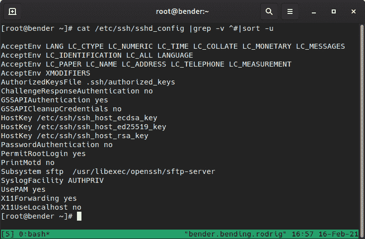

图 8.1 - 安装时在/etc/ssh/sshd_config 中定义的默认值

我们将在下一节检查配置的客户端部分。

## OpenSSH 客户端

OpenSSH 的客户端部分通过`/etc/ssh/ssh_config`文件和`/etc/ssh/ssh_config.d/`文件夹中的文件进行系统范围的配置。它们还通过每个用户的`~/.ssh/config`文件进行配置。

通常，系统范围的文件只包含一些注释，而不是实际设置，因此我们将专注于每个用户配置文件和命令行参数。

我们`~/.ssh/config`文件中的一个示例条目可能如下：

```
Host jump
    Hostname jump.example.com
    User root
    Compression yes
    StrictHostKeyChecking no
    GSSAPIAuthentication yes
    GSSAPIDelegateCredentials yes
    GSSAPIKeyExchange yes
    ProxyCommand connect-proxy -H squid.example.com:3128 %h %p
    ControlPath ~/.ssh/master-%r@%h:%p
    ControlMaster auto
```

在前面的示例中，我们定义了一个名为`jump`的条目（我们可以在`ssh jump`中使用），它将`root`用户名连接到`jump.example.com`主机。

这是一个基本设置，但我们还定义了我们将使用`ProxyCommand`中的辅助程序，该程序将利用端口`3128`上的`squid.example.com`代理服务器连接到`%h`主机和`%p`端口以到达我们的目标系统。此外，我们正在使用`Compression`并使用`ControlMaster`进行额外的`GSSAPI`身份验证。

一个具有安全影响的特性是`StrictHostKeyChecking`。当我们第一次连接到主机时，密钥在客户端和主机之间交换，并且服务器使用这些密钥来标识自己。如果它们被接受，它们将被存储在用户家目录下的`.ssh/known_hosts`文件中。

如果远程主机密钥发生变化，`ssh`客户端的终端将打印警告并拒绝连接，但当我们将`StrictHostKeyChecking`设置为`no`时，我们将接受服务器发送的任何密钥，这在我们使用频繁重新部署的测试系统时可能很有用（因此会生成新的主机密钥）。一般情况下不建议使用，因为它可以保护我们免受服务器被替换以及有人冒充我们要连接的服务器并记录用户名和密码以后访问我们系统的风险。

在接下来的部分，我们将学习如何使用`ssh`访问远程系统。

# 使用 SSH 访问远程系统

正如我们在本章前面提到的，SSH 是用于连接远程系统的协议。一般来说，其最基本形式的语法就是在终端中执行`ssh host`。

然后，`ssh`客户端将使用当前登录用户的用户名默认地在目标主机上启动与`ssh`服务器的连接，并尝试在默认的`22/tcp`端口上到达远程服务器，这是 SSH 服务的默认端口。

在下面的截图中，我们可以看到离我们的`localhost`系统最近的服务器，这意味着我们将连接到我们自己的服务器：

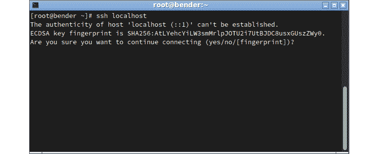

图 8.2 – 向本地主机发起 SSH 连接

在前面的截图中，我们可以看到与服务器的第一次交互打印了服务器的指纹以进行身份验证。这就是前一节讨论的内容；即`StrictHostKeyChecking`。一旦接受，如果主机密钥发生变化，连接将被拒绝，直到我们手动删除旧密钥以确认我们知道服务器的变化。

让我们添加密钥并再试一次，如下面的截图所示：

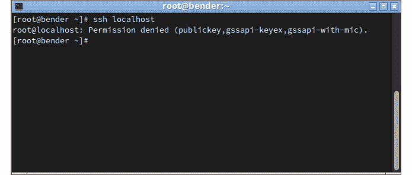

图 8.3 – 向本地主机发起 SSH 连接被拒绝

在我们的第二次尝试中，连接失败了，但让我们来看一下输出；即`Permission denied (publickey,gssapi-keyex,gssapi-with-mic)`。这是什么意思？如果我们注意到，`password`没有列出，这意味着我们无法通过密码提示连接到这个主机（这是因为我们在`/etc/ssh/sshd_config`文件中将`PasswordAuthentication`设置为`no`）。

在下面的截图中，我们可以看到一旦我们将`PasswordAuthentication`设置为`yes`，系统会要求输入密码，密码不会显示在屏幕上。一旦验证通过，我们就会得到一个 shell 提示，这样我们就可以开始输入命令了：

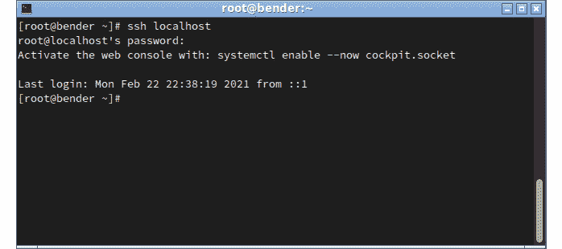

图 8.4 – SSH 连接已完成

一般来说，密码身份验证可能存在安全风险，因为键盘可能被拦截，有人可能在你身边偷看，可能会对帐户使用暴力攻击等等。因此，通常的做法是至少禁用`root`用户的密码身份验证，这意味着试图登录系统的人应该知道一个用户的用户名和密码，然后使用系统工具成为`root`。

让我们学习如何通过身份验证密钥登录禁用密码的远程系统。

# 使用 SSH 进行基于密钥的身份验证

SSH 连接的一个重要优势是可以给出要在远程主机上执行的命令，例如，获取可以用于监视的更新数据，而无需在主机上安装特定的代理。

在每次连接时提供登录详细信息并不是我们认为对用户体验有所改进的事情，但 SSH 也允许我们创建一个密钥对，用于对远程系统进行身份验证，因此不需要输入密码或凭据。

密钥包含两部分：一部分是公开的，必须在我们要连接的每个主机上进行配置，另一部分是私有的，必须得到保护，因为它将用于在我们尝试连接到远程主机时识别我们。

毋庸置疑，整个过程都是在 SSH 创建的加密连接上进行的。因此，使用 SSH 和压缩也将使我们的连接速度更快，而不是其他遗留方法，如未加密的 telnet。 

首先，让我们为身份验证创建一个密钥对。

提示

建议每个用户至少拥有一个密钥对，以便每个用户在连接到服务器时都可以基于角色拥有密钥。即使密钥可以共享给角色中的用户，最好还是让每个用户拥有自己的密钥对，以便可以单独撤销密钥。例如，我们可以保留几个`ssh`密钥对，用于不同的角色，如个人系统、生产系统、实验室系统等。必须指定用于连接的密钥对也是额外的安全措施：除非使用生产密钥对，否则我们无法连接到生产系统。

创建密钥对，我们可以使用`ssh-keygen`工具，该工具有几个选项用于创建密钥，如下面的屏幕截图所示：

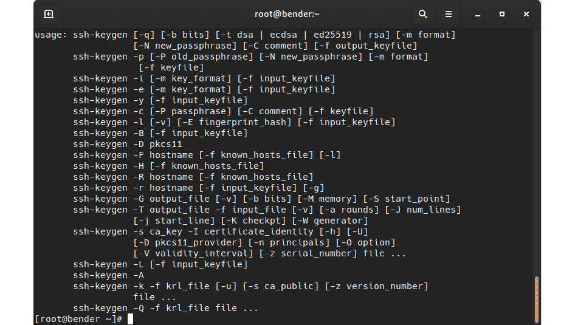

图 8.5 - ssh-keygen 选项

当没有提供参数时，默认情况下，它将为当前用户创建一个密钥，并要求为密钥设置密码。当我们使用默认值并不提供数值时，我们会得到类似于下面屏幕截图中所示的输出。

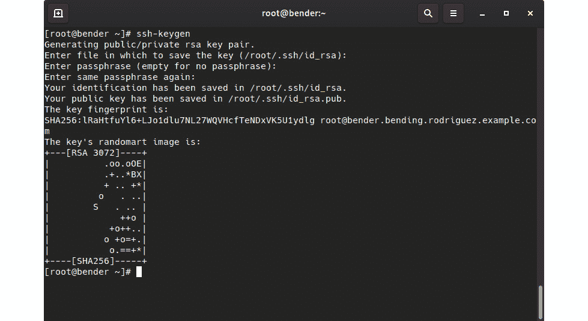

图 8.6 - ssh-keygen 执行在~/.ssh/{id_rsa,id_rsa.pub}下创建 RSA 密钥对

从这一点开始，该系统已为根用户创建了一个密钥对，并将其两部分存储在同一个文件夹中，默认情况下是`.ssh`。公共部分包含`.pub`后缀，而另一个包含私钥。

我们如何使用它们？如果我们在家目录的`.ssh`文件夹中查看，可以看到几个文件：我们有一个`authorized_keys`文件和一个`known_hosts`文件，除了刚刚创建的密钥对。`authorized_keys`文件将每行包含一个条目。这包含了可以用于此用户登录到此系统的公钥。

提示

可以与`authorized_keys`一起使用的各种选项远不止添加常规密钥 - 您还可以定义要执行的命令、密钥的到期时间、可以用于连接的远程主机，以便只有这些主机才能成功使用该密钥，等等。再次强调，`man sshd`是您的朋友，因此请查看其中的`AUTHORIZED_KEYS FILE FORMAT`部分，以了解更复杂的设置。

为了简化在远程系统上设置密钥的过程，我们有`ssh-copy-id`实用程序，它通过`ssh`连接到远程主机。这将要求输入`ssh`密码，并在我们的系统上安装可用的公钥。但是，这需要系统启用密码验证。

另一种方法是手动将我们的公钥附加到该文件（`.ssh/authorized_keys`），如下面的屏幕截图所示：

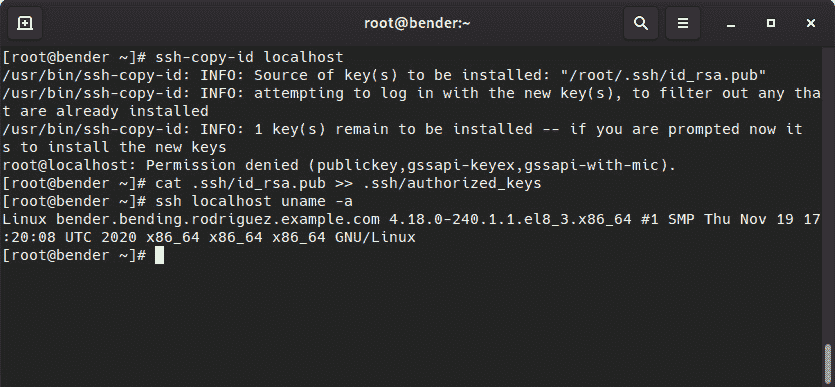

图 8.7 - ssh-copy-id 失败和私钥手动授权

第一行尝试使用`ssh-copy-id`，但由于我们启用了密码验证，它尝试复制我们的公钥并失败了。然后，我们使用`>>`将公钥附加到`authorized_keys`文件中。最后，我们演示了如何使用`ssh`连接到`localhost`并在不需要密码的情况下执行命令。

重要提示

`.ssh`文件夹和`authorized_keys`文件的权限不能太开放（例如，777）。如果是这样，`ssh`守护程序将拒绝它们，因为有人可能已经添加了新的密钥，并试图在没有真正成为系统合法用户的情况下获得访问权限。

刚刚发生的事情打开了一个新的自动化世界。使用我们的系统和远程主机之间交换的密钥，我们现在可以远程连接到它们，以交互方式运行命令或对要在远程主机上执行的命令进行脚本化。我们可以在我们的终端中检查结果。让我们考虑这个简单的脚本，用于系统负载平均值检查，可以在[`github.com/PacktPublishing/Red-Hat-Enterprise-Linux-8-Administration/blob/main/chapter-08-remote-systems-administration/loadaverage-check.sh`](https://github.com/PacktPublishing/Red-Hat-Enterprise-Linux-8-Administration/blob/main/chapter-08-remote-systems-administration/loadaverage-check.sh)找到：

```
#!/usr/bin/bash
for system in host1 host2 host3 host4;
do
    echo "${system}: $(ssh ${system} cat /proc/loadavg)"
done
```

在这个例子中，我们正在运行一个循环来连接四个系统，然后输出该系统的名称和负载平均值，如下面的屏幕截图所示：

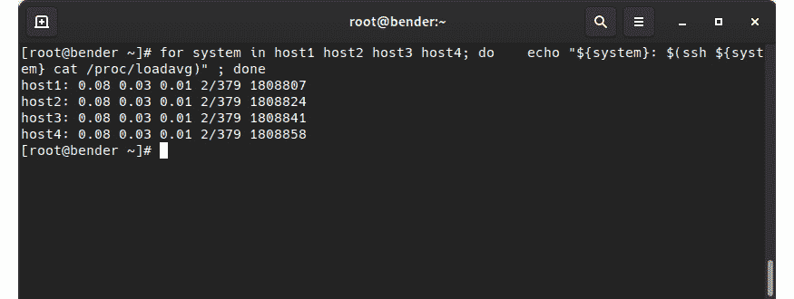

图 8.8-无密码登录到四个主机以检查其负载平均值

正如我们所看到的，我们迅速从四个主机上获取了信息。如果您想在您的环境中测试这一点，您可能想要实践一下我们在*第六章*中学到的关于在`/etc/hosts`文件中创建条目的内容，该文件指向我们想要尝试的主机名的`127.0.0.1`，以便连接到您自己的练习系统，正如我们在*第六章*中解释的那样，*启用网络连接*。

现在，想想我们远程管理系统的不同选项：

+   检查一系列主机的 IP。

+   安装更新或添加/删除一个软件包。

+   检查本地时间以防系统偏离。

+   在向系统添加新用户后重新启动一个服务。

还有更多选项，但这些是主要选项。

当然，还有更适合远程管理系统并确保错误被正确检测和处理的工具，比如使用 Ansible，但在这种情况下，对于简单的任务，我们可以继续进行。

以前，我们创建了一个密钥，并在要求输入密码时回复了`<ENTER>`。如果我们输入了密码会怎样？我们将在下一节中讨论这个问题。

## SSH 代理

如果我们决定创建一个带有密码保护的 SSH 密钥（明智的选择），我们将需要在每次使用密钥时输入密码，因此最终它可能与输入密码一样不安全，因为有人可能在我们的肩膀上观察。为了克服这一点，我们可以使用一个名为`ssh-agent`的程序，它可以临时将密码保留在内存中。这很方便，可以减少在输入密钥时有人观察的机会。

当您使用图形桌面时，比如`ssh-agent`。

当执行`ssh-agent`时，它将输出一些变量，必须在我们的环境中设置这些变量，以便我们可以利用它，如下面的屏幕截图所示：

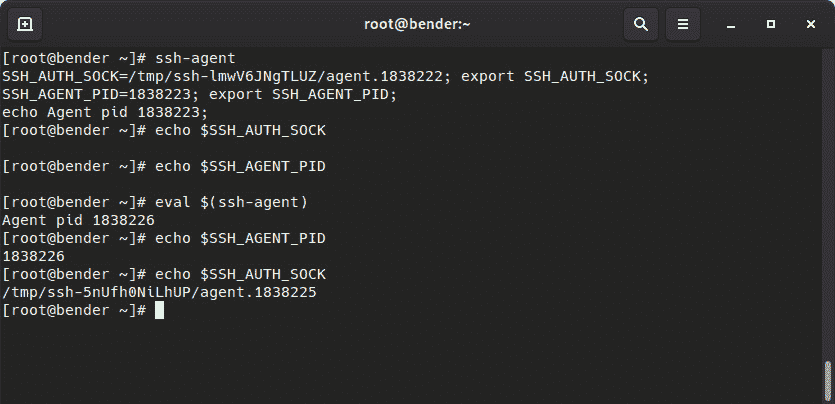

图 8.9-使用 ssh-agent 设置所需的变量

如前面的屏幕截图所示，在被执行之前，或者在我们执行代理时，这些变量是未定义的。但是，如果我们执行`eval $(ssh-agent)`，我们将实现目标，即使这些变量被定义并准备好使用。

下一步是将密钥添加到代理。这可以通过`ssh-add`命令来完成，该命令可以在不带参数的情况下使用，也可以通过指定要添加的密钥来使用。如果密钥需要密码，它将提示您输入密码。完成后，我们可能能够使用该密钥以缓存的密码登录到系统，直到我们退出执行代理的会话，从而将密码从内存中清除。

下面的屏幕截图显示了用于生成带密码的新密钥对的命令。在这里，我们可以看到唯一的区别是我们将其存储在名为`withpass`的文件中，而不是我们在本章早些时候所做的：

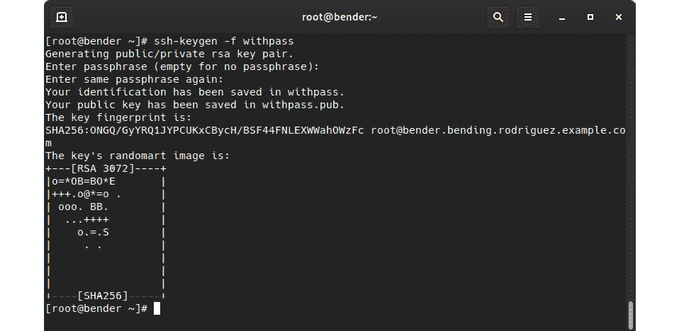

图 8.10 - 使用密码创建额外的 ssh 密钥对

我们可以看到如何连接到我们的本地主机（我们已经为其添加了带密码的公共部分到我们的`.ssh/authorized_keys`，同时删除了没有密码的部分），以及连接在下面的屏幕截图中的行为：

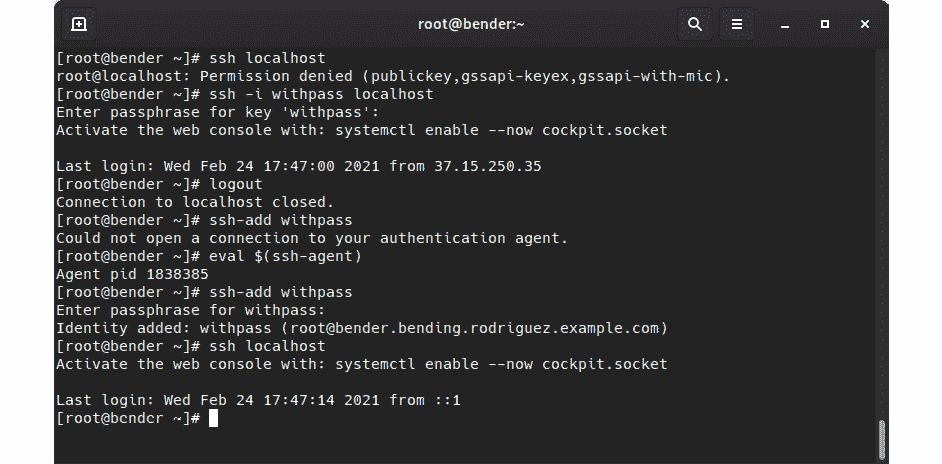

图 8.11 - 使用 ssh-agent 记住我们的密码

为了更清楚地说明这一点，让我们分析一下正在发生的事情：

1.  首先，我们`ssh`到主机。由于我们使用的默认密钥已从`authorized_keys`中删除，因此权限被拒绝。

1.  我们再次`ssh`，但在定义身份文件（密钥对）以连接时，我们可以看到，我们被要求输入密钥的密码，而不是登录到系统。

1.  然后，我们注销并关闭连接。

1.  接下来，我们尝试添加密钥，但由于我们尚未为代理设置环境变量，因此出现错误。

1.  按照我们介绍代理时的指示，我们在当前 shell 中执行加载代理环境变量的命令。

1.  当我们尝试使用`ssh-add withpass`添加密钥时，代理会要求输入我们的密码。

1.  当我们最终`ssh`到主机时，我们可以连接而无需密码，因为密钥已经在我们的密钥对的内存中。

在这里，我们已经实现了两件事：我们现在有了一个自动化/无人参与的连接系统的方法，并确保只有授权用户才能知道解锁它们的密码。

我们将在下一节学习如何进行远程文件管理！

# SCP/rsync - 远程文件管理

与`telnet`类似，许多设备和系统上已经用`ssh`替换了它，使用不安全的文件传输解决方案正在减少。默认情况下是`21`，但由于通信是明文的，因此很容易被拦截凭据。FTP 仍然被广泛使用，主要用于在只允许匿名访问并希望转移到更安全选项的服务器上提供文件。

SSH 通常启用两个接口来复制文件：`scp`和`sftp`。第一个用法类似于常规的`cp`命令，但在这里，我们接受远程主机作为我们的目标或源，而`sftp`使用了类似于与 FTP 服务器交互的传统`ftp`命令的客户端方法。只需记住，在这两种情况下，连接都是加密的，并且在目标主机上通过`22/tcp`端口进行。

我们将在下一节深入研究 SCP。

## 使用 OpenSSH 安全文件传输传输文件

`scp`命令是`openssh-clients`软件包的一部分，允许我们使用整个过程的`ssh`层在系统之间复制文件。这使我们能够安全地传输文件内容，以及通过密钥对登录引入的所有自动化功能，到各种系统。

为了设置这个例子，我们将在我们的示例系统中创建一个新用户，该用户将用于使用本节描述的工具复制文件，如下面的屏幕截图所示：

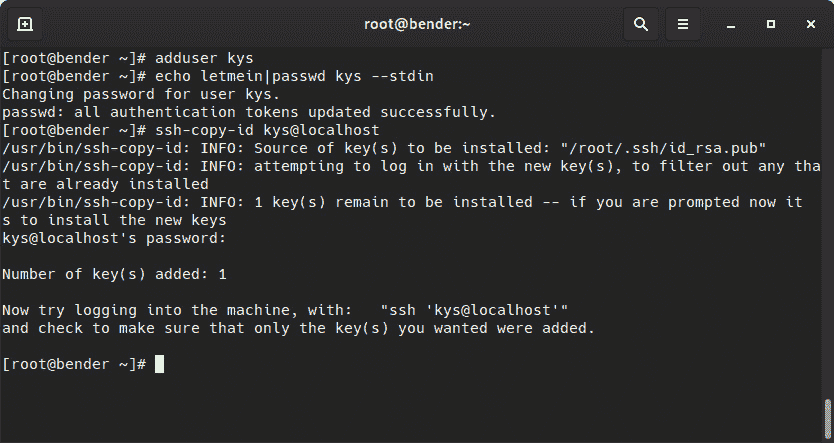

图 8.12 - 准备我们的系统，添加额外用户以练习文件传输

您可以在[`github.com/PacktPublishing/Red-Hat-Enterprise-Linux-8-Administration/blob/main/chapter-08-remote-systems-administration/create-kys-user.sh`](https://github.com/PacktPublishing/Red-Hat-Enterprise-Linux-8-Administration/blob/main/chapter-08-remote-systems-administration/create-kys-user.sh)中找到前面的命令的脚本。

一旦用户已创建并且密钥已复制，我们就可以开始测试了！

在本章的前面，我们创建了一个名为`withpass`的密钥，其公共对应物为`withpass.pub`。为了将密钥提供给新创建的用户，我们可以通过以下命令将两个文件都复制到`kys`用户：

```
scp withpass* kys@localhost:
```

让我们使用这个模板来分析命令的每个部分：

```
scp origin target
```

在我们的情况下，`origin`用`withpass.*`表示，这意味着它将选择以`withpass`字符串开头的所有文件。

我们的`target`值是一个远程主机。在这里，用户名是`kys`，主机是`localhost`，应该存储文件的文件夹是默认文件夹，通常是指定用户的主文件夹（在`:`符号后的空路径的用户）。

在下面的截图中，我们可以看到命令的输出以及我们稍后可以通过远程执行进行的验证：

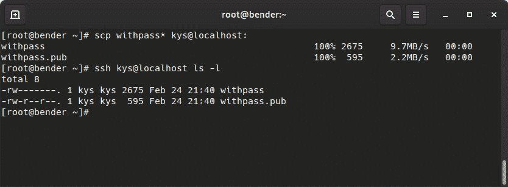

图 8.13 - 将 SCP 文件复制到远程路径并验证已复制的文件

在前面的截图中，您还可以检查由 root 用户拥有的文件是否已复制。复制的文件由`kys`用户拥有，因此文件内容相同，但由于目标上的创建者是`kys`用户，文件具有其所有权。

我们还可以通过首先指定远程文件然后将本地路径作为目标来进行更复杂的复制，以便将文件下载到我们的系统，或者甚至在远程位置之间复制文件（除非我们指定`-3`选项，否则它们将直接从`origin`到`target`）。

提示

提醒时间！`man scp`将向您显示`scp`命令的所有可用选项，但由于它基于`ssh`，我们使用`ssh`的大多数选项也可用，以及我们在`.ssh/config`文件中定义的主机定义。

我们将在下一节中探索`sftp`客户端。

## 使用 sftp 传输文件

与`scp`相比，可以像使用常规`cp`命令一样编写脚本，`sftp`具有用于浏览远程系统的交互式客户端。但是，当指定包含文件的路径时，它也可以自动检索文件。

要了解可用的不同命令，可以调用`help`命令，它将列出可用的选项，如下面的截图所示：

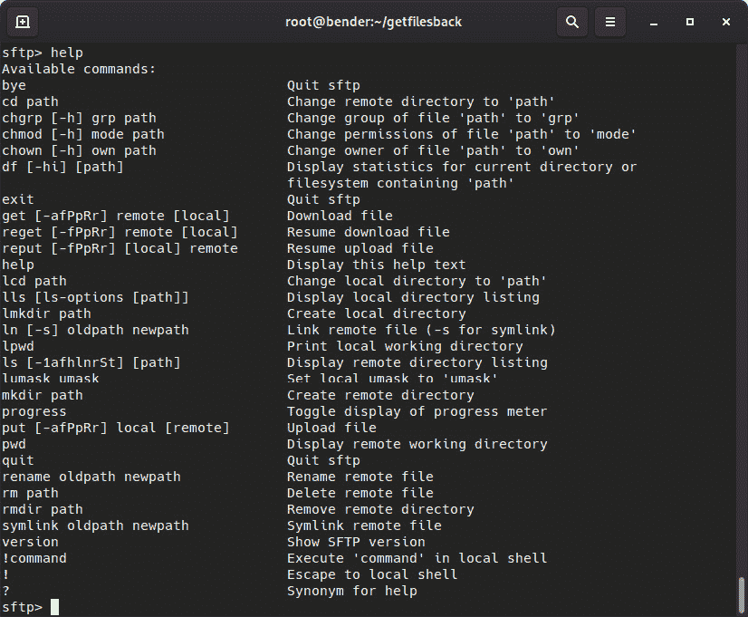

图 8.14 - 可用的 sftp 交互模式命令

让我们通过以下截图来看一个例子：

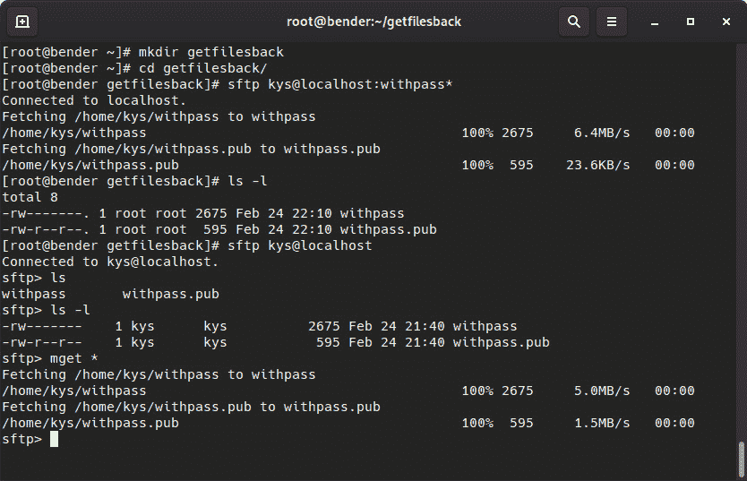

图 8.15 - sftp 的两种操作模式 - 自动传输或交互传输

在这个例子中，我们创建了一个本地文件夹作为我们的工作文件夹，名为`getfilesback`。首先，我们使用远程路径和我们识别的文件调用了`sftp`。在这里，`sftp`已自动传输了文件并停止执行。我们收到的文件现在属于我们的用户。

在第二个命令中，当我们使用用户和主机调用`sftp`并进入交互模式时，我们可以执行多个命令，类似于在远程 shell 会话上可以执行的操作。最后，使用带有`*`通配符字符的`mget`命令，我们将文件传输到我们的本地系统。

在这两种情况下，文件都已从远程系统传输到我们的本地系统，因此我们的目标已经实现。但是，使用`scp`需要知道要传输的文件的确切路径。另一方面，如果我们记不住，可能更方便使用`sftp`交互式客户端内的`ls`和`cd`命令来浏览系统，直到找到要传输的文件。

现在，让我们学习如何使用`rsync`快速传输文件和树。

## 使用 rsync 传输文件

虽然我们可以使用`scp`的`-r`选项来递归传输文件，但`scp`只处理文件的完全复制，如果我们只是想在系统之间同步一些文件夹，这并不理想。

1996 年，`rsync`推出，并且许多系统通过使用一个专用服务器来实现它，该服务器正在监听客户端连接。这是为了允许树与文件同步。这是通过复制文件之间的差异来完成的。在这里，比较了源和目标的部分，以查看是否应该复制差异。

通过`ssh`，并且在客户端和服务器上都安装了`rsync`软件包，我们可以利用`ssh`创建的安全通道和`rsync`提供的更快同步。

使用`rsync`守护程序和使用`ssh`的区别在于源或目标的语法，它要么使用`rsync://`协议，要么在主机名后使用`::`。在其他情况下，它将使用`ssh`甚至本地文件系统。

下面的截图显示了我们通过`rsync –help`命令提到的 URL 模式：

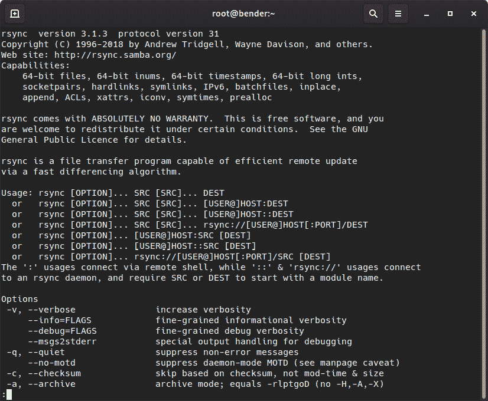

图 8.16 – rsync 命令的帮助输出

现在，让我们回顾一些我们可以与`rsync`一起使用的有用选项：

+   `-v`：在传输过程中提供更详细的输出。

+   `-r`：递归进入目录。

+   `-u`：更新 - 仅复制比目标文件更新的文件。

+   `-a`：归档（包括多个选项，如`–rlptgoD`）。

+   `-X`：保留扩展属性。

+   `-A`：保留 ACL。

+   `-S`：稀疏 - 空值序列将转换为稀疏块。

+   `--preallocate`：在传输文件之前声明所需的空间。

+   `--delete-during`：在复制过程中删除目标上没有的文件。

+   `--delete-before`：在复制之前删除目标上没有的文件。

+   `--progress`：显示复制的进度信息（已复制的文件与总文件数）。

`r``sync`算法将文件分成块，并为传输到源的每个块计算校验和。然后将它们与本地文件的校验和进行比较。我们只允许共享源和目标之间的差异。`rsync`默认不检查修改文件日期和大小，因此，如果文件在没有留下任何更改的情况下发生了更改，除非对每个候选文件强制进行校验和检查，否则可能无法检测到更改。

让我们看一些基本的例子：

+   `rsync –avr getfilesback/ newfolder/` 将会复制本地`getfilesback/`文件夹中的文件到`newfolder/`，并显示进度更新，但只针对更新的文件，如下面的截图所示：

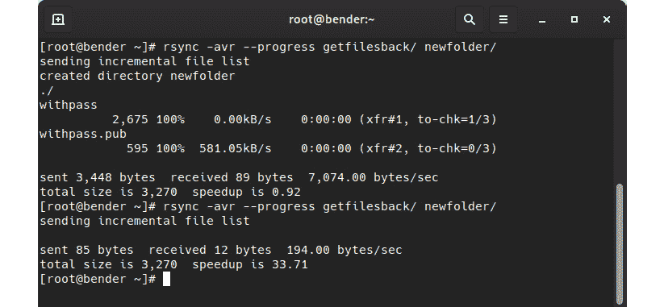

图 8.17 – 在相同的源/目标上使用的 rsync 操作，重复以说明传输优化

正如我们所看到的，第二个操作只发送了 85 字节并接收了 12 字节。这是因为在文件夹之间进行了一些校验和操作以验证，因为文件没有发生更改。如果我们使用`rsync -avr --progress getfilesback/ root@localhost:newfolder/`的远程目标方法，也可以获得相同的输出，但在这种情况下，将使用`ssh`传输。

让我们获取一些更大的示例文件，并通过在某个时间点检出 Git 存储库，传输文件，然后更新到最新版本来比较它们，以模拟对存储库的工作。然后，我们将再次进行同步。

首先，如果尚未安装，请安装`git`并执行以下代码检出一个示例存储库：

```
dnf –y install git   # install git in our system
git clone https://github.com/citellusorg/citellus.git  # clone a repository over https
cd citellus # to enter into the repository folder
git reset HEAD~400  # to get back 400 commits in history
```

此时，我们有一个准备好进行传输的文件夹。完成后，我们将执行`git pull`以与最新更改同步，并再次使用`rsync`复制差异。稍后，我们将使用`--delete`删除源上不再存在的任何文件。

让我们查看以下截图中显示的顺序：

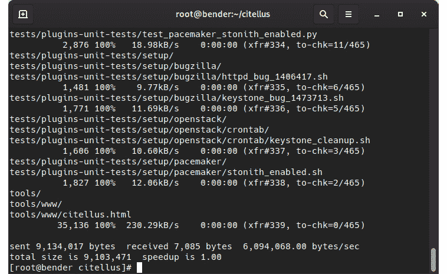

图 8.18 - 使用 rsync 将 git 文件夹同步到新文件夹

在前面的截图中，注意命令的最后一行报告的加速情况。

现在，让我们执行`git pull`以获取我们缺少的 400 个更改，并再次执行`rsync`。我们将得到类似以下的输出：

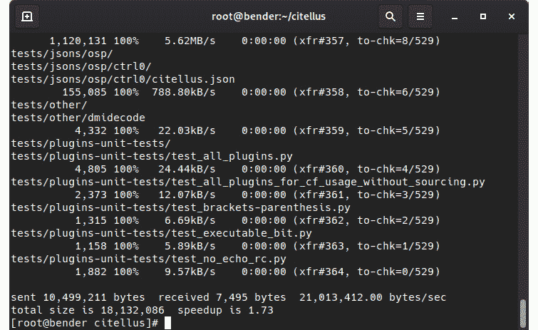

图 8.19 - 再次使用 rsync 复制差异

在前面的截图中，注意最后一行报告的加速情况，以便与之前的进行比较。

通过这一系列截图，我们可以检查发送的总字节数的最后数字，以查看传输的改进，以及一些已接收的文件（因为我们添加了`-v`修饰符以获取详细输出和`--progress`）。

最大的优势在于在较慢的网络链接上执行复制，并且定期执行，例如，作为备份目的的远程复制。这是因为`rsync`只会复制更改，更新源上已修改的更新文件，并允许我们在`ssh`通道上使用压缩。例如，可以使用`rsync`镜像[`www.kernel.org/`](https://www.kernel.org/)上的 Linux 内核。

在接下来的部分，我们将深入探讨 SSH 的一个非常有趣的功能，使得连接到没有直接访问权限的服务器变得容易。

# 高级远程管理 - SSH 隧道和 SSH 重定向

SSH 有两个非常强大的功能，即 SSH 隧道和 SSH 重定向。当建立 SSH 连接时，不仅可以用来向远程主机发送命令并让我们像在本地系统上一样工作，还可以创建相互连接我们系统的隧道。

让我们尝试想象一个在许多公司中很常见的场景，即使用 VPN 来访问内部网络和所有服务和服务器，但使用 SSH 而不是常规 VPN。

所以，让我们在这个想象的场景中加入一些背景。

我们可以使用一个接收外部流量的主机，将来自我们的互联网路由器的`ssh`重定向到该系统中的`ssh`服务。因此，简而言之，我们的路由器通过 TCP 在端口`22`上接收连接，并将连接转发到我们的服务器。在本练习中，我们将为这个服务器命名为堡垒。

在这种情况下，我们的常识告诉我们，即使我们可以使用其他工具或甚至`ssh`连接到其他系统，我们也可以通过 SSH 到达那个堡垒主机。

我们能直接连接到内部网络中的其他主机吗？答案是肯定的，因为默认情况下，SSH 允许我们使用 TCP 转发（`sshd_config`设置`AllowTcpForwarding`），这使我们作为远程登录用户能够创建端口重定向，甚至是用于我们的连接的**SOCKS**代理。

例如，我们可以使用那个堡垒主机创建一个隧道，通过**Internet Message Access Protocol**（**IMAP**）和**Simple Mail Transfer Protocol**（**SMTP**）协议到达我们的内部邮件服务器，只需执行以下代码：

```
ssh –L 10993:imap.example.com:993 –L 10025:smtp.example.com:25 user@bastionhost
```

这个命令将监听本地端口`10993`和`10025`。所有在那里执行的连接将被隧道传输，直到`bastionhost`将它们连接到端口`993`的`imap.example.com`和端口`25`的`smtp.example.com`。这允许我们的本地系统使用这些自定义端口配置我们的电子邮件帐户，并使用`localhost`作为服务器，仍然能够访问这些服务。

提示

`1024`以下的端口被视为特权端口，通常只有 root 用户才能将服务绑定到这些端口。这就是为什么我们将它们用于我们的重定向端口`10025`和`10093`，这样普通用户就可以使用它们，而不需要 root 用户执行`ssh`连接。当您尝试绑定到本地端口时，请注意`ssh`消息，以防这些端口正在使用中，因为连接可能会失败。

此外，从目标服务器的角度来看，连接将看起来好像是从堡垒服务器发起的，因为它实际上是执行连接的服务器。

当打开端口列表开始增长时，最好回到本章开头所解释的内容：`~/.ssh/config`文件可以保存主机定义，以及我们想要创建的重定向，就像这个例子中所示的那样。

```
Host bastion
    ProxyCommand none
    Compression yes
    User myuser
    HostName mybastion.example.com
    Port 330
    LocalForward 2224 mail.example.com:993
    LocalForward 2025 smtp.example.com:25
    LocalForward 2227 ldap.example.com:389
    DynamicForward 9999
```

在这个例子中，当我们连接到我们的堡垒主机（通过`ssh bastion`）时，我们会自动启用`mybastion.example.com`的`330`端口，并为我们的`imap`，`smtp`和`ldap`服务器以及`9999`端口的动态转发（SOCKS 代理）定义端口转发。如果我们有不同的身份（密钥对），我们还可以通过`IdentityFile`配置指令为每个主机定义我们希望使用的身份，甚至可以使用通配符，如`Host *.example.com`，自动将这些选项应用于以该域结尾且没有特定配置段的主机。

注意

有时，在使用`ssh`，`scp`或`sftp`时，目标是要到达一个可以从堡垒主机访问的系统。这里不需要其他端口转发 - 只需要到达这些系统。在这种情况下，您可以使用方便的`-J`命令行选项（相当于定义`ProxyJump`指令）将该主机用作跳转主机，以便到达您想要到达的最终目标。例如，`ssh -J bastion mywebsiteserver.example.com`将透明地连接到`bastion`，然后从那里跳转到`mywebsiteserver.example.com`。

在下一节中，我们将学习如何保护自己免受远程连接的网络问题，并充分利用我们的远程终端连接。

# 使用 tmux 的远程终端

`tmux`是一个终端复用器，这意味着它允许我们在单个屏幕内打开和访问多个终端。一个很好的类比是图形桌面中的窗口管理器，它允许我们打开多个窗口，这样我们就可以在只使用一个监视器的情况下切换上下文。

`tmux`还允许我们分离和重新连接会话，因此在连接中断的情况下，它是完美的工具。例如，想象一下在服务器上执行软件升级。如果由于某种原因连接中断，那么相当于突然停止了升级过程，无论它当时处于什么状态，都可能导致不良后果。但是，如果升级是在`tmux`中启动的，命令将继续执行，一旦连接恢复，会话可以重新连接，并且输出将可供检查。

首先，让我们通过`dnf -y install tmux`在我们的系统上安装它。这行将下载软件包并使`tmux`命令可用。请记住，`tmux`的目标不是在我们的系统上安装它（即使这很有用），而是让它在我们连接的服务器上可用，以便在发生断开连接时获得额外的保护层。因此，习惯于在我们连接的所有服务器上安装它是一个好习惯。

提示

在`RHEL8`之前的版本中，用于创建虚拟多路复用终端的工具是`screen`，它已被标记为不推荐使用，并且只能通过`EPEL`存储库获得。如果您习惯于它的键绑定（`CTRL-A + <key`>），那么在`tmux`中大多数都是等效的（`CTRL-B + <key>`）。

在下面的截图中，我们可以看到在命令行上执行`tmux`后`tmux`的默认配置是什么样子的：

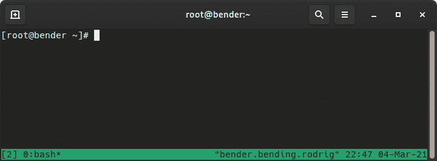

图 8.20 – 执行后的 tmux 默认布局

如前面的截图所示，我们的终端的视图并没有改变太多，除了窗口下部的状态栏。这显示了有关主机的一些信息，例如其名称，时间，日期以及打开窗口的列表，其中`0:bash`是活动窗口，如星号（`*`）符号所示。

有很多组合可以使用`tmux`，让我们熟悉一些最初的用例：

+   运行`tmux`以创建一个新会话。

+   运行`tmux at`以附加到先前的会话（例如，在重新连接到主机后）。

+   运行`tmux at –d`以附加到先前的会话并从中分离其他连接。

一旦我们进入`tmux`，就有一整套命令可以使用，这些命令都是以`CTRL+B`键为前缀的。让我们查看一些重要的命令（请记住在使用列表中的下一个项目之前必须先按下*Ctrl + B*）：

+   `?`：显示有关要使用的快捷键的内联帮助。

+   `c`：创建一个新窗口。

+   `n`/`p`：转到下一个/上一个窗口。

+   `d`：分离`tmux`会话。

+   `0-9`：转到按下数字编号的窗口。

+   `,`：重命名窗口。

+   `"`：水平分割窗格。

+   `%`：垂直分割窗格。

+   `space`：切换到下一个布局。

+   `&`：关闭窗口。

+   `Pg down`/`pg up`：在窗口历史记录中向上或向下移动。

+   箭头键：选择按下的方向中的窗格。

让我们在下面的截图中看一个示例：

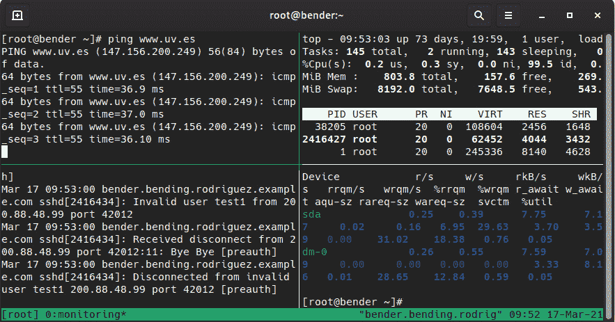

图 8.21 – tmux 中有四个窗格，在同一个窗口内运行不同的命令

正如我们所看到的，有几个命令同时运行 – `top`，`journalctl –f`，`iostat –x`和`ping` – 因此这是在执行操作时监视系统的好方法。

此外，`tmux`的一个优点是可以进行脚本化，因此如果我们在管理系统时使用一个布局，我们可以复制该脚本，并在连接到它们时立即执行它，这样我们就可以享受相同的布局甚至正在执行的命令。

如果您想在您的系统上尝试，可以在[`github.com/PacktPublishing/Red-Hat-Enterprise-Linux-8-Administration/blob/main/chapter-08-remote-systems-administration/term.sh`](https://github.com/PacktPublishing/Red-Hat-Enterprise-Linux-8-Administration/blob/main/chapter-08-remote-systems-administration/term.sh)找到带有额外注释和描述的以下代码：

```
#!/bin/bash
SESSION=$USER
tmux -2 new-session -d -s $SESSION # create new session
tmux select-window -t $SESSION:0  # select first window
tmux rename-window -t $SESSION "monitoring" #rename to monitoring
tmux split-window –h #split horizontally
tmux split-window –v #split vertically
tmux split-window –h # split again horizontally
tmux select-layout tiled #tile panes
tmux selectp –t1 # select pane 1
tmux send-keys "top" C-m #run top by sending the letters + RETURN
tmux selectp –t2 # select pane 2
tmux send-keys "journalctl -f" C-m # run journalctl
tmux selectp –t3 # select pane 3
tmux send-keys "iostat -x" C-m # run iostat
tmux selectp –t0 #select the pane without commands executed
```

一旦设置了带有`tmux`的会话，我们可以通过执行`tmux`附加到刚刚创建和配置的会话，这将显示类似于前面截图中显示的布局。

# 总结

在本章中，我们介绍了 SSH 以及如何使用它连接到远程系统，如何使用密钥进行身份验证，无论是否需要密码，以及如何利用它进行自动化，传输文件，甚至通过端口重定向使服务可访问或可达。通过`tmux`，我们学会了如何使我们的管理会话在网络中断时保持存活，并且通过自动化布局一目了然地显示重要信息。

在下一章中，我们将深入探讨通过 firewalld 来保护我们的系统网络，以仅暴露所需的服务。
