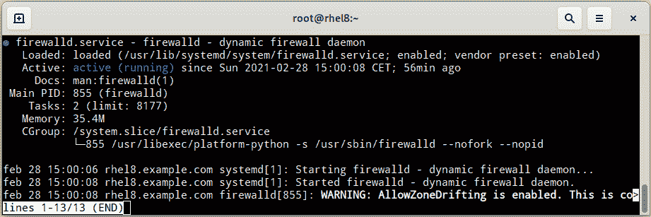
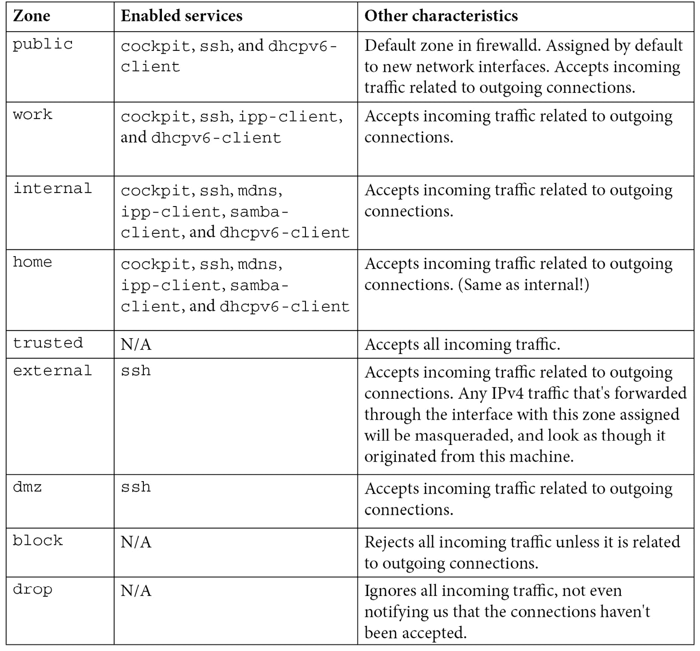
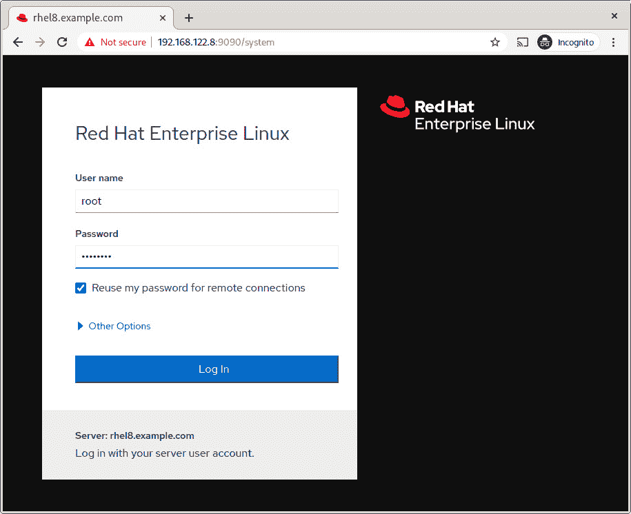
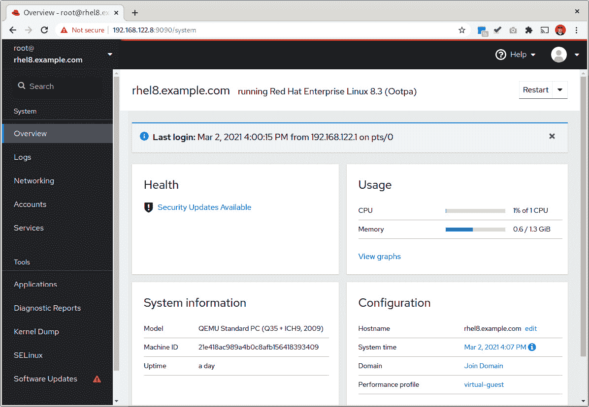
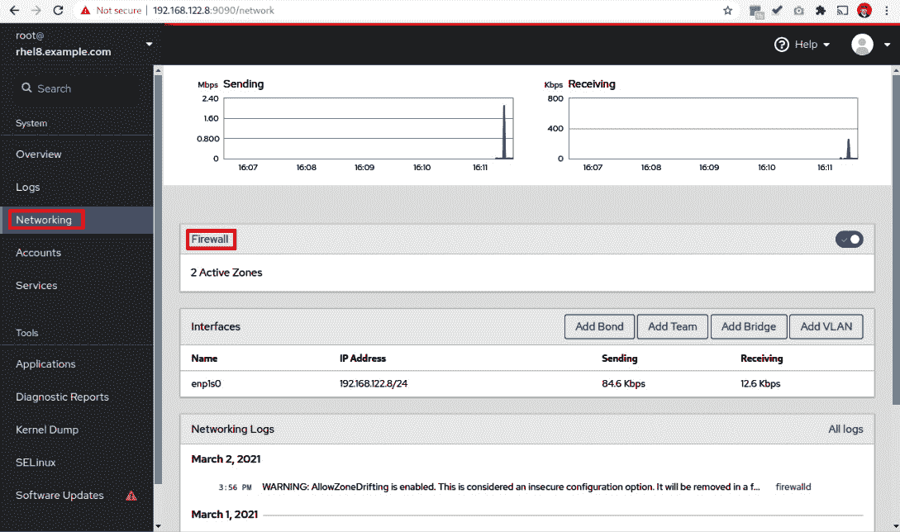
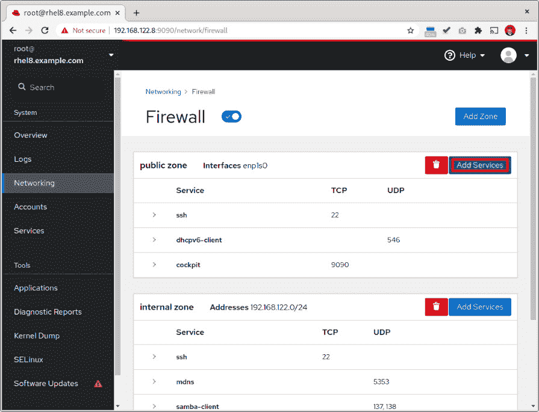
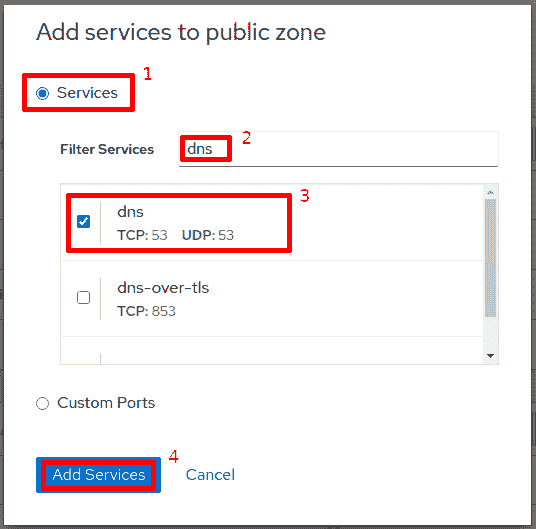
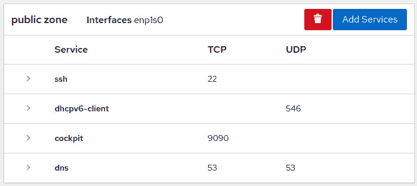

# 第九章：使用 firewalld 保护网络连接

一位在军事受限环境中工作的优秀导师和技术专家曾经告诉我：“唯一安全的系统是关闭的系统，断开任何网络连接，并埋在沙漠中。”当然，他是对的，但我们必须提供服务使系统有用。这意味着让它运行并连接到网络。

在安全中使用的一种技术是减少事件发生，例如避免意外暴露漏洞和启用未经授权的远程访问，这是减少攻击面和应用深度防御原则的步骤之一。在网络中这样做的第一步是使用`firewall-cmd`和`systemd`服务单元来过滤连接，以简化其管理。

在本章中，我们将涵盖以下主题，以便更好地了解如何管理 RHEL 中的默认防火墙：

+   介绍 RHEL 防火墙 - firewalld

+   在系统上启用 firewalld 并查看默认区域

+   审查 firewalld 下的不同配置项

+   启用和管理服务和端口

+   创建和使用 firewalld 的服务定义

+   使用 Web 界面配置 firewalld

# 介绍 RHEL 防火墙 - firewalld

RHEL 带有两种低级网络流量过滤机制：`firewall-cmd`）。在本节中，我们将查看 RHEL 中的防火墙默认设置。

firewalld 默认安装在系统中，我们可以使用`rpm`命令来检查，因此无需安装它：

```
[root@rhel8 ~]# rpm -qa | grep firewalld
firewalld-filesystem-0.8.2-2.el8.noarch
firewalld-0.8.2-2.el8.noarch
```

如果由于某种原因我们的安装不包括 firewalld，我们可以通过运行`dnf install firewalld`来安装它。

firewalld 包括一个名为`firewalld`的服务，默认情况下配置为在启动时运行。我们可以使用`systemctl status firewalld`命令来检查这一点：



图 9.1 - "systemctl status firewalld"的输出

正如我们所看到的，`firewalld`服务已启用并正在运行。这是 RHEL 系统的默认状态。

系统管理员配置 firewalld 的主要方式是使用`firewall-cmd`命令。但是，您也可以执行以下操作：

+   在`/etc/firewalld/`中添加带有服务定义的新文件（如本章的*创建和使用 firewalld 的服务定义*部分所述）

+   使用名为**cockpit**的 Web 界面配置防火墙（如本章的*使用 Web 界面配置 firewalld*部分所述）

+   在您的桌面环境中使用`firewall-config`图形界面

在本章中，我们将回顾主要机制和 Web 界面。

现在我们知道了 RHEL 主防火墙的默认设置，让我们学习如何启用它。

# 在系统上启用 firewalld 并查看默认区域

我们已经看到了`systemctl`。让我们停止`firewalld`服务：

```
[root@rhel8 ~]# systemctl stop firewalld
[root@rhel8 ~]# systemctl status firewalld
  firewalld.service - firewalld - dynamic firewall daemon
   Loaded: loaded (/usr/lib/systemd/system/firewalld.service; enabled; vendor preset: enabled)
   Active: inactive (dead) since Sun 2021-02-28 17:36:45 CET; 4s ago
     Docs: man:firewalld(1)
  Process: 860 ExecStart=/usr/sbin/firewalld --nofork --nopid $FIREWALLD_ARGS (code=exited, status=>
Main PID: 860 (code=exited, status=0/SUCCESS)

feb 28 17:36:19 rhel8.example.com systemd[1]: Starting firewalld - dynamic firewall daemon...
feb 28 17:36:20 rhel8.example.com systemd[1]: Started firewalld - dynamic firewall daemon.
feb 28 17:36:20 rhel8.example.com firewalld[860]: WARNING: AllowZoneDrifting is enabled. This is co>
feb 28 17:36:45 rhel8.example.com systemd[1]: Stopping firewalld - dynamic firewall daemon...
feb 28 17:36:45 rhel8.example.com systemd[1]: firewalld.service: Succeeded.
feb 28 17:36:45 rhel8.example.com systemd[1]: Stopped firewalld - dynamic firewall daemon.
```

在上一个输出中，如粗体所示，服务处于非活动状态。我们可以使用`firewall-cmd --state`命令来检查这一点：

```
[root@rhel8 ~]# firewall-cmd --state
not running
```

目前，防火墙服务已停止，所有规则已被删除。然而，服务的配置并未更改，因此如果我们重新启动系统，firewalld 将会再次运行。

提示

我们可以通过运行`nft list table filter`命令始终查看底层的`netfilter`规则。您可能希望在停止服务之前和之后运行它以查看差异。

现在，让我们尝试重新启动服务：

```
[root@rhel8 ~]# systemctl start firewalld
[root@rhel8 ~]# systemctl status firewalld
  firewalld.service - firewalld - dynamic firewall daemon
   Loaded: loaded (/usr/lib/systemd/system/firewalld.service; enabled; vendor preset: enabled)
   Active: active (running) since Sun 2021-02-28 17:43:31 CET; 7s ago
     Docs: man:firewalld(1)
Main PID: 1518 (firewalld)
    Tasks: 2 (limit: 8177)
   Memory: 23.3M
   CGroup: /system.slice/firewalld.service
           └─1518 /usr/libexec/platform-python -s /usr/sbin/firewalld --nofork –nopid
```

让我们检查 firewalld 是否正在运行：

```
[root@rhel8 ~]# firewall-cmd --state
running
```

要完全禁用服务，我们需要运行以下命令：

```
[root@rhel8 ~]# systemctl disable firewalld
Removed /etc/systemd/system/multi-user.target.wants/firewalld.service.
Removed /etc/systemd/system/dbus-org.fedoraproject.FirewallD1.service.
```

让我们看看服务已禁用但仍在运行：

```
[root@rhel8 ~]# systemctl status firewalld -n0
  firewalld.service - firewalld - dynamic firewall daemon
   Loaded: loaded (/usr/lib/systemd/system/firewalld.service; disabled; vendor preset: enabled)
   Active: active (running) since Sun 2021-02-28 17:43:31 CET; 8min ago
     Docs: man:firewalld(1)
Main PID: 1518 (firewalld)
    Tasks: 2 (limit: 8177)
   Memory: 24.1M
   CGroup: /system.slice/firewalld.service
           └─1518 /usr/libexec/platform-python -s /usr/sbin/firewalld --nofork –nopid
```

当您使用`systemctl`管理服务时，您需要了解启用和禁用服务只影响启动顺序中的行为，而启动和停止只影响服务的当前状态。

提示

要在一条命令中禁用和停止，我们可以使用`--now`选项；例如，`systemctl disable firewalld --now`。此选项也可用于启用和启动；例如，`systemctl enable firewalld --now`。

让我们重新启用服务，并确保它正在运行：

```
[root@rhel8 ~]# systemctl enable firewalld --now
Created symlink /etc/systemd/system/dbus-org.fedoraproject.FirewallD1.service → /usr/lib/systemd/system/firewalld.service.
Created symlink /etc/systemd/system/multi-user.target.wants/firewalld.service → /usr/lib/systemd/system/firewalld.service.
[root@rhel8 ~]# firewall-cmd --state
running
```

现在我们知道如何启动和停止，以及启用和禁用`firewalld`服务，让我们通过审查默认配置来了解配置结构并学习如何与其交互。

## 审查 firewalld 下的不同配置项

firewalld 在其配置中管理三个概念：

+   **区域**：firewalld 区域是一组规则，可以一起激活并分配给网络接口。它包括不同的服务和规则，还包括改变网络流量过滤行为的设置。

+   **服务**：firewalld 服务是必须一起配置的端口或端口组，以便特定系统服务（因此得名）能够正常工作。

+   `80`）和流量类型（即 TCP），可用于手动启用网络流量到自定义系统服务。

firewalld 管理两种类型的配置：

+   **运行**：当前应用于系统的规则。

+   **永久**：已保存的规则，将在服务启动时加载。

重要提示

运行与永久之间的概念是在运行系统中尝试网络过滤规则，一旦确保它们运行良好，就将它们保存为永久规则。记得检查你想要的规则是否已经正确保存在系统中。

现在，让我们检查一下我们的系统，看看有哪些可用的区域：

```
[root@rhel8 ~]# firewall-cmd --get-zones
block dmz drop external home internal nm-shared public trusted work
```

我们还可以检查默认应用的区域是哪个：

```
[root@rhel8 ~]# firewall-cmd --get-default-zone
public
```

让我们通过查看以下表格来回顾 firewalld 中可用的区域：



重要提示

您可以随时通过访问系统中可用的`firewalld.zones`手册页面来获取有关这些区域以及更多信息。一个很好的练习是查看前面提到的手册页面。

上述服务将在下一节中进行更详细的审查。现在，让我们学习如何管理区域。

让我们将默认区域更改为`home`：

```
[root@rhel8 ~]# firewall-cmd --set-default-zone=home
success
[root@rhel8 ~]# firewall-cmd --get-default-zone
home
```

我们可以将`public`区域设为默认，并将`home`区域分配给我们的本地网络：

```
[root@rhel8 ~]# firewall-cmd --set-default-zone=public
success
[root@rhel8 ~]# firewall-cmd --permanent --zone=internal \
--add-source=192.168.122.0/24
success
[root@rhel8 ~]# firewall-cmd --reload
success
[root@rhel8 ~]# firewall-cmd --get-active-zones
internal
  sources: 192.168.122.0/24
public
  interfaces: enp1s0
```

此配置允许我们仅将服务发布到本地网络，该网络被定义为`192.168.122.0/24`，并分配给`internal`区域。从现在开始，分配给`internal`区域的任何服务或端口只有在从内部网络的 IP 地址访问时才能访问。我们避免允许其他网络访问这些服务。

此外，要使服务可以从任何其他网络访问，我们只需要将它们分配给`public`区域。

让我们回顾一下常用的主要选项，以及可能有用的一些其他选项：

+   `--get-zones`：列出系统中已配置的区域。

+   `--get-default-zone`：显示默认配置的区域。

+   `--set-default-zone=<zone>`：设置默认区域。这将应用于运行和永久配置。

+   `--get-active-zones`：显示正在使用的区域以及它们适用于哪些网络/接口。

+   `--zone=<zone>`：用于为另一个选项指定区域。

+   `--permanent`：用于将更改应用于保存的配置。当使用此选项时，更改将不会应用于运行配置。

+   `--reload`：加载保存的配置作为运行配置。

+   `--add-source=<network>`：将源网络（CIDR 格式）添加到指定的区域。如果未指定区域，则使用默认区域。更改将应用于运行配置；使用`--permanent`来保存它们。

+   `--remove-source=<network>`：从指定的区域中删除源网络（CIDR 格式）。如果未指定区域，则使用默认区域。更改将应用于运行配置；使用`--permanent`来保存它们。

+   `--add-interface=<interface>`：将来自接口的流量路由到一个区域。如果没有指定，默认区域将被使用。

+   `--change-interface=<interface>`：更改路由到接口的流量到一个区域。如果没有指定，将使用默认区域。

尽管这些选项列表可能非常有用，但完整的选项列表可在`firewall-cmd`的手册页上找到。您应该经常使用它来重新配置防火墙选项。

提示

要查看`firewall-cmd`的手册页，只需运行`man firewall-cmd`。

既然我们知道了区域是什么以及它们是如何选择的，让我们学习如何管理服务和端口。

# 启用和管理服务和端口

正如我们在前一节中提到的，**firewalld 服务**是一种端口或一组端口，它们被一起配置为特定系统服务（因此得名）以使其正常工作。有一组服务在一个或多个可用的**firewalld 区域**中默认启用。让我们从回顾它们开始：

+   `22`，是`TCP`类型。

+   `224.0.0.251`（IPv4）或`ff02::fb`（IPv6），端口`5353`，是`UDP`类型。

+   `631`，使用`UDP`协议。

+   `137`和`138`，是`UDP`类型。

+   `fe80::/64`，端口`546`，是`UDP`类型。

+   `9090`，它是`TCP`类型。

如您所见，firewalld 服务可以指定多个端口、目标地址，甚至目标网络。

现在，让我们看看在我们的防火墙中配置的服务：

```
[root@rhel8 ~]# firewall-cmd --list-services
cockpit dhcpv6-client ssh
[root@rhel8 ~]# firewall-cmd --list-services --zone=internal
cockpit dhcpv6-client mdns samba-client ssh
```

请注意，当您没有建立一个区域时，显示的服务是与默认区域相关的服务 - 在这种情况下是`public`。但是，请考虑我们配置了多个区域。

现在，让我们安装一个 Web 服务器 - 在这种情况下，是 Apache `httpd`服务器：

```
[root@rhel8 ~]# dnf install httpd -y
Updating Subscription Management repositories.
Last metadata expiration check: 0:25:05 ago on lun 01 mar 2021 17:02:09 CET.
Dependencies resolved.
====================================================================================================
Package       Arch   Version                                Repository                        Size
====================================================================================================
Installing:
httpd         x86_64 2.4.37-30.module+el8.3.0+7001+0766b9e7 rhel-8-for-x86_64-appstream-rpms 1.4 M
Installing dependencies:
apr           x86_64 1.6.3-11.el8                           rhel-8-for-x86_64-appstream-rpms 125 k
[omitted]
Installed:
  apr-1.6.3-11.el8.x86_64
  apr-util-1.6.1-6.el8.x86_64                          
  apr-util-bdb-1.6.1-6.el8.x86_64                                  
  apr-util-openssl-1.6.1-6.el8.x86_64                              
  httpd-2.4.37-30.module+el8.3.0+7001+0766b9e7.x86_64      
  httpd-filesystem-2.4.37-30.module+el8.3.0+7001+0766b9e7.noarch 
  httpd-tools-2.4.37-30.module+el8.3.0+7001+0766b9e7.x86_64   
  mailcap-2.1.48-3.el8.noarch  
  mod_http2-1.15.7-2.module+el8.3.0+7670+8bf57d29.x86_64 
  redhat-logos-httpd-81.1-1.el8.noarch                      

Complete!
```

让我们启用并启动`httpd`服务：

```
[root@rhel8 ~]# systemctl enable httpd --now
Created symlink /etc/systemd/system/multi-user.target.wants/httpd.service → /usr/lib/systemd/system/httpd.service.
[root@rhel8 ~]# systemctl status httpd -n0
● httpd.service - The Apache HTTP Server
   Loaded: loaded (/usr/lib/systemd/system/httpd.service; enabled; vendor preset: disabled)
   Active: active (running) since Mon 2021-03-01 17:31:57 CET; 8s ago
     Docs: man:httpd.service(8)
Main PID: 2413 (httpd)
   Status: "Started, listening on: port 80"
    Tasks: 213 (limit: 8177)
   Memory: 25.0M
   CGroup: /system.slice/httpd.service
           ├─2413 /usr/sbin/httpd -DFOREGROUND
           ├─2414 /usr/sbin/httpd -DFOREGROUND
           ├─2415 /usr/sbin/httpd -DFOREGROUND
           ├─2416 /usr/sbin/httpd -DFOREGROUND
           └─2417 /usr/sbin/httpd -DFOREGROUND
```

现在，让我们检查服务是否在所有接口上监听：

```
[root@rhel8 ~]# ss -a -A "tcp" | grep http
LISTEN    0         128                 *:http                  *:*
```

可选地，我们可以使用外部机器检查端口是否打开（如果有的话）：

```
[root@external:~]# nmap 192.168.122.8
Starting Nmap 7.80 ( https://nmap.org ) at 2021-03-01 17:45 CET
Nmap scan report for rhel.redhat.lan (192.168.122.8)
Host is up (0.00032s latency).
Not shown: 998 filtered ports
PORT     STATE  SERVICE
22/tcp   open   ssh
9090/tcp closed zeus-admin
MAC Address: 52:54:00:E6:B4:A4 (QEMU virtual NIC)

Nmap done: 1 IP address (1 host up) scanned in 5.15 seconds
```

现在，我们可以在防火墙上启用`http`服务：

```
[root@rhel8 ~]# firewall-cmd --add-service http \
--zone=public --permanent
success
[root@rhel8 ~]# firewall-cmd --add-service http \
--zone=internal --permanent
success
[root@rhel8 ~]# firewall-cmd --reload
success
[root@rhel8 ~]# firewall-cmd --list-services
cockpit dhcpv6-client http ssh
[root@rhel8 ~]# firewall-cmd --list-services --zone=internal
cockpit dhcpv6-client http mdns samba-client ssh
```

有了这个，服务已经启用，端口已经打开。我们可以从外部机器验证这一点（这是可选的）：

```
[root@external:~]# nmap 192.168.122.8
Starting Nmap 7.80 ( https://nmap.org ) at 2021-03-01 17:50 CET
Nmap scan report for rhel.redhat.lan (192.168.122.8)
Host is up (0.00032s latency).
Not shown: 997 filtered ports
PORT     STATE  SERVICE
22/tcp   open   ssh
80/tcp   open   http
9090/tcp closed zeus-admin
MAC Address: 52:54:00:E6:B4:A4 (QEMU virtual NIC)

Nmap done: 1 IP address (1 host up) scanned in 5.18 seconds
```

我们现在可以看到端口`80`已经打开。我们还可以从 Web 服务器检索主页并显示第一行：

```
[root@external:~]# curl -s http://192.168.122.8 | head -n 1
<!DOCTYPE html PUBLIC "-//W3C//DTD XHTML 1.1//EN" "http://www.w3.org/TR/xhtml11/DTD/xhtml11.dtd">
```

重要提示

firewalld 中的服务定义保存在`/usr/lib/firewalld/services`目录中的独立文件中。如果您需要查看服务的详细信息，可以去那里检查文件和其定义。

现在，让我们尝试从公共网络中删除该服务，因为这将是一个内部服务：

```
[root@rhel8 ~]# firewall-cmd --list-services --zone=public
cockpit dhcpv6-client http ssh
[root@rhel8 ~]# firewall-cmd --remove-service http \
--zone=public --permanent
success
[root@rhel8 ~]# firewall-cmd --reload
success
[root@rhel8 ~]# firewall-cmd --list-services --zone=public
cockpit dhcpv6-client ssh
```

假设我们没有服务定义，但仍然想在`public`接口上打开`TCP`端口`80`：

```
[root@rhel8 ~]# firewall-cmd --list-ports --zone=public

[root@rhel8 ~]# firewall-cmd --add-port 80/tcp --zone=public --permanent
success
[root@rhel8 ~]# firewall-cmd --reload
success
[root@rhel8 ~]# firewall-cmd --list-ports --zone=public
80/tcp
```

我们可以一次性查看端口和服务，如下所示：

```
[root@rhel8 ~]# firewall-cmd --list-all --zone=public
public (active)
  target: default
  icmp-block-inversion: no
  interfaces: enp1s0
  sources: 
  services: cockpit dhcpv6-client ssh
  ports: 80/tcp
  protocols: 
  masquerade: no
  forward-ports: 
  source-ports: 
  icmp-blocks: 
  rich rules:
```

现在，我们可以移除该端口：

```
[root@rhel8 ~]# firewall-cmd --list-ports --zone=public
80/tcp
[root@rhel8 ~]# firewall-cmd --remove-port 80/tcp --zone=public --permanent
success
[root@rhel8 ~]# firewall-cmd --reload
success
[root@rhel8 ~]# firewall-cmd --list-ports --zone=public

[root@rhel8 ~]#
```

有了这个，我们知道如何向防火墙添加和删除服务和端口，并检查它们的状态。让我们回顾一下我们可以用于`firewall-cmd`的选项：

+   `--zone=<zone>`：用于指定一个区域。当没有指定区域时，将使用默认区域。

+   `--list-services`：显示指定区域的服务列表。

+   `--add-service`：将服务添加到指定区域。

+   `--remove-service`：从指定区域中删除一个服务。

+   `--list-ports`：列出指定区域中打开的端口。

+   `--add-port`：将端口添加到指定区域。

+   `--remove-port`：从指定区域中删除一个端口。

+   `--list-all`：列出与指定区域相关的端口、服务和所有配置项。

+   `--permanent`：规则将应用于保存的配置，而不是运行的配置。

+   `--reload`：从保存的配置重新加载规则。

现在我们知道如何在防火墙中为不同的区域分配服务和端口，让我们来看看它们是如何定义的。

# 创建和使用 firewalld 的服务定义

firewalld 的服务定义存储在`/usr/lib/firewalld/services`目录中。让我们看一下一个简单的服务，比如存储在`ssh.xml`文件中的`ssh`服务，它具有以下内容：

```
<?xml version="1.0" encoding="utf-8"?>
<service>
  <short>SSH</short>
  <description>Secure Shell (SSH) is a protocol for logging into and executing commands on remote machines. It provides secure encrypted communications. If you plan on accessing your machine remotely via SSH over a firewalled interface, enable this option. You need the openssh-server package installed for this option to be useful.</description>
  <port protocol="tcp" port="22"/>
</service>
```

在这里，我们可以看到我们只需要一个包含三个部分的 XML 文件来描述一个基本服务：

+   `short`: 服务的简称

+   `description`: 服务的详细描述

+   `port`: 为此服务打开的端口

假设我们想在服务器上安装 Oracle 数据库。我们必须打开`1521`端口，并且它必须是`TCP`类型。让我们创建`/etc/firewalld/services/oracledb.xml`文件，内容如下：

```
<?xml version="1.0" encoding="utf-8"?>
<service>
  <short>OracleDB</short>

  <description>Oracle Database firewalld service. It allows connections to the Oracle Database service. You will need to deploy Oracle Database in this machine and enable it for this option to be useful.</description>
  <port protocol="tcp" port="1521"/>
</service>
```

我们可以使用以下代码来启用它：

```
[root@rhel8 ~]# firewall-cmd --reload
success
[root@rhel8 ~]# firewall-cmd --add-service oracledb
success
[root@rhel8 ~]# firewall-cmd --list-services
cockpit dhcpv6-client oracledb ssh
```

现在，它已经准备好在运行配置中使用。我们可以这样将其添加到永久配置中：

```
[root@rhel8 ~]# firewall-cmd --add-service oracledb --permanent
success
```

提示

很少需要打开更复杂的服务。无论如何，描述如何创建 firewalld 服务的手册页面是`firewalld.service`，可以通过运行`man firewalld.service`来打开。

有了这个，我们可以很容易地标准化要在我们系统的防火墙中打开的服务。我们可以将这些文件包含在我们的配置存储库中，以便与整个团队共享。

现在我们可以创建一个服务，让我们看一种更简单的方式来配置 RHEL 防火墙；也就是使用 Web 界面。

# 使用 Web 界面配置 firewalld

要使用 RHEL8 的 RHEL Web 管理界面，我们必须安装它。运行它的软件包和服务都称为`cockpit`。我们可以通过运行以下代码来安装它：

```
[root@rhel8 ~]# dnf install cockpit -y
Updating Subscription Management repositories.
[omitted]     
Installing:
cockpit                      x86_64 224.2-1.el8             rhel-8-for-x86_64-baseos-rpms     74 k
[omitted]     
  cockpit-224.2-1.el8.x86_64                      
  cockpit-bridge-224.2-1.el8.x86_64               
  cockpit-packagekit-224.2-1.el8.noarch           
  cockpit-system-224.2-1.el8.noarch               
  cockpit-ws-224.2-1.el8.x86_64                         

Complete!
```

现在，让我们启用它：

```
[root@rhel8 ~]# systemctl enable --now cockpit.socket
Created symlink /etc/systemd/system/sockets.target.wants/cockpit.socket → /usr/lib/systemd/system/cockpit.socket.
```

提示

Cockpit 使用了一个巧妙的技巧来节省资源。界面被停止，但启用了一个套接字来监听端口`9090`。当它接收到连接时，cockpit 就会启动。这样，它只会在使用时消耗您机器上的资源。

现在，让我们学习如何将`DNS`服务添加到`public`区域。

让我们通过将浏览器指向机器的 IP 和端口`9090`来访问 cockpit – 在这种情况下，`https://192.168.122.8:9090`。让我们使用在安装过程中提供的密码以`root`身份登录：



图 9.2 – Cockpit 登录界面

现在，我们可以访问 cockpit 仪表板，其中包含有关系统的信息：



图 9.3 – Cockpit 初始界面和仪表板

现在，让我们转到**网络**，然后点击**防火墙**，如下面的截图所示：



图 9.4 – Cockpit 访问防火墙配置

在这一点上，我们可以点击**添加服务**在**公共区域**部分来修改它并添加一个服务：



图 9.5 – Cockpit 防火墙配置界面

将**dns**服务添加到防火墙的**公共区域**部分的步骤很简单：

1.  点击**服务**。

1.  通过输入`dns`来筛选服务。

1.  选择**dns**服务，使用**TCP:53**和**UDP:53**。

1.  点击**添加服务**：



图 9.6 – Cockpit 防火墙 – 将服务添加到公共区域

一旦你这样做了，该服务将被添加到运行和永久配置中。它将显示在 cockpit 的**公共区域**部分上：



图 9.7 – Cockpit 防火墙 – 将 DNS 服务添加到公共区域的结果

有了这个，我们知道如何使用 Web 界面对 RHEL8 中的防火墙进行修改。我们将把在本章开头使用命令行进行的配置删除并重新进行，但这次使用 Web 界面。

# 总结

安全性是系统管理的一个非常重要的部分。仅仅因为系统在隔离网络中就禁用安全措施是违背了深度防御原则的，因此这是极为不鼓励的。

在本章中，我们看到了在 RHEL8 中使用 firewalld 配置防火墙是多么简单和容易，从而为我们提供了另一个工具来管理、过滤和保护系统中的网络连接。我们还使用了 cockpit，这是一个使这项任务更加直观和易于执行的 Web 管理工具。

我们现在可以控制系统的网络连接，提供我们想要提供的服务，并为它们增加一层安全性。我们还知道如何管理区域以及如何根据系统的用例来使用它们。我们现在可以定义我们自己的自定义服务，以便我们始终可以为它们过滤网络连接。我们现在还可以通过使用 RHEL 中包含的防火墙来部署更安全的系统。

现在，我们准备在下一章中学习更多关于 RHEL 中的安全性。记住，安全是一个团队运动，系统管理员是关键。
