# 第十章：*第十章*：使用 SELinux 保护系统

在本章中，我们将熟悉 SELinux。SELinux 已经存在一段时间了，但对其工作原理的不了解导致许多人建议禁用它。

这不是我们想要的，因为这就像告诉用户放弃密码因为难记一样。

我们将介绍 SELinux 的起源，以及默认模式和策略是什么。然后，我们将了解 SELinux 如何应用于我们的文件、文件夹和进程，以及如何将它们恢复到系统默认值。

此外，我们将探讨如何使用布尔值对策略进行微调，并通过以下部分的帮助解决常见问题：

+   强制和宽松模式下的 SELinux 使用

+   审查文件和进程的 SELinux 上下文

+   使用 semanage 调整策略

+   将更改的文件上下文恢复为默认策略

+   使用 SELinux 布尔设置启用服务

+   SELinux 故障排除和常见修复

最后，我们将更好地了解如何正确使用 SELinux 以及如何从它为我们的系统提供的额外保护中受益。

在本章中，将详细解释 SELinux 的工作原理，以帮助我们了解它的运作方式，即使在现实中使用它也要简单得多。我们还将使用这些示例来说明 SELinux 防止攻击或配置错误的情况。

让我们亲自动手使用 SELinux！

# 技术要求

可以继续使用本书开头创建的虚拟机*第一章*中的练习，*安装 RHEL8*。本章所需的任何额外软件包都将在文本旁边标明，并可从[`github.com/PacktPublishing/Red-Hat-Enterprise-Linux-8-Administration`](https://github.com/PacktPublishing/Red-Hat-Enterprise-Linux-8-Administration)下载。

# 强制和宽松模式下的 SELinux 使用

**安全增强型 Linux**（**SELinux**）于 2000 年 12 月通过 Linux-Kernel 邮件列表推出，是由**国家安全局**（**NSA**）启动的产品，旨在通过强制访问控制和基于角色的访问控制来提高操作系统的安全性，而不是系统中可用的传统自主访问控制。

在 Linux 内核引入 SELinux 之前，关于正确的实施方式进行了讨论，最终引入了一个名为**Linux 安全模块（LSM）**的内核框架，并使用它实施了 SELinux，以便其他方法也可以使用 LSM，而不仅仅是 SELinux。

SELinux 为 Linux 提供了安全改进，用户、进程甚至其他资源对文件的访问可以以非常精细的方式进行控制。

让我们举一个例子来更清楚地说明 SELinux 何时发挥作用：当 Web 服务器从用户中提供页面时，它会从用户的主目录中的`public_html`或`www`文件夹（最常见的文件夹）读取文件。能够从用户的主目录中读取文件可能会在 Web 服务器进程被攻击者劫持时泄露内容，而正是在这一刻，SELinux 发挥作用，因为它将自动阻止对 Web 服务器不应访问的文件的访问。

然后，SELinux 限制进程和服务只执行它们应该执行的操作，并且只使用经授权的资源。这是一个非常重要的功能，即使在可能导致访问意外文件或资源的软件错误的情况下也能保持控制。如果没有经活动策略授权，SELinux 将阻止它。

重要提示

如果用户由于不正确的文件权限而无法访问文件，那么 SELinux 权限总是在常规**自主访问控制**（**DAC**）之后出现。SELinux 在这里无能为力。

默认情况下，系统安装应该以“强制执行”模式部署，并使用“定向”策略。可以通过执行`sestatus`来检查当前系统状态，如下面的屏幕截图所示：

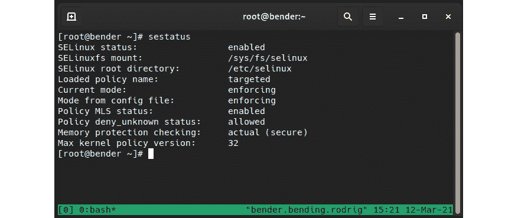

图 10.1 – 我们系统的 sestatus 输出

正如我们所看到的，我们的系统已经启用了 SELinux，并使用了“定向”策略，目前处于“强制执行”状态。让我们了解一下这意味着什么。

SELinux 通过在系统中定义`dnf list selinux-policy-*`来工作，“定向”和`mls`是最常见的。

我们将专注于定向策略，但为了对`mls`进行类比，`su`或`sudo`，它们仍然会附加原始标签，因此如果通过本地终端或远程连接进行根登录和`sudo`执行，权限可能会降低。

列为“强制执行”的模式意味着当前正在执行策略，这与“宽松”相反。我们可以将其视为处于活动状态并提供保护，而“宽松”则意味着处于活动状态但只提供警告，不提供保护。

为什么我们有“宽松”而不是只禁用呢？这个问题有点棘手，所以让我们更详细地解释一下它的工作原理，以提供更好的答案。

SELinux 使用文件系统中的扩展属性来存储标签。每次创建文件时，都会根据策略分配一个标签，但只有在 SELinux 处于活动状态时才会发生这种情况，因此这使得 SELinux“禁用”与 SELinux“宽松”不同，因为前者不会为新创建的文件创建这些标签。

此外，SELinux 在“宽松”模式下允许我们查看如果程序没有得到良好的策略或文件没有适当的标签将会引发的错误。

从“强制执行”切换到“宽松”和反之都非常容易，始终通过`setenforce`命令进行，而我们可以使用`getenforce`来检索当前状态，如下面的屏幕截图所示：

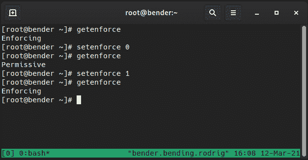

图 10.2 – 改变 SELinux 强制执行状态

这可能看起来很基础，但实际上就是这么简单，只是运行一个命令而已。但是，如果状态被禁用，情况将完全不同。

SELinux 状态通过编辑`/etc/selinux/config`文件进行配置，但更改只有在系统重新启动后才会生效；也就是说，我们可以实时从“强制执行”切换到“宽松”，或从“宽松”切换到“强制执行”，但当从“禁用”切换到“启用”，或反之，则需要重新启动系统。

一般建议是将 SELinux 保持在强制执行模式，但如果出于任何原因它被禁用，建议在从“禁用”切换时首先将 SELinux 切换到“宽松”。这将使我们能够检查系统是否实际上可以正常工作，而不会因为内核阻止对文件和资源的访问而被锁定在外面。

注意

在从“禁用”切换到“宽松”或“强制执行”后的重新启动过程中，系统将根据策略强制重新标记文件系统。这是通过在我们文件系统的根文件夹中创建一个名为`/.autorelabel`的文件来实现的，这将触发该过程，并在之后再次重启。

但为什么选择禁用而不是“宽松”？例如，一些软件可能需要将其设置为禁用模式，即使以后可以重新启用以进行操作或出于其他原因，但请记住 SELinux 是一项保护系统的安全功能，应该保留。

请记住，SELinux 使用`/var/log/audit/audit.log`文件以及系统日志，是一个缓存，因此规则不会被频繁检查，以加快操作速度。

让我们回到文件系统存储标签的概念，并跳转到下一节，看看它们与进程、文件以及 SELinux 提供的 RBAC 之间的关系。

# 审查文件和进程的 SELinux 上下文

SELinux 使用标签，也称为附加到每个文件的安全上下文，并定义了几个方面。让我们用`ls –l`命令在我们的 home 文件夹中检查一个示例，但使用一个特殊的修饰符`Z`，它也会显示 SELinux 属性，如下截图所示：

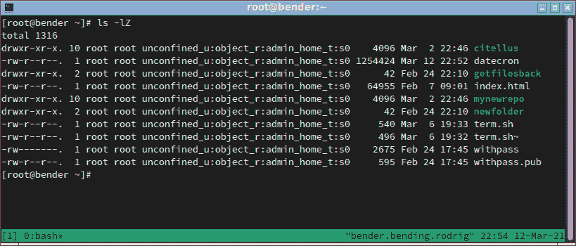

图 10.3 – 显示 SELinux 属性的文件列表

让我们专注于其中一个文件的输出：

```
-rw-r--r--.  1 root unconfined_u:object_r:admin_home_t:s0     540 Mar  6 19:33 term.sh
```

SELinux 属性是列为`unconfined_u:object_r:admin_home_t:s0`的属性：

+   `unconfined_u`

+   `object_r`

+   `admin_home_t`

+   `s0`在多级安全和多类别安全中

进程也会发生类似的情况，同样，我们可以在许多常见命令后添加`Z`来获取上下文，例如，使用`ps Z`，如下截图所示：

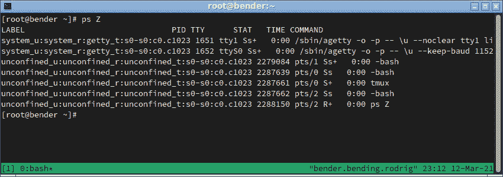

图 10.4 – 带有 SELinux 上下文的 ps 输出

再次，让我们检查其中一行：

```
unconfined_u:unconfined_r:unconfined_t:s0-s0:c0.c1023 2287661 pts/0 S+   0:00 tmux
```

同样，我们可以看到相同的方法：用户、角色、类型和多级安全和多类别安全。

现在我们已经介绍了它的外观，让我们专注于它在有针对性的策略中的工作方式。

有针对性的策略允许所有东西都可以像系统中没有启用 SELinux 一样运行，除了它所针对的服务。这在安全性和可用性之间取得了很好的平衡。

在策略开发过程中，会添加新的服务，同时对其他服务进行改进，并且对许多最常见的服务编写了保护它们的策略。

SELinux 还具有名为**转换**的功能。转换允许由用户启动的一个进程，具有某个特定角色的二进制文件，通过执行转换为其他角色，后者用于定义其权限。

正如你所想象的那样，我们的用户也有一个 SELinux 上下文，同样，我们可以使用`id -Z`命令来检查它：

```
unconfined_u:unconfined_r:unconfined_t:s0-s0:c0.c1023
```

因此，回到第一个例子，Apache Web 服务器由`httpd`软件包提供，可以通过`dnf –y install httpd`进行安装。安装后，让我们使用`systemctl start httpd`启动它，并使用`systemctl enable httpd`启用它，然后使用`firewall-cmd --add-service=http`和`firewall-cmd --add-service=https`打开防火墙，就像我们在前几章中对其他服务所做的那样。

先前的命令可以在以下脚本中找到：[`github.com/PacktPublishing/Red-Hat-Enterprise-Linux-8-Administration/blob/main/chapter-10-selinux/apache.sh`](https://github.com/PacktPublishing/Red-Hat-Enterprise-Linux-8-Administration/blob/main/chapter-10-selinux/apache.sh)。

让我们看看以下截图中所有这些是如何发挥作用的：

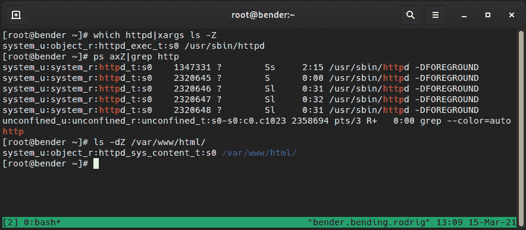

图 10.5 – Web 服务器 SELinux 上下文

在这里，我们可以看到磁盘上的可执行文件具有上下文`httpd_exec_t`，进程是`httpd_t`，它提供的文件/文件夹是`httpd_sys_content_t`，它可以工作！

现在让我们在我们的`home`文件夹中创建一个`index.htm`文件，并将其移动到`Apache Web Root`文件夹中，如下所示：

```
# echo '<html><head><title>Our test</title></head><body>This is our test html</body></html>' > index.htm
# cp index.htm /var/www/html/index2.htm
# mv index.htm /var/www/html/index1.htm
```

让我们看看当我们尝试访问文件时会发生什么，如下截图所示：

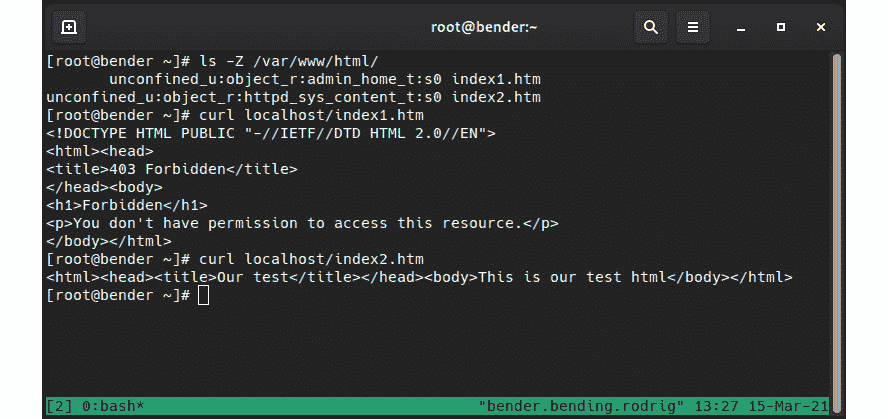

图 10.6 – Apache 生成文件的行为

正如我们所看到的，每个文件都有一个 SELinux 上下文，但除此之外，Apache 拒绝访问我们移动的文件(`index1.htm`)，但显示我们复制的文件(`index2.htm`)的内容。

这里发生了什么？我们复制了一个文件并移动了另一个文件，来自同一个源，但它们具有两个不同的 SELinux 上下文。

让我们扩展测试，如下截图所示：

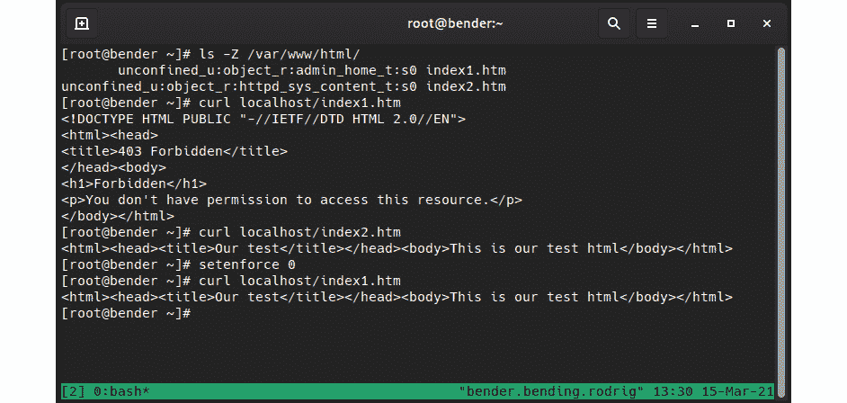

图 10.7 – 在 SELinux 的宽容模式下重试

正如我们在前面的截图中所看到的，我们现在能够访问文件内容，所以你可以说：“SELinux 有什么问题，不允许我的网站工作？”，但正确的表达方式应该是：“看看 SELinux 如何保护我们不让个人文件在网站上泄露”。

如果不是直接将文件移动到 Apache 的`/var/www/html`，而是攻击者试图访问我们的家庭文件夹文件，SELinux 将默认拒绝这些访问。`httpd_t`进程无法访问`admin_home_t`上下文。

当我们尝试让 Apache 或任何其他受目标策略约束的服务监听默认配置的端口之外的端口时，类似的事情会发生，了解我们可以或不可以做什么的最佳方法是学习`semanage`实用程序。

使用`semanage`，我们可以列出、编辑、添加或删除策略中的不同值，甚至导出和导入我们的自定义内容，所以让我们使用它来通过我们的`httpd`示例学习更多关于它的知识。

让我们在下一节学习关于`semanage`的知识。

# 使用 semanage 调整策略

正如我们之前介绍的，目标策略包含一些为其定义的服务强制执行的配置，允许保护这些服务，同时不干扰它不知道的服务。

有时候我们需要调整一些设置，比如允许`http`或`ssh`守护程序监听备用端口或访问其他文件类型，但又不失去 SELinux 提供的额外保护层。

首先，让我们确保在我们的系统中安装了`policycoreutils`和`policycoreutils-python-utils`，使用`dnf –y install policycoreutils-python-utils policycoreutils`，因为它们提供了我们将在本章和下一节中使用的工具。

让我们通过一个例子来学习。让我们看看`httpd_t`可以访问哪些端口，使用`semanage port -l|grep http`命令：

```
http_cache_port_t              tcp      8080, 8118, 8123, 10001-10010
http_cache_port_t              udp      3130
http_port_t                    tcp      80, 81, 443, 488, 8008, 8009, 8443, 9000
```

正如我们所看到的，`http_port_t`，由 Apache 守护程序使用，默认情况下允许使用`tcp`的端口`80`、`81`、`443`、`488`、`8008`、`9009`、`8443`和`9000`。

这意味着如果我们想在这些端口中的任何一个上运行 Apache，不需要对策略进行任何更改。

如果我们重复这个命令，但是对于`ssh`，我们只看到端口`22`被打开（执行`semanage port -l|grep ssh`）：

```
ssh_port_t                     tcp      22
```

例如，我们可能想要添加另一个端口，比如`2222`，到可能端口的列表中，以便隐藏标准端口被端口扫描器测试。我们可以通过`semanage port -a -p tcp -t ssh_port_t 2222`来实现，然后使用先前的命令`semanage port –l|grep ssh`进行验证，现在显示如下：

```
ssh_port_t                     tcp      2222, 22
```

正如我们所看到的，端口`2222`已经添加到`ssh_port_t`类型的可用端口列表中，这使得`ssh`守护程序可以开始监听它（当然，这需要在我们获得可用服务之前对`ssh`守护程序配置和防火墙进行额外的配置）。

同样地，例如，一些网络服务需要写入特定文件夹以存储配置，但默认情况下，`/var/www/html`上的上下文是`httpd_sys_content_t`，不允许写入磁盘。

我们可以通过`semanage fcontext –l`检查可用的文件上下文，类似于我们对端口所做的方式，但是文件列表很长，因为 Web 服务器可能使用常见位置，如`logs`和`cgi-bin`，以及用于证书、配置和家目录的文件系统文件，以及 PHP 等扩展名。当您使用前面的命令检查上下文时，注意可用的不同类型以及一个列表的结构是什么，例如：

```
/var/www/html(/.*)?/wp-content(/.*)?               all files          system_u:object_r:httpd_sys_rw_content_t:s0
```

正如我们所看到的，有一个正则表达式匹配`/var/www/html`路径内`wp-content`文件夹中的文件，适用于所有文件，并设置了`httpd_sys_rw_content_t`的 SELinux 上下文，这允许读写访问。这个文件夹被流行的博客软件**WordPress**使用，因此策略已经准备好覆盖一些最受欢迎的服务、文件夹和要求，而无需系统管理员自行编写。

在调用`semanage`时，它将输出一些我们可以使用的子命令，例如以下内容：

+   `import`：这允许导入本地修改。

+   `export`：这允许导出本地更改。

+   `login`：这允许管理登录和 SELinux 用户关联。

+   `user`：这管理具有角色和级别的 SELinux 用户。

+   `port`：这管理端口定义和类型。

+   `ibpkey`：这管理 InfiniBand 定义。

+   `ibendport`：这管理 InfiniBand 端口定义。

+   `interface`：这定义了网络接口定义。

+   `module`：这管理 SELinux 的策略模块。

+   `node`：这管理网络节点的定义。

+   `fcontext`：这管理文件上下文定义。

+   `boolean`：这管理用于调整策略的布尔值。

+   `permissive`：这管理强制模式。

+   `dontaudit`：这管理策略中的`dontaudit`规则。

对于上述每个命令，我们可以使用`-h`参数来列出、帮助和了解可以用于每个命令的额外参数。

对于日常使用情况，大多数时候我们将使用`port`和`fcontext`，因为它们将涵盖扩展或调整 Red Hat Enterprise Linux 提供的可用服务，就像我们在`ssh`监听额外端口的示例中展示的那样。

重要提示

传统上，`semanage`，`regexp`用于将要使用的路径。遵循这种方法时，如果文件系统重新标记或恢复上下文，应用程序将继续工作。

让我们看看如何手动设置文件的上下文以及如何在下一节中恢复默认值。

# 将更改的文件上下文恢复为默认策略

在前一节中，我们提到了`semanage`如何使我们能够对策略进行更改，这是执行更改并将其持久化到未来文件和文件夹的推荐方式，但这并不是我们执行操作的唯一方式。

从命令行，我们可以使用`chcon`实用程序来更改文件的上下文。这将允许我们为要更改的文件定义用户、角色和类型，并且与其他文件系统实用程序（如`chmod`或`chown`）类似，我们也可以递归地影响文件，因此很容易将整个文件夹层次结构设置为所需的上下文。

我一直觉得非常有趣的一个功能是能够通过`--reference`标志复制文件的上下文，以便将引用文件的相同上下文应用于目标文件。

当我们在本章前面介绍`httpd`的示例时，我们对`index1.htm`和`index2.htm`进行了测试，它们被移动并复制到`/var/www/html`文件夹中。为了深入探讨这个例子，我们将额外复制`index1.htm`，以便在下一张截图中演示`chcon`的用法。请记住，直接在`/var/www/html`文件夹中创建文件将设置文件具有适当的上下文，因此我们需要在`/root`中创建它们，然后将它们移动到目标文件夹，正如我们在下一张截图中所看到的：

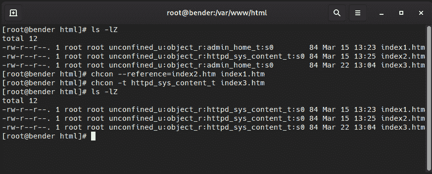

图 10.8 – 演示 chcon 用法

正如我们所看到的，`index1.htm`和`index3.htm`文件现在都具有适当的上下文，在第一种情况下，使用引用，在第二种情况下，定义要使用的类型。

当然，这不是唯一的方法。正如我们之前所指出的，为应用程序设置上下文的推荐方法是通过`semanage`定义`regexps`路径，这使我们能够使用`restorecon`命令根据配置将正确的上下文应用于文件。让我们看看下面的截图中它是如何操作的：

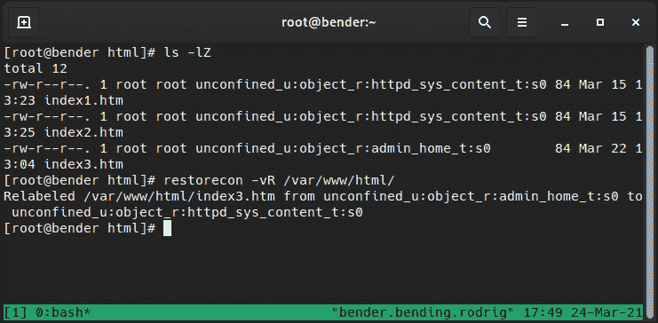

图 10.9 – 使用 restorecon 恢复上下文

正如我们所见，我们使用了`restorecon –vR /var/www/html/`，它自动将`index3.htm`文件更改为`httpd_sys_content_t`，这是我们在测试`semanage`列出上下文时看到的该文件夹的定义。使用的参数`v`和`R`使实用程序报告更改（详细信息）并在提供的路径上递归工作。

假设我们通过在根文件系统上运行`chcon`来搞乱了系统。修复的方法是什么？在这种情况下，正如我们之前提到的，我们应该执行以下操作：

+   将操作模式设置为`permissive`以通过`setenforce 0`不阻止进一步访问。

+   放置标记以通过`touch /.autorelabel`重新标记文件系统。

+   修改`/etc/selinux/config`文件以将引导模式设置为`permissive`。

+   重新启动系统以进行重新标记。

+   系统重新启动后，再次编辑`/etc/selinux/config`，将操作模式定义为`enforcing`。

通过这种方式操作，而不仅仅是运行`restorecon -R /`，我们确保系统是可操作的，并且在重新启动和对文件系统应用完整的重新标记后将继续运行，因此可以安全地重新启用`enforcing`模式。

在下一节中，让我们看看如何在策略内部调整策略，使用布尔值来调整其工作方式。

# 使用 SELinux 布尔设置来启用服务

许多服务具有许多常见情况的广泛配置选项，但并非总是相同。例如，`http`服务器不应访问用户文件，但与此同时，从每个用户的主目录中的`www`或`public_html`文件夹启用个人网站是一种常见的操作方式。

为了克服这种情况，并同时提供增强的安全性，SELinux 策略使用布尔值。

布尔值是管理员可以设置的可调整的条件，可以在策略代码中启用或禁用条件。例如，通过执行`getsebol -a|grep ^http`（缩小列表）来查看`httpd`可用的布尔值：

```
httpd_can_network_connect --> off
httpd_can_network_connect_db --> off
httpd_can_sendmail --> off
httpd_enable_homedirs --> off
httpd_use_nfs --> off
```

此列表是可用布尔值的缩小子集，但它确实给了我们一个它可以实现的想法；例如，默认情况下，`http`不能使用网络连接到其他主机，或发送电子邮件（通常在 PHP 脚本中完成），甚至不能访问用户的主目录。

例如，如果我们想要在系统中启用用户从其主目录中的`www`文件夹发布其个人网页，即`/home/user/www/`，我们将不得不通过运行以下命令启用`httpd_enable_homedirs`布尔值：

```
setsebool -P httpd_enable_homedirs=1
```

这将调整策略以使`http`能够访问用户的主目录以在那里提供页面。如果服务器还存储在**网络文件系统**（**NFS**）或**公共互联网文件系统**（**CIFS**）挂载上，将需要额外的布尔值。我们仍然使用相同的有针对性的策略，但我们已经启用了内部条件，以允许访问不会被 SELinux 阻止。

重要提示

`-P`参数对于`setsebool`是必需的，以使更改*永久*。这意味着写入更改以使其持久化；如果没有它，一旦重新启动服务器，更改将丢失。

正如我们所见，`getsebool`和`setsebool`允许我们查询和设置调整策略的布尔值，而`semanage boolean -l`也可以帮助我们，正如我们在下面的截图中所看到的：

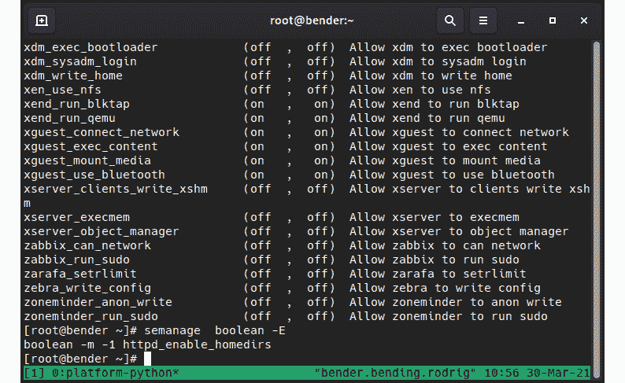

图 10.10 - 使用 semanage 管理布尔值

在前面的截图中，我们不仅可以看到使用`setsebool`编辑的布尔值，还可以看到预期行为的描述。

其中一个好处是，正如我们介绍的，`semanage`允许我们导出和导入对策略的本地更改，因此可以将进行的任何自定义导出并导入到另一个系统，以便轻松设置类似的服务器配置文件。

策略中的所有可能的布尔值都可以使用`semanage boolean –l`进行检查，类似于我们在`http`示例中列出应用程序的绑定端口时所做的。

我们已经了解了使用布尔值来调整策略如何适应一些特定但相当常见的情况。接下来，我们将探索管理员可能最常用的部分，即故障排除，但重点是 SELinux。

# SELinux 故障排除和常见修复

适应 SELinux 的主要问题之一是，许多不熟悉它的人会因为事情无法正常工作而责怪它；然而，这个论点已经有点过时了：SELinux 是在 2005 年推出的 Red Hat Enterprise Linux 4 中引入的。

大多数时候，与 SELinux 和我们的系统有关的问题都与更改文件上下文和更改服务端口有关，与策略本身有关的问题较少。

首先，有几个地方可以检查错误，但在我们的列表中，我们应该从审计日志或系统消息开始。例如，我们可以从我们在本章前面介绍的`/var/log/audit/audit.log`文件开始。

还要记住，SELinux**强制访问控制**（**MAC**）只有在我们从常规**自主访问控制**（**DAC**）中获得了访问权限后才起作用，也就是说，如果我们没有权限检查文件（例如，模式 400 和我们的用户不是所有者），那么 SELinux 几乎不可能阻止访问。

大多数情况下，我们的系统将安装`setroubleshoot-server`和`setroubleshoot-plugins`软件包，提供多个工具，包括`sealert`，用于查询接收到的 SELinux 消息，并且很多时候也会建议更改。

让我们来看看我们应该始终验证的一些基础知识：

+   审查所有其他控件（用户和组所有权和权限是否设置正确）。

+   不要禁用 SELinux。

如果程序无法正常工作，并且是随操作系统一起发布的，那可能是一个错误，应该通过支持案例或 Bugzilla 报告给[`bugzilla.redhat.com`](https://bugzilla.redhat.com)。

只有当程序无法正常工作时，才可能使其运行不受限制，但通过定向策略保护所有其余系统服务。

+   如果这是一个现有程序，请考虑错误发生之前做了什么。

也许文件被移动而不是复制或创建，或者也许软件的端口或文件夹被更改了。

到达这一点后，我们应该检查`audit.log`以获取相关消息。例如，关于我们提到的关于`/var/www/html/`中文件错误上下文的示例，审计条目如下：

```
type=AVC msg=audit(1617210395.481:1603680): avc:  denied  { getattr } for  pid=2826802 comm="httpd" path="/var/www/html/index3.htm" dev="dm-0" ino=101881472 scontext=system_u:system_r:httpd_t:s0 tcontext=unconfined_u:object_r:admin_home_t:s0 tclass=file permissive=0
```

看起来很奇怪，但如果我们检查参数，我们会看到受影响文件的路径、PID、源上下文（`scontext`）和目标上下文（`tcontext`），因此简而言之，我们可以看到`httpd_t`尝试访问（获取属性）目标上下文`admin_home_t`并且被拒绝的情况。

同时，如果我们正在使用`setroubleshoot`，我们将在系统日志中收到这样的消息：

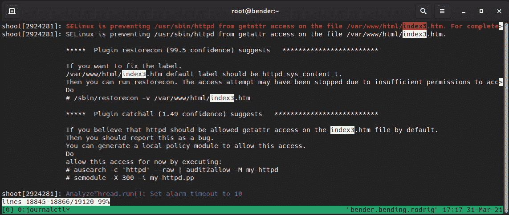

图 10.11 - 在系统日志中记录 setroubleshoot

正如我们在前面的截图中看到的，它已经确定其中一个插件建议对文件应用`restorecon`命令，因为它与所在文件夹不匹配，并且甚至建议使用确切的命令来恢复标签。

另一个插件建议使用以下两个命令生成自定义策略：

```
# ausearch -c 'httpd' --raw | audit2allow -M my-httpd
# semodule -X 300 -i my-httpd.pp
```

然而，这种建议应该在了解正在进行的操作的情况下进行，这意味着前面的命令将修复`httpd_t`以便访问`home_admin_t`文件。我们可以通过仅运行第一个命令以及`audit2allow`管道来了解会发生什么。

运行`ausearch –c 'httpd' --raw | audit2allow –M my-httpd`在当前文件夹中创建了几个名为`my-httpd`的文件，一个名为`my-httpd.te`，另一个名为`my-httpd.pp`。我们将不使用第二个命令来安装修改后的策略，请在了解发生了什么之前，永远不要这样做，因为我们将在接下来的行中看到。

现在对我们来说有趣的文件是`my-httpd.te`（其中*te*表示*类型强制*）：

```
module my-httpd 1.0;
require {
        type httpd_t;
        type admin_home_t;
        class file getattr;
}
#============= httpd_t ==============
allow httpd_t admin_home_t:file getattr;
```

从那里，我们可以看到它使用了一个要求会话来处理涉及的类型，以及稍后的规则本身，这允许`httpd_t`访问`admin_home_t`文件以使用`getattr`函数，没有其他东西，也没有更多东西。

正如之前所说，这将解决我们的问题吗？它将有效地允许`httpd_t`访问`index3.html`文件，因此将不再出现任何错误，但这将付出巨大的代价。从那时起，`httpd_t`也可以读取主目录文件而不会有任何投诉。

重要提示

我不知道这个事实需要强调多少次，但在对系统采取行动之前三思。SELinux 是一种增加系统安全性的保护机制；不要禁用它，不要盲目接受`audit2allow`创建的策略，而没有对问题进行初步调查和了解提出的解决方案可能是什么，因为这几乎等同于禁用 SELinux。

如果在这一点上，我们已经安装了该模块，我们可以使用`semodule`来执行以下操作：

+   列出`semodule -l`。

+   安装`semodule -i $MODULE_NAME`。

+   删除`semodule –r $MODULE_NAME`。

通过前面的命令，我们可以检查或更改已加载策略模块的当前状态。

回顾系统日志后，我们可能会意识到某些事情实际上是在开始后的某个时候失败的，但不是从一开始就失败，因此使用`ausearch`或将完整日志传递给`audit2allow`可能没有帮助；但是，我们可以使用`setroubleshootd`建议的命令来列出它们：

```
Mar 31 17:06:41 bender setroubleshoot[2924281]: SELinux is preventing /usr/sbin/httpd from getattr access on the file /var/www/html/index3.htm. For complete SELinux messages run: sealert -l 1b4d549b-f566-409f-90eb-7a825471aca8
```

如果我们执行`sealert –l <ID>`，我们将收到不同插件提供的输出，以修复问题以及类似于*图 10.11*中显示的上下文信息。

在部署不支持 SELinux 的新软件的情况下，我们可以在测试系统中以相反的方式进行以下检查：

+   将 SELinux 设置为`permissive`模式。

+   部署软件。

+   分析收到的所有警报，看看是否有什么意外情况。

+   与软件供应商联系，并启动与 Red Hat 合作解决策略的支持案例。

如果我们因为 SELinux 正在执行并且我们已经严重搞乱了标签而被系统锁定，例如通过递归运行错误的`chcon`命令来针对我们的根文件夹（例如，根据一个变量编写上下文更改的脚本，而该变量为空），我们仍然有以下方法来摆脱麻烦：

+   使用`setenforce 0`将 SELinux 置于`permissive`模式。

+   运行`touch /.autorelabel`。

+   重新启动主机，以便在下次启动时，SELinux 恢复适当的标签

如果我们处于一个非常糟糕的情况，例如无法使用`setenforce 0`或系统甚至无法正确引导或执行重标记，仍然有希望，但需要一些额外的步骤。

当系统重新启动时，我们可以在 grub 提示符下看到已安装内核的列表，并使用它来编辑内核引导参数。

使用`selinux=0`参数，我们完全禁用了 SELinux，这是我们不想要的，但我们可以使用`enforcing=0`来实现启用 SELinux，但处于`permissive`模式。

一旦我们的系统启动进入`permissive`模式，我们可以重复之前的过程，恢复到先前的行为，并继续在系统内部调试情况（检查系统日志等）。

# 总结

本章介绍了 SELinux 的工作原理，以及如何检查进程、文件和端口，以及如何通过添加新选项或使用布尔值来对它们进行微调。我们还介绍了一些初始的故障排除技能，我们应该进一步探索以增强我们的知识和经验。

正如我们所见，SELinux 是一个强大的工具，可以通过额外的层保护我们的系统，即使是来自软件本身缺陷的未知问题。

我们已经介绍了如何在文件和进程中找到 SELinux 上下文，以及这些上下文是如何通过策略应用的，以及如何调整它以使我们的系统受到保护，同时仍能提供预期的服务。

排除 SELinux 故障是一项技能，将帮助我们适应不带 Red Hat Enterprise Linux 的软件，以便仍能正常运行。

在下一章中，我们将学习使用 OpenSCAP 的安全配置文件，以继续保持我们的系统安全。
