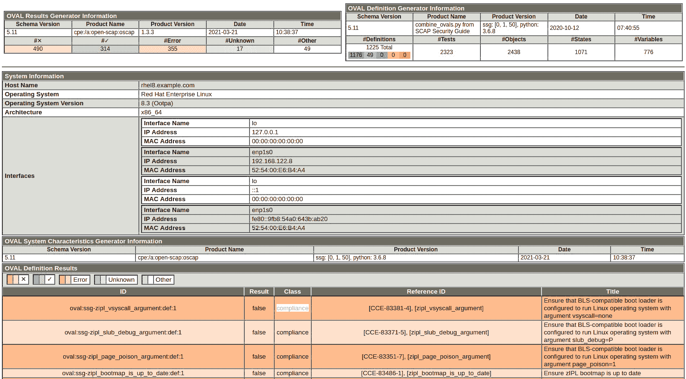
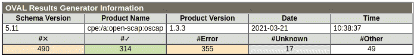
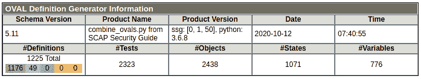
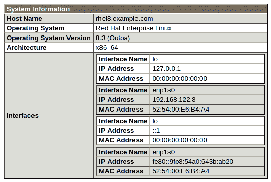
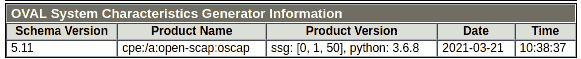
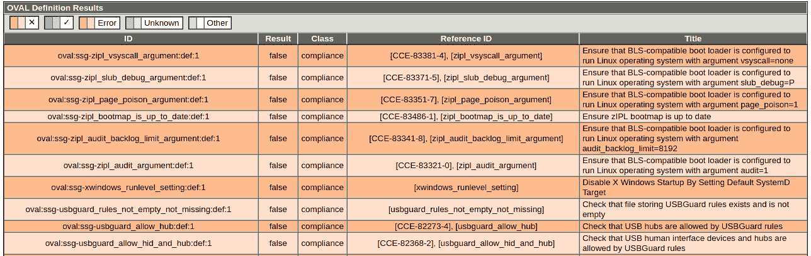
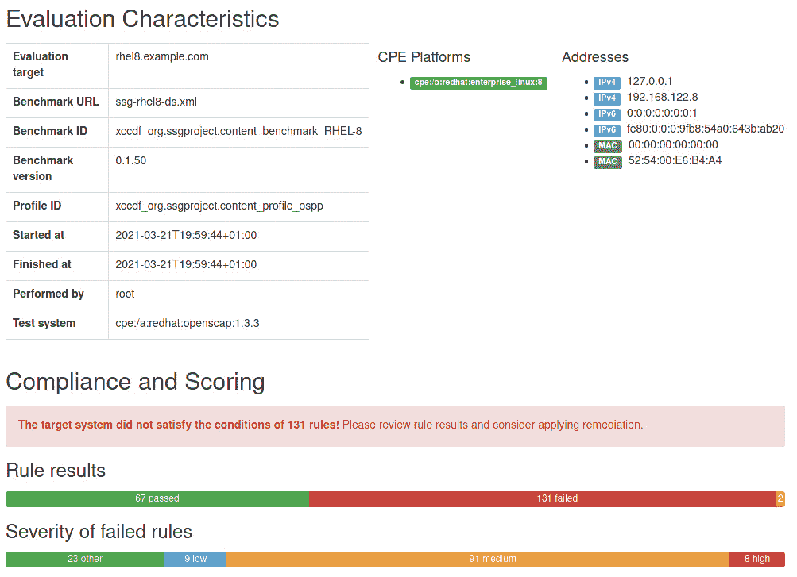
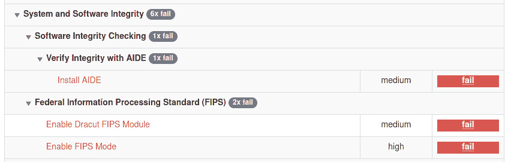

# 第十一章：*第十一章*：使用 OpenSCAP 进行系统安全配置文件

**SCAP**代表**安全内容自动化协议**，这是一种标准化的检查、验证和报告漏洞评估和策略评估的方式。Red Hat Enterprise Linux (RHEL) 8 包括了工具**OpenSCAP**，以及用于审计和管理系统安全的配置文件。这有助于确保您正在管理的系统符合标准的安全策略，如**支付卡行业数据安全标准**（**PCI DSS**）或**通用操作系统保护配置文件**，或简称为**OSPP**，以及发现漏洞。

RHEL 8 包括了这个工具，用于审查安全配置文件以发现可能的攻击向量（配置错误或漏洞），并可以获得如何更好地加固系统的指导。我们将学习如何对系统进行扫描，并发现需要更改以准备系统完全符合监管要求的内容。我们还将学习如何使用这个工具来改进系统的安全性，以便通过审查和应用推荐的更改来提高系统的安全性。

为了了解如何使用 OpenSCAP，在本章中我们将讨论以下主题：

+   开始使用 OpenSCAP 并发现系统漏洞

+   使用 OpenSCAP 进行 OSPP 和 PCI DSS 的安全配置文件

# 开始使用 OpenSCAP 并发现系统漏洞

让我们从实际角度开始使用 OpenSCAP，首先审查`安全工具`软件组，其中有一些值得了解的工具，然后继续运行一些扫描。

我们的初始步骤将是获取有关`安全工具`的信息：

```
[root@rhel8 ~]# dnf group info "Security Tools"
Updating Subscription Management repositories.
Last metadata expiration check: 0:37:16 ago on dom 14 mar 2021 16:55:55 CET.

Group: Security Tools
Description: Security tools for integrity and trust verification.
Default Packages:
   scap-security-guide
Optional Packages:
   aide
   hmaccalc
   openscap
   openscap-engine-sce
   openscap-utils
   scap-security-guide-doc
   scap-workbench
   tpm-quote-tools
   tpm-tools
   tpm2-tools
   trousers
   udica
```

这个组包括了几个安全工具，比如`aide`，用于确保系统文件的完整性；`tpm-tools`，用于管理`openscap-utils`以审查系统中的安全策略。

我们可以通过使用`dnf`来获取有关这些工具的更多信息。让我们来审查对本章更相关的一个工具，`openscap-utils`：

```
[root@rhel8 ~]# dnf info openscap-utils
Updating Subscription Management repositories.
Last metadata expiration check: 0:03:24 ago on dom 14 mar 2021 17:38:49 CET.
Available Packages
Name         : openscap-utils
Version      : 1.3.3
Release      : 6.el8_3
Architecture : x86_64
Size         : 43 k
Source       : openscap-1.3.3-6.el8_3.src.rpm
Repository   : rhel-8-for-x86_64-appstream-rpms
Summary      : OpenSCAP Utilities
URL          : http://www.open-scap.org/
License      : LGPLv2+
Description  : The openscap-utils package contains command-line tools build on top
             : of OpenSCAP library. Historically, openscap-utils included oscap
             : tool which is now separated to openscap-scanner sub-package.
```

我们可以在上一个命令的输出中看到`openscap-utils`软件包的相关信息，包括简要描述和主要网页的链接，其中包括更详细的信息。

提示

对于提到的每个工具运行`dnf info`命令并访问它们的网页将会很有用。这样你就能更好地了解这些工具提供的功能，并能够使用它们。

现在让我们安装`openscap-utils`：

```
[root@rhel8 ~]# dnf install openscap-utils -y
Updating Subscription Management repositories.
Last metadata expiration check: 0:04:25 ago on dom 14 mar 2021 17:38:49 CET.
Dependencies resolved.
====================================================================================================
Package              Arch   Version                         Repository                        Size
====================================================================================================
Installing:
openscap-utils       x86_64 1.3.3-6.el8_3                   rhel-8-for-x86_64-appstream-rpms  43 k
Installing dependencies:
GConf2               x86_64 3.2.6-22.el8                    rhel-8-for-x86_64-appstream-rpms 1.0 M
[omitted]
  rpmdevtools-8.10-8.el8.noarch                  
  rust-srpm-macros-5-2.el8.noarch             
  zstd-1.4.4-1.el8.x86_64                              

Complete!
```

现在让我们安装`scap-security-guide`，其中包括了 RHEL 特定的 SCAP 配置文件：

```
[root@rhel8 ~]# dnf install scap-security-guide -y
Updating Subscription Management repositories.
Last metadata expiration check: 15:06:55 ago on dom 14 mar 2021 17:38:49 CET.
Dependencies resolved.
====================================================================================================
Package                 Arch       Version              Repository                            Size
====================================================================================================
Installing:
scap-security-guide     noarch     0.1.50-16.el8_3      rhel-8-for-x86_64-appstream-rpms     7.4 M
Installing dependencies:
xml-common              noarch     0.6.3-50.el8         rhel-8-for-x86_64-baseos-rpms         39 k
[omitted] 

Installed:
  scap-security-guide-0.1.50-16.el8_3.noarch             xml-common-0.6.3-50.el8.noarch            

Complete!
```

这个软件包包括了 SCAP 安全指南，包括了与 RHEL 8 漏洞相关的指南，位于`/usr/share/xml/scap/ssg/content/ssg-rhel8-oval.xml`。现在我们可以运行一个初始扫描，使用配置文件中包含的所有检查。请注意，这将包括 2323 个测试，并且这将作为一个学习可能漏洞和加固系统的练习。所以，让我们运行它：

```
[root@rhel8 ~]# oscap oval eval --report \
vulnerability.html \
/usr/share/xml/scap/ssg/content/ssg-rhel8-oval.xml
Definition oval:ssg-zipl_vsyscall_argument:def:1: false
Definition oval:ssg-zipl_slub_debug_argument:def:1: false
Definition oval:ssg-zipl_page_poison_argument:def:1: false
Definition oval:ssg-zipl_bootmap_is_up_to_date:def:1: false
[omitted]
Definition oval:ssg-accounts_logon_fail_delay:def:1: false
Definition oval:ssg-accounts_have_homedir_login_defs:def:1: true
Definition oval:ssg-account_unique_name:def:1: true
Definition oval:ssg-account_disable_post_pw_expiration:def:1: false
Evaluation done.
```

将生成一个名为`vulnerability.html`的文件，其中包含扫描的输出。结果将如下所示：



图 11.1 – OpenSCAP 测试扫描的初始结果

让我们检查报告的一些细节。在左上角，我们将找到**OVAL 结果生成器信息**，其中包含运行的详细信息和结果摘要：



图 11.2 – OpenSCAP 测试扫描摘要

在右上角，我们可以看到**OVAL 定义生成器信息**，其中包含用于检查的定义摘要：



图 11.3 – OpenSCAP 测试扫描定义摘要

在这些信息标记下方，我们可以看到系统的基本摘要，如果我们有一个很长的扫描列表，并且想要将此扫描分配给适当的系统，这将非常有用：



图 11.4 - OpenSCAP 测试扫描系统摘要

在下面，我们有有关生成器的信息：



图 11.5 - OpenSCAP 测试扫描生成器信息

最后，检查结果如下：



图 11.6 - OpenSCAP 测试扫描结果

通过这次测试，我们对系统进行了漏洞扫描，得到了一组结果，根据系统的使用情况，这些结果将需要被处理。在许多情况下，收到的警告并不适用，因此我们需要仔细审查它们。这种练习在生产系统上必须小心进行，确保在应用更改之前有适当的备份和系统快照。建议在构建服务时在测试环境中运行加固，然后再将其移至生产环境。

重要提示

*RHEL 8 红帽企业 Linux 系统设计指南*是一个很好的文档，可以帮助我们开始系统安全工作。建议阅读该文档，以扩展本章中所学到的知识。可在[`access.redhat.com/documentation/en-us/red_hat_enterprise_linux/8/html/system_design_guide/index`](https://access.redhat.com/documentation/en-us/red_hat_enterprise_linux/8/html/system_design_guide/index)找到。

让我们了解更多基础知识。对于这次扫描，我们使用了由系统软件包提供的 Red Hat 安全公告**开放式漏洞评估语言**（**OVAL**）订阅。为了检查，我们运行了 OpenSCAP 工具来审查不同的安全公告和漏洞，这些漏洞是按照 OVAL 编写的。

OVAL 要求分析的资源处于特定状态才能被认为是正确的。它以声明方式进行，这意味着描述和审查的是最终状态，而不是如何达到这个状态。

红帽安全团队生成红帽安全公告，以解决系统可能存在的不同漏洞，并为每一个漏洞发布一个 OVAL 定义。这些是公开发布的，并可在[`www.redhat.com/security/data/oval/v2/`](https://www.redhat.com/security/data/oval/v2/)上找到。

现在让我们看一下在我们的报告中找到的一个例子：

+   `oval:ssg-accounts_logon_fail_delay:def:1`

+   `false`

+   `合规性`

+   `[accounts_logon_fail_delay]`

+   `确保在/etc/login.defs 中配置了 FAIL_DELAY`

我们可以通过运行`man login.defs`来查看其手册页面。在其中，我们会找到以下内容：

```
FAIL_DELAY (number)
    Delay in seconds before being allowed another attempt after a 
    login failure.
```

这是一个用来确定用户在失败的登录尝试后需要等待多长时间的值。它旨在避免对系统中的帐户进行暴力攻击。我们可以采取两种方法来解决这个问题：

+   将`FAIL_DELAY`变量和值添加到`login.defs`中。

+   只允许使用 SSH 密钥而不是密码来登录系统。

或者更好的是，两者都做（深度安全）。我们可以继续审查列表中的每一项，并了解每一项，以完成系统的加固，尽量避免暴露。这通常需要与安全团队协调，并且需要持续审查。

现在我们已经运行了第一次漏洞扫描，让我们看看如何在下一节中进行合规性扫描。

# 使用 OpenSCAP 进行 OSPP 和 PCI DSS 的安全配置文件

在行业中有几种用于合规性的安全配置文件。其中两种最常见的，我们将在这里进行审查，分别是**操作系统保护配置文件**（**OSPP**）和 PCI DSS。

OSPP 标准在公共部门中被广泛使用，为通用系统提供服务，并且也作为其他更严格环境（即，国防认证系统）的基线。

PCI DSS 是金融领域中最广泛使用的标准之一，也适用于其他希望使用信用卡进行在线支付的部门。

RHEL 8 提供了使用 OpenSCAP 工具验证这些配置文件的参考。让我们转到`/usr/share/xml/scap/ssg/content/`目录，查看它们所在的位置：

```
[root@rhel8 ~]# cd   /usr/share/xml/scap/ssg/content/
[root@rhel8 content]# ls *rhel8*
ssg-rhel8-cpe-dictionary.xml
ssg-rhel8-ds-1.2.xml 
ssg-rhel8-ocil.xml  
ssg-rhel8-xccdf.xml
ssg-rhel8-cpe-oval.xml 
ssg-rhel8-ds.xml
ssg-rhel8-oval.xml
```

正如您所看到的，我们有不同类型的描述可以与 OpenSCAP 一起使用。我们已经了解了 OVAL。让我们检查最重要的几个：

+   **可扩展配置清单描述格式（XCCDF）**：XCCDF 用于构建安全检查表。它非常常用于合规性测试和评分。

+   **通用平台枚举（CPE）**：CPE 通过分配唯一的标识符名称来帮助识别系统。这样，它可以关联测试和名称。

+   **开放清单交互语言（OCIL）**：OCIL 是 SCAP 标准的一部分。它是一种聚合来自不同数据存储的其他检查的方法。

+   **数据流（DS）**：DS 是一种格式，它将几个组件组合成一个单个文件。它用于轻松分发配置文件。

提示

有关不同安全描述和组件的更多信息可以在 OpenSCAP 网页上找到，通过检查组件 URL：[`www.open-scap.org/features/scap-components/`](https://www.open-scap.org/features/scap-components/)。

在这种情况下，我们将使用`ssg-rhel8-ds.xml`文件。让我们检查与之相关的信息：

```
[root@rhel8 content]# oscap info ssg-rhel8-ds.xml
Document type: Source Data Stream
[omitted]
Profiles:
Title: CIS Red Hat Enterprise Linux 8 Benchmark
Id: xccdf_org.ssgproject.content_profile_cis
Title: Unclassified Information in Non-federal Information Systems and Organizations (NIST 800-171)
Id: xccdf_org.ssgproject.content_profile_cui
Title: Australian Cyber Security Centre (ACSC) Essential Eight
Id: xccdf_org.ssgproject.content_profile_e8
Title: Health Insurance Portability and Accountability Act (HIPAA)
Id: xccdf_org.ssgproject.content_profile_hipaa
Title: Protection Profile for General Purpose Operating Systems
Id: xccdf_org.ssgproject.content_profile_ospp
Title: PCI-DSS v3.2.1 Control Baseline Red Hat Enterprise Linux 8
Id: xccdf_org.ssgproject.content_profile_pci-dss
Title: [DRAFT] DISA STIG for Red Hat Enterprise Linux 8
Id: xccdf_org.ssgproject.content_profile_stig
Referenced check files: ssg-rhel8-oval.xml
system: http://oval.mitre.org/XMLSchema/oval-definitions-5
ssg-rhel8-ocil.xml
system: http://scap.nist.gov/schema/ocil/2
security-data-oval-com.redhat.rhsa-RHEL8.xml
system: http://oval.mitre.org/XMLSchema/oval-definitions-5
Checks:
Ref-Id: scap_org.open-scap_cref_ssg-rhel8-oval.xml
Ref-Id: scap_org.open-scap_cref_ssg-rhel8-ocil.xml
Ref-Id: scap_org.open-scap_cref_ssg-rhel8-cpe-oval.xml
Ref-Id: scap_org.open-scap_cref_security-data-oval-com.redhat.rhsa-RHEL8.xml
Dictionaries:
Ref-Id: scap_org.open-scap_cref_ssg-rhel8-cpe-dictionary.xml
```

如您所见，它包括 RHEL 8 的 OSPP 和 PCI DSS 配置文件。让我们试试看。

## 扫描 OSPP 合规性

我们可以使用`oscap`的`--profile`选项来获取特定于**OSPP**配置文件的信息：

```
[root@rhel8 content]# oscap info --profile \
ospp ssg-rhel8-ds.xml 
Document type: Source Data Stream
Imported: 2020-10-12T09:41:22

Stream: scap_org.open-scap_datastream_from_xccdf_ssg-rhel8-xccdf-1.2.xml
Generated: (null)
Version: 1.3
WARNING: Datastream component 'scap_org.open-scap_cref_security-data-oval-com.redhat.rhsa-RHEL8.xml' points out to the remote 'https://www.redhat.com/security/data/oval/com.redhat.rhsa-RHEL8.xml'. Use '--fetch-remote-resources' option to download it.
WARNING: Skipping 'https://www.redhat.com/security/data/oval/com.redhat.rhsa-RHEL8.xml' file which is referenced from datastream
Profile
Title: Protection Profile for General Purpose Operating Systems
Id: xccdf_org.ssgproject.content_profile_ospp

Description: This profile reflects mandatory configuration controls identified in the NIAP Configuration Annex to the Protection Profile for General Purpose Operating Systems (Protection Profile Version 4.2.1).  This configuration profile is consistent with CNSSI-1253, which requires U.S. National Security Systems to adhere to certain configuration parameters. Accordingly, this configuration profile is suitable for use in U.S. National Security Systems.
```

在信息中，我们可以看到 OSPP 配置文件被描述为`xccdf`。我们现在可以运行`oscap`，指定我们要使用`xcddf`选项的格式，并且我们要执行的操作是使用`eval`评估系统。命令如下：

```
[root@rhel8 content]# oscap xccdf eval \
--report ospp-report.html --profile ospp ssg-rhel8-ds.xml 
[omitted]
Title   Set Password Maximum Consecutive Repeating Characters
Rule    xccdf_org.ssgproject.content_rule_accounts_password_pam_maxrepeat
Ident   CCE-82066-2
Result  fail
Title   Ensure PAM Enforces Password Requirements - Maximum Consecutive Repeating Characters from Same Character Class
Rule    xccdf_org.ssgproject.content_rule_accounts_password_pam_maxclassrepeat
Ident   CCE-81034-1
Result  fail
[omitted]
Title   Disable Kerberos by removing host keytab
Rule    xccdf_org.ssgproject.content_rule_kerberos_disable_no_keytab
Ident   CCE-82175-1
Result  pass
```

我们将获得`ospp-report.html`文件，其中包含有关 OSPP 规则结果的完整报告：



图 11.7 – OpenSCAP OSPP 扫描结果

它将显示需要修改以符合配置文件的要点：



图 11.8 – OpenSCAP OSPP 扫描结果，需要采取行动的详细规则

现在我们可以一步一步地遵循建议并修复它们，以便完全符合 OSPP。此外，我们可以使用此扫描来加固系统，即使它们不需要符合 OSPP，也将处于暴露的网络中，例如 DMZ，并且我们希望对它们进行加固。

重要提示

Red Hat 提供了一种自动应用所有这些更改的方法。它基于自动化工具`/usr/share/scap-security-guide/ansible/rhel8-playbook-ospp.yml`。

现在我们已经审查了 OSPP 合规性的系统，让我们转向下一个目标，即 PCI DSS 合规性。

## 扫描 PCI DSS 合规性

我们可以按照之前的步骤进行，同样使用`oscap`的`--profile`选项来获取特定于 PCI DSS 配置文件的信息：

```
[root@rhel8 content]# oscap info --profile pci-dss \
ssg-rhel8-ds.xml 
Document type: Source Data Stream
Imported: 2020-10-12T09:41:22

Stream: scap_org.open-scap_datastream_from_xccdf_ssg-rhel8-xccdf-1.2.xml
Generated: (null)
Version: 1.3
WARNING: Datastream component 'scap_org.open-scap_cref_security-data-oval-com.redhat.rhsa-RHEL8.xml' points out to the remote 'https://www.redhat.com/security/data/oval/com.redhat.rhsa-RHEL8.xml'. Use '--fetch-remote-resources' option to download it.
WARNING: Skipping 'https://www.redhat.com/security/data/oval/com.redhat.rhsa-RHEL8.xml' file which is referenced from datastream
Profile
Title: PCI-DSS v3.2.1 Control Baseline for Red Hat Enterprise Linux 8
Id: xccdf_org.ssgproject.content_profile_pci-dss

Description: Ensures PCI-DSS v3.2.1 security configuration settings are applied.
```

我们可以使用与上一节相同的选项运行`oscap`，但指定`pci-dss`作为配置文件。它将生成适当的报告：

```
[root@rhel8 content]# oscap xccdf eval –report \
pci-dss-report.html --profile pci-dss ssg-rhel8-ds.xml 
WARNING: Datastream component 'scap_org.open-scap_cref_security-data-oval-com.redhat.rhsa-RHEL8.xml' points out to the remote 'https://www.redhat.com/security/data/oval/com.redhat.rhsa-RHEL8.xml'. Use '--fetch-remote-resources' option to download it.
WARNING: Skipping 'https://www.redhat.com/security/data/oval/com.redhat.rhsa-RHEL8.xml' file which is referenced from datastream
WARNING: Skipping ./security-data-oval-com.redhat.rhsa-RHEL8.xml file which is referenced from XCCDF content
Title   Ensure PAM Displays Last Logon/Access Notification
Rule    xccdf_org.ssgproject.content_rule_display_login_attempts
Ident   CCE-80788-3
Result  pass
[omitted]
Title   Specify Additional Remote NTP Servers
Rule    xccdf_org.ssgproject.content_rule_chronyd_or_ntpd_specify_multiple_servers
Ident   CCE-80764-4
Result  fail
[root@rhel8 content]# ls -l pci-dss-report.html 
-rw-r--r--. 1 root root 3313684 mar 21 20:16 pci-dss-report.html
```

我们可以开始审查报告中的项目并开始修复它们。

重要提示

与上一节一样，Red Hat 还提供了一种使用 Ansible 自动应用所有这些更改的方法。PCI DSS 的 playbook 位于`/usr/share/scap-security-guide/ansible/rhel8-playbook-pci-dss.yml`。

我们已经看到，使用 OpenSCAP 从一个配置文件切换到另一个配置文件非常容易，我们可以扫描尽可能多的配置文件。

# 总结

通过学习**OpenSCAP**的基础知识，我们已经准备好审查和加固系统，使其符合我们需要其运行的法规要求。

现在，如果您被要求遵守任何监管要求，您可以找到适合它的 SCAP 配置文件（如果不存在，可以构建它），并确保您的系统完全符合要求。

此外，即使没有监管要求，使用 OpenSCAP 也可以帮助您发现系统中的漏洞，或者应用更安全（和限制性）的配置以减少风险。

通过学习 Ansible 并能够自动应用系统变更的方式，我们可以扩展我们的知识和技能，这种方式易于扩展，以及 Red Hat Satellite，它可以帮助我们对我们管理的整个 IT 基础进行 SCAP 扫描，即使我们可能谈论的是成千上万的系统。

现在我们的安全技能正在提高并得到巩固，让我们深入探讨更多关于本地存储和文件系统的低级主题，如下一章所述。
