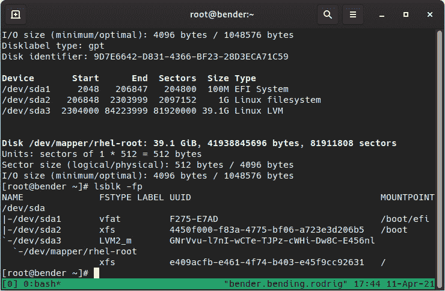
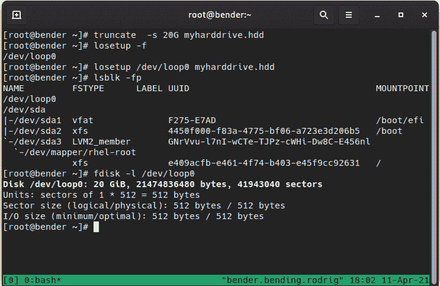
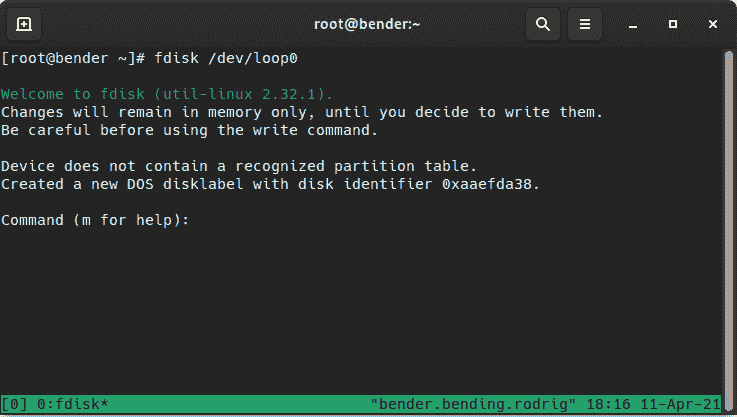
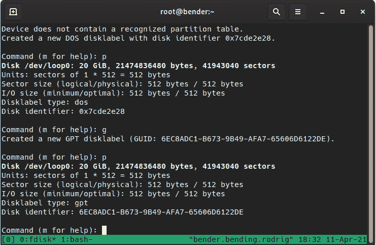
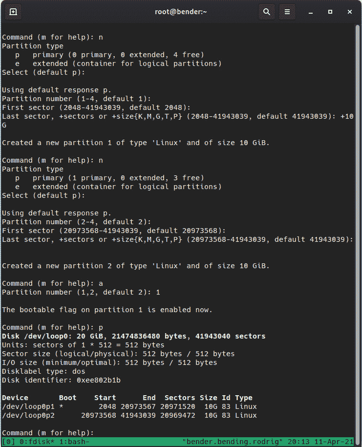
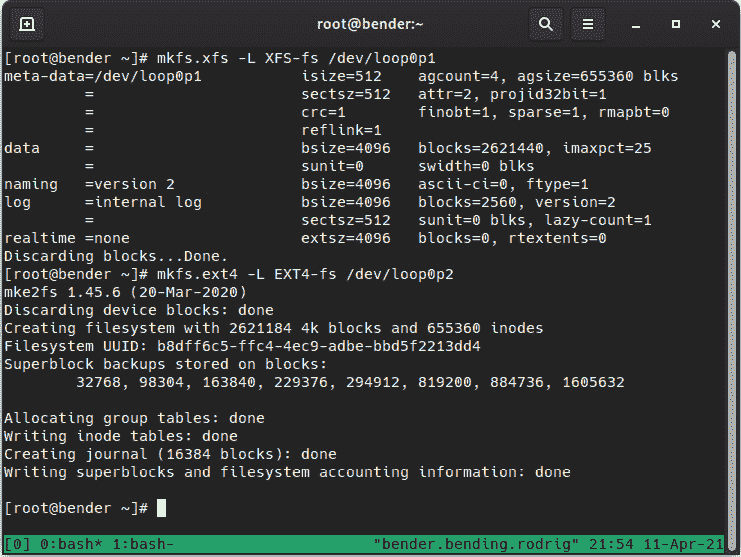
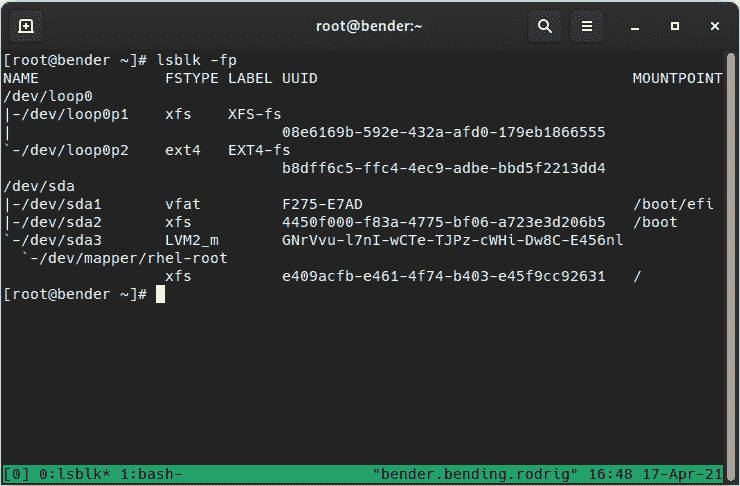
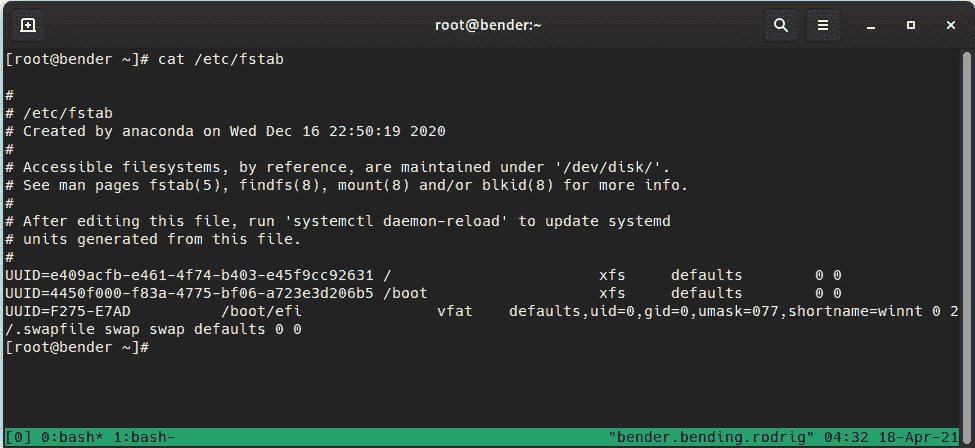

# 第十二章：管理本地存储和文件系统

在之前的章节中，我们已经学习了安全和系统管理。在本章中，我们将专注于资源管理，特别是存储管理。

存储管理是保持系统运行的重要部分：系统日志可能会占用可用空间，新应用程序可能需要为它们设置额外的存储空间（甚至在单独的磁盘上以提高性能），这些问题可能需要我们采取行动来解决。

在本章中，我们将学习以下主题：

+   分区磁盘（**主引导记录**（**MBR**）和**全局唯一标识符**（**GUID**）**分区表**（**GPT**）磁盘）

+   格式化和挂载文件系统

+   在`fstab`中设置默认挂载和选项

+   使用**网络文件系统**（**NFS**）的网络文件系统

这将为我们提供基本知识，以便在存储管理技能上建立，以保持系统运行。

让我们动手操作！

# 技术要求

您可以继续使用本书开头创建的**虚拟机**（**VM**）进行练习*第一章*，*安装 RHEL8*。本章所需的任何其他软件包将在文本旁边指示。您还需要分区磁盘（MBR 和 GPT 磁盘）。

## 让我们从一个定义开始

分区是存储设备的逻辑分割，用于将可用存储逻辑地分成较小的部分。

现在，让我们继续学习一些关于存储起源的知识，以更好地理解它。

## 一点历史

存储也与系统使用它的能力有关，因此让我们简要解释一下**个人计算机**（**PC**）的历史，允许它们引导的软件（**基本输入/输出系统**（**BIOS**）），以及这如何影响存储管理。

这可能听起来有点奇怪，但最初的存储需求只是一小部分**千字节**（**KB**），对于 PC 中的第一块硬盘，存储只是几**兆字节**（**MB**）。

PC 还具有一个特点和限制：PC 是兼容的，这意味着后续型号与最初的**国际商业机器**（**IBM**）PC 设计兼容。

传统的磁盘分区在 MBR 之后使用了一些空间，允许四个分区寄存器（起始、结束、大小、分区类型、活动标志），称为**主**分区。

当 PC 启动时，BIOS 将通过在 MBR 中运行一个小程序来检查磁盘的分区表，然后加载活动分区的引导区域并执行它，以启动操作系统。

包含**磁盘操作系统**（**DOS**）和兼容（MS-DOS、DR-DOS、FreeDOS 等）的 IBM PC 还使用了一个名为**文件分配表**（**FAT**）的文件系统。 FAT 包含了几个基于其演变的结构，指示为簇寻址大小（以及其他一些特性）。

由于簇的数量有限，更大的磁盘意味着更大的块，因此，如果一个文件只使用了有限的空间，剩下的空间就不能被其他文件使用。因此，将更大的硬盘分成较小的逻辑分区变得更加正常，这样小文件就不会因为限制而占用可用空间。

把这看作是一个议程，最多有一定数量的条目，类似于手机上的快速拨号：如果你只有九个快速拨号的位置，一个短号码，比如打语音信箱，仍然会占用一个位置，就像存储一个大的国际号码一样。

其中一些限制在 FAT 大小的后续版本中得到了减少，与此同时增加了最大支持的磁盘大小。

当然，其他操作系统也引入了自己的文件系统，但使用相同的分区模式。

后来，创建了一种新的分区类型：**扩展分区**，它使用了四个可用的**主分区**插槽之一，并允许在其中定义额外的分区，从而使我们能够创建逻辑磁盘以根据需要分配。

此外，拥有多个主分区还允许在同一台计算机上安装不同操作系统，并且这些操作系统具有完全独立的专用空间。

所以...分区允许计算机拥有不同的操作系统，更好地利用可用的存储空间，甚至通过在不同的区域保留数据来逻辑地对数据进行排序，例如将操作系统空间与用户数据分开，以便用户填满可用空间不会影响计算机的运行。

正如我们所说，许多这些设计都带有原始 IBM PC 的兼容性限制，因此当新的使用**可扩展固件接口**（**EFI**）的计算机出现以克服传统 BIOS 的限制时，就出现了一种新的分区表格式称为**GPT**。

使用 GPT 的系统使用 32 位和 64 位支持，而 BIOS 使用 16 位支持（从 IBM PC 兼容性继承），因此可以为磁盘使用更大的寻址，以及额外的功能，如扩展控制器加载。

现在，让我们在下一节学习关于磁盘分区。

# 分区磁盘（MBR 和 GPT 磁盘）

正如前面提到的，使用磁盘分区允许我们更有效地利用计算机和服务器中可用的空间。

让我们首先通过识别要操作的磁盘来深入了解磁盘分区。

重要提示

一旦我们了解了导致磁盘被分区以及其限制的原因，我们应该根据我们的系统规格遵循一个模式或另一个模式，但要记住 EFI 需要 GPT，BIOS 需要 MBR，因此支持 UEFI 的系统，但磁盘分区为 MBR，将会将系统引导到兼容 BIOS 的模式。

Linux 根据连接到系统的方式使用不同的符号表示磁盘，因此，例如，您可以看到磁盘为`hda`或`sda`或`mmbclk0`，具体取决于所使用的连接。传统上，使用`hda`，`hdb`等连接的磁盘，而使用`sda`，`sdb`等连接的磁盘。

我们可以使用`fdisk –l`或`lsblk –fp`列出可用设备，如下面的屏幕截图所示：



图 12.1 – lsblk-fp 和 fdisk –l 输出

正如我们所看到的，我们的名为`/dev/sda`的磁盘有三个分区：`sda1`，`sda2`和`sda3`，其中`sda3`是一个`LVM`卷组，其卷名为`/dev/mapper/rhel-root`。

为了以安全的方式演示磁盘分区，并使读者在使用虚拟机进行测试时更容易，我们将创建一个虚拟的`truncate`实用程序，该实用程序随`coreutil`软件包一起提供，以及一个随`util-linux`软件包一起提供的`losetup`实用程序。

为了创建一个 VHD，我们将按照*图 12.2*中显示的命令序列执行以下命令：

1.  `truncate –s 20G myharddrive.hdd`

注意

此命令创建一个大小为 20**GB**的文件，但这将是一个空文件，这意味着该文件实际上并未在我们的磁盘上使用 20 GB 的空间，只是显示了那个大小。除非我们使用它，它将不会占用更多的磁盘空间（这称为**稀疏文件**）。

1.  `losetup –f`，将找到下一个可用设备

1.  `losetup /dev/loop0 myharddrive.hdd`，将`loop0`与创建的文件关联

1.  `lsblk –fp`，验证新循环磁盘

1.  `fdisk –l /dev/loop0`，列出新磁盘中的可用空间

以下屏幕截图显示了前面顺序命令的输出：



图 12.2 – 执行指定命令以创建一个虚拟硬盘

`losetup -f`命令找到下一个可用的回环设备，这是用于将访问回环到支持文件的设备。例如，这经常用于本地挂载 ISO 文件。

使用第三个命令，我们使用先前可用的回环设备来设置设备`loop0`和我们用第一个命令创建的文件之间的回环连接。

正如我们所看到的，在剩下的命令中，当运行相同的命令时，设备现在会出现，我们在*图 12.1*中执行，显示我们有一个可用的 20 GB 磁盘。

重要提示

在磁盘上进行分区操作可能是危险的，并且可能使系统无法使用，需要恢复或重新安装。为了减少这种可能性，本章中的示例将使用`/dev/loop0`虚拟创建的磁盘，并且只与此交互。在对真实卷、磁盘等执行此操作时要注意。

让我们通过在我们新创建的设备上执行`fdisk /dev/loop0`来开始创建分区，如下一张截图所示：



图 12.3 - fdisk 在/dev/loop0 上执行

正如我们在*图 12.3*中所看到的，磁盘不包含已识别的分区表，因此创建了一个新的 DOS 分区磁盘标签，但更改只保留在内存中，直到写回磁盘。

在`fdisk`命令中，我们可以使用多个选项来创建分区。我们应该注意的第一个选项是`m`，如*图 12.3*中所示，它显示了帮助功能和可用命令。

首先要考虑的是我们之前关于 UEFI、BIOS 等的解释。默认情况下，`fdisk`正在创建一个 DOS 分区，但正如我们在手册（`m`）中所看到的，我们可以通过在`fdisk`中运行`g`命令来创建一个 GPT 分区。

要记住的一个重要命令是`p`，它打印当前磁盘布局和分区，如下一张截图中所定义的：



图 12.4 - fdisk 创建新的分区表

正如我们所看到的，初始的`disklabel`类型是`dos`，现在是`gpt`，与 EFI/UEFI 兼容。

让我们回顾一些我们可以使用的基本命令，如下所示：

+   `n`：创建一个新分区

+   `d`：删除一个分区

+   `m`：显示手册页（帮助）

+   `p`：打印当前布局

+   `x`：进入高级模式（专为专家设计的额外功能）

+   `q`：退出而不保存

+   `w`：将更改写入磁盘并退出

+   `g`：创建新的 GPT 磁盘标签

+   `o`：创建 DOS 磁盘标签

+   `a`：在 DOS 模式下，将可引导标志设置为其中一个主分区

创建具有用于操作系统的可引导分区和用于用户数据的另一个分区的新传统磁盘分区布局的顺序是什么？

这将是命令的顺序（这些命令也显示在*图 12.5*中）：

1.  `o`并按*Enter*创建新的 DOS 磁盘标签

1.  `n`并按*Enter*创建一个新分区

1.  按*Enter*接受主分区类型

1.  按*Enter*确认使用第一个分区（`1`）

1.  按*Enter*接受初始扇区

1.  `+10G`并按*Enter*指示从第一个扇区开始的大小为 10 GB

1.  `n`并按*Enter*创建第二个新分区

1.  按*Enter*接受它作为主分区类型

1.  按*Enter*接受分区号（`2`）

1.  按*Enter*接受 fdisk 提出的默认第一个扇区

1.  按*Enter*接受 fdisk 提出的默认结束扇区

1.  `a`并按*Enter*将分区标记为可引导

1.  `1`并按*Enter*标记第一个分区

正如您所看到的，大多数选项接受默认值；唯一的更改是指定分区大小为`+10G`，表示应为 10 GB（磁盘为 20 GB），然后使用新的`n`命令开始第二个分区，现在不指定大小，因为我们要使用所有剩余的分区。最后一步是将第一个分区标记为可引导的。

当然，记住我们之前说过的：除非执行`w`命令，否则更改不会写入磁盘，我们可以使用`p`来查看它们，如下面的屏幕截图所示：



图 12.5 – 在将其写回磁盘之前创建和验证磁盘分区布局

为了结束本节，让我们使用`w`命令将更改写入磁盘，并继续讨论下一节中的文件系统。然而，在此之前，让我们执行`partprobe /dev/loop0`，以使内核更新其对磁盘的内部视图，并找到两个新分区。如果不这样做，`/dev/loop0p1`和`/dev/loop0p2`特殊文件可能不会被创建，也无法使用。

请注意，一些分区修改即使在执行`partprobe`后也不会更新，并可能需要系统重新启动。例如，在使用分区的磁盘上，例如我们计算机中保存根文件系统的磁盘上，就会发生这种情况。

# 格式化和挂载文件系统

在上一节中，我们学习了如何在逻辑上划分我们的磁盘，但该磁盘仍然无法用于存储数据。为了使其可用于存储数据，我们需要在其上定义一个**文件系统**，这是使其对我们的系统可用的第一步。

文件系统是一个逻辑结构，定义了文件、文件夹等的存储方式，并根据每种类型提供了不同的功能集。

支持的文件系统数量和类型取决于操作系统版本，因为在其演变过程中，可能会添加、删除新的文件系统等。

提示

请记住，**Red Hat Enterprise Linux** (**RHEL**) 专注于稳定性，因此严格控制了哪些功能被添加或在新版本中被淘汰，但不包括当前版本内。您可以在[`access.redhat.com/articles/rhel8-abi-compatibility`](https://access.redhat.com/articles/rhel8-abi-compatibility)了解更多信息。

在 RHEL 8 中，默认文件系统是**eXtended File System** (**XFS**)，但您可以在 RHEL 文档中找到可用文件系统的列表，网址为[`access.redhat.com/documentation/en-us/red_hat_enterprise_linux/8/html/system_design_guide/overview-of-available-file-systems_system-design-guide`](https://access.redhat.com/documentation/en-us/red_hat_enterprise_linux/8/html/system_design_guide/overview-of-available-file-systems_system-design-guide)，当然，也可以使用**Fourth Extended Filesystem** (**EXT4**)等其他文件系统。

文件系统的选择取决于诸多因素，如使用意图、将要使用的文件类型等，不同的文件系统可能会对性能产生影响。

例如，EXT4 和 XFS 都是日志文件系统，可以提供更多的保护，防止断电故障，但在其他方面，如文件系统的最大值等方面有所不同。

在选择文件系统之前，了解部署的文件类型和它们的使用模式是一个很好的做法，因为选择错误的文件系统可能会影响系统性能。

正如我们在上一节中定义的，在我们的 VHD 上创建了两个分区，我们可以尝试创建 XFS 和 EXT4 文件系统。然而，在执行操作时要非常小心，因为文件系统的创建是一种破坏性操作，会将新的结构写回磁盘，当以系统的 root 用户操作时，选择错误的文件系统可能会在几秒钟内摧毁我们系统上的可用数据。

重要提示

请记住查看正在使用的命令的 man 页面，以熟悉每个命令的不同建议和可用选项。

然后，让我们使用我们创建的两个分区来测试两种文件系统，XFS 和 EXT4，分别使用`mkfs.xfs`和`mkfs.ext4`命令对每个设备进行操作，如下所示：



图 12.6—在创建的 VHD 上创建文件系统

请注意，我们已经指定了不同的循环设备分区，并且还为每个命令指定了一个`-L`参数。稍后我们将再次查看这个。

现在文件系统已经创建，我们可以运行`lsblk -fp`来验证这一点，我们可以看到两个设备，现在指示文件系统正在使用以及`LABEL`和`UUID`值（我们使用`mkfs`创建文件系统时显示的值），如下面的屏幕截图所示：



图 12.7—创建文件系统后 lsblk –fp 的输出

从前面的输出中，重要的是要注意`UUID`和`LABEL`的值（如果您记得，列出的值是我们在`mkfs`命令中使用`-L`选项指定的值），因为我们将在本章后面使用它们。

现在文件系统已经创建，为了使用它们，我们需要挂载它们，这意味着使文件系统在我们的系统中的某个路径上可用，这样每次我们存储在该路径中，我们将使用该设备。

挂载文件系统可以通过多种方式完成，但最简单的方法是使用自动检测，只需指定要挂载的设备和要挂载的本地路径，但在检查`man mount`帮助页面时，还可以找到更复杂的方法，允许定义多个选项。

为了挂载我们创建的两个文件系统，我们将创建两个文件夹，然后执行以下命令挂载每个设备：

1.  `cd`

1.  `mkdir first second`

1.  `mount /dev/loop0p1 first/`

1.  `mount /dev/loop0p2 second/`

此时，两个文件系统将在我们的主文件夹（根用户）中的名为`first`和`second`的子文件夹中可用。

内核已自动找到每个设备正在使用的文件系统，并通过适当的控制器加载它，这很有效，但有时我们可能想要定义特定的选项——例如，强制文件系统类型，在过去使用`ext2`和`ext3`作为常见文件系统时启用或禁用日志记录，或者例如，禁用更新文件或目录访问时间的内置功能，以减少磁盘 I/O 并提高性能。

在命令行上指定的所有选项，或者挂载的文件系统，在系统重新启动后将不可用，因为这些只是运行时更改。让我们继续下一节，学习如何在系统启动时定义默认选项和文件系统挂载。

# 在 fstab 中设置默认挂载和选项

在前一节中，我们介绍了如何挂载磁盘和分区，以便我们的服务和用户可以使用它们。在本节中，我们将学习如何以持久的方式使这些文件系统可用。

`/etc/fstab`文件包含系统的文件系统定义，并且当然有一个专门的手册页面，可以使用`man fstab`来查看，其中包含有关格式、字段、排序等必须考虑的有用信息，因为这个文件对系统的平稳运行至关重要。

文件格式由用制表符或空格分隔的几个字段定义，以`#`开头的行被视为注释。

例如，我们将使用这行来查看每个字段的描述：

```
LABEL=/ / xfs defaults 0 0
```

第一个字段是设备定义，可以是特殊的块设备、远程文件系统，或者—正如我们所看到的—由`LABEL`、`UUID`或`PARTUUID`或`PARTLABEL`制作的选择器。`mount`、`blkid`和`lsblk`的`man`页面提供了有关设备标识符的更多信息。

第二个字段是文件系统的挂载点，这是根据我们的系统目录层次结构使该文件系统的内容可用的位置。一些特殊的设备/分区，如交换区，将其定义为`none`，因为实际上内容不会通过文件系统可用。

第三个字段是由`mount`命令或`swap`支持的文件系统类型，用于交换分区。

第四个字段是由`mount`或`swapon`命令支持的挂载选项（查看它们的`man`页面以获取更多详细信息），在其默认设置下，它是大多数常见选项的别名（读/写，允许设备，允许执行，自动挂载启动，异步访问等）。其他常见选项可能是`noauto`，它定义了文件系统但不会在启动时挂载（通常与可移动设备一起使用），`user`，它允许用户挂载和卸载它，以及`_netdev`，它定义了需要在尝试挂载之前网络处于连接状态的远程路径。

第五个字段由`dump`用于确定应使用哪些文件系统 - 其值默认为`0`。

第六个字段由`fsck`用于确定在启动时要检查的文件系统的顺序。根文件系统的值应为 1，其他文件系统的值应为 2（默认值为 0，而不是`fsck`）。检查是并行执行的，以加快启动过程。请注意，具有日志的文件系统本身可以执行快速验证而不是完整验证。

在下面的屏幕截图中，让我们看看我们系统中`cat /etc/fstab`的输出是什么：



图 12.8 - 我们系统的 fstab 示例

为什么我们应该使用`UUID`或`LABEL`而不是`/dev/sda1`等设备？

当系统启动时，磁盘排序可能会发生变化，因为一些内核可能会引入设备访问方式的差异等，导致设备的枚举发生变化；这不仅发生在可移动设备（如**通用串行总线**（**USB**）设备），还发生在网络接口或硬盘等内部设备上。

当我们使用`UUID`或`LABEL`而不是指定设备时，即使在设备重新排序的情况下，系统仍将能够找到正确的设备并从中引导。这在系统以前使用**IDE**和**串行高级技术附件**（**SATA**）驱动器和**SCSI**驱动器时尤为重要，甚至在今天，**Internet SCSI**（**iSCSI**）设备可能以与预期不同的顺序连接，导致设备名称更改和在到达时失败。

请记住使用`blkid`或`lsblk -fp`命令来检查文件系统的标签和**通用唯一标识符**（**UUID**），这些标识符在引用它们时可能会用到。

重要提示

在编辑`/etc/fstab`文件时，务必小心：更改系统使用的挂载点可能会导致系统无法使用。如果有疑问，请仔细检查任何更改，并确保熟悉系统恢复方法，并在需要时准备好救援介质。

让我们在下一节学习如何挂载远程 NFS

# 使用 NFS 进行网络文件系统

挂载远程 NFS 与挂载本地设备并没有太大区别，但是与在上一节中使用`/dev/loop0p1`文件指定本地设备不同，我们提供`server:export`作为设备。

我们可以通过检查手册页面`man mount`来找到一系列可用选项，这将向我们显示几个选项以及设备的外观。

当要使用 NFS 挂载时，管理员需要使用主机和导出名称来挂载该设备，例如，基于以下关于 NFS 导出的数据：

+   `server.example.com`

+   `/isos`

+   `/mnt/nfs`

有了上述数据，很容易构建`mount`命令，它将如下所示：

```
mount –t nfs sever.example.com:/isos /mnt/nfs
```

如果我们分析上述命令，它将定义要挂载的文件系统类型为`nfs`，由`server.example.com`主机名提供，并使用`/isos` NFS 导出，并将在本地的`/mnt/nfs`文件夹下可用。

如果我们想要在启动时定义此文件系统为可用，我们应该在`/etc/fstab`中添加一个条目，但是...我们应该如何指示这一点呢？

根据本章节中解释的设置，构建的条目将看起来像这样：

```
server.example.com:/isos /mnt/nfs nfs defaults,_netdev 0 0
```

上一行代码包含了我们在命令行上指定的参数，但它还添加了在尝试挂载之前需要网络访问的资源，因为网络访问是必需的，以便能够访问 NFS 服务器，类似于其他基于网络的存储，如 Samba 挂载、iSCSI 等，都需要的情况。

重要提示

重申保持系统可引导的想法，一旦我们对`/etc/fstab`配置文件进行修改，建议执行`mount -a`，以便在运行系统时执行验证。如果执行后新的文件系统可用，并且在执行例如`df`时显示，并且没有出现错误，那么应该是安全的。

# 总结

在本章中，我们学习了如何对磁盘进行逻辑划分，以便最佳利用存储空间，并且如何稍后在该磁盘划分上创建文件系统，以便实际存储数据。

一旦实际文件系统被创建，我们学会了如何在系统中使其可访问，以及如何通过修改`/etc/fstab`配置文件来确保在下次系统重启后它仍然可用。

最后，我们还学习了如何使用提供给我们的数据来使用 NFS 远程文件系统，并将其添加到我们的`fstab`文件中以使其持久化。

在下一章中，我们将学习如何通过**逻辑卷管理**（**LVM**）使存储更加有用，它赋予了定义不同逻辑单元的能力，可以调整大小，组合以提供数据冗余等。
