# 第十三章：使用 LVM 进行灵活的存储管理

通过使用**逻辑卷管理器**（**LVM**），可以以比*第十二章*中更灵活的方式来管理本地存储和文件系统。LVM 允许您将多个磁盘分配给同一个逻辑卷（在 LVM 中相当于分区），在不同磁盘之间复制数据，并对卷进行快照。

在本章中，我们将回顾 LVM 的基本用法和用于管理存储的主要对象。我们将学习如何准备磁盘以便与 LVM 一起使用，然后将它们聚合到一个池中，从而不仅增加了可用空间，还使您能够一致地使用它。我们还将学习如何将聚合的磁盘空间分配到类似分区的块中，如果需要的话可以很容易地扩展。为此，我们将学习以下主题：

+   理解 LVM

+   创建、移动和删除物理卷

+   将物理卷合并到卷组中

+   创建和扩展逻辑卷

+   向卷组添加新磁盘并扩展逻辑卷

+   删除逻辑卷、卷组和物理卷

+   审查 LVM 命令

# 技术要求

在这一章中，我们将向我们正在使用的机器添加两个磁盘，以便能够按照本章中提到的示例进行操作。以下是您的选择：

+   如果您正在使用物理机，您可以添加一对 USB 驱动器。

+   如果您正在使用本地虚拟机，您需要添加两个新的虚拟驱动器。

+   如果您正在使用云实例，可以向其添加两个新的块设备。

例如，让我们看看如何在 Linux 中将这些磁盘添加到我们的虚拟机中。首先，我们关闭了在*第一章*中安装的虚拟机，*安装 RHEL8*，名为`rhel8`。然后我们打开虚拟机的特性页面。在那里我们找到了**添加硬件**按钮：

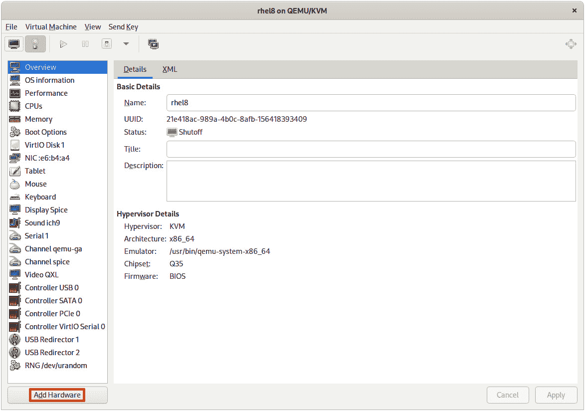

图 13.1-编辑虚拟机属性

提示

根据您使用的虚拟化平台，到达虚拟机特性的路径可能不同。但是，很常见的是从虚拟机菜单直接访问选项。

单击**添加硬件**将打开以下截图中的对话框。在其中，我们将选择**存储**选项，并指定要创建并附加到虚拟机的虚拟磁盘的大小，本例中为 1 GiB，然后单击**完成**：

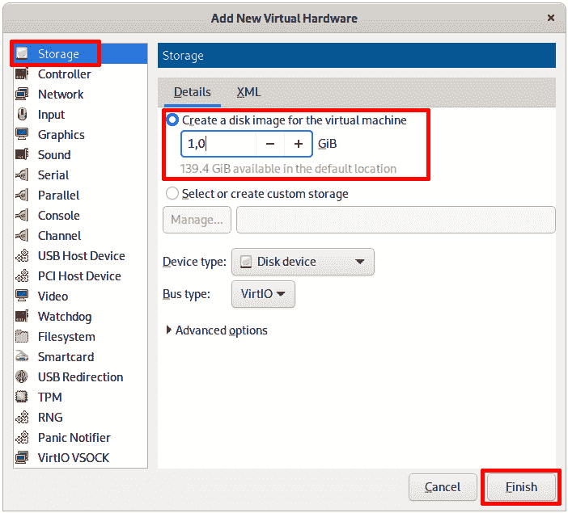

图 13.2-向虚拟机添加磁盘

我们将重复此过程两次以添加两个磁盘。最终结果将如下所示：

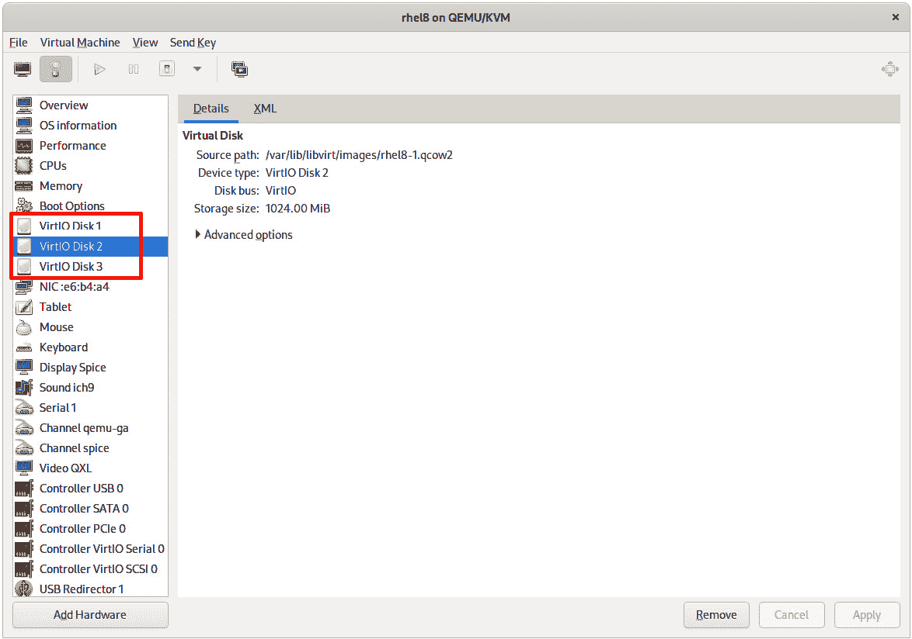

图 13.3-向虚拟机添加两个新磁盘，总共三个

现在我们将打开虚拟机并登录以检查新设备的可用性：

```
[root@rhel8 ~]# lsblk 
NAME          MAJ:MIN RM SIZE RO TYPE MOUNTPOINT
vda           252:0    0  10G  0 disk 
├─vda1        252:1    0   1G  0 part /boot
└─vda2        252:2    0   9G  0 part 
  ├─rhel-root 253:0    0   8G  0 lvm  /
  └─rhel-swap 253:1    0   1G  0 lvm  [SWAP]
vdb           252:16   0   1G  0 disk 
vdc           252:32   0   1G  0 disk
```

我们可以看到新的 1 GiB 磁盘`vdb`和`vdc`是可用的。现在我们有一个系统磁盘，我们在其中安装了 RHEL 8 操作系统，还有两个可以使用的磁盘，我们准备继续进行本章的操作。

提示

在 Linux 中，磁盘设备的命名取决于它们使用的驱动程序。连接为 SATA 或 SCSI 的设备显示为`sd`和一个字母，例如`sda`或`sdb`。连接为 IDE 总线的设备使用`hd`和一个字母，例如`hda`或`hdb`。例如使用 VirtIO 虚拟化驱动程序的设备使用`vd`和一个字母，例如`vda`或`vdb`。

# 理解 LVM

LVM 使用三层来管理系统中的存储设备。这些层如下：

+   **物理卷**（**PV**）：LVM 的第一层。直接分配给块设备。物理卷可以是磁盘上的分区，也可以是完整的原始磁盘本身。

+   **卷组**（**VG**）：LVM 的第二层。它将物理卷组合起来以聚合空间。这是一个中间层，不太显眼，但它的作用非常重要。

+   **逻辑卷**（**LV**）：LVM 的第三层。它分配了卷组聚合的空间。

让我们看看我们想要使用这两个新添加的磁盘来实现的示例：

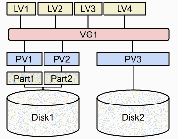

图 13.4 – 使用两个磁盘的 LVM 示例

让我们解释这个例子图表，以理解所有的层：

+   我们有两个磁盘，在图中分别是**Disk1**和**Disk2**。

+   **Disk1**被分成了两个分区，**Part1**和**Part2**。

+   **Disk2**没有分区。

+   有三个物理卷。它们的任务是准备磁盘空间以供 LVM 使用。物理卷如下：

- **PV1**，创建在**Disk1**的**Part1**分区上

- **PV2**，创建在**Disk1**的**Part2**分区上

- **PV3**，直接创建在**Disk2**上

+   一个卷组**VG1**，聚合了所有三个物理卷**PV1**、**PV2**和**PV3**。现在，所有的磁盘空间都被整合起来，可以很容易地重新分配。

+   为了分配空间，有四个逻辑卷 – **LV1**、**LV2**、**LV3**和**LV4**。请注意，逻辑卷并不使用整个磁盘。这样，如果我们需要扩展一个卷或创建一个快照，都是可能的。

这是对层是如何分布的基本描述，而不涉及复杂的情况，比如镜像、薄置备或快照。

作为一个经验法则，我们需要理解 PVs 的设计是为了准备设备供 LVM 使用，VGs 用于聚合 PVs，LVs 用于分配聚合空间。

有趣的是，如果我们创建了一个 VG，我们可以向其添加额外的磁盘，从而增加其大小，而无需停止或重新启动机器。同样，我们可以将添加的空间分配给需要它的 LV，而无需停止或重新启动机器。这是 LVM 如此强大并且被推荐用于每台服务器的主要原因之一，几乎没有例外。

现在我们知道 LVM 被分成了几层，让我们开始使用它们来开始理解它们是如何工作的。

# 创建、移动和删除物理卷

根据*技术要求*部分的说明，我们的机器已准备好了两个新磁盘`vdb`和`vdc`，我们可以开始在我们的机器上实现示例图表，就像*图 13.4*中所示的那样。

第一步与 LVM 没有直接关联，但继续示例仍然很重要。这一步涉及对`vdb`磁盘进行分区。让我们用分区管理工具`parted`来看一下：

```
[root@rhel8 ~]# parted /dev/vdb print
Error: /dev/vdb: unrecognised disk label
Model: Virtio Block Device (virtblk)
Disk /dev/vdb: 1074MB
Sector size (logical/physical): 512B/512B
Partition Table: unknown
Disk Flags:
```

重要提示

您的磁盘设备，如果您使用的是物理机器或不同的磁盘驱动程序，可能会有所不同。例如，如果我们使用 SATA 磁盘，它将是`/dev/sdb`而不是`/dev/vdb`。

磁盘完全未分区，正如我们在`unrecognised disk label`消息中所看到的。正如在*第十二章*中所解释的，*管理本地存储和文件系统*，我们可以使用两种类型的磁盘标签；`msdos`（也称为`gpt`，这是一种新类型，适用于带有`gpt`的机器，就像我们在这个例子中所做的那样。用于使用`parted`创建新标签的选项是`mklabel`：

```
[root@rhel8 ~]# parted /dev/vdb mklabel gpt
Information: You may need to update /etc/fstab.

[root@rhel8 ~]# parted /dev/vdb print
Model: Virtio Block Device (virtblk)
Disk /dev/vdb: 1074MB
Sector size (logical/physical): 512B/512B
Partition Table: gpt
Disk Flags: 

Number  Start  End  Size  File system  Name  Flags
```

提示

要创建一个`msdos`标签，命令将是`parted /dev/vdb mklabel msdos`。

现在我们有一个带有`gpt`标签的磁盘，但没有分区。让我们使用交互模式中的`mkpart`选项来创建一个分区：

```
[root@rhel8 ~]# parted /dev/vdb mkpart
```

现在我们可以输入分区名称`mypart0`：

```
Partition name?  []? mypart0
```

对于下一步，指定文件系统，我们将使用`ext2`：

```
File system type?  [ext2]? ext2 
```

现在是设置起始点的时候了。我们将使用第一个可用的扇区，即`2048s`：

```
Start? 2048s
```

提示

现代磁盘中的第一个扇区，根据定义是`2048s`。这不是由工具提供的。当有疑问时，我们可以通过运行`parted /dev/vda unit s print`来查看其他现有磁盘。

然后我们来到最后一步，设置终点，也就是我们想要创建的分区的大小：

```
End? 200MB
```

该命令附带以下警告：

```
Information: You may need to update /etc/fstab.
```

为了确保分区表在系统中得到刷新，并且允许设备在`/dev`下生成，我们可以运行以下命令：

```
[root@rhel8 ~]# udevadm settle
```

提示

在非交互模式下运行的完整命令是`parted /dev/vdb mkpart mypart0 xfs 2048s 200MB`。

我们可以看到新的分区可用：

```
[root@rhel8 ~]# parted /dev/vdb print
Model: Virtio Block Device (virtblk)
Disk /dev/vdb: 1074MB
Sector size (logical/physical): 512B/512B
Partition Table: gpt
Disk Flags: 

Number  Start   End    Size   File system  Name     Flags
1      1049kB  200MB  199MB               mypart0
```

我们需要更改分区以能够托管`LVM`物理卷。`parted`命令使用`set`选项来更改分区类型。我们需要指定分区的编号，即`1`，然后输入`lvm`和`on`来激活：

```
root@rhel8 ~]# parted /dev/vdb set 1 lvm on
Information: You may need to update /etc/fstab.

[root@rhel8 ~]# udevadm settle
[root@rhel8 ~]# parted /dev/vdb print
Model: Virtio Block Device (virtblk)
Disk /dev/vdb: 1074MB
Sector size (logical/physical): 512B/512B
Partition Table: gpt
Disk Flags: 

Number  Start   End    Size   File system  Name     Flags
1      1049kB  200MB  199MB               mypart0  lvm
```

我们看到分区的标志现在设置为`lvm`。

让我们添加第二个分区，`mypart1`：

```
[root@rhel8 ~]# parted /dev/vdb mkpart mypart1 xfs \
200MB 100%
Information: You may need to update /etc/fstab.

[root@rhel8 ~]# parted /dev/vdb set 2 lvm on
Information: You may need to update /etc/fstab.

[root@rhel8 ~]# parted /dev/vdb print
Model: Virtio Block Device (virtblk)
Disk /dev/vdb: 1074MB
Sector size (logical/physical): 512B/512B
Partition Table: gpt
Disk Flags: 

Number  Start   End     Size   File system  Name     Flags
1      1049kB  200MB   199MB               mypart0  lvm
2      200MB   1073MB  872MB               mypart1  lvm
```

现在我们已经创建了两个分区，`/dev/vdb1`（名称为`mypart0`）和`/dev/vdb2`（名称为`mypart1`），这就是我们的存储的样子：

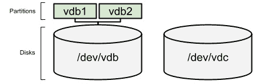

图 13.5 - 在我们的两个新磁盘上创建的分区

提示

RHEL8 中默认提供了另一个用于管理分区的工具，即`fdisk`。您可能想尝试一下，看看是否更容易使用。

现在是创建持久卷的时候了。我们只会在新创建的分区上执行。首先，我们使用`pvs`命令检查可用的持久卷：

```
[root@rhel8 ~]# pvs
  PV         VG   Fmt  Attr PSize  PFree
  /dev/vda2  rhel lvm2 a--  <9,00g    0 
```

现在，我们继续使用`pvcreate`创建持久卷：

```
[root@rhel8 ~]# pvcreate /dev/vdb1
  Physical volume "/dev/vdb1" successfully created.
[root@rhel8 ~]# pvcreate /dev/vdb2
  Physical volume "/dev/vdb2" successfully created.
```

然后我们再次使用`pvs`检查它们是否已正确创建：

```
[root@rhel8 ~]# pvs
  PV         VG   Fmt  Attr PSize   PFree  
  /dev/vda2  rhel lvm2 a--   <9,00g      0 
  /dev/vdb1       lvm2 ---  190,00m 190,00m
  /dev/vdb2       lvm2 ---  832,00m 832,00m
```

请注意，持久卷没有自己的名称，而是使用它们所创建的分区（或设备）的名称。我们可以将它们称为`PV1`和`PV2`来绘制图表。

现在的状态是：

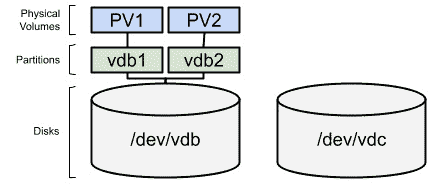

图 13.6 - 在两个新分区中创建的持久卷

我们也可以直接在磁盘设备`vdc`上创建一个持久卷。让我们来做一下：

```
[root@rhel8 ~]# pvcreate /dev/vdc 
  Physical volume "/dev/vdc" successfully created.
[root@rhel8 ~]# pvs
  PV         VG   Fmt  Attr PSize   PFree  
  /dev/vda2  rhel lvm2 a--   <9,00g      0 
  /dev/vdb1       lvm2 ---  190,00m 190,00m
  /dev/vdb2       lvm2 ---  832,00m 832,00m
  /dev/vdc        lvm2 ---    1,00g   1,00g
```

与之前的示例一样，物理卷没有名称，我们将其称为`PV3`。结果如下：

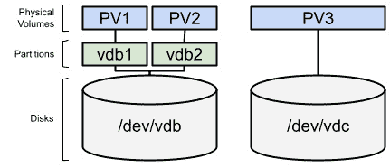

图 13.7 - 在两个新分区和新磁盘设备中创建的持久卷

现在我们有了持久卷，让我们在下一节中使用虚拟卷组对它们进行分组。

# 将物理卷合并为卷组

现在是创建一个新的卷组，使用之前添加的物理卷。在这之前，我们可以使用`vgs`命令检查可用的卷组：

```
[root@rhel8 ~]# vgs
  VG   #PV #LV #SN Attr   VSize  VFree
  rhel   1   2   0 wz--n- <9,00g    0
```

我们可以看到只有在安装过程中为操作系统创建的卷组可用。让我们使用`vgcreate`命令创建我们的`storage`卷组，使用`/dev/vdb1`和`/dev/vdb2`分区：

```
[root@rhel8 ~]# vgcreate storage /dev/vdb1 /dev/vdb2 
  Volume group "storage" successfully created
[root@rhel8 ~]# vgs
  VG      #PV #LV #SN Attr   VSize    VFree   
  rhel      1   2   0 wz--n-   <9,00g       0 
  storage   2   0   0 wz--n- 1016,00m 1016,00m
```

如您所见，新的`storage`卷组已经创建。当前状态的图表现在看起来是这样的：

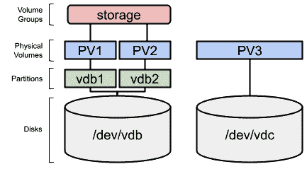

图 13.8 - 使用两个物理卷创建的第一个卷组

重要提示

**卷组**是 LVM 中的一个非常薄的层，其唯一目标是将磁盘或分区聚合成一个存储池。对该存储的高级管理，例如在两个不同的磁盘上镜像数据，是通过逻辑卷完成的。

我们已经准备好了将分区和磁盘作为物理卷，并将它们聚合到卷组中，因此我们有了一个磁盘空间池。让我们继续学习如何使用逻辑卷来分配该磁盘空间的分布。

# 创建和扩展逻辑卷

我们目前已经创建了几个物理卷，并且其中两个被分组到一个卷组中。让我们移动到下一层，并使用`lvs`命令检查逻辑卷：

```
[root@rhel8 ~]# lvs
  LV   VG   Attr       LSize  Pool Origin Data%  Meta%  Move Log Cpy%Sync Convert
  root rhel -wi-ao---- <8,00g
  swap rhel -wi-ao----  1,00g  
```

我们在`rhel`卷组上看到了`root`和`swap`卷，它们承载着操作系统。

现在，我们可以在`storage`卷组上创建一个名为`data`的简单逻辑卷，大小为 200 MB：

```
[root@rhel8 ~]# lvcreate --name data --size 200MB storage 
  Logical volume "data" created.
[root@rhel8 ~]# lvs
  LV   VG      Attr       LSize   Pool Origin Data%  Meta%  Move Log Cpy%Sync Convert
  root rhel    -wi-ao----  <8,00g                         
  swap rhel    -wi-ao----   1,00g                                  
  data storage -wi-a----- 200,00m
```

我们的配置现在如下：

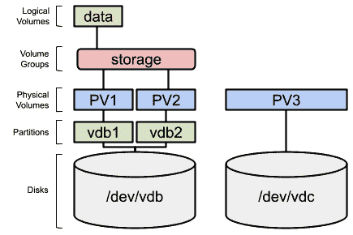

图 13.9 - 使用卷组空间创建的第一个逻辑卷

创建的逻辑卷是一个块设备，并且类似于磁盘分区。因此，为了使用它，我们需要用文件系统格式化它。让我们通过使用`xfs`格式对其进行格式化：

```
[root@rhel8 ~]# mkfs.xfs /dev/storage/data 
meta-data=/dev/storage/data      isize=512 agcount=4, agsize=12800 blks
         =                       sectsz=512   attr=2, projid32bit=1
         =                       crc=1 finobt=1, sparse=1, rmapbt=0
         =                       reflink=1
data     =                       bsize=4096 blocks=51200,imaxpct=25
         =                       sunit=0      swidth=0 blks
naming   =version 2              bsize=4096   ascii-ci=0, ftype=1
log      =internal log           bsize=4096  blocks=1368, version=2
         =                       sectsz=512 sunit=0 blks, lazy-count=1
realtime =none                   extsz=4096   blocks=0, rtextents=0
Discarding blocks...Done.
```

现在可以挂载了。我们可以创建`/srv/data`目录并在那里挂载它：

```
[root@rhel8 ~]# mkdir /srv/data
[root@rhel8 ~]# mount -t xfs /dev/storage/data /srv/data
[root@rhel8 ~]# df -h /srv/data/
Filesystem                Size  Used Avail Use% Mounted on
/dev/mapper/storage-data  195M   12M  184M   6% /srv/data
```

我们已经设置了 LVM 启用的可用空间。手动挂载文件系统，就像前面的例子一样，在系统关闭或重新启动时有效。为了使其持久化，我们需要将以下行添加到`/etc/fstab`中：

```
/dev/storage/data   /srv/data    xfs    defaults        0 0
```

为了测试该行是否正确编写，我们可以运行以下命令。首先，卸载文件系统：

```
[root@rhel8 ~]# umount /srv/data
```

检查挂载点中的可用空间：

```
[root@rhel8 ~]# df -h /srv/data/
Filesystem             Size  Used Avail Use% Mounted on
/dev/mapper/rhel-root  8,0G  2,8G  5,3G  35% /
```

`df`（*磁盘空闲*）命令的输出显示`/srv/data/`目录中的空间与`root`分区相关联，这意味着该文件夹没有任何关联的文件系统。现在让我们在系统启动时运行`mount`命令：

```
[root@rhel8 ~]# mount –a
```

`/etc/fstab`中的所有未挂载的文件系统将被挂载，如果存在任何问题（例如`/etc/fstab`中的拼写错误），则会显示错误。让我们检查它是否已挂载：

```
[root@rhel8 ~]# df -h /srv/data/
Filesystem                Size  Used Avail Use% Mounted on
/dev/mapper/storage-data  195M   12M  184M   6% /srv/data
```

重要提示

`/dev/storage/data`和`/dev/mapper/storage-data`设备是由一个名为**设备映射器**的组件生成的同一设备的别名（或者更准确地说是符号链接）。它们是完全可互换的。

正如我们所看到的，文件系统已正确挂载。现在我们知道如何创建逻辑卷并为其分配文件系统和挂载点，我们可以继续进行更高级的任务，例如在我们的 LVM 层和更高级别中扩展磁盘空间。

# 添加新磁盘到卷组并扩展逻辑卷

LVM 的一个很棒的功能，更具体地说是卷组，是我们可以向其中添加新的磁盘并开始使用新扩展的空间。让我们尝试通过将`/dev/vdc`中的物理卷添加到`storage`卷组来实现：

```
[root@rhel8 ~]# vgs
  VG      #PV #LV #SN Attr   VSize    VFree  
  rhel      1   2   0 wz--n-   <9,00g      0 
  storage   2   1   0 wz--n- 1016,00m 816,00m
[root@rhel8 ~]# vgextend storage /dev/vdc
  Volume group "storage" successfully extended
[root@rhel8 ~]# vgs
  VG      #PV #LV #SN Attr   VSize  VFree
  rhel      1   2   0 wz--n- <9,00g    0 
  storage   3   1   0 wz--n- <1,99g 1,79g
```

现在，我们的磁盘分布如下：

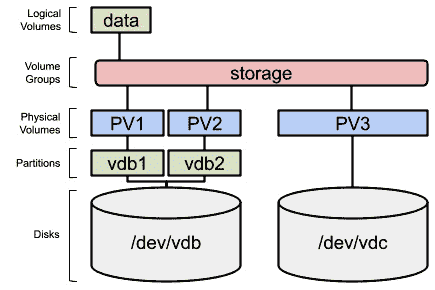

图 13.10 - 扩展的卷组，包含三个物理卷

现在让我们通过向`data`逻辑卷添加 200 MB 来扩展它：

```
[root@rhel8 ~]# lvs
  LV   VG      Attr       LSize   Pool Origin Data%  Meta%  Move Log Cpy%Sync Convert
  root rhel    -wi-ao----  <8,00g
  swap rhel    -wi-ao----   1,00g 
  data storage -wi-ao---- 200,00m 
[root@rhel8 ~]# lvextend --size +200MB /dev/storage/data
  Size of logical volume storage/data changed from 200,00 MiB (50 extents) to 400,00 MiB (100 extents).
  Logical volume storage/data successfully resized.
[root@rhel8 ~]# lvs
  LV   VG      Attr       LSize   Pool Origin Data%  Meta%  Move Log Cpy%Sync Convert
  root rhel    -wi-ao----  <8,00g 
  swap rhel    -wi-ao----   1,00g
  data storage -wi-ao---- 400,00m
```

逻辑卷已经扩展。但是上面的文件系统还没有：

```
[root@rhel8 ~]# df -h /srv/data/
Filesystem                Size  Used Avail Use% Mounted on
/dev/mapper/storage-data  195M   12M  184M   6% /srv/data
```

我们需要扩展文件系统。要执行此操作的工具取决于文件系统的类型。在我们的情况下，由于它是`xfs`，扩展它的工具是`xfs_growfs`。让我们来做：

```
[root@rhel8 ~]# xfs_growfs /dev/storage/data 
meta-data=/dev/mapper/storage-data isize=512    agcount=4, agsize=12800 blks
         =                       sectsz=512   attr=2, projid32bit=1
         =                       crc=1 finobt=1, sparse=1, rmapbt=0
         =                       reflink=1
data     =                       bsize=4096 blocks=51200 imaxpct=25
         =                       sunit=0      swidth=0 blks
naming   =version 2              bsize=4096   ascii-ci=0, ftype=1
log      =internal log           bsize=4096   blocks=1368 version=2
         =                       sectsz=512   sunit=0 blks, lazy-count=1
realtime =none                   extsz=4096   blocks=0, rtextents=0
data blocks changed from 51200 to 102400
[root@rhel8 ~]# df -h /srv/data/
Filesystem                Size  Used Avail Use% Mounted on
/dev/mapper/storage-data  395M   14M  382M   4% /srv/data
```

现在，文件系统已经添加了一些额外的空间并可用。

重要提示

在执行此任务时，逻辑卷可以被挂载并被系统使用。LVM 已准备好在运行时对生产系统进行卷扩展。

重新分配空间并添加另一个逻辑卷非常容易：

```
[root@rhel8 ~]# lvcreate --size 100MB --name img storage 
  Logical volume "img" created.
[root@rhel8 ~]# lvs
  LV   VG      Attr       LSize   Pool Origin Data%  Meta%  Move Log Cpy%Sync Convert
  root rhel    -wi-ao----  <8,00g                     
  swap rhel    -wi-ao----   1,00g                        
  data storage -wi-ao---- 400,00m                          
  img  storage -wi-a----- 100,00m                          
[root@rhel8 ~]# mkfs.xfs /dev/storage/img 
meta-data=/dev/storage/img       isize=512    agcount=4, agsize=6400 blks
         =                       sectsz=512   attr=2, projid32bit=1
         =                       crc=1 finobt=1, sparse=1, rmapbt=0
         =                       reflink=1
data     =                       bsize=4096 blocks=25600 imaxpct=25
         =                       sunit=0      swidth=0 blks
naming   =version 2              bsize=4096   ascii-ci=0, ftype=1
log      =internal log           bsize=4096  blocks=1368, version=2
         =                       sectsz=512   sunit=0 blks, lazy-count=1
realtime =none                   extsz=4096   blocks=0, rtextents=0
Discarding blocks...Done.
[root@rhel8 ~]# mkdir /srv/img
[root@rhel8 ~]# mount -t xfs /dev/storage/img /srv/img
[root@rhel8 ~]# df /srv/img/
Filesystem              1K-blocks  Used Available Use% Mounted on
/dev/mapper/storage-img     96928  6068     90860   7% /srv/img
[root@rhel8 ~]# df -h /srv/img/
Filesystem               Size  Used Avail Use% Mounted on
/dev/mapper/storage-img   95M  6,0M   89M   7% /srv/img
```

`lvcreate`命令的`--size`和`--extents`选项有几个选项可用于定义要使用的空间：

+   `GB`，或者兆字节，使用`MB`（换句话说，`--size 3GB`）。

+   `--extents`，该命令将使用其内部度量单位`extents`，它类似于磁盘分区的块大小（即`--extents 125`）。

`--size`和`--extents`选项也适用于`lvextend`命令。在这种情况下，我们可以使用先前显示的选项来定义逻辑卷的新大小。我们还有其他选项来定义分配给它们的空间的增量：

+   在`lvextend`命令的数字之前加上`+`符号，这将以提供的度量单位增加大小（即`--size +1GB`会向当前逻辑卷添加 1GB 的额外空间）。

+   `--extents`，以及要使用的剩余空间的百分比，后面跟着`%FREE`（即`--extents 10%FREE`）。

提示

正如我们之前在其他工具中看到的那样，我们可以使用手册页来了解可用的选项。请运行`man lvcreate`和`man lvextend`来熟悉这些工具的手册页。

我们将创建一个逻辑卷用作**交换空间**，这是系统用作内存停车位的磁盘的一部分。系统将消耗内存但不活动的进程放在那里，以便释放物理内存（比磁盘快得多）。当系统中没有更多的空闲物理内存时，也会使用它。

让我们在 LVM 上创建一个交换设备：

```
[root@rhel8 ~]# lvcreate --size 100MB --name swap storage
  Logical volume "swap" created.
[root@rhel8 ~]# mkswap /dev/storage/swap 
Setting up swapspace version 1, size = 100 MiB (104853504 bytes)
no label, UUID=70d07e58-7e8d-4802-8d20-38d774ae6c22
```

我们可以使用`free`命令检查内存和交换状态：

```
[root@rhel8 ~]# free
              total        used        free      shared   buff/cache   available
Mem:        1346424      218816      811372        9140       316236      974844
Swap:       1048572           0     1048572
[root@rhel8 ~]# swapon /dev/storage/swap
[root@rhel8 ~]# free
              total        used        free      shared   buff/cache   available
Mem:        1346424      219056      811040        9140       316328      974572
Swap:       1150968           0     1150968
```

重要提示

这两个新的更改需要为每个添加一行到`/etc/fstab`，以便在重新启动时持久地使用它们。

我们的磁盘空间分布现在看起来是这样的：

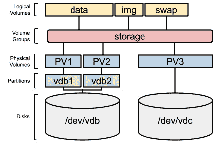

图 13.11 - 扩展的卷组，有三个物理卷

这个分布看起来很像我们用来描述 LVM 层的初始示例。我们现在已经练习了所有层，创建了每一层所需的部分。我们知道如何创建，现在是时候学习如何在下一节中删除它们了。

# 删除逻辑卷、卷组和物理卷

首先，让我们从用于移除的命令开始，先做一个简单的步骤，移除`img`逻辑卷。首先，我们需要检查它是否已挂载：

```
[root@rhel8 ~]# mount | grep img
/dev/mapper/storage-img on /srv/img type xfs (rw,relatime,seclabel,attr2,inode64,logbufs=8,logbsize=32k,noquota)
```

因为它已经挂载，我们需要卸载它：

```
[root@rhel8 ~]# umount /srv/img 
[root@rhel8 ~]# mount | grep img
```

最后一个命令显示了空输出，这意味着它没有被挂载。让我们继续移除它：

```
[root@rhel8 ~]# lvremove /dev/storage/img 
Do you really want to remove active logical volume storage/img? [y/n]: y
  Logical volume "img" successfully removed
```

现在，我们也可以移除挂载点：

```
[root@rhel8 ~]# rmdir /srv/img
```

逻辑卷的移除也完成了。这个过程是不可逆的，所以要小心运行。我们的磁盘分布现在看起来是这样的：

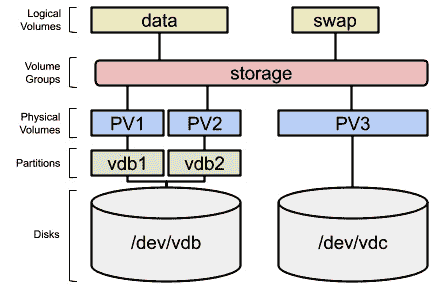

图 13.12 - 移除逻辑卷的卷组

现在是时候进行一个更复杂的任务了，从虚拟组中移除物理卷。这样做的原因是有时您想要将存储在物理磁盘上的数据转移到另一个磁盘，然后将其分离并从系统中移除。这是可以做到的，但首先让我们向`data`逻辑卷添加一些文件：

```
[root@rhel8 ~]# cp -ar /usr/share/scap-security-guide \
/srv/data/
[root@rhel8 ~]# ls /srv/data/
scap-security-guide
[root@rhel8 ~]# du -sh /srv/data/
30M  /srv/data/
```

现在让我们使用`pvmove`命令从`/dev/vdb1`中疏散数据：

```
[root@rhel8 ~]# pvmove /dev/vdb1
  /dev/vdb1: Moved: 7,75%
  /dev/vdb1: Moved: 77,52%
  /dev/vdb1: Moved: 100,00%
```

重要提示

根据分配的 extent，您可能会收到一条消息，指出“没有要移动的数据”。这意味着保存的数据已经分配给了其他磁盘。您可以使用`pvmove`与其他设备来尝试。

现在`/dev/vdb1`中没有存储数据，可以从卷组中移除。我们可以使用`vgreduce`命令来做到这一点：

```
[root@rhel8 ~]# vgreduce storage /dev/vdb1
  Removed "/dev/vdb1" from volume group "storage"
```

我们可以看到存储卷组中现在有更少的空间：

```
[root@rhel8 ~]# vgs
  VG      #PV #LV #SN Attr   VSize  VFree
  rhel      1   2   0 wz--n- <9,00g    0 
  storage   2   2   0 wz--n-  1,80g 1,30g
[root@rhel8 ~]# vgdisplay storage
  --- Volume group ---
  VG Name               storage
  System ID             
  Format                lvm2
  Metadata Areas        2
  Metadata Sequence No  20
  VG Access             read/write
  VG Status             resizable
  MAX LV                0
  Cur LV                2
  Open LV               2
  Max PV                0
  Cur PV                2
  Act PV                2
  VG Size               1,80 GiB
  PE Size               4,00 MiB
  Total PE              462
  Alloc PE / Size       129 / 516,00 MiB
  Free  PE / Size       333 / 1,30 GiB
  VG UUID               1B6Nil-rvcM-emsU-mBLu-wdjL-mDlw-66dCQU
```

我们还可以看到物理卷`/dev/vdb1`没有连接到任何卷组：

```
[root@rhel8 ~]# pvs
  PV         VG      Fmt  Attr PSize    PFree   
  /dev/vda2  rhel    lvm2 a--    <9,00g       0 
  /dev/vdb1          lvm2 ---   190,00m  190,00m
  /dev/vdb2  storage lvm2 a--   828,00m  312,00m
  /dev/vdc   storage lvm2 a--  1020,00m 1020,00m
[root@rhel8 ~]# pvdisplay /dev/vdb1
  "/dev/vdb1" is a new physical volume of "190,00 MiB"
  --- NEW Physical volume ---
  PV Name               /dev/vdb1
  VG Name               
  PV Size               190,00 MiB
  Allocatable           NO
  PE Size               0   
  Total PE              0
  Free PE               0
  Allocated PE          0
  PV UUID               veOsec-WV0n-JP9D-WMz8-UYeZ-Zjs6-sJSJst
```

提示

`vgdisplay`、`pvdisplay`和`lvdisplay`命令显示了 LVM 的任何部分的详细信息。

最重要的部分是，我们可以在系统运行生产工作负载的同时执行这些操作。我们的磁盘分布现在看起来是这样的：

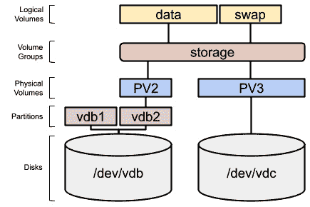

图 13.13 - 带有移除物理卷的卷组

现在是时候移除卷组了，但我们需要先移除逻辑卷，就像之前做的一样（随时运行`lvs`和`vgs`来检查进度）：

```
[root@rhel8 ~]# swapoff /dev/storage/swap
[root@rhel8 ~]# lvremove /dev/storage/swap
Do you really want to remove active logical volume storage/swap? [y/n]: y
  Logical volume "swap" successfully removed
```

现在，我们已经移除了`/dev/storage/swap`。现在让我们使用`--yes`选项移除`/dev/storage/data`，这样我们就不会被要求确认（在脚本中使用此命令时很重要）：

```
[root@rhel8 ~]# umount /dev/storage/data
[root@rhel8 ~]# lvremove --yes /dev/storage/data 
  Logical volume "data" successfully removed
```

现在是时候移除`storage`卷组了：

```
[root@rhel8 ~]# vgremove storage
```

`storage`卷组已成功移除。

最后，清理物理卷：

```
[root@rhel8 ~]# pvremove /dev/vdb1 /dev/vdb2
  Labels on physical volume "/dev/vdb1" successfully wiped.
  Labels on physical volume "/dev/vdb2" successfully wiped.
```

通过这样，我们知道如何在我们的 RHEL8 系统中处理 LVM 的每个部分。让我们回顾下一节中使用的命令。

# 回顾 LVM 命令

作为管理物理卷使用的命令的总结，让我们看一下下表：

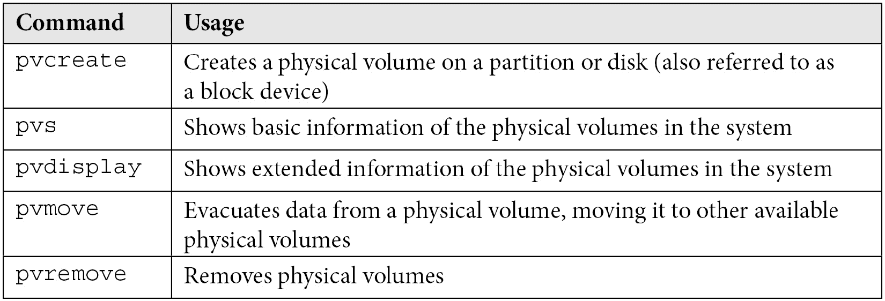

现在，让我们回顾一下用于管理卷组的命令：

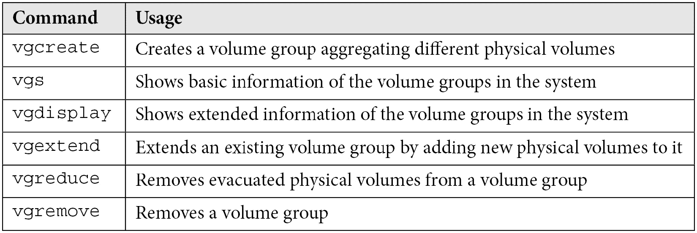

最后，让我们回顾一下用于管理逻辑卷的命令：

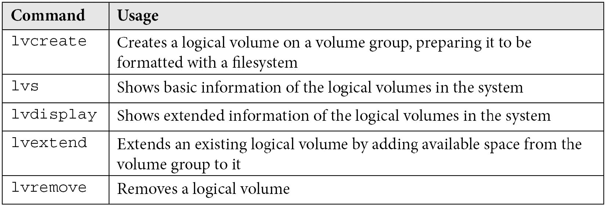

请记住，您可以随时使用每个命令的手册页面获取有关要使用的选项的更多信息，并通过运行`man <command>`来学习新的选项。

重要提示

Web 管理界面 Cockpit 具有用于管理存储组件的扩展。可以使用以下命令以`root`（或使用`sudo`）安装它：`dnf install cockpit-storaged`。您可以尝试在 Cockpit 的存储界面中重复本章中所做的过程，这对您来说是一个很好的练习。

# 总结

LVM 是 Red Hat Enterprise Linux 中非常有用的一部分，它提供了管理、重新分配、分发和分配磁盘空间的能力，而无需停止系统中的任何内容。经过多年的考验，它是系统管理员的关键组件，同时也有助于在我们的系统中引入其他扩展功能（一种通过 iSCSI 共享存储的灵活方式）。

在测试机上练习 LVM 非常重要，这样我们就可以确保在生产系统上运行的命令不会导致服务停止或数据丢失。

在本章中，我们已经看到了可以使用 LVM 完成的最基本但也最重要的任务。我们已经了解了 LVM 的不同层如何工作：物理卷、卷组和逻辑卷。此外，我们还看到了它们如何相互作用以及如何进行管理。我们已经练习了创建、扩展和删除逻辑卷、卷组和物理卷。重要的是要练习它们以巩固所学知识，并能够在生产系统中使用它们。然而，现在已经奠定了这样做的基础。

现在，让我们继续下一章，发现 RHEL8 中的一个新功能，通过添加去重功能来进一步改进存储层 - **虚拟数据优化器**（**VDO**）。
