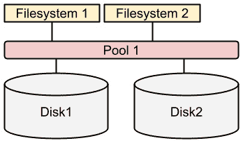
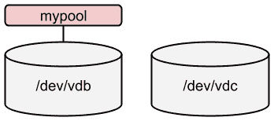
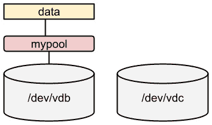
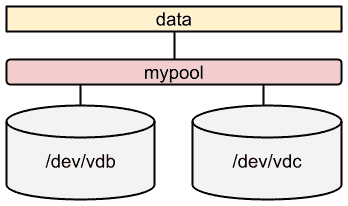
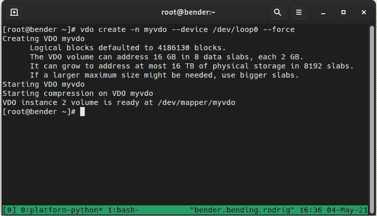
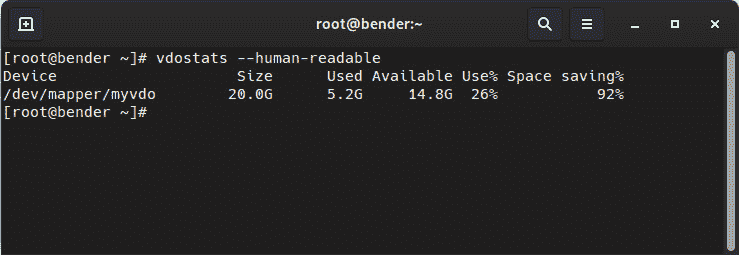
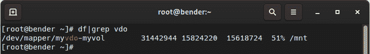

# 第十四章：*第十四章*：使用 Stratis 和 VDO 进行高级存储管理

在本章中，我们将学习**Stratis**和**虚拟数据优化器**（**VDO**）。

Stratis 是一个存储管理工具，用于简化运行最典型的日常任务。它使用前几章中解释的基础技术，如 LVM、分区模式和文件系统。

VDO 是一个存储层，包括一个驱动程序，位于我们的应用程序和存储设备之间，提供数据的去重和压缩，以及管理此功能的工具。这将使我们能够最大化系统容纳虚拟机（VM）实例的能力，这些实例将仅基于使它们独特的内容占用磁盘空间，但只存储它们共同的数据一次。

我们还可以使用 VDO 来存储我们备份的不同副本，知道磁盘使用仍将被优化。

在本章结束时，我们将了解 VDO 的工作原理以及为系统设置它所需的内容。

我们将在以下部分中探讨如何准备、配置和使用我们的系统：

+   理解 Stratis

+   安装和启用 Stratis

+   使用 Stratis 管理存储池和文件系统

+   准备系统以使用 VDO

+   创建 VDO 卷

+   将 VDO 卷分配给 LVM

+   测试 VDO 卷并查看统计信息

让我们开始准备我们的系统以使用 VDO。

# 技术要求

可以继续使用本书开头创建的 VM 的做法*第一章*，*安装 RHEL8*。本章所需的任何其他软件包将被指示，并可以从[`github.com/PacktPublishing/Red-Hat-Enterprise-Linux-8-Administration`](https://github.com/PacktPublishing/Red-Hat-Enterprise-Linux-8-Administration)下载。

在*理解 Stratis*部分，我们将需要与*第十三章*中添加的相同两个磁盘，*使用 LVM 进行灵活的存储管理*，在所有 LVM 组件都已从中清理出来后。

# 理解 Stratis

作为一项新功能，为了管理存储，**Stratis**作为技术预览包含在 RHEL 8 中（截至 RHEL 8.3 版本）。Stratis 是为了通过将系统服务**stratisd**与 LVM 中的知名工具（在*第十三章*中解释，*使用 LVM 进行灵活的存储管理*）和 XFS 文件系统（在*第十二章*中解释，*管理本地存储和文件系统*）相结合来管理本地存储，这使其非常稳固和可靠。

重要提示

使用 Stratis 创建的文件系统/池应始终使用它来管理，而不是使用 LVM/XFS 工具。同样，已创建的 LVM 卷不应使用 Stratis 来管理。

Stratis 将本地磁盘组合成**池**，然后将存储分配到**文件系统**中，如下图所示：



图 14.1 - Stratis 简化架构图

可以看到，与 LVM 相比，Stratis 提供了一个更简单和易于理解的存储管理界面。在接下来的部分中，我们将安装和启用 Stratis，然后使用在*第十三章*中创建的相同磁盘，*使用 LVM 进行灵活的存储管理*，来创建一个池和一对文件系统。

# 安装和启用 Stratis

要能够使用 Stratis，我们将从安装它开始。与之一起使用的两个软件包是这些：

+   `stratis-cli`：执行存储管理任务的命令行工具

+   `stratisd`：一个系统服务（也称为守护程序），接收命令并执行低级任务

要安装它们，我们将使用`dnf`命令：

```
[root@rhel8 ~]# dnf install stratis-cli stratisd
Updating Subscription Management repositories.
Red Hat Enterprise Linux 8 for x86_64 - BaseOS (RPMs)                17 MB/s |  32 MB     00:01    
Red Hat Enterprise Linux 8 for x86_64 - AppStream (RPMs)             12 MB/s |  30 MB     00:02    
Dependencies resolved.
====================================================================================================
Package                           Arch    Version           Repository                         Size
====================================================================================================
Installing:
stratis-cli                       noarch  2.3.0-3.el8       rhel-8-for-x86_64-appstream-rpms   79 k
stratisd                          x86_64  2.3.0-2.el8       rhel-8-for-x86_64-appstream-rpms  2.1 M
[omitted]
Complete!
```

现在我们可以使用`systemctl`启动`stratisd`服务：

```
[root@rhel8 ~]# systemctl start stratisd
[root@rhel8 ~]# systemctl status stratisd
● stratisd.service - Stratis daemon
   Loaded: loaded (/usr/lib/systemd/system/stratisd.service; enabled; vendor preset: enabled)
   Active: active (running) since Sat 2021-05-22 17:31:35 CEST; 53s ago
     Docs: man:stratisd(8)
Main PID: 17797 (stratisd)
    Tasks: 1 (limit: 8177)
   Memory: 1.2M
   CGroup: /system.slice/stratisd.service
           └─17797 /usr/libexec/stratisd --log-level debug 
[omitted]
```

现在我们将启用它以在启动时启动：

```
[root@rhel8 ~]# systemctl enable stratisd
[root@rhel8 ~]# systemctl status stratisd
● stratisd.service - Stratis daemon
   Loaded: loaded (/usr/lib/systemd/system/stratisd.service; enabled; vendor preset: enabled)
[omitted]
```

提示

我们可以用一个命令完成这两个任务，即`systemctl enable --now stratisd`。

让我们用`stratis-cli`检查守护进程（也称为系统服务）是否正在运行：

```
[root@rhel8 ~]# stratis daemon version
2.3.0
```

我们已经准备就绪，现在是时候开始处理磁盘了。让我们继续下一个子部分。

# 使用 Stratis 管理存储池和文件系统

为了为 Stratis 提供一些存储空间，我们将使用`/dev/vdb`和`/dev/vdc`磁盘。我们需要确保它们上面没有任何逻辑卷或分区。让我们检查一下它们：

```
[root@rhel8 ~]# lvs
  LV   VG   Attr       LSize  Pool Origin Data%  Meta%  Move Log Cpy%Sync Convert
  root rhel -wi-ao---- <8,00g                                                    
  swap rhel -wi-ao----  1,00g                                                    
[root@rhel8 ~]# vgs
  VG   #PV #LV #SN Attr   VSize  VFree
  rhel   1   2   0 wz--n- <9,00g    0 
[root@rhel8 ~]# pvs
  PV         VG   Fmt  Attr PSize  PFree
  /dev/vda2  rhel lvm2 a--  <9,00g    0
```

我们很好：所有由 LVM 创建的对象都在磁盘`/dev/vda`上。让我们检查另外两个磁盘，`/dev/vdb`和`/dev/vdc`：

```
[root@rhel8 ~]# parted /dev/vdb print
Model: Virtio Block Device (virtblk)
Disk /dev/vdb: 1074MB
Sector size (logical/physical): 512B/512B
Partition Table: gpt
Disk Flags: 

Number  Start  End  Size  File system  Name  Flags
[root@rhel8 ~]# parted /dev/vdc print
Error: /dev/vdc: unrecognised disk label
Model: Virtio Block Device (virtblk)
Disk /dev/vdc: 1074MB
Sector size (logical/physical): 512B/512B
Partition Table: unknown
Disk Flags: 
```

磁盘`/dev/vdc`没有分区表标签。这个没问题。然而，磁盘`/dev/vdb`有一个分区表。让我们移除它：

```
[root@rhel8 ~]# dd if=/dev/zero of=/dev/vdb count=2048 bs=1024
2048+0 records in
2048+0 records out
2097152 bytes (2,1 MB, 2,0 MiB) copied, 0,0853277 s, 24,6 MB/s 
```

提示

`dd`命令，代表磁盘转储，用于从设备转储数据和到设备。特殊设备`/dev/zero`只是生成零，我们用它来覆盖磁盘的初始扇区，标签所在的位置。请谨慎使用`dd`；它可能在没有警告的情况下覆盖任何内容。

现在我们准备使用`stratis`命令创建第一个池：

```
[root@rhel8 ~]# stratis pool create mypool /dev/vdb
[root@rhel8 ~]# stratis pool list
Name                     Total Physical   Properties
mypool   1 GiB / 37.63 MiB / 986.37 MiB      ~Ca,~Cr
```

我们目前已经创建了池，如下图所示：



图 14.2 – 创建的 Stratis 池

我们已经创建了池；现在可以在其上创建文件系统：

```
[root@rhel8 ~]# stratis filesystem create mypool data
[root@rhel8 ~]# stratis filesystem list
Pool Name   Name   Used      Created             Device                      UUID                            
mypool      data   546 MiB   May 23 2021 19:16    /dev/stratis/mypool/data   b073b6f1d56843b888cb83f6a7d80a43
```

存储的状态如下：



图 14.3 – 创建的 Stratis 文件系统

让我们准备挂载文件系统。我们需要在`/etc/fstab`中添加以下行：

```
/dev/stratis/mypool/data /srv/stratis-data      xfs     defaults,x-systemd.requires=stratisd.service        0 0
```

重要提示

为了在启动过程中正确挂载 Stratis 文件系统，我们应该添加`x-systemd.requires=stratisd.service`选项，以便在`stratisd`服务启动后挂载它。

现在我们可以挂载它：

```
[root@rhel8 ~]# mkdir /srv/stratis-data 
[root@rhel8 ~]# mount /srv/stratis-data/
```

现在让我们扩展池：

```
[root@rhel8 ~]# stratis blockdev list mypool 
Pool Name   Device Node   Physical Size   Tier
mypool      /dev/vdb              1 GiB   Data
[root@rhel8 ~]# stratis pool add-data mypool /dev/vdc
[root@rhel8 ~]# stratis blockdev list mypool 
Pool Name   Device Node   Physical Size   Tier
mypool      /dev/vdb              1 GiB   Data
mypool      /dev/vdc              1 GiB   Data
```

由于底层层使用了薄池，我们不需要扩展文件系统。存储如下：



图 14.4 – Stratis 池扩展

使用`stratis snapshot`命令创建快照的时间。让我们创建一些数据，然后对其进行快照：

```
[root@rhel8 ~]# stratis filesystem
Pool Name   Name   Used      Created             Device                      UUID                            
mypool      data   546 MiB   May 23 2021 19:54    /dev/stratis/mypool/data   08af5d5782c54087a1fd4e9531ce4943
[root@rhel8 ~]# dd if=/dev/urandom of=/srv/stratis-data/file bs=1M count=512
512+0 records in
512+0 records out
536870912 bytes (537 MB, 512 MiB) copied, 2,33188 s, 230 MB/s
[root@rhel8 ~]# stratis filesystem
Pool Name   Name   Used      Created             Device                      UUID                            
mypool      data   966 MiB   May 23 2021 19:54    /dev/stratis/mypool/data   08af5d5782c54087a1fd4e9531ce4943
[root@rhel8 ~]# stratis filesystem snapshot mypool data data-snapshot1
[root@rhel8 ~]# stratis filesystem
Pool Name   Name             Used       Created             Device                               UUID                    
mypool      data             1.03 GiB   May 23 2021 19:54    /dev/stratis/mypool/data             08af5d5782c54087a1fd4e9531ce4943
mypool      data-snapshot1   1.03 GiB   May 23 2021 19:56    /dev/stratis/mypool/data-snapshot1   a2ae4aab56c64f728b59d710b82fb682
```

提示

要查看 Stratis 的内部组件，可以运行`lsblk`命令。通过它，您将看到 Stratis 在树中使用的组件：物理设备、元数据和数据的分配、池和文件系统。所有这些都被 Stratis 抽象化了。

通过这些，我们已经了解了 Stratis 的概述，以便覆盖其管理的基础知识。请记住，Stratis 目前处于预览阶段，因此不应在生产系统中使用。

现在让我们继续研究存储管理中的其他高级主题，通过回顾使用 VDO 进行数据去重。

# 准备系统使用 VDO

如前所述，VDO 是一个驱动程序，具体来说是一个 Linux 设备映射器驱动程序，它使用两个内核模块：

+   `kvdo`：这做数据压缩。

+   `uds`：这负责去重。

常规存储设备，如本地磁盘、**廉价磁盘冗余阵列**（**RAID**）等，是数据存储的最终后端；顶部的 VDO 层通过以下方式减少磁盘使用：

+   去除零块，只在元数据中存储它们。

+   去重：重复的数据块在元数据中被引用，但只存储一次。

+   使用 4KB 数据块和无损压缩算法（LZ4：[`lz4.github.io/lz4/`](https://lz4.github.io/lz4/)）进行压缩。

这些技术过去在其他解决方案中被使用过，比如只保留虚拟机之间的差异的薄配置**VMs**，但 VDO 使这一切变得透明。

与薄配置类似，VDO 可以意味着更快的数据吞吐量，因为数据可以被系统控制器和多个服务或甚至虚拟机缓存，而无需额外的磁盘读取来访问它。

让我们安装所需的软件包，以便通过安装`vdo`和`kmod-kvdo`软件包来创建 VDO 卷：

```
dnf install vdo kmod-kvdo
```

现在，安装了软件包，我们准备在下一节创建我们的第一个卷。

# 创建 VDO 卷

为了创建 VDO 设备，我们将利用我们在*第十二章*中创建的回环设备，*管理本地存储和文件系统*，所以我们首先检查它是否已挂载，执行以下命令：

```
mount|grep loop
```

如果没有输出显示，我们可以准备在其上创建我们的`vdo`卷，使用以下命令：

```
vdo create -n myvdo --device /dev/loop0 –force
```

输出显示在以下截图中：



图 14.5 - vdo 卷创建

卷创建后，我们可以执行`vdo status`来获取有关创建的卷的详细信息，如下截图所示：

图 14.6 - vdo 状态输出

](img/B16799_14_006.jpg)

图 14.6 - vdo 状态输出

正如我们所看到的，这里有关于`kvdo`版本、正在使用的配置文件以及我们的卷（大小、压缩状态等）的信息。

新卷现在可以通过`/dev/mapper/myvdo`看到（我们使用`–n`分配的名称），并且可以使用了。

我们可以执行`vdo status|egrep -i "compression|dedupli"`并获得以下输出：

图 14.7 - 检查 VDO 压缩和重复数据删除的状态

](img/B16799_14_007.jpg)

图 14.7 - 检查 VDO 压缩和重复数据删除的状态

这意味着我们的卷上同时启用了压缩和重复数据删除，所以我们准备在下一节将其添加到 LVM 卷中进行功能测试。

# 将 VDO 卷分配给 LVM 卷

在上一节中，我们创建了一个 VDO 卷，现在将成为我们创建 LVM 卷组和一些逻辑卷的**物理卷**（**PV**）。

让我们通过以下命令序列创建 PV：

1.  `pvcreate /dev/mapper/myvdo`

1.  `vgcreate myvdo /dev/mapper/myvdo`

1.  `lvcreate -L 15G –n myvol myvdo`

此时，我们的`/dev/myvdo/myvol`已准备好格式化。让我们使用 XFS 文件系统：

```
mkfs.xfs /dev/myvdo/myvol
```

文件系统创建后，让我们通过挂载放一些数据：

```
mount /dev/myvdo/myvol /mnt
```

现在让我们在下一节测试 VDO 卷。

# 测试 VDO 卷并查看统计信息

为了测试重复数据删除和压缩，我们将使用一个大文件进行测试，比如在[`access.redhat.com/downloads/content/479/ver=/rhel---8/8.3/x86_64/product-software`](https://access.redhat.com/downloads/content/479/ver=/rhel---8/8.3/x86_64/product-software)上可用的 RHEL 8 KVM 客户机镜像。

下载后，将其保存为`rhel-8.3-x86_64-kvm.qcow2`并将其复制四次到我们的 VDO 卷：

```
cp rhel-8.3-x86_64-kvm.qcow2 /mnt/vm1.qcow2
cp rhel-8.3-x86_64-kvm.qcow2 /mnt/vm2.qcow2
cp rhel-8.3-x86_64-kvm.qcow2 /mnt/vm3.qcow2
cp rhel-8.3-x86_64-kvm.qcow2 /mnt/vm4.qcow2
```

这将是一个典型情况，对于一个持有以相同基础磁盘镜像启动的 VM 的服务器，但我们是否看到了任何改进？

让我们执行`vdostats --human-readable`来验证数据。请注意，从`ls –si`报告的图像下载大小为 1.4 GB。从`vdostats --human-readable`获得的输出如下：

```
Device                    Size      Used Available Use% Space saving%
/dev/mapper/myvdo        20.0G      5.2G     14.8G  25%           75%
```

原始卷（回环文件）为 20 GB，所以我们可以看到这个大小，但是从输出来看，我们创建的 LVM 卷为 15 GB，而且我们看到只消耗了大约 1.2 GB，即使我们有四个大小为 1.4 GB 的文件。

百分比也非常清楚。我们节省了 75%的空间（四个文件中有三个是完全相同的）。如果我们再复制一份，我们会看到百分比变为 80%（5 份复制中有 1 份）。

让我们看看另一种方法，通过创建一个空文件（填充为零）：

```
[root@bender mnt]# dd if=/dev/zero of=emptyfile bs=16777216 count=1024
dd: error writing 'emptyfile': No space left on device
559+0 records in
558+0 records out
9361883136 bytes (9.4 GB, 8.7 GiB) copied, 97.0276 s, 96.5 MB/s
```

正如我们所看到的，磁盘完全填满之前，我们能够写入 9.4 GB，但让我们再次使用`vdostats --human-readable`检查`vdo`统计信息，如下截图所示：



图 14.8 - 检查 vdostats 输出

正如我们所看到的，我们仍然有 14.8GB 可用，并且我们已经将磁盘空间从 80%增加到 92%，因为这个大文件是空的。

等等 - 如果我们使用去重和压缩，为什么我们填满了 92%的卷呢？

由于我们没有指定 VDO 卷的逻辑大小，默认情况下它与底层设备的比例为 1:1。这是最安全的方法，但我们没有真正利用压缩和去重的性能。

为了充分利用优化，我们可以在现有卷的基础上创建一个更大的逻辑驱动器。例如，如果经过长时间后我们相当确定磁盘优化可能是相似的，我们可以使用以下命令扩展逻辑大小：

```
vdo growLogical --name=myvdo --vdoLogicalSize=30G
```

当然，这不会增加可用的大小，因为我们定义了一个 PV 与卷组和顶部的逻辑卷。因此，我们还需要通过执行以下命令来扩展它：

1.  `pvresize /dev/mapper/myvdo`

1.  `lvresize –L +14G /dev/myvdo/myvol`

1.  `xfs_growfs /mnt`

通过这样做，我们扩展了物理卷，增加了逻辑卷的大小，并扩展了文件系统，因此现在可以使用这些空间。

如果现在执行`df|grep vdo`，我们会看到类似这样的内容：



图 14.9 - 调整卷大小后的磁盘空间可用性

从这一点开始，我们必须非常小心，因为我们对磁盘空间的实际使用可能不像以前那样在可能的压缩方面进行了优化，导致写入失败。因此，需要监视可用的磁盘空间以及 VDO 状态，以确保我们没有尝试使用比可用空间更多的空间，例如，如果存储的文件无法以相同的比例进行压缩或去重。

重要提示

诱人的是，我们可以从真实的物理磁盘空间中设置一个非常大的逻辑卷，但我们应该提前计划并考虑避免未来可能出现的问题，比如压缩比可能不像我们的乐观主义那样高的可能性。充分地对存储的实际数据和其典型的压缩比进行分析可以让我们更好地了解在继续积极监视逻辑卷和物理卷的磁盘使用情况演变时使用的安全方法。

很久以前，当磁盘空间非常昂贵（硬盘总共只有 80MB）时，使用工具来通过透明的压缩层增加磁盘空间变得非常流行，这些工具可以通过一些估算和报告更大的空间来实现*增加*磁盘空间；但实际上，我们知道像图片和电影这样的内容并不像文本文件这样的其他文档格式那样容易压缩。一些文档格式，比如 LibreOffice 使用的格式，已经是压缩文件，因此不会获得额外的压缩好处。

但是，当我们谈论虚拟机时，情况就不同了，每个虚拟机的基础更多或更少是相等的（基于公司政策和标准），并且是通过克隆磁盘映像部署的，然后进行一些小的定制，但本质上，大部分磁盘内容是共享的。

提示

总的来说，要记住优化实际上只是一种权衡。在调整配置文件的情况下，您是在调整吞吐量以换取延迟，而在我们的情况下，您是在交换 CPU 和内存资源以换取磁盘可用性。判断某种东西是否值得权衡的唯一方法是实施它并查看其性能，看看获得了什么好处，然后继续随着时间的推移监视性能。

# 总结

在本章中，我们学习了 VDO 和 Stratis。我们看了一些简单的管理存储的方法，如如何透明地节省磁盘空间以及如何在过程中获得一些吞吐量。

使用 Stratis，我们创建了一个具有两个磁盘的池，并将其分配给一个挂载点。这比使用 LVM 要简单一些，但另一方面，我们对我们所做的事情的控制更少。无论如何，我们学会了如何在 RHEL 8 中使用这个预览技术。

使用 VDO，我们使用创建的卷来定义一个 LVM PV，并在其上创建了一个卷组和一个逻辑卷，我们使用在之前章节中获得的知识来格式化它，以存储多个 VM 磁盘映像，模拟从同一基础启动多个 VM 的场景。

我们还学会了如何检查 VDO 的优化和节省的磁盘空间量。

现在，我们准备使用 Stratis 而不是 LVM 来组合和分配存储（尽管不用于生产）。我们还可以为我们的服务器实施 VDO 来开始优化磁盘使用。

在下一章中，我们将学习关于引导过程。
