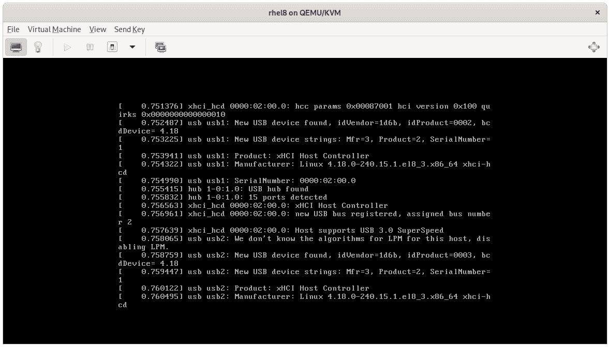
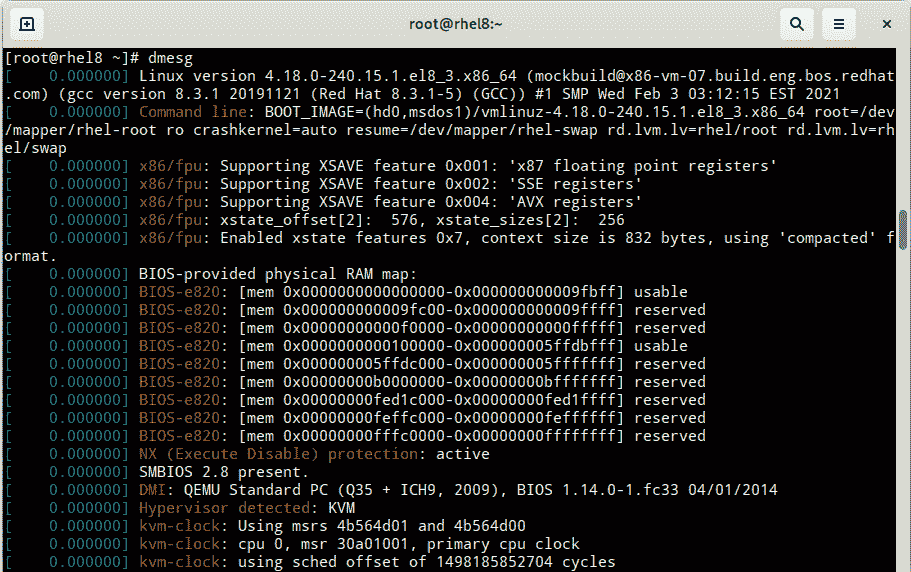
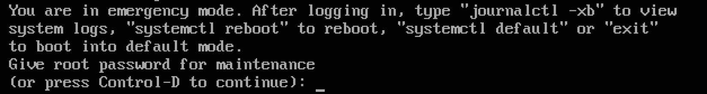
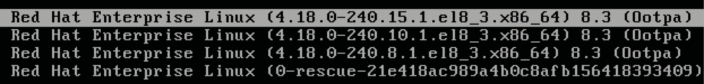
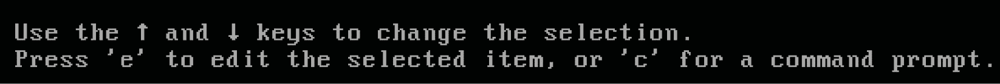
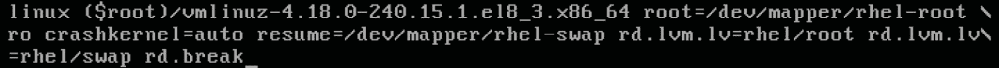
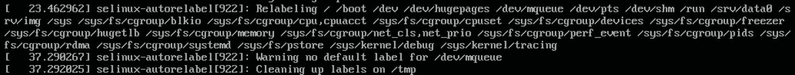

# 第十五章：*第十五章*：理解引导过程

引导过程是指从您打开机器（物理或虚拟）的那一刻到操作系统完全加载的过程。

就像许多好的视频游戏一样，它有三个阶段：硬件执行的初始启动（再次是物理或虚拟），操作系统初始阶段的加载，然后是帮助在系统中运行所需服务的机制。 我们将在本章中审查这三个阶段，并且还将添加提示和技巧，以干预系统并执行救援操作。

本章中我们将涵盖的部分如下：

+   理解引导过程 - BIOS 和 UEFI 引导

+   使用 GRUB，引导加载程序和 initrd 系统映像

+   使用 systemd 管理引导顺序

+   干预引导过程以获取对系统的访问权限

在引导过程的前两个阶段，您很可能不需要进行太多更改，但在紧急情况，取证或重大故障的情况下，这些点可能极其有帮助。 这就是为什么仔细阅读它们很重要。

第三阶段，由 **systemd** 管理，将执行更多操作和更改，以管理系统中默认运行的服务。 我们已经在之前的章节中看到了大部分要执行的任务的示例； 但是，在这一章中，我们将提供全面的审查。

让我们开始第一阶段。

# 理解引导过程 - BIOS 和 UEFI 引导

计算机具有硬件嵌入式软件控制器，也称为 **固件**，可让您管理硬件的最底层。 这个固件是对系统中可用的硬件进行第一次识别以及启用的硬件功能（如 **预引导网络执行**，称为 **PXE**）。

在被称为 **PC**（**个人计算机**）的架构中，也称为 x86，由英特尔和 IBM 推广，嵌入式固件称为 **BIOS**，代表 **基本输入输出系统**。

BIOS 引导过程，使用 Linux，采取以下步骤：

1.  计算机开机并加载 BIOS 固件。

1.  固件初始化设备，如键盘，鼠标，存储和其他外围设备。

1.  固件读取配置，包括引导顺序，指定哪个存储设备是继续引导过程的设备。

1.  一旦选择了存储设备，BIOS 将加载其中的 **主引导记录** (**MBR**)，这将启用 **操作系统加载程序**。 在 RHEL 中，操作系统加载程序称为 **Grand Unified Bootloader** (**GRUB**)。

1.  GRUB 加载配置和 `vmlinuz`，以及名为 `initrd` 的初始引导映像文件。 所有 GRUB 配置 `vmlinuz` 和 `initrd` 文件都存储在 `/boot` 分区中。

1.  初始引导映像使得加载系统的第一个进程成为可能，也称为 `init`，在 RHEL8 中是 **systemd**。

1.  *systemd* 加载操作系统的其余部分。

为了使这个过程发生，磁盘必须有一个 MBR 分区表，并且分配给 `/boot` 的分区必须标记为可引导。

提示

MBR 分区表格式非常有限，只允许四个主分区，并使用扩展分区等扩展来克服这一限制。 不建议使用这种类型的分区，除非完全需要。

UEFI 引导过程与 BIOS 引导过程非常相似。 **UEFI** 代表 **统一可扩展固件接口**。 引导顺序的主要区别在于 UEFI 可以直接访问和读取磁盘分区。 其流程如下：

1.  计算机开机并加载 UEFI 固件。

1.  固件初始化设备，如键盘，鼠标，存储和其他外围设备。

1.  固件读取配置，其中指定了继续引导过程所需的存储设备和可引导分区（UEFI 不需要 MBR 引导）。

1.  选择存储设备后，从`/boot/efi`分区读取其中的分区，并继续加载 GRUB。

1.  然后，GRUB 加载`vmlinuz`和`initrd`。GRUB 配置`vmlinuz`和`initrd`文件存储在`/boot`分区中。

1.  初始引导映像使系统的第一个进程加载，也称为`init`，在 RHEL8 中是**systemd**。

1.  *systemd*加载操作系统的其余部分。

UEFI 相对于 BIOS 具有几个优点，可以启用更完整的预引导环境和其他功能，例如安全引导和对 GPT 分区的支持，可以超出 MBR 分区的 2TB 限制。

安装程序将负责创建引导以及如果需要的 UEFI 分区和二进制文件。

需要了解的预引导部分是如何从中加载操作系统加载程序，这是红帽认证系统管理员认证考试的一部分。通过 BIOS 或 UEFI，我们可以选择从哪个存储设备加载操作系统，并转移到下一个阶段。让我们在下一节中进入下一个阶段。

# 使用 GRUB、引导加载程序和 initrd 系统映像进行工作。

预引导执行完成后，系统将运行 GRUB 引导加载程序。

GRUB 的任务是加载操作系统的主文件**kernel**，向其传递参数和选项，并加载初始 RAM 磁盘，也称为**initrd**。

可以使用`grub2-install`命令安装 GRUB。我们需要知道将用于引导的磁盘设备，例如`/dev/vda`：

```
[root@rhel8 ~]# grub2-install /dev/vda
Installing for i386-pc platform.
Installation finished. No error reported.
```

重要提示

您应该将`grub-install`指向您将用于引导系统的磁盘，与您在 BIOS/UEFI 中配置的相同磁盘。

这是用于手动重建系统或修复损坏引导的。

GRUB 文件存储在`/boot/grub2`中。主配置文件是`/boot/grub2/grub.cfg`；但是，如果您仔细查看此文件，您将看到以下标题：

```
[root@rhel8 ~]# head -n 6 /boot/grub2/grub.cfg 
#
# DO NOT EDIT THIS FILE
#
# It is automatically generated by grub2-mkconfig using templates
# from /etc/grub.d and settings from /etc/default/grub
#
```

如您所见，此文件是自动生成的，因此不打算手动编辑。那么我们如何进行更改呢？有两种方法可以这样做：

+   第一种方法是按照`grub.cfg`文件中提到的说明进行操作。这意味着编辑`/etc/default/grub`文件和/或`/etc/grub.d/`目录中的内容，然后通过运行`grub2-mkconfig`重新生成 GRUB 配置。

+   第二种方法是使用`grubby`命令行工具。

重要提示

在 RHEL 中，当有新版本的内核时，不会更新现有内核，而是在先前的内核旁边安装新的内核，并在 GRUB 中添加新的条目。这样，如果需要，可以轻松回滚到以前的工作内核。在安装过程中，为新内核创建了新的更新的`initrd`。

让我们使用`grubby`查看当前的内核配置。`--default-kernel`选项将显示默认加载的内核文件：

```
 [root@rhel8 ~]# grubby --default-kernel
/boot/vmlinuz-4.18.0-240.15.1.el8_3.x86_64
```

`--default-title`选项将显示引导时使用的名称：

```
[root@rhel8 ~]# grubby --default-title
Red Hat Enterprise Linux (4.18.0-240.15.1.el8_3.x86_64) 8.3 (Ootpa)
```

通过使用`--info`选项，我们可以查看默认内核的更多信息：

```
[root@rhel8 ~]# grubby --info=/boot/vmlinuz-4.18.0-240.15.1.el8_3.x86_64
index=0
kernel="/boot/vmlinuz-4.18.0-240.15.1.el8_3.x86_64"
args="ro crashkernel=auto resume=/dev/mapper/rhel-swap rd.lvm.lv=rhel/root rd.lvm.lv=rhel/swap rhgb quiet $tuned_params"
root="/dev/mapper/rhel-root"
initrd="/boot/initramfs-4.18.0-240.15.1.el8_3.x86_64.img $tuned_initrd"
title="Red Hat Enterprise Linux (4.18.0-240.15.1.el8_3.x86_64) 8.3 (Ootpa)"
id="21e418ac989a4b0c8afb156418393409-4.18.0-240.15.1.el8_3.x86_64"
```

我们可以看到传递给 GRUB 的选项：

+   `index`：显示条目的索引号

+   `kernel`：包含将加载以运行操作系统核心的内核的文件

+   `root`：将分配给根`/`目录并挂载的分区或逻辑卷

+   `initrd`：包含 RAM 磁盘的文件，用于执行引导过程的初始部分

+   `title`：在引导过程中向用户显示的描述性标题

+   `id`：引导项的标识符

提示

您可能希望运行`grubby`命令以获取默认配置的内核信息。为此，可以通过运行以下命令来执行：`grubby --info=$(grubby --default-kernel)`。

通过删除传递给内核的`quiet`和`rhbg`参数，让引导过程更加详细：

```
[root@rhel8 ~]# grubby --remove-args="rhgb quiet" \
--update-kernel=/boot/vmlinuz-4.18.0-240.15.1.el8_3.x86_64
[root@rhel8 ~]# grubby \ 
--info=/boot/vmlinuz-4.18.0-240.15.1.el8_3.x86_64
index=0
kernel="/boot/vmlinuz-4.18.0-240.15.1.el8_3.x86_64"
args="ro crashkernel=auto resume=/dev/mapper/rhel-swap rd.lvm.lv=rhel/root rd.lvm.lv=rhel/swap $tuned_params"
root="/dev/mapper/rhel-root"
initrd="/boot/initramfs-4.18.0-240.15.1.el8_3.x86_64.img $tuned_initrd"
title="Red Hat Enterprise Linux (4.18.0-240.15.1.el8_3.x86_64) 8.3 (Ootpa)"
id="21e418ac989a4b0c8afb156418393409-4.18.0-240.15.1.el8_3.x86_64"
```

让我们使用`systemctl reboot`命令重新启动机器进行测试。这是一个示例输出：



图 15.1 - 详细引导

在正常引导中，这可能并不是非常有用，因为它进行得太快了。然而，如果有问题，它可以帮助从控制台调试情况。要在引导后查看这些消息，可以使用`dmesg`命令：



图 15.2 - dmesg 命令的输出

我们可以使用`--args`选项向内核添加参数。让我们再次添加`quiet`选项：

```
[root@rhel8 ~]# grubby --args="quiet" \
--update-kernel=/boot/vmlinuz-4.18.0-240.15.1.el8_3.x86_64
[root@rhel8 ~]# grubby \
--info=/boot/vmlinuz-4.18.0-240.15.1.el8_3.x86_64
index=0
kernel="/boot/vmlinuz-4.18.0-240.15.1.el8_3.x86_64"
args="ro crashkernel=auto resume=/dev/mapper/rhel-swap rd.lvm.lv=rhel/root rd.lvm.lv=rhel/swap $tuned_params quiet"
root="/dev/mapper/rhel-root"
initrd="/boot/initramfs-4.18.0-240.15.1.el8_3.x86_64.img $tuned_initrd"
title="Red Hat Enterprise Linux (4.18.0-240.15.1.el8_3.x86_64) 8.3 (Ootpa)"
id="21e418ac989a4b0c8afb156418393409-4.18.0-240.15.1.el8_3.x86_64"
```

重要提示

`--info`和`--update-kernel`选项接受`ALL`选项来查看或执行所有配置的内核的操作。

如果任何管理任务需要我们更改内核参数，现在我们知道如何做了。让我们转到引导过程的下一部分，`initrd`。

`/boot/initramfs-4.18.0-240.15.1.el8_3.x86_64.img`。可以使用`dracut`命令重新生成。让我们看一个重新构建当前`initrd`文件的例子：

```
[root@rhel8 ~]# dracut --force --verbose
dracut: Executing: /usr/bin/dracut --force --verbose
dracut: dracut module 'busybox' will not be installed, because command 'busybox' could not be found!
[omitted]
dracut: *** Including module: shutdown ***
dracut: *** Including modules done ***
dracut: *** Installing kernel module dependencies ***
dracut: *** Installing kernel module dependencies done ***
dracut: *** Resolving executable dependencies ***
dracut: *** Resolving executable dependencies done***
dracut: *** Hardlinking files ***
dracut: *** Hardlinking files done ***
dracut: *** Generating early-microcode cpio image ***
dracut: *** Constructing GenuineIntel.bin ****
dracut: *** Constructing GenuineIntel.bin ****
dracut: *** Store current command line parameters ***
dracut: *** Stripping files ***
dracut: *** Stripping files done ***
dracut: *** Creating image file '/boot/initramfs-4.18.0-240.15.1.el8_3.x86_64.img' ***
dracut: *** Creating initramfs image file '/boot/initramfs-4.18.0-240.15.1.el8_3.x86_64.img' done ***
```

我们可以在先前的输出中看到，`initrd`文件中包括的用于早期访问的内核模块和文件。当我们的`initrd`文件损坏时，这一步是有用的，也是在从备份中恢复系统时，如果在不同的硬件上进行，需要包括适当的存储驱动程序。

提示

查看`dracut`的手册页面，了解创建`initrd`文件的选项。有一篇红帽知识库文章可以解压`initrd`，这是一个学习更多知识的有趣练习：[`access.redhat.com/solutions/24029.`](https://access.redhat.com/solutions/24029

)

我们已经学习了引导过程的早期阶段的基础知识，以便能够开始排除引导问题，这是成为 RHCSA 所需的。这个高级主题可以在一本完整的书中进行详细介绍，但在作为系统管理员的日常任务中几乎不会用到。这就是为什么我们只包括了其中必要的方面。我们将在本章的最后一节中包括一个特定的用例，名为*干预引导过程以访问系统*，并修复磁盘问题。让我们继续下一个关于如何使用**systemd**管理 RHEL 中服务的主题。

# 使用 systemd 管理引导顺序

我们已经学习了系统固件将如何指向一个磁盘来运行操作系统加载程序，在 RHEL 中就是 GRUB。

GRUB 将加载内核和 initrd 以准备系统启动。然后是启动系统的第一个进程，也称为进程 1 或 PID 1（**PID**代表**进程标识符**）。这个进程必须有效地负责加载系统中所有所需的服务。在 RHEL8 中，PID 1 由**systemd**运行。

在*第四章*，*常规操作工具*中，我们描述了使用 systemd 管理服务和目标。让我们在本章中回顾它与引导顺序的交互。

与`systemctl`工具相关的引导顺序的前两件事：

```
[root@rhel8 ~]# systemctl reboot
```

我们将看到系统将重新启动。我们可以使用`uptime`命令检查系统运行了多长时间：

```
[root@rhel8 ~]# uptime
11:11:39 up 0 min,  1 user,  load average: 0,62, 0,13, 0,04
```

现在是时候检查`poweroff`了。在这样做之前，请记住运行此命令后，您将需要一种方法再次打开机器。一旦我们了解了要遵循的流程，让我们运行它：

```
[root@rhel8 ~]# systemctl poweroff
```

现在我将再次打开我的机器。

有一个命令可以停止系统，但不发送关闭机器的信号，那就是`systemctl halt`。可以使用这个命令的情况很少；然而，知道它的存在和作用是很好的。

重要提示

先前显示的命令可以缩写为`reboot`和`poweroff`。如果您检查`/usr/sbin/poweroff`中的文件，您会发现它是一个指向`systemctl`的符号链接。

在*第四章*中，*常规操作工具*，我们还回顾了如何设置默认的`systemctl`。然而，我们可以通过传递`systemd.unit`参数给内核来在启动时覆盖默认配置。我们可以使用`grubby`来做到这一点：

```
[root@rhel8 ~]# systemctl get-default 
multi-user.target
[root@rhel8 ~]# grubby --args="systemd.unit=emergency.target" --update-kernel=/boot/vmlinuz-4.18.0-240.15.1.el8_3.x86_64
[root@rhel8 ~]# systemctl reboot
```

现在系统正在重新启动。`systemd.unit=emergency.target`参数已经被**GRUB**传递给**内核**，然后从**内核**传递给**systemd**，**systemd**将忽略默认配置并加载**紧急目标**所需的服务。

现在系统以紧急模式启动，并等待根密码以让您控制：



图 15.3 - RHEL 系统以紧急模式启动

在紧急模式下，没有配置网络，也没有其他进程在运行。您可以对系统进行更改，而无需担心其他用户正在访问。此外，只有`/`文件系统以只读模式挂载。

如果系统中的文件系统损坏，这将是一个检查它的好方法，而没有任何服务访问它。让我们尝试使用检查文件系统的命令`fsck`：

```
[root@rhel8 ~]# fsck /boot
fsck from util-linux 2.32.1
If you wish to check the consistency of an XFS filesystem or
repair a damaged filesystem, see xfs_repair(8).
```

文件系统正常。如果有问题需要修复（`fsck`检测到使用的文件系统），我们可以在其上运行`xfs_repair`，因为它是一个`xfs`文件系统。

此时我们可能会想，如果根文件系统已经以只读方式挂载在`/`上，我们如何对其进行更改？这个过程从将`/`文件系统重新挂载为读写开始：

```
[root@rhel8 ~]# mount -o remount -o rw /
```

记住，您可以通过运行`man mount`来访问命令的手册页面。现在我们的根文件系统以读写方式挂载在`/`上。我们还需要挂载`/boot`，所以让我们这样做：

```
[root@rhel8 ~]# mount /boot
```

有了`/boot`挂载，让我们做一些管理员任务，比如删除我们在 GRUB 中使用的参数：

```
[root@rhel8 ~]# grubby --remove-args="systemd.unit=emergency.target" --update-kernel=/boot/vmlinuz-4.18.0-240.15.1.el8_3.x86_64
[root@rhel8 ~]# reboot
```

然后我们回到了系统中的常规启动。这可能不是在 Linux 中进入紧急模式的实际方法，但它展示了如何在启动时传递参数给 systemd。

提示

有`rescue.target`加载更多服务并使过程变得更加容易。它通过等待`sysinit.target`完成来实现，而紧急目标不会这样做。一个很好的练习是使用`rescue.target`重复之前的序列。

在接下来的部分中，我们将看到如何对一次性启动进行此更改，以及在 GRUB 启动序列期间更轻松地进行类似的更改，而且无需密码。

# 干预引导过程以访问系统

有时您需要干预一个交接的系统，而您没有`root`用户的密码。尽管这听起来像是一个紧急情况，但实际上比您想象的更频繁。

重要提示

引导顺序必须没有任何加密的磁盘才能正常工作，否则您将需要加密卷的密码。

执行此过程的方法是在 GRUB 菜单中停止引导过程。这意味着我们需要重新启动系统。一旦 BIOS/UEFI 检查完成，系统将加载 GRUB。在那里，我们可以通过按下向上或向下箭头键来停止计数，就像以下截图中所示：



图 15.4 - GRUB 菜单选择内核

我们回到第一个条目。然后我们阅读屏幕底部，那里有编辑引导行的说明：



图 15.5 - GRUB 菜单选择内核

如果我们按下*E*键，我们将能够编辑菜单中选择的引导行。我们将看到以下五行：

图 15.6 - GRUB 菜单以选择内核

](img/B16799_15_006.jpg)

图 15.6 - GRUB 菜单以选择内核

前三行`load_video`，`set` `gfx_payload=keep`和`insmod gzio`设置了 GRUB 的选项。接下来的两个选项是重要的。让我们来回顾一下它们：

+   `linux`：定义要加载的内核并向其传递参数

+   `initrd`：定义了从哪里加载 initrd 以及是否有任何选项

提示

请注意，`linux`行非常长，已经换行，我们可以看到`\`符号，这意味着该行在下面继续。

现在我们应该转到`linux`行的末尾，并添加`rd.break`选项，如下面的屏幕截图所示：



图 15.7 - 使用 rd.break 选项编辑的 linux 内核行

要引导编辑后的行，我们只需要按下*Ctrl* + *X*。`rd.break`选项在加载 initrd 之前停止引导过程。现在的情况如下：

+   加载了单个 shell。

+   当前根文件系统挂载在`/`上，是一个带有基本管理命令的最小文件系统。

+   目标根文件系统以只读方式挂载在`/sysroot`上（而不是在`/`上）。

+   没有其他文件系统被挂载。

+   SELinux 未加载。

现在我们可以使用`chroot`切换到真正的磁盘根文件系统：

```
switch_root:/# chroot /sysroot
sh-4.4# 
```

现在我们的根文件系统已经正确挂载，但是只读。让我们以与上一节相同的方式进行更改：

```
sh-4.4# mount –o remount –o rw /
```

现在我们需要使用`passwd`命令更改 root 用户密码：

```
sh-4.4# passwd
Changing password for user root
New password:
Retype new password:
passwd: all authentication tokens updated successfully
```

root 用户的密码现在已更改，并且`/etc/shadow`文件已更新。但是，它是在未启用 SELinux 的情况下修改的，因此可能会在下一次引导时引发问题。为了避免这种情况，有一种机制可以在下一次引导时修复 SELinux 标签。该机制包括创建`/.autorelabel`隐藏的空文件，然后重新启动系统：

```
sh-4.4# touch /.autorelabel
```

创建文件后，现在是时候重新启动以应用 SELinux 更改。在此状态下，可能需要强制关闭电源，然后重新上电。在下一次引导时，我们将看到 SELinux 自动标记的发生：



图 15.8 - 引导期间的 SELinux 自动标记

现在我们可以使用 root 用户及其新密码登录。

# 总结

我们在本章中已经审查了引导顺序。正如您所见，它并不长，但它很复杂，而且也非常重要，因为如果系统无法引导，它就无法运行。我们已经了解了 BIOS 启用系统和 UEFI 系统之间的主要区别，后者可以实现一些功能，但也有自己的要求。我们还了解了 GRUB 及其在引导顺序中的重要作用，以及如何使用`grubby`永久修改条目以及如何进行一次性修改。我们现在知道了引导的主要文件，如内核`vmlinuz`和初始 RAM 磁盘`initrd`。

本章还向我们展示了如何在紧急和救援模式下启动，以及如何干预系统以重置 root 密码。

通过这些工具和程序，我们现在更有准备处理系统中的任何困难情况。现在是时候深入了解内核调优和性能配置文件了。
