# 第十六章：内核调优和使用`tuned`管理性能配置文件

如前几章中偶尔描述的，每个系统性能配置文件必须适应我们系统的预期用途。

内核调优在这种优化中起着关键作用，我们将在本章的以下部分进一步探讨这一点：

+   识别进程，检查内存使用情况和终止进程

+   调整内核调度参数以更好地管理进程

+   安装`tuned`和管理调优配置文件

+   创建自定义的`tuned`配置文件

在本章结束时，您将了解如何应用内核调优，如何通过`tuned`使用快速配置文件以适应不同系统角色的一般用例，以及如何进一步扩展这些自定义配置以适用于您的服务器。

此外，识别已成为资源消耗者的进程以及如何终止它们或对它们进行优先处理将是在最需要时更充分利用我们的硬件的有用方法。

让我们动手学习这些主题！

# 技术要求

您可以继续使用本书开头创建的**虚拟机**（**VM**）*第一章*中的，*安装 RHEL8*。本章所需的任何其他软件包都将在文本旁边指示。

# 识别进程，检查内存使用情况和终止进程

进程是在我们系统上运行的程序 - 它可能是通过**安全外壳**（**SSH**）登录的用户，具有运行的 bash 终端进程，甚至是 SSH 守护程序的部分，用于监听和回复远程连接，或者可能是诸如邮件客户端、文件管理器等正在执行的程序。

当然，进程占用了我们系统的资源：内存、**中央处理单元**（**CPU**）、磁盘等。对于系统管理员来说，识别或定位可能行为不端的进程是一项关键任务。

一些基础知识已经在*第四章*中涵盖了，*常规操作工具*，但在继续之前，最好先复习一下；然而，在这里，我们将展示并使用一些这些工具，例如 - 例如`top`命令，它允许我们查看进程并根据 CPU 使用情况、内存使用情况等对列表进行排序。（查看`man top`的输出，了解如何更改排序标准。）

在检查系统性能时要注意的一个参数是负载平均值，它是由准备运行或等待`1`、`5`和`15`分钟的进程组成的移动平均值 - 并且可以让我们了解负载是增加还是减少的想法。一个经验法则是，如果负载平均值低于 1，那么没有资源饱和。

负载平均值可以通过许多其他工具显示，例如前面提到的`top`，或者使用`uptime`或`w`等。

如果系统负载平均值正在增长，CPU 或内存使用率正在上升，并且如果列出了一些进程，那么定位将更容易。如果负载平均值也很高且正在增加，可能是 I/O 操作在增加。可以安装`iotop`软件包，它提供`iotop`命令来监视磁盘活动。执行时，它将显示系统中的进程和磁盘活动：读取、写入和交换，这可能会给我们一些更多关于查找位置的提示。

一旦确定了占用太多资源的进程，我们就可以发送一个**信号**来控制它。

可以使用`kill -l`命令获取信号列表，如下截图所示：

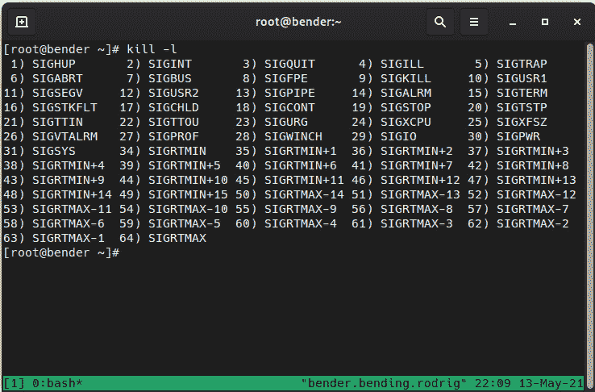

图 16.1 - 发送给进程的可用信号

请注意，每个信号都包含一个数字和一个名称 - 都可以用于通过其**进程标识符**（**PID**）向进程发送信号。

让我们来回顾一下最常见的信号，如下所示：

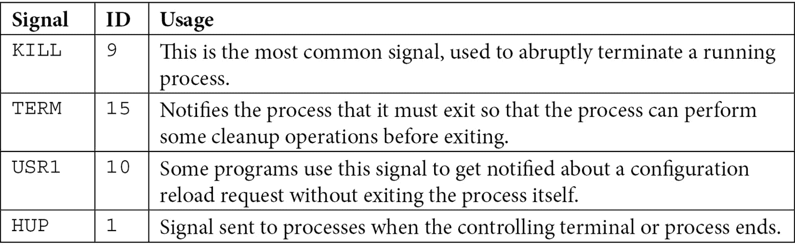

从*图 16.1*中显示的列表中，重要的是要知道每个信号都有一个`man 7 信号`，如下面的截图所示：

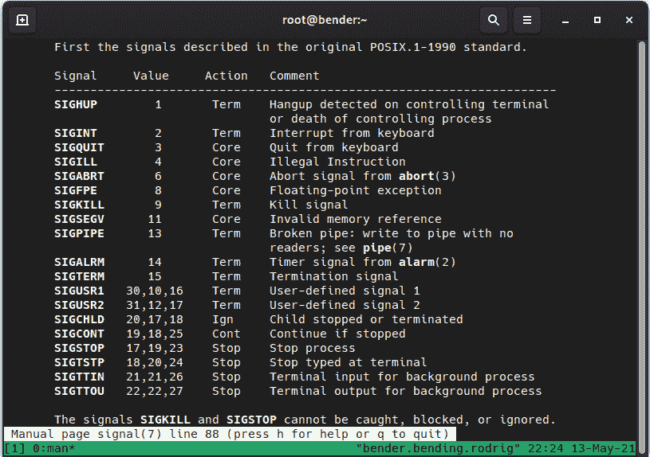

图 16.2 - 信号列表，数字等效物，处置（操作）和行为（man 7 信号）

到达这一点时最典型的用法之一是终止行为不端的进程，因此定位进程、获取 PID 并向其发送信号是一项非常常见的任务...甚至是如此常见，以至于甚至有工具可以让您将这些阶段组合成一个命令。

例如，我们可以将`ps aux|grep -i chrome|grep –v grep|awk '{print $2}'|xargs kill –9`与`pkill –9 –f chrome`进行比较：两者都会执行相同的操作，搜索名为`chrome`的进程，并向它们发送信号`9`（杀死）。

当然，即使用户登录也是系统中的一个进程（运行 SSH 或 shell 等）；我们可以通过类似的构造（使用`ps`、`grep`和其他工具）或使用`pgrep`选项（如`pgrep -l -u user`）找到我们目标用户启动的进程。

请注意，正如信号所指示的那样，最好发送一个`TERM`信号，以便让进程在退出之前运行其内部清理步骤，直接杀死它们可能会在我们的系统中留下残留物。

在终端复用器（如`tmux`或`screen`）变得普遍之前，一个广泛使用的有趣命令是`nohup`，它被添加到持续时间较长的命令之前，例如下载大文件。这个命令捕获了终端挂起信号，允许执行的进程继续执行，并将输出存储在`nohup.out`文件中，以便以后检查。

例如，要从客户门户下载最新的**Red Hat Enterprise Linux**（**RHEL**）**Image Standard Optical**（**ISO**）文件，选择一个版本，例如 8.4，然后在[`access.redhat.com/downloads/content/479/ver=/rhel---8/8.4/x86_64/product-software`](https://access.redhat.com/downloads/content/479/ver=/rhel---8/8.4/x86_64/product-software)登录后，我们将选择二进制 ISO 并右键单击复制下载的**统一资源定位符**（**URL**）。

提示

从**客户门户**复制时获得的 URL 是有时间限制的，这意味着它们只在短时间内有效，之后，下载链接将不再有效，应在刷新 URL 后获取新的链接。

然后，在终端中，我们将执行以下带有复制的 URL 的命令：

```
nohup wget URL_OBTAINED_FROM_CUSTOMER_PORTAL &
```

使用前面的命令，`nohup`将不会在终端挂断（断开连接）时关闭进程，因此`wget`将继续下载 URL，并且结束的`&`符号将执行从活动终端分离，将其作为后台作业，我们可以使用`jobs`命令检查直到它完成。

如果我们忘记添加`&`，程序将阻塞我们的输入，但我们可以在键盘上按下*Ctrl* + *Z*，进程将被停止。然而，由于我们真的希望它继续在后台执行，我们将执行`bg`，这将继续执行它。

如果我们想要将程序带回以接收我们的输入并与其交互，我们可以使用`fg`命令将其移到前台。

如果我们按下*Ctrl* + *C*，而程序有我们的输入，它将收到中断和停止执行的请求。

您可以在以下截图中看到工作流程：

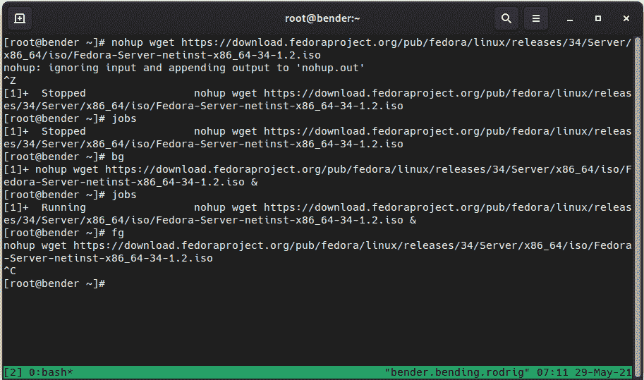

图 16.3 - 挂起进程，恢复到后台，带到前台，中止

在这种情况下，我们正在下载 Fedora 34 安装 ISO（8 `nohup`和`wget`；因为我们忘记添加&，我们执行了*Ctrl* + *Z*（显示为`^Z`）。

作业被报告为作业`[1]`，状态为`Stopped`（在执行`jobs`时也会报告）。

然后，我们使用`bg`将作业切换到后台执行，现在，`jobs`将其报告为`Running`。

之后，我们使用`fg`将作业切换回前台，并执行*Ctrl* + *C*，在屏幕上表示为`^C`，以结束它。

这个功能使我们能够运行多个后台命令 - 例如，我们可以并行复制文件到多台主机，如下面的截图所示：

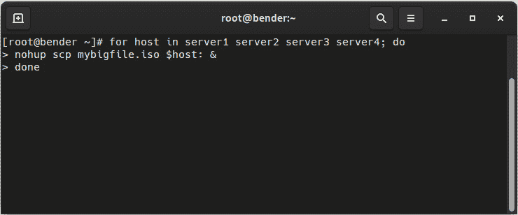

图 16.4 - 使用 nohup 复制文件到多台服务器的示例 for 循环

在这个例子中，通过`scp`执行的复制操作将会并行进行，而且，如果从我们的终端断开连接，作业将继续执行，并且输出将存储在我们执行它的文件夹中的`nohup.out`文件中。

重要提示

使用`nohup`启动的进程将不会获得任何额外的输入，因此如果程序要求输入，它将停止执行。如果程序要求输入，建议使用`tmux`，因为它仍然可以防止终端断开连接，但也允许与启动的程序进行交互。

我们并不总是愿意杀死进程或停止或恢复它们；我们可能只想降低或提高它们的优先级 - 例如，对于可能不是关键的长时间运行的任务。

让我们在下一节中了解这个功能。

# 调整内核调度参数以更好地管理进程

Linux 内核是一款高度可配置的软件，因此有一整个世界的可调参数可用于调整其行为：用于进程、网络卡、磁盘、内存等等。

最常见的可调参数是`nice`进程值和 I/O 优先级，分别调节 CPU 和 I/O 时间相对于其他进程的优先级。

对于即将启动的进程进行交互，我们可以使用`nice`或`ionice`命令，在要执行的命令前面加上一些参数（记得检查每个命令的`man`内容以获取完整的可用选项范围）。只需记住，对于`nice`，进程的优先级可以从-20 到+19，0 是标准值，-20 是最高优先级，19 是最低优先级（值越高，进程越好）。

每个进程都有一个获得内核关注的可能性；通过在执行之前通过`nice`或在运行时通过`renice`改变优先级，我们可以稍微改变它。

让我们考虑一个长时间运行的进程，比如执行备份 - 我们希望任务成功，所以我们不会停止或杀死进程，但与此同时，我们也不希望它改变我们服务器的生产或服务水平。如果我们将进程定义为 19 的`nice`值，这意味着系统中的任何进程都会获得更高的优先级 - 也就是说，我们的进程将继续运行，但不会使我们的系统更忙碌。

这让我们进入了一个有趣的话题 - 许多新来到 Linux 世界的用户，或者其他平台的管理员，当他们看到系统使用了大量内存（随机存取内存，或 RAM），却使用了交换空间，或者系统负载很高时，会感到震惊。很明显，轻微使用交换空间并且有大量空闲 RAM 只意味着内核通过将未使用的内存交换到磁盘上进行了优化。只要系统不感到迟缓，高负载只意味着系统有一个长队列的进程等待执行，但是 - 例如 - 如果进程被*niced*到 19，它们在队列中，但是如前所述，任何其他进程都会超过它。

当我们使用`top`或`ps`检查系统状态时，我们也可以检查进程运行的时间，这也是由内核计算的。一个新创建的进程开始占用 CPU 和 RAM，被内核杀死的可能性更高，以确保系统的可操作性（还记得*第四章*中提到的**内存不足**（**OOM**）杀手，*常规操作工具*吗？）。

例如，让我们使用以下代码将运行备份的进程（包含进程名称中的备份模式）的优先级降低到最低：

```
pgrep –f backup | xargs renice –n 19
143405 (process ID) old priority 0, new priority 19
144389 (process ID) old priority 0, new priority 19
2924457 (process ID) old priority 0, new priority 19
3228039 (process ID) old priority 0, new priority 19
```

正如我们所看到的，`pgrep`已经收集了一系列 PID，并且该列表已被作为`renice`的参数进行了管道传输，优先级调整为 19，使实际在系统中运行的进程更加友好。

让我们在系统中通过使用`bc`运行π（π）计算来重复前面的例子，就像`bc`的 man 页面中所示。首先，我们将计算系统所需的时间，然后通过`renice`执行它。所以，让我们动手操作—首先，让我们计时，如下所示：

```
time echo "scale=10000; 4*a(1)" | bc –l
```

在我的系统中，这是结果：

```
real 3m8,336s
user 3m6,875s
sys  0m0,032s
```

现在，让我们使用`renice`运行它，如下所示：

```
time echo "scale=10000; 4*a(1)" | bc -l &
pgrep –f bc |xargs renice –n 19 ; fg
```

在我的系统中，这是结果：

```
real 3m9,013s
user 3m7,273s
sys  0m0,043s
```

有 1 秒的轻微差异，但您可以尝试在您的环境中运行更多进程以生成系统活动，使其更加明显，并在规模上增加更多的零以增加执行时间。同样，`ionice`可以调整进程引起的 I/O 操作（读取、写入）的优先级—例如，对于我们的备份进程重复操作，我们可以运行以下命令：

```
pgrep –f  backup|xargs ionice –c 3 –p 
```

默认情况下，它不会输出信息，但我们可以通过执行以下命令来检查值：

```
pgrep -f backup|xargs ionice -p
idle
idle
idle
idle
```

在这种情况下，我们已将备份进程移动，以便在系统空闲时处理 I/O 请求。

我们使用`-c`参数指定的类可以是以下之一：

+   `0`：无

+   `1`：实时

+   `2`：尽力而为

+   `3`：空闲

使用`-p`，我们指定要操作的进程。

我们可以应用到系统的大多数设置都来自特定的设置，通过`/proc/`虚拟文件系统应用到每个 PID，例如—例如—调整`oom_adj`文件以减少`oom_score`文件上显示的值，最终确定进程是否应在 OOM 需要杀死一些进程以尝试拯救系统免受灾难时更高。

当然，还有一些系统级设置，例如`/proc/sys/vm/panic_on_oom`，可以调整系统如何在 OOM 必须被调用时做出反应（是否恐慌）。

磁盘还有一个设置，用于定义正在使用的调度程序—例如，对于名为`sda`的磁盘，可以通过`cat /sys/block/sda/queue/scheduler`进行检查。

磁盘使用的调度程序有不同的方法，取决于内核版本—例如，在 RHEL 7 中，它曾经是`noop`、`deadline`或`cfq`，但在 RHEL 8 中，这些已被移除，我们有`md-deadline`、`bfq`、`kyber`和`none`。

这是一个如此庞大而复杂的主题，甚至有一个专门的手册，网址为[`access.redhat.com/documentation/en-us/red_hat_enterprise_linux_for_real_time/8/html-single/tuning_guide/index`](https://access.redhat.com/documentation/en-us/red_hat_enterprise_linux_for_real_time/8/html-single/tuning_guide/index)，所以如果您有兴趣深入了解，请查看它。

我希望在这里实现两件事，如下所示：

+   明确指出系统有很多调整选项，并且有自己的文档，甚至有一个 Red Hat 认证架构师考试，网址为[`www.redhat.com/en/services/training/rh442-red-hat-enterprise-performance-tuning`](https://www.redhat.com/en/services/training/rh442-red-hat-enterprise-performance-tuning)。

+   这并不是一项容易的任务—在本书中多次强调了一个观点：使用您系统的工作负载测试一切，因为结果可能因系统而异。

幸运的是，不需要对系统调优感到害怕——我们可以通过经验在各个层面（知识、硬件、工作负载等）变得更加熟练，但另一方面，系统也包括一些更简单的方法来进行快速调整，适用于许多场景，我们将在下一节中看到。

# 安装 tuned 和管理调优配置文件

希望在前面的部分中发生了一些危言耸听之后，您已经准备好迎接更简单的路径了。

以防万一，请确保已安装了`tuned`软件包，或者使用`dnf –y install tuned`进行安装。该软件包提供了一个必须启用并启动的*tuned*服务；作为复习，我们通过运行以下命令来实现这一点：

```
systemctl enable tuned
systemctl start tuned
```

现在我们已经准备好与该服务进行交互并获取更多信息，该服务在`dnf info tuned`中宣布自己是一个根据某些观察动态调整系统的守护进程，目前正在以太网网络和硬盘上运行。

通过`tuned-adm`命令与守护进程进行交互。为了说明，我们在下图中展示了可用的命令行选项和配置文件列表：

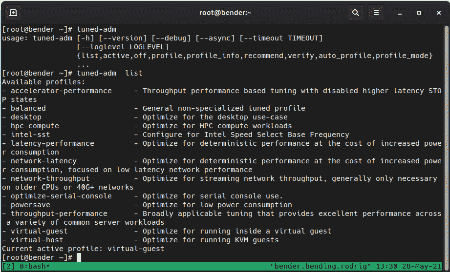

图 16.5 - tuned-adm 命令行选项和配置文件

正如我们所看到的，有一些选项可以列出、禁用和获取有关配置文件的信息，获取有关要使用哪个配置文件的建议，验证设置是否已被更改，自动选择配置文件等。

要记住的一件事是，较新版本的`tuned`软件包可能会带来额外的配置文件或配置（存储在`/usr/lib/tuned/`文件夹层次结构中），因此您的系统可能会有所不同。

让我们在下表中回顾一些最常见的选项：

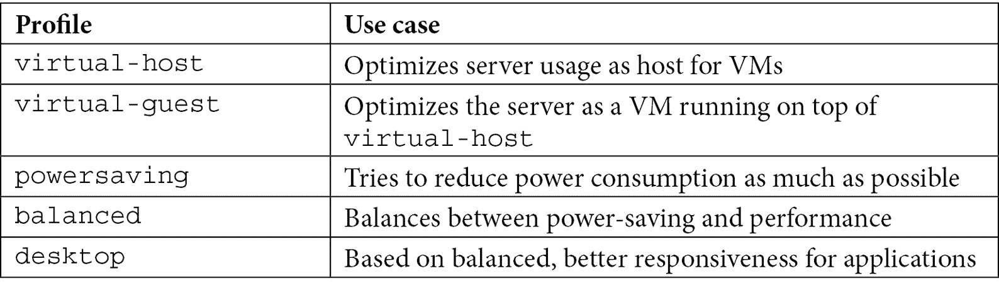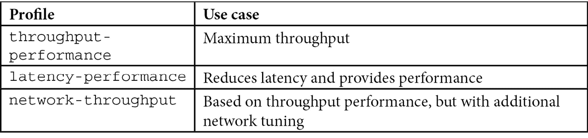

正如前面提到的，每个配置都是一种权衡：提高性能需要更多的功耗，或者提高吞吐量可能会增加延迟。

让我们为我们的系统启用`latency-performance`配置文件。为此，我们将执行以下命令：

```
tuned-adm profile latency-performance
```

我们可以通过`tuned-adm active`来验证它是否已激活，可以看到它显示了`latency-performance`，如下图所示：

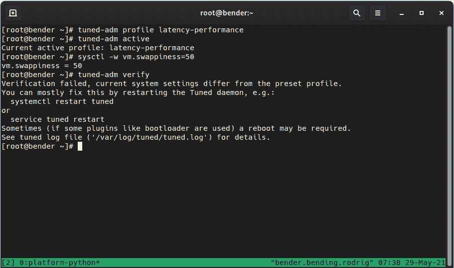

图 16.6 - tuned-adm 配置文件激活和验证

我们还通过`sysctl -w vm.swappiness=69`（故意）修改了系统，以演示`tuned-adm verify`操作，因为它报告说一些设置已经从配置文件中定义的设置发生了变化。

重要提示

截至目前，默认情况下动态调整是禁用的——要启用或检查当前状态，请检查`/etc/tuned/tuned-main.conf`文件中是否出现了`dynamic_tuning=1`。在性能配置文件中它是被禁用的，因为默认情况下它试图在功耗和系统性能之间取得平衡，这与性能配置文件的目标相反。

另外，请记住，本书介绍的**Cockpit**界面还提供了一种更改性能配置文件的方法——如下截图所示——一旦您在主 Cockpit 页面上点击了**Performance profile**链接，就会打开此对话框：

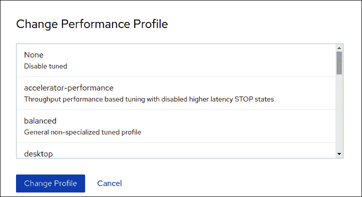

图 16.7 - 在 Cockpit Web 界面中更改 tuned 配置文件

在下一节中，我们将探讨调优配置文件在幕后是如何工作的，以及如何创建自定义配置文件。

# 创建一个自定义的调优配置文件

一旦我们评论了不同的 tuned 配置文件... *它们是如何工作的？如何创建一个？*

例如，让我们通过检查`/usr/lib/tuned/latency-performance/tuned.conf`文件来检查`latency-performance`。

一般来说，文件的语法在`man tuned.conf`页面中有描述，但是文件，正如您将能够检查的那样，是一个*初始化（ini）文件*——也就是说，它是一个在括号之间表达的类别文件，并且由等号（`=`）分配的键和值对。

主要部分定义了配置文件的摘要，如果它通过`include`从另一个配置文件继承，并且其他部分取决于安装的插件。

要了解可用的插件，man 页面中包含的文档指示我们执行`rpm -ql tuned | grep 'plugins/plugin_.*.py$'`，这将提供类似于以下的输出：

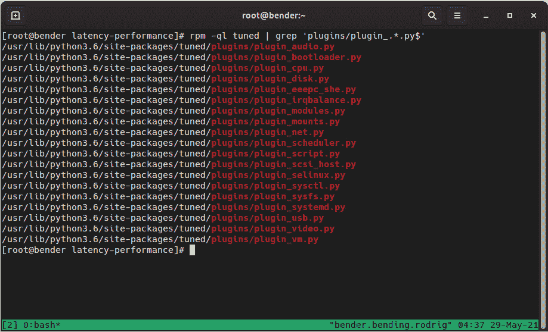

图 16.8 - 系统中可用的 tuned 插件

重要提示

如果两个或更多的插件尝试对相同的设备进行操作，`replace=1`设置将标记运行它们所有还是只运行最新的一个。

回到`latency-performance`配置文件，它有三个部分：`main`、`cpu`和`sysctl`。

对于 CPU，它设置了性能调度器，我们可以通过`cat /sys/devices/system/cpu/*/cpufreq/scaling_governor`检查每个系统中可用的 CPU 是否支持。请记住，在某些系统中，路径可能不同，甚至可能不存在，我们可以通过执行`cpupower frequency-info –governors`来检查可用的路径，`powersave`和`performance`是最常见的。

对于每个插件的部分名称可能是任意的，如果我们指定`type`关键字来指示要使用哪个插件，并且我们可以使用`devices`关键字来对一些设备进行操作，例如，根据正在配置的磁盘的不同设置，允许定义几个磁盘部分。例如，我们可能希望为系统磁盘（比如`sda`）和用于数据备份的磁盘（比如`sdb`）定义一些设置，如下所示：

```
[main_disk]
type=disk
devices=sda
readahead=>4096
[data_disk]
type=disk
devices=!sda
spindown=1
```

在前面的例子中，名为`sda`的磁盘使用`readahead`进行配置（它在当前利用之前读取扇区，以便在实际请求访问数据之前将数据缓存），我们告诉系统`spindown`数据磁盘，这些磁盘可能仅在备份时使用，因此在不使用时减少噪音和功耗。

另一个有趣的插件是`sysctl`，被几个配置文件使用，它以与`sysctl`命令相同的方式定义设置，因此可能性是巨大的：定义用于调整网络、虚拟内存管理、透明大页等的**传输控制协议**（**TCP**）窗口大小。

提示

从头开始进行任何性能调整都很困难，而且由于`tuned`允许我们从父级继承设置，因此找到可用配置文件中最接近我们想要实现的目标的配置文件，检查其中的配置，当然，与其他配置文件进行比较是有意义的（正如我们所看到的，其他插件也有示例），并将其应用到我们的自定义配置文件中。

为了了解定义的系统配置文件如何影响系统，我的 RHEL 8 系统对`cat /usr/lib/tuned/*/tuned.conf|grep -v ^#|grep '^\'|sort –u`命令显示以下输出：

![图 16.9 - 系统提供的配置文件中的部分


图 16.9 - 系统提供的配置文件中的部分

因此，正如我们所看到的，它们涉及到很多领域，我想强调`script`部分，它定义了一个用于`powersave`配置文件执行的 shell 脚本，以及`variables`部分，它用于`throughput-performance`配置文件，用于定义后续匹配和基于 CPU 应用设置的正则表达式。

一旦我们准备好，我们将在`/etc/tuned/newprofile`下创建一个新的文件夹。必须创建一个`tuned.conf`文件，其中包含摘要的主要部分和我们想要使用的插件的其他部分。

创建新配置文件时，如果我们将感兴趣的配置文件从`/usr/lib/tuned/$profilename/`复制到我们的`/etc/tuned/newprofile/`文件夹中，并从那里开始定制，可能会更容易。

一旦准备就绪，我们可以使用`tuned-adm profile newprofile`启用配置文件，就像我们在本章中介绍的那样。

您可以在官方文档中找到有关可用配置文件的更多信息[`access.redhat.com/documentation/en-us/red_hat_enterprise_linux/8/html-single/monitoring_and_managing_system_status_and_performance/index`](https://access.redhat.com/documentation/en-us/red_hat_enterprise_linux/8/html-single/monitoring_and_managing_system_status_and_performance/index)。

有了这个，我们为调整性能设置设置了自定义配置文件。

# 摘要

在本章中，我们学习了如何识别进程，检查它们的资源消耗，以及如何向它们发送信号。

关于信号，我们了解到其中一些具有一些额外的行为，比如优雅或突然终止进程，或者只是发送通知，一些程序将其理解为重新加载配置而不重新启动等等。

此外，关于进程，我们学习了如何调整它们相对于 CPU 和 I/O 的优先级，以便我们可以调整长时间运行的进程或磁盘密集型进程，以免影响其他正在运行的服务。

最后，我们介绍了`tuned`守护程序，其中包括几个通用的使用案例配置文件，我们可以直接在我们的系统中使用，允许`tuned`应用一些动态调整，或者我们可以通过创建自己的配置文件来微调配置文件，以提高系统性能或优化功耗。

在下一章中，我们将学习如何使用容器、注册表和其他组件，以便应用程序可以在供应商提供的情况下运行，同时与运行它们的服务器隔离。
