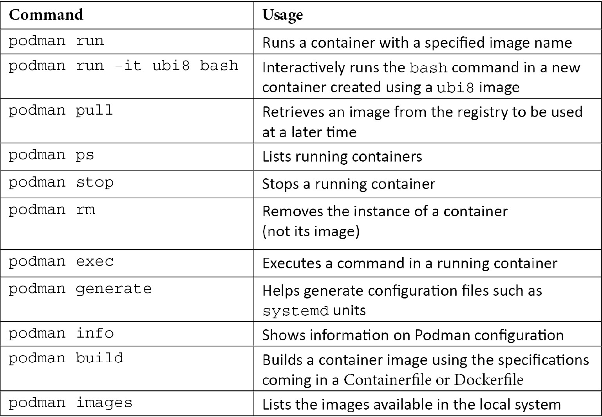

# 第十七章：使用 Podman、Buildah 和 Skopeo 管理容器

在本章中，我们将学习如何使用 Podman 和 Red Hat Universal Base Image（UBI）。Podman 和 UBI 共同为用户提供了在**Red Hat Enterprise Linux**（RHEL）上运行、构建和共享企业级容器所需的软件。

近年来，理解和使用容器已成为 Red Hat 系统管理员的关键要求。在本章中，我们将回顾容器的基础知识，容器的工作原理以及管理容器的标准任务。

您将学习如何使用简单命令运行容器，构建企业级容器镜像，并在生产系统上部署它们。您还将学习何时使用更高级的工具，如 Buildah 和 Skopeo。

本章将涵盖以下主题：

+   容器简介

+   使用 Podman 和 UBI 在本地 RHEL 8 系统上运行容器

+   何时使用 Buildah 和 Skopeo

# 技术要求

在本章中，我们将回顾 Podman、Buildah 和 Skopeo 的基本用法，以及如何使用 Red Hat UBI 构建和运行容器。

我们将在本地 RHEL 8 系统上创建和运行容器，就像我们在*第一章*中部署的那样，*安装 RHEL8*。您需要安装`container-tools:rhel8` **应用流**。

# 容器简介

容器为用户提供了在 Linux 系统上运行软件的新方式。容器以一种一致的可再分发方式提供了与给定软件相关的所有依赖关系。虽然最初是由 Docker、Google、Red Hat 等推广的，但许多其他公司加入 Docker 创建了一组名为**Open Container Initiative**（OCI）的开放标准。OCI 标准的流行促进了一个大型的工具生态系统，用户不必担心流行的容器镜像、注册表和工具之间的兼容性。近年来，容器已经标准化，大多数主要工具遵循 OCI 规范，如下所述：

+   镜像规范：规定了容器镜像在磁盘上的保存方式

+   运行时规范：指定了如何通过与操作系统（特别是 Linux 内核）通信来启动容器

+   分发规范：规定了如何从注册表服务器推送和拉取镜像

您可以在 https://opencontainers.org/了解更多信息。

所有容器工具（Docker、Podman、Kubernetes 等）都需要一个操作系统来运行容器，每个操作系统可以选择不同的技术集来保护容器，只要它们符合 OCI 标准。RHEL 使用以下操作系统功能来安全存储和运行容器：

+   命名空间：这是 Linux 内核中的一种技术，有助于将进程相互隔离。命名空间防止容器化进程看到主机操作系统上的其他进程（包括其他容器）。命名空间是使容器感觉像**虚拟机**（VM）的技术。

+   控制组（Cgroups）：这些限制了给定进程/容器可用的中央处理单元（CPU）、内存、磁盘输入/输出（I/O）和/或网络 I/O 的数量。这可以防止“吵闹的邻居”问题。

+   安全增强型 Linux（SELinux）：如*第十章*中所述，使用 SELinux 可以提供额外的操作系统安全层，可以限制安全漏洞造成的损害。当与容器一起使用时，SELinux 几乎是透明的，并且可以在工具（如 Podman、Docker 或 Runc）存在漏洞时提供安全突破的缓解。

许多系统管理员使用虚拟机来隔离应用程序及其依赖项（库等）。容器提供了相同级别的隔离，但减少了虚拟化的开销。由于容器是简单的进程，它们不需要具有所有翻译开销的**虚拟 CPU**（**vCPU**）。容器也比虚拟机小，这简化了管理和自动化。这对于**持续集成/持续交付**（**CI/CD**）特别有用。

RHEL 为用户提供了与所有 OCI 标准兼容的容器工具和镜像。这意味着它们的工作方式对于使用过 Docker 的人来说非常熟悉。对于不熟悉这些工具和镜像的人，以下概念很重要：

+   **层**：容器镜像是作为一组层构建的。通过添加新层（甚至删除内容）来创建新容器，这些新层重用现有的较低层。使用现有的预打包容器的能力对于只想对其应用程序进行更改并以可重现的方式进行测试的开发人员非常方便。

+   **分发和部署**：由于容器提供了与应用程序耦合的所有依赖项，因此它们易于部署和重新分发。将它们与容器注册表结合使用，可以轻松共享容器镜像，并且协作、部署和回滚都更快更容易。

RHEL 提供的容器工具使得在小规模上部署容器变得容易，即使是用于生产工作负载。但是，要以可靠的方式大规模管理容器，容器编排（如 Kubernetes）是更好的选择。红帽公司根据构建 Linux 发行版的经验，创建了一个名为**OpenShift**的 Kubernetes 发行版。如果您需要大规模部署容器，我们建议您看看这个平台。RHEL 提供的容器工具和镜像，以及本章介绍的内容，将为以后准备好部署到 Kubernetes/OpenShift 提供坚实的基础。本章介绍的工具将为您的应用程序在准备好时部署到 Kubernetes 做好准备。

## 安装容器工具

RHEL 8 提供了两个**容器工具**的应用流。第一个是每 12 周更新一次的快速移动流。第二个是每年发布一次并支持 24 个月的稳定流。

在安装容器工具之前，让我们看一下有哪些可用的，如下所示：

```
[root@rhel8 ~]# yum module list | grep container-tools
container-tools      rhel8 [d][e]    common [d]                               Most recent (rolling) versions of podman, buildah, skopeo, runc, conmon, runc, conmon, CRIU, Udica, etc as well as dependencies such as container-selinux built and tested together, and updated as frequently as every 12 weeks.
container-tools      1.0             common [d]                               Stable versions of podman 1.0, buildah 1.5, skopeo 0.1, runc, conmon, CRIU, Udica, etc as well as dependencies such as container-selinux built and tested together, and supported for 24 months.
container-tools      2.0             common [d]                               Stable versions of podman 1.6, buildah 1.11, skopeo 0.1, runc, conmon, etc as well as dependencies such as container-selinux built and tested together, and supported as documented on the Application Stream lifecycle page.    
container-tools      3.0             common [d]                               Stable versions of podman 3.0, buildah 1.19, skopeo 1.2, runc, conmon, etc as well as dependencies such as container-selinux built and tested 
together, and supported as documented on the Application Stream lifecycle page.
```

让我们来看一下我们列出的主要工具，如下所示：

+   `podman`：这是运行容器的命令。您可以在任何情况下使用它，就像您在互联网上发现的示例中使用`docker`命令一样。这是我们在本章中用来运行我们自己的容器的命令。

+   `buildah`：这是一个用于创建容器镜像的特定工具。它使用与 Docker 相同的 Dockerfile 定义，但不需要守护进程。

+   `skopeo`：这是一个用于审查容器并检查不同层的工具，以便我们可以查看它们是否包含任何不符合规范的问题。

我们将安装快速移动流，以便访问 Podman、Skopeo 和 Buildah 的最新版本，如下所示：

```
[root@rhel8 ~]# yum module install container-tools:rhel8
... [output omitted] ...
```

现在您已经安装了所有在 RHEL 8 系统上构建、运行和管理容器所需的工具。

# 使用 Podman 和 UBI 运行容器

现在您已经安装了容器工具的应用流，让我们运行一个基于红帽 UBI 的简单容器，这是一组基于 RHEL 的官方容器镜像和额外软件。要运行 UBI 镜像，只需要一个命令，如下面的代码片段所示：

```
[root@rhel8 ~]# podman run –it registry.access.redhat.com/ubi8/ubi bash
[root@407ca121cbbb /]#
```

提示

这些教程以 root 身份运行命令，但 Podman 的一个好处是它可以以普通用户身份运行容器，无需特殊权限或在系统中运行守护程序。

现在您有一个完全隔离的环境，可以在其中执行任何您想要的操作。您可以在此容器中运行任何命令。它与主机和可能正在运行的其他容器隔离，并且甚至可以在其中安装软件。

注意

Red Hat UBI 基于 RHEL 的软件和软件包。这是用于 RHEL 的官方镜像，并为您的容器提供了一个坚实、企业级的基础。UBI 在本章中被广泛使用。

运行这样的一次性容器对于测试新的配置更改和新的软件部件而不干扰主机上的软件非常有用。

让我们来看看容器中正在运行的进程，如下所示：

```
[root@ef3e08e4eac2 /]# ps -efa
UID          PID    PPID  C STIME TTY          TIME CMD
root           1       0  0 13:50 pts/0    00:00:00 bash
root          12       1  0 13:52 pts/0    00:00:00 ps -efa
```

正如您所看到的，唯一正在运行的进程是我们正在使用的 shell 和我们刚刚运行的命令。这是一个完全隔离的环境。

现在，通过运行以下命令退出容器：

```
[root@407ca121cbbb /]# exit
[root@rhel8 ~]#
```

现在我们已经在本地缓存了一组可工作的容器工具和 UBI 容器镜像，我们将继续进行一些更基本的命令。

## 基本容器管理-拉取、运行、停止和移除

在本节中，我们将运行一些基本命令，以熟悉使用容器。首先，让我们拉取一些更多的镜像，如下所示：

```
[root@rhel8 ~]# podman pull registry.access.redhat.com/ubi8/ubi-minimal
...
[root@rhel8 ~]# podman pull registry.access.redhat.com/ubi8/ubi-micro
...
[root@rhel8 ~]# podman pull registry.access.redhat.com/ubi8/ubi-init
...
```

我们现在本地缓存了几个不同的镜像。让我们在这里看看它们：

```
[root@rhel8 ~]#  podman images
REPOSITORY                                   TAG     IMAGE ID      CREATED     SIZE
registry.access.redhat.com/ubi8/ubi          latest  613e5da7a934  2 weeks ago  213 MB
registry.access.redhat.com/ubi8/ubi-minimal  latest  332744c1854d  2 weeks ago  105 MB
registry.access.redhat.com/ubi8/ubi-micro    latest  75d0ed7e8b6b  5 weeks ago  38.9 MB
registry.access.redhat.com/ubi8/ubi-init     latest  e13482c4e694  2 weeks ago  233 MB
```

请注意，我们本地缓存了四个镜像。Red Hat UBI 实际上有多种不同的版本，如下所述：

+   `ubi8/ubi`): 这是一个基于 RHEL 的容器基础镜像，镜像中包含了**YellowDog Updater Modified** (**YUM**)/**Dandified YUM** (**DNF**)。它可以像任何其他 Linux 基础镜像一样使用。这个镜像针对 80%的用户使用情况，并且可以轻松地在 Dockerfile 或 Containerfile 中使用。这个镜像的折衷之处在于它比其他一些镜像更大。

+   `ubi8/ubi-minimal`): 这个基础镜像通过使用一个名为`microdnf`的小型包管理器来最小化尺寸，该包管理器是用 C 编写的，而不是像标准的 YUM/DNF 那样使用 Python。这个 C 实现使它更小，并且在容器镜像中拉取更少的依赖项。这个基础镜像可以在任何 Dockerfile 或 Containerfile 中使用，只需使用`microdnf`命令而不是`yum`。这个镜像在内存中节省了大约 80 兆字节（MB）。

+   `ubi8/ubi-micro`): 这个基础镜像没有包管理器。它不能与标准的 Dockerfile 或 Containerfile 一起使用。用户可以使用容器主机上的 Buildah 工具向这个镜像添加软件。这个镜像是 RHEL 提供的最小的基础镜像。

+   `ubi8/ubi-init`): 基于 RHEL 标准镜像，这个镜像也支持在容器中使用`systemd`。这使得安装一些软件、使用`systemd`启动它们并将容器视为 VM 变得很容易。这个镜像最适合那些不介意略大一些镜像，只想要使用方便的用户。

现在您已经了解了四种基础镜像的基础知识，让我们在后台启动一个容器，以便在其运行时进行检查。使用以下命令在后台启动它：

```
[root@rhel8 ~]# podman run -itd --name background ubi8 bash
262fa3beb8348333d77381095983233bf11b6584ec1f 22090604083c0d94bc50
```

请注意，当我们启动容器时，shell 返回正常状态，我们无法在容器中输入命令。我们的终端不会进入容器中的 shell。`-d`选项指定容器应在后台运行。这就是大多数基于服务器的软件（如 Web 服务器）在 Linux 系统上运行的方式。

如果需要，我们仍然可以将我们的 shell 连接到后台运行的容器，但是我们必须确定要连接到哪个容器。为此，请使用以下命令列出所有正在运行的容器：

```
[root@rhel8 ~]# podman ps
CONTAINER ID  IMAGE                                   COMMAND   CREATED             STATUS                 PORTS   NAMES
262fa3beb834  registry.access.redhat.com/ubi8:latest  bash     About a minute ago  Up About a minute ago          background
```

我们可以使用容器 ID 值引用容器，但我们已经使用名称 background 启动了容器，以便更容易引用。我们可以使用 exec 子命令进入容器并查看其中发生的情况，如下所示：

```
[root@rhel8 ~]# podman exec –it background bash
[root@262fa3beb834 /]#
```

在输入一些命令后，通过运行以下命令退出容器：

```
[root@262fa3beb834 /]# exit
```

现在，让我们通过运行以下命令停止容器化进程：

```
[root@262fa3beb834 /]# podman stop background 262fa3beb8348333d77381095983233bf11b6584ec1f 22090604083c0d94bc50
```

通过运行以下命令确保它确实已停止：

```
[root@rhel8 ~]# podman ps -a
CONTAINER ID  IMAGE                                   COMMAND   CREATED             STATUS                 PORTS   NAMES
262fa3beb834  registry.access.redhat.com/ubi8:latest  bash     7 minutes ago  Exited (0) About a minute ago          background
```

注意状态是`Exited`。这意味着进程已停止并且不再在内存中，但存储仍然可用在磁盘上。容器可以重新启动，或者我们可以使用以下命令永久删除它：

```
[root@rhel8 ~]# podman rm background
262fa3beb8348333d77381095983233bf11b6584ec1f 22090604083c0d94bc50
```

这将删除存储，容器现在已经永远消失。通过运行以下命令来验证：

```
[root@rhel8 ~]# podman ps -a
CONTAINER ID  IMAGE                                   COMMAND  CREATED              STATUS                 PORTS   NAMES
```

本节向您介绍了一些基本命令，但现在让我们转向附加存储。

## 将持久存储附加到容器

请记住，容器中的存储是临时的。一旦执行了`podman rm`命令，存储就会被删除。如果您有需要在容器被删除后保存的数据，您需要使用卷。要使用卷运行容器，请执行以下命令：

```
[root@rhel8 ~]# podman run –it --rm -v /mnt:/mnt:Z --name data ubi8 bash
[root@12ad2c1fcdc2 /]#
```

前面的命令已将`/mnt`挂载到容器中，并且`Z`选项已告诉它适当地更改 SELinux 标签，以便可以向其写入数据。`--rm`选项确保一旦退出 shell，容器就会被删除。您现在可以在此卷上保存数据，并且在退出容器时不会被删除。通过运行以下命令添加一些数据：

```
[root@12ad2c1fcdc2 /]# touch /mnt/test.txt
[root@12ad2c1fcdc2 /]# exit
exit
[root@rhel8 ~]#
```

现在，通过运行以下命令检查您创建的测试文件：

```
[root@rhel8 ~]# ls /mnt/data
test.txt
```

请注意，尽管容器已被删除并且其内部存储已被删除，但文件仍然存在于系统上。

## 在生产系统上使用`systemd`部署容器

由于 Podman 不是守护程序，它依赖于`systemd`在系统启动时启动容器。Podman 通过创建一个`systemd`来轻松启动一个`systemd`容器，`systemd`看起来像这样：

1.  使用 Podman 以与生产环境完全相同的方式运行容器。

1.  导出一个`systemd`单元文件。

1.  配置`systemd`以使用此单元文件。

首先，让我们运行一个示例容器，如下所示：

```
[root@rhel8 ~]# podman run -itd --name systemd-test ubi8 bash
D8a96d6a51a143853aa17b7dd4a827efa2755820c9967bee52 fccfeab2148e98
```

现在，让我们导出我们将用于启动此容器的`systemd`单元文件，如下所示：

```
[root@rhel8 ~]# podman generate systemd --name --new systemd-test > /usr/lib/systemd/system/podman-test.service
```

通过运行以下命令启用并启动服务：

```
systemctl enable --now podman-test
Created symlink /etc/systemd/system/multi-user.target.wants/podman-test.service → /usr/lib/systemd/system/podman-test.service.
Created symlink /etc/systemd/system/default.target.wants/podman-test.service → /usr/lib/systemd/system/podman-test.service
```

通过执行以下命令测试容器是否正在运行：

```
[root@rhel8 ~]# systemctl status podman-test
● podman-test.service - Podman container-systemd-test.service
Loaded: loaded (/usr/lib/systemd/system/podman-test.service; enabled; vendor preset: disabled)
Active: active (running) since Thu 2021-04-29 20:29:30 EDT; 13min ago
[output omitted] 
...
```

现在，使用`podman`命令检查容器是否正在运行，如下所示：

```
[root@rhel8 ~]# podman ps
CONTAINER ID  IMAGE                                   COMMAND  CREATED              STATUS                 PORTS   NAMES
7cb55cc98e81  registry.access.redhat.com/ubi8:latest  bash     About a minute ago  Up About a minute ago          systemd-test
```

这个容器现在将在系统启动时启动；即使您使用 Podman 杀死容器，`systemd`也会始终确保此容器正在运行。Podman 和`systemd`使得在生产环境中运行容器变得容易。现在，让我们使用`systemctl`停止容器并禁用它，如下所示：

```
systemctl stop podman-test
systemctl disable podman-test
```

## 使用 Dockerfile 或 Containerfile 构建容器镜像

现在我们知道如何运行容器，让我们学习如何构建自己的容器镜像。容器镜像通常是使用作为每次构建它的蓝图的文件构建的。具有以下内容的`Containerfile`：

```
FROM registry.access.redhat.com/ubi8/ubi
RUN yum update -y
```

这个简单的`Containerfile`拉取了 UBI 标准基础镜像，并对其应用了所有最新的更新。现在，通过运行以下命令构建一个容器镜像：

```
[root@rhel8 ~]# podman build –t test-build ./Containerfile
STEP 1: FROM registry.access.redhat.com/ubi8/ubi
STEP 2: RUN yum update –y
... [output omitted] ...
```

现在您有一个名为`test-build`的新镜像，其中包含来自 Red Hat UBI 存储库的所有更新包的新层，如下面的代码片段所示：

```
[root@rhel8 ~]# podman images
REPOSITORY                                   TAG     IMAGE ID      CREATED        SIZE
localhost/test-build                         latest  6550a939d3ef  9 minutes ago  335 MB
... [output omitted] ...
```

从 Dockerfile 或 Containerfile 构建图像的工作流程几乎与 RHEL 7 中的 Docker 或任何其他操作系统中的工作流程相同。这使得系统管理员和开发人员可以轻松地转移到 Podman。

## 配置 Podman 以搜索注册表服务器

**容器注册表**就像容器镜像的文件服务器。它们允许用户构建和共享容器镜像，从而实现更好的协作。通常，从位于互联网上的公共注册表服务器中拉取容器镜像是很有用的，但在许多情况下，公司有私有注册表，这些注册表不是公开的。Podman 可以轻松地搜索多个注册表，包括公司网络上的私有注册表。

Podman 带有一个配置文件，允许用户和管理员选择默认搜索哪些注册表。这使得用户可以轻松找到管理员希望他们找到的容器镜像。

一组默认的注册表搜索在`/etc/containers/registries.conf`中定义。让我们通过过滤其中的所有注释来快速查看这个文件，如下所示：

```
[root@rhel8 ~]# cat /etc/containers/registries.conf | grep -v ^#
[registries.search]
registries = ['registry.access.redhat.com', 'registry.redhat.io', 'docker.io'] 
[registries.insecure]
registries = []

[registries.block]
registries = []

unqualified-search-registries = ["registry.fedoraproject.org", "registry.access.redhat.com", "registry.centos.org", "docker.io"]
```

如您所见，我们在`registries.search`部分中为安全注册表定义了两个主要的 Red Hat 注册表，`registry.access.redhat.com`和`registry.redhat.io`，以及`docker.io` Docker 注册表。所有这些注册表都在`registries.insecure`部分中进行了安全配置。

除了 TLS 之外，Red Hat 提供的所有镜像都经过签名，并提供一个签名存储库，可用于验证它们。这不是默认配置，并且超出了本章的范围。

要验证 Podman 是否正在使用和搜索正确的注册表，请运行以下命令：

```
[root@rhel8 ~]# podman info | grep registries -A 4
registries:
  search:
  - registry.access.redhat.com
  - registry.redhat.io
  - docker.io
```

提示

如果您想发布自己的镜像，可以在 Red Hat 提供的服务中这样做：[`quay.io`](https://quay.io)。您还可以配置`registries.conf`来搜索您在那里存储的镜像的`quay.io`。

## Podman 选项摘要

让我们来回顾一下本章中与 Podman 一起使用的选项，如下所示：



通过查看表格，您可以看到 Podman 包括管理完整容器生命周期的选项。大多数 Podman 命令与`docker`兼容。Podman 甚至提供了一个包（`podman-docker`），它提供了从`podman`到`docker`的别名，以便用户可以继续输入他们熟悉的命令。虽然 Podman 和 Docker 在使用上感觉相似，但 Podman 可以作为普通用户运行，不需要持续运行的守护进程。让我们继续下一节，探索一些高级用例。

# 何时使用 Buildah 和 Skopeo

Podman 是一个通用的容器工具，应该能够解决用户 95%的需求。Podman 利用 Buildah 和 Skopeo 作为库，并将这些工具集成到一个界面下。也就是说，有一些边缘情况，用户可能希望单独利用 Buildah 或 Skopeo。我们将探讨两种这样的用例。

## 使用 Buildah 构建容器镜像

从 Dockerfile 或 Containerfile 构建非常容易，但也伴随着一些权衡。例如，Buildah 在以下情况下很好用：

+   当您需要对提交的镜像层进行细粒度控制时。当您希望运行两到三个命令，然后提交一个单独的层时，这可能是必要的。

+   当您有难以安装的软件时——例如，一些第三方软件带有标准化的安装程序，这些安装程序不知道它们正在 Dockerfile 中运行。许多这些`install.sh`安装程序假定它们可以访问整个文件系统。

+   当一个容器镜像没有提供包管理器时。UBI Micro 构建非常小的镜像，因为它没有安装 Linux 包管理器，也没有任何包管理器的依赖项。

对于这个例子，让我们在 UBI Micro 的基础上构建，以演示为什么 Buildah 是一个如此好用的工具。首先，创建一个新的容器来使用，如下所示：

```
[root@rhel8 ~]# buildah from registry.access.redhat.com/ubi8/ubi-micro
ubi-micro-working-container
```

上面的命令创建了一个对名为`ubi-micro-working-container`的新容器的引用。一旦 Buildah 创建了这个引用，您就可以在其基础上构建。为了更方便，让我们重新开始并将引用保存在一个 shell 变量中，如下所示：

```
microcontainer=$(buildah from registry.access.redhat.com/ubi8/ubi-micro)
```

然后，您可以将新容器挂载为一个卷。这样可以通过更改目录中的文件来修改容器镜像。运行以下命令来执行此操作：

```
micromount=$(buildah mount $microcontainer)
```

一旦容器存储被挂载，您可以以任何您想要的方式修改它。这些更改最终将被保存为容器镜像中的一个新层。这就是您可以运行一个安装程序（`install.sh`）的地方，但在下面的示例中，我们将使用主机上的软件包管理器在 UBI Micro 中安装软件包：

```
yum install \
    --installroot $micromount \  --releasever 8 \  --setopt install_weak_deps=false \  --nodocs -y \    httpd
... [output omitted] ...
[root@rhel8 ~]# yum clean all \
    --installroot $micromount
... [output omitted] ...
```

当软件包安装完成后，我们将卸载存储并将新的镜像层提交为一个名为`ubi-micro-httpd`的新容器镜像，如下面的代码片段所示：

```
[root@rhel8 ~]# buildah umount $microcontainer
467403b1633fbcb42535e818929fd49a5e381b86733c99d 65cd8b141e9d64fff
[root@rhel8 ~]# buildah commit $microcontainer ubi-micro-httpd
Getting image source signatures
Copying blob 5f70bf18a086 skipped: already exists  
Copying blob 8e7500796dee skipped: already exists  
Copying blob 881a7504d0b5 skipped: already exists  
Copying blob 771043083e15 done  
Copying config 9579d04234 done  
Writing manifest to image destination
Storing signatures
9579d0423482e766d72e3909f34e8c10d4258128d5cae394 c1f0816ac637eda0
```

您现在有一个安装了`httpd`的新容器镜像，构建在 UBI Micro 上。只引入了一组最小的依赖关系。看看这个镜像有多小：

```
[root@rhel8 ~]# podman images
localhost/ubi-micro-httpd                                     latest                                                       9579d0423482  About a minute ago  152 MB
```

Buildah 是一个很棒的工具，可以让您对构建方式有很多控制。现在，我们将转向 Skopeo。

## 使用 Skopeo 检查远程容器

Skopeo 专门设计和构建用于远程容器存储库。使用以下命令，您可以轻松地远程检查图像的可用标签：

```
[root@rhel8 ~]# skopeo inspect docker://registry.access.redhat.com/ubi8/ubi
{
    "Name": "registry.access.redhat.com/ubi8/ubi",
    "Digest": "sha256:37e09c34bcf8dd28d2eb7ace19d3cf634f8a073058ed63ec6e 199e3e2ad33c33",
    "RepoTags": [
        "8.2-343-source",
        "8.1-328",
        "8.2-265-source",
... [output omitted] ...
```

远程检查对于确定是否要拉取图像以及使用哪个标签非常有用。Skopeo 还可以用于在两个远程注册服务器之间进行复制，而不在本地存储中缓存副本。有关更多信息，请参阅`skopeo`手册页。

# 总结

在本章中，我们已经回顾了在 RHEL 8 上运行、构建和共享容器的基础知识。您已经准备好创建自己的容器，运行它们，管理它们，甚至使用`systemd`来确保它们在生产环境中始终运行。

您现在已经准备好利用容器提供的功能和部署便利性。虽然深入研究将软件迁移到容器中的所有复杂性超出了本书的范围，但容器简化了应用程序的打包和交付，使其准备好以其所有依赖项一起执行。

容器现在是信息技术（IT）行业的一个重点关注领域。容器本身简化了应用程序的打包和交付，但基于 Kubernetes 的 OpenShift 等编排平台使得在规模上部署、升级和管理容器化应用程序变得更加容易。

恭喜您——您已经完成了本章的学习！现在是时候转到下一章，进行自我评估，确保您已经掌握了材料并练习了您的技能。还有两章要学习。
