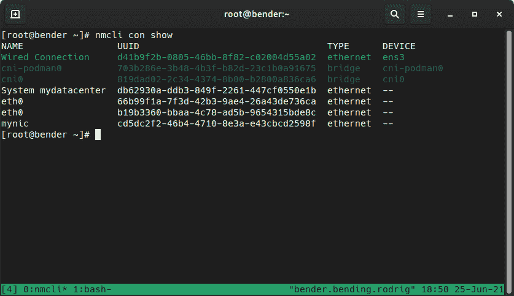

# 第十九章：练习 2

在本章的第二个练习中，我们将运行一系列练习，以检查您在本书中所学知识。与本书的其他章节不同，不是所有步骤都会被指定；您可以自行决定执行必要的步骤以完成必要的目标。建议您避免查阅章节以获取指导，而是尝试使用您的记忆或系统中可用的工具。当您参加官方考试时，这种经验将是一个关键因素。

强烈建议您在开始练习时使用时钟，以便知道您完成所需时间。

# 技术要求

本章中的所有实际练习都需要安装运行 Red Hat Enterprise Linux 8 的**虚拟机**（VM）以及基本安装。此外，还需要新的虚拟驱动器来进行存储操作。

练习假设您具有以下内容：

+   安装了基本操作系统**最小安装**软件选择的 Red Hat Enterprise Linux 8。

+   访问具有有效订阅的 Red Hat 客户门户网站。

+   VM 必须是可扩展的；也就是说，您对其执行的操作可能会使其无法使用，因此必须重新安装。

# 练习的提示

这是任何测试的一般建议清单，其中大部分都是常识，但始终记住它们是很有趣的：

+   在开始考试之前，先阅读问题的全部内容。

+   特定的词语具有特定的含义，可以提供关于要求或完成练习的方法的提示。因此，再次阅读所有内容可能会增加或减少可能性。

+   使自己感到舒适：安装您喜欢的编辑器，运行`updatedb`以便您有一个新的软件包和文件数据库准备好，并定义您的键盘布局。安装并学习如何使用`tmux`的基础知识，以便您可以打开新标签并命名它们，而无需额外的窗口。

+   查找请求之间的依赖关系。一些目标依赖于其他目标的完成，因此找到这些依赖关系，以查看如何构建解决方案，而无需返回并重做一些步骤。

+   使用计时器。重要的是要了解哪些练习花费了更多的时间，以便您可以找到需要改进的地方。

+   不要记住具体的命令。相反，学习如何使用系统中可用的文档，例如使用`man`，`/usr/share/docs`参数，如`--help`命令等。

+   确保更改在重新启动后仍然有效。有些更改可能在运行时是有效的，但必须持久：防火墙规则，要在启动时启动的服务等。

+   记住，您可以使用`dnf whatprovides "*/COMMAND"`来查找与您可能缺少的文件相关的软件包。

+   查看[`www.redhat.com/en/services/training/ex200-red-hat-certified-system-administrator-rhcsa-exam?=Objectives`](https://www.redhat.com/en/services/training/ex200-red-hat-certified-system-administrator-rhcsa-exam?=Objectives)以获取官方 EX200 考试目标。

# 练习 2

重要提示

根据设计，在以下练习中，命令、软件包等将不会被突出显示。记住到目前为止学到的知识，以便检测关键字，看看需要做什么。

不要过早地跳入解决方案；尝试思考和记住所涵盖的内容。

## 练习

1.  从本书的 GitHub 存储库中下载所需的文件[`raw.githubusercontent.com/PacktPublishing/Red-Hat-Enterprise-Linux-8-Administration/main/chapter-19-exercise2/users.txt`](https://raw.githubusercontent.com/PacktPublishing/Red-Hat-Enterprise-Linux-8-Administration/main/chapter-19-exercise2/users.txt)。

1.  使用`users.txt`文件以自动化的方式使用提供的值在系统中生成用户，顺序如下：`用户名`，`占位符`，`uid`，`gid`，`名称`，`主目录`，`shell`。

1.  创建名为 users 的组，并将该组添加为所有用户的主要组，将它们自己的组（以每个用户的名称命名）作为辅助组。

1.  更改用户的主目录，使其由组拥有。

1.  设置一个 HTTP 服务器，并为每个用户启用一个网页，为每个用户提供一个不同的小介绍。

1.  允许`users`组中的所有用户在无需密码的情况下成为 root。

1.  为每个用户创建 SSH 密钥，并将每个密钥添加到 root 和其他用户，以便每个用户都可以像其他用户一样进行 SSH 连接，即无需密码。

1.  禁用通过 SSH 访问系统的密码。

1.  使用`/dev/random`为每个用户设置不同的密码，并将密码存储在`users.txt`文件的第二个字段中。

1.  如果用户名中的字母数是 2 的倍数，则将该事实添加到每个用户描述网页中。

1.  创建一个容器，以`yq` python 包作为入口点运行。

1.  为非 2 的倍数的用户配置密码到期。

1.  使用日期命名的文件配置一个每日压缩的日志轮换，为一个月的日志。

1.  保存当天生成的所有日志在`/root/errors.log`中。

1.  安装系统库的所有可用更新。

1.  使用先前在`/root`文件夹中可用的已下载软件包修复损坏的 rpm 二进制文件。

1.  使用户执行的所有进程都以低优先级运行，而来自 john 的进程则以更高优先级运行（+/- 5）。

1.  使系统以最高的吞吐量和性能运行。

1.  更改系统网络接口，使其使用比原来更高的 IP 地址。为同一接口添加另一个 IPv6 地址。

1.  为所有用户将`/opt/mysystem/bin/`创建并添加到系统 PATH 中。

1.  创建一个防火墙区域，将其分配给一个接口，并将其设置为默认区域。

1.  添加一个托管在`https://myserver.com/repo/`上的存储库，使用`https://myserver.com/mygpg.key`上的 GPG 密钥添加到系统中，因为我们的服务器可能会宕机。配置它以便在不可用时可以跳过它。

# 练习 2 的答案

在本节中，我们将复制目标列表中的每一项，并在使用适当的语法高亮时加以解释。

## 1. 从本书的 GitHub 存储库 https://raw.githubusercontent.com/PacktPublishing/Red-Hat-Enterprise-Linux-8-Administration/main/chapter-19-exercise2/users.txt 下载必要的文件

```
wget https://raw.githubusercontent.com/PacktPublishing/Red-Hat-Enterprise-Linux-8-Administration/main/chapter-19-exercise2/users.txt
```

## 2. 使用`users.txt`文件以自动化方式在系统中生成用户，顺序如下：用户名、占位符、uid、gid、名称、主目录、shell

首先，让我们使用以下代码检查`users.txt`文件：

```
cat users.txt
user;x;1000;1000;myuser1;/home/user1; /bin/false
john ;x ;1001 ;1001; John; /home/john ;/bin/false
doe ;x ;1001 ;1001; Doe; /home/doe ; /bin/csh
athena ;x ;1011 ;1011; Athena Jones; /home/ajones ; /bin/rsh
pilgrim ;x ;2011 ;2011; Scott Pilgrim; /home/spilgrim ; /bin/rsh
laverne; x ; 2020;2020; LaVerne;/home/LaVerne;/bin/bash
```

如请求中所述，该文件中的字段为`username`、`placeholder`、`uid`、`gid`、`name`、`home`、`shell`。通常不要求创建用户的占位符是密码，因此我们可以在忽略该字段的同时使用其他数据。

正如我们也可以看到的那样，每个字段至少由一个`;`符号分隔，但有些在其前后有额外的空格。由于我们还有姓氏，我们不能只是删除所有空格；我们需要在实际文本之前和之后执行此操作。

我们需要使用带有`;`字段分隔符的 cut 命令，但首先，我们需要逐行读取文件。

我们可以使用 Bash 的内置`read`函数来实现这一点：

```
cat users.txt|while read -r line; do echo ${line};done
```

基于此，我们可以开始构建我们将需要创建用户的所有内容。让我们首先着手处理各个步骤，然后构建完整的命令行。

我们有很多行，因此对于每一行，我们需要定义字段并删除末尾/开头的空格：

```
NEWUSERNAME=$(echo ${line}|cut -d ";" -f 1)
NEWUID=$(echo ${line}|cut -d ";" -f 3)
NEWGID=$(echo ${line}|cut -d ";" -f 4)
NEWNAME=$(echo ${line}|cut -d ";" -f 5)
NEWSHELL=$(echo ${line}|cut -d ";" -f 6)
```

在前面的示例中，我们正在回显每一行，并使用`-f`指定的字段和`；`字段分隔符进行切割。这使我们能够精确选择包含我们要查找的数据的字段。为了使这更容易，我们可以将每个存储在一个变量中，以便我们可以重用该代码片段，并且仍然清楚地了解每个脚本将要执行的操作。

前面的代码将起作用，*但*它将在空格处失败，因此我们需要将它们扩展到只捕获实际文本而不包括空格。让我们使用 xargs 来实现这一点：

```
NEWUSERNAME=$(echo ${line}|cut -d ";" -f 1|xargs)
NEWUID=$(echo ${line}|cut -d ";" -f 3|xargs)
NEWGID=$(echo ${line}|cut -d ";" -f 4|xargs)
NEWNAME=$(echo ${line}|cut -d ";" -f 5|xargs)
NEWHOME=$(echo ${line}|cut -d ";" -f 6|xargs)
NEWSHELL=$(echo ${line}|cut -d ";" -f 7|xargs)
```

下一步是构建添加用户的命令行：

```
useradd --d "${NEWHOME}" --m --s "${NEWSHELL}" --u "${NEWUID}" --g "${NEWGID}" --c "${NEWNAME}" "${NEWUSERNAME}"
```

现在一切准备就绪，让我们构建解决方案：

```
cat users.txt| while read -r line ; do 
NEWUSERNAME=$(echo ${line}|cut -d ";" -f 1|xargs)
NEWUID=$(echo ${line}|cut -d ";" -f 3|xargs)
NEWGID=$(echo ${line}|cut -d ";" -f 4|xargs)
NEWNAME=$(echo ${line}|cut -d ";" -f 5|xargs)
NEWHOME=$(echo ${line}|cut -d ";" -f 6|xargs)
NEWSHELL=$(echo ${line}|cut -d ";" -f 7|xargs)
useradd -d "${NEWHOME}" -m -s "${NEWSHELL}" -u "${NEWUID}" -g "${NEWGID}" -c "${NEWNAME}" "${NEWUSERNAME}"
done
```

## 3. 创建名为 users 的组，并将该组添加为所有用户的主要组，将它们自己的组，以每个用户命名，作为辅助组

在这种情况下，我们需要创建我们在上一步中没有创建的组。因此，一旦新组已创建，我们将循环遍历用户，为每个用户创建新组，然后修改用户以获得 users 组并将其自己添加为辅助组：

```
groupadd users
cat users.txt| while read -r line ; do 
NEWUSERNAME=$(echo ${line}|cut -d ";" -f 1|xargs)
groupadd -g ${NEWGID} ${NEWUSERNAME}
usermod -g users -G ${NEWUSERNAME} ${NEWUSERNAME}
done
```

## 4. 更改用户的主文件夹，使其成为组所有

```
cat users.txt| while read -r line ; do 
NEWUSERNAME=$(echo ${line}|cut -d ";" -f 1|xargs)
NEWHOME=$(echo ${line}|cut -d ";" -f 6|xargs)
chown -R ${NEWUSERNAME}:users ${NEWHOME}/
done
```

## 5. 设置 HTTP 服务器并为每个用户启用一个网页，每个网页都有一个不同的小介绍

```
dnf -y install httpd
firewall-cmd --add-service=http --permanent  f
firewall-cmd --reload
-
cat users.txt| while read -r line ; do 
NEWUSERNAME=$(echo ${line}|cut -d ";" -f 1|xargs)
NEWUID=$(echo ${line}|cut -d ";" -f 3|xargs)
NEWGID=$(echo ${line}|cut -d ";" -f 4|xargs)
NEWNAME=$(echo ${line}|cut -d ";" -f 5|xargs)
NEWHOME=$(echo ${line}|cut -d ";" -f 6|xargs)
NEWSHELL=$(echo ${line}|cut -d ";" -f 7|xargs)
mkdir -p ${NEWHOME}/public_html/
echo "Hello, my name is ${NEWNAME} and I'm a user of this system" > ${NEWHOME}/public_html/index.htm
Done
```

最后，我们需要通过编辑/etc/httpd/conf.d/userdir.conf 并禁用 UserDir 来启用 homedirs，以便它变为 Userdir public_html：

```
service httpd start
```

## 6. 允许 users 组中的所有用户成为 root 而无需密码

这可以通过多种方式实现，但由于所有用户都在 users 组中，我们可以添加该组：

```
echo "%users ALL=(ALL) NOPASSWD: ALL" >> /etc/sudoers
```

## 7. 为每个用户创建 SSH 密钥，并将每个密钥添加到 root 和其他用户，以便每个用户都可以像其他用户一样进行 SSH，即无需密码

首先，让我们为每个用户创建密钥并将密钥添加到 root：

```
cat users.txt| while read -r line ; do 
NEWHOME=$(echo ${line}|cut -d ";" -f 6|xargs)
mkdir -p ${NEWHOME}/.ssh/
ssh-keygen -N '' -f ${NEWHOME}/.ssh/id_dsa
cat ${NEWHOME}/.ssh/id_dsa.pub >> /root/.ssh/authorized_keys
done
```

现在，让我们为每个用户复制授权密钥：

```
cat users.txt| while read -r line ; do 
NEWUSERNAME=$(echo ${line}|cut -d ";" -f 1|xargs)
NEWHOME=$(echo ${line}|cut -d ";" -f 6|xargs)
cp /root/.ssh/authorized_keys  ${NEWHOME}/.ssh/ >> 
chown -R ${NEWUSERNAME}:users ${NEWHOME}/.ssh/
Done
```

验证用户是否可以像其他用户一样进行 ssh：

```
USERS=$(cat users.txt|cut -d ";" -f1|xargs)
for user in ${USERS};
do
for userloop in ${USERS};
do
su -c "ssh ${user}@localhost" ${userloop}
done
done
```

前面的命令应该适用于所有用户，因为我们复制了 authorized_keys，对吗？这并不是这种情况，因为一些用户已经禁用了他们的 shell。

## 8. 禁用通过 SSH 访问系统的密码

编辑/etc/ssh/sshd_config 并将 PasswordAuthentication 的任何值替换为 no。

然后，重新启动 sshd：

```
systemctl restart sshd
```

## 9. 使用/dev/random 为每个用户设置不同的密码，并将密码存储在 users.txt 文件的文件的第二个字段中

从/dev/random，我们可以获取随机数据，但它是二进制的，所以如果我们想以后用它进行登录，它可能无效。我们可以对接收到的数据使用哈希函数，并将其用作密码：

```
MYPASS=$(dd if=/dev/urandom count=1024 2>&1|md5sum|awk '{print $1}')
```

这将是密码，无需加密。

使用 usermod，我们可以根据其加密种子定义密码，因此我们将两者结合起来。

此外，我们被告知将生成的密码存储在 users.text 中，因此我们需要编辑该文件。

但是有一个问题：编辑.txt 文件中的特定字段可能不容易，但我们可以完全重写它：

```
cat users.txt| while read -r line ; do 
MYPASS=$(dd if=/dev/random count=12>&1|md5sum|awk '{print $1}')
NEWUSERNAME=$(echo ${line}|cut -d ";" -f 1|xargs)
NEWUID=$(echo ${line}|cut -d ";" -f 3|xargs)
NEWGID=$(echo ${line}|cut -d ";" -f 4|xargs)
NEWNAME=$(echo ${line}|cut -d ";" -f 5|xargs)
NEWHOME=$(echo ${line}|cut -d ";" -f 6|xargs)
NEWSHELL=$(echo ${line}|cut -d ";" -f 7|xargs)
echo  "${NEWUSERNAME};${MYPASS};${NEWUID};${NEWGID};${NEWNAME};${NEWHOME};${NEWSHELL}" >> newusers.txt
echo ${MYPASS} | passwd ${NEWUSERNAME} --stdin
done
cp newusers.txt users.txt
```

通过这种方式，我们已经将 users.txt 文件重写为一个新文件，通过添加我们拥有的所有字段，并用我们的新副本覆盖了 users.txt。 

循环中的最后一个命令从变量中读取密码，并将其提供给 passwd 文件，该文件将对其进行加密和存储，同时从 stdin 中读取它。

## 10. 如果用户名中的字母数是 2 的倍数，则将该事实添加到每个用户的描述网页中

```
cat users.txt| while read -r line ; do 
NEWUSERNAME=$(echo ${line}|cut -d ";" -f 1|xargs)
NEWHOME=$(echo ${line}|cut -d ";" -f 6|xargs)
LETTERSINNAME=$(( $(echo ${NEWUSERNAME}|wc -m) - 1 ))
if [ "$((${LETTERSINNAME} % 2 ))" == "0" ]; then
echo "My name is multiple of 2" >> ${NEWHOME}/public_html/index.htm
done
done
```

在这个例子中，我们重复相同的字段计算，但是我们添加了 wc 命令来获取字符数，并删除一个来调整到字母数。

在比较中，我们评估除以 2 时的余数，这样当没有余数时，这意味着我们的字母数是 2 的倍数。

## 11. 创建一个运行 yq Python 包的容器

当我们读到"Python package"时，我们应该考虑 PIP。不建议直接在系统上使用 PIP，因为它可能会改变系统提供的 Python 库，最好使用虚拟环境。或者，您可以使用一个容器来保持它的隔离。

如*第十七章*中所述，*使用 Podman、Buildah 和 Skopeo 管理容器*，最简单的方法是创建一个定义容器创建步骤的文件。

对于容器，如果您的系统中没有安装`podman`包和`container-tools`模块，还需要安装它们。

由于这个文件是一个 Python 包，我们需要一个已经包含 Python 的容器；例如，[`catalog.redhat.com/software/containers/rhel8/python-38/5dde9cb15a13461646f7e6a2`](https://catalog.redhat.com/software/containers/rhel8/python-38/5dde9cb15a13461646f7e6a2)。

因此，让我们创建一个包含以下内容的`Containerfile`（可在[`github.com/PacktPublishing/Red-Hat-Enterprise-Linux-8-Administration/blob/main/chapter-19-exercise2/ContainerFile`](https://github.com/PacktPublishing/Red-Hat-Enterprise-Linux-8-Administration/blob/main/chapter-19-exercise2/ContainerFile)中找到）：

```
FROM registry.access.redhat.com/ubi8/python-38
MAINTAINER RHEL8 Student <student@redhat.com>
LABEL name="yq image" \
maintainer="student _AT_ redhat.com" \
vendor="Risu" \
version="1.0.0" \
release="1" \
summary="yq execution container" \
description="Runs yq"
ENV USER_NAME=risu \
USER_UID=10001 \
LC_ALL=en_US.utf8
RUN pip3 install --upgrade pip --no-cache-dir && \
pip3 install --upgrade yq --no-cache-dir
USER 10001
VOLUME /data
ENTRYPOINT ["/opt/app-root/bin/yq"]
CMD ["-h"]
```

与`podman build -t yq -f ContainerFile`结合使用时，它将拉取带有 Python 的`ubi8`镜像，以便我们只需运行`pip3 install`命令来安装`yq`，然后将其分配为我们的`entrypoint`。

例如，如果我们定义了一个无效的`entrypoint`（因为我们可能不知道程序安装在哪里），我们可以使用`podman run -it --entrypoint /bin/bash <podmanid>`。我们可以通过运行`podman images`并检查系统中可用的每个 pod 的生成日期来获取 podman ID。

可以使用`podman run –it <podmanid>`来测试创建的容器，它将输出关于`yq`命令的信息。

请注意，`yq`，如其在[`github.com/kislyuk/yq`](https://github.com/kislyuk/yq)的存储库中所述，需要我们安装`jq`命令，但我们故意将其排除在外，以演示如何创建容器。

## 12\. 为非 2 的倍数的用户配置密码过期，以便它们过期

```
cat users.txt| while read -r line ; do 
NEWUSERNAME=$(echo ${line}|cut -d ";" -f 1|xargs)
NEWHOME=$(echo ${line}|cut -d ";" -f 6|xargs)
LETTERSINNAME=$(( $(echo ${NEWUSERNAME}|wc -m) - 1 ))
if [ "$((${LETTERSINNAME} % 2 ))" != "0" ]; then
chage -M 30 ${NEWUSERNAME}
done
done
```

在这里，我们重用了问题 10 中的循环，但是反转了条件。由于对密码过期的使用没有要求，我们只需要将需要密码更改的最大天数定义为“30 天”。

## 13\. 使用日期命名的文件配置每月日志的每日压缩日志轮换

首先，我们需要确保`logrotate`已安装：

```
dnf -y install logrotate
```

安装后，编辑`/etc/logrotate.conf`文件，使其包含以下内容：

```
rotate 30
daily
compress
dateext
```

我们需要确保没有定义其他周期（每月、每周等）。

## 14\. 将当天生成的所有日志保存在/root/errors.log 中

这有一个技巧：有些程序将日志记录到日志中，而有些程序将日志记录到`*.log`文件中。

今天的日期可以用`+%Y-%m-%d`获得。这种使用年-月-日格式的格式通常用于程序日志：

```
grep "$(date '+%Y-%m-%d')" -Ri /var/log/*.log|grep -i error >  /root/errors.log
journalctl --since "$(date '+%Y-%m-%d')" >> /root/errors.log
```

通过这样做，我们结合了两个输出。当然，我们可以尝试按日期对条目进行排序，以便它们相关联，但请记住，第一个`grep`执行递归搜索，因此文件名被前置，这使得排序更加困难。

## 15\. 为系统库安装所有可用的更新

通常，系统库中包含`lib`子字符串，因此更新应该只是运行以下命令的问题：

```
dnf upgrade *lib*
```

因为它会要求确认，所以请查看列出的软件包，确保没有发生错误。

## 16\. 使用先前在/root 文件夹中可用的下载包修复损坏的 rpm 二进制文件

这是一个棘手但有用的知识检查。

首先，让我们确保`rpm`包可用：

```
yumdownloader rpm
```

使用以下命令验证文件是否存在：

```
ls –l rpm*.rpm 
```

检查文件，确保我们有办法回退，以防我们破坏它无法修复：

```
rpm -qip rpm*.rpm
```

现在，让我们看一下有助于验证我们解决问题的破坏性操作：

```
rm -fv /usr/bin/rpm
```

从这里开始，就像*看吧，不用手*...没有 RPM 可用来安装`rpm*.rpm`包，但我们仍然需要安装它来解决问题。

`rpm`包是压缩的`cpio`存档，所以我们可以使用以下命令：

```
rpm2cpio rpm*.rpm |cpio –idv
```

这将提取压缩的`rpm`内容（无需运行脚本）。

将未压缩的`rpm`文件移回`/usr/bin`：

```
mv usr/bin/rpm /usr/bin/rpm
```

验证`rpm`的安装和操作：

```
rpm –V rpm
```

它会抱怨，说至少日期已经改变。然而，如果下载的文件更新了大小和 md5sum，它也可能已经更新了。

通过重新安装`rpm`软件包将系统移动到一个合理的状态：

```
rpm -i rpm*.rpm
```

这将使系统抱怨，因为软件包已经安装（它将说明它将覆盖`rpm`、`rpm2archive`、`rpm2cpio`、`rpmdb`、`rpmkeys`等）。

如果`rpm`版本不同，我们可以使用以下命令升级它：

```
rpm -Uvh rpm*.rpm
```

然后，我们可以使用以下命令验证这一点：

```
rpm –V rpm 
```

关于数据库包含的内容，不应该报告任何更改。如果我们无法升级，我们可以使用`--force`参数运行安装，告诉`rpm`可以继续并覆盖文件。

或者，一旦`rpm`二进制文件已经被`cpio`恢复，我们可以使用以下命令：

```
dnf –y reinstall rpm
```

另一种方法是从类似系统`scp` `rpm`二进制文件，或者使用救援介质。

## 17\. 使用户 doe 执行的所有进程以低优先级运行，而由 john 运行的进程以更高优先级运行（+/- 5）

我们无法将其设置为默认值，但我们可以结合一个 cron 作业来实现。

以 root 身份执行`crontab -e`来编辑 root 的 crontab 并设置一个每分钟运行的作业：

```
*/1 * * * *  pgrep -u doe |xargs renice +5
*/1 * * * * pgrep -u john|xargs renice -5
```

这将使用`pgrep`来获取 john 和 doe 的所有 PID，并通过`xargs`将它们传递给`renice`进程。

或者，我们可以使用以下内容：

```
renice +5 $(pgrep -u doe)
```

这可以作为`xargs`命令的替代方法。

## 18\. 使系统以最高吞吐量和性能运行

`tuned`是一个系统守护程序，我们可以安装它来自动应用一些众所周知的参数到我们的系统，这将成为我们特定优化的基础：

```
dnf -y install tuned
systemctl enable tuned
systemctl start tuned
tuned-adm profile throughput-performance
```

## 19\. 更改系统网络接口，使其使用比原来更高的 IP 地址。在同一个接口上添加另一个 IPv6 地址

使用`nmcli`，检查当前系统 IP 地址：

```
nmcli con show 
```

输出应该如下：



图 19.1 - nmcli con show 的输出

有了这个，我们可以找到正在使用和连接的系统接口。假设它是`ens3`，它连接在名为`Wired Connection`的连接上。

让我们使用`nmcli con show "Wired Connection"|grep address`来查找当前的地址。

如果我们的地址是，例如，`10.0.0.6`，我们可以使用以下代码：

```
nmcli con mod "Wired Connection" ipv4.addresses 10.0.0.7
nmcli con mod "Wired Connection" ipv6.addresses 2001:db8:0:1::c000:207
```

使用以下命令验证这一点：

```
nmcli con show "Wired Connection"|grep address
```

## 20\. 为所有用户创建并添加`/opt/mysystem/bin/`到系统路径

编辑`/etc/profile.d/mysystempath.sh`文件，并放入以下内容：

```
export PATH=${PATH}:/opt/mysystem/bin
```

要验证这一点，将`+x`属性添加到文件中，并使用以下命令创建文件夹：

```
chmod +x /etc/profile.d/mysystempath.sh
mkdir -p /opt/mysystem/bin
```

重新登录用户时，执行以下命令应该显示新的路径：

```
echo ${PATH}
```

## 21\. 创建一个防火墙区域，将其分配给一个接口，并将其设置为默认区域

这是一个棘手的问题。在这本书中，我们已经解释了如何查询区域以及如何更改默认区域，甚至展示了用于管理防火墙的`cockpit`的屏幕截图，所以现在作为一个有经验的用户，这应该不难。

当你不知道如何做某事时，第一件事就是查看手册页：

```
man firewall-cmd
```

这并不显示很多有趣的信息。然而，在 man 页面的末尾，有一个名为`firewalld.zones(5)`的部分。这意味着我们可以查看手册的第五部分`firewalld.zones`。

我们通常不指定部分，因为可能没有很多重复，所以我们可以运行以下命令：

```
man firewalld.zones
```

这指示我们在`/usr/lib/firewalld/zones`和`/etc/firewalld/zones`中检查默认值，所以让我们这样做：

```
cp /usr/lib/firewalld/zones/public.xml /etc/firewalld/zones/dazone.xml
```

现在，让我们编辑新复制的文件，名为`/etc/firewalld/zones/dazone.xml`，并将其名称从`Public`更改为`dazone`。然后，我们需要重新加载防火墙：

```
firewall-cmd -reload
```

让我们使用以下命令验证新的区域是否存在：

```
firewall-cmd --get-zones
```

让我们把它设置为默认区域：

```
firewall-cmd --set-default-zone=dazone
```

现在，添加默认接口（`ens3`）：

```
firewall-cmd --add-interface=ens3 --zone=dazone
```

它会失败。这是预期的，因为`ens3`已经被分配给一个区域（`public`）。所以，让我们使用以下命令：

```
firewall-cmd -remove-interface=ens3 --zone=public
firewall-cmd -add-interface=ens3 --zone=dazone
```

正如你所看到的，即使没有关于创建新区域的先前知识，我们也能够利用我们关于查找信息的系统知识来实现这个目标。

## 22. 添加一个托管在 https://myserver.com/repo/上的存储库，使用来自 https://myserver.com/mygpg.key 的 GPG 密钥添加到系统中，因为我们的服务器可能会宕机。配置它以便在不可用时可以跳过它

如果我们不记得存储库的语法，我们可以使用系统上可用的示例之一。要做到这一点，转到`/etc/yum.repos.d/`，列出可用的文件，并选择一个来创建一个名为`myserver.repo`的文件，其中包含以下内容：

```
[myserver]
name=My server repository
baseurl=https://myserver.com/repo/
enabled=1
gpgcheck=1
gpgkey=https://myserver.com/mygpg.key
```

如果不可用，我们如何跳过它？让我们查看`yum`的手册页。同样，在`man dnf.conf`中有指定。这列出了一个可能帮助我们的布尔值，所以让我们将其添加到我们的`repofile`中：

```
skip_if_unavailable=1
```

有了这个，我们已经完成了我们的目标。
