# 第一章：介绍

这本书分为多个部分。在第一部分中，我们将探索一个新的终端，并向你展示如何安装和配置它。在第二部分中，我们将集中讨论配置你的 shell，添加插件，理解正则表达式，并使用管道和子 shell。然后，所有内容将汇集成一个 shell 脚本课程。在第三部分中，我们将使用 Vim，我们推荐的编辑器。我们将涵盖从配置它到学习键盘快捷键，安装插件，甚至将其用作密码管理器的所有内容。所以让我们开始吧。

在接下来的章节中，我们将学习以下主题：

+   了解 Terminator 的工作原理

+   使用 Guake 进行快速命令或长时间运行的任务

+   使用 ClipIt 复制粘贴文本

因此，我们将从一个终端开始，之后一切都会变得疯狂！当涉及到在终端上长时间工作时，我们的选择是使用 Terminator，因为它具有快速和简单的分屏功能。然后，我们将专注于 Guake，这是一个非常快速且无论你在哪里都可以打开的终端。最后，你将了解 Clipit 的工作原理，并有效地使用其复制和粘贴功能。

# 你准备好了吗？

我们将深入探讨 Linux 环境，为你提供提高生产力的技巧和窍门，让你更熟悉命令行，并自动化你的任务。

这本书基于 Ubuntu Linux 16.04 版本，这是最新的长期支持版本。我们选择 Ubuntu 是因为它是最常见的 Linux 发行版，使用起来非常简单，有很多图形工具，并且你可以找到一个庞大的在线社区来回答你的所有问题。Ubuntu 也是最受支持的 Linux 发行版。这意味着那些创建软件的公司，尤其是图形软件，并为 Linux 提供这些软件的公司，通常会从 Ubuntu 开始。

这使我们更容易使用 Skype、Slack 或 Visual Studio Code 等工具。尽管本书基于 Ubuntu，但大多数命令与 Ubuntu 无关，因此你可以轻松地使用其他发行版并应用相同的教训。本书的很大一部分甚至适用于 Mac，因为我们可以在 Mac 上安装相同的工具-bash、zsh、vim 在 Linux 和 Mac 上的工作方式相同-并且随着 Windows 10 的发布，bash 支持已经内置，因此可以轻松安装和使用 zsh 和 vim 等工具。在 Windows 10 之前，有一些工具，如 cygwin，可以让你在 Windows 环境中使用 Linux 命令行。

我们建议你在一个开放的终端中阅读和实践，这样你可以执行命令并检查结果。在开始之前，你需要从我们的 GitHub 存储库下载所有源文件（位于此处：[`github.com/petruisfan/linux-for-developers`](https://github.com/petruisfan/linux-for-developers)）。

！[你准备好了吗？]（img/image_01_001.jpg）

# 终结者-终极终端

为了提高工作效率，你首先需要一个好的终端。在整本书中，我们将主要使用命令行，这意味着我们将主要使用的软件是终端。我们推荐一个很棒的终端是**Terminator**，可以从软件中心安装。

让我们转到启动器，点击软件中心图标。打开后，点击搜索输入框，写入“terminator”，如下图所示。它可能会是结果列表中的第一个。点击**安装**。

！[终结者-终极终端]（img/image_01_002.jpg）

安装终结者后，将其图标拖到启动器上是一个好主意。为此，你只需按下 Windows 键打开 dash，写入`terminator`，然后将其图标拖放到启动器上：

！[终结者-终极终端]（img/image_01_003.jpg）

好了，现在让我们点击图标开始。你可以最大化窗口以获得更多的操作空间。

## 首选项菜单

这是一个自定义终端，可以在字体样式和其他工具方面找到一些惊喜。您现在看到的是默认设置。让我们进入首选项菜单，看看我们可以更新什么。首先，让我们隐藏标题栏，因为它并没有给我们太多信息，而且尽可能拥有尽可能多的屏幕空间（以及尽可能少的干扰）总是一个好主意。

现在让我们看一下其他一些首选项：

1.  让我们改变字体。我们将使它比通常的大一点，以便易于阅读。让我们选择 Monospace 16，如下面的截图所示：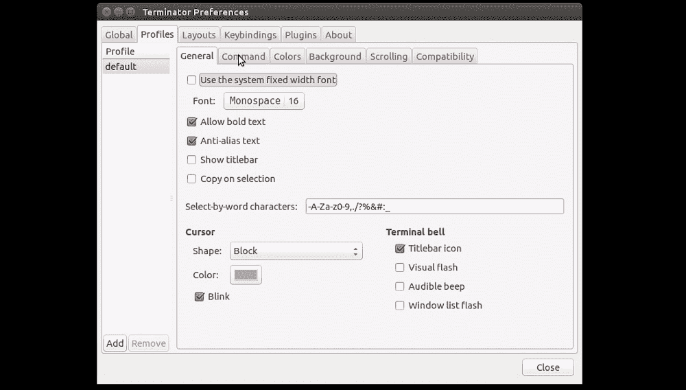

1.  我们还希望有良好的对比度，以便能够轻松区分字母。为此，我们将选择黑色背景白色字体的主题。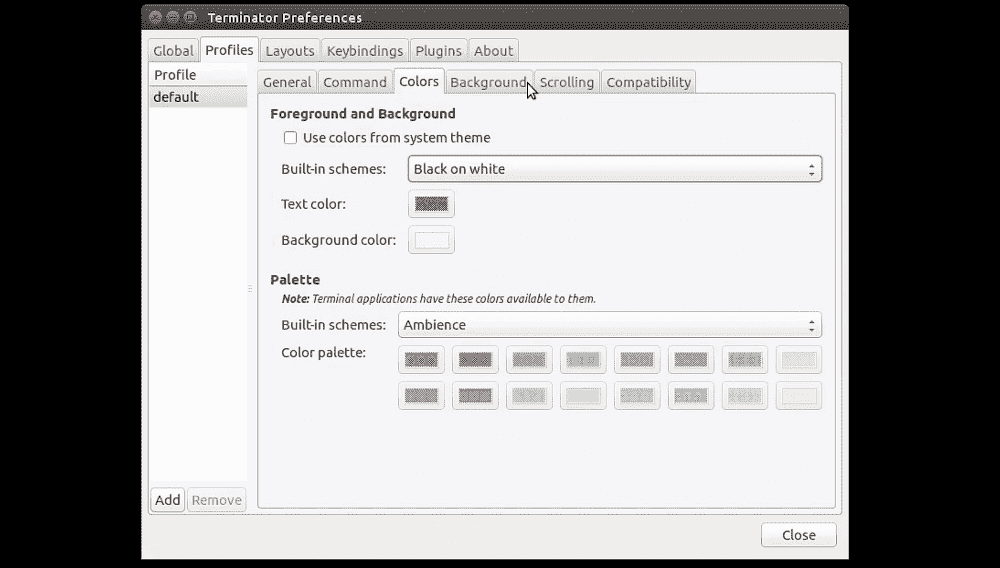

1.  启用无限滚动也是个好主意，因为您不希望终端输出在`500`行后被截断。很多时候，您只想滚动并查看以前的输出。此外，在滚动时，如果有很多文本，您可能不希望被带回页面底部，因此取消选中**输出时滚动**选项。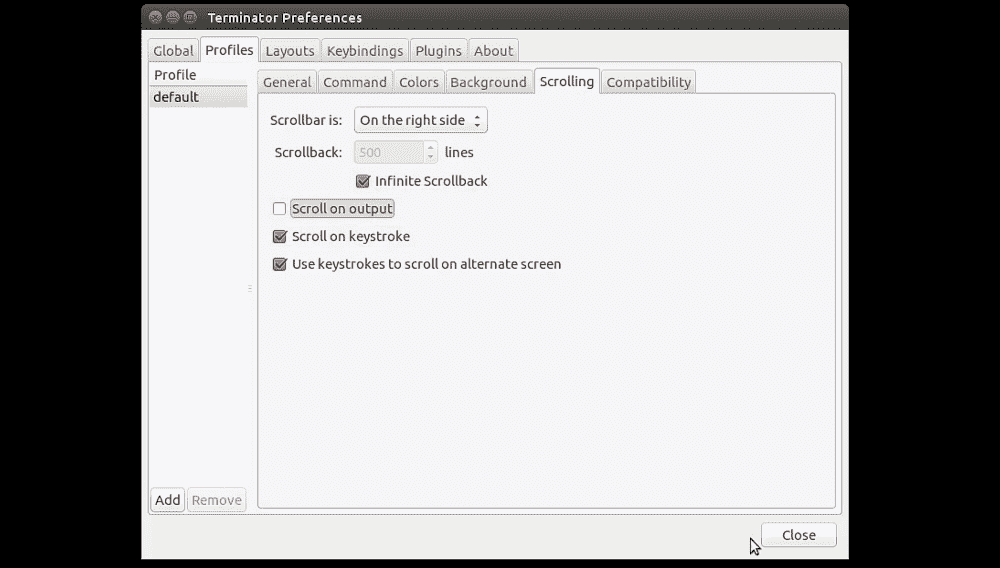

看！这是我们新配置的终端。现在是时候检查一下我们可以用这个**新的**终端做什么了。接下来是*特点*部分！

## 特点

现在是时候看一下 Terminator 的一些有用功能及其键盘快捷键了。这是正常的 Terminator 界面的样子：

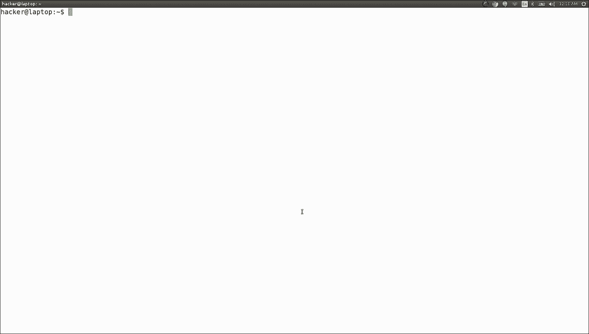

现在让我们来玩一下：

+   分割屏幕：*Ctrl* + *Shift* + *O*进行水平分割：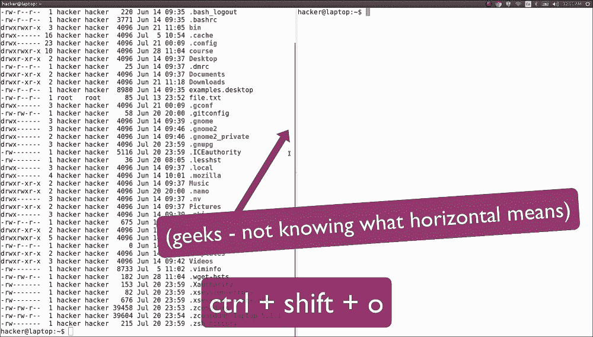

+   *Ctrl* + *Shift* + *E*进行垂直分割：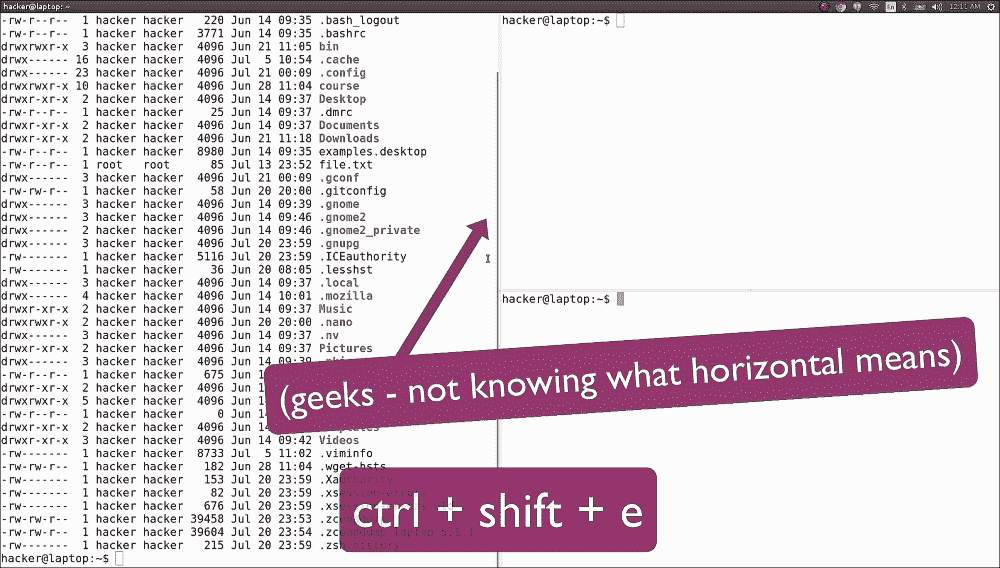

这可能是 Terminator 最酷的功能，也是我们将最常使用的功能，因为它非常有助于查看多个窗格并轻松在它们之间切换。您可以任意次数地分割屏幕，以任何组合方式。

调整屏幕大小：*Ctrl* + *Shift* + *箭头*或拖放：

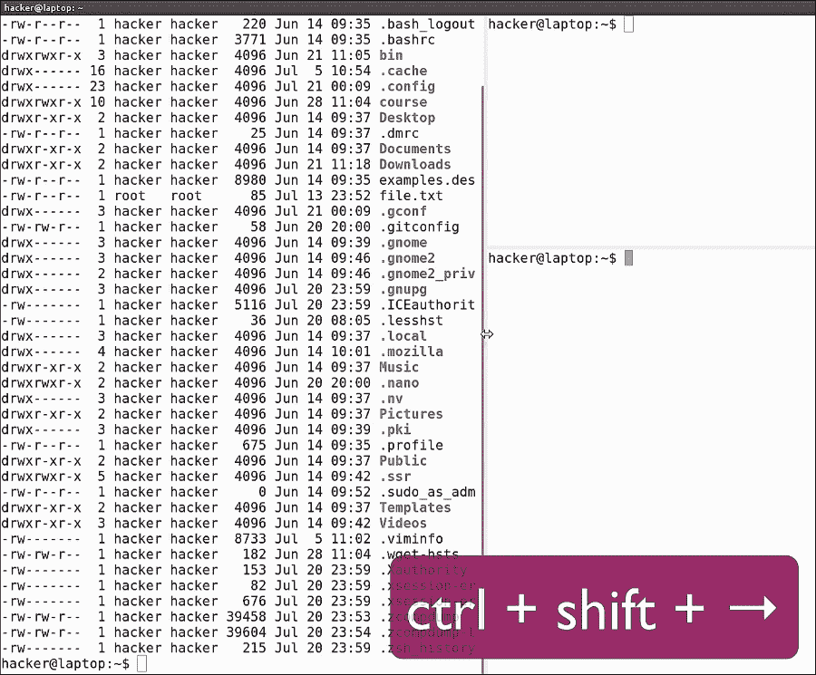

+   使用*Ctrl* + *Shift* + *箭头*轻松在窗口之间移动。

+   使用*Ctrl* + *Shift* + *W*或*Ctrl* + *D*关闭屏幕。

+   使用*Ctrl* + *Shift* + *T*创建选项卡。当您没有更多的空间来分割屏幕时使用：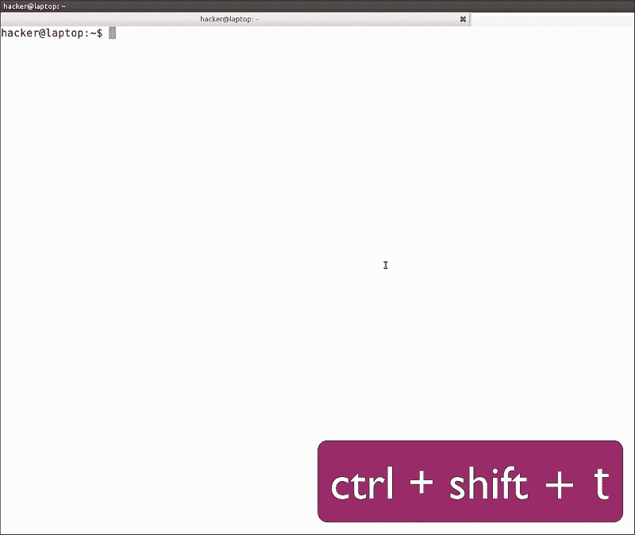

+   文本缩放：*Ctrl* *+* *+*和*Ctrl* *+* *-* - 在您需要演示或有视力不佳的人时非常有用：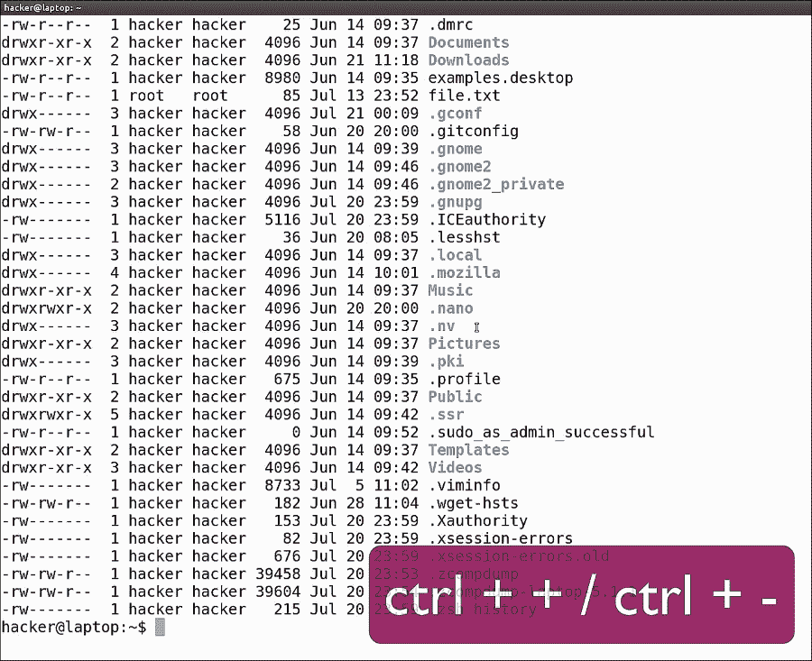

能够将屏幕分割以便将终端排列成网格，并能够使用键盘快捷键分割、切换和调整窗格是 Terminator 的最大优势。许多人没有意识到的一个大的生产力杀手是在鼠标和键盘之间切换。虽然大多数人更喜欢使用鼠标，但我们建议尽可能多地使用键盘，并学习您最常用的计算机程序的键盘快捷键。

提高生产力最终意味着有更多的时间专注于真正重要的事情，而不是浪费时间苦苦使用计算机。

再见终端！欢迎 Terminator！

# Guake - 不是 Quake！

Terminator 在各种任务中表现良好，尤其是在处理多个项目的长时间会话时。然而，有时候您需要快速访问终端以便运行命令、检查状态或在前台长时间运行任务，而不需要打开太多选项卡。在这种情况下，Guake 非常出色。它是一个方便易用的终端，您可以通过按下*F12*在任何工作区的现有窗口之上打开它。

我们将使用一个简单的命令行来安装它。如下所示，打开终端并输入`sudo apt install guake`：

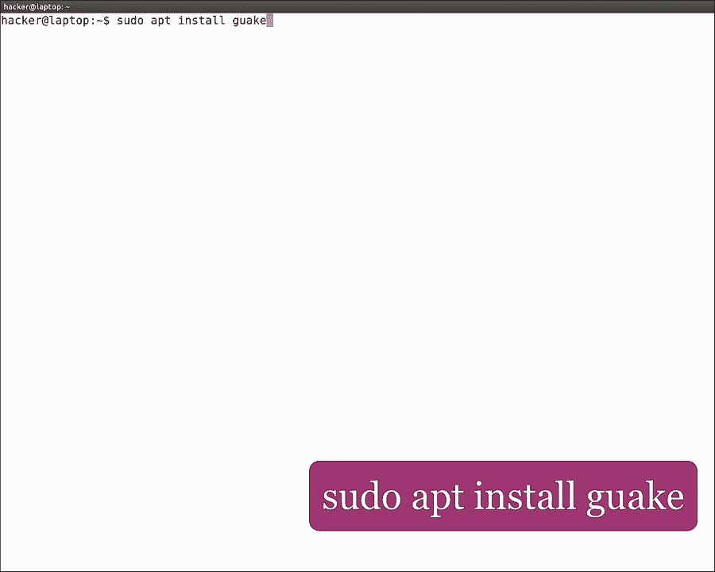

### 注意

`apt` 是 Ubuntu 在 16.04 版本中推出的新软件包管理器，旨在成为 `apt-get` 命令的更易于使用的版本，并增加了一些额外的视觉效果。

现在 Guake 已安装完成，我们将转到 dash 并打开它。只需按下 *F12* 即可。一旦运行，您可以在屏幕右上方看到通知。它应该是这个样子的：

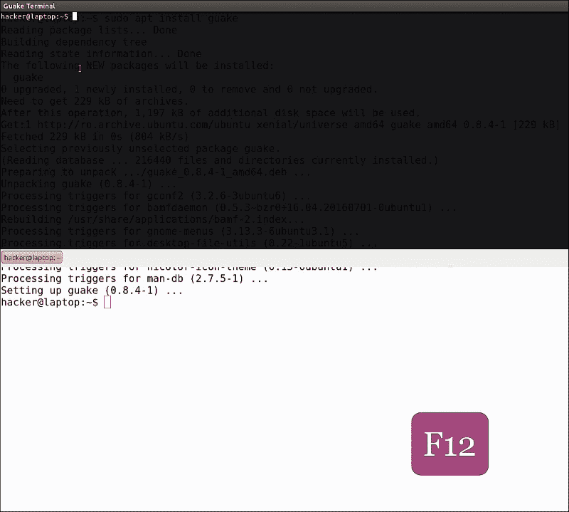

就像使用 Terminator 一样，我们将检查其首选项。首先，转到 shell 并启用**在当前目录中打开新标签页**：

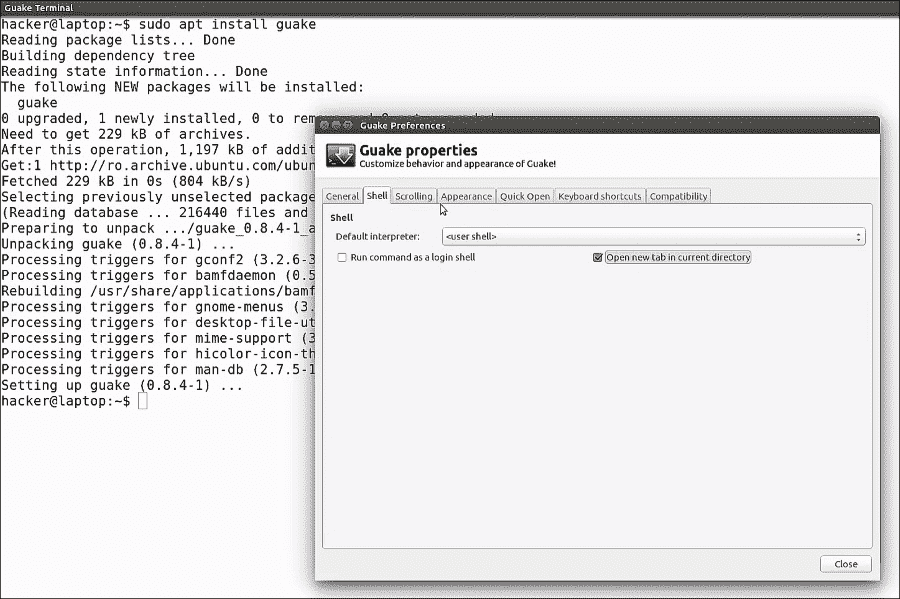

我相信您可以猜到这是做什么的。然后，滚动并插入一个非常大的数字，比如 99,999。还要确保**滚动** | **在输出时**未选中：

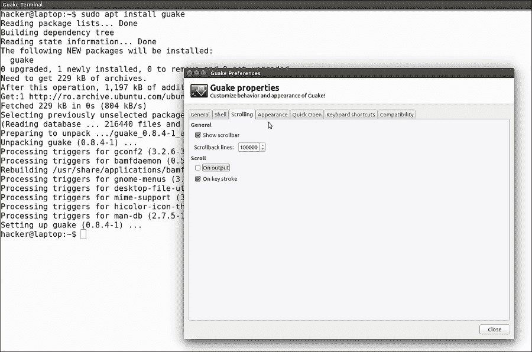

同样，我们将默认字体更改为 `Monospace 16`，将**光标闪烁模式**设置为关闭，并点击**关闭**：

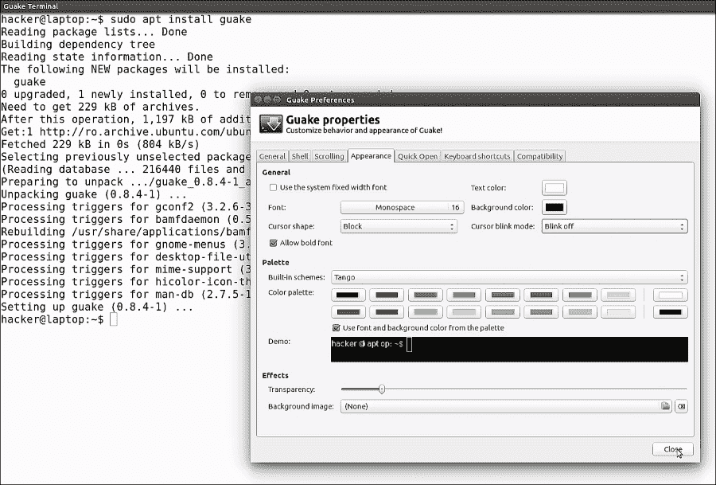

我们可以通过按下 *F11* 来全屏使用 Guake，也可以通过拖动边缘来调整其大小。如果您愿意，可以尝试调整默认设置，看看哪种最适合您。

Guake 在 Ubuntu 重新启动时不会自动启动，所以我们需要将其添加到启动应用程序中。要做到这一点，再次打开 dash，输入启动应用程序并点击添加。在所有三个字段中输入 Guake，然后点击添加并关闭。

它之所以如此方便，是因为您可以随时在当前窗口上方打开它，快速输入命令，然后稍后再次打开它以检查命令的状态。

### 提示

实际上，我们还使其稍微透明，这样当它打开在我们有一些命令的网页上时，我们仍然可以阅读页面上的内容并在阅读时输入命令，而无需切换窗口。这是另一个很棒的提高生产力的技巧！

# ClipIt – 最好的复制粘贴工具

我们相信，人类最伟大的发明之一就是复制粘贴。从某个随机位置复制一段文本并粘贴到另一个不那么随机的位置，这是一个巨大的时间节省器！如果计算机没有这个功能，人类仍然会远远落后！想象一下，每次都要输入每个小命令、每个 URL、每个代码块！这将是一种巨大的时间浪费！因此，作为一个如此重要的功能，复制粘贴应该有自己的工具来管理您复制的所有重要文本。这些类型的工具被称为剪贴板管理器。每个操作系统都有很多选择，Ubuntu 上有一个很好的免费工具叫做 `clipIt`。打开终端，输入 `sudo apt install clipit` 进行安装。

在 Guake 中运行 `ClipIt` 是一个很好的场景。默认情况下，`ClipIt` 占用一个终端窗口，但是通过 Guake 的帮助，我们可以将其隐藏起来！

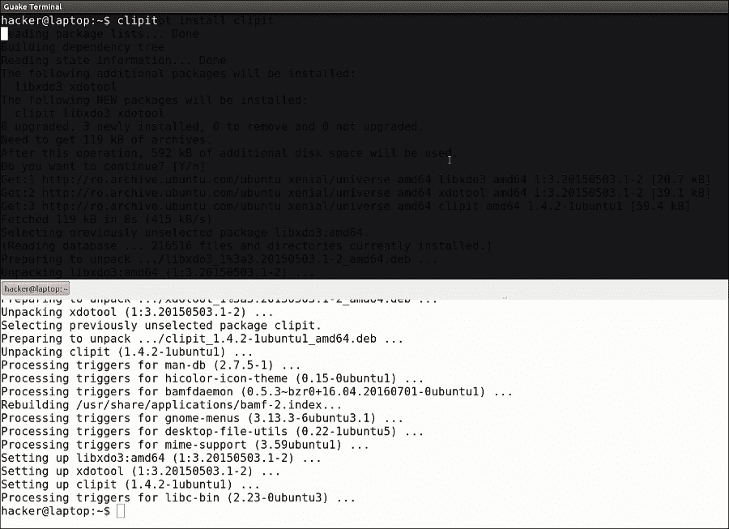

该工具会自动添加到启动应用程序中，所以下次重启时会自动启动。

要调用 `ClipIt`，按下 *Ctrl* + *Alt* + *H* 或点击菜单栏中的剪贴板图标。

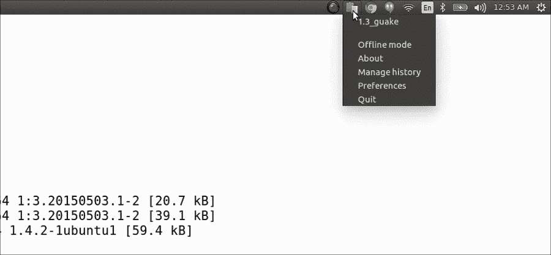

它第一次启动时会警告您它以纯文本形式存储数据，因此如果其他用户使用您的帐户，使用它可能不安全。目前，它只包含最新的剪贴板元素。

让我们快速举个例子来说明它的用法。

我们使用 `cat` 命令查看 `.profile` 文件的内容。假设我们想要复制一些文本行并在另一个终端中运行它们，终端看起来像这样：

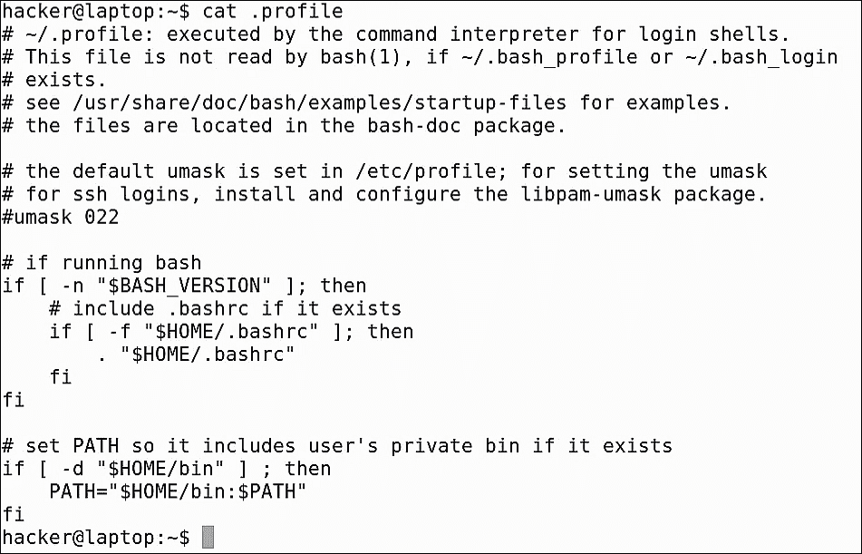

例如，我们可能想要更新 PATH 变量，然后源化 `.bashrc` 文件并再次更新 PATH 变量。而不是再次从文件中复制内容，我们只需按下 *Ctrl* + *Alt* + *H*，然后从剪贴板历史中选择要粘贴的内容：

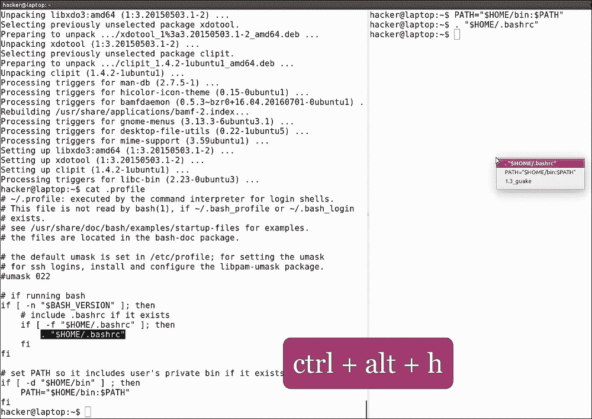

这只是一个非常基本的例子。当您在电脑上长时间工作并且需要粘贴一些您几个小时前从网站上复制的内容时，`ClipIt`非常有用。它默认的历史记录大小为 50 个项目，并且会在浮动窗口中显示最后 10 个项目。您可以在设置中增加这些限制：

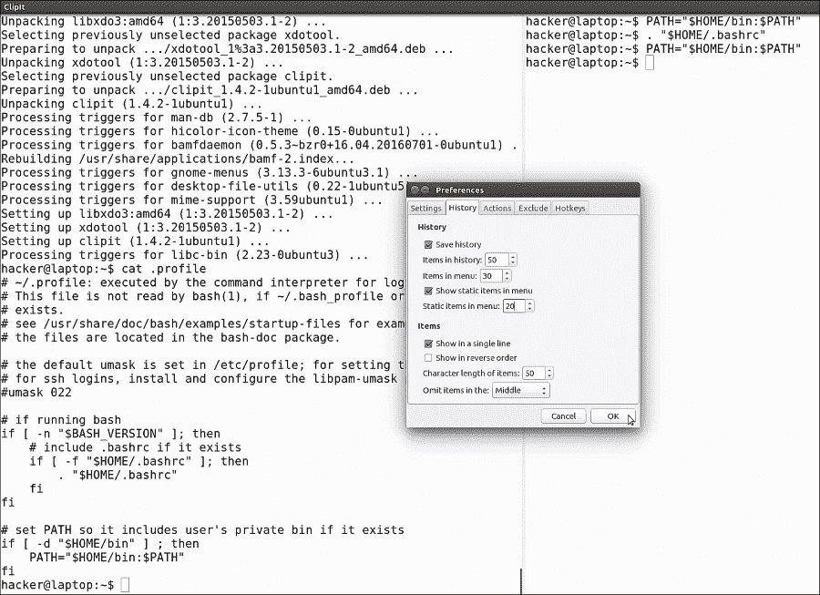

使用`ClipIt`，您可以无限次复制和粘贴，而不会丢失任何数据。它就像是您剪贴板的时光机！
