# 第二章. 高效的 Shell-重新发明你的工作方式

在本章中，我们将从简短介绍 Vim 开始，然后查看最基本的命令，以帮助您开始进行基本的 CRUD（创建、读取、更新、删除）操作。然后，我们将升级 shell 解释器为 zsh，并使用强大的`oh-my-zsh`框架赋予其超能力。我们将介绍一些基本的正则表达式，例如使用 grep 搜索文本。然后，我们将释放 Unix 管道的力量，并使用子 shell 运行嵌入命令。本章的后半部分将帮助我们了解如何通过展示一些更高级的 shell 脚本技术来提高生产力并自动化我们的许多日常工作。

在本章中，我们将涵盖以下内容：

+   使用 Vim 工作

+   使用`oh-my-zsh`框架管理 zsh

+   使用管道和子 shell 编写和运行超强大的一行命令

+   探索 shell 脚本库

我们将专注于编辑文件。为此，我们需要选择一个文件编辑器。有很多选择，但考虑到最快的编辑文件的方式当然是不离开终端。我们推荐使用 Vim。Vim 是一个很棒的编辑器！它有很多配置选项，有一个庞大的社区，产生了很多插件和漂亮的主题。它还具有高级文本编辑功能，使其超级可配置和超级快速。

所以，让我们继续。打开终端并输入`sudo apt install vim`以安装 Vim：

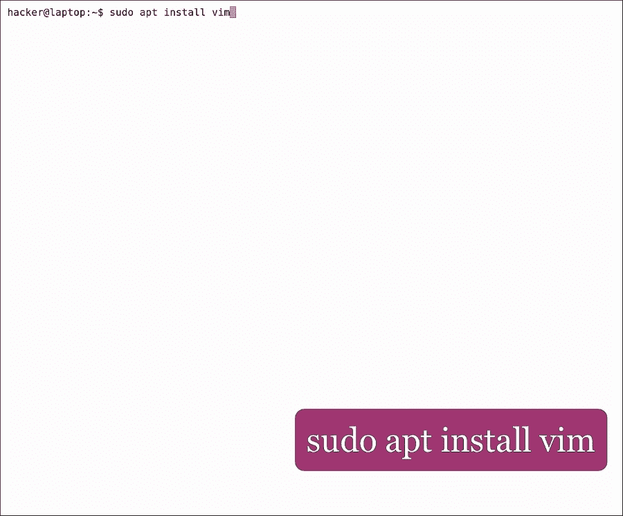

Vim 以其奇特的键盘控制而闻名，很多人因此而避免使用 Vim。但是一旦掌握了基础知识，它就非常容易使用。

让我们不带参数地启动`vim`：

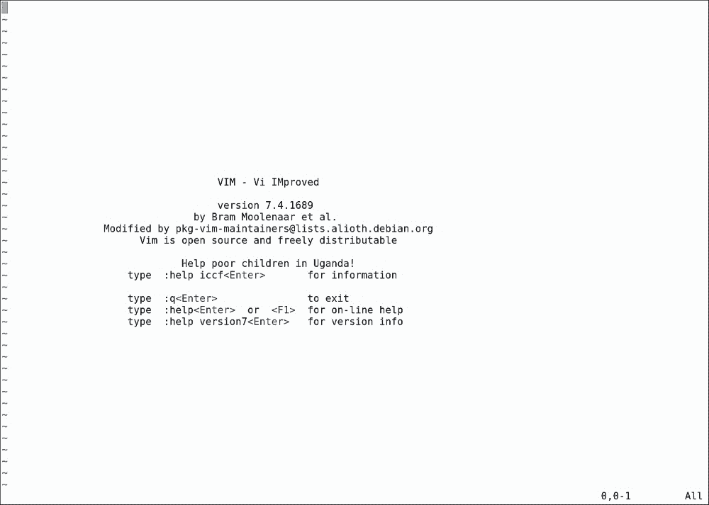

这是默认屏幕；您可以在第二行看到版本。

+   要开始编辑文本，请按下*Insert*键；这将带我们进入插入模式，我们可以开始输入。我们可以在屏幕底部看到我们处于插入模式：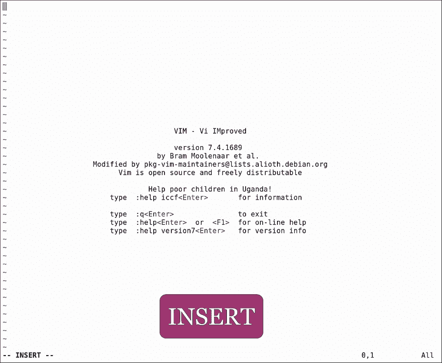

+   再次按下*Insert*键进入替换模式并覆盖文本。

+   按下*Esc*键退出插入或替换模式。

+   输入*yy*复制一行。

+   输入*p*粘贴该行。

+   输入*dd*剪切该行。

+   输入*:w*保存任何更改。可选择指定文件名：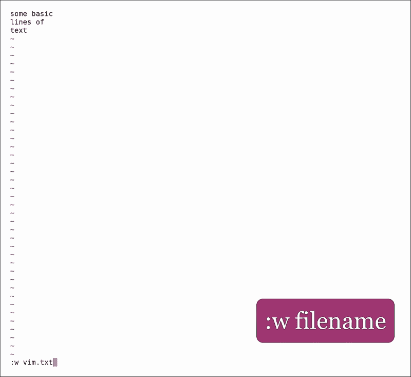

+   要保存正在编辑的文本文件，请输入`vim.txt`

+   输入`:q`退出 Vim

让我们再次打开文件并进行一些小的更改：

+   `:wq`：写入并同时退出

+   `:q!`：不保存退出

现在你已经熟悉了这些命令，我们可以直接从命令行进行基本文件编辑。这是任何人在使用 Vim 时需要了解的最基本的知识，我们将在接下来的章节中使用这些知识。

我们还将有一个关于 Vim 的整个章节，我们将更详细地介绍如何在最酷的终端编辑器中提高生产力！

# Oh-my-zsh-你的终端从未如此好用！

Bash 可能是最常用的 shell。它具有许多功能和强大的脚本能力，但在用户交互方面，`zsh`更好。它的大部分功能来自于强大的`oh-my-zsh`框架。在本节中，我们将安装`zsh`。

让我们从`oh-my-zsh`框架开始，我们将看一些基本的配置选项：

+   打开终端并输入`sudo apt install zsh`以安装`zsh`，如下图所示：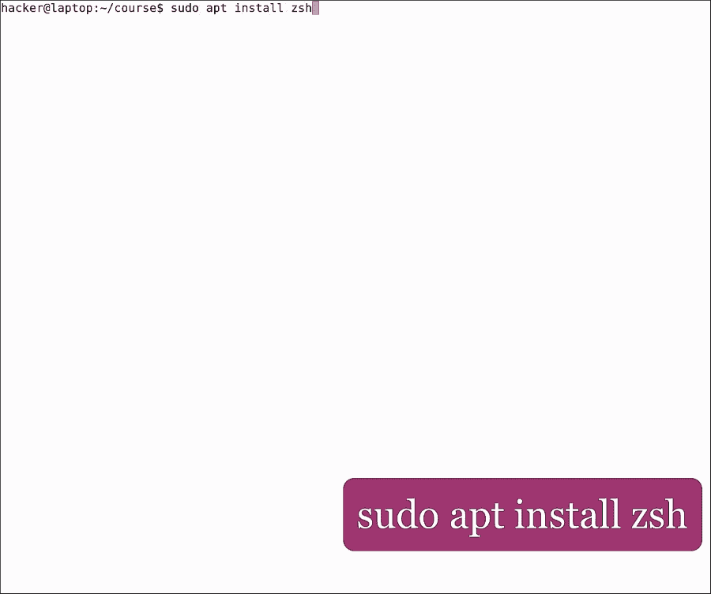

安装完毕后，转到此链接[`github.com/robbyrussell/oh-my-zsh`](https://github.com/robbyrussell/oh-my-zsh)，按照安装`oh-my-zsh`框架的说明进行操作。安装过程是一个使用`curl`或`wget`的一行命令。让我们依次使用这两个命令进行安装：

**通过 curl：**

```
sh -c "$(curl -fsSL https://raw.githubusercontent.com/robbyrussell/oh-my-zsh/master/tools/install.sh)"

```

**通过 wget：**

```
sh -c "$(wget https://raw.githubusercontent.com/robbyrussell/oh-my-zsh/master/tools/install.sh -O -)"

```

你会看到命令给出一个错误，说`git`没有安装，所以我们也需要安装它。以下命令用于安装 git：

```
sudo apt install git

```

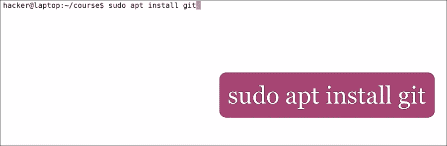

注意在 Ubuntu 中安装软件是多么容易。这也是一个很大的生产力提升；我们可能需要的每个常见软件包都已经预打包在远程软件仓库中，我们只需要一个命令就可以将新软件添加到我们的计算机中。

现在我们已经安装了`git`，让我们再次运行命令。我们可以看到这次它成功运行，并且将我们带到了新的 shell 中。`Oh-my-zsh`还将默认 shell 更改为`zsh`。

安装完成后，首先要做的是选择一个主题。运行以下命令查看所有可用的主题：

```
ls ~/.oh-my-zsh/themes

```

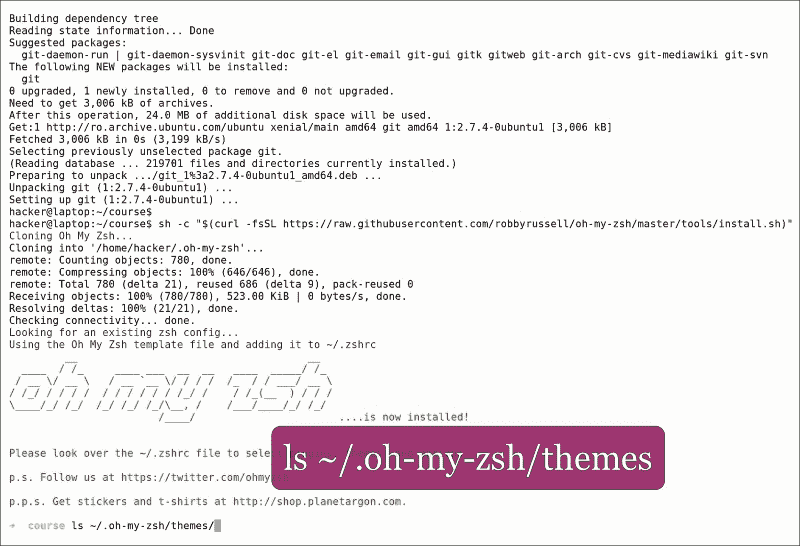

### 注意

你还可以去`git`仓库查看主题，以及它们的截图。我们将使用*candy*主题，因为它在提示符中有很多有用的信息：*用户名*、*主机名*、*时间*、*文件夹*和*git*分支/*git*状态。

时间非常有用，例如，如果你想知道一个命令执行了多长时间，而你没有使用*time*工具来测量命令的总运行时间。然后，你可以查看提示符，看到命令开始时的时间和提示符，以知道命令何时完成，从而可以计算总时间。

要更改主题，打开`~/.zshrc`并修改`ZSH_THEME`变量。保存文件并打开一个新的终端窗口。让我们初始化一个空的`git`目录，这样我们就可以看到提示符的样子。你可以看到我们在主分支上：

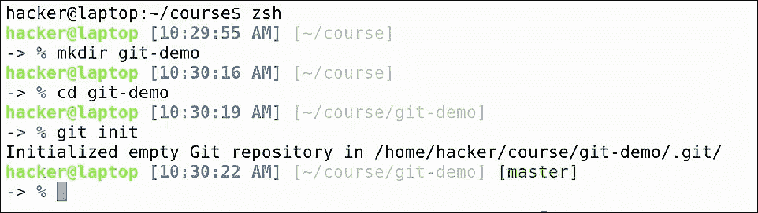

让我们创建一个文件，比如`readme.md`。提示符中的`*`表示目录不干净。我们可以用`git status`命令来验证这一点：

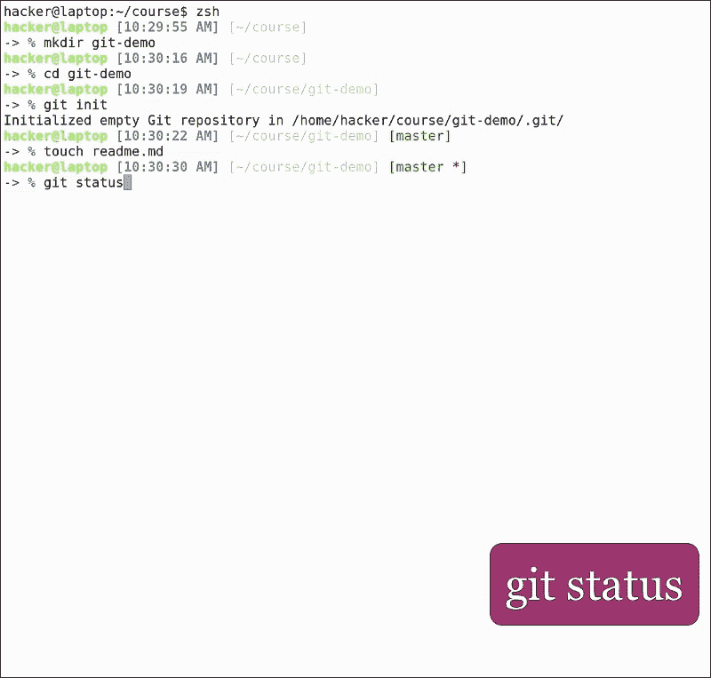

你可以看到它是如何被验证的。在我们清理了目录之后，`*`就消失了。如果我们切换分支，提示符会显示我们在新分支上。

让我们快速创建一个演示。在你的终端上运行以下命令：

```
git branch test
git checkout test
```

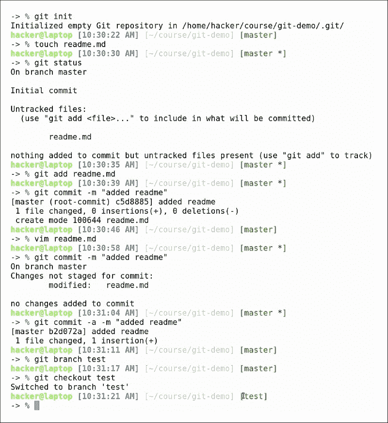

现在你可以在提示符中看到分支名称，并且还有一些其他很酷的功能可以让你去探索：

+   **命令补全**：开始输入，例如，ip，然后按下*Tab*。我们可以看到所有以 IP 开头的命令，我们可以再次按下*Tab*来浏览不同的选项。你可以使用箭头键进行导航，按下*Enter*选择所需的命令：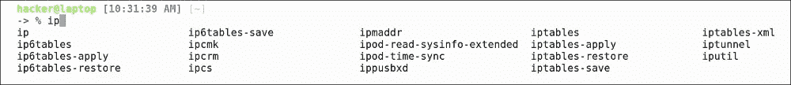

+   **参数补全**：例如输入`ls -`然后按下*Tab*，我们可以在这里看到所有选项和每个选项的简短描述。再次按下*Tab*开始浏览它们，按下*Enter*进行选择。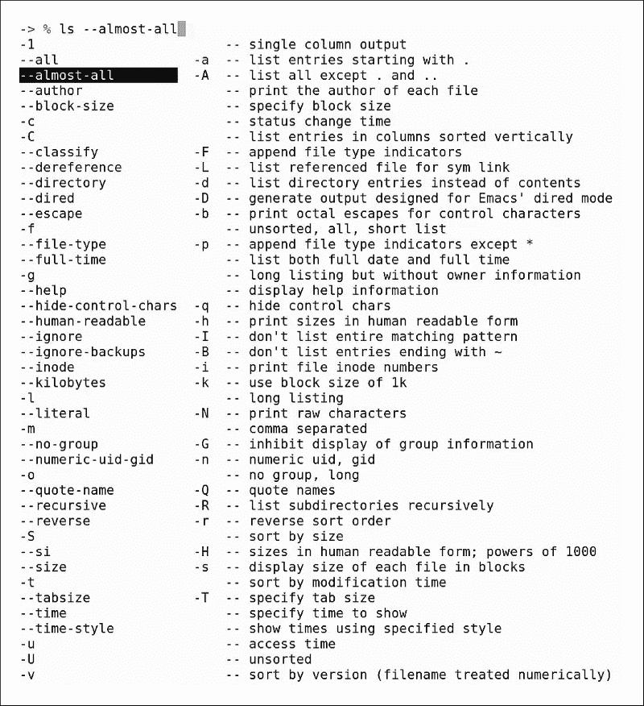

+   **历史导航**：点击向上箭头键在历史记录中搜索，通过光标前面写的字符串进行过滤。例如，如果我输入`vim`并按向上箭头键，我可以看到我历史记录中所有使用 Vim 打开的文件。

+   **历史搜索**：按下*Ctrl* + *R*开始输入，再次按下*Ctrl* + *R*搜索相同的出现在历史中的命令。例如*~*，然后按下*Ctrl* + *R*来查看所有包含*~*的命令。

+   **导航**：在这里按下*Ctrl* + 左/右箭头可以跳到一个单词，*Ctrl* + *W*可以删除一个单词，或者*Ctrl* + *U*可以删除整行。

+   **cd 补全不区分大小写**：例如，`cd doc`会扩展为`cd Documents`。

+   **cd directory completion**: 如果您懒惰并且只想在路径中指定几个关键字母，我们也可以这样做。例如，`cd /us/sh/zs` + *Tab*将扩展为`cd /usr/share/zsh`。

+   **Kill completion:** 只需输入`kill`，然后按下*Tab*键，您将看到一个要杀死的`pids`列表。从那里，您可以选择要杀死的进程。

+   **chown completion**: 输入`chown`并按下 tab 键，您将看到一个要更改所有者的用户列表。同样适用于组。

+   **Argument expansion**: 输入`ls *`并按下*Tab*键。您会看到`*`扩展到当前目录中的所有文件和文件夹。要获取子集，请输入`ls Do*`并按下*Tab*键。它只会扩展到文档和下载。

+   **Adds lots of aliases:** 只需输入 alias 即可查看完整列表。一些非常有用的别名是：

```
.. - go up one folder
… - go up two folders
- - cd o the last directory
ll - ls with -lh
```

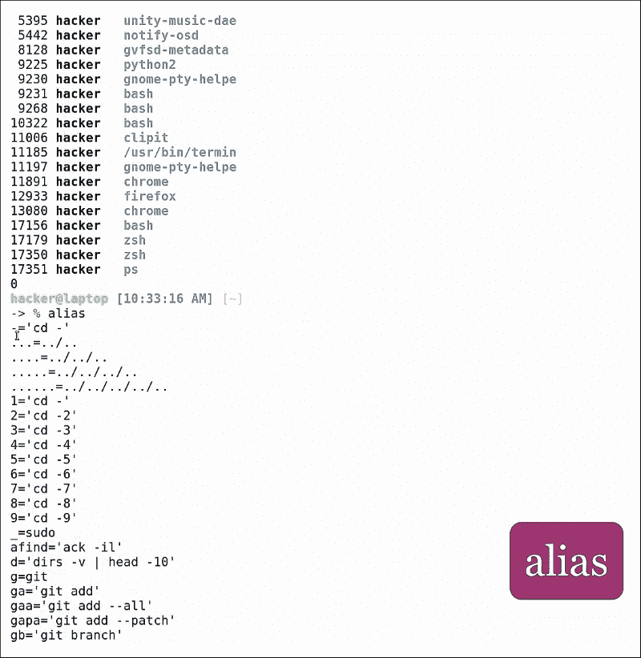

要查看快捷方式列表，请运行`bindkey`命令。终端是您将花费大量时间的地方之一，因此精通我们的 shell 并尽可能高效地使用它非常重要。了解好的快捷方式和查看相关和简洁的信息，例如我们的提示符，可以使我们的工作更轻松。

# 基本正则表达式

*您有一个问题，并且想要使用正则表达式解决它吗？现在您有两个问题了！* 这只是互联网上许多正则表达式笑话之一。

在本节中，您将学习正则表达式的工作原理，因为我们将在接下来的章节中使用它们。我们为我们的游乐场准备了一个文件，如果您想在自己的计算机上尝试 grep 命令，可以从 GitHub 存储库中获取。

让我们首先打开我们的文本文件，这样我们就可以看到它的内容，然后分割屏幕，这样我们就可以同时看到文件和命令。

首先，最简单且可能最常见的正则表达式是查找单个单词。

为此，我们将使用`grep "joe" file.txt`命令：

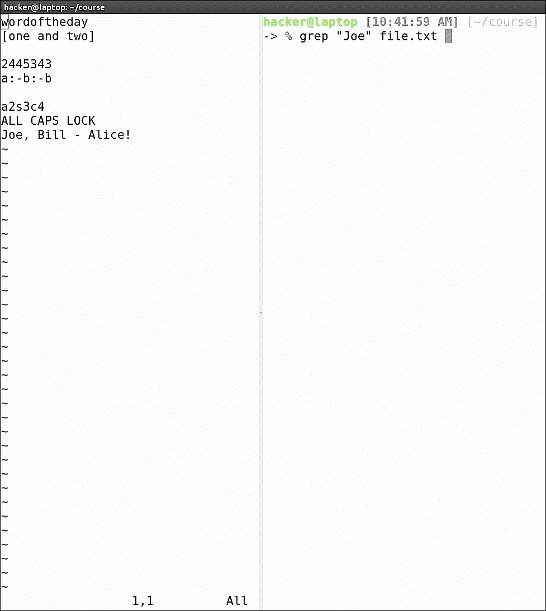

`joe`是我们要搜索的字符串，`file.txt`是我们执行搜索的文件。您可以看到 grep 打印了包含我们字符串的行，并且该单词以另一种颜色突出显示。这只会匹配单词的确切大小写（因此，如果我们使用小写的`j`，这个正则表达式将不再起作用）。要进行不区分大小写的搜索，`grep`有一个`-i`选项。这意味着 grep 将打印包含我们单词的行，即使单词的大小写不同，比如 JoE，JOE，joE 等等：

```
grep -i "joe" file.txt
```

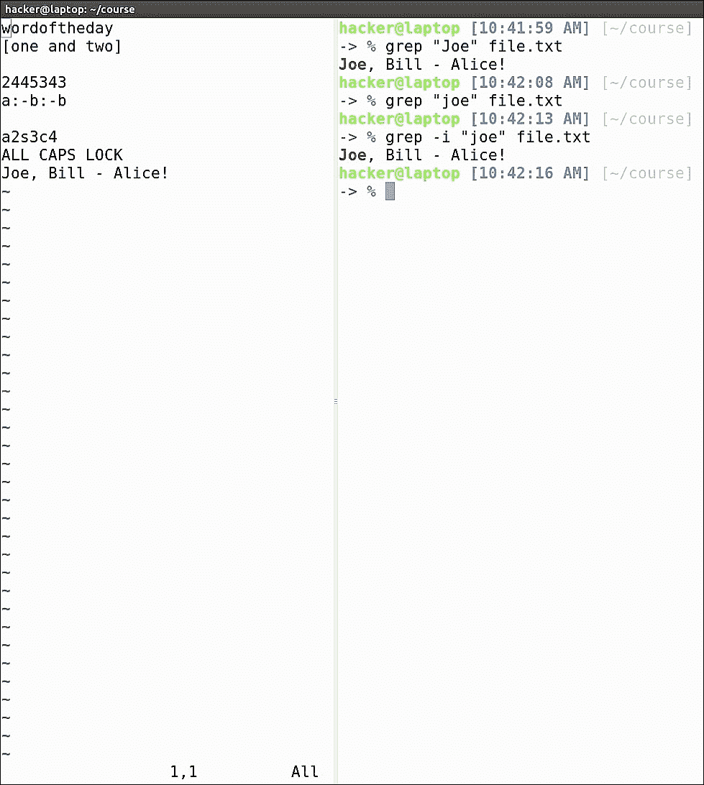

如果我们不确定字符串中有哪些字符，我们可以使用`.*`来匹配任意数量的字符。例如，要查找以"word"开头并以"day"结尾的句子，我们将使用`grep "word.*day" file.txt`命令：

+   `.` - 匹配任何字符

+   `*` - 匹配前一个字符多次

在这里，您可以看到它匹配了文件中的第一行。

一个非常常见的情况是在文件中找到空行。为此，我们使用`grep "^\s$" file.txt`命令：

+   其中`\s`：表示空格，

+   `^`：表示行的开头。

+   `$`：表示行尾。

我们有两个没有空格的空行。如果在行之间添加一个空格，它将匹配包含一个空格的行。这些被称为**锚点**。

`grep`可以使用一个小技巧来计算匹配的数量。为此，我们使用`-c`参数：

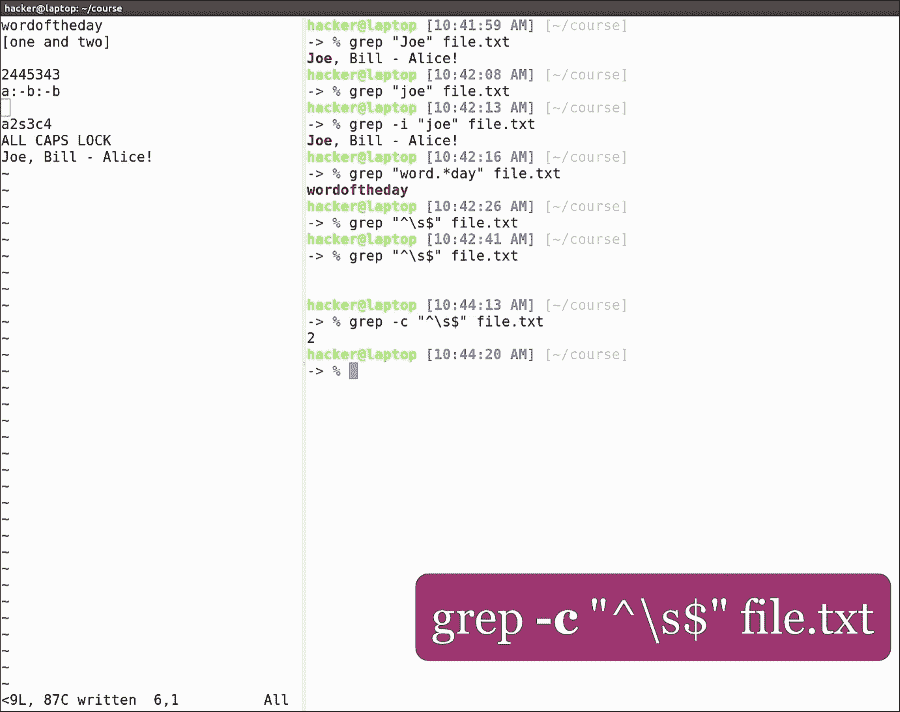

要查找所有只包含字母和空格的行，请使用：

+   `grep`

+   `""`：打开引号

+   `^$`：从行的开头到结尾

+   `[]*`：匹配这些字符任意次数

+   `A-Za-z`：任何大写和小写字母

如果我们运行到这里的命令，我们只会得到第一行。如果我们添加：

+   - 0-9 任何数字我们匹配另外两行，

+   如果我们添加：- \s 任何空格，我们还会匹配空行和全大写行

+   如果我们运行到这里的命令，我们只会得到输出的第一行，其余的不会显示

+   然后，如果我们添加 0-9，我们匹配任何数字（所以前两行被匹配）

+   如果我们添加\s，我们将匹配任何类型的空格（因此空行也将匹配）

```
grep "^[A-Za-z0-9\s]*$" file.txt

```

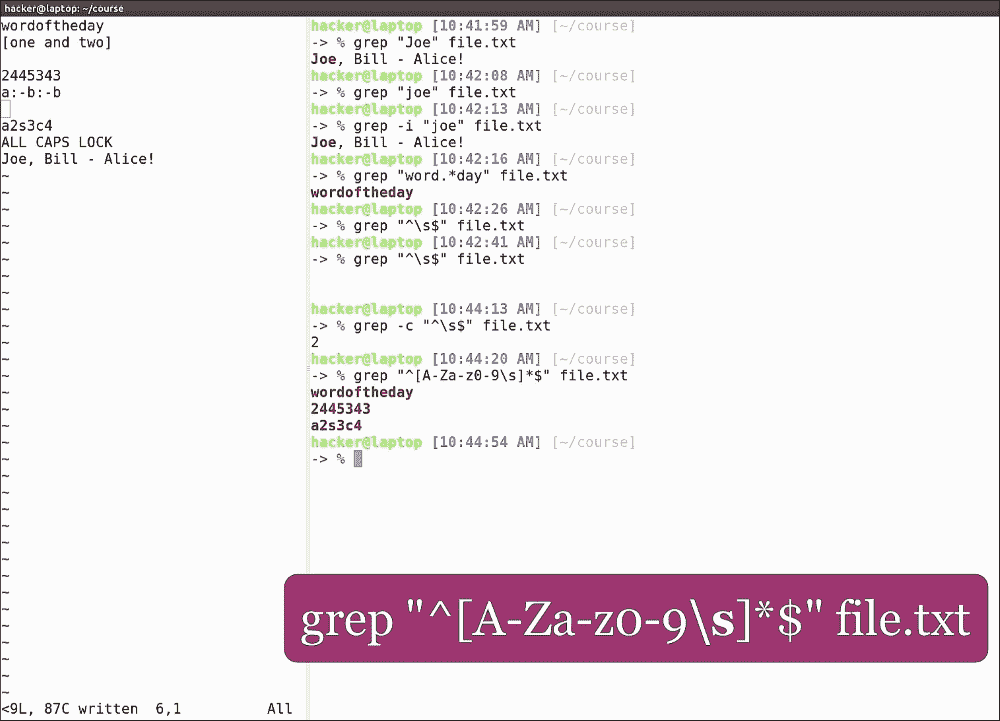

有时我们需要搜索不在字符串中的内容：

```
grep "^[⁰-9]*$" file.txt

```

此命令将找到所有不仅包含数字字符的行。`[^]`表示匹配所有不在其中的字符，在我们的例子中是任何非数字字符。

方括号是我们正则表达式中的标记。如果我们想在搜索字符串中使用它们，我们必须对它们进行转义。因此，为了找到具有方括号之间内容的行，请执行以下操作：

```
grep "\[.*\]" file.txt

```

这是任何具有方括号中字符的行。要查找所有具有这些字符`!`的行，请键入：

```
grep "\!" file.txt

```

现在让我们来看一个基本的`sed`，找到`Joe`单词并替换为`All`单词：

```
sed "s/Joe/All/g" file.txt

```

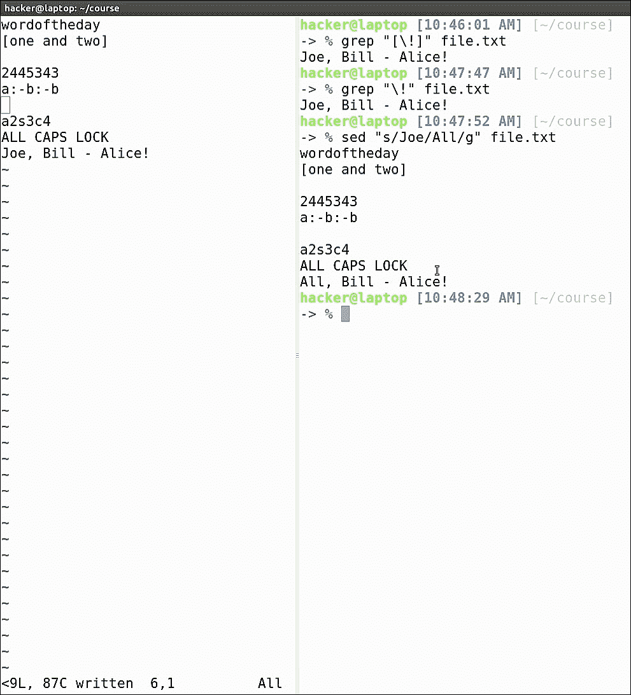

这将替换字符串`Joe`的每个出现为字符串`All`。我们将在接下来的章节中深入探讨这个问题。

正则表达式（如 Vim）是许多人害怕的东西，因为它们在开始时似乎很难学习。尽管它们可能看起来神秘，但一旦掌握，正则表达式就是方便的伙伴：它们不仅限于我们的 shell，因为语法在大多数编程语言、数据库、编辑器和任何其他包含字符串搜索的地方非常相似。我们将在接下来的章节中详细介绍正则表达式。

# 管道和子 shell-你的 shell 的盐和胡椒

在本节中，我们将探讨如何利用 shell 提高工作效率。Linux 命令行非常棒，因为我们可以使用各种工具。更棒的是，我们可以将这些工具链接在一起，形成更强大的工具，使我们的工作更加高效。我们不会介绍基本的 shell 命令，而是将研究一些酷炫的管道和子 shell 组合，这些组合可以让我们的生活更轻松。

让我们从一个基本的管道开始；在这个例子中，我们使用以下命令计算当前路径的长度：

```
pwd | wc -c

```

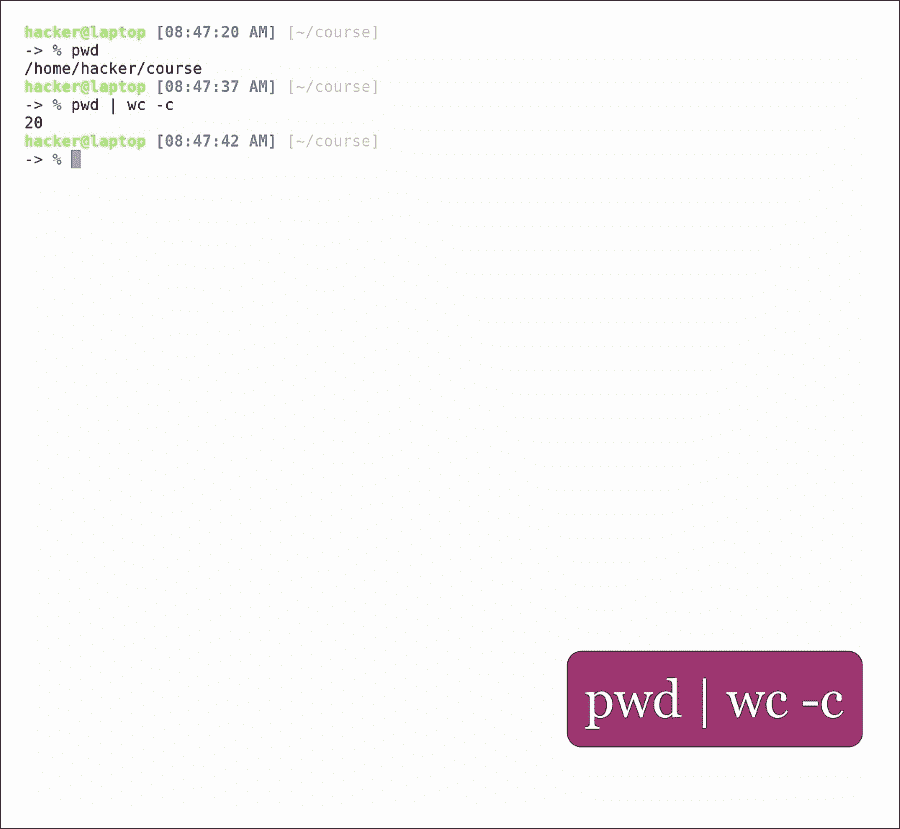

`pwd`，您可能知道，代表`print working directory`。`|`是管道符号，它的作用是将左侧命令的输出发送到右侧的命令。在我们的例子中，`pwd`将其输出发送到`wc -c`，它计算字符的数量。管道最酷的事情是您可以创建任意数量的管道链。

让我们看另一个例子，我们将看到如何查找驱动器上的已使用空间：

```
df -h | grep /home | tr -s " " | cut -f 2 -d " "

```

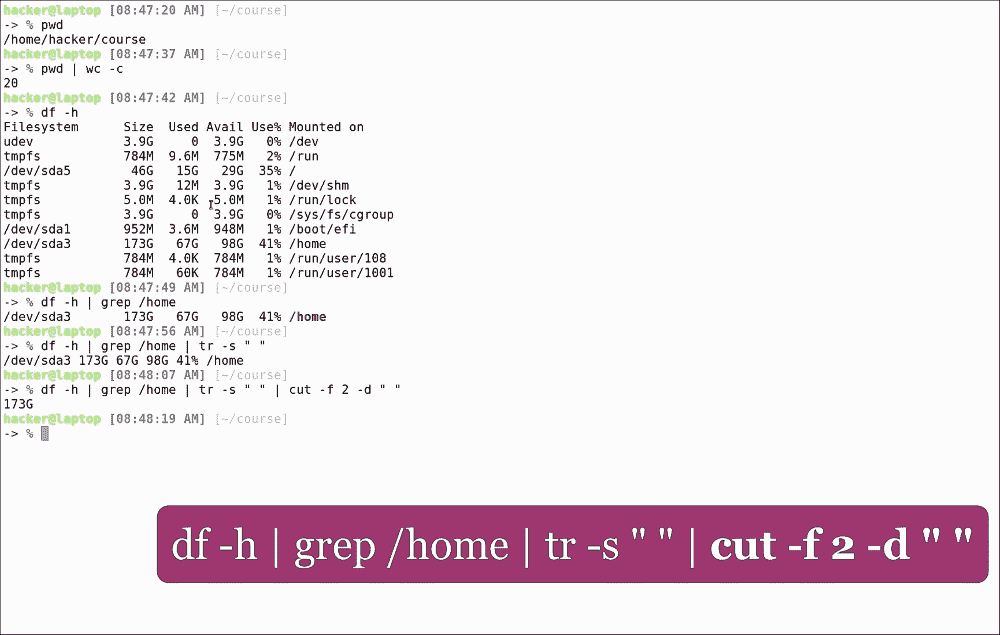

+   `"df -h"`：以人类可读的格式显示磁盘使用情况

+   `"| grep /home"`：这只显示主目录

+   `'| tr -s " "'`: 这将多个空格替换为一个空格

+   `'| cut -f 2 -d " "'`: 这使用空格作为分隔符选择第二列

正如您所看到的，该命令打印出`173G`，即`/home`分区的大小。这是一个常见的用例，通过链接多个命令，每个命令都减少输出，直到我们获得所需的信息而不是其他信息。在我们的例子中，这是已使用的磁盘空间。

要计算文件夹中的所有目录数量，请使用以下命令：

```
ls -p | grep / | wc -l

```

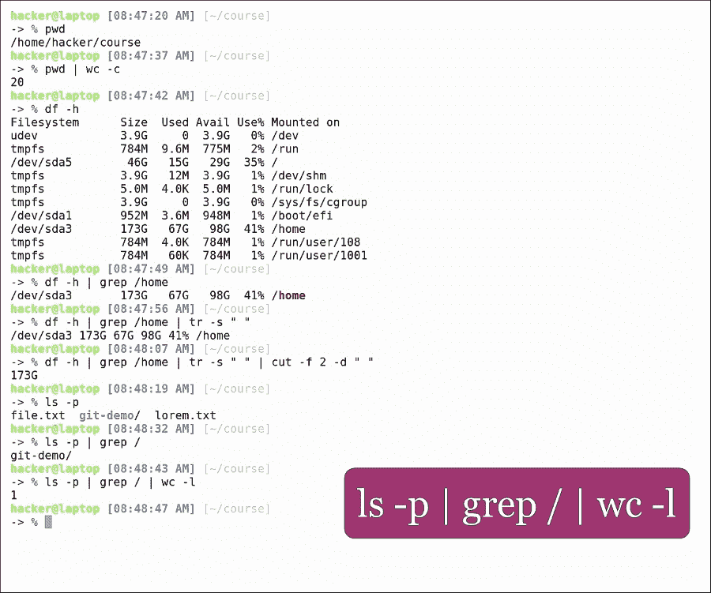

基本思想是计算以/结尾的所有行。在这里，我们可以看到我们只有一个目录。

管道是查找和终止进程的好选择。假设我们想要查找`nautilus`进程的进程 ID，并终止所有正在运行的实例。我们可以使用以下命令：

```
ps aux | grep nautilus | grep -v grep | awk '{print $2}' | xargs kill

```

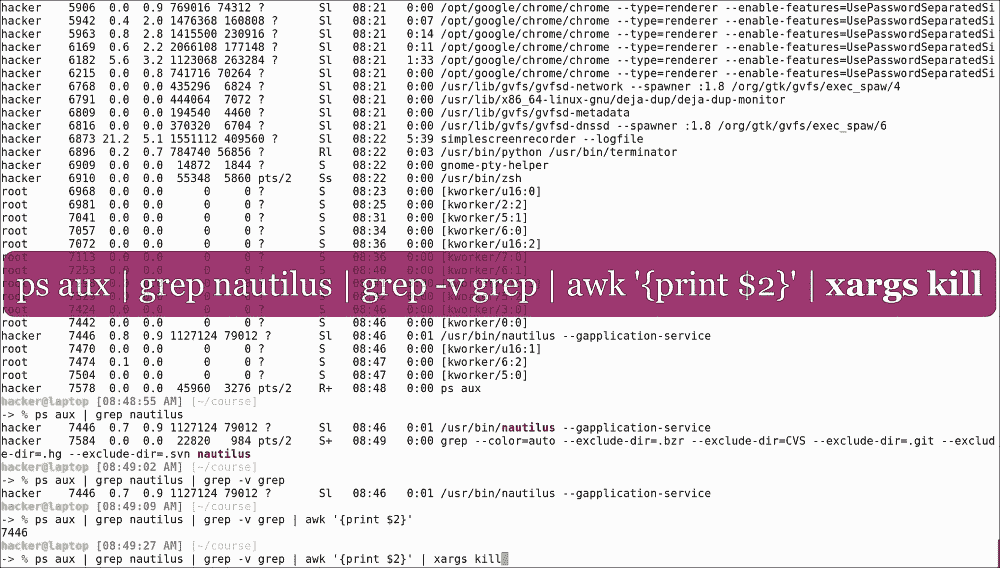

+   `ps aux`：这将打印出所有带有 PID 的进程

+   `| grep nautilus`：查找与 nautilus 匹配的项

+   `| grep -v grep`：反转`grep`以排除`grep`进程

+   `| awk '{print $2}'`：选择行中的第二个单词，即 PID

+   `| xargs kill`：这里使用`xargs`将每个 PID 分发给一个 kill 命令。它特别用于不从标准输入读取参数的命令。

现在我们已经杀死了`nautilus`。这只是一个演示性的例子。还有其他方法可以做到这一点。

让我们再次打开`nautilus`并通过按下*Ctrl* + *Z*，然后输入`bg`命令将其发送到后台。

现在让我们运行以下命令：

```
pgrep nautilus

```

要查看`nautilus`的所有`pids`并向所有这些进程发送 kill 信号，请使用以下命令行：

```
pkill nautilus

```

现在是一些网络操作的时间！您可能知道`ifconfig`命令，它用于打印有关网络接口的信息。要获取特定接口（在我们的例子中是无线接口`wlp3s0`）的 IP 地址，请运行以下命令：

```
ifconfig wlp3s0 | grep "inet addr:" | awk '{print $2}' | cut -f 2 -d ":"

```

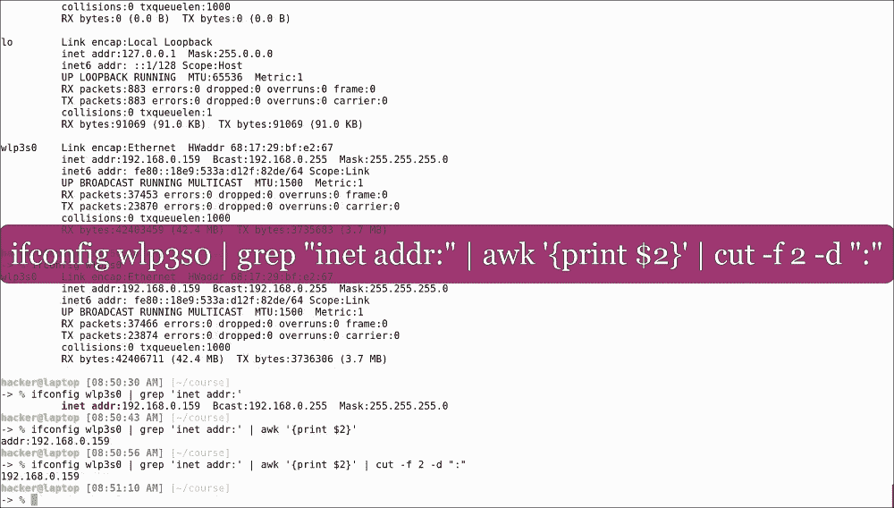

+   `ifconfig wlp3s0`：打印`wlp3s0`接口的网络信息

+   `| grep "inet addr:"`：获取包含 IP 地址的行

+   `| awk '{print $2}'`：选择行中的第二个单词（我们也可以使用 cut）

+   `| cut -f 2 -d ":"`：这是由`":"`分割的，只打印第二个单词

现在，我们在屏幕上看到了您的私有 IP 地址。

一个常见的用例也可能是计算文件中单词的频率。

这里我们有一个包含在`lorem.txt`中的标准 lorem ipsum 文本。为了获取单词频率，请使用以下命令：

```
cat lorem.txt | tr " " "\n" | grep -v "^\s*$" | sed "s/[,.]//g" | sort | uniq -c | sort -n

```

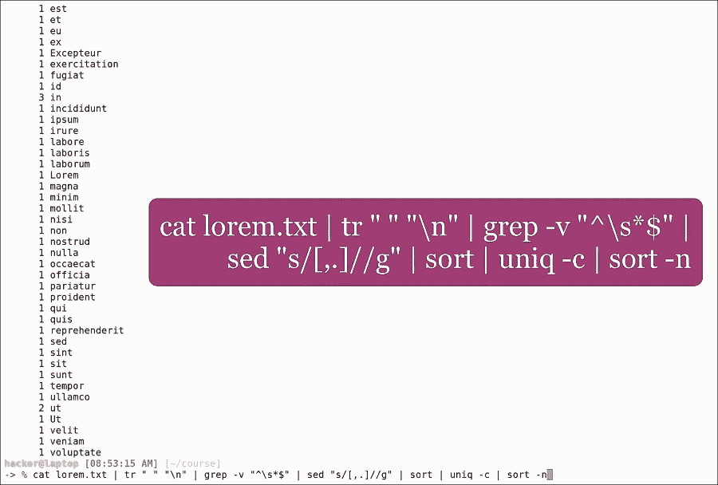

+   `cat lorem.txt`

+   `| tr " " "\n"`：将每个空格转换为换行符

+   `| grep -v "^\s*$"`：消除空行

+   `| sed "s/[,.]//g"`：消除逗号（,）和句号（.），只选择单词

+   `| sort`：按字母顺序排序结果

+   `| uniq -c`：仅显示唯一的行

+   `| sort -n`：按数值排序

附加`grep -w id`以查找单词 ID 的频率，或者附加`grep -w 4`以查看出现四次的所有单词。

现在让我们继续我们的第一个子 shell 示例。子 shell 可以通过将它们括在`$()`中或使用反引号（*`*）来编写。反引号通常位于键盘上的*Esc*键下方。在所有示例中，我们将使用第一种形式，因为它更容易阅读。

我们的第一个例子是列出当前文件夹中的所有文件夹：

```
ls $(ls)

```

`ls`子 shell 返回当前目录中的文件和文件夹，而子 shell 外部的`ls`将逐个列出它们，显示附加详细信息：

+   计算当前目录中的所有文件和目录的数量

+   考虑到逗号（,）和句号（.）是标记当前目录和父目录的硬链接，我们需要计算除这两个之外的所有条目

+   可以使用`expr $(ls -a | wc -l ) - 2`命令来完成这个操作：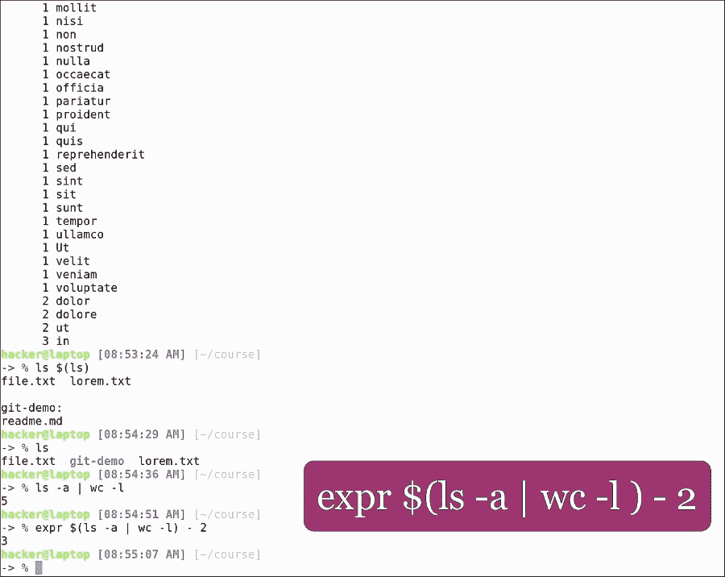

在这里，子 shell 将返回条目的数量（在本例中为五）。我们要找的数字是条目数减去特殊文件夹（"`.`"和"`..`"）的数量。为了进行算术运算，我们使用`expr`命令，就像我们的示例中一样。

请注意，子 shell 包含一个管道。好处是我们可以以任何方式组合管道和子 shell，以获得所需的结果。

想象一下管道和子 shell 就像是你的 shell 的乐高积木。它们远远超出了其功能，并为您提供了无限组合的新可能性。最终，这一切取决于您的想象力和您学会如何使用它们的能力。

# 为了娱乐和利润而编写 shell 脚本

管道和子 shell 是扩展我们的 shell 功能的一种方式。最终的方式是编写 shell 脚本。在处理无法用一行命令自动化的复杂任务时，必须考虑这些场景。

好消息是几乎所有的任务都可以通过使用 shell 脚本来自动化。我们不会介绍 shell 脚本的入门知识。相反，我们将看一些更高级的用例来编写它们。

让我们开始我们的 shell 脚本之旅！首先，让我们打开一个名为`script.sh`的文件，并分割屏幕以便我们在编写时进行测试。每个 shell 脚本都应该以`#!`开头，后面跟着它使用的解释器。这一行被称为**shebang**。我们将使用 bash 作为我们的默认解释器。

使用 bash 是一个好主意，因为它是一个常见的解释器，大多数 Linux 发行版和 OS X 都带有它：

```
#!/bin/bash

```

让我们从一个简单的用例开始：读取传递到命令行的参数。我们将把第一个命令行参数`$1`的值赋给一个名为 ARG 的变量，然后将其打印回屏幕：

```
ARG=${1}
echo ${ARG}
```

让我们保存我们的脚本，赋予它执行权限，然后用一个参数运行它：

```
./script.sh test

```

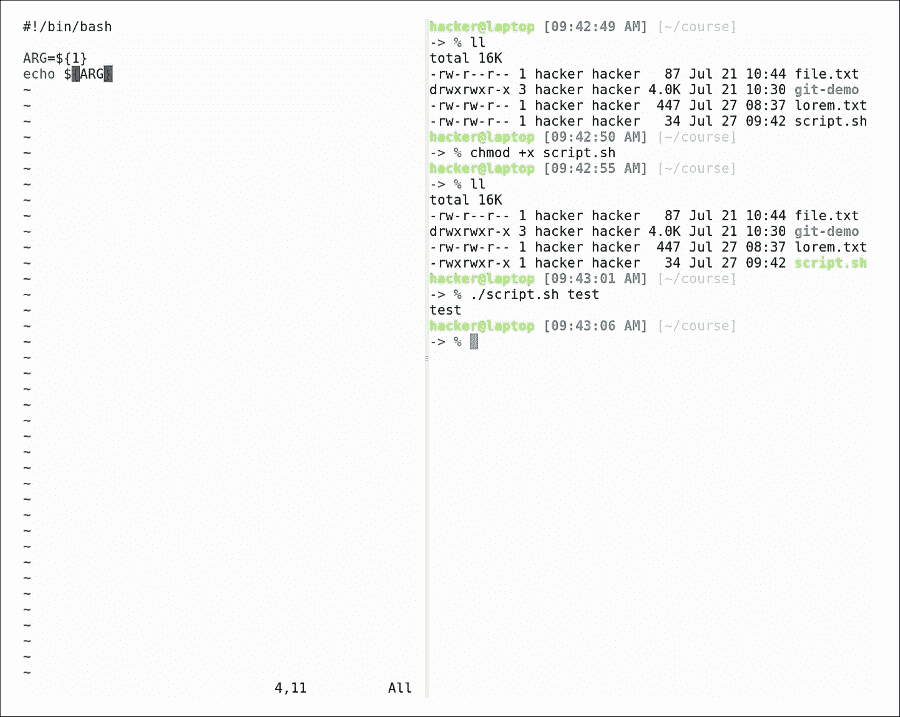

正如您所看到的，值 test 被打印回屏幕。在某些情况下，我们希望为变量分配默认值。为了做到这一点，在变量赋值后添加“:-”，然后是默认值：

```
ARG=${1:-"default value"}

```

现在，如果我们重新运行脚本，我们可以看到不传递参数将会`echo default value`。就像管道一样，我们可以将多个默认值赋值链接在一起。我们可以定义另一个变量`AUX`，将其赋值为`123`，并使用相同的语法将其值赋给 ARG 变量，然后使用`"default value"`脚本，如下所示：

```
AUX="123"
ARG=${1:-${AUX:-"default value"}}

```

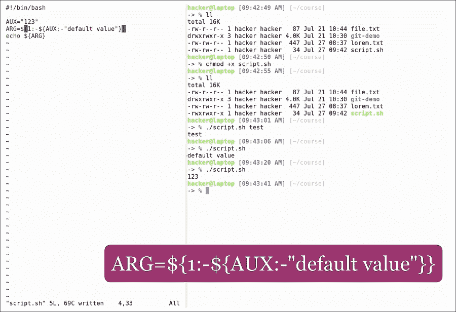

在这种情况下，ARG 将始终接收 123 作为其默认值。

现在让我们来看一下字符串选择器。要选择一个子字符串，使用“:”，加上起始位置加上“:”，再加上字符数：

```
LINE="some long line of text"echo "${LINE:5:4}" 

```

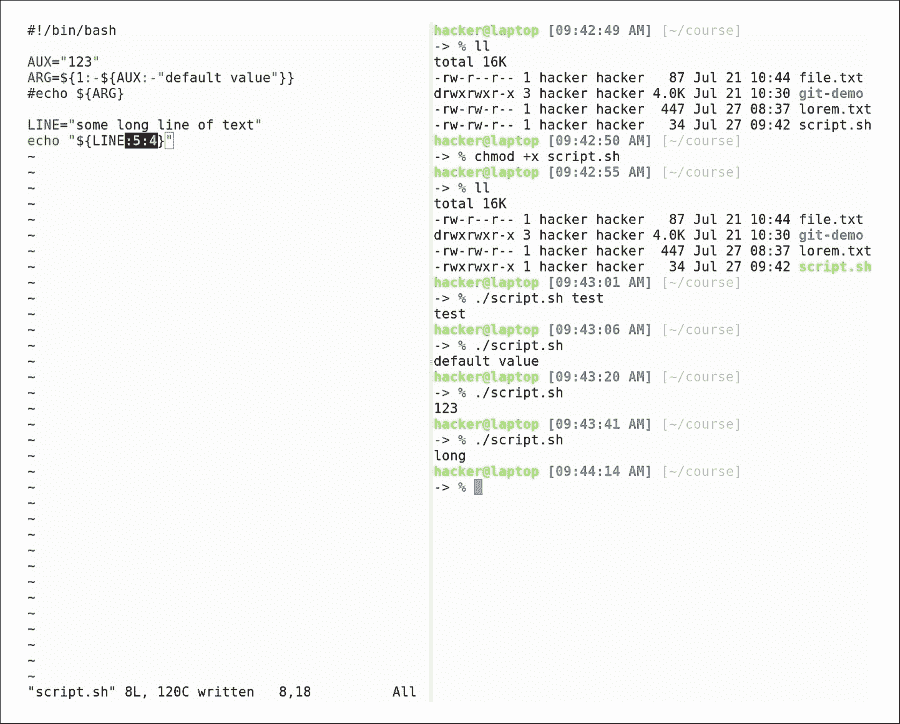

在我们的例子中，我们将选择四个字符，从第五个字符开始。运行脚本后，我们可以在屏幕上看到值`long`被打印出来。

大多数 shell 脚本都设计为从命令行运行并接收可变数量的参数。为了在不知道参数总数的情况下读取命令行参数，我们将使用一个`while`语句，该语句检查第一个参数是否为空，使用-z（或不等于 0）条件表达式。在 while 循环中，让我们回显变量的值并运行 shift，将命令行参数向左移动一个位置：

```
while [[ ! -z ${1} ]]; do
echo ${1}
shift  # shift cli arguments
done

```

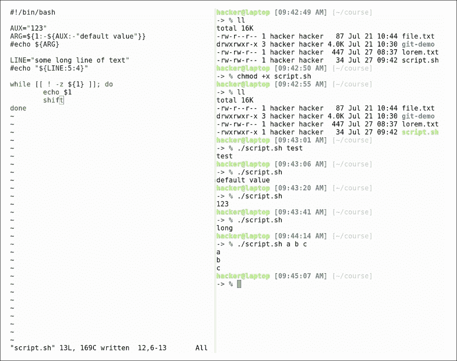

如果我们使用参数*a* *b* *c*运行我们的脚本，我们可以看到我们的 while 循环遍历了参数并将每个参数打印在单独的行上。现在让我们扩展我们的 CLI 参数解析器，并添加一个用于解释参数的*case*语句。

让我们假设我们的脚本将有一个帮助选项。Posix 标准建议使用`--`作为长参数版本，使用一个`-`作为短版本。因此，`-h`和`--help`都将打印帮助消息。此外，建议始终有一个默认情况，并在用户发送无效选项时打印一条消息，然后以非零退出值退出：

```
while [[ ! -z ${1} ]]; do
    case "$1" in
        --help|-h)
            echo "This is a help message"
            shift
            ;;
        *)
            echo "invalid option"
            exit 1
            ;;
    esac
done
```

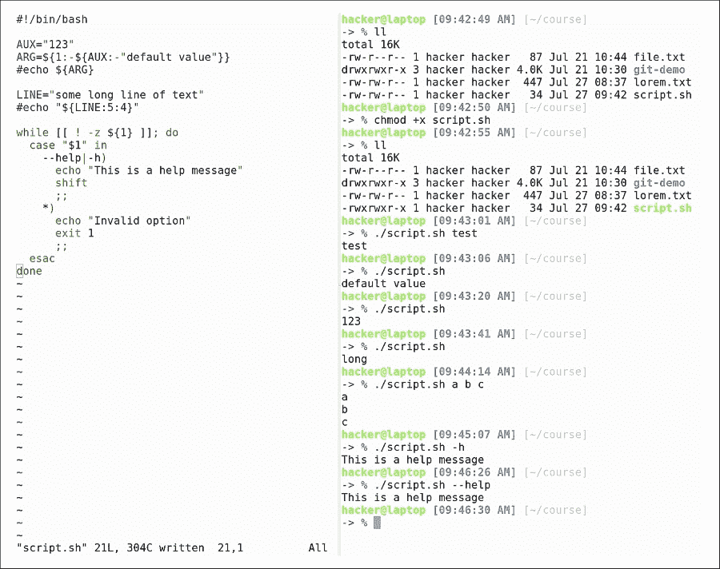

如果我们使用-h 运行脚本，我们可以看到打印的帮助消息，就像我们使用`--help`一样。如果我们使用任何其他选项运行脚本，将打印无效选项文本，并以退出码 1 退出脚本。要获取上一个命令的退出码，请使用`"$?"`。

现在让我们来看一下 shell 中的基本函数。语法与其他编程语言非常相似。让我们编写一个名为`print_ip`的函数，它将打印指定为第一个参数的接口的 IP。我们将使用子 shell 并将值赋给名为 IP 的变量。我们已经将完整的命令复制到剪贴板中；它与我们在关于管道的课程中看到的相同：

```
function print_ip() {
    IP=$(
        ifconfig ${1} | \
        grep "inet addr:" | \
        awk '{print $2}' | \
        cut -f 2 -d ":"
    )   
    echo ${IP}
}
```

！Shell 脚本的乐趣和利润

现在让我们在我们的 switch 语句中添加另一个 case，用于`-i`或`--ip`选项。该选项后面将跟随接口的名称，然后我们将将其传递给`print_ip`函数。一个选项有两个参数意味着我们需要调用 shift 命令两次：

```
--ip|-i)
    print_ip ${2}
    shift
    shift
    ;;
```

让我们执行`ifconfig`以获取我们的无线接口的名称。我们可以看到它是`wlp3s0`。

现在让我们运行：

```
./script.sh --ip wlp3s0
```

我们可以看到 IP 地址。这是一个非常基本的用例，我们可以看到如何传递命令行参数。我们可以为我们的 case 语句添加无限选项，为处理参数定义函数，甚至可以将多个选项链接在一起，形成接收命令行参数作为结构化信息的复杂脚本。

高效意味着运行任务更快 - 真的很快！而且当涉及到速度时，bash 并不是脚本解释器的首选。幸运的是，我们还有一些诀窍！如果一个 shell 脚本需要运行多个独立的任务，我们可以使用*&*符号将进程发送到后台，并继续执行下一个命令。

让我们创建两个函数，`long_running_task 1`和`2`，并在内部添加一个`sleep`命令，以模拟一个`long_running`任务：

```
function long_running_task_1() {
    sleep 1
}

function long_running_task_2() {
    sleep 2
}
```

第一个长时间运行的任务函数将休眠一秒钟，下一个将休眠两秒钟。

然后，为了测试目的，让我们在我们的 switch 语句中添加另一个 case，称为`-p / --`parallel，并运行这两个长时间运行的任务：

```
--parallel|-p)
    long_running_task_1 
    long_running_task_2
```

现在，如果我们运行这个：

```
./script.sh -p
```

脚本将花费总共三秒钟才能完成。我们可以使用*time*实用程序来测量这个时间：

！Shell 脚本的乐趣和利润

如果我们在后台运行两个函数，我们可以将运行时间减少到两个函数中运行时间最长的时间（因为有等待）。当运行长时间运行的任务时，我们可能希望脚本等待最长运行时间的任务完成，在我们的例子中是任务 2。我们可以通过获取第二个任务的`pid`来实现这一点。这里使用`$!`来获取最后一次运行命令的`pid`。然后我们使用等待 shell 内置命令等待执行完成：

```
--parallel|-p)
    long_running_task_1 &
    long_running_task_2 &
    PID=$!
    wait ${PID}
```

再次使用时间实用程序运行脚本后，我们可以看到完成任务总共需要两秒钟。

谁会想到我们可以在 shell 中进行并行处理？

如果执行时间较长，我们可以在脚本完成时添加通知：

```
notify-send script.sh "execution finished"
```

！Shell 脚本的乐趣和利润

这样我们就可以启动脚本，在其他任务上工作，并在脚本完成时收到通知。您可以让您的想象力在并行处理和通知方面发挥作用，可以实现的事情多得让人无法想象。

在本章中，我们已经看到了一些常见的预定义 shell 变量。它们是：

+   `$1`：第一个参数

+   `$?`：最后一次命令的返回代码

+   `$!`：最后一次运行命令的`pid`

其他常用的预定义 shell 变量包括：

+   `$#`：参数个数

+   `$*`：参数列表

+   `$@`：所有参数

+   `$0`：shell/脚本的名称

+   `$$`：当前运行 shell 的 PID

Bash 有很多功能，我们建议阅读其 man 页面以获取更多信息。

当正确使用时，Shell 脚本是令人惊叹的。它们可以微调系统命令，就像我们在示例中看到的那样，只获取 IP 地址，而不是整个`ifconfig`输出等等。作为一个务实的终端用户，您应该确定您在命令行中最常见的任务以及可以使用 Shell 脚本自动化的任务。您应该创建自己的 Shell 脚本集合并将它们添加到路径中，以便可以从任何目录轻松访问它们。

# Shell 脚本库

为了真正利用使用 shell 脚本自动化任务的优势，将所有常见任务组织成可重用的命令并使其在路径中可用非常重要。为此，最好在主目录中创建一个`bin`文件夹用于存储脚本，并创建一个`bin/lib`目录用于存储常见的代码片段。在处理大量 shell 脚本时，重用大块功能非常重要。可以通过为 shell 脚本编写库函数来实现这一点，这些函数可以从多个位置调用。

在这里，我们将创建一个名为`util.sh`的库脚本，它将在其他脚本中被引用。通过引用该脚本，我们可以从库脚本内部访问函数和变量。

我们将从先前的脚本中添加`print_ip`函数。

现在我们将添加另一个名为`getarg`的函数，其他脚本将使用它来读取命令行参数和值。我们将简单地从剪贴板历史中粘贴它，使用 ClipIt 进行选择。

您可以通过查看我们的 ClipIt 部分来了解更多关于 ClipIt 的信息！

```
Function to read cli argument:
function getarg() {
    NAME=${1}
    while [[ ! -z ${2} ]]; do
        if [[ "--${NAME}" == "${2}" ]]; then
            echo "${3}"
            break
        fi
        shift
    done
}   
```


这只是一个简单的函数，它将接收参数名称作为第一个参数，CLI 参数列表作为第二个参数，并在 CLI 参数列表中搜索参数名称。我们将在后面看到它的实际应用。

我们要创建的最后一个函数称为`get_public_ip`。它在功能上与`print_ip`函数类似，只是它用于打印计算机的公共 IP。这意味着，如果您连接到无线路由器并访问 Internet，您将获得路由器的 IP，这是其他站点看到的 IP。`print_ip`函数只显示私有子网的 IP 地址。

该命令已经复制到剪贴板中。它被称为**dig**，我们使用它来访问[`www.opendns.com/`](https://www.opendns.com/)以读取公共`ip`。您可以在其 man 页面或通过 Google 搜索中找到有关它的更多信息：

```
function get_public_ip() {
    dig +short myip.opendns.com @resolver1.opendns.com
}
```

现在我们已经准备好了库函数，让我们去创建我们的提高生产力的脚本。让我们创建一个名为**iputils**的脚本，在其中添加一些用于读取 IP 地址的常见任务。

我们将首先添加 shebang，然后是一个巧妙的小技巧，以确保我们始终在与执行的脚本相同的文件夹中。我们将使用`BASH_SOURCE`变量来确定**当前工作目录**（或**CWD**）变量的值。您可以在这里看到我们使用了嵌套子 shell 来实现这一点：

```
CWD=$( cd "$(dirname "${BASH_SOURCE[0]}" )/" && pwd )
cd ${CWD}

```

接下来，我们将引用`util`脚本，以便将库函数导出到内存中。然后，我们可以从当前脚本中访问它们：

```
source ${CWD}/lib/util.sh

```

让我们在使用子 shell 的情况下向我们的`getarg`函数添加一个简单的调用，并搜索`cmd`参数。此外，让我们输出我们找到的内容，以便测试我们的脚本：

```
CMD=$(getarg cmd $@)
echo ${CMD}

```

接下来，我们需要使用`chmod`命令给脚本赋予执行权限。此外，为了能够从任何位置运行脚本，`bin`文件夹必须在 PATH 变量中。输出该变量并检查 bin 文件夹是否存在，如果不存在，则在`~/.zshrc`中更新该变量。

让我们通过使用`getarg`函数读取命令行参数并输出它来测试脚本。

如果您在终端中使用 tab 键自动补全搜索`iputils`命令，并且命令似乎不存在，那可能是因为您需要告诉`zsh`重新加载其路径命令。要做到这一点，输入"rehash"命令。

现在运行：

```
iputil --cmd ip

```

这应该在任何文件夹中都可以工作，并在屏幕上打印出`ip`。

现在我们已经验证了一切都没问题，让我们为命令行参数编写一些代码。如果我们使用`--cmd ip`标志运行脚本，脚本应该在屏幕上打印出来。这可以通过已经熟悉的`case`语句来实现。在这里，我们还想传入另一个参数`--iface`，以获取打印 IP 所需的接口。添加一个默认情况并回显一个消息说`invalid`参数也是一个好习惯：

```
case ${CMD} in
    ip)
        IFACE=$(getarg iface $@)
        print_ip ${IFACE}
        ;;
    publicip)
        get_public_ip
        ;;
    *)
        echo "Invalid argument"
esac
```

保存脚本，然后让我们测试一下。

首先，让我们从`ifconfig`命令中获取接口名称，然后通过运行此命令来测试脚本：

```
iputil --cmd ip --iface wlp3s0

```

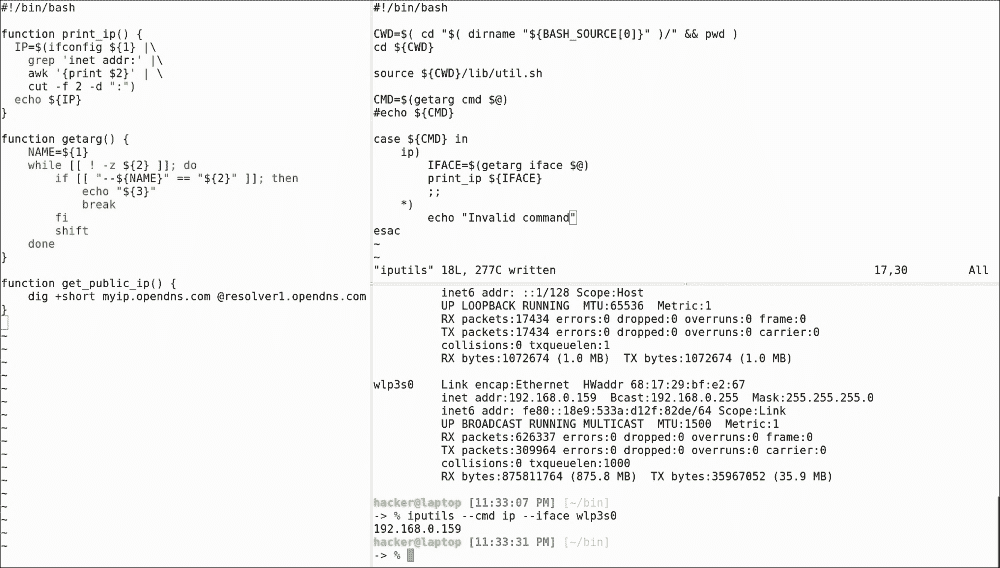

我们可以看到它在屏幕上打印出了我们的私有`ip`。

现在让我们在脚本中添加最后一个`cmd`：`publicip`。

为此，我们只需从我们的`lib`工具中调用`get_public_ip`函数。保存并运行此命令：

```
iputil --cmd publicip

```

我们看到命令运行成功；我们的公共`ip`被打印在屏幕上。这是完整的脚本：

```
#!/bin/bash 

CWD=$( cd "$( dirname "${BASH_SOURCE[0]}" )/" && pwd )
cd ${CWD}

source ${CWD}/lib.sh

CMD=$(getarg cmd $@)

case ${CMD} in
    publicip)
        print_public_ip
        ;;
    ip)
        IFACE=$(getarg iface $@)
        print_ip $IFACE
        ;;
    *)
        echo "invalid command"
esac
```

举个例子，前段时间互联网上有一堆关于一个男人的文章，他习惯于自动化一切超过 90 秒的工作。他编写的脚本包括指示咖啡机开始制作拿铁，这样当他到达咖啡机时，拿铁已经完成，他不需要等待。他还编写了一个脚本，在晚上 9 点后，每当他在公司的服务器上登录活动时，自动向妻子发送一条“工作晚了”的短信，并从预设列表中自动选择一个原因。

当然，这个例子有点复杂，但最终都是关于你的想象力。写得好的自动化脚本可以处理你的例行工作，让你有时间发掘你的创造潜力。
