# 第三章：Vim 功夫

Vim 的默认配置通常相当一般。为了更好地使用 Vim 的功能，我们将通过其配置文件发挥其全部潜力。然后，我们将学习一些键盘快捷键，帮助我们加快工作流程。我们还将介绍一些常用的插件，使 Vim 变得更好用。我们将看到 Vim 如何通过加密文件来存储密码。每章结束时，将展示如何自动化 Vim 并轻松配置工作环境。

在本章中，我们将涵盖以下内容：

+   使用 Vim 工作

+   探索 Vim 的插件功能

+   使用 Vim 密码管理器存储密码

+   自动化 Vim 配置

在终端中提高生产力时，一个重要的方面是永远不要离开终端！当完成任务时，我们经常需要编辑文件并打开一个外部（GUI）编辑器。

走错了！

为了提高我们的生产力，我们需要抛弃那些过去的日子，在终端中完成工作，而不是打开完整的 IDE 来编辑一行简单的文本。现在，关于哪个是最好的终端文本编辑器的争论很多，每个编辑器都有其优缺点。我们推荐 Vim，这是一个超级可配置的编辑器，一旦掌握，甚至可以胜过一个 IDE。

为了启动我们的 Vim 生产力，我们首先需要一个配置良好的`vimrc`文件。

# 强化 Vim

让我们首先在我们的`home`文件夹中打开一个名为`.vimrc`的新隐藏文件，并粘贴几行代码：

```
set nocompatible
filetype off

" Settings to replace tab. Use :retab for replacing tab in existing files.
set tabstop=4
set shiftwidth=4
set expandtab

" Have Vim jump to the last position when reopening a file
if has("autocmd")
   au BufReadPost * if line("'\"") > 1 && line("'\"") <= line("$") | exe "normal! g'\"" | endif

" Other general vim options:
syntax on
set showmatch      " Show matching brackets.
set ignorecase     " Do case insensitive matching
set incsearch      " show partial matches for a search phrase
set nopaste
set number           
set undolevels=1000
```

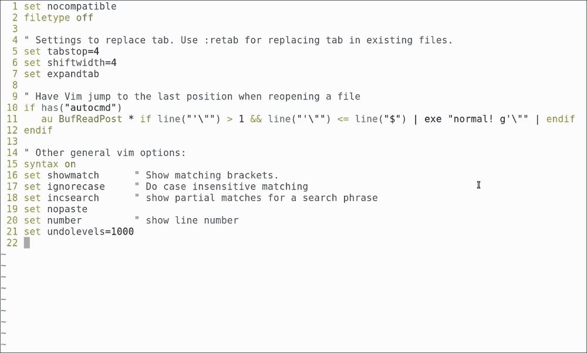

现在让我们关闭并重新打开文件，以便我们可以看到配置生效。让我们更详细地了解一些选项。

首先，正如你可能已经猜到的，以`"`开头的行是注释，可以忽略。第 5、6 和 7 行告诉`vim`始终使用空格而不是制表符，并将制表符大小设置为 4 个空格。第 10 到 12 行告诉`vim`始终打开一个文件，并将光标设置为上次打开文件时的位置：

+   `syntax on`：这个命令启用语法高亮，使得代码更容易阅读

+   `set nopaste`：这个命令设置为`nopaste`模式，这意味着你可以粘贴代码而不让 Vim 尝试猜测如何格式化它

+   `set number`：这告诉 Vim 始终显示行号

+   `set undolevels=1000`：这告诉 Vim 记住我们对文件所做的最后 1000 次更改，以便我们可以轻松地撤销和重做

现在，大多数这些功能可以很容易地打开或关闭。例如，假设我们想要从在 Vim 中打开的文件中复制、粘贴几行到另一个文件中。使用这个配置，我们也会粘贴行号。可以通过输入`:set nonumber`快速关闭行号，或者如果语法很烦人，可以通过运行`syntax off`轻松关闭它。

另一个常见的功能是状态行，可以通过粘贴以下选项进行配置：

```
" Always show the status line
set laststatus=2

" Format the status line
set statusline=\ %{HasPaste()}%F%m%r%h\ %w\ \ CWD:\ %r%{getcwd()}%h\ \ \ Line:\ %l\ \ Column:\ %c

" Returns true if paste mode is enabled
function! Has Paste()
    if &paste
        return 'PASTE MODE  '
    en  
    return ''
end function
```

关闭文件并重新打开。现在我们可以在页面底部看到一个带有额外信息的状态栏。这个状态栏也是可以高度配置的，我们可以在里面放很多不同的东西。这个特定的状态栏包含了文件名、当前目录、行号和列号，还有粘贴模式（开启或关闭）。要将粘贴模式设置为开启，我们使用`:set paste`命令，状态栏上会显示出相应的更改。

Vim 还有更改配色方案的选项。要做到这一点，进入`/usr/share/vim/vim74/colors`目录，从中选择一个配色方案：

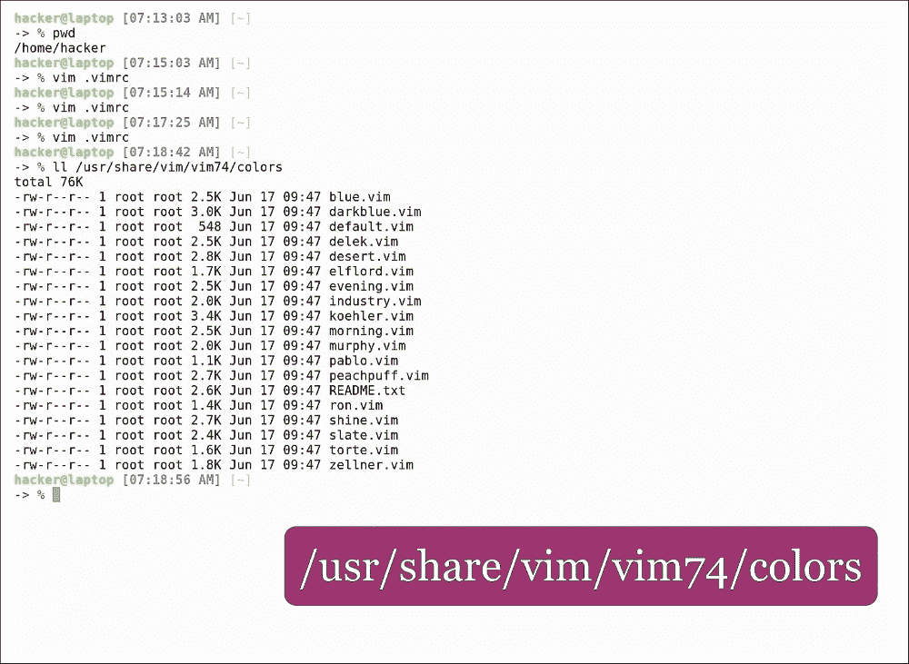

让我们选择 desert！

## 配色方案 desert

关闭并重新打开文件，你会发现它与之前的配色主题并没有太大的不同。如果我们想要一个更激进的配色方案，我们可以将配色方案设置为蓝色，这将大大改变 Vim 的外观。但在本课程的其余部分，我们将坚持使用**desert**。

Vim 还可以通过外部工具进行超级增强。在编程世界中，我们经常发现自己在编辑 JSON 文件，如果 JSON 没有缩进，这可能是一项非常困难的任务。有一个 Python 模块可以用来自动缩进 JSON 文件，Vim 可以配置为在内部使用它。我们只需要打开配置文件并粘贴以下行：

```
map j !python -m json.tool<CR>

```

基本上，这告诉 Vim，当处于可视模式时，如果我们按下*J*，它应该调用 Python 并使用选定的文本。让我们手动编写一个`json`字符串，通过按下*V*进入可视模式，使用箭头选择文本，然后按下*J*。

而且，不需要额外的软件包，我们添加了一个 JSON 格式化的快捷方式：

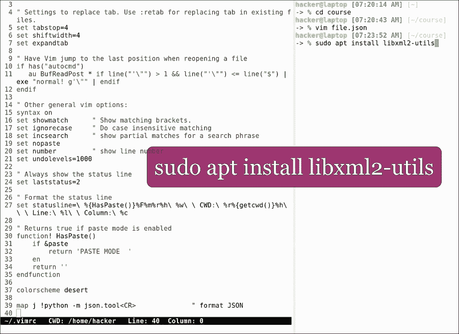

我们也可以对`xml`文件执行相同的操作，但首先我们需要安装一个用于处理它们的工具：

```
sudo apt install libxml2-utils

```

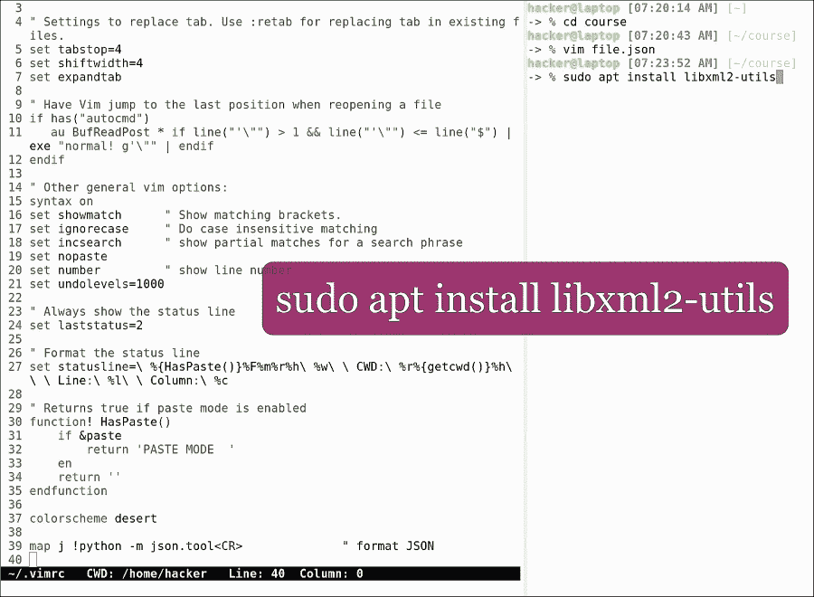

要安装 XML 实用程序包，我们必须将以下行添加到配置文件中：

```
map l !xmllint --format --recover -<CR>

```

当处于可视模式时，将*L*键映射为`xmllint`。让我们编写一个 HTML 片段，实际上是一个有效的`xml`文件，按下`V`进入可视模式，选择文本，然后按下*L*。

这种类型的扩展（以及拼写检查器、语法检查器、字典等等）可以带到 Vim 中，并立即可用。

一个配置良好的`vim`文件可以节省您在命令行中的大量时间。虽然在开始时可能需要一些时间来设置和找到适合您的配置，但随着时间的推移，这种投资将在未来产生巨大的回报，因为我们在 Vim 中花费的时间越来越多。很多时候，我们甚至没有打开 GUI 编辑器的奢侈，比如在通过`ssh`会话远程工作时。信不信由你，命令行编辑器是救命稻草，没有它们很难实现高效的工作。

# 键盘功夫

现在我们已经设置好了 Vim，是时候学习一些更多的命令行快捷方式了。我们将首先看一下缩进。

在 Vim 中可以通过进入可视模式并键入*V*选择文本的部分或键入*V*选择整行，然后键入*>*或*<*进行缩进。然后按下`.`重复上次的操作：

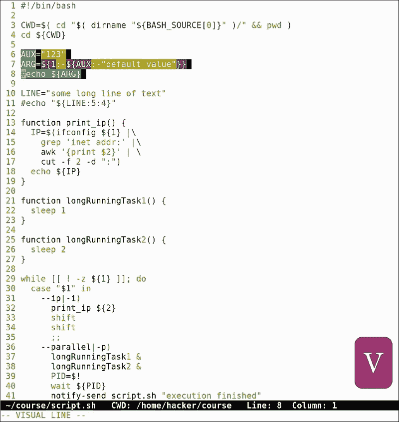

通过按下`u`可以撤消任何操作，然后通过按下*Ctrl* + *R*（即撤消和重做）可以重做。这相当于大多数流行编辑器中的*Ctrl* + *Z*和*Ctrl* + *Shift* + *Z*。

在可视模式下，我们可以通过按下*U*将所有文本转换为大写，按下*u*将所有文本转换为小写，按下*~*来反转当前大小写：

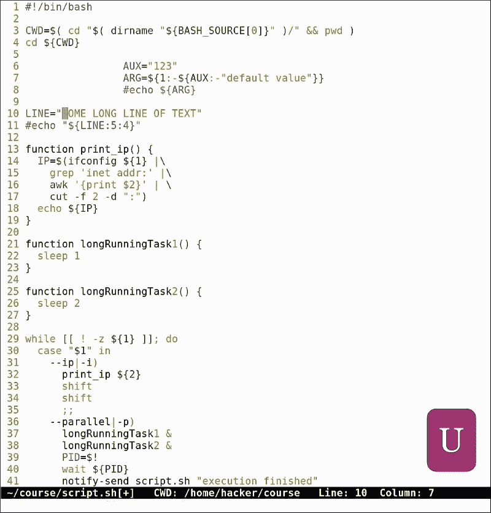

其他方便的快捷方式包括：

+   `G`：转到文件末尾

+   `gg`：转到文件开头

+   `全选`：这实际上不是一个快捷方式，而是一组命令的组合：`gg V G`，即转到文件开头，选择整行，然后移动到末尾。

Vim 还有一个方便的快捷方式，可以打开光标下的单词的 man 页。只需按下 K，就会显示该特定单词的 man 页（如果有的话）：

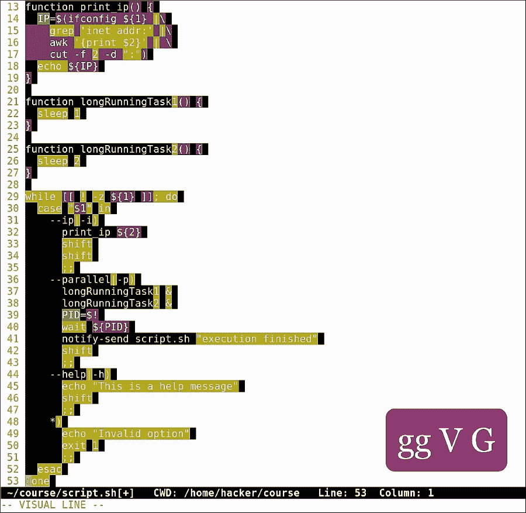

在 Vim 中查找文本就像按下`/`一样简单。只需输入`/*`加上要查找的文本，然后按下*Enter*开始搜索。Vim 将转到该文本的第一个出现位置。按下`n`查找下一个出现位置，*N*查找上一个出现位置。

我们最喜欢的编辑器具有强大的查找和替换功能，类似于`sed`命令。假设我们想要将所有出现的字符串`CWD`替换为字符串`DIR`。只需输入：

```
:1,$s/CWD/DIR/g
:1,$ - start from line one, till the end of the file
s - substitute 
/CWD/DIR/ - replace CWD with DIR
g - global, replace all occurrences.

```

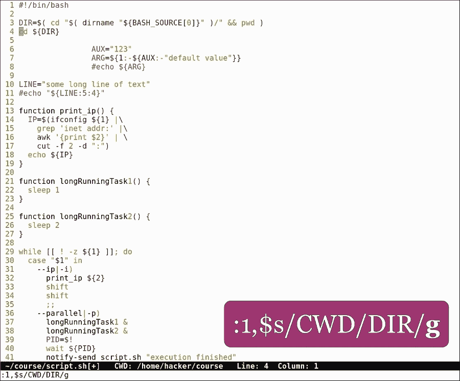

让我们再来看一个常见的例子，这在编程中经常出现：注释代码行。假设我们想要在 shell 脚本中注释掉第 10 到 20 行。要做到这一点，输入：

```
:10,20s/^/#\ /g

```

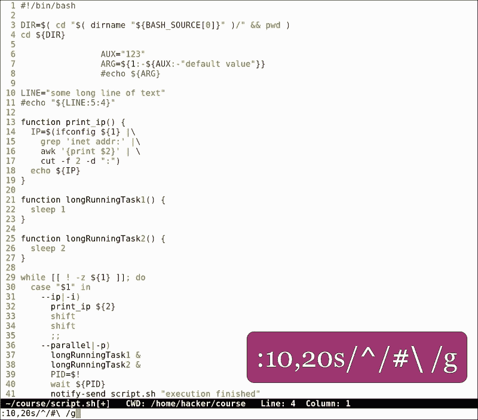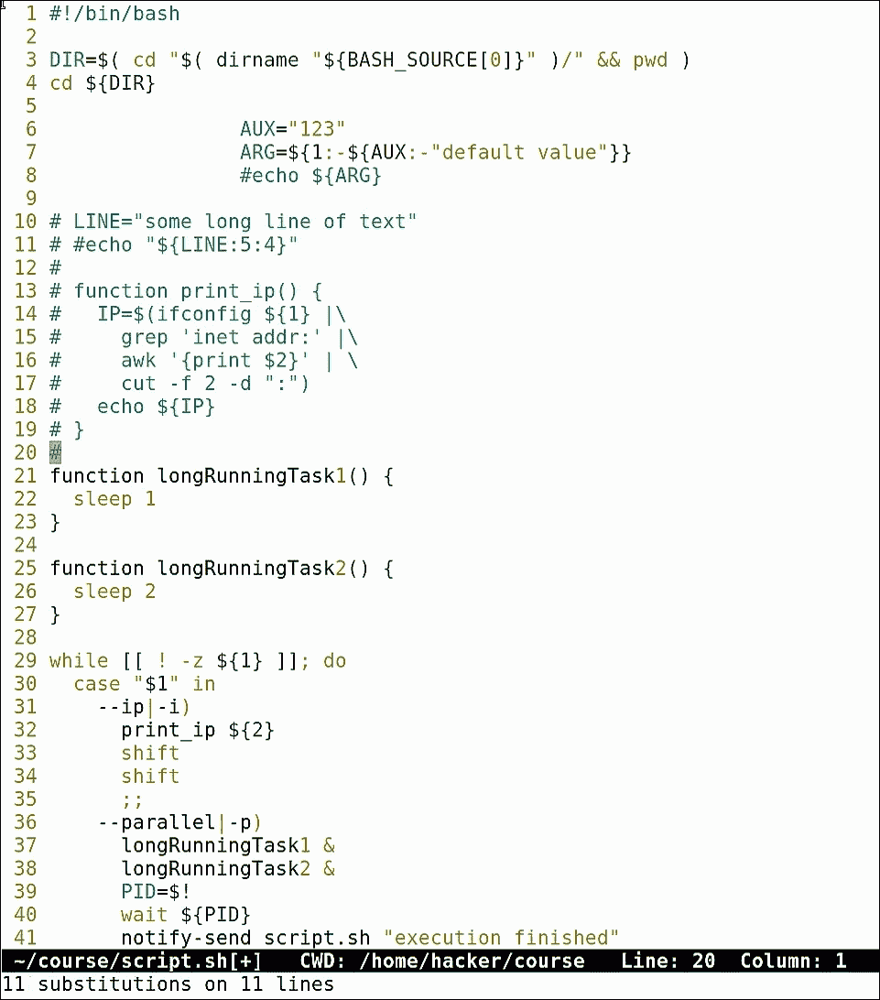

这意味着用#和空格替换行的开头。要删除文本行，请输入：

```
:30,$d

```

这将删除从第 30 行到末尾的所有内容。

有关正则表达式的更多信息可以在各章节中找到。还可以查看关于`sed`的部分，以获取更多的文本操作示例。这些命令是 Vim 中最长的命令之一，我们经常会弄错。要编辑我们刚刚写的命令并再次运行它，我们可以通过按下*q:*打开命令历史记录，然后导航到包含要编辑的命令的行，按下 Insert 键，更新该行，然后按下*Esc*和*Enter*运行命令。就是这么简单！

！键盘功夫

另一个经常有用的操作是排序。让我们创建一个包含未排序文本行的文件，使用经典的 lorem ipsum 文本：

```
cat lorem.txt | tr " " "\n" | grep -v "^\s*$" | sed "s/[,.]//g" > sort.txt

```

！键盘功夫

打开`sort.txt`并运行`:sort`。我们可以看到行都按字母顺序排序了。

！键盘功夫

现在让我们继续讲解窗口管理。Vim 有将屏幕分割为并行编辑文件的选项。只需输入`:split`进行水平分割，输入`:vsplit`进行垂直分割：

！键盘功夫！键盘功夫

当 Vim 分割屏幕时，它会在另一个窗格中打开相同的文件；要打开另一个文件，只需输入`:e`。好处在于我们有自动补全功能，所以我们只需按下*Tab*，Vim 就会为我们开始写文件名。如果我们不知道要选择哪些文件，我们可以直接从 Vim 中运行任意的 shell 命令，完成后再返回。例如，当我们输入`:!ls`时，shell 会打开，显示命令的输出，并等待我们按下*Enter*键返回到文件中。

在分割模式下，按下*Ctrl* + *W*可以在窗口之间切换。要关闭窗口，按下`:q`。如果要将文件另存为不同的名称（类似于其他编辑器的“另存为”命令），只需按下`:w`，然后输入新文件名，比如`mycopy.txt`。

Vim 还可以同时打开多个文件；只需在`vim`命令后指定文件列表：

```
vim file1 file2 file3

```

文件打开后，使用`:bn`移动到下一个文件。要关闭所有文件，按下`:qa`。

Vim 还有一个内置的资源管理器。只需打开 Vim 并输入`:Explore`即可。之后，我们可以浏览目录结构并打开新文件：

！键盘功夫

它还有另一个选项。让我们打开一个文件，删除其中一行，并将其保存为新名称。退出并使用`vimdiff`打开这两个文件。现在我们可以直观地看到它们之间的差异。这适用于各种更改，比起普通的 diff 命令输出要好得多。

键盘快捷键确实让使用 Vim 时有很大的不同，并开启了一个全新的可能性世界。一开始可能有点难记住，但一旦开始使用，就会像点击一个按钮一样简单。

# Vim 的插件增强

在本节中，我们将看看如何向 Vim 添加外部插件。Vim 有自己的编程语言用于编写插件，我们在编写`vimrc`文件时已经看到了一瞥。幸运的是，我们不必学习所有这些，因为我们可以想到的大部分东西都已经有插件了。为了管理插件，让我们安装插件管理器 pathogen。打开：[`github.com/tpope/vim-pathogen`](https://github.com/tpope/vim-pathogen)。

按照安装说明进行操作。如您所见，这只是一个一行命令：

```
mkdir -p ~/.vim/autoload ~/.vim/bundle && \curl -LSso ~/.vim/autoload/pathogen.vim https://tpo.pe/pathogen.vim

```

完成后，在`.vimrc`中添加 pathogen：

```
execute pathogen#infect()
```

大多数集成开发环境都会显示文件夹结构的树形布局，与打开的文件并行显示。Vim 也可以做到这一点，最简单的方法是安装名为**NERDtree**的插件。

打开：[`github.com/scrooloose/nerdtree`](https://github.com/scrooloose/nerdtree)，并按照安装说明进行操作：

```
cd ~/.vim/bundle git clone https://github.com/scrooloose/nerdtree.git

```

现在我们应该准备好了。让我们打开一个文件，输入`:NERDtree`。我们可以在这里看到当前文件夹的树状结构，可以浏览和打开新文件。如果我们想要用 Vim 替代我们的 IDE，这绝对是一个必备插件！

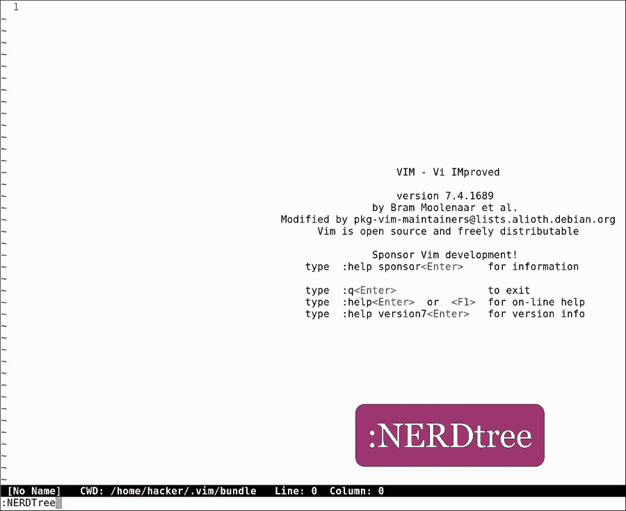

另一个非常方便的插件是称为**Snipmate**的插件，用于编写代码片段。要安装它，请访问此链接并按照说明进行操作：[`github.com/garbas/vim-snipmate`](https://github.com/garbas/vim-snipmate)。

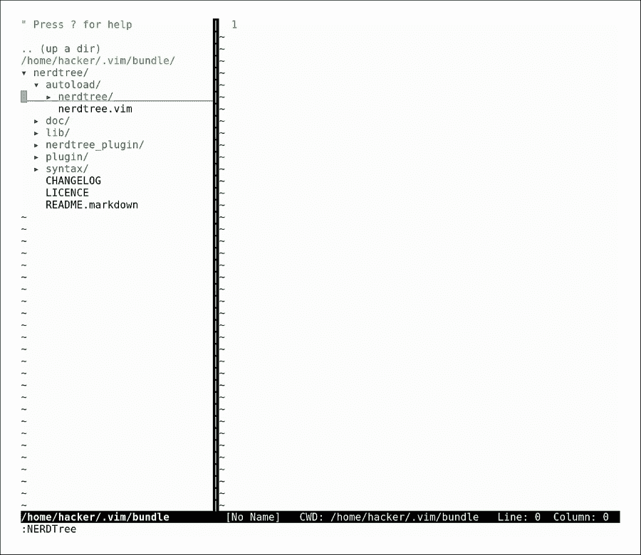

正如我们所看到的，在安装`snipmate`之前，还需要安装另一组插件：

+   `git clone https://github.com/tomtom/tlib_vim.git`

+   `git clone https://github.com/MarcWeber/vim-addon-mw-utils.git`

+   `git clone https://github.com/garbas/vim-snipmate.git`

+   `git clone https://github.com/honza/vim-snippets.git`

如果我们查看 readme 文件，可以看到一个 C 文件的示例，其中包含了`for`关键字的自动补全。让我们打开一个扩展名为.c 的文件，输入`for`，然后按下*Tab*键。我们可以看到自动补全的效果。

我们还安装了`vim-snipmate`包，其中包含了许多不同语言的代码片段。如果我们查看`~/.vim/bundle/vim-snippets/snippets/`，我们可以看到许多代码片段文件：

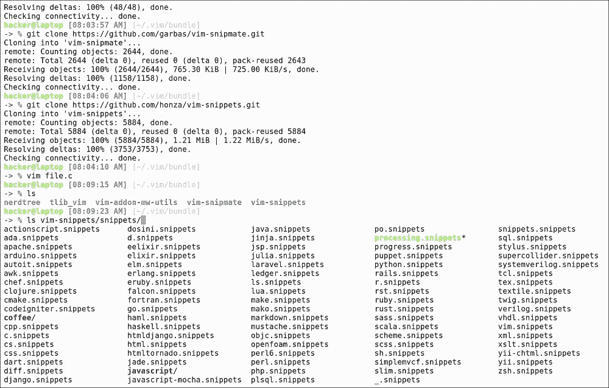

让我们来看看`javascript`的代码片段：

```
vim ~/.vim/bundle/vim-snippets/snippets/javascript/javascript.snippets

```

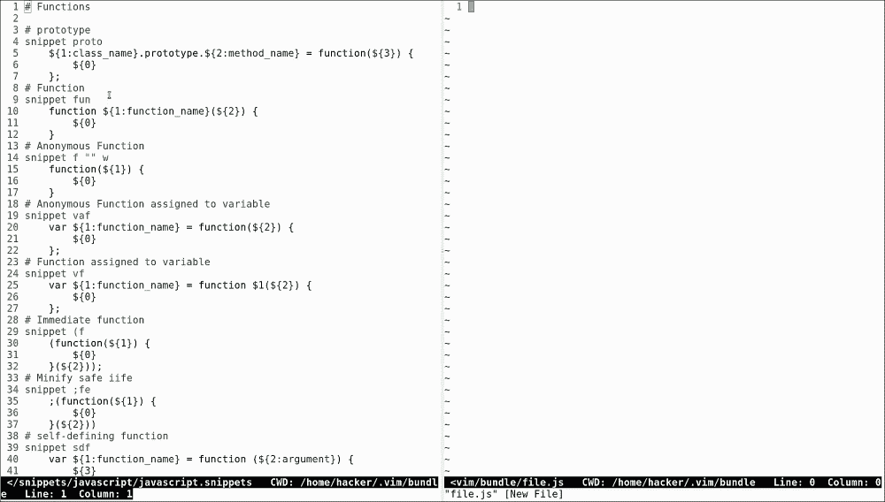

在这里我们可以看到所有可用的代码片段。输入`fun`并按下*Tab*键进行函数自动补全。代码片段预先配置了变量，这样您可以输入函数名并按下*Tab*键来进入下一个变量以完成。有一个用于编写 if-else 代码块的代码片段，一个用于编写`console.log`的代码片段，以及许多其他用于常见代码块的代码片段。学习它们的最佳方式是浏览文件并开始使用代码片段。

有很多插件可供选择。人们制作了各种插件包，保证能让您的 Vim 变得更强大。一个很酷的项目是[`vim.spf13.com/`](http://vim.spf13.com/)

它被昵称为终极 Vim 插件包，基本上包含了所有插件和键盘快捷键。这是给更高级用户使用的，所以在使用插件包之前一定要理解基本概念。记住，学习的最佳方式是手动安装插件并逐个尝试它们。

# Vim 密码管理器

Vim 还可以用于安全存储信息，通过使用不同的`cryp`方法对文本文件进行加密。要查看 Vim 当前使用的`cryp`方法，输入：

```
:set cryptmethod?
```

我们可以看到在我们的例子中是`zip`，它实际上不是一种`crypto`方法，安全性方面并不提供太多。要查看不同的替代方法，我们可以输入：

```
:h 'cryptmethod'
```

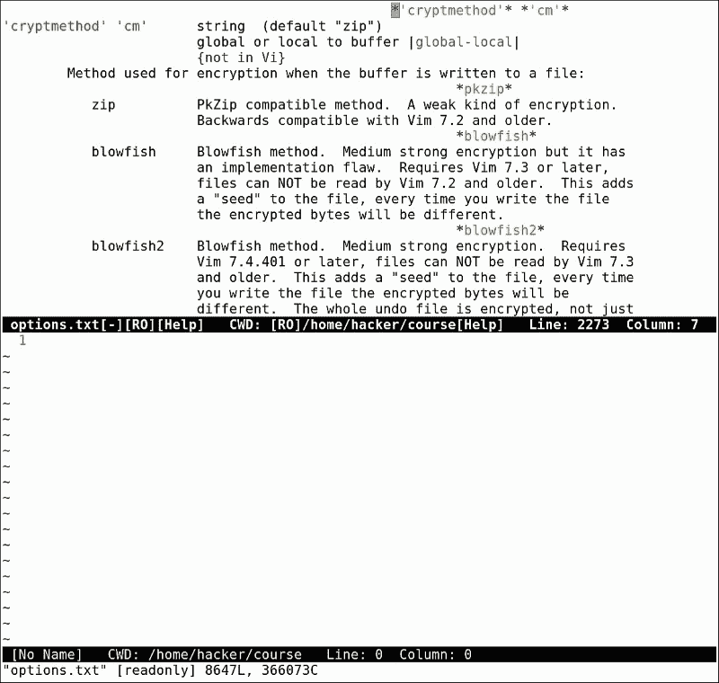

出现了一个描述不同加密方法的页面。我们可以选择`zip`、`blowfish`和`blowfish2`。最安全和推荐的方法当然是`blowfish2`。要更改加密方法，输入：

```
:set cryptmethod=blowfish2
```

这也可以添加到`vimrc`中，以便成为默认的加密方式。现在我们可以安全地使用 Vim 加密文件。

一个常见的场景是存储密码文件。

让我们打开一个名为`passwords.txt`的新文件，里面添加一些虚拟密码，并保存。下一步是用密码加密文件，我们输入`:X`。

Vim 会提示您输入密码两次。如果您在不保存文件的情况下退出，加密将不会应用。现在，再次加密它，保存并退出文件。

当我们重新打开文件时，Vim 会要求输入相同的密码。如果我们输入错误，Vim 会显示一些来自解密失败的随机字符。只有输入正确的密码，我们才能得到实际的文件内容：

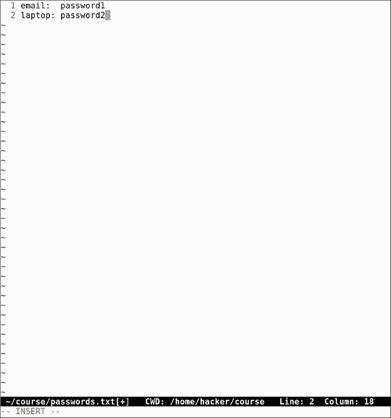

使用 Vim 保存加密文件，结合在私有的`git`仓库或私有的 Dropbox 文件夹等地方备份文件，可以是一种有效的存储密码的方式：

Vim 密码管理器

它还有一个好处，就是相对于使用相当标准且可能被破解的在线服务来说，它是一种存储密码的独特方法。这也可以称为*安全通过模糊性*。

# 即时配置恢复

我们在本章中看到的配置可能需要一些时间来手动设置，但是一旦一切都配置好了，我们可以创建一个脚本，可以立即恢复 Vim 配置。

为此，我们将到目前为止发出的所有命令粘贴到一个 bash 脚本中，可以运行该脚本以将 Vim 配置还原到完全相同的状态。这个脚本缺少的只是`home`文件夹中的`vimrc`文件，我们也可以通过一个称为 heredocs 的技术来恢复它。只需键入 cat，将输出重定向到`vimrc`，并使用 heredoc 作为输入，以`eof`为分隔符：

即时配置恢复

```
cat > ~/.vimrc << EOF
...
<vimrc content>
...
EOF

```

使用 heredocs 是在 bash 脚本中操作大块文本的常用技术。基本上，它将代码部分视为一个单独的文件（在我们的例子中是 cat 之后直到 EOF 之前的所有内容）。通过这个脚本，我们可以恢复我们所做的所有 Vim 配置，并且可以在任何我们工作的计算机上运行它，这样我们就可以立即设置好我们的 Vim！

希望您喜欢这个材料，我们在下一章见！
