# 第四章。CLI - 隐藏的配方

本章将首先关注 sed，这是一个可以吓到很多 Linux 用户的工具之一。我们将看一些基本的`sed`命令，可以将几个小时的重构工作缩短为几分钟。我们将看到如何使用 Linux 计算机定位任何文件。此外，我们还将看到当 Tmux 进入我们的技能集时，远程工作将变得更好。您可以使用最好的终端复用器运行长时间的命令，分割屏幕，并且不会丢失工作。然后，您将学习如何使用 netstat 和 nmap 等命令发现和与您的网络进行交互。最后，我们将看到 Autoenv 如何自动切换环境，以及如何使用 rm 命令通过命令行使用垃圾箱实用程序与垃圾进行交互。

在本章中，我们将涵盖以下内容：

+   了解 sed 的工作原理

+   使用 tmux，一个终端复用器

+   使用 Autoenv 自动切换环境

+   使用 rm 命令行删除文件或目录

# Sed – one-liner productivity treasure

如果一张图片价值 1000 个字，那么 sed 一行命令绝对相当于一千行代码！在 Linux CLI 中，最令人恐惧的命令之一就是，你猜对了，sed！由于其晦涩的用法，它一直被程序员和系统管理员所恐惧，但它可以作为一个非常强大的工具，快速编辑大量的数据。

我们创建了五个文件来演示这个强大工具的功能。第一个文件是一个简单的文件，包含了一行谦虚的文本：*橙色是新的黑色*。让我们从创建一个简单的`sed`命令开始，将单词*black*替换为*white*。

sed 的第一个参数是替换命令。它由 3 个`/`分成 3 个部分。第一部分是`s`表示替换，第二部分是要替换的单词，在我们的例子中是`black`，第三部分是替换后的单词`white`。

第二个参数是输入，对我们来说是一个文件：

```
sed "s/black/white/" 1.txt

```

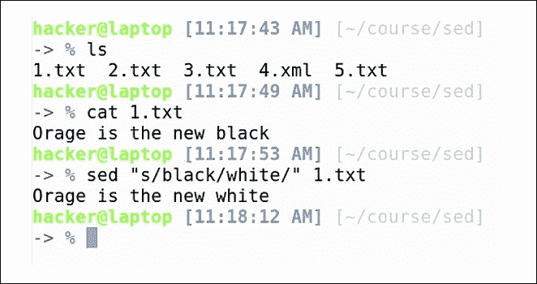

现在，结果将被打印在屏幕上，您可以看到单词 black 已被替换为 white。

我们的第二个示例包含另一行文本，这次包含了大小写都为黑色的单词。如果我们使用这个新文件运行相同的命令，我们将看到它只替换与大小写匹配的单词。如果我们想进行不区分大小写的替换，我们将在`sed`命令的末尾添加两个字符；`g`和`l`。

+   `g`：表示全局替换，用于替换文件中的所有出现。如果没有这个参数，它只会替换第一个参数。

+   `l`：表示不区分大小写搜索。

```
sed "s/black/white/gI" 2.txt

```

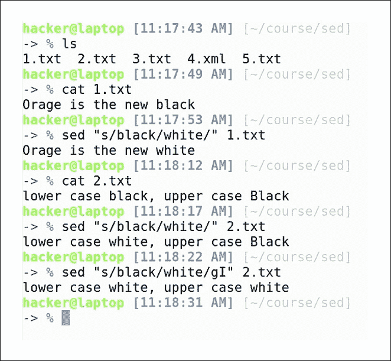

正如您所看到的，两个单词都被替换了。如果我们想将结果保存在文件中而不是打印到屏幕上，我们使用`-i`参数，它表示内联替换。

在某些情况下，我们可能还希望保存我们的初始文件，以防我们在`sed`命令中出现错误。为此，我们在`-i`之后指定一个后缀，它将创建一个备份文件。在我们的例子中，我们使用`.bak`后缀：

```
sed -i.bak "s/black/white/g" 2.txt

```

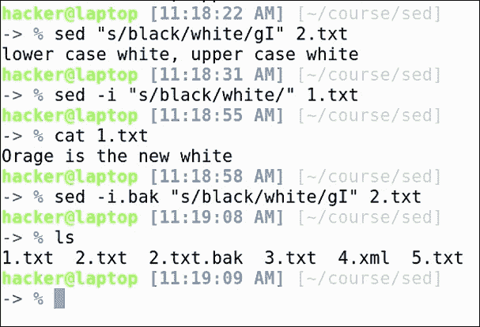

如果我们检查文件的内容，我们可以看到初始文件包含更新后的文本，备份文件包含原始文本。

现在，让我们看一个更实际的例子。假设我们有一个包含多个变量的 shell 脚本，我们想用花括号括起来：

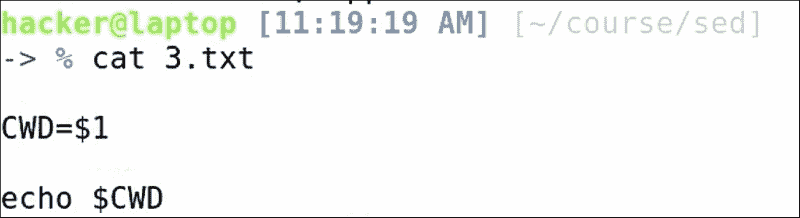

为了实现这个，我们将写下以下命令：

+   `s`：表示替换。

+   `g`：表示全局；意思是替换所有找到的出现。

+   `\$`：匹配以美元符号开头的所有字符串。这里需要转义美元符号，以免与*行的开头*锚点混淆。

+   我们将在`$`后面的字符串括起来，这样我们就可以在命令的替换部分中引用它。

+   `[ ]`：用于指定一系列字符

+   `A-Z`：它匹配所有大写字符

+   `0-9`：它匹配所有数字

+   `_`：它匹配`_`

+   `\+`：在`[ ]`中的任何字符必须出现一次或多次

在替换部分，我们将使用：

+   `\$`：美元符号

+   `{ }`：我们要添加的花括号。

+   `\1`：之前在( )中匹配的字符串

```
sed 's/\$\([A-Z0-9_]\+\)/\${\1}/g' 3.txt

```

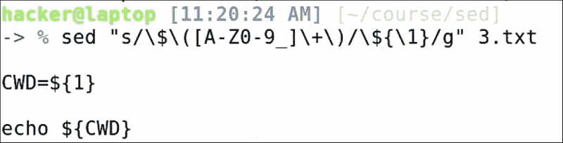

其他常见的情况是替换`xml`或`html`文件中的内容。

这里我们有一个带有`<strong>`文本的基本 html 文件。现在，我们知道`<strong>`文本对于搜索引擎优化具有更多的语义价值，所以也许我们想让我们的强调标签成为一个简单的`<b>`（加粗），并手动决定页面上的`<strong>`单词。为此，我们说：

+   `s`：这是用于替换的。

+   `<strong`：我们要搜索的实际文本。

+   `\(\)`：这将再次用于选择一段文本，然后将其添加回去。

+   `.*`：这意味着任何字符，出现任意次数。我们想选择"`<strong`"和"`strong>`"之间的所有内容。

+   `</`：这是标签的关闭。我们要保持它不变。

+   `<b\1b>`：只需添加`<b b>`，以及之前在`( )`中找到的文本。

```
sed "s/<strong\(.*</\)strong>/<b\1b>/g" 4.xml

```

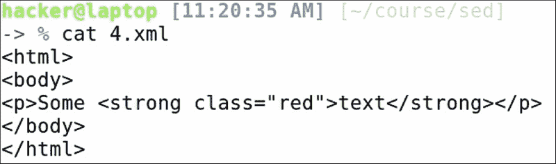

正如你所看到的，文本被正确更新，`red`类仍然适用于新标签，旧文本仍然包含在我们的标签之间，这正是我们想要的：

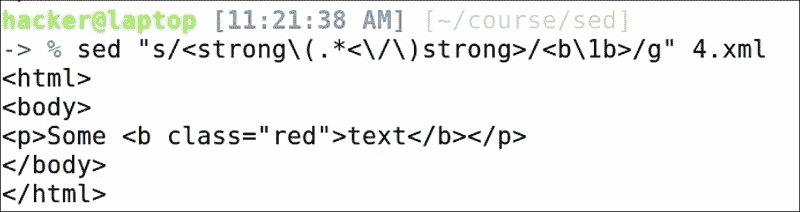

除了替换，sed 还可以用于删除文本行。我们的`5.txt`文件包含了`lorem ipsum`文本中的所有单词。如果我们想删除第三行的文本，我们将发出以下命令：

```
sed -i 3d 5.txt

```

按下*:e,*在 vim 中重新加载文件，我们可以看到单词`dolor`不再存在。例如，如果我们想删除文件的前 10 行，我们只需运行：

```
sed -i 1,10d 5.txt

```

按下*:e*，你会看到这些行不再存在。对于我们的最后一个例子，如果我们向下滚动，我们可以看到多个空行。可以使用以下命令删除这些行。

```
sed -i "/^$/d" 5.txt

```

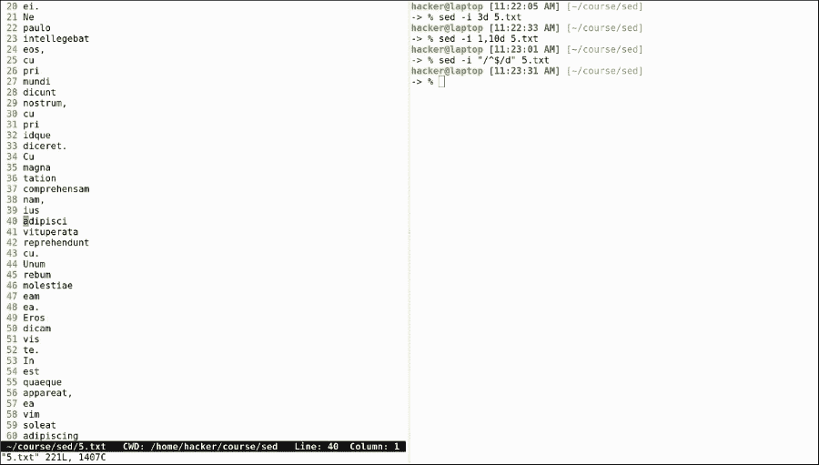

它代表：

+   `^`：行首锚点

+   `$`：行尾锚点

+   `d`：删除

重新加载文件，你会看到这些行不再存在。

现在，正如你所想象的那样，这只是一些基本的例子。sed 的功能远远超过这个，使用它的可能性比我们今天看到的还要多得多。我们建议你对今天介绍的功能有一个很好的理解，因为这些功能可能是你最常使用的。它并不像一开始看起来那么复杂，在许多场景中非常方便。

# 你可以逃跑，但你无法躲避...来自 find

数十个项目，数百个文件夹和数千个文件；这个场景听起来熟悉吗？如果答案是“是”，那么你可能不止一次发现自己无法找到特定的文件。`find`命令将帮助我们在项目中定位任何文件以及更多其他功能。但首先，为了创建一个快速的游乐场，让我们从 GitHub 下载 electron 开源项目：

Git 克隆[`github.com/electron/electron`](https://github.com/electron/electron)

然后`cd`进入它：

```
cd electron

```

我们在这里看到了许多不同的文件和文件夹，就像在任何一个正常大小的软件项目中一样。为了找到一个特定的文件，比如`package.json`，我们将使用：

```
find . -name package.json

```

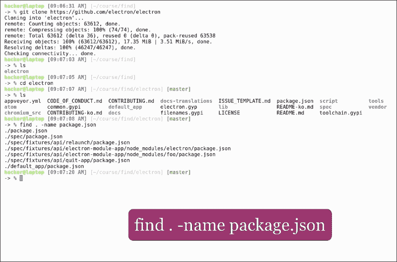

`.`：这在当前文件夹中开始搜索

`-name`：这有助于搜索文件名

如果我们要在项目中查找所有的 readme 文件，前面的命令格式是没有帮助的。我们需要发出一个不区分大小写的查找命令。为了演示目的，我们还将创建一个`readme.md`文件：

```
touch lib/readme.md

```

我们还将使用`-iname`参数进行不区分大小写的搜索：

```
find . -iname readme.md

```

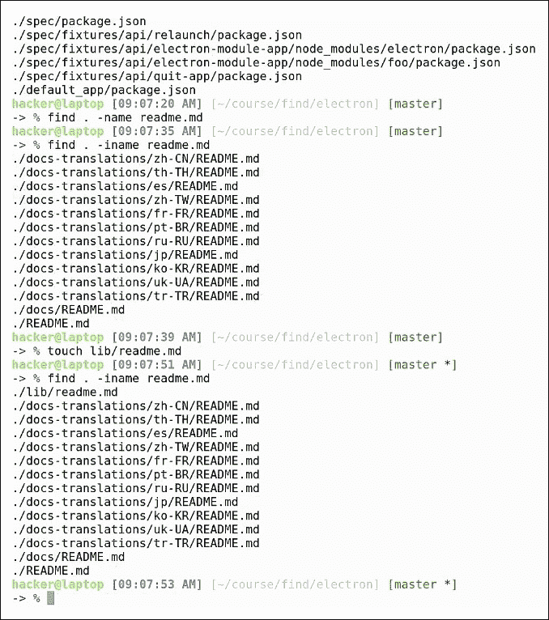

你可以看到这里找到了`readme.md`和`README.md`。现在，如果我们要搜索所有 JavaScript 文件，我们将使用：

```
find . -name "*.js"

```

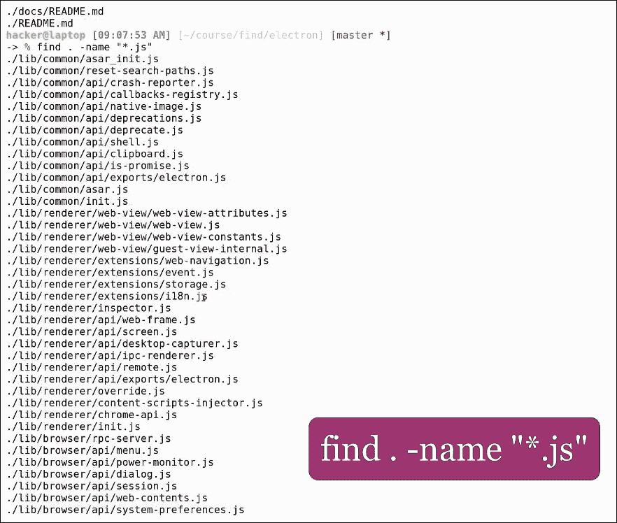

正如你所看到的，有相当多的结果。为了缩小结果范围，让我们将 find 限制在`default_app`文件夹中：

```
find default_app -name "*.js"

```

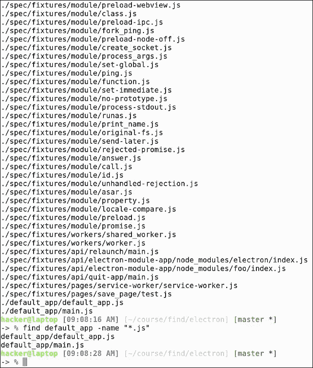

正如你所看到的，这个文件夹中只有两个`js`文件。如果我们要找到所有不是 JavaScript 的文件，只需在名称参数之前加上`!`标记：

```
find default_app ! -name "*.js"

```

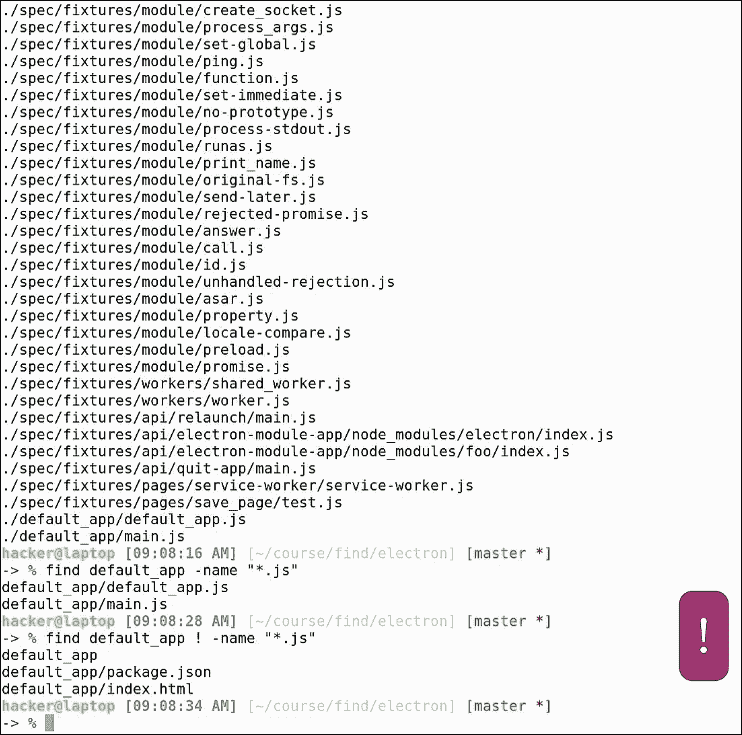

你可以看到这里所有不以`js`结尾的文件。如果我们要查找目录中的所有类型为文件的 inode，我们将使用`-type f`参数：

```
find lib -type f

```

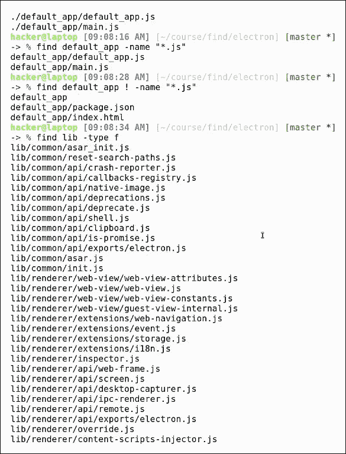

同样，我们可以使用`-type d`来查找特定位置的所有目录：

```
find lib -type d

```

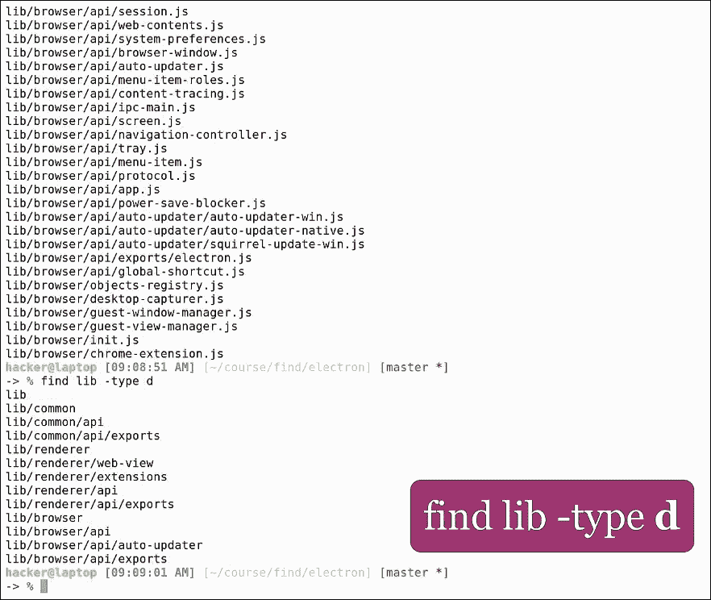

Find 还可以根据时间标识符定位文件。例如，为了找到在`/usr/share`目录中在过去 24 小时内修改的所有文件，执行以下命令：

```
find /usr/share -mtime -1

```

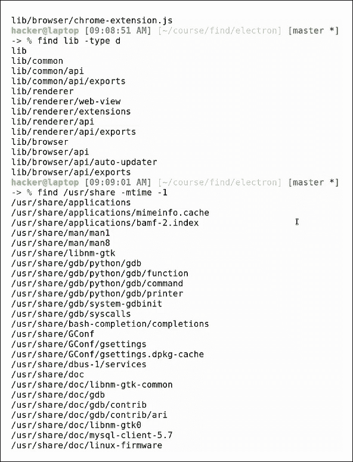

我有一个相当长的列表。你可以看到`-mtime -3`扩大了列表。

如果我们要找到最近一小时内修改的所有文件，我们可以使用`-mmin -60`：

```
find ~/.local/share -mmin -60

```


一个好的搜索文件夹是`~/.local/share`，如果我们使用`-mmin -90`，列表会再次扩大。

使用`-atime -1`参数，find 还可以显示在过去 24 小时内访问的文件列表，如下所示：

```
find ~/.local/share -atime -1

```


在处理大量项目文件时，有时候在某些项目中会保留空文件，并且我们忘记删除它们。为了定位所有空文件，只需执行以下操作：

```
find . -empty

```

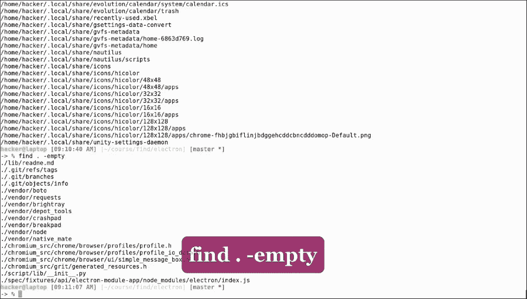

正如我们所看到的，electron 有一些空文件。Find 还会显示空目录或链接。

删除空文件将保持我们的项目清洁，但是当涉及到减小大小时，我们有时想知道哪些文件占用了大部分空间。Find 还可以根据文件大小进行搜索。例如，让我们找到所有大于`1`兆字节的文件：

```
find . -size +1M

```

使用-1M 可以缩小范围。

正如我们在开始时所说，find 可以做比在项目中定位文件更多的事情。使用`-exec`参数，它可以与几乎任何其他命令结合使用，从而使其具有几乎无限的功能。例如，如果我们想要找到所有包含文本`manager`的`javascript`文件，我们可以将 find 与`grep`命令结合使用，命令如下：

```
find . -name "*.js" -exec grep -li 'manager' {} \;

```

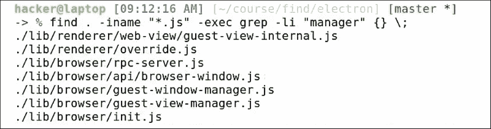

这将在 find 返回的所有文件上执行 grep 命令。让我们还使用 vim 在文件中搜索，以便验证结果是否正确。正如你所看到的，这个文件中出现了文本"manager"。你不必担心`{} \;`，它只是标准的-exec 语法。

继续实际示例，假设你有一个文件夹，你想删除在过去 100 天内修改的所有文件。我们可以看到我们的`default_app`文件夹包含这样的文件。如果我们将 find 与`rm`结合使用，如下所示：

```
find default_app -mtime -100 -exec rm -rf {} \;

```

我们可以进行快速清理。Find 可以用于智能备份。例如，如果我们要备份项目中的所有`json`文件，我们将使用管道和标准输出重定向将 find 与`cpio`备份实用程序结合使用：

```
find . -name "*.json" | cpio -o > backup.cpio

```

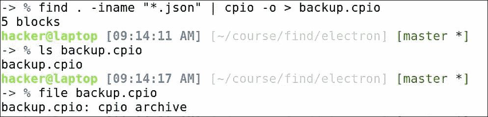

我们可以看到这个命令创建了一个`backup.cpio`文件，类型为`cpio`归档文件。

现在这可能也可以用`-exec`来写，但是你必须明白管道也可以在这种情况下使用，以及重定向。

在生成报告时，您可能需要计算所写行数：

+   为了做到这一点，我们将 find 与`wc -l`结合起来：

```
find . -iname "*.js" -exec wc -l {} \; 

```

+   这将给出我们所有的`js`文件和行数。我们可以将其传递给 cut：

```
find . -iname "*.js" -exec wc -l {} \; | cut -f 1 -d ' ' 

```

+   只输出行数，然后将其传递给 paste 命令，我们可以这样做：

```
find . -iname "*.js" -exec wc -l {} \; | cut -f 1 -d ' ' | paste -sd+ 

```

+   上面的命令将使用`+`符号作为分隔符合并所有行。当然，这可以转换为一个算术运算，我们可以使用二进制计算器（`bc`）来计算：

```
find . -iname "*.js" -exec wc -l {} \; | cut -f 1 -d ' ' | paste -sd+ | bc

```

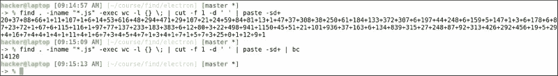

这个最后的命令将告诉我们我们的`javascript`文件包含多少行。当然，这些不是实际的代码行，因为它们可能是空行或注释。要精确计算代码行数，可以使用`sloc`实用程序。

为了批量重命名文件，比如将所有的`js`文件的文件扩展名改为`node`，我们可以使用以下命令：

```
find . -type f -iname "*.js" -exec rename "s/js$/node/g" {} \;

```

你可以看到重命名的语法与 sed 非常相似。此外，没有剩余的`.js`文件了，因为所有文件都已重命名为`.node`：

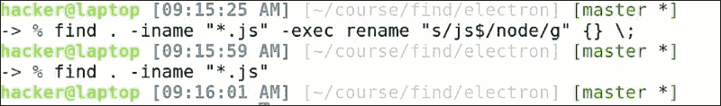

一些软件项目要求所有源代码文件都有版权头。由于一开始不需要这个，所以我们经常会发现我们必须在所有文件的开头添加版权信息的情况。

为了做到这一点，我们可以将 find 与 sed 结合起来，像这样：

```
find . -name "*.node" -exec sed -i "1s/^/\/** Copyright 2016 all rights reserved *\/\n/" {} \;

```

基本上，这个命令告诉计算机找到所有的`.node`文件，并在每个文件的开头添加版权声明，然后换行。

我们可以检查一个随机文件，是的，版权声明在那里：

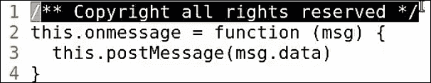

更新所有文件的版本号：

```
find . -name pom.xml -exec sed -i "s/<version>4.02/<version>4.03/g" {} \;

```

正如你可以想象的那样，find 有很多用途。我给你展示的例子只是冰山一角。学习 find，以及`sed`和`git cli`可以让你摆脱 IDE 的束缚，无论是查找、重构还是使用`git`，都可以更轻松地切换到其他 IDE，因为你不需要学习所有的功能。你只需要使用友好的 CLI 工具。

# tmux - 虚拟控制台、后台作业等

在本节中，我们将介绍另一个非常好用的工具，叫做 tmux。当在远程`ssh`会话中工作时，tmux 非常方便，因为它可以让你从上次离开的地方继续工作。如果你在 Mac 上工作，无法安装 terminator，它还可以替代 terminator 的一些功能。

要在 Ubuntu 上开始使用`tmux`，我们首先需要安装它：

```
sudo apt install tmux

```

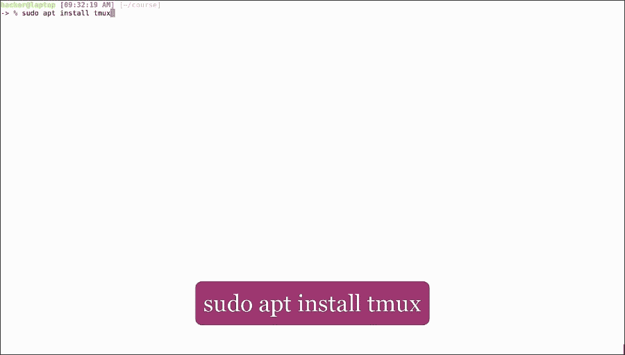

然后只需运行命令：

```
tmux

```

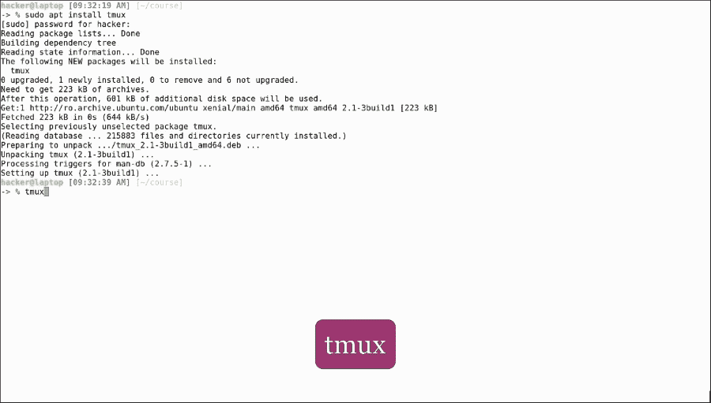

然后你将发现自己在一个全新的虚拟控制台中：

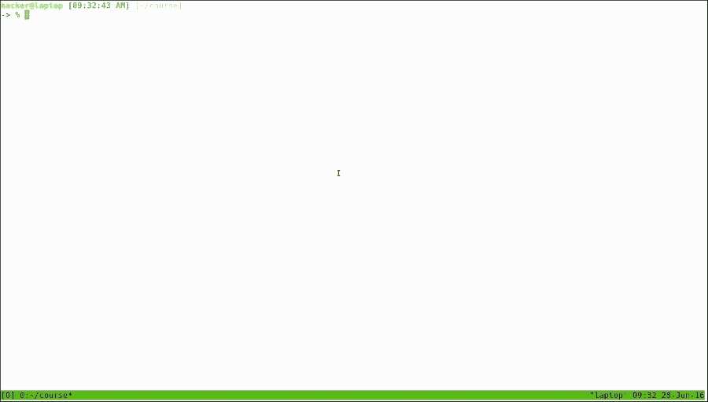

为了演示目的，我们将打开一个新的选项卡，你可以使用`tmux ls`命令查看打开的会话列表：

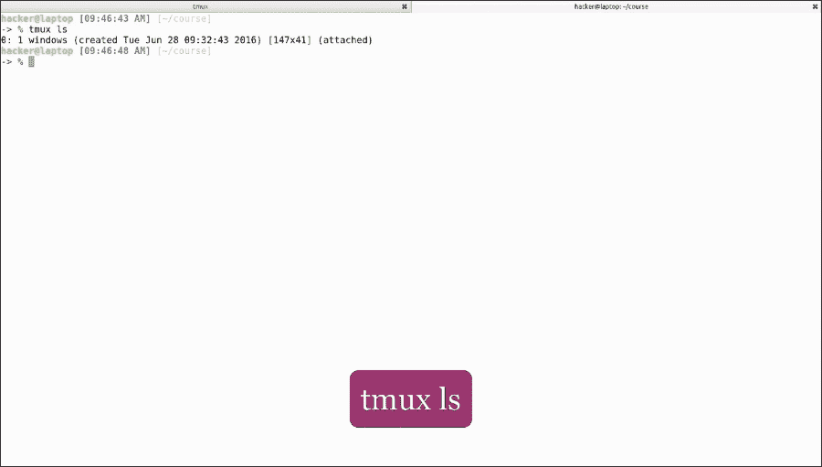

让我们开始一个新的`tmux`命名会话：

```
tmux new -s mysession

```

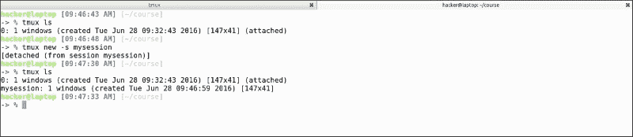

在这里我们可以看到打开一个`tmux`会话会保持当前目录。要在`tmux`内部列出和切换`tmux`会话，按下*Ctrl* + *B* *S*。

我们可以看到我们可以切换到另一个 tmux 会话，在其中执行命令，然后如果需要的话切换回我们的初始会话。要分离（保持会话运行并返回到正常终端），按下*Ctrl* + *b d*；

现在我们可以看到我们有两个打开的会话。

附加到会话：

```
tmux a -t mysession

```

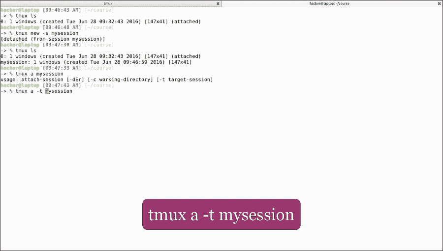

当您登录到远程服务器并希望执行长时间运行的任务，然后离开并在任务结束时返回时，此场景非常方便。我们将使用一个名为 infinity.sh 的快速脚本来复制此场景。我们将执行它。它正在写入标准输出。现在让我们从 tmux 中分离出来。

如果我们查看脚本，它只是一个简单的无限循环，每秒打印一次文本。

现在当我们回到会话时，我们可以看到脚本在我们分离会话时正在运行，并且仍然将数据输出到控制台。我将通过按下*Ctrl* + *c*手动停止它。

好了，让我们进入我们的第一个 tmux 会话并关闭它。为了手动终止正在运行的 tmux 会话，请使用：

```
tmux kill-session -t mysession

```

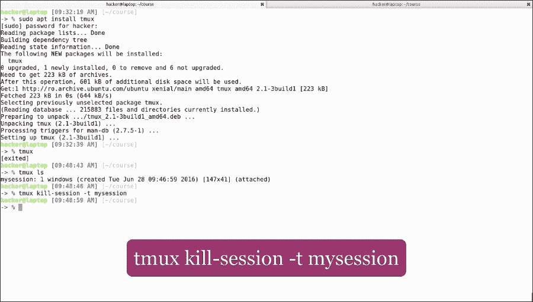

这将终止当前会话。如果我们切换到第二个标签，我们可以看到我们已经从 tmux 注销了。让我们也关闭这个 terminator 标签，并打开一个全新的 tmux 会话：

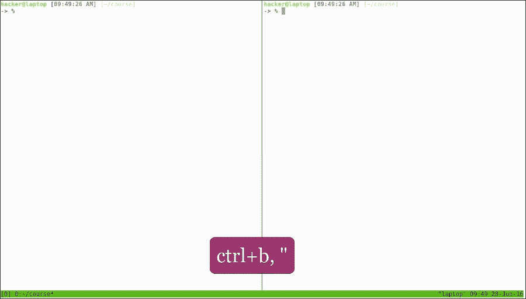

Tmux 使您有可能像 terminator 一样水平地拆分屏幕，使用*Ctrl* + *b* + "，垂直拆分屏幕使用*Ctrl* + *b* + *%*。之后，使用*Ctrl* + *b* +箭头在窗格之间导航：

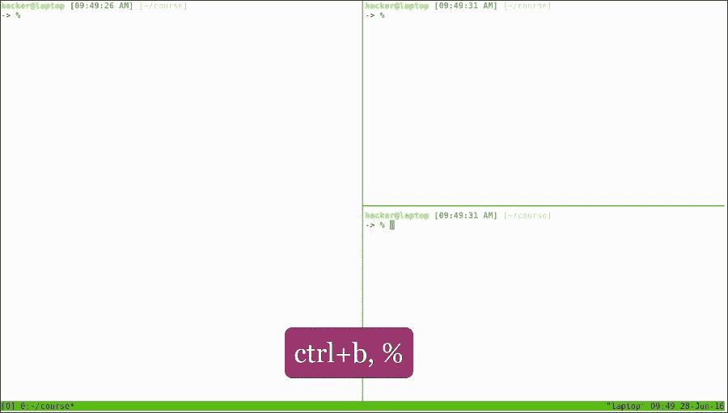

您还可以创建窗口（选项卡）：

+   *Ctrl* + *b c*：创建：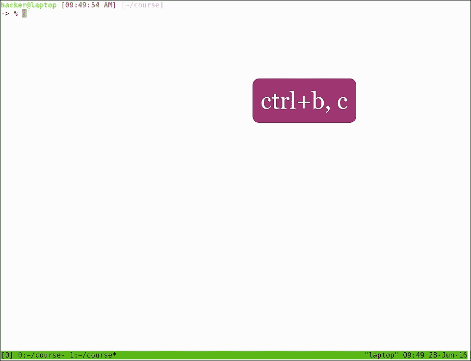

+   *Ctrl* + *b w*：列表：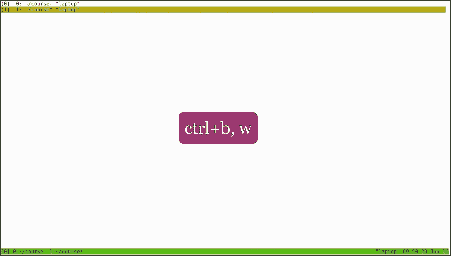

+   *Ctrl* + *b &*：删除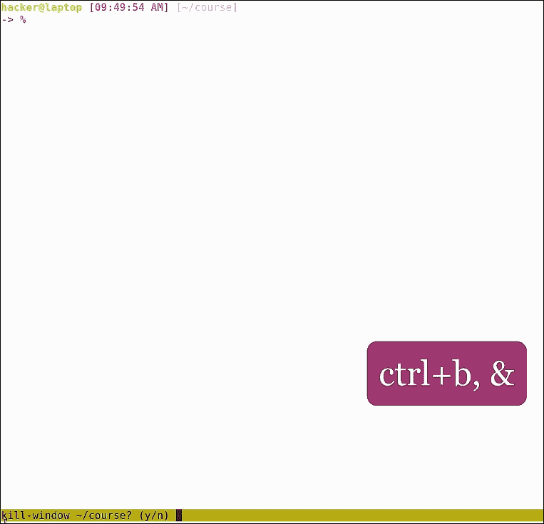

这些功能与 terminator 提供的功能非常相似。

您可以在需要在远程`ssh`连接中拥有两个或多个窗格甚至选项卡的情况下使用 tmux，但您不想打开多个`ssh`会话。您也可以在本地使用它作为 terminator 的替代品，但是键盘快捷键的使用要困难得多。虽然它们可以更改，但您将失去在远程使用 tmux 的选项，因为不鼓励在另一个 tmux 会话中打开 tmux 会话。此外，配置新的 tmux 键盘快捷键可能会使 tmux 在处理大量服务器时变得繁琐，因为快捷键的差异。

# 网络-谁在监听？

在处理网络应用程序时，能够查看开放的端口和连接，并能够与不同主机上的端口进行交互以进行测试是非常方便的。在本节中，我们将介绍一些网络基本命令以及它们在什么情况下可能会派上用场。

第一个命令是`netstat`：

```
netstat -plnt

```

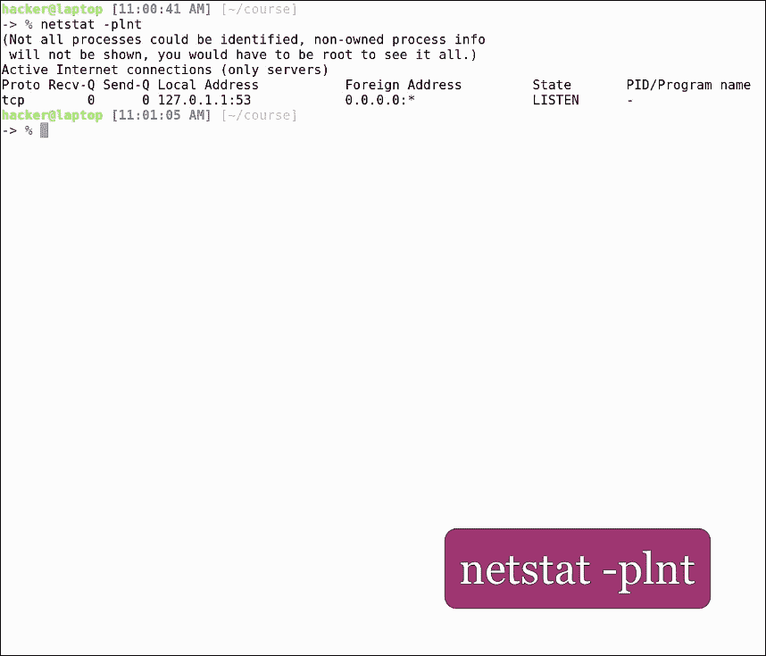

这将显示主机上所有打开的端口。您可以在这里看到，在默认的 Ubuntu 桌面安装中，我们只有一个打开的端口，即端口`53`。我们可以在特殊文件`/etc/services`中查找此信息。此文件包含程序和协议的所有基本端口号。我们在这里看到端口`53`是 DNS 服务器：

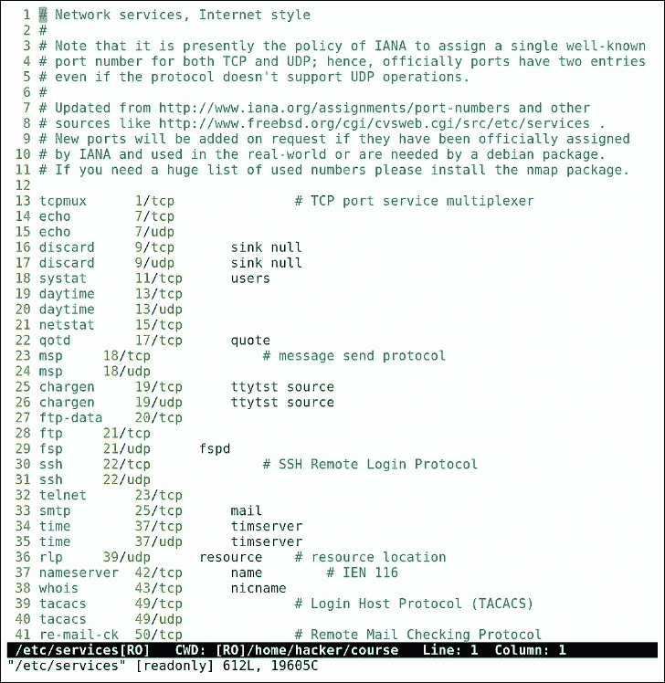

仅通过分析输出，我们无法确定哪个程序正在监听此端口，因为此进程不属于当前用户。这就是为什么*PID/程序名称*列为空的原因。如果我们使用`sudo`再次运行相同的命令，我们会看到此进程被命名为`dnsmasq`，如果我们想要更多信息，可以在 man 页面中查找。它是一个轻量级的 DHCP 和缓存 DNS 服务器：

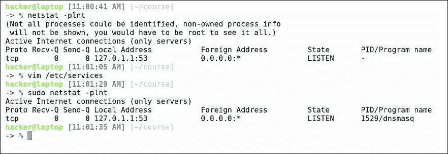

从此命令中获取的其他有用信息：

+   程序协议，在这种情况下是 dhcp。

+   未复制的总字节。

+   未确认的总字节。

+   本地和外部地址和端口。获取端口是我们使用此命令的主要原因。这对于确定端口是仅在本地主机上打开还是在网络上监听传入连接也很重要。

+   端口的状态。通常为**LISTEN**。

+   PID 和程序名称，这有助于我们确定哪个程序在监听哪个端口。

现在，如果我们运行一个应该在特定端口上监听的程序，而我们不知道它是否工作，我们可以通过`netstat`找出。让我们通过运行以下命令来打开最基本的 HTTP 服务器：

```
python -m SimpleHTTPServer

```

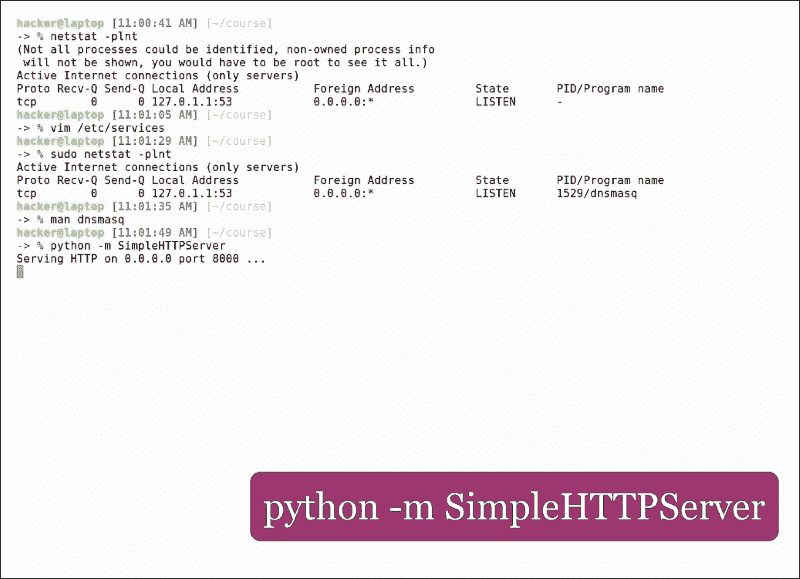

从输出中可以看到，它在接口`0.0.0.0`上的端口`8000`上进行监听。如果我们打开一个新的窗格并运行`netstat`命令，我们将看到打开的端口和 PID/名称。

您可能已经知道这一点，但为了安全起见，我们将在我们的机器上添加不同的主机名作为静态`dns`条目。这在开发需要连接到服务器的应用程序时非常有用，而服务器更改其 IP 地址时，或者当您想在本地机器上模拟远程服务器时。为此，我们输入：

```
sudo vim /etc/hosts

```

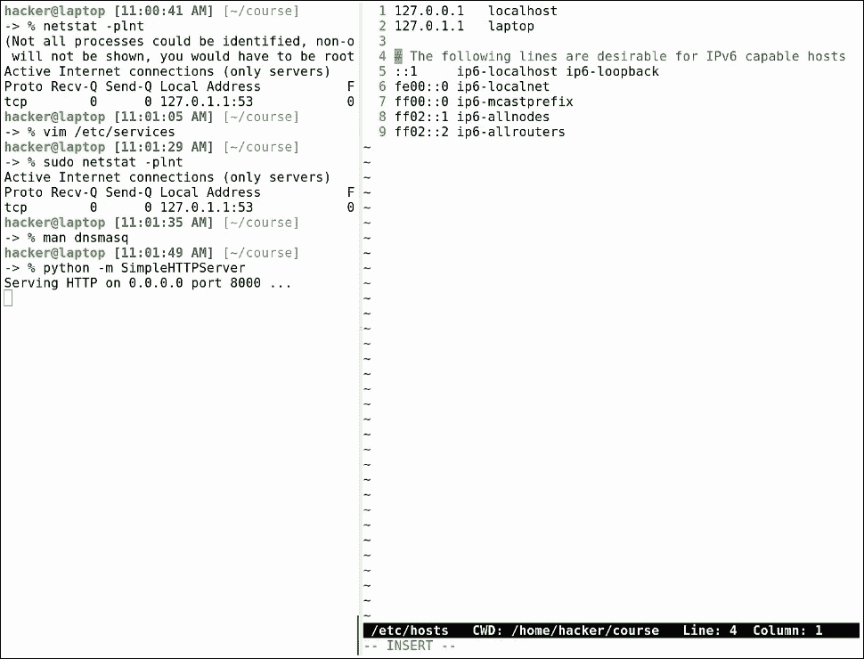

您可以从现有内容快速了解文件的格式。让我们为本地主机添加一个别名，以便我们可以使用不同的名称访问它。添加以下行：

```
127.0.0.1     myhostname.local

```

我们建议在本地主机上使用不存在的顶级域名，例如.local 或.dev。这是为了避免覆盖任何现有地址，因为`/etc/hosts`在`dns`解析中具有优先权。现在，如果我们在浏览器中打开端口`8000`的地址，我们将看到我们的本地 Python 服务器正在运行并提供内容。

下一个命令是`nmap`。正如你所看到的，它在 Ubuntu 上默认没有安装，所以让我们通过输入以下命令来安装它：

```
sudo apt install nmap 

```

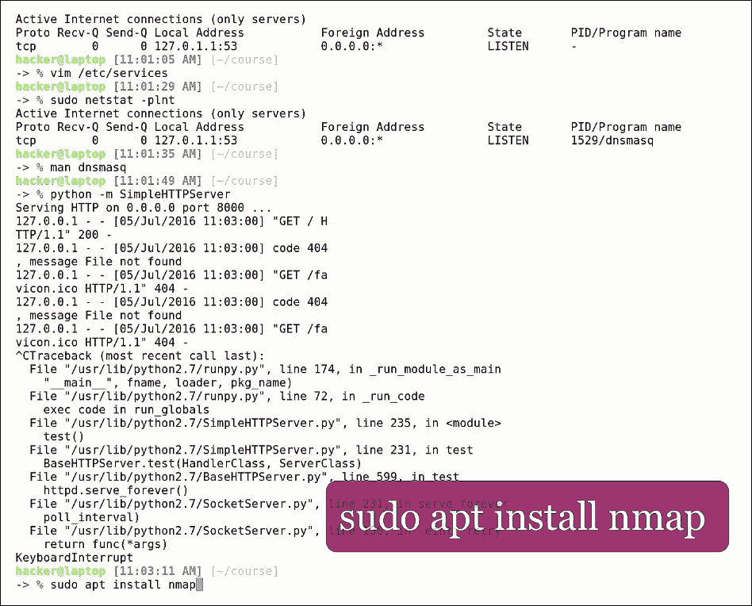

Nmap 是一个用于检查远程主机上所有开放端口的命令，也称为端口扫描器。如果我们在我们的网络网关上运行`nmap`，在我们的情况下是`192.68.0.1`，我们将获得网关上的所有开放端口：

类型：**nmap 192.168.0.1**

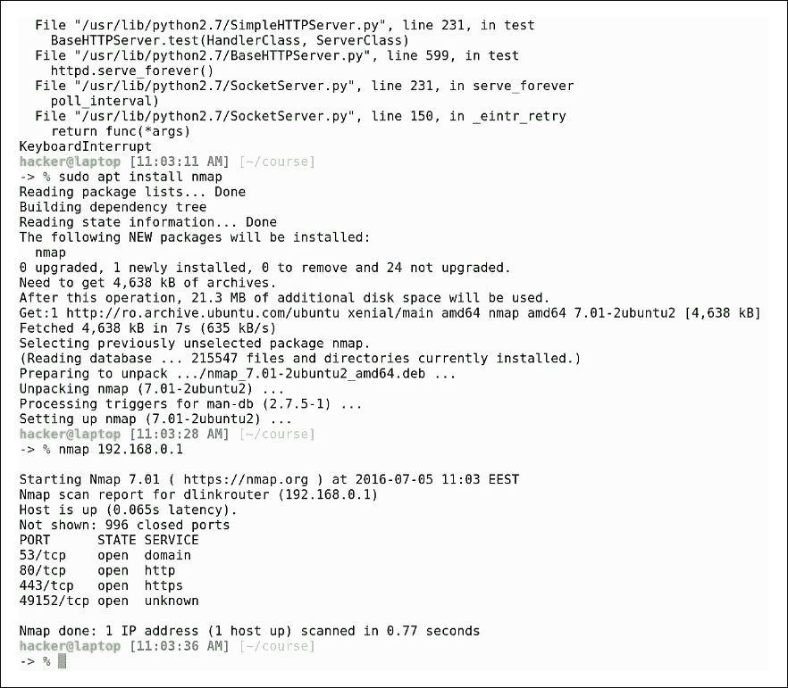

正如您所看到的，这里再次打开了`dns`端口，http 和 https 服务器，它们用作配置路由器的网页，以及端口`49152`，此时不特定于任何常见协议，因此被标记为未知。Nmap 无法确定这些特定程序是否实际在主机上运行；它所做的只是验证哪些端口是开放的，并写入通常在该端口上运行的默认应用程序。

如果我们不确定要连接到哪个服务器，或者我们想知道当前网络中有多少服务器，我们可以在本地网络地址上运行`nmap`，将网络掩码指定为目标网络。我们从`ifconfig`获取此信息；如果我们的 IP 地址是`192.168.0.159`，我们的网络掩码是`255.255.255.0`，那么命令将如下所示：

```
nmap -sP 192.168.0.0/24

```

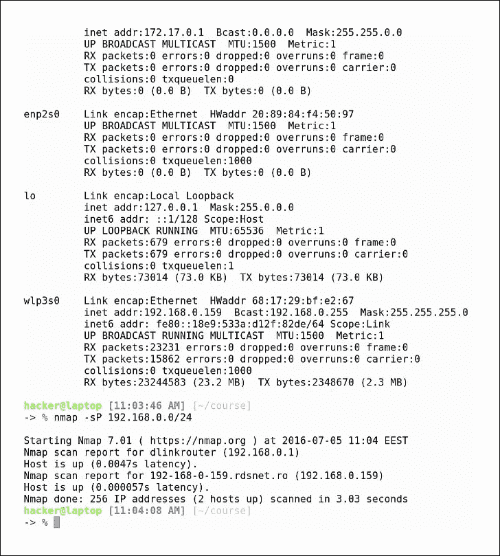

在`/24 = 255.255.255.0`中，基本上网络将具有从`192.168.0.0`到`192.168.0.255`的 IP 地址。我们在这里看到有三个活动主机，甚至还给出了延迟，因此我们可以确定哪个主机更近。

当开发客户端-服务器应用程序时，Nmap 非常有用，例如，当您想查看服务器上可以访问的端口时。但是，`nmap`可能会错过非标准的应用程序特定端口。要实际连接到给定端口，我们将使用预安装在 Ubuntu 桌面上的 telnet。只需输入主机名，后跟端口，即可查看特定端口是否接受连接。

```
telnet 192.168.0.1 80

```

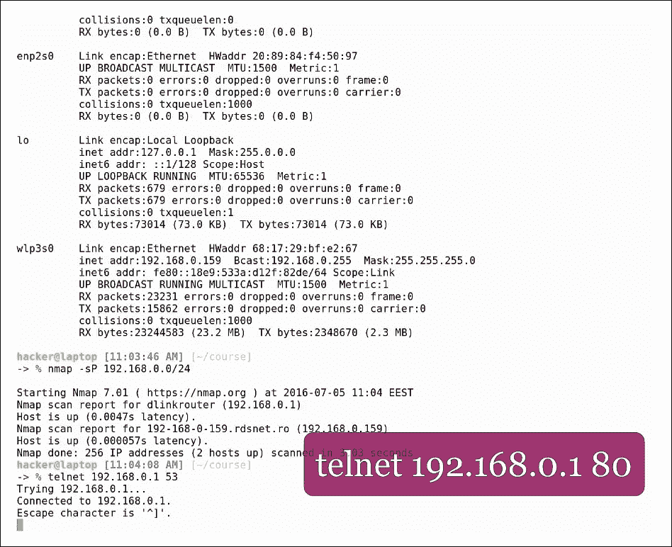

如果端口正在监听并接受连接，telnet 将输出如下消息：

+   尝试`192.168.0.1`...

+   连接到`192.168.0.1`

+   转义字符是`^]`

这意味着您也可以从您的应用程序进行连接。所以如果您在连接时遇到困难，通常是客户端的问题；服务器工作正常。

要退出 telnet，按下：*Ctrl* +*]*，然后按下*Ctrl* + *d*。

此外，在某些情况下，我们需要获取特定主机名的 IP 地址。最简单的方法是使用 host 命令：

```
host ubuntu.com

```

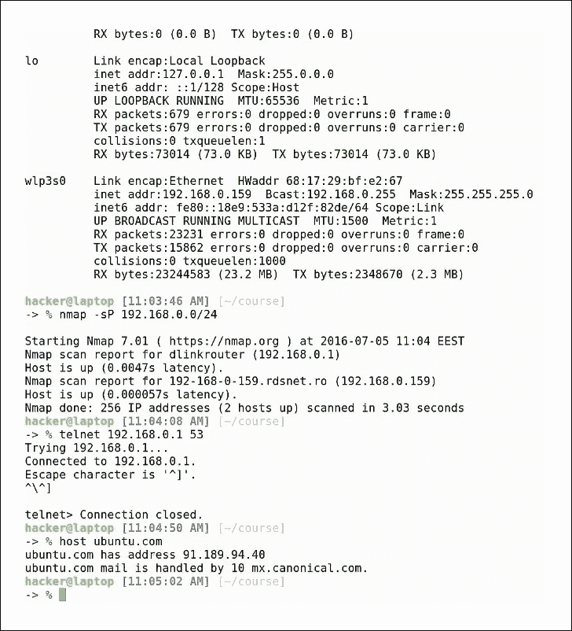

我们只学习了基础知识，你需要的最低限度的元素，以便开始使用主机名和端口进行工作。为了更深入地了解网络和数据包流量，我们建议查看渗透测试或网络流量分析工具（如 Wireshark）的课程。这是一个这样的课程：[`www.packtpub.com/networking-and-servers/mastering-wireshark"`](https://www.packtpub.com/networking-and-servers/mastering-wireshark)。

# Autoenv - 设置一个持久的、基于项目的环境

项目与项目之间不同，环境也是如此。我们可能在本地机器上开发应用程序，具有某些环境变量，如调试级别、API 密钥或内存大小。然后我们想要将应用程序部署到一个具有相同环境变量的暂存或生产服务器上。一个方便加载环境的工具是`autoenv`。

要安装它，我们需要打开官方的 GitHub 页面并按照说明进行操作：

[`github.com/kennethreitz/autoenv`](https://github.com/kennethreitz/autoenv)

首先我们将在我们的主目录中克隆该项目，然后我们将以下行添加到我们的.zshrc 配置文件中，以便每次 zsh 启动时默认加载 autoenv：

```
source ~/.autoenv/activate.sh

```

现在让我们创建一个带有两个虚构项目的示例工作区，项目 1 和项目 2。

我们打开一个项目 1 的环境文件：

```
vim project1/.env

```

现在让我们假设项目 1 使用一个名为`ENV`的环境变量，我们将其设置为`dev`：

```
export ENV=dev

```

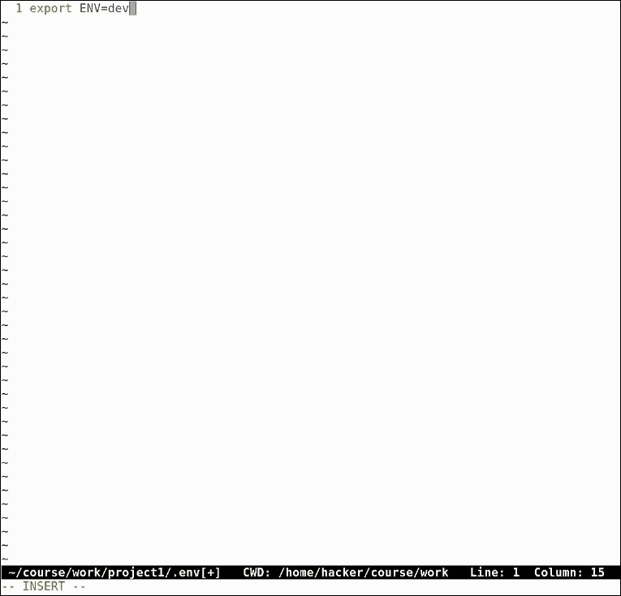

现在让我们为项目 2 做同样的事情，但是使用不同的`ENV`值；`qa`：

```
export ENV=qa

```

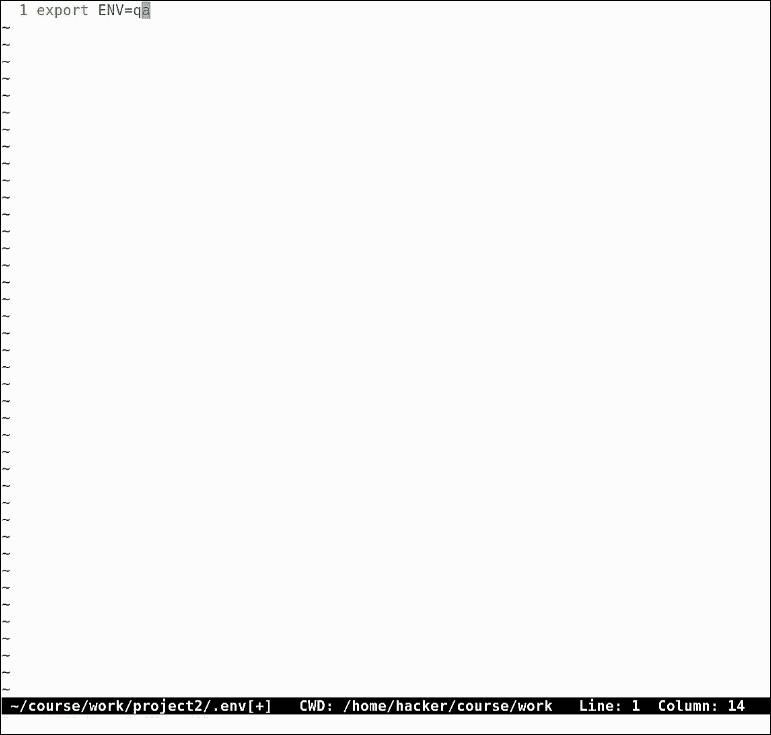

保存并关闭两个文件。现在当我们 cd 到项目 1 文件夹中时，我们会看到以下消息：

```
autoenv:
autoenv: WARNING:
autoenv: This is the first time you are about to source /home/hacker/course/work/project1/.env:
autoenv:
autoenv:     --- (begin contents) ---------------------------------------
autoenv:     export ENV=dev$
autoenv:
autoenv:     --- (end contents) -----------------------------------------
autoenv:
autoenv: Are you sure you want to allow this? (y/N)
```

按下*y*加载文件。每次加载新的环境文件时都会发生这种情况。现在，如果我们使用 grep 命令搜索 ENV 变量的环境，我们可以看到它存在，并且值为`dev`：

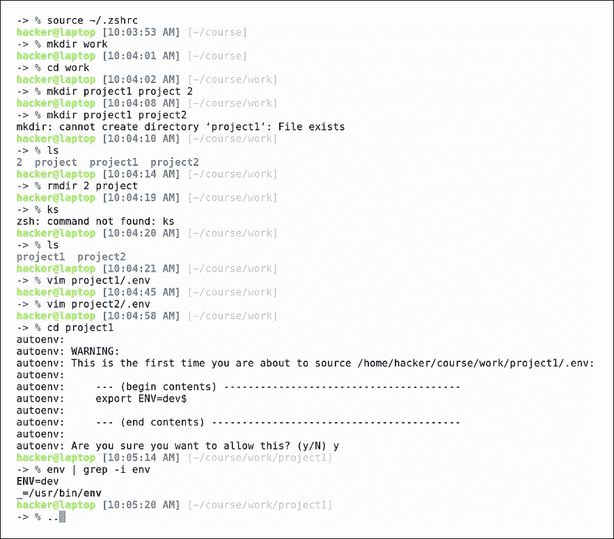

现在让我们将目录更改为`project 2`：

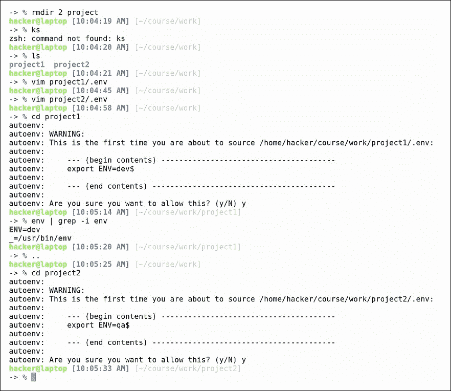

我们可以看到相同的警告消息被发出。当我们使用 grep 命令搜索 ENV 变量时，我们现在可以看到它的值是`qa`。如果我们离开这个文件夹，环境变量仍然被定义，并且将在其他脚本覆盖它或当前会话关闭时定义。即使我们 cd 到 project1 的更深的目录中，.env 文件也会被加载。

现在让我们看一个更复杂的 project1 的例子。

假设我们想要从`package.json`中获取版本，并且我们还想要使用一个名为 COMPOSE_FILE 的变量，该变量将指定一个不同的文件用于 docker compose。Docker 用户知道这是什么意思，但如果你不知道...谷歌一下！

这是一个例子：

```
export environment=dev
export version=`cat package.json | grep version | cut -f 4 -d "\""`
export COMPOSE_FILE=docker-compose.yml
```

为了使其生效，我们需要首先复制一个`package.json`文件，并测试`cat`命令是否有效：

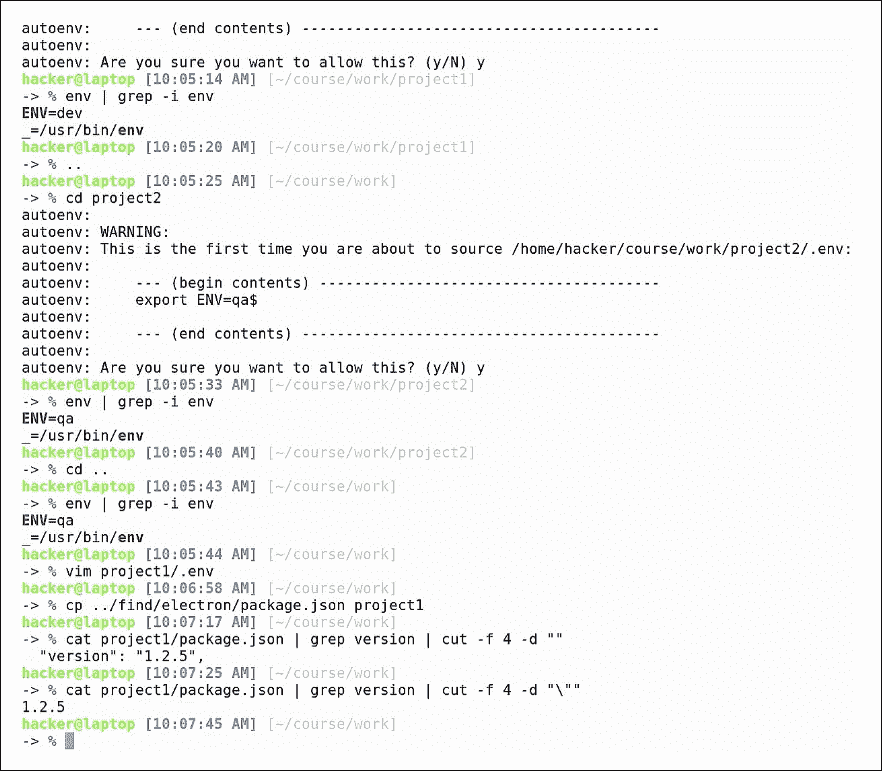

一切看起来都很好，所以让我们`cd`到我们的文件夹中：

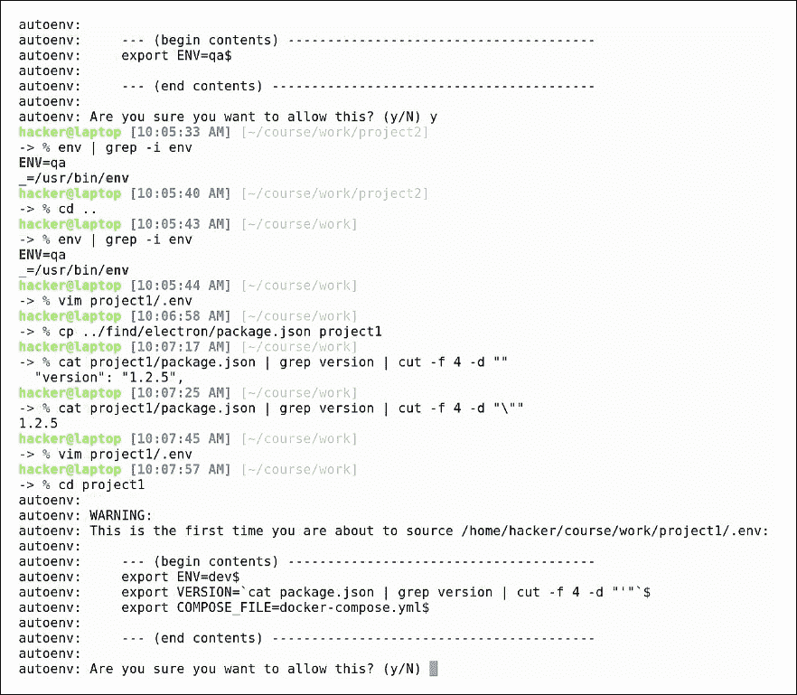

正如您所看到的，环境变量已经设置好了：

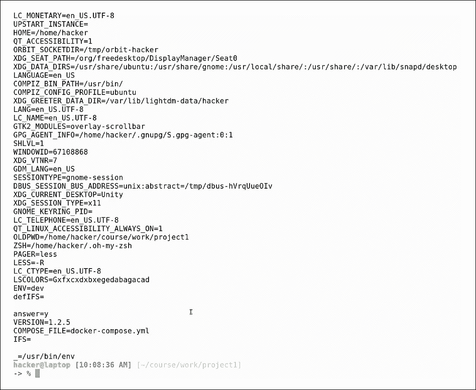

`Autoenv`非常方便，不仅限于导出环境变量。您可以执行一些操作，比如在进入某个项目或运行`git pull`或更新终端的外观和感觉时发出提醒，以便为每个项目提供独特的感觉。

## 不要删除垃圾

命令可以分为无害和有害两类。大多数命令属于第一类，但有一个非常常见的命令在计算机世界中已经造成了很多损害。这个可怕的命令就是`rm`，它已经抹掉了许多硬盘，使得宝贵的数据卷无法访问。Linux 桌面从其他桌面借鉴了垃圾桶的概念，删除文件的默认操作是将其发送到“垃圾桶”。将文件发送到垃圾桶是一个好的做法，以防止意外删除。但是这个垃圾桶并不是一个神奇的位置；它只是一个隐藏的文件夹，通常位于`~/.local`。

在这部分中，我们将介绍一个与垃圾桶一起工作的实用工具。我们将使用以下命令进行安装：

```
sudo apt install trash-cli

```

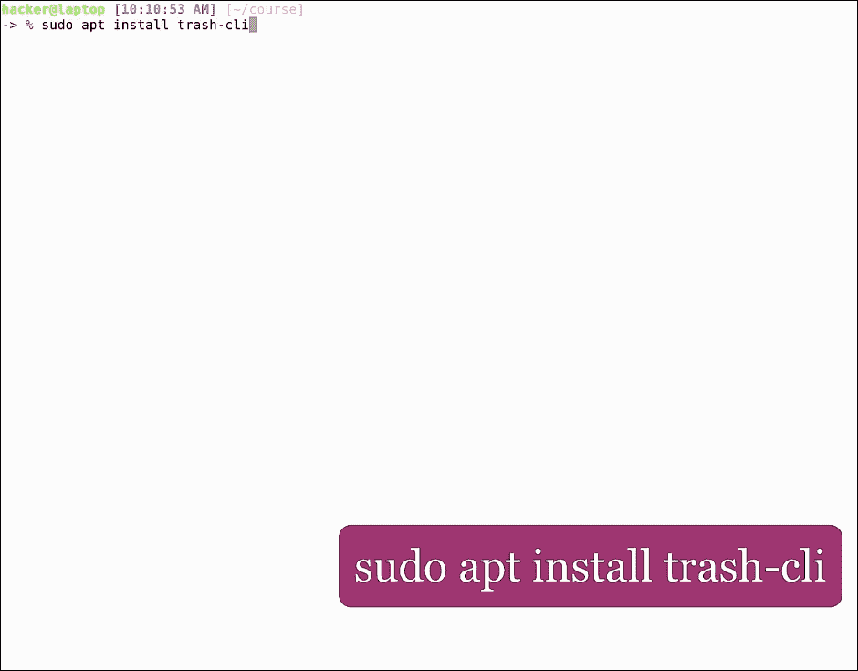

这将安装多个命令。让我们看一下当前目录，其中包含相当多的文件。假设我们不需要以 file.`*`开头的文件。

为了删除文件，我们将使用以下命令：

```
trash filename

```

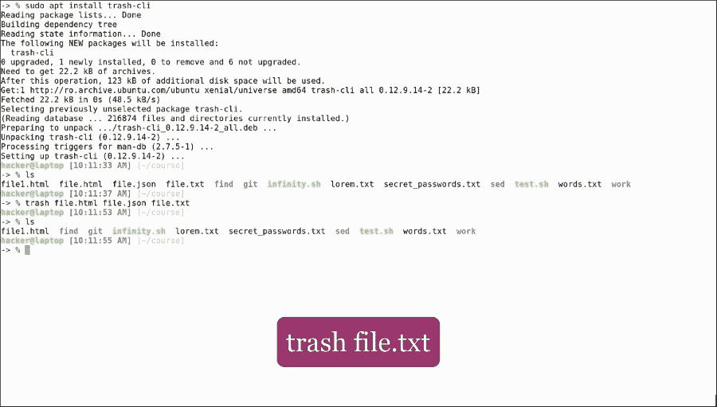

（有一个单独的命令用于处理垃圾桶。我们将重新加载路径。）我们列出所有垃圾桶命令。列出垃圾桶内容的命令是：

```
trash-list

```

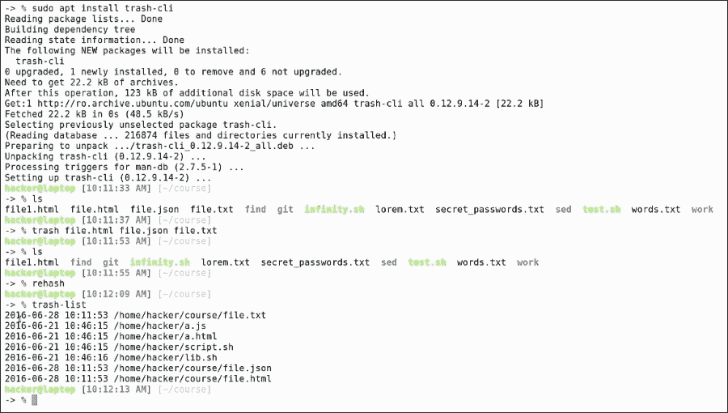

在这里我们可以看到垃圾桶中的文件。它只显示使用垃圾命令放入垃圾桶的文件。我们可以看到它们被删除的日期、时间和确切位置。如果我们有多个具有相同名称和路径的文件，它们将在这里列出，我们可以通过删除日期来识别它们。

为了从垃圾桶中恢复文件，我们将使用以下命令：

```
restore-trash

```

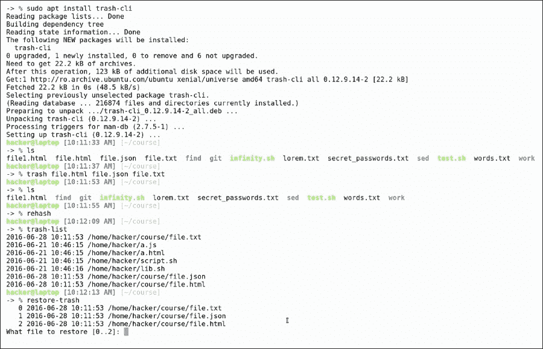

它将显示一个选项列表，并要求输入要恢复的文件对应的编号。在这种情况下，我们将选择 1，表示我们要恢复`json`文件。

我们打开文件，可以看到内容在过程中没有被改变。

为了删除垃圾桶中的所有文件，我们使用以下命令：

```
trash-empty

```

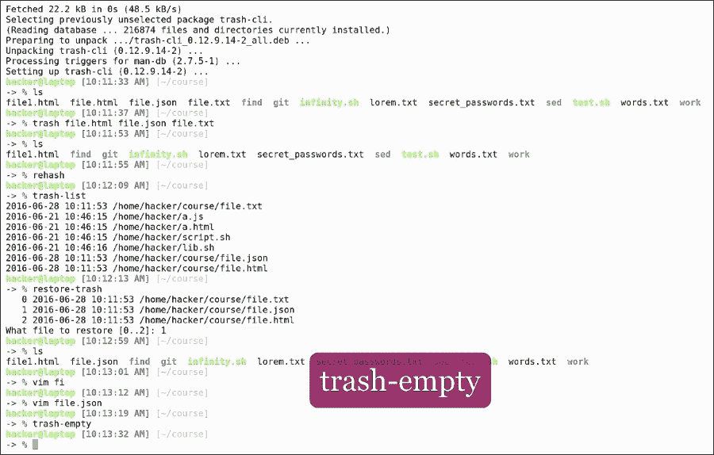

这相当于一开始就使用`rm`命令。现在如果我们再次列出垃圾桶，我们会发现它没有任何内容。

尽管互联网上充斥着`rm -rf /`的笑话，但这实际上是一个严重的问题，可能会导致头痛和浪费时间来恢复造成的损害。如果您长时间使用`rm`命令而无法养成使用垃圾桶的习惯，我们建议为`rm`添加一个别名，以实际运行垃圾命令。在这种情况下，将文件堆积在垃圾桶中比冒险删除可能需要的文件更好，无论是在提交之前还是删除整个根分区！
