# 第五章。开发者的宝藏

在本章中，我们将通过使用 Python 构建一个 Web 服务器来开始。然后，我们将看到如何使用 ImageMagick 自动处理所有图像。然后，我们将介绍 git flow 分支模型及其如何帮助您。此外，我们将看到 meld 命令行如何帮助合并我们的 git 冲突。然后，我们将重点介绍 ngrok 工具的工作原理，并看到它如何通过代理来自互联网的请求到我们的笔记本电脑。我们还将探索 jq 的多功能查询能力，它是 JSON 的瑞士军刀！最后，我们将探索管理和终止 Linux 进程的方法。

在本章中，我们将涵盖以下内容：

+   缩小咒语和其他 ImageMagick

+   理解 git flow 分支模型的工作原理

+   使用 ngrok 保护本地主机的隧道

+   熟悉 jq

# The spot webserver

我们准备了一个基本的演示`html`文件，其中包含一个按钮，一个`div`，一个`jquery`函数（用于帮助我们进行一些`ajax`调用），以及一个脚本，该脚本将尝试从我们的服务器加载静态内容并将内容放入`div`标签中。该脚本尝试在磁盘上加载一个简单的文本文件`/file`：

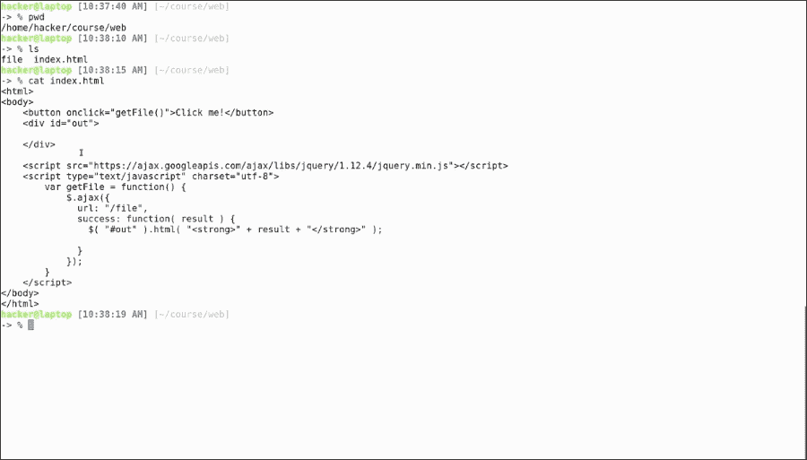

如果我们在浏览器中打开此文件，我们可以看到页面内容：


点击按钮会生成一个`javascript`错误。它告诉我们我们想要进行跨域请求，默认情况下浏览器不允许这样做。这是为了防止跨站脚本攻击。为了测试我们的`javascript`代码，我们需要将此文件提供在一个 HTTP 服务器上。

为了在与文件相同的文件夹中启动一个 HTTP 服务器，我们输入以下命令：

```
python -m SimpleHTTPServer

```

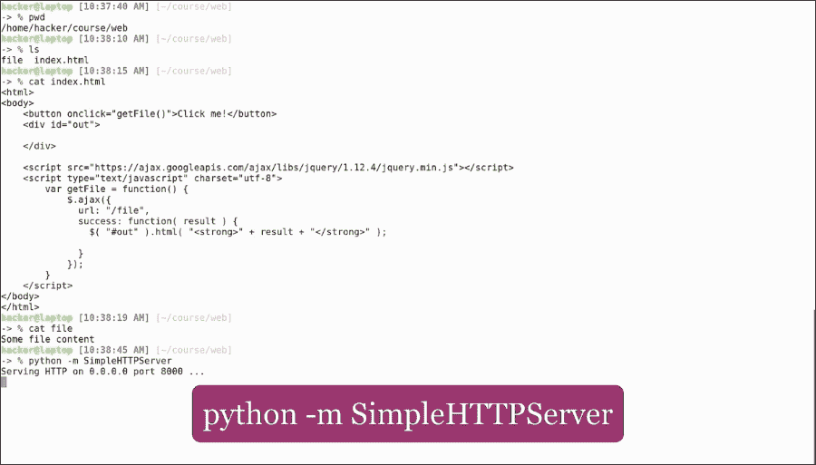

这是一个基本的 Python 模块，它在本地主机上打开端口`8000`，仅提供静态内容（因此，不，您不能用它来运行`php`）。让我们在浏览器中打开该地址：

点击**Click me!**按钮。我们可以看到我们的文件内容加载在按钮下方的`div`中，这意味着浏览器不再阻止我们，因为我们正在使用相同的主机和协议发出请求。从我们的 Python 服务器的输出中可以看到浏览器向服务器发出的所有请求。我们可以看到它默认请求一个不存在的`favicon.ico`文件，并返回一个`404`状态码：

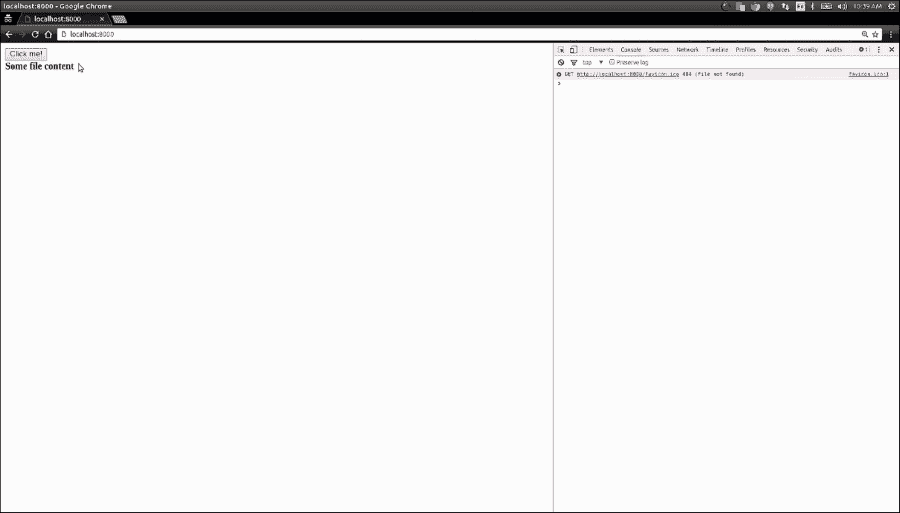

您可以在 GitHub 项目页面上找到此项目中使用的文件。

此外，如果我们停止服务器并返回一级目录再次启动它，我们可以将其用作`webdav`服务器，可以通过浏览器中的页面导航到当前目录中的文件。例如，我们可以将本地机器上的文件夹访问权限授予远程用户，并允许他们通过浏览器中的页面访问它，从而无需安装文件服务器。

# 缩小咒语和其他 ImageMagick

在本章中，我们将学习如何在命令行中处理图像。我们将从最复杂且广泛使用的图像命令行界面处理工具集 ImageMagick 开始。要安装它，请运行以下命令：

```
sudo apt install imagemagick

```


如您所见，我们已经安装了它。

现在，让我们找一些要处理的图像。让我们使用默认的 Ubuntu 背景，可以在`/usr/share/backgrounds`中找到。让我们将这些背景复制到另一个位置，以免修改我们的默认背景。

我们来看一下列表中的第一张图片：从`ls`命令可以看出，它是一张 1.6 MB 的 JPEG 图片。为了打开它并查看它的样子，让我们使用**eog**（**eye of gnome**）图像查看器：

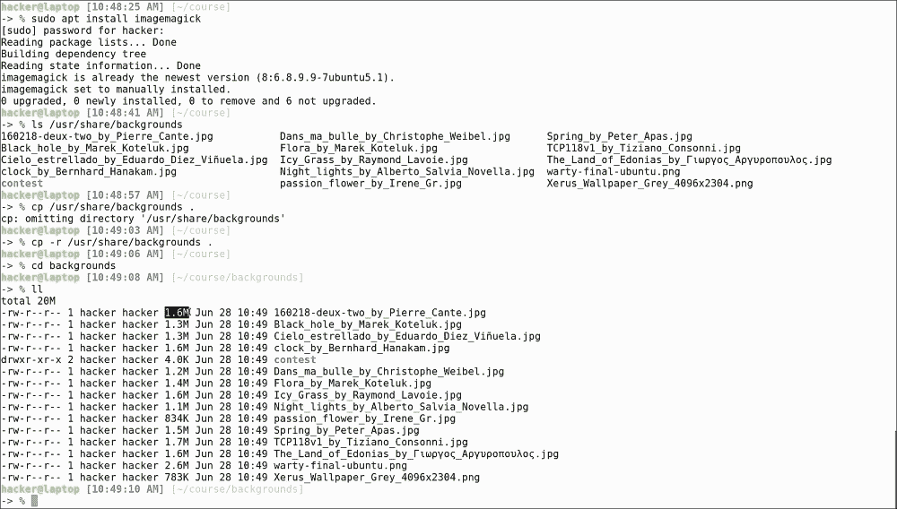

了解如何处理图像的第一步，也是最重要的一步，就是了解图像的实际情况。为了找出这一点，ImageMagick 提供了一个名为**identify**的工具。在最简单的形式中，您只需提供一个图像名称给它，它将输出以下信息：

```
identify image_name
160218-deux-two_by_Pierre_Cante.jpg JPEG 3840x2400 3840x2400+0+0 8-bit sRGB 1.596MB 0.240u 0:00.230

```

我们可以看到该文件是一个 1.6 MB 的 JPEG 图像，最重要的是，它的大小是 3,840x2,400 像素。

如果我们查看`warty-final-ubuntu.png`，我们会发现输出格式是相似的：大小和分辨率更高，图像格式是 PNG。让我们看看它是什么样子的：

```
eog warty-final-ubuntu.png

```

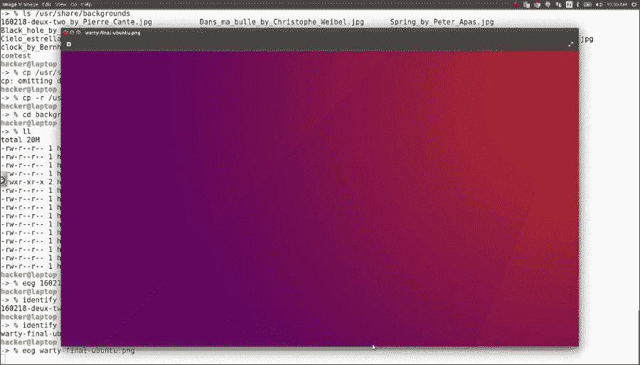

PNG 图像通常比 JPEG 图像占用更多的空间。如果没有透明度，建议使用`.jpg`。为了从一种类型转换为另一种类型，我们使用`imagemagick`的`convert`命令，带有两个参数：输入文件名和输出文件名：

```
convert file.png file.jpg

```


输出图像的格式将由`convert`根据文件扩展名推断。正如您所看到的，输出是一个 JPEG 图像，分辨率与 PNG 版本相同，但大小要小得多：180 KB 与 2.6 MB 相比。如果我们打开这个图像，我们看不到任何明显的差异。这对于 Web 开发来说是一件大事，因为如果我们在网页上使用这张图片，它将比 PNG 版本加载快 15 倍。

如果我们想裁剪图像的某个区域，我们可以使用`convert`来实现。例如，如果我们想剪切一个 500x500 的图像片段，从坐标 100,100 开始，我们将使用以下命令：

```
convert -crop "500x500+100+100" warty-final-ubuntu.png warty.jpg

```

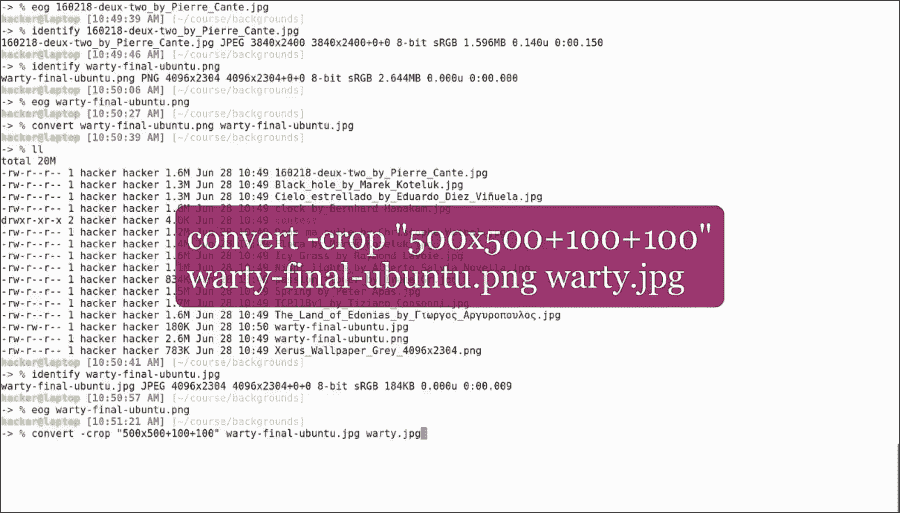

正如我们所看到的，输出图像的分辨率与我们请求的一样，但大小只有 2.5 KB。通过视觉分析这两个图像，我们可以看到裁剪的图像是大图的一部分。通常情况下，您不会想在命令行中猜测像素，而是使用图像处理软件（如 GIMP）来为您完成工作，以便您可以可视化地选择和裁剪图像的部分。然而，在开发软件应用程序时，经常需要以编程方式裁剪图像，这时这个功能就非常方便了。

`convert`命令也很擅长创建图像。如果我们想从文本字符串创建图像，我们可以使用以下命令：

```
convert -size x80 label:123 nr.jpg

```

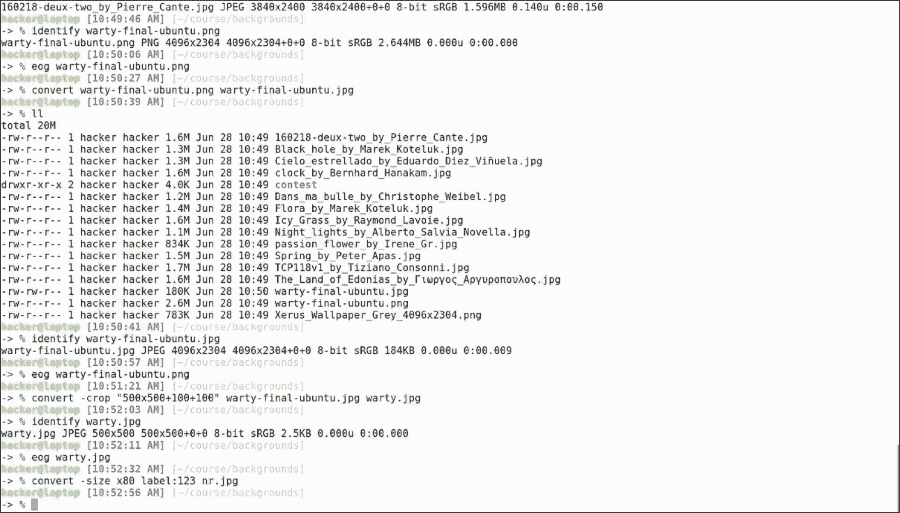

这将创建一个高度为 80 像素的 JPEG 图像，包含指定的文本，本例中为字符串`123`。我们可以看到输出，它是一个 3.4 KB 的图像，如果我们在视觉上看它，我们会看到文本`123`：

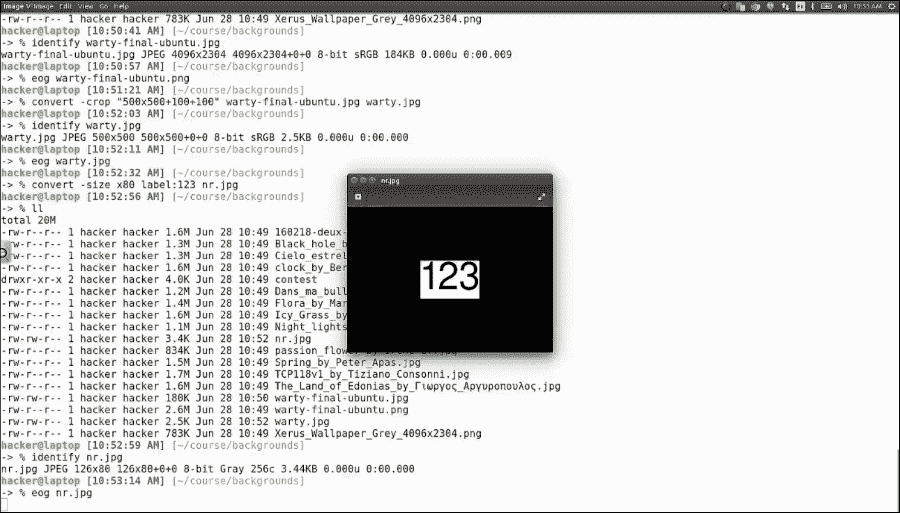

这在不同的场景中也非常有用，比如需要以编程方式生成可读图像，比如使用 CAPTCHA 软件或生成带有用户姓名首字母的默认个人资料图像。

现在让我们看看`imagemagick`之外的一些图像缩小工具。第一个是一个名为`pngquant`的`png`缩小工具。我们将通过输入以下内容来安装它：

```
sudo apt install pngquant

```

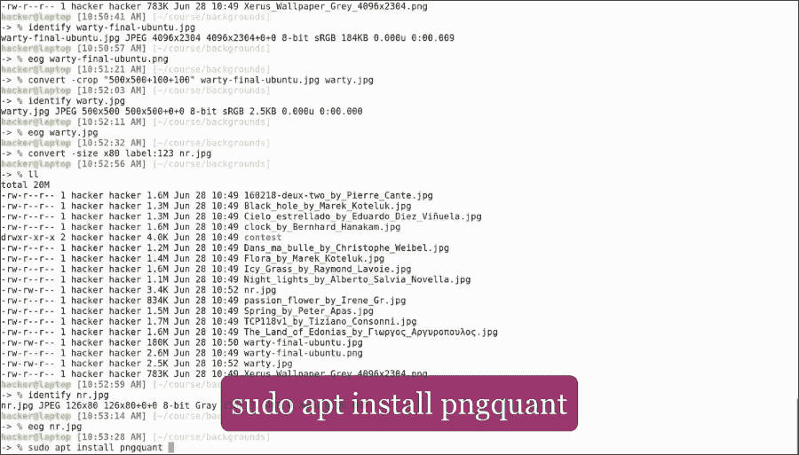

让我们尝试缩小之前查看的大型 PNG 图像。如果图像包含透明度并且需要保留在 PNG 格式中，我们只需使用以下图像名称调用`pngquant`：

```
pngquant warty-final-ubuntu.png

```

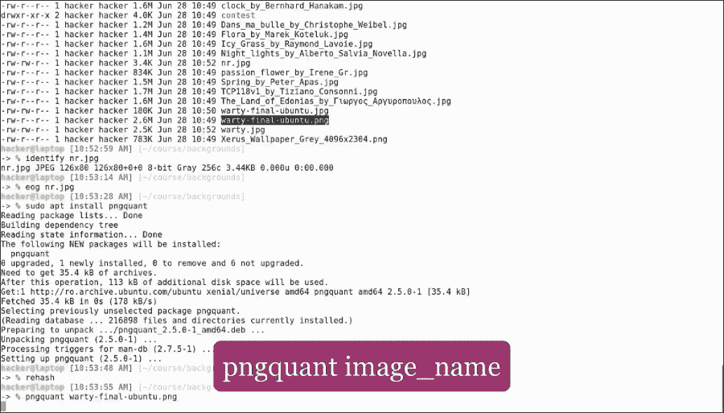

默认情况下，它会输出一个与原文件同名但添加了`fs8`扩展名的文件。我们可以看到大小的差异也是明显的（它比原始大小小了 1 MB，几乎是原始大小的一半）。如果我们在视觉上比较这些图像，我们将无法发现任何差异：

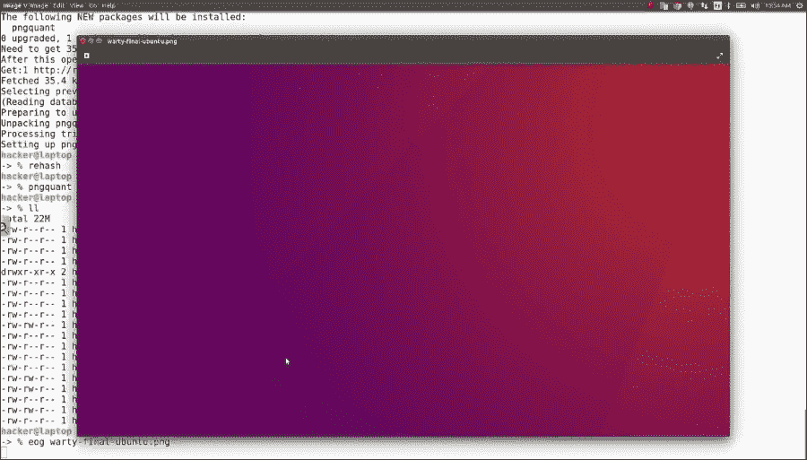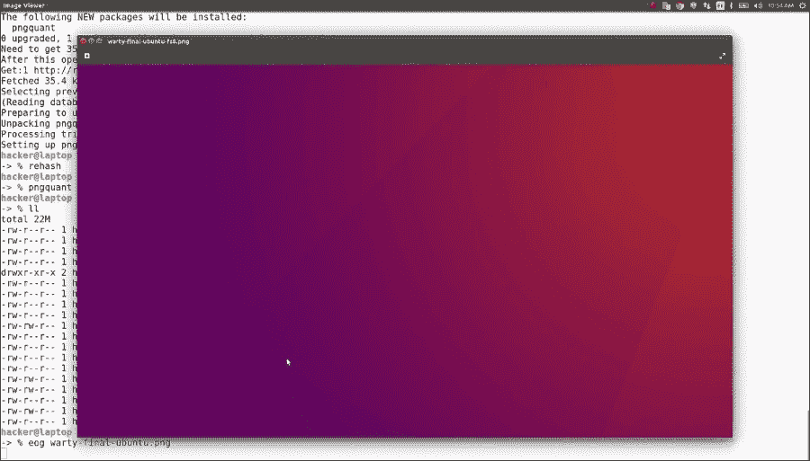

好了，现在让我们尝试对 JPEG 图像做同样的事情。

为此，我们将安装与`pngquant`相当的工具，即`jpegoptim`：

```
sudo apt install jpegoptim

```

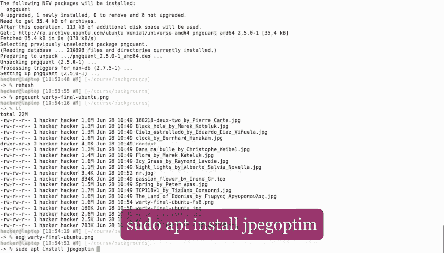

我们将以相同的方式调用它，只需给它一个命令行参数，即要缩小的文件。让我们选择一些随机图像来尝试并查看是否可以减小它们的大小：

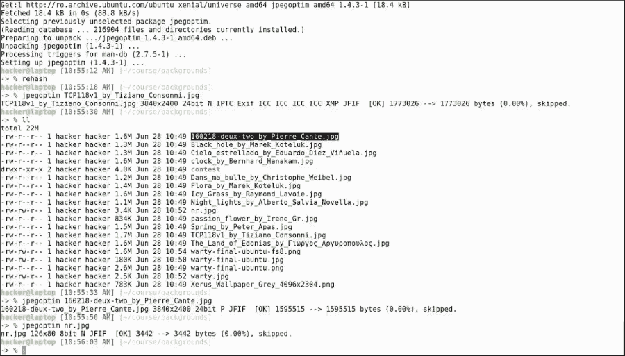

从输出中可以看出，它显示**Skipped**。这意味着该图像已经被缩小（Ubuntu 的人们可能在提交图像之前使用了相同的工具）。如果我们再次尝试在`imagemagick`生成的 JPEG 上运行它，您可以看到它也被跳过了：`imagemagick`已经使用了最小必要的格式。

图像处理工具在 Web 开发中非常有用，因为需要使用大量图像，并且它们的大小需要尽可能小。命令行工具非常有用，因为它们可以用于自动化任务。图像缩小通常添加到构建任务中，用于准备网站的生产版本。`imagemagick`工具包提供的工具比我们今天看到的工具要多得多，所以请随意探索工具包中的其他实用命令。此外，当涉及到图像的图形处理时，还有一些很棒的开源工具，如 GIMP 和 Inkscape，可以帮助您完成工作，还可以节省大量资金。

# 跟随 Git 流程

**Git**是迄今为止最流行的版本控制系统。在本章中，我们将介绍 Git 的一个插件，称为**GitFlow**，它为软件项目提供了一个分支模型。这个分支模型对于小型项目来说并没有太多帮助，但对于中型和大型项目来说是一个巨大的好处。我们将介绍`git-flow`插件的一个变体，称为`gitflow-avh`，它添加了额外的功能，如**Git 钩子**，[`github.com/petervanderdoes/gitflow-avh`](https://github.com/petervanderdoes/gitflow-avh)。

要安装它，我们将按照 GitHub 页面上的说明进行操作。我们使用的是 Ubuntu，所以我们将按照 Linux 的安装说明进行操作。

我们可以看到它可以直接使用`apt`命令安装，但 apt 通常不包含软件的最新版本，所以今天我们将进行手动安装。我们想选择稳定版本，并使用一行命令。

完成后，让我们创建一个虚拟项目。我们将创建一个空目录并将其初始化为 Git 仓库：

```
git init

```

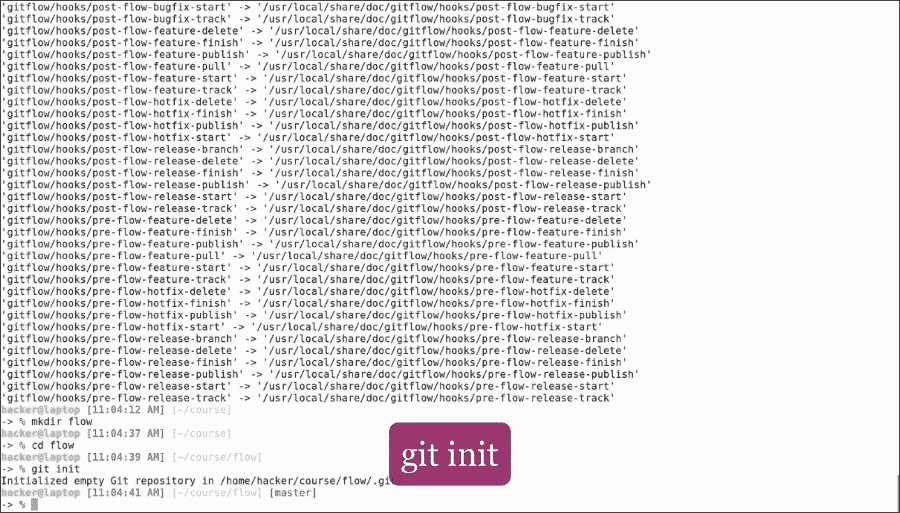

基本的 Git 使用不是本课程的一部分，我们假设您已经了解基础知识。

好的。开始使用`git-flow`的一个好方法是阅读由 Daniel Kummer 创建的优秀备忘单：

[`danielkummer.github.io/git-flow-cheatsheet/`](http://danielkummer.github.io/git-flow-cheatsheet/)

这提供了一些基本的提示和技巧，以便您可以快速开始使用`git-flow`。因此，备忘单建议首先运行以下命令：

```
git flow init

```

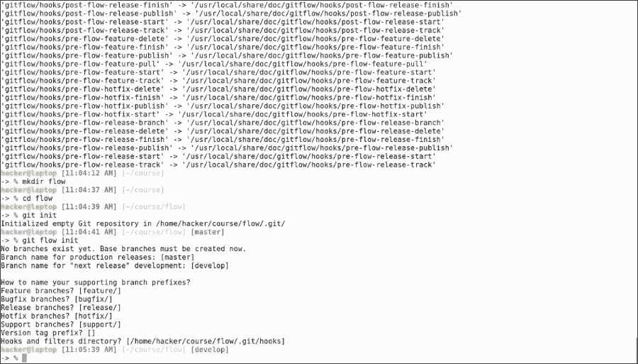

要配置它，我们需要回答一系列关于每个流程中分支应该具有的名称以及版本标签前缀和钩子目录的问题。让我们使用默认值。现在，让我们运行以下命令：

```
git branch

```

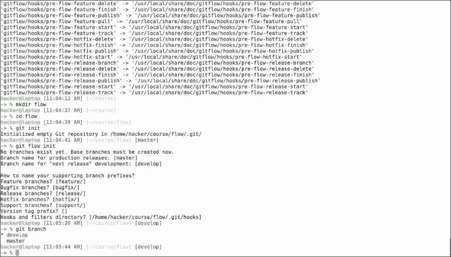

我们可以看到我们现在在`develop`分支上，所以不再在`master`分支上进行开发。这有助于我们拥有一个稳定的主分支，而不太稳定的功能则保留在`develop`分支上。

如果我们回到备忘单，我们可以看到第一项是一个功能分支。功能分支在开发特定功能部分或进行重构时非常有用，但您不希望破坏开发分支上的现有功能。要创建一个功能分支，只需运行以下命令：

```
git flow feature start feature1

```

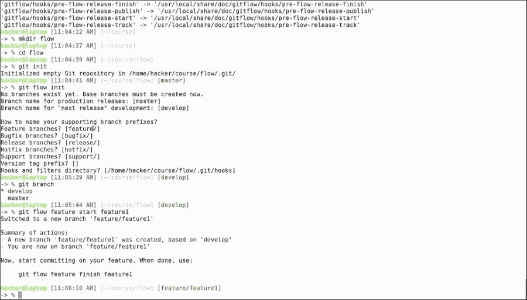

这不是最直观的功能描述，但对于演示目的很好。`GitFlow`在功能分支完成后还会向我们显示操作摘要。这创建了一个名为`feature/feature1`的新分支，基于开发分支，并将我们切换到该分支。我们还可以从我们方便的`zsh`提示中看到这一点。

让我们打开一个文件，进行编辑并保存：

```
git status

```

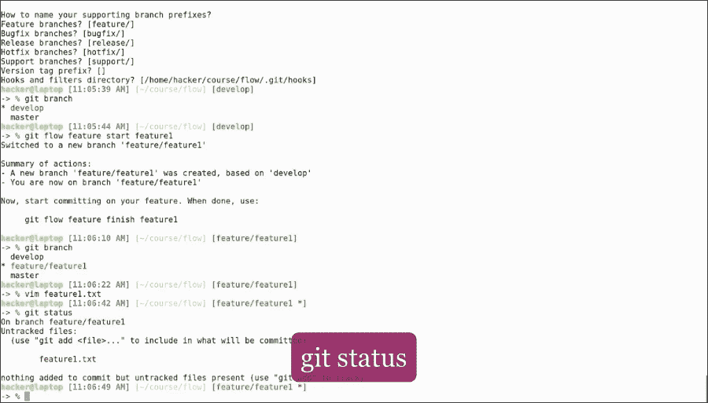

这个命令会告诉我们有一个未提交的文件。让我们继续提交它。

现在`git commit`正在使用`nano`编辑器编辑提交消息。由于我们更喜欢`vim`，让我们继续将默认编辑器更改为`vim`。我们只需要在我们的`zshrc`中添加这一行并重新加载它：

```
export EDITOR=vim

```

现在当我们执行`git commit`时，Vim 会打开，显示给我们一个提交摘要，然后关闭。

现在假设我们已经完成了一个新功能的添加。现在是将功能分支与以下内容合并回开发分支的时候了：

```
git flow feature finish feature1

```

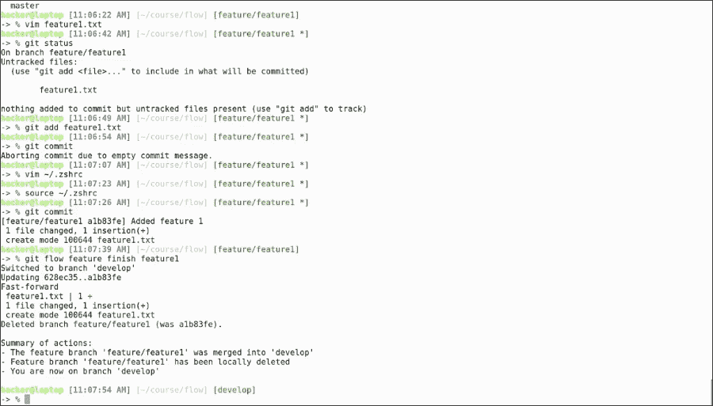

再次，为了获得操作摘要：

+   功能分支已合并回开发分支

+   功能分支已被删除

+   当前分支已切换回开发分支

如果我们执行`ls`，我们会看到我们分支上的文件存在于开发分支上。查看备忘单，我们可以看到这个过程的图形表示。

接下来是开始一个发布。发布分支适用于停止来自开发分支的新功能和错误修复，测试当前版本，在其上提交错误修复，并向公众发布它。

正如我们所看到的，语法相似，过程相似，开发分支分支到发布分支，但是当涉及完成分支时，功能也会合并到主分支，并从该分支切出一个标签。是时候看到它的实际效果了：

```
git flow release start 1.0.0

```

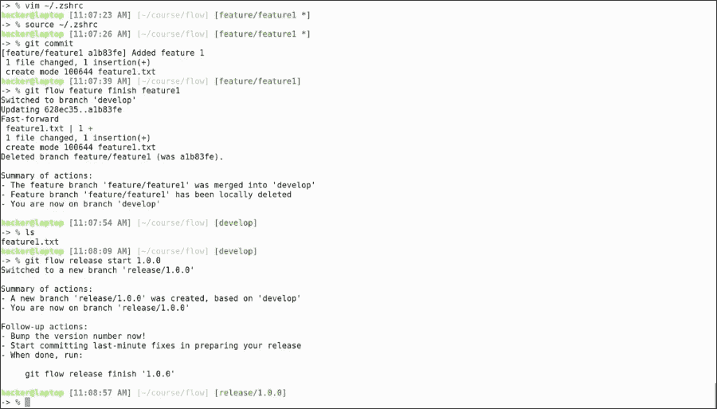

这将使我们切换到我们的`release/1.0.0`分支。让我们添加一个`releasenotes.txt`文件，以显示此版本中的更改。添加了更多的错误……希望没有！

让我们提交文件。

这通常是当您开始运行集成和压力测试时的情况，以查看是否一切正常，并检查是否有错误。

测试完成后，我们继续完成我们的发布分支：

```
git flow release finish 1.0.0

```


它将提示我们输入一系列的发布信息：我们将保留所有默认值。

检查摘要，我们可以看到：

+   发布分支已合并到主分支

+   从主分支切出了一个带有发布版本的标签

+   标签也已合并到开发分支

+   发布分支已被删除

+   我们回到了开发分支

现在，我们运行以下命令：

```
git branch

```


我们可以看到唯一可用的两个分支是主分支和开发分支：

```
git tag

```


这告诉我们有一个 1.0.0 标签。我们可以看到该分支现在包含来自功能和发布分支合并的两个文件；如果我们还切换到主分支，我们可以看到，此时，主分支是开发分支的精确副本：


GitFlow 还提供了增强的钩子功能。如果我们阅读文档，可以看到`hooks`文件夹中的所有可能的钩子。让我们添加一个在每个热修复分支之前执行的`git`钩子。为此，我们只需打开模板，复制内容，并将其粘贴到名为`pre-flow-hotfix-start`的文件中，放在我们的`.git/hooks`目录中。

GitFlow 有比所呈现的更多的工作流程。我们不会逐个介绍所有工作流程，但您可以通过访问备忘单页面或阅读 GitHub 页面上的说明来找到其他信息。

让我们只是简单地`echo`一个带有版本和来源的消息。

如果我们看一下`hotfix`流程，我们可以看到它们是从主分支创建的，并在主分支和开发分支上合并，主分支上有一个标签。

让我们看看它是否有效：

```
git flow hotfix start 1.0.1

```


显然不是。出了些问题，我们的脚本没有执行，我们需要删除我们的分支：

```
git flow hotfix delete 1.0.1

```


分析`git hooks`目录，我们发现我们的钩子没有执行权限。添加执行权限后，再次运行`git hook`命令，我们可以在热修复输出的顶部看到我们的消息。让我们使用以下命令完成这个热修复：

```
git flow hotfix finish 1.0.1

```

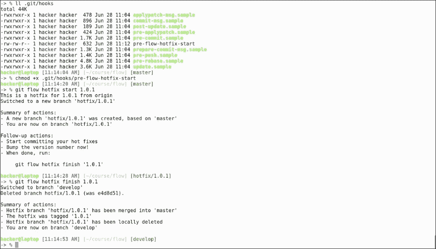

正如您所看到的，这些命令非常简单。还有一个`oh-my-zsh`插件，您可以激活它以进行命令行补全。

正如我们之前所说，这是一个适用于同时处理多个功能、修复错误和发布热修复的开发团队的插件。GitFlow 易于学习，并帮助团队拥有正确的工作流程，可以轻松为生产代码准备补丁，而不必担心在主分支上开发的额外功能。

您可以根据需要调整`config`：有些人喜欢将`hooks`文件夹放在不同的位置，这样它就会被提交到`git repo`上，他们就不必担心复制文件；其他人继续在主分支上开发，并使用一个单独的分支，如 customer，用于生产代码。

# 轻松解决 Git 冲突

现在让我们看看我们可以为`git`带来的另一个改进。大多数任务在命令行上执行起来很容易，但是一些任务，如合并，需要专家的眼睛来理解不同的格式。

让我们打开我们之前章节的`feature`文件，编辑它，添加一行新内容，然后保存：

```
git diff

```


`git diff`命令将显示彩色文本，解释`git`文件和修改后文件之间的差异，但有些人发现这种格式很难理解：


幸运的是，我们可以告诉`git`在合并时使用外部工具，我们可以使用的一个外部工具称为**Meld**。让我们使用以下命令进行安装：

```
sudo apt install meld

```


之后，我们可以运行以下命令：

```
git difftool

```

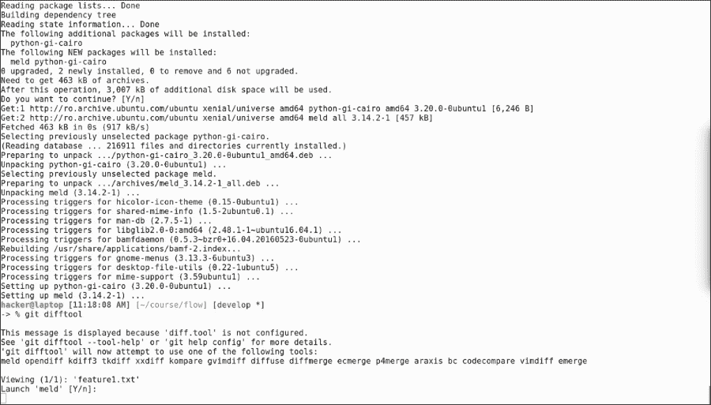

它会询问我们是否要将 Meld 作为查看文件的外部程序启动。它还给出了一个工具列表，可以用于显示差异。按下`y`打开 Meld：

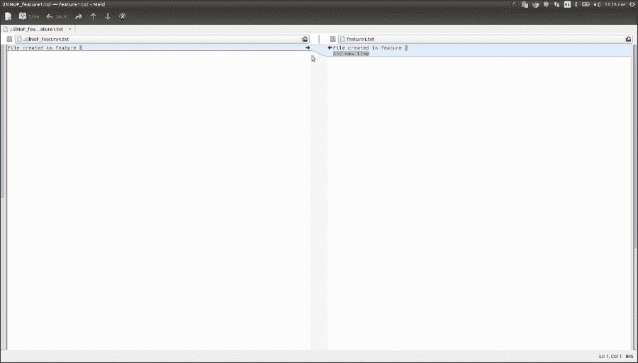

现在我们可以轻松地并排查看两个文件及其之间的差异。我们可以看到`1`已更改为`2`，并添加了一行新内容。根据这个输出，我们可以轻松决定是否要添加它。让我们将文件提交如此。

接下来，我们将看一下合并冲突。让我们手动创建一个名为**test**的分支，并**编辑**同一个文件，提交它，然后切换回 develop 分支。让我们更新同一个文件，提交它，然后尝试合并`test`分支：当然，会出现合并冲突。

为了解决冲突，我们将使用以下命令：

```
git mergetool

```

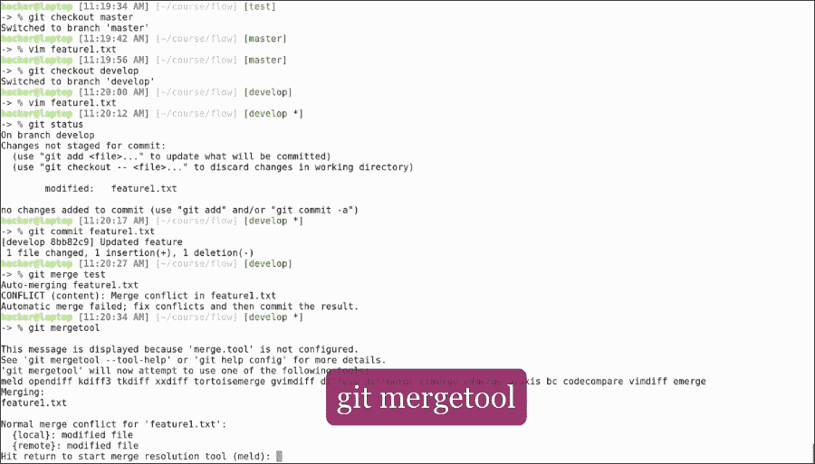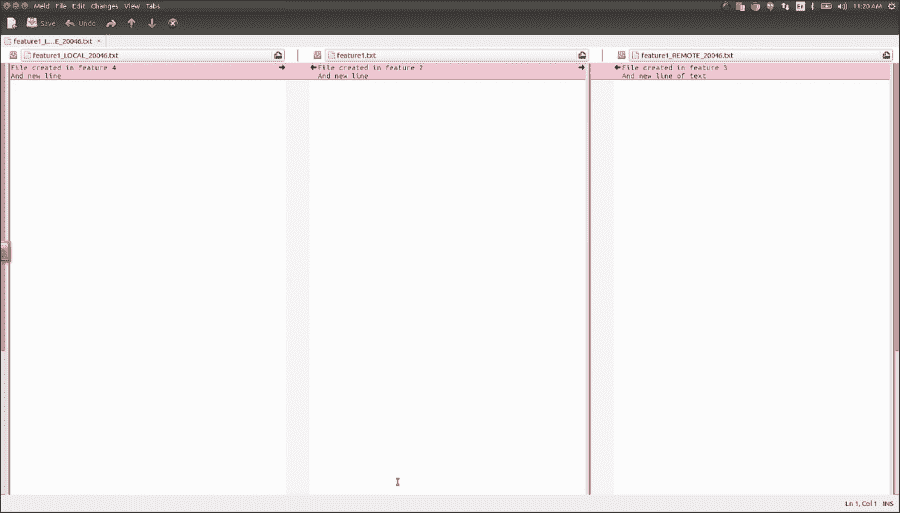

再次，它提供了打开 Meld 的选项。在 Meld 中，我们可以看到三个文件：

+   左侧是来自当前分支的文件

+   右侧是来自远程分支的文件

+   中间是将要创建的结果文件

假设我们决定功能的正确版本是`4`，我们还想添加`of text`：

```
git commit -a

```

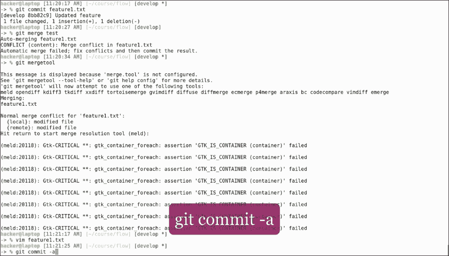

您可以看到预定义的提交消息。不要忘记删除合并时创建的临时文件：

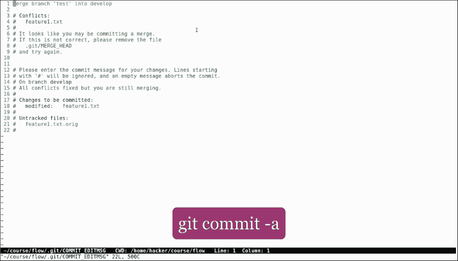

一般来说，大多数现代 IDE 都提供了用于与`git`一起工作的插件，包括合并和`diffs`。我们建议您更加熟悉命令行工具，因为这样您就不需要在从一个 IDE 切换到另一个 IDE 时学习新的`git`插件。

`git`命令在 Linux、Mac 和 Windows 上的工作方式相同。它是开发人员经常使用的工具，熟练掌握它将提高您的工作效率。

# 从本地主机到即时 DNS

通常，特别是在与他人合作或开发与在线服务集成时，我们需要使我们的计算机可以从互联网访问。这些信息可以从我们可靠的路由器获取，但如果我们只需要一个工具来使我们的计算机端口公开访问，那不是更容易吗？

幸运的是，我们有这样的工具！

认识一下`ngrok`，这个多功能的一行命令让你忘记路由器配置和持续部署。`Ngrok`是一个简单的工具，它将我们计算机上的一个端口暴露给互联网上一个唯一的域名。

它是如何做到的？

好的，让我们看看它的运行方式！

转到网站，点击**下载**按钮，选择你的命运。在我们的情况下，我们的命运是 64 位的 Linux 包。接下来，进入终端，解压文件，并将其内容复制到`bin`文件夹中：

+   `cd` downloads

+   `unzip ngrok.zip`

+   `mv ngrok ~/bin`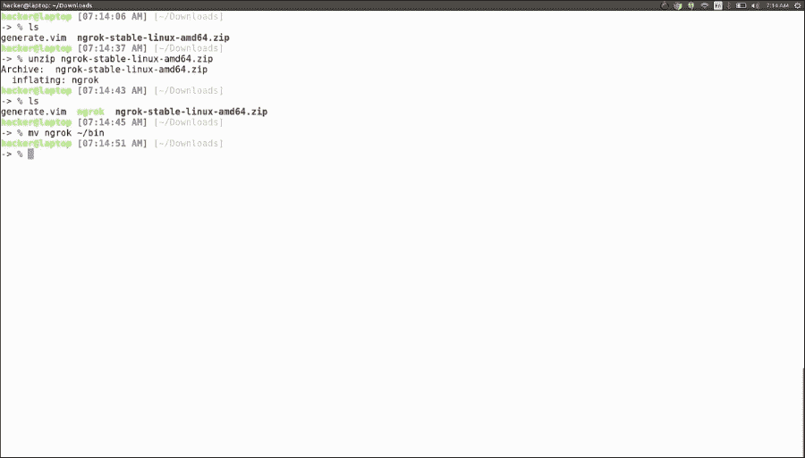

现在重新加载并输入以下命令：

```
ngrok http 80

```

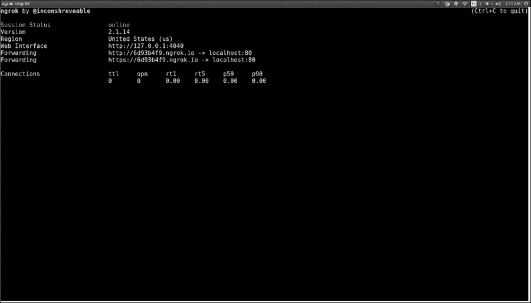

我们可以看到端口转发 80 和 443 正在我们的本地 80 端口上运行，使用一个自定义的`ngrok`子域名。我们还可以看到服务器的地区，默认情况下位于美国。如果我们在不同的地区，我们可以使用以下命令进行设置：

```
ngrok http 80 --region eu

```

`ngrok`服务器位于欧洲。为了测试我们的`ngrok`服务器，让我们使用我们可靠的 Python 服务器来显示一个简单的 HTML 页面：

```
python -m SimpleHTTPServer

```

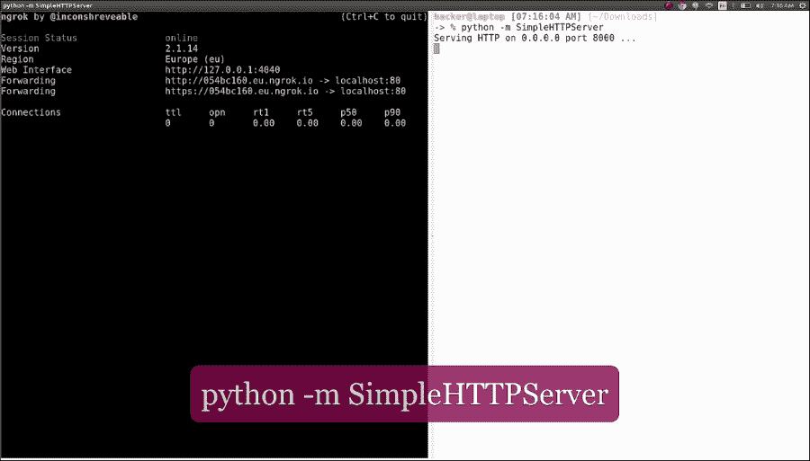

然后使用从端口`8000`转发的 HTTP 流量重新启动`ngrok`，这是默认的 Python Web 服务器端口：

```
ngrok http 8000 --region eu

```

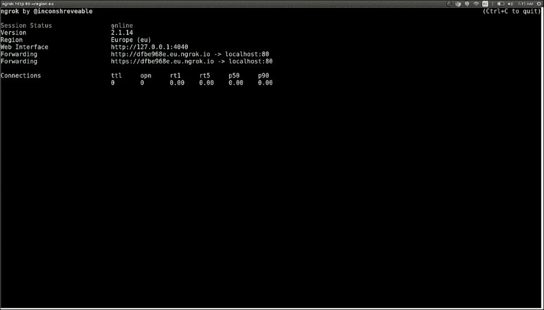

点击`ngrok`提供的链接，我们将看到我们的网页可以被互联网访问。

就是这样。没有配置，没有账户，没有烦恼。只需一条简单的命令，我们可以从任何地方运行。`ngrok`提供的子域名是一个生成的域名，每次重新启动`ngrok`时都会更改。我们可以选择使用我们自定义的域名，比如 Linux [`ngrok.com/`](https://ngrok.com/)，但前提是要获得一个付费账户。

`ngrok`还有一个 Web 界面，位于`http://127.0.0.1:4040`，我们可以在那里查看统计数据和日志。

强大来自于易用性，而`ngrok`为我们提供了这种力量：

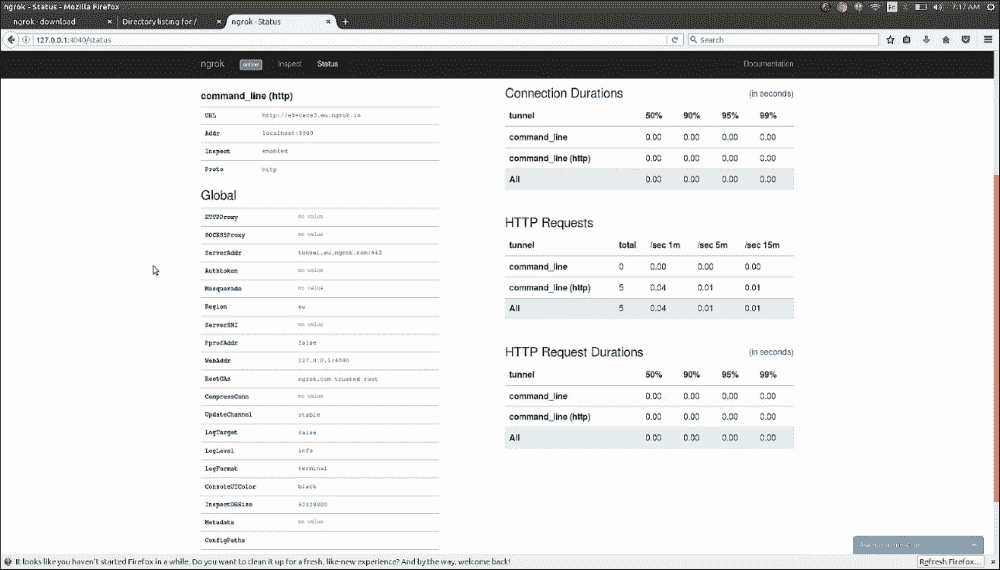

以下是使用这个强大工具的一些具体场景：

+   当测试需要回调`url`的在线服务集成时，例如 oAuth 登录和在线支付

+   当开发连接到本地服务的移动应用程序时

+   当我们想要暴露一个`ssh`端口时

+   当我们想要让我们的客户访问我们笔记本上的一个网页，向他们展示一些代码，也许

# JSON 在新时代的流行

如今，JSON 无处不在，出现在 Web `api`、配置文件甚至日志中。JSON 是用于结构化数据的默认格式。因为它被广泛使用，所以有时我们需要在命令行中处理 JSON。你能想象用`grep`、`sed`或其他传统工具来做这个吗？那将是一个相当大的挑战。

幸运的是，有一个简单的命令行工具叫做`jq`，我们可以用它来查询 JSON 文件。它有自己的语言语法，我们将在几分钟内看到。

首先，让我们使用以下命令安装`jq`：

```
sudo apt install jq

```


现在让我们使用一个示例文件，一个以 JSON 格式的虚拟访问日志：`access.log`，我们也可以在课程的 GitHub 存储库中找到它。

让我们从一些简单的查询开始：

```
jq . access.log

```

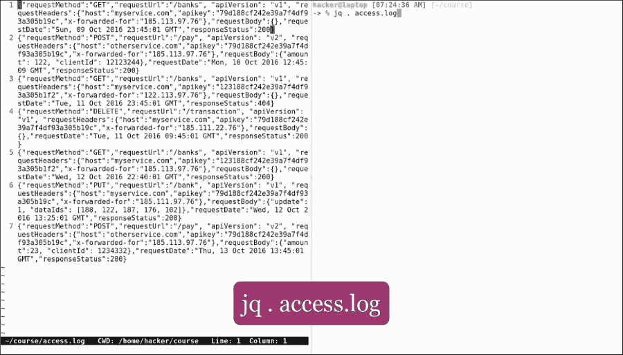

我们将以漂亮的格式将 JSON 对象打印回屏幕上：

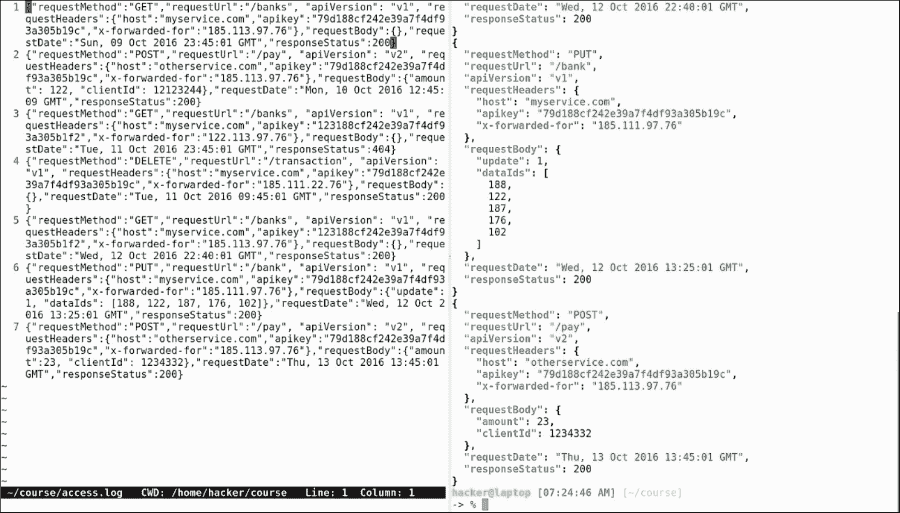

如果我们想要获取每个请求的`request`方法，请运行以下命令：

```
jq '.requestMethod' access.log

```

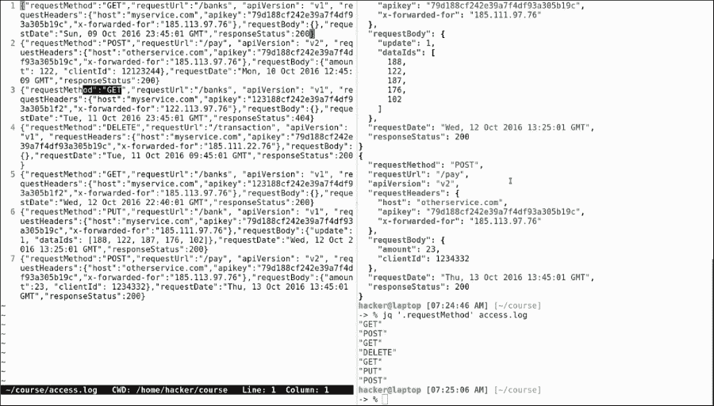

这将打印每个`json`对象的请求方法。请注意每个方法周围的双引号：

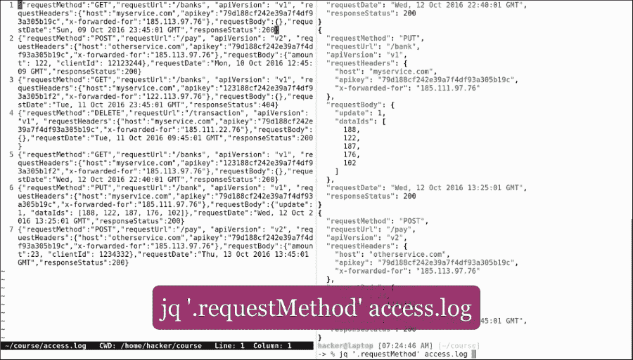

如果我们想要将输出作为其他脚本的输入，我们可能不希望有双引号，这就是`-r`（原始输出）的用处所在：

```
jq '.requestMethod' -r access.log

```

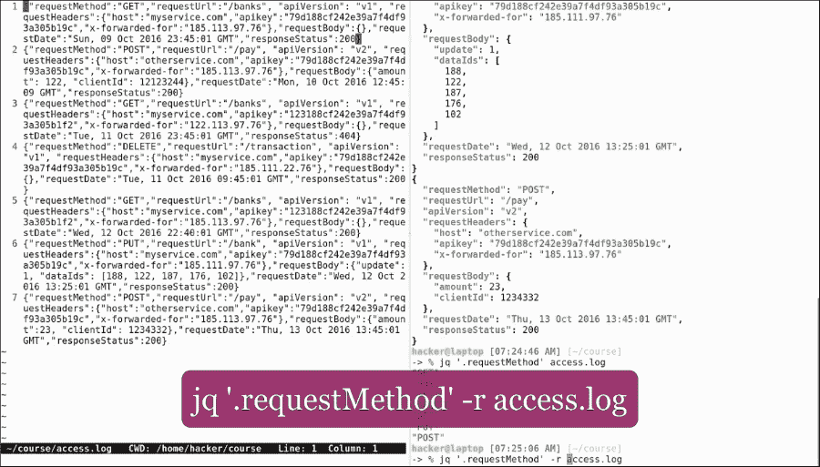

`jq`经常用于在更小的规模上进行大数据查询：

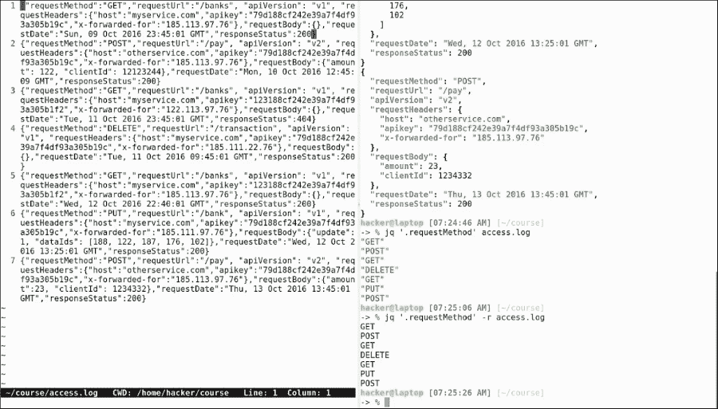

例如，如果我们想要计算日志文件中请求方法的统计信息，我们可以运行以下命令：

```
jq '.requestMethod' -r access.log | sort | uniq -c

```

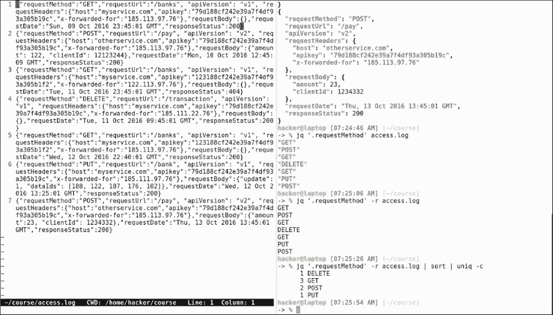

现在我们可以看到`get`、`put`、`post`和`delete`请求的计数。如果我们想要对另一个字段（比如`apikey`）进行相同类型的计算，我们可以运行以下命令：

```
jq '.requestHeaders.apikey' -r access.log | sort | uniq -c

```

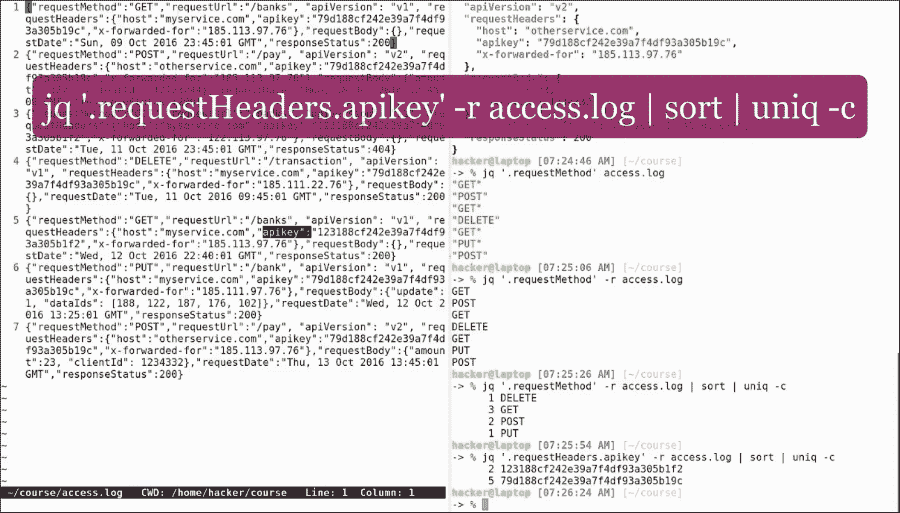

由于访问嵌套字段的语法是使用点作为分隔符，因此请注意我们使用单引号而不是双引号来标记我们的查询为字符串。正如您可能知道的，shell 脚本中单引号和双引号的区别在于双引号字符串将尝试展开变量，而单引号字符串将被视为固定字符串。

要查询请求体，我们将使用以下命令：

```
jq '.requestBody' access.log

```


从输出中可以看出，即使是空的请求体也会被记录并由`jq`打印出来：

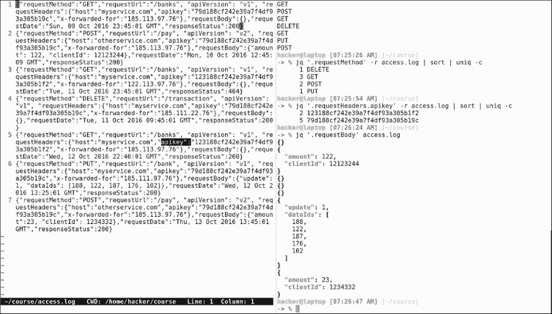

为了跳过打印空的请求体，我们可以使用 jq 的查询语言来选择所有没有空请求体的文档：

```
jq 'select(.requestBody != {}) | .requestBody' access.log

```

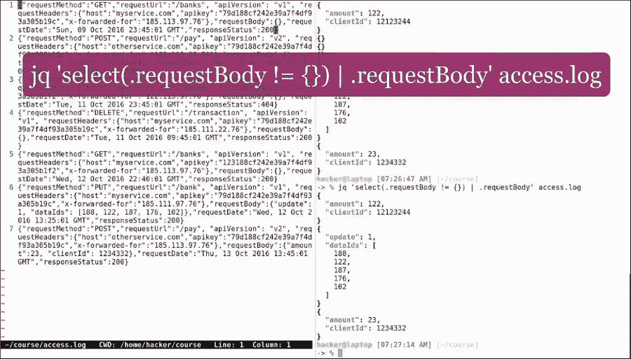

如果我们想要进一步细化搜索并且只打印请求体的`dataIds`对象中的第一个元素，请使用以下命令：

```
jq 'select(.requestBody.dataIds[0] != null) | .requestBody.dataIds[0]' access.log

```

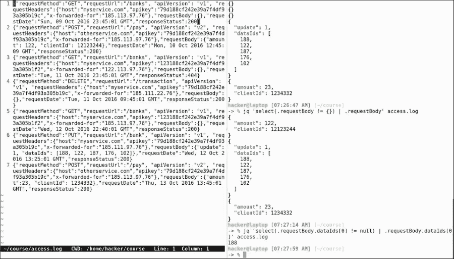

我们甚至可以对返回的值执行算术运算，例如递增它：

```
jq 'select(.requestBody.dataIds[0] != null) | .requestBody.dataIds[0] + 1' access.log

```

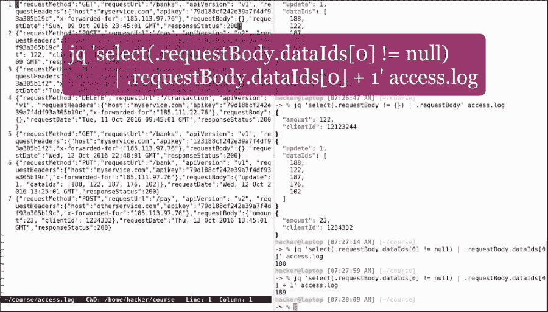

`jq`还有许多其他示例和用例：只需访问官方`jq`页面并查看教程：

[`stedolan.github.io/jq/tutorial/`](https://stedolan.github.io/jq/tutorial/)

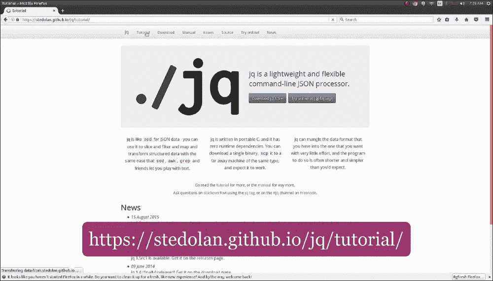

在这里，我们可以看到一个使用返回`json`并将其传输到`jq`的 rest API 的示例。要打印带有来自`github`存储库的提交消息的`json`，请运行以下命令：

```
curl 'https://api.github.com/repos/stedolan/jq/commits?per_page=5' | jq -r '[.[] | {message: .commit.message}]'

```

正如我们所说，文档中还有许多其他示例和用例。`jq`是一个非常强大的工具，在与命令行中的`json`交互时必不可少。

## 不再是好人了

Linux 中的内核和命令行是稳定且强大的。它们的可靠性在多年来得到了证明，现代关于 Linux 服务器连续运行多年而无需重新启动的传说。然而，图形界面并非如此，它们有时会失败或变得无响应。这可能变得很烦人，因此拥有一种快速关闭无响应窗口的方法总是很好。准备好见到`xkill`。

首先，让我们复制一个无响应的窗口。转到终端并启动`gedit`：然后按下*Ctrl* + *z*。这将将`gedit`发送到后台，同时窗口仍然可见。尝试在窗口内点击几次将告诉 Ubuntu 没有进程处理此窗口，Ubuntu 将使其变灰：

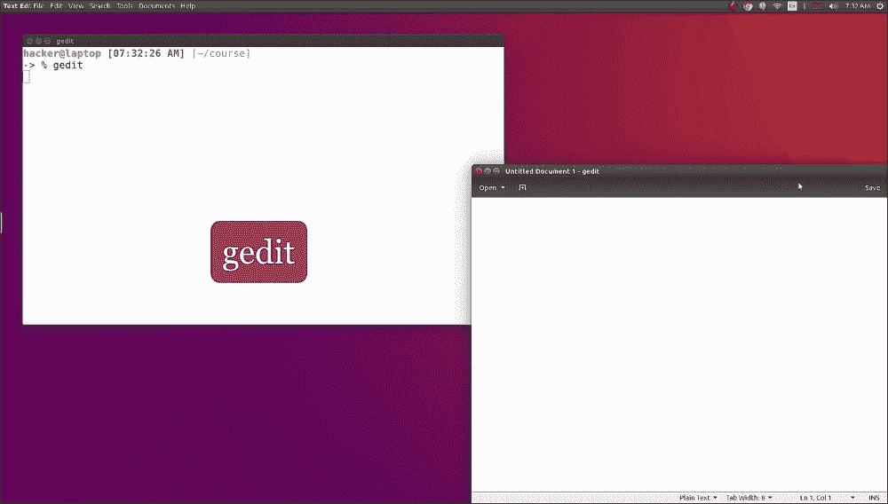

按下*Ctrl* + *z*：

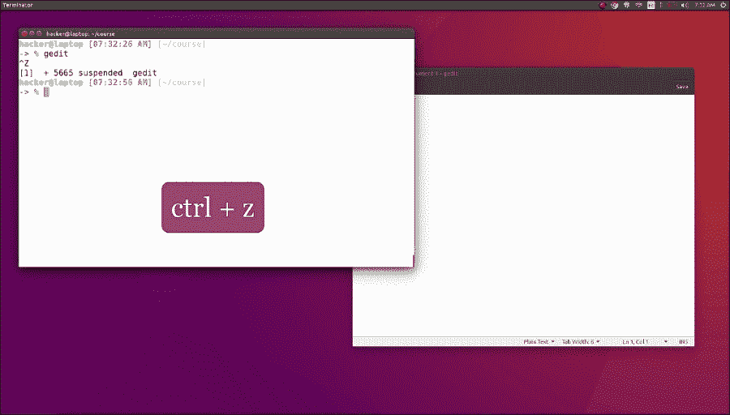

这将使`gedit`进入后台，同时窗口仍然可见。尝试在窗口内点击几次将告诉 Ubuntu 没有进程再处理此窗口，Ubuntu 将使其变灰：

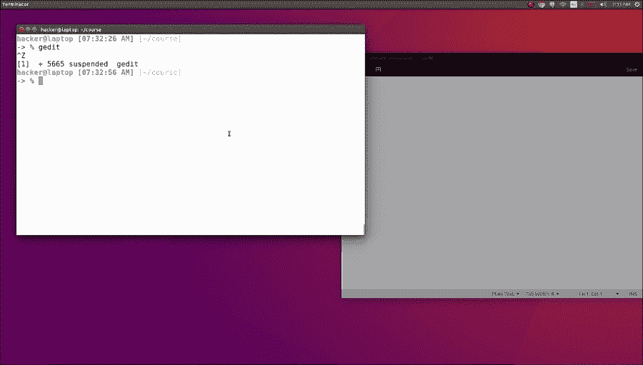

为了避免通过查找窗口的`pid`然后杀死该进程的过程，我们使用一个小技巧。进入终端并运行以下命令：

```
xkill

```

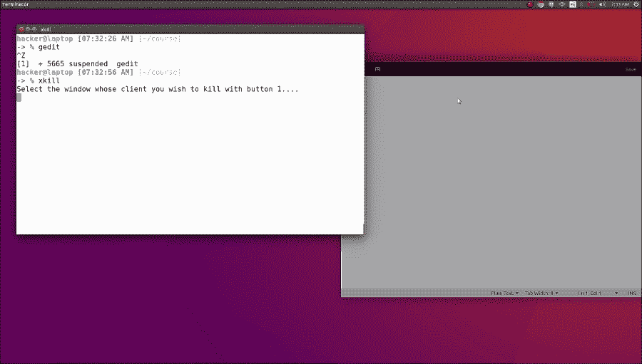

现在我们看到鼠标指针已经变成了一个`x`。

注意不要点击任何东西。按下*Alt* + *Tab*将`gedit`窗口带回来，然后点击它。`xkill`命令将找到并杀死我们刚刚点击的窗口的进程。

这个技巧可以用于任何类型的窗口；就像射击您的窗口一样！

好了，但是如果整个系统变得无响应，您无法在命令行中输入任何内容会发生什么？这可能会发生，特别是在旧系统上。您可以按下笔记本电脑或服务器上的**开/关**按钮，但在某些情况下，这是不可能的。

现在我们要向您展示的是一个由 Linux 专家保守了很长时间的秘密技巧；没有人真正谈论它，因为它非常强大，可以在错误的人手中造成损害。请确保在尝试致命的键盘快捷方式之前保存所有工作并关闭所有程序，这将强制重新启动您的 Linux 系统。同时按住*Alt* + *PrtScrn*，然后输入以下内容：

```
reisub

```

如果您尝试过，那意味着您的计算机已重新启动，您必须回到本课程并继续之前的进度。

请小心谨慎地练习此命令，并请不要经常使用它来重新启动您的计算机。只有在**图形用户界面**（**GUI**）无响应时才使用它。

另一个技巧：如果 GUI 无响应并且您有未保存的工作，您可以通过访问 Linux 的一个虚拟终端从命令行中恢复其中一部分。Ubuntu 默认启动七个虚拟终端，图形用户界面在终端 7 上启动。要访问任何七个终端之一，请使用*Ctrl* + *Alt* + *F1*到*F7*。会出现提示要求您登录，登录后，您可以运行一些命令来关闭进程并保存工作后退出。要返回用户界面，请按下*Ctrl* + *Alt* + *F1*。
