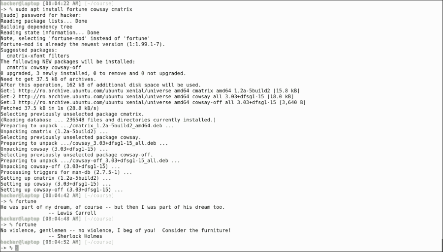
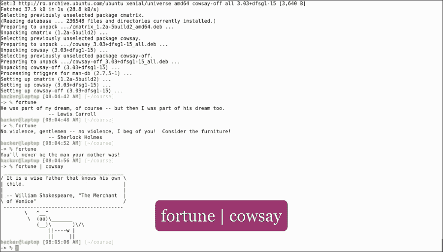
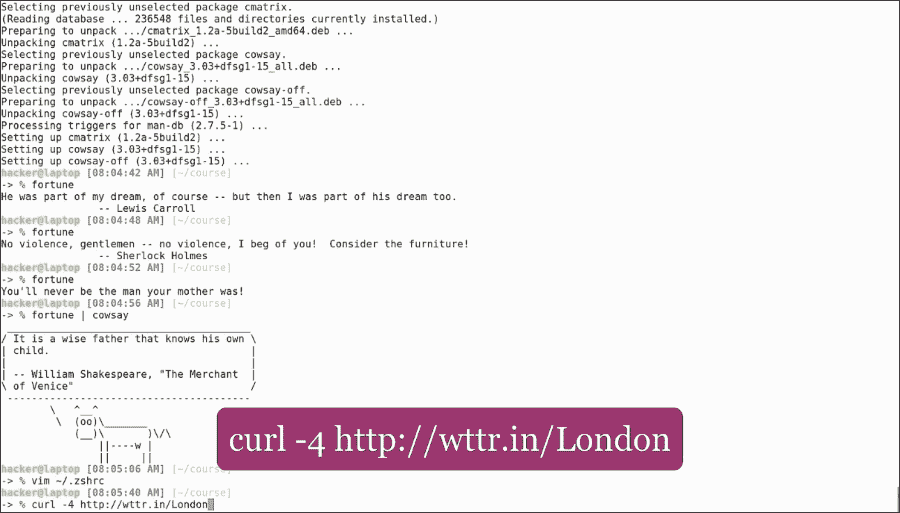
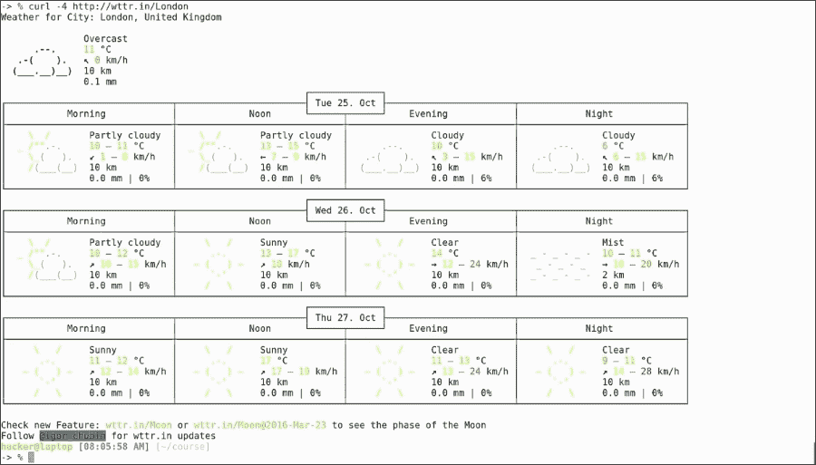
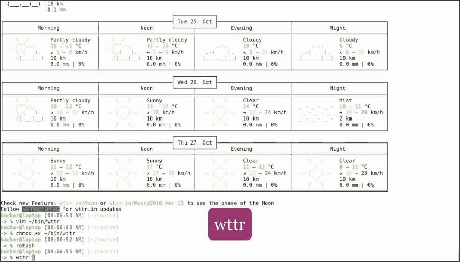
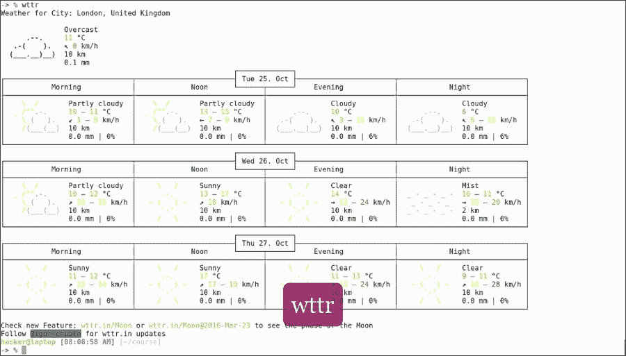
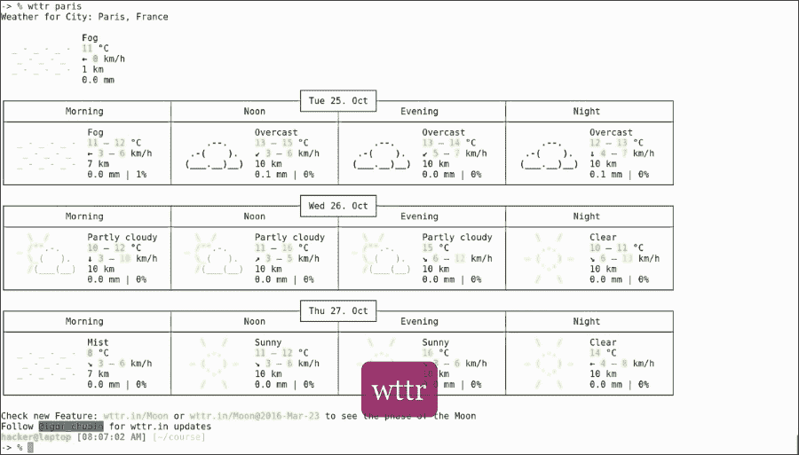

# 第六章：终端艺术

只工作而不玩耍，会使杰克变得乏味。尽管命令行对很多人来说似乎很无聊，但它可以变得非常有趣。这完全取决于你的想象力。终端可以时尚，并且可以给人留下良好的印象，特别是我们在电影中看到的那些终端。颜色、ASCII 艺术和动画可以让我们的终端栩栩如生。所以，这里有一些终端艺术！

在本章中，我们将涵盖以下内容：

+   使用一些 Linux 命令来娱乐一下

听说过幸运饼干吗？想要吃它们而不发胖吗？只需运行以下`apt`命令来安装我们在本章中将使用的工具：

```
sudo apt install fortune cowsay cmatrix

```


然后运行以下命令：

```
fortune

```



运行此命令时，您会以随机顺序获得幸运语、名言和笑话。如果我们将该命令与`cowsay`结合使用，我们将获得相同的幸运语，并附带一张牛的图片：

```
fortune | cowsay

```



为了使其成为定期事件，我们可以将其包含在我们的`zshrc`文件的最后一行中。然后，每次我们打开一个新的终端窗口时，一头牛就会给我们带来一份幸运。

现在这可能没有什么用（尽管有点有趣），所以让我们做一些有生产力的魔法吧。

让我们预测天气吧！

你只需要一个`curl`命令：

```
curl -4 http://wttr.in/London

```



这将以漂亮的格式显示指定城市（在本例中为伦敦）的三天天气预报：



现在，借助我们新学到的技能，让我们编写一个 shell 脚本来获取天气预报：

打开`~/bin/wttr`并输入以下内容：

```
#!/bin/bash
CITY=${1:-London}
curl -4 http://wttr.in/${CITY}

```

给它执行权限并指定一个默认城市，比如伦敦。现在，运行以下命令：

```
wttr

```



我们获取伦敦的天气预报。现在，运行以下命令：

```
wttr paris

```



我们获取巴黎的天气预报。第一次在命令行中工作可能会感觉像进入了矩阵，如果是这样的话，为什么不创建那种环境呢？

运行以下命令：

```
cmatrix

```


让你的朋友们对你在那个神秘的终端中所做的复杂事情感到惊讶。终端并不无聊！


它们拥有美丽的颜色、易于阅读的输出，并且显示紧凑的信息，使用户能够控制自己的系统。

终端可以定制和交互，它们可以提高您的生产力，同时让您的鼠标进入无尽的低效睡眠状态。

当然，所有这些技能不会一夜之间就掌握，它们需要每个用户仔细调整，以适应他们自己的口味、思维方式和工作方式。然而，在那之后，它们将像定制的西装一样合身，并成为您工作方式的延伸，有时甚至是您的工作。

我们希望您喜欢我们提供的所有技巧和窍门，并且在学习它们的过程中玩得开心。请记住，教育是一个持续的过程，所以不要停在这里！保持求知欲，浏览互联网，了解最新的工具和技术，让自己成为一个高效的人！
