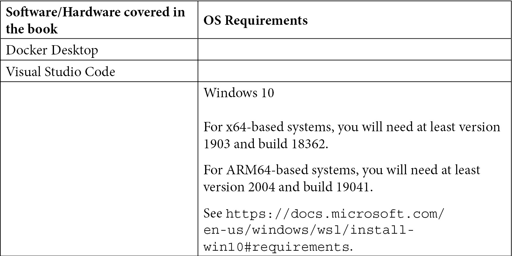

# 前言

Windows 子系统 Linux（WSL）是微软的一项令人兴奋的技术，它将 Linux 与 Windows 并列，并允许您在 Windows 上运行未经修改的 Linux 二进制文件。与在隔离的虚拟机中运行 Linux 的体验不同，WSL 带来了丰富的互操作能力，使您可以将每个操作系统的工具结合在一起，让您可以使用最适合工作的工具。

通过改进性能并提供完整的系统调用兼容性，WSL 2 使 WSL 得到了进一步的发展，为您提供了更多的功能。此外，其他技术，如 Docker Desktop 和 Visual Studio Code，已经添加了对 WSL 的支持，为您提供了更多利用它的方式。

通过 Docker Desktop 的 WSL 集成，您可以在 WSL 中运行 Docker 守护程序，从而提供一系列好处，包括在从 WSL 挂载卷时提高性能。

Visual Studio Code 中的 WSL 集成使您能够在 WSL 中安装项目工具和依赖项，以及源代码，并使 Windows 用户界面连接到 WSL 以加载代码并在 WSL 中运行和调试应用程序。

总的来说，WSL 是一项令人兴奋的技术，它极大地改善了我的日常工作流程，我希望在您阅读本书时能与您分享这种兴奋！

# 本书适合谁？

本书适用于希望在 Windows 上使用 Linux 工具的开发人员，包括根据项目要求希望逐渐适应 Linux 环境的本地 Windows 程序员，或最近切换到 Windows 的 Linux 开发人员。本书还适用于使用以 Ruby 或 Python 为首选的 Linux 工具进行开源项目的 Web 开发人员，或者希望在测试应用程序时在容器和开发机之间切换的开发人员。

# 本书涵盖了什么内容？

[*第一章*]（B16412_01_Final_JC_ePub.xhtml#_idTextAnchor017），*介绍 Windows 子系统 Linux*，概述了 WSL 是什么，并探讨了 WSL 1 和 WSL 2 之间的区别。

[*第二章*]（B16412_02_Final_JC_ePub.xhtml#_idTextAnchor023），*安装和配置 Windows 子系统 Linux*，带您了解安装 WSL 2 的过程，如何使用 WSL 安装 Linux 发行版，以及如何控制和配置 WSL。

[*第三章*]（B16412_03_Final_JC_ePub.xhtml#_idTextAnchor037），*开始使用 Windows 终端*，介绍了新的 Windows 终端。这个来自微软的新的开源终端正在快速发展，并为在 WSL 2 中使用 shell 提供了很好的体验。您将了解如何安装 Windows 终端，如何使用它，并自定义其外观。

[*第四章*]（B16412_04_Final_JC_ePub.xhtml#_idTextAnchor047），*Windows 与 Linux 的互操作性*，开始深入研究 WSL 提供的互操作性功能，看看如何从 Windows 访问 Linux 发行版中的文件和应用程序。

[*第五章*]（B16412_05_Final_JC_ePub.xhtml#_idTextAnchor054），*Linux 与 Windows 的互操作性*，继续探索 WSL 的互操作性功能，展示如何从 Linux 访问 Windows 文件和应用程序，以及一些互操作性技巧和技巧。

[*第六章*]（B16412_06_Final_JC_ePub.xhtml#_idTextAnchor069），*获取更多 Windows 终端*，探索了 Windows 终端的更多深入方面，例如自定义选项卡标题和将选项卡分割成多个窗格。您将看到各种选项，包括如何从命令行控制 Windows 终端（以及如何重用命令行选项与正在运行的 Windows 终端一起工作）。您还将了解如何添加自定义配置文件以提高日常工作流程。

*第七章*，*在 WSL 中使用容器*，介绍了使用 Docker Desktop 在 WSL 2 中运行 Docker 守护程序的方法。您将了解如何构建和运行用于示例 Web 应用程序的容器。本章还展示了如何启用并使用 Docker Desktop 中的 Kubernetes 集成，在 WSL 中运行示例 Web 应用程序。

*第八章*，*使用 WSL 发行版*，指导您完成导出和导入 WSL 发行版的过程。这种技术可用于将发行版复制到另一台计算机或在本地计算机上创建副本。您还将了解如何使用容器映像快速创建新的 WSL 发行版。

*第九章*，*Visual Studio Code 和 WSL*，在探索 Remote-WSL 扩展之前，对 Visual Studio Code 进行了简要介绍，该扩展可用于在 WSL 发行版文件系统中使用代码。通过这种方法，您可以在 WSL 中保留 Visual Studio Code 的丰富 GUI 体验，同时运行代码文件、工具和应用程序。

*第十章*，*Visual Studio Code 和容器*，通过查看 Remote-Containers 扩展继续探索 Visual Studio Code，该扩展允许您将所有项目依赖项打包到容器中。这种方法可以使项目之间的依赖项隔离，以避免冲突，并且还可以让新团队成员快速入门。

*第十一章*，*使用命令行工具提高生产力*，介绍了一些在命令行中使用 Git 的技巧，然后介绍了处理 JSON 数据的一些方法。之后，它探索了 Azure 和 Kubernetes 命令行实用程序以及它们各自用于查询信息的方法，包括进一步探索处理 JSON 数据。

# 为了充分利用本书的内容

要按照本书中的示例进行操作，您需要使用与 WSL 版本 2 兼容的 Windows 10 版本（请参阅下表）。您还需要 Docker Desktop 和 Visual Studio Code。

需要具备先前的编程或开发经验以及对在 PowerShell、Bash 或 Windows 命令提示符中运行任务的基本理解：



如果您使用的是电子版的本书，我们建议您自己输入代码或通过 GitHub 存储库访问代码（链接在下一节中提供）。这样做可以帮助您避免与复制和粘贴代码相关的潜在错误。

微软还宣布了 WSL 的其他功能（例如对 GPU 和 GUI 应用程序的支持），但在撰写本书时，这些功能尚不稳定，仅以早期预览形式提供。本书选择关注 WSL 的稳定发布功能，因此目前专注于 WSL 的当前、以命令行为中心的视图。

# 下载示例代码文件

您可以从 GitHub 上的以下链接下载本书的示例代码文件：[`github.com/PacktPublishing/Windows-Subsystem-for-Linux-2-WSL-2-Tips-Tricks-and-Techniques`](https://github.com/PacktPublishing/Windows-Subsystem-for-Linux-2-WSL-2-Tips-Tricks-and-Techniques)。如果代码有更新，将在现有的 GitHub 存储库中进行更新。

我们还提供了来自我们丰富的图书和视频目录的其他代码包，可在[`github.com/PacktPublishing/`](https://github.com/PacktPublishing/)上获取。请查看！

# 下载彩色图像

我们还提供了一个 PDF 文件，其中包含本书中使用的屏幕截图/图表的彩色图像。您可以在此处下载：[`static.packt-cdn.com/downloads/9781800562448_ColorImages.pdf`](https://static.packt-cdn.com/downloads/9781800562448_ColorImages.pdf)。

# 使用的约定

本书中使用了一些文本约定。

`文本中的代码`：表示文本中的代码词、数据库表名、文件夹名、文件名、文件扩展名、路径名、虚拟 URL、用户输入和 Twitter 句柄。这是一个例子：“要更改 UI 中配置文件的顺序，我们可以更改`settings`文件中`profiles`下的`list`中的条目顺序。”

代码块设置如下：

```
"profiles": {
    "defaults": {
        "fontFace": "Cascadia Mono PL"
    },
```

当我们希望引起您对代码块的特定部分的注意时，相关的行或项目将以粗体显示：

```
"profiles": {
    "defaults": {
        "fontFace": "Cascadia Mono PL"
    },
```

任何命令行输入或输出都按以下方式编写：

```
git clone https://github.com/magicmonty/bash-git-prompt.git ~/.bash-git-prompt --depth=1
```

**粗体**：表示新术语、重要单词或屏幕上显示的单词。例如，菜单或对话框中的单词会以这样的方式出现在文本中。这是一个例子：“当您在处理复杂查询时，游乐场可以是一个有帮助的环境，底部的**命令行**部分甚至提供了您可以复制和在脚本中使用的命令行。”

提示或重要说明

显示如下。

# 联系我们

我们非常欢迎读者的反馈。

`customercare@packtpub.com`。

**勘误表**：尽管我们已经尽一切努力确保内容的准确性，但错误是难免的。如果您在本书中发现错误，我们将非常感激您向我们报告。请访问[www.packtpub.com/support/errata](http://www.packtpub.com/support/errata)，选择您的书籍，点击“勘误提交表”链接，并输入详细信息。

`copyright@packt.com`，附带材料的链接。

**如果您有兴趣成为作者**：如果您在某个专题上有专业知识，并且有兴趣撰写或为一本书做出贡献，请访问[authors.packtpub.com](http://authors.packtpub.com)。

# 评论

请留下评论。在阅读并使用本书后，为什么不在您购买它的网站上留下评论呢？潜在读者可以看到并使用您的公正意见来做出购买决策，我们在 Packt 可以了解您对我们产品的看法，我们的作者可以看到您对他们书籍的反馈。谢谢！

有关 Packt 的更多信息，请访问[packt.com](http://packt.com)。
