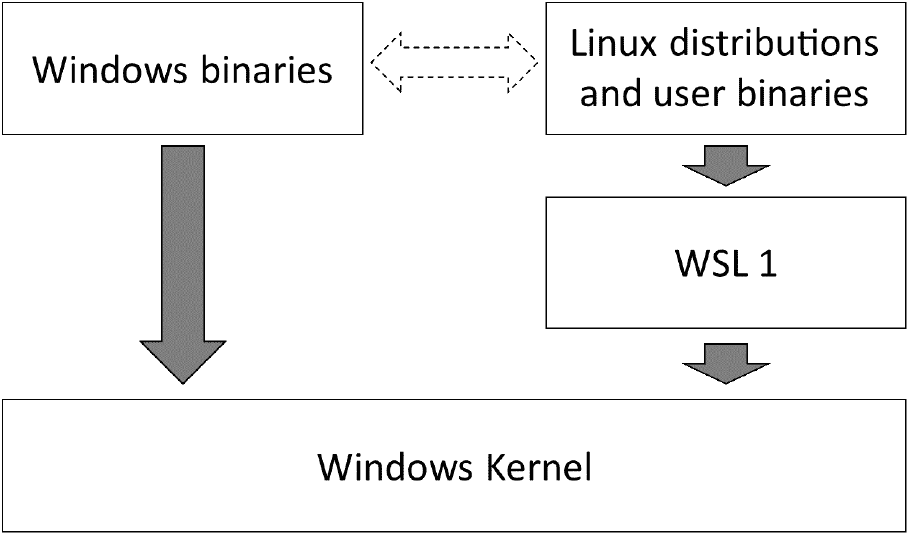
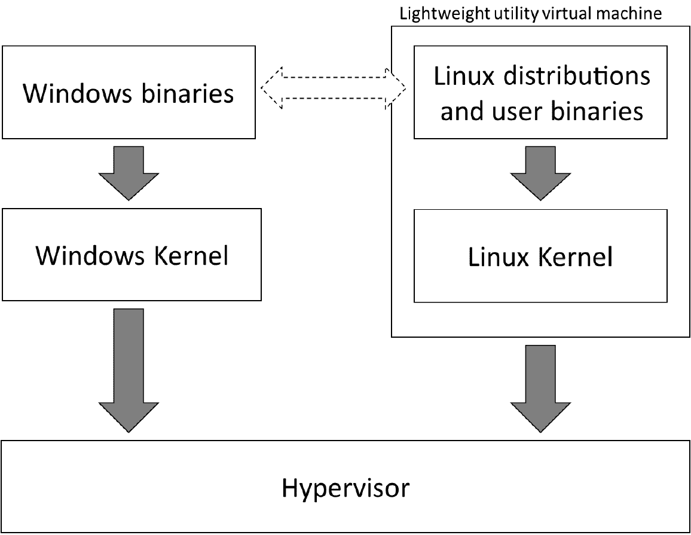

# 第一章：Windows 子系统介绍 Linux

在本章中，您将了解到**Windows 子系统 Linux**（**WSL**）的一些用例，并开始对 WSL 的实际情况以及与仅运行 Linux 虚拟机相比的优劣有所了解。这将帮助我们理解本书的其余部分，我们将学习有关 WSL 的所有内容，以及如何安装和配置它，并获取有关如何在开发者工作流中充分利用它的技巧。

通过 WSL，您可以在 Windows 上运行 Linux 实用工具来帮助您完成工作。您可以使用原生 Linux 工具（如**调试器**）构建 Linux 应用程序，从而打开了一系列仅具有基于 Linux 的构建系统的项目。其中许多项目还会生成 Windows 二进制文件作为输出，但对于 Windows 开发人员来说，访问和贡献这些项目通常很困难。但由于 WSL 为您提供了 Windows 和 Linux 的综合功能，您可以做到这一切，并且仍然可以使用您喜爱的 Windows 实用工具作为工作流的一部分。

本书重点介绍 WSL 的第 2 版，这是一个重大改进的功能，本章将为您概述此版本的工作原理以及与第 1 版的比较。

在本章中，我们将特别涵盖以下主题：

+   什么是 WSL？

+   探索 WSL 1 和 2 之间的区别

所以，让我们从定义 WSL 开始！

# 什么是 WSL？

从高层次来看，WSL 提供了在 Windows 上运行 Linux 二进制文件的能力。多年来，人们一直希望能够运行 Linux 二进制文件，至少可以从**Cygwin**（[`cygwin.com`](https://cygwin.com)）等项目的存在来看。根据其主页的介绍，Cygwin 是“一个大型的 GNU 和开源工具集，提供类似于 Linux 发行版的功能”。在 Cygwin 上运行 Linux 应用程序需要重新构建源代码。WSL 提供了在 Windows 上运行 Linux 二进制文件的能力，无需修改。这意味着您可以立即获取您喜爱的应用程序的最新版本并与之一起工作。

希望在 Windows 上运行 Linux 应用程序的原因有很多，包括以下几点：

+   您目前正在使用 Windows，但对 Linux 应用程序和实用工具有经验和熟悉。

+   您在 Windows 上进行开发，但针对应用程序的部署目标是 Linux（直接或在容器中）。

+   您正在使用开发堆栈，其中生态系统在 Linux 上具有更强的存在，例如 Python，其中一些库是特定于 Linux 的。

无论您希望在 Windows 上运行 Linux 应用程序的原因是什么，WSL 都可以以一种新的、高效的方式为您提供这种能力。虽然在 Hyper-V 中运行 Linux**虚拟机**（**VM**）一直是可能的，但运行虚拟机会对您的工作流程产生一些障碍。

例如，启动虚拟机需要足够的时间，以至于您会中断思路，并且需要从主机机器中分配一定的内存。此外，虚拟机中的文件系统专用于该虚拟机，并与主机隔离。这意味着在 Windows 主机和 Linux 虚拟机之间访问文件需要设置 Hyper-V 功能的客户机集成服务或设置传统的网络文件共享。虚拟机的隔离还意味着虚拟机内部和外部的进程之间没有简单的通信方式。基本上，在任何时候，您要么在虚拟机中工作，要么在虚拟机外工作。

当您首次使用 WSL 启动终端时，您将在 Windows 上运行 Linux shell 的终端应用程序。与虚拟机体验相比，这个看似简单的差异已经更好地融入了工作流程，因为在同一台机器上的窗口之间切换比在 Windows 上的应用程序和虚拟机会话之间切换更容易。

然而，WSL 在集成 Windows 和 Linux 环境方面的工作还不止于此。虽然在虚拟机中，文件系统是被设计为隔离的，但在 WSL 中，默认情况下为你配置了文件系统访问。从 Windows 中，你可以访问一个名为`\\wsl$\`的网络文件共享，当 WSL 运行时，它会自动为你提供访问你的 Linux 文件系统的权限。从 Linux 中，默认情况下会自动挂载你的本地 Windows 驱动器。例如，Windows 的`C:`驱动器会被挂载为`/mnt/c`。

更令人印象深刻的是，你可以在 Windows 中调用 Linux 中的进程，反之亦然。例如，在 WSL 的 Bash 脚本中，你可以调用一个 Windows 应用程序，并通过将其输出导入到另一个命令中在 Linux 中处理该应用程序的输出，就像你使用本地 Linux 应用程序一样。

这种集成超越了传统虚拟机所能实现的范围，并为将 Windows 和 Linux 的能力整合到一个单一的、高效的环境中创造了一些令人惊叹的机会，让你兼具两者的优势！

WSL 在 Windows 主机和 Linux 虚拟机环境之间实现的集成令人印象深刻。然而，如果你使用过 WSL 1 或熟悉它的工作原理，你可能已经阅读了前面的段落，并想知道为什么 WSL 2 放弃了之前的不使用虚拟机的架构。在接下来的部分中，我们将简要介绍 WSL 1 和 WSL 2 之间的不同架构，以及使用虚拟机带来的额外挑战，尽管 WSL 团队面临了创建我们刚刚看到的集成水平的难题。

# 探索 WSL 1 和 2 之间的差异

虽然本书讨论的是**Windows 子系统 Linux**（**WSL 2**）的第二个版本，但简要了解第一版（WSL 1）的工作原理是有帮助的。这将帮助你了解 WSL 1 的限制，并为 WSL 2 中的架构变化和新功能提供背景。本节将介绍这些内容，之后本书的其余部分将重点介绍 WSL 2。

## WSL 1 概述

在 WSL 的第一个版本中，WSL 团队在 Linux 和 Windows 之间创建了一个翻译层。这个层在 Windows 内核之上实现了 Linux 系统调用，使得 Linux 二进制文件可以无需修改地运行；当 Linux 二进制文件运行并进行系统调用时，它调用的是 WSL 翻译层，并将其转换为对 Windows 内核的调用。如下图所示：

图 1.1 - 显示 WSL 1 翻译层的概述

除了翻译层之外，还进行了其他投资，以实现 Windows 和 WSL 之间的文件访问以及在两个系统之间调用二进制文件（包括捕获输出）的能力。这些能力有助于构建整体功能的丰富性。

在 WSL 1 中创建翻译层是一个大胆的举动，为 Windows 开辟了新的可能性，然而，并非所有的 Linux 系统调用都被实现，只有当所需的所有系统调用都被实现时，Linux 二进制文件才能运行。幸运的是，已经实现的系统调用可以让各种应用程序运行，例如 Python 和 Node.js。

翻译层负责弥合 Linux 和 Windows 内核之间的差距，这带来了一些挑战。在某些情况下，弥合这些差异会增加性能开销。在 WSL 1 上运行大量文件访问的应用程序明显较慢；例如，由于在 Linux 和 Windows 之间进行翻译的开销。

在其他情况下，Linux 和 Windows 之间的差异更深，很难看到如何调和它们。例如，在 Windows 上，当打开一个目录中包含的文件时尝试重命名该目录会导致错误，而在 Linux 上可以成功执行重命名操作。在这种情况下，很难看到翻译层如何解决差异。这导致一些系统调用未被实现，结果是一些 Linux 应用程序无法在 WSL 1 上运行。下一节将介绍 WSL 2 中所做的更改以及它们如何解决这个挑战。

## WSL 2 概述

WSL 1 翻译层面虽然令人印象深刻，但它总是会面临性能挑战和难以正确实现的系统调用。通过 WSL 2，WSL 团队重新审视了问题，并提出了一个新的解决方案：一个**虚拟机**！这种方法通过运行 Linux 内核避免了 WSL 1 的翻译层：

图 1.2 - 显示 WSL 2 架构的概要

当你想到虚拟机时，你可能会想到启动速度慢（至少与启动 shell 提示符相比），启动时占用大量内存，并且与主机机器隔离运行的东西。从表面上看，使用虚拟化来运行 WSL 2 可能似乎出乎意料，因为在 WSL 1 中将这两个环境整合在一起的工作已经完成。实际上，在 Windows 上运行 Linux 虚拟机的能力早已存在。那么，WSL 2 与运行虚拟机有何不同？

使用文档中所称的**轻量级实用虚拟机**（参见[`docs.microsoft.com/en-us/windows/wsl/wsl2-about`](https://docs.microsoft.com/en-us/windows/wsl/wsl2-about)），带来了很大的差异。这个虚拟机具有快速启动，只消耗少量内存。当运行需要内存的进程时，虚拟机会动态增加其内存使用量。更好的是，当虚拟机内的内存被释放时，它会返回给主机！

运行 WSL 2 的虚拟机意味着它现在正在运行 Linux 内核（其源代码可在[`github.com/microsoft/WSL2-Linux-Kernel`](https://github.com/microsoft/WSL2-Linux-Kernel)上获得）。这反过来意味着 WSL 1 翻译层面临的挑战被消除了：在 WSL 2 中，性能和系统调用兼容性都得到了极大改善。

WSL 2 对于大多数情况来说是向前迈出的积极一步，同时也保留了 WSL 1（Windows 和 Linux 之间的互操作性）的整体体验。

对于大多数用例来说，由于兼容性和性能，WSL 2 将是首选版本，但有几个值得注意的事项。其中之一是（在撰写本文时）WSL 2 的普遍可用版本不支持 GPU 或 USB 访问（详细信息请参见[`docs.microsoft.com/en-us/windows/wsl/wsl2-faq#can-i-access-the-gpu-in-wsl-2-are-there-plans-to-increase-hardware-support`](https://docs.microsoft.com/en-us/windows/wsl/wsl2-faq#can-i-access-the-gpu-in-wsl-2-are-there-plans-to-increase-hardware-support)）。GPU 支持在 2020 年 5 月的*Build*会议上宣布，并且在撰写本文时可通过 Windows Insiders 计划获得（[`insider.windows.com/en-us/`](https://insider.windows.com/en-us/)）。

另一个考虑因素是，由于 WSL 2 使用虚拟机，运行在 WSL 2 中的应用程序将通过与主机不同的网络适配器连接到网络（具有单独的 IP 地址）。正如我们将在*第五章*中看到的那样，WSL 团队在网络互操作性方面进行了投资，以帮助减少这种影响。

幸运的是，WSL 1 和 WSL 2 可以并行运行，因此如果您有特定的情况需要使用 WSL 1，您可以在那种情况下使用它，并且仍然可以在其他情况下使用 WSL 2。

# 总结

在本章中，您了解了 WSL 是什么以及它如何通过允许在 Windows 和 Linux 环境之间进行文件系统和进程集成来与传统虚拟机的体验有所不同。您还了解了 WSL 1 和 WSL 2 之间的区别概述以及为什么在大多数情况下，改进的性能和兼容性使得 WSL 2 成为首选选项。

在下一章中，您将学习如何安装和配置 WSL 和 Linux 发行版。
