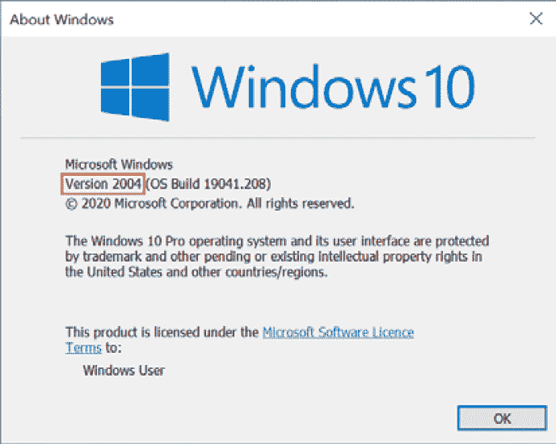
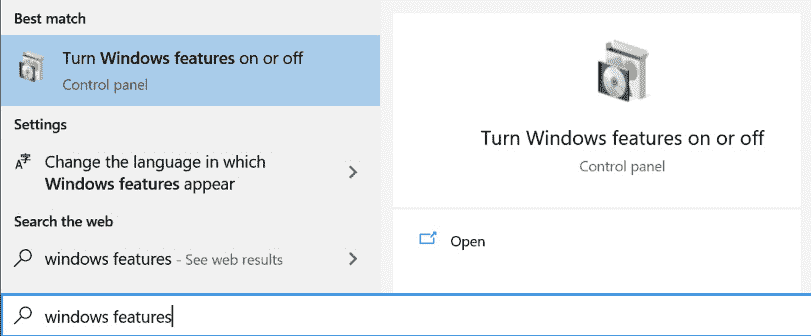
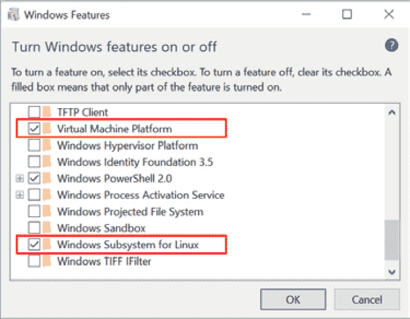
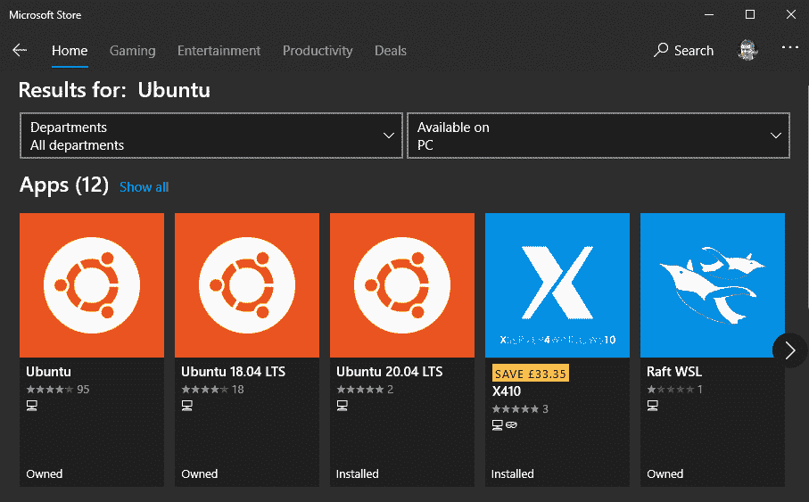

# 第二章：安装和配置 Windows 子系统 Linux

**Windows 子系统 Linux**（**WSL**）不是默认安装的，因此开始使用它的第一步将是安装它以及您选择的 Linux **发行版**（**distro**）。通过本章的学习，您将了解如何安装 WSL 以及如何安装 Linux 发行版以供使用。您还将了解如何检查和控制 Linux 发行版，以及如何配置 WSL 中的其他属性。

在本章中，我们将特别介绍以下主要主题：

+   启用 WSL

+   在 WSL 中安装 Linux 发行版

+   配置和控制 WSL

# 启用 WSL

要准备好运行 WSL 的计算机，您需要确保您使用的是支持 WSL 的 Windows 版本。然后，您可以启用运行 WSL 所需的 Windows 功能，并安装 Linux 内核以准备安装 Linux 发行版。最后，您将能够安装一个或多个 Linux 发行版来运行。

让我们首先确保您正在使用最新版本的 Windows。

## 检查所需的 Windows 版本

要安装 WSL 2，您需要在运行的 Windows 10 版本上安装最新的版本。要检查您正在运行的 Windows 10 版本（以及是否需要更新），请按下*Windows 键* + *R*，然后键入`winver`：



图 2.1 - 显示 2004 更新的 Windows 版本对话框

在此屏幕截图中，您可以看到**版本 2004**表示系统正在运行 2004 版本。之后，您可以看到**OS 构建**为**19041.208**。

要运行 WSL 2，您需要使用版本 1903 或更高版本和 OS 构建 18362 或更高版本。（请注意，ARM64 系统需要使用版本 2004 或更高版本和 OS 构建 19041 或更高版本。）更多详细信息请参见[`docs.microsoft.com/en-us/windows/wsl/install-win10#requirements`](https://docs.microsoft.com/en-us/windows/wsl/install-win10#requirements)。

如果您使用的是较低的版本号，请在计算机上转到**Windows 更新**并应用任何待处理的更新。

重要提示

Windows 10 更新的命名可能有点令人困惑，版本号如 1903 和 1909（或更糟糕的是，看起来像年份的 2004）的含义并不立即显而易见。命名是以**yymm**形式的年份和月份的组合，其中**yy**是年份的最后两位数字，**mm**是月份的两位数字形式。例如，1909 更新计划于 2019 年 9 月发布。同样，2004 版本计划于 2020 年 4 月发布。

现在您知道您使用的是所需的 Windows 版本，让我们开始启用 WSL。

## 检查是否有简易安装选项

在 2020 年 5 月的**BUILD**大会上，微软宣布了一种新的、简化的 WSL 安装方式，但在撰写本文时，这种新方法尚不可用。然而，由于这是一种快速简便的方法，您可能希望在使用较长的安装步骤之前尝试一下，以防在您阅读本文时已经可用！

要尝试一下，请打开您选择的提升的提示符（例如，**命令提示符**）并输入以下命令：

```
Wsl.exe --install
```

如果此命令运行，则表示您具有简易安装选项，并且它将为您安装 WSL。在这种情况下，您可以跳到*配置和控制 WSL 部分（或者如果您想安装其他 Linux 发行版，则跳到安装 Linux 发行版在 WSL 中*部分）。

如果找不到该命令，则继续下一节使用原始方法安装 WSL。

## 启用所需的 Windows 功能

正如在介绍章节中讨论的那样，WSL 的第二版使用了一种新的轻量级实用虚拟机功能。要启用轻量级虚拟机和 WSL，您需要启用两个 Windows 功能：**虚拟机平台**和**Windows 子系统 Linux**。

要通过“Windows 功能”启用这些功能，请单击如下图所示的**打开或关闭 Windows 功能**：



图 2.2-启动 Windows 功能选项

当 Windows 功能对话框出现时，请勾选**虚拟机平台**和**Windows 子系统 Linux**的复选框，如下图所示：



图 2.3-WSL 版本 2 所需的 Windows 功能

单击**确定**后，Windows 将下载并安装组件，并可能提示您重新启动计算机。

如果您喜欢通过命令行启用这些功能，请启动您选择的提升的提示符（例如，命令提示符）并输入以下命令：

```
dism.exe /online /enable-feature /featurename:Microsoft-Windows-Subsystem-Linux /all /norestart
dism.exe /online /enable-feature /featurename:VirtualMachinePlatform /all /norestart
```

完成这些命令后，重新启动计算机，您将准备好安装 Linux 内核。

## 安装 Linux 内核

在安装您喜欢的 Linux 发行版之前的最后一步是安装内核以便运行。在撰写本文时，这是一个手动步骤；将来计划通过 Windows 更新进行自动更新！

现在，访问[`aka.ms/wsl2kernel`](http://aka.ms/wsl2kernel)获取下载和安装内核的链接。完成后，您可以选择要安装的**Linux 发行版**。

# 在 WSL 中安装 Linux 发行版

安装 WSL 的 Linux 发行版的标准方法是通过 Microsoft Store 进行。当前可用的 Linux 发行版的完整列表可以在官方文档中找到（[`docs.microsoft.com/windows/wsl/install-win10#install-your-linux-distribution-of-choice`](https://docs.microsoft.com/windows/wsl/install-win10#install-your-linux-distribution-of-choice)）。在撰写本文时，这包括各种版本的 Ubuntu、OpenSUSE Leap、SUSE Linux Enterprise Server、Kali、Debian、Fedora Remix、Pengwin 和 Alpine。由于我们无法为本书中的每个 Linux 版本都提供示例，我们将重点介绍如何使用*Ubuntu*进行示例。

提示

前一章的步骤已经安装了运行版本 2 发行版所需的所有部分，但版本 1 仍然是默认设置！

这些命令将在本章的下一节中介绍，但如果您想将版本 2 设置为您安装的任何 Linux 发行版的默认设置，则运行以下命令：

`wsl --set-default-version 2`

如果您从 Windows 启动 Microsoft Store，可以搜索您选择的 Linux 发行版。例如，以下图显示了在 Microsoft Store 中搜索`Ubuntu`的结果：



图 2.4-在 Microsoft Store 中搜索 Linux 发行版

当您找到想要的发行版时，请按照以下步骤进行操作：

1.  单击它，然后单击**安装**。然后，商店应用程序将为您下载和安装发行版。

1.  安装完成后，您可以点击**启动**按钮来运行。这将开始您选择的发行版的设置过程，如图所示（以 Ubuntu 为例）。

1.  在设置过程中，您将被要求输入 UNIX 用户名（不必与 Windows 用户名匹配）和 UNIX 密码。

此时，您安装的发行版将运行 WSL 的版本 1（除非您之前运行过`wsl --set-default-version 2`命令）。不用担心-下一节将介绍`wsl`命令，包括在版本 1 和版本 2 之间转换已安装的 Linux 发行版！

现在您已经安装了 Linux 发行版，让我们来看看如何配置和控制它。

# 配置和控制 WSL

前面的部分简要提到了`wsl`命令，这是与 WSL 交互和控制的最常见方式。在本节中，您将学习如何使用`wsl`命令交互地控制 WSL，以及如何通过修改`wsl.conf`配置文件中的设置来更改 WSL 的行为。

重要提示

早期版本的 WSL 提供了一个`wslconfig.exe`实用程序。如果您在文档或文章中看到任何对此的引用，请不用担心-`wslconfig.exe`的所有功能（以及更多）都可以在接下来的部分中看到的`wsl`命令中使用。

以下部分中的命令和配置将为您提供控制 WSL 中运行的发行版以及配置发行版（以及整个 WSL）行为以满足您的要求所需的工具。

## 介绍 wsl 命令

`wsl`命令提供了一种控制和与 WSL 及已安装的 Linux 发行版交互的方式，例如在发行版中运行命令或停止运行的发行版。在本节中，您将通过`wsl`命令的最常用选项进行一次浏览。如果您感兴趣，可以通过运行`wsl --help`找到完整的选项集。

### 列出发行版

`wsl`命令是一个多功能命令行实用程序，既可以用于控制 WSL 中的 Linux 发行版，也可以用于在这些发行版中运行命令。

要开始，请运行`wsl --list`以获取您已安装的 Linux 发行版的列表：

```
PS C:\> wsl --list
Windows Subsystem for Linux Distributions:
Ubuntu-20.04 (Default)
Legacy
docker-desktop
docker-desktop-data
WLinux
Alpine
Ubuntu
PS C:\>
```

前面的输出显示了已安装发行版的完整`列表`，但还有一些其他开关可以应用于自定义此命令的行为。例如，如果您只想查看正在运行的发行版，则可以使用`wsl --list --running`，如下面的片段所示：

```
PS C:\> wsl --list --running
Windows Subsystem for Linux Distributions:
Ubuntu-20.04 (Default)
Ubuntu
PS C:\>
```

列表命令的另一个有用变体是详细输出选项，使用`wsl --list –verbose`来实现，如下所示：

```
PS C:\> wsl --list --verbose
  NAME                   STATE           VERSION
* Ubuntu-20.04           Running         2
  Legacy                 Stopped         1
  docker-desktop         Stopped         2
  docker-desktop-data    Stopped         2
  WLinux                 Stopped         1
  Alpine                 Stopped         2
  Ubuntu                 Running         2
PS C:\>
```

如前面的输出所示，详细选项显示了每个发行版使用的 WSL 版本；您可以看到同时支持`1`和`2`。详细输出还显示了每个发行版是否正在运行。它还在默认发行版旁边包含了一个星号（`*`）。

除了获取有关 WSL 的信息外，我们还可以使用`wsl`命令来控制发行版。

### 控制 WSL 发行版

如`wsl --list --verbose`的输出所示，可以同时安装多个并且它们可以使用不同版本的 WSL。除了具有并行版本之外，安装后还可以在 WSL 版本之间转换发行版。要实现这一点，您可以使用`wsl --set-version`命令。

此命令接受两个参数：

+   要更新的发行版的名称

+   要转换的版本

这里显示了将`Ubuntu`发行版转换为版本 2 的示例：

```
PS C:\> wsl --set-version Ubuntu 2
Conversion in progress, this may take a few minutes...
For information on key differences with WSL 2 please visit https://aka.ms/wsl2
Conversion complete.
PS C:\>
```

默认情况下，为 WSL 安装 Linux 发行版将其安装为版本 1。但是，可以使用`wsl --set-default-version`命令将其更改为默认版本，该命令接受一个版本参数作为默认版本。

例如，`wsl --set-default-version 2`将使 WSL 的版本 2 成为您安装的任何新发行版的默认版本。

接下来，让我们来看看在 Linux 发行版中运行命令的方法。

### 使用 wsl 命令运行 Linux 命令

`wsl`命令的另一个功能是在 Linux 中运行命令。实际上，如果不带任何参数运行`wsl`，它将在默认发行版中启动一个 shell！

如果将命令字符串传递给`wsl`，它将在默认发行版中运行该命令。例如，下面的片段显示了运行`wsl ls ~`和`wsl cat /etc/issue`的输出：

```
PS C:\> wsl ls ~
Desktop    Downloads  Pictures  Templates  source    tmp
Documents  Music      Public    Videos     go        ssh-test  
PS C:\> wsl cat /etc/issue
Ubuntu 20.04 LTS \n \l
PS C:\>
```

从前面的 `wsl cat /etc/issue` 输出可以看出，命令是在 Ubuntu-20.04 发行版中运行的。如果您安装了多个发行版并且想要在特定的发行版中运行命令，则可以使用 `-d` 开关来指定要在其中运行命令的发行版。您可以使用 `wsl --list` 命令获取发行版名称。下面是一些 `wsl -d` 的示例：

```
PS C:\> wsl -d Ubuntu-20.04 cat /etc/issue
Ubuntu 20.04 LTS \n \l
PS C:\> wsl -d Alpine cat /etc/issue
Welcome to Alpine Linux 3.11
Kernel \r on an \m (\l)
PS C:\>
```

前面的示例显示了在多个发行版中运行 `cat /etc/issue` 命令，并且输出确认了命令所针对的发行版。

除了允许您选择在哪个 Linux 发行版中运行命令外，`wsl` 命令还允许您通过 `-u` 开关指定要以哪个用户身份运行命令。我发现最常用的用途是以 root 身份运行命令，这允许使用 `sudo` 在不提示输入密码的情况下运行命令。`-u` 开关在以下输出中进行了演示：

```
PS C:\> wsl whoami
stuart
PS C:\> wsl -u stuart whoami
stuart
PS C:\> wsl -u root whoami
root
PS C:\>
```

前面的输出显示了 `whoami` 命令（输出当前用户）。如果不传递 `-u` 开关，您可以看到命令是以在安装发行版时创建的 `stuart` 用户身份运行的，但是这可以被覆盖。

我们将看一个关于 `wsl` 命令停止运行发行版的最后一个示例。

### 使用 WSL 停止发行版

如果您一直在运行 WSL 并且想要出于任何原因停止它，也可以使用 `wsl` 命令来完成。

如果您运行了多个发行版，并且只想停止特定的一个，可以运行 `wsl --terminate <distro>`，例如 `wsl --terminate Ubuntu-20.04`。

提示

请记住，您可以使用 `wsl --list --running` 命令获取当前正在运行的发行版，就像我们之前看到的那样。

如果您想关闭 WSL 和所有正在运行的发行版，可以运行 `wsl --shutdown`。

现在我们已经看到了如何使用 `wsl` 命令来控制 WSL，让我们来看看 WSL 的配置文件。

## 介绍 wsl.conf 和 .wslconfig

WSL 提供了几个可以配置其行为的位置。其中之一是 `wsl.conf`，它提供了每个发行版的配置，另一个是 `.wslconfig`，它提供了全局配置选项。这两个文件允许您启用 WSL 的不同功能，例如在发行版中挂载主机驱动器的位置，或者控制整体的 WSL 行为，例如它可以消耗多少系统内存。

### 使用 wsl.conf 进行工作

`wsl.conf` 文件位于每个发行版的 `/etc/wsl.conf` 文件中。如果该文件不存在，并且您想要对某个发行版应用一些设置，则在该发行版中创建带有所需配置的文件，并重新启动该发行版（参见“使用 WSL 停止发行版”部分中的 `wsl --terminate`）。

默认选项通常工作良好，但本节将带您浏览 `wsl.conf`，以便您了解如果需要，可以自定义哪些类型的设置。

`wsl.conf` 文件遵循 `ini` 文件结构，其中的名称/值对按部分组织。请参阅以下示例：

```
[section]
value1 = true
value2 = "some content"
# This is just a comment
[section2]
value1 = true
```

以下示例显示了 `wsl.conf` 文件的一些主要部分和值以及它们的默认选项：

```
[automount]
enabled = true # control host drive mounting (e.g. /mnt/c)
mountFsTab = true # process /etc/fstab for additional mounts
root = /mnt/ # control where drives are mounted
[interop]
enabled = true # allow WSl to launch Windows processes
appendWindowsPath = true # add Windows PATH to $PATH in WSL
```

`automount` 部分提供了控制 WSL 在发行版内部挂载 Windows 驱动器的选项。`enabled` 选项允许您完全启用或禁用此行为，而 `root` 选项允许您控制驱动器挂载应在发行版文件系统的哪个位置创建，如果您有理由或偏好将其放在不同的位置。

`interop` 部分控制着允许 Linux 发行版与 Windows 交互的功能。您可以通过将 `enabled` 属性设置为 `false` 来完全禁用该功能。默认情况下，Windows 的 `PATH` 会附加到发行版的 `PATH` 中，但如果您需要更精细地控制发现哪些 Windows 应用程序，则可以使用 `appendWindowsPath` 设置来禁用此功能。

有关`wsl.conf`的完整文档可以在[`docs.microsoft.com/en-us/windows/wsl/wsl-config#configure-per-distro-launch-settings-with-wslconf`](https://docs.microsoft.com/en-us/windows/wsl/wsl-config#configure-per-distro-launch-settings-with-wslconf)找到。您将在*第五章*中了解有关从 WSL 内部访问 Windows 文件和应用程序的更多信息，*Linux 到 Windows 的互操作性*。

在这里，我们已经看到了如何更改每个发行版的配置，接下来我们将看一下系统范围的 WSL 配置选项。

### 使用.wslconfig 文件

除了每个发行版的`wsl.conf`配置外，WSL 的第 2 版还添加了一个全局的`.wslconfig`文件，可以在您的`Windows 用户`文件夹中找到，例如`C:\Users\<您的用户名>\.wslconfig`。

与`wsl.conf`文件一样，`.wslconfig`使用`ini`文件结构。以下示例显示了`[wsl2]`部分的主要值，它允许您更改 WSL 版本 2 的行为：

```
[wsl2]
memory=4GB
processors=2
localhostForwarding=true
swap=6GB
swapFile=D:\\Temp\\WslSwap.vhdx
```

`memory`值配置了用于 WSL 第 2 版的轻量级实用虚拟机消耗的内存限制。默认情况下，这是系统内存的 80%。

同样，`processors`允许您限制虚拟机使用的处理器数量（默认情况下没有限制）。这两个值可以帮助您平衡在 Windows 和 Linux 上运行的工作负载。

另一个需要注意的是路径（例如`swapFile`）需要是绝对路径，并且反斜杠（`\\`）需要转义显示。

还有其他选项（例如`kernel`和`kernelCommandLine`），允许您指定自定义内核或其他内核参数，这超出了本书的范围，但可以在文档中找到：[`docs.microsoft.com/en-us/windows/wsl/wsl-config#configure-global-options-with-wslconfig`](https://docs.microsoft.com/en-us/windows/wsl/wsl-config#configure-global-options-with-wslconfig)。

在本节中，您已经了解了如何通过在发行版的`wsl.conf`文件中更改设置来控制 WSL 集成功能，例如驱动器挂载和调用 Windows 进程的能力。您还了解了如何控制整个 WSL 系统的行为，例如限制内存使用量或处理器数量。这些选项可以确保 WSL 以适合您的系统和工作流程的方式运行。

# 总结

在本章中，您已经了解了如何启用 WSL，安装 Linux 发行版，并确保它们在 WSL 的第 2 版下运行。您还学习了如何使用`wsl`命令来控制 WSL，以及如何使用`wsl.conf`和`.wslconfig`配置文件进一步控制 WSL 和其中运行的发行版的行为。有了这些工具，您可以控制 WSL 及其与系统的交互方式。

在下一章中，我们将介绍新的 Windows 终端，它是与 WSL 自然配对的。我们将介绍如何安装它并使其运行起来。
