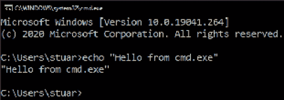
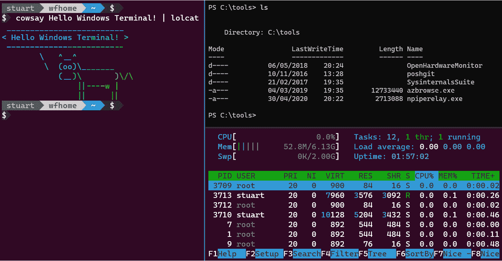
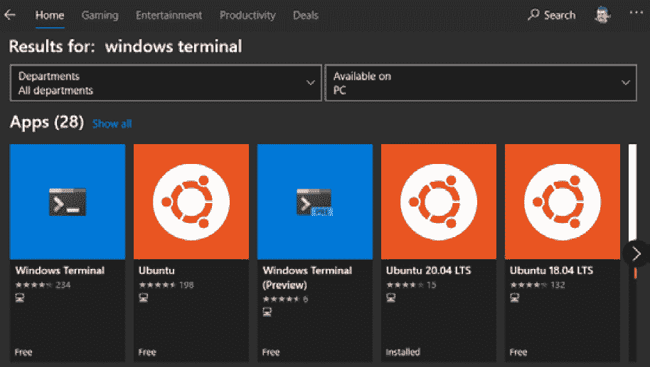
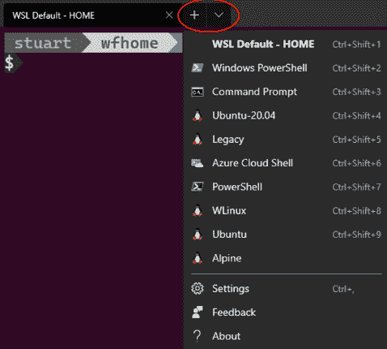
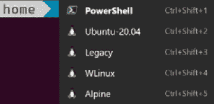
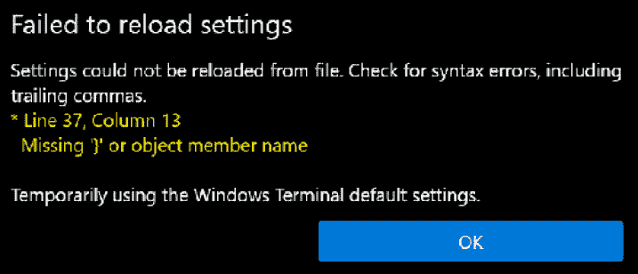
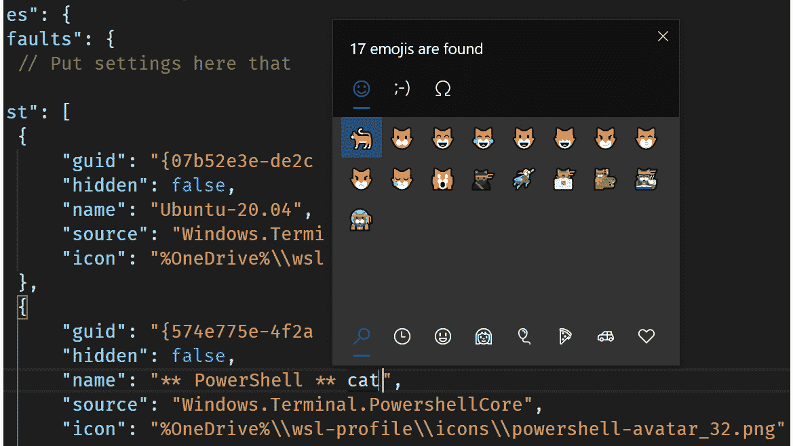
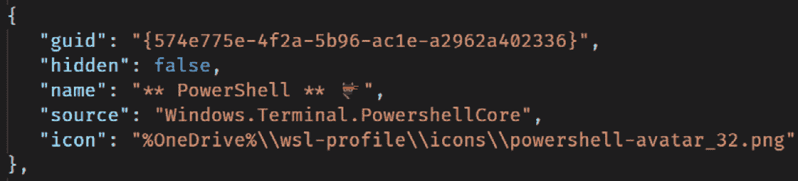
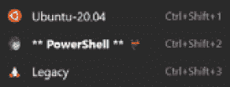

# 第三章：*第三章*：开始使用 Windows 终端

微软已经宣布在即将发布的 Windows 子系统中支持 GUI 应用程序，但在撰写本书时，即使是早期预览形式也不可用。在本书中，我们选择关注 WSL 的稳定发布功能，因此它涵盖了 WSL 的当前以命令行为中心的视图。因此，装备一个良好的终端体验是有意义的。Windows 中的默认控制台体验（由`cmd.exe`使用）在许多方面都有所欠缺，而新的 Windows 终端提供了许多好处。在本章中，我们将介绍其中一些好处，以及如何安装和开始使用 Windows 终端。

在本章中，我们将涵盖以下主要主题：

+   介绍 Windows 终端

+   安装 Windows 终端

+   使用 Windows 终端

+   配置 Windows 终端

# 介绍 Windows 终端

Windows 终端是 Windows 的替代终端体验。如果您习惯在 Windows 上运行命令行应用程序，您可能熟悉在运行 PowerShell 或`cmd.exe`时看到的以前的 Windows 控制台体验（如下图所示）：



图 3.1 - 显示 cmd.exe 用户体验的屏幕截图

Windows 控制台有着悠久的历史，可以追溯到 Windows NT 和 Windows 2000 时代，甚至可以追溯到 Windows 3.x 和 95/98 时代！在此期间，许多 Windows 用户创建了依赖于 Windows 控制台行为的脚本和工具。Windows 控制台团队设法改进了体验（例如，*Ctrl* +鼠标滚轮滚动以缩放文本，并改进了许多 Linux 和 UNIX 命令行应用程序和 shell 发出的 ANSI/VT 控制序列的处理），但在不破坏向后兼容性的情况下，他们最终受到了一些限制。

Windows 控制台团队花费了时间重构控制台的代码，以使其他终端体验（如新的 Windows 终端）能够在其之上构建。

新的 Windows 终端提供了许多改进，使其成为 Windows 控制台应用程序和 Linux shell 应用程序的终端体验更好。通过 Windows 终端，您可以更丰富地支持自定义终端的外观和感觉，并控制键绑定的配置。您还可以在终端中拥有多个选项卡，就像在 Web 浏览器中拥有多个选项卡一样，如下图所示：


图 3.2 - 显示 Windows 终端中多个选项卡的屏幕截图

除了每个窗口有多个选项卡外，Windows 终端还支持将选项卡分割为多个窗格。与选项卡不同，只有一个选项卡可见，而窗格可以将选项卡细分为多个部分。*图 3.3*显示了 Windows 终端中具有多个窗格的情况，其中混合了在 WSL2 中运行的 Bash 和在 Windows 中运行的 PowerShell：



图 3.3 - 显示 Windows 终端中多个窗格的屏幕截图

从上述屏幕截图中可以看出，与默认控制台体验相比，Windows 终端体验有了很大的改进。

您将学习如何利用其更丰富的功能，例如*第六章*中的窗格，*从 Windows 终端获取更多信息*，但现在您已经了解了 Windows 终端的特点，让我们开始安装吧！

# 安装 Windows 终端

Windows 终端（截至撰写本文时）仍在积极开发中，它位于 GitHub 上的[`github.com/microsoft/terminal`](https://github.com/microsoft/terminal)。如果您想运行最新的代码（或有兴趣贡献功能），那么 GitHub 上的文档将引导您完成构建代码所需的步骤。（GitHub 存储库也是提出问题和功能请求的好地方。）

安装 Windows 终端的更常见的方法是通过 Windows Store，它将安装应用程序并为您提供一种轻松的方式来保持更新。您可以在商店应用程序中搜索“Windows 终端”（如下图所示），或使用快速链接[`aka.ms/terminal`](https://aka.ms/terminal)：



图 3.4-显示 Windows Store 应用程序的屏幕截图，显示 Windows 终端

如果您有兴趣提前测试功能（并且不介意潜在的偶尔不稳定），那么您可能会对 Windows 终端预览感兴趣。这也可以在商店应用程序中找到（您可能已经注意到它在前面的图中显示），或通过快速链接[`aka.ms/terminal-preview`](https://aka.ms/terminal-preview)获得。预览版本和主版本可以并行安装和运行。如果您对 Windows 终端的路线图感兴趣，可以在 GitHub 上的文档中找到[`github.com/microsoft/terminal/blob/master/doc/terminal-v2-roadmap.md`](https://github.com/microsoft/terminal/blob/master/doc/terminal-v2-roadmap.md)。

现在您已经安装了 Windows 终端，让我们来了解一些功能。

# 使用 Windows 终端

当您运行 Windows 终端时，它将启动您的默认配置文件。配置文件是指定在终端实例中运行哪个 shell 的一种方式，例如 PowerShell 或 Bash。单击标题栏中的**+**以使用默认配置文件创建一个新选项卡的另一个实例，或者您可以单击向下箭头选择要运行的配置文件，如下图所示：



图 3.5-显示用于创建新选项卡的配置文件下拉菜单的屏幕截图

前面的图显示了启动新终端选项卡的一系列选项，每个选项都被称为一个配置文件。显示的配置文件是由 Windows 终端自动生成的-它检测到我机器上安装了什么，并创建了动态配置文件列表。更好的是，如果我在安装 Windows 终端之后安装了新的 WSL 发行版，它将自动添加到可用配置文件列表中！我们稍后将快速查看如何配置您的配置文件，但首先，让我们看一些 Windows 终端的方便键盘快捷键。

## 学习方便的键盘快捷键

无论您是键盘快捷键的粉丝还是主要使用鼠标的用户，了解一些键盘快捷键都是有益的，尤其是对于 Windows 终端中的常见场景，因此本节列出了最常见的键盘快捷键。

您刚刚看到了如何使用 Windows 终端标题栏中的**+**和向下箭头启动具有默认配置文件的新选项卡或选择要启动的配置文件。使用键盘，可以使用*Ctrl* + *Shift* + *T*启动默认配置文件的新实例。要显示配置文件选择器，可以使用*Ctrl* + *Shift* +空格键，但是如果您查看*图 3.5*中的屏幕截图，您会看到前九个配置文件实际上有自己的快捷键：*Ctrl* + *Shift* + *1*启动第一个配置文件，*Ctrl* + *Shift* + *2*启动第二个配置文件，依此类推。

当您在 Windows 终端中打开多个标签页时，您可以使用*Ctrl* + *Tab*向前导航标签页，使用*Ctrl* + *Shift* + *Tab*向后导航（这与大多数带有标签的浏览器相同）。如果您想导航到特定的标签页，可以使用*Ctrl* + *Alt* + *<n>*，其中*<n>*是您要导航到的标签页的位置，例如，*Ctrl* + *Alt* + *3*导航到第三个标签页。最后，您可以使用*Ctrl* + *Shift* + *W*关闭标签页。

使用键盘可以快速管理 Windows 终端中的标签页。如果 Windows 终端检测到很多配置文件，您可能希望控制它们的顺序，以便将您最常使用的配置文件放在顶部以便轻松访问（并确保它们获取快捷键）。我们将在下一节中看看这个以及其他一些配置选项。

# 配置 Windows 终端

Windows 终端的所有设置都存储在您的 Windows 配置文件中的一个`JSON`文件中。要访问设置，您可以单击向下箭头选择要启动的配置文件，然后选择系统中`JSON`文件的默认编辑器中的`settings.json`。

`settings`文件分为几个部分：

+   `JSON`文件

+   **每个配置文件的设置**，独立定义和配置每个配置文件

+   指定配置文件可以使用的颜色方案的**方案**

+   **键绑定**，允许您自定义在 Windows 终端中执行任务的键盘快捷键

在 Windows 终端的设置中，有很多可以调整的选项，并且随着不断更新，会出现新的选项！所有设置的完整描述留给文档（[`docs.microsoft.com/en-us/windows/terminal/customize-settings/global-settings`](https://docs.microsoft.com/en-us/windows/terminal/customize-settings/global-settings)），我们将重点关注一些可能要进行的自定义以及如何使用`settings`文件实现它们。

让我们开始看一些您可能想要对 Windows 终端中的配置文件进行的自定义。

## 自定义配置文件

`settings`文件的`profiles`部分控制 Windows 终端在单击新标签下拉菜单时显示的配置文件，并允许您配置配置文件的各种显示选项。您还可以选择默认启动的配置文件，如下所示。

### 更改默认配置文件

您可能希望首先进行的更改之一是控制在启动 Windows 终端时默认启动哪个配置文件，以便自动启动您最常使用的配置文件。

此设置在全局设置中的`defaultProfile`值中设置，如下例所示（全局设置是`settings`文件顶层的值）：

```
{
    "$schema": "https://aka.ms/terminal-profiles-schema",
    "defaultProfile": "Ubuntu-20.04",
```

`defaultProfile`设置的值允许您使用要设置为默认配置文件的配置文件的`name`（或关联的`guid`）属性。请确保输入与`profiles`部分中指定的名称完全相同。

接下来，您将查看如何更改 Windows 终端配置文件的顺序。

### 更改配置文件的顺序

您可能希望进行的另一个提高生产力的更改是按照最常用的配置文件顺序排列，以便轻松访问顶部。如果您使用键盘快捷键启动新标签页，则顺序决定了快捷键是什么，因此在这里顺序具有额外的重要性。以下图显示了在我的机器上的初始顺序，如前一节中的设置所示：



图 3.6 - 显示初始配置文件顺序的屏幕截图

在屏幕截图中，您可以看到 PowerShell 是第一个列出的配置文件（您还可以注意到 PowerShell 以粗体显示，表示它是默认配置文件）。

要更改 UI 中配置文件的顺序，我们可以更改`settings`文件中`profiles`下的`list`中的条目顺序。以下代码片段显示了上一节中的设置更新，使**Ubuntu-20.04**成为列表中的第一项：

```
    "profiles":
    {
        "defaults":
        {
            // Put settings here that you want to apply to all profiles.
        },
        "list":
        
            {
                "guid": "{07b52e3e-de2c-5db4-bd2d-ba144ed6c273}",
                "hidden": false,
                "name": "Ubuntu-20.04",
                "source": "Windows.Terminal.Wsl"
            },
            {
                "guid": "{574e775e-4f2a-5b96-ac1e-a2962a402336}",
                "hidden": false,
                "name": "PowerShell",
                "source": "Windows.Terminal.PowershellCore"
            },
            {
                "guid": "{6e9fa4d2-a4aa-562d-b1fa-0789dc1f83d7}",
                "hidden": false,
                "name": "Legacy",
                "source": "Windows.Terminal.Wsl"
            },
// ... more settings omitted
```

保存`settings`文件后，您可以返回到 Windows 终端的下拉菜单中查看顺序的更改：

![图 3.7 - 显示更新后的配置文件顺序的屏幕截图图 3.7 - 显示更新后的配置文件顺序的屏幕截图在上述屏幕截图中，请注意**Ubuntu-20.04**位于列表顶部，现在具有**Ctrl+Shift+1**的快捷键。值得注意的是，**PowerShell**仍然以粗体显示，表示它仍然是默认配置文件，即使它不再是列表中的第一个。需要注意的一点是，列表中的每个项目都需要用逗号分隔，并且最后一个列表项后面不能有逗号。如果您更改列表末尾的项目，这可能会让您感到困惑。然而，Windows 终端可能会显示警告，如下图所示：

图 3.8 - 显示加载设置时出现错误的示例屏幕截图

如果您在上述屏幕截图中看到错误，请不要担心。当 Windows 终端运行时，它会在文件更改时重新加载设置。错误指出了`settings`文件中有错误的部分。当您关闭错误时，Windows 终端仍会重新加载您的设置。

除了控制配置文件在列表中显示的顺序，您还可以更改它们在列表中的显示方式，如下所示。

### 重命名配置文件和更改图标

Windows 终端在预填充配置文件方面做得很好，但您可能希望重命名配置文件。要做到这一点，请根据以下代码片段所示，更改相关配置文件的`name`属性的值。与之前一样，一旦保存文件，Windows 终端将重新加载它并应用更改：

```
{
    "guid": "{574e775e-4f2a-5b96-ac1e-a2962a402336}",
    "hidden": false,
    "name": "** PowerShell **",
    "source": "Windows.Terminal.PowershellCore"
},
```

您甚至可以通过 Windows 表情符号支持进一步操作。当您更改配置文件的名称时，按下*Win* + *.*以打开表情符号选择器，然后继续输入以过滤表情符号列表。例如，下图显示了筛选到猫的情况：



图 3.9 - 显示使用表情选择器的屏幕截图

从列表中选择一个表情符号将其插入到编辑器中，如下图所示：



图 3.10 - 显示已完成的 PowerShell 配置文件的屏幕截图

在此屏幕截图中，您可以看到在`name`属性中使用了一个表情符号。除了更改名称外，设置还允许您自定义列表中配置文件旁边显示的图标。通过向配置文件添加一个图标属性来实现，该属性给出了您希望使用的图标的路径，如上一个屏幕截图所示。该图标可以是`PNG`，`JPG`，`ICO`或其他文件类型 - 我倾向于使用`PNG`，因为它在各种编辑器中易于使用，并允许图像的透明部分。

值得注意的是，路径需要将反斜杠（`\`）转义为双反斜杠（`\\`）。方便的是，您还可以在路径中使用环境变量。这使您可以将图标放在 OneDrive（或其他文件同步平台）中，并在多台机器上共享它们（或仅备份以供将来使用）。要使用环境变量，请将其用百分号括起来，如上面的代码片段中所示的`%OneDrive%`。

这些自定义（图标和文本）的结果如下图所示：



图 3.11 - 显示自定义图标和文本（包括表情符号！）的屏幕截图

到目前为止，您已经了解了如何控制配置文件列表中的项目以及它们的显示方式。最后要看的是如何从列表中删除项目。

### 删除配置文件

如果您已经阅读了前面的部分，您可能会认为删除配置文件只需从列表中删除条目即可。然而，如果配置文件是动态生成的，则在下次加载设置时，Windows Terminal 将重新添加该配置文件（在列表底部）！虽然这可能看起来有点奇怪，但这是 Windows Terminal 自动检测新配置文件（例如新的 WSL Distros）的副作用，即使您在安装 Windows Terminal 之后安装它们。相反，要防止配置文件显示在列表中，您可以设置隐藏属性，如下面的代码片段所示：

```
{
    "guid": "{0caa0dad-35be-5f56-a8ff-afceeeaa6101}",
    "name": "Command Prompt",
    "commandline": "cmd.exe",
    "hidden": true
}
```

现在我们已经探索了如何控制 Windows Terminal 中的配置文件，让我们来看看如何自定义其外观。

## 更改 Windows Terminal 的外观

Windows Terminal 提供了多种方式来自定义其外观，您进行这些操作的动机可能纯粹是为了美观，也可能是为了通过增大字体大小、增加对比度或使用特定字体使内容更易读（例如，在[`www.opendyslexic.org/`](https://www.opendyslexic.org/)上提供的**OpenDyslexic**字体）来使终端更易于使用。

### 更改字体

Windows Terminal 的默认字体是一种名为`!=`的新字体，当呈现为`≠`时，这两个字符会合并在一起。如果您不想使用连字，则**Cascadia Mono**是相同的字体，但不包含连字。

可以通过在配置文件中设置`fontFace`和`fontSize`属性来独立更改每个配置文件的字体，如下面的示例所示：

```
{
    "guid": "{574e775e-4f2a-5b96-ac1e-a2962a402336}",
    "hidden": false,
    "name": "PowerShell",
    "source": "Windows.Terminal.PowershellCore",
    "fontFace": "OpenDyslexicMono",
    "fontSize": 16
},
```

如果您想为所有配置文件自定义字体设置，可以在`defaults`部分中添加`fontFace`和`fontSize`属性，如下面的代码片段所示：

```
"profiles": {
    "defaults": {
        // Put settings here that you want to apply to all profiles.
        "fontFace": "OpenDyslexicMono",
        "fontSize": 16
    },
```

在`defaults`部分指定的设置适用于所有配置文件，除非配置文件覆盖它。现在我们已经了解了如何更改字体，让我们来看看如何控制颜色方案。

### 更改颜色

Windows Terminal 允许您以几种方式自定义配置文件的颜色方案。

最简单的自定义是在配置文件中使用`foreground`、`background`和`cursorColor`属性。这些值以`#rgb`或`#rrggbb`的形式指定为 RGB 值（例如，`#FF0000`表示亮红色）。以下是示例代码片段：

```
{
    "guid": "{07b52e3e-de2c-5db4-bd2d-ba144ed6c273}",
    "name": "Ubuntu-20.04",
    "source": "Windows.Terminal.Wsl",
    "background": "#300A24",
    "foreground": "#FFFFFF",
    "cursorColor": "#FFFFFF"
},
```

要更精细地控制颜色，您可以在`settings`文件的`schemes`部分下创建一个颜色方案。有关详细信息，请参阅[`docs.microsoft.com/en-us/windows/terminal/customize-settings/color-schemes`](https://docs.microsoft.com/en-us/windows/terminal/customize-settings/color-schemes)，其中包括内置颜色方案的列表。如下面的示例所示，方案具有名称和一组以`#rgb`或`#rrggbb`形式的颜色规范：

```
"schemes": [
    {
        "name" : "Ubuntu-inspired",
        "background" : "#300A24",
        "foreground" : "#FFFFFF",
        "black" : "#2E3436",
        "blue" : "#0037DA",
        "brightBlack" : "#767676",
        "brightBlue" : "#3B78FF",
        "brightCyan" : "#61D6D6",
        "brightGreen" : "#16C60C",
        "brightPurple" : "#B4009E",
        "brightRed" : "#E74856",
        "brightWhite" : "#F2F2F2",
        "brightYellow" : "#F9F1A5",
        "cyan" : "#3A96DD",
        "green" : "#13A10E",
        "purple" : "#881798",
        "red" : "#C50F1F",
        "white" : "#CCCCCC",
        "yellow" : "#C19C00"
    }
],
```

定义颜色方案后，您需要更新配置文件设置以使用它。您可以使用`colorScheme`属性指定这一点，并将其应用于单个配置文件级别，或者使用前面在本章中看到的`default`部分将其应用于所有配置文件。以下是将其应用于单个配置文件的示例：

```
{
    "guid": "{07b52e3e-de2c-5db4-bd2d-ba144ed6c273}",
    "name": "Ubuntu-20.04",
    "source": "Windows.Terminal.Wsl",
    "colorScheme": "Ubuntu-inspired"
},
```

保存这些更改后，Windows Terminal 将将您定义的颜色方案应用于使用该配置文件的任何选项卡。

通过这里展示的选项，您可以自定义默认启动的配置文件以及配置文件在配置文件列表中的显示顺序和方式。您已经看到了各种选项，可以让您自定义配置文件在运行时的显示方式，这将使您能够轻松应用其他设置，如设置背景图像或更改终端配置文件的透明度。完整的详细信息可以在 Windows 终端文档中找到：[`docs.microsoft.com/en-us/windows/terminal/customize-settings/profile-settings`](https://docs.microsoft.com/en-us/windows/terminal/customize-settings/profile-settings)。

# 总结

在本章中，您已经了解了 Windows 终端以及它如何通过更好地控制显示和支持多个选项卡等功能来改进以前的终端体验。在使用 WSL 时，自动检测您安装的新 Linux 发行版的终端也是一个不错的好处！

您已经了解了如何安装和使用 Windows 终端，以及如何根据自己的喜好进行自定义，以便您可以轻松阅读文本，并定义颜色方案以便轻松知道哪些终端配置文件正在运行。通过自定义默认配置文件和配置文件顺序，您可以确保轻松访问您最常使用的配置文件，帮助您保持高效。在下一章中，我们将开始使用 Windows 终端，探索如何在 Windows 上与 Linux 发行版进行交互。
