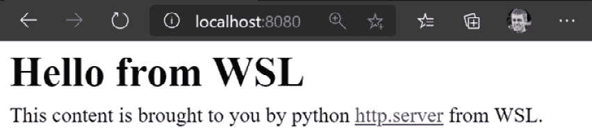

# 第四章：*第四章*：Windows 与 Linux 的互操作性

在*第一章*中，我们将 WSL 体验与在虚拟机中运行 Linux 进行了比较；虚拟机专注于隔离，而 WSL 在 Windows 和 Linux 之间具有强大的互操作性。在本章中，您将开始了解这些功能，从与在 WSL 下运行的文件和应用程序进行交互开始，以及从 Windows 主机环境访问文件。这将包括查看如何在 Windows 和 WSL 中的脚本之间传递输出。之后，我们将看看 WSL 如何使 Linux 中的 Web 应用程序可以从 Windows 访问。

在本章中，我们将介绍以下主要内容：

+   从 Windows 访问 Linux 文件

+   从 Windows 运行 Linux 应用程序

+   从 Windows 访问 Linux Web 应用程序

让我们开始吧！

# 从 Windows 访问 Linux 文件

当您安装了 WSL 后，您会得到一个新的`\\wsl$`路径，您可以在 Windows 资源管理器和其他程序中使用它。如果您在 Windows 资源管理器的地址栏中键入`\\wsl$`，它将列出任何正在运行的 Linux 发行版（distros），如下面的截图所示：

图 4.1 - 在 Windows 资源管理器中显示\\wls$的截图

](img/B16412_04_01.jpg)

图 4.1 - 在 Windows 资源管理器中显示的\\wls$的截图

如前面的截图所示，每个正在运行的发行版都显示为`\\wsl$`下的路径。每个`\\wsl$\<distroname>`都是访问`<distroname>`文件系统根目录的 Windows 路径。例如，`\\wsl$\Ubuntu-20.04`是从 Windows 访问`Ubuntu-20.04`发行版文件系统根目录的路径。这是一种非常灵活和强大的功能，使您可以完全访问 Windows 上的 Linux 发行版的文件系统。

下面的截图显示了 Windows 资源管理器中的`\\wsl$\Ubuntu-20.04\home\stuart\tmp`路径。这对应于`Ubuntu-20.04`发行版中的`~/tmp`文件夹：

图 4.2 - 在 Windows 资源管理器中显示 Linux 发行版内容的截图

](img/B16412_04_02.jpg)

图 4.2 - 在 Windows 资源管理器中显示 Linux 发行版内容的截图

在这些截图中，您可以在 Windows 资源管理器中看到 Linux 文件系统，但是任何可以接受 UNC 路径（即以`\\`开头的路径）的应用程序都可以使用这些路径。例如，从 PowerShell 中，您可以像在 Windows 中一样读取和写入 Linux 文件系统：

```
C:\ > Get-Content '\\wsl$\ubuntu-20.04\home\stuart\tmp\hello-wsl.txt'
Hello from WSL!
C:\ >
```

在此示例中，在 Ubuntu 20.04 发行版中创建了一个名为`~/tmp/hello-wsl.txt`的文本文件，内容为`Hello from WSL!`，并使用`Get-Content` PowerShell cmdlet 使用我们之前看到的`\\wsl$\...`路径读取文件的内容。

在 Windows 资源管理器中浏览文件系统时，双击文件将尝试在 Windows 中打开它。例如，双击我们在*图 4.2*中查看的文本文件将在您的默认文本编辑器（在我的情况下是记事本）中打开，如下面的截图所示：

图 4.3 - 在记事本中打开的 Linux 文件的截图

](img/B16412_04_03.jpg)

图 4.3 - 在记事本中打开的 Linux 文件的截图

此截图显示了与之前通过 PowerShell 获取文件内容的示例相同的内容，但在记事本中打开。使用`\\wsl$\...`路径。

提示

如果您浏览到`\\wsl$`并且看不到您安装的发行版之一，则表示该发行版未运行。

启动发行版的简单方法是使用 Windows 终端在其中启动一个 shell。或者，如果您知道发行版的名称，您可以在 Windows 资源管理器的地址栏（或您正在使用的任何应用程序）中键入`\\wsl$\<distroname>`，WSL 将自动启动发行版，以允许您浏览文件系统！

正如您在本节中所看到的，`\\wsl$\`共享提供了从 Windows 应用程序访问 WSL 发行版文件系统内文件的能力。这是在 WSL 中桥接 Windows 和 Linux 的有用步骤，因为它允许您使用 Windows 工具和应用程序来处理 Linux 文件系统中的文件。

接下来，我们将看一下如何从 Windows 中运行 WSL 中的应用程序。

# 从 Windows 中运行 Linux 应用程序

在*第二章*中，*安装和配置 Windows 子系统*，我们简要介绍了`wsl`命令，并且您看到了它如何用于控制运行的发行版和在发行版内执行应用程序。在本节中，我们将深入探讨使用`wsl`命令在发行版中运行应用程序。

正如我们在上一节中看到的，能够在 Windows 和 Linux 之间访问文件非常有用，而能够调用应用程序进一步增强了这一功能。WSL 不仅可以从 Windows 中的发行版运行应用程序，还可以在应用程序之间进行输出导入。在 Windows 或 Linux 中构建脚本时，通过应用程序之间的输出导入来构建脚本功能是一种非常常见的方式。能够在 Windows 和 Linux 命令之间进行输出导入，使您能够构建在 Windows 和 Linux 上运行的脚本，这真的有助于建立这两个环境的统一感。我们将开始看一下它是如何工作的。

## 导入到 Linux 中

在本节中，我们将探讨将数据从 Linux 传输到 Windows 的方法。我遇到过很多次的一种情况是有一些数据，比如日志输出，我想对其进行一些处理。一个例子是处理每一行以提取 HTTP 状态码，然后进行分组和计数，以计算记录了多少个成功和失败。我们将使用一个代表这种情况的示例，但不需要任何真实的设置：我们将检查 Windows 目录中以每个字母开头的文件数量。

让我们从一些 PowerShell 开始（我们将逐步构建脚本，所以如果您对 PowerShell 不太熟悉，不用担心）：

1.  首先，我们将使用`Get-ChildItem`获取`Windows`文件夹的内容，如下所示：

```
SystemRoot environment variable to refer to the Windows folder (typically C:\Windows) in case you have customized the install location. The output shows some of the files and folders from the Windows folder, and you can see various properties for each item, such as LastWriteTime, Length, and Name.
```

1.  接下来，我们可以执行提取操作，例如提取文件名的第一个字母。我们可以通过将`Get-ChildItem`的输出导入到`ForEach-Object` cmdlet 中来扩展我们之前的命令，如下所示：

```
ForEach-Object, which takes the input ($_) and gets the first character using Substring, which lets you take part of a string. The first argument to Substring specifies where to start (0 indicates the start of the string) and the second argument is how many characters to take. The previous output shows that some of the files and folders start with lowercase and others start with uppercase, so we call ToUpper to standardize using uppercase.
```

1.  下一步是对项目进行分组和计数。由于目标是演示在 Windows 和 Linux 之间进行输出导入，我们暂时忽略 PowerShell 的`Group-Object` cmdlet，而是使用一些常见的 Linux 实用工具：`sort`和`uniq`。如果您在 Linux 中使用这些命令与其他输出一起使用，可以将其作为`other-command | sort | uniq -c`进行管道传输。然而，由于`sort`和`uniq`是 Linux 命令，我们在 Windows 上运行此命令，需要使用`wsl`命令来运行它们，如下面的输出所示：

```
PS C:\> Get-Childitem $env:SystemRoot | ForEach-Object { $_.Name.Substring(0,1).ToUpper() } | wsl sort | wsl uniq -c                                                                                                              
      5 A
      5 B
      5 C
      9 D
      3 E
      2 F
...
```

前面的输出显示了我们的目标结果：每个字母开头的文件和文件夹的数量。但更重要的是，它显示了将 Windows 命令的输出导入 Linux 命令的管道工作正常！

在此示例中，我们调用了两次`wsl`：一次用于`sort`，一次用于`uniq`，这将导致输出在管道中的每个阶段在 Windows 和 Linux 之间进行传输。如果我们稍微改变命令的结构，我们可以使用单个`wsl`调用。尝试将输入管道到`wsl sort | uniq -c`可能会很诱人，但这会尝试将`wsl sort`的输出管道到 Windows 的`uniq`命令中。您还可以考虑`wsl "sort | uniq -c"`，但会出现错误`/bin/bash: sort | uniq -c: command not found`。相反，我们可以使用`wsl`运行`bash`和我们的命令`wsl bash -c "sort | uniq -c"`。完整的命令如下：

```
PS C:\> Get-Childitem $env:SystemRoot | ForEach-Object { $_.Name.Substring(0,1).ToUpper() } | wsl bash -c "sort | uniq -c"

      5 A
      5 B
      5 C
      9 D
      3 E
      2 F
...
```

正如您所看到的，这与先前版本的输出相同，但只执行了一次`wsl`。虽然这可能不是运行复杂命令的最明显的方法，但它是一种有用的技术。

在这个例子中，我们一直关注将数据导入 Linux，但当从 Linux 命令导出输出时，它同样有效，我们将在下一节中看到。

## 从 Linux 进行管道传输

在前一节中，我们看了如何将 Windows 命令的输出导入 Linux，并通过使用 PowerShell 检索`Windows`文件夹中的项目并获取它们的首字母，然后将字母传递给 Linux 实用程序进行排序、分组和计数来探索这一点。在本节中，我们将看看如何将 Linux 实用程序的输出导入 Windows。我们将使用反向示例，通过 Bash 列出文件并使用 Windows 实用程序处理输出。

首先，让我们从默认的发行版中获取`/usr/bin`文件夹中的文件和文件夹：

```
PS C:\> wsl ls /usr/bin
 2to3-2.7                             padsp
 GET                                  pager
 HEAD                                 pamon
 JSONStream                           paperconf
 NF                                   paplay
 POST                                 parec
 Thunar                               parecord
...
```

此输出显示了`/usr/bin`文件夹的内容，下一步是获取名称的第一个字符。为此，我们可以使用`cut`命令。我们可以运行`wsl ls /usr/bin | wsl cut -c1`，但我们可以重用我们在上一节中看到的技术将其组合成一个单独的`wsl`命令：

```
PS C:\> wsl bash -c "ls /usr/bin | cut -c1"
2
G
H
J
N
P
T
```

从前面的输出中可以看到，我们现在只有第一个字符，并且我们已经准备好对它们进行排序和分组。为了进行这个练习，我们假装`sort`和`uniq`命令不存在，而是使用 PowerShell 的`Group-Object` cmdlet：

```
PS C:\> wsl bash -c "ls /usr/bin | cut -c1-1" | Group-Object
Count Name                      Group
----- ----                      -----
    1 [                         {[}
    1 2                         {2}
   46 a                         {a, a, a, a…}
   79 b                         {b, b, b, b…}
   82 c                         {c, c, c, c…}
   79 d                         {d, d, d, d…}
   28 e                         {e, e, e, e…}
   49 f                         {f, f, f, f…}
  122 G                         {G, g, g, g…}
```

在这里，我们可以看到从在 WSL 中运行的 Bash 命令成功地通过管道传输到 PowerShell 的`Group-Object` cmdlet。在前一节中，我们强制将字符转换为大写，但在这里我们不需要这样做，因为`Group-Object`默认执行不区分大小写的匹配（尽管可以使用`-CaseSensitive`开关覆盖这一点）。

通过这些示例，您可以通过 WSL 调用 Linux 发行版来执行 Linux 应用程序和实用程序。这些示例只使用了默认的 WSL 发行版，但在上面的所有示例中，您可以在`wsl`命令上添加`-d`开关以指定要在其中运行 Linux 命令的发行版。如果您有多个发行版，并且您需要的特定应用程序仅在其中一个发行版中可用，这将非常有用。

能够在 Windows 和 Linux 应用程序之间双向传输输出允许在组合应用程序时具有很大的灵活性。如果您更熟悉 Windows 实用程序，您可以执行 Linux 应用程序，然后使用 Windows 实用程序处理结果。或者，如果 Linux 是您更熟悉的地方，但您需要在 Windows 机器上工作，那么能够调用熟悉的 Linux 实用程序来处理 Windows 输出将帮助您提高工作效率。

您已经看到如何从 Windows 访问 Linux 文件并从 Windows 调用 Linux 应用程序。在下一节中，您将看到如何从 Windows 访问在 WSL 中运行的 Web 应用程序。

# 从 Windows 访问 Linux Web 应用程序

如果您正在开发 Web 应用程序，那么在您工作时，通常会在 Web 浏览器中打开应用程序，地址为`http://localhost`。使用 WSL，您的 Web 应用程序在 WSL 轻量级虚拟机内运行，该虚拟机具有单独的 IP 地址（您可以使用 Linux 的`ip addr`命令找到此地址）。幸运的是，WSL 将 localhost 地址转发到 Linux 发行版以保持自然的工作流程。您将在本节中了解到这一点。

要跟随本章的内容，请确保您已经在 Linux 发行版中克隆了本书的代码，在终端中打开，并导航到`chapter-04/web-app`文件夹，网址为[`github.com/PacktPublishing/Windows-Subsystem-for-Linux-2-WSL-2-Tips-Tricks-and-Techniques/tree/main/chapter-04`](https://github.com/PacktPublishing/Windows-Subsystem-for-Linux-2-WSL-2-Tips-Tricks-and-Techniques/tree/main/chapter-04)。

示例代码使用 Python 3，如果您使用的是最新版本的 Ubuntu，则应该已经安装了 Python 3。您可以通过在 Linux 发行版中运行`python3 -c 'print("hello")'`来测试是否安装了 Python 3。如果命令成功完成，则说明已经准备就绪。如果没有，请参考 Python 文档以获取安装说明：[`wiki.python.org/moin/BeginnersGuide/Download`](https://wiki.python.org/moin/BeginnersGuide/Download)。

在`chapter-04/web-app`文件夹中，您应该看到`index.html`和`run.sh`。在终端中运行`./run.sh`来运行 Web 服务器：

```
$ ./run.sh
Serving HTTP on 0.0.0.0 port 8080 (http://0.0.0.0:8080/) ... 
```

您应该看到类似于前面输出的输出，以指示 Web 服务器正在运行。

您可以通过在 Linux 发行版中启动新的终端并运行`curl`来验证 Web 服务器是否正在运行：

```
$ curl localhost:8080
<!DOCTYPE html>
<html lang="en">
<head>
    <meta charset="UTF-8">
    <meta name="viewport" content="width=device-width, initial-scale=1.0">
    <title>Chapter 4</title>
</head>
<body>
    <h1>Hello from WSL</h1>
    <p>This content is brought to you by python <a href="https://docs.python.org/3/library/http.server.html">http.server</a> from WSL.</p>
</body>
</html>
$
```

此输出显示了 Web 服务器对`curl`请求的响应返回的 HTML。

接下来，在 Windows 中打开您的 Web 浏览器，并导航到`http://localhost:8080`。



图 4.4 - 显示 WSL Web 应用程序在 Windows 浏览器中的屏幕截图

正如前面的屏幕截图所示，WSL 将 Windows 中的**localhost**流量转发到 Linux 发行版。当您使用 WSL 开发 Web 应用程序或运行具有 Web 用户界面的应用程序时，您可以使用**localhost**访问 Web 应用程序，就像它在 Windows 本地运行一样；这是另一种真正平滑用户体验的集成。

# 总结

在本章中，您已经看到了 WSL 允许我们如何与 Linux 发行版在 Windows 中进行互操作的方式，从通过`\\wsl$\...`路径访问 Linux 文件系统开始。您还看到了如何从 Windows 调用 Linux 应用程序，并且可以通过在它们之间传递输出来链接 Windows 和 Linux 命令，就像在任一系统中一样。最后，您看到了 WSL 将**localhost**请求转发到在 WSL 发行版内部运行的 Web 服务器。这使您可以轻松地在 WSL 中开发和运行 Web 应用程序，并从 Windows 浏览器中进行测试。

能够从 Windows 访问 WSL 发行版的文件系统并在其中执行命令，真正有助于将这两个系统结合在一起，并帮助您选择您喜欢的工具来完成您正在进行的任务，而不管它们在哪个操作系统中。在下一章中，我们将探索从 WSL 发行版内部与 Windows 交互的能力。
