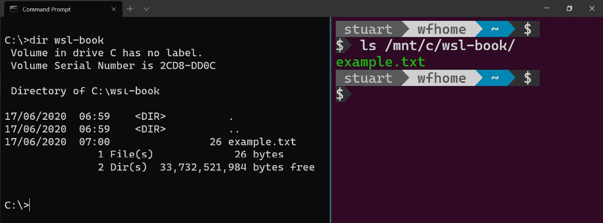
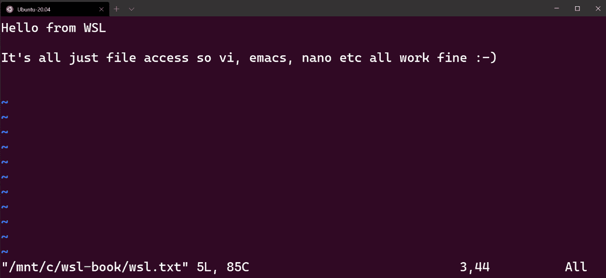
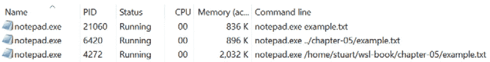

# 第五章：Linux 到 Windows 的互操作性

在*第一章*中，*介绍 Windows 子系统 Linux*，我们将 WSL 体验与在虚拟机中运行 Linux 进行了比较，并提到了 WSL 的互操作性能力。在*第四章*中，*Windows 到 Linux 的互操作性*，我们看到了如何开始利用这些互操作性功能。在本章中，我们将继续探索互操作性功能，但这次是从 Linux 端进行。这将使您能够将 Windows 命令和工具的功能带入 WSL 环境中。

我们将首先看一下如何在 WSL 环境中与 Windows 应用程序和文件进行交互。接下来，我们将介绍如何在 Linux 和 Windows 之间处理脚本，包括如何在它们之间传递输入。最后，我们将提供一些互操作性技巧和窍门，以提高您的生产力，从通过别名使 Windows 命令更加自然，到在 Windows 和 Linux 之间共享**安全外壳**（**SSH**）密钥以便于使用和维护。

在本章中，我们将涵盖以下主要主题：

+   从 Linux 访问 Windows 文件

+   从 Linux 调用 Windows 应用程序

+   从 Linux 调用 Windows 脚本

+   互操作性技巧和窍门

让我们从第一个主题开始！

# 从 Linux 访问 Windows 文件

默认情况下，WSL 会自动将 Windows 驱动器挂载到 WSL 的`/mnt`目录下；例如，您的`C:`驱动器会被挂载为`/mnt/c`。要尝试这个功能，请在`C:`驱动器上创建一个名为`wsl-book`的文件夹，并在其中放置一个`example.txt`文件（文本文件的内容并不重要）。现在，在 WSL 中打开一个终端并运行`ls /mnt/c/wsl-book`，您将在 Bash 输出中看到您创建的文件：



图 5.1 - 屏幕截图显示了从 Windows 和 WSL 列出文件夹内容

此屏幕截图显示了 Windows 中的目录列表，右侧是 WSL 发行版中`/mnt/c`路径下的`example.txt`。

您可以像与任何其他文件一样与挂载的文件进行交互；例如，您可以使用`cat`命令查看文件的内容：

```
$ cat /mnt/c/wsl-book/example.txt
Hello from a Windows file!
```

或者，您可以将内容重定向到 Windows 文件系统中的文件：

```
$ echo "Hello from WSL" > /mnt/c/wsl-book/wsl.txt
$ cat /mnt/c/wsl-book/wsl.txt
Hello from WSL
```

或者，您可以在`vi`（或您喜欢的其他终端文本编辑器）中编辑文件：



图 5.2 - 屏幕截图显示了在 WSL 下使用 vi 编辑 Windows 文件

在此屏幕截图中，您可以看到从 Windows 文件系统中的文件在 WSL 发行版中的`vi`中进行编辑，之前运行了`vi /mnt/c/wsl-book/wsl.txt`命令。

重要提示

在 Windows 下，文件系统通常是不区分大小写的；也就是说，Windows 将`SomeFile`视为与`somefile`相同。在 Linux 下，文件系统是区分大小写的，因此它们将被视为两个不同的文件。

当从 WSL 挂载访问 Windows 文件系统时，Linux 端对文件进行区分大小写处理，因此尝试从`/mnt/c/wsl-book/EXAMPLE.txt`读取将失败。

尽管 Linux 端将文件系统视为区分大小写，但底层的 Windows 文件系统仍然是不区分大小写的，这一点很重要。例如，虽然 Linux 会将`/mnt/c/wsl-book/wsl.txt`和`/mnt/c/wsl-book/WSL.txt`视为不同的文件，但从 Linux 写入`/mnt/c/wsl-book/WSL.txt`实际上会覆盖先前创建的`wsl.txt`文件的内容，因为 Windows 将名称视为不区分大小写。

正如您在本节中所看到的，自动创建的挂载点（`/mnt/...`）使得通过 WSL 非常容易访问 Windows 文件（如果您想禁用此挂载或更改挂载点的位置，可以使用`wsl.conf`，如*第二章*所示，*安装和配置 Windows 子系统用于 Linux*）。下一节将介绍如何从 Linux 调用 Windows 应用程序。

# 从 Linux 调用 Windows 应用程序

在*第四章*中，我们看到了如何使用`wsl`命令从 Windows 调用 Linux 应用程序。而从 Linux 调用 Windows 应用程序则更加简单！为了看到这一点，启动 WSL 发行版中的终端，并运行`/mnt/c/Windows/System32/calc.exe`来直接从 Linux 启动 Windows 计算器应用程序。如果 Windows 没有安装在`C:\Windows`中，则更新路径以匹配。通过这种方式，您可以从 WSL 发行版的终端启动任何 Windows 应用程序。

在 Windows 计算器（以及许多其他应用程序）的情况下，WSL 实际上使得这更容易。这次，在终端中键入`calc.exe`，Windows 计算器仍然会运行。之所以能够运行，是因为`calc.exe`在 Windows 路径中，并且（默认情况下）WSL 将映射 Windows 路径到 WSL 发行版中的 Linux 路径。为了证明这一点，在终端中运行`echo $PATH`：

```
$ echo $PATH
/home/stuart/.local/bin:/home/stuart/bin:/usr/local/sbin:/usr/local/bin:/usr/sbin:/usr/bin:/sbin:/bin:/usr/games:/usr/local/games:/mnt/c/Program Files (x86)/Microsoft SDKs/Azure/CLI2/wbin:/mnt/c/WINDOWS/system32:/mnt/c/WINDOWS:/mnt/c/WINDOWS/System32/Wbem:/mnt/c/WINDOWS/System32/WindowsPowerShell/v1.0/:/mnt/c/Program Files/dotnet/:/mnt/c/Go/bin:/mnt/c/Program Files (x86)/nodejs/:/mnt/c/WINDOWS/System32/OpenSSH/:/mnt/c/Program Files/Git/cmd:/mnt/c/Program Files (x86)/Microsoft VS Code/bin:/mnt/c/Program Files/Azure Data Studio/bin:/mnt/c/Program Files/Microsoft VS Code Insiders/bin:/mnt/c/Program Files/PowerShell/7/:/mnt/c/Program Files/Docker/Docker/resources/bin:/mnt/c/ProgramData/DockerDesktop/version-bin:/mnt/c/Program Files/Docker/Docker/Resources/bin:… <truncated>
```

从这个例子中可以看出，Linux 中的`PATH`变量不仅包含常见的路径，如`/home/stuart/bin`，还包含已经转换为使用 WSL 挂载的 Windows `PATH`变量的值，例如`/mnt/c/WINDOWS/System32`。由此产生的结果是，您习惯于在 Windows 中无需指定路径即可运行的任何应用程序也可以在 WSL 中无需指定路径运行。一个区别是在 Windows 中，我们不需要指定文件扩展名（例如，我们可以在 PowerShell 中运行`calc`），但在 WSL 中我们需要。

在上一节中，我们在 Windows 中创建了一个文本文件（`c:\wsl-book\wsl.txt`），并使用`vi`在 Linux 中打开了它，但是如果我们想在 Windows 应用程序中打开该文件怎么办？如果您尝试从 Linux 运行`notepad.exe c:\wsl-book\wsl.txt`，记事本将显示找不到该文件的错误。要解决此问题，您可以将路径放在引号中（`notepad.exe "c:\wsl-book\wsl.txt"`）或转义反斜杠（`notepad.exe c:\\wsl-book\\wsl.txt`）。使用这两种修复方法之一，该命令将启动记事本并打开指定的文件。

实际上，当您在 WSL 发行版的终端中工作时，您将花费大量时间在 Linux 文件系统中处理文件，并且您将希望在编辑器中打开*这些*文件。如果您有本书的示例代码（您可以在[`github.com/PacktPublishing/Windows-Subsystem-for-Linux-2-WSL-2-Tips-Tricks-and-Techniques`](https://github.com/PacktPublishing/Windows-Subsystem-for-Linux-2-WSL-2-Tips-Tricks-and-Techniques)找到它），请在终端中导航到`chapter-05`文件夹，其中有一个`example.txt`文件（如果您没有示例，请运行`echo "Hello from WSL!" > example.txt`创建一个测试文件）。在终端中，尝试运行`notepad.exe example.txt` - 这将使用 WSL 文件系统加载`example.txt`文件启动记事本。这非常方便，因为它允许您轻松启动 Windows GUI 编辑器来处理 WSL 发行版中的文件。

在本节中，我们已经看到了如何轻松地从 WSL 调用 Windows GUI 应用程序并将路径作为参数传递。在下一节中，我们将看看如何从 WSL 调用 Windows 脚本，以及在需要时如何明确转换路径。

# 从 Linux 调用 Windows 脚本

如果你习惯在 Windows 中运行 PowerShell，那么你也习惯于能够直接调用 PowerShell cmdlet 和脚本。当你在 WSL 中运行 PowerShell 脚本时，有两个选择：在 Linux 上安装 PowerShell 或调用 Windows 上的 PowerShell 运行脚本。如果你对 Linux 上的 PowerShell 感兴趣，安装文档可以在[`docs.microsoft.com/en-us/powershell/scripting/install/installing-powershell-core-on-linux?view=powershell-7`](https://docs.microsoft.com/en-us/powershell/scripting/install/installing-powershell-core-on-linux?view=powershell-7)找到。然而，由于本章重点是从 WSL 调用 Windows，我们将看看后者选项。

PowerShell 是一个 Windows 应用程序，并且在 Windows 路径中，所以我们可以在 Linux 中使用`powershell.exe`来调用它，就像我们在上一节中看到的那样。要使用 PowerShell 运行命令，我们可以使用`-C`开关（缩写为`-Command`）：

```
$ powershell.exe -C "Get-ItemProperty -Path Registry::HKEY_LOCAL_MACHINE\HARDWARE\DESCRIPTION\System"
Component Information : {0, 0, 0, 0...}
Identifier            : AT/AT COMPATIBLE
Configuration Data    :
SystemBiosVersion     : {OEMC - 300, 3.11.2650,
                        American Megatrends - 50008}
BootArchitecture      : 3
PreferredProfile      : 8
Capabilities          : 2327733
...
```

正如你所看到的，在这里我们使用了`-C`开关来运行 PowerShell 的`Get-ItemProperty` cmdlet 来从 Windows 注册表中检索值。

除了能够调用 PowerShell cmdlet 外，你还可以从 Linux 调用 PowerShell 脚本。本书的附带代码包含一个名为`wsl.ps1`的示例脚本。该脚本向用户打印问候语（使用传入的`Name`参数），打印出当前工作目录，然后输出一些来自 Windows 事件日志的条目。从 Bash 提示符下，将工作文件夹设置为`chapter-05`文件夹，我们可以运行该脚本：

```
$ powershell.exe -C ./wsl.ps1 -Name Stuart
Hello from WSL: Stuart
Current directory: Microsoft.PowerShell.Core\FileSystem
::\\wsl$\Ubuntu-20.04\home\stuart\wsl-book\chapter-05
Index Source      Message
----- ------      -------
14954 edgeupdatem The description for Event ID '0'...
14953 edgeupdate  The description for Event ID '0'...
14952 ESENT       svchost (15664,D,50) DS_Token_DB...
14951 ESENT       svchost (15664,D,0) DS_Token_DB:...
14950 ESENT       svchost (15664,U,98) DS_Token_DB...
14949 ESENT       svchost (15664,R,98) DS_Token_DB...
14948 ESENT       svchost (15664,R,98) DS_Token_DB...
14947 ESENT       svchost (15664,R,98) DS_Token_DB...
14946 ESENT       svchost (15664,R,98) DS_Token_DB...
14945 ESENT       svchost (15664,P,98) DS_Token_DB...
```

前面的输出显示了运行我们刚刚描述的脚本的结果：

+   我们可以看到`Hello from WSL: Stuart`的输出，其中包括`Stuart`（我们作为`Name`参数传递的值）。

+   当前目录的输出为（`Microsoft.PowerShell.Core\FileSystem::\\wsl$\Ubuntu-20.04\home\stuart\wsl-book\chapter-05`）。

+   调用`Get-EventLog` PowerShell cmdlet 时的 Windows 事件日志条目。

这个例子展示了获取 Windows 事件日志条目，但由于它在 Windows 中运行 PowerShell，你可以访问任何 Windows PowerShell cmdlet 来检索 Windows 数据或操作 Windows。

正如你在这里看到的，能够像这里展示的那样调用 PowerShell 命令和脚本提供了一种从 Windows 获取信息的简单方法。这个例子还展示了从 WSL 传递参数（`Name`）到 PowerShell 脚本，接下来，我们将进一步探讨如何结合使用 PowerShell 和 Bash 命令。

## 在 PowerShell 和 Bash 之间传递数据

有时，调用 PowerShell 命令或脚本就足够了，但有时你会希望在 Bash 中处理该命令的输出。在 WSL 中处理 PowerShell 脚本的输出的方式很自然：

```
$ powershell.exe -C "Get-Content ./wsl.ps1" | wc -l
10
```

正如你所看到的，这个命令演示了将执行一些 PowerShell 的输出通过管道传递到`wc -l`中，它计算输入中的行数（在这个例子中为`10`）。

在编写脚本时，你可能还希望将值传递给 PowerShell 脚本。在简单的情况下，我们可以使用 Bash 变量，如下所示：

```
$ MESSAGE="Hello"; powershell.exe -noprofile -C "Write-Host $MESSAGE"
Hello
```

在这里，我们在 Bash 中创建了一个`MESSAGE`变量，然后在传递给 PowerShell 的命令中使用它。这种方法使用了 Bash 中的变量替换-传递给 PowerShell 的实际命令是`Write-Host Hello`。这种技术适用于某些场景，但有时你实际上需要将输入传递给 PowerShell。这种方法不太直观，使用了 PowerShell 中的特殊`$input`变量：

```
$ echo "Stuart" | powershell.exe -noprofile -c 'Write-Host "Hello $input"'
Hello Stuart
```

在这个例子中，你可以看到从`echo "Stuart"`输出的结果被传递到 PowerShell 中，PowerShell 使用`$input`变量来检索输入。这个例子被故意保持简单，以帮助展示传递输入的技巧。更常见的情况是，输入可以是文件的内容或另一个 Bash 命令的输出，而 PowerShell 命令可以是执行更丰富处理的脚本。

在本节中，您已经了解了如何从 WSL 调用 Windows 应用程序，包括如何在 GUI 应用程序中打开 WSL 文件。您还了解了如何调用 PowerShell 脚本，以及如何在 PowerShell 和 Bash 之间传递数据，以创建跨两个环境的脚本，为您提供更多编写脚本的选项。在下一节中，我们将探索一些技巧和诀窍，使集成更加紧密，进一步提高您的生产力。

# 互操作性技巧和诀窍

在本节中，我们将介绍一些技巧，可以在 Windows 和 WSL 之间工作时提高您的生产力。我们将看到如何使用别名来避免在执行 Windows 命令时指定扩展名，使其更加自然。我们还将看到如何将文本从 Linux 复制到 Windows 剪贴板，以及如何使 Windows 文件夹在 WSL 发行版中更加自然。之后，我们将看到如何从 Linux 中的默认 Windows 应用程序打开文件。从那里开始，我们将看到当我们将 WSL 路径作为参数传递给它们时，Windows 应用程序如何能够与 WSL 路径一起工作，以及在默认行为不起作用时如何控制映射路径。最后，我们将看到如何将 Windows 中的 SSH 密钥共享到 WSL 发行版中，以便轻松进行密钥维护。

让我们开始使用别名。

## 创建 Windows 应用程序的别名

正如本章前面提到的，当从 WSL 调用 Windows 应用程序时，我们需要包括文件扩展名。例如，我们需要使用`notepad.exe`来启动记事本，而在 Windows 中，我们只需使用`notepad`。如果您习惯于不包括文件扩展名，那么包括它可能需要一点时间来适应。

作为重新训练自己的替代方法，您可以重新训练 Bash！Bash 中的别名允许您为命令创建别名或替代名称。例如，运行`alias notepad=notepad.exe`将为`notepad.exe`创建一个名为`notepad`的别名。这意味着当您运行`notepad hello.txt`时，Bash 将将其解释为`notepad.exe hello.txt`。

在终端中以交互方式运行`alias`命令只会为当前 shell 实例设置别名。要永久添加别名，请将`alias`命令复制到您的`.bashrc`（或`.bash_aliases`）文件中，以便每次启动 shell 时自动设置它。

接下来，我们将看一下一个方便的 Windows 实用程序，它是一个很好的别名候选者。

## 将输出复制到 Windows 剪贴板

Windows 已经有了`clip.exe`实用程序很长时间了。`clip.exe`的帮助文本指出它*将命令行工具的输出重定向到 Windows 剪贴板*，这是一个很好的描述。正如我们在本章前面看到的，我们可以将 WSL 的输出导入到 Windows 应用程序中，并且我们可以使用`clip.exe`将其放入 Windows 剪贴板中。

例如，运行`echo $PWD > clip.exe`将当前工作目录在终端中（即`$PWD`的值）传输到`clip.exe`。换句话说，您可以将当前工作目录从 WSL 复制到 Windows 剪贴板中。

您还可以将其与别名（`alias clip=clip.exe`）结合使用，简化为`echo $PWD > clip`。

我经常使用`clip.exe` - 例如，将命令的输出复制到我的代码编辑器或电子邮件中 - 这样可以避免在终端中选择和复制文本。

让我们继续使用一些技巧，看看如何使 Windows 路径在 WSL 中更加自然。

## 使用符号链接使 Windows 路径更易访问

正如我们之前看到的，我们可以通过`/mnt/c/…`映射访问 Windows 路径。但是，您可能会发现有一些路径您经常访问，并且希望更方便地访问它们。对我来说，其中一个路径是我的 Windows `Downloads`文件夹 - 每当我发现一个我想要在 WSL 中安装的 Linux 工具并需要下载一个安装包时，我的浏览器默认将其下载到 Windows 的`Downloads`文件夹中。虽然我可以通过`/mnt/c/Users/stuart/Downloads`访问它，但我更喜欢在 WSL 中将其访问为`~/Downloads`。

为了实现这一点，我们可以使用`ln`实用程序创建一个以 Windows `Downloads`文件夹为目标的`~/Downloads`：

```
$ ln -s /mnt/c/Users/stuart/Downloads/ ~/Downloads
$ ls ~/Downloads
browsh_1.6.4_linux_amd64.deb
devcontainer-cli_linux_amd64.tar.gz
powershell_7.0.0-1.ubuntu.18.04_amd64.deb
windirstat1_1_2_setup.exe
wsl_update_x64.msi
```

在此输出中，您可以看到使用`ln -s /mnt/c/Users/stuart/Downloads/ ~/Downloads`命令创建符号链接（您需要更改第一个路径以匹配您的 Windows `Downloads`文件夹）。之后，您可以看到在 WSL 中列出新的符号链接位置的内容输出。

虽然在 WSL 中没有特殊的符号链接功能，但能够创建指向 Windows 文件夹的符号链接使您能够进一步自定义 WSL 环境。当您使用 WSL 时，您可能会发现自己想要创建符号链接的文件夹。

接下来，我们将看一下如何在默认的 Windows 编辑器中打开 WSL 文件。

## 使用 wslview 启动默认的 Windows 应用程序

在本章中，我们已经看到了如何从 WSL 调用特定的 Windows 应用程序。Windows 还具有另一个功能，即能够启动*一个文件*并让 Windows 确定应该启动哪个应用程序来打开它。例如，在 PowerShell 提示符下执行`example.txt`将打开默认的文本编辑器（通常是记事本），而执行`example.jpg`将打开默认的图像查看器。

幸运的是，有帮助可得，`wslutilities`中的`wslview`允许我们从 Linux 中执行相同的操作。在 Microsoft Store 中的最新版本的 Ubuntu 预装了`wslutilities`，但其他发行版的安装说明可以在[`github.com/wslutilities/wslu`](https://github.com/wslutilities/wslu)找到。

安装了`wslutilities`后，您可以在 WSL 终端中运行`wslview`：

```
# Launch the default Windows test editor
$ wslview my-text-file.txt
# Launch the default Windows image viewer
wslview my-image.jpg
# Launch the default browser
wslview https://wsl.tips
```

这些命令展示了使用`wslview`的几个示例。前两个示例展示了根据文件扩展名启动默认的 Windows 应用程序。第一个示例启动默认的 Windows 文本编辑器（通常是记事本），第二个示例启动与 JPEG 文件关联的 Windows 应用程序。在第三个示例中，我们传递了一个 URL，这将在默认的 Windows 浏览器中打开该 URL。

这个实用程序是从 WSL 控制台到 Windows 图形应用程序的一种非常方便的桥梁。

在撰写本文时，`wslview`可以使用的路径存在一些限制；例如，`wslview ~/my-text-file.txt`将失败并显示错误`系统找不到指定的文件`。在下一节中，我们将介绍如何在 Windows 和 Linux 之间转换路径以解决这个问题。

## 在 Windows 和 WSL 之间映射路径

在本章的前面部分，我们在 WSL 中运行了诸如`notepad.exe example.txt`之类的命令，结果记事本打开了我们指定的文本文件。乍一看，似乎 WSL 在我们运行命令时为我们转换了路径，但下面的屏幕截图显示了任务管理器中的记事本（添加了**命令行**列）：



图 5.3 - 显示任务管理器中运行的 notepad.exe 的屏幕截图

在此屏幕截图中，您可以看到记事本使用了三个不同的参数：

+   `notepad.exe example.txt`

+   `notepad.exe ../chapter-05/example.txt`

+   `notepad.exe /home/stuart/wsl-book/chapter-05/example.txt`

对于列出的每个示例，我确保我在一个目录中，该目录解析为 WSL 中的一个文件，并且每次 Notepad 启动时，示例文件都会被打开，即使参数直接传递给 Notepad 而不进行转换（如*图 5.3*中的截图所示）。

这个工作方式对于我们作为 WSL 用户非常有帮助，但是虽然在这种情况下它可以正常工作，以及大多数其他情况下，了解它为什么可以正常工作对于它无法正常工作的情况也是有用的。这样，您就知道何时可能需要更改行为，例如在从 WSL 调用 Windows 脚本时。那么，如果在调用命令时路径没有被转换，记事本是如何在 WSL 中找到`example.txt`的呢？答案的第一部分是，当 WSL 启动记事本时，它的工作目录被设置为与 WSL 终端的当前工作目录相对应的`\\wsl$\...`路径。我们可以通过运行`powershell.exe ls`来确认这种行为：

```
$ powershell.exe ls
Directory: \\wsl$\Ubuntu-20.04\home\stuart\wsl-book\chapter-05
Mode                 LastWriteTime         Length Name
----                 -------------         ------ ----
------        01/07/2020     07:57             16 example.txt
$
```

在这个输出中，您可以看到从 WSL 启动的 PowerShell 列出了其当前工作目录的内容。WSL shell 的工作目录是`/home/stuart/wsl-book/chapter-05`，当启动 PowerShell 时，它会得到 Windows 的等效路径，即`\\wsl$\Ubuntu-20.04\home\stuart\wsl-book\chapter-05`。

现在我们知道记事本的工作目录是基于 WSL 工作目录的，我们可以看到在我们的前两个示例（`notepad.exe example.txt`和`notepad.exe ../chapter-05/example.txt`）中，记事本将路径视为相对路径，并根据其工作目录解析它们以找到文件。

最后一个示例（`notepad.exe /home/stuart/wsl-book/chapter-05/example.txt`）略有不同。在这种情况下，记事本将路径解析为根相对路径。如果记事本的工作目录是`C:\some\folder`，那么它将将路径解析为相对于其工作目录的根目录（`C:\`），并生成路径`C:\home\stuart\wsl-book\chapter-05\example.txt`。然而，由于我们是从 WSL 启动记事本的，它的工作目录是`\\wsl$\Ubuntu-20.04\home\stuart\wsl-book\chapter-05`，这是一个 UNC 路径，因此根被认为是`\\wsl$\Ubuntu-20.04`。这非常好，因为它映射到`Ubuntu-20.04`发行版文件系统的根目录，所以将 Linux 绝对路径添加到它上面生成了预期的路径！

这种映射非常高效，大部分情况下都能正常工作，但在前面的部分中，我们看到`wslview ~/my-text-file.txt`无法正常工作。当我们需要自己控制路径映射时，我们有另一个工具可以使用，接下来我们将看看它。

### 介绍 wslpath

`wslpath`实用程序可用于在 Windows 路径和 Linux 路径之间进行转换。例如，要将 WSL 路径转换为 Windows 路径，我们可以运行以下命令：

```
$ wslpath -w ~/my-text-file.txt
\\wsl$\Ubuntu-20.04\home\stuart\my-text-file.txt
```

这个输出显示`wslpath`返回了我们作为参数传递的 WSL 路径的`\\wsl$\...`路径。

我们还可以使用`wslpath`将路径转换为相反的方向：

```
$ wslpath -u '\\wsl$\Ubuntu-20.04\home\stuart\my-text-file.txt'
/home/stuart/my-text-file.txt
```

在这里，我们可以看到`\\wsl$\...`路径已经被转换回 WSL 路径。

重要提示

在 Bash 中指定 Windows 路径时，您必须对它们进行转义或用单引号括起来，以避免需要转义。对于`\\wsl$\...`路径中的美元符号也是如此。

在前面的示例中，我们使用的是 WSL 文件系统中的文件路径，但`wslpath`同样适用于 Windows 文件系统中的路径：

```
$ wslpath -u 'C:\Windows'
/mnt/c/Windows
$ wslpath -w /mnt/c/Windows
C:\Windows
```

在这个输出中，您可以看到`wslpath`将 Windows 文件系统中的路径转换为`/mnt/...`路径，然后再转换回来。

现在我们已经看到了`wslpath`的工作原理，让我们来看几个使用它的示例。

### wslpath 的使用

在本章的早些时候，我们看到了方便的`wslview`实用程序，但观察到它只处理相对的 WSL 路径，因此我们不能使用`wslview /home/stuart/my-text-file.txt`。但是`wslview`可以使用 Windows 路径，并且我们可以利用`wslpath`来实现这一点。例如，`wslview $(wslpath -w /home/stuart/my-text-file.txt)`将使用`wslpath`将路径转换为相应的 Windows 路径，然后使用该值调用`wslview`。我们可以将所有这些封装到一个函数中以便使用：

```
# Create a 'wslvieww' function
wslvieww() { wslview $(wslpath -w "$1"); };
# Use the function 
wslvieww /home/stuart/my-text-file.txt
```

在此示例中，使用 Bash 创建了一个名为`wslvieww`的函数（额外的`w`是为了 Windows），但如果您愿意，可以选择其他名称。然后，以与`wslview`相同的方式调用新函数，但这次执行路径映射，Windows 能够解析映射的路径并在文本编辑器中加载它。

我们之前看到的另一个可以使用`wslpath`的示例是在 Linux 的`home`文件夹中创建指向 Windows 的`Downloads`文件夹的符号链接。本章前面给出的命令要求您编辑命令以将适当的路径放入 Windows 用户配置文件中。以下一组命令将在不修改的情况下执行此操作：

```
WIN_PROFILE=$(cmd.exe /C echo %USERPROFILE% 2>/dev/null)
WIN_PROFILE_MNT=$(wslpath -u ${WIN_PROFILE/[$'\r\n']})
ln -s $WIN_PROFILE_MNT/Downloads ~/Downloads
```

这些命令显示了调用 Windows 以获取`USERPROFILE`环境变量，然后使用`wslpath`将其转换为`/mnt/…`路径。最后，将其与`Downloads`文件夹组合，并传递给`ln`以创建符号链接。

这些只是`wslpath`用于在 Windows 和 WSL 文件系统之间转换路径时的一些示例。大多数情况下，这是不需要的，但了解它的存在（以及如何使用它）可以帮助您在 WSL 中高效地处理文件。

我们将看一下如何在 Windows 和 WSL 发行版之间共享 SSH 密钥的最后一个提示。

## SSH 代理转发

在使用 SSH 连接远程机器时，通常会使用 SSH 身份验证密钥。SSH 密钥也可以用于身份验证其他服务，例如通过`git`将源代码更改推送到 GitHub。

本节将指导您配置用于 WSL 发行版的 OpenSSH 身份验证代理。假设您已经拥有 SSH 密钥和一台要连接的机器。

提示

如果您没有 SSH 密钥，可以参考 OpenSSH 文档中的创建方法：[`docs.microsoft.com/en-us/windows-server/administration/openssh/openssh_keymanagement`](https://docs.microsoft.com/en-us/windows-server/administration/openssh/openssh_keymanagement)。

如果您没有要连接的机器，Azure 文档将帮助您创建具有 SSH 访问权限的虚拟机（您可以使用免费试用版进行操作）：[`docs.microsoft.com/en-us/azure/virtual-machines/linux/ssh-from-windows#provide-an-ssh-public-key-when-deploying-a-vm`](https://docs.microsoft.com/en-us/azure/virtual-machines/linux/ssh-from-windows#provide-an-ssh-public-key-when-deploying-a-vm)。

如果您在 Windows 和一个或多个 WSL 发行版中使用 SSH 密钥，您可以每次复制 SSH 密钥。另一种选择是在 Windows 中设置**OpenSSH 身份验证代理**，然后配置 WSL 发行版以使用该代理获取密钥。这意味着您只需要管理一个地方的 SSH 密钥，并且只需要在一个地方输入 SSH 密钥的密码（假设您正在使用密码）。

让我们开始使用 Windows 的 OpenSSH 身份验证代理。

### 确保 Windows 的 OpenSSH 身份验证代理正在运行

设置的第一步是确保 Windows 的 OpenSSH 身份验证代理正在运行。为此，请在 Windows 中打开**服务**应用程序，并向下滚动到**OpenSSH 身份验证代理**。如果它显示为**正在运行**，则右键单击并选择**属性**。在打开的对话框中，确保具有以下设置：

+   **启动类型**为**自动**。

+   **服务状态**为**正在运行**（如果没有，请点击**启动**按钮）。

现在，您可以使用`ssh-add`将您的密钥添加到代理中 - 例如，`ssh-add ~/.ssh/id_rsa`。如果您的 SSH 密钥有密码短语，您将被提示输入密码。如果出现找不到`ssh-add`的错误，则使用以下说明安装 OpenSSH 客户端：[`docs.microsoft.com/en-us/windows-server/administration/openssh/openssh_install_firstuse`](https://docs.microsoft.com/en-us/windows-server/administration/openssh/openssh_install_firstuse)。

要检查密钥是否已正确添加，请尝试从 Windows 运行`ssh`以连接到远程机器：

```
C:\ > ssh stuart@sshtest.wsl.tips
key_load_public: invalid format
Welcome to Ubuntu 18.04.4 LTS (GNU/Linux 5.3.0-1028-azure x86_64)                                                                           
Last login: Tue Jul  7 21:24:59 2020 from 143.159.224.70
stuart@slsshtest:~$ 
```

在此输出中，您可以看到`ssh`正在运行并成功连接到远程机器。

提示

如果您已经配置了 SSH 密钥用于与 GitHub 进行身份验证，您可以使用`ssh -T git@github.com`来测试您的连接。有关在 GitHub 上使用 SSH 密钥的完整详细信息，请访问[`docs.github.com/en/github/authenticating-to-github/connecting-to-github-with-ssh`](https://docs.github.com/en/github/authenticating-to-github/connecting-to-github-with-ssh)。

告诉 Git 使用`GIT_SSH`环境变量为`C:\Windows\System32\OpenSSH\ssh.exe`（或者如果您的 Windows 文件夹不同，则为安装路径）。

到目前为止，我们已经在 Windows 中配置了 OpenSSH 身份验证代理，并使用了我们的 SSH 密钥。如果我们的密钥有密码短语，这将避免我们每次使用它们时都被提示输入密码。接下来，我们将设置从 WSL 访问这些密钥。

### 从 WSL 配置访问 Windows SSH 密钥

现在我们已经在 Windows 中使密钥工作，我们希望在 WSL 中设置我们的 Linux 发行版以连接到 Windows 的 OpenSSH 身份验证代理。Linux `ssh`客户端具有`SSH_AUTH_SOCK`环境变量，允许您在检索 SSH 密钥时提供一个套接字供`ssh`连接。挑战在于 OpenSSH 身份验证代理允许通过 Windows 命名管道进行连接，而不是套接字（更不用说是一个单独的机器了）。

为了将 Linux 套接字连接到 Windows 命名管道，我们将使用两个实用程序：`socat`和`npiperelay`。`socat`实用程序是一个强大的 Linux 工具，可以在不同位置之间中继流。我们将使用它来监听`SSH_AUTH_SOCK`套接字并转发到一个它执行的命令。该命令将是`npiperelay`实用程序（由 Windows 团队的开发人员 John Starks 编写，他在 Linux 和容器方面做了很酷的工作），它将将其输入转发到一个命名管道。

要安装`npiperelay`，请从 GitHub 获取最新版本（[`github.com/jstarks/npiperelay/releases/latest`](https://github.com/jstarks/npiperelay/releases/latest)）并将`npiperelay.exe`提取到您的路径中的位置。要安装`socat`，请运行`sudo apt install socat`。

要开始转发 SSH 密钥请求，请在 WSL 中运行以下命令：

```
export SSH_AUTH_SOCK=$HOME/.ssh/agent.sock
socat UNIX-LISTEN:$SSH_AUTH_SOCK,fork EXEC:"npiperelay.exe -ei -s //./pipe/openssh-ssh-agent",nofork &
```

第一行设置了`SSH_AUTH_SOCK`环境变量。第二行运行`socat`并告诉它监听`SSH_AUTH_SOCK`套接字并将其中继到`npiperelay`。`npiperelay`命令行告诉它监听并将其输入转发到`//./pipe/openssh-ssh-agent`命名管道。

有了这个设置，您现在可以在 WSL 发行版中运行`ssh`：

```
$ ssh stuart@sshtest.wsl.tips
agent key RSA SHA256:WEsyjMl1hZY/xahE3XSBTzURnj5443sg5wfuFQ+bGLY returned incorrect signature type
Welcome to Ubuntu 18.04.4 LTS (GNU/Linux 5.3.0-1028-azure x86_64)
Last login: Wed Jul  8 05:45:15 2020 from 143.159.224.70
stuart@slsshtest:~$
```

此输出显示在 WSL 发行版中成功运行`ssh`。我们可以通过使用`-v`（详细）开关运行`ssh`来验证密钥是否已从 Windows 加载：

```
$ ssh -v stuart@sshtest.wsl.tips
...
debug1: Offering public key: C:\\Users\\stuart\\.ssh\\id_rsa RSA SHA256:WEsyjMl1hZY/xahE3XSBTzURnj5443sg5wfuFQ+bGLY agent
debug1: Server accepts key: C:\\Users\\stuart\\.ssh\\id_rsa RSA SHA256:WEsyjMl1hZY/xahE3XSBTzURnj5443sg5wfuFQ+bGLY agent
...
```

完整的详细输出非常长，但在其中的这个片段中，我们可以看到`ssh`用于建立连接的密钥。请注意，路径是 Windows 路径，显示密钥是通过 Windows OpenSSH 代理加载的。

我们之前运行的命令启动了`socat`，使我们能够测试这种情况，但您可能希望自动转发 SSH 密钥请求，而不需要在每个新的终端会话中运行这些命令。为了实现这一点，请将以下行添加到您的`.bash_profile`文件中：

```
export SSH_AUTH_SOCK=$HOME/.ssh/agent.sock
ALREADY_RUNNING=$(ps -auxww | grep -q "[n]piperelay.exe -ei -s //./pipe/openssh-ssh-agent"; echo $?)
if [[ $ALREADY_RUNNING != "0" ]]; then
    if [[ -S $SSH_AUTH_SOCK ]]; then
 (http://www.tldp.org/LDP/abs/html/fto.html)
        echo "removing previous socket..."
        rm $SSH_AUTH_SOCK
    fi
    echo "Starting SSH-Agent relay..."
    (setsid socat UNIX-LISTEN:$SSH_AUTH_SOCK,fork EXEC:"npiperelay.exe -ei -s //./pipe/openssh-ssh-agent",nofork &) /dev/null 2>&1
fi
```

这些命令的本质与原始的`socat`命令相同，但增加了错误检查，在启动之前测试`socat`命令是否已经运行，并允许它在终端会话之间持久存在。

有了这个设置，您可以有一个地方来管理您的 SSH 密钥和密码短语（Windows 的 OpenSSH 身份验证代理），并无缝共享您的 SSH 密钥与您的 WSL 发行版。

此外，将 Linux 套接字转发到 Windows 命名管道的技术可以在其他情况下使用。请查看`npiperelay`文档以获取更多示例，包括从 Linux 连接到 Windows 中的 MySQL 服务：[`github.com/jstarks/npiperelay`](https://github.com/jstarks/npiperelay)。

在这个技巧和窍门的部分，您已经看到了一系列示例，说明了在 WSL 和 Windows 之间桥接的技术，从创建命令别名到共享 SSH 密钥。虽然这些示例的目的是直接使用，但它们背后的技术是可推广的。例如，SSH 密钥共享示例展示了如何使用一些工具来实现 Linux 套接字和 Windows 命名管道之间的桥接，并可以在其他场景中使用。

# 总结

在本章中，您已经学会了如何从 WSL 发行版访问 Windows 文件系统中的文件，以及如何从 Linux 启动 Windows 应用程序，包括使用`wlsview`实用程序轻松启动文件的默认 Windows 应用程序。您已经学会了如何在 Windows 和 Linux 脚本之间传递输入，包括在需要时如何使用`wslpath`映射两个文件系统方案之间的路径。

在本章的结尾，您了解了如何将 Linux 套接字映射到 Windows 命名管道，并使用此技术使您的 Windows SSH 密钥在 WSL 中可用。这使您可以避免将 SSH 密钥复制到每个 WSL 发行版中，而是在一个共享的地方管理您的 SSH 密钥和密码短语，从而更容易控制和备份您的 SSH 密钥。

所有这些都有助于通过 WSL 将 Windows 和 Linux 更紧密地联系在一起，并在您的日常工作流程中提高生产力。

在本章中，我们在终端上花了相当多的时间。在下一章中，我们将重新访问 Windows 终端，并探索一些更高级的方法来自定义它以满足您的需求。
