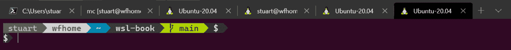
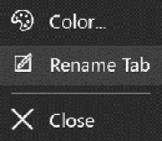
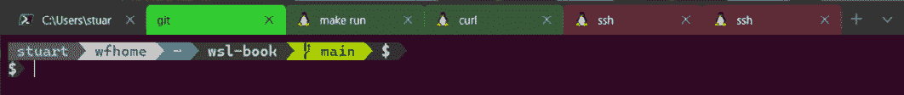
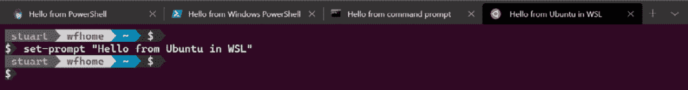
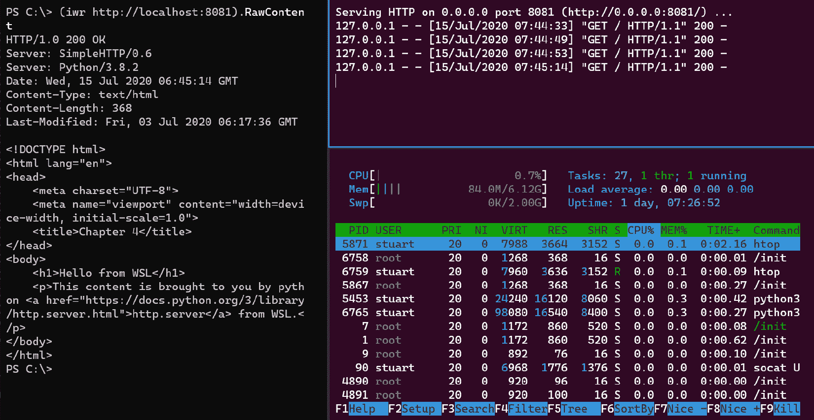
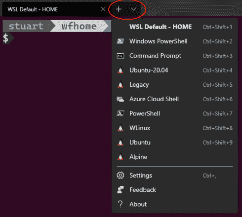
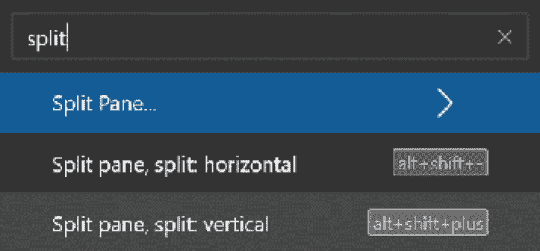
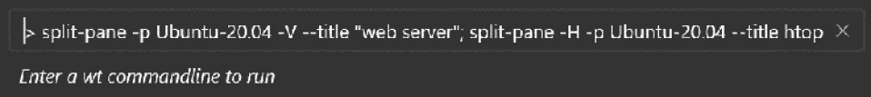
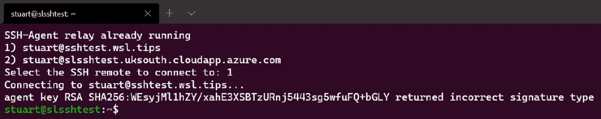

# 第六章：*第六章*：从 Windows 终端获取更多信息

新的 Windows 终端在*第三章*，*开始使用 Windows 终端*中介绍过，您已经了解了如何安装它以及如何自定义配置文件的顺序和它们在该章节中使用的颜色方案。在本章中，我们将进一步探索 Windows 终端，并介绍一些在 Windows 终端中运行多个不同 shell 的方法。之后，我们将介绍如何添加自定义配置文件，以简化常见任务的流程。

在本章中，我们将涵盖以下主要内容：

+   自定义选项卡标题

+   使用多个窗格

+   添加自定义配置文件

我们将从查看如何使用选项卡标题来帮助您管理多个选项卡开始本章。

# 自定义选项卡标题

**选项卡式用户界面**很棒；浏览器有它们，编辑器有它们，Windows 终端也有它们。对于某些人，包括我自己在内，选项卡式用户界面也带来了一些挑战 - 我打开了很多选项卡：



图 6.1 - Windows 终端的屏幕截图，打开了许多选项卡

正如前面的屏幕截图所示，打开多个选项卡时，很难确定每个选项卡正在运行的内容以及您使用它的目的。当我编码时，我经常打开一个选项卡用于执行 Git 操作，另一个用于构建和运行代码，另一个用于在代码运行时与代码进行交互。除此之外，还有一个额外的选项卡用于一些常规系统交互，以及一个或两个选项卡用于查看其他项目中的问题。这样，选项卡的数量很快就增加了。

前面的屏幕截图显示，根据选项卡中运行的 shell，您可能会获得一些路径信息，但是如果在相同路径下有多个选项卡，即使这样也没有太大帮助，因为它们都显示相同的值。幸运的是，使用 Windows 终端，您可以设置选项卡标题以帮助您跟踪。我们将介绍几种不同的方法，以便您可以选择最适合您的方法。

## 从上下文菜单设置选项卡标题

设置标题的简单方法是右键单击选项卡标题，弹出上下文菜单，然后选择**重命名选项卡**：



图 6.2 - 显示重命名选项卡的选项卡上下文菜单的屏幕截图

正如前面的屏幕截图所示，右键单击选项卡会弹出上下文菜单，允许您重命名选项卡或设置选项卡颜色以帮助组织您的选项卡：



图 6.3 - Windows 终端的屏幕截图，显示已重命名和带颜色的选项卡

此屏幕截图显示了按照选项卡标题中的颜色进行分组的选项卡标题集合。每个选项卡还有一个描述性标题，例如**git**，表示该选项卡的用途。当然，您可以选择适合您工作流程的标题。

当您在终端中工作时，您可能更喜欢使用键盘来设置标题，因此我们将在下一节中介绍这一点。

## 使用函数从 shell 设置选项卡标题

如果您喜欢保持双手在键盘上，可以从选项卡中运行的 shell 中设置选项卡标题。这取决于您使用的 shell 的方法，因此我们将在这里介绍一些不同的 shell。让我们从**Bash**开始。

为了方便设置提示符，我们可以创建以下函数：

```
function set-prompt() { echo -ne '\033]0;' $@ '\a'; }
```

从此代码片段中可以看出，这创建了一个名为`set-prompt`的函数。该函数使用控制终端标题的转义序列，允许我们运行诸如`set-prompt "A new title"`的命令来更改选项卡标题，在此示例中将其更改为`A new title`。

对于 PowerShell，我们可以创建一个类似的函数：

```
function Set-Prompt {
    param (
        # Specifies a path to one or more locations.
        [Parameter(Mandatory=$true,
                   ValueFromPipeline=$true)]
        [ValidateNotNull()]
        [string]
        $PromptText
    )
    $Host.UI.RawUI.WindowTitle = $PromptText
}
```

这段代码显示了一个`Set-Prompt`函数，它访问 PowerShell 的`$Host`对象来控制标题，允许我们运行诸如`Set-Prompt "A new title"`之类的命令以类似于 Bash 的方式更改选项卡标题。

对于 Windows 命令提示符（`cmd.exe`），我们可以运行`TITLE A new title`来控制选项卡标题。

提示

一些实用程序和 shell 配置会覆盖默认的提示设置，以控制 shell 标题以及提示。在这些情况下，本节中的函数将不会有任何明显的效果，因为提示将立即覆盖指定的标题。如果您在使用这些函数时遇到问题，请检查您的提示配置。

对于 Bash，运行 echo `$PROMPT_COMMAND`来检查您的提示配置。对于 PowerShell，运行`Get-Content function:prompt`。

这里显示了使用刚才看到的函数的示例：



图 6.4 - 显示使用 set-prompt 函数的屏幕截图

在此屏幕截图中，您可以看到在 Bash 中使用`set-prompt`函数来控制选项卡标题。其他选项卡（PowerShell 和命令提示符）的标题也是使用本节中显示的函数设置的。

在终端中工作时，使用这些函数可以方便地更新选项卡标题，而无需中断您的工作流程以使用鼠标。您还可以使用这些函数作为脚本的一部分来更新标题，例如，通过选项卡标题以一目了然的方式查看长时间运行脚本的状态，即使不同的选项卡具有焦点。

我们将要看的最后一种更新选项卡标题的方法是在启动 Windows 终端时通过命令行进行。

## 从命令行设置选项卡标题

前一节介绍了如何从运行的 shell 中设置选项卡标题；在本节中，我们将启动 Windows 终端并传递命令行参数来指定要加载的配置文件和设置选项卡标题。

可以使用`wt.exe`命令从命令行或运行对话框（*Windows* + *R*）启动 Windows 终端。仅运行`wt.exe`将使用默认配置文件启动 Windows 终端。可以使用`--title`开关来控制选项卡标题，例如，`wt.exe --title "Put a title here"`。此外，`--profile`（或`-p`）开关允许我们指定要加载的配置文件，因此`wt.exe -p Ubuntu-20.04 --title "This is Ubuntu"`将加载`Ubuntu-20.04`配置文件并设置选项卡标题。

控制选项卡标题的一个动机是在使用多个选项卡时进行跟踪。Windows 终端具有一组强大的命令行参数（我们将在下一节中看到更多），允许我们使用一个或多个特定的选项卡/配置文件启动终端。我们可以在前面的命令后面添加`；new-tab`（注意分号），以指定要加载的新选项卡，包括任何其他参数，如`title`和`profile`：

```
wt.exe -p "PowerShell" --title "This one is PowerShell"; new-tab -p "Ubuntu-20.04" --title "WSL here!"
```

在此示例中，我们将第一个选项卡指定为`PowerShell`配置文件，并将其标题设置为`This one is PowerShell`，第二个选项卡指定为`Ubuntu-20.04`配置文件，并将其标题设置为`WSL here!`。

注意

`new-tab`参数需要一个分号在其前面，但许多 shell（包括 Bash 和 PowerShell）将分号视为命令分隔符。为了成功使用前面的命令，任何分号都需要在 PowerShell 中使用反引号进行转义（``;`）。

正如在*第五章*中所见，*Linux 与 Windows 的互操作性*，在*从 Linux 调用 Windows 应用程序*部分，我们可以从 WSL 启动 Windows 应用程序。通常情况下，我们可以直接执行 Windows 应用程序，但由于 Windows 终端使用了一个称为执行别名的功能，我们需要通过`cmd.exe`来启动它。

此外，由于`wt.exe`的工作方式，当从 Bash 启动时，需要使用`cmd.exe`运行：

`cmd.exe /C wt.exe -p "PowerShell" --title "这是 PowerShell"\; new-tab -p "Ubuntu-20.04" --title "在这里运行 WSL！"`

这个示例展示了如何使用`cmd.exe`启动 Windows 终端并打开多个选项卡（注意反斜杠用于转义分号），设置配置文件和标题。

使用 Windows 终端的`new-tab`命令可以重复多次，通过这种方式，你可以创建命令或脚本来以可重复的方式设置复杂的 Windows 终端选项卡布局。

本节介绍的技巧提供了多种方法来设置 Windows 终端会话中选项卡的标题，帮助你在不同选项卡中打开多个 Shell 时保持组织。在下一节中，我们将介绍 Windows 终端的另一个用于处理多个 Shell 的功能。

# 使用多个窗格

在前一节中，我们看到了在同时打开多个 Shell 时使用选项卡的情况，但有时候希望能够同时看到多个 Shell。在本节中，我们将介绍如何在 Windows 终端中使用多个窗格来实现这样的效果：



图 6.5 - 展示 Windows 终端中多个窗格的屏幕截图

上面的屏幕截图显示了在同一个选项卡中运行多个配置文件的窗格：左侧是一个已经发出了网络请求的 PowerShell 窗口，右上角的窗格正在运行一个 Web 服务器，右下角的窗格正在运行`htop`以跟踪 WSL 中正在运行的 Linux 进程。

提示

如果你熟悉`tmux`实用程序（[`github.com/tmux/tmux/wiki`](https://github.com/tmux/tmux/wiki)），那么这可能看起来很熟悉，因为`tmux`也允许将窗口分割成多个面板。但是有一些区别。`tmux`的一个特性是允许你断开和重新连接终端会话，这在使用`ssh`时非常方便，因为它可以保留你的会话，而`tmux`则不会。

在上面的屏幕截图中，你可以看到 PowerShell 和 Bash（在 WSL 中）在同一个选项卡的不同窗格中运行。了解`tmux`和 Windows 终端的功能，并选择适合工作的正确工具是很重要的 - 你始终可以在 Windows 终端的 Bash shell 中运行 tmux，以获得最佳的体验！

现在你对窗格有了一定的了解，让我们看看如何设置它们。

## 交互式创建窗格

创建窗格的最简单方法是按需交互式创建。有一些默认的快捷键可以帮助你入门，但如果你有特定的需求，你可以根据这里的描述配置自己的按键绑定：[`docs.microsoft.com/en-us/windows/terminal/customize-settings/key-bindings#pane-management-commands`](https://docs.microsoft.com/en-us/windows/terminal/customize-settings/key-bindings#pane-management-commands)。

首先是*Alt* + *Shift* + *-*, 这将把当前窗格水平分割成两半，然后是*Alt* + *Shift* + *+*, 这将把窗格垂直分割。这两个命令都会在新创建的窗格中启动默认配置文件的新实例。

默认配置文件可能不是你想要运行的配置文件，但通常情况下，你可能希望在同一个配置文件中运行另一个终端。按下*Alt* + *Shift* + *D*将在当前窗格中创建一个新的配置文件实例的窗格。该命令会根据可用空间自动确定是水平分割还是垂直分割。

如果你想选择在新窗格中打开哪个配置文件，你可以打开启动配置文件下拉菜单：



图 6.6 - 展示启动配置文件下拉菜单的屏幕截图

此屏幕截图显示了用于选择要运行的配置文件的标准下拉菜单。与正常点击不同，按住*Alt*键并单击将在新窗格中启动所选配置文件。与*Alt* + *Shift* + *D*一样，Windows 终端将确定是水平拆分还是垂直拆分当前窗格。

另一个选项是使用 Windows 终端命令面板，使用*Ctrl* + *Shift* + *P*：



图 6.7-屏幕截图显示命令面板中的拆分选项

命令面板允许您输入以过滤命令列表，并且此屏幕截图显示与`split`匹配的命令。底部的两个命令与我们已经看到的两个命令以及它们对应的快捷键匹配。顶部的命令在命令面板中提供了一个菜单系统，允许您选择要用于新窗格的配置文件，然后选择如何拆分现有窗格。

现在我们已经看过如何创建窗格，让我们看一下如何使用它们。

## 管理窗格

在窗格之间切换焦点最明显的方法是使用鼠标在窗格中单击-这样做会更改焦点所在的窗格（窗格边框上会显示突出显示的颜色）。要使用键盘更改窗格，可以使用*Alt* + 光标键，即*Alt* + *光标向上*将焦点移动到当前窗格上方的窗格。

要更改窗格的大小，我们使用类似的键组合，即*Alt* + *Shift* + 光标键。*Alt* + *Shift* + *光标向上*和*Alt* + *Shift* + *光标向下*组合调整当前窗格的高度，*Alt* + *Shift* + *光标向左*和*Alt* + *Shift* + *光标向右*组合调整当前窗格的宽度。

如果任何在窗格中运行的 shell 退出，则该窗格将关闭，并且其他窗格将调整大小以填充其空间。您还可以通过按下*Ctrl* + *Shift* + *W*关闭当前窗格（此快捷键在*第三章*中引入，*使用 Windows 终端*部分，作为关闭选项卡的快捷键，但在那时，选项卡中只有一个窗格！）。

最后，让我们看一下如何在从命令行启动 Windows 终端时配置窗格。

## 从命令行创建窗格

在本章的前面部分，我们看到了如何使用 Windows 终端命令行（`wt.exe`）加载多个选项卡启动 Windows 终端。在本节中，我们将看到如何使用窗格执行相同操作。当您在项目上工作并且有一组常用的窗格设置时，这非常有用，因为您可以对其进行脚本处理，并且可以轻松启动一致的布局。

在使用多个选项卡启动时，我们使用`wt.exe`的`new-tab`命令。启动多个窗格的方法类似，但使用`split-pane`命令（请注意，分号的转义规则仍适用于“从命令行设置选项卡标题”部分）。

以下是使用`split-pane`的示例：

```
wt.exe -p PowerShell; split-pane -p Ubuntu-20.04 -V --title "web server"; split-pane -H -p Ubuntu-20.04 --title htop bash -c htop
```

如您所见，在此示例中，`split-pane`用于指定新窗格，我们可以使用`-p`开关指定该窗格应使用的配置文件。我们可以让 Windows 终端自动选择如何拆分，或者我们可以使用`-H`进行水平拆分，或者使用`-V`进行垂直拆分。您可能还注意到已指定了`--title`。Windows 终端允许每个窗格都有一个标题，并将当前焦点窗格的标题显示为选项卡标题。最后，您可能会注意到最后一个窗格具有附加参数`bash -c htop`。这些参数被视为在启动的配置文件中执行的命令。此命令的最终结果与*图 6.5*中显示的屏幕截图非常相似。

作为一个额外的功能，Windows Terminal 中的命令面板还允许我们使用命令行选项。按下*Ctrl* + *Shift* + *P*来打开命令面板，然后输入`>`（右尖括号）：



图 6.8 - 屏幕截图显示带有命令行选项的命令面板

正如您在这个屏幕截图中所看到的，我们可以使用`split-pane`命令使用命令行选项来拆分现有的窗格。

到目前为止，在本章中，我们已经介绍了一些使用选项卡和窗格来帮助管理多个配置文件的方法。在本章的最后一节中，我们将看一些其他的配置文件创意想法。

# 添加自定义配置文件

Windows Terminal 非常好地自动发现 PowerShell 安装和 WSL 分发，以填充您的配置文件列表（并在安装新分发时更新）。这是一个很好的开始，但除了启动交互式 shell 之外，配置文件还可以在配置文件中启动特定的应用程序（就像上一节中显示的`htop`）。在本节中，我们将看一些示例，但它们的主要目的是展示除了仅仅启动 shell 之外的想法，以激发您如何自定义 Windows Terminal 配置的灵感。

如果您经常通过 SSH 连接到一台机器，那么您可以通过创建一个直接启动 SSH 的 Windows Terminal 配置文件来简化工作流程。从配置文件下拉菜单中打开您的设置（或按*Ctrl* + *,*），并在`profiles`下的`list`部分中添加一个配置文件：

```
{
    "guid": "{9b0583cb-f2ef-4c16-bcb5-9111cdd626f3}",
    "hidden": false,
    "name": "slsshtest",
    "commandline": "wsl bash -c \"ssh stuart@slsshtest.uksouth.cloudapp.azure.com\"",
    "colorScheme": "Ubuntu-sl",
    "background": "#801720",
    "fontFace": "Cascadia Mono PL"
},
```

Windows Terminal 设置文件在*第三章*中介绍过，*开始使用 Windows Terminal*，在这个示例配置文件中，您可以看到来自该章节的熟悉属性，如`name`和`colorScheme`。`commandline`属性是我们配置要运行的内容的地方，我们使用它来启动`wsl`命令以运行带有运行`ssh`命令行的`bash`。您应该确保`guid`值与设置中的其他配置文件不同。这个示例展示了如何创建一个在 WSL 中执行命令的配置文件 - 对于 SSH，您还可以选择在`commandline`属性中直接使用`ssh`，因为 Windows 现在包含了一个 SSH 客户端。

启动这个新配置文件会自动启动`ssh`并连接到指定的远程机器。作为一个额外的功能，`background`属性可以用来设置背景颜色，以指示您所连接的环境，例如，方便地区分开发和测试环境。

如果您有多台通过 SSH 连接的机器，那么您可以启动一个脚本来允许您选择要连接的机器：

```
#!/bin/bash
# This is an example script showing how to set up a prompt for connecting to a remote machine over SSH
PS3="Select the SSH remote to connect to: "
# TODO Put your SSH remotes here (with username if required)
vals=(
    stuart@sshtest.wsl.tips
    stuart@slsshtest.uksouth.cloudapp.azure.com
)
IFS="\n"
select option in "${vals[@]}"
do
if [[ $option == "" ]]; then
    echo "unrecognised option"
    exit 1
fi
echo "Connecting to $option..."
ssh $option
break
done
```

该脚本包含一个选项列表（`vals`），当执行脚本时，这些选项将呈现给用户。当用户选择一个选项时，脚本会运行`ssh`来连接到该机器。

如果您将此脚本保存为`ssh-launcher.sh`并放在您的主文件夹中，您可以在 Windows Terminal 设置中添加一个配置文件来执行它：

```
{
    "guid": "{0b669d9f-7001-4387-9a91-b8b3abb4s7de8}",
    "hidden": false,
    "name": "ssh picker",
    "commandline": "wsl bash $HOME/ssh-launcher.sh,
    "colorScheme": "Ubuntu-sl",
    "fontFace": "Cascadia Mono PL"
},
```

在上述配置文件中，您可以看到`commandline`已被替换为运行先前的`ssh-launcher.sh`脚本的命令。当启动此配置文件时，它使用`wsl`通过`bash`来启动脚本：



图 6.9 - 屏幕截图显示 ssh 启动脚本运行

您可以在上述屏幕截图中看到此脚本的运行情况。该脚本提示用户从机器列表中选择，并运行`ssh`以连接到所选的机器。这为设置到经常使用的机器的连接提供了一种方便的方式。

当您使用 WSL 时，您可能会发现一组您经常运行的应用程序或者您经常执行的步骤，这些都是添加到 Windows 终端配置文件的好选择！

注意

这里还有其他一些选项，我们没有机会在这里看到，例如为配置文件设置背景图像，您可以在 Windows 终端文档中找到这些选项的详细信息，网址为[`docs.microsoft.com/en-us/windows/terminal/`](https://docs.microsoft.com/en-us/windows/terminal/)。Windows 终端还在快速添加新功能-要了解即将推出的功能，请查看 GitHub 上的路线图文档，网址为[`github.com/microsoft/terminal/blob/master/doc/terminal-v2-roadmap.md`](https://github.com/microsoft/terminal/blob/master/doc/terminal-v2-roadmap.md)。

# 总结

在本章中，您已经了解了如何使用多个 Windows 终端配置文件的方法。首先，您了解了如何通过控制选项卡标题（和颜色）来处理多个选项卡，以帮助跟踪每个选项卡的上下文。然后，您了解了如何使用窗格来允许在同一个选项卡中运行多个（可能不同的）配置文件。您可能会发现您更喜欢一种工作方式，或者将选项卡和配置文件结合起来。无论哪种方式，您还学会了如何使用 Windows 终端命令行来脚本化选项卡和窗格的创建，以便为您的项目轻松快速地创建一致且高效的工作环境。

本章最后介绍了如何使用 Windows 终端配置文件来运行不仅仅是 shell 的功能，通过设置一个启动 SSH 连接到远程机器的配置文件。然后，您了解了如何进一步选择要连接的机器列表，并使用*Bash*脚本提示您选择。如果您经常通过 SSH 连接到机器，那么这些示例将希望对您有用，但目标是展示如何进一步利用 Windows 终端中的配置文件。当您在工作流程中找到常见任务和应用程序时，请考虑是否值得花费几分钟创建一个 Windows 终端配置文件，以使这些重复的任务更快、更容易完成。所有这些技术都可以让您优化 Windows 终端的工作流程，提高您的日常工作效率。

在下一章中，我们将介绍一个新的主题：如何在 WSL 中使用容器。
