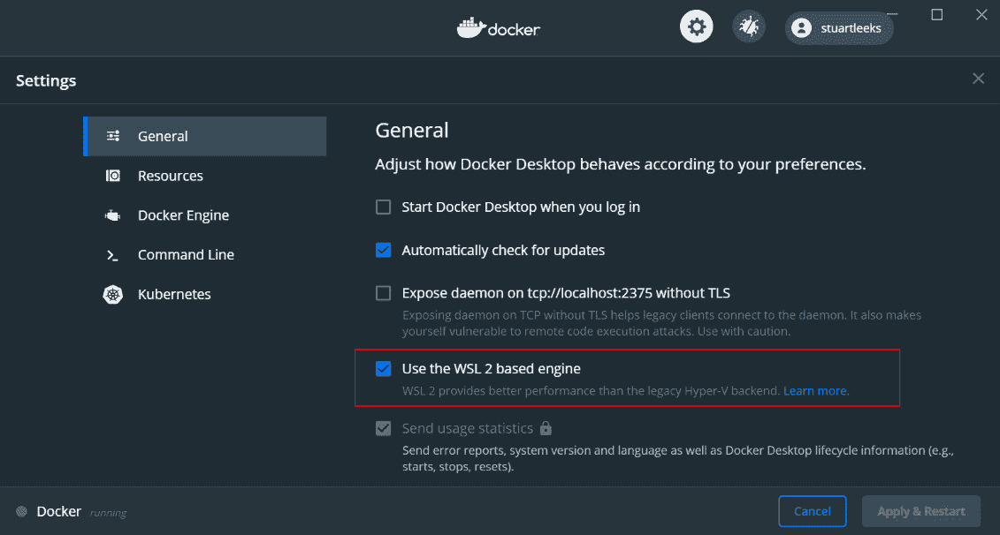
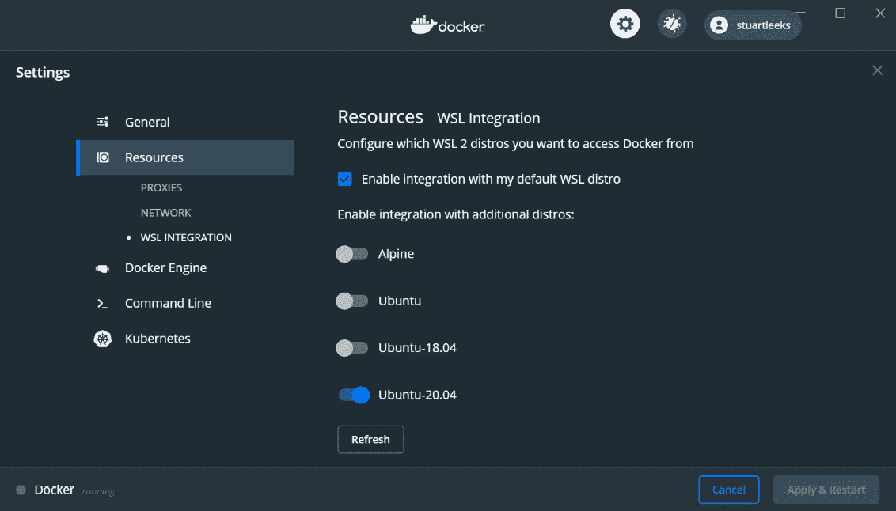
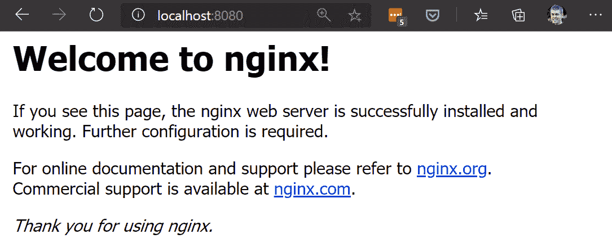
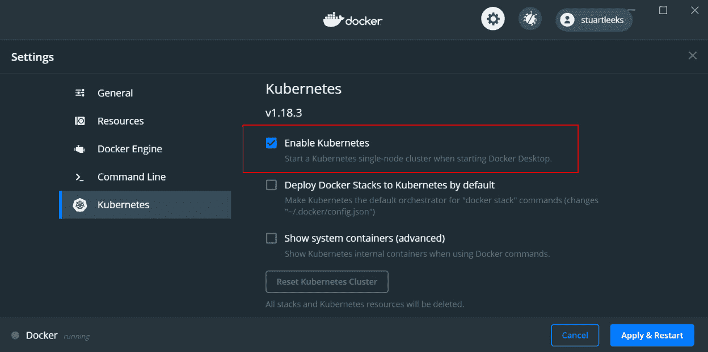

# 第七章：在 WSL 中使用容器

容器作为一种打包和管理应用程序的方式是一个热门话题。虽然有 Windows 和 Linux 版本的容器，但由于本书是关于 WSL 的，我们将重点介绍 Linux 容器和 Docker 容器。如果您想了解 Windows 容器，可以从这个链接开始：[`docs.microsoft.com/virtualization/windowscontainers/`](https://docs.microsoft.com/virtualization/windowscontainers/)

在介绍了容器的概念并安装了 Docker 之后，本章将指导您运行一个预构建的 Docker 容器，然后通过使用 Python Web 应用程序作为示例，教您如何构建自己应用程序的容器镜像。创建容器镜像后，您将快速了解 Kubernetes 的一些关键组件，然后看看如何使用这些组件在 WSL 中托管容器化应用程序。

在本章中，我们将涵盖以下主要内容：

+   容器概述

+   在 WSL 中安装和使用 Docker

+   使用 Docker 运行容器

+   构建和运行 Docker 中的 Web 应用程序

+   介绍编排器

+   在 WSL 中设置 Kubernetes

+   在 Kubernetes 中运行 Web 应用程序

我们将从探索容器的概念开始本章。

# 容器概述

容器提供了一种打包应用程序及其依赖项的方式。这个描述可能有点像一个虚拟机（VM），在虚拟机中，你可以在文件系统中安装应用程序二进制文件，然后稍后运行。然而，当你运行一个容器时，它更像一个进程，无论是启动速度还是内存消耗量。在底层，容器是一组通过使用诸如 Linux 命名空间和控制组（cgroups）等特性进行隔离的进程，使得这些进程看起来像在它们自己的环境中运行（包括有自己的文件系统）。容器与主机操作系统共享内核，因此与虚拟机相比，它们的隔离性较低，但对于许多目的来说，这种隔离已经足够了，而且主机资源的共享使得容器可以实现低内存消耗和快速启动时间。

除了容器执行外，Docker 还可以轻松定义容器的组成部分（称为容器镜像）并在注册表中发布容器镜像，供其他用户使用。

我们将在本章稍后的部分中看到这一点，但首先让我们安装 Docker。

# 在 WSL 中安装和使用 Docker

在 Windows 机器上运行 Docker 的传统方法是使用 Docker Desktop（https://www.docker.com/products/docker-desktop），它将为您创建和管理一个 Linux 虚拟机，并在该虚拟机中作为守护程序运行 Docker 服务。这样做的缺点是虚拟机需要时间启动，并且必须预先分配足够的内存来容纳运行各种容器。

通过 WSL2，可以在 WSL 发行版中安装和运行标准的 Linux Docker 守护程序。这样做的好处是在启动时更快，占用的内存更少，并且只在运行容器时增加内存消耗。缺点是你必须自己安装和管理守护程序。

幸运的是，现在有第三种选择，即安装 Docker Desktop 并启用 WSL 后端。通过这种方法，您可以保留 Docker Desktop 在安装和管理方面的便利性。不同之处在于，Docker Desktop 会在 WSL 中为您运行守护程序，从而使您在不失便利性的情况下获得启动时间和内存使用方面的改进。

要开始使用，请从 https://www.docker.com/products/docker-desktop 下载并安装 Docker Desktop。安装完成后，在系统图标托盘中右键单击 Docker 图标，选择“设置”。您将看到以下屏幕：



图 7.1 - Docker 设置的屏幕截图显示 WSL 2 选项

上面的截图显示了“使用基于 WSL 2 的引擎”选项。确保选中此选项以配置 Docker Desktop 在 WSL 2 下运行，而不是传统的虚拟机。

您可以从“资源”部分选择 Docker Desktop 与哪些发行版集成：



图 7.2 - WSL 集成的 Docker 设置的屏幕截图

正如您在上面的截图中看到的，您可以控制 Docker Desktop 与哪些发行版集成。当您选择与 WSL 发行版集成时，Docker 守护程序的套接字将对该发行版可用，并为您添加 docker 命令行界面（CLI）。选择您想要能够从中使用 Docker 的所有发行版，并单击“应用并重新启动”。

Docker 重新启动后，您将能够使用`docker`命令行界面（CLI）与任何选定的 WSL 发行版交互，例如`docker info`：

```
$ docker info
Client:
 Debug Mode: false
Server:
...
Server Version: 19.03.12
...
Kernel Version: 4.19.104-microsoft-standard
 Operating System: Docker Desktop
 OSType: linux
...
```

这个片段显示了运行`docker info`的一些输出，您可以看到服务器正在`linux`上运行，内核版本为`4.19.104-microsoft-standard`，这与我的机器上的 WSL 内核版本相同（您可以通过在 WSL 发行版中运行`uname -r`来检查您的机器上的版本）。

有关使用 WSL 安装和配置 Docker Desktop 的更多信息，请参阅 Docker 文档 https://docs.docker.com/docker-for-windows/wsl/。

现在我们已经安装了 Docker，让我们通过运行一个容器来开始。

# 使用 Docker 运行容器

正如前面提到的，Docker 为我们提供了一种标准化的方式来打包容器镜像。这些容器镜像可以通过 Docker 注册表共享，Docker Hub（https://hub.docker.com/）是一个常用的公共镜像注册表。在本节中，我们将使用以下命令运行一个带有`nginx` Web 服务器的容器：`docker run -d --name docker-nginx -p 8080:80 nginx`。

```
$ docker run -d --name docker-nginx -p 8080:80 nginx
Unable to find image 'nginx:latest' locally
latest: Pulling from library/nginx
8559a31e96f4: Already exists
1cf27aa8120b: Downloading [======================>                            ]  11.62MB/26.34MB
...
```

我们刚刚运行的命令的最后一部分告诉 Docker 我们要运行哪个容器镜像（`nginx`）。这个输出片段显示 Docker 在本地没有找到`nginx`镜像，所以它开始拉取（即下载）来自 Docker Hub 的镜像。容器镜像由多个层组成（我们将在本章后面讨论这个问题），在输出中，已经存在一个层并且正在下载另一个层。`docker`命令行界面（CLI）会随着下载的进行不断更新输出，如下所示：

```
$ docker run -d --name docker-nginx -p 8080:80 nginx
Unable to find image 'nginx:latest' locally
latest: Pulling from library/nginx
8559a31e96f4: Already exists
1cf27aa8120b: Pull complete
67d252a8c1e1: Pull complete
9c2b660fcff6: Pull complete
4584011f2cd1: Pull complete
Digest: sha256:a93c8a0b0974c967aebe868a186 e5c205f4d3bcb5423a56559f2f9599074bbcd
Status: Downloaded newer image for nginx:latest
336ab5bed2d5f547b8ab56ff39d1db08d26481215d9836a1b275e0c7dfc490d5
```

当 Docker 完成拉取镜像时，您将看到类似于上面输出的内容，确认 Docker 已经拉取了镜像并打印了创建的容器的 ID（`336ab5bed2d5…`）。此时，我们可以运行`docker ps`来列出正在运行的容器：

```
$ docker ps
CONTAINER ID        IMAGE              COMMAND                CREATED              STATUS              PORTS                 NAMES
336ab5bed2d5        nginx              "/docker-entrypoint.…"   About a minute ago   Up About a minute   0.0.0.0:8080->80/tcp|     docker-nginx
```

这个输出显示了一个正在运行的容器，我们可以看到容器 ID `336ab5bed2d5`的值与`docker run`命令输出的容器 ID 的开头匹配。默认情况下，`docker ps`输出容器 ID 的短格式，而`docker run`输出完整的容器 ID 值。

让我们回到我们用来运行容器的命令：`docker run -d --name docker-nginx -p 8080:80 nginx`。这个命令有几个部分：

+   `-d`告诉 Docker 在后台运行这个容器，即以分离模式运行。

+   `--name`告诉 Docker 使用一个特定的名称`docker-nginx`来命名容器，而不是生成一个随机的名称。这个名称也可以在`docker ps`的输出中看到，并且可以使用。

+   `-p`允许我们将主机上的端口映射到正在运行的容器内部的端口。格式为`<主机端口>:<容器端口>`，因此在`8080:80`的情况下，我们将主机上的端口`8080`映射到容器内部的端口`80`。

+   最后一个参数是要运行的镜像的名称：`nginx`。

由于端口`80`是`nginx`默认提供内容的端口，并且我们已将端口`8080`映射到该容器端口，因此我们可以在 Web 浏览器中打开`http://localhost:8080`，如下图所示：



图 7.3-浏览器显示 nginx 输出的屏幕截图

前面的屏幕截图显示了 Web 浏览器中 nginx 的输出。此时，我们使用了一个命令（`docker run`）在 Docker 容器中下载和运行 nginx。容器资源具有一定的隔离级别，这意味着容器内部提供流量的端口`80`在外部不可见，因此我们将其映射到容器外部的端口`8080`。由于我们正在使用 WSL 2 后端的 Docker Desktop，因此端口`8080`实际上在 WSL 2 虚拟机上公开，但由于我们在*第四章*中看到的魔法，即*Windows 与 Linux 的互操作性*，在*从 Windows 访问 Linux Web 应用程序*部分，我们可以从 Windows 访问`http://localhost:8080`。

如果我们让容器继续运行，它将继续消耗资源，因此在继续之前让我们停止并删除它，如下所示：

```
$ docker stop docker-nginx
docker-nginx
$ docker rm docker-nginx
docker-nginx
```

在此输出中，您可以看到`docker stop docker-nginx`，它停止了正在运行的容器。此时，它不再消耗内存或 CPU，但它仍然存在并引用了用于创建它的镜像，这会阻止删除该镜像。因此，在停止容器后，我们使用`docker rm docker-nginx`来删除它。为了释放磁盘空间，我们还可以通过运行`docker image rm nginx:latest`来清理`nginx`镜像。

现在我们已经看到了如何运行容器，让我们构建自己的容器镜像来运行。

# 在 Docker 中构建和运行 Web 应用程序

在本节中，我们将构建一个 Docker 容器镜像，该镜像打包了一个 Python Web 应用程序。该容器镜像将包含 Web 应用程序及其所有依赖项，以便在安装了 Docker 守护程序的机器上运行。

要按照此示例进行操作，请确保您已经在 Linux 发行版中克隆了本书的代码（来自[`github.com/PacktPublishing/Windows-Subsystem-for-Linux-2-WSL-2-Tips-Tricks-and-Techniques`](https://github.com/PacktPublishing/Windows-Subsystem-for-Linux-2-WSL-2-Tips-Tricks-and-Techniques)），然后打开终端并导航到`chapter-07/01-docker-web-app`文件夹，其中包含我们将在此处使用的示例应用程序。请查看`README.md`文件以获取运行应用程序所需的依赖项的安装说明。

示例应用程序基于 Python 的**Flask** Web 框架构建（https://github.com/pallets/flask），并使用**Gunicorn HTTP 服务器**托管应用程序（https://gunicorn.org/）。

为了使本章重点放在 Docker 容器上，该应用程序只有一个代码文件`app.py`：

```
from os import uname
from flask import Flask
app = Flask(__name__)
def gethostname():
    return uname()[1]
@app.route("/")
def home():
    return f"<html><body><h1>Hello from {gethostname()}</h1></body></html>"
```

如代码所示，定义了一个用于主页的单个端点，该端点返回一个显示 Web 服务器所在机器的主机名的消息。

可以使用`gunicorn --bind 0.0.0.0:5000 app:app`运行该应用程序，并在 Web 浏览器中打开`http://localhost:5000`：


图 7.4-浏览器中显示示例应用程序的屏幕截图

在此屏幕截图中，您可以看到示例应用程序的响应，显示应用程序正在运行的主机名（`wfhome`）。

现在您已经看到了示例应用程序的运行情况，我们将开始看如何将其打包为容器镜像。

## 介绍 Dockerfile

要构建一个镜像，我们需要能够向 Docker 描述镜像应该包含什么内容，为此，我们将使用一个 `Dockerfile`。`Dockerfile` 包含了一系列命令，供 Docker 执行以构建容器镜像：

```
FROM python:3.8-slim-buster
EXPOSE 5000
ADD requirements.txt .
RUN python -m pip install -r requirements.txt
WORKDIR /app
ADD . /app
CMD ["gunicorn", "--bind", "0.0.0.0:5000", "app:app"]
```

这个 Dockerfile 包含了一系列命令。让我们来看看它们：

+   `FROM` 命令指定 Docker 应该使用的基础镜像，换句话说，是我们容器镜像的起始内容。在基础镜像中安装的任何应用程序和软件包都成为我们在其之上构建的镜像的一部分。在这里，我们指定了 `python:3.8-slim-buster` 镜像，它提供了一个基于 `python:3.8-buster` 镜像的镜像，该镜像包含了一些常见的软件包，但这使得基础镜像变得更大。由于此应用程序只使用了几个软件包，我们使用了 `slim` 变体。

+   `EXPOSE` 表示我们要暴露一个端口（在本例中为 `5000`，因为这是 Web 应用程序将监听的端口）。

+   我们使用 `ADD` 命令将内容添加到容器镜像中。`ADD` 的第一个参数指定要从 `host` 文件夹添加的内容，第二个参数指定要将其放置在容器镜像中的位置。在这里，我们正在添加 `requirements.txt`。

+   `RUN` 命令用于使用刚刚通过 `ADD` 命令添加到镜像中的 `requirements.txt` 文件执行 `pip install` 操作。

+   `WORKDIR` 用于将容器中的工作目录设置为 `/app`。

+   `ADD` 再次用于将完整的应用程序内容复制到 `/app` 目录中。我们将在下一节中讨论为什么使用两个单独的 `ADD` 命令将应用程序文件复制进去。

+   最后，`CMD` 命令指定当从此镜像运行容器时将执行的命令。在这里，我们指定与刚刚在本地运行 Web 应用程序时使用的相同的 `gunicorn` 命令。

现在我们有了一个 `Dockerfile`，让我们来看看如何使用它来构建一个镜像。

## 构建镜像

要构建一个容器镜像，我们将使用 `docker build` 命令：

```
docker build -t simple-python-app  .
```

在这里，我们使用了 `-t` 开关来指定生成的镜像应该被标记为 `simple-python-app`。这是我们以后可以使用的镜像名称来运行容器。最后，我们告诉 Docker 使用哪个目录作为构建上下文，这里我们使用 `.` 表示当前目录。构建上下文指定要打包并传递给 Docker 守护进程用于构建镜像的内容 - 当您将文件 `ADD` 到 `Dockerfile` 时，它会从构建上下文中复制。

这个命令的输出非常长，所以我们不会完整地包含它，我们只会看一些关键部分。

这个命令的初始输出来自 `FROM` 命令：

```
Step 1/7 : FROM python:3.8-slim-buster
3.8-slim-buster: Pulling from library/python
8559a31e96f4: Already exists
62e60f3ef11e: Pull complete
...
Status: Downloaded newer image for python:3.8-slim-buster
```

在这里，您可以看到 Docker 已经确定它在本地没有基础镜像，所以从 Docker Hub 上拉取了它，就像我们之前运行 `nginx` 镜像一样。

在输出的稍后部分，我们可以看到 `pip install` 已经执行了安装应用程序要求的操作：

```
Step 4/7 : RUN python -m pip install -r requirements.txt
 ---> Running in 1515482d6808
Requirement already satisfied: wheel in /usr/local/lib/python3.8/site-packages (from -r requirements.txt (line 1)) (0.34.2)
Collecting flask
  Downloading Flask-1.1.2-py2.py3-none-any.whl (94 kB)
Collecting gunicorn
  Downloading gunicorn-20.0.4-py2.py3-none-any.whl (77 kB)
...
```

在上面的代码片段中，您可以看到 `pip install` 的输出，它正在安装 `flask` 和 `gunicorn`。

在输出的末尾，我们看到了一些成功的消息：

```
Successfully built 747c4a9481d8
Successfully tagged simple-python-app:latest
```

这些成功消息中的第一个给出了我们刚刚创建的镜像的 ID (`747c4a9481d8`)，第二个显示它已经使用我们指定的标签进行了标记 (`simple-python-app`)。要查看本地机器上的 Docker 镜像，可以运行 `docker image ls`：

```
$ docker image ls
REPOSITORY          TAG                 IMAGE ID            CREATED             SIZE
simple-python-app   latest              7383e489dd38        16 seconds ago      123MB
python              3.8-slim-buster     ec75d34adff9        22 hours ago        113MB
nginx               latest              4bb46517cac3        3 weeks ago         133MB
```

在此输出中，我们可以看到我们刚刚构建的 `simple-python-app` 镜像。现在我们已经构建了一个容器镜像，可以准备运行它了！

## 运行镜像

正如我们之前看到的，我们可以使用 `docker run` 命令运行容器：

```
$ docker run -d -p 5000:5000 --name chapter-07-example simple-python-app
6082241b112f66f2bb340876864fa1ccf170a 519b983cf539e2d37e4f5d7e4df
```

在这里，您可以看到我们正在将 `simple-python-app` 镜像作为名为 `chapter-07-example` 的容器运行，并且已经暴露了端口 `5000`。命令输出显示了我们刚刚启动的容器的 ID。

容器运行时，我们可以在 Web 浏览器中打开`http://localhost:5000`：


图 7.5 - 展示在 Web 浏览器中的容器化示例应用程序的屏幕截图

在这个屏幕截图中，我们可以看到示例应用程序的输出。请注意，它输出的主机名与`docker run`命令的输出中容器 ID 的开头匹配。当创建容器的隔离环境时，主机名设置为容器 ID 的短格式。

现在我们已经构建和运行了容器的初始版本，让我们来看看如何修改应用程序并重新构建镜像。

## 使用更改重新构建镜像

在开发应用程序时，我们会对源代码进行更改。为了模拟这个过程，在`app.py`中对消息进行简单更改（例如，将`Hello from`更改为`Coming to you from`）。一旦我们进行了这个更改，我们可以使用与之前相同的`docker build`命令重新构建容器镜像：

```
$ docker build -t simple-python-app -f Dockerfile .
Sending build context to Docker daemon   5.12kB
Step 1/7 : FROM python:3.8-slim-buster
 ---> 772edcebc686
Step 2/7 : EXPOSE 5000
 ---> Using cache
 ---> 3e0273f9830d
Step 3/7 : ADD requirements.txt .
 ---> Using cache
 ---> 71180e54daa0
Step 4/7 : RUN python -m pip install -r requirements.txt
 ---> Using cache
 ---> c5ab90bcfe94
Step 5/7 : WORKDIR /app
 ---> Using cache
 ---> f4a62a82db1a
Step 6/7 : ADD . /app
 ---> 612bba79f590
Step 7/7 : CMD ["gunicorn", "--bind", "0.0.0.0:5000", "app:app"]
 ---> Running in fbc6af76acbf
Removing intermediate container fbc6af76acbf
 ---> 0dc3b05b193f
Successfully built 0dc3b05b193f
Successfully tagged simple-python-app:latest
```

这次的输出有点不同。除了基本镜像不被拉取（因为我们已经下载了基本镜像）之外，您还可能注意到一些带有`---> Using cache`的行。当 Docker 运行`Dockerfile`中的命令时，每一行（有几个例外）都会创建一个新的容器镜像，后续的命令就像我们在基本镜像上构建一样。由于它们相互构建，这些镜像通常被称为层。在构建镜像时，如果 Docker 确定命令中使用的文件与先前构建的层匹配，则它将重用该层，并通过`---> Using cache`输出指示此情况。如果文件不匹配，则 Docker 运行该命令并使任何后续层的缓存无效。

这种层缓存是为什么我们将`requirements.txt`从应用程序的主要内容中拆分出来放在`Dockerfile`中的原因：安装依赖通常是一个耗时的操作，并且通常应用程序的其他文件更频繁地发生变化。将依赖拆分出来，并在复制应用程序代码之前执行`pip install`，可以确保层缓存在我们开发应用程序时与我们一起工作。

我们在这里看到了一系列 Docker 命令；如果您想进一步探索（包括如何将镜像推送到注册表），请查看 https://www.docker.com/101-tutorial 上的*Docker 101 教程*。

在本节中，我们已经看到了如何构建容器镜像以及如何运行容器，无论是我们自己的镜像还是来自 Docker Hub 的镜像。我们还看到了层缓存如何加速开发周期。这些都是基础步骤，在下一节中，我们将开始研究编排器，这是使用容器构建系统的上一层。

# 介绍编排器

在前一节中，我们看到了如何使用 Docker 的功能将我们的应用程序打包成容器镜像并运行。如果我们将镜像推送到 Docker 注册表，那么从安装了 Docker 的任何机器上都可以简单地拉取和运行该应用程序。然而，较大的系统由许多这样的组件组成，我们可能希望将它们分布在多个 Docker 主机上。这样可以通过增加或减少运行的组件容器实例的数量来适应系统上的负载变化。使用容器化系统获得这些功能的方法是使用编排器。编排器提供其他功能，例如自动重新启动失败的容器，在主机故障时在不同的主机上运行容器，以及与容器进行稳定通信，因为它们可能会重新启动并在主机之间移动。

有许多容器编排器，如 Kubernetes、Docker Swarm 和基于 Apache Mesos 和 Marathon 的 Mesosphere DC/OS。这些编排器都提供了稍微不同的功能和实现我们刚才描述的要求的方式。Kubernetes 已经成为一个非常流行的编排器，所有主要的云供应商都提供了 Kubernetes 的支持（它甚至在 Docker Enterprise 和 Mesosphere DC/OS 中都有支持）。本章的其余部分将介绍如何在 WSL 中创建一个 Kubernetes 开发环境并在其上运行应用程序。

# 在 WSL 中设置 Kubernetes

安装 Kubernetes 有很多选择，包括以下几种：

+   Kind（[`kind.sigs.k8s.io/`](https://kind.sigs.k8s.io/)）

+   Minikube（[`kubernetes.io/docs/tasks/tools/install-minikube/`](https://kubernetes.io/docs/tasks/tools/install-minikube/)）

+   MicroK8s（https://microk8s.io/）

+   k3s（[`k3s.io/`](https://k3s.io/)）

首先是 Kind，它代表 Kubernetes in Docker，专为测试 Kubernetes 而设计。只要您的构建工具可以运行 Docker 容器，它就可以作为在自动化构建中运行 Kubernetes 的一种好选择，用于集成测试的一部分。默认情况下，Kind 将创建一个单节点 Kubernetes 集群，但您可以配置它以运行多节点集群，其中每个节点都作为一个单独的容器运行（*我们将在第十章“使用 Visual Studio Code 和容器”中看到如何使用 Kind 在开发容器中使用 Kubernetes*）。

然而，在本章中，我们将使用 Docker Desktop 中内置的 Kubernetes 功能，它提供了一种方便的方式来启用由您管理的 Kubernetes 集群。



图 7.6 - 显示在 Docker Desktop 中启用 Kubernetes 的屏幕截图

在这个屏幕截图中，您可以看到 Docker Desktop 设置的 Kubernetes 页面，其中包含“启用 Kubernetes”选项。勾选此选项并点击“应用并重启”，Docker Desktop 将为您安装一个 Kubernetes 集群。

就像我们一直使用`docker` CLI 与 Docker 进行交互一样，Kubernetes 也有自己的 CLI，即`kubectl`。我们可以使用`kubectl cluster-info`命令来检查我们是否能够连接到 Docker Desktop 为我们创建的 Kubernetes 集群：

```
$ kubectl cluster-info
Kubernetes master is running at https://kubernetes.docker.internal:6443
KubeDNS is running at https://kubernetes.docker.internal:6443/api/v1/namespaces/kube-system/services/kube-dns:dns/proxy
To further debug and diagnose cluster problems, use 'kubectl cluster-info dump'.
```

这个输出显示`kubectl`已成功连接到`kubernetes.docker.internal`上的 Kubernetes 集群，表示我们正在使用*Docker Desktop Kubernetes 集成*。

现在我们有一个运行的 Kubernetes 集群，让我们来看看如何在其中运行一个应用程序。

# 在 Kubernetes 中运行 Web 应用程序

Kubernetes 引入了一些新的术语，其中第一个是 Pod。Pod 是在 Kubernetes 中运行容器的方式。当我们要求 Kubernetes 运行一个 Pod 时，我们会指定一些细节，比如我们希望它运行的镜像。像 Kubernetes 这样的编排器旨在使我们能够作为系统的一部分运行多个组件，包括能够扩展组件实例的数量。为了帮助实现这个目标，Kubernetes 添加了另一个概念，称为 Deployments。Deployments 是基于 Pod 构建的，允许我们指定我们希望 Kubernetes 运行的相应 Pod 的实例数量，并且这个值可以动态更改，使我们能够扩展（和缩小）我们的应用程序。

我们将稍后查看如何创建部署，但首先，我们需要为我们的示例应用程序创建一个新的标签。在之前构建 Docker 镜像时，我们使用了`simple-python-app`标签。每个标签都有一个或多个关联的版本，由于我们没有指定版本，它被假定为`simple-python-app:latest`。在使用 Kubernetes 时，使用*latest*镜像版本意味着 Kubernetes 将尝试从注册表中拉取镜像，即使它已经在本地存在。由于我们还没有将镜像推送到注册表，这将失败。我们可以重新构建镜像，指定`simple-python-app:v1`作为镜像名称，但由于我们已经构建了镜像，我们也可以通过运行`docker tag simple-python-app:latest simple-python-app:v1`来创建一个新的带标签的版本。现在我们有两个引用同一镜像的标签，但是通过使用`simple-python-app:v1`标签，只有在本地不存在镜像时，Kubernetes 才会尝试拉取镜像。有了我们的新标签，让我们开始将应用程序部署到 Kubernetes。

## 创建一个部署

将我们的示例应用程序部署到 Kubernetes 的第一步是在 Kubernetes 中创建一个部署对象。使用我们容器镜像的版本标签，我们可以使用`kubectl`创建一个部署：

```
$ kubectl create deployment chapter-07-example --image=simple-python-app:v1
deployment.apps/chapter-07-example created
$ kubectl get deployments
NAME                 READY   UP-TO-DATE   AVAILABLE   AGE
chapter-07-example   1/1     1            1           10s
```

此输出显示创建了一个名为`chapter-07-example`的部署，运行着`simple-python-app:v1`镜像。创建部署后，它显示了使用`kubectl get deployments`列出部署并获取关于部署状态的摘要信息。在这里，`READY`列中的`1/1`表示部署配置为运行一个实例的 pod，并且该实例可用。如果我们 pod 中运行的应用程序崩溃，Kubernetes 将（默认情况下）自动重新启动它。我们可以运行`kubectl get pods`来查看部署创建的 pod：

```
$ kubectl get pods
NAME                                  READY   STATUS    RESTARTS   AGE
chapter-07-example-7dc44b8d94-4lsbr   1/1     Running   0          1m
```

在这个输出中，我们可以看到 pod 的名称以部署名称开头，后面跟着一个随机后缀。

正如我们之前提到的，使用部署而不是 pod 的一个好处是可以对其进行扩展：

```
$ kubectl scale deployment chapter-07-example --replicas=2
deployment.apps/chapter-07-example scaled
$ kubectl get pods
NAME                                  READY   STATUS    RESTARTS   AGE
chapter-07-example-7dc44b8d94-4lsbr   1/1     Running   0       2m
chapter-07-example-7dc44b8d94-7nv7j   1/1     Running   0      15s
```

在这里，我们看到`kubectl scale`命令在`chapter-07-example`部署上使用，将副本数设置为 2，换句话说，将部署扩展到两个 pod。扩展后，我们再次运行`kubectl get pods`，可以看到我们创建了第二个 pod。

提示

在使用 kubectl 时，您可以通过启用 bash 自动补全来提高生产力。要配置这个，请运行：

`echo 'source <(kubectl completion bash)' >>~/.bashrc`

这将将 kubectl bash 自动补全添加到您的`.bashrc`文件中，因此您需要重新启动 Bash 以启用它（有关详细信息，请参阅[`kubernetes.io/docs/tasks/tools/install-kubectl/#optional-kubectl-configurations`](https://kubernetes.io/docs/tasks/tools/install-kubectl/#optional-kubectl-configurations)），

通过这个更改，您现在可以键入以下内容（在<TAB>的位置按下*Tab*键）：

`kubectl sc<TAB> dep<TAB> chap<TAB> --re<TAB>2`

使用 bash 自动补全的最终结果是：

`kubectl scale deployment chapter-07-example --replicas=2`

正如您所看到的，这样可以节省输入命令的时间，并支持命令（如`scale`）和资源名称（`chapter-07-example`）的自动补全。

现在我们已经部署了应用程序，让我们看看如何访问它。

创建一个服务

接下来，我们希望能够访问作为`chapter-07-example`部署运行的 Web 应用程序。由于我们可以在多个 pod 上运行 Web 应用程序的实例，我们需要一种访问一组 pod 的方法。为此，Kubernetes 有一个称为`kubectl expose`的概念来创建服务：

```
$ kubectl expose deployment chapter-07-example --type="NodePort" --port 5000
service/chapter-07-example exposed
$ kubectl get services
NAME                 TYPE        CLUSTER-IP      EXTERNAL-IP    PORT(S)          AGE
chapter-07-example   NodePort    10.107.73.156   <none>        5000:30123/TCP   7s
kubernetes           ClusterIP   10.96.0.1       <none>        443/TCP          16m
```

在这里，我们运行`kubectl expose`命令，指示 Kubernetes 为我们的`chapter-07-example`部署创建一个服务。我们将服务类型指定为`NodePort`，这使得服务在集群中的任何节点上都可用，并将`5000`作为服务目标端口，以匹配我们的 Web 应用程序正在侦听的端口。接下来，我们运行`kubectl get services`命令，显示新创建的`chapter-07-example`服务。在`PORT(S)`列下，我们可以看到`5000:30123/TCP`，表示该服务正在端口`30123`上侦听，并将流量转发到部署中的端口`5000`。

由于 Docker Desktop 为 Kubernetes 集群设置了网络（以及从 Windows 到 WSL 的`localhost`的 WSL 转发），我们可以在 Web 浏览器中打开`http://localhost:30123`。


图 7.7 - 展示在浏览器中加载的 Kubernetes Web 应用程序的屏幕截图

此屏幕截图显示了在浏览器中加载的 Web 应用程序和显示的主机名与我们在缩放部署后列出的 Pod 名称之一相匹配。如果您刷新页面几次，您将看到名称在我们缩放部署后创建的 Pod 名称之间更改，这表明我们创建的 Kubernetes 服务正在在 Pod 之间分发流量。

我们一直在交互式地运行`kubectl`命令来创建部署和服务，但 Kubernetes 的一个强大之处是它支持声明式部署。Kubernetes 允许您在`YAML`格式的文件中定义部署和服务等对象。通过这种方式，您可以指定系统的多个方面，然后一次性将一组`YAML`文件传递给 Kubernetes，Kubernetes 将创建它们。您以后可以更新*YAML*规范并将其传递给 Kubernetes，它将协调规范中的差异以应用您的更改。本书附带的代码示例位于`chapter-07/02-deploy-to-kubernetes`文件夹中（请参阅文件夹中的`README.md`文件以获取部署说明）。

在本节中，我们介绍了如何使用 Kubernetes 部署我们打包为容器镜像的 Web 应用程序。我们看到这将为我们创建 Pod，并允许我们动态扩展正在运行的 Pod 的数量。我们还看到如何使用 Kubernetes 创建一个服务，该服务在部署中的 Pod 之间分发流量。该服务为部署中的 Pod 提供了逻辑抽象，并处理部署的扩展以及已重新启动的 Pod（例如，如果它已崩溃）。这为使用 Kubernetes 工作提供了一个很好的起点，如果您想进一步了解，Kubernetes 在[`kubernetes.io/docs/tutorials/kubernetes-basics/`](https://kubernetes.io/docs/tutorials/kubernetes-basics/)上有一个很棒的交互式教程。

注意

如果您有兴趣深入了解使用*Docker*或*Kubernetes*构建应用程序，以下链接是一个很好的起点（还有其他内容的进一步链接）：

[`docs.docker.com/develop/`](https://docs.docker.com/develop/)

[`kubernetes.io/docs/home/`](https://kubernetes.io/docs/home/)

# 总结

在本章中，我们介绍了容器，并看到它们如何使应用程序及其依赖项打包在一起，以便在运行 Docker 守护程序的机器上简单运行。我们讨论了 Docker 注册表作为共享镜像的一种方式，包括常用的公共注册表：`docker` CLI，并使用它来运行来自 Docker Hub 的`nginx`镜像，Docker 会自动从 Docker Hub 将镜像拉取到本地机器上。

在运行了`nginx`镜像之后，你学会了如何使用在`Dockerfile`中定义的步骤来构建自定义 Web 应用程序的镜像。你了解到 Docker 会为`Dockerfile`中的步骤构建镜像层，并在后续构建中重用它们，如果文件没有更改的话。你还了解到可以通过精心构建`Dockerfile`，将最常变化的内容添加到后续步骤中，从而提高后续构建的时间。

在学习如何使用 Docker 之后，你了解了容器编排器的概念，然后开始学习 Kubernetes。通过 Kubernetes，你了解到可以使用不同类型的资源，如 pod、deployment 和 service 来部署应用程序。你了解到 Kubernetes 的部署是基于 pod 构建的，可以通过一个命令轻松地扩展 pod 实例的数量，并且可以使用 Kubernetes 的 service 来提供一种简单且一致的方式来访问部署中的 pod，而不受扩展的影响。

在下一章中，我们将更直接地关注 WSL，掌握构建和使用容器的知识将会很有用。
