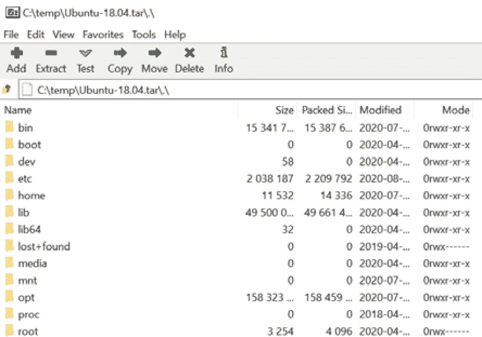
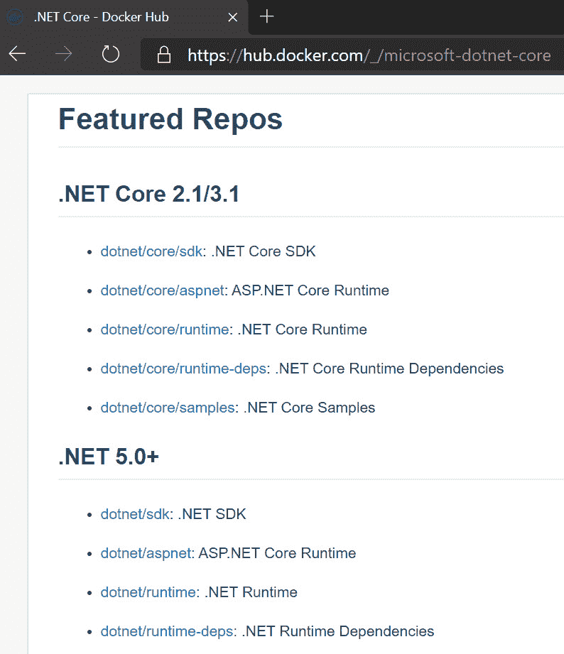
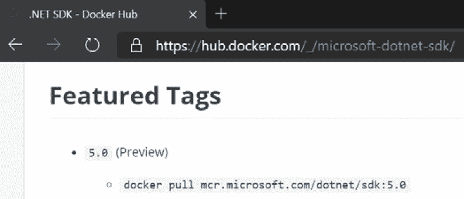

# 第八章：*第八章*：使用 WSL 发行版

在*第二章*中，*安装和配置 Windows 子系统 Linux*，在*介绍 wsl 命令*部分，我们看到了如何使用`wsl`命令列出我们安装的**发行版**（**distros**），在其中运行命令，并根据需要终止它们。

在本章中，我们将重新讨论发行版，这次从发行版管理的角度来看。特别是，我们将看看如何使用`export`和`import`命令备份发行版或将其复制到另一台机器。我们还将看看如何快速创建一个基于 Docker 容器映像的新发行版，以便您可以轻松创建自己的发行版，并安装任何依赖项。

在本章中，我们将介绍以下主要内容：

+   导出和导入 WSL 发行版

+   创建和运行自定义发行版

我们将从介绍如何导出和导入 WSL 发行版开始本章。

# 导出和导入 WSL 发行版

如果您花费了时间设置 WSL 发行版，您可能希望能够将其复制到另一台机器上。这可能是因为您正在更换或重新安装计算机，或者您拥有多台计算机，希望将配置好的发行版复制到第二台计算机上，而不是从头开始设置发行版。在本节中，我们将介绍如何将发行版导出为可以复制到另一台机器并导入的存档文件。

让我们首先准备要导出的发行版。

## 准备导出

在导出发行版之前，我们要确保发行版的默认用户在发行版内的`/etc/wsl.conf`文件中设置正确（您可以在*第二章*中的*安装和配置 Windows 子系统 Linux*，*介绍 wsl.conf 和.wslconfig*部分了解更多关于`wsl.conf`的信息）。通过这样做，我们可以确保在导入发行版后，WSL 仍然使用正确的默认用户。

在 WSL 发行版中打开终端并运行`cat /etc/wsl.conf`以检查文件的内容：

```
$ cat /etc/wsl.conf
[network]
generateHosts = true
generateResolvConf = true
[user]
default=stuart
```

在此输出的末尾，您可以看到带有`default=stuart`条目的`[user]`部分。如果您没有默认用户条目（或者没有`wsl.conf`文件），那么您可以使用您喜欢的编辑器确保有一个类似于此的条目（带有正确的用户名）。或者，您可以运行以下命令添加一个用户（假设您的`wsl.conf`没有`[user]`部分）：

```
sudo bash -c "echo -e '\n[user]\ndefault=$(whoami)' >> /etc/wsl.conf"
```

此命令使用`echo`输出带有默认设置为当前用户的`[user]`部分。它嵌入了调用`whoami`获取当前用户名的结果。整个命令被包装并使用`sudo`执行，以确保具有写入文件所需的权限。

准备工作完成后，让我们看看如何导出发行版。

## 执行导出

要导出发行版，我们将使用`wsl`命令将发行版的内容导出到磁盘上的文件中。为此，我们运行`wsl --export`：

```
wsl --export Ubuntu-18.04 c:\temp\Ubuntu-18.04.tar
```

正如您所看到的，我们指定了要导出的发行版的名称（`Ubuntu-18.04`），然后是我们要保存导出文件的路径（`c:\temp\Ubuntu-18.04.tar`）。导出过程将根据发行版的大小和其中的内容量而需要一些时间来完成。

在导出过程中，发行版无法使用，如使用`wsl --list`命令（在单独的终端实例中执行）所示：

```
PS C:\> wsl --list --verbose
  NAME                   STATE           VERSION
* Ubuntu-20.04           Running         2
  Legacy                 Stopped         1
  Ubuntu-18.04           Converting      2
PS C:\>
```

在此输出中，您可以看到`Ubuntu-18.04`发行版的状态显示为`Converting`。一旦导出命令完成，该发行版将处于`Stopped`状态。

导出的文件是一个以**TAR**格式（最初是**Tape Archive**的缩写）创建的存档文件，这在 Linux 中很常见。如果您打开 TAR 文件（例如，在诸如[`www.7-zip.org/`](https://www.7-zip.org/)的应用程序中），您可以看到其中的内容：



图 8.1 - 展示在 7-zip 中打开的导出的 TAR 的屏幕截图

在此屏幕截图中，您可以看到导出的 TAR 文件包含了一个 Linux 系统的熟悉文件夹。您可以深入到诸如 `/home/stuart` 的文件夹中，并导出单个文件（如果您希望这样做）。

现在我们有了一个导出的发行版文件，让我们看看如何导入它。

## 执行导入

一旦您有了发行版的导出文件，您可以将其复制到新机器（假设您正在传输发行版），或者如果您使用导出/导入来创建发行版的副本，则可以将其保留在同一位置。

要执行导入，我们将使用以下 `wsl` 命令：

```
wsl --import Ubuntu-18.04-Copy C:\wsl-distros\Ubuntu-18.04-Copy C:\temp\Ubuntu-18.04.tar
```

正如您所看到的，这次我们使用了 `--import` 开关。之后，我们传递以下三个参数：

+   `Ubuntu-18.04-Copy`：这是将由导入创建的新发行版的名称。

+   `C:\wsl-distros\Ubuntu-18.04-Copy`：这是新发行版的状态将存储在磁盘上的路径。通过商店安装的发行版将安装在 `$env:LOCALAPPDATA\Packages` 下的文件夹中，如果您希望将导入的发行版保存在类似位置的路径下，您可以使用此路径。

+   `C:\temp\Ubuntu-18.04.tar`：要导入的已导出发行版的 TAR 文件的路径。

与导出一样，如果内容很多，导入过程可能需要一些时间。我们可以通过在另一个终端实例中运行 `wsl` 来查看状态：

```
PS C:\ > wsl --list --verbose
  NAME                   STATE           VERSION
* Ubuntu-20.04           Running         2
  Legacy                 Stopped         1
  Ubuntu-18.04-Copy      Installing      2
  Ubuntu-18.04           Stopped         2
PS C:\Users\stuar>
```

在此输出中，我们可以看到新的发行版（`Ubuntu-18.04-Copy`）在导入过程中显示为 `Installing` 状态。一旦 `import` 命令完成，新的发行版就可以使用了。

正如您在这里看到的，通过将发行版导出为可以导入的 TAR 文件，您可以在您的计算机上创建发行版的副本，例如，测试一些其他应用程序而不影响原始发行版。通过在计算机之间复制 TAR 文件，它还可以让您复制已配置的发行版以便在计算机之间重用它们。

接下来，我们将看看如何创建自己的发行版。

# 创建和运行自定义发行版

如果您在多个项目中工作，每个项目都有自己的工具集，并且您希望保持依赖关系的分离，那么为每个项目运行一个发行版可能是有吸引力的。我们刚刚看到的导出和导入发行版的技术可以通过复制起始发行版来实现这一点。

在本节中，我们将介绍使用 Docker 镜像的另一种方法。Docker Hub 上发布了大量的镜像，包括安装了各种开发工具集的镜像。正如我们将在本节中看到的，这可以是一种快速安装发行版以使用新工具集的方法。在*第十章*中，*Visual Studio Code 和容器*，我们将看到另一种方法，直接使用容器来封装您的开发依赖项。

在开始之前，值得注意的是，还有另一种构建用于 WSL 的自定义发行版的方法，但这是一个更复杂的过程，并且不适用于本节的场景。这也是发布 Linux 发行版到商店的途径 - 详细信息可以在[`docs.microsoft.com/en-us/windows/wsl/build-custom-distro`](https://docs.microsoft.com/en-us/windows/wsl/build-custom-distro)找到。

在本节中，我们将介绍如何使用容器设置一个准备好与 .NET Core 一起工作的发行版（但是这个过程适用于任何您可以找到容器镜像的技术栈）。我们将使用 Docker Hub 找到我们想要用作新 WSL 发行版基础的镜像，然后配置一个正在运行的容器，以便它能够与 WSL 无缝配合。一旦我们设置好容器，我们将导出它为一个可以像前一节中所见那样导入的 TAR 文件。

让我们开始找到我们想要使用的镜像。

## 查找和拉取容器镜像

第一步是找到我们想要用作起点的容器。在 Docker Hub 上搜索`dotnet`后（[`hub.docker.com/`](https://hub.docker.com/)），我们可以向下滚动以找到来自 Microsoft 的镜像，这将引导我们到这个页面（[`hub.docker.com/_/microsoft-dotnet-core`](https://hub.docker.com/_/microsoft-dotnet-core)）：



图 8.2 - Docker Hub 上.NET 镜像页面的截图

正如您在这个截图中所看到的，有许多可用的.NET 镜像。在本章中，我们将使用.NET 5.0 镜像，特别是 SDK 镜像，因为我们希望能够测试构建应用程序（而不仅仅是运行为运行时镜像设计的应用程序）。

通过点击`dotnet/sdk`页面，我们可以找到我们需要使用的镜像标签来拉取和运行镜像：



图 8.3 - Docker Hub 上显示.NET 5.0 SDK 镜像标签的截图

正如这个截图所示，我们可以运行`docker pull mcr.microsoft.com/dotnet/sdk:5.0`将镜像拉取到我们的本地机器上。

现在我们已经找到了要用作新发行版起点的镜像，接下来有几个步骤来准备它以便与 WSL 一起使用。让我们看看这些步骤是什么。

## 配置一个准备用于 WSL 的容器

在我们可以导出刚从 Docker Hub 拉取的镜像之前，我们需要进行一些调整，以使其与 WSL 完全兼容：

1.  首先，我们将从镜像创建一个正在运行的容器：

```
dotnet to make it easier to refer to it later. We also passed the -it switches to start the container with interactive access – note the final line in the previous output showing that we're at a shell prompt inside the container.
```

1.  首先要设置的是 WSL 要使用的用户：

```
useradd command to create a new user called stuart (but feel free to pick a different name!) and the -m switch ensures that the user home directory is created. After that, we use the passwd command to set a password for the user.
```

1.  接下来，我们将添加`/etc/wsl.conf`文件以告诉 WSL 使用我们刚创建的用户：

```
echo command to set the file content, but you can use your favorite terminal text editor if you prefer. After writing the file, we dump it out to show the contents – be sure to set the value of the default property to match the user you created here.
```

在这个阶段，我们可以进行额外的配置（我们将在本章后面的“进一步操作”部分中看到一些示例），但是现在基本的准备工作已经完成，所以让我们将容器转换为 WSL 发行版。

## 将容器转换为 WSL 发行版

在本章的第一节中，我们看到了如何将 WSL 发行版导出为 TAR 文件，然后将该 TAR 文件作为新的发行版导入（在同一台或不同的机器上）。

幸运的是，Docker 提供了一种将容器导出为与 WSL 使用的格式兼容的 TAR 文件的方法。在本节中，我们将采用刚刚配置的容器，并使用导出/导入过程将其转换为 WSL 发行版。

在导出之前，让我们退出容器：

```
root@62bdd6b50070:/# exit
exit
PS C:\> docker ps -a
CONTAINER ID        IMAGE                              COMMAND                  CREATED             STATUS                     PORTS               NAMES
62bdd6b50070        mcr.microsoft.com/dotnet/sdk:5.0   "bash"                   52 minutes ago      Exited (0) 7 seconds ago                        dotnet
```

这个输出显示了运行`exit`命令以退出容器中的`bash`实例。这会导致容器进程退出，容器不再运行。通过运行`docker ps -a`，我们可以看到所有容器的列表（包括已停止的容器），并且我们可以看到我们一直在使用的容器被列出。

接下来，我们可以将 Docker 容器导出为一个 TAR 文件：

```
docker export -o c:\temp\dotnet.tar dotnet
```

在这里，我们使用`docker export`命令。`-o`开关提供输出 TAR 文件的路径，最后一个参数是我们要导出的容器的名称（`dotnet`）。

一旦这个命令完成（可能需要一些时间），我们就可以使用`wsl`命令导入准备好的 TAR 文件：

```
wsl --import dotnet5 C:\wsl-distros\dotnet5 C:\temp\dotnet.tar --version 2
```

`import`命令与前面的部分相同。第一个参数是我们要创建的发行版的名称，`dotnet5`；第二个参数指定 WSL 应该存储发行版的位置；最后，我们给出要导入的 TAR 文件的路径。

完成后，我们创建了一个新的 WSL 发行版，准备运行它。

## 运行新的发行版

现在我们已经创建了一个新的发行版，我们可以进行测试。让我们在发行版中启动一个新的`bash`实例，并检查我们正在以哪个用户身份运行：

```
PS C:\> wsl -d dotnet5 bash
stuart@wfhome:/mnt/c$ whoami
stuart
stuart@wfhome:/mnt/c$ 
```

在这里，我们在刚刚创建的`dotnet5`发行版中启动`bash`，并运行`whoami`。这表明我们正在以我们在导入发行版之前在容器中创建和配置的`stuart`用户身份运行。

现在我们可以测试运行`dotnet`：

1.  首先，让我们用`dotnet new`创建一个新的 Web 应用程序：

```
stuart@wfhome:~$ dotnet new webapp --name new-web-app
The template "ASP.NET Core Web App" was created successfully.
This template contains technologies from parties other than Microsoft, see https://aka.ms/aspnetcore/5.0-third-party-notices for details.
Processing post-creation actions...
Running 'dotnet restore' on new-web-app/new-web-app.csproj...
  Determining projects to restore...
  Restored /home/stuart/new-web-app/new-web-app.csproj (in 297 ms).
Restore succeeded.
```

1.  接下来，我们可以切换到新的 Web 应用程序目录，并使用`dotnet run`运行它：

```
stuart@wfhome:~$ cd new-web-app/
stuart@wfhome:~/new-web-app$ dotnet run
warn: Microsoft.AspNetCore.DataProtection.KeyManagement.XmlKeyManager[35]
      No XML encryptor configured. Key {d4a5da2e-44d5-4bf7-b8c9-ae871b0cdc42} may be persisted to storage in unencrypted form.
info: Microsoft.Hosting.Lifetime[0]
      Now listening on: https://localhost:5001
info: Microsoft.Hosting.Lifetime[0]
      Now listening on: http://localhost:5000
info: Microsoft.Hosting.Lifetime[0]
      Application started. Press Ctrl+C to shut down.
info: Microsoft.Hosting.Lifetime[0]
      Hosting environment: Development
info: Microsoft.Hosting.Lifetime[0]
      Content root path: /home/stuart/new-web-app
^Cinfo: Microsoft.Hosting.Lifetime[0]
      Application is shutting down...
```

正如您所看到的，这种方法为我们提供了一种快速创建新的、独立的 WSL 发行版的好方法，这可以用来在项目之间拆分不同的依赖关系。这种方法还可以用来创建临时发行版，以尝试预览而不在主要发行版中安装它们。在这种情况下，您可以使用`wsl --unregister dotnet5`来删除发行版，并释放磁盘空间。

我们在这里使用的过程要求我们交互地执行一些步骤，在许多情况下这是可以接受的。如果您发现自己重复执行这些步骤，您可能希望将它们更加自动化，我们将在下一步中看看如何做到这一点。

## 进一步的步骤

到目前为止，我们已经看到了如何使用 Docker 交互式地设置一个可以导出为 TAR 文件并作为 WSL 发行版导入的容器。在本节中，我们将看看如何自动化这个过程，并作为自动化的一部分，我们将添加一些额外的步骤来完善之前执行的镜像准备工作。

容器配置自动化的基础是我们在*第七章*中看到的`Dockerfile`，即在*在 WSL 中使用容器*一节中的*介绍 Dockerfile*部分。我们可以使用`Dockerfile`来构建镜像，然后我们可以按照之前的步骤运行一个容器从镜像中导出文件系统到一个可以作为 WSL 发行版导入的 TAR 文件中。

让我们从`Dockerfile`开始。

### 创建 Dockerfile

`docker build`命令允许我们传递一个`Dockerfile`来自动化构建容器镜像的步骤。这里显示了一个`Dockerfile`的起点：

```
FROM mcr.microsoft.com/dotnet/sdk:5.0
ARG USERNAME
ARG PASSWORD
RUN useradd -m ${USERNAME}
RUN bash -c 'echo -e "${PASSWORD}\n${PASSWORD}\n" | passwd ${USERNAME}'
RUN bash -c 'echo -e "[user]\ndefault=${USERNAME}" > /etc/wsl.conf'
RUN usermod -aG sudo ${USERNAME}
RUN apt-get update && apt-get -y install sudo 
```

在这个`Dockerfile`中，我们在`FROM`步骤中指定了起始镜像（之前使用的`dotnet/sdk`镜像），然后使用了一些`ARG`语句来允许传递`USERNAME`和`PASSWORD`。之后，我们使用`RUN`运行了一系列命令来配置镜像。通常，在一个`Dockerfile`中，您会看到这些命令被连接为一个单独的`RUN`步骤，以帮助减少层数和大小，但在这里，我们只是要导出完整的文件系统，所以无所谓。让我们看一下这些命令：

+   我们有`useradd`，之前我们用它来创建用户，这里我们使用它和`USERNAME`参数值。

+   `passwd`命令要求用户输入密码两次，所以我们使用`echo`在两次密码之间输出一个换行，并将其传递给`passwd`。我们调用`bash`来运行这个命令，这样我们就可以使用`\n`来转义换行符。

+   我们再次使用`echo`来将`/etc/wsl.conf`的内容设置为配置 WSL 的默认用户。

+   我们调用`usermod`将用户添加到`sudo`ers 组，以允许用户运行`sudo`。

+   然后，我们使用`apt-get`来安装`sudo`实用程序。

正如您所看到的，这个列表涵盖了我们之前手动运行的步骤以及一些其他步骤，以设置`sudo`以使环境感觉更加自然。您可以在这里添加任何其他步骤，并且这个`Dockerfile`可以通过更改`FROM`镜像来重用于其他基于 Debian 的镜像。

接下来，我们可以使用 Docker 从`Dockerfile`构建一个镜像。

### 创建 TAR 文件

现在我们有了一个`Dockerfile`，我们需要调用 Docker 来构建镜像并创建 TAR 文件。我们可以使用以下命令来完成这个过程：

```
docker build -t dotnet-test -f Dockerfile --build-arg USERNAME=stuart --build-arg PASSWORD=ticONUDavE .
docker run --name dotnet-test-instance dotnet-test
docker export -o c:\temp\chapter-08-dotnet.tar dotnet-test-instance
docker rm dotnet-test-instance
```

这组命令执行了从`Dockerfile`创建 TAR 文件所需的步骤：

+   运行`docker build`，指定要创建的镜像名称（`dotnet-test`），输入的`Dockerfile`，以及我们定义的每个`ARG`的值。在这里，您可以设置要使用的用户名和密码。

+   使用`docker run`从镜像创建一个容器。我们必须这样做才能导出容器文件系统。Docker 确实有一个`save`命令，但它保存的是包含层的完整镜像，而这不是我们需要导入到 WSL 的格式。

+   运行`docker export`将容器文件系统导出为一个 TAR 文件。

+   使用`docker rm`删除容器以释放空间并使重新运行命令变得容易。

此时，我们已经有了 TAR 文件，我们可以像在前一节中看到的那样运行`wsl --import`来创建我们的新 WSL 发行版：

```
wsl --import chapter-08-dotnet c:\wsl-distros\chapter-08-dotnet c:\temp\chapter-08-dotnet.tar
```

这将创建一个名为`chapter-08-dotnet`的发行版，其中包含我们在`Dockerfile`中应用的指定用户和配置。

有了这些可脚本化的命令，创建新的发行版变得很容易。您可以在`Dockerfile`中添加步骤来添加其他应用程序或配置。例如，如果您打算在该发行版中使用 Azure，您可能希望通过将以下行添加到您的`Dockerfile`来方便地安装 Azure CLI：

```
RUN  curl -sL https://aka.ms/InstallAzureCLIDeb | bash
```

这个`RUN`命令是基于 Azure CLI 文档中的安装说明（[`docs.microsoft.com/en-us/cli/azure/install-azure-cli-apt?view=azure-cli-latest`](https://docs.microsoft.com/en-us/cli/azure/install-azure-cli-apt?view=azure-cli-latest)）。

通过这种方式，您可以轻松地脚本化创建根据您需求配置的新 WSL 发行版。无论您计划长时间保留它们还是将它们视为临时的可丢弃环境，这都是您工具包中的强大工具。

# 总结

在本章中，您已经了解了如何使用 WSL 的`export`和`import`命令。这些命令允许您将发行版复制到其他计算机，或在重新安装计算机时备份和恢复发行版。它们还提供了一种克隆发行版的方法，如果您想要进行实验或在副本中工作而不影响原始发行版。

您还看到了如何使用*容器*构建新的发行版。这提供了一种有效的方式来设置新的发行版，以便在其中工作，或者快速测试应用程序而不影响原始发行版。如果您在项目之间具有不同的技术堆栈，并且希望在它们的依赖之间有一些隔离，那么这也可以是设置每个项目发行版的好方法。能够以脚本方式创建这些发行版有助于提高生产力，如果您发现自己使用这种多发行版方法。

随着我们通过使用 Dockerfile 脚本化创建这些环境的进展，我们越来越接近与容器一起工作。我们将在*第十章*中探索如何继续这个旅程，并直接使用容器进行开发工作，*Visual Studio Code 和容器*。

在此之前，下一章将介绍 Visual Studio Code，这是一款功能强大且免费的微软编辑器，并探索它如何允许我们在 WSL 中处理源代码。
