# 第九章：*第九章*：Visual Studio Code 和 WSL

到目前为止，本书的重点一直是 WSL 和直接使用 WSL 进行工作。在本章中，我们将提升一个层次，开始探讨在开发应用程序时如何在 WSL 之上工作。特别是在本章中，我们将探索微软提供的免费编辑器 Visual Studio Code。

我们已经看到 WSL 的互操作性允许我们从 Windows 访问 WSL 分发中的文件。Visual Studio Code 允许我们更深入地进行操作，通过在 Windows 中连接到运行在 WSL 分发中的支持编辑器服务，实现图形化编辑体验。通过这种方式，Visual Studio Code 为我们提供了一些能力，例如在 WSL 中运行的 Linux 应用程序的图形化调试体验。这使我们能够在 Visual Studio Code 中保持丰富的基于 Windows 的编辑体验的同时，与 WSL 中的工具和依赖项一起工作。

在本章中，我们将介绍以下主要内容：

+   介绍 Visual Studio Code

+   介绍 Visual Studio Code Remote

+   使用 Remote-WSL 的工作提示

我们将从介绍 Visual Studio Code 并安装它开始本章。

# 介绍 Visual Studio Code

**Visual Studio Code**是微软提供的一个免费、跨平台、开源的代码编辑器。它默认支持 JavaScript（和 TypeScript）应用程序，但可以通过扩展支持各种语言（包括 C++、Java、PHP、Python、Go、C#和 SQL）。让我们开始安装 Visual Studio Code。

要安装 Visual Studio Code，请访问[`code.visualstudio.com/`](https://code.visualstudio.com/)，点击下载链接，并在下载完成后运行安装程序。安装过程相当简单，但如果你想要更多详细信息（包括如何安装 Insiders 版本，提供每夜构建），请参阅[`code.visualstudio.com/docs/setup/setup-overview`](https://code.visualstudio.com/docs/setup/setup-overview)。

安装完成后，启动 Visual Studio Code 将呈现如下窗口：

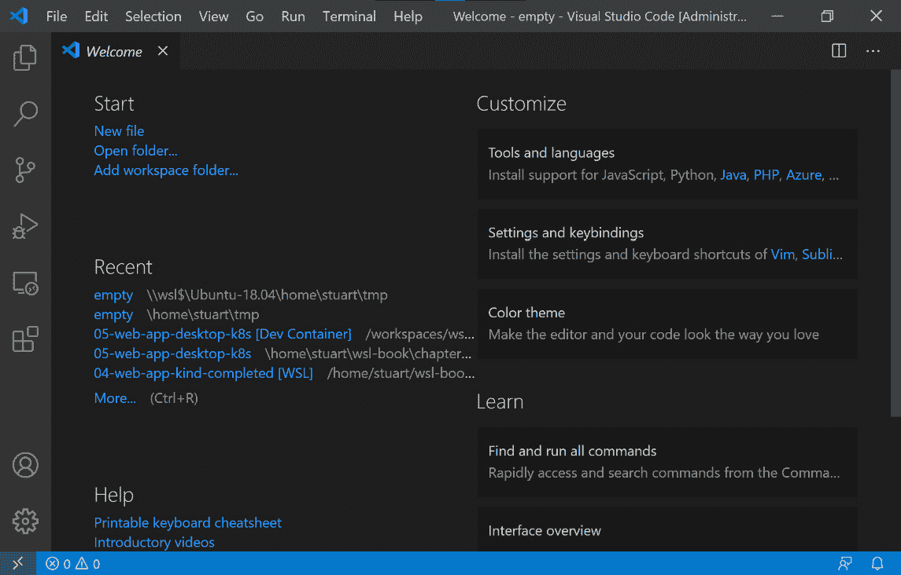

图 9.1 - Visual Studio Code 的截图

在这个截图中，你可以看到 Visual Studio Code 中的**欢迎**页面。该页面提供了一些常见操作的链接（如打开文件夹），最近打开的文件夹（在首次安装时没有这些），以及各种有用的帮助页面。

总的来说，使用 Visual Studio Code 的基本用法可能会让人感到熟悉，与其他图形化编辑器类似。文档中有一些很好的入门视频（[`code.visualstudio.com/docs/getstarted/introvideos`](https://code.visualstudio.com/docs/getstarted/introvideos)）以及书面的技巧和技巧（[`code.visualstudio.com/docs/getstarted/tips-and-tricks`](https://code.visualstudio.com/docs/getstarted/tips-and-tricks)）。这些链接提供了许多有用的技巧，可以帮助你充分利用 Visual Studio Code，并推荐提高你的工作效率。

有多种选项可以打开一个文件夹开始工作：

+   在**欢迎**页面上使用**打开文件夹...**链接，如*图 9.1*所示。

+   在**文件**菜单中使用**打开文件夹...**选项。

+   在命令面板中使用**文件：打开文件夹...**选项。

这里的最后一个选项，使用命令面板，是一个强大的选项，因为它提供了在 Visual Studio Code 中快速搜索任何命令的方法。你可以通过按下*Ctrl* + *Shift* + *P*来访问命令面板：

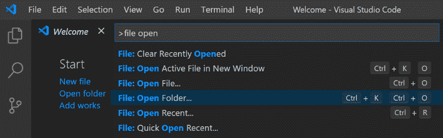

图 9.2 - 显示命令面板的截图

此截图显示了命令面板打开的情况。命令面板提供对 Visual Studio Code 中所有命令（包括已安装扩展的命令）的访问。在命令面板中输入时，操作列表会被过滤。在此截图中，您可以看到我已经过滤了“文件打开”，这样可以快速访问“文件：打开文件夹…”操作。值得注意的是，命令面板还显示了命令的键盘快捷键，为学习常用命令的快捷方式提供了一种简单的方法。

如前所述，Visual Studio Code 有各种各样的扩展，可以在 https://marketplace.visualstudio.com/vscode 上浏览，或者您可以从命令面板中选择**Extensions: Install Extensions**来直接在 Visual Studio Code 中浏览和安装。扩展可以为 Visual Studio Code 添加功能，包括支持新的语言，提供新的编辑器主题或添加新的功能。在本章的示例中，我们将使用一个 Python 应用程序，但这些原则也适用于其他语言。要了解如何添加语言支持的更多信息，请参阅[`code.visualstudio.com/docs/languages/overview`](https://code.visualstudio.com/docs/languages/overview)。

在我们开始查看示例应用程序之前，让我们先看一下一个为 Visual Studio Code 添加了丰富的 WSL 支持的扩展。

# 介绍 Visual Studio Code Remote

从 WSL 发行版的文件系统中处理文件的一种方法是使用 WSL 提供的`\\wsl$`共享（如*第四章*中所讨论的*Windows 与 Linux 的互操作性*中的*从 Windows 访问 Linux 文件*部分）。例如，我可以从`\\wsl$\Ubuntu-20.04\home\stuart\wsl-book`中的我的主目录访问`wsl-book`文件夹。然而，尽管这样可以工作，但它会产生 Windows 到 Linux 文件互操作的成本，并且不能为我提供一个集成的环境。

在 Windows 上，如果我们安装了 Python 以及 Visual Studio Code 的 Python 扩展，那么我们可以获得一个集成的体验来运行和调试我们的代码。如果我们通过`\\wsl$`共享打开代码，那么 Visual Studio Code 仍然会给我们提供 Windows 体验，而不是使用 WSL 中 Python 及其依赖和工具的安装。然而，通过 Microsoft 的**Remote-WSL 扩展**，我们可以解决这个问题！

通过 Remote Development 扩展，Visual Studio Code 现在将体验分为 Visual Studio Code 用户界面和 Visual Studio Code 服务器。服务器部分负责加载源代码，启动应用程序，运行调试器，启动终端进程等其他活动。用户界面部分通过与服务器通信提供 Windows 用户界面功能。

远程扩展有各种不同的版本：

+   Remote-WSL，在 WSL 中运行服务器

+   Remote-SSH，允许您通过 SSH 连接到远程机器来运行服务器

+   Remote-Containers，允许您使用容器来运行服务器

我们将在本章的其余部分介绍 Remote-WSL，下一章将介绍 Remote-Containers。有关 Remote-Development 扩展的更多信息（包括 Remote-SSH），请参阅 https://code.visualstudio.com/docs/remote/remote-overview。让我们开始使用 Remote-WSL。

# 开始使用 Remote-WSL

Remote-WSL 扩展包含在 Remote-Development 扩展包中（[`marketplace.visualstudio.com/items?itemName=ms-vscode-remote.vscode-remote-extensionpack`](https://marketplace.visualstudio.com/items?itemName=ms-vscode-remote.vscode-remote-extensionpack)），它提供了一种简单的方式来一键安装 Remote-WSL、Remote-SSH 和 Remote-Containers。如果你只想安装 Remote-WSL，请在这里进行安装：[`marketplace.visualstudio.com/items?itemName=ms-vscode-remote.remote-wsl`](https://marketplace.visualstudio.com/items?itemName=ms-vscode-remote.remote-wsl)。

要跟随本书进行操作，请确保在 Linux 发行版中克隆了本书的代码。你可以在[`github.com/PacktPublishing/Windows-Subsystem-for-Linux-2-WSL-2-Tips-Tricks-and-Techniques`](https://github.com/PacktPublishing/Windows-Subsystem-for-Linux-2-WSL-2-Tips-Tricks-and-Techniques)找到代码。

示例代码使用 Python 3，如果你使用的是最新版本的 Ubuntu，它应该已经安装好了。你可以通过在 Linux 发行版中运行`python3 -c 'print("hello")'`来测试是否安装了 Python 3。如果命令成功完成，则说明一切准备就绪。如果没有，请参考 Python 文档中的安装说明：[`wiki.python.org/moin/BeginnersGuide/Download`](https://wiki.python.org/moin/BeginnersGuide/Download)。

现在让我们在 Visual Studio Code 中打开示例代码。

## 使用 Remote-WSL 打开文件夹

安装完 Remote-WSL 后，打开 Visual Studio Code 并从命令面板（*Ctrl* + *Shift* + *P*）选择**Remote-WSL: New Window**：

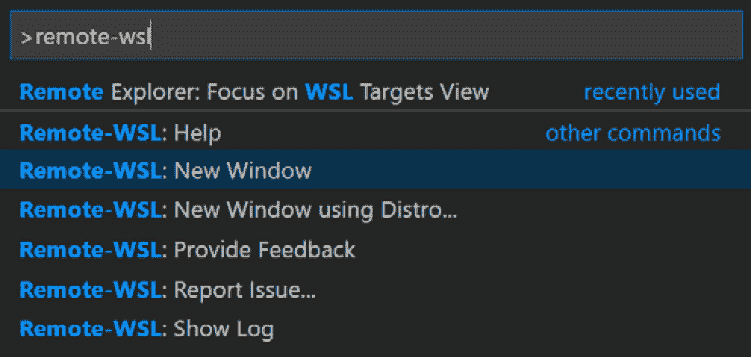

图 9.3 - 显示命令面板中的 Remote-WSL 命令的屏幕截图

此屏幕截图显示 Remote-WSL 扩展添加的新命令，选择**Remote-WSL: New Window**。这将打开一个新的 Visual Studio Code 窗口，在默认的 WSL 发行版中启动 Visual Studio Code 服务器并连接到它。如果你想选择连接的发行版，请选择**Remote-WSL: New Window using Distro…**选项。

新的 Visual Studio Code 窗口打开后，窗口的左下角将显示**WSL: Ubuntu-18.04**（或者你打开的其他发行版），表示此实例的 Visual Studio Code 通过 Remote-WSL 连接。

现在，我们可以从命令面板中选择**File: Open Folder…**来打开示例代码。在没有通过 Remote-WSL 连接时，在 Visual Studio Code 中执行此操作将打开标准的 Windows 文件对话框。然而，由于我们通过 Remote-WSL 连接，这个命令现在会提示我们选择连接的发行版中的一个文件夹：

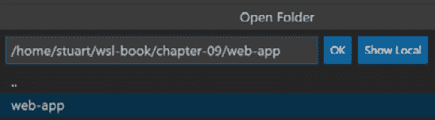

图 9.4 - 显示 Remote-WSL 文件夹选择器的屏幕截图

此屏幕截图显示从 WSL 分发文件系统中选择要打开的文件夹。请注意，我将本书的代码克隆到了`home`文件夹中的`wsl-book`中。根据你保存代码的位置，你可能会有一个类似于`/home/<your-user>/WSL-2-Tips-Tricks-and-Techniques/chapter-09/web-app`的路径。打开文件夹后，Visual Studio 开始处理内容，并提示你安装推荐的扩展（如果你还没有安装 Python 扩展）：

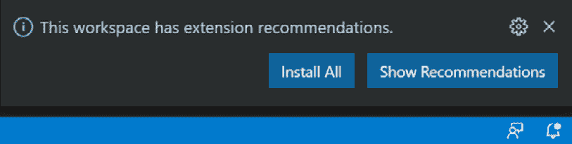

图 9.5 - 显示推荐扩展提示的屏幕截图

此屏幕截图中的提示出现是因为您刚刚打开的文件夹包含一个列出 Python 扩展的`.vscode/extensions.json`文件。当提示出现时，要么单击**Install All**安装扩展，要么单击**Show Recommendations**在安装之前检查扩展。请注意，即使您之前在使用 Remote-WSL 之前已在 Visual Studio Code 中安装了 Python 扩展，您也可能会收到提示：


图 9.6 - 显示在 Windows 中安装了 Python 但未安装 WSL 的屏幕截图

此屏幕截图显示了 Visual Studio Code 中的**EXTENSIONS**视图，指示 Python 扩展已在 Windows 中安装，并提示我们安装当前项目所加载的 WSL 发行版的 Remote-WSL。如果您看到此提示，请单击**Install**按钮以在 WSL 中安装。

此时，我们在 Windows 中运行 Visual Studio Code 用户界面，并连接到在我们的 WSL 发行版中运行的服务器组件。服务器已加载了 Web 应用程序的代码，并且我们已安装了 Python 扩展，该扩展现在在服务器中运行。

有了这个设置，让我们看看如何在调试器下运行代码。

## 运行应用程序

要运行应用程序，我们首先需要确保 Python 扩展正在使用正确的 Python 版本（我们想要 Python 3）。为此，请查看 Visual Studio Code 窗口底部的状态栏，直到看到类似于**Python 2.7.18 64 位**的内容。单击此部分会弹出 Python 版本选择器：

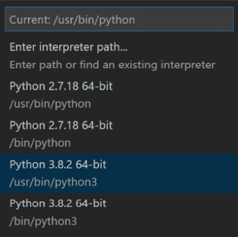

图 9.7 - 显示 Python 版本选择器的屏幕截图

如此屏幕截图所示，版本选择器显示它检测到的任何 Python 版本，并允许您选择您想要的版本（在这里，我们选择了 Python 3 版本）。请注意，此列表中显示的路径都是 Linux 路径，确认 Python 扩展正在 WSL 中的 Visual Studio Code 服务器中运行。如果您喜欢使用 Python 虚拟环境（[`docs.python.org/3/library/venv.html`](https://docs.python.org/3/library/venv.html)）并为项目创建了一个虚拟环境，这些虚拟环境也会显示在此列表中供您选择。

在运行应用程序之前，我们需要安装依赖项。从命令面板中选择`pip3 install -r requirements.txt`以安装我们的依赖项。

提示

如果您尚未安装 pip3，请运行`sudo apt-update && sudo apt install python3-pip`进行安装。

或者，按照此处的说明进行操作：[`packaging.python.org/guides/installing-using-linux-tools/`](https://packaging.python.org/guides/installing-using-linux-tools/)。

接下来，从`app.py`打开`app.py`，我们可以通过按下*F5*来启动调试器，这将提示您选择要使用的配置：

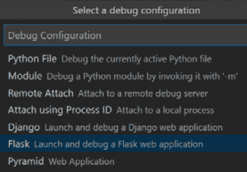

图 9.8 - 显示 Python 配置选择器的屏幕截图

此屏幕截图显示了 Python 扩展允许您选择的一组常见调试选项。我们将在稍后看到如何配置它以实现完全灵活性，但现在选择**Flask**。这将使用 Flask 框架启动应用程序并附加调试器：

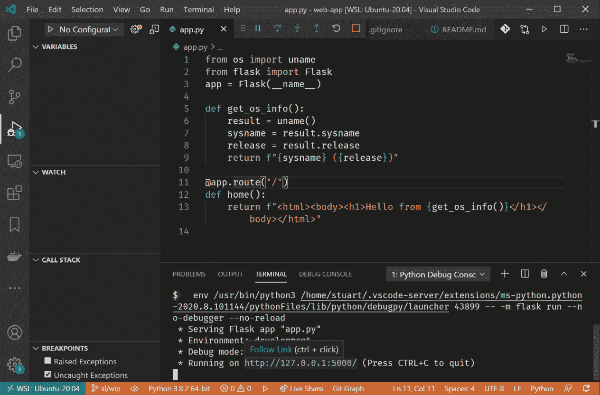

图 9.9 - 显示在调试器下运行应用程序的屏幕截图

在上一个屏幕截图中，您可以看到已打开集成终端窗口，并且 Visual Studio Code 已启动了我们的 Flask 应用程序。当应用程序启动时，它会输出它正在侦听的 URL（在此示例中为`http://127.0.0.1:5000`）。将光标悬停在此链接上会提示您使用*Ctrl* + *单击*打开链接。这样做将在默认浏览器中打开 URL：

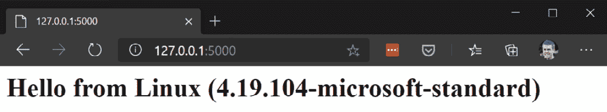

图 9.10-浏览器中显示 Web 应用程序的屏幕截图

此屏幕截图显示了浏览器中 Web 应用程序的输出，其中包括 Web 应用程序服务器正在运行的操作系统名称和内核版本。同样，这证明了虽然 Visual Studio Code 用户界面在 Windows 中运行，但所有代码都在我们的 WSL 分发中处理和运行。Visual Studio Code 的 Remote-WSL 和 WSL 用于本地主机地址的流量转发的组合为我们提供了跨 Windows 和 Linux 的丰富和自然的体验。

到目前为止，我们只是将调试器用作启动应用程序的便捷方式。接下来，让我们看看如何使用调试器逐步执行代码。

## 调试我们的应用程序

在本节中，我们将介绍如何在调试器中逐步查看项目中的代码。同样，这使我们可以使用 Windows 中的 Visual Studio Code 用户界面连接到和调试在 WSL 分发中运行的应用程序。

在上一节中，我们看到了如何使用*F5*运行 Python 应用程序，并提示我们选择要使用的配置（我们选择了*Flask*）。由于我们还没有为项目配置调试器，因此每次都会提示我们选择环境。在深入研究调试器之前，让我们设置配置，以便*F5*自动正确启动我们的应用程序。为此，请打开**RUN**视图，可以通过按下*Ctrl* + *Shift* + *D*或从命令面板中选择**Run: Focus on Run View**命令来打开：

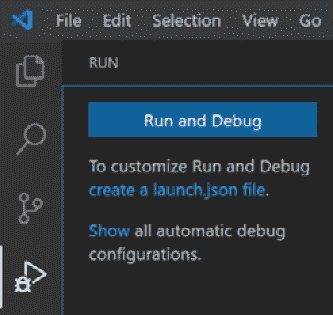

图 9.11-Visual Studio Code 中显示运行视图的屏幕截图

此屏幕截图显示了`launch.json`文件。您将收到与*图 9.7*中相同的一组选项，并且应再次选择我们打开的文件夹中的`.vscode/launch.json`文件：

```
{
    // Use IntelliSense to learn about possible attributes.
    // Hover to view descriptions of existing attributes.
    // For more information, visit: https://go.microsoft.com/fwlink/?linkid=830387
    "version": "0.2.0",
    "configurations": [
        {
            "name": "Python: Flask",
            "type": "python",
            "request": "launch",
            "module": "flask",
            "env": {
                "FLASK_APP": "app.py",
                "FLASK_ENV": "development",
                "FLASK_DEBUG": "0"
            },
            "args": [
                "run",
                "--no-debugger",
                "--no-reload"
            ],
            "jinja": true
        }
    ]
}
```

如此内容所示，`launch.json`包含一个`env`属性。

配置了调试选项后，让我们切换回`app.py`文件并设置一个断点。在`app.py`中，我们有一个`home`方法，它返回一些 HTML 并包含`get_os_info`函数的输出。在该函数的`return`语句处导航并按下*F9*添加一个断点（还有其他方法可以做到这一点-请参阅 https://code.visualstudio.com/docs/editor/debugging）。现在，我们可以按下*F5*运行我们的应用程序，当它处理请求时，它将在调试器中暂停。要触发断点，请像之前一样打开浏览器并切换回 Visual Studio Code：

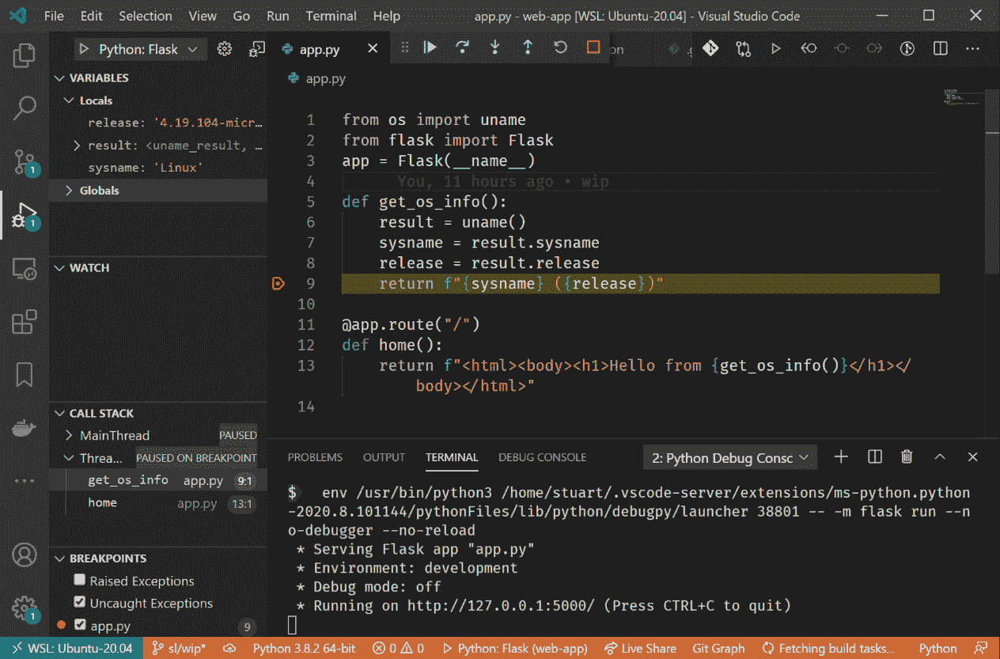

图 9.12-Visual Studio Code 在 WSL 中调试 Python 应用程序的屏幕截图

此屏幕截图显示了 Visual Studio Code 调试我们的应用程序。在左侧，我们可以看到局部变量（例如，`sysname`变量的内容）和调用堆栈。我们可以使用窗口顶部的控件（或它们的键盘快捷键）来恢复执行或逐步执行代码。窗口底部显示了用于运行应用程序的终端，我们可以将其切换到`sysname="Hello"`，然后按下*F5*恢复应用程序。切换回浏览器，您将在浏览器的输出中看到`Hello`，显示我们在调试器中更新了变量的值。

在这里，我们看到了 Visual Studio Code 对多种语言的丰富支持（通过安装语言支持扩展）。通过安装和使用*Remote-WSL*扩展，我们可以在 Windows 中获得 Visual Studio Code 的丰富功能，并在 WSL 中执行所有代码服务。在这个例子中，我们演示了在 WSL 中运行的所有代码服务：Python 解释器、语言服务以实现重构、调试器和正在调试的应用程序。所有这些执行都发生在 WSL 中，因此我们可以在 Linux 中设置环境，然后在开发应用程序时在其上方拥有丰富的用户界面。

现在我们已经了解了核心体验，我们将深入了解一些使用 Remote-WSL 的技巧。

# 使用 Remote-WSL 的技巧

本节将介绍一些技巧，可以帮助您在使用 Visual Studio Code 和 Remote-WSL 时进一步优化您的体验。

## 从终端加载 Visual Studio Code

在 Windows 中，您可以使用`code <路径>`命令从终端启动 Visual Studio Code，以打开指定的路径。例如，您可以使用`code .`来打开当前文件夹（`.`）在 Visual Studio Code 中。实际上，这使用了一个`code.cmd`脚本文件，但 Windows 允许您省略扩展名。

在使用 WSL 时，通常会打开一个终端，并且使用 Remote-WSL，您还可以获得一个`code`命令。因此，您可以在 WSL 的终端中导航到项目文件夹并运行`code .`，它将启动 Visual Studio Code 并使用 Remote-WSL 扩展打开指定的文件夹（在这种情况下是当前文件夹）。这种集成是一个很好的选择，可以在 Windows 和 WSL 环境之间保持一致和集成。

在这里，我们看到了如何从终端进入 Visual Studio Code。接下来，我们将看相反的情况。

## 在 Windows 终端中打开外部终端

有时候你在 Visual Studio Code 中工作，想要一个新的终端来运行一些命令。Visual Studio Code 在 Visual Studio Code 扩展视图中有`Windows 终端集成`，或者打开 https://marketplace.visualstudio.com/items?itemName=Tyriar.windows-terminal。安装完成后，会有一些新的命令可用：

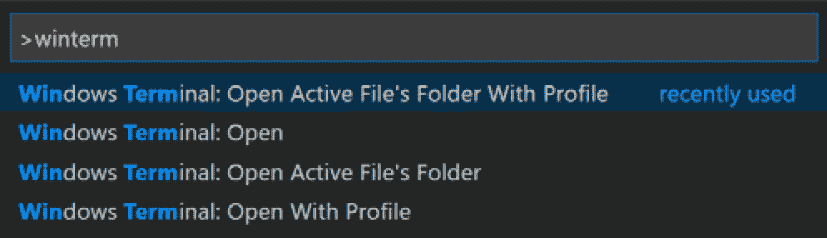

图 9.13 - 展示新的 Windows 终端命令的截图

这个截图展示了命令面板中的新命令。**打开**命令使用 Windows 终端中的默认配置打开 Visual Studio Code 工作区文件夹。**打开活动文件夹**命令在默认配置中打开包含当前打开文件的文件夹。另外两个命令**使用配置文件打开**对应于前面的命令，但允许您选择使用哪个 Windows 终端配置文件打开路径。

除了从命令面板中访问的命令外，该扩展还为资源管理器视图中的文件和文件夹添加了右键菜单的新项目：

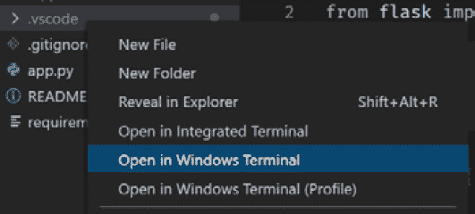

图 9.14 - 展示右键菜单命令的截图

在这个截图中，我在资源管理器视图中点击了一个文件夹，扩展添加了两个菜单项，用于在 Windows 终端中打开路径。其中第一个菜单项在默认配置中打开路径，第二个菜单项会提示打开路径。

这个扩展可以快速方便地在 Visual Studio Code 项目的上下文中打开一个 Windows 终端实例，让您保持流畅和高效。

接下来，我们将介绍一些使用 Git 的技巧。

## 使用 Visual Studio Code 作为您的 Git 编辑器

Visual Studio Code 提供了与 Git 存储库一起工作的集成可视化工具。根据个人喜好，您可以使用`git`命令行工具来进行一些或全部的 Git 交互。对于某些操作，Git 会打开一个临时文件以获取进一步的输入，例如在合并提交上获取提交消息或确定在交互式 rebase 上采取哪些操作。

除非您配置了其他编辑器，否则 Git 将使用`vi`作为其默认编辑器。如果您熟悉`vi`，那很好，但如果您更喜欢使用 Visual Studio Code，我们可以利用本章前面看到的`code`命令。

要配置 Git 使用 Visual Studio Code，我们可以运行`git config --global core.editor "code --wait"`。`--global`开关设置所有存储库的配置值（除非它们覆盖它），我们正在设置`core.editor`值，该值控制`git`使用的编辑器。我们为此设置分配的值是`code --wait`，它使用我们在上一节中看到的`code`命令。运行`code`命令而不使用`--wait`开关会启动 Visual Studio Code 然后退出（保持 Visual Studio Code 运行），这通常是在使用它打开文件或文件夹时所希望的行为。但是，当`git`启动编辑器时，它期望进程阻塞直到文件关闭，而`--wait`开关提供了这种行为：

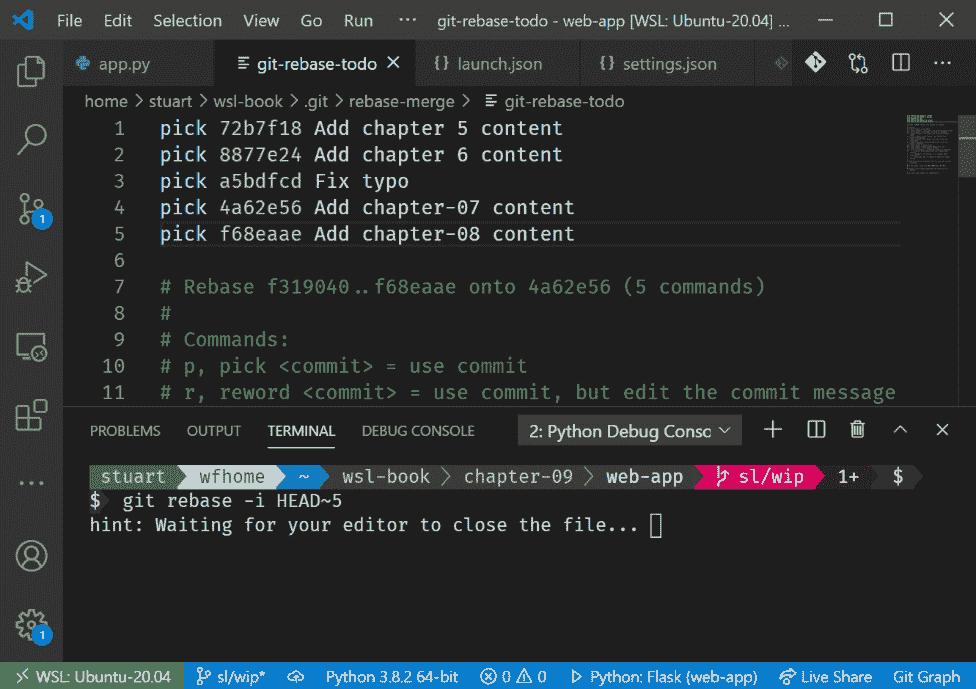

图 9.15 - 显示 Visual Studio Code 作为 WSL 的 Git 编辑器的屏幕截图

在这个屏幕截图中，您可以在底部的终端中看到一个交互式的`git rebase`命令，以及在配置了 Git 编辑器后加载到 Visual Studio Code 中的`git-rebase-todo`文件，用于捕获操作。

接下来，我们将继续查看 Git，探索查看 Git 历史记录的方法。

## 查看 Git 历史记录

在使用 Git 进行版本控制的项目中工作时，您可能会想要在某个时候查看提交历史记录。有各种方法可以实现这一点，您可能也有自己首选的工具。尽管界面风格简单，但我经常使用`gitk`，因为它是普遍存在的，作为 Git 安装的一部分包含在其中。在 Windows 上工作时，您可以直接从 Git 存储库的文件夹中运行`gitk`。在 WSL 中，我们需要运行`gitk.exe`以便启动 Windows 应用程序（请注意，这需要在 Windows 上安装 Git）：

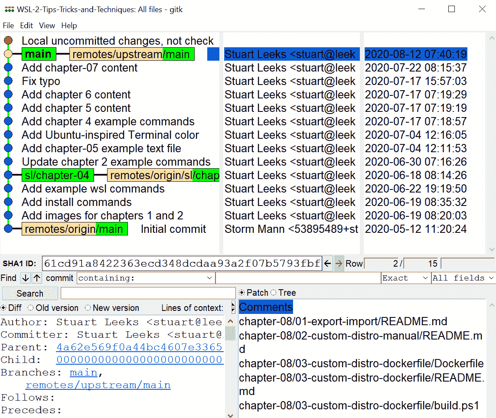

图 9.16 - 显示从 WSL 运行的 gitk.exe 的屏幕截图

在这个屏幕截图中，您可以看到从 WSL Git 存储库运行的`gitk` Windows 应用程序，并通过文件系统映射访问内容。如果您有其他首选的用于查看 Git 历史记录的 Windows 应用程序，那么这种方法也可以工作，只要该应用程序在您的路径中。如果在运行这些命令时忘记添加`.exe`，您可能希望查看*第五章*，*Linux 到 Windows 的互操作性*，*为 Windows 应用程序创建别名*部分。

由于 Windows 应用程序通过`\\wsl$`共享使用 Windows 到 Linux 文件映射，您可能会注意到对于大型 Git 存储库，应用程序加载速度较慢，因为这种映射的开销较大。另一种方法是在 Visual Studio Code 中使用扩展，例如**Git Graph**（https://marketplace.visualstudio.com/items?itemName=mhutchie.git-graph）：

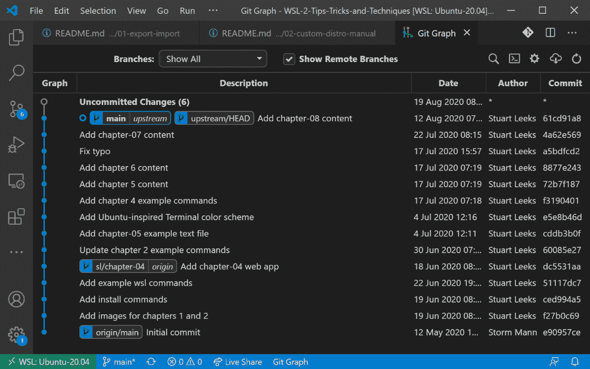

图 9.17 - 显示 Visual Studio Code 中的 Git Graph 扩展

这个截图显示了使用**Git Graph**扩展查看的 Git 历史记录。通过使用 Visual Studio Code 扩展来渲染 Git 历史记录，扩展可以由在 WSL 中运行的服务器组件来运行。这样可以直接访问文件来查询 Git 历史记录，并避免了 Windows 应用程序的性能开销。

# 概述

在本章中，您已经对 Visual Studio Code 有了一个概述，并且看到它是一个灵活的编辑器，具有丰富的扩展生态系统，为各种语言提供支持，并为编辑器添加额外的功能。

其中一个扩展是 Remote-WSL，它允许将编辑器分为两部分，用户界面部分在 Windows 中运行，其他功能在 WSL 中运行（包括文件访问、语言服务和调试器）。

这个功能使您能够无缝地使用 Visual Studio Code 的丰富功能（包括扩展），但是您的源代码和应用程序都在 WSL 中运行。通过这种方式，您可以充分利用适用于您的 WSL 发行版的工具和库。

在下一章中，我们将探索另一个 Visual Studio Code Remote 扩展，这次将研究在容器中运行服务以自动化开发环境并提供依赖项的隔离。
