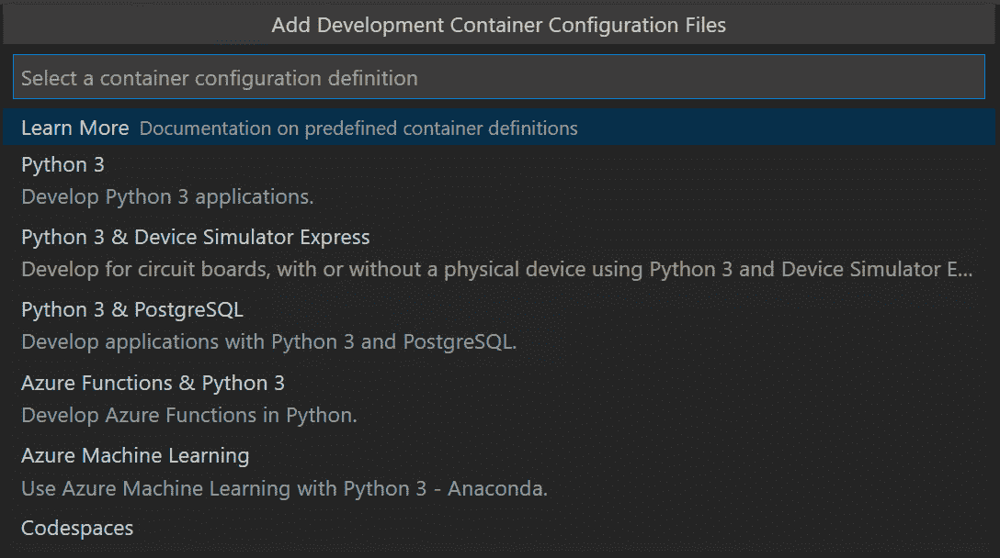
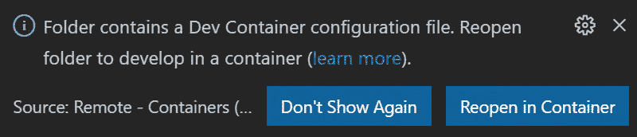
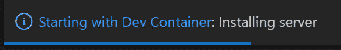
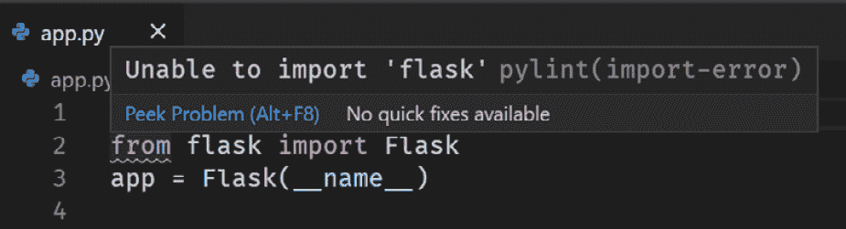
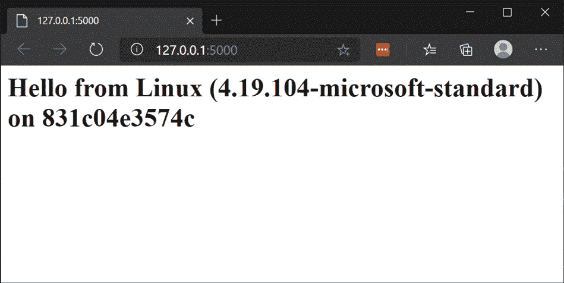
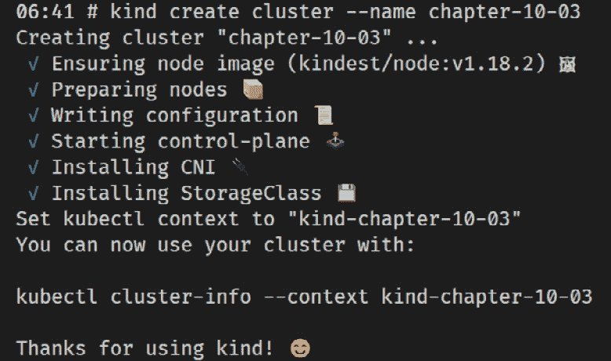
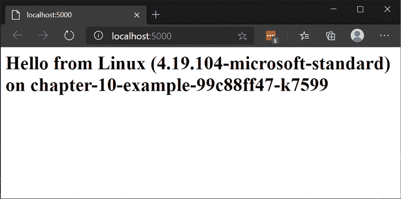
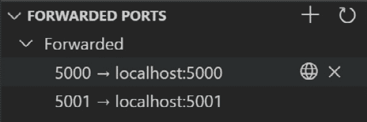
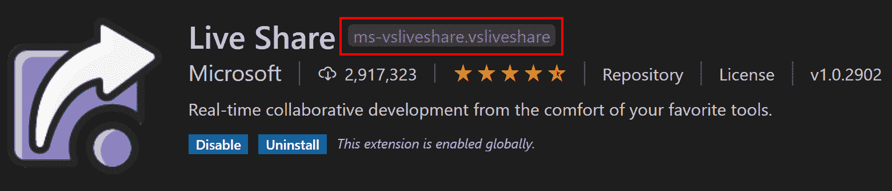

# 第十章：Visual Studio Code 和容器

在*第九章*，*Visual Studio Code 和 WSL*中，我们看到 Visual Studio Code 编辑器允许将用户界面与与我们的代码交互和运行代码的其他功能分离。通过 WSL，这使我们可以在运行我们项目的所有关键部分的 Linux 中保持熟悉的基于 Windows 的用户界面。除了允许代码交互在 WSL 中的服务器组件中运行外，Visual Studio Code 还允许我们通过 SSH 连接到代码服务器或在容器中运行它。能够在容器中运行是由**Remote-Containers**扩展提供的，本章将重点介绍如何使用此功能。我们将看到如何使用这些开发容器（或**dev container**）来封装我们的项目依赖项。通过这样做，我们可以更容易地将人们引入我们的项目，并获得一种优雅的方式来隔离可能发生冲突的工具集。

在本章中，我们将介绍以下主要内容：

+   介绍 Visual Studio Code Remote-Containers

+   安装 Remote-Containers

+   创建一个 dev 容器

+   在开发容器中使用容器化应用程序

+   在开发容器中使用 Kubernetes

+   使用开发容器的技巧

在本章中，您需要安装 Visual Studio Code - 请参阅*第九章*，*Visual Studio Code 和 WSL*，*介绍 Visual Studio Code*部分了解更多详细信息。我们将通过介绍 Visual Studio Code 的 Remote-Containers 扩展并将其安装来开始本章。

# 介绍 Visual Studio Code Remote-Containers

Visual Studio Code 的 Remote-Containers 扩展作为 Remote-Development 扩展包的一部分，与**Remote-WSL**和**Remote-SSH**一起。所有这些扩展都允许您将用户界面方面与代码交互分离，例如加载、运行和调试代码。通过 Remote-Containers，我们指示 Visual Studio Code 在我们在**Dockerfile**中定义的容器内运行这些代码交互（请参阅*第七章*，*在 WSL 中使用容器*，*介绍 Dockerfiles*部分）。

当 Visual Studio Code 在开发容器中加载我们的项目时，它经过以下步骤：

1.  从 Dockerfile 构建容器镜像

1.  使用生成的镜像运行容器，将源代码挂载到容器中。

1.  在容器中为用户界面安装 VS 代码服务器

通过这些步骤，我们得到一个包含我们的 Dockerfile 描述的依赖项的容器镜像。通过将代码挂载到容器内部，代码可以在容器内部使用，但只有一份代码的副本。

在开发项目中，通常会有一份工具或先决条件列表，需要安装这些工具以准备好与项目一起工作。如果你很幸运，这个列表甚至会是最新的！通过使用*dev containers*，我们可以用 Dockerfile 中的一系列步骤替换文档中的工具列表来执行这些步骤。由于这些镜像可以重新构建，安装工具的标准方式现在变成了 Dockerfile。由于这是源代码控制的一部分，所以这些所需工具的更改将与其他开发人员共享，他们只需从 Dockerfile 重新构建他们的 dev 容器镜像即可更新他们的工具集。

开发容器的另一个好处是依赖项安装在容器中，因此是隔离的。这使我们能够为不同项目创建具有相同工具的不同版本的容器（例如 Python 或 Java），而不会发生冲突。这种隔离还允许我们在项目之间独立更新工具的版本。

让我们来看看如何安装 Remote-Containers 扩展。

# 安装 Remote-Containers

要使用 Remote-Containers 扩展，您需要安装它，并且还需要在 WSL 中安装和访问 Docker。请参阅*第七章*，*在 WSL 中使用容器*，*使用 WSL 安装和使用 Docker*部分以了解如何配置。如果您已经安装了 Docker Desktop，请确保将其配置为使用**基于 WSL 2 的引擎**。WSL 2 引擎使用在 WSL 2 中运行的 Docker 守护程序，因此您的代码文件（来自 WSL 2）可以直接挂载到容器中，而无需经过 Linux 到 Windows 文件共享。这种直接挂载可以提供更好的性能，确保文件事件被正确处理，并使用相同的文件缓存（有关更多详细信息，请参阅此博文：[`www.docker.com/blog/docker-desktop-wsl-2-best-practices/)`](https://www.docker.com/blog/docker-desktop-wsl-2-best-practices/)）。

一旦您配置好了 Docker，下一步是安装 Remote-Containers 扩展。您可以在 Visual Studio Code 的**EXTENSIONS**视图中搜索`Remote-Containers`来完成此操作，或者访问[`marketplace.visualstudio.com/items?itemName=ms-vscode-remote.remote-containers`](https://marketplace.visualstudio.com/items?itemName=ms-vscode-remote.remote-containers)。

安装了扩展后，让我们看看如何创建开发容器。

# 创建开发容器

要将开发容器添加到项目中，我们需要创建一个包含两个文件的`.devcontainer`文件夹：

+   `Dockerfile`用于描述要构建和运行的容器映像

+   `devcontainer.json`以添加其他配置

这些文件的组合将为我们提供一个单容器配置。Remote-Containers 还支持使用**Docker Compose**的多容器配置（参见[`code.visualstudio.com/docs/remote/create-dev-container#_using-docker-compose`](https://code.visualstudio.com/docs/remote/create-dev-container#_using-docker-compose)），但在本章中，我们将重点关注单容器场景。

本书附带的代码包含一个示例项目，我们将使用它来探索开发容器。请确保从[`github.com/PacktPublishing/Windows-Subsystem-for-Linux-2-WSL-2-Tips-Tricks-and-Techniques`](https://github.com/PacktPublishing/Windows-Subsystem-for-Linux-2-WSL-2-Tips-Tricks-and-Techniques)在 Linux 发行版中克隆代码。克隆代码后，在 Visual Studio Code 中打开`chapter-10/01-web-app`文件夹（还有一个`chapter-10/02-web-app-completed`文件夹，其中包含了本节中的所有步骤作为参考）。这个示例代码还没有开发容器定义，所以让我们看看如何添加它。

## 添加和打开开发容器定义

开发容器的第一步是创建**开发容器定义**，Remote-Containers 扩展在这方面为我们提供了一些帮助。在 Visual Studio Code 中打开示例项目后，从命令面板中选择**Remote-Containers: Add Development Container Configuration Files…**，然后您将被提示选择一个配置：



图 10.1-显示开发容器配置列表的屏幕截图

如此屏幕截图所示，我们可以从一系列预定义的开发容器配置中选择。对于示例项目，请选择`.devcontainer`文件夹，并配置`devcontainer.json`和`Dockerfile`以使用 Python 3。添加这些文件后，您应该会看到以下提示：



图 10.2-显示重新在容器中打开提示的屏幕截图

当 Visual Studio Code 检测到您打开了一个带有开发容器定义的文件夹时，会出现此提示。点击**在容器中重新打开**以在开发容器中打开文件夹。如果您错过了提示，可以使用命令面板中的**Remote-Containers: Reopen in Container**命令来实现相同的功能。

选择重新在容器中打开文件夹后，Visual Studio Code 将重新启动并开始构建容器镜像以运行代码服务器。您将看到一个通知：



Figure 10.3 – A screenshot showing the Starting with Dev Container notification

此截图显示了开发容器正在启动的通知。如果您点击通知，将会进入**TERMINAL**视图中的**Dev Containers**窗格，显示构建和运行容器的命令和输出。当您开始自定义开发容器定义时，此窗口对于调试场景非常有用，例如当您的容器镜像无法构建时。现在我们已经在开发容器中打开了项目，让我们开始探索它吧。

## 在开发容器中工作

一旦开发容器构建和启动完成，您将在`devcontainer.json`文件的`name`属性中看到示例代码的内容：

```
{
    "name": "chapter-10-01-web-app",
...
```

在`devcontainer.json`的这个片段中，开发容器的名称已更改为`chapter-10-01-web-app`。此更改将在下次构建和加载开发容器时生效。如果您有时同时加载多个开发容器，将名称设置得有意义尤为有帮助，因为它会显示在窗口标题中。

接下来，让我们打开包含示例应用程序代码的`app.py`文件：



Figure 10.4 – A screenshot showing an import error in app.py

在此截图中，您可以看到导入 Flask 包的行下面的红色下划线，这在 Python 扩展加载和处理文件后显示。此错误表示 Python 无法找到 Flask 包。希望这是有意义的-所有的工具都在一个只安装了 Python 的容器中运行，没有其他东西。让我们快速修复这个问题。使用*Ctrl* + *`*（反引号）打开集成终端，或者使用`pip3 install -r requirements.txt`安装`requirements.txt`中列出的要求（包括 Flask）。安装了要求后，Python 语言服务器最终会更新以删除红色下划线警告。

在本章后面，我们将介绍如何在构建容器时自动安装所需的内容，以提供更流畅的体验；但是现在我们已经准备好了，让我们运行代码吧。

## 运行代码

示例代码包括一个描述如何启动我们的代码的`.vscode/launch.json`文件。该文件允许我们配置传递给进程的命令行参数和应设置的环境变量等内容。有关`launch.json`的介绍和从头开始创建它的内容，请参见*第九章*，*Visual Studio Code 和 WSL*，*调试我们的应用程序*部分。

通过`launch.json`，我们只需按下*F5*即可在调试器下启动我们的应用程序。如果您想看到交互式调试器的效果，请使用*F9*设置断点（`get_os_info`函数中的`return`语句是一个好的位置）。

启动后，您将在**TERMINAL**视图中看到调试器命令的执行和相应的输出：

```
* Serving Flask app "app.py"
 * Environment: development
 * Debug mode: off
 * Running on http://127.0.0.1:5000/ (Press CTRL+C to quit)
```

在这个输出中，你可以看到应用程序启动并显示了它正在监听的地址和端口（`http://127.0.0.1:5000`）。当你用鼠标悬停在这个地址上时，你会看到一个弹出窗口，显示你可以使用*Ctrl* + 单击来打开链接。这样做将会在你的默认 Windows 浏览器中打开该地址，并且如果你设置了断点，你会发现代码已经在那个点暂停，以便你检查变量等。一旦你完成了对调试器的探索，按下*F5*继续执行，你将在浏览器中看到渲染后的响应：



Figure 10.5 – 一个截图显示了 Python 应用在 Windows 浏览器中的网页

这个截图显示了浏览器加载了我们的 Python 应用的网页。请注意主机名（在截图中为`831c04e3574c`，但是你会看到一个不同的 ID，因为每个容器都会改变），这是短容器 ID，它被设置为容器实例中运行应用程序的主机名。我们能够从 Windows 加载网页，是因为 Remote-Containers 扩展自动为我们设置了端口转发。这个端口转发在 Windows 上监听端口`5000`，并将流量转发到我们的 Python 应用程序所在的容器中的端口`5000`，以进行监听和响应。

此时，我们在 WSL 中的 Docker 中运行了一个容器，其中包含了我们的所有开发工具（包括 Python 和 Visual Studio Code 服务器），我们能够以我们期望的丰富、交互式的方式与代码一起工作。我们可以轻松地在调试器中启动代码，逐步执行代码并检查变量，然后从 Windows 与我们的 Web 应用程序进行交互。所有这些都像在主机上运行代码一样顺利，但我们拥有开发容器带来的隔离和自动化开发环境的所有优势。

接下来，我们将探索如何自定义开发容器定义，同时将我们的应用程序作为容器在开发容器中打包和运行。

# 在开发容器中使用容器化应用程序

到目前为止，我们已经看到了如何使用开发容器来开发应用程序，但是如果我们想要开发一个将自身打包并在容器中运行的应用程序，可能是在 Kubernetes 中呢？在本节中，我们将专注于这种情况，看看如何从开发容器内部构建和运行我们应用程序的容器镜像。

我们将再次使用本书的附带代码作为本节的起点。确保你在 Linux 发行版中从[`github.com/PacktPublishing/Windows-Subsystem-for-Linux-2-WSL-2-Tips-Tricks-and-Techniques`](https://github.com/PacktPublishing/Windows-Subsystem-for-Linux-2-WSL-2-Tips-Tricks-and-Techniques)克隆代码。代码克隆完成后，用 Visual Studio Code 打开`chapter-10/03-web-app-kind`文件夹（还有一个`chapter-10/04-web-app-kind-completed`文件夹，其中包含了本节中所有步骤的参考）。`03-web-app-kind`文件夹包含一个与我们刚刚使用的 Web 应用程序非常相似的 Web 应用程序，但是添加了一些额外的文件，以帮助我们在本章后面将应用程序集成到 Kubernetes 中。

为了能够在 Docker 中使用该应用程序，我们需要经历一些类似于我们在*第七章*中所经历的步骤，即在 WSL 中使用容器的*构建和运行 Web 应用程序*部分，只是这一次，我们将在我们的开发容器中进行操作：

1.  在开发容器中设置 Docker。

1.  构建应用程序 Docker 镜像。

1.  运行应用程序容器。

让我们首先看看如何设置开发容器，以允许我们构建应用程序容器镜像。

## 在开发容器中设置 Docker

启用构建 Docker 镜像的第一步是在 Visual Studio Code 中安装`docker` `.devcontainer/Dockerfile`并添加以下内容：

```
RUN apt-get update \
     && export 
DEBIAN_FRONTEND=noninteractive \"
    # Install docker
    && apt-get install -y apt-transport-https ca-certificates curl gnupg-agent software-properties-common lsb-release \
    && curl -fsSL https://download.docker.com/linux/$(lsb_release -is | tr '[:upper:]' '[:lower:]')/gpg | apt-key add - 2>/dev/null \
    && add-apt-repository "deb [arch=amd64] https://download.docker.com/linux/$(lsb_release -is | tr '[:upper:]' '[:lower:]') $(lsb_release -cs) stable" \
    && apt-get update \
    && apt-get install -y docker-ce-cli \
    # Install docker (END)
    # Install icu-devtools
    && apt-get install -y icu-devtools \ 
    # Clean up
    && apt-get autoremove -y \
    && apt-get clean -y \
    && rm -rf /var/lib/apt/lists/*
```

在此代码片段中，请注意`# Install docker`和`# Install docker (END)`之间的行。这些行已添加以遵循 Docker 文档中的步骤，以添加`apt`存储库，然后使用该存储库来`apt-get install` `docker-ce-cli`软件包。此时，重新构建和打开开发容器将为您提供一个带有`docker` CLI 的环境，但没有守护程序与其通信。

我们已经在主机上设置了 Docker，并且 Visual Studio Code 使用此提供的 Docker 守护程序来构建和运行我们用于开发的开发容器。要在容器内构建和运行 Docker 镜像，您可以考虑在开发容器内安装 Docker。这是可能的，但可能会变得非常复杂并且会增加性能问题。相反，我们将在开发容器内重用主机上的 Docker 守护程序。在 Linux 上，默认与 Docker 的通信是通过`/var/run/docker.sock`套接字进行的。使用`docker` CLI 运行容器时，可以使用`--mounts`开关挂载套接字（[`docs.docker.com/storage/bind-mounts/`](https://docs.docker.com/storage/bind-mounts/)）。对于开发容器，我们可以在`.devcontainer/devcontainer.json`中使用`mounts`属性指定此内容：

```
"mounts": [
    // mount the host docker socket (for Kind and docker builds)
    "source=/var/run/docker.sock,target=/var/run/docker.sock,type=bind"
],
```

此代码段显示了`devcontainer.json`中的`mounts`属性，该属性指定 Visual Studio Code 在运行我们的开发容器时要使用的挂载点。此属性是一个挂载字符串的数组，在这里我们指定了我们想要一个`bind`挂载（即从主机挂载），将主机上的`/var/run/docker.sock`挂载到开发容器内的相同值。这样做的效果是使主机上的 Docker 守护程序的套接字在开发容器内可用。

此时，在终端中已经安装了`docker` CLI 供您使用。您运行的任何`docker`命令都将针对 Docker Desktop 守护程序执行；因此，例如运行`docker ps`以列出容器将包括开发容器在其输出中：

```
# docker ps
CONTAINER ID        IMAGE                                                            COMMAND                  CREATED             STATUS              PORTS               NAMES
6471387cf184        vsc-03-web-app-kind-44349e1930d9193efc2813 97a394662f             "/bin/sh -c 'echo Co…"   54 seconds ago       Up 53 seconds  
```

在开发容器中终端中执行的`docker ps`命令的输出包括开发容器本身，确认 Docker 命令正在连接到主机 Docker 守护程序。

提示

如果您在更新 Dockerfile 和`devcontainer.json`之前已经打开了开发容器（或者在修改这些文件的任何时间），您可以运行**Remote-Containers: Rebuild and reopen in Container**命令。此命令将重新运行开发容器的构建过程，然后重新打开它，将您对开发容器的更改应用到其中。

现在我们已经安装和配置了 Docker，让我们来构建我们应用程序的容器镜像。

## 构建应用程序的 Docker 镜像

要构建我们应用程序的 Docker 镜像，我们可以运行`docker build`命令。由于 Docker CLI 配置为与主机 Docker 守护程序通信，我们从开发容器内构建的任何镜像实际上都是在主机上构建的。这消除了您可能期望从开发容器中获得的一些隔离性，但我们可以通过确保我们使用的镜像名称是唯一的来解决这个问题，以避免与其他项目发生名称冲突。

示例代码的根文件夹中已经有一个 Dockerfile，我们将使用它来构建应用程序的 Docker 镜像（不要与`.devcontainer/Dockerfile`混淆，该文件用于构建开发容器）。Dockerfile 在`python`基础镜像上构建，然后复制我们的源代码并配置启动命令。有关 Dockerfile 的更多详细信息，请参考*第七章*，*在 WSL 中使用容器*，*介绍 Dockerfiles*部分。

要构建应用程序镜像，请像在本章前面所做的那样打开集成终端，并运行以下命令来构建容器镜像：

```
docker build -t simple-python-app-2:v1 -f Dockerfile .
```

此命令将拉取 Python 镜像（如果不存在），并在输出`Successfully tagged simple-python-app-2:v1`之前运行 Dockerfile 中的每个步骤。

现在我们已经构建了应用程序镜像，让我们运行它。

## 运行应用程序容器

要运行我们的镜像，我们将使用`docker run`命令。从 Visual Studio Code 的集成终端中运行以下命令：

```
# docker run -d --network=container:$HOSTNAME --name chapter-10-example simple-python-app-2:v1 
ffb7a38fc8e9f86a8dd50ed197ac1a202ea7347773921de6a34b93cec 54a1d95
```

在此输出中，您可以看到我们正在运行一个名为`chapter-10-example`的容器，使用我们之前构建的`simple-python-app-2:v1`镜像。我们指定了`--network=container:$HOSTNAME`，这将新创建的容器放在与开发容器相同的 Docker 网络中。请注意，我们使用`$HOSTNAME`来指定开发容器的 ID，因为容器 ID 用作运行容器中的机器名称（正如我们在*第七章**中看到的，在 WSL 中使用容器的构建和运行* *Docker*部分）。有关`--network`开关的更多信息，请参阅[`docs.docker.com/engine/reference/run/#network-settings`](https://docs.docker.com/engine/reference/run/#network-settings)。我们可以通过从集成终端运行`curl`来确认我们能够访问运行容器中的 Web 应用程序：

```
# curl localhost:5000
<html><body><h1>Hello from Linux (4.19.104-microsoft-standard) on ffb7a38fc8e9</h1></body></html>
```

在此输出中，您可以看到 Web 应用程序对`curl`命令的 HTML 响应。这证实了我们可以从开发容器内部访问该应用程序。

如果您尝试从 Windows 浏览器访问 Web 应用程序，它将无法连接。这是因为 Web 应用程序的容器端口已映射到开发容器的 Docker 网络中。幸运的是，Remote-Containers 提供了一个`5000`，我们可以使 Windows 中的 Web 浏览器也能访问运行在容器中的 Web 应用程序。

对于您希望以这种方式在主机上定期访问的开发容器端口，更新`devcontainer.json`非常方便：

```
"forwardPorts": [
    5000
]
```

在这个片段中，您可以看到`forwardPorts`属性。这是一个端口数组，您可以配置它们在运行开发容器时自动转发，以节省每次手动转发的步骤。

**注意**

作为使用`--network`开关运行 Web 应用程序容器的替代方法，我们可以配置开发容器使用主机网络（使用`--network=host`，如下一节所示）。使用这种方法，开发容器重用与主机相同的网络堆栈，因此我们可以使用以下命令运行 Web 应用程序容器：

`docker run -d -p 5000:5000 --name chapter-10-example simple-python-app-2:v1`

在此命令中，我们使用了`-p 5000:5000`来将 Web 应用程序端口 5000 暴露给主机，正如我们在*第七章**中看到的，在 WSL 中使用容器的构建和运行* *Docker*部分。

到目前为止，我们已经设置好了开发容器，使其连接到我们主机上的 Docker，并重用它来使用我们在开发容器中安装的 Docker CLI 进行构建和运行镜像。现在我们已经测试了为我们的 Web 应用程序构建容器镜像，并检查了它是否正确运行，让我们看看在从开发容器中工作时如何在 Kubernetes 中运行它。

# 在开发容器中使用 Kubernetes

现在我们有了一个可以从开发容器内部构建的 Web 应用程序的容器镜像，我们将看一下运行应用程序所需的步骤，以便能够在 Kubernetes 中运行我们的应用程序。这一部分相当高级（特别是如果您对 Kubernetes 不熟悉），所以可以跳到*与开发容器一起工作的提示*部分，稍后再回来阅读。

让我们首先看看如何设置用于与 Kubernetes 一起工作的开发容器。

## Kubernetes 与开发容器的选项

在 WSL 中使用 Kubernetes 的选项有很多。常见的选项在*第七章*中的*在 WSL 中设置 Kubernetes*部分中进行了概述。在该章节中，我们使用了 Docker 桌面中的 Kubernetes 集成，这是一种低摩擦的设置 Kubernetes 的方式。这种方法也可以用于开发容器，只需完成几个步骤（假设您已启用了 Docker 桌面集成）：

1.  挂载一个卷，将 WSL 中的`~/.kube`文件夹映射到开发容器中的`/root/.kube`，以共享连接到 Kubernetes API 的配置。

1.  在开发容器的 Dockerfile 中作为一步安装`kubectl` CLI 以便与 Kubernetes 一起使用。

第一步使用`devcontainer.json`中的挂载，就像我们在前一节中看到的一样（引用用户主文件夹的标准做法是使用环境变量 - 例如`${env:HOME}${env:USERPROFILE}/.kube`）。我们将在稍后介绍安装`kubectl`的第二步。在本章中，我们将探索一种不同的 Kubernetes 方法，但是在附带书籍的代码中有一个`chapter10/05-web-app-desktop-k8s`文件夹，其中包含已完成这两个步骤的开发容器。

虽然 Docker 桌面的 Kubernetes 集成很方便，但它增加了对主机配置的额外要求。默认情况下，开发容器只需要您安装了带有 Remote-Containers 的 Visual Studio Code 和正在运行的 Docker 守护程序，并且通过开发容器的内容满足了其余的项目要求。在 Docker 桌面中需要 Kubernetes 集成会稍微降低开发容器的可移植性。另一个考虑因素是使用 Docker 桌面集成意味着您正在使用在整个计算机上共享的 Kubernetes 集群。当您的项目涉及创建 Kubernetes 集成（如运算符或其他可能应用策略的组件）时，这种隔离的丧失可能特别重要。`kind`项目（[`kind.sigs.k8s.io/`](https://kind.sigs.k8s.io/)）提供了一种替代方法，允许我们使用 Docker 在开发容器内轻松创建和管理 Kubernetes 集群（实际上，kind 代表 Kubernetes in Docker）。如果您计划在开发容器中重用 kind，则这种方法也很有效。

## 在开发容器中设置 kind

在本节中，我们将逐步介绍在开发容器中安装`kind`（和`kubectl`）的步骤。这将允许我们使用`kind` CLI 在开发容器内创建 Kubernetes 集群，然后使用`kubectl`访问它们。为此，我们需要执行以下操作：

+   在 dev 容器的 Dockerfile 中添加安装 kind 和 kubectl 的步骤。

+   更新`devcontainer.json`以启用连接到 kind 集群。

要安装`kind`，打开`.devcontainer/Dockerfile`并添加以下`RUN`命令（在以`apt-get update`开头的`RUN`命令之后）。

```
# Install Kind
RUN curl -Lo ./kind https://github.com/kubernetes-sigs/kind/releases/download/v0.8.1/kind-linux-amd64 && \
    chmod +x ./kind && \
    mv ./kind /usr/local/bin/kind
```

此片段中的`RUN`命令遵循安装 kind 的文档（[`kind.sigs.k8s.io/docs/user/quick-start/#installation`](https://kind.sigs.k8s.io/docs/user/quick-start/#installation)），并使用`curl`下载 kind 的发布二进制文件。

在上一个命令之后添加以下`RUN`命令以安装`kubectl`：

```
# Install kubectl
RUN curl -sSL -o /usr/local/bin/kubectl https://storage.googleapis.com/kubernetes-release/release/v1.19.0/bin/linux/amd64/kubectl \
    && chmod +x /usr/local/bin/kubectl
```

这个`RUN`步骤根据文档（[`kubernetes.io/docs/tasks/tools/install-kubectl/`](https://kubernetes.io/docs/tasks/tools/install-kubectl/)）安装`kubectl`。这些命令中的第一个使用`curl`下载发布二进制文件（在本例中为版本`1.19.0`）。第二个命令使下载的二进制文件可执行。

现在我们已经配置好了`kind`和`kubectl`的安装，我们需要对`.devcontainer/devcontainer.json`进行一些更改。首先是在开发容器中添加一个`.kube`文件夹的卷：

```
"mounts": [
    // mount a volume for kube config
    "source=04-web-app-kind-completed-kube,target=/root/.kube,type=volume",
    // mount the host docker socket (for Kind and docker builds)
    "source=/var/run/docker.sock,target=/var/run/docker.sock,type=bind"
],
```

这个片段显示了我们之前使用的`mounts`属性，用于将主机的 Docker 套接字与新配置的挂载绑定，以创建一个以`/root/.kube`文件夹为目标的卷。当我们运行`kind`创建一个 Kubernetes 集群时，它将把与集群通信的配置保存在这个文件夹中。通过添加一个卷，我们确保该文件夹的内容在开发容器的实例（和重建）之间持久存在，以便我们仍然可以连接到 Kubernetes 集群。

如前所述，`kind`将 Kubernetes API 端点列为`127.0.0.1`（本地 IP 地址）。这指的是主机，但是开发容器默认情况下位于一个隔离的 Docker 网络中。为了使开发容器能够使用`kind`生成的配置访问 Kubernetes API，我们可以通过更新`.devcontainer/devcontainer.json`将开发容器放入主机网络模式中：

```
"runArgs": [
    // use host networking (to allow connecting to Kind clusters)
    "--network=host"
],
```

在这个片段中，您可以看到`runArgs`属性。这允许我们配置附加参数，当 Remote-Containers 启动我们的开发容器时，它会将这些参数传递给`docker run`命令。在这里，我们设置了`--network=host`选项，它将在与主机相同的网络空间中运行容器（有关更多详细信息，请参见[`docs.docker.com/engine/reference/run/#network-settings`](https://docs.docker.com/engine/reference/run/#network-settings)）。

通过这些更改，我们可以重新构建和重新打开开发容器，然后准备创建一个 Kubernetes 集群并在其中运行我们的应用程序！

## 使用 kind 在 Kubernetes 集群中运行我们的应用程序

现在，我们已经准备好从开发容器内部创建一个 Kubernetes 集群了。要创建一个集群，我们将使用集成终端中的`kind` CLI：



图 10.6 - 显示 kind 集群创建的屏幕截图

在这里，您可以看到运行`kind create cluster --name chapter-10-03`的输出。如果节点上没有容器镜像，`kind` CLI 会负责拉取容器镜像，然后在设置集群的步骤中更新输出。默认情况下，`kind`创建一个单节点集群，但是有一系列的配置选项，包括设置多节点集群（参见[`kind.sigs.k8s.io/docs/user/configuration/`](https://kind.sigs.k8s.io/docs/user/configuration/)）。

现在，我们可以使用这个集群来运行我们的应用程序（假设您已经在前一节中构建了容器镜像；如果没有，请运行`docker build -t simple-python-app-2:v1 -f Dockerfile.`）。

为了使我们的应用程序的容器镜像在`kind`集群中可用，我们需要运行`kind load`（参见[`kind.sigs.k8s.io/docs/user/quick-start/#loading-an-image-into-your-cluster`](https://kind.sigs.k8s.io/docs/user/quick-start/#loading-an-image-into-your-cluster)）：

```
# kind load docker-image --name chapter-10-03 simple-python-app-2:v1
Image: "simple-python-app-2:v1" with ID "sha256:7c085e8bde177aa0abd02c36da2cdc68238e672f49f0c9b888581b 9602e6e093" not yet present on node "chapter-10-03-control-plane", loading...
```

在这里，我们使用`kind load`命令将`simple-python-app-2:v1`镜像加载到我们创建的`chapter-10-03`集群中。这将在集群中的所有节点上加载镜像，以便我们在 Kubernetes 中创建部署时可以使用它。

示例应用程序中的`manifests`文件夹包含了在 Kubernetes 中配置应用程序的定义。请参考*第七章*，*在 WSL 中使用容器*，*在 Kubernetes 中运行 Web 应用程序*部分，其中有一个非常相似的应用程序的部署文件的演示和解释。我们可以使用`kubectl`将应用程序部署到 Kubernetes 中：

```
# kubectl apply -f manifests/
deployment.apps/chapter-10-example created
service/chapter-10-example created
```

在这里，我们使用`kubectl apply`命令和`-f`开关来传递要加载清单的路径。在这种情况下，我们指定`manifests`文件夹，以便`kubectl`将应用于文件夹中的所有文件。

我们的 Web 应用现在在`kind`集群中的一个节点上运行，并且我们刚刚应用的配置创建了一个 Kubernetes 服务来公开端口`5000`。这个服务只在`kind`集群内部可用，所以我们需要运行`kubectl port-forward`来将本地端口转发到该服务：

```
# kubectl port-forward service/chapter-10-example 5000
Forwarding from 127.0.0.1:5000 -> 5000
Forwarding from [::1]:5000 -> 5000
```

在输出中，您可以看到`kubectl port-forward`命令用于指定`service/chapter-10-03-example`服务作为目标，并将`5000`作为我们要转发的端口。这将设置从开发容器中的本地端口`5000`到在`kind`中运行的应用的服务的端口`5000`的端口转发。

如果您创建一个新的集成终端（通过点击集成终端右上角的加号符号），您可以使用它来运行`curl`命令来验证服务是否正在运行：

```
# curl localhost:5000
<html><body><h1>Hello from Linux (4.19.104-microsoft-standard) on chapter-10-example-99c88ff47-k7599</h1></body></html>
```

这个输出显示了从开发容器内部运行的`curl localhost:5000`命令，并使用`kubectl`端口转发访问在`kind`集群中部署的 Web 应用。

当我们在本章早些时候使用 Docker 处理应用程序时，我们在`devcontainer.json`中配置了`forwardPorts`属性来转发端口`5000`。这意味着 Visual Studio Code 已经设置好了将 Windows 上的端口`5000`转发到开发容器中的端口`5000`。任何发送到开发容器中端口`5000`的流量都将由我们刚刚运行的`kubectl`端口转发命令处理，并转发到 Kubernetes 服务上的端口`5000`。这意味着我们可以在 Windows 的浏览器中打开`http://localhost:5000`：



图 10.7 - Windows 浏览器显示 Kubernetes 中的应用的截图

在这个截图中，我们可以看到 Windows 浏览器通过`http://localhost:5000`访问我们在 Kubernetes 中的应用。这是因为 Visual Studio Code 将 Windows 端口`5000`转发到开发容器内部的端口`5000`，这由`kubectl port-forward`处理，并转发到我们为应用部署的 Kubernetes 服务。

在本节中，我们使用了*Visual Studio Code*，*Remote-Containers*和*Docker*来创建一个容器化的开发环境，用于处理 Web 应用。我们看到了如何使用它来构建和运行我们的 Web 应用的容器镜像，然后创建一个 Kubernetes 集群，并在集群中部署和测试我们的应用，包括如何从主机 Windows 机器上的浏览器访问在 Kubernetes 中运行的 Web 应用。我们实现了所有这些，而不需要向主机机器添加任何其他要求，使得这个可移植的解决方案对于任何拥有 Visual Studio Code 和 Docker 的人来说都是快速上手的。

在本章的最后一节中，我们将介绍一些与开发容器一起工作的生产力技巧。

# 与开发容器一起工作的提示

在本节中，我们将介绍一些可以用来优化与开发容器一起工作体验的技巧。让我们从在构建完成后自动化开发容器内部的步骤开始。

## postCreateCommand 和自动化 pip 安装

在本章的早些示例中，我们在构建开发容器后需要运行`pip install`，并且每次在更改其配置后重新构建开发容器时都需要运行此命令。为了避免这种情况，可能会诱惑将`RUN`步骤添加到开发容器的 Dockerfile 中以执行`pip install`，但我更倾向于不将应用程序包放入开发容器镜像中。应用程序包依赖关系往往会随着时间的推移而发展，并且将它们构建到镜像中（并重新构建镜像以进行安装）会感觉有点笨重。随着时间的推移，在使用开发容器时，我的经验法则是在开发容器镜像中安装工具，并在运行时在开发容器内安装应用程序包。幸运的是，开发容器为我们提供了在`devcontainer.json`中配置`postCreateCommand`选项的功能：

```
// Use 'postCreateCommand' to run commands after the container is created.
"postCreateCommand": "pip3 install -r requirements.txt",
```

这个片段显示了将`postCreateCommand`配置为运行`pip install`步骤。在重新构建镜像后，Visual Studio Code 将在启动开发容器时自动运行`postCreateCommand`。

如果要运行多个命令，可以将它们组合为`command1 && command2`，或将它们放在一个脚本文件中，并从`postCreateCommand`运行该脚本。

当我们查看自动化开发容器任务的设置时，让我们再次关注端口转发。

## 端口转发

在本章的早些时候，我们利用了 Visual Studio Code 中的端口转发功能，将选定的流量从 Windows 主机转发到开发容器中，例如允许 Windows 浏览器连接到运行在开发容器中的 Web 应用程序。设置端口转发的一种方法是使用`devcontainer.json`文件：

```
// Use 'forwardPorts' to make a list of ports inside the container available locally.
"forwardPorts": [
    5000,
    5001
]
```

在这个片段中，我们在`forwardPorts`属性中指定了端口`5000`和`5001`。当 Visual Studio Code 启动开发容器时，它将自动开始转发这些端口，帮助我们平滑地进行工作流程。

要查看正在转发的端口，请切换到**REMOTE EXPLORER**视图（例如，通过运行**Remote Explorer: Focus on Forwarded Ports View**命令）：



图 10.8 - 显示转发端口视图的屏幕截图

在这个屏幕截图中，您可以看到当前配置的转发端口列表。将鼠标悬停在端口上将显示屏幕截图中看到的地球和叉图标。单击地球将在默认的 Windows 浏览器中打开该端口，单击叉将停止共享该端口。

`forwardPorts`配置提高了生产力。

接下来，我们将重新讨论卷挂载的主题，并查看一些更多的示例。

## 挂载卷和 Bash 历史记录

在本章中，我们已经看到了几个配置挂载的示例，它们分为两个不同的类别：

+   将主机中的文件夹或文件挂载到容器中

+   将卷挂载到容器中以在容器实例之间保留数据

这两个类别中的第一个是将主机卷挂载到容器中，这是我们用来将主机 Docker 套接字（`/var/run/docker.sock`）挂载到开发容器中的方法。这也可以用于挂载诸如`~/.azure`之类的文件夹，从主机中将 Azure CLI 身份验证数据带入开发容器中，以避免在开发容器内再次登录。

第二类挂载创建了一个 Docker 卷，每次运行开发容器时都会挂载该卷。这在开发容器内提供了一个文件夹，其内容在容器重新构建时得以保留。这在处理包缓存文件时非常有用，如果您有大文件，您可以避免重复下载。另一个非常有用的例子是在开发容器中保留 Bash 历史记录。为此，我们可以在 Dockerfile 中配置`bash history`的位置：

```
# Set up bash history
RUN echo "export PROMPT_COMMAND='history -a' && export HISTFILE=/commandhistory/.bash_history" >> /root/.bashrc
```

此代码片段将配置添加到`.bashrc`文件（在 Bash 启动时运行），以配置`.bash_history`文件的位置为`/commandhistory`文件夹。单独使用它并没有太大作用，但如果将`/commandhistory`文件夹设置为挂载卷，结果就是在开发容器的实例之间保留 Bash 历史记录。实际上，这个配置还有一个额外的好处。如果没有开发容器，所有项目在主机上共享相同的 Bash 历史记录，因此如果您在几天内不使用某个项目，可能意味着与该项目相关的命令已从您的历史记录中删除。使用开发容器的这个配置，Bash 历史记录是特定于容器的，因此加载开发容器会恢复您的 Bash 历史记录，而不管您在主机上同时运行了哪些命令（确保为卷指定一个特定于项目的名称）。

这是一个说明所讨论的示例的配置：

```
"mounts": [
    // mount the host docker socket
    "source=/var/run/docker.sock,target=/var/run/docker.sock,type=bind"
    // mount the .azure folder
    "source=${env:HOME}${env:USERPROFILE}/.azure,target=//root/.azure,type=bind",
// mount a volume for bash history
    "source=myproject-bashhistory,target=/commandhistory,type=volume",
],
```

此代码片段显示了我们在本节中讨论的各种挂载方式：

+   将主机的`/var/run/docker.sock`挂载到开发容器中以公开主机 Docker 套接字。

+   将主机的`.azure`文件夹挂载到开发容器中，以将缓存的 Azure CLI 身份验证带入开发容器。请注意，使用环境变量替换来定位源中的用户文件夹。

+   挂载卷以在开发容器实例之间保留 Bash 历史记录。

**挂载卷**是在使用开发容器时非常有用的工具，它可以通过允许我们将主机文件夹带入开发容器来大大提高生产力，以重用 Azure CLI 身份验证。它还可以在开发容器实例之间提供持久的文件存储，例如保留 Bash 历史记录或启用软件包缓存。

我们将看一下确保构建开发容器镜像的可重复性的最后一个提示。

## 使用固定版本的工具

在配置开发容器时，很容易（也很诱人）使用安装最新版本工具的命令。运行**Remote-Containers: Add Development Container Configuration Files…**命令时使用的起始开发容器定义通常使用安装最新版本工具的命令，而且很多工具的安装文档都指导您使用相同的命令。

如果您的开发容器 Dockerfile 中的命令安装最新版本的工具，那么您团队中的不同成员在其开发容器中可能会有不同版本的工具，这取决于他们构建开发容器的时间以及那时工具的最新版本是什么。此外，您可能会添加一个新工具并重新构建开发容器，并获取其他工具的更新版本。通常，工具在版本之间保持合理的兼容性水平，但偶尔会在版本之间更改其行为。这可能导致奇怪的情况，其中开发容器工具对一个开发人员有效，但对另一个开发人员无效，或者工具在重新构建开发容器（例如，添加新工具）之前工作正常，但然后无意中获取了其他工具的新版本。这可能会干扰您的工作流程，我通常更喜欢将工具固定到特定版本（例如本章中的`kind`和`kubectl`），然后在方便的时间或需要时明确更新它们的版本。

## 始终安装的扩展和 dotfiles

在设置开发容器时，您可以指定在创建开发容器时要安装的扩展。为此，您可以将以下内容添加到`devcontainer.json`中：

```
"extensions": [
    "redhat.vscode-yaml",
    "ms-vsliveshare.vsliveshare"
],
```

在这里，您可以在 JSON 中看到`extensions`属性，它指定了一个扩展 ID 的数组。要找到扩展的 ID，请在 Visual Studio Code 的**EXTENSIONS**视图中搜索扩展并打开它。您将看到以下详细信息：



图 10.9 - 显示 Visual Studio Code 中扩展信息的屏幕截图

在此屏幕截图中，您可以看到扩展 ID（`ms-vsliveshare.vsliveshare`）的信息被突出显示。通过在此处添加扩展，您可以确保任何使用开发容器的人都会安装相关的扩展。

Remote-Containers 扩展还具有一个名为**Always Installed Extensions**（或**Default Extensions**）的功能。此功能允许您配置一个在开发容器中始终要安装的扩展列表。要启用此功能，请选择**Preferences: Open user settings (JSON)**命令面板中的选项以打开设置 JSON 文件，并添加以下内容：

```
"remote.containers.defaultExtensions": [
    "mhutchie.git-graph",
    "trentrand.git-rebase-shortcuts"
],
```

在设置文件的这个片段中，您可以看到`remote.containers.defaultExtensions`属性。这是一个扩展 ID 数组，就像`devcontainer.json`中的`extensions`属性一样，但是在此处列出的扩展将始终安装在您在计算机上构建的开发容器中。

Remote-Containers 扩展支持的一个相关功能是`.bash_rc`和`.gitconfig`。要了解有关 dotfiles 的更多信息，请访问[`dotfiles.github.io/`](https://dotfiles.github.io/)。

Remote-Containers 中的 dotfile 支持允许您指定包含 dotfiles 的 Git 存储库的 URL，它们应该在开发容器中克隆到的位置以及克隆存储库后要运行的命令。这些可以在设置 JSON 中配置：

```
"remote.containers.dotfiles.repository": "stuartleeks/dotfiles",
"remote.containers.dotfiles.targetPath": "~/dotfiles",
"remote.containers.dotfiles.installCommand": "~/dotfiles/install.sh",
```

在这里，我们可以看到与我们刚刚描述的设置相对应的三个 JSON 属性。请注意，`remote.containers.dotfiles.repository`的值可以是完整的 URL，例如[`github.com/stuartleeks/dotfiles.git`](https://github.com/stuartleeks/dotfiles.git)，也可以是`stuartleeks/dotfiles`。

我喜欢使用 dotfiles 功能来设置 Bash 别名。我在计算机上的早期时间大部分都是在 MS-DOS 上度过的，我仍然发现我更容易输入`cls`和`md`这样的命令，而不是它们的等效命令`clear`和`mkdir`。使用 dotfiles 进行此配置有助于提高我在开发容器中的生产力，但是其他开发容器用户可能不需要或不想要这个配置。

有了 dotfiles 和**Always Installed Extensions**功能，现在需要做出一个决定：配置和扩展应该在开发容器定义中设置，还是使用 dotfiles 和**Always Installed Extensions**？为了回答这个问题，我们可以问自己扩展或设置是否是开发容器功能的核心部分或个人偏好。如果答案是个人偏好，那么我会将其放在 dotfiles 或**Always Installed Extensions**中。对于与开发容器的目的直接相关的功能，我会将其包含在开发容器定义中。

例如，如果我正在使用用于 Python 开发的开发容器，那么我会在开发容器定义中包含 Python 扩展。同样，对于使用 Kubernetes 的项目，我会在开发容器的 Dockerfile 中包含`kubectl`并为其配置 Bash 完成。我还会包含 RedHat YAML 扩展，以获得 Kubernetes YAML 文件的完成帮助（请参阅[`marketplace.visualstudio.com/items?itemName=redhat.vscode-yaml`](https://marketplace.visualstudio.com/items?itemName=redhat.vscode-yaml)）。

无论是 dotfiles 还是**Always Installed Extensions**都可以是确保您的环境和开发容器体验熟悉和高效的好方法。

本节介绍了一些有助于提高开发容器生产力的提示，例如在重新构建开发容器后自动运行命令以及在开发容器启动时自动转发端口。

要了解有关配置开发容器的选项的更多信息，请参阅[`code.visualstudio.com/docs/remote/containers`](https://code.visualstudio.com/docs/remote/containers)。

# 概述

在本章中，您已经看到了 Visual Studio Code Remote-Containers 扩展如何允许我们使用标准的 Dockerfile 来定义一个容器来进行开发工作，同时保持 Visual Studio Code 的丰富交互环境。这些开发容器允许我们构建隔离的开发环境，以打包特定于项目的工具和依赖项，消除了通常在团队中同时协调工具更新的需要。此外，通过将开发容器定义包含在源代码控制中，团队成员可以轻松创建（和更新）开发环境。在处理 Web 应用程序时，您了解了如何将端口转发到在容器中运行的应用程序，以便您可以在 Windows 浏览器中浏览 Web 应用程序，同时在容器中进行交互式调试。

您还看到了如何通过共享主机 Docker 守护程序在开发容器中构建和使用容器化应用程序。本章考虑了从开发容器中使用 Kubernetes 的不同选项，并且您了解了如何在开发容器中配置`kind`以在主机机器上满足最低要求的 Kubernetes 环境。

最后，本章提供了一些有关使用开发容器的技巧。您了解了如何在创建开发容器后自动化步骤，以及如何在开发容器启动时自动转发端口。您还了解了如何从主机挂载文件夹或文件，以及如何创建持久化文件的卷，跨开发容器实例保留文件（例如，保留 Bash 历史记录或其他生成的数据）。所有这些方法都提供了使用开发容器简化开发流程的方式，帮助您专注于想要编写的代码。

使用 Remote-Containers 可能需要一些额外的思考来设置项目的开发环境，但它为个人和团队提供了一些引人注目的优势，包括隔离和可重复使用的开发环境。

在下一章中，我们将返回 WSL，并查看在 WSL 中使用命令行工具的各种技巧。
